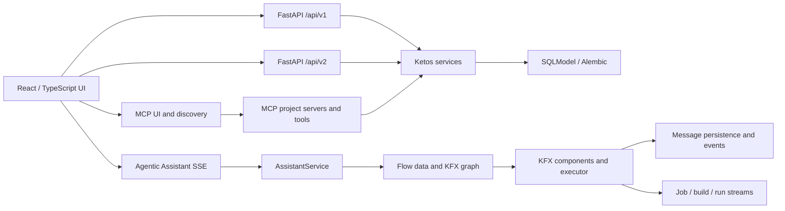

# Ketos: аудит текущей архитектуры

**Baseline:** `redesign/sidebar-account` @ `572fad8ea2223e342508ecf095133091c7714e1b`  
**Состояние дерева до исследования:** чистое  
**Метод:** Git, `rg`, чтение исходников, Graphify, RLM/Aleph, изолированные тесты, Chrome/Computer Use и независимые аудиты; ограничения инструментов описаны в [07](07_TOOL_USAGE_AND_EVIDENCE.md).

## 1. Правила доказательности

- **Факт** — непосредственно подтверждён указанным файлом, маршрутом, моделью, тестом или текущим UI.
- **Вывод** — следствие нескольких фактов; явно обозначен как вывод.
- **Гипотеза** — требует прототипа, нагрузки либо production-like данных.
- **Не проверено** — данных недостаточно; это не трактуется как отсутствие функции.

Карта Graphify построена на `82510d5df3f1959d7eb62332894353242469ed2d`, тогда как исследуемый HEAD — `572fad8...`; она отстаёт на четыре commit. Поэтому карта использовалась для маршрутизации, а каждый существенный вывод перепроверялся по текущим исходникам. Полное обновление карты в этой сессии запрещено правилами установленного Graphify skill; это формальный blocker требования об актуализации, а не скрытое допущение.

## 2. Карта системы



| Область               | Текущая точка входа                                                                           | Состояние относительно целевой концепции                                          |
| --------------------- | --------------------------------------------------------------------------------------------- | --------------------------------------------------------------------------------- |
| Список проектов/flows | `src/frontend/src/pages/MainPage`, `src/frontend/src/components/core/sidebar`                 | Есть проектная оболочка, но нет внешней пространственной Board-модели.            |
| Flow Editor           | `src/frontend/src/pages/FlowPage`, `src/frontend/src/pages/FlowPage/components/PageComponent` | Зрелый редактор одного Flow на базе React Flow/XYFlow.                            |
| Assistant             | `src/frontend/src/components/core/assistantPanel` → `/api/v1/agentic/assist/stream`           | Один controller/session; preview частично реализован.                             |
| Playground chat       | `flow-page-sliding-container.tsx`, legacy `IOModal`                                           | Две параллельные UI-реализации поверх singleton stores.                           |
| Backend               | `src/backend/base/ketos`                                                                      | Единый FastAPI backend уже является правильной базой.                             |
| Исполнение            | `src/kfx`, build/run/v2 workflow routes                                                       | Повторно используемо; stream-контракты фрагментированы.                           |
| Data                  | `src/backend/base/ketos/services/database/models`                                             | Есть Flow/Folder/Message/Job/User/RBAC; нет Board/Placement/Chat/Result.          |
| Desktop               | поиск по репозиторию                                                                          | Tauri-оболочка не обнаружена; текущий OpenSwarm использует Electron, Ketos — нет. |

## 3. Структура репозитория и границы

- `src/backend/base/ketos` — FastAPI application, маршруты `/api/v1`, `/api/v2`, сервисы и модели.
- `src/frontend` — React/TypeScript приложение, Flow Editor, navigation, assistant, playground.
- `src/kfx` — компонентный SDK, graph/runtime, events, ChatInput/ChatOutput и CLI.
- `src/bundles` — официальные extension distributions.
- `scripts`, `tests`, `.github` — проверки, миграционные и CI-контракты.

**Факт:** в репозитории нет отдельного backend канваса. **Рекомендация:** сохранить это свойство и добавлять новые доменные модули в существующий backend.

## 4. Frontend и Flow Editor

### 4.1 Один внутренний canvas, не пространственная рабочая доска

`PageComponent` монтирует editable React Flow и глобальные handlers в `src/frontend/src/pages/FlowPage/components/PageComponent/index.tsx:935-1050`; read-only preview существует в том же компоненте около `:184-206`. `FlowPage` вызывает общий `useFlowStore`; проверенная Graphify-цепочка — `FlowPage() --calls--> useFlowStore`.

**Факты:**

- `flowStore.ts` хранит один текущий граф, единые `nodes`, `edges`, build state и undo/redo history.
- Загрузка другого Flow заменяет этот singleton graph.
- `id="react-flow-id"`, document-level hotkeys, body cursor, clipboard/delete/undo и события заметок рассчитаны на один editor context.
- `useSaveFlow` сохраняет graph data с координатами узлов и viewport-like данными; `useApplyFlowToCanvas` при загрузке вызывает `fitView`, а не точное восстановление пользовательского viewport.

**Вывод:** Flow Editor нельзя просто смонтировать несколько раз в окнах общей доски без изоляции stores, DOM IDs, hotkeys, drag/zoom и lifecycle. Наиболее безопасный первый вариант — один активный полный editor, а остальные placements показывают compact/read-only representation.

### 4.2 Заметки

`NoteNode` — узел внутри `Flow.data`, связанный с координатами и жизненным циклом Flow. Это полезный UI/formatting asset, но не самостоятельная Board Note. Удаление Flow или версии не должно определять жизненный цикл общей заметки.

### 4.3 Навигация и поиск

Sidebar и MainPage дают проекты/flows и account/settings actions. Текущий живой UI на `http://localhost:7860/flows` показал русские «Проекты», «Мои проекты», «Сценарии», «Новый сценарий», но также системную строку `New Project`. Источники: `src/frontend/src/components/core/sidebar/components/sideBarFolderButtons/index.tsx:225` и `src/frontend/src/hooks/flows/use-add-flow.ts:86`.

Поиск фрагментирован: отдельные paths для flows/components; единого индекса Chat/Board/Project/Note/Automation нет.

## 5. Чаты и потоковые протоколы

### 5.1 Assistant

```text
AssistantPanel
 → useAssistantChat
 → usePostAssistStream
 → POST /api/v1/agentic/assist/stream
 → AssistantService.execute_flow_with_validation_streaming
 → data-only SSE
```

Ключевые источники:

- UI/controller: `src/frontend/src/components/core/assistantPanel/assistant-panel.tsx:87-160,355-473`; `hooks/use-assistant-chat.ts:119-164,205-218,263-600`.
- SSE client: `src/frontend/src/controllers/API/queries/agentic/use-post-assist-stream.ts:27-85`.
- Request schema/router: `src/backend/base/ketos/agentic/api/schemas.py:30-40`; `api/router.py:55-154,304-333`.
- Process-local history: `src/backend/base/ketos/agentic/services/conversation_buffer.py:54-133` — до 10 turns и 100 sessions на процесс.
- SSE framing: `src/backend/base/ketos/agentic/helpers/sse.py:8-134` — нет event ID, sequence, heartbeat, replay или `Last-Event-ID`.

**Факт:** один hook владеет одним `AbortController`, `sessionId`, model и message array; `isProcessing` блокирует параллельную отправку. Frontend history в `localStorage` и backend context в RAM расходятся после restart/replica switch.

### 5.2 Playground

Новый `src/frontend/src/pages/FlowPage/components/flow-page-sliding-container.tsx` и legacy `src/frontend/src/modals/IOModal/playground-modal.tsx` сосуществуют. `sessionManagerStore.ts` и `messagesStore.ts` глобальны; `flowStore.ts` содержит один `isBuilding` и build controller. React Query уже умеет ключ `(flowId, sessionId)`, но final state одновременно пишется в legacy Zustand.

KFX цепочка: `src/kfx/src/kfx/components/input_output/chat.py` → `chat_output.py` → `custom/custom_component/component.py:1830-2074`, где создаётся Message, идут token events, затем сохраняется финальный текст.

### 5.3 Четыре несовместимых stream dialect

| Контур            | Протокол                                                     |
| ----------------- | ------------------------------------------------------------ |
| Assistant         | `data: JSON\n\n`, без sequence/replay                        |
| `/run`            | `text/event-stream`, JSON envelope без канонического `data:` |
| Build             | заявлен NDJSON, фактически blank-line-framed JSON records    |
| Deprecated vertex | standards-style `event:`/`data:` SSE                         |
| Voice             | отдельный duplex WebSocket                                   |

Источники: `src/backend/base/ketos/api/build.py:140-323`; `src/frontend/src/stores/buildUtils.ts:157-445`; `src/backend/base/ketos/api/v1/endpoints.py:490-711`; `src/kfx/src/kfx/events/event_manager.py:72-149`; `src/backend/base/ketos/api/v1/chat.py:580-702`; `src/backend/base/ketos/api/v2/workflow.py:145-223` (`stream=true` возвращает 501).

## 6. Модели данных

| Продуктовый объект  | Текущая модель                        | Подтверждённые свойства                                            | Разрыв                                                                                              |
| ------------------- | ------------------------------------- | ------------------------------------------------------------------ | --------------------------------------------------------------------------------------------------- |
| Automation          | `Flow`                                | UUID, owner, folder, data, endpoint, timestamps, `locked`          | `locked` — UI flag, не optimistic revision/lease.                                                   |
| Project             | `Folder`                              | owner, name, `parent_id`                                           | Frontend использует почти плоско; нет pin/archive contract.                                         |
| Version             | `FlowVersion`                         | flow FK, version number, data, active, unique/check constraints    | Нумерация конкурентна; retry ограничен; activation не доказывает синхронизацию всех derived states. |
| Message             | `MessageTable`                        | flow/run/session/context IDs, sender, text, files, error, metadata | Нет immutable `chat_id`; flow FK ранее удалён; нет chat-oriented composite index.                   |
| Session             | строковый `session_id`                | группирует messages                                                | Одновременно identity и title; rename переписывает messages.                                        |
| Execution           | `Job` и run/build state               | status, logical IDs, metadata, dedupe field                        | Некоторые IDs без FK; dedupe check-then-insert; нет first-class result/provenance.                  |
| User/access         | User, API key, RBAC share/role tables | owner и resource-action permissions                                | OSS authorization adapter может пропускать проверки.                                                |
| Board/Placement     | отсутствуют                           | —                                                                  | Требуются новые сущности.                                                                           |
| Board Note/Relation | отсутствуют                           | —                                                                  | Flow NoteNode/edge не подходят семантически.                                                        |

Модели находятся в `src/backend/base/ketos/services/database/models`; Alembic — в backend migration tree. В `MessageTable` rename/delete sessions owner-scoped, но не гарантированно flow-scoped: `src/backend/base/ketos/api/v1/monitor.py:349-413` и `services/database/models/message/crud.py:13-83`. Одинаковый `session_id` в разных flows одного пользователя — подтверждённый риск cross-flow mutation.

## 7. Backend, API и сервисный слой

Существующий FastAPI backend уже имеет правильные reusable seams:

- flow CRUD/build/run и V2 workflow API;
- dependencies/current-user и ownership checks;
- service/repository patterns;
- assistant service и typed schemas;
- MCP project/tool discovery;
- job/event infrastructure;
- Alembic и dual SQLite/PostgreSQL support.

Однако общего application command layer нет. AI assistant, REST и MCP могут применять мутации разными путями. Подтверждённые примеры:

- Assistant умеет формировать preview, но headless path может использовать `apply_edits_immediately=True` и записывать `Flow.data` напрямую.
- KFX MCP destructive tools не имеют общего preview/confirmation contract.
- MCP `batch` не является общей DB-транзакцией и допускает partial success.
- `mcp_enabled` участвует в discovery/filtering, но не доказан как универсальная enforcement-проверка при каждом execute lookup.

**Вывод:** единый `CommandGateway` внутри backend нужен раньше MCP-расширения. REST, Assistant и MCP должны быть адаптерами одной бизнес-границы.

## 8. Версии Flow и AI-изменения

Assistant chain уже создаёт события `flow_preview`/`flow_update`, а UI содержит Continue/confirmation experience. Это ценный прототип R-13/R-14, но не durable proposal:

- нет persisted proposal ID, base revision и apply-once transaction;
- incremental edit может записать `Flow.data` и перетереть параллельную ручную правку;
- FlowVersion activation меняет data/active state, но не подтверждает полное восстановление webhook/cache/deployment derived state;
- build может исполнять переданное request graph data, отличающееся от persisted revision.

Требуется схема `CommandProposal(base_revision, diff, risk, expires_at)` → confirmation token → atomic apply/version/audit/outbox.

## 9. Безопасность, RBAC и аудит

Подтверждённые сильные стороны: authentication dependencies, ownership gates, RBAC resource/action tables, share/role relations, API-key handling, confirmation UI для части assistant edits, component code scanning.

Подтверждённые разрывы:

- OSS authorization service допускает permissive path при определённых конфигурациях; owner override не заменяет granular Board/Chat actions.
- `Flow.locked` — изменяемое поле, не защита от race.
- подтверждение не является общей обязанностью для execute/publish/delete/external side effects.
- AST scanner не является sandbox, network egress или SSRF boundary.
- audit best-effort/off-by-default может терять записи.
- API key material может быть расшифрован и возвращён по текущим управленческим paths; перед расширением AI-команд нужен redaction/capability review.

Для нового домена нужны отдельные `view`, `edit`, `place`, `run`, `share`, `admin` действия и policy для риска компонентов.

## 10. Сохранение состояния, конкуренция и производительность

Текущее состояние распределено между DB Flow/Message/Job, React Query, Zustand, `localStorage`, `sessionStorage` и process-local buffers. Нет одной revisioned Board snapshot или transactional placement update.

Риски, подтверждённые структурой кода:

- частые drag/resize записи могут создать write amplification;
- несколько Flow Editors дублируют graph state, DOM и observers;
- несколько streams конкурируют за singleton controller/store;
- offscreen heavy windows не виртуализированы;
- session/message queries не оптимизированы под immutable chat ID;
- check-then-insert dedupe и read-modify-write metadata дают race.

Гипотеза: сервер хранит authoritative Board/Placement revisions, клиент применяет optimistic patches с debounce + explicit flush on blur/unload; активный editor монтируется один, offscreen windows suspend/lazy-render.

## 11. Локализация и визуальное состояние

- `src/frontend/src/i18n/languages.ts:24-43` регистрирует `en` и `ru`; default — RU.
- `src/frontend/src/i18n/i18n.ts` использует English fallback.
- миграция `9a6e34f1c2d8_restrict_preferred_locale_to_ru_en.py` ограничивает locale.
- Автоматический key audit: RU 2417 keys, EN 2345; в RU отсутствующих ключей нет, в EN отсутствуют 72; 16 идентичных значений в основном технические/brand terms.
- `npm run test:i18n`: Node contract 44 tests и Jest 5 suites/67 tests — PASS.
- Live UI подтвердил смешанный RU/EN (`New Project`).

Референсы OpenSwarm показывают dotted board, minimap, zoom controls, cards/chat/workflow/browser/note surfaces и bottom dock. Это визуальные факты, но не доказательство persistence, streaming или выбранной библиотеки.

## 12. Тестовая база и исходные проверки

| Проверка                     | Результат текущей сессии                                                                                                                 |
| ---------------------------- | ---------------------------------------------------------------------------------------------------------------------------------------- |
| Frontend i18n                | PASS: 44 Node + 67 Jest tests                                                                                                            |
| Focused assistant frontend   | PASS: 4 suites / 25 tests                                                                                                                |
| Backend headless/authz focus | PASS: 19 tests; 1 warning                                                                                                                |
| FlowVersion selected         | PASS: 2 tests; 1 warning                                                                                                                 |
| Broad backend run            | INCONCLUSIVE: вручную прерван на 25% после 77 PASS из-за повторных полных migration setup; последующие teardown errors вызваны interrupt |

По inventory приблизительно: backend ~599 pytest, KFX ~258, Jest ~442, Playwright ~170, Alembic ~80. Это не coverage. Нет достаточных current gates для Board restore/stress, concurrent chats/reconnect, end-to-end AI confirm, browser-level RBAC, rollback, nested editor и large-flow visual/performance.

## 13. Что повторно использовать

**Сохранять:** единый FastAPI backend; Flow/FlowVersion; Flow Editor; KFX component identifiers/runtime; build/run APIs; Message content model; React Query; authentication/RBAC schema; Assistant preview UI; Note styling; i18n infrastructure; migrations/tests.

**Адаптировать:** Folder как Project compatibility layer; Message через новый immutable `chat_id`; Flow preview через persisted proposal; Job/event layer через unified envelope; read-only Flow representation; sidebar/search.

**Не масштабировать как есть:** singleton Flow/Session/Message stores; process-local conversation memory; `session_id` как title; несколько полных editors; fragmented stream dialects; AST scan как security boundary.

## 14. Фактические границы и открытые проверки

- Совместное realtime редактирование/CRDT в текущей архитектуре не обнаружено; нужен продуктовый выбор.
- Production proxy buffering, multi-worker routing, PostgreSQL query plans и реальные memory budgets не проверены.
- Полноэкранный OpenSwarm card в точном репозитории не реализован как отдельная capability; screenshot affordance нельзя считать кодовым фактом.
- Tauri не обнаружен, поэтому отдельный Tauri plan не нужен до изменения desktop strategy.
- Полная текущая Graphify-карта не построена из-за инструментального запрета; влияние и альтернативы зафиксированы в [07](07_TOOL_USAGE_AND_EVIDENCE.md).

## 15. Главные архитектурные выводы

1. Ketos уже содержит исполнительную платформу; новый продуктовый слой должен оркестрировать её, а не заменять.
2. Board и Flow Editor — разные домены и координатные системы.
3. Chat Thread и Placement должны стать независимыми сущностями до многоконного UI.
4. Один full editor + compact previews безопаснее нескольких singleton editors; окончательное решение требует POC.
5. Command Gateway с revision, preview, confirmation, idempotency, audit и outbox должен предшествовать MCP/AI expansion.
6. OpenSwarm полезен как доказанный набор interaction/persistence patterns, но его Electron/MUI/Redux stack нельзя переносить целиком.
7. R-01, R-05, R-17, R-36 и AI apply path требуют исследовательских прототипов до производственной миграции.

Связанные документы: [требования](01_KETOS_REQUIREMENTS.md), [OpenSwarm](03_OPENSWARM_REUSE_ASSESSMENT.md), [критическая оценка](04_KETOS_CRITICAL_ARCHITECTURE_REPORT.md), [план](05_KETOS_IMPLEMENTATION_PLAN.md).
