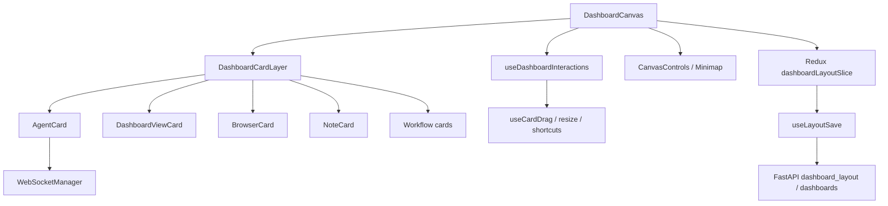

# OpenSwarm: оценка повторного использования для Ketos

**Исследованный репозиторий:** [openswarm-ai/openswarm](https://github.com/openswarm-ai/openswarm)  
**Локальная отдельная копия:** `/Volumes/Projects/OpenSwarm`  
**Ветка и commit:** `main` @ `ab982afcea63dbc775f8a40b74a1b1339a28097f`  
**Состояние копии:** clean; Git history, зависимости и файлы не смешивались с Ketos.

## 1. Идентификация точного проекта

Поиск выявил несколько одноимённых проектов:

| Вариант                                                               | Назначение                                                           | Почему выбран/отклонён                                                                                                                   |
| --------------------------------------------------------------------- | -------------------------------------------------------------------- | ---------------------------------------------------------------------------------------------------------------------------------------- |
| [`openswarm-ai/openswarm`](https://github.com/openswarm-ai/openswarm) | Electron spatial dashboard, cards, agents, chats, browser, workflows | **Выбран:** README, визуальная модель, названия Dashboard/AgentCard, dotted canvas, minimap и card types совпадают с шестью референсами. |
| `unohee/OpenSwarm`                                                    | TUI/daemon для агентов                                               | Нет spatial dashboard и совпадающего UI.                                                                                                 |
| `openswarm-os/openswarm`                                              | Agent OS/web и SSE orchestration                                     | Иная архитектура и визуальная модель.                                                                                                    |

Идентификация основана не на названии: выбранный README прямо описывает Spatial Dashboard, infinite canvas, drag/drop agent/view/browser cards, multiple dashboards и WebSocket streaming chat. Скриншоты сами по себе не доказывают происхождение кода; совпадение подтверждено исходными компонентами.

## 2. Технологический и лицензионный профиль

| Аспект        | Факт                                                                 |
| ------------- | -------------------------------------------------------------------- |
| Desktop shell | Electron                                                             |
| Frontend      | React 18, TypeScript, Redux Toolkit, MUI 7, Framer Motion, Webpack   |
| Backend       | Python/FastAPI applications и JSON-backed local persistence          |
| Canvas        | Собственный DOM/CSS-transform compositor; React Flow не используется |
| Streaming     | Общий WebSocket manager для agent chat                               |
| License       | MIT License, copyright 2026 Haik Decie                               |

MIT допускает использование, копирование, изменение, публикацию, распространение, sublicense и продажу, но требует включать copyright notice и permission notice во все копии или существенные части Software. Гарантии отсутствуют. Это не юридическое заключение; перед включением кода нужен dependency/SBOM и provenance review.

**Практическое следствие:** идеи и patterns можно использовать свободно; при копировании существенных фрагментов Ketos должен сохранить MIT notice и отразить provenance в third-party notices. Переписывание interaction logic по спецификации снижает связанность, но не отменяет проверку фактического происхождения заимствованных фрагментов.

## 3. Архитектурная карта OpenSwarm

Ключевые frontend paths:

- `frontend/src/app/pages/Dashboard/canvas/DashboardCanvas.tsx`
- `frontend/src/app/pages/Dashboard/canvas/DashboardCardLayer.tsx`
- `frontend/src/app/pages/Dashboard/canvas/useDashboardInteractions.ts`
- `frontend/src/app/pages/Dashboard/canvas/useCardDrag.ts`
- `frontend/src/app/pages/Dashboard/canvas/useCanvasControls.ts`
- `frontend/src/app/pages/Dashboard/canvas/CanvasControls.tsx`
- `frontend/src/app/pages/Dashboard/canvas/Minimap.tsx`
- `frontend/src/app/pages/Dashboard/cards/AgentCard*`
- `frontend/src/app/pages/Dashboard/cards/DashboardViewCard*`
- `frontend/src/app/pages/Dashboard/cards/BrowserCard*`
- `frontend/src/app/pages/Dashboard/cards/NoteCard*`
- `frontend/src/app/store/dashboardLayoutSlice.ts`
- `frontend/src/app/store/dashboardsSlice.ts`
- `frontend/src/app/store/agentsSlice.ts`
- `frontend/src/app/store/streamingSlice.ts`
- `frontend/src/app/pages/Dashboard/hooks/useLayoutSave.ts`

Backend paths:

- `backend/apps/dashboard_layout/`
- `backend/apps/dashboards/models.py`
- `backend/apps/dashboards/dashboards.py`
- agent/chat WebSocket application modules
- workflow application modules

## 4. Canvas и взаимодействия

`DashboardCanvas.tsx` применяет `transform: translate(...) scale(...)` к DOM layer, рисует dotted background и подключает minimap/control overlays. `useDashboardInteractions` разделяет pan/zoom/selection; `useCardDrag` обновляет positions; pointer/keyboard paths и overlay wheel passthrough уменьшают конфликт card content с canvas.

Полезные patterns:

- gesture updates батчатся через animation frame;
- card movement отделено от содержимого card;
- zoom-to-point и viewport controls имеют отдельный controller;
- offscreen/heavy webviews могут suspend;
- bring-to-front избегает записи, если card уже сверху;
- layout save debounce + explicit flush;
- minimap строится из общего layout state.

Ограничения:

- compositor связан с Redux state shape, Electron webviews и MUI cards;
- DOM transform масштабирует также текст/inputs, что создаёт UX/a11y компромиссы на экстремальном zoom;
- полноценной window virtualization и production-like large-object benchmark не доказано;
- nested Flow Editor/XYFlow отсутствует, поэтому основной риск Ketos проектом не решён;
- screenshot «fullscreen» нельзя приписывать коду: в исследованном состоянии подтверждён expand, но не отдельная законченная fullscreen capability.

## 5. Модель данных и persistence

`backend/apps/dashboards/models.py` определяет структуры примерно следующего уровня:

- `CardPosition`: `session_id`, `x`, `y`, `width`, `height`;
- view/browser/note/workflow card positions;
- `DashboardLayout`: массивы card types и expanded IDs;
- `Dashboard`: `id`, `name`, timestamps, layout, thumbnail.

`dashboards.py` загружает/сохраняет JSON, использует atomic file write и миграцию старого layout. Это удачно для desktop single-user local app, но не является достаточной моделью для multi-user Ketos:

- нет DB FK и granular RBAC;
- нет optimistic revision/CAS;
- entity и placement местами связаны через type-specific arrays;
- отсутствует транзакционность с доменными объектами Ketos;
- файл не решает replica/concurrent edit.

Поэтому копировать storage layer нельзя; можно перенести save-controller semantics и тестовые сценарии.

## 6. Chat architecture

`AgentCard`/`AgentChat` реализуют card-local UI и используют shared WebSocket manager. Визуально это близко к референсу: header, history, composer, model/status controls. Для Ketos полезны composition и window-local lifecycle.

Прямой перенос нецелесообразен:

- OpenSwarm chat связан с его Agent/session model и WebSocket envelope;
- Ketos уже имеет Message, KFX ChatInput/Output, Assistant SSE, build/run streams и permissions;
- перенос второго backend/transport нарушит ограничение единого backend;
- MUI/Redux styling конфликтует с текущей дизайн-системой Ketos.

Рекомендация: реализовать Ketos `ChatWindow` поверх собственного `ChatThread` и per-window controller, используя OpenSwarm только как UX/reference и источник отдельных MIT-attributed interaction patterns.

## 7. Матрица повторного использования

| Элемент                         | Решение                                              | Обоснование и Ketos target                                                 |
| ------------------------------- | ---------------------------------------------------- | -------------------------------------------------------------------------- |
| Pan/zoom math                   | **Перенести с адаптацией или переписать по pattern** | Независимо от Electron; сравнить с outer XYFlow POC.                       |
| Dotted background               | **UI pattern**                                       | Тривиально воспроизводится в Ketos tokens.                                 |
| RAF gesture batching            | **Перенести pattern**                                | Снижает render churn; покрыть pointer tests.                               |
| Minimap geometry                | **Перенести с адаптацией**                           | Нужна generic Placement model и semantic relation bounds.                  |
| Zoom controls                   | **UI pattern**                                       | Переписать на Ketos components/i18n/a11y.                                  |
| Card drag/resize                | **Переписать**                                       | Нужны revision, permissions, keyboard и nested canvas isolation.           |
| Z-order/no-op bring-to-front    | **Перенести pattern**                                | Хорошо ложится на Placement.z_index и patch API.                           |
| Expanded state                  | **Перенести pattern**                                | Разделить maximize/fullscreen и persisted/transient state.                 |
| Fullscreen                      | **Не переносить как готовое**                        | Исследованный код не подтверждает законченный reusable module.             |
| AgentChat UI                    | **Использовать как интерфейсный референс**           | Backend/state несовместимы; Ketos controller нужен заново.                 |
| WebSocket manager               | **Не переносить**                                    | Ketos сначала унифицирует собственный SSE; WS оставить voice.              |
| Streaming sequence/replay ideas | **Адаптировать**                                     | Встроить `request_id/sequence/replay` в единый Ketos envelope.             |
| BrowserCard/webview             | **Отложить/отказаться в web MVP**                    | Electron `<webview>` неприменим и опасен без allowlist/sandbox.            |
| NoteCard surface                | **UI pattern**                                       | Ketos создаёт BoardNote; редактор может переиспользовать свой Note UI.     |
| DashboardViewCard               | **Архитектурный референс**                           | Вложенные boards требуют cycle/recursion policy; не MVP.                   |
| Workflow cards/hub              | **UI pattern**                                       | Исполнение и данные должны остаться Ketos Flow/KFX.                        |
| Redux slices                    | **Не переносить напрямую**                           | Ketos stores/query architecture иная; нужен normalized placement registry. |
| JSON file persistence           | **Не переносить**                                    | Не соответствует DB/RBAC/concurrency Ketos.                                |
| Debounced save + flush          | **Перенести pattern**                                | Добавить revision/CAS, server ack и recovery tests.                        |
| Electron shell                  | **Отказаться**                                       | Ketos Tauri/Electron shell отсутствует; scope — web-first.                 |
| E2E multi-window stress         | **Адаптировать тестовый сценарий**                   | Нужен Playwright benchmark с chat/editor isolation.                        |

## 8. Качество, тесты и стоимость адаптации

В OpenSwarm обнаружены backend tests и E2E, включая `multi-window-stress.spec.ts`. Это повышает доверие к отдельным interaction patterns, но не доказывает Ketos-совместимость.

| Вариант                             |   Начальная скорость |            Риск интеграции | Долгосрочная поддержка | Вердикт                |
| ----------------------------------- | -------------------: | -------------------------: | ---------------------: | ---------------------- |
| Полный fork canvas+backend          |              Средняя |              Очень высокий |          Очень высокая | Отказаться             |
| Копирование frontend subsystem      | Быстрая демонстрация |                    Высокий |                Высокая | Не рекомендовано       |
| Выборочные MIT-attributed utilities |              Средняя |                    Средний |                Средняя | Допустимо после POC    |
| Независимая реализация по patterns  |        Медленнее POC |              Низко-средний |                   Ниже | Рекомендуется          |
| Outer XYFlow Ketos                  |          Быстрый POC | Риск nested gestures/store |                Средняя | Сравнить экспериментом |

## 9. Обязательные эксперименты перед выбором

1. **Canvas A/B:** custom DOM compositor по OpenSwarm patterns против outer XYFlow на 100/500/1000 placements.
2. **Nested editor:** pan/zoom/wheel/pinch/drag/keyboard isolation; один active editor и два previews.
3. **Heavy windows:** 10 concurrent chat cards, 3 compact Flow previews, 1 full editor; FPS/heap/long tasks.
4. **Persistence:** drag storm, debounce, offline/reconnect, stale revision conflict, reload accuracy.
5. **Accessibility:** keyboard move/resize, focus trap, zoomed text, reduced motion.
6. **License trace:** точный перечень перенесённых файлов/фрагментов, notices и transitive licenses.

## 10. Итоговая рекомендация

OpenSwarm подтверждает жизнеспособность пространственного UX, но не является архитектурным фундаментом Ketos. Следует:

1. сохранить единый backend и Flow/KFX runtime Ketos;
2. ввести generic Board/Placement domain в Ketos DB;
3. сравнить outer compositor implementations прототипом;
4. адаптировать RAF, viewport math, minimap, save/flush и window-state patterns;
5. переписать cards/chat/navigation на Ketos components, i18n, RBAC и streams;
6. не переносить Electron, JSON storage, Agent backend, MUI/Redux subsystem и browser webview;
7. сохранять MIT notice для любого существенного скопированного кода.

Это решение соответствует статусам R-02 «сохранить», R-03/R-04 «изменить» в [04](04_KETOS_CRITICAL_ARCHITECTURE_REPORT.md).
