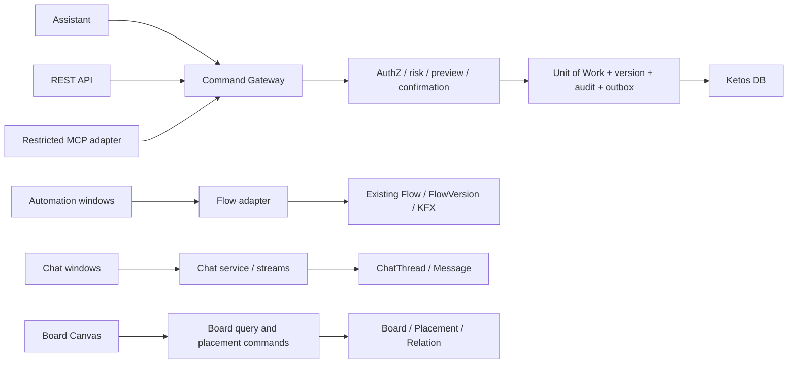

# Ketos: критический архитектурный отчёт

**Baseline:** `redesign/sidebar-account` @ `572fad8ea2223e342508ecf095133091c7714e1b`  
**Нормативная формулировка требований:** [01](01_KETOS_REQUIREMENTS.md)  
**Фактическая архитектура:** [02](02_KETOS_CURRENT_ARCHITECTURE_AUDIT.md)  
**OpenSwarm:** [03](03_OPENSWARM_REUSE_ASSESSMENT.md)

## 1. Резюме решения

Сохраняется единый backend Ketos и существующее ядро Flow/KFX. Новая пространственная среда должна быть модулем Ketos, а не fork OpenSwarm и не оболочкой из нескольких текущих singleton Flow Editors. Необходимые первые доменные разрезы:

1. `Project` (совместимый адаптер над `Folder`) → `Board` → `Placement`;
2. `ChatThread` → `Message`, независимо от `ChatPlacement`;
3. `Automation` как продуктовая проекция существующего `Flow`, независимо от `AutomationPlacement`;
4. `Execution` → `ExecutionResult`;
5. `CommandProposal` → confirmation → `CommandExecution`/audit/outbox;
6. `BoardRelation`, строго отдельно от Flow edge.

Главная коррекция исходной концепции: одновременно полностью активные Flow Editors не должны считаться целью. Цель — несколько automation windows, но только один full editor активен; остальные лениво монтируются как preview/summary. Возможность большего числа активных editors оставляется эксперименту.

## 2. Рекомендуемая целевая архитектура

### 2.1 Управление приложением через AI

| Вариант                                               | Сложность       | Безопасность/транзакция                                | Preview/confirm/audit/rollback | Вывод                   |
| ----------------------------------------------------- | --------------- | ------------------------------------------------------ | ------------------------------ | ----------------------- |
| Внутренний application command layer                  | Средняя         | Лучшая: одна Unit of Work и policy boundary            | Нативно                        | **Обязательная основа** |
| Только существующие API                               | Низкая сначала  | Мутации разнородны; orchestration и partial failures   | Потребует дублирования         | Недостаточно            |
| MCP как внутренняя основа                             | Средне-высокая  | Tool discovery не равен authorization; batch не atomic | Сложнее гарантировать          | Отказаться как от ядра  |
| Гибрид: Command Gateway + REST/Assistant/MCP adapters | Высокая сначала | Единые contracts и минимальный MCP registry            | Полный контракт                | **Рекомендуется**       |

MCP полезен для внешних clients после появления Command Gateway. Для управления самим Ketos frontend может использовать typed REST/stream APIs без обязательной MCP-петли.

### 2.2 Целевые данные

| Сущность           | Основные поля/ограничения                                                             |
| ------------------ | ------------------------------------------------------------------------------------- |
| `Board`            | project/workspace, title, revision, archived, timestamps, owner                       |
| `BoardViewport`    | board+user unique, x/y/zoom, active/focused placement, revision                       |
| `Placement`        | board, object_type/object_id, x/y/w/h/z, display_state, revision; unique placement ID |
| `ChatThread`       | immutable ID, title, model config, context policy, owner/project, archived, revision  |
| `Message`          | new FK `chat_id`; legacy flow/session compatibility fields during migration           |
| `BoardNote`        | content/version/format independent of Flow data                                       |
| `BoardRelation`    | typed source/target object refs; never executable                                     |
| `ExecutionResult`  | execution ID, type/schema, storage ref/redacted payload, provenance, status           |
| `CommandProposal`  | actor/scope/type/version, base revision, diff, risk, expiry, status                   |
| `CommandExecution` | idempotency key, confirmation use, before/after revisions, outcome/audit/outbox       |

## 3. Метод оценки R-01–R-40

В каждом заключении поля сгруппированы, но присутствуют обязательные аспекты: статус; текущее состояние и evidence; совместимость/решение/альтернатива; frontend/backend/data/API/migration/dependencies; blockers/risks/security/performance/Langflow; измеримая приёмка, confidence и unresolved. Пути ниже дополняются подробными evidence в [02](02_KETOS_CURRENT_ARCHITECTURE_AUDIT.md).

## 4. Заключения по требованиям

### R-01 — бесконечный канвас

- **Статус:** `требуется эксперимент`. **Состояние:** внешний Board Canvas отсутствует; координаты узлов сохраняет только Flow Editor. Evidence: `FlowPage/components/PageComponent`, `flowStore.ts`, `useSaveFlow`; OpenSwarm `DashboardCanvas.tsx` использует CSS translate/scale.
- **Совместимость/решение:** отдельный Board Canvas с generic placements; сравнить custom DOM compositor и outer XYFlow. Не использовать Flow graph как board state.
- **Impact:** новый frontend `features/boards`; backend board service; `Board/Viewport/Placement`; `/api/v1/boards/*`; expand/backfill migration. Зависит от P0 canvas и persistence POC.
- **Риски:** nested gestures, precision, write amplification, a11y; permission на edit placement; lazy rendering обязателен. Flow/KFX не меняются.
- **Приёмка:** restore x/y ≤1 px и zoom ≤0.01; 500 placements pan/zoom p95 frame ≤16.7 ms на test profile; 1000-object degraded threshold задан до build. **Уверенность:** высокая о разрыве, средняя о compositor. **Открыто:** окончательная библиотека и device budget.

### R-02 — исследовать OpenSwarm

- **Статус:** `сохранить`. **Состояние/evidence:** точный `openswarm-ai/openswarm` клонирован отдельно в `/Volumes/Projects/OpenSwarm`, `main@ab982af...`; исследованы canvas/cards/chat/state/backend/license, см. [03](03_OPENSWARM_REUSE_ASSESSMENT.md).
- **Решение:** зафиксировать provenance и MIT notice; использовать findings как вход P0. Альтернатива — отказаться от code reuse, сохранив UX reference.
- **Impact:** source Ketos не меняется; data/API/migrations отсутствуют; зависимость только исследовательская.
- **Риски:** ошибочное приравнивание screenshots к capability и transitive licenses. Security/performance оцениваются до копирования.
- **Приёмка:** URL/commit/license/key files/reuse matrix воспроизводимы. **Уверенность:** высокая. **Открыто:** dependency legal/SBOM review при фактическом копировании.

### R-03 — перенос канваса OpenSwarm

- **Статус:** `изменить`. **Состояние:** reusable patterns есть, но stack Electron/MUI/Redux/JSON storage несовместим с Ketos; nested Flow Editor OpenSwarm не решает.
- **Решение:** переносить только viewport math/RAF/minimap/save patterns после A/B POC; cards/state/backend переписать. Альтернатива — outer XYFlow.
- **Impact:** те же Board frontend/backend/data/API/migrations, что R-01; provenance notice при кодовом переносе.
- **Риски:** maintenance fork, DOM zoom текста, Electron webview security, stale revision; прямой перенос ухудшит Langflow compatibility косвенно через второй state/runtime.
- **Приёмка:** оба прототипа проходят единый benchmark, ADR объясняет выбор и лицензирование. **Уверенность:** высокая. **Открыто:** доля заимствованного кода.

### R-04 — чатовые окна OpenSwarm

- **Статус:** `изменить`. **Состояние:** AgentCard/AgentChat визуально полезны, но связаны с OpenSwarm Agent/WebSocket/Redux; Ketos имеет собственные Message/KFX/Assistant paths.
- **Решение:** создать Ketos `ChatWindow` по UX-pattern, не переносить backend/transport. Альтернатива — адаптировать текущий Playground chat shell.
- **Impact:** frontend ChatWindow/controller; backend Chat service; `ChatThread` и `Message.chat_id`; `/chats`; dual-write migration. Зависит от R-07.
- **Риски:** protocol fragmentation, license notices, styling/a11y. Performance проверяется 10 streams; KFX остаётся producer.
- **Приёмка:** visual states из references + Ketos tokens/i18n; ни одного OpenSwarm backend runtime dependency. **Уверенность:** высокая. **Открыто:** какой текущий Ketos chat UI станет базой.

### R-05 — несколько независимых чатов

- **Статус:** `требуется эксперимент`. **Состояние:** Assistant и Playground используют singleton controller/store/build state; Message не имеет chat entity.
- **Решение:** per-window `ChatController(chatId)`, изолированные query keys/AbortController/model/stream; один normalized registry. Альтернатива — iframe/process isolation неприемлема как default.
- **Impact:** assistantPanel/playground refactor; Chat service; ChatThread/Message FK; stream API с request/sequence; expand+dual-write+backfill. Зависит R-07 и unified stream.
- **Риски:** token cross-talk, cancel leakage, memory, permission leakage. KFX compatibility через legacy session alias.
- **Приёмка:** 10 одновременных чатов, 0 cross-delivered events, cancel одного не влияет на 9, reconnect outcome детерминирован. **Уверенность:** высокая о blocker, средняя о capacity. **Открыто:** supported concurrency tier.

### R-06 — управление окном чата

- **Статус:** `разделить`. **Состояние:** Assistant resize/floating частично есть; move/minimize/fullscreen/persisted placement отсутствуют.
- **Решение:** этап 1 move/resize/z/close; этап 2 collapse/maximize/fullscreen/keyboard. `display_state` разделить на persisted и transient focus.
- **Impact:** Board CardFrame/ChatWindow; placement patch endpoint/model; migration только после Board tables. Зависит R-01/R-07.
- **Риски:** resize storm, focus traps, mobile, authorization; debounce+revision required. Нет изменений Flow/KFX.
- **Приёмка:** pointer+keyboard move/resize, min sizes, focus restore, reload exactness, close не удаляет chat. **Уверенность:** высокая. **Открыто:** fullscreen route vs portal.

### R-07 — данные чата

- **Статус:** `изменить`. **Состояние:** `MessageTable` имеет `session_id`, flow/run/context, но нет Chat; selected model глобален/локален; rename переписывает session IDs.
- **Решение:** immutable `ChatThread`; model/context versioned; placement отдельно. Альтернатива — расширить session metadata — отвергается из-за identity/title collision.
- **Impact:** chat frontend queries; backend repository; new table+FK/index; `/chats` CRUD; dual-read/write and backfill by owner+flow+session.
- **Риски:** ambiguous legacy grouping, privacy/context retention, million-message index cost. KFX временно пишет оба ID.
- **Приёмка:** rename не меняет message identity; `(chat_id, created_at)` indexed; restart сохраняет model/context/history. **Уверенность:** высокая. **Открыто:** правила объединения legacy assistant/playground histories.

### R-08 — отделение чата от размещения

- **Статус:** `сохранить`. **Состояние:** отдельной placement модели нет; текущий UI lifecycle смешан с session state.
- **Решение:** `Placement(object_type=chat, object_id=ChatThread.id)`; remove placement и delete chat — разные commands. Альтернатива — embedded layout в chat — отклонена из-за нескольких boards.
- **Impact:** Board store/service; Chat service проверяет references; placement API + guarded delete; migrations с FK-by-service/polymorphic checks. Зависит R-07/R-26.
- **Риски:** orphan references, cascade mistakes, RBAC mismatch; delete требует preview/confirm. Performance — indexed refs.
- **Приёмка:** чат можно разместить на двух boards; закрытие одного окна сохраняет оба chat/history и второе placement. **Уверенность:** высокая. **Открыто:** допускаются ли duplicate placements на одной board.

### R-09 — чаты в sidebar

- **Статус:** `разделить`. **Состояние:** sidebar projects/flows есть, chat registry/search нет.
- **Решение:** сначала recents/create/rename/open; затем search/archive/pinning. Альтернатива — только global search palette.
- **Impact:** sidebar components/hooks; `/chats?project`; ChatThread title/archive/index; migration R-07. Зависит Chat CRUD.
- **Риски:** navigation overload, N+1 counts, permission leaks; virtualized list and scoped queries. Langflow routes сохраняются.
- **Приёмка:** 1k chats list/search p95 target ≤300 ms server-side; keyboard open; RU/EN parity; unauthorized titles absent. **Уверенность:** высокая. **Открыто:** sidebar density and grouping UX.

### R-10 — AI-генерация Automation

- **Статус:** `требуется эксперимент`. **Состояние:** Assistant умеет работать с component registry/flow data, но durable proposal/base revision нет; headless path может применять сразу.
- **Решение:** planner produces typed proposal against registry snapshot; server validates graph; preview/confirm creates FlowVersion. Альтернатива — generate template then manual edit.
- **Impact:** Assistant UI/service, CommandGateway, Flow adapter; proposal/execution tables; `/command-proposals`; migration new tables. Зависит R-13–R-15.
- **Риски:** invalid/unsafe graph, prompt injection, obsolete components, cost; deny arbitrary code and secrets. KFX class IDs preserved.
- **Приёмка:** curated corpus with schema-valid/buildable rate threshold agreed ≥90%, 0 apply before confirm, provenance stored. **Уверенность:** средняя. **Открыто:** model/provider and corpus.

### R-11 — уточняющие вопросы

- **Статус:** `изменить`. **Состояние:** conversation UI есть, но формального ambiguity protocol/state нет.
- **Решение:** не жёстко 3–5, а 0–5 по validated missing fields; questions persisted in proposal state. Альтернатива — structured form for known automation types.
- **Impact:** assistant message parts and proposal service/schema/API; no separate migration beyond proposal JSON/version. Depends R-10.
- **Риски:** unnecessary friction, prompt loops, leaking context; authorization before describing resources. Negligible performance.
- **Приёмка:** complete requests ask 0; seeded ambiguous cases ask only missing fields; answer resumes same proposal ID. **Уверенность:** средняя. **Открыто:** product rubric for ambiguity.

### R-12 — AI-редактирование Automation

- **Статус:** `разделить`. **Состояние:** incremental edits and flow updates exist but can overwrite concurrent manual data and bypass common invariants.
- **Решение:** phase 1 parameter/node/edge commands; phase 2 replace/subgraph transformations; always base revision + server graph validation. Alternative — draft clone.
- **Impact:** Assistant/Flow Editor diff UI; Flow command handlers; Proposal+FlowVersion; apply endpoint; migration proposal tables. Depends R-13–R-15.
- **Риски:** lost update, broken handles, secrets, unsafe components; optimistic conflict and component policy. Preserve serialized Flow schema/class names.
- **Приёмка:** property-based graph invariants; stale base returns 409/no mutation; confirmed edit creates one version. **Уверенность:** высокая о architecture, средняя о generation quality. **Открыто:** supported edit vocabulary v1.

### R-13 — структурированный preview

- **Статус:** `сохранить`. **Состояние:** Assistant already emits `flow_preview`, но preview не durable/authoritative.
- **Решение:** canonical server diff of nodes/edges/params/risk/side effects, stored with hash/base revision. Альтернатива — client diff — недостаточно доверен.
- **Impact:** current preview UI adapted; CommandGateway diff engine; proposal model/API; migrations new table. Depends command schemas.
- **Риски:** secret exposure and misleading derived diff; redact sensitive values, validate permissions at preview and apply.
- **Приёмка:** preview hash matches applied command; sensitive fixtures redacted; exact changed IDs enumerable. **Уверенность:** высокая. **Открыто:** human-readable component-specific summaries.

### R-14 — явное подтверждение

- **Статус:** `сохранить`. **Состояние:** Continue UI частично есть, но нет one-time server confirmation bound to proposal/revision/actor.
- **Решение:** expiring confirmation token, single-use transaction and risk policy. Alternative — modal-only confirmation rejected.
- **Impact:** assistant/modals; confirmation service; proposal status/token hash; `/confirm`; migration. Depends R-13.
- **Риски:** replay, confused deputy, approval after state drift; re-authorize at apply, 409 on drift, audit denial/expiry.
- **Приёмка:** replay creates ≤1 mutation; wrong actor/revision/expired token denied; cancellation leaves Flow unchanged. **Уверенность:** высокая. **Открыто:** MFA step-up classes.

### R-15 — версии и rollback

- **Статус:** `изменить`. **Состояние:** `FlowVersion` exists with active/version/data; activation may not synchronize all derived webhook/cache/deployment state.
- **Решение:** reuse FlowVersion, harden atomic numbering/activation and add provenance; rollback creates/activates a new auditable revision rather than erasing history.
- **Impact:** version UI/service; FlowVersion fields/index/outbox possibly; version API; backward-compatible migration. Depends Flow adapter/CommandGateway.
- **Риски:** concurrent number race, stale derived artifacts, secrets; permission+confirmation for rollback. Flow schema unchanged.
- **Приёмка:** concurrent creation unique; rollback restores graph hash and refreshes declared derived states; audit chain intact. **Уверенность:** high/medium on derived coverage. **Открыто:** exact deployment/webhook cache inventory.

### R-16 — Automation placement

- **Статус:** `сохранить`. **Состояние:** Flow exists; board placement absent.
- **Решение:** generic Placement references Flow ID and renders compact status/preview; never embeds coordinates in Flow.data. Alternative — screenshot-only tile.
- **Impact:** AutomationCard; Board/Flow query; Placement data/API/migration. Depends Board domain.
- **Риски:** stale thumbnails/status and permission changes; server scoped queries, no secret params in preview. Lazy render protects performance; Flow compatible.
- **Приёмка:** same Flow on two boards with independent geometry; Flow edit reflected in both without layout change. **Уверенность:** высокая. **Открыто:** preview representation.

### R-17 — Flow Editor внутри окна

- **Статус:** `требуется эксперимент`. **Состояние:** singleton store, global IDs/hotkeys, fitView, document handlers make direct multi-mount unsafe.
- **Решение:** POC focus boundary; one active editor via portal/route-in-card, other windows preview. Alternative: editor always fullscreen, board window only summary.
- **Impact:** PageComponent/store context/IDs/hotkeys; backend/data/API unchanged except placement active state. Depends R-01/R-16.
- **Риски:** wheel/pinch/drag conflict, memory, undo cross-talk, accessibility. No KFX schema change.
- **Приёмка:** 100 scripted nested gestures produce 0 outer/inner unintended moves; undo affects only active Flow; mount/unmount leak budget defined. **Уверенность:** высокая о risk, средняя о solution. **Открыто:** feasibility of store scoping.

### R-18 — ручное создание Flow

- **Статус:** `сохранить`. **Состояние:** core Flow Editor already supports manual graph editing.
- **Решение:** retain full route/editor; Board adds navigation, not replacement. Alternative absent.
- **Impact:** minimal frontend route integration; backend/data/API/migrations none. Dependency: regression gates.
- **Риски:** AI-first UI hiding manual path; permissions remain explicit. Performance/compatibility protected by keeping current route.
- **Приёмка:** legacy manual create/edit/save/run E2E passes with feature flag on/off; no component class rename. **Уверенность:** высокая. **Открыто:** none beyond current regressions.

### R-19 — fullscreen editor

- **Статус:** `сохранить`. **Состояние:** dedicated FlowPage already provides full editor experience.
- **Решение:** treat existing route as canonical fullscreen; card action navigates with return-to-board context. Alternative portal fullscreen.
- **Impact:** navigation/return state; backend/data/API unchanged; optionally BoardViewport active placement. Depends R-16.
- **Риски:** unsaved board/editor state and back navigation; flush placement and Flow separately. Security same Flow edit permission.
- **Приёмка:** enter/exit preserves board viewport and unsaved-state prompts; direct deep link works. **Уверенность:** высокая. **Открыто:** browser history UX.

### R-20 — запуск с доски

- **Статус:** `сохранить`. **Состояние:** build/run APIs and Flow execution exist; board trigger absent.
- **Решение:** card invokes same authorized execution service with persisted Flow revision and idempotency key. Alternative opens Playground first.
- **Impact:** AutomationCard action; execution adapter; Job/Execution provenance extension; `/executions`; migration if new Execution table. Depends R-16/R-21/R-39.
- **Риски:** stale/request graph mismatch, double click, unsafe side effects; preview/confirm by component risk. Preserve existing run API via adapter.
- **Приёмка:** double-click one key creates one execution; unauthorized denied; recorded revision hash equals executed graph. **Уверенность:** высокая. **Открыто:** whether Job evolves or new Execution projection.

### R-21 — состояния исполнения

- **Статус:** `сохранить`. **Состояние:** build/job/run показывают часть statuses, но streaming dialects различны, V2 streaming не реализован, disconnect state не формализован.
- **Решение:** единая execution state machine и envelope `request_id/sequence/type/status`; frontend projection per execution. Альтернатива — adapters над dialects как временный этап.
- **Impact:** card/status components, stream client; Job/Execution service; status/provenance fields and events API; backward-compatible migration. Depends unified execution contract.
- **Риски:** out-of-order/duplicate events, false success, reconnect; authorize event subscription and redact payload. Sequence/replay improve reliability; KFX events adapted, не удалены.
- **Приёмка:** contract tests всех transitions; forced disconnect recovers or shows explicit `unknown`; duplicate sequence ignored. **Уверенность:** высокая. **Открыто:** retention/replay window.

### R-22 — результаты рядом с Automation

- **Статус:** `разделить`. **Состояние:** outputs/messages/job results exist transiently or in subsystem-specific data; first-class Result/Placement отсутствуют.
- **Решение:** phase 1 immutable result metadata/card; phase 2 typed document/form renderers and placement command. Alternative — link to run detail only.
- **Impact:** ResultCard/renderers; execution/result service; `ExecutionResult` + Placement; `/executions/{id}/results`; new migration. Depends R-20/R-21.
- **Риски:** huge payloads, PII/secrets, unsafe HTML/files; storage refs, schema registry, redaction/permissions. Lazy content. Flow/KFX outputs wrapped, not changed.
- **Приёмка:** result provenance links exact execution/revision; payload size/type limits; unauthorized download denied; placement survives reload. **Уверенность:** средне-высокая. **Открыто:** artifact storage backend and renderer whitelist.

### R-23 — заметки

- **Статус:** `изменить`. **Состояние:** NoteNode supports useful editing inside Flow, but is persisted as Flow node.
- **Решение:** independent `BoardNote` with reusable editor/styles; Placement owns geometry. Alternative — generic document service later.
- **Impact:** NoteCard/editor extraction; note service; BoardNote+version/Placement; CRUD API; migration only for new notes, no automatic Flow Note conversion initially. Depends Board.
- **Риски:** XSS/rich text, autosave conflicts, content size; sanitize and optimistic revision. Flow NoteNode remains compatible and semantically distinct.
- **Приёмка:** format/move/resize/reload; stale edit conflict; sanitized paste corpus; deleting placement preserves note. **Уверенность:** высокая. **Открыто:** Markdown vs structured rich-text canonical form.

### R-24 — смысловые связи

- **Статус:** `требуется эксперимент`. **Состояние:** only executable Flow edges; no cross-object relation domain.
- **Решение:** typed `BoardRelation` plus separate SVG/canvas layer; no execution effect. Alternative phase 1 metadata links without lines.
- **Impact:** relation renderer/selection; relation service; source/target typed refs; CRUD/batch API; new migration. Depends stable object IDs/Board.
- **Риски:** visual clutter, polymorphic referential integrity, permission inference, rendering scale. Filter/virtualize; both endpoints must be visible-permitted. No Flow edge reuse.
- **Приёмка:** 1k relations benchmark; forbidden target never leaks title; relation deletion leaves objects; explicit type legend. **Уверенность:** средняя. **Открыто:** required relation types and directionality.

### R-25 — отделение смысловых и исполнительных рёбер

- **Статус:** `сохранить`. **Состояние:** today only Flow edges; tempting reuse would create semantic ambiguity.
- **Решение:** separate tables, APIs, stores, render layers and visual grammar. Alternative rejected: edge `kind` inside Flow data.
- **Impact:** Board relation modules only; Flow Editor unchanged; new BoardRelation migration/API. Depends R-24.
- **Риски:** accidental command translation and permissions; type-system/API namespace separation. Minimal performance impact.
- **Приёмка:** Board relation mutations cannot change Flow hash; Flow execution ignores BoardRelation corpus; tests enforce imports/contracts. **Уверенность:** высокая. **Открыто:** none.

### R-26 — несколько досок

- **Статус:** `сохранить`. **Состояние:** Folder/Flow exist, Board absent.
- **Решение:** Project owns many Boards; create/archive separately. Alternative one board per project rejected as limiting.
- **Impact:** board routes/sidebar; Board service/model/API/migration. Depends Project compatibility and RBAC.
- **Риски:** orphan/default board migration, list scaling, access inheritance. Indexed project+archive; Flow compatibility unaffected.
- **Приёмка:** create ≥20 boards/project, isolated viewport/placements, archive restore, permission filtering. **Уверенность:** высокая. **Открыто:** default board policy for legacy projects.

### R-27 — состояние каждой доски

- **Статус:** `сохранить`. **Состояние:** no Board state; current editor graph coordinates and fitView do not satisfy per-user viewport restore.
- **Решение:** server Board/Placement plus per-user BoardViewport; revisioned patches and flush. Alternative localStorage-only rejected.
- **Impact:** board store/controllers; Board/Viewport service and tables; patch/snapshot API; migration. Depends R-01/R-26.
- **Риски:** write storms, stale tabs, device-specific viewport; debounce, CAS, last-ack recovery. Protect object metadata via RBAC.
- **Приёмка:** reload/restart metrics R-01; two users get independent viewport but shared placements according to policy; stale patch 409. **Уверенность:** высокая. **Открыто:** whether placement geometry is collaborative or user-specific.

### R-28 — проекты

- **Статус:** `разделить`. **Состояние:** `Folder` has name/parent_id, but UI is mostly flat and create path omits parent; pin/archive not complete.
- **Решение:** phase 1 product adapter `Project` over Folder + hierarchy; phase 2 pin/archive/restore. Avoid immediate destructive rename of DB/API.
- **Impact:** sidebar/project tree; Folder service/API extensions; fields/indexes for archive/order/pin (pin likely per user); migration. Depends access model.
- **Риски:** cycles, deep tree, legacy route compatibility, N+1. Server cycle validation/recursive query. Keep Folder compatibility for Langflow clients.
- **Приёмка:** cycle attempts rejected; 5-level tree E2E; archive hides but preserves children; old folder endpoints contract pass. **Уверенность:** высокая. **Открыто:** workspace/team scope.

### R-29 — новая боковая навигация

- **Статус:** `изменить`. **Состояние:** sidebar exists with projects/flows/account; target entries absent/partial, live UI contains RU/EN mix.
- **Решение:** information architecture after domain routes; keep one account menu, use command palette/search; rollout behind flag. Bottom dock from reference remains design hypothesis.
- **Impact:** sidebar/routes/i18n; backend list endpoints; no unique model beyond other requirements; migrations inherited. Depends R-09/R-26/R-31/R-32.
- **Риски:** crowded nav, duplicate actions, broken deep links; permission-filtered counts. Performance via lazy route bundles.
- **Приёмка:** keyboard traversal, active state, route/deep-link tests, no new hardcoded system English, 320px/desktop visual checks. **Уверенность:** высокая. **Открыто:** final IA usability test.

### R-30 — единый поиск

- **Статус:** `разделить`. **Состояние:** fragmented flow/component search; target entities do not all exist.
- **Решение:** phase 1 federated server search across title/metadata; phase 2 content/full-text index and ranking. Alternative client aggregation only for small MVP.
- **Impact:** global search UI; search service/adapters; indexes/search document; `/search`; migrations per DB engine. Depends entity tables and RBAC.
- **Риски:** leaking titles/snippets, SQLite/Postgres differences, stale index, cost. Permission filter before result; redacted snippets.
- **Приёмка:** corpus precision/recall thresholds defined; unauthorized fixtures absent; 100k objects p95 ≤500 ms target; RU/EN tokenization test. **Уверенность:** средняя. **Открыто:** deployment DB and semantic search need.

### R-31 — запланированные процессы

- **Статус:** `отложить`. **Состояние:** jobs/workflows exist, но complete schedule domain/UI/engine matching requirement not proven; foundational Board/Command work is higher risk.
- **Решение:** first expose existing scheduler capabilities/read-only if present; full schedule CRUD after execution/idempotency/risk policy. Alternative integrate external scheduler through adapter later.
- **Impact:** future Scheduled page/service/table/API/migration; depends R-20/R-21/R-39.
- **Риски:** duplicate/late runs, timezone/DST, external side effects; execution idempotency and RBAC mandatory. No need to alter KFX.
- **Приёмка:** eventually DST/timezone matrix, exactly-once-effective trigger, missed-run policy, pause/resume audit. **Уверенность:** средняя. **Открыто:** current production scheduler and product priority.

### R-32 — раздел «Автоматизации»

- **Статус:** `разделить`. **Состояние:** Flow list/editor already exist under current project/flow terminology.
- **Решение:** phase 1 rename/product projection and list; phase 2 status/version/search; canonical full editor remains FlowPage. Alternative leave routes, change labels only initially.
- **Impact:** MainPage/sidebar/routes/i18n; Flow list API reused/extended; data/migration none initially. Depends R-28/R-29.
- **Риски:** duplicate legacy screens and broken bookmarks; redirect/alias tests. Performance known list pagination. Preserve API/schema.
- **Приёмка:** all authorized legacy flows appear once; deep links redirect; create/edit/run corpus unchanged; RU/EN terminology consistent. **Уверенность:** высокая. **Открыто:** route naming compatibility duration.

### R-33 — настройки через аватар

- **Статус:** `сохранить`. **Состояние:** account/settings actions exist, but duplication/information grouping requires live inventory.
- **Решение:** one compact accessible menu; secondary settings page remains for content, not duplicate triggers. Alternative command palette shortcut.
- **Impact:** sidebar/account components/i18n; backend/data/API/migrations none.
- **Риски:** hiding logout/security/language, focus trap; permission-aware menu. Negligible performance/Langflow impact.
- **Приёмка:** one primary avatar trigger, keyboard/escape/focus tests, all existing settings reachable, visual regression RU/EN. **Уверенность:** средне-высокая. **Открыто:** exact action inventory by edition.

### R-34 — удалить legacy UI

- **Статус:** `разделить`. **Состояние:** new and legacy Playground coexist; mixed terms and technical items remain, but usage/edition gates vary.
- **Решение:** inventory → telemetry/test references → deprecation → route redirect → removal. Do not bulk-delete by appearance. Alternative hide behind advanced mode.
- **Impact:** potentially many frontend routes/components/tests; backend endpoints removed only under version policy; data migrations case-specific. Depends replacements.
- **Риски:** breaking hidden workflows/plugins, editions, docs. Security improves only if backend surface also deprecated deliberately.
- **Приёмка:** each removal has owner/replacement/usage evidence, import/route tests, zero unresolved references; rollback flag. **Уверенность:** высокая on process, low per unidentified item. **Открыто:** user telemetry/edition matrix.

### R-35 — унифицированный дизайн

- **Статус:** `сохранить`. **Состояние:** Ketos design components/tokens exist; reference uses different MUI/typography; mixed strings visible.
- **Решение:** Board/Card/Chat/Automation state matrix and shared CardFrame using Ketos tokens; reference informs hierarchy only. Alternative pixel clone rejected.
- **Impact:** design system/components/i18n; backend/data/API/migrations none. Depends P0 visual prototype.
- **Риски:** accessibility, scaled text, inconsistent focus/status. Use WCAG contrast, keyboard and reduced motion; lazy surfaces.
- **Приёмка:** visual baselines at agreed viewports RU/EN, axe critical=0, full keyboard scenario, documented tokens/states. **Уверенность:** высокая. **Открыто:** approved visual direction.

### R-36 — восстановление после перезапуска

- **Статус:** `требуется эксперимент`. **Состояние:** durable DB data coexists with local/session storage and process-local Assistant context; exact full workspace restore absent.
- **Решение:** server authoritative entities, per-user viewport/open-state, durable chat, stream recovery; startup loads manifest then lazy objects. Alternative local snapshot only unsuitable.
- **Impact:** bootstrap/store hydration; board/chat/execution services; all new state tables/APIs/migrations. Depends R-07/R-27/R-21.
- **Риски:** stale snapshots, partial writes, slow startup, privacy on shared devices. Revisioned ack and redacted local cache.
- **Приёмка:** browser reload, backend restart and interrupted save suites; state tolerances R-01; history/context parity; startup budget measured. **Уверенность:** высокая on need, medium on SLA. **Открыто:** desktop/offline requirements.

### R-37 — история Automation и AI-операций

- **Статус:** `изменить`. **Состояние:** FlowVersion/Job and some audit paths exist but no unified durable chain for preview/deny/confirm/result; audit can be best-effort.
- **Решение:** append-only audit projection linked to proposal, command, FlowVersion, execution and result; payload redaction/retention. Alternative derive history from tables—insufficient for denied attempts.
- **Impact:** timeline UI; audit/outbox service; CommandExecution/audit links; history API; migration. Depends CommandGateway.
- **Риски:** secret/PII retention, missing events, tamper. Transactional outbox and restricted audit read. Performance via partitions/indexes.
- **Приёмка:** every command outcome has correlation chain; DB rollback cannot leave success audit; redaction corpus; export/access tests. **Уверенность:** высокая. **Открыто:** retention/compliance policy.

### R-38 — права доступа

- **Статус:** `разделить`. **Состояние:** owner/RBAC tables exist, but OSS permissive paths and no Board/Chat resources/actions.
- **Решение:** phase 1 inherit Project access + explicit actions; phase 2 sharing overrides. Enforce in service, not UI/MCP discovery. Alternative owner-only MVP only if explicitly scoped.
- **Impact:** permission-aware UI; authz service/resource registry; share/role rows; APIs/migrations for new resource types. Depends domain IDs.
- **Риски:** confused deputy, polymorphic shares without FK, existence leaks. Central policy tests; cache invalidation. KFX execution gate retained.
- **Приёмка:** actor×resource×action matrix API/browser tests; revoked access closes streams; list/search leak zero forbidden fixtures. **Уверенность:** высокая. **Открыто:** team/workspace inheritance semantics.

### R-39 — опасные компоненты и подтверждения

- **Статус:** `изменить`. **Состояние:** some confirmations and AST scanning exist, but not universal; scanner is not sandbox/egress control.
- **Решение:** component capability manifest and risk policy (`allow`, `review`, `confirm_each_time`, `deny`), runtime egress/secret/file constraints, CommandGateway confirmation. Alternative blanket confirm every run is unusable.
- **Impact:** editor/run UI; component registry/executor/security service; capability metadata/audit; preview/run APIs; migration for manifests/policies as needed. Depends R-14/R-20.
- **Риски:** SSRF, code execution, data exfiltration, irreversible external calls; sandbox/worker isolation may be separate hardening track. Preserve KFX class IDs, add metadata compatibly.
- **Приёмка:** malicious corpus denied/isolated; every risk class contract-tested; confirmation bound to exact inputs; egress policy observable. **Уверенность:** высокая. **Открыто:** deployment sandbox and trusted component list.

### R-40 — Langflow/KFX/LFX compatibility

- **Статус:** `сохранить`. **Состояние:** Flow Editor, serialized graphs, routes, KFX components and migrations are core assets; class name is persisted identifier.
- **Решение:** additive adapters/tables/APIs, feature flags, legacy corpus gates; no KFX class rename or second runtime. Alternative fork runtime rejected.
- **Impact:** all teams must run compatibility gates; schema changes versioned; expand/contract migrations; old APIs retained/deprecated deliberately.
- **Риски:** subtle graph serialization, extension manifest, endpoint and version activation regressions. Performance baselines compare feature flag off/on.
- **Приёмка:** production-like Flow corpus opens/saves/builds/runs identically; KFX package tests; API contract diff approved; rollback flag preserves data. **Уверенность:** высокая. **Открыто:** precise LFX compatibility corpus/version commitments.

## 5. Противоречия и решения

| Противоречие                                                       | Решение                                                                         |
| ------------------------------------------------------------------ | ------------------------------------------------------------------------------- |
| «Несколько Automation windows» vs singleton Flow Editor            | Несколько placements/previews, один активный full editor до доказательства POC. |
| «Перенести OpenSwarm» vs единый backend Ketos                      | Переносить patterns/UI ideas; не backend/Agent/WebSocket/JSON storage.          |
| «MCP управляет приложением» vs запрет произвольного backend access | Command Gateway — ядро; MCP — ограниченный versioned adapter.                   |
| «Удалить окно» vs сохранить историю                                | Placement и entity независимы; разные команды/permissions.                      |
| «Сохранить notes Langflow» vs standalone Board notes               | Переиспользовать editor/styling, но создать BoardNote domain.                   |
| «Проекты с деревом» vs текущий Folder                              | Совместимый Project adapter; не destructive rename.                             |
| «Восстановить всё» vs process-local Assistant memory               | Chat history/context переводятся в durable repository.                          |
| «Подтверждение AI» vs immediate headless apply                     | Immediate apply запрещается для mutating production commands.                   |

## 6. Что сохранить, изменить, разделить, отложить и экспериментировать

- **Сохранить без изменения цели:** R-02, R-08, R-13, R-14, R-16, R-18–R-21, R-25–R-27, R-33, R-35, R-40.
- **Изменить механизм:** R-03, R-04, R-07, R-11, R-15, R-23, R-29, R-37, R-39.
- **Разделить на этапы:** R-06, R-09, R-12, R-22, R-28, R-30, R-32, R-34, R-38.
- **Отложить:** R-31 до execution/idempotency/security foundation.
- **Требуется эксперимент:** R-01, R-05, R-10, R-17, R-24, R-36.
- **Отказаться:** ни от одной продуктовой цели полностью; отказ относится к конкретным механизмам — полному fork OpenSwarm, второму backend, MCP как внутреннему ядру, нескольким текущим singleton editors и browser webview в MVP.

Доказательный порядок реализации описан в [05_KETOS_IMPLEMENTATION_PLAN.md](05_KETOS_IMPLEMENTATION_PLAN.md).
