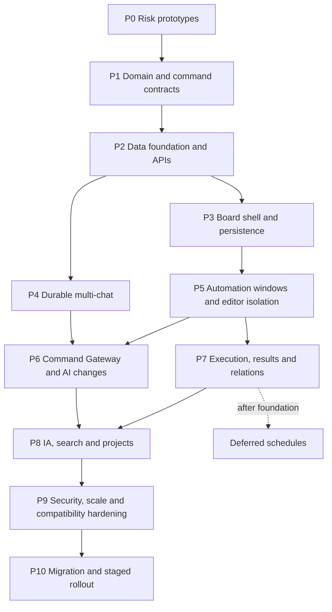

# Ketos: доказательный план реализации

**Основание:** [требования](01_KETOS_REQUIREMENTS.md), [аудит](02_KETOS_CURRENT_ARCHITECTURE_AUDIT.md), [OpenSwarm](03_OPENSWARM_REUSE_ASSESSMENT.md), [критический отчёт](04_KETOS_CRITICAL_ARCHITECTURE_REPORT.md).  
**Статус документа:** план; реализация в текущей работе не выполнялась.

## 1. Принцип исполнения

Каждый этап выполняется циклом `baseline → focused test/POC → review evidence → implement behind flag → verify → migration rehearsal → rollback rehearsal`. FAIL/BLOCKED на exit gate останавливает зависящие этапы. Нельзя заменять текущие Flow/KFX paths до прохождения совместимого cutover.

## 2. Зависимости и критический путь

**Критический путь:** P0 nested editor/state/command prototypes → P1 contracts → P2 migrations → P3 Board → P5 Automation window → P6 safe AI apply → P8 integrated product → P9 hardening → P10 rollout. P4 chat может идти параллельно P3 после P2. Schedule не входит в первый критический путь.

## 3. Общие измеримые quality gates

| Gate          | Измеримое условие                                                                                                                               |
| ------------- | ----------------------------------------------------------------------------------------------------------------------------------------------- |
| Compatibility | Зафиксированный legacy Flow corpus открывается, сохраняется, build/run выполняются; 0 непредусмотренных graph/hash/API contract changes.        |
| Unit          | Изменённые domain/services имеют branch coverage target ≥90%; overall project threshold утверждается в P1, не симулируется числом без baseline. |
| API           | OpenAPI contract diff reviewed; actor/resource/action negative tests; idempotency and 409 conflict tests.                                       |
| Migration     | Upgrade/downgrade и interrupted backfill на SQLite/PostgreSQL; row counts/checksums; old and new binaries during compatibility window.          |
| E2E           | Chromium + второй поддерживаемый engine определяется P1; RU/EN; keyboard; reload/restart; concurrent chat; nested editor.                       |
| Visual/a11y   | Approved screenshots at fixed viewports/themes/locales; axe critical/serious = 0 in new primary paths.                                          |
| Performance   | Published hardware/data profile; p50/p95/p99, FPS/long tasks/heap and DB plan captured; no unqualified «быстро».                                |
| Security      | Permission matrix, confirmation replay, SSRF/egress/custom-code corpus, audit redaction and revocation tests.                                   |
| Rollback      | Feature flag off returns legacy UI; downgrade/forward recovery rehearsed; no loss of new entity data.                                           |

## 4. P0 — исследовательские прототипы риска

**Цель:** принять решения, которые кодовый аудит не способен доказать.  
**Предусловия:** current baseline/Flow corpus; test hardware profile; disposable branch/data; никаких production migrations.  
**Ответственные направления:** frontend platform, workflow runtime, data, AI/application architecture, performance; прототипы можно выполнять параллельно, кроме общего benchmark harness.

**Задачи и модули:**

1. `P0-A Canvas A/B`: custom DOM compositor по OpenSwarm patterns против outer XYFlow; prototype area рядом с frontend experiments, без подключения к production route.
2. `P0-B Nested editor`: isolate `PageComponent`, stores, DOM IDs, hotkeys, wheel/pinch/drag; сравнить card-embedded active editor и route/portal editor.
3. `P0-C Multi-chat`: 10 per-window controllers поверх mocked then real streams; cancel/reconnect/order.
4. `P0-D Board persistence`: revisioned placement patches, debounce/flush, stale tab, backend restart.
5. `P0-E Entity/placement`: Chat/Flow/Note mock entities on two boards; close placement vs delete entity.
6. `P0-F AI workflow`: typed generate/edit proposal, server diff, stale revision, confirm once, rollback.
7. `P0-G Control plane`: executable comparison CommandGateway-only vs MCP adapter; threat model and transaction trace.
8. `P0-H Restore/scale`: reload/restart with 100/500/1000 objects, 10 chats, 3 previews, one editor.

**Данные/API/migrations:** disposable in-memory/temporary schemas only; no production Alembic. Define draft schemas for Board, Placement, ChatThread, Proposal, stream envelope.  
**Зависимости:** independent prototypes; shared metrics harness.  
**Риски/blockers/устранение:** stale Graphify map is not a runtime blocker but source verification required; lack of production corpus → generate deterministic corpus and request anonymized sample before sizing; nested singleton may fail → choose one-editor architecture.  
**Тесты:** pointer/keyboard gesture matrices, Playwright multi-window, network disconnect proxy, concurrent writes, heap/long-task tracing, proposal property tests.  
**Exit criteria:** ADRs for canvas, editor lifecycle, chat controller, persistence, CommandGateway/MCP and performance budgets; R-01/R-05/R-10/R-17/R-36 status moves from hypothesis to selected design. Specifically: viewport ≤1 px/0.01; 0 gesture leakage in 100 cases; 10 streams 0 cross-events; confirm replay ≤1 apply; 500-object p95 frame ≤16.7 ms on declared profile or documented lower product limit.  
**Откат:** delete prototype route/build output; no production data.  
**Артефакты:** benchmark JSON, traces, screenshots, threat model, ADRs, failed alternatives.

## 5. P1 — доменная модель и контракты

**Цель:** формально закрепить границы Board/Placement/Chat/Flow/Execution/Command.  
**Предусловия:** P0 ADRs accepted.  
**Задачи:** OpenAPI/event schemas; state machines; ownership/RBAC actions; risk classes; terminology/i18n keys; Project-over-Folder compatibility; audit/redaction/retention; SLO and supported browsers/concurrency.  
**Модули:** backend service interfaces under `src/backend/base/ketos`; frontend feature contracts/types; KFX adapter contracts; migrations design only.  
**Данные/API:** ERD and uniqueness/FK/index policy; `request_id`, `idempotency_key`, `base_revision`, `sequence`; versioned `/api/v1/boards`, `/chats`, `/commands`, `/executions`.  
**Зависимости/параллельность:** data, frontend and security specs parallel; API review is convergence gate.  
**Риски/blockers:** polymorphic refs and Folder compatibility; resolve with resource registry/service validation and additive adapter.  
**Тесты:** schema roundtrip, state-machine property tests, permission decision tables, OpenAPI snapshot.  
**Exit criteria:** every R maps to owner/API/data/test; zero unresolved identity/title or entity/placement ambiguity; security review signs command contract.  
**Откат:** specifications only.  
**Артефакты:** ADR/ERD/OpenAPI drafts, migration RFC, RBAC matrix, risk registry.

## 6. P2 — данные, сервисы и additive API

**Цель:** создать backward-compatible persistence foundation без UI cutover.  
**Предусловия:** P1 contracts; SQLite/PostgreSQL CI environments.  
**Задачи/модули:** new SQLModel models/services/repositories for Board/Viewport/Placement/ChatThread/BoardNote/Relation/Result/Proposal/Execution; extend Message with nullable `chat_id`; Project adapter; CommandGateway skeleton; indexes and outbox. Likely paths: `src/backend/base/ketos/services/database/models`, `src/backend/base/ketos/services`, `src/backend/base/ketos/api/v1`.

**Данные/API/migrations:**

- Migration A: create new tables and nullable columns/indexes.
- Backfill A: group legacy messages by owner+flow+session under explicit ambiguity report.
- Dual write/read with metrics; no dropping `session_id`/legacy routes.
- CAS `PATCH` APIs, idempotent create/execute, permission filters.

**Зависимости/параллельность:** Board and Chat repositories parallel; Proposal/Command depends common UoW/outbox.  
**Риски/blockers/устранение:** migration time/locks → chunked resumable backfill; SQLite/Postgres semantic differences → dialect matrix; ambiguous sessions → quarantine/report, never silent merge.  
**Тесты:** model/unit, API positive/negative, concurrent CAS/idempotency, migration upgrade/downgrade/interruption, DB constraints/query plans.  
**Exit criteria:** old API/tests pass; new API contracts pass; row checksum 100%; duplicate idempotency creates one effect; stale revision 409; no destructive migration.  
**Откат:** turn off dual-write/new routes, retain additive tables; reverse only after proving no new-only data.  
**Артефакты:** migrations, backfill report, OpenAPI, DB plans, rollback runbook.

## 7. P3 — Board shell, placements и восстановление

**Цель:** первый usable Board без embedded full Flow Editor.  
**Предусловия:** P2 Board APIs and P0 selected compositor.  
**Задачи/модули:** Board route/store/query; CardFrame; pan/zoom/minimap; create/open/archive Board; generic placements; move/resize/z/close; BoardNote; per-user viewport; lazy/offscreen rendering; feature flag. Frontend scope: new `features/boards`, existing router/sidebar/design components.

**Данные/API:** Board/Viewport/Placement/Note CRUD and batched revision patches; no Flow data changes.  
**Зависимости/параллельность:** canvas and card shell parallel with viewport persistence; sidebar waits route contract.  
**Риски/blockers:** write storm, stale tabs, zoomed a11y, relation future extensibility; debounce+flush+CAS, stable screen-space controls.  
**Тесты:** math/unit, API/CAS, migration, Playwright pan/zoom/drag/resize/keyboard, reload/backend restart, 100/500/1000 objects, RU/EN visual.  
**Exit criteria:** metrics P0 retained in production code; no lost acknowledged placement; reload accuracy; axe critical/serious 0; legacy flows route unaffected flag off/on.  
**Откат:** disable Board routes/nav; keep data and background-compatible API.  
**Артефакты:** Board MVP, performance trace, visual baselines, recovery report.

## 8. P4 — durable multi-chat

**Цель:** независимые ChatThreads and windows, без process-local truth.  
**Предусловия:** P2 Chat model/API, P0 multi-chat decision; CardFrame from P3 can be integrated late.  
**Задачи/модули:** select one canonical Playground chat presentation; per-chat controller; `Message.chat_id`; durable Assistant context; model/context on ChatThread; rename/delete/archive; place/open/close; unify text stream envelope and cancellation; retain WebSocket only for duplex voice.

**Данные/API:** dual-write migration completion; indexed history; `/chats/{id}/messages`, stream/cancel/replay; session alias compatibility.  
**Зависимости/параллельность:** backend stream work and frontend window controllers parallel; Board integration depends P3.  
**Риски/blockers:** cross-flow legacy collision, replay storage, proxy buffering, voice access leakage; ambiguous backfill report, request sequence, permission check before descriptions/stream.  
**Тесты:** 10 concurrent streams, cancellation isolation, retry/idempotency, rename collision, reload/backend restart, million-message query profile, voice negative authorization.  
**Exit criteria:** 0 cross-events; context visible to UI equals prompt context after restart; request replay deterministic; legacy KFX ChatInput/Output corpus passes.  
**Откат:** route new chats through legacy session adapter; keep `chat_id` dual-write.  
**Артефакты:** ChatWindow, stream contract, migration/collision report, load results.

## 9. P5 — Automation windows и editor isolation

**Цель:** Automation placements, запуск/fullscreen и безопасная работа внутреннего Flow Editor.  
**Предусловия:** P3 Board, P0 editor ADR, existing Flow regression corpus.  
**Задачи/модули:** AutomationCard/preview/status; place same Flow on multiple boards; open canonical FlowPage fullscreen and restore Board context; one active embedded editor if P0 passed; scope IDs/hotkeys/store lifecycle; lazy previews; manual workflow path unchanged.

**Данные/API:** Placement references existing Flow; optional preview/status projection; no Flow serialization rewrite.  
**Зависимости/параллельность:** card/route work parallel; embedded editor after isolation refactor.  
**Риски/blockers:** singleton store, undo leakage, nested gestures, memory. If exit gate fails, ship summary card + fullscreen route and defer embedding.  
**Тесты:** 100 gesture matrix, undo/copy/delete scoping, mount/unmount leak, large Flow, Flow API/build/run corpus, navigation restore, RU/EN visual.  
**Exit criteria:** 0 outer/inner gesture leakage; only active Flow mutates; board state survives editor trip; flag off current editor byte/contract behavior unaffected.  
**Откат:** disable embedded mode; route all edits fullscreen.  
**Артефакты:** AutomationCard, editor ADR update, compatibility and memory reports.

## 10. P6 — Command Gateway и безопасные AI-изменения

**Цель:** единая mutation boundary для Assistant, REST и restricted MCP.  
**Предусловия:** P2 Proposal/UoW, P4 durable chat, P5 Flow adapter, R-39 policy draft.  
**Задачи/модули:** typed command registry; graph planner/validator/diff; clarify state; preview/risk; confirmation tokens; apply-once transaction; FlowVersion provenance/rollback; audit/outbox; Assistant adapter; MCP allowlisted adapter; remove immediate production apply path.

**Данные/API:** Proposal/Execution/Audit; `/commands:preview`, confirm/apply/cancel; component registry snapshot/version; no arbitrary backend path.  
**Зависимости/параллельность:** Flow commands first; Board/Project/Note commands parallel after common gateway; MCP last.  
**Риски/blockers:** hallucinated graph, stale revision, prompt injection, confirmation replay, partial external effects. Server canonical validation; deny unsafe components; compensating outcome recorded, not false rollback.  
**Тесты:** curated workflow generation corpus; property graph validation; stale 409; replay ≤1; actor/scope tampering; secret redaction; failure injection/outbox; version rollback.  
**Exit criteria:** no mutating Assistant/MCP bypass in code search/contract test; ≥90% agreed corpus schema-valid/buildable or threshold explicitly revised; every outcome auditable; confirmed revision hash exact.  
**Откат:** disable mutating commands, preserve read-only Assistant/manual Flow; proposals remain inspectable.  
**Артефакты:** gateway, command registry, threat model update, evaluation and rollback reports.

## 11. P7 — execution, results, relations и risk controls

**Цель:** запускать Automation с Board и сохранять status/result/provenance; добавить смысловые связи отдельно.  
**Предусловия:** P3/P5; Command policy for dangerous runs; P2 result/relation tables.  
**Задачи/модули:** execution adapter over build/run/Job; canonical state machine/reconnect; ResultCard/type registry; placement of result; BoardRelation renderer/API; component capability manifests, egress/sandbox controls appropriate to deployment.

**Данные/API:** ExecutionResult/provenance, event sequence/replay, Relation; migration additive.  
**Зависимости/параллельность:** results and relations parallel; dangerous-run confirmation depends P6.  
**Риски/blockers:** large/unsafe output, fragmented streams, SSRF/custom code, relation clutter. Storage refs/redaction/schema whitelist; temporary dialect adapters; risk policy.  
**Тесты:** execution transition/disconnect/idempotency, result permission/type/size, malicious components, 1k relations, large Flow, audit correlation.  
**Exit criteria:** executed revision recorded; disconnect becomes recovered terminal/explicit unknown; unsafe corpus denied/confirmed; results reload; BoardRelation never changes Flow hash.  
**Откат:** hide Board run/results/relations; underlying legacy execution remains.  
**Артефакты:** execution projection, result renderer registry, security/load reports.

## 12. P8 — проекты, навигация, поиск и product integration

**Цель:** собрать цельную Ketos IA и убрать дублирование только после наличия replacement paths.  
**Предусловия:** P3–P7 primary entities/routes.  
**Задачи/модули:** Project tree over Folder; archive/pin; target sidebar; Chat/Automation lists; global search phase 1; single avatar menu; design tokens/states; controlled deprecation inventory. Scheduled page — read-only capability only if actual scheduler contract verified.

**Данные/API:** Folder-compatible fields; per-user pin; federated search; no destructive rename.  
**Зависимости/параллельность:** project tree, search and account menu parallel; nav convergence last.  
**Риски/blockers:** route/bookmark/plugin breakage, search leakage, tree cycles, mixed locale. Redirects/aliases, permission-first search, cycle constraints, i18n gate.  
**Тесты:** tree cycles/archive, deep links, sidebar keyboard, search RBAC/perf/RU tokenization, visual RU/EN/themes, legacy route/import inventory.  
**Exit criteria:** all authorized objects reachable; forbidden search fixture zero; 5-level project tree; no new hardcoded English; every removed item has replacement/rollback.  
**Откат:** feature flag old sidebar/routes; additive fields remain.  
**Артефакты:** integrated shell, IA map, deprecation ledger, visual/accessibility report.

## 13. P9 — безопасность, масштаб и совместимость hardening

**Цель:** доказать production readiness до миграционного cutover.  
**Предусловия:** integrated feature flag path P8.  
**Задачи:** granular RBAC/revocation; audit durability/redaction; rate/size limits; sandbox/egress; multi-worker stream/replay; DB plans; load/soak; chaos/recovery; browser matrix; KFX/LFX/API/extension corpus; backup/restore.

**Модули:** cross-cutting backend/frontend/KFX/CI; no new product scope.  
**Данные/API:** validate constraints, build concurrent indexes, retention/partition policy; still no contract drop.  
**Зависимости/параллельность:** security, performance, compatibility teams parallel; readiness gate combined.  
**Риски/blockers:** missing anonymized production data and infrastructure equivalence; use deterministic synthetic corpus, but mark production capacity BLOCKED until representative rehearsal.  
**Тесты:** actor×resource×action, revocation during stream, OWASP/SSRF, 24h soak, 1000 objects/10 chats/large Flow, migration restore, all package gates.  
**Exit criteria:** zero P0/P1 security defects; agreed SLOs pass; compatibility corpus 100%; rollback rehearsal; residual risks signed.  
**Откат:** no cutover; flag remains internal.  
**Артефакты:** readiness dossier, SBOM/notices, benchmark and penetration reports.

## 14. P10 — миграция и staged rollout

**Цель:** безопасно включить продукт без потери legacy данных.  
**Предусловия:** P9 PASS, backups, support/observability/runbooks.  
**Задачи:** canary tenants/users; progressive flags; backfill waves; dual-read metrics; compare checksums; user communication; support dashboards; freeze criteria; later contract migration only after compatibility window.

**Данные/API:** expand already deployed; backfill resumes by cursor; contract removal is separate approved release.  
**Зависимости/параллельность:** rollout sequential by risk cohort; monitoring/support parallel.  
**Риски/blockers:** hidden legacy sessions, rollback after new writes, stream proxies. Maintain dual-write, no reverse destructive migration, convert new data through compatibility adapter.  
**Тесты:** production-like smoke/E2E per wave, checksum, rollback, restart, permissions, RU/EN, synthetic dangerous action.  
**Exit criteria:** error/SLO/data mismatch below predeclared thresholds for full observation window; 100% backfill with ambiguity ledger resolved; rollback drill current.  
**Откат:** flag off, route via legacy adapters, retain new data/tables and replay outbox; incident runbook.  
**Артефакты:** rollout dashboard, wave approvals, migration ledger, final deprecation schedule.

## 15. Отложенный этап PS — запланированные процессы

Начинается только после P7 и отдельного подтверждения приоритета. Требует Schedule model/engine adapter, timezone/DST/missed-run policy, idempotent execution key, pause/resume, RBAC/audit and failure notification. Exit gate: DST matrix; repeated delivery creates one effective execution; next/last run correct; dangerous scheduled run uses approved capability policy. Отказ от этапа не блокирует core Board/Chat/Automation product.

## 16. Матрица направлений и параллельности

| Направление              | Основные этапы          | Может идти параллельно           |
| ------------------------ | ----------------------- | -------------------------------- |
| Frontend canvas/design   | P0, P3, P5, P8          | Chat P4, backend P2              |
| Chat/streaming           | P0, P2, P4              | Board P3                         |
| Flow/KFX                 | P0, P5–P7, P9           | Data/IA при стабильных contracts |
| Backend/data             | P1–P2, P6–P7            | Frontend prototypes              |
| Security/RBAC/audit      | P1–P2, P6–P9            | Постоянный review всех tracks    |
| Migration/compatibility  | P2, P9–P10              | Ранний corpus/gate work с P0     |
| Product design/i18n/a11y | P0, P3–P5, P8–P9        | На каждой UI wave                |
| QA/performance           | P0 и exit каждого этапа | Independent verification         |

## 17. Blockers, которые нельзя скрывать

- До P0 нельзя доказать viability nested editor, 10 chats и 1000-object target.
- Без representative PostgreSQL data нельзя честно объявить production capacity PASS.
- Без deployment sandbox/egress topology нельзя закрыть R-39 полностью.
- Без defined workspace/team semantics нельзя финализировать inherited RBAC.
- Без approved LFX/legacy Flow corpus нельзя утверждать R-40, даже если unit tests зелёные.

Каждый blocker имеет минимальный unblock: test profile/corpus; sandbox ADR; RBAC product decision; versioned compatibility corpus. Никакой этап не должен подменять эти входы общими формулировками.
