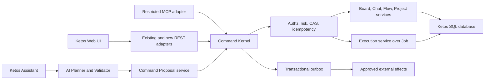
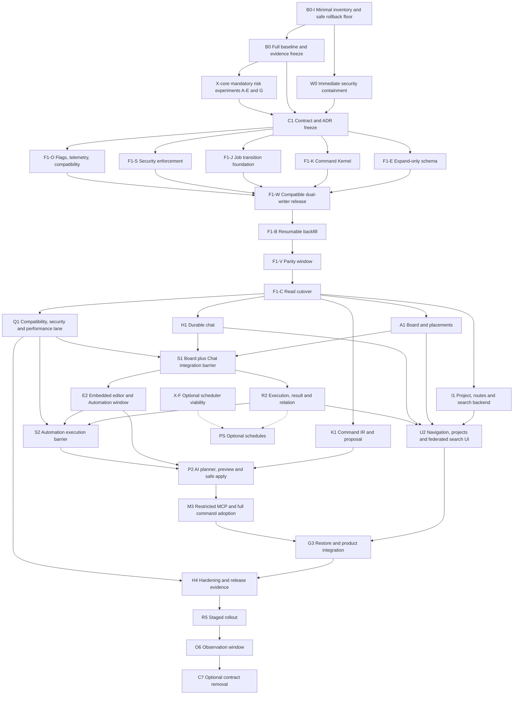

# Ketos Spatial Workspace — переработанный мастер-план реализации

> **Для агентных исполнителей:** REQUIRED SUB-SKILL: используйте `superpowers:subagent-driven-development` (предпочтительно) либо `superpowers:executing-plans` для выполнения этого плана по задачам. Каждый phase перед началом получает отдельный bite-sized план через `superpowers:writing-plans`. Чекбоксы ниже — обязательный реестр состояния.

**Goal:** превратить Ketos в единую пространственную рабочую среду с досками, независимыми чатами, автоматизациями, заметками, результатами, проектами и безопасным AI-управлением, сохранив единый backend и совместимость Flow/KFX/LFX.  
**Architecture:** новый Board/Chat/Command product layer оркестрирует существующие Flow, Job, Folder/Project, Message и KFX/LFX. Board и Flow Editor остаются разными пространствами; сущности отделены от placements; AI/MCP используют типизированный Command Gateway.  
**Tech Stack:** Python/FastAPI, SQLModel/Alembic, SQLite/PostgreSQL, React/TypeScript, React Query, Zustand, XYFlow/ReactFlow, KFX/LFX, Playwright/Jest/pytest.  
**Основание:** [`10_KETOS_MASTER_PLAN_AUDIT_REPORT.md`](10_KETOS_MASTER_PLAN_AUDIT_REPORT.md), документы 01–09 и текущий кодовый baseline.  
**Baseline:** `redesign/sidebar-account` @ `80878261d07c21ad257de017d98069f211ada2c2`; Graphify source baseline `572fad8…`, при этом `src/**` идентичен.

## Global Constraints

- [ ] **GC-01 — единый business backend.** Board, Chat, Flow, Execution и Command принадлежат backend Ketos. Внешние DB-backed workers или scheduler adapters допустимы только после ADR и не становятся вторым system of record/API.
- [ ] **GC-02 — Board ≠ Flow.** Board coordinates/relations никогда не записываются в `Flow.data`; BoardRelation никогда не исполняется как Flow edge.
- [ ] **GC-03 — entity ≠ placement.** Remove placement, archive entity и delete entity — разные typed commands, permissions и audit events.
- [ ] **GC-04 — reuse before replacement.** `Flow=Automation`, `Folder` хранит Project, `Job` хранит execution lifecycle, Message/KFX/LFX переиспользуются и расширяются additive.
- [ ] **GC-05 — один embedded editable editor в V1.** Положительный X-B разрешает безопасный embedded single-editor mode: один editor lease, остальные placements — compact/read-only previews. Несколько одновременно editable editors требуют отдельной будущей программы и ADR.
- [ ] **GC-06 — Command Kernel раньше новых mutations.** Board/Chat/Flow/Run команды используют общий authn/authz/validation/CAS/idempotency/audit kernel. AI preview/confirmation и MCP добавляются позднее поверх него.
- [ ] **GC-07 — actor не приходит от LLM/client.** Actor/workspace/roles выводятся из authenticated request context и повторно проверяются непосредственно перед apply/execute.
- [ ] **GC-08 — migration safety.** До cutover только expand/backfill/dual-read/validate. Destructive contract removal — отдельный поздний release после окна совместимости и отдельного одобрения.
- [ ] **GC-09 — rollback truth.** Feature flag возвращает старое приложение на forward-compatible schema. Flag не откатывает данные и никогда не восстанавливает fail-open security behavior.
- [ ] **GC-10 — RU/EN.** System-owned UI имеет RU/EN semantic key parity с locale-specific plural rules; новые hardcoded English strings запрещены.
- [ ] **GC-11 — KFX identifiers immutable.** Persisted class names, graph schema и extension ABI не переименовываются.
- [ ] **GC-12 — no realtime coediting in V1.** V1 использует optimistic concurrency/CAS. CRDT/OT и live multi-user editing — отдельная будущая программа.
- [ ] **GC-13 — web MVP.** Generic browser/webview card и OpenSwarm Electron/CastLabs не входят в web MVP.
- [ ] **GC-14 — evidence.** PASS возможен только при сохранённом command output/artifact; historical PASS не заменяет проверку текущего SHA.
- [ ] **GC-15 — memory guard.** Суммарный RSS рабочих процессов не превышает 16 ГиБ; одновременно допускается не более двух тяжёлых jobs, а migration/Playwright/build/Graphify rebuild — по одному.

## 1. Каноническая терминология

| RU | EN | Формальное значение |
| --- | --- | --- |
| Рабочее пространство | Workspace | Граница владения, policy и tenancy; существующая backend-сущность |
| Проект | Project | Иерархическая организация, в V1 хранится существующим `Folder` и доступна через `/api/v1/projects` |
| Доска | Board | Пространственная поверхность внутри Workspace/Project |
| Канвас доски | Board Canvas | Frontend camera/compositor Board; не доменная сущность и не Flow graph |
| Размещение | Placement | Геометрическое представление одной сущности на Board |
| Автоматизация | Automation | Product name существующего `Flow`; отдельная таблица Automation не создаётся |
| Редактор потока | Flow Editor | Существующий внутренний XYFlow editor Automation |
| Исполнительное ребро | Flow Edge | Связь KFX-компонентов внутри `Flow.data` |
| Смысловая связь | Board Relation | Неисполняемая связь placements на Board |
| Чат | Chat Thread | Durable conversation entity с immutable `chat_id` |
| Запуск автоматизации | Automation Execution | Доменная/API-проекция расширенного `Job`, а не автоматически новая параллельная execution table |
| Результат | Execution Result | Durable результат конкретного Job/executed revision |
| Команда | Command | Типизированное намерение изменить/запустить разрешённый объект Ketos |
| Предложение | Command Proposal | Durable server-generated preview команды до подтверждения |

Термины `dashboard` и `workspace` не используются как синоним Board. Legacy `flow` остаётся API/DB именем Automation. UI использует «Автоматизация»/“Automation”.

## 2. Зафиксированная current truth

Следующие факты являются входными ограничениями, а не задачами повторного исследования:

- `/api/v1/projects` уже использует `Folder`; новый Project backend запрещён без ADR.
- `Flow` не имеет revision; `FlowVersion` — snapshot; activation копирует data в Flow.
- Flow Editor использует global stores/provider/hotkeys/IDs и не готов к нескольким instances.
- per-Flow viewport сохраняется, но load вызывает `fitView()`.
- NoteNode является частью Flow graph и не равен BoardNote.
- `Message.session_id` non-null; `chat_id` отсутствует.
- Assistant prompt buffer process-local; localStorage и MessageTable создают три источника истины.
- session rename не синхронизирует MemoryBase/Chroma.
- `Job.user_id IS NULL` fail-open; `Job.created_at` lookup ошибочен.
- Job idempotency не atomic; execution не pin-ит immutable Flow revision/result.
- authz/rate/audit/SSRF/REPL primitives существуют, но coverage неполно и местами fail-open.
- LFX compatibility corpus существует, но не входит во все default gates.
- актуальный Desktop/Tauri distribution pipeline в этом checkout не доказан.

## 3. Целевая архитектура V1

### 3.1 Backend boundaries



Legacy REST routes may temporarily call existing services, but every **new** Board/Chat/Command/Run mutation enters Command Kernel. Migration of safe legacy CRUD is incremental and tracked; AI/MCP may not bypass it.

### 3.2 Persistence model

#### Existing models to extend

| Existing model | V1 use | Additive changes |
| --- | --- | --- |
| `Folder` | Project persistence | `pinned_at`, `archived_at`, parent-scoped ordering/constraints; create/update cycle and workspace validation |
| `Flow` | Automation | `revision NOT NULL DEFAULT 0`; optional archived/product projection fields only if needed |
| `FlowVersion` | Immutable Automation revision snapshot | `source_flow_revision`, actor/command provenance where compatible; no `active` flag |
| `Job` | AutomationExecution persistence | ownership state, executed flow revision/hash/version ref, actor/idempotency fingerprint, transition version, lease/attempt/cancel state, result ref/retention metadata |
| `MessageTable` | Каноническая durable message row в V1 | nullable `chat_id`, turn/run linkage и indexes; legacy `session_id` dual-write retained until contract release |

#### New persistent models

| Model | Required integrity |
| --- | --- |
| `Board` | `workspace_id`, `project_id -> folder.id`, owner, title, archive, structural revision, timestamps |
| `BoardViewport` | unique `(board_id,user_id)`, x/y/zoom, revision, timestamps; no noisy focus/selection |
| `BoardUserState` | unique `(board_id,user_id)`, last active/fullscreen/open placement; low-frequency durable UI context |
| `Placement` | board FK, geometry/state/revision and exactly one typed target FK (`flow_id`, `chat_id`, `note_id`, `result_id`) |
| `BoardNote` | workspace/project/owner/content/format/revision/archive/timestamps |
| `BoardRelation` | board FK, source/target placement FK, relation type/label/revision; endpoints must belong to same Board |
| `ChatThread` | workspace/project/owner/title/model refs/context policy/archive/revision/timestamps; immutable id |
| `ChatLegacySession` | mapping legacy owner/flow/session/virtual-flow identity to `chat_id`, status and ambiguity reason |
| `ChatTurn` | Каноническая turn metadata/state с FK на MessageTable row(s): chat/ordinal/status/request/content hash; не дублирует body без ADR |
| `ChatRun` | stream request/idempotency/state/epoch/last sequence/model snapshot/cost/timestamps |
| `ExecutionResult` | `job_id`, schema/type, storage ref XOR redacted inline payload, provenance/retention/status |
| `CommandProposal` | schema/type/actor/scope/base revision/canonical IR and diff hashes/risk/status/expiry |
| `CommandExecution` | proposal/actor/idempotency fingerprint/before-after revision/outcome/error/timestamps |
| `CommandOutbox` | execution/effect type/payload hash/state/attempt/fencing/next retry; secrets excluded |

`AutomationExecution` в API и документации является проекцией `Job`. Отдельная таблица допустима только после ADR, который докажет невозможность расширить Job без нарушения KFX/Langflow compatibility.

### 3.3 Placement integrity decision

V1 default — typed nullable FKs с exactly-one CHECK. X-D готовит, а C1 утверждает ADR, сравнивающий это с registry-table design по FK integrity, cascade, extensibility, query plans и migrations. Сервисный `object_type/object_id` без DB integrity запрещён как default.

### 3.3.1 Chat source-of-truth invariant

`MessageTable` хранит каноническое committed message body; `ChatTurn` хранит порядок, pair/run identity и transition state и ссылается на соответствующую message row. Для нового chat write обе записи создаются атомарно. В dual-write window та же `MessageTable` row получает `chat_id` и legacy `session_id`; отдельной копии текста нет. Contract removal удаляет legacy identity dependency только после parity window.

### 3.4 Concurrency

- `Flow.revision`: CAS для PATCH, activate version и AI apply.
- `Placement.revision`: независимое перемещение/resize без глобальной Board contention.
- `Board.revision`: только structural changes, не каждый pointer move.
- `BoardViewport.revision`: per-user stale-response protection.
- mutable Chat/Note/Proposal rows: expected revision/state transition.
- stale mutation → HTTP 409 с current revision и без side effect.

### 3.5 Command state machines

```text
CommandProposal:
DRAFT -> NORMALIZED -> VALIDATED -> RISKED
RISKED -> DENIED
RISKED -> PREVIEWED -> AWAITING_CONFIRMATION
AWAITING_CONFIRMATION -> CONFIRMED | REJECTED | EXPIRED | STALE
NORMALIZED|VALIDATED|RISKED|PREVIEWED -> FAILED
terminal: DENIED | CONFIRMED | REJECTED | EXPIRED | STALE | FAILED

CommandExecution:
PENDING -> APPLYING -> COMMITTED
PENDING|APPLYING -> FAILED
terminal: COMMITTED | FAILED

CommandOutbox:
PENDING -> CLAIMED
CLAIMED -> SUCCEEDED | RETRY_WAIT | FAILED_PERMANENT | COMPENSATION_REQUIRED
RETRY_WAIT -> CLAIMED | FAILED_PERMANENT | COMPENSATION_REQUIRED
terminal: SUCCEEDED | FAILED_PERMANENT | COMPENSATION_REQUIRED
```

Confirmation material связывается с `actor + scope + command type/version + canonical proposal hash + base revision + risk + expiry`; в БД хранится hash/nonce, а не bearer token в открытом виде. Consumption nonce, domain mutation, `CommandExecution` transition to `COMMITTED` и outbox insert входят в одну DB transaction. Сбой до commit не потребляет подтверждение и не оставляет effect; сбой после commit восстанавливается по execution/outbox, не повторяя domain mutation. `COMMITTED` immutable: permanent failure внешнего эффекта меняет только outbox/compensation incident state и не переписывает факт уже зафиксированной domain mutation.

Idempotency namespace фиксируется как unique tuple `(workspace_or_tenant, actor, operation, resource_type, resource_id, idempotency_key)` плюс canonical request fingerprint. Повтор того же tuple/fingerprint возвращает сохранённый execution/result; другой fingerprint даёт conflict. C1 задаёт TTL/retention и ответ после удаления payload, а F1 проверяет concurrent insert и crash recovery на SQLite/PostgreSQL.

### 3.6 Execution state machine

```text
QUEUED -> IN_PROGRESS -> COMPLETED
                    \-> FAILED
                    \-> TIMED_OUT
QUEUED|IN_PROGRESS -> CANCEL_REQUESTED -> CANCELLED
CANCEL_REQUESTED -> COMPLETED | FAILED | TIMED_OUT
QUEUED|IN_PROGRESS -> RETRY_WAIT -> QUEUED
```

Переход из `CANCEL_REQUESTED` в уже достигнутый worker terminal означает, что CAS terminal completion выиграл гонку; поздний cancel ack становится no-op. `attempt`, `lease_owner`, `lease_expires_at`, `execution_epoch` и fencing token защищают recovery/retry. Terminal states immutable. `unknown` — wire/reconnect projection, не persisted terminal status без отдельного ADR. Каждый Job pin-ит executed Flow revision/hash и durable result.

### 3.7 Chat stream state machine

```text
IDLE -> STARTING(request_id,idempotency_key)
     -> STREAMING(stream_epoch,last_sequence)
     -> DISCONNECTED -> RESUMING(after_sequence) -> STREAMING
     -> CANCELLING -> CANCELLED
     -> COMPLETED | FAILED
```

Event envelope: `chat_id`, `run_id`, `request_id`, `event_id`, `sequence`, `stream_epoch`, `server_instance_id`, `type`, `payload`, `timestamp`. Dedup выполняется по stable event identity; снижение sequence само по себе не означает безопасный reset.

## 4. Program DAG и критический путь



**Основная dependency spine:** `B0-I → W0` и `B0 → X-core → C1 → F1-E/K/J/S/O → F1-W → F1-B → F1-V → F1-C → A1/H1/Q1 → S1 → E2/R2 → S2 → P2 → M3 → G3 → H4 → R5 → O6`. Это не отменяет обязательные convergence inputs: K1 нужен для P2, I1+A1+H1+R2 — для U2, U2+M3 — для G3. Q1 является непрерывным обязательным входом каждого barrier.

`I1`, K1 и product lanes выполняются параллельно после F1. X-F и PS не входят в V1 release critical path и не блокируют C1.

## 5. Статусы и stop rules

Каждая задача имеет одно состояние:

- `NOT_STARTED` — нет свежего evidence;
- `IN_PROGRESS` — назначен owner и зафиксирован base SHA;
- `PASS` — acceptance доказан artifact/command output;
- `BLOCKED` — внешний или межфазный blocker с owner и unblock condition;
- `FAIL` — измеримый gate нарушен.

`FAIL` или `BLOCKED` на mandatory barrier запрещает запуск зависимых задач. Нельзя переименовывать FAIL в «частично готово».

## 6. Обязательная модель работы субагентов

### 6.1 Организация

Мастер-план выполняется **субагентами**, а основной агент выступает coordinator/integrator. В каждой крупной параллельной волне используются минимум пять полноценных направлений, если задачи готовы по зависимостям:

1. backend/domain/data;
2. frontend/canvas/editor;
3. chat/stream/AI;
4. security/command/execution;
5. testing/compatibility/performance;
6. product/IA/i18n при наличии готового scope.

Формальное создание агента без bounded deliverable, file scope и evidence не засчитывается.

### 6.2 Worktrees и branches

- [ ] Основной агент создаёт clean integration worktree от зафиксированного SHA.
- [ ] Каждый implementation lane получает отдельный linked worktree и branch `codex/<wave>-<lane>`.
- [ ] Исторические dirty/untracked файлы пользователя не копируются в commit scope.
- [ ] X-core experiments и optional X-F изолированы друг от друга; production migrations в них запрещены.
- [ ] Один subagent не меняет файлы другого lane без handoff.

### 6.3 Exclusive registrars

| Registrar | Исключительные файлы/ресурсы |
| --- | --- |
| DB registrar | Alembic head, model registry, metadata/imports, backfill runner |
| API registrar | `src/backend/base/ketos/api/router.py`, common DTO, OpenAPI snapshots |
| Frontend shell registrar | `src/frontend/src/routes.tsx`, app providers, header/sidebar shell |
| Locale registrar | RU/EN resources и extraction manifests |
| Flag/observability registrar | server flag registry, config exposure, telemetry names |
| Release registrar | manifests, workflows, lockfiles, compatibility wheelhouse |

Feature subagent подаёт registrar patch request; одновременно редактировать эти surfaces запрещено.

### 6.4 Handoff contract

Каждый субагент возвращает:

- точный scope и base SHA;
- изученные/изменённые файлы;
- подтверждённые facts и assumptions;
- call/data chains;
- migrations/API/contracts;
- tests с command/output/artifact;
- risks, blockers и rollback;
- confidence;
- open prototype questions.

Coordinator обязан проверить evidence прямым чтением/тестом и запросить independent reviewer для security, migrations, editor isolation и release gate.

### 6.5 Resource guard

- [ ] Перед запуском агентов и каждые 30–60 минут фиксировать total RSS.
- [ ] При RSS ≥14 ГиБ новые тяжёлые jobs не запускать; завершить/остановить существующие.
- [ ] При RSS ≥15.5 ГиБ остановить все необязательные agents/processes и продолжить read-only/lightweight работу.
- [ ] PostgreSQL migration, Playwright, frontend build, full pytest и Graphify rebuild сериализуются.
- [ ] Graphify query/explain предпочтительнее rebuild; rebuild выполняет только graph owner после source changes.

## 7. B0 — baseline, evidence freeze и tooling truth

**Цель:** получить воспроизводимую исходную точку до любых feature changes.

**Depends on:** none.  
**Parallel:** docs/evidence, backend baseline и frontend baseline могут идти параллельно; тяжёлые gates сериализуются.  
**Owners:** coordinator, QA subagent, Graphify subagent, compatibility subagent.

### B0-I minimal inventory barrier

Эта короткая часть выполняется первой и не ждёт полных baseline suites:

- [ ] зафиксированы SHA/dirty ownership и создан clean security worktree;
- [ ] инвентаризированы все Job writers, NULL-owner rows и rollback deployment versions;
- [ ] выбран минимальный patched safe rollback floor, который запрещает новые NULL writes и fail-open reads;
- [ ] зафиксированы current security config/profile и emergency deployment procedure.

После B0-I W0 может выполняться параллельно остальной части B0. Полный C1 всё равно ждёт B0, W0 и X-core.

### Tasks

- [ ] **B0-01** Зафиксировать branch, SHA, `git status --short`, dirty-file ownership и source-vs-Graphify commit.
- [ ] **B0-02** Заморозить 01–10 как historical evidence; создать versioned errata/decision register вместо silent rewriting.
- [ ] **B0-03** Исправить traceability register: добавить E-09, корректную Celery ссылку, уточнения E-15/E-16.
- [ ] **B0-04** Сформировать exact current asset map: Flow/Job/Folder/Message/MemoryBase/FlowVersion/authz/KFX/LFX/routes/stores.
- [ ] **B0-05** Зафиксировать реальное поведение repo commands; не считать пустой `make lint` gate.
- [ ] **B0-06** Запустить focused baseline в clean worktree; ошибки разделить на pre-existing и introduced.
- [ ] **B0-07** Зафиксировать Desktop status: `SUPPORTED_EXTERNALLY`, `EXCLUDED_FROM_V1` либо `BLOCKED_PENDING_EXTERNAL_PROOF`.
- [ ] **B0-08** Создать evidence schema: command, SHA, environment, start/end, exit code, artifact hash.

### Candidate files/artifacts

- Create: `docs/ketos/decisions/ERRATA_REGISTER.md`
- Create: `docs/ketos/evidence/baseline-<sha>.md`
- Create: `docs/ketos/evidence/tooling-contract.json`
- Existing verification: `Makefile`, `pyproject.toml`, `src/frontend/package.json`, `.github/workflows/*`, `graphify-out/graph.json`

### Tests/gates

- [ ] `git diff --check` PASS.
- [ ] Focused Python lint/format commands use `uv run`.
- [ ] Existing backend unit, frontend Jest/type-check/build, migration matrix and LFX corpus produce current-truth artifacts or explicit BLOCKED reasons.
- [ ] Every cited existing path resolves.
- [ ] No source or user-owned dirty file changed by evidence freeze.

**Rollback:** delete only new B0 artifacts/clean worktree; no product data touched.  
**Exit:** reproducible baseline and accepted errata register; B0-I отдельно даёт ранний вход W0.

## 8. W0 — immediate security containment

**Цель:** не расширять attack surface поверх подтверждённых текущих defects.

**Depends on:** B0-I minimal inventory; не ждёт полного B0.  
**Parallel:** four bounded security fixes may be implemented in isolated branches; DB cutover is serialized.  
**Owners:** security, backend/jobs, KFX sandbox, secrets/egress, independent reviewer.

### Tasks

- [ ] **W0-01 Job ownership inventory.** Найти все NULL-owner rows и все `create_job(user_id=None)` call sites; классифицировать attributable/ambiguous/orphan.
- [ ] **W0-02 Safe application floor.** Сначала выпустить build, который запрещает новые NULL writes и делает GET/STOP/result/cancel fail-closed. Этот build становится минимально допустимой rollback-версией.
- [ ] **W0-03 Backfill/quarantine.** Однозначные rows получают owner; неоднозначные rows получают `ownership_state=QUARANTINED`, исключаются из всех обычных queries/mutations и доступны только explicit admin reconciliation path.
- [ ] **W0-04 Constraint release.** После `unclassified NULL rows = 0`, проверки всех writers и работы safe floor отдельный migration release вводит CHECK: `user_id IS NOT NULL OR ownership_state='QUARANTINED'`. Если policy требует `NOT NULL`, quarantined rows сначала переносятся в отдельный quarantine store и `total Job.user_id IS NULL = 0`. Rollback ниже safe floor запрещён.
- [ ] **W0-05 Fix timestamp defect.** `Job.created_at` заменяется корректным `created_timestamp` с focused regression test.
- [ ] **W0-06 REPL containment.** Multi-user/network deployment — default-off; server-owned import allowlist; тесты `os`, `subprocess`, file/env/network/resource exhaustion; host execution запрещён.
- [ ] **W0-07 Egress closure.** Все raw HTTP code paths проходят central egress client, redirect-hop validation и DNS pinning policy.
- [ ] **W0-08 Secret-by-reference/redaction.** Public/shared Flow, export, version, MCP, error/log/trace/result canary tests.
- [ ] **W0-09 Celery guard.** Несовместимый backend нельзя включить случайно; unsupported profile fail-fast, JSON-only serialization, отсутствие default credentials и revoke/dispatch contract test обязательны.

### Existing files likely modified

- `src/backend/base/ketos/services/jobs/service.py`
- `src/backend/base/ketos/services/database/models/jobs/model.py`
- `src/backend/base/ketos/services/database/models/jobs/crud.py`
- `src/backend/base/ketos/api/v2/workflow.py`
- `src/kfx/src/kfx/components/utilities/python_repl_core.py`
- `src/kfx/src/kfx/components/tools/python_repl.py`
- `src/kfx/src/kfx/utils/ssrf_requests.py`
- `src/kfx/src/kfx/components/data_source/web_search.py`
- `src/kfx/src/kfx/services/settings/groups/security.py`
- `src/backend/base/ketos/api/v1/flows_helpers.py`

### Tests/gates

- [ ] Actor matrix owner/other/API-key/admin × GET/STOP/result returns expected codes.
- [ ] NULL-owner cannot be read/stopped by unrelated actor.
- [ ] `mapped + quarantined = source`; zero silently reassigned rows; unclassified NULL rows zero; CHECK/NOT NULL strategy соответствует фактическому месту хранения quarantine.
- [ ] REPL exploit corpus has zero host file/env/network effect.
- [ ] Metadata/private/link-local/redirect/rebinding SSRF corpus blocked.
- [ ] Secret canary absent from every enumerated response/log/result.
- [ ] Unsupported Celery profile fails startup; pickle/default credentials absent; dispatch/revoke contract fixture PASS.
- [ ] Independent security reviewer: zero unresolved Critical/High for W0 scope.

**Rollback:** app rollback may keep additive columns и возвращается только к safe W0 floor; fail-closed ownership, secret and sandbox fixes may not be rolled back to vulnerable behavior. Pre-constraint rollback проверяется отдельно; post-constraint active writers обязаны быть constraint-compatible.  
**Exit:** W0 PASS before Board/AI/run surface area expands.

## 9. X — параллельные риск-эксперименты

Эксперименты не используют production migrations и не становятся product code автоматически. Каждый output: benchmark artifact, ADR, kill criteria и recommendation. **X-core** включает X-A…X-E и интеграционный X-G и блокирует C1. **X-F** optional: его DEFERRED/BLOCKED не блокирует V1, а только PS.

### X-A — Board canvas/compositor

- [ ] Сравнить outer XYFlow, custom DOM compositor и минимальный DOM transform baseline.
- [ ] Fixtures: 100/500/1000 placements; 0/10/50 heavy previews; visible/offscreen variants.
- [ ] Проверить pan/zoom/drag/resize/z/minimap, semantic zoom, lost-window recovery и virtualization.
- [ ] Метрики: FPS, input latency p50/p95/p99, long tasks, heap, mounted DOM count, restore time, payload bytes.
- [ ] Профиль: hardware/OS/browser/build/fixture seed фиксирован.
- [ ] Gate: выбранный вариант укладывается в утверждённые P1 budgets; решение оформлено ADR-XA.

### X-B — FlowEditorInstance/nested interaction

- [ ] Создать disposable instance boundary: отдельные store/history/provider/ReactFlow instance/autosave/AbortController.
- [ ] Scoped hotkey broker, events и generated DOM/SVG IDs.
- [ ] Один editable editor + два previews; второй editor request проверяет lease/demotion.
- [ ] 100-scenario oracle: wheel/pinch/drag/drop/select/context menu/copy/cut/paste/delete/undo/redo/Escape/form/IME.
- [ ] Gate: каждое действие изменяет ровно один ожидаемый store/viewport; zero duplicate IDs; 30 mount cycles без heap growth trend.

### X-C — multi-chat/reconnect

- [ ] 1/5/10/20 simultaneous streams с per-chat controllers.
- [ ] Duplicate/drop/out-of-order, worker restart, network disconnect, cancel-vs-complete, two-tab replay.
- [ ] Проверить текущие DIRECT и job/events paths.
- [ ] Gate: zero cross-chat events; transcript после resume идентичен committed transcript; один visible mutation на event.

### X-D — persistence, placement и concurrency

- [ ] Typed-FK vs registry Placement ADR.
- [ ] Entity close/delete на двух boards.
- [ ] Board structural revision vs per-placement revision contention benchmark.
- [ ] Flow PATCH × version activation concurrency test.
- [ ] Gate: stale expected revision → 409/no mutation; `mapped + quarantined = source`; no orphan target refs.

### X-E — AI IR/preview/confirmation

- [ ] Versioned typed IR для generate/edit/connect/configure/delete/run.
- [ ] Curated RU/EN workflow corpus, malformed/adversarial requests, missing-field clarification.
- [ ] Server canonical diff/hash, token replay/cross-actor/stale revision/crash points.
- [ ] Метрики: schema-valid, graph-buildable, semantic acceptance, cost, latency, clarification count.
- [ ] Gate: 100% unsafe/adversarial commands routed deny/confirm; apply replay produces at most one effect.

### X-F — scheduler/Celery viability

- [ ] Сравнить fixed Celery task registry+beat, in-process single-node scheduler и external scheduler adapter.
- [ ] Требовать JSON-only payloads, async contract, lease/fencing, HA duplicate delivery и revocation.
- [ ] Зафиксировать substrate-specific gates: single-node запрещает multi-instance deployment; HA substrates проходят lease/fencing/duplicate tests; external adapter использует отдельную service identity, а actor/permissions восстанавливаются в Ketos server-side.
- [ ] Gate: выбрать substrate ADR либо оставить R-31 отложенным; текущий Celery не считается baseline-ready. Этот gate не блокирует C1/V1.

### X-G — integrated restore/scale

**Depends on:** X-A…X-E decisions. Не выполняется параллельно с ними как независимый spike.

- [ ] Собрать disposable integration harness 100/500/1000 placements, 10 chats, 3 previews, 1 editor.
- [ ] Reload, backend restart, stale tab, hidden tab, navigation/fullscreen/return.
- [ ] Gate: entity/revision hashes совпадают, нет lost/duplicate objects, budgets удержаны.

## 10. C1 — contracts, ADRs и security matrix

**Цель:** заморозить интерфейсы, по которым пять и более lanes могут работать независимо.

**Depends on:** B0, W0, необходимые X ADRs.  
**Parallel:** domain, API, security, UX/i18n and data contracts.  
**Exit barrier:** ни одна feature implementation wave не стартует без C1 PASS.

### Tasks

- [ ] **C1-01 Domain glossary/schema.** Утвердить модели §3, workspace ownership и delete/archive/remove lifecycle.
- [ ] **C1-02 API resources.** List/get/create/patch/archive/delete, pagination, revision/409 body, idempotency и errors.
- [ ] **C1-03 Command registry v1.** Команды Board/Placement/Chat/Note/Flow/Run/Result/Project/Schedule/settings; risk class и rollback class.
- [ ] **C1-04 RBAC matrix.** Route × actor × resource × action × ownership × fail mode × audit × rate × egress × secret.
- [ ] **C1-05 Stream envelopes.** Chat и execution event contracts, replay cursor и cancellation states.
- [ ] **C1-06 Retention/privacy.** Chat turns, prompts, results, audit, outbox, embeddings, archive/delete/export.
- [ ] **C1-07 Feature flags.** Server-side runtime flags, deterministic cohorts, owner/expiry, exposure metrics, backend enforcement.
- [ ] **C1-08 Observability.** Metric/log/trace names, cardinality budgets, redaction, SLO datasets and thresholds.
- [ ] **C1-09 Compatibility matrix.** Flow/KFX/LFX/API/extensions/Desktop/browser/DB; continuous lane commands.
- [ ] **C1-10 UX contracts.** Semantic zoom, focus priority, keyboard enter/exit/move/resize, deep links, lost-window recovery, RU/EN.
- [ ] **C1-11 OpenSwarm provenance.** Idea/adapted/copied categories, exact file/hunk/license/SBOM gate.
- [ ] **C1-12 Out-of-scope.** Realtime coediting, generic webview, message branching и schedules явно отложены либо получают отдельный approved scope.
- [ ] **C1-13 Idempotency contract.** Утвердить unique tuple `(workspace_or_tenant,actor,operation,resource_type,resource_id,key)`, canonical fingerprint, response replay/409, TTL/retention и semantics после удаления result payload.
- [ ] **C1-14 ExecutionResult contract.** Зафиксировать one-or-many cardinality Job→Result, immutable provenance, payload/tombstone/retention lifecycle, поведение Placement после purge и правило повторной авторизации при каждом read.

### Artifacts

- Create: `docs/ketos/adr/ADR-*.md`
- Create: `docs/ketos/contracts/openapi-board-chat-command.yaml`
- Create: `docs/ketos/contracts/command-ir-v1.schema.json`
- Create: `docs/ketos/contracts/security-coverage-matrix.md`
- Create: `docs/ketos/contracts/compatibility-matrix.md`
- Create: `docs/ketos/contracts/retention-and-deletion.md`
- Create: `docs/ketos/contracts/feature-flags.md`

### Gate

- [ ] Every R-01…R-40 has owner, contract, data/API impact, test and release gate.
- [ ] Security matrix has no unexplained `—`.
- [ ] OpenAPI/IR schemas validate examples and negative fixtures.
- [ ] Architecture, security, migration, frontend and compatibility reviewers sign PASS.

**Rollback:** contracts are versioned; breaking change requires new schema version/ADR.

## 11. F1 — foundations: schema, services, Command Kernel, flags, telemetry

**Цель:** backward-compatible backend foundation до новой UI mutation.

**Depends on:** C1 PASS.  
**Parallel lanes:** DB, domain services, command kernel, flags/telemetry, compatibility harness.  
**Shared barrier:** registrar-integrated models/router/OpenAPI.

### F1-E — expand-only schema release

- [ ] Create exact persistent models `Board`, `BoardViewport`, `BoardUserState`, `Placement`, `BoardNote`, `BoardRelation`, `ChatThread`, `ChatLegacySession`, `ChatTurn`, `ChatRun`, `ExecutionResult`, `CommandProposal`, `CommandExecution`, `CommandOutbox`.
- [ ] Extend Flow with revision; extend FlowVersion lineage.
- [ ] Extend Job as AutomationExecution persistence; do not create duplicate execution table without ADR.
- [ ] Add nullable Message.chat_id and indexes.
- [ ] Extend Folder/Project fields without destructive rename.
- [ ] Register models in `services/database/models/__init__.py`; Alembic metadata parity PASS.
- [ ] Deploy schema with old N-1 application behavior unchanged; no reads switch to new columns.

**Candidate new model paths:**

- `src/backend/base/ketos/services/database/models/board/model.py`
- `.../board_viewport/model.py`
- `.../placement/model.py`
- `.../board_note/model.py`
- `.../board_relation/model.py`
- `.../chat_thread/model.py`
- `.../chat_legacy_session/model.py`
- `.../chat_turn/model.py`
- `.../chat_run/model.py`
- `.../execution_result/model.py`
- `.../command/model.py`

### F1-K — production Command Kernel

- [ ] Typed registry, auth-derived actor, validation, authz, revision/CAS, scoped idempotency, transaction-bound execution ledger/outbox.
- [ ] DB unique constraint использует C1-13 tuple; canonical fingerprint и response replay хранятся атомарно.
- [ ] New Board/Chat/Note/Project/Run services call kernel from first release.
- [ ] Kernel supports safe non-confirmed CRUD risk class and confirmed high-risk class, even before AI planner.
- [ ] AuthzAuditLog remains diagnostic; CommandExecution is durable source of command truth.

**Candidate service paths:**

- `src/backend/base/ketos/services/commands/service.py`
- `src/backend/base/ketos/services/commands/registry.py`
- `src/backend/base/ketos/services/commands/idempotency.py`
- `src/backend/base/ketos/services/commands/outbox.py`

### F1-J — Job/execution foundation before public Execution API

- [ ] Persisted Job transition engine с legal transition table, CAS, immutable terminals, attempts, lease expiry, epoch/fencing и retry/recovery.
- [ ] Safe cancel-vs-complete winner semantics из §3.6.
- [ ] Pin executed Flow revision/hash/version and create baseline durable result reference.
- [ ] Atomic run idempotency uses C1-13 tuple and replays same Job/result.
- [ ] Durable execution event sequence/replay store exists before Board Run.
- [ ] Все существующие `/api/v2/workflow` Job mutation/status routes используют F1-J transition/read engine; неадаптированный route отключается. Compatibility wrapper может преобразовывать только wire format и не владеет state transitions, ownership или idempotency.

### F1-S — security enforcement implementation

- [ ] Установить production authz fail-mode для новых и перечисленных legacy AI/MCP/run/build/public routes; owner bypass policy формализована.
- [ ] Реализовать shared multi-worker rate limiter с actor/IP/resource quotas.
- [ ] Ввести request/result size limits, concurrent stream/run limits и token/event budgets.
- [ ] Зафиксировать trusted proxy identity policy и spoofing tests.
- [ ] Определить fail-open/fail-closed при недоступности limiter storage; mutations/run по умолчанию fail-closed в high-risk profile.
- [ ] Центральные egress/secret-reference policies из W0 обязательны для capability execution.

### F1-R — APIs/services, initially backend-disabled until gates

- [ ] Create Board/Chat/Command/Search routers with revision/idempotency/authz contracts.
- [ ] Execution router регистрируется только после F1-J PASS; до этого backend flag default-off и startup/route test доказывает недоступность.
- [ ] Extend existing `/api/v1/projects`; do not create parallel Project router.
- [ ] Modify Flow PATCH and FlowVersion activate to require/accept expected revision compatibly.
- [ ] Define Placement create permission: Board WRITE + target READ.
- [ ] Define Run permission: Flow EXECUTE + Board placement visibility; result access derived from execution policy.

**Candidate paths:**

- `src/backend/base/ketos/api/v1/boards.py`
- `src/backend/base/ketos/api/v1/chat_threads.py`
- `src/backend/base/ketos/api/v1/commands.py`
- `src/backend/base/ketos/api/v1/executions.py`
- `src/backend/base/ketos/api/v1/search.py`
- Modify `src/backend/base/ketos/api/v1/flows.py`
- Modify `src/backend/base/ketos/api/v1/flow_version.py`
- Modify `src/backend/base/ketos/api/v1/projects.py`
- Registrar-only modify `src/backend/base/ketos/api/router.py`

### F1-O — flags/observability/compatibility

- [ ] Runtime server flags with cohort, expiry and exposure event.
- [ ] Metrics: command replay/stale, backfill progress/mismatch, stream dedup/reconnect, placement conflict, execution transition, compatibility result.
- [ ] Continuous LFX/KFX/legacy Flow lane integrated into every wave.
- [ ] Desktop support status encoded in release matrix.

### F1-W — compatible dual-writer release

- [ ] New chat writes atomically create MessageTable body + ChatTurn metadata and write both `chat_id` and legacy `session_id`.
- [ ] New Flow/Placement/Command/Job writers populate revision/provenance while old readers remain functional.
- [ ] All active application versions are schema-compatible; rollback floor identified and deployed.
- [ ] Abort condition: any dual-write divergence, writer error or legacy read regression stops promotion.

### F1-B — resumable backfill

- [ ] Out-of-band runner has checkpoint, batch size, dry-run, ambiguity ledger and idempotent resume; no long backfill inside Alembic DDL transaction.
- [ ] Legacy chat classifier distinguishes normal Flow, virtual shared Flow, orphan and ambiguous session.
- [ ] `mapped + quarantined = source`; contract release blocked while quarantine policy unresolved.
- [ ] Crash at every chunk boundary and resume produces identical checksums.

### F1-V — reconciliation and parity window

- [ ] Dual-read shadow comparisons publish numerator/denominator and mismatch reason without leaking data.
- [ ] Minimum parity window and operation count are fixed in C1; default is seven days before read cutover unless evidence justifies longer.
- [ ] Abort: any unexplained identity/ownership mismatch, security leak or checksum divergence.

### F1-C — read cutover

- [ ] Cohort flag switches canonical reads to new models only after F1-V PASS.
- [ ] Legacy read remains available as monitored fallback on expanded schema.
- [ ] Rollback target is the safe dual-writer build; DB downgrade is prohibited after new writes.
- [ ] C7 remains the only contract/removal phase.

### Gate F1

- [ ] Each promotion barrier F1-E → F1-W → F1-B → F1-V → F1-C has its own artifact, abort condition and rollback target.
- [ ] SQLite and PostgreSQL fresh→head, prior-main→head, mixed N/N-1, interrupted/resumed backfill PASS.
- [ ] Flow concurrent PATCH/activate: exactly one winner, stale 409, no lost update.
- [ ] Scoped idempotency two-request race: one effect, same response replay; changed fingerprint conflict.
- [ ] Job cancel/complete/retry/lease-expiry concurrency and crash suite PASS before Execution router is enabled.
- [ ] Every new route has negative actor matrix and OpenAPI snapshot.
- [ ] Authz/rate/size/concurrency/proxy/limiter-outage matrix PASS for legacy and new AI/MCP/run/build/public paths.
- [ ] Feature flag off blocks backend mutation, not only UI.
- [ ] Legacy API/Flow/KFX/LFX corpus remains PASS.

**Rollback:** before new writes, rollback to compatible pre-cutover build is allowed. After F1-W, rollback only to safe dual-writer floor against expanded schema; do not downgrade DB and do not remove columns/security fixes.

## 12. Wave 1 — пять параллельных product lanes

### A1 — Board shell, placements and notes

**Depends on:** F1.  
**Frontend candidate scope:** `src/frontend/src/features/boards/**`, Board queries, registrar-owned route integration.

- [ ] Board route/deep-link/back/forward/reload/not-found/forbidden/flag-off contract.
- [ ] Canvas implementation selected by X-A; pan/zoom/minimap/semantic zoom/lost-window recovery.
- [ ] `BoardCardFrame`: move/resize/z/collapse/maximize/fullscreen/close placement.
- [ ] Debounced placement updates plus pointer-up/resize-end/pagehide flush; stale ack ignored by revision.
- [ ] Per-user viewport apply via `setViewport`, never unconditional `fitView`.
- [ ] BoardNote separate persistence; sanitize format; close placement does not delete note.
- [ ] Lazy/offscreen suspension with mounted-heavy-surface budget.
- [ ] Keyboard select/move/resize, Enter to enter, Escape focus return, visible focus.

**Gate:** 100/500/1000 fixture budgets; reload exactness; stale tab conflict; RU/EN; Chromium+second engine; axe plus manual keyboard oracle.

### H1 — durable ChatThread and multi-window UI

**Depends on:** F1 and X-C.

- [ ] Canonical ChatThread/Turn/Run; buffer becomes derived cache.
- [ ] Per-chat controller and independent model/context settings without stored secrets.
- [ ] 1/5/10/20 streams; cancel/reconnect/replay/two-tab.
- [ ] Rename changes title only; archive/delete/retention are explicit commands.
- [ ] Legacy dual-write/read and MemoryBase/Chroma migration saga.
- [ ] Sidebar create/rename/search/open may begin after durable domain exists.
- [ ] WebSocket remains voice-only unless C1 changes transport ADR.

**Gate:** after worker/backend restart prompt equals committed turns; zero duplicate turns/cross-events/ghost embeddings; legacy ChatInput/Output corpus PASS.

### K1 — typed Command IR and proposal foundation

**Depends on:** F1 and X-E. Может идти параллельно UI.

- [ ] Versioned discriminated-union IR and validators.
- [ ] Canonical server diff/hash, risk classifier, clarification state.
- [ ] Durable proposal/read API; no production AI apply yet.
- [ ] Model/cost/latency/effectiveness evaluation corpus with RU/EN prompts.
- [ ] Provenance from prompt → normalized IR → validation → proposal.

**Gate:** schema/graph-buildable targets from C1 met; adversarial corpus routes 100% deny/confirm; proposal secrets redacted.

### I1 — Project hierarchy and federated search backend

**Depends on:** F1; UI integration waits for A1/H1.

- [ ] Extend `FolderCreate` with parent/workspace as allowed by contract.
- [ ] Update distinguishes omitted and explicit `null` via `model_fields_set`.
- [ ] Self/descendant cycle, max depth, workspace/owner and atomic move validation.
- [ ] Archive/pin/order and deterministic hierarchy pagination.
- [ ] Search permission filter before ranking/pagination.
- [ ] PostgreSQL FTS/trigram and documented SQLite fallback/ADR.
- [ ] Incremental index/delete/reindex and RU/EN tokenization.
- [ ] No forbidden title/snippet/count leakage; stable cursor/type-discriminated results.

### Q1 — continuous compatibility/security/performance lane

- [ ] Legacy Flow open/save/build/run and graph hash.
- [ ] KFX class IDs/extension manifests and LFX 974-module corpus/wheel install order.
- [ ] API/OpenAPI compatibility diff.
- [ ] Security negative suite for every new route.
- [ ] Performance dashboards and heap/DB/query budgets.
- [ ] Visual/RU/EN/keyboard evidence on fixed fixtures.

### S1 integration barrier

- [ ] Board and Chat entities can be placed/closed/reopened without deletion.
- [ ] Restart restores active Project/Board/viewport/placements/chat history.
- [ ] Forbidden actor cannot discover/open/mutate any object.
- [ ] Compatibility/security/performance lanes PASS.
- [ ] Independent integration reviewer signs PASS.

## 13. Wave 2 — Automation, execution, AI and IA

### E2 — FlowEditorInstance and Automation window

**Depends on:** S1 and X-B PASS.

- [ ] Extract/create per-instance Flow store/history/provider/autosave/pending updates/AbortController.
- [ ] Container-scoped hotkeys/events/DOM IDs; no fixed duplicate `react-flow-id`.
- [ ] Pure `FlowThumbnail` imports no global Flow store and cannot mutate.
- [ ] Automation placement may show compact, preview or single leased editable state.
- [ ] Opening second editor flushes/demotes/unmounts first fail-closed.
- [ ] Fullscreen Flow route carries `(boardId,placementId,flowId)` return context across reload/new tab/back.
- [ ] Two placements of same Flow behave consistently without duplicated mutation.
- [ ] Manual editing remains available and behaviorally compatible.

**Gate:** X-B oracle zero leakage; only active Flow mutates; DOM IDs unique; serialized graph/open-save-build-run golden parity; board state restores on return.

### R2 — execution, results and relations

**Depends on:** F1/S1; UI integration with Automation waits for E2.

- [ ] Integrate Board/Automation UI with the F1-J Job transition engine; any additional transition requires a versioned state-machine change and tests.
- [ ] Pin executed Flow revision/hash/version and actor/model/input provenance.
- [ ] Atomic scoped run idempotency and replay same Job/result.
- [ ] Durable event replay envelope and resume cursor.
- [ ] Cancellation requested/acknowledged; complete/cancel race deterministic.
- [ ] ExecutionResult persistence follows C1-14: immutable provenance, explicit Job→Result cardinality, current-read authorization, payload/tombstone retention and predictable Placement behavior after purge.
- [ ] Result placement creation and reload.
- [ ] BoardRelation API/renderer references placements and never modifies Flow hash.
- [ ] Capability manifests, egress, secret references and risky component confirmation before run.

**Gate:** multiworker/restart/replay/cancel races PASS; frozen executed revision reconstructs old result after Flow edit; result renderer hostile payload corpus safe; relation change leaves Flow hash identical.

### P2 — AI generation/edit, preview and safe apply

**Depends on:** K1, E2, R2 foundation for run commands.

- [ ] Generate Flow from validated natural-language requirements using existing KFX components.
- [ ] Ask 0–5 questions only for validated missing/ambiguous fields.
- [ ] Edit add/remove/replace/configure/connect operations via typed IR.
- [ ] Server preview shows exact nodes/edges/parameters/risk and canonical hash.
- [ ] Confirmation token bound/hashed/expiring/one-use.
- [ ] Apply transaction consumes token, enforces idempotency/CAS, creates FlowVersion/CommandExecution/outbox.
- [ ] Stale preview returns 409 and requires regeneration.
- [ ] Rollback is a new audited compensating revision.
- [ ] Remove/contain `auto_apply`, `skipAll` and headless immediate production mutation paths.

**Gate:** concurrent apply/replay/cross-actor/cross-resource/expiry/crash-point suite; confirmed hash equals applied IR; one effect; no mutation bypass found by route/import/code-search contract.

### U2 — navigation, projects and search UI

**Depends on:** I1 and product entities from A1/H1/R2.

- [ ] Sidebar: New Chat, Search, Scheduled placeholder/feature state, Automations, Projects, New Board.
- [ ] Project tree depth 5, pin/archive/move/root handling.
- [ ] Automation list remains projection over Flow; fullscreen Flow Editor canonical.
- [ ] Federated search keyboard navigation/deep links and permission-safe empty states.
- [ ] One avatar/settings trigger; remove duplicates only with replacement and telemetry.
- [ ] Legacy `/playground/:id` deprecation plan: usage telemetry, redirects, replacement, rollback.
- [ ] RU/EN, pseudo-locale overflow, focus order and responsive semantic zoom.

### S2 Automation barrier

- [ ] Manual Automation can be placed, edited fullscreen/embedded, run and return a durable result.
- [ ] Exactly one embedded editor lease is enforced.
- [ ] Executed revision and result survive reload/backend restart.
- [ ] AI proposal can be generated/previewed but cannot bypass confirmation.
- [ ] All Q1 continuous gates PASS.

## 14. Wave 3 — MCP, restore and product integration

### M3 — restricted MCP adapter and command adoption

- [ ] MCP exposes allowlisted typed tools only; no arbitrary backend/SQL/filesystem access.
- [ ] Authenticated actor derives server-side; caller `user_id` ignored/rejected.
- [ ] `mcp_enabled`, RBAC, revision, risk and confirmation rechecked at execute time.
- [ ] REST/Assistant/MCP adapters produce identical CommandExecution semantics.
- [ ] Dangerous external/irreversible actions require preview/confirm and declare compensation impossibility.
- [ ] Audit/outbox outage behavior is fail-closed for command truth.

**Gate:** list/execute mismatch, direct-name invocation, token replay, revoked permission, stale revision and audit outage tests PASS.

### G3 — restoration and end-to-end integration

- [ ] Persist/restore active Workspace/Project/Board, viewport, placements, open/fullscreen context, Chat history and Automation state.
- [ ] Define reconciliation precedence: server revision wins; local cache is hint only.
- [ ] Crash/restart at every command/chat/run transition.
- [ ] Find-lost-window/fit-selection and invalid/forbidden return context fallback.
- [ ] Deletion/retention/export workflows for Chat/Note/Result/Audit.
- [ ] Browser back/forward/new tab/deep links and flag toggles.

**Gate:** deterministic restore hash on fixtures; no entity loss/duplication; stale local state reconciles; forbidden object never flashes in UI.

## 15. H4 — independent hardening and release evidence

H4 не внедряет базовые security/compat features; он независимо доказывает их достаточность.

### Security

- [ ] Full route/resource/action/actor coverage matrix has no gaps.
- [ ] REPL breakout, SSRF redirect/rebinding, raw-client scan, secret canaries, rate/size/concurrency abuse.
- [ ] Revocation between preview and execute, audit outage, outbox replay and external compensation.
- [ ] Zero unresolved Critical и High. Risk acceptance с owner/expiry/controls допускается только для Medium и ниже.

### Performance/reliability

- [ ] Board 100/500/1000; chats 1/5/10/20; large Flow fixtures; cold/warm/restart.
- [ ] 4h soak and agreed longer staging soak; heap trend, DB saturation, queue lag, long tasks.
- [ ] Chaos: worker/process/DB/network interruption and replay.
- [ ] Backup/restore and disaster-recovery drill with RPO/RTO evidence.

### Compatibility

- [ ] Legacy Flow/KFX/LFX/API/extensions corpus 100% expected outcomes.
- [ ] Clean wheel install orders and `check_s2_compatibility.py` release artifact.
- [ ] SQLite/PostgreSQL; supported browsers; Desktop status enforced.
- [ ] RU/EN route manifest, pseudo-locale, keyboard manual oracle and visual baselines.

### Release gate

- [ ] Evidence manifest ties every artifact to exact SHA/environment.
- [ ] Rollback drill uses forward-compatible schema and never removes security fixes.
- [ ] Independent reviewers return PASS; residual risks have owner/expiry/mitigation.

## 16. R5/O6/C7 — rollout, observation, contract removal

### R5 staged rollout

Default stages, finalized in C1:

1. internal;
2. 1%;
3. 10%;
4. 25%;
5. 50%;
6. 100%.

Promotion requires minimum 24 hours and agreed minimum operation count per stage:

- [ ] zero auth/privacy/security incidents;
- [ ] zero unexplained checksum mismatch;
- [ ] new-path 5xx delta ≤0.2 percentage points versus matched legacy cohort;
- [ ] p95 latency regression ≤10%;
- [ ] flag-off propagation ≤5 minutes;
- [ ] legacy probes 100/100;
- [ ] no unresolved Critical/High.

Security/checksum violation triggers immediate app rollback не ниже safe W0/dual-writer floor; DB schema remains expanded.

### O6 observation window

- [ ] Minimum 30 days or two releases, whichever is longer.
- [ ] Dual-read/write parity and quarantine ledger reach accepted state.
- [ ] Legacy route usage falls below approved threshold.
- [ ] Backup/restore and rollback evidence remains current.

### C7 optional contract removal

Requires separate approval and plan:

- [ ] remove legacy `session_id` dependency only after complete migration policy;
- [ ] remove legacy routes only after telemetry/redirect contract;
- [ ] remove old columns/indexes in a dedicated release;
- [ ] no same-release expand+contract;
- [ ] rollback becomes forward-fix or restore, not naïve downgrade.

## 17. PS — scheduled processes, optional

**Entry:** X-F ADR + R2 execution/idempotency/risk PASS + separate product approval.

- [ ] Schedule model: actor, Flow revision policy, timezone, DST fold/gap, misfire, retry, capability policy, enabled/revoked state.
- [ ] Lease/fencing prevents two schedulers owning one fire.
- [ ] Idempotency makes duplicate delivery one effective run.
- [ ] Permission revocation before fire prevents execution.
- [ ] External scheduler adapter calls typed Ketos Command/Execution API с отдельной authenticated service identity; original schedule actor и current permissions восстанавливаются и проверяются Ketos server-side; no parallel business data.
- [ ] HA substrate: two scheduler/worker processes, clock skew, crash between claim/enqueue, DST and duplicate tests. Single-node substrate вместо этого должен fail-fast при multi-instance configuration и иметь documented availability limits.

Если substrate не проходит gate, R-31 остаётся `BLOCKED/DEFERRED`; V1 release не блокируется.

## 18. Test matrix

| Layer | Required proof |
| --- | --- |
| Unit | Domain transitions, validators, risk, revisions, idempotency, reducers/controllers |
| API | Authn/authz negative matrix, pagination, 409, replay, OpenAPI snapshots |
| Migration | SQLite/PostgreSQL expand, interrupted/resume, mixed N/N-1, parity, quarantine |
| Integration | Command transaction/outbox, MemoryBase/Chroma saga, Job/result/replay |
| Frontend | Jest/controller/store isolation, RU/EN keys, semantic zoom states |
| E2E | Chromium + second engine, keyboard, reload/restart, 20 chats, nested editor |
| Security | REPL/SSRF/secrets/rate/revocation/confirmation/MCP bypass |
| Performance | 100/500/1000 Board, 1/5/10/20 chat, large Flow, heap/latency/DB plans |
| Compatibility | Flow/KFX/LFX/API/extensions/Desktop decision, serialized graph hashes |
| Recovery | browser/backend/worker/DB restart, stale tabs, backup/restore |

Точные commands определяются phase plan из существующих repo scripts. Python запускается только через `uv run`. Ни один gate не использует формулировку «работает корректно» без fixture, threshold и artifact.

## 19. Requirement trace R-01–R-40

| R | Disposition | Primary tasks/gates | Accountable lane | Current state |
| --- | --- | --- | --- | --- |
| R-01 | эксперимент | X-A, A1, G3 | Canvas/frontend | NOT_STARTED |
| R-02 | сохранить | C1-11, OpenSwarm provenance artifact | Provenance/legal | NOT_STARTED |
| R-03 | изменить | X-A ADR, no backend/Electron/Redux port | Architecture/canvas | NOT_STARTED |
| R-04 | изменить | H1 UX adaptation | Chat/frontend | NOT_STARTED |
| R-05 | эксперимент | X-C, H1, Q1 | Chat/stream | NOT_STARTED |
| R-06 | разделить | A1 CardFrame + H1 chat lifecycle | Board+chat | NOT_STARTED |
| R-07 | изменить | F1 schema, H1 model/context/migration | Chat/data | NOT_STARTED |
| R-08 | сохранить | GC-03, A1, command delete matrix | Board/domain | NOT_STARTED |
| R-09 | разделить | H1 + U2 | Chat/product | NOT_STARTED |
| R-10 | эксперимент | X-E, K1, P2 | AI/command | NOT_STARTED |
| R-11 | изменить | K1/P2 validated clarification | AI/command | NOT_STARTED |
| R-12 | разделить | Flow CAS F1 + typed edits P2 | Flow+command | NOT_STARTED |
| R-13 | сохранить | K1 durable proposal | Command/backend | NOT_STARTED |
| R-14 | сохранить | F1 Command Kernel + P2 confirmation | Security/command | NOT_STARTED |
| R-15 | изменить | X-D, F1 Flow.revision, P2 rollback | Flow/data | NOT_STARTED |
| R-16 | сохранить | A1/E2 Placement→Flow | Board/editor | NOT_STARTED |
| R-17 | эксперимент | X-B, E2 editor lease | Editor/frontend | NOT_STARTED |
| R-18 | сохранить | E2 manual parity | Editor/compat | NOT_STARTED |
| R-19 | сохранить | E2 fullscreen return contract | Editor/frontend | NOT_STARTED |
| R-20 | сохранить | F1-J/R2 execution idempotency | Execution/backend | NOT_STARTED |
| R-21 | сохранить | C1/F1-J/R2 state/replay | Execution/backend | NOT_STARTED |
| R-22 | разделить | F1 Result model + R2 registry/placement | Execution/result | NOT_STARTED |
| R-23 | изменить | A1 BoardNote | Board/frontend | NOT_STARTED |
| R-24 | эксперимент | X-D/R2 BoardRelation | Board/domain | NOT_STARTED |
| R-25 | сохранить | GC-02 + R2 hash regression | Board+Flow compat | NOT_STARTED |
| R-26 | сохранить | F1/A1 Project→Boards | Project/board | NOT_STARTED |
| R-27 | сохранить | F1/A1 BoardViewport | Board/data | NOT_STARTED |
| R-28 | разделить | C1/F1 existing Project API + I1/U2 | Project/backend+UI | NOT_STARTED |
| R-29 | изменить | C1 UX + U2 | Product/IA | NOT_STARTED |
| R-30 | разделить | I1 backend + U2 UI | Search/backend+UI | NOT_STARTED |
| R-31 | отложить | X-F/PS | Scheduler/execution | DEFERRED |
| R-32 | разделить | U2 projection + E2 Flow Editor | Automation/product | NOT_STARTED |
| R-33 | сохранить | U2 settings ownership | Product/IA | NOT_STARTED |
| R-34 | разделить | B0 telemetry baseline + U2 deprecation | Product/compat | NOT_STARTED |
| R-35 | сохранить | A1/H1/E2/U2 cross-cutting design/a11y | Design/a11y | NOT_STARTED |
| R-36 | эксперимент | X-G, H1, A1, E2, G3 | Recovery/integration | NOT_STARTED |
| R-37 | изменить | F1 Command ledger + R2 execution + H4 audit | Audit/security | NOT_STARTED |
| R-38 | разделить | C1 matrix + every API + H4 adversarial | Security/authz | NOT_STARTED |
| R-39 | изменить | F1-S/P2 risk + R2 capabilities + H4 security | Security/execution | NOT_STARTED |
| R-40 | сохранить | Q1 continuous + H4/R5 release gate | Compatibility/release | NOT_STARTED |

## 20. Definition of Done программы

Программа V1 считается завершённой только когда:

- [ ] R-01–R-40 имеют PASS или формально одобренный DEFERRED disposition; обязательных BLOCKED/FAIL нет.
- [ ] Board/Flow semantic separation и entity/placement lifecycle доказаны migration/API/E2E tests.
- [ ] Restart восстанавливает Project/Board/viewport/placements/chats/open Automation без дубликатов.
- [ ] Один active embedded editor изолирован; manual Flow path совместим.
- [ ] Chat history/context durable; 20 simultaneous streams не пересекаются.
- [ ] Every AI/MCP mutation имеет proposal/hash/risk/confirmation/CAS/idempotency/audit/outbox.
- [ ] Execution pin-ит Flow revision, возвращает durable safe result и переживает restart/replay.
- [ ] Permission-first search не раскрывает forbidden metadata.
- [ ] Security audit имеет zero unresolved Critical/High.
- [ ] KFX/LFX/API/serialized Flow compatibility corpus PASS на release SHA.
- [ ] RU/EN, keyboard, two-browser and performance thresholds PASS.
- [ ] Staged rollout и observation window завершены без breach thresholds.
- [ ] Исходные пользовательские изменения и unrelated dirty state не затронуты.

## 21. Первый исполняемый handoff

1. [ ] Создать clean integration worktree от подтверждённого SHA.
2. [ ] Назначить минимум пять read-only baseline субагентов по §6 и одного coordinator.
3. [ ] Выполнить B0-I и немедленно подготовить отдельный W0 implementation plan; security fixes не смешивать с Board feature branch.
4. [ ] Параллельно завершить полный B0, не меняя product code.
5. [ ] Запустить X-core (X-A…X-E, затем X-G) в изолированных worktrees при соблюдении RSS guard; X-F запускать независимо и не блокировать V1.
6. [ ] Свести обязательные ADR и пройти C1 contract freeze.
7. [ ] Только после C1 PASS авторизовать поэтапные F1-E/F1-W/F1-B/F1-V/F1-C releases.

Любой dependent start до соответствующего barrier считается нарушением этого мастер-плана.
