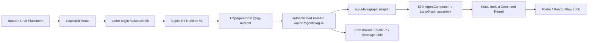

# Ketos Spatial Workspace — мастер-план разработки MVP в 10 этапов

> **Для agentic workers:** выполнять этот план через `superpowers:subagent-driven-development` или `superpowers:executing-plans`. Каждый этап использует не менее 10 практических субагентов, но одновременно работают только 3–5. Следующий этап не начинается до полного `PASS` предыдущего.

**Цель:** быстро получить рабочий MVP Ketos с одним доказанным вертикальным сценарием: `Project → Board → Note / Chat / Automation → существующий Flow Editor → запуск Flow → результат → AI preview / confirmation → восстановление после перезапуска`.

**Архитектура:** `Folder` остаётся Project, `Flow` остаётся Automation, `Job` остаётся запуском, а `MessageTable` — хранилищем сообщений. Новые Board, Placement, BoardNote, ChatThread и ChatRun расширяют Ketos, не создавая второй продуктовый backend. React-чат строится на CopilotKit, обмен с агентом — на AG-UI, а существующий KFX/LangGraph остаётся единственным агентным runtime.

**Стек:** Python/FastAPI, SQLModel/Alembic, SQLite как локальная MVP-БД, PostgreSQL как обязательная проверка совместимости миграций, React/TypeScript, React Router, TanStack Query, Zustand, `@xyflow/react`, CopilotKit React, CopilotKit Runtime v2 как transport-only bridge, AG-UI, `ag-ui-langgraph`, существующий KFX `AgentComponent` с внутренним LangGraph runtime, pytest, Jest, по одному focused stage smoke и один финальный Playwright-сценарий.

**Повторно проверенный baseline:** `main@5fe1cb74fe8b2db8b48f66859cfbf72e56cf3782`, Alembic head `9a6e34f1c2d8`. Historical source-audit SHA `80878261d07c21ad257de017d98069f211ada2c2` сохранён только как provenance; `git diff --quiet 80878261d07c21ad257de017d98069f211ada2c2 5fe1cb74fe8b2db8b48f66859cfbf72e56cf3782 -- src` даёт `PASS`. Обновлённый Graphify snapshot построен точно на текущем HEAD: `66 028` nodes, `131 650` links, SHA-256 `03c2ececa6d6a2e93f0afa8b80828f67cc52dedf4c355c9df51572467fb1298b`. Graphify используется read-only для навигации; source и runtime остаются authoritative. Сейчас CopilotKit во frontend отсутствует, готового AG-UI endpoint нет, KFX содержит только AG-UI schemas и LangGraph-backed `AgentComponent`, а AssistantPanel использует собственные widgets и SSE parser.

---


## 1. Что считается готовым MVP

MVP завершён, если один пользователь может:

1. создать или выбрать Project;
2. создать Board и открыть отдельный пространственный canvas;
3. разместить, переместить и сохранить Note;
4. разместить несколько независимых Chat и вести историю через CopilotKit/AG-UI;
5. разместить существующий Flow как Automation;
6. открыть Automation в существующем полноэкранном Flow Editor, вручную изменить и сохранить Flow;
7. запустить Flow с Board и увидеть terminal status и безопасный результат;
8. попросить AI создать или изменить Flow, увидеть preview, явно подтвердить или отклонить изменение;
9. перезапустить backend/frontend и получить те же Project, Board, viewport, placements, Chat history, Automation и terminal result;
10. повторить весь путь на чистой тестовой БД и на одном exact SHA.

MVP не заявляется как production-ready или commercial release. Проверяется фактическая работоспособность выбранного пути, а не полнота всей платформы.

## 2. Жёсткие архитектурные границы

- **Единственный business/agent backend — Ketos.** Официальный CopilotKit JS runtime разрешён только как transport bridge для OSS-сценария: он не хранит доменные данные, не выбирает модель, не исполняет tools и не становится system of record.
- **Board не равен Flow.** Board geometry и viewport не записываются в `Flow.data`; Board links не являются Flow edges.
- **Entity не равен Placement.** Закрытие или удаление Placement не удаляет Note, Chat, Flow или Job. Удаление entity — отдельное действие.
- **Reuse first.** `Project = Folder`, `Automation = Flow`, `Execution = Job`, `Message body = MessageTable`.
- **Workspace — UI shell, не таблица.** Новая Workspace DB entity запрещена.
- **Один редактор.** MVP открывает существующий полноэкранный `FlowPage`; встроенные editable editor instances и editor leasing отложены.
- **Actor только server-derived.** `actor_id`, роли и ownership не принимаются как доверенные поля от browser, LLM или AG-UI input.
- **MVP owner-only.** Project/Board/Note/Chat/Automation/Job/Command доступны только владельцу `Folder`; child routes сначала авторизуют родительский Project. `user_id IS NULL` не означает public. Shared-project RBAC остаётся Post-MVP.
- **Один frontend API seam.** Board/Note/Placement/Chat/Execution hooks используют существующие `api` + `UseRequestProcessor` с credentials/auth refresh; raw `fetch` допустим только внутри официально подключённого CopilotKit transport package.
- **KFX ABI неизменяем.** Persisted component class names, graph identifiers и extension manifests не переименовываются.
- **Нет realtime co-editing.** Для stale writes достаточно revision/hash conflict; CRDT/OT отложены.
- **Только web MVP.** Electron/OpenSwarm backend, arbitrary web cards и desktop embedding не входят в план.
- **Python только через `uv run`.** Исключение — внешние системные утилиты, не импортирующие repo Python.
- **Dirty safety.** Не менять unrelated dirty files, generated artifacts, deployment config, `LICENSE`, `NOTICE` и lock-файлы вне явно назначенного dependency registrar.
- **MVP verification.** Для каждой задачи требуется один focused test/smoke; coverage-проценты, exhaustive matrices и длительное наблюдение запрещены в основном потоке.
- **Critical rule.** Любой Critical, позволяющий нарушить именно MVP-сценарий, исправляется до перехода. Остальные подтверждённые production-hardening gaps честно переносятся в Post-MVP.

## 3. Обязательная граница CopilotKit / AG-UI / LangGraph



### 3.1 Запрещённая собственная разработка

Нельзя создавать:

- собственный chat body, message list, composer или streaming UX вместо CopilotKit;
- собственный SSE/WebSocket/event protocol поверх AG-UI;
- generic tool-call renderer;
- второй agent runtime, второй LangGraph, model router или MCP orchestrator;
- custom interrupt/resume events;
- browser-authoritative применение Flow patch;
- новый agent, который дублирует существующий KFX/LangGraph agent.

Ketos-specific custom допускается только для:

- `ChatThread` и `ChatRun` persistence;
- адаптации `MessageTable`;
- Project/Board/Placement/BoardNote;
- auth/authz;
- durable replay и idempotency;
- Command Kernel для AI preview/confirmation/apply;
- тонкой привязки стандартных AG-UI идентификаторов к Ketos IDs.

### 3.2 Подтверждённый deployment contract

Context7 использован с библиотеками:

- CopilotKit: `/copilotkit/copilotkit`;
- AG-UI: `/ag-ui-protocol/ag-ui`;
- LangGraph Python: `/langchain-ai/langgraph`.

Для каждой dependency-sensitive задачи implementation agent обязан сначала выполнить отдельный Context7 resolve/query и приложить library ID, выбранную версию и проверенный contract к handoff. Если Context7 недоступен, изменение внешнего API/SDK не начинается и задача получает `BLOCKED`; память модели или неподтверждённый пример не считаются документацией. Official docs используются как второй источник для сверки.

Документационные источники:

- [CopilotKit + LangGraph Python](https://docs.copilotkit.ai/langgraph-python)
- [CopilotKit Runtime](https://docs.copilotkit.ai/langgraph-python/backend/copilot-runtime)
- [AG-UI events](https://docs.ag-ui.com/concepts/events)
- [AG-UI interrupts](https://docs.ag-ui.com/concepts/interrupts)
- [LangGraph persistence](https://docs.langchain.com/oss/python/langgraph/persistence)
- [LangGraph interrupts](https://docs.langchain.com/oss/python/langgraph/interrupts)

Для MVP зафиксирован один OSS transport shape: `@copilotkit/react-core/v2` → `@copilotkit/runtime/v2` + `/v2/node` → `HttpAgent` → authenticated FastAPI AG-UI adapter → KFX/LangGraph. Python adapter принимается только после executable artifact probe: он обязан emit standard `RUN_FINISHED.outcome.type="interrupt"`, consume `RunAgentInput.resume[]`, поддерживать all-open-interrupt semantics и не требовать legacy custom event/deprecated forwarded command. Опубликованный `ag-ui-langgraph 0.0.42` этому контракту **не соответствует** и явно отклонён. Stage 01 может закрепить более новый release либо immutable upstream commit только после hash/LICENSE/API/behavior proof; если такого artifact нет, этап `BLOCKED`, custom wrapper/protocol запрещён. Endpoint закрывается auth middleware до adapter invocation. Same-origin Node forward-ит Bearer либо sanitized HttpOnly `access_token_lf`, но не refresh/API-key cookies.

AG-UI pause/resume выражается не выдуманными событиями: state/message snapshots предшествуют `RUN_FINISHED` с `outcome.type="interrupt"`; MVP использует core reason `confirmation`, сохраняет `interruptId` и все открытые interrupts. Resume — новый `RunAgentInput` с тем же `threadId`, новым `runId` и responses для каждого open interrupt; partial/stale/invalid resume даёт `RUN_ERROR`. Approve — `resolve({approved:true})`, Reject — `resolve({approved:false})`; `cancel()` означает abandonment, не business rejection. Deprecated `forwarded_props.command.resume` запрещён. LangGraph использует stable `thread_id`, file-backed `AsyncSqliteSaver`, `LANGGRAPH_STRICT_MSGPACK=true`, `interrupt(...)` и `Command(resume=...)`; node после resume выполняется заново.

## 4. Минимальная доменная модель MVP

| Сущность | MVP contract | Что не создаётся сейчас |
| --- | --- | --- |
| `Folder` | Project identity и ownership; существующие create/list/rename/open | Новая Project table, pin/archive/reorder migration |
| `Board` | Project FK, `created_by_id`, title, viewport x/y/zoom, revision, timestamps; authorization через Folder owner | BoardUserState, collaboration records |
| `Placement` | Board FK, target kind/id, x/y/w/h/z, display state, revision | Generic registry, typed FK migration для каждого будущего target |
| `BoardNote` | Project, `created_by_id`, safe Markdown content, color, revision; authorization через Folder | Flow NoteNode conversion pipeline и collaborative rich text |
| `ChatThread` | Project, `created_by_id`, title/model/context/archive/revision; authorization через Folder | ChatLegacySession и ChatTurn |
| `ChatRun` | chat, request fingerprint, unique `(chat_id,idempotency_key)`, AG-UI run ID, LangGraph thread ID, status, replay cursor | Полный event store, cost ledger, multi-epoch analytics |
| `MessageTable` | Сохраняет существующие `text`/files/session/context/`run_id`; получает nullable FK `chat_id`, nullable FK `chat_run_id`, positive `chat_sequence` и unique `(chat_id,chat_sequence)` для новых Chat rows | Копия message body в новой таблице |
| `Flow` / `FlowVersion` | Automation, DB-level `Flow.revision` CAS и pinned immutable-content snapshot перед AI apply | Automation duplicate table, embedded editor instance table |
| `Job` | Owned execution identity/status; atomic claim/finalize, `job_metadata.mvp` содержит bounded result projection и Flow hash | ExecutionResult table, lease/fencing engine |
| `CommandProposal` | AI proposal/hash/base Flow revision/status/idempotency/outcome/pinned snapshot | Generic command bus, outbox, compensation engine |

Placement target в MVP хранится как bounded enum `note | chat | automation | job_result` плюс UUID. Service обязан проверить существование target и совпадение Project перед записью. Typed foreign keys и DB-level exactly-one-target hardening переносятся в Post-MVP, чтобы не строить цепочку миграций раньше самих target tables.

## 5. Трассировка требований

### 5.1 Карта R-01–R-40

| ID | Disposition | Владелец / доказательство |
| --- | --- | --- |
| R-01 | MVP: Board pan/zoom/coordinates/viewport restore. | S03-A07/A08/A10; `board-viewport.spec.ts`. |
| R-02 | MVP provenance: OpenSwarm только reference. | S01-A10; source guard. |
| R-03 | MVP: patterns only; Electron/backend/state не портируются. | S01-A03/A10; bridge source scan. |
| R-04 | MVP: chat-window UX только CopilotKit. | S05-A06/A07/A10; Chat browser smoke. |
| R-05 | MVP: несколько независимых Chat; 20 simultaneous streams — PM-05. | S05-A08/A10. |
| R-06 | MVP: общий CardFrame move/resize/collapse/maximize/close. | S04-A06/A10 и S05-A07. |
| R-07 | MVP: ChatThread/MessageTable identity/history/model/context; geometry в Placement. | S05-A01/A02/A03. |
| R-08 | MVP: close Placement сохраняет Chat/history. | S05-A09/A10. |
| R-09 | MVP: create/rename/title-search/open; federated search — PM-07. | S05-A04/A08. |
| R-10 | MVP: AI создаёт Automation. | S08-A03/A10. |
| R-11 | MVP: 0–5 уточнений только при существенной неоднозначности. | S08-A05/A10. |
| R-12 | MVP: typed edits nodes/params/edges. | S08-A03/A04. |
| R-13 | MVP: structured preview до apply. | S08-A03/A08. |
| R-14 | MVP: явное одноразовое confirmation. | S08-A05/A06/A10. |
| R-15 | MVP: FlowVersion snapshot, DB-CAS и восстановление последнего pre-AI snapshot; полный version browser — PM-07. | S08-A01/A06/A07/A10. |
| R-16 | MVP: Automation как Placement. | S06-A03/A07/A10. |
| R-17 | PM-06: embedded editable Flow Editor; MVP открывает существующий fullscreen editor. | S06-A05/A08/A10 smoke. |
| R-18 | MVP: ручное изменение Flow сохраняется. | S06-A08/A10. |
| R-19 | MVP: fullscreen Flow Editor с URL-backed return context. | S06-A05/A08. |
| R-20 | MVP: запуск Flow с Board через session-auth adapter. | S07-A03/A06/A10. |
| R-21 | MVP UI states: `queued`, `running`, `waiting_confirmation`, `succeeded`, `failed`, `cancelled`, `unknown`. | S07-A03/A07 и S08-A08. |
| R-22 | MVP: bounded text/JSON result рядом с Automation; generic renderer — PM-07. | S07-A04/A08/A10. |
| R-23 | MVP: отдельная BoardNote с минимальным safe Markdown formatting; collaborative rich text — PM-07. | S04-A03/A07/A10. |
| R-24 | PM-07: semantic Board Relations. | Post-MVP gate. |
| R-25 | MVP invariant: Board relation никогда не становится Flow edge. | S03-A07 и S04-A02 source guards. |
| R-26 | MVP: несколько Boards в Project. | S03-A05/A10. |
| R-27 | MVP: per-Board viewport/layout/open state. | S03-A08, S04-A02, S09-A06. |
| R-28 | MVP: Project create/list/rename/open; pin/tree/archive/restore — PM-07. | S02-A05/A06/A10. |
| R-29 | MVP: минимальная Project/Board/Chat/Automation navigation; полная IA — PM-07. | S02–S06 integration owners. |
| R-30 | PM-07: federated permission-first search. | Post-MVP gate. |
| R-31 | PM-07: scheduler и Scheduled UI. | Post-MVP gate. |
| R-32 | MVP: Automation открывает существующий fullscreen editor. | S06-A05/A08/A10. |
| R-33 | MVP: существующий Settings entrypoint сохраняется. Перестройка IA — PM-07. | S10-A08/A10; Settings smoke. |
| R-34 | PM-02/PM-10: telemetry-backed legacy UI removal; в MVP legacy UI не удаляется. | Post-MVP gate. |
| R-35 | MVP: existing tokens, RU/EN, desktop keyboard path; полный design audit — PM-08. | S03–S10 frontend owners; S10-A08. |
| R-36 | MVP: restore после реального backend process restart. | S09-A09/A10. |
| R-37 | MVP: Job/Command history, restore outcome и pinned FlowVersion; полный audit ledger — PM-09. | S07-A04, S08-A07, S09-A04/A05. |
| R-38 | MVP: strict owner-only auth на reachable routes; full RBAC matrix — PM-03/PM-09. | Backend service/API owners каждого этапа. |
| R-39 | MVP: allowlist и confirmation для run/AI mutation; generic capability framework — PM-09. | S07-A03 и S08-A03/A06. |
| R-40 | MVP: focused Flow Editor/API/KFX/LFX compatibility. | S06-A10, S08 gate, S10-A10/final gate. |

### 5.2 Нормативные AC-01–AC-12

| ID | Исходное ограничение и MVP disposition | Владелец / проверка |
| --- | --- | --- |
| AC-01 | Везде используется имя Ketos. | Все agents; S10-A10 source/doc scan. |
| AC-02 | Все новые system-owned строки имеют ru/en parity. | Frontend owners; `npm run i18n:check`. |
| AC-03 | Board, Chat, Automation и AI-команды используют единый Ketos backend; JS Runtime только stateless transport. | S01-A03/A10 source scan. |
| AC-04 | Existing Flow Editor/API/KFX/LFX переиспользуются; incompatible change требует versioning/migration. | S06/S08/S10 compatibility gates. |
| AC-05 | Persisted KFX component class names не переименовываются. | S08-A04 negative ABI test; KFX/LFX gates. |
| AC-06 | Board canvas и executable Flow graph разделены. | S03-A07, S04-A02 source guards. |
| AC-07 | Delete Placement не удаляет entity без отдельной команды. | S04-A02/A10, S05-A09. |
| AC-08 | AI имеет только typed allowlisted commands; arbitrary backend/filesystem/registry/MCP/model changes запрещены. | S08-A03/A04/A09. |
| AC-09 | Mutation проходит auth, authz, validation, risk, durable Command audit и error handling. | S07-A03, S08-A02/A06/A07. |
| AC-10 | Risky Flow mutation имеет preview и одноразовое confirmation. | S08-A05/A06/A08/A10. |
| AC-11 | Для новых пустых tables и additive columns MVP выполняет expand + validate и SQLite/PostgreSQL dialect gates; backfill/dual-read/contract для существующих production data обязателен в PM-04 до production rollout. Никакой destructive contract не входит в MVP. | Migration owner каждого schema-stage; global migration execution/model-parity. |
| AC-12 | Unrelated dirty/generated/deployment/lock/license файлы не меняются; lock files меняет только назначенный dependency registrar. | Coordinator pre/post status и range diff. |

### 5.3 NFR-01–NFR-10

| ID | Нормативное требование и пропорциональная MVP-реализация | Полное развитие |
| --- | --- | --- |
| NFR-01 | Revision/CAS для Board/Placement/Note/Chat/Flow/Command. | CRDT/OT — PM-05/PM-09. |
| NFR-02 | Disconnect/restart приводит к проверяемому terminal или recoverable status. | Multiworker recovery/HA — PM-05/PM-09. |
| NFR-03 | Основной путь доступен с клавиатуры; focus входит во вложенный canvas явно и возвращается. | Полный accessibility audit — PM-08. |
| NFR-04 | Тяжёлые Chat/Editor surfaces lazy-mount; offscreen Chat не требует активного stream. | Virtualization/20 streams/soak — PM-05. |
| NFR-05 | Stream/Command/Execution сохраняют request ID, sequence, duration, outcome и redacted audit payload в существующих/новых bounded records. | Metrics/tracing/export — PM-02/PM-09. |
| NFR-06 | ru/en plural/interpolation parity; нет нового hardcoded system English. | Full IA/content audit — PM-08. |
| NFR-07 | Legacy Flow corpus, class names и extension manifest ABI сохраняются; focused KFX/LFX compatibility. | Полные suites/coverage — PM-01. |
| NFR-08 | Custom code/external integrations считаются untrusted; MVP не добавляет arbitrary code/egress и применяет allowlists. | Sandbox/egress route audit — PM-03/PM-09. |
| NFR-09 | SQLite локально; PostgreSQL migration/model dialect проверяется на каждом schema-stage. | Production data rollout/HA — PM-04/PM-09. |
| NFR-10 | Default-off end-to-end feature flag отключает новый UI без потери новых данных; backward data APIs остаются читаемыми. | Canary/removal — PM-10. |

Ни одно требование не удалено: оно либо имеет MVP owner и focused proof, либо явно вынесено в Post-MVP.

## 6. Общая модель работы субагентов

На каждом этапе участвуют десять логических субагентов `Sxx-A01…Sxx-A10`. Один и тот же постоянный пул специалистов можно переиспользовать между этапами, но агент засчитывается только после практического результата: production code, migration, component, integration wiring, focused fixture/test или executable recovery tooling.

### 6.1 Параллельность

- Каждый этап содержит dependency DAG, а не фиктивный одновременный старт producer и consumer от одного SHA.
- Волна A: сначала schema/dependency/API producer проходит focused gate и micro-sync; затем от нового SHA запускаются до пяти независимых consumers. Пока producer работает, другие агенты могут писать неимпортирующие его fixtures, UI shell или characterization tests по frozen contract.
- Sync A: coordinator последовательно cherry-pick/merge в порядке DAG, запускает focused checks и фиксирует новый SHA.
- Волна B: ещё пять практических агентов стартуют только после Sync-A; integration/registrar consumer стартует после готовности всех его входов.
- Sync B: coordinator объединяет результат и запускает stage gate и явно указанный compatibility command.
- Одновременно активно не более пяти и не менее трёх агентов, пока существуют три независимые задачи.
- Alembic revision/head, model exports, `api/v1/__init__.py`, `api/router.py`, `routes.tsx`, package manifests/обе lock attestations и locale registrars имеют одного владельца и сливаются последовательно.
- Frontend build, Playwright и тяжёлые package commands никогда не запускаются параллельно.

### 6.2 Worktree и merge discipline

Используются один clean integration worktree и максимум пять переиспользуемых lane worktrees. Для каждой задачи создаётся короткоживущая ветка `codex/mvp-sXX-aYY-*` от текущего sync SHA. Корневой dirty checkout не используется для реализации.

Assignment каждого агента содержит: base SHA, writable paths, forbidden paths, ожидаемый кодовый deliverable, focused command, interface dependency и commit SHA. Агент не редактирует файлы другого lane. Только coordinator объединяет branches.

`Sxx-A10` — compatibility/integration owner, но не чистый reviewer: он обязан написать integration wiring, fixture или E2E/harness и исправить совместимость в своём scope. Независимая проверка coordinator не считается одним из десяти практических агентов.

### 6.3 Универсальный цикл задачи

1. Зафиксировать ожидаемое поведение одним focused test или executable smoke.
2. Реализовать минимальный код.
3. Запустить focused command.
4. Исправить Critical/блокирующий дефект.
5. Повторить focused command.
6. Передать commit, changed paths, command и результат coordinator.

Процент покрытия, повтор всего repository suite и коммерческий аудит не требуются. Статусы строгие:

- `PASS` — все задачи этапа выполнены и весь stage gate зелёный на одном SHA;
- `BLOCKED` — отсутствует внешний или локально неустранимый prerequisite, после исчерпания безопасных alternatives; test failure сам по себе не blocker;
- `FAIL` — проверка запущена, но acceptance не достигнут либо остался blocking defect;
- `PARTIAL` и любые четвёртые статусы не разрешены; переход возможен только после `PASS`.

### 6.4 Обязательные cross-stage gates

- Каждый schema-stage после своего focused test запускает существующие migration execution/model-parity checks отдельно на SQLite и disposable PostgreSQL. Отсутствующий `MVP_POSTGRES_URI` даёт `BLOCKED`, а не skip/PASS. Production census/backfill при этом остаётся PM-04.
- Каждый frontend stage использует existing semantic tokens/`components/ui`; raw colors запрещены, кроме persisted custom Note color preview. A10 пишет integration wiring и исправляет compatibility, coordinator независимо повторяет gate.
- Compatibility invariant по этапам: S01 — legacy Flow route и Job developer API; S02 — Project/Folder/Flow navigation; S03–S05 — Flow canvas/NoteNode/legacy Assistant isolation; S06 — Flow Editor; S07 — v2 workflow regression; S08 — KFX + LFX; S09 — all prior persistent IDs; S10 — полный focused corpus. Все входящие изменения должны быть объединены до stage PASS.

---

## Этап 01 — Admission и доказательство CopilotKit/AG-UI vertical bridge

### Контекст

Frontend пока не содержит CopilotKit. `assistant-panel.tsx`, `use-assistant-chat.ts` и `use-post-assist-stream.ts` реализуют собственные chat widgets и custom streamed POST/SSE parsing. Готового AG-UI endpoint нет: KFX содержит schemas и `AgentComponent`, внутри которого создаётся LangGraph graph; текущий Flow Builder снаружи остаётся KFX Graph. Этап создаёт новый официальный bridge и доказывает его на реальном KFX agent/tool seam. Одновременно закрывается reachable fail-open Job ownership defect, чтобы последующие этапы не строились выше небезопасного floor.

### Цель

Доказать зафиксированный путь `CopilotKit React → Runtime v2 → HttpAgent → authenticated FastAPI → ag-ui-langgraph → KFX AgentComponent/LangGraph`, включая text, реальный read-only KFX tool seam, state и interrupt/resume. Закрепить его как transport contract для Этапа 05, default-off feature flag и ранний Job authorization floor. Продуктовый Chat domain пока не создавать.

### Инструменты и документация

Context7 IDs из §3.2, primary docs, FastAPI, AG-UI LangGraph adapter candidates, `langgraph-checkpoint-sqlite`, CopilotKit/AG-UI JS, pytest/Jest/Playwright. Повторная проверка подтвердила JS candidates `1.63.1 / 1.63.1 / 0.0.57` и SQLite saver `3.1.0`, но rejected Python adapter `0.0.42`. A01 обязан найти и доказать совместимый immutable Python artifact либо поставить честный `BLOCKED`; decision фиксирует versions, commit/hash, LICENSE и probe output.

### Зависимости

Только baseline repo и доступная локальная среда. Если зафиксированный OSS runtime не соединяется с FastAPI AG-UI agent без custom protocol, этап `BLOCKED`.

### Волна A — пять задач bounded-волны

| ID / субагент | Реализация и owned paths | Верификация задачи |
| --- | --- | --- |
| S01-A01 — dependency/admission registrar | Сначала создать `test_ag_ui_adapter_contract.py`, который отклоняет 0.0.42 и требует standard outcome/resume. Найти release либо immutable upstream commit, проверить hash/LICENSE/API/behavior; только затем закрепить frontend/Node/Python packages и все locks/ownership manifest. | Artifact probe доказывает standard interrupt/resume без deprecated path; frozen installs и lock ownership PASS. Нет artifact — `BLOCKED` без package edits. |
| S01-A02 — FastAPI/KFX probe | После A01 создать adapter endpoint вокруг выделенной assembly поверх KFX seam, за auth middleware; constructor/API берётся только из proven artifact, не из документационного предположения. | No auth deny до adapter; text/read-only KFX tool standard events; legacy/custom event path не вызывается. |
| S01-A03 — transport bridge | Создать Node listener с fixed HttpAgent URL. Runtime forward allowlist содержит Authorization и sanitized Cookie только с `access_token_lf`; middleware удаляет refresh/API-key cookies, проверяет same-origin Origin/Host. Static auth/browser target/API key запрещены. | Build/typecheck; cookie-only reload и Bearer success; expired deny; sensitive cookies/logs отсутствуют; target injection ignored. |
| S01-A04 — React probe | Создать feature-flagged probe на `/v2` provider/stock Chat; не импортировать legacy Assistant UI/parser. | Focused Jest: один provider, same-origin Runtime URL, stock body. |
| S01-A05 — Job safe floor | Исправить protected Job list/get/stop/cancel exact-owner, NULL deny, `created_timestamp`; создать focused `test_mvp_job_ownership.py` и инвертировать legacy expectations. | Новый focused test + затронутые v2 workflow cases; owner success, foreign/NULL deny, rows не удалены. |

### Sync A

A01 и независимый A05 стартуют первыми. После dependency micro-sync A02/A03/A04 работают параллельно; coordinator объединяет A01 → A02/A03/A04 и отдельно A05. Package/locks имеет одного владельца A01. Фиксируются exact versions и wire fixtures. Только после transport build + authenticated KFX text/tool PASS открывается Волна B.

### Волна B — пять задач bounded-волны

| ID / субагент | Реализация и owned paths | Верификация задачи |
| --- | --- | --- |
| S01-A06 — auth/actor binding | FastAPI принимает forwarded Bearer либо sanitized `access_token_lf`, повторно auth каждый run/resume и связывает actor с owned thread/run; body/header actor/model ignored. | Cookie-only after reload, actor swap, foreign thread/run, expired credential и forged actor tests. |
| S01-A07 — KFX tool/state probe | Подключить безопасный read-only KFX tool и bounded shared state; test-only contract fixture использует официальные AG-UI types, production event parser/guard не создаётся. | Browser/Jest видит standard tool lifecycle и state snapshots; custom `flow_update`/generic renderer отсутствуют. |
| S01-A08 — interrupt/resume probe | File-backed AsyncSqliteSaver + strict msgpack; snapshots, all-open-interrupt resume, approve/reject и invalid/partial/stale cases; pre-interrupt zero effect. | Same thread/new run/new app object; exact replay one effect; deprecated resume path deny. |
| S01-A09 — feature/proxy/orchestration | Провести default-off `mvp_workspace`/`mvp_chat` через KFX → backend config → frontend `useUtilityStore`; добавить Vite `/api/copilotkit` proxy на fixed runtime target и `playwright.mvp.config.ts`/script для трёх процессов. | Flag off делает UI/routes недоступными; proxy не отправляет `/api/copilotkit` в FastAPI; 3-process smoke PASS. |
| S01-A10 — integration owner | Зарегистрировать agent endpoint только через `ketos/agentic/api/router.py` (mount уже делает root router), frontend probe под runtime flag и integration spec. | Chromium через dedicated 3-process config проходит text→tool→state→interrupt→resume; `/flow/:id` smoke зелёный. |

### Последовательность и синхронизация

A06–A09 работают параллельно от Sync-A SHA. A10 после их merge единолично меняет registrars и собирает integration candidate. Probe UI остаётся скрытым default-off flag и не становится продуктовым Chat.

### Ожидаемый результат

Выбран и доказан один официальный deployment contract; exact dependencies закреплены; нет custom chat/protocol/runtime. Этап 05 получает working transport fixture и не исследует архитектуру заново.

### Gate и переход

```bash
uv run pytest \
  src/backend/tests/unit/agentic/api/test_ag_ui_adapter_contract.py \
  src/backend/tests/unit/agentic/api/test_ag_ui_probe.py \
  src/backend/tests/unit/services/jobs/test_mvp_job_ownership.py \
  src/backend/tests/unit/api/v2/test_workflow.py -q
uv run pytest scripts/ci/test_release_lock_ownership.py -q

bash scripts/mvp/chat_stack_smoke.sh

cd src/copilot-runtime
npm run typecheck
npm run build

cd ../frontend
npm test -- --runInBand src/components/core/assistantPanel/__tests__/copilotkit-probe.test.tsx
npm run type-check:production
npx playwright test -c playwright.mvp.config.ts tests/core/integrations/copilotkit-ag-ui-probe.spec.ts --project=chromium
```

`PASS`: найден и pinned совместимый upstream adapter artifact; три процесса подняты; standard text/tool/state/interrupt/resume, auth, checkpoint и Job safe floor доказаны. `BLOCKED`: совместимого immutable upstream artifact/registry access нет. `FAIL`: artifact выбран и проверки запущены, но acceptance не достигнут. Собственный fallback запрещён. Только `PASS` разрешает Этап 02.

---

## Этап 02 — Минимальный Project shell на существующем Folder

### Контекст

`Folder` уже является Project persistence, `/api/v1/projects` — канонический CRUD, `/folders` — compatibility redirect. Текущий Project router содержит encryption, MCP registration/reconciliation, deployment guards и Flow-move side effects; упрощённый duplicate service запрещён. Frontend sidebar уже показывает Projects и реализует create/rename/list/navigation через один folder/project cache namespace. Для MVP добавляется только Board-oriented shell поверх этих seams. NULL-owner Folder не считается публичным Project.

### Цель

Дать пользователю простой Project entrypoint, внутри которого будут создаваться Boards, сохранив существующие Flow associations и routes.

### Инструменты и источники

FastAPI Project router, существующие `ProjectAction`/guards, React Router, TanStack Query, folder queries/store, RU/EN locale files. Source truth: `api/v1/projects.py`, `api/v1/folders.py`, `services/database/models/folder/model.py`, `folderSidebarComponent`, `pages/MainPage/pages/main-page.tsx`.

### Зависимости

Этап 01 `PASS`. Chat transport не используется, но общий MVP flag и clean integration worktree уже существуют.

### Волна A — пять задач bounded-волны

| ID / субагент | Реализация и owned paths | Верификация задачи |
| --- | --- | --- |
| S02-A01 — Project characterization | Добавить characterization tests текущих create/list/get/rename с encryption/MCP/deployment/Flow-move side effects. Extraction допускается только целиком, если нужна переиспользуемая операция; новый урезанный CRUD facade запрещён. | Existing Project side effects и response shapes зафиксированы; чужой/NULL-owned Folder не открывается как обычный Project. |
| S02-A02 — owner-only Project API | Минимально исправить canonical `api/v1/projects.py`: list/read/rename имеют одинаковую owner-only политику; system folders получают явную classification, а не NULL-as-public. Сохранить `/folders` redirect. | `test_projects.py`, `test_folders.py`, `test_flow_folder_integrity.py`: owner create/list/open/rename; foreign/NULL list/open/rename deny. |
| S02-A03 — existing client contract | Добавить Project type alias и characterization к существующим `queries/folders` hooks/PROJECTS URL; не создавать `queries/projects` cache namespace. | Jest доказывает те же IDs, mutations и invalidation; duplicate Project store/query отсутствует. |
| S02-A04 — Project shell | Создать `src/frontend/src/pages/ProjectPage/{index.tsx,__tests__/index.test.tsx}` с Project title, empty/loading/error и outlet для Board list. | Focused Jest: valid Project renders; unknown/foreign ID не раскрывает metadata. |
| S02-A05 — existing sidebar create/list | Адаптировать существующие `folderSidebarComponent/.../sideBarFolderButtons` header/actions для перехода в Board shell; не создавать второй ProjectList/Create dialog. | Existing create создаёт один Folder, обновляет канонический список и открывает Board shell без reload. |

### Sync A

Сначала A01/A02 фиксируют и, при необходимости, минимально исправляют полный существующий contract; после backend micro-sync A03–A05 работают по frozen response. Никакой duplicate Project CRUD/service/cache не принимается. После API/TS fixture sync стартует Волна B.

### Волна B — пять задач bounded-волны

| ID / субагент | Реализация и owned paths | Верификация задачи |
| --- | --- | --- |
| S02-A06 — existing rename | Доработать существующий inline rename/error/focus path; новый Rename dialog не создавать. | Rename меняет `Folder.name`; Flow IDs/folder_id стабильны; server error показан. |
| S02-A07 — Board entry/project scope | Добавить Board entry и передавать validated current `projectId` в sidebar create/drop actions; fallback в `myCollectionId` на Project/Board routes запрещён. | Drag/drop/create на Project P всегда использует P; legacy Flow navigation сохраняется. |
| S02-A08 — routes/header classification | Единолично добавить lazy authenticated `/project/:projectId/boards` и classification Project/Board как sidebar routes; старые Folder/Flow routes не удалять. | Route + `header-visibility` tests: Project/Board имеет ровно один account/Settings entry; direct Flow сохраняет legacy header behavior. |
| S02-A09 — i18n/states | Добавить только используемые Project/Board entry strings в `src/frontend/src/locales/{en.json,ru.json}` и basic keyboard/focus states. | `npm run i18n:check`, locale key parity и dialog focus return PASS. |
| S02-A10 — integration owner | Собрать shell в точном `src/frontend/src/pages/MainPage/pages/main-page.tsx`, создать Project smoke и исправить route/cache compatibility. | Browser: create→rename→reload→open; existing Flow доступен. |

### Параллельность и merge

A06, A07 и A09 параллельны. A08 — единственный route registrar. A10 интегрирует после их merge. Никаких миграций и новых Project authorization enums в этом этапе.

### Ожидаемый результат

Project отображается под существующим Folder ID, создаётся, переименовывается и открывается; Board list route готов; существующие Flow/Folder routes не сломаны.

### Gate и переход

```bash
uv run pytest -q \
  src/backend/tests/unit/api/v1/test_projects.py \
  src/backend/tests/unit/api/v1/test_folders.py \
  src/backend/tests/unit/api/v1/test_flow_folder_integrity.py

cd src/frontend
npm test -- --runInBand \
  src/pages/ProjectPage/__tests__/index.test.tsx \
  src/components/core/folderSidebarComponent/components/sideBarFolderButtons \
  src/components/core/appHeaderComponent/header-visibility.test.ts
npm run i18n:check
npx playwright test tests/core/features/project-mvp.spec.ts --project=chromium
```

`PASS`: только Folder хранит Project; create/list/rename/open и ownership работают; legacy Flow navigation работает. Pin/tree/archive/search не блокируют. Только `PASS` разрешает Этап 03.

---

## Этап 03 — Board persistence, canvas и viewport

### Контекст

Текущий `FlowPage` и `flowStore` принадлежат исполняемому Flow Editor. BoardPage отсутствует. MVP нужен отдельный canvas, который пока содержит ноль placements и хранит только Board identity и viewport.

### Цель

Пользователь создаёт несколько Boards в Project, открывает независимый `@xyflow/react` canvas, делает pan/zoom и после reload видит тот же viewport.

### Минимальный контракт

`Board(id, project_id, created_by_id, title, viewport_x, viewport_y, viewport_zoom, revision, created_at, updated_at)`. Authorization всегда идёт через strict owner `Folder`; `created_by_id` — provenance. Для MVP viewport хранится на Board: per-user BoardViewport отложен.

API: `POST/GET /api/v1/projects/{project_id}/boards`, `GET/PATCH/DELETE /api/v1/boards/{board_id}`, `PUT /api/v1/boards/{board_id}/viewport`. Update — настоящий DB-CAS `WHERE id AND revision=:expected`, `revision=revision+1`, `rowcount==1`; loser получает `409` без write.

### Инструменты и источники

SQLModel/Alembic, FastAPI, `@xyflow/react` v12, TanStack Query, transient Zustand store. Документация React Flow viewport/onMoveEnd, FastAPI APIRouter и Alembic operations проверяется через Context7/official docs перед реализацией.

### Зависимости

Этап 02 `PASS`; stage base содержит канонический Project route. Миграция строится от фактического Alembic head и проходит single-head execution/model-parity на чистых SQLite и PostgreSQL test DB.

### Волна A — пять задач bounded-волны

| ID / субагент | Реализация и owned paths | Верификация задачи |
| --- | --- | --- |
| S03-A01 — Board model/migration | Создать `services/database/models/board/{__init__.py,model.py}` и additive migration; единолично обновить model registrar. | Project FK, created_by provenance, zoom/revision constraints, SQLite/PostgreSQL upgrade/downgrade/model parity и single head. |
| S03-A02 — Board service | После A01 micro-sync создать service: strict Project owner guard и conditional DB-CAS для rename/viewport. | Focused service test и two-writer test: один success, один 409, без lost update. |
| S03-A03 — Board API | Создать `api/v1/boards.py` и schemas; parent Project check предшествует query result. Registrar patch передать A10. | `uv run pytest src/backend/tests/unit/api/v1/test_boards.py -q`: foreign board 404/deny, stale viewport 409. |
| S03-A04 — client contract | Создать `types/board/index.ts` и `controllers/API/queries/boards/**`; query keys включают projectId/boardId. | Focused Jest на create/list/get/patch/viewport hooks. |
| S03-A05 — Board list | Создать `pages/BoardsPage/{index.tsx,__tests__/index.test.tsx}` с create/open/rename/delete и пустым состоянием. | Create/open использует server Board ID; delete требует отдельного action. |

### Sync A

A01 проходит migration micro-gate; затем A02/A03 и независимые client fixture/UI shell lanes продолжаются по frozen DTO. Merge: model → service → API → client → list. Только A01 владеет migration/model exports.

### Волна B — пять задач bounded-волны

| ID / субагент | Реализация и owned paths | Верификация задачи |
| --- | --- | --- |
| S03-A06 — transient store | Создать `src/frontend/src/stores/boardStore.ts` только для mounted board/gesture/hydration state; server остаётся truth. | Store test: switch Board очищает transient state, но не создаёт server entity. |
| S03-A07 — Board canvas | Создать отдельный BoardCanvas с точечным фоном, minimap и zoom controls на `@xyflow/react`; nodes/edges пока пусты, imports `flowStore`/Flow node types запрещены. | Jest/source guard доказывает отдельный canvas и наличие базовой spatial orientation. |
| S03-A08 — viewport hook | Создать `pages/BoardPage/hooks/use-board-viewport.ts`: hydrate до canvas, `fitView=false`, debounced save на `onMoveEnd`, flush при unmount. | Hook test: saved x/y/zoom applied after reload; stale 409 refetches server state. |
| S03-A09 — Board route/nav | Добавить `/project/:projectId/board/:boardId` и New Board entry; менять shared `routes.tsx` только через registrar patch A10. | Route unit: direct URL/reload открывает Board; legacy Flow route unchanged. |
| S03-A10 — integration owner | Зарегистрировать ordinary routers в `api/v1/__init__.py`, frontend routes и browser spec; root router уже mounts v1. | Create two Boards → controls/pan/zoom/reload exact viewport; `/flow/:id` smoke PASS. |

### Ожидаемый результат

Отдельный persistent Board canvas работает, поддерживает несколько Boards и не меняет `Flow.data`.

### Gate и переход

```bash
uv run pytest \
  src/backend/tests/unit/services/board/test_service.py \
  src/backend/tests/unit/api/v1/test_boards.py \
  src/backend/tests/unit/alembic/test_mvp_board_migration.py \
  src/backend/tests/unit/alembic/test_migration_execution.py -q

cd src/frontend
npm test -- --runInBand src/pages/BoardsPage src/pages/BoardPage src/stores/__tests__/boardStore.test.ts
npm run type-check:production
npx playwright test tests/core/features/board-viewport.spec.ts --project=chromium
```

`PASS`: create/list/open/rename/delete, ownership, pan/zoom/reload и multiple Boards доказаны; Flow editor untouched. Только `PASS` разрешает Этап 04.

---

## Этап 04 — Placement, CardFrame и BoardNote

### Контекст

Board пока пуст. Для последующих Note, Chat, Automation и Result нужен один общий Placement lifecycle, но entity content нельзя смешивать с geometry. Flow `NoteNode` связан с Flow store и persisted identifier, поэтому напрямую переносить его на Board нельзя.

### Цель

Создать generic Placement и первую Board entity — BoardNote. Пользователь создаёт Note в центре viewport, редактирует, перемещает, resize/collapse/maximize/close, повторно размещает и восстанавливает её после reload.

### Минимальный контракт

- `Placement`: `id`, `board_id`, `target_kind`, `target_id`, `x/y/width/height/z_index`, `display_state=normal|collapsed|maximized`, `revision`, timestamps; unique `(board_id,target_kind,target_id)`. `maximized` — Board-workspace overlay, не browser Fullscreen API; Escape восстанавливает прежнюю geometry/focus.
- `BoardNote`: `id`, `project_id`, `created_by_id`, safe Markdown `content`, `color`, `revision`, timestamps; auth через Folder.
- `DELETE placement` не вызывает delete entity.
- `DELETE note` — отдельное подтверждаемое действие и удаляет её placements.
- Placement/Note updates используют conditional DB-CAS; service проверяет target existence, Folder owner и совпадение Project.
- Formatting MVP: source textarea + sanitized Markdown preview для bold/list/link; raw HTML и unsafe URL не исполняются.

### Инструменты и источники

SQLModel/Alembic, FastAPI, `@xyflow/react` custom node/NodeResizer/screenToFlowPosition, React Query. `CustomNodes/NoteNode` используется только как UX reference; imports Flow store из нового BoardNote запрещены.

### Зависимости

Этап 03 `PASS`; Board API, BoardPage и viewport contract зафиксированы. Миграция Placement/BoardNote следует за Board migration.

### Волна A — пять задач bounded-волны

| ID / субагент | Реализация и owned paths | Верификация задачи |
| --- | --- | --- |
| S04-A01 — models/migration | Создать Placement/BoardNote models и additive migration; единолично обновить exports. | SQLite/PostgreSQL execution/model-parity, enum/check/unique/revision constraints PASS. |
| S04-A02 — Placement service | После A01 sync создать create/list/move/resize/display/remove/re-place с strict parent owner и DB-CAS. | Close сохраняет entity; foreign target deny; concurrent writers дают winner + 409 loser. |
| S04-A03 — Note service | Создать atomic Note+Placement, safe content/color update и explicit delete; authorization через Folder, не created_by. | Failed placement rollback не оставляет Note; concurrent update CAS; raw HTML/unsafe link rejected or sanitized. |
| S04-A04 — APIs | Создать `api/v1/placements.py` и `api/v1/board_notes.py`; registrar patch передать A10. | API tests различают close Placement и delete Note, проверяют ownership. |
| S04-A05 — client contracts | Расширить `types/board`, создать queries `placements/**` и `board-notes/**`. | Jest: query keys разделяют Board scene, Placement и Note entity; 409 вызывает refetch. |

### Sync A

A01 → A02 → A03 → A04 → A05. DTO freeze включает `placement.id` как ReactFlow node ID и отдельный `target_id`. После backend focused PASS стартует Волна B.

### Волна B — пять задач bounded-волны

| ID / субагент | Реализация и owned paths | Верификация задачи |
| --- | --- | --- |
| S04-A06 — CardFrame | Создать BoardCardFrame на existing UI primitives/semantic tokens: move, resize, collapse, Board-overlay maximize, close; callbacks без entity delete. | Keyboard test: Escape restore geometry/focus; close≠delete; no raw hex кроме persisted note color preview. |
| S04-A07 — scene mapper | Создать `pages/BoardPage/hooks/use-board-scene.ts` и `utils/placement-to-node.ts`; node ID=`placement.id`. | Mapper test сохраняет entity ID отдельно и не создаёт Flow edge. |
| S04-A08 — BoardNote card | Создать BoardNotePlacement с bounded textarea/color и sanitized Markdown preview (bold/list/link) на существующем safe renderer. | Formatting сохраняется; script/raw HTML/unsafe URL не исполняются; нет import Flow NoteNode/store. |
| S04-A09 — interactions | Создать hooks `use-note-placement-actions.ts` и `use-placement-persistence.ts`, controls и delete dialog. PATCH только на drag/resize end. | Jest: create center → move → resize → close → re-place → explicit delete. |
| S04-A10 — integration owner | Подключить node type в `BoardCanvas`, backend registrars и `tests/core/features/board-note-placement.spec.ts`. | Browser reload восстанавливает Note/geometry; existing Flow NoteNode characterization test PASS. |

### Параллельность и merge

A06–A09 не редактируют `BoardCanvas` одновременно; A10 единолично делает wiring. Locale additions идут через A10. Heavy build не нужен — только focused tests и Playwright.

### Ожидаемый результат

Board содержит durable Note с независимой geometry. CardFrame готов для Chat/Automation/Result. Close не уничтожает entity.

### Gate и переход

```bash
uv run pytest \
  src/backend/tests/unit/services/board/test_placement_service.py \
  src/backend/tests/unit/services/board/test_note_service.py \
  src/backend/tests/unit/api/v1/test_placements.py \
  src/backend/tests/unit/api/v1/test_board_notes.py \
  src/backend/tests/unit/alembic/test_migration_execution.py -q

cd src/frontend
npm test -- --runInBand src/components/core/board src/pages/BoardPage
npx playwright test tests/core/features/board-note-placement.spec.ts --project=chromium
```

`PASS`: create/edit/move/resize/close/re-place/reload, ownership и entity/placement separation доказаны. Только `PASS` разрешает Этап 05.

---

## Этап 05 — Durable Chat через CopilotKit и AG-UI

### Контекст

Этап 01 доказал transport. Теперь custom AssistantPanel body и custom streamed parser не должны стать вторым chat stack. Новый product Chat использует stock CopilotKit UI, standard AG-UI events и существующий KFX/LangGraph agent. Старый `/agentic/assist/stream` сохраняется как legacy route, но новый UI его не вызывает.

### Цель

Разместить несколько независимых Chat на Board; создать durable ChatThread/ChatRun; хранить messages в MessageTable; восстановить transcript через standard `MESSAGES_SNAPSHOT`; сохранить close/reopen semantics и basic title search.

### Контракты

- `ChatThread`: immutable ID, Project, created_by provenance, title, server-resolved existing provider/model reference, context policy, archived flag/revision; auth через Folder owner.
- `ChatRun`: Chat FK, AG-UI run ID, LangGraph thread ID, idempotency key/fingerprint, status включая `failed_recoverable`, replay cursor, request/sequence/duration/outcome/redacted audit fields; unique `(chat_id,idempotency_key)`.
- `MessageTable`: nullable FK `chat_id`, nullable FK `chat_run_id`, positive `chat_sequence`, unique `(chat_id,chat_sequence)` для новых Chat rows; существующие `text`, `session_id`, `context_id`, `run_id`, files semantics сохраняются. Service требует оба FK для новых Chat messages; `session_metadata` никогда не является auth source.
- Повтор same key+same fingerprint возвращает существующий ChatRun; same key+different fingerprint даёт `409`.
- Token deltas не являются durable truth; reconnect получает `MESSAGES_SNAPSHOT` из committed MessageTable rows.
- AG-UI shared state содержит только bounded ephemeral context (`projectId`, `boardId`, selected Automation ID, current proposal status). Durable Project/Board/Flow state читается из Ketos API/DB и никогда не восстанавливается из `STATE_DELTA`.

### Инструменты и источники

Chosen Stage-01 CopilotKit contract, standard AG-UI `RunAgentInput`/events, official FastAPI LangGraph AG-UI adapter, existing KFX Agent, SQLModel/Alembic, MessageTable, CardFrame. `services/chat` уже занят cache service, поэтому новый domain package называется `services/chat_threads`.

### Зависимости

Этапы 01 и 04 `PASS`; transport fixture, Board/Placement/CardFrame доступны. Если выбранный CopilotKit contract больше не проходит pinned integration test, этап `BLOCKED`, а не переписывает chat UI.

### Волна A — пять задач bounded-волны

| ID / субагент | Реализация и owned paths | Верификация задачи |
| --- | --- | --- |
| S05-A01 — chat models/migration | Создать ChatThread/ChatRun, расширить MessageTable и additive migration. Единственный registrar. | FK/positive sequence/обе unique constraints, nullable legacy compatibility и SQLite/PostgreSQL migration parity. |
| S05-A02 — repository/idempotency | После A01 sync создать CRUD, DB-CAS ChatThread update, atomic unique run claim и committed sequence assignment. | Same replay без duplicates; changed fingerprint 409; two writers не дублируют sequence/run. |
| S05-A03 — MessageTable adapter | Создать load/append/commit + MessagesSnapshot; auth join `MessageTable → ChatThread → Folder`; legacy Flow messages остаются отдельным path. | Ordered DB transcript; forged `session_metadata.user_id` не влияет на доступ; ConversationBuffer не truth. |
| S05-A04 — Chat APIs | Создать thread CRUD/list/title-search/open; server resolve/validate existing provider/model/context, registrar patch A10. | Owner create/rename/open; foreign deny; model/context roundtrip сохраняется после reload. |
| S05-A05 — production AG-UI endpoint | Productionize official adapter; bind thread/run к owned DB records, повторно auth каждый run/resume, resolve provider/model только из owned ChatThread + existing server settings; запретить client tool/model/MCP/actor/URL overrides. | Missing/expired auth, actor swap, foreign thread/run и override deny; same-origin/allowlisted credentials; standard events only. |

### Sync A

Merge model → repository → adapter → thread API → AG-UI endpoint. A01 единолично меняет migration/model exports. API DTO и AG-UI fixtures freeze перед frontend wave.

### Волна B — пять задач bounded-волны

| ID / субагент | Реализация и owned paths | Верификация задачи |
| --- | --- | --- |
| S05-A06 — transport production config | Перевести выбранный Stage-01 bridge с probe agent на production ChatThread agent; transport остаётся без Ketos business/model/tool logic. | Contract test показывает fixed agent registration и credential forwarding; source guard запрещает model router. |
| S05-A07 — CopilotKit boundary/placement | Смонтировать один CopilotKit provider на Board/Chat boundary; ChatPlacement lazy-mounts stock Chat со stable threadId, а collapsed/offscreen card размонтирует body. | Два placements имеют разные threads при одном provider/transport config; close не удаляет ChatThread. |
| S05-A08 — Chat list/actions | Создать `components/core/chats/ChatList.tsx`, create/rename/title-search/open/re-place actions и API hooks. | Client title search не раскрывает foreign data; close/reopen сохраняет Chat ID/history. |
| S05-A09 — legacy isolation/i18n | Запретить Board Chat imports `assistantPanel` и `controllers/API/queries/agentic/use-post-assist-stream.ts`; legacy Flow assistant оставить изолированным. Добавить ru/en для новых Chat actions и доступных stock labels. | Source guard + legacy characterization + `i18n:check`; нет hardcoded system English в Ketos shell. |
| S05-A10 — integration owner | Wire Chat target, register ordinary v1 router + agentic router, создать browser spec. | Two chats independent; close/reopen/reload сохраняет transcript/model/context, geometry только Placement; no leakage. |

### Запреты этапа

- не писать собственные message list/composer/loading/tool cards;
- не создавать custom `interrupt`, `resume`, `token`, `progress` events;
- не добавлять второй agent/model/MCP path;
- не копировать message body в ChatRun;
- не использовать localStorage как server history.

### Ожидаемый результат

Chat — durable Ketos entity и Board Placement, но chat UI/stream/tool/state lifecycle предоставляют CopilotKit и AG-UI. KFX/LangGraph выполняет agent run.

### Gate и переход

```bash
uv run pytest \
  src/backend/tests/unit/services/chat_threads \
  src/backend/tests/unit/agentic/api/test_ag_ui_router.py \
  src/backend/tests/unit/api/v1/test_chat_threads.py \
  src/backend/tests/unit/alembic/test_migration_execution.py -q

cd src/frontend
npm test -- --runInBand src/components/core/board/placements/ChatPlacement.test.tsx src/components/core/chats
npm run type-check:production
npx playwright test tests/core/integrations/board-copilot-chat.spec.ts --project=chromium
```

`PASS`: stock CopilotKit body, standard AG-UI streaming/tool calls/shared state, durable transcript, two independent chats, auth/idempotency/reload и legacy isolation доказаны. Только `PASS` разрешает Этап 06.

---

## Этап 06 — Automation Placement и существующий Flow Editor

### Контекст

Automation — существующий Flow. `FlowPage` владеет singleton stores, global hotkeys, sidebars и unsaved navigation, поэтому встраивание editable editor в несколько Board cards небезопасно для MVP. Automation Placement должен быть compact/read-only и открывать канонический fullscreen editor.

### Цель

Разместить существующий Flow на Board, показать bounded preview, открыть `/flow/:id` с URL-backed Board return context, вручную сохранить Flow и вернуться к исходному Placement.

### Инструменты и источники

Existing Flow API/hooks/store, `FlowPage`, React Router, CardFrame, Placement service. Source truth: `routes.tsx`, `pages/FlowPage/index.tsx`, `appHeaderComponent/.../FlowMenu`, `use-save-flow.ts`, `flowStore.ts`.

### Зависимости

Этап 05 `PASS`; Placement supports `target_kind=automation`; Project/Board IDs доступны. Flow Editor source не копируется.

### Волна A — пять задач bounded-волны

| ID / субагент | Реализация и owned paths | Верификация задачи |
| --- | --- | --- |
| S06-A01 — target validation | Automation target обязан быть strict owner Flow того же Folder/Project; nullable/foreign/wrong-project deny одинаково. | Negative matrix; remove Placement сохраняет Flow. |
| S06-A02 — Flow projection hooks | Переиспользовать safe FlowHeader query; mapper возвращает только id/name/description, не грузит `Flow.data` и не выдумывает status/node count. | Jest mapper exact bounded fields и unchanged Flow cache. |
| S06-A03 — Automation card | Создать AutomationPlacement с name/description, Edit и disabled Run до S07; status/node count отсутствуют. | Canonical flowId, Run disabled, нет ReactFlow editor/raw Flow data. |
| S06-A04 — add/re-place UI | Создать Flow selector/actions; Board-safe create mutation принимает explicit `targetProjectId`, пишет `folder_id=projectId` и никогда не fallback-ит в `myCollectionId`. | На `/project/P/board/B` create даёт Flow.folder_id=P, один Flow и один Placement; re-place reuse ID. |
| S06-A05 — return URL contract | Создать `pages/BoardPage/hooks/use-open-automation-editor.ts`: URL содержит validated `boardId` и `placementId`, не только ephemeral route state. | Reload/new tab сохраняет return target; invalid return IDs игнорируются безопасно. |

### Sync A

Automation Placement props, Flow header DTO и URL format freeze. A01 backend и A02 client fixture сверяются до второй волны.

### Волна B — пять задач bounded-волны

| ID / субагент | Реализация и owned paths | Верификация задачи |
| --- | --- | --- |
| S06-A06 — FlowPage return | Изменить `pages/FlowPage/index.tsx` и Flow menu минимально: показывать Return to Board только при valid context; прямой `/flow/:id` ведёт себя как раньше. | `FlowPage-board-return.test.tsx`: manual save → return, reload context, direct Flow route. |
| S06-A07 — static preview | Создать AutomationPreview без `flowStore`/ReactFlow; выводить только bounded name/description из FlowHeader. | Нет raw data/node count/status/secrets; Flow неизменен. |
| S06-A08 — route registrar | Единолично обновить `routes.tsx`/route helpers, сохранив `/flow/:id/folder/:folderId` и `/flow/:id/view`. | Existing route tests и Board roundtrip route test PASS. |
| S06-A09 — i18n/keyboard | Добавить RU/EN Edit/Return/Add Automation strings и keyboard activation/focus return. | `npm run i18n:check`; keyboard-only open/save/return unit path PASS. |
| S06-A10 — integration owner | Wire Automation node type и create `tests/core/features/board-automation-editor.spec.ts`; исправить только roundtrip compatibility. | Browser: place → open existing editor → manual edit/save → reload editor → return to same Board/Placement. |

### Ожидаемый результат

Automation отображается на Board и использует единственный существующий Flow Editor. Full manual Flow path сохранён; embedded editor не реализован.

### Gate и переход

```bash
uv run pytest src/backend/tests/unit/services/board/test_automation_placement.py -q

cd src/frontend
npm test -- --runInBand \
  src/components/core/board/placements/AutomationPlacement.test.tsx \
  src/pages/FlowPage/__tests__/FlowPage-board-return.test.tsx
npm run type-check:production
npx playwright test tests/core/features/board-automation-editor.spec.ts --project=chromium
```

`PASS`: one Flow, one existing editor, durable return context и manual save доказаны; direct legacy Flow route работает. Только `PASS` разрешает Этап 07.

---

## Этап 07 — Запуск Flow и Result Placement через существующий Job

### Контекст

Ketos уже имеет `Job`, API-key-only developer `/api/v2/workflows` и KFX execution path. Stage 01 сделал protected Job reads fail closed, но nullable legacy rows, atomic claim/finalize и browser-safe Board adapter ещё не решены. Браузер не получает и не проксирует `x-api-key`: новый v1 route — session-auth facade над тем же вынесенным внутренним executor, не второй execution domain.

### Цель

Запустить Automation с Board через существующий workflow/Job path, показать честные states и durable bounded result, разместить result card рядом с Automation и сделать повтор запроса идемпотентным.

### Минимальный контракт

- `POST /api/v1/boards/{board_id}/automations/{flow_id}/runs` получает `CurrentActiveUser`, проверяет Board→Folder owner, Flow owner и тот же Project; `/api/v2/workflows` остаётся developer API.
- New Board run всегда создаёт Job с authenticated `user_id` и только после safe-component/run allowlist preflight.
- Board job reads строго фильтруют `user_id=current_user.id`; legacy NULL-owner row не считается публичным.
- `created_timestamp` — каноническое поле сортировки.
- Server вычисляет deterministic Job ID из actor + Board + Flow + key. Atomic PK claim возвращает `(job, claimed)`; только `claimed=True` enqueue-ит graph. Same fingerprint replay возвращает Job, conflict даёт `409` и zero enqueue.
- Atomic `finalize_board_job` одним commit пишет legal terminal transition, `finished_timestamp`, Flow hash, bounded result/detail (≤32 KiB) и audit outcome; terminal finalize immutable/idempotent.
- UI DTO: `QUEUED→queued`, `IN_PROGRESS→running`, `COMPLETED→succeeded`, `FAILED/TIMED_OUT→failed` с reason, `CANCELLED→cancelled`, disconnect/no authoritative state→`unknown`; `waiting_confirmation` добавляется CommandProposal в S08.
- Result Placement target — существующий Job ID; отдельная ExecutionResult table не создаётся.

### Инструменты и источники

`services/jobs/service.py`, `models/jobs/model.py`, `api/v2/workflow.py`, новый v1 Board router, вынесенный internal execution service, `processing/process.py`, KFX path, TanStack Query polling и CardFrame. Полная lease/fencing/retry программа не входит.

### Зависимости

Этап 06 `PASS`; Flow/Placement/Board context доступны. Mandatory v1 adapter вызывает общий internal executor напрямую; HTTP self-call и browser API key запрещены.

### Волна A — пять задач bounded-волны

| ID / субагент | Реализация и owned paths | Верификация задачи |
| --- | --- | --- |
| S07-A01 — Job ownership/writers | Завершить writer inventory; Board create требует UUID owner, protected paths exact-owner, legacy NULL inaccessible/quarantined; public queue marker остаётся отдельным. | owner/foreign/NULL list/get/cancel/result matrix; existing public marker tests unchanged. |
| S07-A02 — atomic Job claim | Реализовать deterministic PK/fingerprint claim, `(job,claimed)` и enqueue only when claimed. | Parallel test: one row, one enqueue/executor call, identical replay; changed fingerprint 409/zero enqueue. |
| S07-A03 — v1 Board run adapter | Вынести/reuse internal workflow orchestration; создать session-auth v1 route, owner/same-Project guards и component/run allowlist. v2 route сохраняется. | v1 focused tests + v2 regression: no browser API key; unsafe component/foreign IDs denied before Job/enqueue. |
| S07-A04 — atomic finalization/DTO | Реализовать bounded result sanitizer, `finalize_board_job` и stable UI DTO mapping. | Crash-boundary/idempotent finalize; terminal state и result не расходятся; exact UI labels/reasons. |
| S07-A05 — result Placement service | Проверять Job owner + job.flow_id + Flow owner/folder + terminal state перед Placement. | Unknown/running/foreign/mismatched deny; owned terminal succeeds. |

### Sync A

A01/A02 проходят service micro-sync, затем A03/A04/A05. Freeze Board DTO: `queued | running | succeeded | failed | cancelled | unknown`; `reason=timed_out` и другие bounded reasons отдельным полем.

### Волна B — пять задач bounded-волны

| ID / субагент | Реализация и owned paths | Верификация задачи |
| --- | --- | --- |
| S07-A06 — execution queries | Создать Board execution queries только поверх new v1 adapter. | Stable key; polling stops on terminal DTO; disconnect maps unknown; никакого x-api-key. |
| S07-A07 — run/status UI | Добавить Run и semantic-token `ExecutionStatus`; показывать только frozen UI states, graph не запускается из browser. | Double click one identity; storage enum не просачивается; no success до authoritative succeeded. |
| S07-A08 — result card | Создать `ResultPlacement.tsx` для bounded text/JSON, без generic tool/result renderer registry. | Safe text/JSON renders; HTML/script/oversized data не исполняется. |
| S07-A09 — scene/result action | После terminal completion создать или открыть Job result Placement рядом с Automation через normal Placement API. | Reload сохраняет result Placement и тот же Job ID; повтор run с тем же key не дублирует card. |
| S07-A10 — integration owner | Зарегистрировать v1 router/wiring и browser spec с success/failure/disconnect fixtures. | Browser: queued→running→succeeded/result; timeout→failed(reason), disconnect→unknown; no false success. |

### Ожидаемый результат

Board запускает существующий Flow через существующий backend/KFX path, показывает честный lifecycle и durable safe result. Новая execution domain не появляется.

### Gate и переход

```bash
uv run pytest \
  src/backend/tests/unit/services/jobs/test_board_execution.py \
  src/backend/tests/unit/api/v1/test_board_automation_runs.py \
  src/backend/tests/unit/api/v2/test_workflow.py \
  src/backend/tests/unit/services/board/test_job_result_placement.py -q

cd src/frontend
npm test -- --runInBand src/controllers/API/queries/executions src/components/core/board/placements/ResultPlacement.test.tsx
npx playwright test tests/core/features/board-automation-run.spec.ts --project=chromium
```

`PASS`: один owned Job, existing KFX path, terminal result, idempotency, failure truth и reload доказаны. Только `PASS` разрешает Этап 08.

---

## Этап 08 — AI create/edit с preview и явным confirmation

### Контекст

В repo уже есть Flow Builder Assistant, KFX Agent/LangGraph и mutating flow-builder tools, но существующий AssistantPanel имеет auto-apply/skip-style paths и собственные cards. MVP должен использовать Chat из Этапа 05, превратить mutation intent в durable typed proposal и разрешить apply только через Command Kernel после standard AG-UI interrupt/resume.

### Цель

Пользователь просит создать или изменить Flow; agent задаёт 0–5 уточнений, формирует bounded typed changes, Command Kernel создаёт preview/hash, AG-UI приостанавливает run, а approve/reject/stale/replay дают детерминированный результат.

### Минимальный Command Kernel

`CommandProposal(id, actor_id, project_id, flow_id, command_type, canonical_payload, preview, proposal_hash, base_flow_revision, base_flow_hash, idempotency_key, status, pinned_flow_version_id, request_id, sequence, duration, outcome, redacted_audit, created_at, resolved_at)`.

Статусы: `proposed → awaiting_confirmation → applied | rejected | stale | failed`. Нет generic command bus, CommandOutbox, compensation engine или ordinary Project/Board CRUD через kernel.

Typed Flow operations MVP: `create_flow`, `add_node`, `remove_node`, `set_parameter`, `connect_nodes`, `disconnect_nodes`, `replace_flow`. Payload валидируется по registered KFX component schemas; arbitrary Python/filesystem/MCP/model configuration запрещены.

### Инструменты и источники

Existing `flow_builder_assistant.py`, KFX `flow_builder_tools`, Flow/FlowVersion services, Stage-05 CopilotKit/AG-UI path, official AG-UI interrupt outcome/resume contract и LangGraph `interrupt`/`Command(resume)`. Точный CopilotKit interrupt surface берётся только из proven Stage-01 fixture; неподтверждённый hook не изобретается.

### Зависимости

Этапы 05 и 07 `PASS`; Chat agent и Flow execution working. Stage-01 interrupt probe всё ещё PASS на pinned dependency versions.

### Волна A — пять задач bounded-волны

| ID / субагент | Реализация и owned paths | Верификация задачи |
| --- | --- | --- |
| S08-A01 — proposal/Flow revision migration | Добавить `Flow.revision NOT NULL DEFAULT 0`, CommandProposal/pinned snapshot fields и additive migration. | SQLite/PostgreSQL parity, one head, constraints/default; existing Flow rows revision=0. |
| S08-A02 — canonical kernel | Создать canonical typed kernel: DB-unique claim, actor/Folder owner binding, base revision+hash, one-use resolution и bounded audit. | Replay/conflict/foreign/consumed zero effect; actor fields из body ignored. |
| S08-A03 — Flow diff/validation | Создать `services/commands/flow_changes.py`: validate typed ops against KFX schemas, calculate human-readable preview and apply to copy. | Unknown component/param/edge reject; preview output hash matches simulated result. |
| S08-A04 — opt-in proposal adapter | Создать proposal-only facade/mode для нового AG-UI toolkit; не менять class names и legacy default semantics публичных KFX tools. AI-create получает explicit targetProjectId. | Новый path не пишет Flow; legacy KFX characterization PASS; created Flow остаётся в requested Project. |
| S08-A05 — dedicated LangGraph HITL assembly | Создать отдельную assembly/middleware вокруг выбранного KFX Agent/toolkit: preview → core `confirmation` interrupt → resume. Не добавлять LangGraph node в внешний KFX Graph. | Snapshots/order/all interrupts; pre-interrupt idempotent; 0–5 clarification contract. |

### Sync A

A01 migration micro-sync → A02/A03 → A04/A05. Freeze proposal ID/hash/base revision+hash, preview, `reason=confirmation`, metadata discriminator и approve/reject payload.

### Волна B — пять задач bounded-волны

| ID / субагент | Реализация и owned paths | Верификация задачи |
| --- | --- | --- |
| S08-A06 — atomic confirm/apply | В одной DB session/transaction atomically claim awaiting proposal, create pinned pre-AI FlowVersion, execute `UPDATE flow ... WHERE id/user_id/revision`, require rowcount=1, then resolve outcome. Любое отсутствие seam = `BLOCKED`. | Two concurrent approve: one effect/one stale; failure rollback leaves Flow/proposal/snapshot consistent; reject/replay zero writes. |
| S08-A07 — restore previous snapshot | Защитить pinned version от prune/delete до resolution; добавить минимальную owner-only «Restore last pre-AI snapshot» через такой же CAS/Command audit. | Apply then restore changes revision once and records before/after/outcome; stale/replay restore zero effect. |
| S08-A08 — CopilotKit confirmation surface | Использовать `useInterrupt` из `/v2` внутри stock Chat для `reason=confirmation`; Ketos discriminator — metadata. Approve=`resolve({approved:true})`, Reject=`resolve({approved:false})`, cancel только abandon. Один узкий domain renderer допустим, generic renderer запрещён. | Preview + every open interrupt visible; schema-valid resume; browser никогда не применяет patch. |
| S08-A09 — bypass removal | Для нового AG-UI path отключить `auto_apply`, `skipAll`, direct mutating tool writes и client-side `apply-flow-update`; legacy behavior остаётся изолированным. | Static/focused negative tests: без confirmation Flow hash неизменен. |
| S08-A10 — integration owner | Создать integration/browser story; исправить create/edit/restore roundtrip и compatibility. | Create/edit, 0–5 clarification, approve/reject/stale/replay/concurrent approve/restore PASS. |

### Ожидаемый результат

AI помогает создать/изменить Flow, но не имеет прямого mutation authority. Preview и confirmation являются частью одного AG-UI/LangGraph run и CommandProposal record.

### Gate и переход

```bash
uv run pytest \
  src/backend/tests/unit/services/commands \
  src/backend/tests/unit/agentic/flows/test_flow_builder_assistant.py \
  src/backend/tests/integration/test_ai_flow_preview_confirm.py -q

cd src/kfx
uv run --isolated --frozen --package kfx pytest \
  tests/unit/test_flow_builder_tools.py \
  tests/unit/test_flow_builder.py -q
cd ../..

uv run pytest src/compat/lfx/tests/test_lfx_compatibility.py -q

cd src/frontend
npm test -- --runInBand src/components/core/assistantPanel src/components/core/board/placements/ChatPlacement.test.tsx
npx playwright test tests/core/integrations/ai-flow-preview-confirm.spec.ts --project=chromium
```

`PASS`: typed create/edit, preview, standard interrupt/resume, one-use confirmation, stale/replay protection и no-bypass доказаны. Только `PASS` разрешает Этап 09.

---

## Этап 09 — Восстановление после restart, durable replay и idempotency

### Контекст

Board/Placement/Chat/Job/Command уже persistent, но actual backend restart может потерять process-local agent/checkpointer state. MVP не требует event sourcing или возобновления каждого token cursor, однако обязан восстановить completed transcript, terminal result и pending confirmation без duplicate effects.

### Цель

После остановки и запуска backend на той же DB открыть тот же Board и получить server-authoritative state. Pending AG-UI/LangGraph interrupt должен возобновляться через documented persistent checkpointer; повтор ChatRun, Job run или Command confirmation не создаёт дубликат.

### Минимальный restore contract

- UI восстанавливает данные существующими Project/Board/Placement/Chat/Job APIs; отдельный Workspace restore API не создаётся.
- `boardStore` — transient cache; server response всегда побеждает localStorage.
- LangGraph получает stable `thread_id=str(chat_id)` и documented persistent saver, выбранный через Context7 для текущего DB/runtime. `InMemorySaver` не закрывает этап.
- Completed transcript возвращается `MESSAGES_SNAPSHOT` из MessageTable.
- Running ChatRun при restart либо продолжает documented checkpoint, либо становится `failed_recoverable`; повтор запуска использует тот же logical ChatRun/idempotency и не склеивает partial text.
- Pending CommandProposal остаётся awaiting_confirmation и может быть resolved один раз после reconnect.
- Terminal Job/result read восстанавливается из Job/job_metadata.

### Инструменты и источники

LangGraph persistence/interrupt docs, exact saver dependency selected via Context7, SQLModel DB, ChatRun/MessageTable/Job/Command services, React Query hydration, actual process restart pytest/Playwright harness. Нет ChatRunEvent table, leases, fencing или full domain replay log.

### Зависимости

Этап 08 `PASS`; Stage-01 saver уже pinned, а handoff перечисляет exact Chat/Job/Command/checkpoint IDs и file paths. Новая dependency в этом этапе не ожидается.

### Волна A — пять задач bounded-волны

| ID / субагент | Реализация и owned paths | Верификация задачи |
| --- | --- | --- |
| S09-A01 — production checkpointer | Перенести доказанный Stage-01 file-backed `AsyncSqliteSaver` в production agent assembly с app-lifetime context и stable thread ID; `:memory:` запрещён. | Checkpoint переживает завершение PID и same thread resumes; strict msgpack включён. |
| S09-A02 — ChatRun reconciliation | Добавить startup/request reconciliation для nonterminal ChatRun: resume supported checkpoint или `failed_recoverable`, без второго terminal message. | Restart fixture at running state produces one logical run and max one assistant commit. |
| S09-A03 — MessagesSnapshot replay | Productionize snapshot/reconnect adapter: committed messages ordered by `chat_sequence`, cursor bounded. | Reconnect/reload/restart returns exact transcript; localStorage deletion ничего не теряет. |
| S09-A04 — Command resume | Восстановить pending proposal и standard AG-UI interrupt; apply/reject проверяет current Flow hash и consumed status после restart. | Restart between preview and approve: one approve effect; second approve zero effect. |
| S09-A05 — Job/result reconciliation | Terminal result читается после restart; prior-PID active Board Jobs при single-process MVP atomically переходят в honest failed/recoverable reason, UI сначала может показать unknown, но никогда success. | Completed result survives; killed active run после startup получает bounded restart reason и не остаётся вечным running. |

### Sync A

Checkpointer → ChatRun → snapshot → Command → Job. Actual DB fixture и stable identifiers freeze перед frontend wave.

### Волна B — пять задач bounded-волны

| ID / субагент | Реализация и owned paths | Верификация задачи |
| --- | --- | --- |
| S09-A06 — Board hydration | Добавить `use-board-restore.ts`: load Board/viewport/placements from server on direct URL; ignore stale local cache. | Reload with corrupted local cache restores server geometry/IDs. |
| S09-A07 — Chat reconnect | Настроить CopilotKit agent/thread bootstrap на persisted ChatThread и MessagesSnapshot; reconnect не создаёт новый thread. | Browser network reconnect + page reload keeps thread ID/transcript. |
| S09-A08 — pending confirmation UI | После reconnect stock CopilotKit surface получает open interrupt/proposal and can approve/reject. | Pending preview survives browser/backend restart and remains one-use. |
| S09-A09 — restart harness | Создать subprocess harness: старт backend на explicit DB/checkpoint files, записать PID, завершить, запустить иной PID и продолжить те же IDs. | PID1 != PID2; mock/app-factory-only restart не принимается. |
| S09-A10 — integration owner | Создать `tests/core/features/mvp-restart-restore.spec.ts` и orchestration script; исправить hydration/reconnect conflicts. | Project/Board/Note/Chat/Automation/Job result/pending Command восстановлены на одном DB file. |

### Ожидаемый результат

MVP state переживает реальный restart без event-sourcing и без дублирования messages/Jobs/Flow changes.

### Gate и переход

```bash
uv run pytest \
  src/backend/tests/integration/test_mvp_restart_recovery.py \
  src/backend/tests/unit/services/chat_threads/test_recovery.py \
  src/backend/tests/unit/services/commands/test_recovery.py -q

cd src/frontend
npm test -- --runInBand src/pages/BoardPage/hooks/__tests__/use-board-restore.test.tsx src/components/core/board
npx playwright test -c playwright.mvp.config.ts tests/core/features/mvp-restart-restore.spec.ts --project=chromium
```

`PASS`: actual backend restart, server-wins restore, transcript snapshot, pending confirmation resume и idempotent terminal outcomes доказаны. Только `PASS` разрешает Этап 10.

---

## Этап 10 — Единый vertical slice, минимальная стабилизация и MVP handoff

### Контекст

Локальные PASS этапов недостаточны без одного цельного пользовательского пути. Этот этап не добавляет новые функции: он объединяет существующие части, исправляет только блокирующие/Critical defects и создаёт воспроизводимый handoff.

### Цель

На одном exact SHA и одной чистой SQLite DB пройти весь MVP-путь, затем один раз подтвердить AI-path на реально настроенном model provider. Никаких 24-часовых окон, нагрузочного тестирования или rollout.

### Канонический сценарий

1. Create Project и Board.
2. Place/edit/move Note; сохранить bold/list/link, reload и проверить sanitized rendering.
3. Place two Chats; получить независимые replies.
4. Place Automation; открыть Flow Editor; вручную сохранить Flow; вернуться на Board.
5. Run Flow; увидеть `queued → running → succeeded` и result; отдельная focused fixture доказывает `failed`/`unknown` без ложного success.
6. Ask AI to edit Flow; inspect preview; reject once; repeat and approve once.
7. Restart backend/frontend на той же DB.
8. Reopen Board и проверить IDs, viewport, placements, transcript, Flow revision/hash, Job/result и Command/restore status.
9. Открыть Settings через единственный account entrypoint и вернуться без второго дублирующего меню.
10. Переключить workspace flag off→on: UI/routes скрываются и возвращаются, server data/IDs не теряются.

### Инструменты и источники

Focused pytest/Jest, migration dialect checks, isolated KFX/LFX compatibility, `type-check:production`, Vite build, one Chromium story, RU/EN, focused Product Design/Chrome desktop audit и один live provider smoke. Browser matrix, full accessibility audit и full suites — Post-MVP.

### Зависимости

Этап 09 `PASS`; все migrations применяются на clean SQLite. Live smoke использует уже настроенный provider через существующий Ketos configuration, не новый model router.

### Волна A — пять задач bounded-волны

| ID / субагент | Реализация и owned paths | Верификация задачи |
| --- | --- | --- |
| S10-A01 — deterministic seed | Создать `scripts/mvp/seed_vertical_slice.py` и fixture IDs без production data import. | Два запуска дают один logical seed без duplicates. |
| S10-A02 — Project/Board closure | Написать/fix backend integration segment create Project/Board/viewport/ownership. | `test_mvp_vertical_slice.py -k project_board` PASS. |
| S10-A03 — Note/Chat closure | Написать/fix segment Note + two CopilotKit chats + reload. | Focused backend/frontend tests prove distinct entities/threads. |
| S10-A04 — Automation/editor closure | Написать/fix roundtrip Placement → existing editor → save → Board. | Before/after Flow hash and same Flow ID recorded. |
| S10-A05 — Run/result closure | Написать/fix Job/result segment with deterministic fake executor output. | One Job/result, failure truth and result reload PASS. |

### Sync A

Все пять segments используют один seed contract. Coordinator merge order следует domain dependencies; shared route/fixture conflicts разрешаются до запуска второй волны.

### Волна B — пять задач bounded-волны

| ID / субагент | Реализация и owned paths | Верификация задачи |
| --- | --- | --- |
| S10-A06 — AI confirmation closure | Написать/fix create/edit/reject/stale/approve/restore segment. | Reject/stale zero effect; approve и restore по одному CAS effect/audit. |
| S10-A07 — full browser story | Создать one real-API/DB Chromium story, включая Settings и workspace flag toggle; localStorage fixtures запрещены. | Один story проходит шаги 1–10 на clean DB. |
| S10-A08 — focused Product Design/i18n | Исправить только blocking loading/error/empty/reconnect, semantic tokens, desktop keyboard/focus, RU/EN. Через Product Design + Chrome проверить 1440×900 happy path и один screenshot set; full matrix не выполнять. | `i18n:check`, focus/Escape return, один Settings entry, no blocking visual defect. |
| S10-A09 — live AI smoke | Создать `scripts/mvp/run_live_ai_smoke.py`: использовать существующий configured provider, выполнить одну безопасную proposal/reject/approve последовательность и записать IDs без secrets. | Live run получает real model reply и один confirmed Flow change. Нет credentials/provider — честный external blocker полного MVP PASS. |
| S10-A10 — integration owner | Собрать final wiring, production build и `docs/dev/handoff/KETOS_MVP.md`; исправить compatibility только в touched MVP paths. | Exact SHA, commands, exit codes, entity ledger и reproduction from clean DB записаны. |

### Ожидаемый результат

Работающий, понятный и воспроизводимый MVP, пригодный для практической проверки продукта. Он не объявляется промышленным релизом.

### Финальный gate

```bash
uv run pytest \
  src/backend/tests/integration/test_mvp_vertical_slice.py \
  src/backend/tests/integration/test_mvp_restart_recovery.py -q

uv run pytest \
  'src/backend/tests/unit/alembic/test_migration_execution.py::test_no_phantom_migrations[sqlite]' \
  'src/backend/tests/unit/alembic/test_migration_execution.py::test_upgrade_from_main_branch[sqlite]' -q
KETOS_TEST_DATABASE_URI="$MVP_POSTGRES_URI" uv run pytest \
  'src/backend/tests/unit/alembic/test_migration_execution.py::test_no_phantom_migrations[postgres]' \
  'src/backend/tests/unit/alembic/test_migration_execution.py::test_upgrade_from_main_branch[postgres]' -q

cd src/kfx
uv run --isolated --frozen --package kfx pytest \
  tests/unit/test_flow_builder_tools.py \
  tests/unit/test_flow_builder.py -q
cd ../..

uv run pytest src/compat/lfx/tests/test_lfx_compatibility.py -q

cd src/frontend
npm test -- --runInBand src/pages/BoardPage src/components/core/board src/components/core/assistantPanel
npm run i18n:check
npm run type-check:production
npm run build
npx playwright test -c playwright.mvp.config.ts tests/core/features/ketos-mvp-vertical-slice.spec.ts --project=chromium

cd ../../
uv run python scripts/mvp/run_live_ai_smoke.py
git diff --check "$MVP_BASE_SHA"...HEAD
git status --short
```

### Критерии завершения MVP

- S10-A01…A10 `PASS` на одном exact SHA.
- Vertical browser story работает на clean DB.
- Реальный backend restart сохраняет server state.
- CopilotKit/AG-UI — единственный новый Chat path; custom chat/protocol/runtime не добавлены.
- KFX/LangGraph остаётся единственным agent runtime.
- Note, Chat, Flow и Job не смешаны с Placement lifecycle.
- AI не меняет Flow до confirmation; replay/stale/reject безопасны.
- Existing Flow Editor/API/KFX/LFX persisted identifiers не сломаны.
- Settings имеет один entrypoint на Project/Board; default-off workspace flag не удаляет server data.
- Один live model smoke завершён без нового model router.
- Нет unresolved Critical в каноническом MVP-сценарии.
- Unrelated dirty state и запрещённые paths не изменены.

Если deterministic gate зелёный, но отсутствует configured live provider, итоговый статус остаётся разрешённым: `BLOCKED — deterministic functional gates PASS, external live-AI dependency unavailable`. Четвёртый статус не вводится.

---

## Post-MVP — отдельная программа, не блокирующая основной поток

Следующие работы сознательно вынесены из десяти этапов:

| ID | Направление | Содержание |
| --- | --- | --- |
| PM-01 | Comprehensive testing | Полные backend/frontend/KFX coverage numbers, branch coverage, full package suites, mutation/contract matrices, multi-browser corpus. |
| PM-02 | Long telemetry | 24 часа, 30 дней или два релиза, funnels, retention, sink health, alerts и product observation. |
| PM-03 | Security route audit | Полная runtime inventory и actor/resource/action matrix для MCP, OpenAI, agentic, webhook, filesystem, secrets, custom code и egress. |
| PM-04 | Production data/migrations | Production census, backfill/reconciliation, full historical/scale matrix, dual-write/cutover, rollback drills и destructive cleanup. MVP dialect correctness не откладывается. |
| PM-05 | Load/soak/chaos | 100/500/1000 Board objects, 20 chats, multiworker races, network/DB failures, 4+ hour soak, RPO/RTO. |
| PM-06 | Embedded editor | FlowEditorInstance isolation, one editable lease, nested gestures, store/hotkey/undo cleanup и multiple preview instances. |
| PM-07 | Product expansion | BoardRelations, federated search, Project pin/tree/archive, scheduler, richer Result renderers, Chat imports and full settings/IA consolidation. |
| PM-08 | Accessibility/design audit | 390/1024/1440 layouts, 200/320% zoom, light/dark, contrast, live regions, screen readers и полный Product Design audit. |
| PM-09 | Commercial hardening | Tenant isolation, quotas/billing, enterprise audit export, retention/legal holds, SSO/RBAC packaging, HA/DR, support/SLA. |
| PM-10 | Release/rollout | Canary cohorts, 1/10/25/50/100%, monitoring, rollback floor, support runbooks, contract removal after observation. |

Post-MVP задача возвращается в основной gate только если обнаруженный дефект нарушает канонический сценарий или создаёт Critical vulnerability в reachable MVP route. Нельзя скрывать такой defect как future hardening.

## Итоговое правило выполнения

Каждый этап выполняется полностью по циклу:

```text
реализовать минимальный slice
→ выполнить focused verification
→ исправить Critical/блокирующий defect
→ повторить focused verification
→ объединить 10 agent deliverables
→ присвоить PASS/BLOCKED/FAIL
→ только при PASS перейти дальше
```

Цель плана — работающий MVP и практическое знание о продукте. Полноценная тестовая программа, длительный мониторинг, масштабирование, коммерческий аудит и release engineering начинаются только после MVP.
