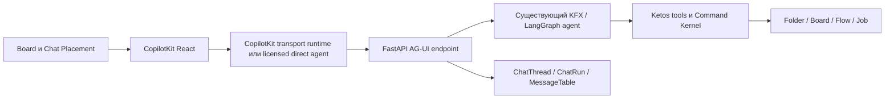

# Ketos Spatial Workspace — мастер-план разработки MVP в 10 этапов

> **Для agentic workers:** выполнять этот план через `superpowers:subagent-driven-development` или `superpowers:executing-plans`. Каждый этап использует не менее 10 практических субагентов, но одновременно работают только 3–5. Следующий этап не начинается до полного `PASS` предыдущего.

**Цель:** быстро получить рабочий MVP Ketos с одним доказанным вертикальным сценарием: `Project → Board → Note / Chat / Automation → существующий Flow Editor → запуск Flow → результат → AI preview / confirmation → восстановление после перезапуска`.

**Архитектура:** `Folder` остаётся Project, `Flow` остаётся Automation, `Job` остаётся запуском, а `MessageTable` — хранилищем сообщений. Новые Board, Placement, BoardNote, ChatThread и ChatRun расширяют Ketos, не создавая второй продуктовый backend. React-чат строится на CopilotKit, обмен с агентом — на AG-UI, а существующий KFX/LangGraph остаётся единственным агентным runtime.

**Стек:** Python/FastAPI, SQLModel/Alembic, SQLite для обязательного MVP-gate, React/TypeScript, React Router, TanStack Query, Zustand, `@xyflow/react`, CopilotKit React, CopilotKit Runtime как transport-only OSS-вариант, AG-UI, KFX/LangGraph, pytest, Jest и один focused Playwright-сценарий.

**Проверенный baseline:** ветка `redesign/sidebar-account`, SHA `80878261d07c21ad257de017d98069f211ada2c2`. Graphify использован только для навигации по существующему графу; generated graph не перестраивается. На момент подготовки CopilotKit во frontend отсутствует, KFX объявляет `ag-ui-protocol>=0.1.10`, а текущий AssistantPanel использует собственные React-компоненты и собственный SSE parser.

---


## 1. Что считается готовым MVP

MVP завершён, если один пользователь может:

1. создать или выбрать Project;
2. создать Board и открыть отдельный пространственный canvas;
3. разместить, переместить и сохранить Note;
4. разместить несколько независимых Chat и вести историю через CopilotKit/AG-UI;
5. разместить существующий Flow как Automation;
6. открыть Automation в существующем полноэкранном Flow Editor, вручную изменить и сохранить Flow;
7. запустить Flow с Board и увидеть terminal status и безопасный результат;
8. попросить AI создать или изменить Flow, увидеть preview, явно подтвердить или отклонить изменение;
9. перезапустить backend/frontend и получить те же Project, Board, viewport, placements, Chat history, Automation и terminal result;
10. повторить весь путь на чистой тестовой БД и на одном exact SHA.

MVP не заявляется как production-ready или commercial release. Проверяется фактическая работоспособность выбранного пути, а не полнота всей платформы.

## 2. Жёсткие архитектурные границы

- **Единственный business/agent backend — Ketos.** Официальный CopilotKit JS runtime разрешён только как transport bridge для OSS-сценария: он не хранит доменные данные, не выбирает модель, не исполняет tools и не становится system of record.
- **Board не равен Flow.** Board geometry и viewport не записываются в `Flow.data`; Board links не являются Flow edges.
- **Entity не равен Placement.** Закрытие или удаление Placement не удаляет Note, Chat, Flow или Job. Удаление entity — отдельное действие.
- **Reuse first.** `Project = Folder`, `Automation = Flow`, `Execution = Job`, `Message body = MessageTable`.
- **Workspace — UI shell, не таблица.** Новая Workspace DB entity запрещена.
- **Один редактор.** MVP открывает существующий полноэкранный `FlowPage`; встроенные editable editor instances и editor leasing отложены.
- **Actor только server-derived.** `actor_id`, роли и ownership не принимаются как доверенные поля от browser, LLM или AG-UI input.
- **Новые Board/Note/Chat routes наследуют Project permissions.** Полная универсальная RBAC-матрица остаётся Post-MVP, но чужие сущности в MVP fail closed.
- **KFX ABI неизменяем.** Persisted component class names, graph identifiers и extension manifests не переименовываются.
- **Нет realtime co-editing.** Для stale writes достаточно revision/hash conflict; CRDT/OT отложены.
- **Только web MVP.** Electron/OpenSwarm backend, arbitrary web cards и desktop embedding не входят в план.
- **Python только через `uv run`.** Исключение — внешние системные утилиты, не импортирующие repo Python.
- **Dirty safety.** Не менять unrelated dirty files, generated artifacts, deployment config, `LICENSE`, `NOTICE` и lock-файлы вне явно назначенного dependency registrar.
- **MVP verification.** Для каждой задачи требуется один focused test/smoke; coverage-проценты, exhaustive matrices и длительное наблюдение запрещены в основном потоке.
- **Critical rule.** Любой Critical, позволяющий нарушить именно MVP-сценарий, исправляется до перехода. Остальные подтверждённые production-hardening gaps честно переносятся в Post-MVP.

## 3. Обязательная граница CopilotKit / AG-UI / LangGraph



### 3.1 Запрещённая собственная разработка

Нельзя создавать:

- собственный chat body, message list, composer или streaming UX вместо CopilotKit;
- собственный SSE/WebSocket/event protocol поверх AG-UI;
- generic tool-call renderer;
- второй agent runtime, второй LangGraph, model router или MCP orchestrator;
- custom interrupt/resume events;
- browser-authoritative применение Flow patch;
- новый agent, который дублирует существующий KFX/LangGraph agent.

Ketos-specific custom допускается только для:

- `ChatThread` и `ChatRun` persistence;
- адаптации `MessageTable`;
- Project/Board/Placement/BoardNote;
- auth/authz;
- durable replay и idempotency;
- Command Kernel для AI preview/confirmation/apply;
- тонкой привязки стандартных AG-UI идентификаторов к Ketos IDs.

### 3.2 Подтверждённый deployment contract

Context7 использован с библиотеками:

- CopilotKit: `/copilotkit/copilotkit`;
- AG-UI: `/ag-ui-protocol/ag-ui`;
- LangGraph Python: `/langchain-ai/langgraph`.

Для каждой dependency-sensitive задачи implementation agent обязан сначала выполнить отдельный Context7 resolve/query и приложить library ID, выбранную версию и проверенный contract к handoff. Если Context7 недоступен, изменение внешнего API/SDK не начинается и задача получает `BLOCKED`; память модели или неподтверждённый пример не считаются документацией. Official docs используются как второй источник для сверки.

Документационные источники:

- [CopilotKit + LangGraph Python](https://docs.copilotkit.ai/langgraph-python)
- [CopilotKit self-managed agents](https://docs.copilotkit.ai/strands/backend/self-managed-agents)
- [CopilotKit Runtime](https://docs.copilotkit.ai/langgraph-python/backend/copilot-runtime)
- [AG-UI events](https://docs.ag-ui.com/concepts/events)
- [AG-UI interrupts](https://docs.ag-ui.com/concepts/interrupts)
- [LangGraph persistence](https://docs.langchain.com/oss/python/langgraph/persistence)
- [LangGraph interrupts](https://docs.langchain.com/oss/python/langgraph/interrupts)

До реализации Этап 01 выбирает ровно один документированный frontend contract:

1. **Рекомендуемый для быстрого OSS MVP:** CopilotKit React → отдельный официальный package `@copilotkit/runtime` с import subpath `/v2` → FastAPI AG-UI agent. JS runtime содержит ноль Ketos business/model/tool logic.
2. **Если уже есть Enterprise entitlement:** production `selfManagedAgents` → прямой FastAPI AG-UI agent, без JS runtime.

`agents__unsafe_dev_only` не принимается. `runtimeUrl` нельзя направлять на произвольный raw AG-UI endpoint без доказанного официального контракта. Если ни один из двух разрешённых путей недоступен, Chat-этап получает `BLOCKED`; самописный UI/protocol fallback запрещён.

AG-UI pause/resume выражается не выдуманными событиями: pause — `RUN_FINISHED` с `outcome.type="interrupt"`, resume — новый `RunAgentInput` с тем же `threadId`, новым `runId` и `resume`. LangGraph использует стабильный `configurable.thread_id`, persistent checkpointer, `interrupt(...)` и `Command(resume=...)`.

## 4. Минимальная доменная модель MVP

| Сущность | MVP contract | Что не создаётся сейчас |
| --- | --- | --- |
| `Folder` | Project identity и ownership; существующие create/list/rename/open | Новая Project table, pin/archive/reorder migration |
| `Board` | Project FK, owner, title, viewport x/y/zoom, revision, timestamps | BoardUserState, collaboration records |
| `Placement` | Board FK, target kind/id, x/y/w/h/z, display state, revision | Generic registry, typed FK migration для каждого будущего target |
| `BoardNote` | Project/owner/content/color/revision | Flow NoteNode conversion pipeline |
| `ChatThread` | Project/owner/title/model/context/archive/revision | ChatLegacySession и ChatTurn |
| `ChatRun` | chat, request fingerprint, idempotency key, AG-UI run ID, LangGraph thread ID, status, replay cursor | Полный event store, cost ledger, multi-epoch analytics |
| `MessageTable` | Сохраняет body/files/session/context; получает nullable `chat_id`, `chat_run_id`, `chat_sequence` | Копия message body в новой таблице |
| `Flow` / `FlowVersion` | Automation и immutable snapshot перед AI apply | Automation duplicate table, embedded editor instance table |
| `Job` | Execution identity/status; `job_metadata` содержит bounded result projection и Flow hash | ExecutionResult table, lease/fencing engine |
| `CommandProposal` | AI proposal/hash/base Flow hash/status/idempotency/outcome | Generic command bus, outbox, compensation engine |

Placement target в MVP хранится как bounded enum `note | chat | automation | job_result` плюс UUID. Service обязан проверить существование target и совпадение Project перед записью. Typed foreign keys и DB-level exactly-one-target hardening переносятся в Post-MVP, чтобы не строить цепочку миграций раньше самих target tables.

## 5. Карта требований R-01–R-40

| ID | MVP disposition |
| --- | --- |
| R-01 | Этап 03: Board pan/zoom/coordinates/viewport restore. |
| R-02 | Этап 01: OpenSwarm сохраняется только как provenance/reference. |
| R-03 | Этап 01: patterns only; backend/Electron/state stack не переносится. |
| R-04 | Этап 05: chat-window UX реализуется CopilotKit, не портируется собственный OpenSwarm chat. |
| R-05 | Этап 05: несколько независимых Chat на одной Board; 20 simultaneous streams — Post-MVP. |
| R-06 | Этапы 04–05: общий CardFrame даёт move/resize/collapse/maximize/close; Chat lifecycle отдельный. |
| R-07 | Этап 05: id/title/history/model/context в ChatThread/MessageTable; geometry в Placement. |
| R-08 | Этап 05: close Placement не удаляет Chat/history. |
| R-09 | Этап 05: create/rename/title-search/open; federated search — Post-MVP. |
| R-10 | Этап 08: AI создаёт Automation из natural language. |
| R-11 | Этап 08: 0–5 вопросов только при существенной неоднозначности. |
| R-12 | Этап 08: typed edits nodes/params/edges. |
| R-13 | Этап 08: structured preview до apply. |
| R-14 | Этап 08: явное одноразовое confirmation. |
| R-15 | Этап 08: immutable FlowVersion snapshot и hash conflict; полноценный rollback UX — Post-MVP. |
| R-16 | Этап 06: Automation как Placement. |
| R-17 | Post-MVP: embedded editable Flow Editor; MVP открывает существующий fullscreen editor. |
| R-18 | Этап 06: ручное создание/редактирование Flow сохраняется. |
| R-19 | Этап 06: существующий fullscreen Flow Editor с URL-backed return context. |
| R-20 | Этап 07: запуск Flow с Board. |
| R-21 | Этап 07: queued/in_progress/completed/failed/cancelled/timed_out. |
| R-22 | Этап 07: bounded text/JSON result рядом с Automation; generic renderer — Post-MVP. |
| R-23 | Этап 04: отдельная BoardNote; Flow NoteNode identity не меняется. |
| R-24 | Post-MVP: semantic Board Relations. |
| R-25 | Глобальный invariant: Board relation никогда не становится Flow edge. |
| R-26 | Этап 03: несколько Boards в Project. |
| R-27 | Этапы 03, 04 и 09: per-Board viewport/layout/open state. |
| R-28 | Этап 02: Project create/list/rename/open; pin/tree/archive/restore — Post-MVP. |
| R-29 | Этапы 02–06: минимальная Project/Board/Chat/Automation navigation; полная IA — Post-MVP. |
| R-30 | Post-MVP: federated permission-first search. |
| R-31 | Post-MVP: scheduler и Scheduled UI. |
| R-32 | Этап 06: Automation list/placement открывает существующий fullscreen editor. |
| R-33 | Текущий Settings entrypoint не меняется; один smoke в Этапе 10. Перестройка IA — Post-MVP. |
| R-34 | Post-MVP: telemetry-backed legacy UI removal; в MVP legacy UI не удаляется. |
| R-35 | Cross-cutting: существующие tokens, RU/EN и базовый keyboard path; полный design-system audit — Post-MVP. |
| R-36 | Этап 09: restore после реального backend restart. |
| R-37 | Этапы 07–08: минимальная Job/Command history; полный audit ledger — Post-MVP. |
| R-38 | Все этапы: auth и Project ownership на новых routes; полная adversarial RBAC matrix — Post-MVP. |
| R-39 | Этапы 07–08: allowlist и confirmation для MVP-run/AI mutation; generic capability framework — Post-MVP. |
| R-40 | Этапы 06, 07 и 10: focused Flow Editor/API/KFX/LFX compatibility smoke. |

Ни одно требование не удалено: оно либо входит в один из десяти этапов, либо явно вынесено в Post-MVP.

## 6. Общая модель работы субагентов

На каждом этапе участвуют десять логических субагентов `Sxx-A01…Sxx-A10`. Один и тот же постоянный пул специалистов можно переиспользовать между этапами, но агент засчитывается только после практического результата: production code, migration, component, integration wiring, focused fixture/test или executable recovery tooling.

### 6.1 Параллельность

- Волна A: пять агентов от одного stage base SHA.
- Sync A: coordinator последовательно cherry-pick/merge, запускает focused checks и фиксирует новый SHA.
- Волна B: ещё пять агентов от Sync-A SHA.
- Sync B: coordinator объединяет результат и запускает stage gate.
- Одновременно активно не более пяти и не менее трёх агентов, пока существуют три независимые задачи.
- Alembic revision/head, model exports, `api/v1/__init__.py`, `api/router.py`, `routes.tsx`, package manifests/lock и locale registrars имеют одного владельца и сливаются последовательно.
- Frontend build, Playwright и тяжёлые package commands никогда не запускаются параллельно.

### 6.2 Worktree и merge discipline

Используются один clean integration worktree и максимум пять переиспользуемых lane worktrees. Для каждой задачи создаётся короткоживущая ветка `codex/mvp-sXX-aYY-*` от текущего sync SHA. Корневой dirty checkout не используется для реализации.

Assignment каждого агента содержит: base SHA, writable paths, forbidden paths, ожидаемый кодовый deliverable, focused command, interface dependency и commit SHA. Агент не редактирует файлы другого lane. Только coordinator объединяет branches.

`Sxx-A10` — compatibility/integration owner, но не чистый reviewer: он обязан написать integration wiring, fixture или E2E/harness и исправить совместимость в своём scope. Независимая проверка coordinator не считается одним из десяти практических агентов.

### 6.3 Универсальный цикл задачи

1. Зафиксировать ожидаемое поведение одним focused test или executable smoke.
2. Реализовать минимальный код.
3. Запустить focused command.
4. Исправить Critical/блокирующий дефект.
5. Повторить focused command.
6. Передать commit, changed paths, command и результат coordinator.

Процент покрытия, повтор всего repository suite и коммерческий аудит не требуются. Этап получает только `PASS`, `BLOCKED` или `FAIL`; `PARTIAL` не разрешает переход.

---

## Этап 01 — Admission и доказательство CopilotKit/AG-UI vertical bridge

### Контекст

Frontend пока не содержит CopilotKit. `assistant-panel.tsx`, `use-assistant-chat.ts` и `use-post-assist-stream.ts` реализуют собственные chat widgets и custom streamed POST/SSE parsing. KFX уже содержит AG-UI dependency и LangGraph-backed agent, но документированный end-to-end bridge до React не доказан. Кроме того, OSS и direct production варианты CopilotKit имеют разные deployment/licensing contracts.

### Цель

На минимальном probe-графе доказать один разрешённый путь `CopilotKit React → standard AG-UI → existing LangGraph`, включая text, tool call, shared state и interrupt/resume. Затем закрепить тот же путь как единственный transport contract для Этапа 05. Не создавать продуктовый Chat domain на этом этапе.

### Инструменты и документация

Context7 IDs из §3.2, official CopilotKit/AG-UI/LangGraph docs, FastAPI, `ag-ui-langgraph`/официальный adapter, package `@copilotkit/react-core` с документированными `/v2` imports, при OSS-варианте package `@copilotkit/runtime` с import subpath `/v2`, pytest/Jest/Playwright. До установки dependency registrar проверяет точные compatible versions через Context7 и package registries и фиксирует их в `docs/ketos/mvp/chat-stack-decision.md`.

### Зависимости

Только baseline repo и доступная локальная среда. Если direct option выбран без entitlement или OSS runtime не может соединиться с FastAPI AG-UI agent без custom protocol, этап `BLOCKED`.

### Волна A — пять параллельных практических задач

| ID / субагент | Реализация и owned paths | Верификация задачи |
| --- | --- | --- |
| S01-A01 — dependency registrar | Создать `src/copilot-runtime/package.json` и lock только для OSS-варианта либо direct-agent config для licensed варианта; добавить packages `@copilotkit/react-core` и подтверждённые AG-UI dependencies в `src/frontend/package.json`/`package-lock.json`, а `@copilotkit/runtime` — в transport package. Imports используют документированные `/v2` subpaths. Не менять `pnpm-lock.yaml`. | `npm install --package-lock-only` завершается без peer conflict; `npm ls` показывает один согласованный CopilotKit/AG-UI набор. |
| S01-A02 — FastAPI agent probe | Создать `src/backend/base/ketos/agentic/api/ag_ui_probe.py` и probe graph fixture через официальный LangGraph/AG-UI adapter; endpoint доступен только при `KETOS_MVP_CHAT_PROBE=true` и authenticated actor. | `uv run pytest src/backend/tests/unit/agentic/api/test_ag_ui_probe.py -q`: без auth deny; text run выдаёт только standard lifecycle/text events. |
| S01-A03 — transport bridge | Для OSS создать минимальный official CopilotKit runtime handler в `src/copilot-runtime/src/server.ts`, который регистрирует только FastAPI AG-UI agent. Для licensed direct option создать `src/frontend/src/components/core/assistantPanel/copilotkit-agent.ts`. | Unit smoke получает runtime info и один streamed reply; source scan подтверждает отсутствие model/tool/persistence logic в transport. |
| S01-A04 — React probe | Создать feature-flagged `src/frontend/src/components/core/assistantPanel/copilotkit-probe.tsx` на stock `CopilotChat`; не импортировать текущие `AssistantInput`, `AssistantMessageItem` или custom parser. | `cd src/frontend && npm test -- --runInBand src/components/core/assistantPanel/__tests__/copilotkit-probe.test.tsx`. |
| S01-A05 — AG-UI contract guard | Создать `src/backend/base/ketos/agentic/services/ag_ui_contract.py` и fixtures для allowed lifecycle/text/tool/state events; запретить custom event dialect для MVP agent. | `uv run pytest src/backend/tests/unit/agentic/services/test_ag_ui_contract.py -q`: неизвестный event и actor/model override отклоняются. |

### Sync A

Coordinator объединяет A01 → A02 → A03 → A04 → A05. Package/lock имеет одного владельца A01; backend router registration пока остаётся внутри probe module. Фиксируются exact versions, chosen deployment option и wire fixtures. Только после text stream PASS открывается Волна B.

### Волна B — пять параллельных практических задач

| ID / субагент | Реализация и owned paths | Верификация задачи |
| --- | --- | --- |
| S01-A06 — auth forwarding | Реализовать credential forwarding от CopilotKit transport к FastAPI и server-derived actor binding в probe endpoint. | Подмена actor/thread header не меняет authenticated user; expired credential даёт deny до graph invocation. |
| S01-A07 — tool/state probe | Добавить безопасный read-only probe tool и bounded shared state в probe graph, без Ketos mutation. | Browser/Jest smoke видит stock tool lifecycle и `STATE_SNAPSHOT/STATE_DELTA`; tool result не использует custom renderer. |
| S01-A08 — interrupt/resume probe | Добавить LangGraph `interrupt(...)`, persistent test checkpointer и mapping standard AG-UI interrupt outcome → следующий `RunAgentInput.resume`. | Focused integration доказывает: same `threadId`, new `runId`, resolved interrupt, ровно один post-resume effect. |
| S01-A09 — feature/run scripts | Добавить `mvp_chat` flag в `src/kfx/src/kfx/services/settings/feature_flags.py`, dev commands в `scripts/mvp/chat_stack_smoke.sh` и test fixture, не включая feature по умолчанию. | Flag off скрывает probe; script поднимает выбранные processes и возвращает nonzero при недоступном bridge. |
| S01-A10 — integration owner | Зарегистрировать probe routes в `src/backend/base/ketos/api/v1/__init__.py`, `src/backend/base/ketos/api/router.py` и frontend route только под flag; создать `src/frontend/tests/core/integrations/copilotkit-ag-ui-probe.spec.ts`. | Chromium проходит text → tool → state → interrupt → resume; обычный `/flow/:id` smoke остаётся зелёным. |

### Последовательность и синхронизация

A06–A09 работают параллельно от Sync-A SHA. A10 единолично меняет shared registrars и собирает integration candidate. После PASS probe UI может остаться скрытым за default-off flag как executable compatibility fixture; он не становится продуктовым Chat.

### Ожидаемый результат

Выбран и доказан один официальный deployment contract; exact dependencies закреплены; нет custom chat/protocol/runtime. Этап 05 получает working transport fixture и не исследует архитектуру заново.

### Gate и переход

```bash
uv run pytest \
  src/backend/tests/unit/agentic/api/test_ag_ui_probe.py \
  src/backend/tests/unit/agentic/services/test_ag_ui_contract.py -q

cd src/frontend
npm test -- --runInBand src/components/core/assistantPanel/__tests__/copilotkit-probe.test.tsx
npm run type-check:production
npx playwright test tests/core/integrations/copilotkit-ag-ui-probe.spec.ts --project=chromium
```

`PASS`: text/tool/state/interrupt/resume работают через stock CopilotKit и standard AG-UI; KFX/LangGraph — единственный agent; auth привязан к transport; выбран OSS transport-only или licensed direct contract. Иначе `BLOCKED`; собственный fallback запрещён. Только `PASS` разрешает Этап 02.

---

## Этап 02 — Минимальный Project shell на существующем Folder

### Контекст

`Folder` уже является Project persistence, `/api/v1/projects` — канонический CRUD, `/folders` — compatibility redirect. Frontend уже имеет folder queries/store/sidebar. Для вертикального MVP достаточно create/list/rename/open; новая таблица, hierarchy migration, pin/archive/reorder и system-folder backfill не нужны.

### Цель

Дать пользователю простой Project entrypoint, внутри которого будут создаваться Boards, сохранив существующие Flow associations и routes.

### Инструменты и источники

FastAPI Project router, существующие `ProjectAction`/guards, React Router, TanStack Query, folder queries/store, RU/EN locale files. Source truth: `api/v1/projects.py`, `api/v1/folders.py`, `services/database/models/folder/model.py`, `folderSidebarComponent`, `pages/MainPage/pages/main-page.tsx`.

### Зависимости

Этап 01 `PASS`. Chat transport не используется, но общий MVP flag и clean integration worktree уже существуют.

### Волна A — пять параллельных задач

| ID / субагент | Реализация и owned paths | Верификация задачи |
| --- | --- | --- |
| S02-A01 — Project service | Создать тонкий `src/backend/base/ketos/services/projects/{__init__.py,service.py}` поверх Folder CRUD только для create/list/get/rename; не создавать model. | `uv run pytest src/backend/tests/unit/services/projects/test_service.py -q`; чужой Folder не читается/не переименовывается. |
| S02-A02 — Project API | Минимально расширить `src/backend/base/ketos/api/v1/projects.py` только если service seam нужен; сохранить response compatibility и `/folders` redirect. | Existing `test_projects.py`, `test_folders.py`, `test_flow_folder_integrity.py` плюс create/rename focused cases PASS. |
| S02-A03 — client aliases | Создать `src/frontend/src/types/project/index.ts` и `controllers/API/queries/projects/index.ts`, переиспользуя существующие folder hooks без второго cache namespace. | Jest доказывает те же IDs/query invalidation и отсутствие Project duplicate store. |
| S02-A04 — Project shell | Создать `src/frontend/src/pages/ProjectPage/{index.tsx,__tests__/index.test.tsx}` с Project title, empty/loading/error и outlet для Board list. | Focused Jest: valid Project renders; unknown/foreign ID не раскрывает metadata. |
| S02-A05 — Project list/create | Создать `src/frontend/src/components/core/projects/ProjectList.tsx` и `CreateProjectDialog.tsx` на существующих mutations. | Create создаёт один Folder, обновляет список и открывает его без full reload. |

### Sync A

Coordinator сверяет, что новый backend service действительно нужен. Если существующий router уже полностью покрывает contract, A01/A02 ограничиваются adapter/test improvements, а не дублируют CRUD. После API/TS fixture sync стартует Волна B.

### Волна B — пять параллельных задач

| ID / субагент | Реализация и owned paths | Верификация задачи |
| --- | --- | --- |
| S02-A06 — rename | Создать `RenameProjectDialog.tsx` и mutation wiring; rename меняет только `Folder.name`. | Flow IDs/folder_id не меняются; duplicate name показывает server error. |
| S02-A07 — sidebar entry | Изменить dashboard `folderSidebarComponent/.../sideBarFolderButtons/index.tsx`: Project opens Board list; существующий Flow navigation сохраняется. | Existing sidebar tests и новый Project navigation test PASS. |
| S02-A08 — routes | Единолично изменить `src/frontend/src/routes.tsx`, добавив authenticated `/project/:projectId/boards`; старые `/all/folder/:folderId` и `/flow/:id` не удалять. | Route test открывает Project URL и legacy Flow URL. |
| S02-A09 — i18n/states | Добавить только используемые Project/Board entry strings в `src/frontend/src/locales/{en.json,ru.json}` и basic keyboard/focus states. | `npm run i18n:check`, locale key parity и dialog focus return PASS. |
| S02-A10 — integration owner | Собрать Project shell в `main-page.tsx`, создать `src/frontend/tests/core/features/project-mvp.spec.ts`, исправить route/cache compatibility. | Browser: create → rename → reload → open; existing Flow in Folder остаётся доступным. |

### Параллельность и merge

A06, A07 и A09 параллельны. A08 — единственный route registrar. A10 интегрирует после их merge. Никаких миграций и новых Project authorization enums в этом этапе.

### Ожидаемый результат

Project отображается под существующим Folder ID, создаётся, переименовывается и открывается; Board list route готов; существующие Flow/Folder routes не сломаны.

### Gate и переход

```bash
uv run pytest -q \
  src/backend/tests/unit/api/v1/test_projects.py \
  src/backend/tests/unit/api/v1/test_folders.py \
  src/backend/tests/unit/api/v1/test_flow_folder_integrity.py \
  src/backend/tests/unit/services/projects

cd src/frontend
npm test -- --runInBand src/pages/ProjectPage src/components/core/projects
npm run i18n:check
npx playwright test tests/core/features/project-mvp.spec.ts --project=chromium
```

`PASS`: только Folder хранит Project; create/list/rename/open и ownership работают; legacy Flow navigation работает. Pin/tree/archive/search не блокируют. Только `PASS` разрешает Этап 03.

---

## Этап 03 — Board persistence, canvas и viewport

### Контекст

Текущий `FlowPage` и `flowStore` принадлежат исполняемому Flow Editor. BoardPage отсутствует. MVP нужен отдельный canvas, который пока содержит ноль placements и хранит только Board identity и viewport.

### Цель

Пользователь создаёт несколько Boards в Project, открывает независимый `@xyflow/react` canvas, делает pan/zoom и после reload видит тот же viewport.

### Минимальный контракт

`Board(id, project_id, user_id, title, viewport_x, viewport_y, viewport_zoom, revision, created_at, updated_at)`. Для MVP viewport хранится на Board: отдельная per-user BoardViewport table отложена.

API: `POST/GET /api/v1/projects/{project_id}/boards`, `GET/PATCH/DELETE /api/v1/boards/{board_id}`, `PUT /api/v1/boards/{board_id}/viewport`. Stale `expected_revision` даёт `409` без write.

### Инструменты и источники

SQLModel/Alembic, FastAPI, `@xyflow/react` v12, TanStack Query, transient Zustand store. Документация React Flow viewport/onMoveEnd, FastAPI APIRouter и Alembic operations проверяется через Context7/official docs перед реализацией.

### Зависимости

Этап 02 `PASS`; stage base содержит канонический Project route. Миграция строится от фактического Alembic head и проверяется на чистой SQLite DB.

### Волна A — пять параллельных задач

| ID / субагент | Реализация и owned paths | Верификация задачи |
| --- | --- | --- |
| S03-A01 — Board model/migration | Создать `services/database/models/board/{__init__.py,model.py}` и `alembic/versions/*_mvp_board.py`; единолично обновить root model registrar. | Model/migration test: Project/owner FK, zoom bounds, revision nonnegative, fresh SQLite upgrade. |
| S03-A02 — Board service | Создать `services/board/{__init__.py,service.py}`: create/list/get/rename/delete/viewport update с Project ownership и revision conflict. | `uv run pytest src/backend/tests/unit/services/board/test_service.py -q`. |
| S03-A03 — Board API | Создать `api/v1/boards.py` и schemas; parent Project check предшествует query result. Registrar patch передать A10. | `uv run pytest src/backend/tests/unit/api/v1/test_boards.py -q`: foreign board 404/deny, stale viewport 409. |
| S03-A04 — client contract | Создать `types/board/index.ts` и `controllers/API/queries/boards/**`; query keys включают projectId/boardId. | Focused Jest на create/list/get/patch/viewport hooks. |
| S03-A05 — Board list | Создать `pages/BoardsPage/{index.tsx,__tests__/index.test.tsx}` с create/open/rename/delete и пустым состоянием. | Create/open использует server Board ID; delete требует отдельного action. |

### Sync A

Merge: model/migration → service → API → client contract → Board list. DTO fixture сверяется после backend merge. Только A01 владеет migration/model exports.

### Волна B — пять параллельных задач

| ID / субагент | Реализация и owned paths | Верификация задачи |
| --- | --- | --- |
| S03-A06 — transient store | Создать `src/frontend/src/stores/boardStore.ts` только для mounted board/gesture/hydration state; server остаётся truth. | Store test: switch Board очищает transient state, но не создаёт server entity. |
| S03-A07 — Board canvas | Создать `pages/BoardPage/index.tsx` и `components/core/board/BoardCanvas.tsx` с пустыми nodes/edges; запрещены imports `flowStore` и Flow node types. | Jest рендерит отдельный canvas; source guard подтверждает separation. |
| S03-A08 — viewport hook | Создать `pages/BoardPage/hooks/use-board-viewport.ts`: hydrate до canvas, `fitView=false`, debounced save на `onMoveEnd`, flush при unmount. | Hook test: saved x/y/zoom applied after reload; stale 409 refetches server state. |
| S03-A09 — Board route/nav | Добавить `/project/:projectId/board/:boardId` и New Board entry; менять shared `routes.tsx` только через registrar patch A10. | Route unit: direct URL/reload открывает Board; legacy Flow route unchanged. |
| S03-A10 — integration owner | Зарегистрировать backend routers в `api/v1/__init__.py` и `api/router.py`, frontend routes, создать `tests/core/features/board-viewport.spec.ts`. | Browser: create two Boards → pan/zoom one → reload → exact viewport; `/flow/:id` smoke PASS. |

### Ожидаемый результат

Отдельный persistent Board canvas работает, поддерживает несколько Boards и не меняет `Flow.data`.

### Gate и переход

```bash
uv run pytest \
  src/backend/tests/unit/services/board/test_service.py \
  src/backend/tests/unit/api/v1/test_boards.py \
  src/backend/tests/unit/alembic/test_mvp_board_migration.py -q

cd src/frontend
npm test -- --runInBand src/pages/BoardsPage src/pages/BoardPage src/stores/__tests__/boardStore.test.ts
npm run type-check:production
npx playwright test tests/core/features/board-viewport.spec.ts --project=chromium
```

`PASS`: create/list/open/rename/delete, ownership, pan/zoom/reload и multiple Boards доказаны; Flow editor untouched. Только `PASS` разрешает Этап 04.

---

## Этап 04 — Placement, CardFrame и BoardNote

### Контекст

Board пока пуст. Для последующих Note, Chat, Automation и Result нужен один общий Placement lifecycle, но entity content нельзя смешивать с geometry. Flow `NoteNode` связан с Flow store и persisted identifier, поэтому напрямую переносить его на Board нельзя.

### Цель

Создать generic Placement и первую Board entity — BoardNote. Пользователь создаёт Note в центре viewport, редактирует, перемещает, resize/collapse/maximize/close, повторно размещает и восстанавливает её после reload.

### Минимальный контракт

- `Placement`: `id`, `board_id`, `target_kind`, `target_id`, `x/y/width/height/z_index`, `display_state`, `revision`, timestamps; unique `(board_id,target_kind,target_id)`.
- `BoardNote`: `id`, `project_id`, `user_id`, `content`, `color`, `revision`, timestamps.
- `DELETE placement` не вызывает delete entity.
- `DELETE note` — отдельное подтверждаемое действие и удаляет её placements.
- Placement service проверяет target existence и совпадение Project.

### Инструменты и источники

SQLModel/Alembic, FastAPI, `@xyflow/react` custom node/NodeResizer/screenToFlowPosition, React Query. `CustomNodes/NoteNode` используется только как UX reference; imports Flow store из нового BoardNote запрещены.

### Зависимости

Этап 03 `PASS`; Board API, BoardPage и viewport contract зафиксированы. Миграция Placement/BoardNote следует за Board migration.

### Волна A — пять параллельных задач

| ID / субагент | Реализация и owned paths | Верификация задачи |
| --- | --- | --- |
| S04-A01 — models/migration | Создать `models/placement/**`, `models/board_note/**`, `alembic/versions/*_mvp_placement_note.py`; единолично обновить model exports. | Fresh SQLite migration, enum/check/unique/revision constraints PASS. |
| S04-A02 — Placement service | Создать `services/board/placement_service.py`: create/list/move/resize/display/remove/re-place, revision conflict, Project target validation. | `test_placement_service.py`: close сохраняет entity; foreign target/board deny; stale write 409. |
| S04-A03 — Note service | Создать `services/board/note_service.py`: atomic create Note+Placement, update content/color, explicit delete entity. | `test_note_service.py`: failed placement rollback не оставляет orphan Note. |
| S04-A04 — APIs | Создать `api/v1/placements.py` и `api/v1/board_notes.py`; registrar patch передать A10. | API tests различают close Placement и delete Note, проверяют ownership. |
| S04-A05 — client contracts | Расширить `types/board`, создать queries `placements/**` и `board-notes/**`. | Jest: query keys разделяют Board scene, Placement и Note entity; 409 вызывает refetch. |

### Sync A

A01 → A02 → A03 → A04 → A05. DTO freeze включает `placement.id` как ReactFlow node ID и отдельный `target_id`. После backend focused PASS стартует Волна B.

### Волна B — пять параллельных задач

| ID / субагент | Реализация и owned paths | Верификация задачи |
| --- | --- | --- |
| S04-A06 — CardFrame | Создать `components/core/board/BoardCardFrame.tsx`: header, move handle, resize, collapse/maximize/close; callbacks через props, без entity deletion. | Component test проверяет keyboard close/focus return и отделение close от delete. |
| S04-A07 — scene mapper | Создать `pages/BoardPage/hooks/use-board-scene.ts` и `utils/placement-to-node.ts`; node ID=`placement.id`. | Mapper test сохраняет entity ID отдельно и не создаёт Flow edge. |
| S04-A08 — BoardNote card | Создать `components/core/board/placements/BoardNotePlacement.tsx` с bounded textarea/color и CardFrame. | Edit сохраняется server-side; компонент не импортирует `flowStore`/Flow NoteNode. |
| S04-A09 — interactions | Создать hooks `use-note-placement-actions.ts` и `use-placement-persistence.ts`, controls и delete dialog. PATCH только на drag/resize end. | Jest: create center → move → resize → close → re-place → explicit delete. |
| S04-A10 — integration owner | Подключить node type в `BoardCanvas`, backend registrars и `tests/core/features/board-note-placement.spec.ts`. | Browser reload восстанавливает Note/geometry; existing Flow NoteNode characterization test PASS. |

### Параллельность и merge

A06–A09 не редактируют `BoardCanvas` одновременно; A10 единолично делает wiring. Locale additions идут через A10. Heavy build не нужен — только focused tests и Playwright.

### Ожидаемый результат

Board содержит durable Note с независимой geometry. CardFrame готов для Chat/Automation/Result. Close не уничтожает entity.

### Gate и переход

```bash
uv run pytest \
  src/backend/tests/unit/services/board/test_placement_service.py \
  src/backend/tests/unit/services/board/test_note_service.py \
  src/backend/tests/unit/api/v1/test_placements.py \
  src/backend/tests/unit/api/v1/test_board_notes.py -q

cd src/frontend
npm test -- --runInBand src/components/core/board src/pages/BoardPage
npx playwright test tests/core/features/board-note-placement.spec.ts --project=chromium
```

`PASS`: create/edit/move/resize/close/re-place/reload, ownership и entity/placement separation доказаны. Только `PASS` разрешает Этап 05.

---

## Этап 05 — Durable Chat через CopilotKit и AG-UI

### Контекст

Этап 01 доказал transport. Теперь custom AssistantPanel body и custom streamed parser не должны стать вторым chat stack. Новый product Chat использует stock CopilotKit UI, standard AG-UI events и существующий KFX/LangGraph agent. Старый `/agentic/assist/stream` сохраняется как legacy route, но новый UI его не вызывает.

### Цель

Разместить несколько независимых Chat на Board; создать durable ChatThread/ChatRun; хранить messages в MessageTable; восстановить transcript через standard `MESSAGES_SNAPSHOT`; сохранить close/reopen semantics и basic title search.

### Контракты

- `ChatThread`: immutable ID, Project/owner, title, selected model reference, context policy, archived flag/revision.
- `ChatRun`: Chat FK, AG-UI run ID, LangGraph thread ID, idempotency key/fingerprint, status, last replay cursor, timestamps.
- `MessageTable`: nullable `chat_id`, `chat_run_id`, `chat_sequence`; существующие `session_id`, `context_id`, `run_id`, files/body semantics сохраняются. `session_id=str(chat_id)` — compatibility projection для новых rows.
- Повтор same key+same fingerprint возвращает существующий ChatRun; same key+different fingerprint даёт `409`.
- Token deltas не являются durable truth; reconnect получает `MESSAGES_SNAPSHOT` из committed MessageTable rows.
- AG-UI shared state содержит только bounded ephemeral context (`projectId`, `boardId`, selected Automation ID, current proposal status). Durable Project/Board/Flow state читается из Ketos API/DB и никогда не восстанавливается из `STATE_DELTA`.

### Инструменты и источники

Chosen Stage-01 CopilotKit contract, standard AG-UI `RunAgentInput`/events, official FastAPI LangGraph AG-UI adapter, existing KFX Agent, SQLModel/Alembic, MessageTable, CardFrame. `services/chat` уже занят cache service, поэтому новый domain package называется `services/chat_threads`.

### Зависимости

Этапы 01 и 04 `PASS`; transport fixture, Board/Placement/CardFrame доступны. Если выбранный CopilotKit contract больше не проходит pinned integration test, этап `BLOCKED`, а не переписывает chat UI.

### Волна A — пять параллельных задач

| ID / субагент | Реализация и owned paths | Верификация задачи |
| --- | --- | --- |
| S05-A01 — chat models/migration | Создать `models/chat_thread/**`, `models/chat_run/**`, расширить MessageTable и добавить additive migration. Единственный model/migration registrar. | Model/migration tests: unique ChatRun idempotency, ordered messages, nullable legacy compatibility. |
| S05-A02 — repository/idempotency | Создать `services/chat_threads/{repository.py,idempotency.py}`: create/list/rename/archive, atomic run claim и committed message append. | Same request replay не создаёт duplicate user/assistant message; fingerprint conflict 409. |
| S05-A03 — MessageTable adapter | Создать `services/chat_threads/message_adapter.py`: load/append/commit и standard MessagesSnapshot. Не использовать current process-local ConversationBuffer как truth. | Focused test восстанавливает ordered transcript только из DB. |
| S05-A04 — Chat APIs | Создать `api/v1/chat_threads.py` для thread CRUD/list/title-search/open; registrar patch A10. | Owner может create/rename/open; close Placement не архивирует Chat; foreign chat 404/deny. |
| S05-A05 — production AG-UI endpoint | Перенести Stage-01 probe в production `agentic/api/ag_ui_router.py` через официальный adapter; bind `threadId` к ChatThread и `runId` к ChatRun; разрешить только bounded shared-state fields; запретить client tools/model/MCP overrides. | Router test: standard events only, actor/thread binding, bounded `STATE_SNAPSHOT/DELTA`, unknown state/agent/tools override reject. |

### Sync A

Merge model → repository → adapter → thread API → AG-UI endpoint. A01 единолично меняет migration/model exports. API DTO и AG-UI fixtures freeze перед frontend wave.

### Волна B — пять параллельных задач

| ID / субагент | Реализация и owned paths | Верификация задачи |
| --- | --- | --- |
| S05-A06 — transport production config | Перевести выбранный Stage-01 bridge с probe agent на production ChatThread agent; transport остаётся без Ketos business/model/tool logic. | Contract test показывает fixed agent registration и credential forwarding; source guard запрещает model router. |
| S05-A07 — CopilotChat placement | Создать `components/core/board/placements/ChatPlacement.tsx`: CardFrame shell + stock `CopilotChat`, stable `threadId`; удалить production imports custom input/message body из этого path. | Jest: два placements получают разные thread IDs и не смешивают messages. |
| S05-A08 — Chat list/actions | Создать `components/core/chats/ChatList.tsx`, create/rename/title-search/open/re-place actions и API hooks. | Client title search не раскрывает foreign data; close/reopen сохраняет Chat ID/history. |
| S05-A09 — legacy isolation | Изменить `assistantPanel` entry так, чтобы Board Chat не использовал `use-assistant-chat.ts` или `use-post-assist-stream.ts`; legacy Flow assistant сохраняется за отдельным path/flag. | Source guard и characterization tests подтверждают отсутствие нового custom stream и сохранение legacy Flow route. |
| S05-A10 — integration owner | Wire Chat target in Placement/BoardCanvas, register routers, создать `tests/core/integrations/board-copilot-chat.spec.ts`. | Browser: two chats → independent replies → close one → reopen → reload transcript; no cross-chat leakage. |

### Запреты этапа

- не писать собственные message list/composer/loading/tool cards;
- не создавать custom `interrupt`, `resume`, `token`, `progress` events;
- не добавлять второй agent/model/MCP path;
- не копировать message body в ChatRun;
- не использовать localStorage как server history.

### Ожидаемый результат

Chat — durable Ketos entity и Board Placement, но chat UI/stream/tool/state lifecycle предоставляют CopilotKit и AG-UI. KFX/LangGraph выполняет agent run.

### Gate и переход

```bash
uv run pytest \
  src/backend/tests/unit/services/chat_threads \
  src/backend/tests/unit/agentic/api/test_ag_ui_router.py \
  src/backend/tests/unit/api/v1/test_chat_threads.py -q

cd src/frontend
npm test -- --runInBand src/components/core/board/placements/ChatPlacement.test.tsx src/components/core/chats
npm run type-check:production
npx playwright test tests/core/integrations/board-copilot-chat.spec.ts --project=chromium
```

`PASS`: stock CopilotKit body, standard AG-UI streaming/tool calls/shared state, durable transcript, two independent chats, auth/idempotency/reload и legacy isolation доказаны. Только `PASS` разрешает Этап 06.

---

## Этап 06 — Automation Placement и существующий Flow Editor

### Контекст

Automation — существующий Flow. `FlowPage` владеет singleton stores, global hotkeys, sidebars и unsaved navigation, поэтому встраивание editable editor в несколько Board cards небезопасно для MVP. Automation Placement должен быть compact/read-only и открывать канонический fullscreen editor.

### Цель

Разместить существующий Flow на Board, показать bounded preview, открыть `/flow/:id` с URL-backed Board return context, вручную сохранить Flow и вернуться к исходному Placement.

### Инструменты и источники

Existing Flow API/hooks/store, `FlowPage`, React Router, CardFrame, Placement service. Source truth: `routes.tsx`, `pages/FlowPage/index.tsx`, `appHeaderComponent/.../FlowMenu`, `use-save-flow.ts`, `flowStore.ts`.

### Зависимости

Этап 05 `PASS`; Placement supports `target_kind=automation`; Project/Board IDs доступны. Flow Editor source не копируется.

### Волна A — пять параллельных задач

| ID / субагент | Реализация и owned paths | Верификация задачи |
| --- | --- | --- |
| S06-A01 — target validation | Расширить Placement service/API: automation target обязан быть существующим доступным Flow того же Project. | Foreign/wrong-project/unknown Flow placement deny; remove Placement сохраняет Flow. |
| S06-A02 — Flow projection hooks | Создать Board-safe Flow header query/mapper поверх existing Flow API; не загружать/edit `Flow.data` в Board store. | Jest mapper возвращает id/name/status summary и не мутирует Flow cache. |
| S06-A03 — Automation card | Создать `components/core/board/placements/AutomationPlacement.tsx` на CardFrame с name, minimal status, Edit и отключённым до Этапа 07 действием Run. | Component test: Edit emits canonical flowId; Run честно disabled; card не содержит ReactFlow editor. |
| S06-A04 — add/re-place UI | Создать Flow selector и `use-automation-placement-actions.ts`; выбрать existing Flow или создать empty Flow существующим endpoint. | Select/create создаёт ровно один Flow и один Placement; re-place reuse ID. |
| S06-A05 — return URL contract | Создать `pages/BoardPage/hooks/use-open-automation-editor.ts`: URL содержит validated `boardId` и `placementId`, не только ephemeral route state. | Reload/new tab сохраняет return target; invalid return IDs игнорируются безопасно. |

### Sync A

Automation Placement props, Flow header DTO и URL format freeze. A01 backend и A02 client fixture сверяются до второй волны.

### Волна B — пять параллельных задач

| ID / субагент | Реализация и owned paths | Верификация задачи |
| --- | --- | --- |
| S06-A06 — FlowPage return | Изменить `pages/FlowPage/index.tsx` и Flow menu минимально: показывать Return to Board только при valid context; прямой `/flow/:id` ведёт себя как раньше. | `FlowPage-board-return.test.tsx`: manual save → return, reload context, direct Flow route. |
| S06-A07 — static preview | Создать `AutomationPreview.tsx` без `flowStore`/ReactFlow; выводить bounded node count/description из safe Flow header. | Preview не меняет Flow и не раскрывает raw secrets/config values. |
| S06-A08 — route registrar | Единолично обновить `routes.tsx`/route helpers, сохранив `/flow/:id/folder/:folderId` и `/flow/:id/view`. | Existing route tests и Board roundtrip route test PASS. |
| S06-A09 — i18n/keyboard | Добавить RU/EN Edit/Return/Add Automation strings и keyboard activation/focus return. | `npm run i18n:check`; keyboard-only open/save/return unit path PASS. |
| S06-A10 — integration owner | Wire Automation node type и create `tests/core/features/board-automation-editor.spec.ts`; исправить только roundtrip compatibility. | Browser: place → open existing editor → manual edit/save → reload editor → return to same Board/Placement. |

### Ожидаемый результат

Automation отображается на Board и использует единственный существующий Flow Editor. Full manual Flow path сохранён; embedded editor не реализован.

### Gate и переход

```bash
uv run pytest src/backend/tests/unit/services/board/test_automation_placement.py -q

cd src/frontend
npm test -- --runInBand \
  src/components/core/board/placements/AutomationPlacement.test.tsx \
  src/pages/FlowPage/__tests__/FlowPage-board-return.test.tsx
npm run type-check:production
npx playwright test tests/core/features/board-automation-editor.spec.ts --project=chromium
```

`PASS`: one Flow, one existing editor, durable return context и manual save доказаны; direct legacy Flow route работает. Только `PASS` разрешает Этап 07.

---

## Этап 07 — Запуск Flow и Result Placement через существующий Job

### Контекст

Ketos уже имеет `Job`, `/api/v2/workflows` и KFX execution path. Однако `Job.user_id` nullable, некоторые reads допускают `user_id IS NULL`, сортировка использует несуществующий `created_at`, а Board result projection отсутствует. Создание параллельной Execution table или `/api/v1/executions` дублировало бы существующий API.

### Цель

Запустить Automation с Board через существующий workflow/Job path, показать честные states и durable bounded result, разместить result card рядом с Automation и сделать повтор запроса идемпотентным.

### Минимальный контракт

- New Board run всегда создаёт Job с authenticated `user_id`.
- Board job reads строго фильтруют `user_id=current_user.id`; legacy NULL-owner row не считается публичным.
- `created_timestamp` — каноническое поле сортировки.
- Server вычисляет deterministic Job ID из actor + Flow + idempotency key и сверяет request fingerprint; повтор возвращает тот же Job, конфликт даёт `409`.
- `job_metadata.mvp` хранит Flow data hash, bounded status detail и safe result projection; максимум 32 KiB JSON/text, без tracebacks/secrets.
- Result Placement target — существующий Job ID; отдельная ExecutionResult table не создаётся.

### Инструменты и источники

`services/jobs/service.py`, `models/jobs/model.py`, `api/v2/workflow.py`, `processing/process.py`, existing build/KFX path, TanStack Query polling и CardFrame. Полная Job lease/fencing/retry программа не входит.

### Зависимости

Этап 06 `PASS`; Flow/Placement/Board context доступны. Если existing workflow route нельзя безопасно расширить без breaking change, разрешён thin Board adapter внутри того же v2 router/service, но новый parallel execution business API запрещён без отдельного ADR.

### Волна A — пять параллельных задач

| ID / субагент | Реализация и owned paths | Верификация задачи |
| --- | --- | --- |
| S07-A01 — Job ownership fix | Исправить `services/jobs/service.py`: strict owned reads для protected path, `created_timestamp`, runtime-required user для Board jobs. | Focused Job tests: foreign/NULL owner недоступен; sort uses actual column; correct owner succeeds. |
| S07-A02 — idempotent Board job | Добавить `create_or_get_board_job` с deterministic UUID/fingerprint в Job service; same key replay, changed payload conflict. | Parallel focused test создаёт один Job; conflict имеет нулевой второй effect. |
| S07-A03 — workflow adapter | Минимально расширить `api/v2/workflow.py`/schemas для Board context и idempotency, сохраняя existing route. | Existing `test_workflow.py` + Board run cases; no second router. |
| S07-A04 — safe result projection | Добавить writer/read helper для `job_metadata.mvp` и result sanitization/size cap. | Completed/failed states не смешиваются; oversized/secret-like fields отклонены или redacted. |
| S07-A05 — result Placement service | Разрешить `target_kind=job_result`, проверяя Job owner, Flow/Project и terminal state перед Placement. | Unknown/running/foreign Job result placement deny; completed owned Job succeeds. |

### Sync A

Merge ownership → idempotency → workflow adapter → result projection → Placement target. State DTO freeze: `queued | in_progress | completed | failed | cancelled | timed_out`.

### Волна B — пять параллельных задач

| ID / субагент | Реализация и owned paths | Верификация задачи |
| --- | --- | --- |
| S07-A06 — execution queries | Создать `controllers/API/queries/executions/{use-post-run-automation.ts,use-get-execution.ts}` поверх existing workflow API. | Jest: idempotency header/key stable; polling stops on terminal state. |
| S07-A07 — run/status UI | Добавить Run action и `ExecutionStatus.tsx` в AutomationPlacement; не запускать graph из browser. | Double click даёт один request identity; UI не показывает success до terminal Job. |
| S07-A08 — result card | Создать `ResultPlacement.tsx` для bounded text/JSON, без generic tool/result renderer registry. | Safe text/JSON renders; HTML/script/oversized data не исполняется. |
| S07-A09 — scene/result action | После terminal completion создать или открыть Job result Placement рядом с Automation через normal Placement API. | Reload сохраняет result Placement и тот же Job ID; повтор run с тем же key не дублирует card. |
| S07-A10 — integration owner | Зарегистрировать shared wiring и `tests/core/features/board-automation-run.spec.ts`; добавить failure fixture. | Browser: Run → queued/running → completed/result; failure показывает failed, не empty success. |

### Ожидаемый результат

Board запускает существующий Flow через существующий backend/KFX path, показывает честный lifecycle и durable safe result. Новая execution domain не появляется.

### Gate и переход

```bash
uv run pytest \
  src/backend/tests/unit/services/jobs/test_board_execution.py \
  src/backend/tests/unit/api/v2/test_workflow.py \
  src/backend/tests/unit/services/board/test_job_result_placement.py -q

cd src/frontend
npm test -- --runInBand src/controllers/API/queries/executions src/components/core/board/placements/ResultPlacement.test.tsx
npx playwright test tests/core/features/board-automation-run.spec.ts --project=chromium
```

`PASS`: один owned Job, existing KFX path, terminal result, idempotency, failure truth и reload доказаны. Только `PASS` разрешает Этап 08.

---

## Этап 08 — AI create/edit с preview и явным confirmation

### Контекст

В repo уже есть Flow Builder Assistant, KFX Agent/LangGraph и mutating flow-builder tools, но существующий AssistantPanel имеет auto-apply/skip-style paths и собственные cards. MVP должен использовать Chat из Этапа 05, превратить mutation intent в durable typed proposal и разрешить apply только через Command Kernel после standard AG-UI interrupt/resume.

### Цель

Пользователь просит создать или изменить Flow; agent задаёт 0–5 уточнений, формирует bounded typed changes, Command Kernel создаёт preview/hash, AG-UI приостанавливает run, а approve/reject/stale/replay дают детерминированный результат.

### Минимальный Command Kernel

`CommandProposal(id, actor_id, project_id, flow_id, command_type, canonical_payload, preview, proposal_hash, base_flow_hash, idempotency_key, status, outcome, created_at, resolved_at)`.

Статусы: `proposed → awaiting_confirmation → applied | rejected | stale | failed`. Нет generic command bus, CommandOutbox, compensation engine или ordinary Project/Board CRUD через kernel.

Typed Flow operations MVP: `create_flow`, `add_node`, `remove_node`, `set_parameter`, `connect_nodes`, `disconnect_nodes`, `replace_flow`. Payload валидируется по registered KFX component schemas; arbitrary Python/filesystem/MCP/model configuration запрещены.

### Инструменты и источники

Existing `flow_builder_assistant.py`, KFX `flow_builder_tools`, Flow/FlowVersion services, Stage-05 CopilotKit/AG-UI path, official AG-UI interrupt outcome/resume contract и LangGraph `interrupt`/`Command(resume)`. Точный CopilotKit interrupt surface берётся только из proven Stage-01 fixture; неподтверждённый hook не изобретается.

### Зависимости

Этапы 05 и 07 `PASS`; Chat agent и Flow execution working. Stage-01 interrupt probe всё ещё PASS на pinned dependency versions.

### Волна A — пять параллельных задач

| ID / субагент | Реализация и owned paths | Верификация задачи |
| --- | --- | --- |
| S08-A01 — proposal model/migration | Создать `models/command_proposal/**`, additive migration и root model export. | Unique actor/project idempotency, bounded JSON, legal status constraint, SQLite upgrade PASS. |
| S08-A02 — canonical kernel | Создать `services/commands/{schemas.py,canonical.py,repository.py,service.py}`: hash, create/replay, actor binding, base Flow hash, one-use resolution. | Key/hash replay, changed hash conflict, foreign actor deny, consumed proposal replay zero effect. |
| S08-A03 — Flow diff/validation | Создать `services/commands/flow_changes.py`: validate typed ops against KFX schemas, calculate human-readable preview and apply to copy. | Unknown component/param/edge reject; preview output hash matches simulated result. |
| S08-A04 — proposal-only tools | Изменить KFX flow-builder mutating tools так, чтобы MVP agent возвращал typed intent/proposal, а не писал `Flow.data`. | Focused KFX test: tool call alone не меняет persisted Flow hash. |
| S08-A05 — LangGraph interrupt node | Добавить proposal node в existing Flow Builder graph: после preview вызывает standard interrupt и ждёт approve/reject resume. | Graph test получает interrupt outcome; code before interrupt idempotent при node restart. |

### Sync A

Merge proposal schema → kernel → diff → proposal-only tools → interrupt node. Freeze `proposal_id`, `proposal_hash`, `base_flow_hash`, preview schema и approve/reject payload.

### Волна B — пять параллельных задач

| ID / субагент | Реализация и owned paths | Верификация задачи |
| --- | --- | --- |
| S08-A06 — confirm/apply API | Добавить Command Kernel endpoint/service integration в existing AG-UI agent path: resume проверяет actor/hash/current Flow hash/status. | Approve creates one effect; reject/stale/foreign/replay create zero effect. |
| S08-A07 — FlowVersion snapshot | Перед apply создать existing FlowVersion snapshot; apply и proposal outcome фиксируются одной transaction boundary, насколько поддерживает current services. | Failure before commit leaves Flow unchanged; success produces one new Flow hash and one snapshot. |
| S08-A08 — CopilotKit confirmation surface | Настроить proven stock CopilotKit HITL/interrupt rendering для одного Ketos `flow_change_confirmation`; allowed domain summary берётся из CommandProposal. Не создавать generic renderer. | Component test: preview visible; approve/reject emits standard resume; browser не применяет patch. |
| S08-A09 — bypass removal | Для нового AG-UI path отключить `auto_apply`, `skipAll`, direct mutating tool writes и client-side `apply-flow-update`; legacy behavior остаётся изолированным. | Static/focused negative tests: без confirmation Flow hash неизменен. |
| S08-A10 — integration owner | Создать backend integration и `tests/core/integrations/ai-flow-preview-confirm.spec.ts`; исправить create/edit roundtrip. | Create, edit, 0–5 clarification, approve, reject, stale and replay paths PASS. |

### Ожидаемый результат

AI помогает создать/изменить Flow, но не имеет прямого mutation authority. Preview и confirmation являются частью одного AG-UI/LangGraph run и CommandProposal record.

### Gate и переход

```bash
uv run pytest \
  src/backend/tests/unit/services/commands \
  src/backend/tests/unit/agentic/flows/test_flow_builder_assistant.py \
  src/backend/tests/integration/test_ai_flow_preview_confirm.py -q

uv run pytest src/kfx/tests/unit/mcp/flow_builder_tools -q

cd src/frontend
npm test -- --runInBand src/components/core/assistantPanel src/components/core/board/placements/ChatPlacement.test.tsx
npx playwright test tests/core/integrations/ai-flow-preview-confirm.spec.ts --project=chromium
```

`PASS`: typed create/edit, preview, standard interrupt/resume, one-use confirmation, stale/replay protection и no-bypass доказаны. Только `PASS` разрешает Этап 09.

---

## Этап 09 — Восстановление после restart, durable replay и idempotency

### Контекст

Board/Placement/Chat/Job/Command уже persistent, но actual backend restart может потерять process-local agent/checkpointer state. MVP не требует event sourcing или возобновления каждого token cursor, однако обязан восстановить completed transcript, terminal result и pending confirmation без duplicate effects.

### Цель

После остановки и запуска backend на той же DB открыть тот же Board и получить server-authoritative state. Pending AG-UI/LangGraph interrupt должен возобновляться через documented persistent checkpointer; повтор ChatRun, Job run или Command confirmation не создаёт дубликат.

### Минимальный restore contract

- UI восстанавливает данные существующими Project/Board/Placement/Chat/Job APIs; отдельный Workspace restore API не создаётся.
- `boardStore` — transient cache; server response всегда побеждает localStorage.
- LangGraph получает stable `thread_id=str(chat_id)` и documented persistent saver, выбранный через Context7 для текущего DB/runtime. `InMemorySaver` не закрывает этап.
- Completed transcript возвращается `MESSAGES_SNAPSHOT` из MessageTable.
- Running ChatRun при restart либо продолжает documented checkpoint, либо становится `failed_recoverable`; повтор запуска использует тот же logical ChatRun/idempotency и не склеивает partial text.
- Pending CommandProposal остаётся awaiting_confirmation и может быть resolved один раз после reconnect.
- Terminal Job/result read восстанавливается из Job/job_metadata.

### Инструменты и источники

LangGraph persistence/interrupt docs, exact saver dependency selected via Context7, SQLModel DB, ChatRun/MessageTable/Job/Command services, React Query hydration, actual process restart pytest/Playwright harness. Нет ChatRunEvent table, leases, fencing или full domain replay log.

### Зависимости

Этап 08 `PASS`; stage handoff перечисляет exact Chat/Job/Command IDs. Dependency registrar явно владеет backend manifest и `uv.lock`, если saver требует новый package.

### Волна A — пять параллельных задач

| ID / субагент | Реализация и owned paths | Верификация задачи |
| --- | --- | --- |
| S09-A01 — persistent checkpointer | Подключить documented persistent LangGraph saver в existing agent assembly; единолично менять backend dependency manifest/`uv.lock`. | Unit/integration: checkpoint survives application object destruction and same `thread_id` resumes. |
| S09-A02 — ChatRun reconciliation | Добавить startup/request reconciliation для nonterminal ChatRun: resume supported checkpoint или `failed_recoverable`, без второго terminal message. | Restart fixture at running state produces one logical run and max one assistant commit. |
| S09-A03 — MessagesSnapshot replay | Productionize snapshot/reconnect adapter: committed messages ordered by `chat_sequence`, cursor bounded. | Reconnect/reload/restart returns exact transcript; localStorage deletion ничего не теряет. |
| S09-A04 — Command resume | Восстановить pending proposal и standard AG-UI interrupt; apply/reject проверяет current Flow hash и consumed status после restart. | Restart between preview and approve: one approve effect; second approve zero effect. |
| S09-A05 — Job/result restore | Убедиться, что terminal Job metadata/result Placement читаются после restart; nonterminal unknown честно отображается, не success. | Restart after completion keeps result; restart during run never fabricates terminal success. |

### Sync A

Checkpointer → ChatRun → snapshot → Command → Job. Actual DB fixture и stable identifiers freeze перед frontend wave.

### Волна B — пять параллельных задач

| ID / субагент | Реализация и owned paths | Верификация задачи |
| --- | --- | --- |
| S09-A06 — Board hydration | Добавить `use-board-restore.ts`: load Board/viewport/placements from server on direct URL; ignore stale local cache. | Reload with corrupted local cache restores server geometry/IDs. |
| S09-A07 — Chat reconnect | Настроить CopilotKit agent/thread bootstrap на persisted ChatThread и MessagesSnapshot; reconnect не создаёт новый thread. | Browser network reconnect + page reload keeps thread ID/transcript. |
| S09-A08 — pending confirmation UI | После reconnect stock CopilotKit surface получает open interrupt/proposal and can approve/reject. | Pending preview survives browser/backend restart and remains one-use. |
| S09-A09 — restart harness | Создать `src/backend/tests/integration/test_mvp_restart_recovery.py`, который закрывает app/DB sessions, создаёт новый app process/context и повторно читает state. | Test действительно пересоздаёт backend context; mock-only reload не принимается. |
| S09-A10 — integration owner | Создать `tests/core/features/mvp-restart-restore.spec.ts` и orchestration script; исправить hydration/reconnect conflicts. | Project/Board/Note/Chat/Automation/Job result/pending Command восстановлены на одном DB file. |

### Ожидаемый результат

MVP state переживает реальный restart без event-sourcing и без дублирования messages/Jobs/Flow changes.

### Gate и переход

```bash
uv run pytest \
  src/backend/tests/integration/test_mvp_restart_recovery.py \
  src/backend/tests/unit/services/chat_threads/test_recovery.py \
  src/backend/tests/unit/services/commands/test_recovery.py -q

cd src/frontend
npm test -- --runInBand src/pages/BoardPage/hooks/__tests__/use-board-restore.test.tsx src/components/core/board
npx playwright test tests/core/features/mvp-restart-restore.spec.ts --project=chromium
```

`PASS`: actual backend restart, server-wins restore, transcript snapshot, pending confirmation resume и idempotent terminal outcomes доказаны. Только `PASS` разрешает Этап 10.

---

## Этап 10 — Единый vertical slice, минимальная стабилизация и MVP handoff

### Контекст

Локальные PASS этапов недостаточны без одного цельного пользовательского пути. Этот этап не добавляет новые функции: он объединяет существующие части, исправляет только блокирующие/Critical defects и создаёт воспроизводимый handoff.

### Цель

На одном exact SHA и одной чистой SQLite DB пройти весь MVP-путь, затем один раз подтвердить AI-path на реально настроенном model provider. Никаких 24-часовых окон, нагрузочного тестирования или rollout.

### Канонический сценарий

1. Create Project и Board.
2. Place/edit/move Note.
3. Place two Chats; получить независимые replies.
4. Place Automation; открыть Flow Editor; вручную сохранить Flow; вернуться на Board.
5. Run Flow; получить terminal Job/result Placement.
6. Ask AI to edit Flow; inspect preview; reject once; repeat and approve once.
7. Restart backend/frontend на той же DB.
8. Reopen Board и проверить IDs, viewport, placements, transcript, Flow hash, Job/result и Command status.

### Инструменты и источники

Focused pytest/Jest, `type-check:production`, Vite production build, one Chromium Playwright story, RU/EN locale check, deterministic provider fixture и один live provider smoke. Browser matrix, full accessibility audit и full suites — Post-MVP.

### Зависимости

Этап 09 `PASS`; все migrations применяются на clean SQLite. Live smoke использует уже настроенный provider через существующий Ketos configuration, не новый model router.

### Волна A — пять параллельных задач

| ID / субагент | Реализация и owned paths | Верификация задачи |
| --- | --- | --- |
| S10-A01 — deterministic seed | Создать `scripts/mvp/seed_vertical_slice.py` и fixture IDs без production data import. | Два запуска дают один logical seed без duplicates. |
| S10-A02 — Project/Board closure | Написать/fix backend integration segment create Project/Board/viewport/ownership. | `test_mvp_vertical_slice.py -k project_board` PASS. |
| S10-A03 — Note/Chat closure | Написать/fix segment Note + two CopilotKit chats + reload. | Focused backend/frontend tests prove distinct entities/threads. |
| S10-A04 — Automation/editor closure | Написать/fix roundtrip Placement → existing editor → save → Board. | Before/after Flow hash and same Flow ID recorded. |
| S10-A05 — Run/result closure | Написать/fix Job/result segment with deterministic fake executor output. | One Job/result, failure truth and result reload PASS. |

### Sync A

Все пять segments используют один seed contract. Coordinator merge order следует domain dependencies; shared route/fixture conflicts разрешаются до запуска второй волны.

### Волна B — пять параллельных задач

| ID / субагент | Реализация и owned paths | Верификация задачи |
| --- | --- | --- |
| S10-A06 — AI confirmation closure | Написать/fix deterministic AI create/edit/reject/stale/approve segment. | Reject/stale zero effect; approve one new Flow hash/snapshot. |
| S10-A07 — full browser story | Создать `src/frontend/tests/core/features/ketos-mvp-vertical-slice.spec.ts`; использовать real API/DB, не localStorage fixtures. | Один Chromium story проходит шаги 1–8. |
| S10-A08 — MVP UX/i18n | Исправить только loading/error/empty/reconnect, desktop keyboard path и RU/EN strings в затронутых components. | `i18n:check`, focus return и keyboard happy path PASS. |
| S10-A09 — live AI smoke | Создать `scripts/mvp/run_live_ai_smoke.py`: использовать существующий configured provider, выполнить одну безопасную proposal/reject/approve последовательность и записать IDs без secrets. | Live run получает real model reply и один confirmed Flow change. Нет credentials/provider — честный external blocker полного MVP PASS. |
| S10-A10 — integration owner | Собрать final wiring, production build и `docs/dev/handoff/KETOS_MVP.md`; исправить compatibility только в touched MVP paths. | Exact SHA, commands, exit codes, entity ledger и reproduction from clean DB записаны. |

### Ожидаемый результат

Работающий, понятный и воспроизводимый MVP, пригодный для практической проверки продукта. Он не объявляется промышленным релизом.

### Финальный gate

```bash
uv run pytest \
  src/backend/tests/integration/test_mvp_vertical_slice.py \
  src/backend/tests/integration/test_mvp_restart_recovery.py -q

uv run pytest src/kfx/tests/unit/mcp/flow_builder_tools -q

cd src/frontend
npm test -- --runInBand src/pages/BoardPage src/components/core/board src/components/core/assistantPanel
npm run i18n:check
npm run type-check:production
npm run build
npx playwright test tests/core/features/ketos-mvp-vertical-slice.spec.ts --project=chromium

cd ../../
uv run python scripts/mvp/run_live_ai_smoke.py
git diff --check
```

### Критерии завершения MVP

- S10-A01…A10 `PASS` на одном exact SHA.
- Vertical browser story работает на clean DB.
- Реальный backend restart сохраняет server state.
- CopilotKit/AG-UI — единственный новый Chat path; custom chat/protocol/runtime не добавлены.
- KFX/LangGraph остаётся единственным agent runtime.
- Note, Chat, Flow и Job не смешаны с Placement lifecycle.
- AI не меняет Flow до confirmation; replay/stale/reject безопасны.
- Existing Flow Editor/API/KFX persisted identifiers не сломаны.
- Один live model smoke завершён без нового model router.
- Нет unresolved Critical в каноническом MVP-сценарии.
- Unrelated dirty state и запрещённые paths не изменены.

Если deterministic gate зелёный, но отсутствует configured live provider, итоговый статус — `MVP FUNCTIONAL / LIVE-AI BLOCKED`, а не полный `MVP PASS`.

---

## Post-MVP — отдельная программа, не блокирующая основной поток

Следующие работы сознательно вынесены из десяти этапов:

| ID | Направление | Содержание |
| --- | --- | --- |
| PM-01 | Comprehensive testing | Полные backend/frontend/KFX coverage numbers, branch coverage, full package suites, mutation/contract matrices, multi-browser corpus. |
| PM-02 | Long telemetry | 24 часа, 30 дней или два релиза, funnels, retention, sink health, alerts и product observation. |
| PM-03 | Security route audit | Полная runtime inventory и actor/resource/action matrix для MCP, OpenAI, agentic, webhook, filesystem, secrets, custom code и egress. |
| PM-04 | Production data/migrations | Production census, backfill/reconciliation, SQLite/PostgreSQL full matrix, dual-write/cutover, rollback drills и destructive cleanup. |
| PM-05 | Load/soak/chaos | 100/500/1000 Board objects, 20 chats, multiworker races, network/DB failures, 4+ hour soak, RPO/RTO. |
| PM-06 | Embedded editor | FlowEditorInstance isolation, one editable lease, nested gestures, store/hotkey/undo cleanup и multiple preview instances. |
| PM-07 | Product expansion | BoardRelations, federated search, Project pin/tree/archive, scheduler, richer Result renderers, Chat imports and full settings/IA consolidation. |
| PM-08 | Accessibility/design audit | 390/1024/1440 layouts, 200/320% zoom, light/dark, contrast, live regions, screen readers и полный Product Design audit. |
| PM-09 | Commercial hardening | Tenant isolation, quotas/billing, enterprise audit export, retention/legal holds, SSO/RBAC packaging, HA/DR, support/SLA. |
| PM-10 | Release/rollout | Canary cohorts, 1/10/25/50/100%, monitoring, rollback floor, support runbooks, contract removal after observation. |

Post-MVP задача возвращается в основной gate только если обнаруженный дефект нарушает канонический сценарий или создаёт Critical vulnerability в reachable MVP route. Нельзя скрывать такой defect как future hardening.

## Итоговое правило выполнения

Каждый этап выполняется полностью по циклу:

```text
реализовать минимальный slice
→ выполнить focused verification
→ исправить Critical/блокирующий defect
→ повторить focused verification
→ объединить 10 agent deliverables
→ присвоить PASS/BLOCKED/FAIL
→ только при PASS перейти дальше
```

Цель плана — работающий MVP и практическое знание о продукте. Полноценная тестовая программа, длительный мониторинг, масштабирование, коммерческий аудит и release engineering начинаются только после MVP.
