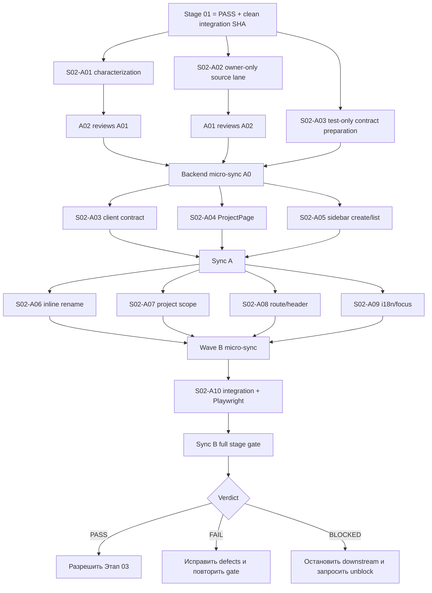

# Этап 02 — Минимальный Project shell на существующем Folder

> **Для agentic workers:** этот этап обязательно выполняется через `superpowers:subagent-driven-development` либо эквивалентный режим с десятью практическими субагентами `S02-A01…S02-A10`, независимыми review-вердиктами и последовательными sync-гейтами. Одновременно работают 3–5 агентов только там, где DAG допускает параллельность. Следующий этап запрещено начинать до итогового `PASS` Этапа 02.

**Цель:** создать минимальный authenticated Project shell и Board-oriented entrypoint, переиспользуя существующий `Folder`, канонический `/api/v1/projects`, текущие folder queries/store/sidebar и legacy Flow routes без второй Project-сущности, второго CRUD и второго frontend cache namespace.

**Архитектура:** `Project` остаётся продуктовым именем существующего `Folder`; `Folder.id` остаётся единственным Project ID, а `Flow.folder_id` — существующей связью Flow с Project. Новый `ProjectPage` является только UI shell: он читает Project через существующий API seam, показывает заголовок и states, предоставляет вход в `/project/:projectId/boards` и ссылку на существующий Flow view, но не вводит Board persistence или Board CRUD до Этапа 03.

**Технологии:** Python/FastAPI/SQLModel, существующие authorization/deployment/MCP/encryption seams, React/TypeScript, React Router, TanStack Query через `api` + `UseRequestProcessor`, Zustand `useFolderStore`, RU/EN locales, pytest, Jest и один focused Playwright Chromium smoke.

---

## 1. Название и номер этапа

**Номер:** 02 из 10.

**Название:** «Минимальный Project shell на существующем Folder».

**Позиция в master plan:** этап начинается только после полного `PASS` Этапа 01 и является единственным разрешённым producer для Project shell, на который затем опирается Этап 03. Этап 02 не создаёт Board backend, Board model, Board query cache или spatial canvas.

**Нормативный пользовательский путь этапа:**

```text
authenticated user
→ existing sidebar Project list
→ create exactly one Folder through POST /api/v1/projects/
→ navigate to /project/{Folder.id}/boards
→ render Project title and Board entry shell
→ inline rename the same Folder
→ reload direct Project URL
→ reopen existing Flow route for a Flow whose folder_id is unchanged
```

**Статусная модель:** только `PASS`, `FAIL`, `BLOCKED`. `PARTIAL` как статус запрещён. Русская формулировка «этап выполнен частично» отображается на `FAIL` и никогда не разрешает переход.

## 2. Контекст

### 2.1. Текущие authoritative seams

На старте исполнения coordinator обязан повторно проверить текущий sync SHA; перечисленные ниже пути являются точками изменения или характеризации, а не разрешением переписать соседние подсистемы.

| Область | Authoritative path | Существующий контракт, который сохраняется |
| --- | --- | --- |
| Project API | `src/backend/base/ketos/api/v1/projects.py` | Канонические create/list/get/patch/delete/download/upload; encryption, MCP registration/reconciliation, deployment guards и Flow-move side effects. |
| Folder compatibility | `src/backend/base/ketos/api/v1/folders.py` | Compatibility endpoints возвращают HTTP 307 на `/api/v1/projects`; второй CRUD отсутствует. |
| Project persistence | `src/backend/base/ketos/services/database/models/folder/model.py` | `Folder.id` — Project ID; `Folder.user_id` — owner; `Flow.folder_id` — association. |
| Router registration | `src/backend/base/ketos/api/v1/__init__.py`, `src/backend/base/ketos/api/router.py` | `folders_router` и `projects_router` уже зарегистрированы; Этап 02 не добавляет backend router. |
| Backend tests | `src/backend/tests/unit/api/v1/test_projects.py`, `src/backend/tests/unit/api/v1/test_folders.py`, `src/backend/tests/unit/api/v1/test_flow_folder_integrity.py` | Response shapes, redirects, Flow association, MCP/deployment behavior и ownership floor. |
| API client | `src/frontend/src/controllers/API/queries/folders/**` | URL `getURL("PROJECTS")`, query keys `useGetFolders`/`useGetFolder`, create/patch mutations и один cache namespace. |
| Project client types | `src/frontend/src/pages/MainPage/entities/index.tsx` | `FolderType`, `PaginatedFolderType`, `AddFolderType`; Project получает type alias, не копию runtime model. |
| Client store | `src/frontend/src/stores/foldersStore.tsx`, `src/frontend/src/types/zustand/folders/index.ts` | `useFolderStore` остаётся единственным Project list/selection store. |
| Sidebar | `src/frontend/src/components/core/folderSidebarComponent/components/sideBarFolderButtons/**` | Existing create/list/inline rename/navigation UI переиспользуется. |
| Project scope/drop | `src/frontend/src/components/core/folderSidebarComponent/hooks/use-on-file-drop.ts` | Existing Flow move/upload path; на Project route запрещён fallback к `myCollectionId`. |
| Main shell | `src/frontend/src/pages/MainPage/pages/main-page.tsx` | Existing `SidebarProvider`, Project sidebar, account entrypoint и `<Outlet />`. |
| Routes | `src/frontend/src/routes.tsx` | Authenticated dashboard/Flow/settings routes; новый Project route добавляется lazy, старые routes сохраняются. |
| Header classification | `src/frontend/src/components/core/appHeaderComponent/header-visibility.ts` | Sidebar routes скрывают legacy duplicate account menu. |
| Locales | `src/frontend/src/locales/en.json`, `src/frontend/src/locales/ru.json` | Только реально используемые Project/Board-entry strings с одинаковыми ключами. |
| Browser tests | `src/frontend/tests/core/features/project-mvp.spec.ts` | Новый focused smoke: create → rename → reload → open, плюс legacy Flow navigation. |

**Path-state audit:** все пути в таблице, кроме browser spec, подтверждены как existing на authoring checkout. `src/frontend/tests/core/features/project-mvp.spec.ts` является planned-new. Другие planned-new paths этапа: `src/frontend/src/pages/ProjectPage/index.tsx`, `src/frontend/src/pages/ProjectPage/__tests__/index.test.tsx`, `src/frontend/src/pages/ProjectPage/__tests__/route-contract.test.tsx`, `src/frontend/src/controllers/API/queries/folders/__tests__/project-folder-contract.test.tsx`, `src/frontend/src/components/core/folderSidebarComponent/helpers/project-shell-route.ts`, `src/frontend/src/components/core/folderSidebarComponent/helpers/resolve-current-project-id.ts` и их явно перечисленные focused tests/hooks. Все остальные названные source/test paths existing; execution preflight повторно проверяет это через `test -e`/`test ! -e` и не выдаёт отсутствующий planned path за текущий факт.

### 2.2. Зафиксированная архитектурная проблема

`Folder` уже покрывает Project persistence и связан с `Flow`, deployment records и MCP configuration. Создание упрощённого `ProjectService`, новой таблицы `Project`, новых `/projects-lite` routes, отдельного `queries/projects` либо `projectsStore` разорвёт существующие side effects и приведёт к двум источникам истины. Поэтому расширяется только текущий seam.

Текущий backend list содержит историческую возможность включать `Folder.user_id IS NULL`, а read/update имеют share-aware paths. MVP Этапа 02 требует одинакового owner-only правила для reachable create/list/open/rename Project path: обычный Project доступен только при `Folder.user_id == current_user.id`; `NULL` не означает public. System folder определяется только server-side известными константами и не становится публичным Project. Новая DB classification/enum или migration в этом этапе запрещены.

### 2.3. Инструментальная истина на момент подготовки плана

- `graphify-out/graph.json` существует и используется только read-only для навигации; rebuild/update не разрешён данным этапом.
- RaytSystem CLI доступен; его code graph может сообщать `state=stale`/`reason=checkout_changed`. Это фиксируется как состояние инструмента, но source, focused tests и runtime остаются authoritative.
- `rg`, `git`, `uv`, `npm`, pytest/Jest/Playwright являются основными executable инструментами.
- Доступность дополнительных MCP/браузерных инструментов проверяется на старте исполнения. Недоступный инструмент записывается `unavailable` с заменяющей проверкой; факт использования не выдумывается.

## 3. Цель

### 3.1. Положительная цель

Дать authenticated владельцу Folder минимальный Project entrypoint, который:

1. использует существующие create/list/get/patch operations `/api/v1/projects`;
2. сохраняет `Folder.id`, `Flow.id` и `Flow.folder_id` на create/list/open/rename/reload пути;
3. открывает lazy authenticated URL `/project/:projectId/boards`;
4. показывает Project title, loading, empty и generic error/not-found states без утечки foreign metadata;
5. содержит Board entry/outlet, который Этап 03 заменит реальным Board list, но сейчас не создаёт Board data;
6. сохраняет доступ к legacy `/all/folder/:folderId` и `/flow/:id[/folder/:folderId]` routes;
7. использует один Project list/create/rename UI и один frontend cache/store namespace;
8. предоставляет ровно один account/Settings entrypoint на Project route.

### 3.2. Явные не-цели

- новая таблица/model/migration `Project`, `Workspace`, `Board` или `ProjectAuthorization`;
- второй backend Project CRUD/service/facade;
- `queries/projects`, `projectsStore`, второй Project list или второй Create/Rename dialog;
- Board CRUD, Board cache, Board persistence, canvas, viewport или placements;
- pin, tree, archive/restore, project search, reorder, shared-project RBAC;
- изменение Flow Editor, Flow schema, KFX class names, extension manifests, deployment config или lock files;
- удаление `/folders`, legacy Folder/Flow routes или существующего Flow list;
- Graphify/RaytSystem rebuild, real-corpus promotion, external MCP execution или network exposure.

## 4. Подробное техническое задание

### 4.1. Domain и persistence invariants

1. `ProjectId` в UI — строковое представление существующего `Folder.id`; новый идентификатор не генерируется.
2. Create Project вызывает ровно один `POST /api/v1/projects/` через `usePostFolders`; успешный response используется для navigation.
3. Rename вызывает существующий `PATCH /api/v1/projects/{Folder.id}` через `usePatchFolders` и меняет `Folder.name`, не `Folder.id` и не `Flow.folder_id`.
4. List/open/read никогда не материализуют новый Project record и не копируют Folder в client storage.
5. `/folders` остаётся HTTP 307 compatibility redirect; обработчик не получает собственную business logic.
6. Ни один файл Alembic или model registrar не меняется; схема БД остаётся неизменной.

### 4.2. Authorization contract

1. `POST /projects/` сохраняет server-derived `current_user.id` в `Folder.user_id`; actor из payload отсутствует/игнорируется.
2. MVP list возвращает только rows с `Folder.user_id == current_user.id`.
3. MVP get/rename сначала owner-scope query по `(Folder.id, Folder.user_id=current_user.id)` и на foreign/NULL возвращает одинаковый non-disclosing `404`.
4. Известные system-folder names могут локализоваться существующим server-side map, но name/`user_id IS NULL` не выдаёт read/write permission.
5. `Folder.user_id IS NULL` row с известным или произвольным именем не появляется в обычном Project list и не открывается/не переименовывается через Project shell.
6. Не добавляется новый authorization enum. Shared-project RBAC остаётся Post-MVP и не маскируется как выполненная часть этапа.

### 4.3. Сохранение полного existing Project contract

Минимальная правка owner policy не должна обходить или удалять:

- unique-name normalization/LIKE escaping;
- auth settings encryption;
- default API-key behavior при `AUTO_LOGIN=false`;
- MCP auto-registration, rename/reconciliation и error semantics;
- deployment guards и retry wrappers;
- `flows_list`/`components_list` ownership filtering и Flow moves;
- localized `display_name` без изменения persisted `name`;
- paginated/non-paginated response shapes;
- Flow/component association после rename;
- `/folders` redirect query propagation.

Если для owner policy требуется extraction, извлекается полная текущая операция со всеми side effects и тестами. Создавать урезанный CRUD helper, который теряет часть поведения, запрещено.

### 4.4. Frontend API/cache contract

1. Все Project hooks остаются под `src/frontend/src/controllers/API/queries/folders/`.
2. Список использует exact query key `['useGetFolders']`; detail — prefix `['useGetFolder', projectId, ...]`.
3. Create/rename refetch/invalidate существующий folder namespace; новый `['projects']` key запрещён.
4. Network requests проходят через `api` и `UseRequestProcessor`; raw `fetch` запрещён.
5. В `src/frontend/src/pages/MainPage/entities/index.tsx` добавляется только compile-time alias `export type ProjectType = FolderType`; parallel runtime DTO/store не создаётся.
6. Source guard обязан доказать отсутствие `src/frontend/src/controllers/API/queries/projects/` и `src/frontend/src/stores/projectsStore.*`.

### 4.5. Project shell contract

1. Создать `src/frontend/src/pages/ProjectPage/index.tsx` и `src/frontend/src/pages/ProjectPage/__tests__/index.test.tsx`.
2. `ProjectPage` получает `projectId` только из React Router params, валидирует непустое значение и читает metadata через existing folder queries/cache.
3. Loading не показывает stale название другого Project; error/foreign/unknown показывает общий localized state без leaked ID/name.
4. Success показывает localized Project heading и два навигационных entry:
   - `Boards` — текущий `/project/:projectId/boards`, пустой shell/outlet без Board API;
   - `Flows` — existing `/all/folder/:projectId`.
5. Shell использует existing semantic tokens/UI primitives и keyboard focus; raw colors не добавляются.
6. Этап не показывает fake Board count, fake Board IDs или disabled mutation, которую пользователь может принять за работающую.

### 4.6. Sidebar/create/rename contract

1. Existing Project list и Add Project control переиспользуются; второй list/dialog запрещён.
2. Клик Project и успешный create ведут на `/project/{id}/boards` без full reload.
3. Inline rename остаётся тем же interaction: Enter/blur подтверждает, Escape отменяет и возвращает исходное имя.
4. На server error rename не считается успешным: отображается localized error, server value остаётся truth, focus возвращается в rename control или на trigger.
5. Rename не меняет Flow IDs и `folder_id`; это доказывают backend и browser проверки.
6. Existing download/upload/delete options не переписываются и не объявляются частью acceptance.

### 4.7. Project scope и fallback contract

1. Создать pure helper `src/frontend/src/components/core/folderSidebarComponent/helpers/resolve-current-project-id.ts` и unit test.
2. На `/project/:projectId/boards` и будущем `/project/:projectId/board/:boardId` authoritative scope — validated `projectId`.
3. Если Project/Board route не содержит валидного `projectId`, create/drop/move не выполняется, показывается error; fallback в `myCollectionId` запрещён.
4. На legacy routes без Project param прежний `folderId ?? myCollectionId` contract сохраняется.
5. Flow drag/drop по-прежнему вызывает существующий save/upload seam и устанавливает explicit target Folder ID.

### 4.8. Route/header/i18n contract

1. `src/frontend/src/routes.tsx` получает один lazy authenticated route `/project/:projectId/boards` в существующем dashboard/`CollectionPage` shell.
2. `src/frontend/src/components/core/appHeaderComponent/header-visibility.ts` классифицирует `project` как sidebar route root; legacy account menu скрыт, sidebar account/Settings остаётся один.
3. Existing `/all/folder/:folderId`, `/flow/:id`, `/flow/:id/folder/:folderId`, `/flow/:id/view`, `/settings/**` не удаляются и не меняют semantics.
4. Новые strings добавляются одновременно в `src/frontend/src/locales/en.json` и `src/frontend/src/locales/ru.json`; ключи ограничены Project heading, Boards/Flows entry и loading/empty/error/rename failure.
5. Hardcoded system English в новом shell запрещён.

### 4.9. Feature flag и dirty-safety

1. Этап потребляет default-off MVP workspace flag, доказанный Этапом 01; имя/shape берётся из Stage-01 handoff на фактическом base SHA и не дублируется.
2. При flag off новый Project route/entry недоступен, legacy Project/Flow data не удаляются.
3. Coordinator работает в clean integration worktree. Unrelated dirty root checkout не используется и не очищается.
4. Не изменяются generated artifacts, `graphify-out/**`, `.raytsystem/**`, `_raw/**`, lock files, deployment config, `LICENSE`, `NOTICE`.

## 5. Перечень задач

| ID | Краткая задача | Primary role | Основной deliverable | Прямые зависимости |
| --- | --- | --- | --- | --- |
| S02-A01 | Characterization полного Project/Folder contract | analysis, testing, compliance | Backend tests, фиксирующие side effects, shapes и owner/NULL expectations | Stage 01 PASS, base SHA |
| S02-A02 | Owner-only canonical Project API | implementation, security | Минимальная правка `projects.py`, foreign/NULL deny | A01 contract freeze |
| S02-A03 | Existing folder client как Project contract | analysis, implementation, testing | `ProjectType` alias и client/cache characterization | Backend micro-sync |
| S02-A04 | Minimal `ProjectPage` shell | design, implementation, testing | Project title/states/Board outlet/Flows entry | Frozen response + A03 seam |
| S02-A05 | Existing sidebar create/list navigation | implementation, testing | Existing create/list ведёт в Project shell без duplicate UI | A03 response/query contract |
| S02-A06 | Existing inline rename hardening | implementation, testing, design | Rename success/error/focus semantics без dialog | Sync A |
| S02-A07 | Validated Project scope для entry/drop | implementation, security, testing | Route scope helper, no Project-route fallback | Sync A |
| S02-A08 | Lazy route и header classification | implementation, design, compliance | Single route registrar change + header tests | Sync A, A04 contract |
| S02-A09 | RU/EN и keyboard states | design, docs, compliance, testing | Locale parity и focused accessibility states | Sync A, frozen UI strings |
| S02-A10 | Integration wiring и browser smoke | implementation, testing, docs, compliance | Main/sidebar wiring + `project-mvp.spec.ts` + evidence | A06–A09 merged |

## 6. Подэтапы и конкретные шаги

### 6.1. Обязательный контракт использования субагентов и инструментов

- Все `S02-A01…S02-A10` выполняются отдельными практическими субагентами. Один агент не может закрыть несколько ID задним числом.
- Каждый assignment содержит: base SHA, owned paths, forbidden paths, prerequisite commit/SHA, test-first behavior, focused command, deliverable и expected review artifact.
- Каждый агент обязан применить все доступные **релевантные** инструменты: `rg`/source, read-only Graphify query, `git diff`, соответствующий test runner; UI agents дополнительно Jest/Playwright/browser при доступности; coordinator дополнительно RaytSystem read-only health commands.
- Неиспользованный инструмент получает причину `not relevant`; недоступный — `unavailable` с error/command. Нельзя писать `used`, если executable evidence отсутствует.
- Graphify и RaytSystem graphs не rebuild-ятся. Stale graph фиксируется, после чего решение подтверждается source и тестами.
- Subagent не редактирует чужой owned path. Shared registrars `src/frontend/src/routes.tsx`, locale files и final `sideBarFolderButtons/index.tsx` имеют одного владельца на соответствующем sync.
- После практического deliverable каждый агент выполняет назначенный peer review. Review не заменяет production/test deliverable и не считается отдельной задачей.

### 6.2. Матрица субагентов

| Агент | Цель | Зона ответственности / owned paths | Конкретные задачи | Deliverable | Критерии приёмки агента | Peer review |
| --- | --- | --- | --- | --- | --- | --- |
| S02-A01 | Зафиксировать полный existing backend contract до правок | `src/backend/tests/unit/api/v1/test_projects.py`; `test_folders.py`; `test_flow_folder_integrity.py` | Добавить create/list/get/rename characterization; сохранить encryption/MCP/deployment/Flow-move/redirect shapes; добавить foreign/NULL negative expectations | Test-only commit и contract note с exact commands | Tests воспроизводят pre-fix defect там, где он существует, и не ослабляют side effects | Review A02 security/spec coverage |
| S02-A02 | Сделать reachable Project API strict owner-only | `src/backend/base/ketos/api/v1/projects.py` | Owner-scope list/read/update; `NULL` deny; server-only system classification; не трогать complete side effects | Source commit без schema/router duplication | A01 suite PASS; foreign/NULL non-disclosing; create/rename side effects unchanged | Review A01 test legitimacy |
| S02-A03 | Доказать один client/cache namespace | `src/frontend/src/pages/MainPage/entities/index.tsx`; `src/frontend/src/controllers/API/queries/folders/**`; новый `.../folders/__tests__/project-folder-contract.test.tsx` | Добавить type alias; зафиксировать URL/query keys/invalidation; source guard против projects query/store | Alias + tests, hooks only if test exposes mismatch | Exactly one request per action; exact existing query keys; duplicate paths absent | Review A04 data-state use |
| S02-A04 | Реализовать безопасный Project shell | `src/frontend/src/pages/ProjectPage/index.tsx`; `__tests__/index.test.tsx` | Params, loading/error/empty/success, title, Boards outlet, Flows link, no Board API | New page + focused tests | Valid owner renders; unknown/foreign metadata absent; keyboard links work | Review A03 no duplicate cache |
| S02-A05 | Перенаправить existing create/list в shell | Planned-new `src/frontend/src/components/core/folderSidebarComponent/helpers/project-shell-route.ts`; planned-new `.../components/__tests__/project-shell-navigation.test.tsx`; shared existing `main-page.tsx`/sidebar patch передаётся A10 | Existing add mutation exactly once; sidebar Project click/create success builds canonical URL; legacy flow entry remains reachable | Navigation helper/test patch и integration instructions | One Folder/one refetch/one navigation; no second list/dialog | Review A06 interaction continuity |
| S02-A06 | Укрепить existing inline rename | Новый `.../sideBarFolderButtons/hooks/use-inline-project-rename.ts`; `.../__tests__/use-inline-project-rename.test.tsx`; `input-edit-folder-name.tsx` при необходимости | Enter/blur commit; Escape cancel; server error alert and focus return; no Rename dialog | Hook/component patch + tests | Server value authoritative; Flow association unchanged; error not swallowed | Review A05 duplicate-UI check |
| S02-A07 | Исключить wrong-project fallback | `.../folderSidebarComponent/helpers/resolve-current-project-id.ts`; unit test; `hooks/use-on-file-drop.ts`; existing drop test | Resolve projectId on Project/Board routes; block missing/invalid; retain legacy fallback only off those routes | Pure helper + drop guard + tests | Project P always target P; missing P zero mutation; legacy route unchanged | Review A02 owner-boundary alignment |
| S02-A08 | Единолично зарегистрировать route/header class | `src/frontend/src/routes.tsx`; `src/frontend/src/components/core/appHeaderComponent/header-visibility.ts`; related tests | Lazy authenticated Project route; `project` sidebar classification; preserve all legacy routes | Registrar commit + route/header tests | Direct URL/reload works; one account entry; direct Flow legacy header unchanged | Review A04 route/shell composition |
| S02-A09 | Закрыть RU/EN и базовый keyboard contract | `src/frontend/src/locales/en.json`; `src/frontend/src/locales/ru.json`; locale/focus tests only | Exact key parity; no hardcoded system English; focus return for cancel/error/navigation | Locale commit + parity/focus evidence | `npm run i18n:check` PASS; strings реально используются; no unused bulk copy | Review A08 visible route strings |
| S02-A10 | Собрать stage candidate и доказать browser path | `src/frontend/src/pages/MainPage/pages/main-page.tsx`; final shared `sideBarFolderButtons/index.tsx`; `src/frontend/tests/core/features/project-mvp.spec.ts`; stage evidence/report | Wire A05/A06/A07; integrate candidate; create Playwright story; run full stage gate; compatibility fixes only in owned MVP paths | Integration commit, test evidence, final report inputs | Create→rename→reload→open PASS; existing Flow route PASS; all reviews closed | Coordinator + cross-lane final review |

### Wave A — backend contract и минимальный Project shell

Wave A охватывает S02-A01…S02-A05. Producer-порядок внутри волны обязателен: A01/A02 фиксируют backend contract, backend micro-sync A0 создаёт frozen response, после чего A03/A04/A05 завершают client/page/sidebar deliverables. Тестовую подготовку A03 разрешено вести параллельно до A0, но production hook assumptions принимаются только после A0 `PASS`.

### 6.3. S02-A01 — Project characterization

**Parallel:** `yes` с test-only подготовкой A03; `no` для merge после изменения A02.

**Prerequisites:** exact Stage-01 PASS SHA; clean lane; текущие tests читаются до изменений.

**Шаги:**

1. Снять signatures и response shapes create/list/get/patch из `projects.py` и 307 redirects из `folders.py` через `rg`/source; сохранить base SHA в handoff.
2. Добавить test fixtures для owner, foreign user и `Folder(user_id=None)` без объявления NULL row публичным.
3. Зафиксировать create side effects: owner assignment, encryption/default API key, MCP registration path, deployment guard и owned `flows_list` moves.
4. Зафиксировать rename side effects: same Folder ID, same Flow IDs/`folder_id`, MCP rename/reconciliation и deployment conflict semantics.
5. Зафиксировать list/get/rename target behavior и identical non-disclosing response для foreign/NULL.
6. Зафиксировать `/folders` 307 location/query propagation.
7. Запустить focused backend suite, записать RED/GREEN test names и exit code.

**Output:** test-only commit; таблица existing behavior vs required owner-only behavior; ни одного product-source edit.

**Owner:** S02-A01.

**Verification:** команда из §9; peer review A02 подтверждает, что тесты не удалили side-effect assertions.

**Blocked downstream:** A02 merge и весь backend micro-sync.

### 6.4. S02-A02 — owner-only Project API

**Parallel:** `yes` с A01 только после freeze ожидаемых assertions; source и test paths не пересекаются.

**Prerequisites:** A01 contract note; Stage-01 auth floor PASS.

**Шаги:**

1. Заменить list predicate на exact current owner; убрать `NULL-as-visible` из ordinary Project collection.
2. Для get и patch применить одинаковый owner-scoped fetch до чтения metadata/Flow association.
3. Преобразовать foreign/NULL deny в `404 Project not found`, не различая причины клиенту.
4. Оставить server-side system-name localization отдельной от authorization; не добавлять DB enum/column.
5. Не менять create, MCP, encryption, deployment, Flow-move и redirect semantics, кроме минимального вызова owner guard.
6. Запустить A01 suite, исправить только regression, вызванный owned diff.
7. Выполнить `git diff` source audit: нет нового service/router/model/migration.

**Output:** минимальный source commit в `projects.py`, passing backend suite и security note.

**Owner:** S02-A02.

**Verification:** foreign/NULL list/get/rename deny, owner succeeds, side effects/response shapes PASS.

**Blocked downstream:** Sync A backend; A03–A05 не могут считать response frozen до PASS.

### 6.5. Backend micro-sync A0

**Parallel:** `no`.

**Prerequisites:** A01 и A02 commits + peer reviews.

**Шаги coordinator:** merge A01 → A02; разрешить только contract-aligned conflicts; запустить три backend test files; записать sync SHA; проверить `git diff --check`.

**Output:** `S02_SYNC_A0_SHA` с frozen create/list/get/rename contract.

**Owner:** coordinator.

**Verification:** все backend commands exit 0; нет migration/router/model diff.

**Blocked downstream:** A03, A04, A05 production work.

### 6.6. S02-A03 — existing client contract

**Parallel:** `yes` с A04 и A05 после micro-sync A0.

**Prerequisites:** `S02_SYNC_A0_SHA`, response examples owner/list/detail.

**Шаги:**

1. Добавить `ProjectType = FolderType` без runtime copy.
2. Characterize `getURL("PROJECTS")` для list/create/get/patch.
3. Зафиксировать `['useGetFolders']`, `['useGetFolder', projectId, ...]`, `['usePostFolders']`, `['usePatchFolders']` и существующую invalidation.
4. Проверить credentials/auth refresh через `api` + `UseRequestProcessor`; raw `fetch` отсутствует.
5. Добавить source guard на отсутствие projects query/store paths.
6. Исправить только подтверждённое расхождение в текущих folder hooks, не переименовывая их.

**Output:** type alias и focused client contract test.

**Owner:** S02-A03.

**Verification:** one API call per action; exact query namespace; no duplicate cache/store.

**Blocked downstream:** A04/A05 merge и Sync A.

### 6.7. S02-A04 — Project shell

**Parallel:** `yes` с A03/A05; окончательный hook import сверяется после A03.

**Prerequisites:** frozen Project detail shape и route param name `projectId`.

**Шаги:**

1. Написать failing tests valid/loading/error/unknown/foreign.
2. Реализовать `ProjectPage` с validated `projectId` и existing query seam.
3. Добавить title, generic states, `Boards` current entry, `Flows` legacy link и `<Outlet />`/empty shell.
4. Не импортировать Board query/model/canvas; не показывать fake count.
5. Проверить semantic tokens, heading hierarchy и keyboard navigation.
6. Повторить Jest после синхронизации с A03.

**Output:** два новых ProjectPage файла и passing Jest.

**Owner:** S02-A04.

**Verification:** owner metadata only; direct unknown/foreign response не раскрывает name/id; zero Board request.

**Blocked downstream:** A08 route registrar и A10 browser integration.

### 6.8. S02-A05 — existing sidebar create/list

**Parallel:** `yes` с A03/A04; не редактировать `routes.tsx`.

**Prerequisites:** canonical URL `/project/:projectId/boards`; existing `usePostFolders` response ID.

**Шаги:**

1. Test-first зафиксировать, что Add Project вызывает существующий mutation один раз.
2. На success построить `/project/{response.id}/boards` и вызвать existing custom navigate один раз.
3. Project row click ведёт туда же; Project options/download/delete остаются существующими.
4. Сохранить доступ к Flow list через ProjectPage `Flows` entry, а legacy route не удалять.
5. Не добавлять второй Project list, modal, store или query.
6. Передать shared sidebar patch A10, если lane ownership не допускает прямой merge.

**Output:** tests/navigation helper или bounded patch с exact integration note.

**Owner:** S02-A05.

**Verification:** one Folder created, canonical list refetched, one navigation, no reload/duplicate UI.

**Blocked downstream:** Sync A и A10 final sidebar wiring.

### 6.9. Sync A

**Parallel:** `no` для merge и heavy commands.

**Prerequisites:** backend micro-sync PASS; A03/A04/A05 commits; peer reviews without open Critical.

**Merge order:** A03 → A04 → A05. Shared sidebar hunk разрешает coordinator по A05 handoff; `routes.tsx` и locales пока не меняются.

**Output:** `S02_SYNC_A_SHA`, frozen Project type/query/page/navigation interfaces.

**Owner:** coordinator.

**Verification:** backend suite + A03/A04/A05 focused Jest; no duplicate Project paths; `git diff --check`.

**Blocked downstream:** вся Wave B.

### Wave B — rename, project scope, routes и locale contract

Wave B охватывает S02-A06…S02-A09 и стартует только от Sync-A SHA. Эти четыре lane параллельны, потому что shared sidebar integration не редактируется ими одновременно: A06 производит rename seam, A07 scope seam, A08 единолично владеет route/header registrars, A09 единолично владеет locales. A10 начинается только после Wave-B micro-sync.

### 6.10. S02-A06 — existing inline rename

**Parallel:** `yes` с A07/A08/A09; не владеть final sidebar integration file одновременно с A10.

**Prerequisites:** Sync A; existing Project item/patch types.

**Шаги:** test Enter/blur/Escape/error; вынести bounded rename state hook; сохранить server response truth; на error показать localized alert и восстановить focus/edit state; не создавать dialog; передать integration API A10.

**Output:** rename hook/component patch и tests.

**Owner:** S02-A06.

**Verification:** Folder ID stable; server failure не меняет visible canonical name; Escape zero mutation.

**Blocked downstream:** A10 wiring и browser rename segment.

### 6.11. S02-A07 — Board entry/project scope

**Parallel:** `yes` с A06/A08/A09; owned helper/drop files не пересекаются.

**Prerequisites:** Sync A; route param contract.

**Шаги:** реализовать pure resolver; Project/Board route использует only `projectId`; missing/invalid blocks mutation; legacy path fallback сохранён; update `use-on-file-drop` tests; добавить no-wrong-project negative case.

**Output:** scope helper, drop guard и focused tests.

**Owner:** S02-A07.

**Verification:** P всегда остаётся P; no `myCollectionId` fallback на Project route; existing Flow move still works on legacy route.

**Blocked downstream:** A10 wiring; S03 нельзя принимать current Project scope без PASS.

### 6.12. S02-A08 — routes/header classification

**Parallel:** `yes` с A06/A07/A09; единственный owner `routes.tsx` и `header-visibility.ts`.

**Prerequisites:** Sync A; A04 export contract.

**Шаги:** lazy-import ProjectPage; добавить authenticated `/project/:projectId/boards`; применить Stage-01 flag; добавить `project` в sidebar roots; расширить route/header tests; characterise direct Flow/settings routes.

**Output:** route registrar commit и tests.

**Owner:** S02-A08.

**Verification:** route direct/reload renders shell; one account/Settings entry; legacy Flow header behavior unchanged.

**Blocked downstream:** A10 Playwright candidate.

### 6.13. S02-A09 — i18n/states

**Parallel:** `yes` с A06/A07/A08; единственный locale owner.

**Prerequisites:** frozen visible strings from A04/A06/A08.

**Шаги:** добавить только используемые en/ru keys; проверить interpolation parity; убрать hardcoded shell text; add focused focus assertions; выполнить i18n check.

**Output:** locale diff и test evidence.

**Owner:** S02-A09.

**Verification:** key parity PASS; every new key referenced; keyboard focus/cancel/error path PASS.

**Blocked downstream:** A10 и stage i18n gate.

### 6.14. Wave B micro-sync

**Parallel:** `no` для merge.

**Prerequisites:** A06–A09 commits и peer reviews.

**Merge order:** A06 → A07 → A08 → A09. Route/locale conflicts решают только их owners; shared sidebar wiring остаётся A10.

**Output:** `S02_SYNC_B_INPUT_SHA`.

**Owner:** coordinator.

**Verification:** all focused Jest + `npm run i18n:check`; route source audit; no heavy Playwright parallel run.

**Blocked downstream:** A10.

### 6.15. S02-A10 — integration owner

**Parallel:** `no` для shared wiring и Playwright.

**Prerequisites:** Wave B micro-sync PASS; all nine practical deliverables present; open Critical count zero.

**Шаги:**

1. Интегрировать A05/A06/A07 в `main-page.tsx` и final sidebar component без duplicate logic.
2. Проверить Project route при flag on/off и canonical navigation.
3. Написать `project-mvp.spec.ts` на real API/DB: create → capture Folder ID → rename → reload direct URL → assert same ID/title → open existing Flow.
4. В smoke проверить one account/Settings entry и отсутствие второго Project list/dialog.
5. Запустить backend, focused Jest, i18n и Playwright последовательно.
6. Исправить только Stage-02 compatibility defects; новый scope не принимать.
7. Собрать changed-path manifest, command/exit-code ledger, peer reviews и итоговый transition control.

**Output:** integration commit, browser spec, evidence ledger и финальный SHA.

**Owner:** S02-A10.

**Verification:** полный stage gate §12/§14 PASS на одном exact SHA.

**Blocked downstream:** Этап 03 целиком.

### 6.16. Sync B и DAG параллельности



### 6.17. Операционная таблица волн

| Подэтап | Parallel | Prerequisites | Output | Owner | Verification | Blocked downstream |
| --- | --- | --- | --- | --- | --- | --- |
| Preflight | no | Stage-01 report, repo access | base SHA, tool/dirty inventory | coordinator | git/RaytSystem/Graphify read-only checks | все задачи |
| Wave A producer | yes, A01/A02 + A03 tests, max 3 | base SHA | backend tests/source lanes | A01/A02/A03 | focused backend tests | micro-sync A0 |
| Backend micro-sync A0 | no | A01/A02 reviews | frozen API SHA | coordinator | three backend files PASS | A03–A05 production |
| Wave A consumers | yes, A03/A04/A05 | micro-sync A0 | client alias, shell, sidebar navigation | A03/A04/A05 | three focused Jest groups | Sync A |
| Sync A | no | Wave A reviews | frozen shell interfaces SHA | coordinator | backend + Wave A Jest | Wave B |
| Wave B | yes, A06/A07/A08/A09, max 4 | Sync A | rename/scope/routes/locales | A06–A09 | focused Jest + i18n | micro-sync B |
| Wave B micro-sync | no | four peer reviews | integration input SHA | coordinator | all focused checks | A10 |
| Integration | no | micro-sync B | wired shell + browser spec | A10 | full stage gate | Sync B |
| Sync B | no | A10 deliverable/review | final SHA + verdict | coordinator | §12 commands, control block | S03 |

## 7. Зависимости от предыдущих этапов

### 7.1. Жёсткие prerequisites

Этап 02 стартует только если coordinator доказал:

1. Этап 01 имеет итоговый `PASS`, а не historical/partial claim.
2. Stage-01 report содержит exact integration SHA и passing transport/auth/Job floor gates.
3. Default-off MVP workspace flag реально доступен backend/frontend; Project route использует существующий flag, а не создаёт новый.
4. Integration worktree clean и основан на Stage-01 final SHA.
5. Все ten assignments могут получить один base/sync SHA и writable lane.

Если любой пункт отсутствует, execution не маскирует его локальными заглушками: verdict `BLOCKED`, downstream S02/S03 не начинается.

### 7.2. Preflight commands

```bash
cd /Volumes/Projects/ketos_canvas_mod_main
git rev-parse HEAD
git status --short
git diff --check

raytsystem doctor --root /Volumes/Projects/ketos_canvas_mod_main --json
raytsystem status --root /Volumes/Projects/ketos_canvas_mod_main --json
raytsystem graph status --root /Volumes/Projects/ketos_canvas_mod_main --json
raytsystem lint --root /Volumes/Projects/ketos_canvas_mod_main --json

test -f graphify-out/graph.json
graphify query "Project Folder projects.py folderSidebarComponent routes ownership" --budget 1600

rg -n "APIRouter|create_project|read_projects|read_project|update_project|Folder.user_id" \
  src/backend/base/ketos/api/v1/projects.py
rg -n "useGetFolders|useGetFolder|usePostFolders|usePatchFolders|myCollectionId" \
  src/frontend/src/controllers/API/queries/folders \
  src/frontend/src/components/core/folderSidebarComponent \
  src/frontend/src/routes.tsx
```

Graphify/RaytSystem commands read-only. Stale graph не rebuild-ится и не принимается за source evidence. Dirty root checkout не очищается; создаётся/используется отдельный clean integration worktree по действующей workflow policy.

### 7.3. Downstream dependency

Этап 03 может потреблять только:

- exact `Folder.id` как `projectId`;
- strict owner Project API behavior;
- `/project/:projectId/boards` shell/outlet;
- validated Project route scope;
- one folder query/store/cache namespace;
- Stage-02 final `PASS` SHA и evidence ledger.

При `FAIL`/`BLOCKED` ни Board migration, ни Board API, ни `@xyflow/react` canvas не начинаются.

## 8. Предполагаемые результаты

После успешного исполнения:

1. Project создаётся как один existing `Folder` и получает тот же ID на API, sidebar и Project route.
2. List/get/rename обычного Project доступны только owner; foreign/NULL rows не раскрываются.
3. Encryption, MCP/deployment guards и Flow association продолжают работать.
4. `/folders` остаётся compatibility redirect, не вторым CRUD.
5. Existing sidebar создаёт/list-ит/переименовывает Project и открывает `/project/:projectId/boards`.
6. `ProjectPage` безопасно обрабатывает loading/error/unknown/owner states и содержит Board outlet/Flows entry.
7. Direct reload Project URL восстанавливает title по server truth.
8. Existing Flow list/editor navigation остаётся доступной; Flow ID и `folder_id` после rename неизменны.
9. Project route имеет один account/Settings entrypoint.
10. Не появляются Project DB model, service, router, query namespace, store, list или dialog-дубликаты.
11. RU/EN keys и базовый keyboard/focus path доказаны.
12. Этап выдаёт один exact final SHA, ten subagent deliverables/reviews и воспроизводимый stage report.

## 9. Критерии завершения и верификации каждой задачи

| ID | Focused command | Обязательное доказательство | Task verdict |
| --- | --- | --- | --- |
| S02-A01 | `uv run pytest -q src/backend/tests/unit/api/v1/test_projects.py src/backend/tests/unit/api/v1/test_folders.py src/backend/tests/unit/api/v1/test_flow_folder_integrity.py` | Characterization охватывает side effects, response shapes, owner/foreign/NULL и redirects | PASS только при accepted test review |
| S02-A02 | та же backend команда после source merge | Owner success; foreign/NULL list/get/rename deny; MCP/deployment/Flow regressions green | PASS/FAIL; отсутствие Stage-01 auth floor = BLOCKED |
| S02-A03 | `cd src/frontend && npm test -- --runInBand src/controllers/API/queries/folders/__tests__/project-folder-contract.test.tsx` | Exact URL/query keys/invalidation, alias, no duplicate paths | PASS при zero failures |
| S02-A04 | `cd src/frontend && npm test -- --runInBand src/pages/ProjectPage/__tests__/index.test.tsx` | loading/error/owner/foreign shell, zero Board API | PASS при zero failures |
| S02-A05 | `cd src/frontend && npm test -- --runInBand src/components/core/folderSidebarComponent/components/sideBarFolderButtons/components/__tests__/project-shell-navigation.test.tsx` | one create/list/navigation; no second UI | PASS при zero failures |
| S02-A06 | `cd src/frontend && npm test -- --runInBand src/components/core/folderSidebarComponent/components/sideBarFolderButtons/hooks/__tests__/use-inline-project-rename.test.tsx` | Enter/blur/Escape/error/focus; server truth | PASS при zero failures |
| S02-A07 | `cd src/frontend && npm test -- --runInBand src/components/core/folderSidebarComponent/helpers/__tests__/resolve-current-project-id.test.ts src/components/core/folderSidebarComponent/hooks/__tests__/use-on-file-drop.test.ts` | Project route no fallback; legacy path unchanged | PASS при zero failures |
| S02-A08 | `cd src/frontend && npm test -- --runInBand src/pages/ProjectPage/__tests__/route-contract.test.tsx src/components/core/appHeaderComponent/__tests__/header-visibility.test.ts` | Lazy authenticated route; one account entry; Flow route compatibility | PASS при zero failures |
| S02-A09 | `cd src/frontend && npm run i18n:check` плюс A04/A06 focus tests | RU/EN parity, used keys, no hardcoded system English | PASS при exit 0 |
| S02-A10 | `cd src/frontend && npx playwright test tests/core/features/project-mvp.spec.ts --project=chromium` | Real create→rename→reload→open и legacy Flow access | PASS при exit 0 и no waiver |

Для каждого ID handoff дополнительно содержит: base SHA, commit SHA, changed paths, exact command, exit code, concise output, peer-review verdict и список закрытых findings. Устное «работает» не является доказательством.

## 10. Общие критерии завершения этапа

Этап получает `PASS` только при одновременном выполнении всех критериев:

- S02-A01…S02-A10 имеют практический deliverable и peer review `PASS`.
- Все merge/sync происходят в порядке DAG; final tests выполняются на одном exact SHA.
- Только `Folder` хранит Project; migration/model diff отсутствует.
- `/api/v1/projects` остаётся единственным CRUD; `/folders` — 307 compatibility.
- Owner create/list/open/rename работает; foreign/NULL list/open/rename не раскрывает metadata.
- Project create/rename сохраняет encryption/MCP/deployment/Flow-move side effects.
- Frontend использует только `queries/folders`, `useFolderStore`, `api` и `UseRequestProcessor`.
- Create/list/rename UI не дублирован; Project shell URL и direct reload работают.
- Board outlet существует, но Board DB/API/query/canvas отсутствуют.
- Existing Flow routes и Flow association проходят compatibility checks.
- Project route показывает ровно один account/Settings entrypoint.
- RU/EN и keyboard/focus checks PASS.
- Unrelated dirty/generated/deployment/lock/license/RaytSystem/Graphify paths не изменены.
- Нет unresolved Critical/blocking defect в canonical Stage-02 path.
- Final report заполнен по §15 и transition control даёт `verdict: PASS`.

Pin/tree/archive/search не входят в MVP acceptance и не являются blocker. Нельзя приписывать их к выполненным результатам.

## 11. Риски, блокеры и способы устранения

| Риск/сигнал | Классификация | Локальная попытка устранения | Когда BLOCKED | Downstream effect |
| --- | --- | --- | --- | --- |
| Stage 01 не имеет live PASS/final SHA | prerequisite | Проверить handoff, exact SHA и named gates | После отсутствия доказательства/недоступного Stage-01 artifact | S02 не стартует |
| Dirty root checkout | safety, не blocker | Создать clean linked integration worktree; не трогать dirty files | Только если clean writable worktree технически недоступен после проверки | Все lanes остановлены |
| NULL/shared existing behavior конфликтует с owner-only MVP | implementation defect | Исправить scoped query и negative tests | Не BLOCKED: test failure означает FAIL и цикл исправления | A03–A10 ждут backend PASS |
| MCP/deployment/Flow side-effect regression | Critical compatibility defect | Revert incomplete extraction, restore full existing operation, rerun backend files | Не BLOCKED, пока локально исправимо | Stage gate FAIL |
| Duplicate client cache/store/UI обнаружен review/source guard | architecture defect | Удалить duplicate, reuse folder seam, rerun Jest | Не BLOCKED | Sync запрещён |
| Project route теряет scope и fallback-ит в `myCollectionId` | Critical wrong-project defect | Guard missing `projectId`, zero mutation, negative test | Не BLOCKED | S03 запрещён |
| Rename error silently commits optimistic name | blocking UX/data-truth defect | Refetch server truth, visible error, focus restoration | Не BLOCKED | Browser gate FAIL |
| Graphify/RaytSystem graph stale | tool limitation | Зафиксировать stale; использовать source/rg/tests; rebuild не выполнять | Не blocker, если authoritative source доступен | Инструмент помечается limited |
| Graphify/RaytSystem executable отсутствует | unavailable tool | Записать command/error; применить source/rg/tests | BLOCKED только если конкретный mandatory proof нельзя заменить; для Stage-02 navigation обычно не блокирует | Report marks unavailable |
| Playwright browser/deps отсутствуют | environment | Проверить installed Chromium, repo config, запустить install только если policy/lock не меняет; проверить порт/health | После трёх безопасных попыток и невозможности получить browser proof | Final verdict BLOCKED, unit gates перечисляются отдельно |
| Named test падает из-за Stage-02 diff | FAIL | Diagnose → minimal fix → rerun same test | Не BLOCKED | No transition |
| Baseline unrelated test already red | baseline defect | Воспроизвести на base SHA, изолировать; не менять unrelated source | BLOCKED лишь если named mandatory gate объективно нельзя запустить/оценить | Report exact evidence |
| Нужна migration/new Project entity | scope violation | Остановить изменение и вернуть reuse Folder design | Не расширять scope; unresolved requirement делает FAIL | S03 не стартует |

Правило blocker: внешняя/локально неустранимая prerequisite считается `BLOCKED` только после документированных безопасных alternatives. Обычная test failure, merge conflict или coding defect — `FAIL`, а не blocker.

## 12. Тестирование, проверка и документирование

### 12.1. Tool routing

| Инструмент | Обязательное применение | Evidence | Политика недоступности |
| --- | --- | --- | --- |
| `git` | base/sync/final SHA, status, range diff, changed paths | commands + exit codes | Без git identity/diff stage не верифицируется |
| `rg`/source reads | authoritative seams, duplicate/source guards | exact queries/paths | Заменить эквивалентом и записать причину |
| Graphify | read-only query relationships before edits | query + graph state | `unavailable`/`stale`; source остается truth; no rebuild |
| RaytSystem | doctor/status/graph status/lint read-only | JSON states | `unavailable`/`stale`; no direct store edits |
| `uv run pytest` | все Python checks | command, exit, summary | Mandatory backend proof; отсутствие runtime может BLOCK stage |
| Jest/npm | client/page/sidebar/header checks | command, exit, suites | Mandatory frontend proof |
| `npm run i18n:check` | RU/EN parity | exit code | Mandatory frontend proof |
| Playwright Chromium | real Stage-02 browser path | spec, trace/screenshot only on failure, exit | Mandatory final UI proof |
| Browser/Chrome app tool | optional visual/debug aid при доступности | tool call/session note | `not relevant` для code-only lanes; unavailable не заменяет Playwright |
| Context7/official external docs | `not relevant`: Stage 02 не меняет dependency/API SDK | explicit N/A note | Если возникает dependency-sensitive change, это scope drift; change не начинается |

### 12.2. Test-first порядок

1. A01/A03/A04/A05/A06/A07/A08 пишут focused failing/characterization assertion до product change.
2. Запускают test и фиксируют ожидаемый RED только для требуемого defect/отсутствующей функции.
3. Реализуют минимальный diff.
4. Повторяют тот же focused test до PASS.
5. Peer reviewer сверяет spec, boundaries и test legitimacy.
6. Coordinator запускает sync gate; heavy frontend/Playwright выполняются последовательно.
7. A10 запускает полный Stage-02 gate на final SHA.

### 12.3. Полный stage gate

```bash
cd /Volumes/Projects/ketos_canvas_mod_main

uv run pytest -q \
  src/backend/tests/unit/api/v1/test_projects.py \
  src/backend/tests/unit/api/v1/test_folders.py \
  src/backend/tests/unit/api/v1/test_flow_folder_integrity.py

cd src/frontend
npm test -- --runInBand \
  src/pages/ProjectPage/__tests__/index.test.tsx \
  src/components/core/folderSidebarComponent/components/sideBarFolderButtons \
  src/components/core/appHeaderComponent/__tests__/header-visibility.test.ts
npm run i18n:check
npx playwright test tests/core/features/project-mvp.spec.ts --project=chromium

cd ../..
test ! -e src/frontend/src/controllers/API/queries/projects
test ! -e src/frontend/src/stores/projectsStore.ts
test ! -e src/frontend/src/stores/projectsStore.tsx
git diff --check "$S02_BASE_SHA"...HEAD
git status --short
```

Expected: каждый test command exit 0; source guards exit 0; status содержит только owned Stage-02 paths. `S02_BASE_SHA` устанавливается coordinator до первого edit командой `S02_BASE_SHA=$(git rev-parse HEAD)` и записывается в evidence.

### 12.4. Документирование и evidence ledger

Coordinator хранит для каждой задачи одну запись:

- task ID и role;
- base/commit/sync SHA;
- owned changed paths;
- command и exit code;
- concise result и failure history;
- reviewer, review verdict, findings/resolutions;
- tools `used | unavailable | not relevant` с evidence;
- remaining defects/blockers;
- eligibility для merge.

Документационный агент не меняет product scope: его практический вклад входит в A09 locale contract и A10 executable handoff/evidence. Никакой historical PASS не заменяет fresh final run.

## 13. Условия невыполнения

### 13.1. `FAIL` — «этап выполнен частично»

Вердикт `FAIL` обязателен, если:

- хотя бы одна S02-A01…A10 не имеет deliverable или review PASS;
- named test запущен и не достиг acceptance;
- часть create/list/open/rename/reload path работает, но остался defect;
- создан duplicate Project CRUD/service/cache/store/UI;
- foreign/NULL metadata доступна;
- wrong-project fallback возможен;
- Flow navigation/association сломана;
- route/i18n/browser gate красный;
- есть unresolved Critical/blocking defect;
- `partial` в transition control непуст.

Финальная русская строка: **«этап выполнен частично»**. Machine status: **`FAIL`**. Переход запрещён.

### 13.2. `BLOCKED` — «этап заблокирован»

Вердикт `BLOCKED` применяется только если mandatory prerequisite/proof недоступен после безопасных alternatives: нет Stage-01 PASS/final SHA, нет writable clean worktree, mandatory runtime/browser infrastructure объективно недоступна или отсутствует требуемая внешняя authority. В отчёте обязательны точный blocker, минимум три предпринятые безопасные проверки/альтернативы и конкретное действие для unblock.

Финальная русская строка: **«этап заблокирован»**. Machine status: **`BLOCKED`**. Переход запрещён.

### 13.3. Запрещённые трактовки

- Нельзя ставить PASS по отдельным unit tests без browser/compatibility gate.
- Нельзя ставить BLOCKED из-за обычной test failure или merge conflict.
- Нельзя считать plan/checklist реализацией.
- Нельзя обозначать `PARTIAL` четвёртым статусом.
- Нельзя начинать Этап 03, чтобы «заодно» закрыть недостающий Project shell.

## 14. Условия перехода к следующему этапу

### 14.1. Строгий переход

Переход к Этапу 03 разрешает только coordinator после Sync B, когда:

1. final SHA един для source, tests и report;
2. all ten tasks/reviews PASS;
3. all named tests PASS;
4. all overall criteria PASS;
5. `not`, `partial`, unresolved `defects` и unresolved `blockers` пусты;
6. verdict буквально `PASS`;
7. Stage-03 coordinator получил final SHA и interface handoff.

Любой `FAIL`/`BLOCKED` ставит downstream tasks в `blocked_downstream: S03-all`.

### 14.2. Контроль перехода

Перед verdict coordinator формирует блок со строго следующими полями и фактическими значениями:

```yaml
completed:
  - каждый реально завершённый ID S02-A01...S02-A10 с commit SHA
not:
  - только реально не завершённые ID или пустой список
partial:
  - задачи с неполным acceptance или пустой список
defects:
  - severity, owner, path, reproduction, resolution status
blockers:
  - prerequisite, evidence, attempted alternatives, unblock action
tests:
  - exact command, exit code, final SHA, result
subagent_reviews:
  - task ID, reviewer ID, verdict, findings, resolved findings
criteria:
  - criterion ID, PASS or FAIL, evidence
verdict: PASS | FAIL | BLOCKED
blocked_downstream:
  - empty only for PASS; otherwise S03-all
```

Этот YAML является schema, а не разрешением оставлять поля незаполненными: финальный отчёт содержит фактические списки. Правила вычисления:

- `completed` содержит 10 IDs, `not=[]`, `partial=[]`, unresolved Critical/High=0, blockers=[] и все tests PASS → кандидат `PASS`.
- `partial` или `not` непусты, либо acceptance test FAIL → `FAIL`.
- локально неустранимый prerequisite после alternatives → `BLOCKED`.
- review `FAIL` делает task/stage `FAIL`; review `BLOCKED` требует доказанного prerequisite blocker.
- coordinator не может вручную повысить FAIL/BLOCKED до PASS.

### 14.3. Sync B decision procedure

1. Freeze writes на integration candidate.
2. Записать `git rev-parse HEAD` как final candidate SHA.
3. Последовательно выполнить §12.3.
4. Сопоставить S02-A01…A10 handoffs и reviews с candidate SHA.
5. Проверить changed paths/forbidden paths и отсутствие duplicate architecture.
6. Заполнить control block.
7. Вычислить verdict по правилам выше.
8. При `FAIL` вернуть defects owners и повторить verify после fix; при `BLOCKED` остановить; при `PASS` передать Stage-03 handoff.

### 14.4. Обязательный журнал контроля перехода

**Контроль выполняется субагентами с использованием всех доступных релевантных инструментов.** Coordinator сводит результаты, но не подменяет проверки субагентов и не имеет права повысить их `FAIL`/`BLOCKED` до `PASS`. Для каждого поля журнала обязательны фактические `evidence`, `owner` и `verdict`; пустое поле заменяется явным значением `отсутствуют` с доказательством проверки, а не пропускается.

| Точное поле журнала | Обязательное содержание | Evidence | Owner | Verdict |
| --- | --- | --- | --- | --- |
| **Выполненные задачи** | Все действительно завершённые S02-A01…S02-A10, deliverable и commit SHA каждой задачи | Changed paths, commit SHA, focused command и exit code | Исполнитель задачи и проверивший субагент | `PASS` только для полностью принятой задачи; иначе задача переносится в одно из двух следующих полей |
| **Невыполненные задачи** | Все задачи без требуемого deliverable, проверки или review | Assignment, отсутствующий artifact/commit/test и причина | Назначенный исполнитель и coordinator | Непустое поле принудительно даёт этапу `FAIL`, либо `BLOCKED` только при доказанном внешнем prerequisite |
| **Частично выполненные задачи** | Задачи с кодом/artifact, но неполным acceptance, красным тестом или незакрытым review finding | Exact выполненная часть, недостающий criterion, failing command/reproduction | Исполнитель и reviewer | Любая запись принудительно даёт `FAIL`; статус `PARTIAL` запрещён |
| **Обнаруженные дефекты** | Severity, affected path/behavior, reproduction, responsible owner, resolution state | Test output, browser trace, source location или reproducible command | Субагент, обнаруживший дефект, и назначенный fix owner | Unresolved blocking/Critical defect даёт `FAIL`; resolved defect получает task-level `PASS` только после rerun |
| **Активные блокеры** | Только локально неустранимые prerequisites после исчерпания безопасных alternatives, плюс конкретный unblock action | Exact error, минимум три предпринятые проверки/альтернативы и внешняя зависимость | Blocker owner и coordinator | Непустой подтверждённый blocker даёт `BLOCKED`; обычный test failure сюда не относится |
| **Результаты тестирования** | Все focused, sync и full stage commands, final SHA, exit code, result и duration | Полный command ledger и сохранённый concise output | Исполнявшие test-субагенты; final rerun — S02-A10/coordinator | Все mandatory tests `PASS` требуются для stage `PASS`; любой mandatory failure даёт `FAIL` |
| **Результаты проверки субагентами** | Для S02-A01…S02-A10: reviewer ID, review scope, findings, resolutions и итог review | Review artifact, source/test evidence и повторная проверка закрытых findings | Назначенный peer reviewer каждой задачи | Все десять reviews должны быть `PASS`; один `FAIL`/`BLOCKED` запрещает stage `PASS` |
| **Соответствие критериям завершения** | По каждому критерию §10 — фактическое `PASS`/`FAIL` и ссылка на evidence | Criteria matrix, commands, source guards, changed-path audit | Compliance reviewer и coordinator | Только все критерии `PASS` допускают общий `PASS` |
| **Вывод о возможности перехода к следующему этапу** | Однозначное решение о Stage 03 и exact final SHA, если переход разрешён | Все предыдущие поля журнала, transition YAML §14.2 и final verdict | Coordinator после подтверждения субагентами | `PASS` → переход разрешён; `FAIL`/`BLOCKED` → Stage 03 запрещён |

Журнал включается в финальный отчёт без переименования девяти полей. **Stage 03 запрещён без полного `PASS` Этапа 02:** частичное выполнение, локально зелёный subset тестов, historical evidence или незаполненный журнал не дают права перехода.

## 15. Итоговый формат отчёта

### 15.1. Обязательный состав

Финальный отчёт — отдельный русскоязычный Markdown artifact. Он содержит разделы в таком порядке:

1. Заголовок `Отчёт выполнения Этапа 02 — Минимальный Project shell на существующем Folder`.
2. Строку `Итог:` с одной из трёх точных фраз §15.2.
3. Строку `Status:` с `PASS`, `FAIL` или `BLOCKED`.
4. Base SHA, Sync-A SHA, Sync-B/final SHA и working tree path.
5. Таблицу S02-A01…A10: owner, role, commit, deliverable, focused test, review verdict.
6. Блоки `completed`, `not`, `partial`, `defects`, `blockers`.
7. Таблицу всех tests: exact command, exit code, duration, result, evidence path.
8. Таблицу subagent reviews и закрытых/открытых findings.
9. Таблицу общих criteria с evidence.
10. Tool availability/usage: Graphify, RaytSystem, git/rg, uv/pytest, npm/Jest, i18n, Playwright/browser; `unavailable` честно.
11. Changed-path manifest и отдельное подтверждение отсутствия diff в forbidden paths.
12. Mapping итоговой фразы к machine status.
13. Полный transition-control block из §14.2.
14. Финальную строку о переходе: разрешён только для PASS.

### 15.2. Точные финальные формулировки и mapping

Mapping неизменяем: `PASS` = **«этап выполнен»**, `FAIL` = **«этап выполнен частично»**, `BLOCKED` = **«этап заблокирован»**. Статус `PARTIAL` запрещён и не может использоваться ни в отчёте, ни в контроле перехода.

| Фактическое состояние | Итоговая фраза | Machine status | Переход в Этап 03 |
| --- | --- | --- | --- |
| Все deliverables/reviews/criteria/tests зелёные на одном SHA | **этап выполнен** | `PASS` | Разрешён |
| Работа начата/частично завершена, но есть not/partial/defect/test failure | **этап выполнен частично** | `FAIL` | Запрещён |
| Mandatory prerequisite недоступен после alternatives | **этап заблокирован** | `BLOCKED` | Запрещён |

### 15.3. Terminal verdict blocks

Для успешного результата отчёт заканчивается:

```text
Итог: этап выполнен
Status: PASS
Transition: Этап 03 разрешён от exact final SHA, указанного в отчёте.
```

Для неполного результата:

```text
Итог: этап выполнен частично
Status: FAIL
Transition: Этап 03 запрещён; перечисленные defects/not/partial должны быть закрыты и Stage-02 gate повторён.
```

Для внешнего/неустранимого blocker:

```text
Итог: этап заблокирован
Status: BLOCKED
Transition: Этап 03 запрещён; требуется конкретное unblock action, указанное в blockers.
```

Никакая иная фраза или четвёртый статус не допускаются. Финальный `PASS` считается действительным только вместе с заполненным transition-control block, ten subagent reviews, exact test commands/exit codes и final SHA.
