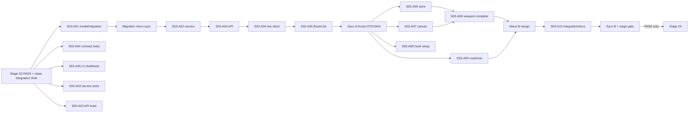

# Этап 03 — Board persistence, отдельный canvas и viewport

> **Для agentic workers:** этап исполняется через `superpowers:subagent-driven-development`; обязательны `superpowers:using-git-worktrees`, `superpowers:test-driven-development` и `superpowers:verification-before-completion`. Работы распределяются между десятью практическими субагентами `S03-A01…S03-A10`, одновременно активны 3–5 независимых lane. Следующий этап запрещён до итогового `PASS`.

**Goal:** создать durable Board внутри существующего Project (`Folder`), отдельный пустой spatial canvas и server-authoritative восстановление viewport без изменения Flow Editor или `Flow.data`.

**Architecture:** Board — новая SQLModel-сущность с FK на `Folder`; rename и viewport изменяются только DB-CAS по `revision`. Frontend использует отдельный `@xyflow/react` canvas, существующие `api` + `UseRequestProcessor`, TanStack Query для server state и неперсистентный Zustand store только для mounted/hydration/gesture state.

**Tech stack:** Python/FastAPI, SQLModel/SQLAlchemy/Alembic, SQLite, PostgreSQL, React/TypeScript, React Router, TanStack Query, Zustand, locked `@xyflow/react` v12, pytest, Jest, Playwright.

---

## 1. Название и номер этапа

**Номер:** 03 из 10.

**Название:** Board persistence, отдельный canvas и viewport.

**Предшествующий gate:** только зафиксированный `PASS` Этапа 02.

**Следующий gate:** Этап 04 — Placement, CardFrame и BoardNote; он не начинается, пока Этап 03 не получил `PASS` на одном exact SHA.

**Scope этапа:** Board identity, Project ownership, CRUD, отдельный canvas с нулём nodes/edges, pan/zoom, durable viewport, прямой URL и reload.

**Не входит:** Placement, BoardNote, Chat, Automation, Job result, Board relations, Flow edges, embedded Flow Editor, per-user viewport, realtime collaboration, CRDT/OT, новая Project/Workspace table, package upgrades.

**Нормативный внутренний gate:** один из трёх статусов — `PASS`, `FAIL`, `BLOCKED`. Пользовательский итоговый статус формулируется только как «этап выполнен», «этап выполнен частично» или «этап заблокирован» по mapping §15; другие статусы запрещены.

## 2. Контекст

1. `Project` уже представлен существующим `Folder`; Stage 03 не создаёт `Project` table и не дублирует ownership.
2. `src/frontend/src/pages/FlowPage/**` и `src/frontend/src/stores/flowStore.ts` принадлежат executable Flow Editor. Их state, node types, graph identifiers и `Flow.data` нельзя использовать как Board persistence.
3. На master baseline Board-слоя нет: отсутствуют backend model/service/API, `BoardsPage`, `BoardPage`, `boardStore` и `board-viewport.spec.ts`. Этап создаёт их впервые после принятого Stage-02 shell.
4. Фактический backend registrar разделён на два файла: `src/backend/base/ketos/api/v1/__init__.py` экспортирует routers, а `src/backend/base/ketos/api/router.py` включает их в уже существующий `router_v1`. Поэтому A10 обязан изменить оба файла и не создавать второй `/api/v1` mount.
5. Фактический model registrar — `src/backend/base/ketos/services/database/models/__init__.py`; только A01 имеет право менять его в этом этапе.
6. Alembic script location — `src/backend/base/ketos/alembic`; migration строится от head, полученного непосредственно перед A01. Документированный baseline head `9a6e34f1c2d8` не подменяет live-проверку.
7. Frontend уже содержит `@tanstack/react-query`, Zustand и `@xyflow/react`; locked install на проверенном baseline разрешает `@xyflow/react` v12.10.2. Package manifests и lock-файлы в Stage 03 не меняются.
8. Project/Board UI должен быть закрыт существующим default-off `mvp_workspace` flag из Stage 01/02; выключение скрывает route/UI, но не удаляет Board rows и не делает API fail-open.
9. Все Python-команды выполняются через `uv run`. `KFX_DEV=1` не требуется: Stage 03 не разрабатывает KFX components.
10. Graphify используется только read-only для навигации; source, tests и runtime остаются authoritative. RaytSystem operational stores, `_raw/`, ledgers, generated knowledge и `.raytsystem/` напрямую не редактируются.

## 3. Цель

Пользователь-владелец Project должен:

1. открыть `/project/:projectId/boards`;
2. создать минимум две независимые Board;
3. получить server-issued UUID каждой Board;
4. открыть `/project/:projectId/board/:boardId` напрямую или через список;
5. увидеть отдельный spatial canvas с dotted background, MiniMap и zoom controls;
6. выполнить pan и zoom;
7. дождаться debounced save либо уйти со страницы и инициировать flush;
8. перезагрузить страницу и получить тот же `x`, `y`, `zoom` из server state;
9. переименовать и удалить Board отдельными действиями;
10. открыть legacy `/flow/:id` без регрессии.

Security-цель: missing, foreign и NULL-owned parent Project/Board не раскрывают metadata и возвращают `404`; browser не задаёт trusted actor/owner; concurrent writers не теряют update.

Architecture-цель: Board остаётся отличной от Flow сущностью; Stage 03 не записывает geometry/viewport в `Flow.data`, не создаёт Flow node/edge и не импортирует `flowStore` в Board code.

## 4. Подробное техническое задание

### 4.1. Архитектурные инварианты

- `Project = Folder`; `Board.project_id` указывает на `folder.id`.
- `Board != Flow`; ни один Board DTO/service/hook не читает и не пишет `Flow.data`.
- Board canvas содержит `nodes={[]}` и `edges={[]}`; placements появятся только в Stage 04.
- Board relation не является Flow edge; Stage 03 не создаёт relation model/API/UI.
- `created_by_id` — provenance; authorization выполняется только через strict owner `Folder.user_id == current_user.id`.
- `Folder.user_id IS NULL` не означает public.
- Actor server-derived: `created_by_id`, `user_id`, roles и ownership отсутствуют в create/update request schemas.
- Server DB является truth; Zustand и browser storage не являются durable Board state.
- Новые data API остаются owner-only readable при выключенном UI feature flag, чтобы flag off/on не терял данные.
- Existing Flow Editor, KFX ABI, persisted component class names, extension manifests, legacy Assistant и Flow routes не меняются.

### 4.2. Доменная модель Board

Планируемые новые production targets (на baseline отсутствуют) и единственный существующий registrar target:

- `src/backend/base/ketos/services/database/models/board/__init__.py`
- `src/backend/base/ketos/services/database/models/board/model.py`
- `src/backend/base/ketos/services/database/models/__init__.py`
- `src/backend/base/ketos/alembic/versions/b03dca5a0001_add_board_table.py`

Таблица `board`:

| Поле | Тип и default | Нормативное ограничение |
| --- | --- | --- |
| `id` | UUID, `uuid4`, PK | immutable server ID |
| `project_id` | UUID, NOT NULL | FK `folder.id`, `ON DELETE CASCADE`, index |
| `created_by_id` | UUID, NOT NULL | FK `user.id`, `ON DELETE CASCADE`, provenance, index |
| `title` | string, NOT NULL | trimmed length `1..255`; DB check и request validation |
| `viewport_x` | double, default `0.0` | finite number; request validation |
| `viewport_y` | double, default `0.0` | finite number; request validation |
| `viewport_zoom` | double, default `1.0` | `0.5 <= zoom <= 2.0`; совпадает с locked React Flow v12 defaults |
| `revision` | integer, default/server default `0` | `revision >= 0`; increment только DB-CAS |
| `created_at` | timezone-aware datetime | NOT NULL, UTC, server default `now()` |
| `updated_at` | timezone-aware datetime | NOT NULL, UTC, server default `now()`, меняется при mutation |

Имена portable constraints:

- `ck_board_title_length`
- `ck_board_viewport_zoom_range`
- `ck_board_revision_nonnegative`

Migration является additive expand-only: создаёт одну новую пустую table и indexes, не backfill-ит и не меняет существующие tables. `upgrade()` создаёт schema; `downgrade()` удаляет только `board`. Перед созданием файла A01 выполняет live head check; revision ID фиксирован `b03dca5a0001`, `down_revision` равен единственному фактическому head Sync-A base. Если head не один, A01 не создаёт merge migration в своём lane и сообщает coordinator `FAIL` для локально исправимого branch divergence либо `BLOCKED`, если divergence принадлежит внешнему незавершённому prerequisite.

### 4.3. Backend schemas и service interfaces

Планируемые новые service/schema/API targets (на baseline отсутствуют):

- `src/backend/base/ketos/services/board/__init__.py`
- `src/backend/base/ketos/services/board/service.py`
- `src/backend/base/ketos/api/v1/schemas/board.py`
- `src/backend/base/ketos/api/v1/boards.py`

Нормативные DTO:

```python
class BoardCreate(SQLModel):
    title: str

class BoardPatch(SQLModel):
    title: str
    expected_revision: int

class BoardViewportUpdate(SQLModel):
    x: float
    y: float
    zoom: float
    expected_revision: int

class BoardRead(SQLModel):
    id: UUID
    project_id: UUID
    created_by_id: UUID
    title: str
    viewport_x: float
    viewport_y: float
    viewport_zoom: float
    revision: int
    created_at: datetime
    updated_at: datetime
```

Нормативные service interfaces:

```text
require_owned_project(session: AsyncSession, project_id: UUID, actor_id: UUID) -> Awaitable[Folder]
list_boards(session: AsyncSession, project_id: UUID, actor_id: UUID) -> Awaitable[list[Board]]
create_board(session: AsyncSession, project_id: UUID, actor_id: UUID, title: str) -> Awaitable[Board]
get_owned_board(session: AsyncSession, board_id: UUID, actor_id: UUID) -> Awaitable[Board]
rename_board(session: AsyncSession, board_id: UUID, actor_id: UUID, title: str, expected_revision: int) -> Awaitable[Board]
update_board_viewport(session: AsyncSession, board_id: UUID, actor_id: UUID, viewport: BoardViewportUpdate) -> Awaitable[Board]
delete_board(session: AsyncSession, board_id: UUID, actor_id: UUID, expected_revision: int) -> Awaitable[None]
```

`require_owned_project` выполняет exact owner predicate. `get_owned_board` использует owner-scoped join `Board → Folder`, чтобы missing/foreign/NULL-owned Board имели один внешний результат `404`. Нельзя авторизовать по `created_by_id`.

### 4.4. DB-CAS contract

Rename и viewport выполняются SQL `UPDATE`, а delete — conditional SQL `DELETE`; load-modify-commit для concurrency decisions запрещён:

```sql
UPDATE board
SET title = :title,
    revision = revision + 1,
    updated_at = :utc_now
WHERE id = :board_id
  AND revision = :expected_revision;
```

Viewport использует тот же predicate и одним statement меняет `viewport_x`, `viewport_y`, `viewport_zoom`, `revision`, `updated_at`.

Порядок:

1. exact-owner parent guard;
2. validate title либо finite x/y + zoom range + nonnegative expected revision;
3. conditional `UPDATE`;
4. проверить `rowcount == 1`;
5. если `0`, rollback текущей mutation и вернуть `409` с stable code `board_revision_conflict`; никаких partial writes;
6. если `1`, commit, owner-scoped reread и вернуть новую revision.

Delete использует тот же CAS принцип:

```sql
DELETE FROM board
WHERE id = :board_id
  AND revision = :expected_revision;
```

После exact-owner guard `rowcount == 1` даёт `204`; `rowcount == 0` даёт `409 board_revision_conflict`. Stale delete сохраняет Board без изменения. Delete удаляет только Board row; Flow/Folder не удаляются. Поведение будущих Placement children определяется Stage 04 migration, а не скрытым Stage-03 side effect.

Two-writer tests открывают независимые DB sessions с одинаковой `expected_revision`. Для update ровно один writer получает success/revision+1, второй conflict, persisted row равен winner payload. Для update-vs-delete или двух deletes ровно одна conditional mutation имеет effect; stale loser получает `409`. Python mutex, process-local lock и last-write-wins не принимаются.

### 4.5. HTTP API contract

| Method | Endpoint | Request | Success | Errors |
| --- | --- | --- | --- | --- |
| `POST` | `/api/v1/projects/{project_id}/boards` | `{title}` | `201 BoardRead` | `404` parent missing/foreign/NULL-owned; `422` invalid title |
| `GET` | `/api/v1/projects/{project_id}/boards` | none | `200 BoardRead[]`, stable `created_at,id` order | `404` parent missing/foreign/NULL-owned |
| `GET` | `/api/v1/boards/{board_id}` | none | `200 BoardRead` | `404` missing/foreign/NULL-owned |
| `PATCH` | `/api/v1/boards/{board_id}` | `{title,expected_revision}` | `200 BoardRead` | `404`, `409`, `422` |
| `DELETE` | `/api/v1/boards/{board_id}?expected_revision={revision}` | required nonnegative query revision | `204`, empty body | `404`, `409`, `422` |
| `PUT` | `/api/v1/boards/{board_id}/viewport` | `{x,y,zoom,expected_revision}` | `200 BoardRead` | `404`, `409`, `422` |

Nested create/list сначала выполняют `require_owned_project`, затем Board query/insert. Request body не принимает `project_id`, `created_by_id`, actor, role или owner. Error body не раскрывает existence/owner identity. Router получает `CurrentActiveUser` и `DbSession` из существующих Ketos dependencies.

### 4.6. Frontend client contract

Планируемые новые frontend client targets; `constants.ts` — существующий shared URL target:

- `src/frontend/src/types/board/index.ts`
- `src/frontend/src/controllers/API/helpers/constants.ts`
- `src/frontend/src/controllers/API/queries/boards/index.ts`
- `src/frontend/src/controllers/API/queries/boards/keys.ts`
- `src/frontend/src/controllers/API/queries/boards/use-get-boards.ts`
- `src/frontend/src/controllers/API/queries/boards/use-get-board.ts`
- `src/frontend/src/controllers/API/queries/boards/use-post-board.ts`
- `src/frontend/src/controllers/API/queries/boards/use-patch-board.ts`
- `src/frontend/src/controllers/API/queries/boards/use-put-board-viewport.ts`
- `src/frontend/src/controllers/API/queries/boards/use-delete-board.ts`
- `src/frontend/src/controllers/API/queries/boards/__tests__/boards.test.tsx`

Типы зеркалят `BoardRead`, `BoardCreate`, `BoardPatch`, `BoardViewportUpdate`. Все calls используют existing `api` и `UseRequestProcessor`; raw `fetch`, second Axios instance и local token handling запрещены.

Query-key factory:

```typescript
export const boardKeys = {
  all: ["boards"] as const,
  lists: () => [...boardKeys.all, "list"] as const,
  list: (projectId: string) => [...boardKeys.lists(), projectId] as const,
  details: () => [...boardKeys.all, "detail"] as const,
  detail: (projectId: string, boardId: string) =>
    [...boardKeys.details(), projectId, boardId] as const,
};
```

Create invalidates only `list(projectId)`; rename/viewport update exact `detail(projectId,boardId)` and invalidates the same Project list; delete sends the cached current `expected_revision`, removes exact detail only after `204` and invalidates list. A delete `409` preserves detail, refetches it and shows the same server-wins conflict state. No cache key omits Project scope.

### 4.7. Board list, route и navigation

Планируемые новые page targets; `routes.tsx` и locale JSON — существующие shared registrar targets:

- `src/frontend/src/pages/BoardsPage/index.tsx`
- `src/frontend/src/pages/BoardsPage/__tests__/index.test.tsx`
- `src/frontend/src/pages/BoardPage/index.tsx`
- `src/frontend/src/pages/BoardPage/__tests__/index.test.tsx`
- `src/frontend/src/routes.tsx`
- `src/frontend/src/locales/en.json`
- `src/frontend/src/locales/ru.json`

Routes:

- `/project/:projectId/boards` — Board list внутри Stage-02 Project shell;
- `/project/:projectId/board/:boardId` — direct Board page.

`BoardsPage` имеет distinct loading/empty/load-error/retry states и отдельные create/rename/delete pending states; pending mutation блокирует duplicate submit, но не скрывает существующий list. Create, open, inline rename и separate delete confirmation используют current revision; stale delete закрывается без удаления и refetches server Board. Create/open навигирует по server Board ID. Route params валидируются как UUID до query; invalid param показывает bounded not-found state без metadata. `New Board` доступен из Project shell. Все strings имеют одинаковые ru/en keys; locale registrars изменяет только A10.

### 4.8. Transient Zustand store

Планируемые новые transient-store/test targets:

- `src/frontend/src/stores/boardStore.ts`
- `src/frontend/src/stores/__tests__/boardStore.test.ts`

Store содержит только:

```typescript
type BoardHydrationPhase = "idle" | "hydrating" | "ready";
type BoardTransientState = {
  mountedBoardId: string | null;
  hydrationPhase: BoardHydrationPhase;
  isViewportGestureActive: boolean;
  pendingViewport: Viewport | null;
};
```

Store не использует `persist`, localStorage/indexedDB и не хранит title/revision как durable truth. `mountBoard(newId)` atomically очищает previous gesture/pending viewport и запускает hydration; `unmountBoard()` возвращает initial state. Store action никогда не создаёт server entity.

### 4.9. Отдельный BoardCanvas

Планируемые новые BoardCanvas/test targets:

- `src/frontend/src/components/core/board/BoardCanvas.tsx`
- `src/frontend/src/components/core/board/index.ts`
- `src/frontend/src/components/core/board/__tests__/BoardCanvas.test.tsx`

Canvas использует `ReactFlowProvider`, `ReactFlow`, `Background` с `BackgroundVariant.Dots`, `MiniMap`, `Controls`. Нормативные props Stage 03:

```tsx
<ReactFlow
  nodes={[]}
  edges={[]}
  fitView={false}
  defaultViewport={initialViewport}
  minZoom={0.5}
  maxZoom={2}
  onMoveEnd={onMoveEnd}
  nodesDraggable={false}
  nodesConnectable={false}
  elementsSelectable={false}
>
  <Background variant={BackgroundVariant.Dots} />
  <MiniMap />
  <Controls showFitView={false}>
    <ControlButton aria-label={t("board.viewport.reset")} onClick={resetViewport}>
      0
    </ControlButton>
  </Controls>
</ReactFlow>
```

Board canvas использует existing semantic tokens/`components/ui`; raw hex/rgb colors запрещены. Canvas получает keyboard focus через видимый/семантический entry point, имеет accessible label, а Escape/Back action возвращает focus к Board header/navigation. Imports `flowStore`, Flow node types, `CustomNodes`, `FlowPage`, legacy Assistant и `Flow.data` запрещены source guard.

Keyboard contract: Enter/Space на явном действии «Открыть холст» переводит focus в canvas; Arrow keys pan на `40 px`, Shift+Arrow — на `160 px`; `+`/`-` изменяют zoom на `0.2` в границах `0.5…2.0`; `0` устанавливает viewport `(0,0,1)`; Escape возвращает focus на действие входа. Zoom-in/zoom-out/reset доступны также как keyboard-operable buttons. Default React Flow fit-view control скрыт (`showFitView={false}`), чтобы reset не зависел от отсутствующих nodes. Все keyboard pan/zoom/reset завершаются через тот же `onMoveEnd` persistence contract.

Product states различимы не только визуально: loading имеет status semantics, empty объясняет отсутствие будущих placements без ложной ошибки, error содержит retry, conflict сообщает server-wins refetch и не блокирует навигацию. Screenshot является только supplemental evidence и не доказывает focus, keyboard behavior, API persistence или reload.

### 4.10. Viewport hydration/persistence

Планируемые новые viewport hook/test targets:

- `src/frontend/src/pages/BoardPage/hooks/use-board-viewport.ts`
- `src/frontend/src/pages/BoardPage/hooks/__tests__/use-board-viewport.test.tsx`

Контракт:

1. Board query завершается до mount `BoardCanvas`; loading/error не монтируют ReactFlow.
2. Server `{viewport_x,viewport_y,viewport_zoom}` преобразуется в `Viewport {x,y,zoom}` и передаётся как `defaultViewport`.
3. `fitView={false}` всегда; никакой post-mount fit-to-empty call.
4. `onMoveEnd` сохраняет последнюю viewport через trailing debounce `300 ms`; intermediate move events не пишут DB.
5. Следующий save использует revision, возвращённую предыдущим successful mutation/cache update.
6. Cleanup hook вызывает synchronous `flush()` mutation dispatch для последней pending viewport; raw beacon/fetch не используется.
7. `409` отменяет pending local save, refetches `detail(projectId,boardId)`, вызывает `setViewport(serverViewport,{duration:0})` и показывает localized non-destructive conflict notice.
8. Переключение Board отменяет timer старой Board и не отправляет её viewport под новым ID.
9. Server JSON float triple до/после reload должна совпасть exactly; rendered ReactFlow transform сверяется с server values с tolerance `1e-6`, учитывая browser CSS serialization.

### 4.11. Exact owned file map

| Owner | Create/modify paths | Forbidden shared paths |
| --- | --- | --- |
| A01 | board model, fixed migration, model registrar, migration test | API/routes/frontend/locks |
| A02 | `services/board/**`, service tests | model registrar/migration/API registrar |
| A03 | schemas, `api/v1/boards.py`, API tests, registrar patch artifact | live registrars/routes/frontend |
| A04 | board TS types, Board queries, URL constant, hook tests | routes/locales/package files |
| A05 | `BoardsPage/**` | routes/locales/shared canvas |
| A06 | `boardStore.ts`, store test | server cache/query code/routes |
| A07 | `components/core/board/**` | `flowStore`, FlowPage, routes/locales |
| A08 | viewport hook/tests | routes/locales/Flow files |
| A09 | BoardPage/nav tests and route patch artifact | live `routes.tsx`, locale registrar |
| A10 | backend registrars, `src/backend/tests/unit/api/test_board_router_registration.py`, `routes.tsx`, locales, integration spec, stage docs | migrations/model registrar/locks |

## 5. Перечень задач S03-A01…S03-A10

### S03-A01 — Board model и additive migration

**Цель:** создать cross-dialect Board persistence и единственный migration head.

**Ответственность:** schema/migration implementation owner; роли implementation, tests, database compliance.

**Задачи:**

1. Записать failing `src/backend/tests/unit/alembic/test_mvp_board_migration.py` для table/columns/FK/index/check/default/upgrade/downgrade/model parity.
2. Проверить live Alembic head и single-head.
3. Создать `board/{model.py,__init__.py}` и exact revision `b03dca5a0001_add_board_table.py`.
4. Единолично экспортировать `Board` из model registrar; request/response schemas остаются в A03 `api/v1/schemas/board.py` и не дублируются в model package.
5. Выполнить focused test, SQLite gate, PostgreSQL gate и повторный single-head check.

**Result:** model и migration, которые одинаково описывают Board в SQLModel, SQLite и PostgreSQL.

**Criteria:** constraints имеют заданные имена; defaults `0/0/1/0`; `created_by_id` не используется для auth; upgrade/downgrade/model parity зелёные; один head; existing tables не изменены.

**Focused verification:**

```bash
uv run pytest src/backend/tests/unit/alembic/test_mvp_board_migration.py -q
cd src/backend/base/ketos && uv run alembic -c alembic.ini heads
```

**Blocked tasks:** A02/A03 production implementation; Sync A; весь Wave B.

### S03-A02 — Board service и DB-CAS

**Цель:** реализовать owner-only CRUD и database-enforced concurrency.

**Ответственность:** backend domain owner; роли implementation, security, tests.

**Задачи:**

1. До A01 sync написать failing strict-owner tests и exact races `test_viewport_two_writers_one_winner_one_409`, `test_stale_rename_and_viewport_write_zero_columns`, `test_stale_delete_preserves_board`.
2. После A01 micro-sync реализовать `require_owned_project`, create/list/get.
3. Реализовать rename/viewport conditional updates и delete conditional mutation с `rowcount == 1`.
4. Нормализовать missing/foreign/NULL-owned в not-found и stale revision в conflict.
5. Проверить persisted winner и отсутствие loser write.

**Result:** `services/board/service.py` с единственным Board domain seam.

**Criteria:** foreign/NULL owner deny; browser actor ignored на API boundary; update/update и update/delete races дают one effect/one conflict; revision update увеличивается на один; stale delete сохраняет Board; rollback не оставляет partial state.

**Focused verification:**

```bash
uv run pytest src/backend/tests/unit/services/board/test_service.py -q
```

**Blocked tasks:** A03 endpoint bodies, A08 conflict behavior, A10 integration.

### S03-A03 — Board schemas и API

**Цель:** предоставить exact REST contract поверх A02.

**Ответственность:** backend API owner; роли analysis, implementation, security, tests.

**Задачи:**

1. Сначала написать router-local API tests для всех шести endpoints, error matrix, `test_board_get_patch_delete_deny_foreign_owner`, `test_board_parent_child_id_mixup_fails_closed`, `test_stale_rename_and_viewport_write_zero_columns` и `test_stale_delete_preserves_board`; assembled-app registration остаётся A10.
2. Создать `api/v1/schemas/board.py` без actor/owner fields.
3. Создать `api/v1/boards.py`; nested routes authorizes parent before Board query.
4. Использовать `CurrentActiveUser`, `DbSession` и A02 service; не дублировать SQL/auth в router.
5. Передать A10 минимальный registrar patch; не изменять shared registrars самостоятельно.

**Result:** ordinary FastAPI router с OpenAPI-visible DTO и stable statuses.

**Criteria:** POST 201; delete 204 only for matching revision; every stale mutation 409/zero unintended columns; foreign/missing/NULL-owned 404; invalid input 422; response never leaks another owner metadata.

**Focused verification:**

```bash
uv run pytest src/backend/tests/unit/api/v1/test_boards.py -q
```

**Blocked tasks:** A04 live contract validation, A10 router integration/browser test.

### S03-A04 — TypeScript client contract

**Цель:** создать единый authenticated API seam и project-scoped cache keys.

**Ответственность:** frontend data owner; роли analysis, implementation, tests, compliance.

**Задачи:**

1. По frozen DTO написать failing hook tests для list/get/create/rename/delete/viewport.
2. Создать Board types, URL constant, query keys и hooks.
3. Использовать только `api` + `UseRequestProcessor`.
4. Реализовать exact invalidation/update для Project list и Board detail.
5. На 409 пробросить typed HTTP error A08; не optimistic-overwrite server state.

**Result:** reusable typed Board query package без второго auth/cache stack.

**Criteria:** каждый list/detail key содержит projectId; detail содержит boardId; credentials refresh сохраняется; raw fetch отсутствует; mutation tests подтверждают correct invalidations.

**Focused verification:**

```bash
cd src/frontend
npm test -- --runInBand src/controllers/API/queries/boards/__tests__/boards.test.tsx
```

**Blocked tasks:** A05 live interactions, A08 persistence, A10 browser integration.

### S03-A05 — BoardsPage

**Цель:** дать пользователю несколько Board и явный CRUD UI.

**Ответственность:** product/UI owner; роли product design, implementation, tests, docs-content.

**Задачи:**

1. Создать failing page tests для loading/error/empty/list/create/open/rename/delete.
2. Создать `BoardsPage` на existing `components/ui` и semantic tokens с distinct loading/empty/load-error/retry и create/rename/delete pending states.
3. Навигировать только по server-issued Board ID.
4. Реализовать inline rename и separate delete confirmation с current expected revision; stale delete refetches, не закрывает задачу как success.
5. Передать A10 точный ru/en key manifest; shared locale files не менять.

**Result:** Project-scoped Board list и New Board entry.

**Criteria:** два Board не смешиваются; cancel/stale delete не меняет server; pending blocks duplicate; error имеет retry и сохраняет usable page; keyboard create/open/rename/delete доступен; no hardcoded system English.

**Focused verification:**

```bash
cd src/frontend
npm test -- --runInBand src/pages/BoardsPage/__tests__/index.test.tsx
```

**Blocked tasks:** A09 navigation completion, A10 end-to-end story.

### S03-A06 — Transient boardStore

**Цель:** изолировать ephemeral mounted/gesture/hydration state от server truth.

**Ответственность:** frontend state owner; роли implementation, tests, compliance.

**Задачи:**

1. Написать failing store tests для mount/switch/unmount.
2. Создать minimal store с exact state из §4.8.
3. При Board switch atomically clear pending viewport и gesture state.
4. Запретить Zustand persist middleware и server entity methods.

**Result:** маленький resettable transient store.

**Criteria:** switching Board очищает old state; localStorage не вызывается; title/revision не становятся durable store truth; store action не делает HTTP.

**Focused verification:**

```bash
cd src/frontend
npm test -- --runInBand src/stores/__tests__/boardStore.test.ts
```

**Blocked tasks:** A08 robust switch/unmount behavior, A10 integration.

### S03-A07 — Отдельный BoardCanvas

**Цель:** создать spatial orientation surface, архитектурно изолированный от Flow.

**Ответственность:** canvas owner; роли product design, implementation, accessibility, tests, compliance.

**Задачи:**

1. Написать rendering/interaction/source-guard tests.
2. Создать BoardCanvas с Dots Background, MiniMap, Controls и exact props §4.9.
3. Добавить focus entry/return, accessible label, Arrow/Shift+Arrow pan и keyboard `+`/`-`/`0` zoom/reset.
4. Скрыть fit-view control, проверить empty nodes/edges и отсутствие Flow imports.

**Result:** отдельный пустой React Flow canvas, готовый к Stage-04 placements.

**Criteria:** controls/minimap/background видимы; pointer и keyboard pan/zoom/reset работают; focus entry/Escape return доказаны interaction test; `fitView=false` и `showFitView=false`; nodes/edges empty; source guard зелёный; legacy Flow canvas не изменён.

**Focused verification:**

```bash
cd src/frontend
npm test -- --runInBand src/components/core/board/__tests__/BoardCanvas.test.tsx
```

**Blocked tasks:** A08 mounting/hydration, A10 browser acceptance, Stage 04 scene wiring.

### S03-A08 — Viewport hook

**Цель:** persist и restore exact server-authoritative viewport.

**Ответственность:** viewport/concurrency frontend owner; роли implementation, tests, resilience, security.

**Задачи:**

1. Fake timers: написать failing tests hydrate-before-mount, 300 ms debounce, flush, switch, 409 refetch.
2. Реализовать hook поверх A04 mutations и A06 transient store.
3. Coalesce only onMoveEnd, update revision from response.
4. На 409 discard pending local value и apply refetched server viewport.
5. На unmount dispatch last pending mutation через existing API seam.

**Result:** deterministic viewport lifecycle без local durable cache.

**Criteria:** saved x/y/zoom restored after reload; timer old Board не пишет new Board; 409 не перезаписывает winner; no raw fetch/beacon; exact server triple and `1e-6` rendered tolerance.

**Focused verification:**

```bash
cd src/frontend
npm test -- --runInBand src/pages/BoardPage/hooks/__tests__/use-board-viewport.test.tsx
```

**Blocked tasks:** A10 exact viewport browser story.

### S03-A09 — BoardPage route и navigation

**Цель:** обеспечить authenticated direct URL/reload и переходы Project ↔ Board.

**Ответственность:** route/navigation owner; роли analysis, implementation, tests, docs-content, compliance.

**Задачи:**

1. Написать route/page tests с valid, invalid, foreign IDs и feature flag off.
2. Создать BoardPage composition: Board query → loading/error → hydrated canvas.
3. Подготовить patch для двух routes; live `routes.tsx` не менять до A10.
4. Сохранить legacy `/flow/:id`, `/flow/:id/folder/:folderId`, `/flow/:id/view`.
5. Передать A10 route and locale manifest.

**Result:** Board direct URL contract без route collision.

**Criteria:** reload открывает тот же Board; wrong project/board pair не раскрывает Board; flag off hides UI route; direct Flow behavior unchanged.

**Focused verification:**

```bash
cd src/frontend
npm test -- --runInBand src/pages/BoardPage/__tests__/index.test.tsx
```

**Blocked tasks:** A10 shared route merge и browser test.

### S03-A10 — Integration, registrars, docs и compatibility

**Цель:** объединить все seams на одном SHA и доказать stage story.

**Ответственность:** integration owner, не reviewer-only; роли implementation, tests, security, docs, compliance, compatibility.

**Задачи:**

1. После A01–A09 merge изменить backend registrars `src/backend/base/ketos/api/v1/__init__.py` и `src/backend/base/ketos/api/router.py`, а также `src/frontend/src/routes.tsx`, единолично.
2. Создать `src/backend/tests/unit/api/test_board_router_registration.py`: assembled app считает каждую Board method/path пару ровно один раз непосредственно в `app.routes`/`APIRoute.methods` и дополнительно проверяет OpenAPI visibility; при `mvp_workspace=false` Board API остаётся reachable, owner-only и foreign/NULL deny. Один OpenAPI dict недостаточен, потому что одинаковые keys могут скрыть duplicate declarations.
3. Добавить ru/en keys и пройти locale parity, key-use и hardcoded-copy checks.
4. Создать `src/frontend/tests/core/features/board-viewport.spec.ts`.
5. Добавить реальный integration wiring и исправить только Stage-03 compatibility defects.
6. Создать `docs/docs/development/board-workspace.md` и `docs/evidence/stage-03/STAGE_03_REPORT_RU.md`.
7. Запустить stage gate последовательно; heavy frontend commands и Playwright не параллелить.

**Result:** runnable Board slice, evidence report и Stage-04 handoff.

**Criteria:** assembled FastAPI `app.routes` содержит все six method/path pairs ровно по одному under `/api/v1`, а OpenAPI их публикует; flag off скрывает UI, но API остаётся owner-only readable и foreign/NULL deny; two Boards independent; exact viewport restored; ownership/CAS proven; `/flow/:id` smoke green; docs match implemented contract; registrar duplication absent.

**Focused verification:**

```bash
uv run pytest \
  src/backend/tests/unit/api/v1/test_boards.py \
  src/backend/tests/unit/api/test_board_router_registration.py -q
cd src/frontend
npx playwright test tests/core/features/board-viewport.spec.ts --project=chromium
```

**Blocked tasks:** final Sync B, Stage-03 status, transition to Stage 04.

## 6. Подэтапы, шаги, матрица субагентов и DAG

### 6.1. Обязательное использование субагентов и релевантных инструментов

Stage 03 использует все десять практических субагентов. Один agent засчитывается только за production code, migration, component, integration wiring, focused fixture/test или executable verification tooling. Coordinator review не считается одним из десяти deliverables.

Каждый assignment обязан содержать:

- base SHA;
- branch `codex/mvp-s03-aYY-*`;
- writable paths из §4.11;
- forbidden paths;
- exact interfaces consumed/produced;
- focused failing test и passing command;
- expected code deliverable;
- commit SHA и changed paths handoff;
- `PASS`, `FAIL` или `BLOCKED` с доказательством.

Обязательные релевантные инструменты распределяются так:

| Роль | Инструменты/skills | Нормативное применение |
| --- | --- | --- |
| Coordinator | `superpowers:using-git-worktrees`, `subagent-driven-development`, `verification-before-completion`, git | clean integration worktree, lane branches, sequential merge, exact SHA gate |
| Анализ | Graphify query read-only, repo `rg`, source slices | найти фактические registrars/seams; Graphify не rebuild-ить |
| Дизайн | `product-design:audit`, in-app Browser/Chrome control, existing UI tokens | focused Board list/canvas/keyboard check, без full design program |
| Backend реализация | `backend-code-review`, `test-driven-development`, `uv run`, SQLModel/Alembic/FastAPI | model/service/API, owner guard, DB-CAS, dialect parity |
| Frontend реализация | `frontend-code-review`, `frontend-query-mutation`, `frontend-testing` | API seam, query keys, Zustand, React Flow, routes |
| Tests/E2E | `frontend-testing`, `e2e-testing`, Playwright, pytest/Jest | focused behavior first, then stage gate |
| Security | `security-review`, auth negative matrix, two-writer test | fail-closed parent ownership, forged actor exclusion, CAS |
| Docs/compliance | Context7 + official docs, `lint`, RaytSystem read-only commands, diff/source guards | evidence, ru/en, scope/dirty-state/KFX/Flow separation |

Если конкретный skill/tool недоступен, agent фиксирует отсутствие и использует ближайший repo-local read-only/verification fallback. Но отсутствие Context7 для dependency-sensitive React Flow/FastAPI/Alembic contract является `BLOCKED`, потому что master plan запрещает начинать external API/SDK change по памяти модели.

### 6.2. Матрица субагентов

| Agent | Primary role | Parallel start | Prerequisites | Output | Verification | Blocked tasks |
| --- | --- | --- | --- | --- | --- | --- |
| A01 | schema/compliance | Wave A start | Stage 02 PASS, single head | model+migration+test | migration focused + two dialects | A02/A03 production, all Wave B |
| A02 | service/security | tests at Wave A start; code after micro-sync | A01 model | service+race test | service pytest | A03/A08/A10 |
| A03 | API/security | contract tests at Wave A start; code after A02 interface | A01/A02 | schemas/router/API test | API pytest | A04 live verify/A10 |
| A04 | frontend data | Wave A start on frozen DTO | Stage-03 DTO, later A03 | types/hooks/tests | focused Jest | A05/A08/A10 |
| A05 | product UI | Wave A start on frozen DTO | Stage-02 shell, A04 mock | BoardsPage/tests/key manifest | focused Jest | A09/A10 |
| A06 | state | Wave B start | Sync A DTO | store/test | focused Jest | A08/A10 |
| A07 | canvas/design | Wave B start | Sync A, locked xyflow contract | BoardCanvas/test | Jest+source guard | A08/A10/S04 |
| A08 | viewport | Wave B start | A04/A06/A07 | hook/test | fake-timer Jest | A10 |
| A09 | routes/docs-content | Wave B start | A05/A07 contract | BoardPage/tests/route patch | route Jest | A10 |
| A10 | integration/docs | after A06–A09 merged | all inputs | registrars/routes/locales/E2E/docs | full stage gate | transition |

### 6.3. Dependency DAG



### 6.4. Wave A

**Parallel:** A01 schema; A02/A03 failing characterization tests; A04 contract tests/mocks; A05 UI shell. Одновременно не более пяти. A02/A03 не пишут production code, импортирующий Board, до A01 micro-sync.

**Prerequisites:** Stage 02 report `PASS`; clean integration worktree; base SHA recorded; actual Alembic head single; frozen §4 DTO accepted; Context7/official docs proof recorded.

**Owner:** coordinator delegates A01–A05; A01 is sole migration/model registrar owner.

**Output:** model, migration, service, API, TypeScript contract, BoardsPage; frozen DTO and error semantics.

**Verification:** each focused command; SQLite migration micro-gate; A02 two-writer; A03 negative ownership; A04 cache isolation; A05 CRUD UI.

**Blocked tasks:** A06–A10 and every shared registrar merge.

### 6.5. Sync A

Coordinator merges sequentially: `A01 model/migration → A02 service → A03 API → A04 client → A05 list`. После каждого merge запускается соответствующий focused test. Conflicts не разрешаются lane agents в shared files.

**Parallel:** нет; merge, registrar reconciliation и focused reruns выполняются последовательно.

**Prerequisites:** A01–A05 передали commits, changed paths и focused results; A01 micro-gate и A02/A03 interfaces зелёные.

**Owner:** только coordinator; A01 консультирует по migration/model conflict, но не меняет integration branch напрямую.

**Output:** единый Sync-A SHA, frozen backend/TypeScript DTO, error contract и Board list seam.

**Verification:** последовательно повторить A01→A05 focused commands, затем SQLite migration nodes и `alembic heads`.

**Blocked tasks:** A06–A10, shared backend/frontend registrars и browser integration до выполнения всех exit criteria.

Sync-A exit criteria:

- one migration head;
- Board model/migration focused `PASS`;
- service/API focused `PASS`;
- DTO exact freeze;
- query keys project-scoped;
- BoardsPage tests green;
- new integration SHA recorded;
- no unrelated dirty diff.

Если любой criterion не выполнен, Wave B не стартует.

### 6.6. Wave B

**Parallel:** A06 store, A07 canvas, A08 viewport tests/implementation, A09 BoardPage/navigation patch. A08 consumes A06/A07 interfaces after their micro-sync; до этого пишет only fixture/tests.

**Prerequisites:** Sync-A SHA; locked React Flow v12 contract from Context7/official docs; no package change; DTO/error codes frozen.

**Owner:** coordinator delegates A06–A09. A07 owns Board canvas; A09 не меняет live route registrar.

**Output:** transient store, isolated canvas, viewport lifecycle, Board direct route/page.

**Verification:** focused Jest per lane; source guards; hydration before mount; debounce/flush/409 tests; route/feature flag/legacy Flow tests.

**Blocked tasks:** A10 integration and final stage gate.

### 6.7. Sync B

Coordinator merges `A06 → A07 → A08 → A09`, выполняет focused checks, затем запускает A10 от нового SHA. A10 единолично меняет backend routers, frontend routes, locales, integration spec и docs. После A10 merge код freeze; coordinator выполняет stage gate последовательно.

Heavy frontend type-check и Playwright не выполняются параллельно. SQLite/PostgreSQL disposable DB tests не делят одну DB. Final report относится только к frozen Sync-B SHA.

**Parallel:** merge и final gates не параллельны; independent code/security/design/docs reviews могут читать frozen diff параллельно, но не изменяют candidate.

**Prerequisites:** A06–A09 commits и focused proofs; Sync-A SHA; A10 registrar patches согласованы со всеми producers.

**Owner:** coordinator владеет merge/freeze/status; A10 владеет integration code, обоими backend registrar files `src/backend/base/ketos/api/v1/__init__.py` и `src/backend/base/ketos/api/router.py`, `src/frontend/src/routes.tsx`, locales, E2E и docs.

**Output:** frozen candidate SHA, reachable Board endpoints/routes, ru/en wiring, Chromium spec и Stage-03 report.

**Verification:** полный §12 в указанной последовательности плюс independent reviewer findings closure.

**Blocked tasks:** присвоение Stage-03 status и любой Stage-04 branch до завершения final gate.

## 7. Зависимости

### 7.1. Обязательные входы

1. Stage 02 имеет итог `PASS`, exact SHA и доказанный canonical Project route `/project/:projectId/boards` либо согласованный route seam, который Stage 03 дополняет без duplicate Project cache.
2. Project owner policy deny foreign и NULL-owned Folder; Stage 03 не может строиться поверх fail-open Project.
3. Existing default-off `mvp_workspace` feature flag доступен backend config → frontend `useUtilityStore`.
4. `@xyflow/react`, TanStack Query, Zustand уже установлены; manifests/locks неизменны.
5. `uv`, Node `>=20.19`, npm, pytest, Jest, Playwright доступны.
6. `MVP_POSTGRES_URI` указывает на disposable-capable PostgreSQL server; test harness имеет create/drop database rights.
7. Context7 resolve/query доступен для React Flow viewport/`onMoveEnd`, FastAPI APIRouter и Alembic operations; official docs являются вторым источником.
8. Один clean integration worktree и до пяти reusable lane worktrees доступны; root dirty checkout не используется для реализации.

### 7.2. Read-only preflight

```bash
S03_ROOT_CHECKOUT=/Volumes/Projects/ketos_canvas_mod_main
S03_INTEGRATION_ROOT=/tmp/ketos-mvp-s03-integration
S03_COORDINATOR_EVIDENCE=/tmp/ketos-mvp-s03-coordinator
mkdir -p "$S03_COORDINATOR_EVIDENCE"

git -C "$S03_ROOT_CHECKOUT" status --short
git -C "$S03_ROOT_CHECKOUT" status --porcelain=v1 -z > "$S03_COORDINATOR_EVIDENCE/root-status-before.z"
shasum -a 256 "$S03_COORDINATOR_EVIDENCE/root-status-before.z" > "$S03_COORDINATOR_EVIDENCE/root-status-before.sha256"
git -C "$S03_ROOT_CHECKOUT" rev-parse HEAD > "$S03_COORDINATOR_EVIDENCE/stage02-sha.txt"

if git -C "$S03_ROOT_CHECKOUT" worktree list --porcelain | rg -Fx "worktree $S03_INTEGRATION_ROOT"; then
  test "$(git -C "$S03_INTEGRATION_ROOT" branch --show-current)" = 'codex/mvp-s03-integration'
else
  test ! -e "$S03_INTEGRATION_ROOT" || { echo 'BLOCKED: integration path exists but is not a registered worktree'; exit 42; }
  git -C "$S03_ROOT_CHECKOUT" worktree add \
    -b codex/mvp-s03-integration \
    "$S03_INTEGRATION_ROOT" \
    "$(sed -n '1p' "$S03_COORDINATOR_EVIDENCE/stage02-sha.txt")"
fi

git -C "$S03_INTEGRATION_ROOT" status --porcelain=v1 -z > "$S03_COORDINATOR_EVIDENCE/integration-status-before.z"
test ! -s "$S03_COORDINATOR_EVIDENCE/integration-status-before.z" || { echo 'BLOCKED: integration worktree is not clean'; exit 42; }
git -C "$S03_INTEGRATION_ROOT" rev-parse HEAD > "$S03_COORDINATOR_EVIDENCE/base-sha.txt"
cmp "$S03_COORDINATOR_EVIDENCE/stage02-sha.txt" "$S03_COORDINATOR_EVIDENCE/base-sha.txt"

raytsystem doctor --root /Volumes/Projects/ketos_canvas_mod_main --json
raytsystem status --root /Volumes/Projects/ketos_canvas_mod_main --json
raytsystem graph status --root /Volumes/Projects/ketos_canvas_mod_main --json
cd "$S03_ROOT_CHECKOUT"
graphify query "Project Folder ownership Board router Flow canvas separation" --budget 2000
cd "$S03_INTEGRATION_ROOT/src/backend/base/ketos"
uv run alembic -c alembic.ini heads
```

Expected: Stage-02 handoff SHA сохранён в stable coordinator evidence; dirty root inventory сохранён отдельно; clean integration worktree имеет тот же base SHA; один Alembic head; RaytSystem checks read-only; Graphify queried из root и не rebuilt. Все implementation/tests/base→candidate diff ниже выполняются только в `$S03_INTEGRATION_ROOT`; root checkout не получает Stage-03 code/commits.

### 7.3. External/blocking dependencies

- Missing Stage-02 PASS: `BLOCKED`.
- Missing `MVP_POSTGRES_URI` or unavailable PostgreSQL after safe retry/local disposable alternatives: migration gate `BLOCKED`, не skip/PASS.
- Context7 unavailable for dependency-sensitive contract: related tasks `BLOCKED` before production API usage.
- Locally failing test/compile/type error: `FAIL`, потому что это implementation defect, а не external blocker.
- Multiple Alembic heads caused by Stage-03 lane: `FAIL`; caused by unresolved external integration branch prerequisite: `BLOCKED` with exact revisions.

## 8. Ожидаемые результаты

После successful Sync B существуют:

1. durable `board` table и SQLModel model;
2. один additive migration head, SQLite/PostgreSQL parity;
3. owner-only Board service и six endpoint router;
4. DB-CAS rename/viewport, one-winner concurrency proof;
5. typed Board frontend API package с Project-scoped keys;
6. BoardsPage с create/list/open/rename/delete;
7. transient boardStore без browser persistence;
8. BoardPage и отдельный empty BoardCanvas;
9. 300 ms debounced viewport save, unmount flush и 409 server-wins recovery;
10. exact viewport restore после reload;
11. authenticated direct Board route и unchanged legacy Flow routes;
12. ru/en parity, semantic tokens и focused keyboard path;
13. browser spec с двумя Board и Flow compatibility smoke;
14. `docs/docs/development/board-workspace.md` с model/API/CAS/hydration contract;
15. `docs/evidence/stage-03/STAGE_03_REPORT_RU.md` с exact SHA/commands/status.

Stage-04 handoff получает stable Board ID/API/revision/viewport contract и может добавить Placement migration поверх Board migration, не переопределяя Board.

## 9. Критерии выполнения каждой задачи

| ID | Обязательный deliverable | Наблюдаемое acceptance | Failure owner |
| --- | --- | --- | --- |
| S03-A01 | model+migration+registrar+test | one head; columns/FKs/checks/defaults; SQLite+PostgreSQL upgrade/downgrade/parity | A01 |
| S03-A02 | service+race test | exact owner; update/delete CAS has one effect, one 409, final row exact | A02 |
| S03-A03 | schemas/router+API test | six router-local endpoints; 201/200/204; 404/409/422; stale writes zero columns | A03 |
| S03-A04 | TS types/queries/tests | existing API seam; keys contain Project/Board; correct invalidation | A04 |
| S03-A05 | BoardsPage/tests | create/open server ID; rename/delete revision; distinct/pending/retry states; keyboard | A05 |
| S03-A06 | boardStore/test | switch/reset; no persistence; no HTTP/server entity creation | A06 |
| S03-A07 | BoardCanvas/tests | dots/minimap/controls; empty graph; fitView false; no Flow imports | A07 |
| S03-A08 | viewport hook/tests | hydrate before mount; 300 ms debounce; flush; 409 refetch; exact reload | A08 |
| S03-A09 | BoardPage/route patch/tests | direct URL/reload; project pair validation; flag off; Flow routes unchanged | A09 |
| S03-A10 | registrars/routes/locales/E2E/docs | `app.routes` registered once + OpenAPI; flag-off owner-only API; two Boards; reload; compatibility; report | A10 |

Каждая задача считается выполненной только после commit handoff с base SHA, commit SHA, changed paths, command, exit code и concise result. Код без focused proof не засчитывается; reviewer-only ответ не засчитывается.

## 10. Общие критерии готовности этапа

Этап получает `PASS` только если одновременно выполнено всё:

- S03-A01…A10 имеют practical deliverables и локальный `PASS`.
- Все deliverables объединены на одном frozen exact SHA.
- Create/list/get/rename/delete и multiple Boards доказаны через API/UI.
- Parent Folder strict-owner policy доказана для owner/foreign/NULL/missing.
- Forged actor/created_by/owner input не принимается.
- Rename, viewport и delete используют DB-CAS; update/update и update/delete races имеют one effect/one conflict/no lost update/stale delete.
- Board viewport после reload совпадает с server triple; rendered tolerance не хуже `1e-6`.
- Board canvas отдельный, nodes/edges пусты, `Flow.data` не затронут.
- `/flow/:id`, текущий Flow canvas, NoteNode и legacy Assistant compatibility gates зелёные.
- Migration upgrade/downgrade/model parity зелёны отдельно на SQLite и PostgreSQL; один head.
- Отсутствующий PostgreSQL gate не засчитан как pass.
- Frontend focused tests, type-check, i18n parity/key-use/hardcoded checks и Chromium spec зелёные.
- New UI uses semantic tokens/`components/ui`; no raw colors/hardcoded system English.
- Keyboard entry/Escape return, Arrow pan и `+`/`-`/`0` zoom/reset работают; screenshot не используется как единственное доказательство.
- Project/Board shell сохраняет ровно один account/Settings entrypoint; Stage-03 routes не создают второй header/menu.
- UI feature flag off скрывает Board UI без удаления данных; assembled-app test доказывает, что APIs остаются owner-only readable и foreign/NULL deny.
- No dependency/package/lock change.
- Base→candidate changed-path allow/deny и pre/post dirty inventory доказывают, что unrelated dirty/generated/deployment/locks/`LICENSE`/`NOTICE` files не изменены.
- Stage docs отражают actual implementation и commands.
- Нет unresolved Critical/blocking defect в Stage-03 path.

## 11. Риски, блокеры и способы устранения

| Риск | Сигнал | Устранение | Когда блокирует |
| --- | --- | --- | --- |
| Alembic head drift | heads != 1 или down_revision устарел | stop A01, refresh integration SHA, regenerate only Stage-03 revision parent, rerun both dialects | пока single head/parity не доказаны |
| SQLite-only schema | SQLite green, PostgreSQL skip/fail | require `MVP_POSTGRES_URI`, disposable DB, normalize cross-dialect UUID/float/check DDL | всегда |
| Auth по `created_by_id` | Board доступна creator при foreign Folder | central owner-scoped `Board→Folder` join, negative matrix | Critical |
| NULL-as-public | NULL-owned parent виден | exact `Folder.user_id == actor_id`, normalize 404 | Critical |
| Lost update | два writer success | SQL conditional update + rowcount, independent sessions | Critical |
| Load-modify-commit | revision сравнивается только в Python | replace with atomic UPDATE predicate | Critical |
| Stale delete | old list revision deletes renamed/moved Board | required `expected_revision` query + conditional DELETE + 409/refetch | Critical data-loss defect |
| fitView overwrites restore | reload returns `(0,0,1)`/fit-to-empty | do not mount before query; `fitView={false}`; no fit call | acceptance blocker |
| Debounce drops last move | navigate before 300 ms loses viewport | pending ref + cleanup flush + fake timer/unmount test | acceptance blocker |
| Old Board timer writes new Board | rapid route switch corrupts viewport | capture boardId/revision per pending operation; cancel timer on switch | Critical data-integrity defect |
| 409 retry loop | stale local value repeatedly resent | discard pending, refetch, set server viewport, user must move again | acceptance blocker |
| Float drift | GET triple/CSS transform diverge | store doubles; exact API equality; UI `1e-6` tolerance | acceptance blocker |
| Query cache cross-talk | Board B shows A | projectId+boardId in keys; switch tests | Critical privacy/data defect |
| Persistent Zustand truth | stale local cache wins reload | no persist middleware; server query before canvas | acceptance blocker |
| Registrar omission/duplication | endpoint 404 or duplicate route | A10 single owner of both actual backend registrar files | acceptance blocker |
| Route regression | legacy Flow redirects/404 | route unit + Playwright Flow smoke; minimal patch | Critical MVP compatibility |
| Flow coupling | imports flowStore/node types | source guards and review; reject change | Critical architecture defect |
| Hidden entity deletion | Board delete removes Flow/Folder | service test counts parent/Flow before/after | Critical data-loss defect |
| Dependency drift | package/lock diff | use existing locked deps; revert lane-owned package edits before merge | stage failure until removed |
| Dirty-root collision | unrelated user files overwritten/committed | isolated worktrees, NUL-safe pre/post inventory, base→candidate allow/deny and forbidden-path scan | blocker if safe isolation impossible |
| Context docs unavailable | dependency contract cannot be verified | retry approved Context7/official docs; do not infer API from memory | `BLOCKED` |
| Tool unavailable | optional audit skill missing | record absence, use repo source/test/browser fallback | only if mandatory evidence cannot be produced |

После любого test failure agent сначала использует systematic debugging, исправляет root cause и повторяет focused command. Failure не переклассифицируется в external blocker только из-за сложности.

## 12. Тестирование, проверка и документация

### 12.1. Documentation-first proof

До production code dependency-sensitive owners прилагают:

- Context7 library ID и exact contract для `@xyflow/react` viewport/defaultViewport/onMoveEnd/Controls/MiniMap;
- Context7/official FastAPI APIRouter contract;
- Context7/official Alembic operations/dialect contract;
- locked package evidence из `src/frontend/package-lock.json`/installed package;
- краткую запись в Stage-03 report без копирования больших цитат.

### 12.2. Backend focused gate

```bash
S03_INTEGRATION_ROOT=/tmp/ketos-mvp-s03-integration
cd "$S03_INTEGRATION_ROOT"
uv run pytest \
  src/backend/tests/unit/services/board/test_service.py \
  src/backend/tests/unit/api/v1/test_boards.py \
  src/backend/tests/unit/api/test_board_router_registration.py \
  src/backend/tests/unit/alembic/test_mvp_board_migration.py -q
```

Acceptance: all pass; exact negative tests `test_board_get_patch_delete_deny_foreign_owner`, `test_board_parent_child_id_mixup_fails_closed`, `test_viewport_two_writers_one_winner_one_409`, `test_stale_rename_and_viewport_write_zero_columns`, `test_stale_delete_preserves_board` collected with revision/rowcount and final-row evidence.

### 12.3. SQLite migration execution/model parity

```bash
S03_INTEGRATION_ROOT=/tmp/ketos-mvp-s03-integration
cd "$S03_INTEGRATION_ROOT"
MIGRATION_VALIDATION_CI=1 uv run pytest \
  'src/backend/tests/unit/alembic/test_migration_execution.py::test_no_phantom_migrations[sqlite]' \
  'src/backend/tests/unit/alembic/test_migration_execution.py::test_upgrade_from_main_branch[sqlite]' -q
cd src/backend/base/ketos
uv run alembic -c alembic.ini heads
```

Acceptance: both tests pass, pytest skip count is exactly `0`, and Alembic reports exactly `b03dca5a0001 (head)` after Stage-03 merge. Если required main-branch reference отсутствует или недоступен, `MIGRATION_VALIDATION_CI=1` обязан завершить gate детерминированным non-zero failure; это `FAIL`, никогда не `PASS` и не skipped green.

### 12.4. PostgreSQL migration execution/model parity

```bash
S03_INTEGRATION_ROOT=/tmp/ketos-mvp-s03-integration
cd "$S03_INTEGRATION_ROOT"
test -n "${MVP_POSTGRES_URI:-}" || { echo 'BLOCKED: MVP_POSTGRES_URI is required for Stage 03'; exit 42; }
MIGRATION_VALIDATION_CI=1 KETOS_TEST_DATABASE_URI="$MVP_POSTGRES_URI" uv run pytest \
  'src/backend/tests/unit/alembic/test_migration_execution.py::test_no_phantom_migrations[postgres]' \
  'src/backend/tests/unit/alembic/test_migration_execution.py::test_upgrade_from_main_branch[postgres]' -q
```

Acceptance: no skip; disposable PostgreSQL DB upgraded, compared to SQLModel metadata and downgraded to main head successfully.

### 12.5. Frontend focused gate

```bash
S03_INTEGRATION_ROOT=/tmp/ketos-mvp-s03-integration
cd "$S03_INTEGRATION_ROOT/src/frontend"
npm test -- --runInBand \
  src/controllers/API/queries/boards \
  src/pages/BoardsPage \
  src/pages/BoardPage \
  src/components/core/board \
  src/stores/__tests__/boardStore.test.ts \
  src/components/core/appHeaderComponent/__tests__/header-visibility.test.ts
npm run i18n:check
npm run i18n:check-keys
npm run i18n:check:hardcoded
npm run type-check:production
```

Acceptance: hooks/cache/list/store/canvas/viewport/routes green; locale parity, used-key validation, hardcoded-copy scan, one Settings/account entry contract и production TS compile green.

### 12.6. Flow canvas, NoteNode и legacy Assistant compatibility

```bash
S03_INTEGRATION_ROOT=/tmp/ketos-mvp-s03-integration
cd "$S03_INTEGRATION_ROOT/src/frontend"
npm test -- --runInBand \
  src/pages/FlowPage/components/PageComponent/__tests__/MemoizedComponents.test.tsx \
  src/CustomNodes/NoteNode/__tests__/note-node-shrink.test.tsx \
  src/components/core/assistantPanel/hooks/__tests__/use-assistant-chat.test.ts
```

Acceptance: existing Flow canvas composition, persisted NoteNode behavior и legacy Assistant hook остаются зелёными на candidate SHA; Board source не импортирует эти seams. Это обязательный cross-stage compatibility gate S03–S05, а не Post-MVP suite.

### 12.7. Source/compliance guards

```bash
S03_INTEGRATION_ROOT=/tmp/ketos-mvp-s03-integration
cd "$S03_INTEGRATION_ROOT"
if rg -ni 'flowstore|flowpage|customnodes|flow\.data|assistantpanel|use-post-assist-stream' \
  src/frontend/src/types/board \
  src/frontend/src/controllers/API/queries/boards \
  src/frontend/src/pages/BoardsPage \
  src/frontend/src/components/core/board \
  src/frontend/src/pages/BoardPage \
  src/frontend/src/stores/boardStore.ts; then
  echo 'FAIL: Board code imports forbidden Flow or legacy Assistant seams'
  exit 1
fi
if rg -ni 'fetch\(|axios\.create|localstorage|indexeddb' \
  src/frontend/src/types/board \
  src/frontend/src/controllers/API/queries/boards \
  src/frontend/src/pages/BoardsPage \
  src/frontend/src/components/core/board \
  src/frontend/src/pages/BoardPage \
  src/frontend/src/stores/boardStore.ts; then
  echo 'FAIL: Board code bypasses API seam or persists browser truth'
  exit 1
fi
if rg -ni 'services\.database\.models\.flow|from ketos\..*flow|flow\.data' \
  src/backend/base/ketos/services/database/models/board \
  src/backend/base/ketos/services/board \
  src/backend/base/ketos/api/v1/boards.py \
  src/backend/base/ketos/api/v1/schemas/board.py; then
  echo 'FAIL: Board backend depends on Flow persistence'
  exit 1
fi
git diff --check
```

### 12.8. Browser gate

```bash
S03_INTEGRATION_ROOT=/tmp/ketos-mvp-s03-integration
cd "$S03_INTEGRATION_ROOT/src/frontend"
npx playwright test tests/core/features/board-viewport.spec.ts --project=chromium
```

Browser scenario на real API/test DB:

1. Login owner; open Project P.
2. Create Board A and B; record distinct server IDs.
3. Rename A and verify B unchanged.
4. Open A; assert empty canvas, dots, MiniMap, Controls.
5. Enter canvas by keyboard, pan Arrow/Shift+Arrow, zoom/reset buttons or keys, Escape and assert focus return; затем use pointer pan и capture successful viewport PUT triple/revision.
6. Reload; GET returns exact triple; rendered transform matches within `1e-6`.
7. Open B; assert default `(0,0,1)` and no A state bleed.
8. Produce stale update fixture; verify 409 and server winner applied.
9. Navigate away before 300 ms; flush persists final A viewport.
10. Open a known legacy `/flow/:id`; Flow editor loads and Board data is absent from `Flow.data`.

### 12.9. Quality review and docs

```bash
S03_INTEGRATION_ROOT=/tmp/ketos-mvp-s03-integration
cd "$S03_INTEGRATION_ROOT"
uv run ruff check \
  src/backend/base/ketos/services/database/models/board \
  src/backend/base/ketos/services/board \
  src/backend/base/ketos/api/v1/boards.py \
  src/backend/base/ketos/api/v1/schemas/board.py \
  src/backend/tests/unit/services/board \
  src/backend/tests/unit/api/v1/test_boards.py \
  src/backend/tests/unit/alembic/test_mvp_board_migration.py
cd src/frontend
npx --no-install @biomejs/biome check \
  src/controllers/API/queries/boards \
  src/pages/BoardsPage \
  src/pages/BoardPage \
  src/components/core/board \
  src/stores/boardStore.ts
```

Independent backend, frontend, security and design reviewers проверяют только owned Stage-03 diff. Docs owner сверяет:

- `docs/docs/development/board-workspace.md` — model, endpoints, auth, DB-CAS, hydration, non-goals;
- `docs/evidence/stage-03/STAGE_03_REPORT_RU.md` — task matrix, exact SHA, commands, exit codes, dialect results, final status;
- locale keys — ru/en parity;
- no misleading claim of production readiness/per-user collaboration.

Product Design/Browser audit отдельно фиксирует distinct loading/empty/error/conflict semantics и реальную keyboard interaction. Screenshot set допустим как supplemental visual record, но отчёт не использует screenshot как proof focus, keyboard pan/zoom, persistence, CAS или reload.

### 12.10. Final read-only workspace checks

```bash
S03_ROOT_CHECKOUT=/Volumes/Projects/ketos_canvas_mod_main
S03_INTEGRATION_ROOT=/tmp/ketos-mvp-s03-integration
S03_COORDINATOR_EVIDENCE=/tmp/ketos-mvp-s03-coordinator
S03_BASE_SHA=$(sed -n '1p' "$S03_COORDINATOR_EVIDENCE/base-sha.txt")

raytsystem lint --root /Volumes/Projects/ketos_canvas_mod_main --json
raytsystem status --root /Volumes/Projects/ketos_canvas_mod_main --json
cd "$S03_ROOT_CHECKOUT"
graphify query "Board model API viewport separate from Flow" --budget 2000

cd "$S03_INTEGRATION_ROOT"
git diff --check "$S03_BASE_SHA"...HEAD

S03_CHANGED_PATHS_FILE="$S03_COORDINATOR_EVIDENCE/candidate-changed-paths.txt"
git diff --name-only "$S03_BASE_SHA"...HEAD > "$S03_CHANGED_PATHS_FILE"

if rg -ni '(^|/)(package(-lock)?\.json|pnpm-lock\.yaml|yarn\.lock|uv\.lock|LICENSE|NOTICE|graphify-out|\.raytsystem|_raw|ledger|docs/build|docs/\.docusaurus|docker|deploy|helm|k8s)(/|$)' "$S03_CHANGED_PATHS_FILE"; then
  echo 'FAIL: Stage 03 changed a forbidden lock/generated/deployment/license path'
  exit 1
fi

if rg -nv '^(src/backend/base/ketos/services/database/models/board/|src/backend/base/ketos/services/database/models/__init__\.py$|src/backend/base/ketos/alembic/versions/b03dca5a0001_add_board_table\.py$|src/backend/base/ketos/services/board/|src/backend/base/ketos/api/v1/schemas/board\.py$|src/backend/base/ketos/api/v1/boards\.py$|src/backend/base/ketos/api/v1/__init__\.py$|src/backend/base/ketos/api/router\.py$|src/backend/tests/unit/alembic/test_mvp_board_migration\.py$|src/backend/tests/unit/services/board/|src/backend/tests/unit/api/v1/test_boards\.py$|src/backend/tests/unit/api/test_board_router_registration\.py$|src/frontend/src/types/board/|src/frontend/src/controllers/API/queries/boards/|src/frontend/src/controllers/API/helpers/constants\.ts$|src/frontend/src/pages/BoardsPage/|src/frontend/src/pages/BoardPage/|src/frontend/src/stores/boardStore\.ts$|src/frontend/src/stores/__tests__/boardStore\.test\.ts$|src/frontend/src/components/core/board/|src/frontend/src/routes\.tsx$|src/frontend/src/locales/(en|ru)\.json$|src/frontend/tests/core/features/board-viewport\.spec\.ts$|docs/docs/development/board-workspace\.md$|docs/evidence/stage-03/)' "$S03_CHANGED_PATHS_FILE"; then
  echo 'FAIL: Stage 03 changed an unowned path'
  exit 1
fi

git status --porcelain=v1 -z > "$S03_COORDINATOR_EVIDENCE/integration-status-after.z"
test ! -s "$S03_COORDINATOR_EVIDENCE/integration-status-after.z" || { echo 'FAIL: candidate worktree has uncommitted changes'; exit 1; }

git -C "$S03_ROOT_CHECKOUT" status --porcelain=v1 -z > "$S03_COORDINATOR_EVIDENCE/root-status-after.z"
shasum -a 256 "$S03_COORDINATOR_EVIDENCE/root-status-after.z" > "$S03_COORDINATOR_EVIDENCE/root-status-after.sha256"
cmp "$S03_COORDINATOR_EVIDENCE/root-status-before.z" "$S03_COORDINATOR_EVIDENCE/root-status-after.z"

git status --short
git -C "$S03_ROOT_CHECKOUT" status --short
```

Graphify/RaytSystem results помогают review и evidence, но не заменяют source/tests. Graphify outputs и RaytSystem stores не изменяются как side effect. Candidate SHA/tests/diff всегда берутся из clean integration worktree; dirty root используется только для read-only graph/workspace checks и immutable pre/post inventory. Stable files `/tmp/ketos-mvp-s03-coordinator/{stage02-sha,base-sha,root-status-before.z,root-status-after.z,candidate-changed-paths.txt}` переживают новые coordinator shells. `git diff --check` проверяет whitespace, changed-path allow/deny доказывает committed scope, а NUL-safe pre/post root inventory доказывает, что unrelated dirty state не изменился; ни один check не заменяется другим.

## 13. Условия невыполнения этапа

### 13.1. `FAIL`

Итог `FAIL`, если проверка была запущена, но остаётся хотя бы одно:

- один из A01…A10 не имеет practical deliverable или focused proof;
- backend/frontend/migration/browser gate красный;
- update/update либо update/delete race даёт два effects, lost update, stale delete или partial write;
- foreign/NULL-owned Project/Board доступен либо раскрывает metadata;
- actor/owner принимается от browser;
- Board viewport записан в `Flow.data` или Board imports Flow store/node types;
- canvas mount/fitView теряет saved viewport;
- unmount/switch пишет viewport не той Board;
- query keys смешивают Projects/Boards;
- SQLite/PostgreSQL schema/model mismatch либо multiple heads;
- Flow route/canvas, NoteNode или legacy Assistant regression;
- ru/en parity/key-use/hardcoded-copy/type-check/source guard fail;
- flag-off assembled API отсутствует, fail-open или нечитаем владельцем;
- package/lock/unrelated forbidden paths изменены либо changed-path/pre-post inventory proof отсутствует;
- unresolved Critical/blocking defect остаётся на frozen SHA.

Test failure сам по себе не является `BLOCKED`; это `FAIL` до исправления и повторной проверки.

### 13.2. `BLOCKED`

Итог `BLOCKED` допустим только после документированных безопасных попыток, если:

- Stage 02 не имеет `PASS`;
- `MVP_POSTGRES_URI` отсутствует или disposable PostgreSQL недоступен, и локальная безопасная альтернатива не может быть поднята;
- Context7/official dependency contract недоступен и external API/SDK change нельзя начать доказательно;
- clean worktree/required filesystem/toolchain невозможно получить без риска чужим данным;
- внешний незавершённый migration branch делает Stage-03 base неоднозначным и coordinator не имеет authority его объединить.

Report обязан назвать exact prerequisite, попытки, последний error/command и минимальное действие для разблокировки. Выполненная подготовка не превращает blocked stage в pass.

### 13.3. `PASS`

`PASS` допустим только при полном выполнении §10 и всех commands §12 на одном SHA. Historical/частичный pass, skipped PostgreSQL, green unit tests при красном browser gate или документация без working code не являются `PASS`.

## 14. Условия и контроль перехода к следующему этапу

### 14.1. Контроль перехода

Coordinator выполняет state machine:

```text
Stage 02 PASS
→ freeze S03 base SHA
→ Wave A
→ Sync A focused gates
→ freeze Sync-A SHA/DTO
→ Wave B
→ Sync B + A10
→ freeze candidate SHA
→ backend focused
→ SQLite migration
→ PostgreSQL migration
→ frontend focused + i18n + type-check
→ source/compliance guards
→ Chromium story + Flow smoke
→ independent security/design/docs review
→ PASS | FAIL | BLOCKED
```

После freeze candidate SHA любые code changes аннулируют последующие результаты и требуют повторить затронутые gate плюс final browser story.

### 14.2. Transition-control table

Второе обязательное напоминание для исполнения и проверки: субагенты используют все доступные релевантные инструменты.

| Поле transition control | Evidence | Owner | Verdict |
| --- | --- | --- | --- |
| Выполненные задачи | Полный список ID из §5 со статусом `PASS`, commit/diff, focused tests и доказательства на одном candidate SHA | Owning subagent по каждой задаче; coordinator сверяет полноту и SHA | Все задачи доказанно выполнены — кандидат на `PASS`; задача без evidence не считается выполненной |
| Невыполненные задачи | ID, точная незавершённая часть, причина и минимальное следующее действие | Owning subagent; coordinator классифицирует причину | Пусто для `PASS`; любая незавершённая задача без внешнего prerequisite — `FAIL / NO-GO`, с подтверждённым внешним prerequisite — `BLOCKED / NO-GO` |
| Частично выполненные задачи | ID, уже реализованная часть, отсутствующая часть и проверяемые ссылки на обе границы | Owning subagent; coordinator запрещает подмену результата подготовкой | Пусто для `PASS`; любая частично выполненная задача — `FAIL / NO-GO`; внутренний статус `PARTIAL` запрещён |
| Обнаруженные дефекты | ID, severity, воспроизведение, затронутый критерий и disposition | Owning subagent и соответствующий security/design/docs reviewer; coordinator принимает closure | Нет открытых нарушающих критерии дефектов для `PASS`; незакрытый применимый дефект — `FAIL / NO-GO` |
| Активные блокеры | Точный внешний prerequisite, доказательства исчерпанных безопасных попыток/альтернатив и минимальное unblock action | Coordinator фиксирует; внешний или инфраструктурный owner именуется явно | Пусто для `PASS`; любой подтверждённый активный блокер — `BLOCKED / NO-GO` |
| Результаты тестирования | Для каждого required gate: команда, timestamp, exit code, результат, artifact/log и candidate SHA | Исполнивший gate subagent; coordinator проверяет единый SHA и полноту матрицы | Все обязательные gates успешны на одном SHA для `PASS`; failed gate — `FAIL / NO-GO`, невозможность только из-за внешнего prerequisite — `BLOCKED / NO-GO` |
| Результаты проверки субагентами | Для каждой задачи и обязательного security/design/docs review: reviewer, findings, evidence закрытия и повторной проверки | Названный reviewing subagent; coordinator подтверждает независимость и closure | Все reviews завершены, findings закрыты или доказанно неприменимы для `PASS`; иначе `FAIL / NO-GO` либо `BLOCKED / NO-GO` при внешнем prerequisite |
| Соответствие критериям завершения | Отдельное доказательство для каждого критерия §9 и каждого пункта §10 со ссылкой на связанный gate | Coordinator и независимые reviewers по своим доменам | Каждый критерий соответствует для `PASS`; любое несоответствие — `FAIL / NO-GO`, недоказуемость из-за подтверждённого внешнего prerequisite — `BLOCKED / NO-GO` |
| Вывод о возможности перехода к следующему этапу | Статус этапа, внутренний gate, `GO / NO-GO`, candidate SHA и краткое фактическое обоснование | Только coordinator после заполнения всех восьми предыдущих полей | `GO` разрешён исключительно для `этап выполнен` + полного `PASS`; `этап выполнен частично` + `FAIL` и `этап заблокирован` + `BLOCKED` всегда дают `NO-GO` |

### 14.3. Только `PASS` открывает Stage 04

Stage 04 строго запрещено начинать без полного `PASS`: частичное выполнение, незакрытый defect, отсутствующее evidence, failed/skipped gate, незавершённая проверка или любой `BLOCKED` не допускают переход и всегда означают `NO-GO`.

- `PASS`: coordinator фиксирует exact SHA, A01 migration revision, Board DTO/API/revision semantics, browser evidence и Stage-04 handoff.
- `FAIL`: Stage 04 не стартует; defect возвращается owning agent, затем выполняются исправление и повторный gate.
- `BLOCKED`: Stage 04 не стартует; coordinator фиксирует prerequisite/unblock action и не маскирует отсутствие proof.

Stage-04 handoff обязан сохранить:

- `Board != Flow`;
- stable `Board.id` как Placement parent;
- DB-CAS revision contract;
- owner authorization через Folder;
- server-authoritative viewport;
- Board migration как единственный parent revision для Placement/BoardNote migration;
- empty nodes/edges only until Stage-04 Placement wiring.

## 15. Итоговый формат отчёта

Статус этапа: этап выполнен | этап выполнен частично | этап заблокирован
Внутренний gate: PASS | FAIL | BLOCKED

Итог публикуется в chat и в `docs/evidence/stage-03/STAGE_03_REPORT_RU.md` в следующем самодостаточном формате:

```markdown
# Stage 03 — итоговый отчёт

Статус этапа: этап выполнен | этап выполнен частично | этап заблокирован
Внутренний gate: PASS | FAIL | BLOCKED

## Идентификация
- Base SHA: фактический 40-символьный SHA
- Sync-A SHA: фактический 40-символьный SHA
- Candidate SHA: фактический 40-символьный SHA
- Root checkout: `/Volumes/Projects/ketos_canvas_mod_main` и before/after status hashes
- Integration branch/worktree: `codex/mvp-s03-integration`, `/tmp/ketos-mvp-s03-integration`
- Coordinator evidence: `/tmp/ketos-mvp-s03-coordinator`
- Alembic head: фактическая revision

## Итог
Краткое фактическое описание работающего результата или точного дефекта/blocker.

## S03-A01…A10
| Task | Status | Commit | Changed paths | Focused command | Exit/result |
| --- | --- | --- | --- | --- | --- |
| S03-A01 | PASS/FAIL/BLOCKED | SHA или none при blocker | paths | command | exit/result |
| S03-A02 | PASS/FAIL/BLOCKED | SHA или none при blocker | paths | command | exit/result |
| S03-A03 | PASS/FAIL/BLOCKED | SHA или none при blocker | paths | command | exit/result |
| S03-A04 | PASS/FAIL/BLOCKED | SHA или none при blocker | paths | command | exit/result |
| S03-A05 | PASS/FAIL/BLOCKED | SHA или none при blocker | paths | command | exit/result |
| S03-A06 | PASS/FAIL/BLOCKED | SHA или none при blocker | paths | command | exit/result |
| S03-A07 | PASS/FAIL/BLOCKED | SHA или none при blocker | paths | command | exit/result |
| S03-A08 | PASS/FAIL/BLOCKED | SHA или none при blocker | paths | command | exit/result |
| S03-A09 | PASS/FAIL/BLOCKED | SHA или none при blocker | paths | command | exit/result |
| S03-A10 | PASS/FAIL/BLOCKED | SHA или none при blocker | paths | command | exit/result |

## Verification
| Gate | Dialect/surface | Command | Exit code | Result | Evidence |
| --- | --- | --- | --- | --- | --- |
| Backend focused | service/API/schema | exact command | code | PASS/FAIL/BLOCKED | path/log |
| Migration | SQLite | exact command | code | PASS/FAIL/BLOCKED | path/log |
| Migration | PostgreSQL | exact command | code | PASS/FAIL/BLOCKED | path/log |
| Frontend | Jest/i18n/typecheck | exact commands | codes | PASS/FAIL/BLOCKED | path/log |
| Browser | Chromium + Flow smoke | exact command | code | PASS/FAIL/BLOCKED | path/screenshot |

## Security and concurrency
- Owner/foreign/NULL/missing matrix: фактический результат.
- Forged actor fields: фактический результат.
- Update/update и update/delete DB-CAS: winner revision/payload/effect, loser 409, stale delete preserved row.
- Delete isolation: какие Folder/Flow rows остались неизменны.
- Feature flag off: assembled API owner success, foreign/NULL deny.

## Architecture and compatibility
- Board/Flow source guard: фактический результат.
- Empty nodes/edges and fitView=false: фактический результат.
- Legacy Flow route/canvas, NoteNode и Assistant compatibility: фактический результат.
- Package/lock/KFX ABI diff: фактический результат.

## Viewport evidence
- Board A ID and saved x/y/zoom/revision.
- Board A reload x/y/zoom and rendered tolerance.
- Board B ID and independent viewport.
- 409 refetch/server-wins and unmount flush results.

## Documentation/compliance
- Context7 IDs/version/contracts.
- Official docs checked.
- ru/en parity.
- RaytSystem/Graphify read-only checks.
- Base→candidate changed-path allow/deny, forbidden-path scan и NUL-safe dirty inventory before/after.

## Remaining risks
Только подтверждённые non-blocking Post-MVP risks; Critical/blocking gap здесь запрещён при PASS.

## Transition control
| Контрольный элемент | Результат | Evidence / обоснование |
| --- | --- | --- |
| Выполненные задачи | ... | ... |
| Невыполненные задачи | ... | ... |
| Частично выполненные задачи | ... | ... |
| Defects | ... | ... |
| Active blockers | ... | ... |
| Test results | ... | ... |
| Subagent reviews | ... | ... |
| Соответствие каждого критерия | ... | ... |
| Transition verdict | GO / NO-GO | ... |

## Финальное решение
- Статус этапа: этап выполнен | этап выполнен частично | этап заблокирован
- Внутренний gate: PASS | FAIL | BLOCKED
- Вердикт перехода: GO | NO-GO
- Переход к Stage 04 разрешён: да / нет
- Обоснование: одно проверяемое предложение.

## Заключение для чата
Краткое фактическое заключение на русском языке: что завершено, что не завершено или заблокировано, какие проверки выполнены и разрешён ли переход к Stage 04.
```

### Mapping итогового статуса, внутреннего gate и перехода

| Наблюдаемое состояние | Статус этапа | Внутренний gate | Transition verdict |
| --- | --- | --- | --- |
| A01–A10 выполнены; все gates зелёные на одном SHA; SQLite+PostgreSQL доказаны; Critical отсутствуют | `этап выполнен` | `PASS` | `GO` |
| Проверки запущены, acceptance не достигнут, существует implementation/test/security/compatibility defect или частично выполненная задача | `этап выполнен частично` | `FAIL` | `NO-GO` |
| Неустранимый в scope внешний prerequisite отсутствует после безопасных попыток; точный unblock описан | `этап заблокирован` | `BLOCKED` | `NO-GO` |

Внутренний статус `PARTIAL` не вводится. Skipped command не становится pass. Если deterministic code gates зелёные, но PostgreSQL proof отсутствует, Stage 03 остаётся `этап заблокирован` с внутренним gate `BLOCKED` и verdict `NO-GO`. Переход к Stage 04 разрешается только при сочетании `этап выполнен` + `PASS` + `GO`.
