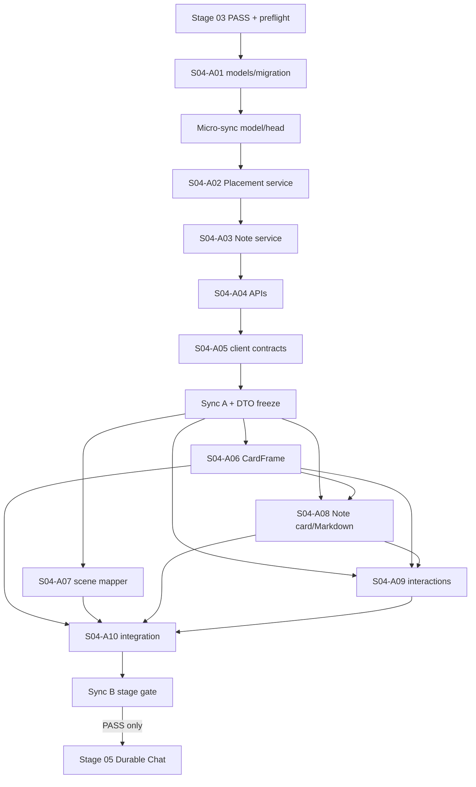

## 1. Название и номер этапа

**Этап 04 — Placement, BoardCardFrame и BoardNote.**

> **Для agentic workers:** этап обязательно выполняется через `superpowers:subagent-driven-development`; если этот режим в среде недоступен, допускается `superpowers:executing-plans`, но все равно с десятью практическими субагентами `S04-A01…S04-A10`, отдельным coordinator и независимыми review-проходами. Каждый пункт отслеживается checkbox-отметкой. Одновременно работают 3–5 агентов только при наличии независимых задач; фиктивная параллельность producer и consumer запрещена.

**Цель одним предложением:** добавить на persistent Board первую самостоятельную entity `BoardNote`, хранить ее geometry и display lifecycle только в `Placement`, дать общий `BoardCardFrame` для следующих карточек и доказать путь `create → edit → move → resize → collapse → maximize → close → re-place → reload` без смешивания Board и Flow domains.

**Архитектурный подход:** backend получает две additive SQLModel-сущности и owner-scoped API; все mutable updates и deletes защищаются настоящим DB-CAS по `revision`. Frontend отображает ReactFlow node с ID `placement.id`, держит `target_id` отдельно, переиспользует existing `api` + `UseRequestProcessor`, semantic tokens и safe Markdown pipeline. `BoardNote` не импортирует и не конвертирует Flow `CustomNodes/NoteNode`, а закрытие Placement никогда не удаляет entity.

**Стек:** Python/FastAPI, SQLModel/SQLAlchemy/Alembic, SQLite, disposable PostgreSQL, React/TypeScript, TanStack Query, `@xyflow/react`, existing UI primitives, `react-markdown`/`rehype-sanitize`, pytest, Jest и Playwright Chromium.

**Корень исполнения:** `/Volumes/Projects/ketos_canvas_mod_main`.

**Путь итогового handoff этапа:** `docs/dev/handoff/KETOS_MVP_STAGE_04.md`.

**Статус до начала:** этап не начат; выполнение разрешается только после доказанного `PASS` Этапа 03 на exact SHA.

Обязательное правило инструментария дублируется здесь и в §5.3: implementation run использует субагентов и все доступные релевантные инструменты — Graphify для read-only навигации, Context7 и official docs для внешних contracts, RaytSystem только в read-only режиме, `rg`/source inspection, профильные backend/frontend/test/security/design review skills, Git worktrees, `uv`, pytest, Jest, Playwright и реальную browser-проверку. Нельзя заявлять применение инструмента без сохраненного evidence в handoff.

---

## 2. Контекст этапа

### 2.1 Входное состояние

Этап 03 уже обязан предоставить:

- `Board(id, project_id, created_by_id, title, viewport_x, viewport_y, viewport_zoom, revision, created_at, updated_at)` и owner-only Board API;
- отдельный `BoardCanvas` на `@xyflow/react`, не использующий `flowStore` и Flow node types;
- persistent viewport и direct Board route `/project/:projectId/board/:boardId`;
- один Alembic head, чистые SQLite/PostgreSQL migration gates и stage report со статусом `PASS`;
- default-off `mvp_workspace` flag, existing Project/Folder ownership и server-authoritative Board state.

До этого этапа Board scene пуста. Этап 04 добавляет только Note target, но форма `Placement` сразу резервирует bounded kinds `note | chat | automation | job_result`, чтобы Этапы 05–07 расширяли один lifecycle, а не создавали свои geometry tables.

В проверенном доэтапном checkout Stage03/Stage04 product paths еще отсутствуют: нет live Board model/API/page/canvas, Placement или BoardNote. Поэтому этот документ не выдает planning concepts за реализованный код; implementation остается `BLOCKED` до фактического Stage03 PASS и повторной path freeze на его SHA.

### 2.2 Подтвержденная текущая source truth

Перед началом coordinator повторно проверяет source; план опирается на следующие существующие seams:

- model registrar: `src/backend/base/ketos/services/database/models/__init__.py`;
- API export registrar: `src/backend/base/ketos/api/v1/__init__.py`;
- v1 router mount: `src/backend/base/ketos/api/router.py`;
- Project ownership: `src/backend/base/ketos/services/database/models/folder/model.py` и `src/backend/base/ketos/api/v1/projects.py`;
- shared authenticated client: `src/frontend/src/controllers/API/api.tsx` и `src/frontend/src/controllers/API/services/request-processor.ts`;
- API URL registry: `src/frontend/src/controllers/API/helpers/constants.ts`;
- safe Markdown seams: `src/frontend/src/components/core/sanitizedMarkdown/index.tsx` и `src/frontend/src/utils/sanitizeSchema.ts`;
- Flow-only Note reference: `src/frontend/src/CustomNodes/NoteNode/index.tsx`;
- existing Flow Note characterization: `src/frontend/src/CustomNodes/NoteNode/__tests__/note-node-shrink.test.tsx` и `src/frontend/src/CustomNodes/NoteNode/__tests__/note-node-utils.test.ts`;
- locale registrars: `src/frontend/src/locales/en.json` и `src/frontend/src/locales/ru.json`.

Graphify используется только как карта. Source, migration execution и runtime tests остаются authoritative. Graphify rebuild, `save-result`, RaytSystem writes/promotions и любые внешние actions не входят в scope.

### 2.3 Неизменяемые инварианты

1. **Entity != Placement.** `BoardNote.id` — identity контента; `Placement.id` — identity конкретного размещения и единственный ReactFlow node ID.
2. **Close != delete.** Close вызывает только удаление Placement по отдельному endpoint. `BoardNote` и ее content остаются в БД и доступны для re-place.
3. **BoardNote != Flow NoteNode.** Новый код не импортирует `@/CustomNodes/NoteNode`, `@/stores/flowStore`, Flow types, Flow nodes/edges или `Flow.data`.
4. **Board != Flow.** Board scene не пишет в `Flow.data`; scene mapper никогда не создает Flow edge или Board relation.
5. **DB-CAS.** Ни один PATCH/DELETE mutable resource не делает read-check-write без условного SQL `WHERE id AND revision = expected_revision` и проверки `rowcount == 1`.
6. **Owner-only.** Доступ определяется через `Board/BoardNote → Folder.user_id == current_user.id`; `created_by_id` — provenance, не authorization.
7. **Safe Markdown.** Хранится bounded Markdown source, raw HTML отклоняется backend-валидацией, а preview допускает только paragraph, bold, list и safe link; unsafe URL не попадает в clickable DOM.
8. **One API seam.** Frontend применяет только `api` + `UseRequestProcessor`; raw `fetch` запрещен.
9. **No new dependency.** Этап не меняет `package.json`, npm/uv locks или deployment configuration. Используются уже установленные packages.
10. **Dirty safety.** Existing dirty root не используется для реализации; unrelated user changes и generated artifacts не меняются.

### 2.4 Что не входит

- Flow NoteNode conversion, Flow editor embedding, Board relations и Flow edges;
- Chat/Automation/Job entity services и их content/result renderers;
- arbitrary HTML, images, video, audio, code blocks или rich-text collaboration в BoardNote;
- typed FK per future target, generic registry и exactly-one-target DB hardening;
- CRDT/OT, realtime collaboration, browser Fullscreen API и desktop/Electron behavior;
- full accessibility matrix, performance/soak/coverage campaign и production data rollout.

---

## 3. Цель этапа

### 3.1 Пользовательская цель

На owned Board пользователь должен:

1. нажать Add note и создать `BoardNote` с initial `Placement` в центре текущего viewport;
2. ввести до 10 000 Unicode code points Markdown source и выбрать безопасный color;
3. увидеть sanitized preview с paragraph, `**bold**`, unordered/ordered list и `http/https/mailto` link;
4. переместить и изменить размер карточки; серверный PATCH отправляется только по завершении drag/resize;
5. collapse карточку, затем вернуть normal state;
6. maximize карточку как overlay внутри Board, нажать Escape и получить прежние persisted geometry и focus;
7. close карточку, удалив только Placement;
8. re-place ту же Note без копирования entity;
9. явно подтвердить Delete note и удалить entity вместе со всеми ее placements;
10. после reload увидеть те же entity IDs, content, color, Placement IDs/geometry/display state, которые реально существуют на сервере.

### 3.2 Техническая цель

- создать additive schema для `placement` и `board_note` поверх фактического единственного Stage-03 Alembic head;
- реализовать owner-scoped target validation, atomic Note+Placement transaction и conditional DB-CAS;
- предоставить стабильные API/DTO/query keys для последующих `chat`, `automation`, `job_result` targets;
- создать reusable `BoardCardFrame`, scene mapper и interaction hooks;
- доказать security separation, XSS safety, concurrency semantics, SQLite/PostgreSQL parity, i18n parity и Flow NoteNode isolation на одном exact SHA.

### 3.3 Условие достижения цели

Цель достигнута только когда `S04-A01…S04-A10` имеют `PASS`, Sync B gate полностью зеленый на одном SHA, consolidated handoff заполнен фактическими commits/commands/exit codes и coordinator присвоил этапу `PASS`. Локально зеленый отдельный тест не равен завершенному этапу.

---

## 4. Подробное техническое задание

### 4.1 Доменная модель

#### `Placement`

Создать:

- `src/backend/base/ketos/services/database/models/placement/__init__.py`;
- `src/backend/base/ketos/services/database/models/placement/model.py`.

Нормативные поля и ограничения:

| Поле | Тип/ограничение |
| --- | --- |
| `id` | UUID, primary key, default `uuid4` |
| `board_id` | UUID FK `board.id`, non-null, indexed |
| `target_kind` | SQL enum/string enum: `note`, `chat`, `automation`, `job_result` |
| `target_id` | UUID, non-null, indexed; generic target identity, не FK на будущие tables |
| `x`, `y` | finite float, диапазон `-1_000_000…1_000_000` |
| `width` | finite float, `240…1600`, default `320` |
| `height` | finite float, `160…1200`, default `240` |
| `z_index` | int, `0…1_000_000`, default `0` |
| `display_state` | enum `normal`, `collapsed`, `maximized`; default `normal` |
| `revision` | int, non-null, server default `0`, check `revision >= 0` |
| `created_at`, `updated_at` | timezone-aware UTC timestamps |

DB constraints: unique `uq_placement_board_target(board_id, target_kind, target_id)`; positive/ranged geometry checks; display/target enum checks; board FK cascade удаляет placements при delete Board. Generic target delete не полагается на DB cascade.

На Stage 04 create/re-place service принимает только `target_kind=note`. Остальные значения валидны в schema для downstream migration stability, но до появления их owner services возвращают `422 target_kind_not_available`; generic dispatch registry не создается. Этапы 05–07 расширяют явный `match` в `src/backend/base/ketos/services/board/target_validation.py`.

#### `BoardNote`

Создать:

- `src/backend/base/ketos/services/database/models/board_note/__init__.py`;
- `src/backend/base/ketos/services/database/models/board_note/model.py`.

Нормативные поля:

| Поле | Тип/ограничение |
| --- | --- |
| `id` | UUID, primary key, default `uuid4` |
| `project_id` | UUID FK `folder.id`, non-null, indexed |
| `created_by_id` | UUID FK `user.id`, non-null, indexed; provenance only |
| `content` | `Text`, default empty string, максимум 10 000 Unicode code points |
| `color` | строка максимум 32 символа; fixed token `neutral|yellow|green|blue|violet|pink` либо anchored `#[0-9A-Fa-f]{6}`; default `neutral` |
| `revision` | int, non-null, server default `0`, check `revision >= 0` |
| `created_at`, `updated_at` | timezone-aware UTC timestamps |

Backend принимает Markdown source только если в нем нет raw HTML tags, а links имеют scheme `http`, `https`, `mailto` либо являются fragment-only `#anchor`; `javascript:`, `data:`, `vbscript:`, scheme-relative URLs и control characters дают `422 unsafe_markdown`. Эта единая политика устраняет неоднозначность «reject or sanitize»: storage отклоняет небезопасный source, frontend дополнительно sanitizes rendering как defense in depth.

#### Additive migration

Создать exact file `src/backend/base/ketos/alembic/versions/c04d5e6f7a8b_add_placement_and_board_note.py` с `revision = "c04d5e6f7a8b"`. `down_revision` обязан быть равен единственному фактическому выводу `cd src/backend/base/ketos && uv run alembic heads` на Sync-A base; если heads не ровно один или revision уже существует, A01 не подбирает случайное значение, а возвращает `BLOCKED` coordinator для устранения branch divergence. Upgrade создает только новые tables/indexes/constraints. Downgrade удаляет `placement`, затем `board_note`, не меняя Stage-03 tables или data.

### 4.2 Service contracts и DB-CAS

Создать:

- существующий после Stage03 `src/backend/base/ketos/services/board/__init__.py` изменить только для exports;
- `src/backend/base/ketos/services/board/exceptions.py`;
- `src/backend/base/ketos/services/board/target_validation.py`;
- `src/backend/base/ketos/services/board/placement_service.py`;
- `src/backend/base/ketos/services/board/note_service.py`.

Нормативные signatures:

```python
async def require_owned_board(session, *, board_id: UUID, actor_id: UUID) -> Board
async def require_owned_note(session, *, note_id: UUID, actor_id: UUID) -> BoardNote
async def validate_placement_target(
    session, *, board: Board, target_kind: PlacementTargetKind,
    target_id: UUID, actor_id: UUID,
) -> BoardNote

async def create_note_with_placement(
    session, *, board_id: UUID, actor_id: UUID,
    note_input: BoardNoteCreate, placement_input: PlacementGeometryCreate,
) -> tuple[BoardNote, Placement]

async def update_note_cas(
    session, *, note_id: UUID, actor_id: UUID,
    expected_revision: int, patch: BoardNotePatch,
) -> BoardNote

async def update_placement_cas(
    session, *, placement_id: UUID, actor_id: UUID,
    expected_revision: int, patch: PlacementPatch,
) -> Placement
```

Каждый CAS использует один SQL statement вида:

```python
update(Model)
.where(Model.id == resource_id, Model.revision == expected_revision)
.values(**validated_changes, revision=Model.revision + 1, updated_at=utc_now)
```

После `session.exec` требуется `rowcount == 1`; `0` после повторной owner-check означает `StaleRevisionError`, HTTP `409` с stable code `stale_revision`. Нельзя сначала сравнить revision в Python, затем сделать unconditional ORM write. Результат перечитывается в той же session.

Close реализуется `delete_placement_cas`: owner-check Board, conditional `DELETE placement WHERE id AND revision`, `204`; target row не затрагивается. Re-place создает новую Placement identity для той же Note; unique constraint не позволяет две placements одной Note на одной Board.

Explicit Note delete реализуется одной transaction: authorize Note через Folder, conditional delete Note по revision, удалить все rows `placement.target_kind='note' AND target_id=note.id`, commit только при CAS winner. Ошибка или stale revision откатывает и entity, и placement cleanup. API требует `confirm_entity_delete=true`; UI confirmation не заменяет server-side explicit endpoint.

Atomic create flushes Note, validates same Project, creates Placement and commits один раз. Любая unique/validation/placement error откатывает обе rows; orphan Note запрещена.

### 4.3 HTTP API

Создать:

- `src/backend/base/ketos/api/v1/placements.py`;
- `src/backend/base/ketos/api/v1/board_notes.py`.
- `src/backend/base/ketos/api/v1/schemas/board_entities.py`.

Exact routes:

| Method/path | Contract |
| --- | --- |
| `GET /api/v1/boards/{board_id}/placements` | owner-only list Placement DTO, sorted `z_index,id` |
| `POST /api/v1/boards/{board_id}/placements` | re-place existing owned Note; `201` |
| `PATCH /api/v1/placements/{placement_id}` | geometry/display/z patch with body `expected_revision`; `200`/`409` |
| `DELETE /api/v1/placements/{placement_id}?expected_revision=N` | close Placement only; `204`/`409` |
| `GET /api/v1/projects/{project_id}/board-notes` | owned Note entity list for re-place picker; no geometry |
| `POST /api/v1/boards/{board_id}/board-notes` | atomic Note + initial Placement; `201` returns `{note, placement}` |
| `GET /api/v1/board-notes/{note_id}` | owned Note entity; `200` |
| `PATCH /api/v1/board-notes/{note_id}` | content/color + `expected_revision`; `200`/`409` |
| `DELETE /api/v1/board-notes/{note_id}?expected_revision=N&confirm_entity_delete=true` | explicit entity delete + all placements; `204`/`409` |

Foreign or NULL-owned Project/Board/Note/Placement returns non-enumerating `404`; unauthenticated request — existing auth response; invalid geometry/Markdown/color/target — `422`; duplicate placement — `409 placement_already_exists`. Browser-supplied `actor_id`, `created_by_id`, `project_id` в mutation body игнорируются/запрещаются schema как extra fields; actor берется только из `CurrentActiveUser`.

DTO разделены:

- `PlacementRead` содержит placement fields и никогда не встраивает Note content;
- `BoardNoteRead` содержит entity fields и никогда не содержит x/y/width/height/display state;
- atomic create response — typed envelope с двумя независимыми objects;
- every mutable response возвращает новую `revision`.

### 4.4 Frontend data contract

Изменить `src/frontend/src/types/board/index.ts`, добавив:

```ts
type PlacementTargetKind = "note" | "chat" | "automation" | "job_result";
type PlacementDisplayState = "normal" | "collapsed" | "maximized";
type Placement = { id: string; boardId: string; targetKind: PlacementTargetKind; targetId: string; x: number; y: number; width: number; height: number; zIndex: number; displayState: PlacementDisplayState; revision: number };
type BoardNote = { id: string; projectId: string; createdById: string; content: string; color: string; revision: number };
type BoardNoteNodeData = { placementId: string; targetId: string; targetKind: "note"; note: BoardNote };
```

Создать query modules:

- `src/frontend/src/controllers/API/queries/placements/index.ts`;
- `src/frontend/src/controllers/API/queries/placements/keys.ts`;
- `src/frontend/src/controllers/API/queries/placements/use-get-board-placements.ts`;
- `src/frontend/src/controllers/API/queries/placements/use-post-placement.ts`;
- `src/frontend/src/controllers/API/queries/placements/use-patch-placement.ts`;
- `src/frontend/src/controllers/API/queries/placements/use-delete-placement.ts`;
- `src/frontend/src/controllers/API/queries/board-notes/index.ts`;
- `src/frontend/src/controllers/API/queries/board-notes/keys.ts`;
- `src/frontend/src/controllers/API/queries/board-notes/use-get-project-board-notes.ts`;
- `src/frontend/src/controllers/API/queries/board-notes/use-get-board-note.ts`;
- `src/frontend/src/controllers/API/queries/board-notes/use-post-board-note.ts`;
- `src/frontend/src/controllers/API/queries/board-notes/use-patch-board-note.ts`;
- `src/frontend/src/controllers/API/queries/board-notes/use-delete-board-note.ts`.

Keys обязаны различать domain:

```ts
placementKeys.scene(boardId)
placementKeys.detail(placementId)
boardNoteKeys.project(projectId)
boardNoteKeys.detail(noteId)
```

`409 stale_revision` делает refetch соответствующих detail + scene keys и откатывает optimistic geometry к server response. Для content edit textarea сохраняет пользовательский draft как unsaved conflict buffer, рядом показывает новую server revision и предлагает повторно применить draft вручную; input не очищается. Автоматический retry stale mutation запрещен.

Добавить `PLACEMENTS` и `BOARD_NOTES` в `src/frontend/src/controllers/API/helpers/constants.ts`. Raw `fetch`, второй Axios client, localStorage truth и новый Zustand entity store запрещены.

### 4.5 Scene, CardFrame и interactions

Создать:

- `src/frontend/src/components/core/board/BoardCardFrame/index.tsx`;
- `src/frontend/src/components/core/board/BoardCardFrame/types.ts`;
- `src/frontend/src/components/core/board/placements/BoardNotePlacement.tsx`;
- `src/frontend/src/components/core/board/BoardNoteMarkdown.tsx`;
- `src/frontend/src/components/core/board/BoardNoteDeleteDialog.tsx`;
- `src/frontend/src/pages/BoardPage/hooks/use-board-scene.ts`;
- `src/frontend/src/pages/BoardPage/hooks/use-note-placement-actions.ts`;
- `src/frontend/src/pages/BoardPage/hooks/use-placement-persistence.ts`;
- `src/frontend/src/pages/BoardPage/utils/placement-to-node.ts`.

`placementToNode(placement, note)` возвращает ReactFlow node с `id=placement.id`; `data.targetId=note.id`; `position={x,y}`; `style={width,height}`; `type='boardNote'`. Function не принимает и не возвращает edges.

`BoardCardFrame` использует existing `Button`, `DropdownMenu`, `Dialog`, `Tooltip`, semantic Tailwind tokens и `NodeResizer`. Props разделяют `onClosePlacement` и `onRequestDeleteEntity`; один callback не может означать оба действия. Collapse/maximize меняют только `displayState`; persisted x/y/width/height остаются прежними. Maximized renderer использует fixed Board-workspace overlay, не `requestFullscreen`; Escape PATCH-ит `normal` и возвращает focus элементу, открывшему maximize.

Resize bounds совпадают с backend. Drag handle не перехватывает textarea/buttons. Drag/resize transiently обновляют ReactFlow state, но `use-placement-persistence.ts` отправляет один PATCH только на `onNodeDragStop`/`onResizeEnd`.

Keyboard-equivalent обязателен: Tab выбирает карточку; `Alt+Arrow` перемещает ее на 10 px, `Alt+Shift+Arrow` — на 1 px; `Ctrl+Alt+Arrow` изменяет width/height на 10 px в пределах bounds; Enter активирует distinct controls. Keyboard move/resize также отправляет один CAS PATCH после key sequence debounce/keyup, а не на каждый auto-repeat tick. Accessible names различают Collapse, Expand, Maximize, Restore, Close placement и Delete note.

Create center algorithm вызывает Stage-03 `screenToFlowPosition` для screen center bounding rect Board canvas; default geometry `320×240`. Re-place использует тот же algorithm и существующий `note.id`, создавая новый `placement.id`.

### 4.6 Safe Markdown и color

Изменить shared renderer без изменения default behavior:

- `src/frontend/src/components/core/sanitizedMarkdown/index.tsx` получает optional `profile: "default" | "board-note" = "default"`;
- `src/frontend/src/utils/sanitizeSchema.ts` экспортирует отдельный `boardNoteSanitizeSchema`.

В `board-note` profile:

- нет `rehypeRaw`, MathJax, images/media/code renderer;
- allowlist tags: `p`, `strong`, `ul`, `ol`, `li`, `a`;
- allowed link attrs: `href`, `title`, `target`, `rel`;
- URL transformer пропускает только `http:`, `https:`, `mailto:` и относительные fragment links; unsafe href удаляется;
- links получают `target="_blank"` и `rel="noopener noreferrer"`;
- raw HTML отсекается renderer через `skipHtml`; backend не дает сохранить такой content.

`BoardNotePlacement` имеет controlled source textarea, explicit preview mode и max length 10 000. Note color проходит `normalizeBoardNoteColor`: semantic token names map to classes, anchored custom hex применяется только как `style.backgroundColor` этой persisted Note preview. Иные CSS values не попадают в DOM.

### 4.7 Registrars, i18n и documentation

Только `S04-A10` изменяет:

- `src/backend/base/ketos/api/v1/__init__.py`;
- `src/backend/base/ketos/api/router.py`;
- `src/frontend/src/components/core/board/BoardCanvas/index.tsx`;
- `src/frontend/src/locales/en.json`;
- `src/frontend/src/locales/ru.json`.

Только `S04-A01` изменяет model exports и Alembic head. Locale keys покрывают Add/Edit/Preview/Collapse/Expand/Maximize/Restore/Close placement/Re-place/Delete note/confirm/conflict/unsafe content. RU/EN key and interpolation parity обязательны; новый hardcoded system English запрещен.

`S04-A10` создает `docs/dev/handoff/KETOS_MVP_STAGE_04.md` с domain/API/DTO contracts, exact migration revision/down_revision, tool evidence, agent commits, commands/exit codes, security decisions, known non-blocking Post-MVP gaps и итоговым status.

### 4.8 Exact file map

**Создать backend:**

- `src/backend/base/ketos/services/database/models/placement/__init__.py`
- `src/backend/base/ketos/services/database/models/placement/model.py`
- `src/backend/base/ketos/services/database/models/board_note/__init__.py`
- `src/backend/base/ketos/services/database/models/board_note/model.py`
- `src/backend/base/ketos/alembic/versions/c04d5e6f7a8b_add_placement_and_board_note.py`
- `src/backend/base/ketos/services/board/exceptions.py`
- `src/backend/base/ketos/services/board/target_validation.py`
- `src/backend/base/ketos/services/board/placement_service.py`
- `src/backend/base/ketos/services/board/note_service.py`
- `src/backend/base/ketos/api/v1/placements.py`
- `src/backend/base/ketos/api/v1/board_notes.py`
- `src/backend/base/ketos/api/v1/schemas/board_entities.py`

**Создать frontend:** query/component/hook files из §§4.4–4.6 и `src/frontend/src/components/core/board/BoardCardFrame/types.ts`.

**Создать tests:**

- `src/backend/tests/unit/alembic/test_mvp_placement_board_note_migration.py`
- `src/backend/tests/unit/services/board/test_placement_service.py`
- `src/backend/tests/unit/services/board/test_note_service.py`
- `src/backend/tests/unit/api/v1/test_placements.py`
- `src/backend/tests/unit/api/v1/test_board_notes.py`
- `src/frontend/src/controllers/API/queries/placements/__tests__/placements.test.ts`
- `src/frontend/src/controllers/API/queries/board-notes/__tests__/board-notes.test.ts`
- `src/frontend/src/components/core/board/BoardCardFrame/__tests__/index.test.tsx`
- `src/frontend/src/components/core/board/placements/__tests__/BoardNotePlacement.test.tsx`
- `src/frontend/src/components/core/board/__tests__/BoardNoteMarkdown.test.tsx`
- `src/frontend/src/pages/BoardPage/hooks/__tests__/use-board-scene.test.ts`
- `src/frontend/src/pages/BoardPage/hooks/__tests__/use-note-placement-actions.test.tsx`
- `src/frontend/src/pages/BoardPage/hooks/__tests__/use-placement-persistence.test.tsx`
- `src/frontend/src/pages/BoardPage/utils/__tests__/placement-to-node.test.ts`
- `src/frontend/tests/core/features/board-note-placement.spec.ts`

**Изменить:** Stage03 `src/backend/base/ketos/services/board/__init__.py`, model/API registrars, `types/board/index.ts`, API URL constants, BoardCanvas, shared Markdown renderer/schema и locale files, перечисленные выше. `src/frontend/src/components/core/assistantPanel/helpers/chat-markdown.tsx` и другие Assistant renderers не использовать и не менять. Lock files, package manifests, deployment config, `LICENSE`, `NOTICE`, `_raw/`, `.raytsystem/` и `graphify-out/**` не изменять.

---

## 5. Перечень задач

### 5.1 Матрица практических субагентов

| ID | Основной owner / роль | Практический deliverable | Parallel | Prerequisites | Блокирует |
| --- | --- | --- | --- | --- | --- |
| S04-A01 | data/migration; analysis, implementation, testing | models, migration, exports, dialect tests | нет после preflight | Stage03 PASS, one Alembic head | A02, A03, A04, A05, вся Wave B |
| S04-A02 | backend domain; implementation, security, testing | Placement service, target validator, DB-CAS | нет | A01 micro-sync | A03, A04, A05, A07, A09 |
| S04-A03 | backend entity; implementation, security, testing | Note service, safe validators, atomic transactions | нет | A01+A02 interfaces | A04, A05, A08, A09 |
| S04-A04 | backend API; implementation, compliance, testing | two v1 routers/schemas + API tests; registrar patch only | нет | A02+A03 PASS | A05, A10 |
| S04-A05 | frontend data; analysis, implementation, testing | types, API hooks, cache/conflict semantics | нет | A04 DTO freeze | Sync A, A07–A10 |
| S04-A06 | UI foundation; design, implementation, accessibility testing | reusable BoardCardFrame | да, Wave B | Sync A | A08, A09, A10 |
| S04-A07 | scene mapping; implementation, compliance, testing | scene hook + placement mapper | да, Wave B | Sync A | A10 |
| S04-A08 | Note UI/security; design, implementation, security, testing | Note card + restricted Markdown/color | да, Wave B | Sync A; A06 props frozen | A09, A10 |
| S04-A09 | interactions; implementation, accessibility testing | create/persist/re-place/delete hooks/dialog | да, Wave B | Sync A; A06 contract | A10 |
| S04-A10 | integration; implementation, docs, compliance, testing | registrars, BoardCanvas wiring, locales, E2E, handoff | нет | A06–A09 merged | Sync B, Stage05 |

Каждый из десяти агентов обязан передать production code либо migration/component/integration wiring вместе с focused executable test. Чистый анализ или review не засчитывается как один из десяти deliverables. Coordinator и независимые reviewers не входят в счет десяти.

### 5.2 Матрица обязательных ролей

| Роль | Ответственные | Обязательный evidence |
| --- | --- | --- |
| analysis | A01, A05, coordinator | source/Graphify map, current head, frozen API/DTO |
| design | A06, A08, Product Design reviewer | CardFrame states, semantic tokens, 1440×900 interaction screenshot/evidence |
| implementation | A01–A10 | commit SHA и changed paths по owned scope |
| testing | A01–A10, independent test reviewer | focused red→green command и exit code по каждой задаче |
| security | A02, A03, A08, security reviewer | owner matrix, CAS races, XSS/unsafe URL, delete separation |
| docs | A10 | `docs/dev/handoff/KETOS_MVP_STAGE_04.md` без неподтвержденных claims |
| compliance | A04, A07, A10, coordinator | no Flow imports/edges, no raw fetch/locks, ru/en parity, dirty safety |

### 5.3 Матрица обязательного применения инструментов

| Инструмент | Кто/когда | Нормативный результат |
| --- | --- | --- |
| `superpowers:subagent-driven-development` | coordinator, весь этап | свежий практический agent на A01–A10, spec review и code-quality review между merges |
| Graphify `query` | analysis preflight и A07 | read-only trace Board/Flow/Note/API seams; no rebuild/write |
| `query`/repo source skills + `rg` | A01–A10 | точные paths/symbols подтверждены source, а не graph inference |
| Context7 + official docs | A01/A04 для SQLModel/Alembic/FastAPI; A06/A09 для React Flow; A08 для Markdown sanitizer | library ID, installed version и verified contract записаны в handoff; dependency-sensitive work без Context7 — `BLOCKED` |
| RaytSystem `doctor/status/graph status/lint` | coordinator preflight, read-only | actual availability/health записаны; никаких promotion/runtime/external actions |
| backend/frontend code review skills | после каждой Sync | actionable findings исправлены или классифицированы с evidence |
| frontend-testing/e2e-testing | A05–A10 | deterministic Jest/Playwright fixtures без mocked security proof |
| Product Design + Chrome/browser | A06/A08/A10 | bounded desktop UI/focus/overlay inspection; не заменяет automated proof |
| Git worktrees/diff | coordinator | clean integration SHA, lane isolation, forbidden-path audit |
| `uv`, pytest, npm/Jest, Playwright | task owners/Sync A/Sync B | exact commands и exit codes; Python только через `uv run` |

Если иной доступный инструмент явно релевантен найденному дефекту, coordinator обязан применить его или записать, почему он не способен дать дополнительное evidence. Недоступность Graphify/RaytSystem/browser фиксируется честно и сама по себе не заменяет source/tests; отсутствие обязательного Context7 contract для внешнего API блокирует соответствующую задачу.

### 5.4 Ownership и conflict discipline

- A01 — единственный owner migration/model exports.
- A04 пишет registrar diff как handoff, но не меняет shared registrars.
- A06–A09 не меняют `BoardCanvas`, routes, locales или backend registrars.
- A10 — единственный owner `api/v1/__init__.py`, `api/router.py`, `BoardCanvas`, locales и E2E registrar.
- Shared Markdown files принадлежат только A08; A10 лишь интегрирует готовый commit.
- Heavy frontend commands и Playwright выполняются последовательно coordinator после merges.
- Ветки имеют имена `codex/mvp-s04-a01-models` … `codex/mvp-s04-a10-integration`; merge/cherry-pick выполняет только coordinator.

---

## 6. Подэтапы и пошаговое выполнение

### 6.1 Preflight и изолированная среда

**Owner:** coordinator, не входит в S04-A01…A10.  
**Parallel:** нет.  
**Prerequisites:** доступен repo root; никаких product writes до завершения checks.  
**Output:** exact `S04_BASE_SHA`, clean integration worktree, frozen Stage-03 interfaces, tool availability ledger.  
**Verification:** все команды ниже возвращают ожидаемый результат.  
**Blocked downstream:** любая задача A01–A10.

Порядок:

```bash
cd /Volumes/Projects/ketos_canvas_mod_main
git status --short
git rev-parse HEAD
git worktree list --porcelain
(cd src/backend/base/ketos && uv run alembic heads)
raytsystem doctor --root /Volumes/Projects/ketos_canvas_mod_main --json
raytsystem status --root /Volumes/Projects/ketos_canvas_mod_main --json
raytsystem graph status --root /Volumes/Projects/ketos_canvas_mod_main --json
raytsystem lint --root /Volumes/Projects/ketos_canvas_mod_main --json
graphify query "Stage 04 Placement BoardCardFrame BoardNote Board Flow NoteNode ownership CAS Markdown"
```

Coordinator читает `docs/dev/handoff/KETOS_MVP_STAGE_03.md` и проверяет, что его итог `PASS`, report SHA совпадает с `git rev-parse HEAD`, Board model/API/page/canvas/viewport реально существуют, а `cd src/backend/base/ketos && uv run alembic heads` возвращает одно значение. Затем:

```bash
export S04_ROOT=/Volumes/Projects/ketos_canvas_mod_main
export S04_BASE_SHA="$(git -C "$S04_ROOT" rev-parse HEAD)"
test ! -e /tmp/ketos-mvp-s04-integration
git -C "$S04_ROOT" worktree add /tmp/ketos-mvp-s04-integration -b codex/mvp-s04-integration "$S04_BASE_SHA"
git -C /tmp/ketos-mvp-s04-integration status --short
```

Expected: integration status пуст; root dirty baseline только записан, но не исправляется и не переносится. Lane worktrees создаются от текущего sync SHA непосредственно перед assignment. Ни одна ветка не стартует от dirty root.

### 6.2 Wave A — backend/data producer chain

Wave A использует последовательный DAG `A01 → A02 → A03 → A04 → A05`. Пока producer работает, coordinator может запустить до двух независимых read-only spec/security reviewers, но practical consumer не пишет importing code до micro-sync его prerequisite. Это честное исключение из общего 3-agent minimum: независимых practical tasks меньше трех, поэтому фиктивная параллельность запрещена.

**Owner:** coordinator оркестрирует; practical owners A01–A05.  
**Parallel:** нет для producer chain; независимые reviewers не меняют product code.  
**Prerequisites:** preflight PASS.  
**Output:** backend/data/client contracts и пять task commits.  
**Verification:** focused command каждого A01–A05 и Sync A gate.  
**Blocked downstream:** вся Wave B и Sync B.

#### S04-A01 — models, migration и dialect proof

**Цель:** создать additive schema с единым head и доказать model parity.  
**Ответственность:** только data/migration scope; никаких services/API/UI.  
**Owner/роли:** data engineer; analysis, implementation, testing.  
**Parallel:** нет.  
**Prerequisites:** preflight PASS, Stage03 head frozen, `MVP_POSTGRES_URI` доступен.  
**Writable paths:** model folders Placement/BoardNote, exact migration, model registrar, migration test.  
**Forbidden paths:** API router, frontend, locks, Stage03 Board model/migration.  
**Output:** two models, enums/checks/indexes/FKs/unique, revision `c04d5e6f7a8b`, exports и executable migration test.  
**Blocked downstream:** A02–A10 и Stage05.

Задачи:

- написать failing migration/model assertions для fields, constraint names, cascade, defaults и single head;
- выполнить тест и зафиксировать failure из-за отсутствующих models/migration;
- реализовать models и migration; `down_revision` взять из единственного preflight head;
- импортировать `Placement`/`BoardNote` в model registrar, не создавая второй metadata registry;
- прогнать SQLite и PostgreSQL clean upgrade → model diff → downgrade → upgrade;
- передать commit SHA, changed paths, commands/exit codes и фактический head.

**Result:** `Placement` и `BoardNote` доступны SQLModel metadata; новая DB и DB на Stage03 head обновляются без phantom diff.  
**Verification:** 

```bash
uv run pytest src/backend/tests/unit/alembic/test_mvp_placement_board_note_migration.py -q
uv run pytest \
  'src/backend/tests/unit/alembic/test_migration_execution.py::test_no_phantom_migrations[sqlite]' \
  'src/backend/tests/unit/alembic/test_migration_execution.py::test_upgrade_from_main_branch[sqlite]' -q
test -n "${MVP_POSTGRES_URI:-}"
MIGRATION_VALIDATION_CI=1 KETOS_TEST_DATABASE_URI="$MVP_POSTGRES_URI" uv run pytest \
  'src/backend/tests/unit/alembic/test_migration_execution.py::test_no_phantom_migrations[postgres]' \
  'src/backend/tests/unit/alembic/test_migration_execution.py::test_upgrade_from_main_branch[postgres]' -q
(cd src/backend/base/ketos && uv run alembic heads)
```

Expected: exactly one head `c04d5e6f7a8b`; все tests PASS. Missing PostgreSQL URI — `BLOCKED`, не skip/PASS.

#### S04-A02 — Placement service и target validation

**Цель:** реализовать один lifecycle geometry/display state с strict owner guard и DB-CAS.  
**Ответственность:** Placement create/list/update/close/re-place и explicit note target validation.  
**Owner/роли:** backend domain engineer; implementation, security, testing.  
**Parallel:** нет.  
**Prerequisites:** A01 commit micro-synced; frozen model symbols.  
**Writable paths:** `services/board/{__init__,exceptions,target_validation,placement_service}.py`, placement service test.  
**Forbidden paths:** Note service, API registrars, frontend, migration.  
**Output:** owner-scoped service functions, stable exceptions, real two-session race proof.  
**Blocked downstream:** A03–A05, A07, A09, A10.

Задачи:

- сначала написать tests owner/foreign/NULL/wrong-project/missing target/unsupported kind;
- написать real two-session same-revision test: один update success, второй conflict, server row содержит winner state;
- реализовать `require_owned_board`, explicit `note` branch и `target_kind_not_available` для future kinds;
- реализовать finite/range validation и `update_placement_cas` одним conditional SQL;
- реализовать close как conditional delete только Placement и re-place с новой Placement ID;
- проверить duplicate placement conflict и Board cascade behavior.

**Result:** service не может удалить entity через Placement callback и не допускает lost update.  
**Verification:**

```bash
uv run pytest src/backend/tests/unit/services/board/test_placement_service.py -q
```

Expected: owner matrix, close preservation, unique conflict и winner + `StaleRevisionError` loser PASS на SQLite; HTTP `409` mapping доказывает A04/API gate. PostgreSQL повторяется в Sync A schema/service gate.

#### S04-A03 — BoardNote service, transaction и Markdown validation

**Цель:** создать самостоятельную Project-scoped entity с atomic create/delete и CAS update.  
**Ответственность:** Note content/color, safe source validation, Note+Placement transaction, explicit entity delete.  
**Owner/роли:** backend entity engineer; implementation, security, testing.  
**Parallel:** нет.  
**Prerequisites:** A01+A02 merged; Placement service interface frozen.  
**Writable paths:** `services/board/note_service.py`, дополнения exceptions, note service test.  
**Forbidden paths:** router registrars, frontend, Flow/FlowVersion.  
**Output:** `create_note_with_placement`, `update_note_cas`, `delete_note_cas`, validators и rollback/concurrency tests.  
**Blocked downstream:** A04, A05, A08–A10.

Задачи:

- написать failing atomic rollback test с искусственным duplicate Placement conflict;
- написать independent-session Note CAS test;
- зафиксировать validator cases: length 10 001, raw tags, event handlers, unsafe schemes, malformed/custom color;
- реализовать Note create/update/delete без промежуточного commit; actor/project fields server-derived;
- explicit delete удалить все Note placements в той же transaction и требовать CAS winner;
- доказать re-place сохраняет `note.id`, а close сохраняет content/revision.

**Result:** orphan Note и partial delete невозможны в принятом transaction seam; unsafe Markdown не сохраняется.  
**Verification:**

```bash
uv run pytest src/backend/tests/unit/services/board/test_note_service.py -q
```

Expected: atomicity, owner policy, CAS, source/color validation и close/delete separation PASS.

#### S04-A04 — v1 API и HTTP semantics

**Цель:** открыть service contracts через authenticated, non-enumerating REST API.  
**Ответственность:** routes, request/response schemas, error mapping, API tests; shared registrar только как patch handoff A10.  
**Owner/роли:** backend API engineer; implementation, compliance, security testing.  
**Parallel:** нет.  
**Prerequisites:** A02+A03 focused PASS.  
**Writable paths:** `api/v1/placements.py`, `api/v1/board_notes.py`, `api/v1/schemas/board_entities.py`, `api/v1/schemas/__init__.py`, two API tests.  
**Forbidden paths:** `api/v1/__init__.py`, `api/router.py`, frontend, models/migration.  
**Output:** exact routes из §4.3, stable error codes и registrar diff for A10.  
**Blocked downstream:** A05, A10.

Задачи:

- написать API tests до implementation, включая body extra-field rejection и parent auth before child disclosure;
- реализовать Pydantic/SQLModel DTO, не смешивая entity и placement payload;
- map `StaleRevisionError→409`, duplicate→409, validation→422, foreign/NULL→404;
- проверить `DELETE placement` и `DELETE note` как разные endpoint/call paths;
- проверить create response `{note,placement}` и every returned revision;
- передать A10 exact imports/include order без самостоятельного registrar edit.

**Result:** routes полностью покрывают Stage04 UI и не раскрывают foreign metadata.  
**Verification:**

```bash
uv run pytest \
  src/backend/tests/unit/api/v1/test_placements.py \
  src/backend/tests/unit/api/v1/test_board_notes.py -q
```

Expected: exact status/body/ownership/CAS/delete semantics PASS.

#### S04-A05 — frontend types, queries и conflict recovery

**Цель:** создать один authenticated client contract с разделенными caches.  
**Ответственность:** board types, URL constants, Placement/BoardNote hooks и Jest tests.  
**Owner/роли:** frontend data engineer; analysis, implementation, testing.  
**Parallel:** нет в Wave A; starts only after DTO freeze.  
**Prerequisites:** A04 API tests PASS и DTO fixture frozen.  
**Writable paths:** `types/board/index.ts`, API constants, query folders/tests.  
**Forbidden paths:** BoardCanvas, UI components, locales, raw fetch, package manifests.  
**Output:** typed hooks, scoped keys, invalidation/refetch/rollback semantics.  
**Blocked downstream:** Sync A и A06–A10.

Задачи:

- написать failing query-key and Axios contract tests;
- реализовать hooks только через `api` + `UseRequestProcessor`;
- разделить project entity list, note detail, board scene и placement detail keys;
- на 409 отменить optimistic geometry, refetch server truth, сохранить Note draft как unsaved conflict buffer и не retry mutation;
- проверить create/close/re-place/delete invalidation и no duplicate store;
- передать exact TS interfaces A06–A09.

**Result:** frontend имеет одну server-authoritative data seam и не смешивает IDs/revisions.  
**Verification:**

```bash
cd src/frontend
npm test -- --runInBand \
  src/controllers/API/queries/placements \
  src/controllers/API/queries/board-notes
npm run type-check:production
```

Expected: tests/typecheck PASS; 409 приводит к refetch и user-visible localized error hook payload.

### 6.3 Sync A — producer integration и DTO freeze

**Owner:** coordinator.  
**Parallel:** нет; merge и gates последовательны.  
**Prerequisites:** A01–A05 commits и handoffs.  
**Output:** один Sync-A SHA, frozen DB/API/TS contract и Wave-B base.  
**Verification:** backend/dialect/client gates below.  
**Blocked downstream:** A06–A10.

Merge/cherry-pick order строго `A01 → A02 → A03 → A04 → A05`. Coordinator применяет registrar patch A04 только в A10, поэтому до Sync B routes могут тестироваться через router unit fixture, но production mount еще отсутствует. После каждого merge запускается соответствующий focused command; conflict не решается путем удаления чужих изменений.

```bash
uv run pytest \
  src/backend/tests/unit/services/board/test_placement_service.py \
  src/backend/tests/unit/services/board/test_note_service.py \
  src/backend/tests/unit/api/v1/test_placements.py \
  src/backend/tests/unit/api/v1/test_board_notes.py \
  src/backend/tests/unit/alembic/test_mvp_placement_board_note_migration.py -q
cd src/frontend
npm test -- --runInBand \
  src/controllers/API/queries/placements \
  src/controllers/API/queries/board-notes
npm run type-check:production
```

Freeze record содержит `placement.id` как node ID, отдельный `target_id`, exact routes, stable errors и revisions. Только полный Sync-A PASS открывает Wave B.

### 6.4 Wave B — parallel frontend consumers

A06–A09 стартуют от одного Sync-A SHA и работают параллельно. Они не меняют `BoardCanvas`, locales, shared registrars или файлы друг друга. A08 начинает импорт A06 только после micro-sync его props; до этого пишет restricted Markdown tests/component в собственном scope. A10 стартует только после merge A06–A09.

**Owner:** coordinator оркестрирует; practical owners A06–A09, затем A10.  
**Parallel:** да для A06–A09; нет для A10.  
**Prerequisites:** Sync A PASS и frozen DTO/query contracts.  
**Output:** CardFrame, scene, Note renderer, interactions и integration commit.  
**Verification:** focused commands A06–A10, затем Sync B.  
**Blocked downstream:** Stage04 PASS и Stage05.

#### S04-A06 — reusable BoardCardFrame

**Цель:** дать единый accessible presentation/lifecycle shell будущим targets.  
**Ответственность:** CardFrame props, UI controls, overlay maximize, NodeResizer и focus.  
**Owner/роли:** frontend design engineer; design, implementation, accessibility testing.  
**Parallel:** да с A07–A09 после Sync A.  
**Prerequisites:** Placement TS types; Context7/official React Flow `NodeResizer` contract.  
**Writable paths:** `components/core/board/BoardCardFrame/**`.  
**Forbidden paths:** BoardCanvas, placements, locales, Flow components, package files.  
**Output:** reusable component + types + keyboard/unit tests.  
**Blocked downstream:** A08, A09, A10.

Задачи:

- написать tests, где close spy и delete spy различны;
- реализовать semantic-token frame/title/controls с drag handle and nodrag interactive body;
- NodeResizer дает bounded size и вызывает persistence только onResizeEnd;
- collapse/maximize меняют display state, не geometry;
- Escape restores normal state and previous focus; no browser Fullscreen API;
- automated keyboard tests prove select/move/resize and distinct accessible control names; screenshot не считается proof;
- провести bounded Product Design/browser review на 1440×900.

**Result:** reusable CardFrame не знает тип entity и не может удалить ее неявно.  
**Verification:**

```bash
cd src/frontend
npm test -- --runInBand src/components/core/board/BoardCardFrame
```

Expected: close≠delete, resize bounds, display states, Escape/focus и semantic-token assertions PASS.

#### S04-A07 — Board scene mapper

**Цель:** materialize server placements/entities в Board-only ReactFlow nodes.  
**Ответственность:** scene query composition и pure mapping; никакой persistence interaction.  
**Owner/роли:** frontend scene engineer; implementation, compliance, testing.  
**Parallel:** да с A06/A08/A09.  
**Prerequisites:** Sync A query/types.  
**Writable paths:** `use-board-scene.ts`, `placement-to-node.ts` и их tests.  
**Forbidden paths:** BoardCanvas, FlowPage, `flowStore`, Flow NoteNode/types, edges.  
**Output:** deterministic Board node list keyed by Placement ID.  
**Blocked downstream:** A10.

Задачи:

- написать mapper tests на `node.id !== targetId`, geometry/display mapping и missing entity quarantine;
- compose placement scene + Project Note entity cache without N+1 detail requests;
- возвращать nodes only; edges всегда пусты и не создаются mapper-ом;
- Board switch очищает transient scene и hydrates server response;
- добавить source guard tests против Flow imports/relations.

**Result:** entity и geometry остаются отдельными, stale/orphan placement не раскрывает foreign entity.  
**Verification:**

```bash
cd src/frontend
npm test -- --runInBand \
  src/pages/BoardPage/hooks/__tests__/use-board-scene.test.ts \
  src/pages/BoardPage/utils/__tests__/placement-to-node.test.ts
```

Expected: pure deterministic nodes, no edges/Flow imports, missing target safe state PASS.

#### S04-A08 — BoardNotePlacement и restricted renderer

**Цель:** реализовать bounded Note editor/preview без Flow store и XSS.  
**Ответственность:** Note card, BoardNote Markdown profile/wrapper, color normalization и security tests.  
**Owner/роли:** frontend Note engineer; design, implementation, security, testing.  
**Parallel:** да; A06 props micro-sync required before final import.  
**Prerequisites:** Sync A Note DTO; A06 public props; Context7/official sanitizer contract.  
**Writable paths:** `BoardNotePlacement.tsx`, `BoardNoteMarkdown.tsx`, shared `sanitizedMarkdown`/`sanitizeSchema`, their tests.  
**Forbidden paths:** Flow NoteNode/NodeDescription/store, BoardCanvas, locales, packages.  
**Output:** source/preview UI with actual DOM XSS tests and safe color renderer.  
**Blocked downstream:** A09, A10.

Задачи:

- написать actual DOM assertions for script/event/raw HTML/unsafe schemes, не ограничиваясь mocked renderer;
- добавить backward-compatible `board-note` profile и dedicated wrapper;
- реализовать textarea maxLength 10 000, edit/preview controls and save-on-explicit action;
- apply only allowlisted tokens/anchored hex; no arbitrary CSS value;
- link renderer adds noopener/noreferrer;
- source guard proves no Flow imports and no `dangerouslySetInnerHTML`/`rehypeRaw` in Board code.

**Result:** bold/list/link formatting survives save/reload; unsafe content does not execute/render as active HTML.  
**Verification:**

```bash
cd src/frontend
npm test -- --runInBand \
  src/components/core/board/__tests__/BoardNoteMarkdown.test.tsx \
  src/components/core/board/placements/__tests__/BoardNotePlacement.test.tsx \
  src/modals/IOModal/components/chatView/chatMessage/components/__tests__/edit-message-xss.test.tsx
```

Expected: new restricted profile and legacy default renderer tests PASS.

#### S04-A09 — create/persist/re-place/delete interactions

**Цель:** соединить user actions с API без mutation storms и semantic confusion.  
**Ответственность:** center placement, drag/resize persistence, display actions, close/re-place, explicit delete dialog.  
**Owner/роли:** frontend interaction engineer; implementation, accessibility, testing.  
**Parallel:** да с A06–A08; finalizes after their public contracts.  
**Prerequisites:** Sync A hooks; A06 props; A08 Note surface.  
**Writable paths:** two hooks, `BoardNoteDeleteDialog.tsx`, their tests.  
**Forbidden paths:** BoardCanvas, locales, backend, Flow code.  
**Output:** deterministic interaction hooks and confirmation dialog.  
**Blocked downstream:** A10.

Задачи:

- test screen-center conversion through Stage03 ReactFlow instance;
- create invokes atomic Note+Placement once with `320×240`;
- drag/resize updates transient node continuously but PATCH once on end;
- close calls Placement DELETE and returns focus to Add note control;
- re-place uses existing Note ID and new Placement ID;
- Delete dialog names entity explicitly, requires confirmation, calls Note DELETE and removes all scene placements;
- 409 resets UI to server truth and announces localized conflict.
- failed/stale Note save preserves typed draft; dialog sets initial focus on Cancel and returns focus to Delete note trigger; errors do not clear input.

**Result:** complete lifecycle works without duplicate rows or accidental entity delete.  
**Verification:**

```bash
cd src/frontend
npm test -- --runInBand \
  src/pages/BoardPage/hooks/__tests__/use-note-placement-actions.test.tsx \
  src/pages/BoardPage/hooks/__tests__/use-placement-persistence.test.tsx
```

Expected: center→move→resize→close→re-place→explicit delete and focus/conflict cases PASS.

#### S04-A10 — integration, registrars, locales, E2E и handoff

**Цель:** собрать все deliverables на одном SHA и доказать browser path/compatibility.  
**Ответственность:** production mounts, nodeTypes, locale parity, integration fixes within Stage04 scope, Playwright, docs.  
**Owner/роли:** integration engineer; implementation, testing, docs, compliance.  
**Parallel:** нет.  
**Prerequisites:** A06–A09 merged and focused PASS; A04 registrar patch.  
**Writable paths:** exact registrars/BoardCanvas/locales/E2E/handoff из §4.7.  
**Forbidden paths:** Flow NoteNode behavior, locks/packages/deploy config, unrelated dirty files.  
**Output:** mounted API, registered `boardNote` node type, localized actions, real browser spec and consolidated report.  
**Blocked downstream:** Sync B and Stage05.

Задачи:

- mount both routers exactly once through `api/v1/__init__.py` + `api/router.py`;
- add `boardNote` to BoardCanvas node types without touching Flow canvas nodeTypes;
- add ru/en keys and no raw color except persisted Note preview;
- implement browser story with real API/DB: create/edit/format/move/resize/collapse/maximize/Escape/close/re-place/reload/delete;
- run existing Flow Note tests and no-import/no-edge guards;
- write handoff with ten task commits, tools, commands, exit codes, status and downstream contract.

**Result:** production route/UI wiring exists; Stage04 acceptance runnable from clean DB.  
**Verification:**

```bash
uv run pytest \
  src/backend/tests/unit/api/v1/test_placements.py \
  src/backend/tests/unit/api/v1/test_board_notes.py -q
cd src/frontend
npm test -- --runInBand src/components/core/board src/pages/BoardPage
npm run i18n:check
npx playwright test tests/core/features/board-note-placement.spec.ts --project=chromium
```

Expected: routers mounted once, Board node wired, ru/en and browser lifecycle PASS; затем обязателен полный Sync B из §12.

### 6.5 Sync B — serial final integration

**Owner:** coordinator.  
**Parallel:** нет.  
**Prerequisites:** A06–A10 commits и focused PASS.  
**Output:** tested exact Sync-B SHA, consolidated handoff и machine status.  
**Verification:** полный порядок §12.2–§12.11.  
**Blocked downstream:** Stage05 и все последующие этапы.

Coordinator merges A06→A07→A08→A09→A10, resolving overlaps only within declared ownership. Then sequentially runs backend gate, SQLite/PostgreSQL migration gates, frontend Jest, source guards, i18n/typecheck, Flow Note characterization, Playwright and diff/docs checks. No heavy command runs in parallel. Failed gate returns to owning agent for fix→reverify; coordinator does not waive Critical findings.

---

## 7. Зависимости и DAG

### 7.1 Входящие dependencies

| Dependency | Required evidence | Status if absent | Заблокировано |
| --- | --- | --- | --- |
| Stage03 full PASS | exact SHA/report; Board model/API/page/canvas/viewport tests | BLOCKED | весь Stage04 |
| one Stage03 Alembic head | `cd src/backend/base/ketos && uv run alembic heads` one value | BLOCKED | A01 и далее |
| SQLite runtime | migration/service tests execute | BLOCKED only if environment cannot be repaired safely | A01–A04 |
| disposable PostgreSQL | nonempty `MVP_POSTGRES_URI`, real execution/model parity | BLOCKED | schema PASS, Sync B |
| existing packages | `@xyflow/react`, Markdown sanitizer, Query already installed | FAIL if code misuses; BLOCKED if immutable environment lacks package | A05–A09 |
| Context7 external contracts | IDs/versions/contracts for dependency-sensitive API | BLOCKED for affected task | A01/A04/A06/A08/A09 |
| clean integration worktree | empty `git status --short` | BLOCKED until coordinator creates it | A01–A10 |

### 7.2 Task DAG



### 7.3 Downstream contracts

- Stage05 consumes `PlacementTargetKind.chat`, `BoardCardFrame`, close/re-place semantics and BoardCanvas node registrar; geometry остается Placement, Chat history/entity не удаляется close.
- Stage06 consumes `automation`; remove Placement сохраняет Flow; no Flow editor embed в CardFrame.
- Stage07 consumes `job_result`; target validator расширяется через явную branch, result entity не копируется.
- Stage09 consumes server-authoritative Note/Placement APIs and IDs for restart restore.
- Stage10 consumes E2E note formatting/sanitization/reload path.

### 7.4 Dependency-change rule

Новая npm/Python dependency не добавляется. Если source inspection показывает, что Stage04 contract невозможно реализовать существующими packages, задача не редактирует manifests/locks; coordinator классифицирует это как `BLOCKED` и требует отдельного dependency registrar decision. Самовольный package edit — `FAIL`.

---

## 8. Ожидаемые результаты

### 8.1 Backend results

- две additive tables, один Alembic head, reversible migration;
- owner-only Placement/BoardNote services and routes;
- DB-CAS winner/loser semantics на mutable update/delete;
- atomic Note+Placement create и Note+all-placements delete;
- explicit future target gating без generic registry;
- no changes to `Flow`, `FlowVersion`, KFX ABI или existing Project storage.

### 8.2 Frontend results

- reusable `BoardCardFrame` для Note и следующих entity cards;
- one Board scene mapper с `node.id=placement.id`;
- BoardNote source editor + restricted safe preview;
- center create, end-only drag/resize persistence, collapse/maximize/Escape, close/re-place, explicit delete;
- 409 conflict refetch/server-wins UX;
- ru/en parity, keyboard focus return и semantic tokens.

### 8.3 Evidence results

- task handoff для каждого S04-A01…A10;
- exact Sync-A и Sync-B SHA;
- SQLite/PostgreSQL migration/model parity output;
- backend/API/frontend/source guard/Flow Note/Playwright exit codes;
- actual DOM XSS evidence and browser screenshot/trace where configured;
- `docs/dev/handoff/KETOS_MVP_STAGE_04.md` с final status.

### 8.4 User-observable state examples

- После close: `GET /projects/{project_id}/board-notes` все еще возвращает Note; `GET /boards/{board_id}/placements` не возвращает закрытую Placement.
- После re-place: `note.id` прежний, `placement.id` новый, content/revision Note не сброшены.
- После maximize/Escape: x/y/width/height до и после равны, `display_state` снова `normal`, focus вернулся к maximize trigger.
- После stale update: server revision/content/geometry побеждают, loser получает 409 и не перезаписывает winner.
- После explicit delete: Note и все ее placements отсутствуют, другие entities/placements не затронуты.

---

## 9. Критерии приемки каждой задачи

| Task | PASS criteria | FAIL criteria | BLOCKED prerequisite |
| --- | --- | --- | --- |
| A01 | models/migration/exports + single head + SQLite/PostgreSQL execution/model parity | constraint/diff/downgrade failure или second head | Stage03 head/PG unavailable after safe checks |
| A02 | owner matrix, target/project validation, close preserve, real CAS winner+loser | read-check-write, entity delete, lost update, unsupported target accepted | A01 not synced |
| A03 | atomic create/delete, safe validation, Note CAS, no orphan | partial commit, unsafe source stored, created_by auth | A02 contract absent |
| A04 | exact mounted-ready routes/schemas/error mapping/API tests | foreign disclosure, mixed DTO, close/delete endpoint conflation | A02/A03 not PASS |
| A05 | typed query keys, existing client seam, 409 refetch/server-wins geometry + preserved content draft | raw fetch, duplicate store, retry stale mutation, cleared user input | API DTO not frozen |
| A06 | reusable frame, separate callbacks, bounds, overlay, keyboard select/move/resize, Escape/focus/tokens | browser fullscreen, geometry overwritten, raw style leakage, mouse-only path | Sync A/React Flow contract absent |
| A07 | node ID Placement, target ID separate, nodes only/no Flow imports | node ID target, Flow edge/store coupling | Sync A absent |
| A08 | bounded editor, restricted actual DOM renderer, safe color, no Flow import | active raw HTML/unsafe URL, mocked-only security proof | A06/profile contract absent |
| A09 | center create, one PATCH per end, close/re-place/delete/focus/conflict | mutation storm, close deletes Note, delete lacks confirmation | A05/A06/A08 contracts absent |
| A10 | production registrars/node type/locales/E2E/docs + Flow Note characterization | unmounted route, Flow canvas edit, locale drift, incomplete report | A06–A09 not merged |

Task не может получить PASS только за наличие code diff. Нужны owned deliverable, focused command, green result, commit SHA и review closure.

---

## 10. Общие критерии приемки этапа

1. Все десять practical tasks имеют PASS и объединены на одном Sync-B SHA.
2. `entity != placement` доказан API/service/browser tests.
3. `close != delete` доказан сохранением Note после Placement DELETE и отдельным confirmed Note endpoint.
4. `BoardNote != Flow NoteNode` доказан source guard и existing Flow Note characterization.
5. Все Note/Placement mutable writes/deletes используют DB-CAS; real concurrent writers дают один effect.
6. Foreign/NULL-owned/wrong-project доступ fail closed до metadata disclosure.
7. Safe Markdown actual DOM не исполняет raw HTML/script/event/unsafe URL; backend rejects unsafe source.
8. Collapse/maximize не меняют base geometry; Escape restores focus; keyboard select/move/resize equivalent работает; browser Fullscreen API не используется.
9. ReactFlow node ID равен Placement ID, target ID хранится отдельно, Board mapper не создает edges.
10. Frontend использует existing `api` + `UseRequestProcessor`, server wins on 409, raw fetch/localStorage truth отсутствуют.
11. RU/EN parity, semantic tokens и bounded custom color contract проходят checks.
12. Migration имеет один head и model parity на clean SQLite + disposable PostgreSQL; PG skip не принимается.
13. Existing Flow canvas/NoteNode/API/KFX identifiers не изменены.
14. Package/lock/deploy/license/generated/RaytSystem/Graphify artifacts и unrelated dirty files не изменены.
15. Full Stage04 gate и Playwright прошли последовательно на одном SHA; handoff содержит truthful evidence.

Любой Critical, позволяющий нарушить пункты 2–8 на reachable MVP path, блокирует PASS и исправляется в текущем этапе, а не переносится в Post-MVP.

---

## 11. Риски, блокеры и способы устранения

| Риск/сигнал | Предотвращение и локальное устранение | Status rule | Блокирует |
| --- | --- | --- | --- |
| Stage03 не реализован или report/SHA расходятся | остановить lanes; проверить Board contracts/source/gates; сначала завершить Stage03 | BLOCKED | весь этап |
| более одного Alembic head или collision `c04d5e6f7a8b` | не создавать merge migration внутри A01 без coordinator decision; устранить branch divergence на integration base | BLOCKED | A01+ |
| `MVP_POSTGRES_URI` пуст или PG недоступен | проверить env/локальный disposable service; повторить safe connection; не принимать pytest skip | BLOCKED | schema/stage PASS |
| migration не совпадает с SQLModel | исправить model/migration constraints до zero diff; `MIGRATION_VALIDATION_CI=1` | FAIL | Sync A/B |
| ORM read-check-write выдан за CAS | заменить одним conditional UPDATE/DELETE; real two-session test | FAIL | A02/A03 |
| child authorization использует `created_by_id` или NULL-as-public | strict join к Folder owner до child data; negative API matrix | FAIL/Critical | A02–A04 |
| generic `target_id` не имеет FK | explicit kind validator, same-project check, transaction-scoped target lock/recheck where supported, orphan-safe list quarantine; не заявлять DB referential integrity | FAIL если reachable orphan воспроизводится; иначе recorded Post-MVP residual | A02/A03/downstream |
| future target принят до появления service | explicit `422 target_kind_not_available`; branch расширяет владелец соответствующего этапа | FAIL | A02/downstream |
| Close вызывает Note delete | разные service functions/endpoints/callback names; lifecycle integration test | FAIL/Critical | A02/A04/A06/A09 |
| Note delete оставляет placements или partial commit | одна route-scoped transaction, CAS winner, rollback test | FAIL | A03/A04 |
| maximize/collapse портит base geometry | менять только `display_state`; overlay CSS; before/after assertion | FAIL | A06/A10 |
| existing sanitizer слишком широкий | отдельный `board-note` profile без raw/media/code; backend reject + actual DOM test | FAIL/Critical | A08/A10 |
| sanitizer regression ломает legacy chat | default profile unchanged + existing XSS characterization | FAIL | A08/Sync B |
| arbitrary color превращается в CSS injection | server token/hex validator + frontend normalization; only persisted Note preview style | FAIL/Critical | A03/A08 |
| перепутаны `@xyflow/react` и legacy `reactflow` | Context7/installed-version check; source guard imports only `@xyflow/react` | FAIL | A06/A07/A09 |
| drag/resize создает mutation storm | transient local updates, one PATCH on end/keyboard sequence completion | FAIL | A09/A10 |
| 409 silently loses user text | refetch server truth, preserve typed draft and announce conflict; no auto-retry | FAIL | A05/A08/A09 |
| mouse-only interaction или неоднозначные names | automated keyboard select/move/resize, distinct localized names, dialog initial/return focus | FAIL | A06/A09/A10 |
| error clears textarea/dialog state | preserve draft; error inline; focus remains actionable; retry explicit | FAIL | A08/A09 |
| A06–A09 одновременно меняют BoardCanvas/locales | path ownership; A10-only registrar; reject overlapping commit | FAIL until resliced | Sync B |
| Board code импортирует Flow NoteNode/store/types | `rg` source gate + Flow Note characterization; remove coupling | FAIL/Critical | A07/A08/A10 |
| Board mapper создает edge/relation | pure node-only mapper and source/unit guard | FAIL/Critical | A07/A10 |
| raw fetch/second cache/localStorage truth | existing API seam source guard and query tests | FAIL | A05/A09 |
| locale/raw-color/design drift | i18n check, semantic-token assertions, Product Design + automated UX tests; screenshot alone не proof | FAIL | A10 |
| unrelated dirty/lock/generated files попали в diff | clean worktree, per-agent writable paths, final forbidden-path diff; удалить только собственный accidental change безопасным patch | FAIL until clean | Sync B |
| required Context7 contract unavailable | не угадывать external API; приложить absence evidence | BLOCKED | affected task |
| Graphify/RaytSystem/browser tool недоступен | зафиксировать честно; использовать source/automated tests; browser absence блокирует E2E, навигационный tool сам по себе не заменяет proof | BLOCKED только если acceptance невозможно доказать | relevant gate |
| browser test flaky без product defect | повторить с trace один раз, устранить deterministic fixture/timing; нельзя переклассифицировать в blocker только из-за failure | FAIL пока gate красный | Sync B |

### 11.1 Security stop conditions

Немедленный stop/fix требуется при foreign data disclosure, entity deletion через close, unsafe active DOM, arbitrary CSS/URL execution, lost update, actor/body trust или Board→Flow mutation. Эти defects входят в reachable MVP и не переносятся в Post-MVP.

### 11.2 Честная граница generic target integrity

Schema MVP сознательно не имеет FK `Placement.target_id → BoardNote.id`. Поэтому report формулирует только доказанный service-level target validation, atomic Note delete cleanup и tested canonical path, но не «полную DB referential integrity». Если concurrent create-placement/delete-note test воспроизводит orphan на supported SQLite/PostgreSQL, stage получает FAIL до исправления в разрешенной architecture либо явного пересмотра master contract.

---

## 12. Тестирование, проверка и документация

### 12.1 Порядок proof

Порядок обязателен: task-focused red→green → Sync A backend/client → migration SQLite → PostgreSQL → Sync B backend/API → frontend Jest → source guards → i18n/typecheck/lint → Flow Note characterization → Playwright/browser → docs/diff. Heavy frontend commands и Playwright не выполняются параллельно.

### 12.2 Backend и stage-specific migration

```bash
cd /tmp/ketos-mvp-s04-integration
uv run pytest \
  src/backend/tests/unit/services/board/test_placement_service.py \
  src/backend/tests/unit/services/board/test_note_service.py \
  src/backend/tests/unit/api/v1/test_placements.py \
  src/backend/tests/unit/api/v1/test_board_notes.py \
  src/backend/tests/unit/alembic/test_mvp_placement_board_note_migration.py \
  src/backend/tests/unit/alembic/test_migration_validator.py \
  src/backend/tests/unit/alembic/test_existing_migrations.py -q
```

Required cases: exact constraints/defaults, atomic rollback, independent-session CAS, owner/foreign/NULL/wrong-project, future target deny, close preserve, re-place identity, explicit delete cleanup, unsafe Markdown/color, route/error/extra-field semantics.

### 12.3 SQLite migration/model parity

```bash
cd /tmp/ketos-mvp-s04-integration
MIGRATION_VALIDATION_CI=1 uv run pytest \
  'src/backend/tests/unit/alembic/test_migration_execution.py::test_no_phantom_migrations[sqlite]' \
  'src/backend/tests/unit/alembic/test_migration_execution.py::test_upgrade_from_main_branch[sqlite]' -q
test "$(cd src/backend/base/ketos && uv run alembic heads | wc -l | tr -d ' ')" = "1"
(cd src/backend/base/ketos && uv run alembic heads)
```

Expected: one head `c04d5e6f7a8b`; model diff empty; upgrade/downgrade/upgrade PASS.

### 12.4 PostgreSQL mandatory guard и model parity

```bash
cd /tmp/ketos-mvp-s04-integration
test -n "${MVP_POSTGRES_URI:-}" || {
  echo "BLOCKED: MVP_POSTGRES_URI is required for Stage 04 schema PASS"
  exit 2
}
MIGRATION_VALIDATION_CI=1 KETOS_TEST_DATABASE_URI="$MVP_POSTGRES_URI" uv run pytest \
  'src/backend/tests/unit/alembic/test_migration_execution.py::test_no_phantom_migrations[postgres]' \
  'src/backend/tests/unit/alembic/test_migration_execution.py::test_upgrade_from_main_branch[postgres]' -q
```

PG fixture must actually execute. `SKIPPED` или отсутствие URI не поддерживают PASS claim.

### 12.5 Frontend focused tests

```bash
cd /tmp/ketos-mvp-s04-integration/src/frontend
npm test -- --runInBand \
  src/controllers/API/queries/placements \
  src/controllers/API/queries/board-notes \
  src/components/core/board/BoardCardFrame \
  src/components/core/board/__tests__/BoardNoteMarkdown.test.tsx \
  src/components/core/board/placements/__tests__/BoardNotePlacement.test.tsx \
  src/pages/BoardPage/hooks/__tests__/use-board-scene.test.ts \
  src/pages/BoardPage/hooks/__tests__/use-note-placement-actions.test.tsx \
  src/pages/BoardPage/hooks/__tests__/use-placement-persistence.test.tsx \
  src/pages/BoardPage/utils/__tests__/placement-to-node.test.ts
```

Tests must assert actual control names, keyboard select/move/resize, Escape/focus, dialog initial/return focus, input preservation on error, CAS conflict UX, end-only PATCH, distinct IDs and actual DOM sanitizer behavior.

### 12.6 Flow/legacy compatibility

```bash
cd /tmp/ketos-mvp-s04-integration/src/frontend
npm test -- --runInBand \
  src/CustomNodes/NoteNode/__tests__/note-node-shrink.test.tsx \
  src/CustomNodes/NoteNode/__tests__/note-node-utils.test.ts \
  src/CustomNodes/NoteNode/__tests__/color-picker-buttons.test.tsx \
  src/modals/IOModal/components/chatView/chatMessage/components/__tests__/edit-message-xss.test.tsx
```

Existing Flow NoteNode and default sanitized renderer must remain green; Stage04 не меняет их persisted identity/behavior.

### 12.7 Static/source guards

```bash
cd /tmp/ketos-mvp-s04-integration
if rg -n 'stores/flowStore|useFlowStore|CustomNodes/NoteNode|types/flow|Flow\.data' \
  src/frontend/src/components/core/board \
  src/frontend/src/pages/BoardPage; then
  exit 1
fi
if rg -n 'dangerouslySetInnerHTML|rehypeRaw|requestFullscreen|document\.fullscreen' \
  src/frontend/src/components/core/board; then
  exit 1
fi
if rg -n '(^|[^A-Za-z])fetch\(' \
  src/frontend/src/controllers/API/queries/placements \
  src/frontend/src/controllers/API/queries/board-notes \
  src/frontend/src/pages/BoardPage/hooks; then
  exit 1
fi
if rg -n 'from "reactflow"|from '\''reactflow'\''' \
  src/frontend/src/components/core/board \
  src/frontend/src/pages/BoardPage; then
  exit 1
fi
```

Expected: no matches. Shared `sanitizedMarkdown/index.tsx` may retain `rehypeRaw` only inside unchanged default profile; `board-note` profile and Board code must not select it.

### 12.8 Frontend package gates и i18n

```bash
cd /tmp/ketos-mvp-s04-integration/src/frontend
npm run i18n:check
npm run type-check:production
npm run lint -- \
  src/components/core/board \
  src/pages/BoardPage \
  src/controllers/API/queries/placements \
  src/controllers/API/queries/board-notes \
  src/types/board
```

Expected: RU/EN parity, no type errors и no lint errors in owned paths.

### 12.9 Browser/E2E и Product Design proof

```bash
cd /tmp/ketos-mvp-s04-integration/src/frontend
npx playwright test \
  tests/core/features/board-note-placement.spec.ts \
  tests/core/features/note-color-picker.spec.ts \
  --project=chromium
```

Board story uses real API/test DB, не localStorage fixtures. Он проверяет create center, Markdown, move/resize mouse+keyboard, collapse/expand, overlay maximize/Escape/focus, close preserve, re-place same Note/new Placement, reload, explicit delete and XSS payloads. Product Design/Chrome review на 1440×900 отдельно фиксирует distinct labels, focus order, semantic tokens, error/input behavior и overlay geometry. Screenshot — вспомогательный artifact, не proof без automated assertions.

### 12.10 Consolidated Stage 04 gate

```bash
cd /tmp/ketos-mvp-s04-integration
uv run pytest \
  src/backend/tests/unit/services/board/test_placement_service.py \
  src/backend/tests/unit/services/board/test_note_service.py \
  src/backend/tests/unit/api/v1/test_placements.py \
  src/backend/tests/unit/api/v1/test_board_notes.py \
  src/backend/tests/unit/alembic/test_mvp_placement_board_note_migration.py \
  src/backend/tests/unit/alembic/test_migration_execution.py -q

cd src/frontend
npm test -- --runInBand src/components/core/board src/pages/BoardPage
npm run i18n:check
npm run type-check:production
npx playwright test tests/core/features/board-note-placement.spec.ts --project=chromium
```

Consolidated command не отменяет explicit PG guard из §12.4; оба результата обязательны.

### 12.11 Documentation и diff safety

```bash
cd /tmp/ketos-mvp-s04-integration
test -s docs/dev/handoff/KETOS_MVP_STAGE_04.md
uv run python - <<'PY'
import re
from pathlib import Path

path = Path("docs/dev/handoff/KETOS_MVP_STAGE_04.md")
lines = path.read_text(encoding="utf-8").splitlines()
failures: list[str] = []
tables = 0
for index, line in enumerate(lines):
    if not line.lstrip().startswith("|"):
        continue
    if index > 0 and lines[index - 1].lstrip().startswith("|"):
        continue
    tables += 1
    header_cells = [cell.strip() for cell in line.strip().strip("|").split("|")]
    if index + 1 >= len(lines):
        failures.append(f"line {index + 1}: table has no delimiter row")
        continue
    delimiter_cells = [cell.strip() for cell in lines[index + 1].strip().strip("|").split("|")]
    valid_delimiters = all(re.fullmatch(r":?-{3,}:?", cell) for cell in delimiter_cells)
    if len(delimiter_cells) != len(header_cells) or not valid_delimiters:
        failures.append(
            f"line {index + 1}: expected {len(header_cells)} valid GFM delimiters, got {delimiter_cells}"
        )
if failures:
    raise SystemExit("GFM_TABLE_FAIL\n" + "\n".join(failures))
print(f"GFM_TABLE_PASS tables={tables}")
PY
for required in \
  S04-A01 S04-A02 S04-A03 S04-A04 S04-A05 \
  S04-A06 S04-A07 S04-A08 S04-A09 S04-A10 \
  PASS FAIL BLOCKED c04d5e6f7a8b MVP_POSTGRES_URI \
  close delete BoardNote NoteNode; do
  rg -q --fixed-strings "$required" docs/dev/handoff/KETOS_MVP_STAGE_04.md || exit 1
done
git diff --check "$S04_BASE_SHA"...HEAD
if git diff --name-only "$S04_BASE_SHA"...HEAD | \
  rg '(^|/)(package\.json|pyproject\.toml|package-lock\.json|pnpm-lock\.yaml|uv\.lock|Dockerfile[^/]*|docker-compose[^/]*\.(yml|yaml)|deployments?|deployment|helm|k8s|\.github/workflows|LICENSE|NOTICE|graphify-out|\.raytsystem|_raw)(/|$)'; then
  exit 1
fi
test -z "$(git status --short)"
```

Report включает exact library IDs/versions/contracts from Context7, фактически примененные skills/tools, ten agent commits, Sync SHAs, commands/exit codes, changed paths, screenshots/traces if present, risks and final mapping. После commit `git status --short` integration worktree должен быть пуст.

---

## 13. Условия невыполнения этапа

### 13.1 Когда задача получает FAIL

Задача получает `FAIL`, если implementation/test был запущен, но ее criteria не достигнуты: красный focused test, blocking defect, incomplete deliverable, unauthorized path edit, fake CAS, unsafe rendering, mouse-only critical path, incomplete docs или непроверенный claim. Обычный test failure сам по себе не превращается в blocker: agent обязан диагностировать, исправить и повторить test.

### 13.2 Когда задача получает BLOCKED

`BLOCKED` разрешен только для отсутствующего prerequisite, который нельзя безопасно устранить в scope после проверки alternatives:

- Stage03 не имеет PASS/exact compatible SHA;
- Alembic graph неоднозначен из-за внешнего branch divergence;
- отсутствует mandatory disposable PostgreSQL/`MVP_POSTGRES_URI`;
- dependency-sensitive external contract нельзя подтвердить через обязательный Context7;
- immutable environment реально не содержит необходимый pinned existing package;
- browser/runtime acceptance невозможно запустить из-за внешней среды после локальных checks.

В report указываются exact command/error, выполненные safe alternatives, минимальное действие для unblock и перечень downstream tasks. Нельзя использовать `BLOCKED`, чтобы скрыть дефект кода.

### 13.3 Когда этап не завершен

Этап не завершен, если выполняется хотя бы одно:

- хотя бы один S04-A01…A10 не имеет PASS;
- Sync A или Sync B gate не зеленый на одном SHA;
- PostgreSQL был skipped;
- close/delete, entity/placement, BoardNote/Flow NoteNode или Board/Flow separation не доказаны;
- concurrent CAS, ownership или safe Markdown gate не доказан;
- Playwright/browser path отсутствует;
- consolidated handoff не содержит exact evidence;
- unresolved Critical существует в reachable MVP path;
- forbidden/unrelated file попал в diff.

### 13.4 Разрешенные итоговые формулировки

- Machine `PASS` → **«этап выполнен»**.
- Machine `FAIL` → **«этап выполнен частично»**. Это человекочитаемая формулировка для FAIL, а не четвертый status; переход запрещен.
- Machine `BLOCKED` → **«этап заблокирован»**.

Статус `PARTIAL` не создается и не записывается. Если часть задач green, но одна failed, итог machine status все равно `FAIL`.

---

## 14. Условия перехода к следующему этапу

### 14.1 Переход-контроль

Coordinator заполняет и подписывает на exact Sync-B SHA:

- [ ] S04-A01…A10: десять PASS rows с commit/paths/command/result;
- [ ] analysis/design/implementation/testing/security/docs/compliance roles имеют evidence;
- [ ] Sync A SHA и frozen model/API/DTO перечислены;
- [ ] Sync B SHA совпадает с tested HEAD;
- [ ] SQLite migration/model parity PASS;
- [ ] PostgreSQL migration/model parity PASS без skip и с `MIGRATION_VALIDATION_CI=1`;
- [ ] Placement/Note service/API tests PASS;
- [ ] Jest, i18n, typecheck, lint PASS;
- [ ] actual DOM sanitizer and source guards PASS;
- [ ] Flow NoteNode characterization PASS;
- [ ] Playwright board-note-placement PASS;
- [ ] Product Design/keyboard/focus/error criteria PASS не только screenshot;
- [ ] handoff committed, diff clean, forbidden paths absent;
- [ ] independent security review и independent compliance review не имеют unresolved Critical;
- [ ] final machine status `PASS` и текст **«этап выполнен»**.

### 14.2 Правило перехода

Только после всех checked items coordinator разрешает branch/plan transition к Этапу 05. `FAIL`/«этап выполнен частично» возвращает работу owning agents в цикл fix→verify→Sync B. `BLOCKED`/«этап заблокирован» останавливает DAG до устранения named prerequisite. Ни исторический PASS, ни green subset, ни screenshot, ни ручное утверждение не заменяют current exact-SHA evidence.

### 14.3 Handoff для Stage05

Stage05 получает:

- exact Placement/BoardNote DTO and route contract;
- `BoardCardFrame` props и keyboard/focus rules;
- target-kind extension rule: явная `chat` branch + owner/same-project validator;
- close/re-place semantics: entity сохраняется, Placement ID меняется;
- BoardCanvas node registration seam, query keys and 409 behavior;
- migration head `c04d5e6f7a8b`;
- known honest residual: generic `target_id` service integrity, не typed FK.

Stage05 не меняет эти contracts без versioned migration/updated tests и coordinator approval.

### 14.4 Обязательный журнал завершения и перехода

Перед итоговым verdict coordinator обязан заполнить журнал без пустых строк. Для каждого поля обязательны три колонки: `evidence` с exact SHA/path/command/exit code либо exact blocker, `owner` с ID ответственного агента или coordinator, `verdict` только `PASS`, `FAIL` или `BLOCKED`.

| Поле журнала | evidence | owner | verdict |
| --- | --- | --- | --- |
| Выполненные задачи | Все задачи, действительно закрытые focused verification: task ID, commit SHA, changed paths, exact command и exit code. | Owner каждой указанной задачи; сводит coordinator. | `PASS` только для полностью закрытых задач; иначе `FAIL` или `BLOCKED`. |
| Невыполненные задачи | Каждый отсутствующий deliverable или не начатая задача с причиной и blocked downstream. Если таких задач нет, evidence содержит проверяемую запись `none` и ссылку на полную A01–A10 matrix. | Owner задачи и coordinator. | `FAIL`, если работа была возможна, но не выполнена; `BLOCKED`, если отсутствует неустранимый prerequisite; `PASS` только при доказанном отсутствии таких задач. |
| Частично выполненные задачи | Каждая задача с неполным deliverable или незеленым gate, включая готовую часть и точный остаток. Если таких задач нет, evidence содержит `none` и результаты всех task gates. | Owner задачи. | Всегда `FAIL` для частично выполненной задачи. Machine status `PARTIAL` строго запрещен. |
| Обнаруженные дефекты | Defect ID, severity, воспроизведение, affected invariant/path, fix commit либо причина незакрытия. | Агент, обнаруживший defect, и fixing owner. | `PASS` только если нет unresolved blocking/Critical; иначе `FAIL` или `BLOCKED` по причине. |
| Активные блокеры | Exact prerequisite, error/output, проверенные safe alternatives, минимальный unblock и blocked downstream. Если блокеров нет, evidence содержит `none` и ссылки на prerequisite checks. | Coordinator и owner затронутой задачи. | `BLOCKED` при наличии хотя бы одного активного blocker; иначе `PASS`. |
| Результаты тестирования | Все commands §§12.2–12.10, exact tested SHA, exit codes, pass/fail/skip counts и artifact paths. | Testing owners A01–A10; сводит coordinator. | `PASS` только при полном зеленом Stage04 gate без обязательных skips; runnable failure — `FAIL`; missing prerequisite — `BLOCKED`. |
| Результаты проверки субагентами | Для каждого implementation/review субагента: ID, scope, base/commit SHA, findings, verification и closure. | Coordinator и соответствующий субагент. | `PASS` только когда обязательные reviews завершены и Critical findings закрыты; иначе `FAIL`/`BLOCKED`. |
| Соответствие критериям завершения | Поэлементная матрица всех критериев §10 и checklist §14.1 с прямой ссылкой на evidence. | Compliance owner A10 и coordinator. | `PASS` только если каждый критерий PASS; один FAIL/BLOCKED определяет общий verdict. |
| Вывод о возможности перехода к следующему этапу | Exact Sync-B SHA, общий machine status, русский статус и явное решение `ALLOWED` или `DENIED`. | Coordinator. | `ALLOWED` исключительно при полном `PASS` и русском статусе «этап выполнен»; при `FAIL`/«этап выполнен частично» или `BLOCKED`/«этап заблокирован» только `DENIED`. |

**Обязательное использование субагентов и всех доступных релевантных инструментов.** Журнал обязан перечислить фактически использованных субагентов и инструменты с evidence; неподтвержденное заявление не засчитывается. Mapping неизменяем: `PASS ↔ этап выполнен`, `FAIL ↔ этап выполнен частично`, `BLOCKED ↔ этап заблокирован`; `PARTIAL` запрещен.

**Этап 05 строго запрещено начинать без полного `PASS` Этапа 04 на одном exact Sync-B SHA.** Наличие выполненной части, исторического PASS, зеленого subset, ручного подтверждения или отсутствия записи о дефекте не разрешает переход.

---

## 15. Итоговый формат отчета

`docs/dev/handoff/KETOS_MVP_STAGE_04.md` имеет следующий обязательный формат без пустых полей:

```markdown
# Ketos MVP Stage 04 — отчет выполнения

## Итог
- Machine status: PASS | FAIL | BLOCKED
- Русский итог: этап выполнен | этап выполнен частично | этап заблокирован
- Base SHA: фактический 40-символьный SHA
- Sync A SHA: фактический 40-символьный SHA
- Tested Sync B SHA: фактический 40-символьный SHA
- Stage 03 evidence: путь, SHA, PASS

## Объем и инварианты
- Entity != Placement: PASS/FAIL + test evidence
- Close != delete: PASS/FAIL + test evidence
- BoardNote != Flow NoteNode: PASS/FAIL + source/test evidence
- DB-CAS: PASS/FAIL + concurrency evidence
- Safe Markdown: PASS/FAIL + backend/DOM/browser evidence
- Owner-only: PASS/FAIL + negative matrix

## Журнал завершения и перехода
| Поле журнала | evidence | owner | verdict |
| --- | --- | --- | --- |
| Выполненные задачи | фактические task IDs, commits, paths, commands и exit codes | task owners + coordinator | PASS/FAIL/BLOCKED |
| Невыполненные задачи | фактический список или проверяемое none | task owners + coordinator | PASS/FAIL/BLOCKED |
| Частично выполненные задачи | фактический список или проверяемое none; PARTIAL не используется | task owners | FAIL либо PASS при доказанном none |
| Обнаруженные дефекты | IDs, severity, reproduction, fix/remaining state | finding/fixing owners | PASS/FAIL/BLOCKED |
| Активные блокеры | exact blocker, alternatives, unblock, downstream impact или проверяемое none | coordinator + affected owners | PASS/BLOCKED |
| Результаты тестирования | exact SHA, commands, exit codes, counts и artifacts | testing owners + coordinator | PASS/FAIL/BLOCKED |
| Результаты проверки субагентами | agent IDs, scopes, SHAs, findings и closure | coordinator + subagents | PASS/FAIL/BLOCKED |
| Соответствие критериям завершения | матрица §10 и §14.1 со ссылками на evidence | A10 + coordinator | PASS/FAIL/BLOCKED |
| Вывод о возможности перехода к следующему этапу | machine/RU status, Sync-B SHA, ALLOWED/DENIED | coordinator | ALLOWED только при полном PASS; иначе DENIED |

## Субагенты
| ID | Role | Base SHA | Commit SHA | Changed paths | Focused command | Exit/result | Status |
| --- | --- | --- | --- | --- | --- | --- | --- |
| S04-A01 | data/migration | фактический base | фактический commit | полный owned diff | exact focused command | exit code и output summary | PASS/FAIL/BLOCKED |
| S04-A02 | placement service | фактический base | фактический commit | полный owned diff | exact focused command | exit code и output summary | PASS/FAIL/BLOCKED |
| S04-A03 | note service | фактический base | фактический commit | полный owned diff | exact focused command | exit code и output summary | PASS/FAIL/BLOCKED |
| S04-A04 | API | фактический base | фактический commit | полный owned diff | exact focused command | exit code и output summary | PASS/FAIL/BLOCKED |
| S04-A05 | frontend data | фактический base | фактический commit | полный owned diff | exact focused command | exit code и output summary | PASS/FAIL/BLOCKED |
| S04-A06 | CardFrame | фактический base | фактический commit | полный owned diff | exact focused command | exit code и output summary | PASS/FAIL/BLOCKED |
| S04-A07 | scene | фактический base | фактический commit | полный owned diff | exact focused command | exit code и output summary | PASS/FAIL/BLOCKED |
| S04-A08 | Note/Markdown | фактический base | фактический commit | полный owned diff | exact focused command | exit code и output summary | PASS/FAIL/BLOCKED |
| S04-A09 | interactions | фактический base | фактический commit | полный owned diff | exact focused command | exit code и output summary | PASS/FAIL/BLOCKED |
| S04-A10 | integration/docs | фактический base | фактический commit | полный owned diff | exact focused command | exit code и output summary | PASS/FAIL/BLOCKED |

## Wave и sync evidence
- Wave A order and micro-syncs
- Sync A frozen model/API/DTO
- Wave B parallel lanes and ownership
- Sync B merge order and tested HEAD

## Инструменты и роли
- Graphify query evidence
- Context7 IDs, installed versions, verified contracts
- RaytSystem read-only health
- backend/frontend/testing/security/design reviews
- browser/Product Design evidence
- unavailable tools and impact

## Verification
| Gate | Exact command | Exit code | Result | Artifact |
| --- | --- | --- | --- | --- |
| Backend focused | команда из §12.2 | фактический exit code | PASS/FAIL/BLOCKED | path/trace из run |
| SQLite migration | команда из §12.3 | фактический exit code | PASS/FAIL/BLOCKED | path/trace из run |
| PostgreSQL migration | команда из §12.4 | фактический exit code | PASS/FAIL/BLOCKED | path/trace из run |
| Frontend Jest | команда из §12.5 | фактический exit code | PASS/FAIL/BLOCKED | path/trace из run |
| i18n/type/lint | команда из §12.8 | фактический exit code | PASS/FAIL/BLOCKED | path/trace из run |
| Flow Note compatibility | команда из §12.6 | фактический exit code | PASS/FAIL/BLOCKED | path/trace из run |
| Playwright | команда из §12.9 | фактический exit code | PASS/FAIL/BLOCKED | path/trace из run |
| Diff/docs | команда из §12.11 | фактический exit code | PASS/FAIL/BLOCKED | path/trace из run |

## Security, UX и compliance
- ownership/CAS/XSS/color conclusions
- keyboard select/move/resize, names, focus and input-preservation conclusions
- no Flow imports/edges, no raw fetch, no forbidden paths

## Риски и blockers
- unresolved item, evidence, owner, safe alternatives, minimal unblock, downstream impact

## Changed paths
- полный `git diff --name-only` для Stage 04 range

## Решение о переходе
- Stage 05 transition: ALLOWED only for PASS; otherwise DENIED
- Reason tied to current exact-SHA evidence
```

В реальном отчете каждое описательное поле заменяется фактическим значением из agent handoff/run output; строка с отсутствующим evidence получает `FAIL` или `BLOCKED`, но не удаляется. Final mapping неизменяем: `PASS = этап выполнен`, `FAIL = этап выполнен частично`, `BLOCKED = этап заблокирован`. Только первый вариант разрешает Stage05.
