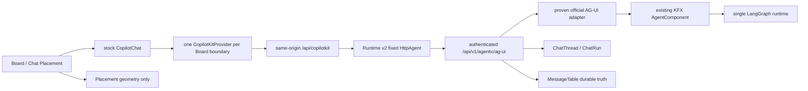
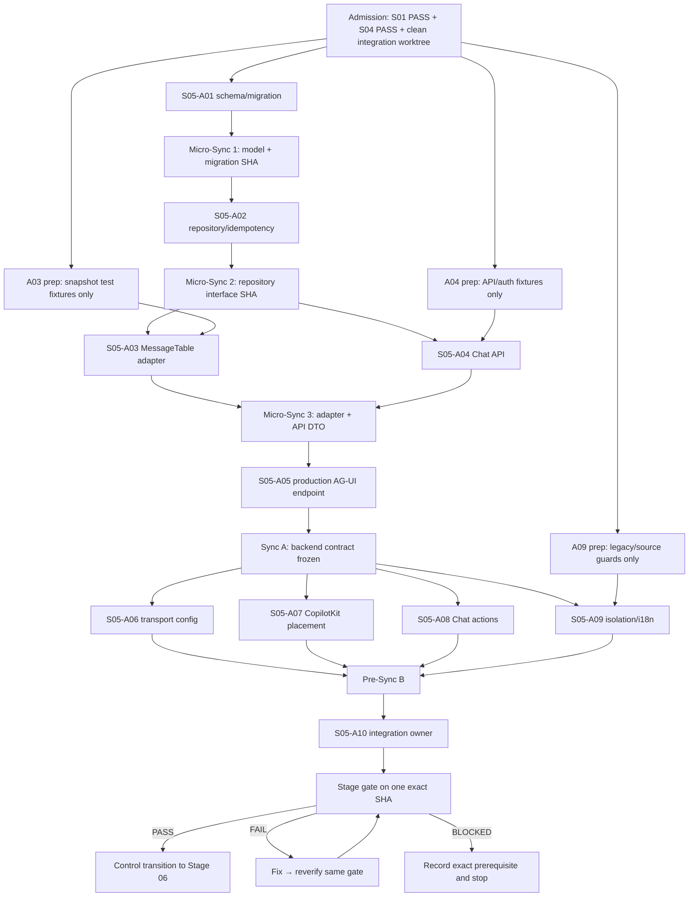

# 1. Название и номер этапа

**Этап 05 — Durable Chat через CopilotKit и AG-UI.**

> **Обязательный режим выполнения:** использовать `superpowers:subagent-driven-development` или `superpowers:executing-plans`; задействовать десять практических субагентов `S05-A01…S05-A10`, одновременно держать активными 3–5 независимых lanes и не переходить к Этапу 06 до полного `PASS` Этапа 05.

**Канонический репозиторий:** `/Volumes/Projects/ketos_canvas_mod_main`.

**Плановый implementation base:** exact integration SHA, на котором Этапы 01 и 04 имеют документированный `PASS`. Текущий source-baseline, по которому подготовлен этот этап: `5fe1cb74fe8b2db8b48f66859cfbf72e56cf3782`; перед реализацией coordinator обязан заменить его фактическим Stage-04 PASS SHA, не меняя архитектурные границы этого документа.

**Главный инвариант:** stock CopilotKit предоставляет chat body/message list/composer/streaming UX; standard AG-UI предоставляет transport events; существующий KFX `AgentComponent` и собранный им LangGraph остаются единственным agent runtime; `MessageTable` остаётся единственным durable хранилищем message body.

---

## 2. Контекст

Этап 01 обязан уже доказать один официальный transport contract:

```text
CopilotKit React v2
→ same-origin /api/copilotkit
→ CopilotKit Runtime v2
→ HttpAgent
→ authenticated FastAPI /api/v1/agentic/ag-ui
→ proven official ag-ui-langgraph adapter
→ existing KFX AgentComponent / LangGraph
```

Этап 04 обязан уже предоставить `Board`, `Placement`, `BoardCardFrame`, lifecycle `move/resize/collapse/maximize/close/re-place` и доказанное разделение entity/placement. Этап 05 не исследует transport заново и не создаёт второй CardFrame.

Текущее repository truth, которое необходимо сохранить:

- read-only planning audit на SHA `5fe1cb74fe8b2db8b48f66859cfbf72e56cf3782` получил Alembic head `9a6e34f1c2d8`; это только текущий baseline, а `down_revision` при реализации берётся из фактического Stage-04 PASS SHA;
- исходный root checkout уже содержит user state `M 14_KETOS_FINAL_MASTER_IMPLEMENTATION_PLAN.md` и `?? 26_KETOS_MVP_MASTER_PLAN_RECHECK_REPORT.md`; Stage 05 их не изменяет, не переносит и не включает в commits;
- `src/backend/base/ketos/services/database/models/message/model.py` содержит существующий `MessageTable` с `text`, `files`, `session_id`, `context_id`, `flow_id`, `run_id`, `properties`, `content_blocks` и `session_metadata`;
- `src/backend/base/ketos/services/database/models/message/crud.py` авторизует legacy Flow messages через join к `Flow`; новый Chat path должен быть отдельным owner-scoped join, не ослабляющим legacy path;
- `src/backend/base/ketos/services/chat/` уже занят graph/cache service, поэтому новый product domain называется только `src/backend/base/ketos/services/chat_threads/`;
- `src/backend/base/ketos/agentic/api/router.py` содержит legacy `/agentic/assist` и `/agentic/assist/stream`; они сохраняются, но Board Chat их не вызывает;
- `src/frontend/src/components/core/assistantPanel/` и `src/frontend/src/controllers/API/queries/agentic/use-post-assist-stream.ts` реализуют legacy custom UI/SSE parser и остаются изолированными от Board Chat;
- `src/frontend/src/controllers/API/api.tsx` и `src/frontend/src/controllers/API/services/request-processor.ts` — обязательный API seam для Chat CRUD/list/search hooks;
- `src/kfx/src/kfx/components/models_and_agents/agent.py` содержит persisted class `AgentComponent` и `create_agent_runnable()`, возвращающий LangGraph `CompiledStateGraph`; class name, component identifier и KFX ABI не меняются.

Durable в этом этапе означает: ChatThread/ChatRun/messages сохраняются в SQL DB, page reload/network reconnect получает committed transcript и тот же Chat ID. Реальный backend process restart, reconciliation nonterminal run и восстановление pending interrupt входят в Этап 09 и не присваиваются Этапу 05.

---

## 3. Цель

Построить минимальный рабочий product Chat на Board, который:

1. создаёт несколько независимых `ChatThread` в одном Project;
2. размещает каждый Chat через существующий `Placement`, не смешивая geometry и Chat entity;
3. исполняет run только через KFX/LangGraph и проверенный Stage-01 AG-UI bridge;
4. сохраняет user/assistant messages только в `MessageTable` с committed monotonic order;
5. восстанавливает transcript стандартным `MESSAGES_SNAPSHOT`;
6. идемпотентно claims `ChatRun`, возвращает тот же run при same key/same fingerprint и `409` при same key/different fingerprint;
7. поддерживает create, rename, owner-scoped title search, open, close и re-place;
8. доказывает два независимых thread ID, отсутствие cross-chat/foreign leakage и сохранение model/context после reload;
9. оставляет CopilotKit Runtime stateless transport-only, без Ketos business logic, model routing или tool execution;
10. сохраняет legacy Assistant route/UI и Flow/NoteNode compatibility без импортов в новый Board Chat.

Вне цели: full event store, token replay ledger, 20 simultaneous streams, backend restart recovery, federated search, Chat import, generic tool renderer, AI confirmation surface, новый model router, MCP orchestrator, второй LangGraph и второй agent runtime.

---

## 4. Подробное техническое задание

### 4.1. Архитектурная граница



Разрешён Ketos-specific код только для persistence, owner-only auth/authz, idempotency, bounded context, ID binding и Board placement. Любая попытка написать собственный message list, composer, loading/tool cards, SSE/WebSocket protocol, custom `token/progress/interrupt/resume` events, generic tool-call renderer, model router или agent runtime является blocking defect.

### 4.2. Точный data contract

#### `ChatThread`

Модель создаётся в `src/backend/base/ketos/services/database/models/chat_thread/model.py` и экспортируется через `src/backend/base/ketos/services/database/models/chat_thread/__init__.py`.

| Поле | Контракт |
| --- | --- |
| `id` | UUID primary key; immutable после insert. |
| `project_id` | UUID FK на `folder.id`; обязательный; Project identity и auth parent. |
| `created_by_id` | UUID FK на `user.id`; обязательный provenance; не заменяет auth через Folder owner. |
| `title` | обязательный trim, длина `1..120`; frontend передаёт localized default из ru/en locale, backend не hardcode-ит системный язык. |
| `provider` | server-validated existing provider reference, длина `1..128`; client не может подменить на run/resume. |
| `model_name` | server-validated existing model reference, длина `1..256`; client не может подменить на run/resume. |
| `context_policy` | enum со значениями `chat_only` и `board`; arbitrary URL, actor, tool, MCP и model configuration не допускаются. |
| `archived` | bool default `false`; Stage 05 не вводит destructive Chat delete UI. |
| `revision` | integer default `0`, `>=0`; rename/model/context/archive update выполняется DB-CAS. |
| `created_at`, `updated_at` | timezone-aware server timestamps. |

#### `ChatRun`

Та же model package содержит `ChatRun` и enum `ChatRunStatus` со значениями `claimed | running | succeeded | failed | failed_recoverable | cancelled`. DB status — внутренний persistence state, не новый AG-UI event type.

| Поле | Контракт |
| --- | --- |
| `id` | UUID primary key. |
| `chat_id` | обязательный FK на `chat_thread.id`. |
| `ag_ui_run_id` | standard `RunAgentInput.runId`, indexed. |
| `langgraph_thread_id` | stable `str(chat_id)`; новый runtime/thread не создаётся на reconnect. |
| `idempotency_key` | opaque bounded key из доказанного Stage-01 transport mapping; mapping на standard `runId` или package-supported HTTP idempotency field принимается только при executable proof и freeze в handoff; unique вместе с `chat_id`. |
| `request_fingerprint` | SHA-256 canonicalized trusted subset `threadId/runId/messages/state/resume[]`; resume responses каждого open interrupt входят в fingerprint; secrets, cookies и volatile timestamps исключаются. |
| `status` | enum выше; illegal transition отклоняется. |
| `replay_cursor` | non-negative committed message cursor; token cursor не хранится. |
| `request_id` | server-generated correlation UUID. |
| `run_sequence` | positive per-chat logical run sequence; уникальность внутри Chat enforced DB constraint, не application convention. |
| `duration_ms` | nullable до terminal; затем non-negative. |
| `outcome` | bounded code, не raw exception/secret. |
| `redacted_audit` | bounded JSON без prompts, credentials, cookies и full message bodies. |
| `created_at`, `started_at`, `finished_at` | timezone-aware server timestamps. |

Обязательны две независимые DB unique constraints: `uq_chat_run_chat_idempotency` на `(chat_id, idempotency_key)` и `uq_chat_run_chat_sequence` на `(chat_id, run_sequence)`. Ни одна не заменяет другую. Same key + same fingerprint возвращает existing row/result; same key + different fingerprint даёт `409` и zero agent invocation. Resume сохраняет тот же `threadId`, получает новый standard `runId` и включает canonical `resume[]`; повтор одного resume request должен воспроизводить тот же idempotency key по frozen Stage-01 mapping. Если mapping не доказан official package/fixture, A05 получает `BLOCKED`, а не подменяет его custom field/event.

#### Расширение `MessageTable`

В `src/backend/base/ketos/services/database/models/message/model.py` добавляются:

- nullable FK `chat_id → chat_thread.id`;
- nullable FK `chat_run_id → chat_run.id`;
- nullable integer `chat_sequence`, но для новых Chat rows service требует `chat_sequence > 0`;
- dialect-aware partial unique index `uq_message_chat_sequence` на `(chat_id, chat_sequence)` с `postgresql_where chat_id IS NOT NULL` и эквивалентным `sqlite_where`; обычный cross-dialect `UNIQUE`, который нарушил бы nullable legacy compatibility, не используется;
- индексы `chat_id` и `chat_run_id` для transcript/run lookup.

Legacy rows остаются валидными с `chat_id/chat_run_id/chat_sequence = NULL`. Check constraint разрешает либо все три новых Chat-поля `NULL`, либо одновременно non-NULL `chat_id`, `chat_run_id` и `chat_sequence > 0`; service дополнительно доказывает, что `ChatRun.chat_id` совпадает с `MessageTable.chat_id`. Существующие `text`, `files`, `session_id`, `context_id`, `run_id`, `properties`, `content_blocks` и `session_metadata` не переименовываются и не меняют смысл. Для нового Chat message service требует оба FK и positive `chat_sequence`; `flow_id` может оставаться `NULL`.

Для новых Chat rows `session_id=str(chat_id)` сохраняет существующую session grouping семантику, `context_id` заполняется только server-resolved bounded context либо `NULL`, а legacy `run_id` не перегружается: durable relation нового path хранится в `chat_run_id`.

Message body никогда не копируется в `ChatRun`, новый `ChatTurn` или event table не создаются. `session_metadata`, `ConversationBuffer`, token delta и `localStorage` никогда не являются auth source или durable transcript truth.

### 4.3. Migration contract

Создать additive revision `src/backend/base/ketos/alembic/versions/505c0a700001_add_durable_chat_tables.py` с `revision="505c0a700001"`. `down_revision` указывает на фактический единственный Stage-04 Alembic head, полученный командой из `src/backend/base/ketos`:

```bash
uv run alembic -c alembic.ini heads
```

Migration создаёт `chat_thread`, затем `chat_run` с positive check и обеими unique constraints `(chat_id,idempotency_key)` и `(chat_id,run_sequence)`, затем nullable Message columns/indexes/constraints, включая неизменённый partial unique `(chat_id,chat_sequence)`. SQLite/PostgreSQL migration assertions обязаны доказать: duplicate run sequence в одном Chat отклонён, одинаковый run sequence в разных Chat разрешён, duplicate idempotency key в одном Chat отклонён, а duplicate Message `chat_sequence` в одном Chat по-прежнему отклонён. Migration не backfill-ит legacy messages, не удаляет columns/tables и не меняет существующие rows. Upgrade/downgrade и model parity обязаны проходить на clean SQLite и disposable PostgreSQL. Отсутствие `MVP_POSTGRES_URI` означает `BLOCKED`, а не skip/PASS.

### 4.4. Transaction и idempotency rules

1. `claim_chat_run()` сначала делает owner-scoped Chat lookup через `ChatThread → Folder` и валидирует frozen Stage-01 idempotency mapping для normal/resume `RunAgentInput`.
2. Для нового key allocator вычисляет следующий positive `run_sequence` из committed rows и вставляет `ChatRun` в одной transaction/savepoint: sequence не считается выданным и не возвращается наружу без успешного insert. Insert одновременно защищён `uq_chat_run_chat_sequence` и `uq_chat_run_chat_idempotency`. При sequence race savepoint откатывается, новый `MAX(run_sequence)+1` перечитывается и попытка повторяется bounded до пяти раз; исчерпание возвращает recoverable conflict, но никогда duplicate sequence. При idempotency conflict вся неуспешная allocator/insert attempt откатывается и existing row загружается в той же owner scope: fingerprint equal — replay existing с исходным `run_sequence`; fingerprint differs — `409` и zero invocation.
3. `append_committed_message()` работает в одной DB transaction. Sequence вычисляется как `MAX(chat_sequence)+1`, insert защищён unique constraint; при race используется nested transaction/savepoint и bounded retry до пяти попыток. Исчерпание попыток возвращает recoverable conflict, не duplicate row.
4. User message commits до agent invocation; assistant message commits один раз только после standard message lifecycle завершён. Token deltas остаются только stream data.
5. Failed mid-stream run не превращает partial delta в durable final assistant message; run получает `failed_recoverable` либо `failed` согласно proven adapter outcome.
6. `load_messages_snapshot()` возвращает только committed rows, ordered `chat_sequence ASC`, owner-scoped через `MessageTable → ChatThread → Folder`.
7. Forged `session_metadata.user_id`, actor header/body, client model/tool/MCP/URL overrides игнорируются либо отклоняются до invocation.

### 4.5. API contract

Ordinary authenticated v1 router создаётся в `src/backend/base/ketos/api/v1/chat_threads.py`:

| Method/path | Поведение |
| --- | --- |
| `POST /api/v1/projects/{project_id}/chats` | Создать owned ChatThread после server-side provider/model/context validation. |
| `GET /api/v1/projects/{project_id}/chats?q=<title>&limit=<1..50>` | Owner-scoped list/basic title search; foreign rows не участвуют в count/result. |
| `GET /api/v1/chats/{chat_id}` | Open owned ChatThread; foreign/unknown дают одинаковый deny/not-found shape. |
| `PATCH /api/v1/chats/{chat_id}` | Rename/model/context/archive через `expected_revision`; stale writer получает `409`. |

Placement создаётся/re-place-ится существующим Stage-04 Placement API; Chat API не хранит `x/y/width/height/z/display_state`. Stage 05 расширяет существующий bounded validator `src/backend/base/ketos/services/board/target_validation.py` ровно для `target_kind="chat"`: target обязан существовать, принадлежать тому же owner и тому же project; unknown/foreign/wrong-project target отклоняется до создания Placement.

Production AG-UI endpoint остаётся `POST /api/v1/agentic/ag-ui` в `src/backend/base/ketos/agentic/api/ag_ui_router.py`. `ag_ui_router` включается только в уже смонтированный `src/backend/base/ketos/agentic/api/router.py`; root router не делает второй agentic mount. Endpoint принимает только official `RunAgentInput`, повторно authenticates каждый run/resume, проверяет `threadId == str(owned_chat.id)`, binds run к ChatRun, получает provider/model только из owned ChatThread + existing server settings и вызывает proven adapter поверх существующего KFX/LangGraph assembly.

До новых deltas endpoint выдаёт standard `MESSAGES_SNAPSHOT`, построенный из committed MessageTable rows. Разрешены только standard AG-UI lifecycle/message/tool/state/error events. Shared state ограничен ключами `projectId`, `boardId`, `selectedAutomationId`, `proposalStatus`; Stage 05 фактически использует `projectId/boardId`, а durable Project/Board/Flow всегда перечитывается из Ketos API/DB.

### 4.6. Frontend contract

- один `CopilotKitProvider` монтируется в `src/frontend/src/components/core/chats/CopilotKitBoardProvider.tsx` на Board boundary;
- каждый `src/frontend/src/components/core/board/placements/ChatPlacement.tsx` рендерит stock `CopilotChat` из `@copilotkit/react-core/v2` с fixed `agentId="ketos-chat"` и `threadId={chat.id}`;
- не передаются `chatView`, custom message renderer, `renderToolCalls`, `renderActivityMessages`, `renderCustomMessages`, `frontendTools`, A2UI/open-generative UI или dev-only agents;
- разрешены только stock `labels` для ru/en и shell-level empty/error/re-place actions вне chat body;
- collapsed/offscreen Placement размонтирует `CopilotChat` body; remount получает тот же `threadId` и standard connect/snapshot;
- close удаляет только Placement; re-place использует тот же Chat ID;
- Ketos-owned shell на Stage 05 реализует loading, empty, search-no-results, API error и reconnect affordance только вокруг package surface; streaming/loading bubbles внутри Chat остаются stock CopilotKit;
- rapid duplicate submit защищён stock running state и server idempotency: один standard run identity создаёт максимум один ChatRun/assistant commit;
- open переводит focus в доступную stock Chat область, close возвращает focus на вызвавший action, re-place переводит focus на восстановленную Chat card; два Chat имеют разные accessible region names по title;
- layout/copy/actions используют existing `components/ui` и semantic tokens; raw color literals в новых Chat files запрещены;
- `mvp_chat=false` скрывает только frontend entry/routes/provider/list/placements и не удаляет data; owner-readable v1 Chat data API остаётся читаемым, а повторное включение UI показывает прежние server IDs/data. Если Stage-01 flag читается только при bootstrap, тест выполняет два controlled launches, а не изобретает dynamic flag service;
- CRUD/list/search hooks используют только `api` и `UseRequestProcessor`; raw `fetch` остаётся только внутри proven CopilotKit transport package;
- `ChatList.tsx` выполняет server-side title search, create/rename/open/re-place и не фильтрует foreign rows client-side.

### 4.7. Transport-only contract

`src/copilot-runtime` наследуется из Этапа 01. Stage 05 меняет только fixed production agent registration:

- `src/copilot-runtime/src/agents/ketos-chat.ts` регистрирует `HttpAgent` на fixed FastAPI URL `/api/v1/agentic/ag-ui`;
- `src/copilot-runtime/src/server.ts` сохраняет same-origin checks и credential allowlist Этапа 01;
- transport не читает Ketos DB, не разрешает provider/model, не выполняет tools, не импортирует KFX и не принимает произвольный target URL;
- package manifests/locks не меняются. Если Stage-01 pinned packages больше не дают proven contract, Этап 05 получает `BLOCKED` и возвращается к dependency admission, а не добавляет wrapper/protocol.

### 4.8. Полная карта owned paths

| Назначение | Exact paths |
| --- | --- |
| Models/migration | `src/backend/base/ketos/services/database/models/chat_thread/{__init__.py,model.py}`, `src/backend/base/ketos/services/database/models/message/model.py`, `src/backend/base/ketos/services/database/models/__init__.py`, `src/backend/base/ketos/alembic/versions/505c0a700001_add_durable_chat_tables.py` |
| Domain service | `src/backend/base/ketos/services/chat_threads/{__init__.py,schemas.py,repository.py,message_adapter.py,service.py}`, `src/backend/base/ketos/services/board/target_validation.py` |
| API/agent | `src/backend/base/ketos/api/v1/chat_threads.py`, `src/backend/base/ketos/agentic/api/ag_ui_router.py`, `src/backend/base/ketos/agentic/services/copilot_chat_agent.py` |
| Registrars | ordinary ChatThread: `src/backend/base/ketos/api/v1/__init__.py` + `src/backend/base/ketos/api/router.py`; AG-UI subrouter: `src/backend/base/ketos/agentic/api/router.py` внутри уже смонтированной agentic chain |
| Backend tests | `src/backend/tests/unit/alembic/test_mvp_chat_migration.py`, `src/backend/tests/unit/services/chat_threads/{test_repository.py,test_message_adapter.py,test_service.py}`, `src/backend/tests/unit/services/board/test_placement_service.py`, `src/backend/tests/unit/api/v1/test_chat_threads.py`, `src/backend/tests/unit/agentic/api/test_ag_ui_router.py` |
| Runtime | `src/copilot-runtime/src/agents/ketos-chat.ts`, `src/copilot-runtime/src/server.ts`, `src/copilot-runtime/src/__tests__/ketos-chat.test.ts` |
| Frontend types/hooks | `src/frontend/src/types/chat/index.ts`, `src/frontend/src/controllers/API/queries/chat-threads/{index.ts,use-chat-threads.ts,use-chat-thread.ts,use-create-chat-thread.ts,use-patch-chat-thread.ts}` |
| Frontend UI | `src/frontend/src/components/core/chats/{index.ts,CopilotKitBoardProvider.tsx,ChatList.tsx}`, `src/frontend/src/components/core/board/placements/ChatPlacement.tsx`, `src/frontend/src/pages/BoardPage/index.tsx` |
| Frontend tests | `src/frontend/src/components/core/chats/__tests__/{CopilotKitBoardProvider.test.tsx,ChatList.test.tsx,legacy-isolation.test.ts}`, `src/frontend/src/components/core/board/placements/ChatPlacement.test.tsx` |
| Integration/i18n/docs | `src/frontend/tests/core/integrations/board-copilot-chat.spec.ts`, `src/frontend/src/locales/{en.json,ru.json}`, `scripts/mvp/check_chat_stack_boundaries.py`, `scripts/mvp/test_chat_stack_boundaries.py`, `docs/dev/handoff/stage-05-durable-chat.md`, `docs/evidence/stage-05/product-design/{audit.md,01-empty.png,02-search-no-results.png,03-two-chats.png,04-error-reconnect.png,05-close-replace-focus.png}` |

В текущем source-baseline уже существуют `services/database/models/message/model.py`, model registrar, три router registrar, `BoardPage`, locales и названные legacy/Flow tests. `services/board/target_validation.py` и `tests/unit/services/board/test_placement_service.py` в этом baseline ещё отсутствуют, но обязаны прийти как существующие owned paths из Stage-04 PASS handoff; если их нет на фактическом Stage-05 base SHA, Admission получает `BLOCKED`, а Stage 05 не создаёт заново чужой Board validator. Остальные перечисленные Stage-05 paths являются планируемыми новыми файлами; discovery перед первым edit обязан подтвердить отсутствие collision и актуальность parent directories.

---

## 5. Перечень задач S05-A01…S05-A10

### S05-A01 — Chat models и additive migration

**Цель:** создать durable schema без разрушения legacy Message rows.

**Роль/ответственность:** единственный migration/model registrar; только этот lane меняет Alembic revision, `MessageTable` columns и `services/database/models/__init__.py`.

**Задачи:** сначала написать failing migration/model tests с точными nodes `test_s05_chat_migration_sqlite`, `test_s05_chat_model_parity_sqlite`, `test_s05_chat_migration_postgres`, `test_s05_chat_model_parity_postgres`; в обоих dialect migration nodes отдельно assert-ить positive `run_sequence`, reject duplicate `(chat_id,run_sequence)` в одном Chat, allow одинаковый sequence в разных Chat, reject duplicate `(chat_id,idempotency_key)` и сохранить reject duplicate Message `(chat_id,chat_sequence)`; создать `ChatThread`, `ChatRun`, status enum; расширить `MessageTable`; добавить exact FK/check/обе ChatRun unique constraints/Message partial unique/index definitions; реализовать upgrade/downgrade; подтвердить single head и SQLite/PostgreSQL parity. Generic `test_migration_execution.py` может skip PostgreSQL без URI и поэтому не считается самостоятельным PostgreSQL evidence.

**Deliverable:** commit `codex/mvp-s05-a01-chat-models` с model/migration/tests и без package/lock edits.

**Focused verification:**

```bash
uv run pytest src/backend/tests/unit/alembic/test_mvp_chat_migration.py -q
(cd src/backend/base/ketos && uv run alembic -c alembic.ini heads)
```

**Критерий:** legacy rows читаются; SQLite и PostgreSQL schema/model parity явно содержат и исполняют обе независимые ChatRun unique constraints `(chat_id,idempotency_key)` и `(chat_id,run_sequence)`, positive sequence check и Message partial unique `(chat_id,chat_sequence)`; один Alembic head; обе dialect проверки зелёные.

### S05-A02 — Repository, CAS и idempotency

**Цель:** реализовать concurrency-safe ChatThread CRUD, run claim и sequence assignment.

**Роль/ответственность:** владеет `repository.py` и repository tests; не меняет migration/router.

**Задачи:** owner-scoped load/list/search; DB-CAS update по `id+revision`; canonical fingerprint; atomic idempotency claim; inseparable per-chat `run_sequence` allocator+insert под обеими DB unique constraints с savepoint rollback/bounded retry; committed message sequence allocator с его отдельным unique retry; explicit transaction boundaries; deterministic tests `test_claim_chat_run_two_writers_allocate_distinct_run_sequences`, `test_claim_chat_run_same_idempotency_replays_existing_sequence` и `test_chat_run_sequence_not_published_without_committed_insert`.

**Deliverable:** commit `codex/mvp-s05-a02-chat-repository` с repository и deterministic concurrency tests.

**Focused verification:**

```bash
uv run pytest src/backend/tests/unit/services/chat_threads/test_repository.py -q
```

**Критерий:** два writers с разными keys получают два committed ChatRun с разными positive per-chat `run_sequence`; два writers с одним key получают один claimed row и тот же исходный sequence; forced failure между allocation и insert не публикует sequence и не оставляет ChatRun; ни один race не создаёт duplicate run/message sequence; replay не вызывает второй run; changed fingerprint даёт `409`.

### S05-A03 — MessageTable adapter и `MESSAGES_SNAPSHOT`

**Цель:** сделать MessageTable единственным durable transcript source.

**Роль/ответственность:** владеет `message_adapter.py`; legacy message CRUD не переписывает.

**Задачи:** `load_committed_messages`, `append_user_message`, `commit_assistant_message`, official message conversion и `MESSAGES_SNAPSHOT`; owner join `MessageTable → ChatThread → Folder`; ordered cursor; partial delta non-persistence; legacy Flow path characterization.

**Deliverable:** commit `codex/mvp-s05-a03-message-adapter` с adapter/tests.

**Focused verification:**

```bash
uv run pytest src/backend/tests/unit/services/chat_threads/test_message_adapter.py -q
```

**Критерий:** transcript exact/ordered; оба Chat FK обязательны для new rows; forged `session_metadata.user_id` не меняет access; ConversationBuffer/localStorage не участвуют.

### S05-A04 — ChatThread API и server model/context resolution

**Цель:** предоставить owner-only create/list/search/open/patch contract.

**Роль/ответственность:** владеет schemas/service/API file; registrar patch передаёт A10.

**Задачи:** DTO; parent Project authorization before result query; provider/model validation через existing `agentic/services/provider_service.py` и server settings; bounded context policy; title search with `limit<=50`; CAS `409`; deny foreign/NULL-owned Project.

**Deliverable:** commit `codex/mvp-s05-a04-chat-api` без изменений shared router registrars.

**Focused verification:**

```bash
uv run pytest src/backend/tests/unit/services/chat_threads/test_service.py src/backend/tests/unit/api/v1/test_chat_threads.py -q
```

**Критерий:** owner roundtrip сохраняет ID/title/provider/model/context/revision; foreign search/open/patch не раскрывает metadata или count.

### S05-A05 — Production AG-UI endpoint и KFX binding

**Цель:** productionize proven official adapter без custom protocol/runtime.

**Роль/ответственность:** dependency-sensitive backend agent lane; владеет AG-UI router/binder/tests, не меняет KFX class name или transport package.

**Задачи:** повторить Context7 resolve/query для `/ag-ui-protocol/ag-ui` и `/langchain-ai/langgraph`; rerun Stage-01 pinned adapter contract; freeze proven idempotency mapping for normal input и same-thread/new-run `resume[]`; authenticate before adapter; validate owned `threadId/runId`; claim ChatRun; emit DB snapshot using official event type; bind provider/model from ChatThread; invoke existing `AgentComponent.create_agent_runnable()` assembly; persist terminal message/outcome; deny all client overrides.

**Deliverable:** commit `codex/mvp-s05-a05-ag-ui-endpoint` и handoff с Context7 IDs, exact pinned artifact/version/commit, contract output и redacted event trace.

**Focused verification:**

```bash
uv run pytest src/backend/tests/unit/agentic/api/test_ag_ui_adapter_contract.py src/backend/tests/unit/agentic/api/test_ag_ui_router.py -q
```

**Критерий:** only standard events; snapshot precedes new deltas; normal/replayed/resume requests используют доказанный idempotency mapping и canonical `resume[]`; auth reruns on run/resume; missing/expired/foreign/actor swap/model-tool-MCP-URL override fail closed; один KFX/LangGraph runtime.

### S05-A06 — CopilotKit Runtime production config

**Цель:** переключить Stage-01 probe registration на fixed production `ketos-chat` HttpAgent.

**Роль/ответственность:** transport-only lane; владеет runtime agent registration/tests, не владеет frontend UI/backend business logic.

**Задачи:** Context7 resolve/query `/copilotkit/copilotkit` и `/ag-ui-protocol/ag-ui`; fixed same-origin runtime endpoint; fixed FastAPI agent URL; sanitized credential forwarding из Stage 01; source guards против DB/model/tool/MCP logic; никаких package/lock изменений.

**Deliverable:** commit `codex/mvp-s05-a06-runtime-config` с runtime test.

**Focused verification:**

```bash
(cd src/copilot-runtime && npm test -- src/__tests__/ketos-chat.test.ts)
(cd src/copilot-runtime && npm run typecheck && npm run build)
```

**Критерий:** fixed `ketos-chat` registration и credentials forwarding доказаны; arbitrary target/model/tool config игнорируется; transport stateless.

### S05-A07 — CopilotKit boundary и ChatPlacement

**Цель:** смонтировать stock Chat в CardFrame с stable thread identity.

**Роль/ответственность:** frontend UI boundary owner; не создаёт chat body/composer/message/tool components.

**Задачи:** выполнить отдельный Context7 resolve/query `/copilotkit/copilotkit` и сверить exact provider/CopilotChat props с pinned Stage-01 artifact; один provider на Board boundary; stock `CopilotChat`; `agentId="ketos-chat"`; `threadId=chat.id`; lazy mount/unmount для collapsed/offscreen; CardFrame lifecycle `move/resize/collapse/maximize/close` делегируется существующим Placement callbacks, geometry сохраняется только в Placement, close вызывает только Placement delete; re-open/remount сохраняет Chat ID; bounded shared context; package-supported reconnect/running surfaces; focus open/close/re-place; distinct accessible region name per Chat title; existing `components/ui`/semantic tokens; `mvp_chat` default-off wiring без data deletion.

**Deliverable:** commit `codex/mvp-s05-a07-chat-placement` с provider/placement/tests и handoff evidence Context7 ID + exact pinned CopilotKit artifact/props.

**Focused verification:**

```bash
(cd src/frontend && npm test -- --runInBand src/components/core/chats/__tests__/CopilotKitBoardProvider.test.tsx src/components/core/board/placements/ChatPlacement.test.tsx)
```

**Критерий:** два placements используют разные thread IDs и accessible names при одном provider/runtime config; focused tests доказывают делегирование `move/resize/collapse/maximize/close`, изменение geometry только в Placement и отсутствие Chat entity delete; close возвращает focus; reconnect использует package-supported surface; flag off скрывает только frontend Chat surface, owner-readable v1 API продолжает читать те же server IDs/data, flag on возвращает прежний UI; semantic-token source guard зелёный; нет custom renderer slots/loading/composer.

### S05-A08 — Chat list, actions и API hooks

**Цель:** реализовать create/rename/title-search/open/re-place через canonical API seam.

**Роль/ответственность:** frontend data/action lane; владеет types/hooks/ChatList tests.

**Задачи:** typed DTO/query keys; `api` + `UseRequestProcessor`; server title search; create/open/rename; Placement re-place; invalidation по project/chat IDs; Ketos-owned loading/empty/search-no-results/API-error shell states вне chat body; duplicate action suppression; no raw fetch.

**Deliverable:** commit `codex/mvp-s05-a08-chat-actions`.

**Focused verification:**

```bash
(cd src/frontend && npm test -- --runInBand src/components/core/chats/__tests__/ChatList.test.tsx src/controllers/API/queries/chat-threads)
```

**Критерий:** foreign rows не появляются; все пять shell states проверены; duplicate create/open не создаёт второй entity/run; close/re-place сохраняет entity ID/history и focus; model/context roundtrip не теряется после refetch.

### S05-A09 — Legacy isolation, source guard и i18n

**Цель:** исключить второй chat stack и сохранить legacy Assistant compatibility.

**Роль/ответственность:** security/compatibility/i18n lane; единственный Wave-B locale owner.

**Задачи:** executable source guard запрещает Board Chat imports `assistantPanel`, `use-post-assist-stream.ts`, custom event parser/renderers/loading/composer, raw fetch и raw color literals; ru/en keys для Ketos-owned shell states/actions и package-supported stock labels; Product Design audit доступности двух Chat/focus/reconnect; legacy Assistant parser characterization; отдельные executable regressions Flow canvas и Flow NoteNode isolation; no hardcoded system English.

**Deliverable:** commit `codex/mvp-s05-a09-legacy-isolation` с guard/tests/locales и executable Product Design audit checklist; screenshots появляются только на integrated A10 flow, не из mock/localStorage fixture.

**Focused verification:**

```bash
uv run pytest scripts/mvp/test_chat_stack_boundaries.py -q
(cd src/frontend && npm test -- --runInBand src/components/core/chats/__tests__/legacy-isolation.test.ts src/controllers/API/queries/agentic/__tests__/use-post-assist-stream.test.ts src/pages/FlowPage/components/flowBuildingComponent/__tests__/index.test.tsx src/pages/FlowPage/components/PageComponent/__tests__/read-only-contract.test.ts src/CustomNodes/NoteNode/__tests__/note-node-utils.test.ts)
(cd src/frontend && npm run i18n:check)
```

**Критерий:** новый Chat не импортирует legacy stack; legacy Assistant, Flow canvas, read-only Flow page и NoteNode tests зелёные; ru/en parity; Product Design checks для states/focus/two-chat separation зелёные; запрещённые custom surfaces отсутствуют.

### S05-A10 — Integration owner, registrars, browser story и handoff

**Цель:** собрать все deliverables на одном SHA и доказать полный Stage-05 story.

**Роль/ответственность:** единственный owner shared registrars и final wiring; это практический implementation lane, а не reviewer-only.

**Задачи:** импортировать `chat_threads_router` в `api/v1/__init__.py` и include ordinary router в root `api/router.py`; include `ag_ui_router` только внутри уже смонтированного `agentic/api/router.py`, без второго root agentic mount; расширить bounded `services/board/target_validation.py` явной веткой `chat` без generic registry: ChatThread существует, owner совпадает, project совпадает, а unknown/foreign/wrong-project deny; wire Chat Placement node в Stage-04 Board scene; создать real-API/DB Chromium spec с text, одним безопасным read-only KFX tool lifecycle, bounded state, package reconnect, rapid duplicate send, полным CardFrame lifecycle, пятью shell states, keyboard focus roundtrip и проверкой `mvp_chat=false→true` через supported Stage-01 flag seam (два controlled launches, если flag bootstrap-only), при которой UI скрыт, owner-readable v1 API читает прежние server IDs/data, а повторное включение восстанавливает UI; после automated PASS провести current-run Product Design capture, сохранить и визуально inspect пять exact screenshots в `docs/evidence/stage-05/product-design/`, написать audit notes с evidence limits; исправить integration defects только в Stage-05 scope; написать handoff doc с exact IDs/SHA/commands/exit codes.

**Deliverable:** commit `codex/mvp-s05-a10-integration` с registrars, wiring, Playwright spec, current-run Product Design evidence и `docs/dev/handoff/stage-05-durable-chat.md`.

**Focused verification:**

```bash
uv run pytest src/backend/tests/unit/services/board/test_placement_service.py -q
(cd src/frontend && npm test -- --runInBand src/pages/FlowPage/components/flowBuildingComponent/__tests__/index.test.tsx src/pages/FlowPage/components/PageComponent/__tests__/read-only-contract.test.ts)
(cd src/frontend && npx playwright test tests/core/integrations/board-copilot-chat.spec.ts --project=chromium)
```

**Критерий:** two Chat independent и доступны как разные regions; create/send/close/re-place/reload сохраняет Chat/thread/transcript/model/context; duplicate send даёт один effect; loading/empty/search-no-results/error/reconnect и focus доказаны; пять accepted screenshots соответствуют реальным E2E states и audit не заявляет full WCAG compliance; `move/resize/collapse/maximize/close` делегированы CardFrame/Placement и geometry только Placement; unknown/foreign/wrong-project Chat placement отклонён; flag-off owner-readable API остаётся доступным; foreign user leakage отсутствует; legacy Assistant, Flow canvas и NoteNode доступны отдельно.

---

## 6. Подэтапы, шаги, Wave/Sync DAG и матрица субагентов

### 6.1. Обязательная матрица ролей

| Агент | Роль | Writable scope | Запрещённый overlap | Обязательный практический результат |
| --- | --- | --- | --- | --- |
| S05-A01 | schema/migration registrar | models/message/Alembic/model exports | routers, UI, package locks | schema + migration + dialect tests |
| S05-A02 | repository/concurrency | `services/chat_threads/repository.py`, tests | migration, routers | CAS/idempotency implementation |
| S05-A03 | MessageTable adapter | `message_adapter.py`, tests | legacy message CRUD rewrite | snapshot/commit adapter |
| S05-A04 | backend API/service | schemas/service/API file, tests | shared registrars | owner-only API |
| S05-A05 | AG-UI/KFX backend | AG-UI router/binder/tests | KFX class rename, Node runtime | official adapter production endpoint |
| S05-A06 | Node transport | `src/copilot-runtime/src/**` named paths | backend DB/model/tool logic | fixed HttpAgent registration |
| S05-A07 | stock Chat placement | provider/placement/Board boundary tests | chat body/composer/renderers/loading | stock CopilotChat placement + full CardFrame delegation + focus/reconnect |
| S05-A08 | frontend data/actions | chat types/hooks/list/tests | raw fetch, locale registrar | CRUD/search/re-place UI |
| S05-A09 | compatibility/security/i18n | source guard, locale files, isolation tests | routers, product Chat implementation | executable isolation proof |
| S05-A10 | integration/registrars | v1/root ordinary registrar, agentic subrouter chain, bounded Board target validator/test, Board wiring, E2E, handoff | duplicate root agentic mount, generic target registry, package locks, unrelated paths | integrated candidate + browser story |

Coordinator и independent reviewer не засчитываются как один из десяти deliverables. Coordinator владеет worktrees/merge order/status; reviewer применяет `backend-code-review`, `frontend-code-review`, `security-review`, `frontend-testing`, `e2e-testing`, `product-design:audit` и `run-review` к integrated candidate и возвращает findings coordinator.

### 6.2. Инструменты, обязательные для agents

- `rg`, `rg --files`, `git status`, `git diff`, `git show` — source truth и dirty-safety;
- existing `graphify-out/graph.json` через `graphify query`, только read-only; graph rebuild как side effect запрещён;
- `raytsystem doctor/status/graph status/lint --root /Volumes/Projects/ketos_canvas_mod_main --json`, только read-only diagnostics; runtime execution/promotion/external actions запрещены;
- Context7 MCP `resolve_library_id` + `query_docs` для каждого dependency-sensitive изменения; IDs `/copilotkit/copilotkit`, `/ag-ui-protocol/ag-ui`, `/langchain-ai/langgraph`; official docs — второй источник;
- `uv run pytest`, Alembic, npm/Jest/TypeScript/build, Playwright automated spec;
- Playwright MCP/browser snapshot и network inspection после automated E2E для проверки thread isolation, `/api/copilotkit` и `/api/v1/agentic/ag-ui`; screenshot не заменяет assertions;
- repository skills по scope: backend/frontend review, frontend query/mutation, frontend tests, E2E, Product Design audit, security и independent run review;
- все Python invocations только через `uv run`.

- обязательное правило: субагенты используют все доступные релевантные инструменты в пределах assigned scope и фиксируют фактически применённые инструменты и evidence; недоступный обязательный инструмент указывается честно, без имитации результата.

External GitHub/Slack/notifications и RaytSystem promotion не относятся к Stage 05 и не выполняются.

### 6.3. DAG



### 6.4. Подэтапы с parallel/prerequisite/result/owner/verification/downstream blocks

| Подэтап | Parallel | Prerequisite | Result | Owner | Verification | Downstream blocks |
| --- | --- | --- | --- | --- | --- | --- |
| Admission | Read-only audits могут идти параллельно | exact S01/S04 PASS SHA, Stage-01 adapter evidence, `MVP_POSTGRES_URI`, clean worktree | signed execution baseline | coordinator + reviewer | status/diff, Graphify query, RaytSystem diagnostics, pinned contract smoke | блокирует A01 и весь этап |
| Early fixture prep | параллельно A01/A02: три non-importing lanes | Admission PASS; production model/repository ещё не импортируется | A03 snapshot fixtures, A04 API/auth fixtures, A09 legacy/source guards без producer implementation | S05-A03/S05-A04/S05-A09 | fixture collection/characterization; ожидаемый red фиксируется только если он вызван отсутствующим producer | после Micro-Sync 2/Sync A продолжается как соответствующий implementation lane; production code до prerequisite запрещён |
| A01 | один schema writer; параллельно идут три fixture-prep lanes | Admission PASS | models + additive migration | S05-A01 | migration/model tests, one head, two dialects | блокирует A02–A05 production implementation |
| Micro-Sync 1 | serial merge | A01 PASS | model interface SHA | coordinator | rerun A01 focused gate | блокирует repository lane |
| A02 | один repository writer; A03/A04/A09 fixture prep продолжается | Micro-Sync 1 | CAS/idempotency repository | S05-A02 | two-writer/replay/conflict tests | блокирует A03/A04 production implementation |
| Micro-Sync 2 | serial merge | A02 PASS | repository signatures frozen | coordinator | A01+A02 focused gates | блокирует adapter/API consumers |
| A03 | параллельно A04 | Micro-Sync 2 | MessageTable snapshot adapter | S05-A03 | ordered/auth/partial tests | блокирует A05 |
| A04 | параллельно A03 | Micro-Sync 2 | owner-only API/DTO | S05-A04 | API/service/model-context tests | блокирует A05/A08 |
| Micro-Sync 3 | serial merge A03 → A04 | A03/A04 PASS | snapshot + DTO contract SHA | coordinator | combined backend focused gate | блокирует endpoint |
| A05 | dependency docs review может идти параллельно с test setup | Micro-Sync 3 + Context7 + Stage-01 contract PASS | production AG-UI/KFX endpoint | S05-A05 | adapter/router/auth/event tests | блокирует Sync A и Wave B |
| Sync A | serial integration | A01–A05 PASS | frozen backend/AG-UI fixtures | coordinator | backend Stage-05 focused gate | блокирует A06–A10 |
| A06 | параллельно A07/A08/A09 | Sync A | fixed production transport | S05-A06 | runtime test/typecheck/build | блокирует A10 |
| A07 | параллельно A06/A08/A09 | Sync A frozen DTO/agent ID | stock ChatPlacement/provider | S05-A07 | Jest stock/thread/lazy/focus/CardFrame lifecycle tests | блокирует A10 |
| A08 | параллельно A06/A07/A09 | Sync A API DTO | list/actions/hooks | S05-A08 | Jest CRUD/search/cache tests | блокирует A10 |
| A09 | параллельно A06/A07/A08 | Sync A source map | isolation/i18n proof | S05-A09 | source guard, legacy Assistant/Flow/NoteNode Jest, i18n | блокирует A10 |
| Pre-Sync B | serial merge A06 → A07 → A08 → A09 | A06–A09 PASS | integration candidate inputs | coordinator | focused runtime/frontend checks | блокирует A10 |
| A10 | один integration/registrar/target-validation writer | Pre-Sync B | complete candidate + E2E + docs | S05-A10 | board placement test, Flow regressions, browser story and registrars | блокирует final gate |
| Stage gate | heavy commands строго serial | A01–A10 merged | one verified exact SHA | coordinator + reviewer | §10 commands, clean range diff | блокирует Stage 06 до PASS |

### 6.5. Worktree и merge discipline

```bash
export KETOS_STAGE05_REPO=/Volumes/Projects/ketos_canvas_mod_main
export KETOS_STAGE05_INTEGRATION=/Volumes/Projects/ketos-mvp-stage05-integration
git -C "$KETOS_STAGE05_REPO" worktree add -b codex/mvp-s05-integration "$KETOS_STAGE05_INTEGRATION" "$S05_BASE_SHA"
```

Используются максимум пять reusable lane worktrees `/Volumes/Projects/ketos-mvp-stage05-lane-1` … `/Volumes/Projects/ketos-mvp-stage05-lane-5`. Каждое assignment содержит base SHA, writable/forbidden paths, exact deliverable, focused command, dependency contract и commit SHA. Только coordinator cherry-pick/merge-ит в DAG order. Heavy frontend build, Playwright и migration dialect gates не запускаются параллельно. Корневой dirty checkout не используется для реализации.

---

## 7. Зависимости

### 7.1. Hard prerequisites

1. Этап 01 имеет `PASS` и передал:
   - exact pinned CopilotKit/AG-UI/LangGraph dependency versions/immutable commit;
   - hash/LICENSE/API/behavior probe;
   - standard text/tool/state/interrupt/resume fixture;
   - authenticated same-origin Node bridge и default-off flags;
   - `test_ag_ui_adapter_contract.py` с явным rejection `ag-ui-langgraph 0.0.42`.
2. Этап 04 имеет `PASS` и передал Board/Placement/CardFrame DTO, target enum с `chat`, node mapping, close/re-place contract, существующие `src/backend/base/ketos/services/board/target_validation.py` и `src/backend/tests/unit/services/board/test_placement_service.py` для bounded Stage-05 extension.
3. Stage-04 integration SHA имеет один Alembic head.
4. `MVP_POSTGRES_URI` указывает на disposable PostgreSQL, доступный для migration/model parity.
5. Context7 доступен для dependency-sensitive A05/A06/A07; official docs доступны для вторичной сверки.
6. `src/copilot-runtime` Stage-01 build/typecheck и authenticated probe зелёные без package drift.
7. Feature flags `mvp_workspace`/`mvp_chat` остаются default-off и прокинуты Stage 01.

### 7.2. Internal dependency results

- A01 производит model/constraint interface для A02–A05.
- A02 производит repository signatures для A03/A04/A05.
- A03 производит committed snapshot adapter для A05/A07/A10.
- A04 производит DTO/API для A08/A10.
- A05 производит frozen agent ID, event fixture и backend endpoint для всей Wave B.
- A06 производит runtime registration для A07/A10.
- A07 производит placement/provider component для A10.
- A08 производит ChatList/actions/hooks для A10.
- A09 производит source/i18n/legacy gates для A10.
- A10 производит единственный integrated Stage-05 candidate.

Если prerequisite отсутствует, coordinator фиксирует exact missing artifact/command/error, пробует безопасные in-scope alternatives и ставит `BLOCKED`; custom fallback запрещён.

---

## 8. Ожидаемые результаты

После успешного выполнения существуют и доказаны:

- durable `ChatThread` и `ChatRun` в Ketos DB;
- additive nullable Chat links в существующем `MessageTable` без legacy break;
- atomic owner-scoped CRUD/CAS/idempotency/sequence semantics;
- `MESSAGES_SNAPSHOT` из committed MessageTable rows;
- authenticated production `/api/v1/agentic/ag-ui` поверх proven official adapter;
- один existing KFX `AgentComponent`/LangGraph runtime;
- stateless fixed `ketos-chat` transport registration в CopilotKit Runtime;
- один CopilotKit provider на Board boundary и stock CopilotChat per placement;
- two-chat isolation, full CardFrame lifecycle и close/re-place/reload history preservation;
- bounded Chat Placement target validation для existing owner-owned same-project target с deny unknown/foreign/wrong-project;
- stage-local loading/empty/search-no-results/error/reconnect shell states, duplicate-send protection, focus roundtrip и доступная различимость двух Chat;
- owner-only create/list/title-search/open/patch и owner-readable v1 data API при скрытом `mvp_chat` frontend;
- ru/en shell/stock labels и executable prohibition of legacy/custom imports;
- real-API/DB Chromium story с standard text/read-only KFX tool/state lifecycle и handoff на одном exact SHA;
- legacy `/agentic/assist/stream`, AssistantPanel, Flow canvas и Flow NoteNode остаются рабочими и изолированными.

Stage 05 не обещает process-restart recovery: его later owner — Stage 09.

---

## 9. Критерии приёмки каждой задачи

| ID | PASS-критерии задачи | FAIL-сигнал | BLOCKED-сигнал |
| --- | --- | --- | --- |
| S05-A01 | exact positive checks; both ChatRun unique `(chat_id,idempotency_key)` and `(chat_id,run_sequence)`; Message partial unique `(chat_id,chat_sequence)`; dialect rejection/allowance assertions; legacy rows; one head; SQLite+PostgreSQL parity | любая constraint отсутствует, duplicate same-chat sequence принят, cross-chat same sequence запрещён, migration/model test red, destructive diff, multiple heads | Stage-04 head не определён или PostgreSQL недоступен после safe setup attempts |
| S05-A02 | DB-CAS winner/409 loser; atomic allocator+insert; different-key two writers get distinct run sequences; same-key writers replay one row/sequence; fingerprint conflict; no duplicate run/message sequence | race создаёт duplicate/lost update/second invocation либо allocator выдаёт sequence без committed insert | —; до A01 PASS задача не допущена к старту, неустранённый upstream даёт этапу `FAIL` |
| S05-A03 | exact ordered committed snapshot; both Chat FK; owner join; partial delta absent | metadata grants access, ConversationBuffer truth, partial final message | —; до A02 PASS задача не допущена к старту, неустранённый upstream даёт этапу `FAIL` |
| S05-A04 | owner CRUD/search/open; server provider/model/context; foreign/NULL deny; roundtrip | client override accepted, foreign count leak, stale write not 409 | только внешнее отсутствие safe server provider-settings seam после bounded reuse audit; внутренний A02 upstream не является `BLOCKED` |
| S05-A05 | official standard events; proven normal/resume idempotency mapping; canonical `resume[]`; auth every run/resume; DB snapshot; one KFX/LangGraph | assumed runId mapping, incomplete resume fingerprint, custom event/parser/runtime, actor/model/tool/MCP/URL injection, auth bypass | pinned adapter/Context7 contract unavailable or no compatible official artifact |
| S05-A06 | fixed HttpAgent/credentials; runtime typecheck/build; no business/model/tool logic | arbitrary target/model router, DB/KFX imports, package drift | Stage-01 transport contract no longer reproducible |
| S05-A07 | Context7/pinned props proof; one provider; stock Chat; stable distinct threads/regions; full CardFrame delegation; semantic tokens; default-off UI-only flag; lazy unmount; reconnect/focus; close≠delete | assumed package API, raw colors, custom body/composer/tool/loading card, shared thread/region, entity deleted | только внешнее отсутствие pinned CopilotKit/Context7 evidence; до Sync A задача не допущена к старту |
| S05-A08 | API seam hooks; server search; five shell states; duplicate suppression; create/rename/open/re-place; cache isolation | raw fetch, client-only auth filtering, duplicate action, ID/history/focus loss | —; до Sync-A Chat API PASS задача не допущена к старту, неустранённый upstream даёт этапу `FAIL` |
| S05-A09 | source guard/legacy characterization/i18n/Product Design all green | forbidden import/custom event/loading/hardcoded system English/accessibility/legacy break | только внешнее удаление required locale/legacy source без replacement contract; внутренний Sync A не является `BLOCKED` |
| S05-A10 | routers/target validation/wiring/E2E/docs; two chats/reload/auth/states/focus/no leakage on one SHA | integration story red, invalid placement accepted, duplicate effect, geometry in Chat entity, registrar duplicate | —; до PASS A06–A09 задача не допущена к старту, неустранённый upstream даёт этапу `FAIL` |

Task status не наследуется из handoff text: coordinator повторяет focused command на merged SHA. Внутренняя DAG-зависимость никогда не маркирует downstream task как `BLOCKED`: task просто не допущен к старту, а неустранённый upstream failure делает итог этапа `FAIL`. Test failure при доступных prerequisites — `FAIL`, не `BLOCKED`.

---

## 10. Общие критерии завершения этапа

### 10.1. Общий acceptance

`PASS` возможен только если одновременно:

- все S05-A01…A10 имеют practical deliverable и focused `PASS`;
- все deliverables merged на один exact SHA;
- stock CopilotKit body/composer/messages/loading используются без replacement slots;
- standard AG-UI streaming, tool lifecycle, bounded shared state и `MESSAGES_SNAPSHOT` доказаны;
- KFX/LangGraph — единственный runtime;
- MessageTable — единственный durable message-body truth;
- два Chat имеют разные Chat/thread/run/message identities;
- owner-only auth, replay/idempotency, close/re-place/reload и model/context roundtrip доказаны;
- каждый committed ChatRun имеет positive per-chat `run_sequence`, защищённый отдельным DB `UNIQUE(chat_id,run_sequence)` и atomic allocator/insert two-writer proof; существующие uniqueness idempotency и Message sequence остаются обязательными;
- loading/empty/search-no-results/error/reconnect, duplicate-send и keyboard focus roundtrip реализованы уже в Stage 05 через Ketos shell + package-supported stock surfaces;
- existing `components/ui`/semantic tokens используются без raw colors; `mvp_chat` default-off/on скрывает/возвращает только frontend UI без потери server data, owner-readable v1 API остаётся читаемым;
- `move/resize/collapse/maximize/close` делегированы существующему CardFrame/Placement, geometry существует только в Placement, close не удаляет Chat entity;
- Placement target validator принимает только существующий owner-owned ChatThread того же Project и отклоняет unknown/foreign/wrong-project target;
- legacy Assistant/Flow/NoteNode изоляция зелёная;
- no custom chat/protocol/runtime/model/MCP path;
- default-off flags скрывают новый UI/routes без удаления data;
- SQLite и PostgreSQL migration/model parity зелёные;
- final range diff не содержит unrelated/generated/deployment/license/notice/lock changes.

### 10.2. Exact serial stage gate

Запускать из `/Volumes/Projects/ketos-mvp-stage05-integration` после merge A10; команды идут последовательно:

```bash
uv run pytest \
  src/backend/tests/unit/services/chat_threads \
  src/backend/tests/unit/services/board/test_placement_service.py \
  src/backend/tests/unit/agentic/api/test_ag_ui_router.py \
  src/backend/tests/unit/api/v1/test_chat_threads.py -q

MIGRATION_VALIDATION_CI=1 uv run pytest \
  src/backend/tests/unit/alembic/test_mvp_chat_migration.py::test_s05_chat_migration_sqlite \
  src/backend/tests/unit/alembic/test_mvp_chat_migration.py::test_s05_chat_model_parity_sqlite \
  src/backend/tests/unit/alembic/test_migration_execution.py -q

if [ -z "${MVP_POSTGRES_URI:-}" ]; then
  printf '%s\n' 'BLOCKED: MVP_POSTGRES_URI is required for Stage-05 PostgreSQL migration parity' >&2
  exit 2
fi
MIGRATION_VALIDATION_CI=1 KETOS_TEST_DATABASE_URI="$MVP_POSTGRES_URI" uv run pytest \
  src/backend/tests/unit/alembic/test_mvp_chat_migration.py::test_s05_chat_migration_postgres \
  src/backend/tests/unit/alembic/test_mvp_chat_migration.py::test_s05_chat_model_parity_postgres \
  src/backend/tests/unit/alembic/test_migration_execution.py -q

uv run pytest \
  src/backend/tests/unit/agentic/api/test_ag_ui_adapter_contract.py \
  scripts/mvp/test_chat_stack_boundaries.py -q

(cd src/copilot-runtime && npm test -- src/__tests__/ketos-chat.test.ts)
(cd src/copilot-runtime && npm run typecheck)
(cd src/copilot-runtime && npm run build)

(cd src/frontend && npm test -- --runInBand \
  src/components/core/board/placements/ChatPlacement.test.tsx \
  src/components/core/chats \
  src/controllers/API/queries/agentic/__tests__/use-post-assist-stream.test.ts \
  src/pages/FlowPage/components/flowBuildingComponent/__tests__/index.test.tsx \
  src/pages/FlowPage/components/PageComponent/__tests__/read-only-contract.test.ts \
  src/CustomNodes/NoteNode/__tests__/note-node-utils.test.ts)
(cd src/frontend && npm run i18n:check)
(cd src/frontend && npm run type-check:production)
(cd src/frontend && npx playwright test tests/core/integrations/board-copilot-chat.spec.ts --project=chromium)

git diff --check "$S05_BASE_SHA"...HEAD
test -z "$(git status --porcelain)" || { git status --short; exit 1; }
```

Integration worktree после committed candidate обязан иметь пустой `git status --porcelain`; любое tracked/untracked изменение делает dirty-scope gate красным. Heavy commands не распараллеливать. Browser screenshots/network traces служат дополнительным evidence, но не заменяют assertions и exit code `0`.

---

## 11. Риски, блокеры и способы устранения

| Риск/блокер | Detection | Устранение в scope | Owner | Итог без устранения |
| --- | --- | --- | --- | --- |
| Stage-01 adapter contract drift | pinned contract test red | восстановить exact pinned install/artifact; повторить Context7+official docs+probe | A05/coordinator | `BLOCKED`, custom wrapper запрещён |
| Context7 недоступен | resolve/query не возвращает evidence | повторить доступ через configured MCP; сохранить exact error | A05/A06/A07 | `BLOCKED` dependency-sensitive work |
| PostgreSQL недоступен | connection/preflight failure | проверить URI/disposable DB/network локально без production data | A01/coordinator | `BLOCKED` schema gate |
| Multiple Alembic heads | `alembic heads` > 1 | rebase A01 на actual Stage-04 head, создать merge revision только если реальная branch divergence требует | A01 | `FAIL` до single head |
| Duplicate run/message sequence | two-writer concurrency + dialect constraint assertions | восстановить обе ChatRun unique constraints, atomic allocator/insert savepoint retry и отдельный Message sequence transaction boundary | A01/A02 | `FAIL`, Critical |
| Metadata/actor auth bypass | negative auth tests | enforce join through Folder owner before row/event access | A03/A05 | `FAIL`, Critical |
| Client model/tool/MCP/URL override | forged input tests | remove field forwarding, resolve only server-owned ChatThread/settings | A04/A05/A06 | `FAIL`, Critical |
| Partial token stored as final | disconnect fixture | commit assistant message only on official terminal message lifecycle | A03/A05 | `FAIL` |
| Custom UI/protocol/style creep | source guard/AST/import/token scan | remove custom body/parser/events/renderers/raw colors, restore stock CopilotChat + semantic tokens | A07/A09 | `FAIL` |
| Stage 10 остаётся первым владельцем Chat UX states | Stage-05 Product Design/Jest/E2E matrix incomplete | реализовать и проверить shell states/reconnect/focus/duplicate protection в A07–A10 | A07–A10 | `FAIL` |
| Shared thread across placements | Jest/E2E IDs/network | bind `threadId=chat.id`, isolate query keys and placement data | A07/A08 | `FAIL` |
| Close deletes Chat entity | service/E2E | route close only to Placement delete; entity archive is separate PATCH | A07/A10 | `FAIL`, Critical data loss |
| Invalid Chat Placement accepted | board service test with unknown/foreign/wrong-project target | explicit bounded `chat` branch in `target_validation.py`; no generic target registry | A10 | `FAIL`, Critical auth/data isolation |
| CardFrame lifecycle regression | Jest/E2E `move/resize/collapse/maximize/close` | delegate all lifecycle callbacks to existing Placement/CardFrame; keep geometry out of Chat entity | A07/A10 | `FAIL` |
| Legacy Assistant regression | characterization tests | revert overlap, keep legacy route/import tree isolated | A09/A10 | `FAIL` |
| Runtime contains business logic | runtime source guard | move persistence/model/tool decisions back to FastAPI/KFX | A06 | `FAIL` |
| Dirty worktree overlap | pre/post status/range diff | isolate clean integration/lane worktrees; preserve root dirty state | coordinator | `BLOCKED` only если safe isolation невозможно |
| Stage-09 scope creep | file/task review | удалить process-restart/reconciliation additions из Stage 05 handoff | coordinator/reviewer | `FAIL` scope gate |

Безопасный цикл устранения: reproduce → focused failing test → minimal fix → focused rerun → affected integration rerun → coordinator merge → final serial gate. Critical defect не переносится в Post-MVP.

---

## 12. Тестирование, проверка и документация

### 12.1. Test-first порядок

Каждый lane выполняет:

1. пишет конкретный failing test/smoke для своего acceptance;
2. запускает test и фиксирует ожидаемую причину failure;
3. реализует минимальный production code;
4. повторяет focused command до exit `0`;
5. передаёт commit SHA, changed paths, command, exit code и interface dependency;
6. coordinator повторяет test после merge;
7. independent reviewer проверяет contract/security/compatibility и возвращает actionable findings;
8. найденный blocking defect исправляется и тот же gate повторяется.

### 12.2. Coverage matrix

- Model/migration: clean upgrade/downgrade, nullable legacy rows, positive checks, обе ChatRun uniqueness, Message partial uniqueness, same-chat duplicate rejection/cross-chat allowance, model parity, one head, SQLite/PostgreSQL.
- Repository: CAS race, idempotent claim/replay/conflict, atomic run allocator+insert, different-key/same-key two-writer run-sequence tests, message sequence race, rollback.
- Message adapter: ordered committed snapshot, partial disconnect, forged metadata, legacy Flow isolation.
- API: create/list/search/open/patch, stale revision, provider/model/context validation, owner/foreign/NULL matrix, owner-readable v1 reads при `mvp_chat=false`.
- Placement: bounded `chat` target validation для existing/owner/same-project, deny unknown/foreign/wrong-project; полный `move/resize/collapse/maximize/close` lifecycle хранит geometry только в Placement и не удаляет Chat entity.
- AG-UI: no auth/expired auth, actor swap, foreign thread/run, override deny, standard events, snapshot ordering, terminal outcome.
- Runtime: fixed agent URL/ID, credentials allowlist, no DB/model/tool/MCP imports.
- Frontend: Context7/pinned package props, stock component props, one provider, distinct threads/accessible regions, semantic tokens/components-ui, default-off flag, lazy body, loading/empty/search-no-results/error/reconnect, duplicate suppression, focus open/close/re-place, API cache keys, ru/en.
- Browser: two chats, independent replies, rapid duplicate send, package reconnect, keyboard focus roundtrip, `move/resize/collapse/maximize/close/re-place/reload`, flag-off API readability/flag-on restoration, same IDs/transcript/model/context, no leakage, geometry only Placement.
- Compatibility: legacy Assistant stream parser, Flow canvas, NoteNode, Stage-01 transport probe.

### 12.3. Required documentation

`docs/dev/handoff/stage-05-durable-chat.md` создаётся A10 и содержит:

- base SHA, Sync-A SHA, final SHA;
- S05-A01…A10 commit ledger и owners;
- exact schema/API/AG-UI/thread/run/message contracts;
- exact Chat Placement validation and CardFrame lifecycle contract, включая unknown/foreign/wrong-project negative evidence и flag-off owner-readable API behavior;
- Context7 library IDs, selected exact versions/immutable commit and official-doc links;
- Stage-01 adapter probe evidence;
- migration head и SQLite/PostgreSQL command outputs;
- test commands/exit codes;
- browser entity ledger: Project, Board, Placement, ChatThread, ChatRun, AG-UI run, LangGraph thread и Message IDs;
- redacted network/event evidence без cookies/tokens/prompts/secrets;
- ссылки на current-run Product Design screenshots `01-empty.png` … `05-close-replace-focus.png`, audit notes по UX/focus/accessibility и явные evidence limits без заявления full WCAG compliance;
- explicit non-goals and Stage-09 handoff;
- final `PASS/FAIL/BLOCKED` reason.

Documentation не может заменить runnable evidence. Graphify/RaytSystem outputs используются для навигации/diagnostics и не объявляются runtime acceptance.

---

## 13. Условия невыполнения этапа

Этап получает `FAIL`, если prerequisites доступны и работа начата, но хотя бы одно из условий остаётся истинным:

- любой S05-Axx не имеет practical deliverable или focused gate;
- stage gate red на final SHA;
- найден auth/data-loss/cross-chat leakage defect;
- ChatRun/message sequence/idempotency допускает duplicate effect;
- transcript читается не из committed MessageTable rows;
- token delta/ConversationBuffer/localStorage становится durable truth;
- Board Chat использует legacy AssistantPanel/custom SSE parser;
- создан custom body/composer/message/tool/loading renderer или custom AG-UI event;
- Stage-05 shell не закрывает loading/empty/search-no-results/error/reconnect, duplicate-send, focus или accessible separation двух Chat;
- CopilotKit Runtime выбирает model, выполняет tool или хранит domain data;
- создан второй KFX/LangGraph/agent/model/MCP path;
- provider/model/actor/tool/MCP/URL override принимается от client;
- CopilotKit props/idempotency mapping взяты из предположения, а не из Stage-01 executable proof + Context7;
- новые Chat files используют raw colors или обходят existing `components/ui`/semantic tokens;
- close Placement удаляет ChatThread/history;
- `move/resize/collapse/maximize/close` не делегированы существующему CardFrame/Placement либо geometry попала в Chat entity;
- Placement принимает unknown, foreign-owner или wrong-project Chat target;
- `mvp_chat=false` делает owner-readable v1 Chat data API нечитаемым либо удаляет server IDs/data;
- legacy Flow Assistant/NoteNode/Flow canvas сломан;
- PostgreSQL/SQLite проверка запущена и выявила mismatch;
- изменения вышли за Stage-05 scope или затронули unrelated dirty/generated/deployment/license/notice/lock files.

Этап получает `BLOCKED`, только если после безопасных in-scope alternatives отсутствует prerequisite:

- Этап 01 или 04 не имеет реального `PASS`/handoff SHA;
- compatible pinned official adapter artifact/registry access отсутствует;
- Context7 недоступен для dependency-sensitive API change;
- disposable PostgreSQL/`MVP_POSTGRES_URI` недоступен;
- clean isolation worktree нельзя создать без риска для user state;
- обязательный Stage-01 transport fixture не воспроизводится из-за external artifact, а не из-за исправимого source defect.

Обычный failing test, merge conflict или исправимый bug — `FAIL`, не `BLOCKED`. При любом `BLOCKED` запрещено писать fallback custom UI/protocol/runtime. Других итоговых статусов нет.

---

## 14. Условия и контроль перехода к следующему этапу

Переход к Этапу 06 разрешает только coordinator после независимого повторного gate на одном exact SHA и только при итоговом полном `PASS`. Stage 06 строго запрещён при любом `FAIL`, `BLOCKED`, невыполненном или частично выполненном критерии; частичный/historical green не является разрешением перехода.

### 14.1. Control-transition checklist

- [ ] S05-A01…A10 merged; десять commit/deliverable records присутствуют.
- [ ] Sync-A и final SHA записаны; final SHA не менялся между последним backend/frontend/E2E gate.
- [ ] Stage-01 pinned contract и Stage-04 placement compatibility повторно зелёные.
- [ ] SQLite/PostgreSQL migration/model parity зелёные; one Alembic head.
- [ ] stock CopilotChat и standard AG-UI evidence приложены.
- [ ] MessageTable snapshot/entity ledger доказывает durable truth.
- [ ] two-chat/reload/full CardFrame lifecycle/close/re-place/auth/flag-off API E2E зелёный.
- [ ] unknown/foreign/wrong-project Chat Placement deny доказан focused backend test.
- [ ] loading/empty/search-no-results/error/reconnect/focus и пять current-run Product Design screenshots проверены.
- [ ] legacy Assistant/Flow canvas/Flow read-only/NoteNode isolation зелёная.
- [ ] source guard не находит custom UI/protocol/runtime/model/MCP path.
- [ ] final diff/status не содержит запрещённых изменений.
- [ ] handoff doc заполнен фактами и reviewed.

### 14.2. Обязательный девятиполевой control summary

| Обязательное поле | Evidence | Owner | Verdict |
| --- | --- | --- | --- |
| Выполненные задачи | exact список S05-Axx со status `Выполнено`, commit SHA, changed paths и focused exit `0` | coordinator; подтверждают соответствующие S05-Axx owners | `PASS`, только если evidence проверено на final SHA |
| Невыполненные задачи | exact список S05-Axx со status `Не выполнено`, причина, последний command/error и следующий action; при отсутствии — `none` | coordinator + task owner | `FAIL` при исправимой незавершённости; `BLOCKED` только при доказанном external prerequisite; `PASS` только при `none` |
| Частично выполненные задачи | exact список S05-Axx со status `Частично выполнено`, закрытые/незакрытые acceptance items и owner | coordinator + task owner | всегда внутренний `FAIL`; `PARTIAL` как gate запрещён; `PASS` только при `none` |
| Обнаруженные дефекты | defect ID, severity, reproduction, affected criterion, owner, fix SHA и reverify result; при отсутствии — `none` | coordinator + defect owner + independent reviewer | открытый blocking defect = `FAIL`; `PASS` только если blocking defects отсутствуют |
| Активные блокеры | exact prerequisite, safe alternatives, exact error, owner и minimal unblock; при отсутствии — `none` | coordinator + prerequisite owner | подтверждённый blocker = `BLOCKED`; `PASS` только при `none` |
| Результаты тестирования | §10.2 command ledger, SHA, timestamps, exit codes и artifact paths для backend/migrations/runtime/frontend/E2E/dirty-scope | coordinator; commands выполняют task owners | `PASS` только если каждый обязательный gate PASS на одном SHA; иначе `FAIL` или доказанный `BLOCKED` |
| Результаты проверки субагентами | S05-A01…A10 review ledger, independent integrated review, findings и disposition с reviewer/owner | все S05-Axx owners + independent reviewer + coordinator | `PASS` только при полном review coverage и отсутствии open blocking finding; иначе `FAIL/BLOCKED` |
| Соответствие критериям завершения | отдельный evidence/verdict ledger C01–C17, по одной записи на каждый критерий §10.1 | coordinator + criterion owner + independent reviewer | `PASS` только если C01–C17 все PASS; любой иной результат = `FAIL/BLOCKED` |
| Вывод о возможности перехода к следующему этапу | final SHA, заполненные восемь полей выше, internal gate и signed control-transition | coordinator | `GO` только при полном `PASS`; при `FAIL` или `BLOCKED` исключительно `NO-GO` |

Девять полей обязательны даже при значении `none`: пропуск поля сам является `FAIL`. Evidence, owner и verdict нельзя заменять общим повествовательным summary.

### 14.3. Обязательная контрольная таблица фактического состояния

Coordinator заполняет таблицу по final SHA до вынесения transition verdict. Поле «Состояние выполнения» использует только `Выполнено`, `Не выполнено`, `Частично выполнено`; поле «Внутренний критерий» использует только `PASS`, `FAIL`, `BLOCKED`. `Частично выполнено` — описательное состояние задачи, а не внутренний gate: если работа начата, но критерий не закрыт, это `FAIL`; если task не могла начаться только из-за доказанного внешнего prerequisite, это `BLOCKED`.

| Контрольный объект | Состояние выполнения | Внутренний критерий | Обязательное фактическое evidence | Defect/blocker/review | Влияние на переход |
| --- | --- | --- | --- | --- | --- |
| S05-A01 | `<Выполнено / Не выполнено / Частично выполнено>` | `<PASS/FAIL/BLOCKED>` | schema/migration commit; обе ChatRun unique + Message partial unique assertions; one head; SQLite/PostgreSQL parity commands и exit codes | `<none либо exact defect/blocker>` | любой не-PASS = NO-GO |
| S05-A02 | `<Выполнено / Не выполнено / Частично выполнено>` | `<PASS/FAIL/BLOCKED>` | CAS, same replay, fingerprint conflict, atomic allocator+insert, different-key/same-key two-writer run-sequence tests | `<none либо exact defect/blocker>` | любой не-PASS = NO-GO |
| S05-A03 | `<Выполнено / Не выполнено / Частично выполнено>` | `<PASS/FAIL/BLOCKED>` | ordered committed MessageTable snapshot, auth и partial-delta tests | `<none либо exact defect/blocker>` | любой не-PASS = NO-GO |
| S05-A04 | `<Выполнено / Не выполнено / Частично выполнено>` | `<PASS/FAIL/BLOCKED>` | owner API/search/CAS/provider-model-context roundtrip tests | `<none либо exact defect/blocker>` | любой не-PASS = NO-GO |
| S05-A05 | `<Выполнено / Не выполнено / Частично выполнено>` | `<PASS/FAIL/BLOCKED>` | standard AG-UI events, auth/resume/idempotency, one KFX/LangGraph evidence | `<none либо exact defect/blocker>` | любой не-PASS = NO-GO |
| S05-A06 | `<Выполнено / Не выполнено / Частично выполнено>` | `<PASS/FAIL/BLOCKED>` | fixed HttpAgent registration, runtime test/typecheck/build | `<none либо exact defect/blocker>` | любой не-PASS = NO-GO |
| S05-A07 | `<Выполнено / Не выполнено / Частично выполнено>` | `<PASS/FAIL/BLOCKED>` | stock Chat, thread isolation, CardFrame lifecycle, flag/focus/reconnect tests | `<none либо exact defect/blocker>` | любой не-PASS = NO-GO |
| S05-A08 | `<Выполнено / Не выполнено / Частично выполнено>` | `<PASS/FAIL/BLOCKED>` | API hooks, CRUD/search/re-place, five shell states, duplicate suppression | `<none либо exact defect/blocker>` | любой не-PASS = NO-GO |
| S05-A09 | `<Выполнено / Не выполнено / Частично выполнено>` | `<PASS/FAIL/BLOCKED>` | custom-stack guard, ru/en, legacy Assistant/Flow/NoteNode, Product Design checklist | `<none либо exact defect/blocker>` | любой не-PASS = NO-GO |
| S05-A10 | `<Выполнено / Не выполнено / Частично выполнено>` | `<PASS/FAIL/BLOCKED>` | registrars, target validation, real-DB browser story, screenshots, handoff | `<none либо exact defect/blocker>` | любой не-PASS = NO-GO |
| C01 — S05-A01…A10 practical deliverables/focused gates | `<Выполнено / Не выполнено / Частично выполнено>` | `<PASS/FAIL/BLOCKED>` | ten-task commit/test ledger | `<unmet task + owner>` | любой не-PASS = NO-GO |
| C02 — все deliverables на одном exact SHA | `<Выполнено / Не выполнено / Частично выполнено>` | `<PASS/FAIL/BLOCKED>` | base/Sync-A/final SHA и merge ledger | `<missing/divergent SHA>` | любой не-PASS = NO-GO |
| C03 — stock CopilotKit без replacement slots | `<Выполнено / Не выполнено / Частично выполнено>` | `<PASS/FAIL/BLOCKED>` | component/source-guard/Jest evidence | `<custom UI finding>` | любой не-PASS = NO-GO |
| C04 — standard AG-UI stream/tool/state/snapshot | `<Выполнено / Не выполнено / Частично выполнено>` | `<PASS/FAIL/BLOCKED>` | adapter contract + redacted event trace | `<event/ordering finding>` | любой не-PASS = NO-GO |
| C05 — KFX/LangGraph единственный runtime | `<Выполнено / Не выполнено / Частично выполнено>` | `<PASS/FAIL/BLOCKED>` | runtime identity/source guard | `<second runtime finding>` | любой не-PASS = NO-GO |
| C06 — MessageTable единственный durable message truth | `<Выполнено / Не выполнено / Частично выполнено>` | `<PASS/FAIL/BLOCKED>` | DB snapshot/entity ledger | `<alternate truth finding>` | любой не-PASS = NO-GO |
| C07 — distinct Chat/thread/run/message identities | `<Выполнено / Не выполнено / Частично выполнено>` | `<PASS/FAIL/BLOCKED>` | two-chat DB/network/browser ledger | `<identity collision>` | любой не-PASS = NO-GO |
| C08 — auth/idempotency/reload/model-context roundtrip | `<Выполнено / Не выполнено / Частично выполнено>` | `<PASS/FAIL/BLOCKED>` | owner/foreign/replay/conflict/reload tests | `<security/data finding>` | любой не-PASS = NO-GO |
| C09 — пять UX states, duplicate-send, focus | `<Выполнено / Не выполнено / Частично выполнено>` | `<PASS/FAIL/BLOCKED>` | Jest/E2E/Product Design evidence | `<missing UX state>` | любой не-PASS = NO-GO |
| C10 — components/ui, tokens, UI-only feature flag | `<Выполнено / Не выполнено / Частично выполнено>` | `<PASS/FAIL/BLOCKED>` | source guard + flag-off/on API/E2E | `<style/flag finding>` | любой не-PASS = NO-GO |
| C11 — full CardFrame lifecycle и Placement-only geometry | `<Выполнено / Не выполнено / Частично выполнено>` | `<PASS/FAIL/BLOCKED>` | lifecycle Jest/E2E + DB assertion | `<lifecycle/entity finding>` | любой не-PASS = NO-GO |
| C12 — Chat Placement target validation | `<Выполнено / Не выполнено / Частично выполнено>` | `<PASS/FAIL/BLOCKED>` | existing/owner/same-project + negative backend tests | `<invalid target accepted>` | любой не-PASS = NO-GO |
| C13 — legacy Assistant/Flow/NoteNode isolation | `<Выполнено / Не выполнено / Частично выполнено>` | `<PASS/FAIL/BLOCKED>` | named compatibility tests | `<legacy regression>` | любой не-PASS = NO-GO |
| C14 — no custom chat/protocol/runtime/model/MCP path | `<Выполнено / Не выполнено / Частично выполнено>` | `<PASS/FAIL/BLOCKED>` | executable boundary guard | `<forbidden path>` | любой не-PASS = NO-GO |
| C15 — default-off UI/routes без удаления data | `<Выполнено / Не выполнено / Частично выполнено>` | `<PASS/FAIL/BLOCKED>` | controlled flag launches + stable ID ledger | `<visibility/data finding>` | любой не-PASS = NO-GO |
| C16 — SQLite/PostgreSQL migration/model parity | `<Выполнено / Не выполнено / Частично выполнено>` | `<PASS/FAIL/BLOCKED>` | CI-enforced dialect commands/exit codes | `<dialect mismatch/prerequisite>` | любой не-PASS = NO-GO |
| C17 — clean bounded final range diff | `<Выполнено / Не выполнено / Частично выполнено>` | `<PASS/FAIL/BLOCKED>` | `git diff --check` + clean status + path ledger | `<unrelated/dirty path>` | любой не-PASS = NO-GO |
| Defects | `<Все устранены / Есть открытые>` | `<PASS/FAIL>` | severity, reproduction, owner, fix SHA, reverify result для каждого finding | `<список либо none>` | любой открытый blocking defect = FAIL/NO-GO |
| Blockers | `<Нет / Есть>` | `<PASS/BLOCKED>` | exact external prerequisite, safe alternatives, error, minimal unblock | `<список либо none>` | любой подтверждённый blocker = BLOCKED/NO-GO |
| Tests/gates | `<Все выполнены / Не все / Частично>` | `<PASS/FAIL/BLOCKED>` | §10.2 commands, exit codes и artifact paths на одном SHA | `<failing/skipped gate>` | только все PASS допускают GO |
| Subagent reviews | `<Все выполнены / Не все / Частично>` | `<PASS/FAIL/BLOCKED>` | S05-A01…A10 practical reviews + independent integrated review; findings disposition | `<unreviewed scope/open finding>` | неполный review или open blocking finding = NO-GO |
| Transition verdict | `<Выполнено / Не выполнено>` | `<PASS/FAIL/BLOCKED>` | заполненные строки выше, candidate SHA, authorizer | `<reason>` | `PASS=GO`; `FAIL/BLOCKED=NO-GO` |

Строки C01–C17 нельзя сворачивать в одно `all green`: для каждой обязательны собственные `PASS/FAIL/BLOCKED`, command/assertion и ссылка на артефакт. Таблица обязана явно показывать выполненные, невыполненные и частично выполненные задачи, все defects/blockers, фактически запущенные tests, результаты subagent/independent reviews и итоговый transition verdict.

### 14.4. Шаблон контрольного перехода

```text
CONTROL-TRANSITION: S05 -> S06
repository: /Volumes/Projects/ketos-mvp-stage05-integration
base_sha: <40-символьный Stage-04 PASS SHA>
sync_a_sha: <40-символьный backend contract SHA>
candidate_sha: <40-символьный final Stage-05 SHA>
tasks: S05-A01..S05-A10 = PASS
backend_gate: PASS, exit=0
sqlite_migration_gate: PASS, exit=0
postgres_migration_gate: PASS, exit=0
runtime_gate: PASS, exit=0
frontend_gate: PASS, exit=0
i18n_gate: PASS, exit=0
playwright_gate: PASS, exit=0
legacy_isolation_gate: PASS, exit=0
custom_stack_guard: PASS, exit=0
dirty_scope_gate: PASS
stage_status: PASS
authorized_next_stage: S06
authorizer: coordinator
evidence_doc: docs/dev/handoff/stage-05-durable-chat.md
```

Если любое поле gate не `PASS`, `authorized_next_stage` получает значение `none`; работа Этапа 06 не начинается. `FAIL` возвращает работу в fix/reverify loop. `BLOCKED` останавливает переход до восстановления exact prerequisite и полного повторного gate.

---

## 15. Итоговый формат отчёта

Статус этапа: этап выполнен | этап выполнен частично | этап заблокирован

Внутренний gate: PASS | FAIL | BLOCKED

Финальный отчёт публикуется на русском. Внутренний gate использует только `PASS`, `FAIL`, `BLOCKED`; внутренний статус `PARTIAL` запрещён.

### 15.1. Трёхстатусное отображение

| Статус этапа | Внутренний gate | Когда ставится | Обязательное evidence | Переход |
| --- | --- | --- | --- | --- |
| `этап выполнен` | `PASS` | все 10 задач и весь serial gate зелёные на одном SHA | commits, paths, commands, exit codes, entity/event ledger, clean scope | `GO`: разрешить S06 |
| `этап выполнен частично` | `FAIL` | prerequisites доступны, но хотя бы одна задача/критерий/проверка выполнена частично либо blocking defect остался | failing command/assertion, defect owner, fix/reverify result | `NO-GO`: S06 запрещён; продолжить цикл исправления |
| `этап заблокирован` | `BLOCKED` | exact external/local prerequisite отсутствует после safe alternatives | missing prerequisite, attempted alternatives, exact error, minimal unblock | `NO-GO`: S06 запрещён; не создавать fallback |

Mapping неизменяем: `PASS → GO`, `FAIL → NO-GO`, `BLOCKED → NO-GO`. Описательное «этап выполнен частично» всегда отображается во внутренний `FAIL`; писать `PARTIAL` в task gate, stage gate, control-transition или test ledger запрещено.

### 15.2. Обязательный шаблон отчёта

```markdown
# Stage 05 — Durable Chat через CopilotKit и AG-UI: отчёт выполнения

Статус этапа: <этап выполнен | этап выполнен частично | этап заблокирован>
Внутренний gate: <PASS | FAIL | BLOCKED>
Переход: <GO | NO-GO>

## Baseline
- Repository: /Volumes/Projects/ketos-mvp-stage05-integration
- Base SHA: <40-символьный SHA>
- Sync-A SHA: <40-символьный SHA>
- Final SHA: <40-символьный SHA>
- Alembic head: <revision id>
- Stage-01 transport artifact: <exact package version или immutable commit>

## Обязательный девятиполевой control summary
| Обязательное поле | Evidence | Owner | Verdict |
| --- | --- | --- | --- |
| Выполненные задачи | <exact S05-Axx list + commits/paths/tests> | <owner> | <PASS/FAIL/BLOCKED> |
| Невыполненные задачи | <exact list/reason/command/error либо none> | <owner> | <PASS/FAIL/BLOCKED> |
| Частично выполненные задачи | <exact list/closed/unclosed criteria либо none> | <owner> | <PASS/FAIL/BLOCKED> |
| Обнаруженные дефекты | <IDs/severity/reproduction/fix/reverify либо none> | <owner/reviewer> | <PASS/FAIL> |
| Активные блокеры | <prerequisite/attempts/error/minimal unblock либо none> | <owner> | <PASS/BLOCKED> |
| Результаты тестирования | <commands/SHA/exit codes/artifacts> | <owner/coordinator> | <PASS/FAIL/BLOCKED> |
| Результаты проверки субагентами | <S05-A01…A10 + independent review ledger/findings> | <subagents/reviewer/coordinator> | <PASS/FAIL/BLOCKED> |
| Соответствие критериям завершения | <C01–C17 evidence ledger> | <criterion owners/reviewer/coordinator> | <PASS/FAIL/BLOCKED> |
| Вывод о возможности перехода к следующему этапу | <signed control-transition + reason> | <coordinator> | <GO/NO-GO; internal PASS/FAIL/BLOCKED> |

## Субагенты и deliverables
| ID | Статус PASS/FAIL/BLOCKED | Commit | Changed paths | Focused command | Exit/evidence |
| --- | --- | --- | --- | --- | --- |
| S05-A01 | <status> | <SHA> | <paths> | <command> | <result> |
| S05-A02 | <status> | <SHA> | <paths> | <command> | <result> |
| S05-A03 | <status> | <SHA> | <paths> | <command> | <result> |
| S05-A04 | <status> | <SHA> | <paths> | <command> | <result> |
| S05-A05 | <status> | <SHA> | <paths> | <command> | <result> |
| S05-A06 | <status> | <SHA> | <paths> | <command> | <result> |
| S05-A07 | <status> | <SHA> | <paths> | <command> | <result> |
| S05-A08 | <status> | <SHA> | <paths> | <command> | <result> |
| S05-A09 | <status> | <SHA> | <paths> | <command> | <result> |
| S05-A10 | <status> | <SHA> | <paths> | <command> | <result> |

## Contract evidence
- CopilotKit UI: stock/custom guard result
- AG-UI: standard event trace and snapshot ordering
- Runtime: KFX AgentComponent/LangGraph identity
- Durable truth: ChatThread/ChatRun/MessageTable ID ledger
- Auth/idempotency/sequences: owner/foreign/replay/conflict, both ChatRun uniqueness, atomic allocator+insert two-writer results
- Placement: target validation + move/resize/collapse/maximize/close/re-place/geometry evidence
- Flag: frontend hidden + owner-readable v1 API + restored IDs/data evidence
- Product Design: five current-run screenshots + audit limits
- Legacy isolation: AssistantPanel/stream/Flow canvas/Flow read-only/NoteNode results

## Gate results
| Gate | Status PASS/FAIL/BLOCKED | Command | Exit code | Evidence path |
| --- | --- | --- | --- | --- |
| Backend | <status> | <exact command> | <code> | <path> |
| SQLite migration | <status> | <exact command> | <code> | <path> |
| PostgreSQL migration | <status> | <exact command> | <code> | <path> |
| Runtime | <status> | <exact command> | <code> | <path> |
| Frontend/Jest | <status> | <exact command> | <code> | <path> |
| i18n/typecheck | <status> | <exact command> | <code> | <path> |
| Playwright | <status> | <exact command> | <code> | <path> |
| Source/legacy guard | <status> | <exact command> | <code> | <path> |

## Риски и unresolved findings
- Critical/blocking findings: <none либо exact finding + owner>
- Post-MVP findings: <bounded list, не нарушающая Stage-05 acceptance>
- Unrelated dirty state preserved: <yes/no + evidence>

## Итог
- Статус этапа: этап выполнен | этап выполнен частично | этап заблокирован
- Внутренний gate: PASS | FAIL | BLOCKED
- Причина: <одна доказуемая формулировка>
- Minimal unblock/fix: <конкретное действие либо none для PASS>
- Transition S05 -> S06: GO | NO-GO
```

Для `PASS` отчёт обязан закончиться `Transition S05 -> S06: GO`. Для `FAIL` или `BLOCKED` — только `NO-GO`, с exact defect/prerequisite и следующим проверяемым действием. Исторический или частичный зелёный результат не заменяет текущий gate на final SHA.
