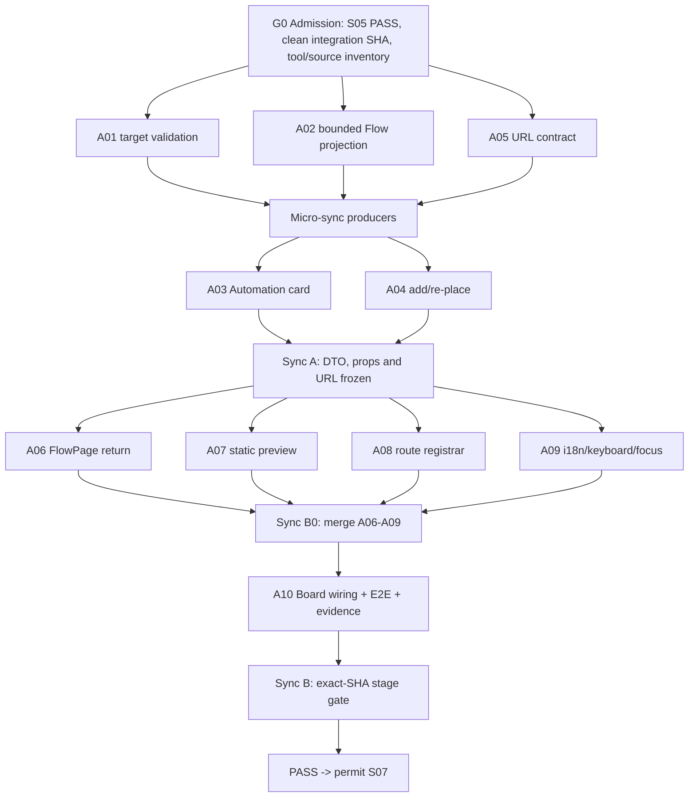

# Этап 06. Automation Placement и существующий Flow Editor

> **Обязательный режим выполнения для agentic workers:** использовать `superpowers:subagent-driven-development` (предпочтительно) либо `superpowers:executing-plans`. Этап обязан дать десять практических deliverables от `S06-A01…S06-A10`; одновременно работают 3–5 субагентов, если доступны не менее трёх независимых задач. Каждый implementation task проходит отдельную проверку соответствия ТЗ и quality review. Следующий этап запрещено начинать до полного `PASS` Этапа 06 на одном exact SHA.
>
> **Обязательные инструменты:** до реализации выполнить capability inventory и применить все доступные релевантные инструменты: Graphify только read-only для навигации, `rg`/source inspection как authoritative code truth, Context7 и official docs для dependency-sensitive React Router/API contract, backend/frontend review skills, focused pytest/Jest, i18n checks, TypeScript production typecheck, Vite build, Playwright/Chrome и focused Product Design audit. RaytSystem используется только read-only через команды из `AGENTS.md`; его runtime, external MCP, promotion, notifications и network exposure не включаются. Недоступность инструмента фиксируется с причиной и безопасной альтернативой; инструмент не объявляется использованным без evidence.

Все пути ниже заданы относительно `/Volumes/Projects/ketos_canvas_mod_main`, если не указано иное. Реализация ведётся только в clean integration worktree; существующий dirty root сохраняется без изменений.

## 1. Название и номер этапа

**Этап 06 — Automation Placement и существующий Flow Editor.**

Нормативная формула этапа:

```text
Automation = существующий Flow
Automation Placement = компактное read-only представление Flow на Board
Edit = переход в единственный существующий fullscreen FlowPage
Save = существующий useSaveFlow / Flow API path
Return = URL-backed возврат к тому же Board и Placement
Run = disabled до Этапа 07 с доступным RU/EN объяснением
```

Этап не создаёт новую Automation table, второй Flow backend, второй editor, embedded editable editor, editor lease, новый runtime или копию `Flow.data`.

## 2. Контекст

### 2.1. Продуктовый контекст

К моменту входа в Этап 06 уже должны существовать и иметь `PASS`:

- `Project = Folder` и owner-only Project navigation из Этапа 02;
- отдельные `Board`, `BoardPage`, `BoardCanvas` и durable viewport из Этапа 03;
- generic `Placement`, `BoardCardFrame`, scene mapper и разделение entity/Placement из Этапа 04;
- durable Chat/CopilotKit/AG-UI integration из Этапа 05;
- `Placement.target_kind=automation` как bounded target kind, но без Automation UI;
- default-off workspace feature flag и clean integration workflow.

Automation не становится новой сущностью: канонические identity, content, save и route принадлежат существующему `Flow`. Закрытие Automation Placement не удаляет Flow, а повторное размещение использует тот же `flowId`.

### 2.2. Подтверждённый current-source контекст

Текущий checkout до выполнения S01–S05 подтверждает следующие существующие seams:

- `src/frontend/src/routes.tsx` регистрирует `/flow/:id`, `/flow/:id/folder/:folderId` и `/flow/:id/view`;
- `src/frontend/src/pages/FlowPage/index.tsx` использует singleton `flowStore`, `flowsManagerStore`, global hotkeys, sidebars, assistant/playground state, `useBlocker` и before-unload guard;
- `src/frontend/src/pages/FlowPage/components/PageComponent/index.tsx` монтирует реальный ReactFlow editor;
- `src/frontend/src/components/core/appHeaderComponent/components/FlowMenu/index.tsx` является узкой header-точкой для `Return to Board`;
- `src/frontend/src/hooks/flows/use-save-flow.ts` — канонический manual save path и не должен дублироваться;
- `src/frontend/src/hooks/flows/use-add-flow.ts` сейчас умеет fallback в route `folderId`/`myCollectionId`, поэтому Board path обязан передавать explicit `targetProjectId`;
- `src/backend/base/ketos/services/database/models/flow/model.py::FlowHeader` содержит больше полей, чем разрешено Automation card, а для component может содержать `data`;
- `src/backend/base/ketos/api/v1/flows.py::read_flows` требует отдельного доказательства project scoping для `get_all + header_flows`;
- `src/frontend/src/controllers/API/queries/flows/use-get-refresh-flows-query.ts` имеет global-store side effects и дополнительно загружает components, поэтому он не является готовым bounded Board query.

Из этого следует: `AutomationSummary` должен быть отдельным типом ровно с `id/name/description`; Board query должен быть owner-only, project-scoped, исключать components/raw `data` и не мутировать editor caches.

### 2.3. Нормативные инварианты

- `Automation = Flow`; один Flow ID используется на Board, в editor и в последующих Job/Command stages.
- Один editable editor: только `src/frontend/src/pages/FlowPage/index.tsx`.
- Automation card и preview не импортируют `flowStore`, `FlowPage`, `PageComponent`, `ViewPage`, `ReactFlow`, `ReactFlowProvider` или `useReactFlow`.
- Board geometry остаётся в Placement и никогда не записывается в `Flow.data`.
- Flow content не копируется в Placement, Board state, localStorage или новый Automation store.
- Owner и Project membership определяются server-side; browser query IDs не являются authorization proof.
- `user_id IS NULL`, foreign owner, wrong Project, wrong Board, wrong target kind и mismatched target ID дают одинаковый безопасный deny без раскрытия metadata.
- Direct legacy Flow routes работают как до этапа и не показывают `Return to Board` без валидного контекста.
- Existing save, save hotkey, autosave, SaveChangesModal, active-build blocker и before-unload contract сохраняются.
- Новые строки имеют RU/EN parity, используются semantic tokens и существующие `components/ui`.
- Миграции, новые dependencies, package manifests, lock files, KFX ABI/manifests, deployment config, generated artifacts, `LICENSE` и `NOTICE` вне scope.

## 3. Цель

Дать пользователю полный ручной roundtrip:

```text
Board
→ выбрать существующий Flow или создать Flow строго в текущем Project
→ создать/re-place Automation Placement
→ увидеть bounded name/description preview
→ открыть канонический fullscreen /flow/:id
→ вручную изменить и сохранить Flow существующим save path
→ reload/new tab не теряет return context
→ вернуться на исходный Board
→ получить keyboard focus на исходном Automation Placement
```

Цель считается достигнутой только тогда, когда тот же `flowId`, `boardId` и `placementId` проходят весь путь, manual edit сохраняется после reload, direct legacy Flow routes не регрессируют, а Automation card не получает raw graph/editor/runtime.

## 4. Подробное техническое задание

### 4.1. Functional scope

1. Automation selector показывает только owner-visible обычные Flow текущего Project.
2. Выбор Flow создаёт Placement с `target_kind=automation`, `target_id=flow.id`.
3. Создание нового Flow из Board требует explicit `targetProjectId`; `Flow.folder_id` равен Project ID Board.
4. Re-place восстанавливает Placement существующего Flow и не создаёт второй Flow.
5. Automation card отображает loading, ready, missing и error states.
6. Ready state показывает только `name` и bounded `description`.
7. `Edit` является keyboard-accessible link/button с настоящим canonical editor URL.
8. `Run` остаётся disabled до S07; рядом либо в доступном tooltip/description присутствует локализованное объяснение, почему действие недоступно.
9. Editor URL хранит return context в query string:

```text
/flow/{flowId}?returnBoardId={boardId}&returnPlacementId={placementId}
```

10. Произвольный `returnTo`, route state-only, localStorage-only и open redirect запрещены.
11. Полная пара `returnBoardId + returnPlacementId` валидируется; partial/malformed context не вызывает backend request и скрывает Return action.
12. Authoritative validation подтверждает owner, Board→Project, Placement→Board, `target_kind=automation`, `target_id=flowId`, Flow owner и `Flow.folder_id=Board.project_id`.
13. Валидный context возвращает канонический Board URL:

```text
/project/{projectId}/board/{boardId}?focusPlacementId={placementId}
```

14. Invalid/missing/foreign/mismatched context не ломает editor: Flow остаётся редактируемым, Return control отсутствует, data existence не раскрывается.
15. Return navigation проходит существующий unsaved-change blocker. `Save and Return` происходит только после успешного `useSaveFlow()`; save rejection остаётся в editor и показывает existing error.
16. Dirty predicate должен ловить metadata edit пустого Flow и удаление последнего node; blocker и before-unload используют один predicate.
17. После возврата Board hydrates scene с server, проверяет `focusPlacementId` среди текущих placements и переводит keyboard focus на исходную Automation card.

### 4.2. Bounded data contract

Frontend type:

```ts
export type AutomationSummary = Readonly<{
  id: string;
  name: string;
  description: string | null;
}>;
```

Разрешённые поля Automation query response: `id`, `name`, `description`. `folder_id` можно использовать только внутри server/query validation и нельзя передавать в presentation props. Запрещённые presentation fields: `data`, nodes, edges, viewport, parameters, secrets, node count, execution status, endpoint metadata, MCP flags, tags, component data.

Project-scoped header query обязан:

- фильтровать `Flow.user_id == current_user.id`;
- фильтровать `Flow.folder_id == validated project_id`;
- исключать `is_component=true`;
- возвращать bounded DTO;
- не обновлять `flowStore` или `flowsManagerStore`;
- использовать существующие `api` + `UseRequestProcessor`, не raw `fetch`.

### 4.3. Exact production paths

Backend:

- modify `src/backend/base/ketos/services/board/service.py`;
- modify `src/backend/base/ketos/api/v1/placements.py` для exact owner-safe `GET /api/v1/boards/{board_id}/placements/{placement_id}/automation-editor-context?flow_id={flow_id}`;
- modify `src/backend/base/ketos/services/database/models/flow/model.py` для exact bounded projection type, не меняя table schema;
- modify `src/backend/base/ketos/api/v1/flows.py` для owner-only project-scoped ordinary-Flow header projection;
- modify `src/backend/tests/unit/api/v1/test_flows.py` для header projection regression;
- create `src/backend/tests/unit/services/board/test_automation_placement.py`;
- create `src/backend/tests/unit/api/v1/test_automation_editor_context.py`.

Frontend types/query/actions:

- create `src/frontend/src/types/flow/automation.ts`;
- create `src/frontend/src/controllers/API/queries/flows/use-get-automation-summaries.ts`;
- create `src/frontend/src/controllers/API/queries/flows/__tests__/use-get-automation-summaries.test.ts`;
- modify `src/frontend/src/hooks/flows/use-add-flow.ts`;
- modify `src/frontend/src/hooks/flows/__tests__/use-add-flow.test.ts`;
- create `src/frontend/src/components/core/automations/AutomationSelector.tsx`;
- create `src/frontend/src/components/core/automations/__tests__/AutomationSelector.test.tsx`;
- create `src/frontend/src/pages/BoardPage/hooks/use-automation-placement-actions.ts`;
- create `src/frontend/src/pages/BoardPage/hooks/__tests__/use-automation-placement-actions.test.tsx`.

Frontend placement/preview:

- create `src/frontend/src/components/core/board/placements/AutomationPlacement.tsx`;
- create `src/frontend/src/components/core/board/placements/AutomationPlacement.test.tsx`;
- create `src/frontend/src/components/core/board/placements/AutomationPreview.tsx`;
- create `src/frontend/src/components/core/board/placements/AutomationPreview.test.tsx`;
- modify `src/frontend/src/components/core/board/board-node-types.ts`;
- modify `src/frontend/src/components/core/board/BoardCanvas/index.tsx`;
- reuse without structural rewrite `src/frontend/src/components/core/board/BoardCardFrame/index.tsx`.

Frontend return/route/focus:

- create `src/frontend/src/utils/automation-editor-route.ts`;
- create `src/frontend/src/utils/__tests__/automation-editor-route.test.ts`;
- create `src/frontend/src/pages/BoardPage/hooks/use-open-automation-editor.ts`;
- create `src/frontend/src/pages/BoardPage/hooks/__tests__/use-open-automation-editor.test.tsx`;
- create `src/frontend/src/pages/BoardPage/hooks/use-board-return-focus.ts`;
- create `src/frontend/src/pages/BoardPage/hooks/__tests__/use-board-return-focus.test.tsx`;
- create `src/frontend/src/pages/FlowPage/hooks/use-board-return-context.ts`;
- create `src/frontend/src/pages/FlowPage/hooks/__tests__/use-board-return-context.test.tsx`;
- modify `src/frontend/src/pages/FlowPage/index.tsx`;
- create `src/frontend/src/pages/FlowPage/__tests__/FlowPage-board-return.test.tsx`;
- modify `src/frontend/src/components/core/appHeaderComponent/components/FlowMenu/index.tsx`;
- modify `src/frontend/src/components/core/appHeaderComponent/components/FlowMenu/__tests__/FlowMenu.spec.tsx`;
- modify `src/frontend/src/routes.tsx` только через single-owner registrar;
- create `src/frontend/src/__tests__/board-automation-routes.test.tsx`.

Locales, integration и evidence:

- modify `src/frontend/src/locales/en.json`;
- modify `src/frontend/src/locales/ru.json`;
- create `src/frontend/tests/core/features/board-automation-editor.spec.ts`;
- create `docs/evidence/stage-06/automation-editor-contract.md`;
- create `docs/evidence/stage-06/STAGE_06_REPORT_RU.md`.

Stage-04 planned source-of-truth paths — `src/frontend/src/components/core/board/BoardCanvas/index.tsx` и `src/frontend/src/components/core/board/BoardCardFrame/index.tsx`. Если подписанный S04/S05 handoff явно freeze другой exact path, coordinator не создаёт дубль и не продолжает с ложным admission failure: до первого code commit он фиксирует handoff path resolution в `docs/evidence/stage-06/automation-editor-contract.md`, обновляет task assignments/admission variables и использует фактический frozen path. Interface и ownership из данного документа остаются неизменными.

### 4.4. Явные non-goals

- embedded/nested Flow Editor и editor leasing;
- второй Flow renderer на Board, включая `ViewPage` как preview;
- Flow execution, Job, result card или status polling — это S07;
- AI create/edit, Flow revision/CAS, CommandProposal, preview/confirmation — это S08;
- новая Automation database entity, migration или API domain;
- arbitrary return URL, external redirect или browser-authoritative auth;
- KFX/LFX changes, component class rename, manifest changes;
- Chat/CopilotKit/AG-UI changes;
- package/dependency/lock changes;
- full visual redesign, mobile matrix, multi-browser matrix или accessibility audit beyond focused desktop keyboard/focus.

### 4.5. Tool-routing contract

| Инструмент/skill | Обязательное применение | Evidence |
| --- | --- | --- |
| `superpowers:subagent-driven-development` | fresh implementer на A01…A10, затем spec review и quality review | agent/task ledger с commit SHA |
| `superpowers:using-git-worktrees` | clean integration worktree и до пяти reusable lane worktrees | `git worktree list --porcelain` |
| Graphify | read-only query маршрутов/FlowPage/FlowHeader/Board seams; rebuild запрещён | query text и result summary |
| RaytSystem | только `doctor/status/graph status/lint --root ... --json` | exit codes; никакой promotion/runtime |
| Context7 + official docs | установленная React Router query-param/link/blocker semantics и любой меняемый external API | library ID, version, verified contract |
| `backend-code-review` | A01/A02 security/service changes | findings + disposition |
| `frontend-code-review` | A02–A09 TS/React changes | findings + disposition |
| `frontend-testing` и `e2e-testing` | focused Jest и Playwright story | commands, exit codes |
| Product Design + Chrome | только focused 1440×900 loading/error/disabled/focus/return audit | screenshot list и blocking findings |
| `verification-before-completion` | финальный gate на exact SHA | полный command ledger |

Image generation, document/spreadsheet/presentation tools, Supabase, deployment/publish tools и external communication tools не относятся к S06 scope; их не вызывают и отмечают `NOT RELEVANT`, а не имитируют использование.

## 5. Перечень задач

| ID | Роль | Краткий deliverable | Основной owner scope |
| --- | --- | --- | --- |
| S06-A01 | Backend ownership/target-validation owner | strict same-owner/same-Project Automation target и return-context validation | Board service/Placement API/test |
| S06-A02 | Bounded Flow projection owner | project-scoped `AutomationSummary` query без raw data/cache side effects | Flow DTO/API + frontend query/type/tests |
| S06-A03 | Automation card owner | loading/ready/missing/error card, Edit, explained disabled Run | `AutomationPlacement*` |
| S06-A04 | Add/re-place owner | selector, explicit `targetProjectId`, create/re-place без fallback | selector/actions/`use-add-flow` tests |
| S06-A05 | Durable URL owner | exact editor URL builder/parser и Board open hook | route helper/open hook/tests |
| S06-A06 | Existing FlowPage return owner | valid Return, unsaved blocker/save/reload/direct route behavior | FlowPage/FlowMenu/return hook/tests |
| S06-A07 | Static preview owner | pure `name/description` preview без editor/store/data | `AutomationPreview*` |
| S06-A08 | Route registrar | canonical route constants/registrar и legacy route characterization | `routes.tsx`/route test |
| S06-A09 | i18n/keyboard/focus owner | RU/EN strings, selector keyboard path, Board return focus | locales/focus hook/tests |
| S06-A10 | Integration/E2E owner | Board node wiring, real browser roundtrip, evidence/report | node registry/BoardCanvas/E2E/docs |

`S06-A10` не является чистым reviewer: он обязан создать integration wiring, E2E/harness и исправить совместимость только в S06-owned paths. Coordinator и независимые reviewers не засчитываются как один из десяти практических deliverables.

## 6. Подэтапы и шаги выполнения

### 6.1. Роли и ownership discipline

| Роль | Ответственность |
| --- | --- |
| User/approver | даёт отдельное разрешение только на реально внешние действия или расширение scope; обычный implementation loop не требует повторного согласования |
| Coordinator | фиксирует base, создаёт worktrees/branches, выдаёт assignments, последовательно объединяет DAG, повторяет gates, присваивает единственный статус |
| S06-A01…A10 | каждый даёт production code/test/wiring/docs deliverable и focused command result |
| Spec reviewer | после implementer проверяет соответствие конкретной задаче и global constraints; не редактирует код |
| Quality reviewer | после spec pass проверяет correctness/security/maintainability; findings исправляет тот же owner либо отдельный bounded fix lane |
| Compatibility verifier | coordinator независимо повторяет Flow routes/save/editor gate после A10; не считается A10 |
| Evidence recorder | A10 пишет evidence files, coordinator подтверждает SHA/commands/status и не подменяет результаты narrative |

Single-owner paths:

- A01: backend Board service/Placement automation validation;
- A02: Flow bounded DTO/API projection и Automation query;
- A03: `AutomationPlacement.tsx` и основной component test;
- A04: selector/actions/Board-safe create;
- A05: URL format/parser/open hook;
- A06: `FlowPage`, `FlowMenu`, return-context hook;
- A07: `AutomationPreview`;
- A08: `routes.tsx` и shared route registrar/helpers;
- A09: `en.json`, `ru.json`, focus hook;
- A10: Board node registry/`BoardCanvas`, E2E, evidence/report.

Package manifests/locks не имеют владельца, потому что изменения dependencies в S06 запрещены. Lane не редактирует файл другого owner; требуемый patch передаётся owner после его merge.

### 6.2. Wave/Sync DAG



### 6.3. Матрица каждого подэтапа

| Подэтап | Параллельность | Prerequisite | Output | Owner | Verification | Downstream consumer |
| --- | --- | --- | --- | --- | --- | --- |
| G0 Admission | coordinator + read-only audit; code agents не стартуют | S05 report `PASS`, exact SHA, prior paths present | base SHA, dirty snapshot, tool inventory, actual path map | Coordinator | git/RaytSystem/Graphify/source preflight | Wave A0 |
| Wave A0 | A01, A02, A05 параллельно; ровно 3 active lanes | G0 PASS | target validator, bounded DTO/query, URL codec | A01/A02/A05 | три focused suites | Micro-sync producers |
| Micro-sync A0 | только coordinator, merge последовательно | A01/A02/A05 focused PASS + reviews | новый sync SHA, frozen service/query/URL interfaces | Coordinator | combined backend/query/route-helper tests | A03/A04 |
| Wave A1 | A03 и A04 параллельно; reviewers могут дать третью независимую lane | Micro-sync SHA | card states/actions и selector/create/re-place | A03/A04 | component/action tests | Sync A |
| Sync A | только coordinator | A03/A04 PASS + reviews | frozen `AutomationSummary`, card props, `targetProjectId`, editor URL | Coordinator | combined Wave A suite, source guards | Wave B0 |
| Wave B0 | A06, A07, A08, A09 параллельно; 4 lanes | Sync-A SHA | FlowPage return, preview, routes, locales/focus | A06/A07/A08/A09 | owner-focused Jest/i18n tests | Sync B0 |
| Sync B0 | coordinator merge order A06→A07→A08→A09 | все четыре deliverables PASS | integrated frontend contract до Board wiring | Coordinator | Jest + i18n + typecheck, без Playwright parallelism | A10 |
| Wave B1 | A10 один implementation lane; independent reviews отдельно | Sync-B0 SHA | node registry/BoardCanvas wiring, E2E, evidence docs | A10 | focused Jest, source guards, browser story | Sync B |
| Sync B / stage gate | heavy commands строго последовательно | A10 spec/quality PASS | exact final SHA и status decision | Coordinator | backend → frontend → i18n → typecheck → build → Playwright → diff audit | S07 только при PASS |

### 6.4. Универсальный task loop

Для каждого `S06-Axx`:

1. Создать branch `codex/mvp-s06-axx-*` от указанного sync SHA.
2. Получить assignment с base SHA, writable paths, forbidden paths, interface prerequisites, exact focused command и ожидаемым output.
3. Сначала написать failing test/characterization или executable source guard.
4. Запустить test и подтвердить ожидаемый failure по отсутствующему S06 behavior, а не по сломанному fixture.
5. Реализовать минимальный код без downstream functionality.
6. Запустить focused command, исправить Critical/blocking defect и повторить до green.
7. Передать commit SHA, changed paths, commands, exit codes, assumptions и downstream interface.
8. Пройти spec review, затем quality review; unresolved Critical возвращает задачу owner.
9. Только coordinator объединяет branch и повторяет focused check на integration SHA.

### 6.5. S06-A01 — Backend target и return-context validation

**Цель:** гарантировать, что Automation Placement указывает только на owner-owned обычный Flow того же Project, а URL return context валиден server-authoritatively.

**Ответственность и writable paths:**

- `src/backend/base/ketos/services/board/service.py`;
- `src/backend/base/ketos/api/v1/placements.py`;
- `src/backend/tests/unit/services/board/test_automation_placement.py`;
- `src/backend/tests/unit/api/v1/test_automation_editor_context.py`.

**Запрещено:** migrations/models registrar, Flow mutation, новая Automation service/table, frontend files.

**Tasks:**

- [ ] Сначала создать negative matrix: owner/same Project success; no auth; missing target; foreign owner; NULL owner; wrong Project; component target; wrong Board; wrong placement kind; placement points to another Flow; forged actor/body ignored.
- [ ] Добавить централизованный `validate_automation_target` поверх existing Board/Placement/Flow services; проверка parent Project/owner предшествует metadata return.
- [ ] Добавить `resolve_automation_return_context`, возвращающий только `project_id`, `board_id`, `placement_id`, `flow_id` после всех проверок.
- [ ] В existing Placement router зарегистрировать точный endpoint `GET /api/v1/boards/{board_id}/placements/{placement_id}/automation-editor-context?flow_id={flow_id}` с `CurrentActiveUser`; новый router/domain не создавать.
- [ ] Endpoint возвращает bounded DTO `AutomationEditorContextRead(project_id: UUID, board_id: UUID, placement_id: UUID, flow_id: UUID)` и не возвращает Flow/Placement metadata, geometry или raw `Flow.data`.
- [ ] Использовать одинаковый coded 404/deny для missing/foreign/NULL/mismatch и не раскрывать имя/описание Flow.
- [ ] Доказать, что remove/close Placement сохраняет Flow и что re-place использует тот же `flow_id`.
- [ ] API test покрывает no auth `401`, malformed UUID validation, owner success и uniform `404` для missing/foreign/NULL/wrong-project/wrong-board/wrong-kind/wrong-flow.

**Результат:** один reusable backend validator, используемый create/re-place/read-return path.

**Focused verification:**

```bash
uv run pytest \
  src/backend/tests/unit/services/board/test_automation_placement.py \
  src/backend/tests/unit/api/v1/test_automation_editor_context.py -q
```

**Критерий:** все positive/negative cases дают точный ожидаемый outcome; Flow не удалён; никакая foreign metadata не возвращена.

**Downstream:** A04 create/re-place и A06 FlowPage return-context query.

### 6.6. S06-A02 — Bounded owner-only Flow projection

**Цель:** предоставить Automation selector/card ровно `id/name/description` без raw Flow graph, component data и editor-cache side effects.

**Ответственность и writable paths:**

- `src/backend/base/ketos/services/database/models/flow/model.py`;
- `src/backend/base/ketos/api/v1/flows.py`;
- `src/backend/tests/unit/api/v1/test_flows.py`;
- `src/frontend/src/types/flow/automation.ts`;
- `src/frontend/src/controllers/API/queries/flows/use-get-automation-summaries.ts`;
- `src/frontend/src/controllers/API/queries/flows/__tests__/use-get-automation-summaries.test.ts`.

**Запрещено:** Flow table schema/migration, `flowStore`, `flowsManagerStore`, component loading, package files.

**Tasks:**

- [ ] Сначала зафиксировать backend regression: exact owner, exact `folder_id`, `is_component=false`, JSON keys ровно `id/name/description`, no NULL/foreign/wrong-project/data.
- [ ] Добавить bounded response model без `data`, tags, endpoint/MCP/access fields; table schema не менять.
- [ ] Исправить project scoping header query так, чтобы `folder_id` применялся server-side и не расширял visibility существующих Flow routes.
- [ ] Создать `AutomationSummary` и dedicated TanStack query key `['automation-summaries', projectId]` через existing `api`/`UseRequestProcessor`.
- [ ] Не вызывать `processFlows`, не refetch components, не менять `flowStore`/`flowsManagerStore`.
- [ ] Mapper должен выбрасывать любые дополнительные поля даже при malformed fixture.

**Результат:** frozen `AutomationSummary` interface и safe project-scoped query.

**Focused verification:**

```bash
uv run pytest src/backend/tests/unit/api/v1/test_flows.py -k 'header and project' -q

cd src/frontend
npm test -- --runInBand src/controllers/API/queries/flows/__tests__/use-get-automation-summaries.test.ts
```

**Критерий:** response/mapper exact fields; Flow data/components/secrets не переданы; global editor caches неизменны.

**Downstream:** A03/A04/A07.

### 6.7. S06-A03 — Automation Placement card

**Цель:** реализовать компактную, понятную и доступную Automation card без editor/runtime внутри Board.

**Ответственность и writable paths:**

- `src/frontend/src/components/core/board/placements/AutomationPlacement.tsx`;
- `src/frontend/src/components/core/board/placements/AutomationPlacement.test.tsx`.

**Запрещено:** `BoardCanvas`, node registry, locales, raw colors, Flow/editor imports.

**Tasks:**

- [ ] Написать tests для loading skeleton, ready name/description, empty description, missing Flow, safe error/retry, Edit URL и disabled Run.
- [ ] Использовать existing `BoardCardFrame` и semantic tokens.
- [ ] Ready props принимают только `placementId`, `flowId`, `AutomationSummary` и callbacks.
- [ ] `Edit` имеет настоящий `href` для open-in-new-tab и keyboard activation.
- [ ] `Run` disabled; рядом доступное описание/tooltip использует locale key `board.automation.runAvailableInNextStage`.
- [ ] Missing/error state не удаляет Placement/Flow автоматически и не раскрывает server detail.
- [ ] Source guard запрещает `flowStore`, `FlowPage`, `PageComponent`, `ViewPage`, `ReactFlowProvider`, `useReactFlow`, `FlowType` и `.data`.

**Результат:** production card component и focused test.

**Focused verification:**

```bash
cd src/frontend
npm test -- --runInBand src/components/core/board/placements/AutomationPlacement.test.tsx
```

**Критерий:** все states доступны; Edit canonical; Run честно disabled/explained; embedded editor/raw data отсутствуют.

**Downstream:** A10 node wiring.

### 6.8. S06-A04 — Add, create и re-place

**Цель:** позволить выбрать существующий Flow или создать новый Flow строго в Project текущего Board, затем разместить его один раз.

**Ответственность и writable paths:**

- `src/frontend/src/hooks/flows/use-add-flow.ts`;
- `src/frontend/src/hooks/flows/__tests__/use-add-flow.test.ts`;
- `src/frontend/src/components/core/automations/AutomationSelector.tsx`;
- `src/frontend/src/components/core/automations/__tests__/AutomationSelector.test.tsx`;
- `src/frontend/src/pages/BoardPage/hooks/use-automation-placement-actions.ts`;
- `src/frontend/src/pages/BoardPage/hooks/__tests__/use-automation-placement-actions.test.tsx`.

**Запрещено:** default Project creation для Board call, entity deletion on placement failure, BoardCanvas/routes/locales.

**Tasks:**

- [ ] Расширить `useAddFlow` explicit параметром `targetProjectId`; при наличии он имеет приоритет над route `folderId`/`myCollectionId` и без изменения сохраняет legacy callers.
- [ ] Board hook требует non-empty validated `projectId` и никогда не вызывает fallback/default-folder creation.
- [ ] Selector использует A02 query, поддерживает loading/empty/error, keyboard navigation и выбор owner-visible Flow.
- [ ] Existing selection создаёт Placement с `target_kind='automation'`/`target_id=flowId`.
- [ ] Create success даёт один Flow с `folder_id=projectId` и один Placement.
- [ ] Re-place вызывает existing Stage-04 re-place path и сохраняет canonical Flow ID.
- [ ] Failed placement не запускает скрытое delete Flow; пользователю показывается bounded error, созданный Flow остаётся обычной Project entity и может быть re-place повторно.

**Результат:** deterministic Project-scoped add/re-place flow.

**Focused verification:**

```bash
cd src/frontend
npm test -- --runInBand \
  src/hooks/flows/__tests__/use-add-flow.test.ts \
  src/components/core/automations/__tests__/AutomationSelector.test.tsx \
  src/pages/BoardPage/hooks/__tests__/use-automation-placement-actions.test.tsx
```

**Критерий:** намеренно другой `myCollectionId` не влияет; success даёт 1 Flow + 1 Placement; re-place не дублирует Flow.

**Downstream:** A10 browser placement story.

### 6.9. S06-A05 — Durable URL contract

**Цель:** сделать open/reload/new-tab return context воспроизводимым без route state/localStorage/open redirect.

**Ответственность и writable paths:**

- `src/frontend/src/utils/automation-editor-route.ts`;
- `src/frontend/src/utils/__tests__/automation-editor-route.test.ts`;
- `src/frontend/src/pages/BoardPage/hooks/use-open-automation-editor.ts`;
- `src/frontend/src/pages/BoardPage/hooks/__tests__/use-open-automation-editor.test.tsx`.

**Tasks:**

- [ ] Создать typed `AutomationEditorReturnRef` с `boardId` и `placementId`.
- [ ] Builder возвращает только `/flow/{encodedFlowId}?returnBoardId=...&returnPlacementId=...`.
- [ ] Parser использует existing `isUUID` и принимает только одну полную валидную пару; duplicate, partial, empty, malformed IDs возвращают `null`.
- [ ] Не принимать arbitrary `returnTo`, protocol, hostname, pathname или state-only context.
- [ ] `useOpenAutomationEditor` предоставляет настоящий href и optional same-tab navigate, не монтирует editor.
- [ ] Тесты доказывают query encoding, BASENAME/custom navigation compatibility, reload/new-tab string stability и invalid cases.

**Результат:** frozen URL format и pure codec.

**Focused verification:**

```bash
cd src/frontend
npm test -- --runInBand \
  src/utils/__tests__/automation-editor-route.test.ts \
  src/pages/BoardPage/hooks/__tests__/use-open-automation-editor.test.tsx
```

**Критерий:** URL deterministic и survives reload/new tab; invalid pair безопасно игнорируется.

**Downstream:** A06/A08/A09/A10.

### 6.10. S06-A06 — Return в существующем FlowPage

**Цель:** добавить минимальный `Return to Board`, сохранив existing Flow editor/save/unsaved behavior.

**Ответственность и writable paths:**

- `src/frontend/src/pages/FlowPage/hooks/use-board-return-context.ts`;
- `src/frontend/src/pages/FlowPage/hooks/__tests__/use-board-return-context.test.tsx`;
- `src/frontend/src/pages/FlowPage/index.tsx`;
- `src/frontend/src/pages/FlowPage/__tests__/FlowPage-board-return.test.tsx`;
- `src/frontend/src/components/core/appHeaderComponent/components/FlowMenu/index.tsx`;
- `src/frontend/src/components/core/appHeaderComponent/components/FlowMenu/__tests__/FlowMenu.spec.tsx`;
- при необходимости focused regression в `src/frontend/src/hooks/__tests__/use-unsaved-changes.test.ts` и `src/frontend/src/hooks/flows/__tests__/use-save-flow.test.ts`.

**Запрещено:** второй save path, editor duplication, routes/locales, BoardCanvas.

**Tasks:**

- [ ] Hook парсит A05 pair и через existing `api` + `UseRequestProcessor` вызывает exact A01 endpoint `GET /api/v1/boards/{boardId}/placements/{placementId}/automation-editor-context?flow_id={routeFlowId}`; raw `fetch` запрещён.
- [ ] Hook принимает только bounded `AutomationEditorContextRead`, проверяет exact equality response IDs с route/query IDs и строит Board URL из server-returned `project_id`; browser не выводит Project из неподтверждённых query fields.
- [ ] Return control виден только при полностью validated context; loading validation не показывает ложную ссылку.
- [ ] Invalid/foreign/missing/mismatched context скрывает Return, но Flow editor остаётся usable.
- [ ] Return URL равен `/project/{projectId}/board/{boardId}?focusPlacementId={placementId}`.
- [ ] Clean Return вызывает `navigate(validatedReturnUrl)` один раз. Dirty/build Return сначала вызывает тот же navigate, чтобы `useBlocker` сохранил точную pending Board location; modal не подменяет её `/all`.
- [ ] `Save and Return` выполняет `await useSaveFlow()` и вызывает `blocker.proceed()` только после fulfilled save. Reject оставляет blocker/location/editor активными, не вызывает `proceed/reset/navigate` и показывает existing bounded error.
- [ ] `Exit Anyway` вызывает `blocker.proceed()` для сохранённой Board location; Cancel/Escape вызывает `blocker.reset()` и возвращает focus на Return trigger. Никакой `finally`-navigation нет.
- [ ] Унифицировать dirty predicate с existing `useUnsavedChanges`, чтобы empty metadata edit и удаление последнего node не обходили blocker/before-unload.
- [ ] Hook/API tests: no/partial/malformed pair не вызывает API; valid pair вызывает exact URL; `401/404/409/5xx` скрывают Return и оставляют editor usable; mismatched response IDs rejected.
- [ ] FlowPage test: clean return; dirty Save and Return; save reject stays; Cancel/Escape; Exit Anyway; active build; reload context; direct `/flow/:id` unchanged.
- [ ] Сохранить folder breadcrumb, save hotkey, autosave и existing direct route behavior.

**Результат:** один FlowPage с optional validated Return affordance.

**Focused verification:**

```bash
cd src/frontend
npm test -- --runInBand \
  src/pages/FlowPage/hooks/__tests__/use-board-return-context.test.tsx \
  src/pages/FlowPage/__tests__/FlowPage-board-return.test.tsx \
  src/components/core/appHeaderComponent/components/FlowMenu/__tests__/FlowMenu.spec.tsx \
  src/hooks/flows/__tests__/use-save-flow.test.ts \
  src/hooks/__tests__/use-unsaved-changes.test.ts
```

**Критерий:** save/reload/return работает; failed save не навигирует; direct Flow route и unsaved protections не регрессируют.

**Downstream:** A10 E2E; S10 final story.

### 6.11. S06-A07 — Static AutomationPreview

**Цель:** дать bounded read-only preview, не создавая Flow renderer/editor на Board.

**Ответственность и writable paths:**

- `src/frontend/src/components/core/board/placements/AutomationPreview.tsx`;
- `src/frontend/src/components/core/board/placements/AutomationPreview.test.tsx`.

**Tasks:**

- [ ] Pure component принимает только `AutomationSummary`.
- [ ] Показывает name и bounded description с локализованным empty-description fallback.
- [ ] Длинный description визуально ограничен CardFrame и не исполняет HTML.
- [ ] Не показывает nodes/status/count/parameters/secrets/endpoint metadata.
- [ ] Source guard запрещает Flow/editor/ReactFlow/store imports и `.data`.

**Результат:** presentation-only preview.

**Focused verification:**

```bash
cd src/frontend
npm test -- --runInBand src/components/core/board/placements/AutomationPreview.test.tsx
```

**Критерий:** exact fields render; unsafe HTML остаётся текстом; Flow state неизменен.

**Downstream:** A03 consumer после Sync-B0/A10 wiring.

### 6.12. S06-A08 — Route registrar и compatibility

**Цель:** применить frozen URL helper без изменения legacy route meanings.

**Ответственность и writable paths:**

- `src/frontend/src/routes.tsx`;
- `src/frontend/src/__tests__/board-automation-routes.test.tsx`;
- только route-facing exports в `src/frontend/src/utils/automation-editor-route.ts` после A05 merge.

**Tasks:**

- [ ] Сделать route helper единственным builder для editor/Board roundtrip; literal canonical paths в `routes.tsx` не дублировать в feature code.
- [ ] Сохранить `/flow/:id`, `/flow/:id/folder/:folderId`, `/flow/:id/view` и `/project/:projectId/board/:boardId`.
- [ ] Query params не создают новый nested editor route и не меняют ViewPage semantics.
- [ ] Tests покрывают direct route, folder route, view route, valid query roundtrip и invalid query fallthrough.
- [ ] `routes.tsx` меняет только A08; A10 не правит registrar.

**Результат:** один canonical Flow Editor route с optional URL-backed context.

**Focused verification:**

```bash
cd src/frontend
npm test -- --runInBand \
  src/__tests__/board-automation-routes.test.tsx \
  src/pages/ViewPage/__tests__/ViewPage.test.tsx \
  src/components/core/appHeaderComponent/__tests__/header-visibility.test.ts
```

**Критерий:** все legacy/new route cases matched; direct route не показывает Return.

**Downstream:** A10 E2E и S07.

### 6.13. S06-A09 — RU/EN, keyboard и focus return

**Цель:** закрыть доступный desktop keyboard path и локализованные states без redesign.

**Ответственность и writable paths:**

- `src/frontend/src/locales/en.json`;
- `src/frontend/src/locales/ru.json`;
- `src/frontend/src/pages/BoardPage/hooks/use-board-return-focus.ts`;
- `src/frontend/src/pages/BoardPage/hooks/__tests__/use-board-return-focus.test.tsx`;
- отдельные keyboard tests в `src/frontend/src/components/core/automations/__tests__/AutomationSelector.test.tsx` после A04 merge через owner handoff.

**Tasks:**

- [ ] Добавить parity keys для Add Automation, Edit, Return to Board, loading, unavailable/missing/error, retry, no description и disabled Run explanation.
- [ ] Selector поддерживает keyboard search/navigation/selection; Edit и Return доступны Tab+Enter/Space.
- [ ] Board focus hook ждёт server scene hydration, находит exact `focusPlacementId`, проверяет automation kind и фокусирует card; stale/foreign ID игнорируется.
- [ ] SaveChangesModal Cancel/Escape возвращает focus на Return trigger; successful Board return — на Placement.
- [ ] Использовать semantic tokens; raw color literals не добавлять.
- [ ] Выполнить focused Product Design + Chrome audit 1440×900 для loading/error/disabled/return/focus; исправить только blocking S06 defects.

**Результат:** locale parity и keyboard-only open/save/return.

**Focused verification:**

```bash
cd src/frontend
npm test -- --runInBand \
  src/pages/BoardPage/hooks/__tests__/use-board-return-focus.test.tsx \
  src/components/core/automations/__tests__/AutomationSelector.test.tsx
npm run i18n:check
npm run i18n:check-keys
npm run i18n:check:hardcoded
```

**Критерий:** no missing/hardcoded system strings; keyboard path и focus restoration доказаны.

**Downstream:** A10 browser story/S10 accessibility spot-check.

### 6.14. S06-A10 — Integration owner

**Цель:** объединить Automation node в Board и доказать реальный manual editor roundtrip.

**Ответственность и writable paths:**

- `src/frontend/src/components/core/board/board-node-types.ts`;
- `src/frontend/src/components/core/board/BoardCanvas/index.tsx`;
- `src/frontend/tests/core/features/board-automation-editor.spec.ts`;
- `docs/evidence/stage-06/automation-editor-contract.md`;
- `docs/evidence/stage-06/STAGE_06_REPORT_RU.md`.

**Запрещено:** менять routes/locales/FlowPage/preview owners, добавлять execution/status implementation, подменять API localStorage fixtures.

**Tasks:**

- [ ] Подключить `automation` node type в Board registry после merge A03/A07.
- [ ] Scene mapper использует `placement.id` как Board node ID и отдельный canonical `target_id=flowId`.
- [ ] Browser story работает с real Board/Placement/Flow API и clean test DB.
- [ ] Намеренно установить `myCollectionId != projectId`, создать Flow и проверить `folder_id=projectId`.
- [ ] Place ровно один Automation; открыть существующий singleton FlowPage; manual edit/save через `PATCH /api/v1/flows/{id}`.
- [ ] Reload editor и подтвердить тот же Flow ID и сохранённое изменение.
- [ ] Открыть editor URL в новой вкладке и подтвердить valid Return.
- [ ] Вернуться на тот же Board/Placement, проверить focus, geometry и отсутствие второго Flow/Placement.
- [ ] Invalid/foreign return context: editor usable, Return hidden.
- [ ] Direct `/flow/:id`, `/flow/:id/folder/:folderId`, `/flow/:id/view` работают без Return.
- [ ] Workspace flag off скрывает новый Automation UI, но не удаляет Flow/Placement data и не ломает direct legacy Flow route.
- [ ] Записать exact SHA, commands, exit codes, IDs и evidence; secrets/raw Flow data в evidence не включать.

**Результат:** integrated stage candidate и воспроизводимый evidence bundle.

**Focused verification:**

```bash
cd src/frontend
npm test -- --runInBand src/components/core/board
npx playwright test tests/core/features/board-automation-editor.spec.ts --project=chromium --workers=1 --retries=0
```

**Критерий:** one Flow/one existing editor/durable return/manual save/same Placement/direct legacy routes доказаны на одном exact SHA.

**Downstream:** S07 получает canonical `flowId`, enabled Run integration point и stable Placement/Board context.

## 7. Зависимости

### 7.1. Обязательные upstream prerequisites

- Этап 05 имеет финальный `PASS` report и exact integration SHA.
- Все S01–S05 deliverables объединены в clean integration branch.
- S01 default-off workspace flag и Flow route smoke доступны.
- S02 strict `Project = Folder` owner semantics доступны; fallback Project navigation не используется.
- S03 Board route `/project/:projectId/board/:boardId`, Board APIs, BoardCanvas и viewport работают.
- S04 Placement service/API, `target_kind=automation`, BoardCardFrame, scene mapper и close/re-place semantics работают.
- S05 Chat changes не должны затрагиваться S06.
- Existing Flow endpoints, `FlowPage`, `FlowMenu`, `useSaveFlow`, `useAddFlow`, `flowStore`, Flow route tests доступны.
- Node/frontend dependencies уже находятся в locks; новых package installs не требуется.

### 7.2. Admission commands

До запуска coordinator читает signed S04/S05 handoff. Если handoff не переопределяет пути, используются Stage-04 planned defaults ниже. Если handoff явно freeze другие exact paths, coordinator экспортирует `S04_BOARD_CANVAS_PATH`/`S04_BOARD_CARD_FRAME_PATH` с этими значениями и записывает evidence resolution; admission проверяет source-of-truth path, а не создаёт параллельный компонент.

```bash
cd /Volumes/Projects/ketos_canvas_mod_main

git status --short
S06_BASE_SHA="$(git rev-parse HEAD)"
S06_BOARD_CANVAS_PATH="${S04_BOARD_CANVAS_PATH:-src/frontend/src/components/core/board/BoardCanvas/index.tsx}"
S06_BOARD_CARD_FRAME_PATH="${S04_BOARD_CARD_FRAME_PATH:-src/frontend/src/components/core/board/BoardCardFrame/index.tsx}"
export S06_BASE_SHA
export S06_BOARD_CANVAS_PATH
export S06_BOARD_CARD_FRAME_PATH
printf '%s\n' "$S06_BASE_SHA"
printf '%s\n' "$S06_BOARD_CANVAS_PATH"
printf '%s\n' "$S06_BOARD_CARD_FRAME_PATH"
git worktree list --porcelain

raytsystem doctor --root /Volumes/Projects/ketos_canvas_mod_main --json
raytsystem status --root /Volumes/Projects/ketos_canvas_mod_main --json
raytsystem graph status --root /Volumes/Projects/ketos_canvas_mod_main --json
raytsystem lint --root /Volumes/Projects/ketos_canvas_mod_main --json

graphify query "How do routes.tsx, FlowPage, FlowMenu, useSaveFlow, FlowHeader, BoardCanvas and Placement connect for Automation editor roundtrip?"

test -f src/frontend/src/routes.tsx
test -f src/frontend/src/pages/FlowPage/index.tsx
test -f src/frontend/src/hooks/flows/use-save-flow.ts
test -f src/backend/base/ketos/services/board/service.py
test -f src/backend/base/ketos/api/v1/placements.py
test -f "$S06_BOARD_CANVAS_PATH"
test -f "$S06_BOARD_CARD_FRAME_PATH"
```

Coordinator сохраняет base SHA и root dirty snapshot в temp/evidence, затем создаёт clean integration worktree. Root checkout не используется для code changes.

### 7.3. Dependency handling

- Изменения React Router API начинаются только после Context7 resolve/query установленной версии и сверки official docs.
- Context7 library ID, exact installed version и проверенные `Link`/query-param/`useBlocker` semantics входят в A05/A06 handoff.
- Если external API change нельзя подтвердить, задача `BLOCKED`; memory/model example не считается evidence.
- Если external API change не нужен, current source + installed types + focused tests остаются authoritative, а dependency files не меняются.
- S06 не является schema-stage: SQLite/PostgreSQL migration gates не требуются, потому что migration запрещена. Появление migration означает scope violation и `FAIL` до удаления.

### 7.4. Downstream dependencies

- S07 потребляет `AutomationPlacement`, canonical `flowId`, Board/Placement context и заменяет disabled Run своим Job adapter; S06 не создаёт status/job/result.
- S08 потребляет тот же Flow ID/manual editor path, добавляет Flow revision/CommandProposal/AI mutation; S06 не переносит эти изменения назад.
- S09 восстанавливает persistent Flow/Placement IDs; URL return context не становится новой persistence entity.
- S10 повторяет place → existing editor → manual save → return и проверяет before/after Flow hash.

## 8. Ожидаемые результаты

После `PASS` существуют:

- owner-only project-scoped bounded Automation query;
- Automation selector для existing/create/re-place;
- один Flow и один Automation Placement на successful path;
- Automation card с loading/ready/missing/error states;
- bounded static preview `name/description`;
- explained disabled Run до S07;
- durable editor URL с `returnBoardId`/`returnPlacementId`;
- server-authoritative validation return context;
- minimal Return control в existing FlowPage/FlowMenu;
- manual save/reload/return через existing editor/save API;
- keyboard focus restoration на исходный Placement;
- RU/EN parity и semantic-token UI;
- route compatibility для direct/folder/view Flow routes;
- focused backend/frontend/E2E evidence на одном exact SHA;
- stage report с единственным статусом `PASS`, `FAIL` или `BLOCKED`.

После `PASS` не существуют:

- Automation table/migration/service duplicate;
- embedded/nested editor;
- second Flow store/runtime/save path;
- raw Flow data/node count/status в Board UI;
- Run/Job/Result implementation;
- arbitrary return URL/open redirect;
- новые dependencies/lock changes;
- изменения Chat/KFX/LFX/deployment/generated/license paths.

## 9. Критерии приёмки каждой задачи

| ID | Обязательные критерии PASS задачи |
| --- | --- |
| S06-A01 | exact automation-editor-context endpoint и bounded four-ID DTO; owner same-Project success; missing/foreign/NULL/wrong-project/wrong-kind/mismatch uniform deny; forged actor ignored; close Placement сохраняет Flow; service/API tests exit 0 |
| S06-A02 | query server-side project-scoped и owner-only; ordinary Flow only; response/mapper ровно id/name/description; no raw data/components/global cache mutation; backend+Jest exit 0 |
| S06-A03 | loading/ready/missing/error states; Edit canonical; Run disabled с accessible RU/EN explanation; no editor/flowStore/ReactFlow/raw data; test exit 0 |
| S06-A04 | explicit targetProjectId; different myCollectionId ignored; create success = one Flow(folder_id=P)+one Placement; re-place same Flow ID; no hidden delete; tests exit 0 |
| S06-A05 | deterministic `/flow/{id}?returnBoardId&returnPlacementId`; full UUID pair only; no arbitrary returnTo/state/localStorage; reload/new-tab stability; tests exit 0 |
| S06-A06 | exact endpoint через `api`/`UseRequestProcessor`; response IDs exact-match route/query; Return only after authoritative validation; pending Board location сохраняется blocker; fulfilled save→proceed, rejected save→no navigation; direct Flow unchanged; empty/last-node dirty protected; hook/FlowPage tests exit 0 |
| S06-A07 | pure name/description render; bounded/safe text; no status/count/data/secrets/editor imports; Flow unchanged; test exit 0 |
| S06-A08 | base/folder/view/Board routes preserved; valid query roundtrip; invalid query does not alter editor; single registrar owner; route tests exit 0 |
| S06-A09 | RU/EN parity; no hardcoded system English; semantic tokens; selector/Edit/Return keyboard path; Board Placement focus restored; i18n/Jest exit 0 |
| S06-A10 | actual Board API story; one Flow/Placement/editor; manual PATCH+reload; new-tab Return; same IDs/focus; invalid context safe; legacy routes/flag behavior; E2E exit 0; evidence complete |

Agent task нельзя отмечать `PASS` только по review summary: coordinator проверяет commit diff, changed paths и повторяет focused command на integration SHA.

## 10. Общие критерии приёмки этапа

Этап получает `PASS`, только если одновременно истинны все пункты:

- [ ] S05 имеет `PASS`; base SHA и final SHA записаны.
- [ ] S06-A01…A10 дали практические deliverables и прошли spec/quality review.
- [ ] Все deliverables объединены на одном exact final SHA в DAG order.
- [ ] One Flow, one existing fullscreen FlowPage, one Automation Placement доказаны.
- [ ] Bounded projection не передаёт raw `Flow.data`, component data, status/node count или secrets.
- [ ] Automation card/preview не монтируют editor/ReactFlow/flowStore.
- [ ] Flow принадлежит owner и тому же Project, что Board; wrong/foreign/NULL cases fail closed.
- [ ] Create с Board не fallback-ит в `myCollectionId`.
- [ ] Return context находится в URL, переживает reload/new tab и валидируется server-authoritatively.
- [ ] Manual change сохранён existing `useSaveFlow`/Flow API path и виден после reload.
- [ ] Save failure не выполняет return navigation.
- [ ] Direct `/flow/:id`, folder route и view route работают как раньше.
- [ ] Keyboard-only selector/open/save/return и focus restoration доказаны.
- [ ] Loading/missing/error/disabled states понятны, локализованы и используют semantic tokens.
- [ ] Workspace flag off скрывает новый UI без удаления Flow/Placement data.
- [ ] Focused backend/frontend, i18n, typecheck, build и Chromium gate имеют exit code 0 без retry/skip/expected-failure masking.
- [ ] Source/diff scan не показывает migration, dependencies/locks, KFX/Chat/deployment/generated/license или unrelated dirty changes.
- [ ] Нет unresolved Critical/blocking defect в S06 path.
- [ ] Report использует только `PASS`, `FAIL` или `BLOCKED`; четвёртый статус отсутствует.

## 11. Риски, блокеры и способы устранения

| Риск/сигнал | Последствие | Предотвращение/устранение | Status, если не устранено |
| --- | --- | --- | --- |
| S05 не имеет доказанного PASS | нет безопасного stage base | остановить admission, запросить S05 closure evidence | BLOCKED |
| prior Board/Placement/CardFrame paths отсутствуют на заявленном S05 SHA | producer prerequisites не выполнены | проверить exact SHA/worktree/handoff; безопасно перейти на правильный integration SHA | BLOCKED после исчерпания локальной проверки |
| общий `header_flows` включает NULL/other Project/component data | leakage и неверный selector | A02 bounded owner/project projection + negative tests | FAIL |
| Automation card импортирует FlowPage/ViewPage/flowStore/ReactFlow | второй editor/singleton collision | source guard, split pure preview, удалить import | FAIL |
| Board create использует `myCollectionId` | Flow попадает не в Project Board | explicit `targetProjectId`, negative test с разными IDs | FAIL |
| Return хранится только route state/localStorage | reload/new tab теряет target | exact query contract A05 | FAIL |
| arbitrary `returnTo` | open redirect/navigation injection | принимать только UUID pair, строить route внутренним helper | FAIL |
| UUID shape принят как auth proof | foreign/mismatched return | A01 authoritative Board/Placement/Flow relation validation | FAIL |
| save+return обходит blocker или идёт после reject | потеря manual changes | A06 unified dirty predicate; navigate only after success | FAIL |
| empty Flow/last node not dirty | silent data loss | regression tests для metadata/last-node edits | FAIL |
| stale deleted Flow/Placement | broken card/return | safe missing/error state, no auto-delete, Return hidden | FAIL |
| disabled Run выглядит как dead control | UX/accessibility defect | adjacent accessible RU/EN explanation, semantic disabled state | FAIL |
| focus теряется после modal/return | keyboard path broken | return trigger ref + `focusPlacementId` hook tests | FAIL |
| A06/A08/A09 редактируют shared route/locale files параллельно | merge conflicts/contract drift | single-owner paths, handoff patches, sequential merge | FAIL до исправления |
| existing direct/folder/view route regression | AC-04/R-40 нарушены | characterization + E2E direct cases | FAIL |
| Playwright reuses stale servers | false PASS against wrong SHA | освободить ports либо stage config `reuseExistingServer:false`; record server SHA | BLOCKED только если локально неустранимо |
| Context7/official contract unavailable для реально изменяемого external API | непроверенная dependency semantics | исчерпать installed types/source/official access; не менять API без proof | BLOCKED |
| обычный failing test/build/typecheck | acceptance не достигнут | diagnose, fix, rerun; не называть blocker | FAIL |
| unrelated dirty/generated/lock/deployment/license diff | scope/safety violation | убрать только собственный lane change, сохранить user dirty state | FAIL |
| migration/package change появился | незапланированное расширение | удалить изменение; S06 использует существующие schema/deps | FAIL |

Безопасные alternatives исчерпываются до `BLOCKED`: проверить правильный worktree/SHA, существующий installed dependency/runtime, available local browser, focused mock/real API fixture в разрешённом scope и official source. Test failure, compilation error или локально исправимый defect никогда не является `BLOCKED`.

## 12. Тестирование, проверка и документация

### 12.1. Порядок проверки

Heavy frontend commands и Playwright выполняются строго последовательно. Порядок:

1. owner-focused tests;
2. Sync-A combined tests;
3. Sync-B0 Jest/i18n/typecheck;
4. A10 focused component/E2E;
5. final backend stage gate;
6. final frontend Jest;
7. i18n checks;
8. production typecheck;
9. Vite build;
10. единственный Chromium run;
11. source/diff/evidence audit.

### 12.2. Нормативный master-plan gate

```bash
cd /Volumes/Projects/ketos_canvas_mod_main
uv run pytest src/backend/tests/unit/services/board/test_automation_placement.py -q

cd src/frontend
npm test -- --runInBand \
  src/components/core/board/placements/AutomationPlacement.test.tsx \
  src/pages/FlowPage/__tests__/FlowPage-board-return.test.tsx
npm run type-check:production
npx playwright test tests/core/features/board-automation-editor.spec.ts --project=chromium
```

Этот блок должен пройти буквально. Расширенные проверки ниже не заменяют его.

### 12.3. Расширенный final stage gate

```bash
cd /Volumes/Projects/ketos_canvas_mod_main

uv run pytest \
  src/backend/tests/unit/services/board/test_automation_placement.py \
  src/backend/tests/unit/api/v1/test_automation_editor_context.py \
  src/backend/tests/unit/api/v1/test_flows.py -q

cd src/frontend

npm test -- --runInBand \
  src/controllers/API/queries/flows/__tests__/use-get-automation-summaries.test.ts \
  src/hooks/flows/__tests__/use-add-flow.test.ts \
  src/components/core/automations/__tests__/AutomationSelector.test.tsx \
  src/pages/BoardPage/hooks/__tests__/use-automation-placement-actions.test.tsx \
  src/utils/__tests__/automation-editor-route.test.ts \
  src/pages/BoardPage/hooks/__tests__/use-open-automation-editor.test.tsx \
  src/pages/FlowPage/hooks/__tests__/use-board-return-context.test.tsx \
  src/components/core/board/placements/AutomationPlacement.test.tsx \
  src/components/core/board/placements/AutomationPreview.test.tsx \
  src/pages/FlowPage/__tests__/FlowPage-board-return.test.tsx \
  src/components/core/appHeaderComponent/components/FlowMenu/__tests__/FlowMenu.spec.tsx \
  src/pages/BoardPage/hooks/__tests__/use-board-return-focus.test.tsx \
  src/__tests__/board-automation-routes.test.tsx \
  src/pages/ViewPage/__tests__/ViewPage.test.tsx \
  src/hooks/flows/__tests__/use-save-flow.test.ts \
  src/hooks/__tests__/use-unsaved-changes.test.ts

npm run i18n:check
npm run i18n:check-keys
npm run i18n:check:hardcoded
npm run type-check:production
npm run build

npx playwright test \
  tests/core/features/board-automation-editor.spec.ts \
  --project=chromium --workers=1 --retries=0
```

Ожидаемый результат каждого command: exit code `0`; no skip, retry, expected failure или swallowed error. Если browser config использует `reuseExistingServer:true`, coordinator до запуска освобождает standard ports либо применяет уже существующий stage-specific config с `reuseExistingServer:false`; proof должен относиться к final SHA.

### 12.4. Source guards

```bash
cd /Volumes/Projects/ketos_canvas_mod_main

! rg -n 'flowStore|useFlowStore|FlowPage|PageComponent|ViewPage|ReactFlowProvider|useReactFlow|FlowType|\.data' \
  src/frontend/src/components/core/board/placements/AutomationPlacement.tsx \
  src/frontend/src/components/core/board/placements/AutomationPreview.tsx

rg -n 'path=.*flow/:id|folder/:folderId|path=.*view|project/:projectId/board/:boardId' \
  src/frontend/src/routes.tsx

git diff --check
git diff --name-only "$S06_BASE_SHA"...HEAD
git status --short
```

Coordinator дополнительно сравнивает final diff с recorded root dirty snapshot и owned-path allowlist. Existing user changes не удаляются и не присваиваются S06.

### 12.5. Browser acceptance

`src/frontend/tests/core/features/board-automation-editor.spec.ts` обязан доказать:

1. clean DB/real APIs;
2. Project P/Board B и намеренно другой `myCollectionId`;
3. create/select Flow в P;
4. ровно один Automation Placement;
5. bounded preview без raw graph/status;
6. open existing FlowPage в same tab;
7. manual edit/save и observed successful Flow PATCH;
8. reload same editor URL, same Flow ID, saved edit present;
9. new tab с тем же URL сохраняет Return;
10. Return ведёт на P/B и focus возвращается к тому же Placement;
11. invalid/foreign context скрывает Return, editor usable;
12. direct/base folder/view routes работают без Return;
13. flag off/on не удаляет Flow/Placement.

### 12.6. Документация и evidence

`docs/evidence/stage-06/automation-editor-contract.md` содержит:

- frozen AutomationSummary DTO;
- editor/Board URL schema;
- authoritative validation matrix;
- dirty/save/return/focus semantics;
- exact actual source paths после S05 handoff normalization;
- explicit non-goals and downstream S07 handoff.

`docs/evidence/stage-06/STAGE_06_REPORT_RU.md` содержит:

- base/final SHA;
- agent/branch/commit ledger A01…A10;
- changed paths;
- Context7/Graphify/RaytSystem/review/browser evidence;
- exact commands, exit codes и timestamps;
- entity ledger `projectId/boardId/placementId/flowId` без secrets/raw Flow data;
- risks/blockers/fixes;
- единственный final status;
- transition decision.

## 13. Условия невыполнения

Этап получает `FAIL`, если работа началась и выполняется хотя бы одно условие:

- один из A01…A10 не дал практический deliverable;
- stage gate запущен и имеет non-zero exit;
- manual save/reload/return не доказан;
- Return зависит только от ephemeral state/localStorage;
- arbitrary return URL принимается;
- foreign/NULL/wrong-project Flow/Placement доступен;
- Board path fallback-ит в `myCollectionId`;
- Automation card/preview импортирует editor/store/ReactFlow или получает raw data;
- новый editor/save/runtime/Automation domain создан;
- Run фактически запускает Flow до S07;
- disabled Run не имеет доступного локализованного объяснения;
- loading/missing/error state отсутствует или раскрывает raw backend detail;
- save rejection всё равно навигирует;
- empty Flow/last-node edit теряется;
- legacy direct/folder/view Flow route, save hotkey, blocker или ViewPage регрессирует;
- keyboard focus не возвращается к Placement;
- RU/EN/i18n/typecheck/build/Playwright gate не зелёный;
- test был skipped/retried/swallowed и выдан за доказательство;
- final evidence относится не к final SHA;
- появились migration/dependency/lock/KFX/Chat/deployment/generated/license/unrelated dirty changes;
- остался blocking/Critical defect.

Этап получает `BLOCKED`, если до или во время работы отсутствует внешний либо локально неустранимый prerequisite после документированного исчерпания безопасных alternatives:

- S05 не имеет `PASS`;
- правильный S05 integration SHA/required prior deliverables недоступен;
- dependency-sensitive React Router/API contract невозможно подтвердить доступными primary sources;
- required browser/runtime/registry недоступен и нет разрешённой локальной alternative для exact acceptance.

Обычный failing test, compile/type error, missing local implementation seam, merge conflict или исправимый defect — это `FAIL`, а не `BLOCKED`. Статус `PARTIAL`, `SKIPPED`, `MOSTLY_PASS` и любой четвёртый статус запрещены.

## 14. Условия перехода к Этапу 07

### 14.1. Необходимые условия

Переход разрешён только если:

- final status Этапа 06 равен `PASS`;
- все A01…A10 merged на одном exact final SHA;
- нормативный и расширенный gates зелёные на этом SHA;
- direct legacy Flow route работает;
- one Flow/one editor/durable return/manual save/same Placement доказаны;
- report/evidence complete;
- no unresolved Critical/blocking defect;
- root dirty state сохранён, forbidden paths не изменены.

### 14.2. Запрещённый ранний переход

Нельзя начинать S07 Run/Job/Result implementation:

- после локального PASS отдельной задачи;
- после зелёного Jest без browser roundtrip;
- при `BLOCKED` либо `FAIL`;
- если Run оставлен кликабельным или status уже выдумывается frontend;
- если return context не выдерживает reload/new tab;
- если final SHA отличается от SHA evidence.

### 14.3. Control transition

Coordinator формирует transition record только после fresh verification:

```text
stage=06
status=PASS
base_sha=40-character SHA recorded at G0
final_sha=40-character SHA verified by final gate
automation_identity=Flow.id
editor_identity=existing FlowPage at /flow/:id
return_contract=returnBoardId + returnPlacementId
next_stage=07
decision=PERMIT
```

Для `FAIL` или `BLOCKED` record всегда содержит `next_stage=07`, `decision=DENY`, точный failed prerequisite/command и минимальное условие повторного запуска. Сам факт подготовки следующего файла/ветки не является переходом.

### 14.4. User-facing mapping трёх статусов

| Internal status | Точная пользовательская формулировка | Decision | Переход |
| --- | --- | --- | --- |
| `PASS` | `этап выполнен` | `GO` | Этап 07 разрешён только после полного exact-SHA gate и complete evidence. |
| `FAIL` | `этап выполнен частично` | `NO-GO` | Этап 07 запрещён до исправления и полного повторного gate. |
| `BLOCKED` | `этап заблокирован` | `NO-GO` | Этап 07 запрещён до устранения prerequisite и полного повторного gate. |

`PARTIAL` не является внутренним статусом и запрещён. Фраза `этап выполнен частично` — только обязательное user-facing отображение внутреннего `FAIL`; она не создаёт четвёртый status.

### 14.5. Обязательный журнал перехода

Перед transition decision coordinator заполняет девять точных полей ниже. Поле нельзя удалять, переименовывать, оставлять пустым или заменять общей narrative. Каждая фактическая строка внутри поля содержит `owner`, `evidence` и `verdict`. Если записей нет, используется явная строка `NONE` с owner=`Coordinator`, evidence, доказывающим отсутствие записей, и verdict, совместимым с final status.

| Точное поле журнала | Owner | Evidence | Verdict rule |
| --- | --- | --- | --- |
| **Выполненные задачи** | Для каждой строки — практический owner `S06-A01…S06-A10`; coordinator подтверждает merge | task ID, branch, commit SHA, changed paths, focused command, exit code и spec/quality review | `PASS` только для полностью принятого deliverable на integration SHA |
| **Невыполненные задачи** | Назначенный task owner; для неназначенной задачи — Coordinator | отсутствующий deliverable/commit, незапущенный command либо точный failed prerequisite | любая непустая строка запрещает stage `PASS`; verdict `FAIL` либо `BLOCKED` |
| **Частично выполненные задачи** | Практический task owner | конкретно выполненные шаги, оставшиеся шаги, последний commit и последний command result | любая непустая строка запрещает stage `PASS`; verdict остаётся `FAIL` либо `BLOCKED`, внутренний `PARTIAL` запрещён |
| **Обнаруженные дефекты** | Owner дефекта и owner исправления; coordinator для cross-lane defect | defect ID, reproduction, severity, affected path, fix commit и retest command | `CLOSED/PASS` после retest; open blocking defect даёт `FAIL`, внешний неустранимый prerequisite — `BLOCKED` |
| **Активные блокеры** | Coordinator и owner затронутого task | blocker ID, внешний/prerequisite факт, исчерпанные safe alternatives, минимальный unblock | непустое поле требует stage `BLOCKED` и `NO-GO`; локально исправимый test/code defect сюда не записывается |
| **Результаты тестирования** | Owner каждого focused command; coordinator для combined/final gates | exact command, SHA, timestamp, exit code, pass/fail counts, no-skip/no-retry assertion, artifact/log path | все обязательные commands `PASS` для GO; non-zero/skip/masked result даёт `FAIL`; внешний tool prerequisite может дать `BLOCKED` |
| **Результаты проверки субагентами** | Для каждой проверки — отдельный spec reviewer или quality reviewer; coordinator проверяет независимость | subagent ID, reviewed task/commit SHA, findings, owner response, rerun evidence | каждый A01…A10 имеет spec и quality verdict `PASS`; open critical finding даёт `FAIL` |
| **Соответствие критериям завершения** | Coordinator, независимо от A10 | построчная матрица §9 и §10 со ссылкой на evidence для каждого критерия | только полный `PASS` всех обязательных criteria допускает GO; любое `FAIL/BLOCKED` даёт NO-GO |
| **Вывод о возможности перехода к следующему этапу** | Coordinator | final SHA, весь журнал, final gate ledger, control transition record | `GO` только при internal `PASS`; `NO-GO` при `FAIL` или `BLOCKED` |

Обязательный формат фактических строк журнала:

```text
item=<task|criterion|defect|blocker|command identifier>
owner=<Coordinator|S06-A01...S06-A10|review subagent identifier>
evidence=<commit SHA, exact command/log/artifact path, or prerequisite proof>
verdict=<PASS|FAIL|BLOCKED|CLOSED>
```

Журнал обязан отдельно доказать, что использованы все доступные релевантные инструменты и все десять практических субагентов, а каждый deliverable получил независимые spec и quality reviews. Graphify, RaytSystem, Context7/official docs, backend/frontend review, focused tests, Product Design/Chrome и Playwright записываются с `owner/evidence/verdict`; нерелевантный инструмент получает явный `NOT RELEVANT` reason в tool ledger, но не выдаётся за использованный. Без полного internal `PASS` вывод всегда `NO-GO`, и Этап 07 запрещён.

## 15. Итоговый формат отчёта

Итоговый `docs/evidence/stage-06/STAGE_06_REPORT_RU.md` имеет следующую структуру без пустых или неопределённых полей:

1. **Stage identity** — `Этап 06`, дата/время, repository root, branch, base SHA, final SHA.
2. **Final status** — ровно одно значение `PASS`, `FAIL` или `BLOCKED` и соответствующая точная user-facing формулировка из §14.4 и §15.1.
3. **Scope summary** — что реализовано и какие non-goals сохранены.
4. **Architecture proof** — `Automation=Flow`, один `FlowPage`, bounded projection, no embedded editor/raw data.
5. **Agent ledger** — для A01…A10: роль, base SHA, branch, commit SHA, changed paths, focused command, exit code, review disposition.
6. **Wave/Sync ledger** — G0, Wave A0, micro-sync, Wave A1, Sync A, Wave B0, Sync B0, A10, Sync B с SHA каждого merge point.
7. **Entity/URL ledger** — фактические Project/Board/Placement/Flow IDs тестового сценария и exact editor/return URL без credentials/secrets.
8. **Verification ledger** — полный нормативный и расширенный command list, timestamps, exit codes, no-skip/no-retry assertion.
9. **Compatibility proof** — direct `/flow/:id`, folder route, view route, save hotkey/blocker, workspace flag.
10. **Security proof** — owner/wrong-project/foreign/NULL/mismatch matrix и отсутствие metadata leak.
11. **UX/i18n proof** — loading/missing/error/disabled states, RU/EN, keyboard/focus, Product Design/Chrome findings.
12. **Tool evidence** — Graphify query, RaytSystem read-only outputs, Context7/official docs, code review, Playwright/browser evidence; irrelevant tools перечислены как `NOT RELEVANT` с причиной.
13. **Dirty/scope audit** — pre/post root status, final changed-path allowlist, forbidden-path scan.
14. **Risks and defects** — каждый обнаруженный defect, root cause, fix/retest; при open blocker — exact unblock.
15. **Transition decision** — полный журнал из §14.5, control record из §14.3 и однозначное `GO` либо `NO-GO` для Этапа 07.

### 15.1. Обязательное status mapping в итоговом отчёте

Итоговый отчёт использует точное mapping без синонимов:

| Internal status | User-facing status | Transition verdict |
| --- | --- | --- |
| `PASS` | `этап выполнен` | `GO` |
| `FAIL` | `этап выполнен частично` | `NO-GO` |
| `BLOCKED` | `этап заблокирован` | `NO-GO` |

Внутренний `PARTIAL` запрещён. User-facing фраза `этап выполнен частично` всегда отображает только internal `FAIL`. Этап 07 запрещён при `FAIL`, `BLOCKED`, отсутствующем status, неполном journal или неполном gate; он разрешён исключительно после полного `PASS`.

### 15.2. Точные поля журнала в итоговом отчёте

После основных пятнадцати report blocks итоговый файл повторяет следующие заголовки дословно и заполняет каждый строками `item/owner/evidence/verdict` из §14.5:

1. **Выполненные задачи**.
2. **Невыполненные задачи**.
3. **Частично выполненные задачи**.
4. **Обнаруженные дефекты**.
5. **Активные блокеры**.
6. **Результаты тестирования**.
7. **Результаты проверки субагентами**.
8. **Соответствие критериям завершения**.
9. **Вывод о возможности перехода к следующему этапу**.

Раздел **Результаты проверки субагентами** подтверждает использование `S06-A01…A10`, отдельные spec/quality reviews и их verdicts. Раздел **Результаты тестирования** и tool ledger подтверждают применение всех доступных релевантных инструментов с exact evidence; простого перечисления названий недостаточно.

Правило честности отчёта: historical PASS, agent summary, зелёный subset тестов или narrative не заменяют fresh gate на final SHA. Если хотя бы один обязательный факт не доказан, отчёт не может использовать `PASS`.
