# Ketos Spatial Workspace — этап 07

> **Для agentic workers:** реализовывать этап через `superpowers:subagent-driven-development` либо `superpowers:executing-plans`. Каждая задача `S07-A01…S07-A10` получает отдельный practical deliverable, focused proof и commit. Одновременно работают 3–5 независимых lane; следующий этап закрыт до полного `PASS` этого этапа.

## 1. Название и номер этапа

**Этап 07 — Запуск Flow и Result Placement через существующий Job.**

Каноническая вертикаль этапа:

```text
Board Automation
→ session-auth v1 Board facade
→ общий внутренний workflow executor
→ существующий Job
→ существующий KFX Graph / run_graph_internal
→ честный terminal DTO
→ bounded safe result в Job.job_metadata.mvp
→ Placement(target_kind="job_result", target_id=Job.job_id)
```

Нормативные тождества не меняются:

- `Project = Folder`;
- `Automation = Flow`;
- `Execution = Job`;
- Result Placement ссылается на существующий `Job.job_id`;
- геометрия Board не записывается в `Flow.data`;
- закрытие Result Placement не удаляет Job;
- отдельные `Execution`, `ExecutionResult`, второй runner или второй execution backend не создаются.

Допустимый внутренний gate: только `PASS`, `FAIL`, `BLOCKED`. Пользовательский итоговый статус формулируется только как «этап выполнен», «этап выполнен частично» или «этап заблокирован» по mapping §15; `PARTIAL`, `SKIPPED`, «почти готово» и любые четвёртые статусы запрещены.

## 2. Контекст этапа

Этап начинается только после доказанного `PASS` Этапа 06 на одном exact SHA. К этому моменту должны существовать Project/Board, общий Placement lifecycle, CardFrame, Automation Placement, канонический fullscreen Flow Editor и сохранённый return context.

Текущие авторитетные seams, которые этап обязан переиспользовать:

- `src/backend/base/ketos/services/database/models/jobs/model.py` — существующие `Job`, `JobStatus`, `created_timestamp`, `finished_timestamp`, nullable legacy `user_id`, `dedupe_key`, `job_metadata`;
- `src/backend/base/ketos/services/jobs/service.py` и `src/backend/base/ketos/services/database/models/jobs/crud.py` — Job create/read/update/status lifecycle;
- `src/backend/base/ketos/api/v1/endpoints.py` — существующий session-auth `/api/v1/run/session/{flow_id_or_name}`, `simple_run_flow` и `_run_flow_internal`;
- `src/backend/base/ketos/api/v2/workflow.py` — API-key developer `/api/v2/workflows`, sync/background/status/stop behavior;
- `src/backend/base/ketos/processing/process.py::run_graph_internal` — общий KFX execution seam, который вызывает `Graph.arun`;
- `src/kfx/src/kfx/graph/graph/base.py::Graph.from_payload` и `src/kfx/src/kfx/utils/flow_validation.py` — существующая component-code validation;
- `src/backend/base/ketos/services/task/` — существующая in-process/background dispatch abstraction;
- созданные Этапами 03–06 `services/board`, Board API, Placement API, `BoardCanvas`, `AutomationPlacement`, `use-board-scene` и Board query namespace;
- `src/frontend/src/controllers/API/services/request-processor.ts` и общий `api` client — единственный frontend API seam.

Фактические проблемы, которые нельзя переносить в новую Board API:

- protected Job reads сейчас исторически могли допускать `user_id IS NULL`;
- `JobService.get_jobs_by_flow_id` использовал неканонический `created_at` вместо `created_timestamp`;
- `create_job` с `SELECT count → INSERT` не является atomic claim;
- status, result и `finished_timestamp` записывались разными операциями;
- `/api/v2/workflows` дублирует graph preparation вокруг `run_graph_internal`;
- browser Flow UI хранит vertex-build state, а не durable Job identity;
- legacy Flow output modal является широким renderer и непригоден для безопасного Result Placement;
- mutation hooks по умолчанию повторяются, поэтому POST-run безопасен только с server-side idempotency;
- browser не должен получать, хранить или пересылать `x-api-key`.

Evidence discipline перед реализацией:

```bash
cd /Volumes/Projects/ketos_canvas_mod_main
git rev-parse HEAD
git status --short
git diff --check
uv run pytest src/backend/tests/unit/api/v2/test_workflow.py -q
```

Coordinator сохраняет исходный dirty baseline и не присваивает Stage 07 текущему checkout статус `PASS` по одному мастер-плану. Graphify используется только как read-only карта; source и executable tests остаются authoritative. Устаревший RaytSystem code graph не обновляется как побочный эффект этапа.

## 3. Цель этапа

На одном exact SHA доказать browser-safe запуск owned Automation с Board через существующий Job/KFX path и получить durable, идемпотентный, безопасно отображаемый результат без нового execution domain.

Пользовательский сценарий этапа:

1. Пользователь нажимает **Run** в owned Automation Placement.
2. Browser один раз создаёт idempotency key для этого user intent и отправляет session-auth POST в v1 Board API через общий `api` client.
3. Backend авторизует Board → Folder owner, Flow owner и same-Project relation, затем выполняет Board-specific component/run preflight.
4. Backend детерминированно вычисляет Job ID и request fingerprint, делает atomic PK claim и enqueue-ит KFX graph только при `claimed=true`.
5. UI опрашивает только v1 Board status endpoint и показывает `queued`, `running`, `succeeded`, `failed`, `cancelled` либо client-only `unknown`.
6. Terminal finalizer одним commit сохраняет status, timestamp, executed Flow hash, bounded result/detail и redacted audit в существующем Job.
7. После authoritative terminal DTO frontend создаёт либо открывает ровно один `job_result` Placement рядом с исходной Automation.
8. Reload восстанавливает тот же Job и тот же Placement; повтор transport request с тем же ключом не запускает graph и не создаёт card повторно.
9. Existing `/api/v1/run/session/{flow_id_or_name}` и `/api/v2/workflows` сохраняют auth, stream/output/session/event и response compatibility, но используют immutable prepared snapshot → fresh runtime materialization → один `run_graph_internal`, а не копируют orchestration или mutable Graph state.
10. Новый Job claim пишет versioned Board domain marker, origin PID и process-random worker identity; Stage 07 резервирует `backend_restarted` для Stage 09, но не выполняет и не заявляет restart recovery.

## 4. Подробное техническое задание

### 4.1 Архитектурные ограничения

- Новый v1 Board route — тонкий session-auth facade, а не HTTP self-call в `/api/v2/workflows`.
- Existing v1 session route, new v1 Board route и v2 developer route вызывают общий Python service напрямую.
- Browser не передаёт `x-api-key`, `actor_id`, `user_id`, owner, Flow payload, executor URL, component allowlist, model, MCP config, globals, secrets или arbitrary tweaks.
- `CurrentActiveUser.id` — единственный actor source.
- `Job.user_id IS NULL` никогда не означает public. Публичность build job определяется только существующим explicit marker в `services/job_queue/service.py` и не распространяется на Board Job API.
- KFX persisted class names, graph identifiers и extension manifests не меняются.
- `KetosRunnerExperimental` и любой standalone/destructive runner запрещены.
- Новая DB migration не нужна: identity использует существующий PK, а fingerprint/result/audit — versioned `job_metadata.mvp`. Если implementer обнаруживает, что без schema change контракт невыполним, он останавливает свою задачу и возвращает `FAIL` с обоснованием; schema expansion требует отдельного согласования и SQLite/PostgreSQL migration gate.

### 4.2 Полный v1 Board Execution API

Создать `src/backend/base/ketos/api/v1/board_automation_runs.py` с prefix `/boards/{board_id}/automations/{flow_id}/runs` и четырьмя routes:

| Method | Path | Success | Назначение |
| --- | --- | --- | --- |
| `POST` | `/api/v1/boards/{board_id}/automations/{flow_id}/runs` | `202 BoardExecutionRead` | atomic claim + enqueue либо replay existing Job |
| `GET` | `/api/v1/boards/{board_id}/automations/{flow_id}/runs?limit=20` | `200 list[BoardExecutionRead]` | owned bounded history, `limit=1..50`, newest first by `created_timestamp` |
| `GET` | `/api/v1/boards/{board_id}/automations/{flow_id}/runs/{job_id}` | `200 BoardExecutionRead` | polling/status/result |
| `POST` | `/api/v1/boards/{board_id}/automations/{flow_id}/runs/{job_id}/cancel` | `200 BoardExecutionRead` | owned queued/running cancellation; terminal conflict is `409` except idempotent already-cancelled replay |

Request model intentionally contains only one browser field:

```python
class BoardAutomationRunRequest(BaseModel):
    idempotency_key: Annotated[
        str,
        StringConstraints(pattern=r"^[A-Za-z0-9._:-]{1,128}$"),
    ]

    model_config = ConfigDict(extra="forbid")
```

Новый осознанный Run получает новый `crypto.randomUUID()`. Network retry, mutation retry и double-click одного незавершённого intent переиспользуют тот же key.

Public DTO фиксируется до frontend wave:

```python
BoardExecutionStatus = Literal[
    "queued", "running", "succeeded", "failed", "cancelled"
]
BoardExecutionReason = Literal[
    "enqueue_failed",
    "execution_failed",
    "timed_out",
    "user_cancelled",
    "system_cancelled",
    "backend_restarted",
] | None

class BoardExecutionResult(BaseModel):
    kind: Literal["text", "json"]
    value: str | JsonValue
    truncated: bool = False

class BoardExecutionRead(BaseModel):
    job_id: UUID
    board_id: UUID
    flow_id: UUID
    status: BoardExecutionStatus
    reason: BoardExecutionReason = None
    created_timestamp: datetime
    finished_timestamp: datetime | None
    result: BoardExecutionResult | None
```

`unknown` отсутствует в server DTO и DB enum. Это только frontend presentation state при отсутствии authoritative response. `waiting_confirmation` не реализуется и не emit-ится в Stage 07; его добавляет Stage 08.

### 4.3 Порядок auth/authz/preflight

Каждый create/list/get/cancel выполняет проверки в строгом порядке:

1. `CurrentActiveUser` и default-off workspace feature dependency;
2. Board существует;
3. Board принадлежит Folder/Project текущего пользователя;
4. Flow существует, `flow.user_id == current_user.id`, `flow.folder_id == board.project_id`;
5. для Job routes: `job.user_id == current_user.id`, `job.flow_id == flow_id`, `job.type == WORKFLOW`, `job_metadata.mvp.board_id == board_id`;
6. create-run: component/run preflight;
7. только затем claim/enqueue либо Job/result serialization.

Foreign, NULL-owner, wrong-Project, wrong-Flow и non-workflow Job возвращаются одинаковым resource-not-found response без раскрытия metadata. `session_metadata`, request body и browser state не участвуют в authorization.

### 4.4 Board-specific allowlist

Создать `src/backend/base/ketos/services/workflow_execution/policy.py` с versioned initial allowlist:

```python
BOARD_RUN_POLICY_VERSION = 1
BOARD_RUN_ALLOWED_COMPONENT_TYPES = frozenset(
    {
        "ChatInput",
        "TextInput",
        "Prompt",
        "Pass",
        "TypeConverterComponent",
        "MessagetoData",
        "ParseData",
        "CreateData",
        "ChatOutput",
        "TextOutput",
    }
)
```

`validate_board_run_flow(flow.data)` обязан:

- рекурсивно пройти все inlined nodes;
- требовать, чтобы type каждого node был в allowlist;
- сверить node code hash с current server template registry;
- fail closed, если registry ещё не загружен;
- отклонить custom/unknown components, flow references, Python/code execution, MCP, arbitrary HTTP/egress и nested violations;
- не принимать allowlist, component type или code из request body;
- завершиться до Job claim и enqueue.

Эта политика намеренно уже обычного authenticated Flow execution: Stage 07 доказывает безопасный MVP slice. Расширение allowlist требует отдельного source-cited security review и focused negative test, но не generic capability engine.

### 4.5 Deterministic identity и fingerprint

Создать `src/backend/base/ketos/services/jobs/board_claim.py`.

```python
BOARD_JOB_NAMESPACE = UUID("7a2d1c1e-7f9b-5bd6-9fd9-4f80243c3c55")

def derive_board_job_id(
    *, actor_id: UUID, board_id: UUID, flow_id: UUID, idempotency_key: str
) -> UUID:
    canonical = f"ketos.board-job.v1:{actor_id}:{board_id}:{flow_id}:{idempotency_key}"
    return uuid5(BOARD_JOB_NAMESPACE, canonical)
```

Executed Flow hash вычисляется до claim из того же canonical executable payload, который затем хранится в immutable prepared snapshot. Для Board это deep copy Flow после policy validation; для existing v1/v2 — deep copy после только уже разрешённых их contract tweaks:

```python
graph_payload_json = json.dumps(
    executable_graph_payload,
    sort_keys=True,
    separators=(",", ":"),
    ensure_ascii=False,
)
flow_hash = sha256(graph_payload_json.encode("utf-8")).hexdigest()
```

Fingerprint не хранит raw key и вычисляется как SHA-256 canonical JSON:

```json
{
  "schema_version": 1,
  "actor_id": "uuid",
  "board_id": "uuid",
  "flow_id": "uuid",
  "flow_hash": "sha256",
  "run_mode": "board_default_inputs"
}
```

`claim_board_job(...) -> BoardJobClaim(job: Job, claimed: bool)` делает прямой INSERT с deterministic PK. Pre-read `SELECT count` запрещён. На PK conflict новая DB session читает exact-owner Job и сравнивает `job_metadata.mvp.request_fingerprint`:

- fingerprint совпал → `claimed=False`, вернуть существующий Job, zero enqueue;
- fingerprint различается или metadata invalid → typed `BoardJobConflict`, HTTP `409`, zero enqueue;
- foreign/NULL existing Job на том же ID → resource-not-found/security failure, zero enqueue.

Claim записывает authenticated non-null `user_id`, `flow_id`, `JobType.WORKFLOW`, `status=QUEUED`, hashed idempotency marker в `dedupe_key` и полный `job_metadata.mvp` claim envelope.

### 4.6 Versioned `job_metadata.mvp`

Нормативная persisted shape:

```json
{
  "mvp": {
    "schema_version": 1,
    "kind": "board_automation_run",
    "board_id": "uuid",
    "flow_id": "uuid",
    "flow_hash": "64-char sha256",
    "request_fingerprint": "64-char sha256",
    "policy_version": 1,
    "origin_pid": 12345,
    "worker_instance_id": "process-random uuid",
    "reason": null,
    "detail": null,
    "result": null,
    "audit": {
      "request_id": "job uuid",
      "sequence": 1,
      "duration_ms": null,
      "outcome": "queued"
    }
  }
}
```

Rules:

- каждый новый Board claim атомарно пишет `kind="board_automation_run"`, положительный `origin_pid=os.getpid()` и `worker_instance_id`; marker не выводится из route/Flow name и не принимается от browser;
- `worker_instance_id` — один process-random UUID, созданный один раз при старте backend process и передаваемый claim helper через injectable provider; он меняется при process restart даже при повторном PID;
- `origin_pid` и `worker_instance_id` остаются internal persisted recovery evidence: public Board DTO и browser response их не содержат;
- bounded `BoardExecutionReason` заранее резервирует `backend_restarted`; Stage 07 добавляет RU/EN locale keys и DTO parsing, но не emit-ит этот reason и не заявляет recovery proof;
- raw idempotency key, cookies, Authorization, provider secrets, Flow payload, node code и browser headers не сохраняются;
- unknown metadata version возвращает bounded `failed(reason=execution_failed)` либо `404` по route policy, но не raw blob;
- только Board execution helpers владеют `job_metadata.mvp`; другие Job domains сохраняют собственные top-level keys;
- full serialized `mvp` envelope после redaction не превышает `32 * 1024` UTF-8 bytes.

Backward/evolution rule фиксируется до Stage 09:

- terminal v1 rows (`COMPLETED`, `FAILED`, `TIMED_OUT`, `CANCELLED`) остаются immutable и не переписываются ради добавления `kind`, PID, worker ID либо нового reason;
- active v1 row (`QUEUED`/`IN_PROGRESS`) с `kind="board_automation_run"` и worker identity читается Stage 07 как обычный honest active Job; Stage 07 не решает, жив ли origin process;
- legacy active v1 row без `worker_instance_id`/`origin_pid` не backfill-ится и не превращается в success/failed в Stage 07; Stage 09 обязан распознать его только по строгой legacy shape (`schema_version`, `board_id`, `flow_id`, `request_fingerprint`, `policy_version`, audit), атомарно обработать ровно один раз и завершить bounded `failed(reason=backend_restarted)` либо оставить untouched при domain ambiguity;
- unrelated Job metadata и unknown domain никогда не подхватываются recovery scanner; `kind` является обязательным discriminator для всех новых rows.

### 4.7 Общий internal executor

Создать:

- `src/backend/base/ketos/services/workflow_execution/__init__.py`;
- `src/backend/base/ketos/services/workflow_execution/service.py`.

Frozen interfaces:

```python
@dataclass(frozen=True)
class InputValueSnapshot:
    components: tuple[str, ...]
    input_value: str
    session: str | None
    input_type: InputType | None
    client_request_time: int | None

@dataclass(frozen=True)
class PreparedWorkflowExecution:
    job_id: UUID
    actor_id: UUID
    flow_id: UUID
    flow_name: str
    flow_hash: str
    graph_payload_json: str
    graph_context_json: str | None
    terminal_node_ids: tuple[str, ...]
    inputs: tuple[InputValueSnapshot, ...]
    outputs: tuple[str, ...]
    stream: bool
    mode: Literal["v1_session", "v1_board", "v2_developer"]
    session_id: str | None

class WorkflowExecutionService:
    async def prepare(
        self,
        *,
        flow: FlowRead,
        actor_id: UUID,
        job_id: UUID,
        mode: Literal["v1_session", "v1_board", "v2_developer"],
        inputs: list[InputValueRequest] | None,
        outputs: list[str] | None,
        stream: bool,
        session_id: str | None,
        request_variables: dict[str, str] | None,
    ) -> PreparedWorkflowExecution: ...

    async def execute_prepared(
        self,
        prepared: PreparedWorkflowExecution,
        *,
        event_manager: EventManager | None = None,
    ) -> tuple[list[RunOutputs], str]: ...

    async def enqueue_board_job(
        self, prepared: PreparedWorkflowExecution
    ) -> None: ...
```

`prepare` сначала делает mode-specific authorized deepcopy/tweaks/policy validation, canonical JSON и `flow_hash`, затем сохраняет только immutable data. Он не сохраняет `Graph`, `InputValueRequest`, list/dict payload или caller object. Каждый input нормализуется до `InputValueSnapshot`: `components` копируются в tuple, `input_value=None` становится `""` до freeze, а остальные scalar fields копируются. Outputs становятся tuple; graph payload/context — canonical JSON strings. Для validation/terminal-node discovery `prepare` может построить временный Graph, но обязан отбросить его до возврата DTO.

Перед каждым разрешённым execution `execute_prepared` вызывает private `materialize(prepared)`:

1. повторно проверяет `sha256(graph_payload_json) == prepared.flow_hash`;
2. делает `json.loads` в новый payload/context;
3. строит **новый** `Graph.from_payload(...)`, ставит `graph.set_run_id(str(job_id))` и сверяет terminal node IDs;
4. создаёт новый `list[InputValueRequest]` и новые `components` lists из snapshots;
5. создаёт новый `list(prepared.outputs)`.

Только затем `execute_prepared` делает **единственный** вызов существующего backend seam `src/backend/base/ketos/processing/process.py::run_graph_internal`:

```python
graph, inputs, outputs = materialize(prepared)
return await run_graph_internal(
    graph=graph,
    flow_id=str(prepared.flow_id),
    stream=prepared.stream,
    session_id=prepared.session_id,
    inputs=inputs,
    outputs=outputs,
    event_manager=event_manager,
)
```

Новый graph loop, прямой `graph.arun` вне authoritative `run_graph_internal` и отдельная KFX-копия runner запрещены. Common service не retry-ит execution внутри себя, а Board TaskService callback не получает automatic execution retry в Stage 07: после начала side effects тот же Prepared нельзя запускать повторно без Stage-09 reconciliation. Board transport retry с тем же key останавливается на atomic claim и не вызывает executor второй раз; v1/v2 новый осознанный request сохраняет их existing semantics, получает новый execution/job identity и ровно один fresh materialization/runner call. Повторный `materialize(prepared)` разрешён в mutation test до runner либо для отдельного accepted execution identity, но не является retry policy.

Mutation contract обязателен: `run_graph_internal` вправе нормализовать mutable runtime input, а `Graph.arun`/components вправе менять runtime Graph, но после return/error canonical `graph_payload_json`, `flow_hash`, input snapshots, output tuple и terminal tuple в `PreparedWorkflowExecution` должны остаться byte-identical. Повторный `materialize` возвращает объекты с другими identities и исходным содержимым; side effects первого runtime не переносятся.

Session semantics:

- `v1_session` сохраняет caller `session_id` без подмены; `None` передаётся как `None`, а effective session ID берётся только из tuple, возвращённого `run_graph_internal`, и без изменения возвращается в existing v1 response;
- `v1_board` задаёт isolated stable `session_id=str(job_id)`, чтобы два Board Jobs одного Flow не делили implicit Flow session; возвращённый effective ID остаётся audit-only и не раскрывает новый browser contract;
- `v2_developer` сохраняет текущий request `session_id` и использует возвращённый effective ID в sync response/memory hook; background adapter передаёт те же normalized fields через `execute_with_status`, не создавая второй executor path;
- `event_manager` приходит только от adapter/queue infrastructure, сохраняется по identity и никогда не создаётся/подменяется common service.

Adapters:

- existing `/api/v1/run/session/{flow_id_or_name}` сохраняет stream/non-stream, selected `outputs`/output-component, input и response contracts и вызывает `mode="v1_session"`;
- new Board route вызывает `mode="v1_board"`, пустые default inputs и Board allowlist;
- existing `/api/v2/workflows` сохраняет API-key auth, globals/tweaks, sync/background branches, status links, returned session и converter, вызывая `mode="v2_developer"` в обоих execution branches;
- Board route никогда не вызывает v2 по HTTP и не импортирует API-key security dependency.

Если dispatch API синхронно отклоняет задачу, `enqueue_board_job` вызывает finalizer с `FAILED/reason=enqueue_failed`. Необрабатываемая process death между committed claim и dispatch не превращается в success: до Stage 09 такой Job остаётся authoritative `queued`; restart reconciliation и re-dispatch/fail-recoverable принадлежат Stage 09. Stage 07 не заявляет process-restart recovery.

### 4.8 State machine и атомарный finalizer

Storage transitions:

```text
QUEUED      → IN_PROGRESS | FAILED | CANCELLED
IN_PROGRESS → COMPLETED | FAILED | TIMED_OUT | CANCELLED
terminal    → только exact same terminal outcome как idempotent no-op
```

Запрещены `COMPLETED → FAILED`, `FAILED → COMPLETED`, `CANCELLED → COMPLETED`, `TIMED_OUT → COMPLETED` и любой terminal rewrite.

Stable UI projection:

| Job storage | Board UI | reason |
| --- | --- | --- |
| `QUEUED` | `queued` | `null` |
| `IN_PROGRESS` | `running` | `null` |
| `COMPLETED` | `succeeded` | `null` |
| `FAILED` | `failed` | bounded allowlisted reason |
| `TIMED_OUT` | `failed` | `timed_out` |
| `CANCELLED` | `cancelled` | `user_cancelled` или `system_cancelled` |
| network/disconnect/no response | client `unknown` | последний authoritative DTO не переписывается |

`backend_restarted` зарезервирован в bounded DTO/reason mapper и RU/EN locales для будущего Stage-09 finalization; ни один Stage-07 transition не emit-ит его.

Создать `src/backend/base/ketos/services/jobs/board_finalize.py`:

```python
async def finalize_board_job(
    *,
    job_id: UUID,
    terminal_status: Literal[
        JobStatus.COMPLETED,
        JobStatus.FAILED,
        JobStatus.TIMED_OUT,
        JobStatus.CANCELLED,
    ],
    result: BoardExecutionResult | None,
    reason: BoardExecutionReason,
    detail: str | None,
    duration_ms: int,
) -> Job: ...
```

Finalizer:

- берёт `flow_hash` из claim envelope, не пересчитывает текущий Flow;
- строит полностью bounded/redacted `job_metadata.mvp`;
- одним conditional `UPDATE ... WHERE status IN legal_source_states` записывает terminal status, `finished_timestamp` и metadata;
- проверяет `rowcount == 1`;
- при `rowcount == 0` читает row: exact same outcome/metadata возвращает existing Job, incompatible terminal finalize вызывает `TerminalJobConflict` без write;
- делает один commit, поэтому terminal status и result не расходятся.

Cancellation сначала пытается revoke existing task. Успешная user cancellation финализируется как `CANCELLED/user_cancelled`. Если task уже terminal, route возвращает existing terminal DTO либо `409`; он не переписывает outcome.

### 4.9 Bounded result sanitizer

Создать `src/backend/base/ketos/services/jobs/board_results.py`.

Sanitizer получает только known `RunOutputs`/Pydantic JSON projection и выдаёт один `BoardExecutionResult`:

- выбирает terminal output в deterministic `terminal_node_ids` order;
- plain string/message text → `kind="text"`;
- JSON-compatible scalar/list/object → `kind="json"`;
- unsupported object → safe JSON `{ "omitted": true, "reason": "unsupported_type" }` с `truncated=true`;
- maximum depth `8`, maximum object keys `100`, maximum array items `100`, maximum single string `8192` Unicode code points;
- секретные keys case-insensitive `authorization`, `cookie`, `password`, `secret`, `token`, `api_key`, `apikey`, `credential`, `private_key` заменяются на `[REDACTED]`;
- raw exception text в result не попадает; `detail` — mapped non-secret summary до `2048` UTF-8 bytes;
- canonical `json.dumps(..., sort_keys=True, separators=(",", ":"), ensure_ascii=False)`;
- весь `job_metadata.mvp` не превышает `32768` UTF-8 bytes; sanitizer обрезает leaf values детерминированно, ставит `truncated=true` и не режет UTF-8 sequence;
- HTML/Markdown/script не интерпретируются ни на server, ни на client.

### 4.10 Result Placement contract

`S07-A05` расширяет созданный Stage 04 `src/backend/base/ketos/services/board/placement_service.py` только веткой `target_kind="job_result"`.

До create/open service проверяет:

- Placement Board owned current user;
- Job exact-owner и `JobType.WORKFLOW`;
- `job.flow_id == target Flow id`;
- claim envelope `board_id` и `flow_id` совпадают;
- Flow owner/folder совпадает с Board Project;
- Job status authoritative terminal: `COMPLETED`, `FAILED`, `TIMED_OUT` либо `CANCELLED`;
- unique `(board_id, target_kind, target_id)` не нарушается.

`QUEUED`, `IN_PROGRESS`, client-only `unknown`, foreign, NULL-owner, wrong-Flow и wrong-Project не получают Result Placement. Для failed/timeout/cancelled card показывает только safe status/reason/detail; для succeeded — bounded result.

Frontend geometry:

```typescript
const RESULT_GAP = 32;
const RESULT_WIDTH = 360;
const RESULT_HEIGHT = 240;
const RESULT_CASCADE = 24;

resultX = automation.x + automation.width + RESULT_GAP;
resultY = automation.y + Math.min(existingResultsForAutomation, 6) * RESULT_CASCADE;
resultZ = automation.zIndex + 1;
```

Position вычисляется в Board logical coordinates. Создание result не вызывает `fitView`, не меняет Flow selection/store/undo и не записывает nodes в `Flow.data`. Unique race `409` обрабатывается refetch/open existing Placement.

Автоматическое создание либо восстановление Result Placement не забирает keyboard focus, не меняет текущий selection и не панорамирует Board. Только явный пользовательский action «Открыть результат» может выбрать уже существующую карточку и перевести на неё focus; закрытие возвращает focus в вызвавший Automation Placement через существующий `CardFrame` contract.

### 4.11 Frontend execution contract

Создать `src/frontend/src/controllers/API/queries/executions/`:

- `types.ts`;
- `execution-query-keys.ts`;
- `use-post-automation-run.ts`;
- `use-get-automation-run.ts`;
- `use-get-automation-runs.ts`;
- `use-post-cancel-automation-run.ts`;
- `index.ts`;
- `__tests__/` с contract/polling/idempotency/source-guard tests.

Правила:

- запросы идут только через `api` + `UseRequestProcessor`;
- raw `fetch` и `x-api-key` запрещены source guard;
- mutation получает key как parameter, не создаёт новый key внутри retry function;
- query key: `['board-executions', boardId, flowId, jobId]`;
- list key: `['board-executions', boardId, flowId, 'list']`;
- polling interval `1000 ms` для `queued/running`;
- polling прекращается только на authoritative `succeeded/failed/cancelled`;
- transport error после известного Job создаёт presentation `{status:'unknown', lastKnown}` и bounded retry backoff, но не меняет cached terminal DTO;
- первый click атомарно резервирует client intent UUID и блокирует Run **до** получения authoritative Job ID; duplicate click/keyboard activation до ответа не отправляет второй POST;
- mutation получает уже зарезервированный key, поэтому встроенный retry повторяет тот же request, а не создаёт новый execution;
- transport ambiguity до получения Job ID сохраняет тот же active key и показывает только «Проверить статус»/«Повторить тот же запрос»; новый key и слепой rerun запрещены;
- deliberate new Run после authoritative terminal очищает active-intent ref и получает новый UUID;
- double-click пока mutation pending использует тот же active key и не создаёт второй intent.

Каждое presentation state имеет локализованные видимые label, bounded reason, безопасное next action и non-color indicator; цвет служит только дополнительным сигналом:

| State | Видимый RU / EN label | Причина | Разрешённое следующее действие | Non-color/a11y сигнал |
| --- | --- | --- | --- | --- |
| `queued` | `В очереди` / `Queued` | `Ожидает запуска` / `Waiting to start` | `Отменить` / `Cancel` | clock icon + текст, `aria-live="polite"` |
| `running` | `Выполняется` / `Running` | `Flow выполняется` / `Flow is running` | `Отменить` / `Cancel` | spinner/progress icon + текст, `aria-live="polite"` |
| `succeeded` | `Готово` / `Succeeded` | `Результат готов` / `Result is ready` | `Открыть результат` / `Open result` | check icon + текст, polite terminal announcement |
| `failed` | `Ошибка` / `Failed` | mapped localized reason, без raw exception | явный `Запустить снова` / `Run again` с новым key | error icon + текст, terminal announcement |
| `cancelled` | `Отменено` / `Cancelled` | `Отменено пользователем/системой` / mapped equivalent | явный `Запустить снова` / `Run again` с новым key | slash icon + текст, terminal announcement |
| client-only `unknown` | `Статус недоступен` / `Status unavailable` | `Нет authoritative ответа` / `No authoritative response` | только `Проверить статус` / `Check status` либо retry того же key | cloud-off/question icon + текст, `aria-live="polite"` |

`unknown` никогда не рисуется как success, не создаёт Result Placement и не предлагает blind «Run again». RU/EN strings регистрирует один owner `S07-A10`; `S07-A07` потребляет frozen key names и не редактирует locale JSON.

Reason `backend_restarted` имеет заранее зарезервированные inert locale keys `board.execution.reason.backend_restarted` (`Сервер был перезапущен` / `Backend was restarted`). Stage 07 проверяет их parity/rendering только на frozen fixture; реальный producer этого reason появляется исключительно в Stage 09.

`ExecutionStatus` использует semantic tokens и RU/EN keys. Нельзя переиспользовать legacy `BuildStatus`, `flowPool`, Flow output modal, `SwitchOutputView` или vertex-build success heuristics.

`src/frontend/src/components/core/board/placements/ResultPlacement.tsx` выводит:

- text как обычный React text;
- JSON как `<pre>{JSON.stringify(value, null, 2)}</pre>`;
- reason/detail как локализованные bounded strings;
- никакого `dangerouslySetInnerHTML`, Markdown renderer, linkification, generic tool renderer или dynamic component registry.

### 4.12 Feature flag, rollback и observability

- Existing default-off `mvp_workspace` flag скрывает Run/action/routes, но не удаляет Jobs/Placements.
- Backend route также проверяет flag; off-state не выполняет claim/enqueue.
- Rollback Stage 07 — disable flag и revert Stage-07 code commits; persisted Job rows и result Placements остаются читаемыми, destructive cleanup не выполняется.
- `job_metadata.mvp.audit` хранит `request_id=job_id`, `sequence=1`, bounded `duration_ms`, `outcome`, reason и executed Flow hash; secrets и raw payloads запрещены.
- Логи используют Job/Board/Flow IDs и reason codes, но не cookies, Authorization, idempotency key, result body или Flow data.

## 5. Перечень задач и ролей S07-A01…S07-A10

| ID | Роль | Owned production paths | Test/docs paths | Практический результат |
| --- | --- | --- | --- | --- |
| `S07-A01` | Job ownership/writer owner | `services/jobs/service.py`, `services/database/models/jobs/crud.py` | `tests/unit/services/jobs/test_mvp_job_ownership.py`, `docs/dev/mvp/stage-07-job-writer-inventory.md` | exact-owner/NULL-deny и полный writer/read/cancel/result inventory без изменения public marker |
| `S07-A02` | Atomic claim/idempotency/recovery-marker owner | `services/jobs/board_contracts.py`, `services/jobs/worker_identity.py`, `services/jobs/board_claim.py` | `tests/unit/services/jobs/test_board_claim.py` | UUIDv5 claim плюс mandatory `kind`, PID, process-random worker ID и legacy-active fixtures для S09 |
| `S07-A03` | Immutable executor/v1 facade owner | `services/workflow_execution/{__init__.py,policy.py,service.py}`, `api/v1/board_automation_runs.py`, minimal refactor `api/v1/endpoints.py`, `api/v2/workflow.py` | `tests/unit/services/workflow_execution/test_service.py`, `tests/unit/api/v1/test_board_automation_runs.py`, `tests/unit/api/v1/test_run_session_compatibility.py`, `tests/unit/api/v2/test_workflow.py` | immutable payload/input/output snapshots, fresh Graph/request materialization, exact one-call forwarding and preserved v1/v2 semantics |
| `S07-A04` | Lifecycle/result/reason owner | `services/jobs/board_finalize.py`, `services/jobs/board_results.py`, post-A02 bounded-reason section of `services/jobs/board_contracts.py` | `tests/unit/services/jobs/test_board_finalization.py`, `tests/unit/services/jobs/test_board_results.py` | legal CAS, ≤32 KiB safe projection, reserved `backend_restarted`, terminal/legacy evolution contract without Stage-09 mutation |
| `S07-A05` | Result target validation owner | Stage-04 `services/board/placement_service.py` only | `tests/unit/services/board/test_job_result_placement.py` | exact Job/Board/Flow/project/terminal validation and one target per Job |
| `S07-A06` | Frontend execution query owner | `controllers/API/queries/executions/**` | colocated query tests | stable key, retry-safe mutation, polling/unknown/recovery, no raw fetch/x-api-key |
| `S07-A07` | Run/status UI owner | `components/core/board/executions/ExecutionStatus.tsx`, Stage-06 `AutomationPlacement.tsx`, `pages/BoardPage/hooks/use-run-automation.ts` | focused component/hook tests | Run/Cancel/single-flight, frozen states, no false success |
| `S07-A08` | Safe Result card owner | `components/core/board/placements/ResultPlacement.tsx` | `ResultPlacement.test.tsx` | narrow inert text/JSON renderer; unsafe/oversized content cannot execute |
| `S07-A09` | Scene/result action owner | `pages/BoardPage/hooks/use-place-job-result.ts`, `pages/BoardPage/utils/compute-result-placement-position.ts`, focused mapper extension | colocated hook/geometry tests | terminal create-or-open beside Automation, stable Job/Placement IDs, no duplicates |
| `S07-A10` | Integration/compatibility owner | `src/backend/base/ketos/api/v1/__init__.py`, `src/backend/base/ketos/api/router.py`, BoardCanvas/node registrar, `use-board-scene.ts`, `src/frontend/src/locales/{en,ru}.json` | `src/backend/tests/unit/api/test_board_automation_router_registration.py`, `src/backend/tests/unit/services/jobs/test_board_execution.py`, `src/frontend/tests/core/features/board-automation-run.spec.ts`, `docs/dev/mvp/stage-07-board-execution.md` | export + assembled-app registration of all four v1 routes exactly once, single-owner locale/node wiring, browser proof, v2 regression, evidence handoff |

Shared registrars, locale JSON, router registration и BoardCanvas wiring изменяет только `S07-A10`. `S07-A01/A02/A04` меняют пересекающиеся Job concerns последовательно через micro-sync либо в разнесённых модулях; одновременное редактирование одного файла запрещено.

## 6. Подэтапы, шаги, Wave/Sync DAG и матрица субагентов

### 6.1 Dependency DAG

```mermaid
flowchart TD
    E["Entry control: Stage 06 PASS, base SHA, clean integration worktree"] --> A01["S07-A01 ownership/writers"]
    A01 --> A02["S07-A02 atomic claim"]
    A02 --> S0["Sync A0: owner + identity + contract freeze"]
    S0 --> A03["S07-A03 common executor + adapters"]
    S0 --> A04["S07-A04 finalizer + sanitizer"]
    A04 --> A05["S07-A05 result target validation"]
    A03 --> SA["Sync A: backend + DTO freeze"]
    A04 --> SA
    A05 --> SA
    SA --> A06["S07-A06 queries"]
    SA --> A07["S07-A07 run/status UI"]
    SA --> A08["S07-A08 result card"]
    A05 --> A09["S07-A09 create/open result placement"]
    A06 --> A09
    A07 --> A09
    A08 --> A09
    A03 --> A10["S07-A10 integration"]
    A04 --> A10
    A09 --> A10
    A10 --> SB["Sync B + exact-SHA stage gate"]
```



### 6.2 Wave discipline

- **Wave A0:** A01 начинает owner/writer characterization; независимые A02 concurrency fixtures могут писаться параллельно без production imports. Production claim начинается после A01 contract freeze.
- **Sync A0:** merge A01 → A02, focused ownership/claim gate, фиксация нового SHA и immutable DTO/metadata interface.
- **Wave A:** A03 и A04 работают параллельно в разнесённых production paths; A05 начинает fixtures и завершает production change после A04 interface freeze.
- **Sync A:** merge A03 → A04 → A05, backend gate + v1/v2 compatibility, фиксация Board DTO.
- **Wave B:** A06, A07, A08 работают параллельно по frozen fixtures; A09 стартует после их deliverables; A10 — только после merge A01–A09.
- **Sync B:** A10 единолично делает registrars/wiring, затем coordinator последовательно запускает Jest, typecheck, i18n и Playwright.
- Heavy frontend commands и Playwright не запускаются параллельно. Одновременно не более пяти агентов; пока есть три независимых lane — не менее трёх.

### 6.3 S07-A01 — Job ownership/writers

- **Можно параллельно:** read-only inventory и A02 test-fixture skeleton; нельзя параллельно редактировать `service.py`/`crud.py`.
- **Предусловия:** Stage-01 Job safe-floor evidence и Stage-06 base SHA.
- **Output:** exact writer table; `get_owned_job`, exact-owner list/cancel/result; NULL deny; canonical sorting.
- **Owner:** только legacy Job authorization/read helpers и inventory doc.
- **Шаги:** написать failing owner/foreign/NULL tests; зафиксировать public marker characterization; заменить `owner OR NULL` на exact owner в protected paths; отделить unscoped internal lookup именованным helper; заменить `created_at` на `created_timestamp`; повторить tests.
- **Verification:** `uv run pytest src/backend/tests/unit/services/jobs/test_mvp_job_ownership.py src/backend/tests/unit/test_chat_endpoint.py::test_job_queue_service_register_and_check_public_job src/backend/tests/unit/test_chat_endpoint.py::test_job_queue_service_unregistered_job_not_public src/backend/tests/unit/test_chat_endpoint.py::test_job_queue_service_is_public_job_async_base src/backend/tests/unit/test_chat_endpoint.py::test_job_queue_service_cleanup_removes_public_registration -q`.
- **Downstream blocks:** A02, A03, A04; без exact-owner contract claim запрещён.

### 6.4 S07-A02 — atomic Job claim

- **Можно параллельно:** после A01 freeze — с frontend frozen fixture drafting; production path не пересекается с A03/A04.
- **Предусловия:** A01 `PASS`, metadata shape §4.6, no-schema decision.
- **Output:** deterministic UUIDv5, Flow hash, fingerprint, atomic insert/replay/conflict и versioned recovery marker (`kind`, `origin_pid`, `worker_instance_id`).
- **Owner:** `board_contracts.py`, `worker_identity.py`, `board_claim.py` и claim tests; A02 не реализует recovery scanner.
- **Шаги:** написать collision/replay/parallel failing tests; реализовать canonical serializers; сделать direct INSERT + IntegrityError recovery в fresh session; сравнить exact-owner fingerprint; доказать zero enqueue через injected spy; проверить отсутствие raw key в DB/logs; доказать, что каждый new claim получает exact domain marker/current PID/same process worker UUID, новый process fixture — другой worker UUID; создать terminal-v1 и legacy-active-v1 fixtures без их mutation.
- **Verification:** `uv run pytest src/backend/tests/unit/services/jobs/test_board_claim.py -q` с `asyncio.gather` two-writer, marker/PID/worker lifecycle и backward-shape cases.
- **Downstream blocks:** A03, A04, A06; DTO и identity после Sync A0 не переименовываются.

### 6.5 S07-A03 — common executor и v1 Board facade

- **Можно параллельно:** с A04, потому что executor и finalizer разнесены; router test не редактирует A04 files.
- **Предусловия:** Sync-A0 SHA, A02 contracts, Stage-06 Board/Flow services.
- **Output:** immutable prepared snapshot, deterministic `materialize`, shared one-call executor seam; Board allowlist; four v1 routes; v1-session/v2 adapters preserve sync/background/response contracts.
- **Owner:** workflow-execution package, Board router, minimal adapter extraction; registrar patch передаётся A10.
- **Шаги:** сначала characterization v1 stream/non-stream, selected output/output-component, session ID и v2 sync/background tests; написать forwarding test с exact-identity `EventManager`; написать mutation/retry test, который мутирует первый materialized Graph/input/output и проверяет byte-identical prepared snapshot/hash плюс fresh identities при втором materialize; реализовать canonical snapshot и hash check; spy доказывает один `run_graph_internal` call на accepted execution, отсутствие внутреннего retry и второго `graph.arun`; Board same-key replay доказывает zero materialization/side effect; подключить existing v1/v2 и проверить no HTTP self-call/no API-key dependency.
- **Verification:** `uv run pytest src/backend/tests/unit/services/workflow_execution/test_service.py src/backend/tests/unit/api/v1/test_board_automation_runs.py src/backend/tests/unit/api/v1/test_run_session_compatibility.py src/backend/tests/unit/api/v2/test_workflow.py -q`.
- **Downstream blocks:** A06, A07, A10; без v2 regression Sync A запрещён.

### 6.6 S07-A04 — lifecycle, finalization и result DTO

- **Можно параллельно:** с A03 по frozen `board_contracts.py`; A05 production начинается после interface freeze.
- **Предусловия:** Sync-A0, executed Flow hash contract.
- **Output:** exhaustive transition map, bounded sanitizer/reason enum, atomic finalizer, server→UI mapper и immutable evolution rules для terminal/legacy-active v1.
- **Owner:** `board_finalize.py`, `board_results.py`, bounded reason/parser section `board_contracts.py` только после A02 micro-sync и собственные tests; router/recovery scanner не меняет.
- **Шаги:** написать tests на every legal/illegal transition; добавить secret/depth/keys/items/UTF-8/32768-byte boundaries; зарезервировать `backend_restarted` в DTO mapper, fixtures и передать locale keys A10; реализовать projection/finalizer; добавить same-finalize no-op и incompatible conflict; проверить Flow edited during run сохраняет original hash; доказать, что terminal v1 и legacy active v1 не переписываются Stage-07 reader/finalizer без явного legal event.
- **Verification:** `uv run pytest src/backend/tests/unit/services/jobs/test_board_finalization.py src/backend/tests/unit/services/jobs/test_board_results.py -q`.
- **Downstream blocks:** A05, A06, A08, A10.

### 6.7 S07-A05 — Result Placement service

- **Можно параллельно:** test fixtures с A03/A04; production validation только после A04 freeze.
- **Предусловия:** Stage-04 Placement service, A04 terminal/result contract.
- **Output:** `job_result` target validation и unique create/open semantics.
- **Owner:** только result branch Board placement service и exact test file.
- **Шаги:** написать owner/foreign/NULL/wrong-board/wrong-flow/nonterminal/terminal matrix; добавить Job metadata validation; использовать existing Placement create/CAS/unique; не добавлять delete cascade; проверить failed/timeout/cancelled bounded cards и close≠Job delete.
- **Verification:** `uv run pytest src/backend/tests/unit/services/board/test_job_result_placement.py -q`.
- **Downstream blocks:** A09, A10.

### 6.8 S07-A06 — frontend execution queries

- **Можно параллельно:** с A07/A08 по frozen DTO; не меняет BoardCanvas/locales.
- **Предусловия:** Sync-A backend SHA, v1 routes и fixtures.
- **Output:** typed hooks, query keys, stable intent key, polling/unknown behavior.
- **Owner:** только `controllers/API/queries/executions/**`.
- **Шаги:** написать request/response contract tests; проверить mutation retry reuses key; реализовать list/get/run/cancel hooks; stop polling on terminal; represent network loss as unknown without overwriting authoritative success; source guard `fetch|x-api-key` absence.
- **Verification:** `cd src/frontend && npm test -- --runInBand src/controllers/API/queries/executions`.
- **Downstream blocks:** A09, A10.

### 6.9 S07-A07 — Run/Cancel/status UI

- **Можно параллельно:** с A06/A08; тесты используют frozen mocked hooks.
- **Предусловия:** Sync-A DTO и Stage-06 Automation Placement.
- **Output:** semantic-token `ExecutionStatus`, Run/Cancel actions, single-flight guard.
- **Owner:** execution status component, AutomationPlacement action seam, `use-run-automation`.
- **Шаги:** failing tests на double-click/keyboard activation/retry/transport ambiguity/terminal/new-intent; exhaustive localized state renderer по §4.11 с label + reason + next action + icon/text/announcement; reserve key и disable Run до POST и до authoritative Job ID; retry ambiguous request only with same key; Cancel server-only; unknown never becomes success и не предлагает blind rerun; no Flow store/build call; locale JSON не менять, frozen keys передать A10.
- **Verification:** `cd src/frontend && npm test -- --runInBand src/components/core/board/executions src/components/core/board/placements/AutomationPlacement.test.tsx src/pages/BoardPage/hooks/__tests__/use-run-automation.test.tsx`.
- **Downstream blocks:** A09, A10.

### 6.10 S07-A08 — safe ResultPlacement

- **Можно параллельно:** с A06/A07; не меняет scene mapper/BoardCanvas.
- **Предусловия:** frozen A04 DTO.
- **Output:** narrow text/JSON/failure card inside existing CardFrame.
- **Owner:** `ResultPlacement.tsx` и test only.
- **Шаги:** write failing plain text/JSON/reason/truncated tests; add malicious `<script>`, ``, prototype keys and oversized fixture; implement inert rendering; source guard no generic/dynamic/dangerous renderer; keyboard close returns focus through CardFrame.
- **Verification:** `cd src/frontend && npm test -- --runInBand src/components/core/board/placements/ResultPlacement.test.tsx`.
- **Downstream blocks:** A09, A10.

### 6.11 S07-A09 — scene/result action

- **Можно параллельно:** не с A10 shared wiring; geometry helper и hook независимы до wiring.
- **Предусловия:** A05, A06, A07, A08 `PASS`.
- **Output:** terminal create-or-open hook, deterministic adjacent position, idempotent cache update.
- **Owner:** hook, geometry helper, focused mapper extension; BoardCanvas registrar остаётся A10.
- **Шаги:** failing tests на succeeded/failed/timeout/cancelled, reject queued/running/unknown; compute logical position; POST normal Placement API; on unique conflict refetch existing; update cache once; reload preserves IDs; автоматический create/open не меняет focus/selection и не вызывает `fitView`; только явный «Открыть результат» переводит focus; assert no `flowStore`, Flow undo or Flow node writes.
- **Verification:** `cd src/frontend && npm test -- --runInBand src/pages/BoardPage/hooks/__tests__/use-place-job-result.test.tsx src/pages/BoardPage/utils/__tests__/compute-result-placement-position.test.ts`.
- **Downstream blocks:** A10.

### 6.12 S07-A10 — integration/compatibility owner

- **Можно параллельно:** code wiring только после A01–A09 merge; heavy commands serial.
- **Предусловия:** all focused gates green на Sync-A/B candidate SHA.
- **Output:** ordinary v1 router export + assembled-app registration, node/locales wiring, deterministic browser fixtures, v2 regression, stage docs/evidence.
- **Owner:** только A10 меняет `src/backend/base/ketos/api/v1/__init__.py`, `src/backend/base/ketos/api/router.py`, all shared registrars, BoardCanvas, `src/frontend/src/locales/en.json`, `src/frontend/src/locales/ru.json`, Playwright spec и handoff doc.
- **Шаги:** экспортировать `board_automation_runs.router` через `api/v1/__init__.py` и включить его ровно один раз в `api/router.py`; test assembled `router`/app OpenAPI подтверждает все четыре methods/paths без дублей; register `job_result` node once; add RU/EN exact keys только этим owner, включая reserved `board.execution.reason.backend_restarted`; wire terminal action без automatic focus stealing; create success/failure/timeout/cancel/disconnect fixtures that still call shared executor contract; run `test_board_execution.py` aggregate; run backend gate; run Jest → i18n → typecheck → Playwright serially; record SHA/IDs/exit codes.
- **Verification:** full commands in §12, including `/api/v2/workflows` regression and `/flow/:id` compatibility smoke.
- **Downstream blocks:** Stage-07 exit control и весь Stage 08.

## 7. Зависимости

### 7.1 Обязательные entry prerequisites

- Этап 06 имеет документированный `PASS` на exact SHA.
- Stage-01 Job safe floor и v1/v2 auth characterization зелёные.
- Board, Placement, CardFrame, Automation Placement и Flow Editor return contract реально существуют в integration worktree.
- `Placement.target_kind` уже допускает `job_result` и unique `(board_id,target_kind,target_id)`.
- Flow и Board принадлежат одному owned Folder/Project.
- Existing KFX templates registry может fail-closed валидировать code hashes.
- Existing TaskService и `run_graph_internal` доступны focused harness.
- `mvp_workspace` default-off flag проведён backend→frontend.
- Coordinator создал clean integration worktree; root dirty checkout не используется для реализации.

### 7.2 Interface dependencies между задачами

| Consumer | Required producer output |
| --- | --- |
| A02 | A01 exact-owner helpers/NULL policy |
| A03 | A02 `BoardJobClaim`, Job ID/fingerprint/metadata shape |
| A04 | A02 persisted claim envelope и executed Flow hash |
| A05 | A04 terminal/result contract |
| A06 | A03 route paths + A04 DTO fixture |
| A07 | A06 hook signatures + A04 UI status union |
| A08 | A04 `BoardExecutionResult` schema |
| A09 | A05 target service + A06/A07/A08 frontend interfaces |
| A10 | all A01–A09 deliverables |

### 7.3 Запрещённые зависимости

- browser/developer API key;
- HTTP self-call внутри Ketos;
- новый model/MCP/tool router;
- custom code/egress для Board run;
- `KetosRunnerExperimental`;
- `ExecutionResult` table;
- localStorage как Job/result truth;
- Flow `flowStore`, Flow output modal или generic renderer для Board Result;
- generated artifacts, lock files, deployment config, `LICENSE`, `NOTICE`;
- restart/replay machinery Этапа 09 как условие обычного Stage-07 happy path.

## 8. Ожидаемые результаты

После `PASS` этапа:

- owned Automation запускается с Board через session-auth v1 API;
- existing v1 session API и v2 developer API используют общий internal executor и сохраняют compatibility;
- immutable prepared snapshot сохраняет canonical executable payload/hash, normalized input/output tuples, `stream`, `mode` и session semantics; каждый accepted execution получает fresh Graph/requests, exact `event_manager` и ровно один `run_graph_internal` call без переноса runtime mutation;
- на один logical intent существует ровно один `Job` и максимум один executor/enqueue call;
- replay возвращает тот же Job; changed fingerprint даёт `409` и zero effect;
- new Board Job всегда имеет authenticated non-null `user_id`;
- каждый new Board Job имеет `kind="board_automation_run"`, `origin_pid` и process-random `worker_instance_id`; Stage-09 scanner получает однозначный domain foundation;
- UI показывает только honest states и никогда не выводит success до authoritative `COMPLETED`;
- timeout — `failed(reason=timed_out)`, disconnect — temporary `unknown`, cancellation — `cancelled`;
- terminal status, timestamp, Flow hash, result и audit сохранены атомарно;
- persisted result/detail bounded и redacted;
- один Result Placement ссылается на тот же Job ID, расположен рядом с Automation и переживает reload;
- result card не исполняет HTML/script и не использует generic renderer;
- `/api/v2/workflows` и legacy Flow Editor route не сломаны;
- feature flag отключает новый UI/API action без удаления данных;
- Stage 08 получает stable Job/result/status contracts, но `waiting_confirmation` ещё не emit-ится.
- terminal v1 rows остаются immutable, legacy active v1 без worker identity не маскируется и передаётся Stage 09 для one-time honest handling.

Не заявляются: process-restart recovery либо фактический emit `backend_restarted`, multiworker fencing, durable dispatch outbox, lease renewal, arbitrary component execution, rich result renderers, load/soak, production rollout или commercial readiness. Marker/PID/worker/reason в Stage 07 — только проверенная foundation для Stage 09, не restart proof.

## 9. Критерии приёмки каждой задачи

| ID | `PASS` критерий задачи | Недопустимый ложный `PASS` |
| --- | --- | --- |
| A01 | inventory завершён; protected list/get/cancel/result exact-owner; NULL deny; `created_timestamp`; public marker unchanged | только один endpoint исправлен или legacy NULL всё ещё видим |
| A02 | two writers → one row/claim; every new row has exact `kind`, current PID and process-stable random worker UUID; terminal/legacy fixtures are not mutated; raw key absent | idempotency green, но worker marker отсутствует либо создаётся на каждый request |
| A03 | Prepared has no mutable Graph/list/dict/request; payload/hash and tuple snapshots remain byte-identical after mutated runtime; every accepted execution gets fresh Graph/requests and one exact `run_graph_internal` call; Board replay has zero side effect; v1/v2 semantics preserved | frozen dataclass с mutable fields, reused runtime Graph либо internal retry/duplicate side effect |
| A04 | transitions/finalizer/bounds green; `backend_restarted` reserved in DTO; terminal v1 immutable; legacy active v1 passes through untouched in Stage 07 | Stage 07 сам reclassifies active rows либо заявляет restart recovery |
| A05 | only exact-owner same-Board/Flow terminal Job gets one Placement; close does not delete Job | client-only validation без server guard |
| A06 | stable query keys/key lifecycle; terminal stop; unknown recovery; no raw fetch/x-api-key | network error преобразован в failed/succeeded |
| A07 | intent зарезервирован и Run disabled до POST/Job ID; duplicate/retry используют тот же key; каждый state имеет локализованные label/reason/action + non-color indicator; unknown предлагает только status check | disable только после Job ID, цвет без текста либо blind rerun из unknown |
| A08 | inert text/JSON/reason rendering; malicious/oversized fixtures safe; generic registry absent | reuse legacy output modal |
| A09 | terminal create/open adjacent; replay/reload same IDs; automatic result не меняет focus/selection/viewport; no Flow data/undo mutation | локально добавленный node или focus-stealing auto-create |
| A10 | v1 router assembled once; один locale owner; `backend_restarted` RU/EN fixture render/parity; all gates, browser matrix и v2 regression на one SHA | route unit green, но assembled app отсутствует либо reserved reason показывает raw code |

Каждый агент передаёт coordinator: base SHA, commit SHA, changed paths, focused command, exit code, доказанный invariant, residual risks и один из `PASS|FAIL|BLOCKED`.

## 10. Общие критерии завершения этапа

Stage 07 получает общий `PASS` только если одновременно выполнено всё:

- `S07-A01…S07-A10` имеют practical deliverable и `PASS`;
- все commits объединены на одном exact SHA;
- entry base и final SHA записаны;
- owner/same-Project/actor-from-session matrix зелёная;
- one logical intent → one Job → one enqueue доказано конкурентным test;
- existing `Job` и `run_graph_internal` переиспользованы;
- frozen service хранит только canonical graph/context strings, immutable input/output/terminal tuples и scalars; mutable Graph/request/list/dict в Prepared отсутствуют;
- каждый accepted execution сверяет `flow_hash`, создаёт fresh Graph и fresh `InputValueRequest`/output lists, затем передаёт их в единственный `run_graph_internal` вместе с exact `flow_id`, `stream`, `session_id` и `event_manager`; прямой второй `graph.arun` отсутствует;
- mutation/retry proof подтверждает byte-identical prepared payload/hash/snapshots после success/error, fresh object identities при следующем materialize и zero executor side effects на Board same-key replay;
- existing v1 session и v2 developer APIs сохраняют contract tests;
- v1 stream/non-stream, selected output/output component, v2 sync/background, returned effective session ID и event-manager identity покрыты tests;
- ordinary Board router экспортирован через `src/backend/base/ketos/api/v1/__init__.py`, включён в `src/backend/base/ketos/api/router.py`, а assembled app/OpenAPI содержит все четыре route без дубликатов;
- allowlist deny происходит до Job claim;
- no browser `x-api-key`, raw fetch, actor override или HTTP self-call;
- status/result/timestamp/Flow hash/audit terminal operation атомарна и immutable;
- каждый новый claim содержит versioned `kind="board_automation_run"`, positive origin PID и process-stable random worker UUID; terminal/legacy evolution rule покрыт fixtures;
- bounded DTO/locales принимают reserved `backend_restarted`, но Stage 07 его не производит и не получает restart-ready claim;
- `unknown` client-only, `waiting_confirmation` absent до Stage 08;
- result envelope ≤32768 UTF-8 bytes после redaction;
- Result Placement durable и unique по Job ID;
- failed/timeout/cancelled/disconnect не выглядят как success;
- RU/EN keys, visible label/reason/next-action, non-color indicator/announcement, semantic tokens и keyboard path зелёные; locale registrars имеет одного owner;
- duplicate Run блокируется до authoritative Job identity, `unknown` не предлагает blind rerun, automatic Result Placement не крадёт focus;
- backend focused gate, frontend Jest, i18n, typecheck и one Chromium story зелёные;
- `/flow/:id` и v2 workflow regression зелёные;
- default-off flag скрывает action, но сохраняет Jobs/Placements;
- `git diff --check` зелёный;
- unrelated dirty/generated/deployment/lock/license state не изменён;
- unresolved Critical в reachable Stage-07 path отсутствует.

Процент coverage, full repository suites, multi-browser matrix, 24-hour observation и production data rollout не требуются.

## 11. Риски, блокеры и способы устранения

| Риск | Тип | Detection | Устранение / решение этапа |
| --- | --- | --- | --- |
| NULL-owner Job раскрывается пользователю | Critical auth | owner/foreign/NULL matrix | exact-owner SQL predicate; public marker только отдельный JobQueue contract |
| same request создаёт несколько Jobs/enqueues | Critical idempotency | parallel two-writer test | deterministic UUIDv5 PK + fingerprint compare + enqueue only `claimed=true` |
| same key повторён после Flow edit | Integrity | changed-hash replay test | fingerprint включает pinned Flow hash; `409`, zero enqueue |
| Flow меняется во время run | Integrity | edit-during-run test | deep-copy и hash до claim; finalizer пишет executed hash из envelope |
| Prepared frozen только номинально и runtime mutation протекает в retry | Critical integrity/compatibility | mutation + second-materialize identity/hash test | canonical strings/frozen tuples only; fresh Graph/requests/lists per execution; hash recheck before runner |
| executor extraction теряет inputs/output/stream/session/events или повторяет side effect | Critical compatibility | exact forwarding spies + v1/v2 mode/idempotency matrix | один вызов authoritative `run_graph_internal`; no internal retry; Board replay stops before materialize; запрет второго graph loop |
| crash/error между claim и dispatch | Lifecycle | injected dispatch exception + marker fixture | обычное exception → atomic `enqueue_failed`; process death остаётся queued, не success; marker/PID/worker дают Stage-09 foundation без Stage-07 recovery claim |
| Stage-09 scanner не отличает Board Job или новый process | Critical recovery foundation | new/legacy/foreign metadata fixtures | mandatory `kind`, origin PID, process-random worker ID; strict legacy shape; ambiguous metadata untouched |
| Stage 07 преждевременно переписывает active/terminal rows | Critical truth | read/finalize mutation assertions | terminal immutable; legacy active unchanged; `backend_restarted` только reserved до S09 |
| finalizer/cancel race переписывает terminal | Critical integrity | concurrent finalize/cancel test | conditional legal transition + terminal immutable/idempotent compare |
| status completed, result отсутствует/отстаёт | Critical truth | crash-boundary transaction test | one UPDATE/commit status+timestamp+metadata; VertexBuild reconstruction не является Board truth |
| unsafe component выполняется с Board | Critical security | nested/custom/code/MCP/HTTP negative matrix | fixed type allowlist + trusted hash registry, fail before Job |
| browser получает API key | Critical secret | network/source test | CurrentActiveUser + common `api`; body extra forbid; `x-api-key` source guard |
| result раскрывает secret/исполняет HTML | Critical security | redaction/XSS tests | server projection bounds/redaction + inert React renderer |
| oversize/deep JSON расходует память/UI | Reliability | 32767/32768/32769 byte and depth tests | depth/key/item/string caps + deterministic truncation |
| duplicate Result cards | Integrity/UX | replay + concurrent placement test | existing Placement unique; 409→refetch/open existing |
| result placement меняет Flow canvas | Critical boundary | source/store/undo test | Board logical placement API only; no Flow store/fitView/undo |
| network loss даёт false failed/success | Truth | disconnect browser fixture | client-only unknown + last authoritative state; polling resumes |
| v2 behavior drift после extraction | Compatibility | full focused v2 test | characterization before refactor; thin adapter; shared executor |
| existing v1 session route drift | Compatibility | focused session tests | response/auth shape freeze; only internal call replacement |
| Board router реализован, но не достижим из assembled app | Critical integration | assembled router/OpenAPI path+method uniqueness test | экспорт в `api/v1/__init__.py` **и** include ровно один раз в `api/router.py`; оба файла меняет только A10 |
| локализации расходятся из-за нескольких writers | UX/integration | locale parity + changed-path ownership check | `en.json`/`ru.json` и central locale registrar меняет только A10 |
| duplicate Run до появления Job ID | Critical idempotency UX | delayed-POST double-click/keyboard test | reserve intent и disable action до network call; ambiguous retry только с тем же key |
| unknown провоцирует второе исполнение | Truth/idempotency | disconnect-before-response browser case | только Check status/retry same key; новый intent лишь после authoritative terminal и явного Run |
| result auto-create крадёт focus/viewport | Accessibility/UX | focus/selection/viewport assertions | no auto select/focus/fitView; focus только после explicit Open result |
| TaskService backend не принимает callable | Local runtime | enqueue focused smoke | fail atomically as `enqueue_failed`; не писать второй runner; unsupported production backend фиксируется как risk |
| Stage-06 output отсутствует | Entry blocker | path/contract probe | `BLOCKED`, вернуть точный missing prerequisite; Stage 07 не создаёт Board заново |
| local implementation test fails | Defect, не blocker | focused command | `FAIL`, исправить и повторить; failing test не маскируется как external blocker |
| новый schema оказывается неизбежен | Scope/control | design review before edit | остановить lane; расширить stage только после approval и добавить SQLite/PostgreSQL migration gates |

Полная lease/fencing/outbox/multiworker recovery программа не входит в Stage 07. Этот gap честно передаётся Stage 09/Post-MVP и не позволяет заявлять restart-safe execution раньше соответствующего gate.

## 12. Тестирование, проверки и документация

### 12.1 Focused backend checks по порядку DAG

```bash
cd /Volumes/Projects/ketos_canvas_mod_main

uv run pytest src/backend/tests/unit/services/jobs/test_mvp_job_ownership.py -q
uv run pytest src/backend/tests/unit/test_chat_endpoint.py::test_job_queue_service_register_and_check_public_job src/backend/tests/unit/test_chat_endpoint.py::test_job_queue_service_unregistered_job_not_public src/backend/tests/unit/test_chat_endpoint.py::test_job_queue_service_is_public_job_async_base src/backend/tests/unit/test_chat_endpoint.py::test_job_queue_service_cleanup_removes_public_registration -q
uv run pytest src/backend/tests/unit/services/jobs/test_board_claim.py -q
uv run pytest src/backend/tests/unit/services/jobs/test_board_finalization.py src/backend/tests/unit/services/jobs/test_board_results.py -q
uv run pytest src/backend/tests/unit/services/workflow_execution/test_service.py -q
uv run pytest src/backend/tests/unit/api/v1/test_board_automation_runs.py src/backend/tests/unit/api/v1/test_run_session_compatibility.py -q
uv run pytest src/backend/tests/unit/services/board/test_job_result_placement.py -q
uv run pytest src/backend/tests/unit/api/v2/test_workflow.py -q
uv run pytest src/backend/tests/unit/api/test_board_automation_router_registration.py -q
uv run pytest src/backend/tests/unit/services/jobs/test_board_execution.py -q
```

Required cases:

- owner/foreign/NULL list/get/cancel/result;
- public JobQueue marker unchanged;
- UUIDv5 determinism;
- same fingerprint replay and changed fingerprint conflict;
- two concurrent claims: one row, one `claimed=true`, one enqueue spy;
- new claim domain marker, positive current PID, same-worker stable UUID, simulated-new-process different UUID;
- terminal v1 rows remain byte-for-byte unchanged; legacy active v1 without worker remains active/unchanged in Stage 07; foreign/ambiguous metadata is never classified as Board recovery work;
- unsafe/nested/custom/code/MCP/HTTP component denied before Job;
- exact v1 session cookie auth and v2 API-key auth preserved;
- v1 stream and non-stream preserve flag/result shape; selected outputs and exact output-component ID reach `run_graph_internal` unchanged;
- v2 synchronous and background adapters use the same prepared service and retain current response/job semantics;
- explicit and absent session IDs preserve current fallback/returned-effective-session behavior; Board mode uses `str(job_id)` isolation;
- exact `EventManager` instance is forwarded; `run_graph_internal` spy count is one and common service never invokes `graph.arun` directly;
- caller `InputValueRequest(input_value=None)` нормализуется в immutable snapshot `""`; test runner затем мутирует materialized input, graph runtime и output list, но canonical prepared bytes и `flow_hash` до/после success/error совпадают;
- два вызова `materialize(prepared)` дают разные Graph/request/list identities и одинаковое исходное содержимое; v1/v2 accepted execution вызывает runner один раз, а Board same-key transport retry — ноль дополнительных materialize/runner/side-effect calls;
- `api/v1/__init__.py` export + `api/router.py` include собраны в real app; OpenAPI содержит POST/list/get/cancel paths ровно по одному разу;
- every legal/illegal transition;
- dispatch error, timeout, cancellation and concurrent terminal race;
- edit Flow after claim but before finalization;
- UTF-8 size, redaction, depth, key/item caps and unsupported type;
- result Placement terminal/foreign/mismatch matrix;
- no destructive Placement→Job cascade.

### 12.2 Focused frontend checks

```bash
cd /Volumes/Projects/ketos_canvas_mod_main/src/frontend

npm test -- --runInBand \
  src/controllers/API/queries/executions \
  src/components/core/board/executions \
  src/components/core/board/placements/AutomationPlacement.test.tsx \
  src/components/core/board/placements/ResultPlacement.test.tsx \
  src/pages/BoardPage/hooks/__tests__/use-run-automation.test.tsx \
  src/pages/BoardPage/hooks/__tests__/use-place-job-result.test.tsx \
  src/pages/BoardPage/utils/__tests__/compute-result-placement-position.test.ts

npm run i18n:check
npm run type-check:production
```

Required cases:

- stable key through retry/double-click/keyboard activation; Run disabled before request and before Job ID; new key only on deliberate later run after authoritative terminal;
- polling only queued/running and stops terminal;
- disconnect→unknown with only Check status/retry-same-key, reconnect→authoritative state; no blind rerun;
- no false success on failure/timeout/cancel/disconnect;
- no raw fetch/x-api-key/Flow build/store import;
- safe text/JSON and inert HTML/script;
- result geometry and unique create/open;
- reload same Job/Placement;
- feature flag off hides Run without deleting data;
- each state has visible RU/EN label, localized reason, safe next action, icon+text and announcement; RU/EN key parity;
- reserved `backend_restarted` reason renders bounded localized RU/EN text from fixture, while no Stage-07 browser/API story emits it;
- automatic Result create/reload preserves current focus/selection/viewport; explicit Open result and close have deterministic focus path.

### 12.3 Нормативный Stage-07 gate

```bash
cd /Volumes/Projects/ketos_canvas_mod_main

uv run pytest \
  src/backend/tests/unit/services/workflow_execution/test_service.py \
  src/backend/tests/unit/services/jobs/test_board_claim.py \
  src/backend/tests/unit/services/jobs/test_board_finalization.py \
  src/backend/tests/unit/services/jobs/test_board_results.py \
  src/backend/tests/unit/services/jobs/test_board_execution.py \
  src/backend/tests/unit/api/v1/test_board_automation_runs.py \
  src/backend/tests/unit/api/test_board_automation_router_registration.py \
  src/backend/tests/unit/api/v2/test_workflow.py \
  src/backend/tests/unit/services/board/test_job_result_placement.py -q

cd src/frontend
npm test -- --runInBand \
  src/controllers/API/queries/executions \
  src/components/core/board/placements/ResultPlacement.test.tsx
npm run i18n:check
npm run type-check:production
npx playwright test tests/core/features/board-automation-run.spec.ts --project=chromium
```

Playwright story обязан доказать:

1. `queued → running → succeeded → result` через real v1 API и shared KFX executor fixture;
2. timeout → `failed(reason=timed_out)`;
3. execution failure → `failed`, без false success;
4. cancel → `cancelled`, terminal outcome не переписывается;
5. disconnect до и после Job identity → `unknown`, доступен только Check status/retry same key; reconnect возвращает authoritative status без второго Job;
6. reload восстанавливает тот же Job/result Placement;
7. repeated same intent не создаёт второй Job/card;
8. direct `/flow/:id` всё ещё открывается;
9. browser requests не содержат `x-api-key`;
10. все status states имеют text/icon/reason/action и announcement, не полагаются только на цвет;
11. automatic Result Placement не меняет focus/selection/viewport, explicit Open result работает с keyboard.

### 12.4 Docs и evidence

Создать:

- `docs/dev/mvp/stage-07-job-writer-inventory.md` — все Job writers/readers/cancel paths, owner policy, public-marker separation;
- `docs/dev/mvp/stage-07-board-execution.md` — routes/DTO, UUID/fingerprint formula, state graph, metadata schema, allowlist, bounds, rollback, reproduction;
- тот же Stage-07 execution doc фиксирует immutable `InputValueSnapshot`, canonical graph/context serialization + hash, fresh materialization algorithm, authoritative `run_graph_internal` argument map, mutation/retry/no-duplicate-side-effect contract, mode/session table, marker/PID/worker lifecycle, reserved `backend_restarted`, terminal/legacy evolution rule и явное отсутствие Stage-07 restart proof;
- Playwright trace/screenshot только при failure либо один bounded success artifact по существующему test config; generated artifact в git не добавлять.

Final evidence ledger содержит exact base/final SHA, tasks A01–A10, commits, changed paths, commands, exit codes, Job/Board/Flow/Placement test IDs и redacted outcomes. Secrets, cookies, Authorization и result body в ledger не записываются.

### 12.5 Repository safety checks

```bash
cd /Volumes/Projects/ketos_canvas_mod_main
git diff --check "$MVP_BASE_SHA"...HEAD
git status --short
git diff --name-only "$MVP_BASE_SHA"...HEAD
```

Coordinator сравнивает final paths с recorded dirty baseline. Generated artifacts, locks, deployment config, `LICENSE`, `NOTICE`, `_raw/`, `.raytsystem/` и unrelated files не должны появиться в range diff.

## 13. Условия невыполнения этапа

### 13.1 `FAIL`

Выставить `FAIL`, если verification была запущена, но хотя бы одно условие не достигнуто:

- local code/test defect остаётся;
- duplicate Job, enqueue, terminal finalize или Result Placement возможен;
- UI показывает success без authoritative `COMPLETED`;
- actor/owner/same-Project/NULL/allowlist guard обходится;
- browser API key или HTTP self-call появился;
- Prepared хранит mutable Graph/list/dict/request, runtime mutation меняет snapshots/`flow_hash`, повторный materialize не fresh, common executor теряет параметры, вызывает `run_graph_internal` более одного раза либо содержит второй graph loop/duplicate side effect;
- новый Board Job не имеет `kind="board_automation_run"`, origin PID или process-stable random worker identity;
- Stage 07 переписывает terminal/legacy-active row ради recovery либо заявляет фактический `backend_restarted`/restart proof;
- v1 session либо v2 workflow compatibility нарушена;
- Board router отсутствует или дублируется в assembled app/OpenAPI хотя endpoint module unit-test зелёный;
- result превышает bound, раскрывает secret или исполняет HTML/script;
- любой status полагается только на цвет, не имеет localized label/reason/action либо `unknown` допускает blind rerun;
- Result Placement меняет `Flow.data`, Flow undo/store/selection, крадёт focus или сам вызывает `fitView`;
- real common executor/KFX path не доказан;
- required task deliverable, test, doc или integration wiring отсутствует;
- unrelated/forbidden path изменён;
- Stage gate не зелёный на одном exact SHA.

Failing test, merge conflict, недописанный adapter, type error и исправимая runtime ошибка — `FAIL`, а не `BLOCKED`. Исполнитель обязан попытаться исправить, повторить focused command и только затем вернуть итог.

### 13.2 `BLOCKED`

Выставить `BLOCKED` только после исчерпания безопасных локальных alternatives, если объективно отсутствует prerequisite:

- Stage-06 `PASS`/exact SHA или его Board/Placement/Automation contracts;
- обязательный locally unavailable runtime, без которого нельзя выполнить real KFX proof;
- отдельное approval на обнаружившуюся неизбежную schema expansion;
- другой внешний ресурс, который нельзя безопасно заменить deterministic fixture в рамках Stage 07.

Отчёт `BLOCKED` обязан назвать точный prerequisite, три выполненные локальные проверки/альтернативы и минимальное действие для unblock. Stage 08 не начинается.

### 13.3 Неразрешённые статусы

`PARTIAL`, `SKIPPED`, `MOSTLY PASS`, «готово кроме» и historical green evidence запрещены. Если часть задач зелёная, а local defect остался, итог — `FAIL`; если внешний prerequisite действительно отсутствует — `BLOCKED`.

## 14. Условия перехода и control transition

### 14.1 Entry control

До dispatch A01 coordinator фиксирует:

- `STAGE06_EVIDENCE_SHA` и подтверждение Stage-06 `PASS`;
- `MVP_BASE_SHA=$(git rev-parse HEAD)`;
- `git status --short` как dirty baseline;
- clean integration worktree и 3–5 reusable lane worktrees;
- current v1 session/v2 Job characterization results;
- exact writable/forbidden paths для A01–A10;
- frozen contracts §4.

Если Stage 06 не `PASS`, Stage 07 получает `BLOCKED` и agents не редактируют product code.

### 14.2 Sync A0 control

Merge order: `A01 → A02`.

Gate:

```bash
uv run pytest \
  src/backend/tests/unit/services/jobs/test_mvp_job_ownership.py \
  src/backend/tests/unit/services/jobs/test_board_claim.py -q
```

Фиксируются Sync-A0 SHA, owner rules, Job ID formula, fingerprint, `kind="board_automation_run"`, origin PID, process-random worker identity и backward/active metadata evolution rule. После freeze эти имена меняются только через coordinator compatibility change.

### 14.3 Sync A control

Merge order: `A03 → A04 → A05`.

Gate:

```bash
uv run pytest \
  src/backend/tests/unit/api/v1/test_board_automation_runs.py \
  src/backend/tests/unit/services/jobs/test_board_finalization.py \
  src/backend/tests/unit/services/jobs/test_board_results.py \
  src/backend/tests/unit/services/board/test_job_result_placement.py \
  src/backend/tests/unit/api/v2/test_workflow.py -q
```

Фиксируются Sync-A SHA, v1 routes, server DTO/status/reason map, authoritative `run_graph_internal` argument forwarding, mode/session semantics, result projection и Placement validation. Только после green Sync A открывается Wave B.

### 14.4 Sync B / exit control

Merge order: `A06 → A07 → A08 → A09 → A10`. Параллельная разработка A06–A08 не меняет последовательность integration merge.

Coordinator на final candidate SHA выполняет §12.3 serially. Затем проверяет repository safety, exact IDs и handoff docs.

Правило выполнения: субагенты используют все доступные релевантные инструменты.

Перед решением о переходе coordinator заполняет явную control-table. Для каждого поля обязательны отдельные `Evidence`, `Owner` и `Verdict`; пустые строки, объединение категорий и замена фактов общим процентом готовности запрещены:

| Поле | Что указать обязательно | Evidence | Owner | Verdict |
| --- | --- | --- | --- | --- |
| Выполненные задачи | IDs только реально завершённых `S07-A01…S07-A10`, practical deliverable и commit SHA каждой | changed paths + focused command + exit `0` + доказанный критерий §9 | coordinator и task owner каждого ID | `PASS` по задаче; строка сама по себе не разрешает переход |
| Невыполненные задачи | IDs задач без требуемого output и точная недостающая работа | отсутствующий path/contract/test/doc и последняя проверка | task owner + coordinator | local defect → `FAIL`; внешний prerequisite → `BLOCKED`; всегда `NO-GO` |
| Частично выполненные задачи | IDs, отдельно выполненная и невыполненная часть, без внутреннего статуса `PARTIAL` | фактические commits/tests и конкретный незакрытый критерий | task owner + coordinator | `FAIL`; пользовательский статус «этап выполнен частично»; `NO-GO` |
| Обнаруженные дефекты | severity, затронутый invariant/path, воспроизведение и исправление | failing command, exit code, bounded log/trace и fix/retest SHA | назначенный defect owner + coordinator | любой незакрытый required defect → `FAIL`; Critical всегда `NO-GO` |
| Активные блокеры | точный внешний prerequisite, три исчерпанные безопасные альтернативы, минимальный unblock | команды/результаты альтернатив и доказательство внешней недоступности | coordinator + названный prerequisite owner | подтверждённый blocker → `BLOCKED`, `NO-GO`; local defect блокером не считается |
| Результаты тестирования | все команды §12 в порядке запуска, exact SHA, exit code, pass/fail counts | command ledger и artifact IDs без secrets | test coordinator + owners упавших suites | все required gates green → candidate `PASS`; любой required non-zero/не запущенный gate → `FAIL`, `NO-GO` |
| Результаты проверки субагентами | agent/task ID, scope, findings и disposition каждого finding | reviewer messages, повторная проверка после fixes, commit/SHA | review coordinator + каждый reviewer agent | unresolved required finding → `FAIL` либо объективный `BLOCKED`; reviewer `PASS` не заменяет тесты |
| Соответствие критериям завершения | отдельная строка/ссылка для каждого A01–A10 критерия §9 и каждого общего критерия §10 | criterion → command/path/commit traceability, `да/нет` | coordinator + owner соответствующего критерия | все значения `да` → candidate `PASS`; хотя бы одно `нет` → `FAIL`/`NO-GO`; пропуск запрещён |
| Вывод о возможности перехода к следующему этапу | `GO` либо `NO-GO`, target Stage 08 и одно предложение-основание | сводка всех строк выше на одном final SHA | Stage-07 coordinator | только полный `PASS` → `GO`; `FAIL` или `BLOCKED` → `NO-GO` |

Без полного `PASS` Stage 07 переход к Stage 08 строго запрещён; частичное выполнение, waived test, reviewer-only approval и исторический green evidence не дают исключения.

**Control transition:**

```text
Stage 07 PASS
AND A01…A10 PASS
AND backend gate PASS
AND frontend Jest/i18n/typecheck PASS
AND Chromium story PASS
AND assembled app/OpenAPI router registration PASS
AND v1 session/v2 workflow compatibility PASS
AND no Critical/unrelated diff
→ Stage 08 разрешён

Stage 07 FAIL or BLOCKED
→ Stage 08 запрещён
```

Exit handoff в Stage 08 передаёт:

- final SHA;
- canonical Job ID/fingerprint formula;
- v1 routes и DTO;
- immutable `PreparedWorkflowExecution` schema: canonical graph/context strings, `InputValueSnapshot`/output/terminal tuples, hash invariant, fresh materialization и exact `run_graph_internal(graph, flow_id, stream, session_id, inputs, outputs, event_manager)` forwarding contract;
- mutation/retry evidence: prepared bytes/hash unchanged, runtime identities fresh, one runner call per accepted execution и zero Board replay side effects;
- v1 session/Board-isolated/v2 sync-background session semantics и returned effective-session rule;
- executed Flow hash contract;
- status/reason state graph;
- `job_metadata.mvp` schema/bounds, mandatory domain marker, origin PID, worker-instance lifecycle и terminal/legacy-active evolution rule;
- reserved `backend_restarted` DTO/locale reason с явной пометкой «Stage-09 producer; Stage-07 не доказал restart recovery»;
- Result Placement identity/geometry policy;
- allowlist/auth evidence;
- exact commands/exit codes;
- открытые Post-MVP risks без false readiness claim.

## 15. Итоговый формат отчёта пользователю

Финальный отчёт сохраняется в handoff/evidence location, выбранной coordinator для всей MVP-программы, и дублируется кратким сообщением пользователю. Формат обязателен:

```markdown
# Stage 07 — итог

Статус этапа: этап выполнен | этап выполнен частично | этап заблокирован
Внутренний gate: PASS | FAIL | BLOCKED
Решение о переходе: GO | NO-GO
Base SHA: <exact SHA>
Final SHA: <exact SHA или отсутствует при blocker до реализации>
Stage 06 evidence SHA: <exact SHA>
Dirty baseline: <exact git status>
Дата и среда: <ISO timestamp, OS, DB/runtime fixture>

### Краткий результат
Что реально работает, что проверено и что Stage 07 не заявляет.

### Задачи
| ID | Роль | Статус | Commit | Changed paths | Verification/exit |
| --- | --- | --- | --- | --- | --- |
| S07-A01 | Job ownership/writers | PASS/FAIL/BLOCKED | SHA | paths | command, exit |
| S07-A02 | Atomic claim/recovery marker | PASS/FAIL/BLOCKED | SHA | paths | command, exit |
| S07-A03 | Immutable executor/signature facade | PASS/FAIL/BLOCKED | SHA | paths | command, exit |
| S07-A04 | Finalization/result/reason evolution | PASS/FAIL/BLOCKED | SHA | paths | command, exit |
| S07-A05 | Result target service | PASS/FAIL/BLOCKED | SHA | paths | command, exit |
| S07-A06 | Execution queries | PASS/FAIL/BLOCKED | SHA | paths | command, exit |
| S07-A07 | Run/status UI | PASS/FAIL/BLOCKED | SHA | paths | command, exit |
| S07-A08 | ResultPlacement | PASS/FAIL/BLOCKED | SHA | paths | command, exit |
| S07-A09 | Scene/result action | PASS/FAIL/BLOCKED | SHA | paths | command, exit |
| S07-A10 | Integration | PASS/FAIL/BLOCKED | SHA | paths | command, exit |

### Sync ledger
- Entry SHA:
- Sync A0 SHA:
- Sync A SHA:
- Sync B/final SHA:

### Замороженные контракты
- routes/DTO;
- UUID/fingerprint;
- canonical Prepared payload/context + immutable input/output snapshots, hash invariant, fresh runtime materialization;
- inputs/outputs/stream/mode/session + exact event-manager forwarding и no-duplicate-side-effect evidence;
- `kind`, origin PID, worker-instance lifecycle и legacy-active evolution;
- state graph;
- result metadata/bounds и reserved `backend_restarted` без Stage-07 producer;
- Placement policy;
- allowlist/auth.

### Проверки
Каждая команда, exit code и краткое доказательство.

### Compatibility и safety
V1 session, v2 workflow, KFX path/ABI, feature flag, dirty baseline/range diff.

### Если FAIL
Точный failing command, локальный defect, уже выполненные попытки и следующий минимальный fix.

### Если BLOCKED
Точный prerequisite, три исчерпанные alternatives и минимальное действие для unblock.

### Отложенные риски
Только Stage-09/Post-MVP пункты; без production-ready формулировок.

### Переход
Stage 08 разрешён: да/нет.
```

Mapping фиксирован и не допускает иных сочетаний:

| Статус этапа | Внутренний gate | Переход |
| --- | --- | --- |
| `этап выполнен` | `PASS` | `GO` |
| `этап выполнен частично` | `FAIL` | `NO-GO` |
| `этап заблокирован` | `BLOCKED` | `NO-GO` |

Внутренний статус `PARTIAL` запрещён: частичность существует только как пользовательская формулировка `этап выполнен частично`, а внутри всегда означает `FAIL` и `NO-GO`.

Первая строка chat handoff строго русская и совпадает с отчётом: `Статус этапа: этап выполнен`, `Статус этапа: этап выполнен частично` или `Статус этапа: этап заблокирован`. Вторая строка содержит `Внутренний gate: PASS|FAIL|BLOCKED`; третья — `Решение о переходе: GO|NO-GO`. При `PASS` обязательно назвать exact final SHA, Job/Placement proof и все exit codes; при `FAIL/BLOCKED` — точный defect/prerequisite и запрет перехода в Stage 08.
