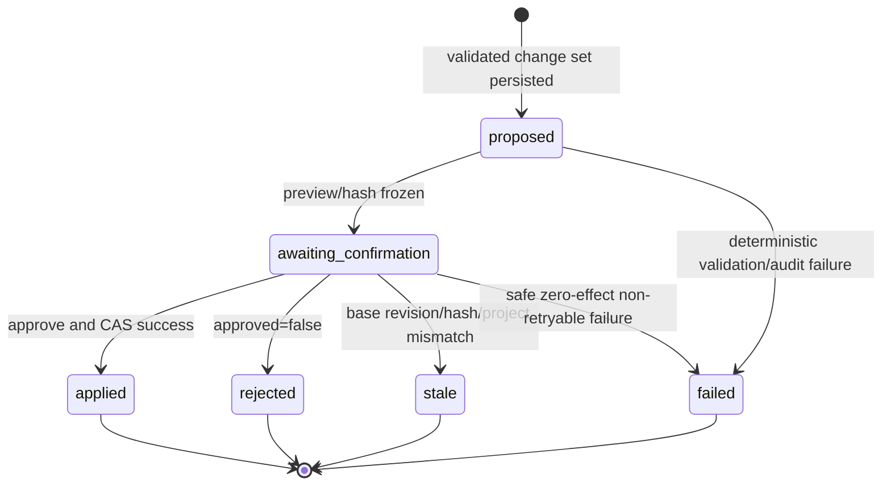
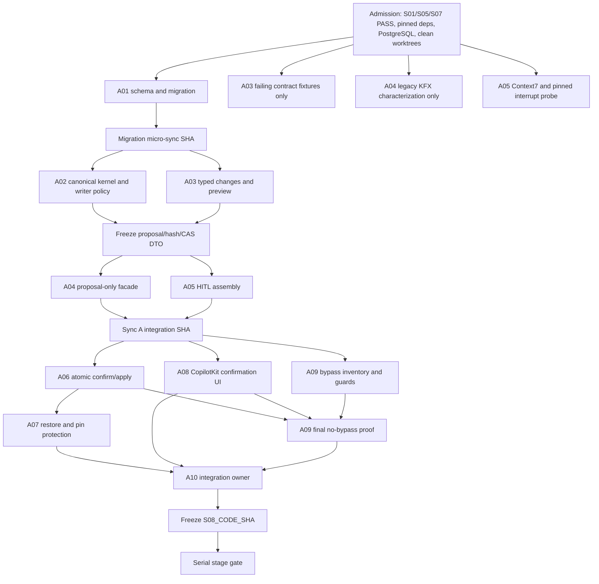
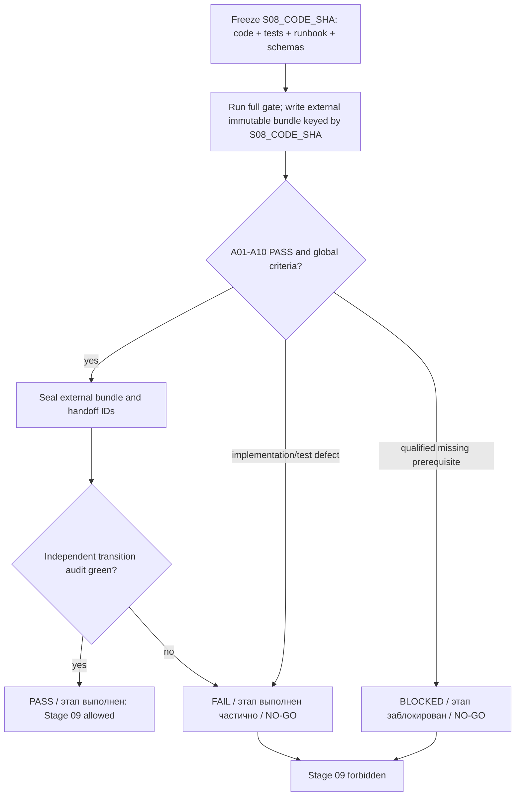

# Ketos Spatial Workspace — подробный план Этапа 08

## 1. Название и номер этапа

**Этап 08 — AI create/edit Flow с durable preview и явным одноразовым confirmation.**

> **Для agentic workers:** реализацию вести только через `superpowers:subagent-driven-development` или `superpowers:executing-plans`. Обязательны десять практических ролей `S08-A01…S08-A10`; одновременно работают 3–5 субагентов, пока существуют минимум три независимые задачи. Каждый агент получает base SHA, writable paths, forbidden paths, ожидаемый deliverable, prerequisite, focused command и обязан вернуть commit SHA с доказательством проверки.

**Цель одной строкой:** превратить AI-intent создания или изменения Flow в server-owned typed `CommandProposal`, показать пользователю bounded preview, приостановить стандартный AG-UI/LangGraph run, а после явного approve/reject выполнить ровно один server-side CAS effect либо доказуемый zero-effect outcome.

**Архитектура:** Chat из Этапа 05 остаётся единственным новым UI/transport path; KFX `AgentComponent` и его внутренний LangGraph остаются единственным agent runtime. AI получает только proposal-only allowlist. Browser показывает server-produced preview и отправляет только решение; изменение `Flow` выполняет Ketos Command Kernel в одной DB-транзакции с pinned pre-AI `FlowVersion` и terminal outcome.

**Стек:** Python/FastAPI, SQLModel/SQLAlchemy/Alembic, SQLite и PostgreSQL migration gates, KFX Flow Builder pure functions и registered component schemas, LangGraph `interrupt(...)`/`Command(resume=...)`, стандартный AG-UI interrupt outcome/`RunAgentInput.resume[]`, CopilotKit React v2 `useInterrupt`, React/TypeScript, TanStack Query, pytest, Jest и один Chromium Playwright story.

**Нормативный внутренний gate:** только `PASS`, `FAIL`, `BLOCKED`. Пользовательский итоговый статус формулируется только как «этап выполнен», «этап выполнен частично» или «этап заблокирован» по mapping §15. Переход к Этапу 09 разрешён только после `PASS` всего этапа на одном exact SHA.

---

## 2. Контекст

### 2.1. Входной продуктовый контекст

Этап 08 начинается только после доказанных результатов предыдущих этапов:

- Этап 01 закрепил pinned CopilotKit Runtime v2 → `HttpAgent` → authenticated FastAPI → `ag-ui-langgraph` contract и executable interrupt/resume fixture;
- Этап 05 создал durable `ChatThread`/`ChatRun`/`MessageTable`, stock CopilotKit Chat и production AG-UI endpoint;
- Этап 06 сохранил единственный канонический fullscreen Flow Editor; embedded editable editor не входит в этот этап;
- Этап 07 доказал Flow execution через существующий `Job`; execution/result logic не повторяется здесь.

Реальный restart и восстановление pending interrupt принадлежат Этапу 09. Этап 08 обязан передать для него exact persistent IDs и physical checkpoint path, но не подменять restart proof app-factory reload.

### 2.2. Проверенная исходная реальность текущего checkout

План подготовлен против `main@5fe1cb74fe8b2db8b48f66859cfbf72e56cf3782`; при фактическом старте реализации coordinator обязан заново зафиксировать SHA после `PASS` Этапа 07. Текущий исходник показывает:

- `src/backend/base/ketos/services/database/models/flow/model.py`: `Flow` пока не имеет `revision` и content hash;
- `src/backend/base/ketos/services/database/models/flow_version/model.py`: `FlowVersion` хранит data/version number, но не source revision/hash и не protected Command pin;
- `src/backend/base/ketos/services/database/models/flow_version/crud.py`: pruning защищает deployed snapshots, но не pre-AI snapshots;
- `src/backend/base/ketos/api/v1/flows_helpers.py`: `_new_flow`, `_update_existing_flow`, `_patch_flow` пишут ORM state без `Flow.revision` CAS;
- `src/backend/base/ketos/api/v1/flow_version.py`: `activate_version` заменяет `flow.data` без revision predicate;
- `src/backend/base/ketos/agentic/utils/assistant_runner.py`: legacy headless path создаёт Flow до confirmation, включает `apply_edits_immediately=True`, коммитит `flow.data` и затем пишет filesystem mirror;
- `src/backend/base/ketos/agentic/utils/flow_component.py`: отдельный helper напрямую коммитит `db_flow.data`;
- `src/backend/base/ketos/agentic/services/assistant_service.py`: transient `flow_proposal_ready` не является durable proposal;
- `src/kfx/src/kfx/mcp/flow_builder_tools/{mutate_tools.py,edit_tools.py,run_tools.py,_state.py}`: публичные KFX tools меняют request-local working Flow и emit legacy `flow_update`; их class names/default semantics являются compatibility surface;
- `src/frontend/src/components/core/assistantPanel/hooks/use-assistant-chat.ts`: legacy `skipAll`, `auto_apply`, incremental `applyFlowUpdate` и повторное применение proposal дают browser mutation authority;
- `src/frontend/src/components/core/assistantPanel/helpers/apply-flow-update.ts` и `assistant-flow-edit-card.tsx`: напрямую меняют `useFlowStore`;
- Stage-01/05 frontend paths (`ChatPlacement`, CopilotKit provider, `useInterrupt`) отсутствуют в историческом baseline и должны существовать в stage-base после предыдущих `PASS`; их API нельзя угадывать из памяти.

Эти legacy paths не удаляются и не переписываются в общий продуктовый refactor. Этап вводит отдельный новый AG-UI path и source guards, не позволяющие ему импортировать legacy mutation helpers.

### 2.3. Жёсткая граница scope

Входит:

- AI create Flow в явно выбранном Project;
- AI edit существующего owned Flow;
- 0–5 уточнений только при существенной неоднозначности;
- typed allowlist, deterministic validation, structured preview и hashes;
- durable `CommandProposal` и bounded audit;
- standard AG-UI interrupt/resume и one-use server confirmation;
- stale/replay/concurrent-approve protection;
- pinned pre-AI snapshot и минимальная owner-only restore operation;
- exact KFX/LFX compatibility proof.

Не входит:

- embedded Flow Editor, editor lease, navigation redesign, scheduler или BoardRelation;
- запуск Flow, Result Placement и Job recovery;
- generic `CommandExecution`, outbox, command bus, compensation engine или arbitrary Project/Board/Chat/Note commands;
- custom SSE/WebSocket/interrupt/resume event;
- filesystem, arbitrary Python, component registry mutation, MCP configuration, model/provider configuration или secret mutation;
- process-restart proof, event store, CRDT/OT, multiworker lease/fencing или HA;
- изменение KFX persisted component class names, graph identifiers, public tool defaults или extension manifests.

### 2.4. Обязательные инструменты

Каждая реализационная lane использует все релевантные доступные средства, честно фиксируя факт применения:

- `rg`/`rg --files` и authoritative source для writer/path inventory;
- Graphify только read-only query/path/explain для навигации; snapshot не заменяет source/runtime;
- Context7 и official docs для dependency-sensitive contracts;
- `git status`, exact base/Sync/`S08_CODE_SHA`, range diff и forbidden-path scan;
- Alembic, SQLite и disposable PostgreSQL;
- pytest, isolated/frozen KFX pytest, LFX compatibility, Jest, TypeScript, i18n и Playwright;
- RaytSystem только `doctor/status/graph status/lint` read-only; stale RaytSystem graph записывается как diagnostic fact, не чинится прямым редактированием stores и не заменяет Graphify.

Внешнее MCP execution, notifications, network exposure и RaytSystem promotion остаются выключенными.

---

## 3. Цель

### 3.1. Канонический пользовательский путь

1. Пользователь в stock Chat просит создать Flow в текущем Project либо изменить выбранный Automation/Flow.
2. Agent задаёт от нуля до пяти уточняющих вопросов только если без ответа нельзя выбрать target, component, required parameter или connection semantics.
3. Proposal-only tools строят `FlowChangeSetV1` на копии server-loaded Flow либо на новом empty Flow; production Flow ещё не меняется.
4. Ketos server валидирует allowlist и KFX schemas/ports/types, формирует deterministic target Flow, structured preview, result hash, base revision/hash и durable `CommandProposal`.
5. LangGraph emit state/messages snapshots и стандартный `RUN_FINISHED` с `outcome.type="interrupt"`, `reason="confirmation"`, `interruptId`, response schema и Ketos metadata discriminator.
6. CopilotKit `useInterrupt` показывает каждый открытый preview внутри stock Chat.
7. Approve отправляет только `resolve({approved:true})`; reject — только `resolve({approved:false})`; close/Escape/cancel означает abandonment, а не rejection.
8. Новый run использует тот же `threadId`, новый `runId` и responses для всех open interrupts.
9. Server повторно загружает proposal по ID/hash, повторно authorizes actor/Project/Flow, проверяет base revision/hash и разрешает proposal ровно один раз.
10. Approve создаёт один Flow либо один pre-AI snapshot и один Flow CAS; reject, stale, replay и invalid resume не меняют Flow.
11. После successful edit пользователь может одной owner-only операцией восстановить последний pre-AI snapshot; restore также использует revision/hash CAS и durable audit.

### 3.2. Измеримый итог

На frozen `S08_CODE_SHA` browser story доказывает:

- create approve → ровно один Flow в заданном Project;
- create reject → ноль Flow;
- edit preview до mutation;
- edit approve → `revision + 1`, новый expected hash, один pinned snapshot;
- edit reject → прежние revision/hash и ноль snapshot;
- manual edit между preview/approve → proposal `stale`, zero AI effect;
- повтор и concurrent resolution → один effect максимум;
- restore → один обратный CAS effect с новым revision и audit;
- frontend resume содержит decision, но не Flow patch/payload;
- legacy Flow Editor/API/KFX/LFX продолжают работать.

---

## 4. Подробное техническое задание

### 4.1. Durable модель `CommandProposal`

Создать table-backed модель со следующими полями и типами:

| Поле | Контракт |
| --- | --- |
| `id` | server-generated UUID, primary key |
| `actor_id` | non-null FK `user.id`; только authenticated server identity |
| `project_id` | non-null FK `folder.id`; strict owner Project scope |
| `source_kind` | server-owned enum `ai_run` или `server_restore`; client/LLM не может выбирать source |
| `chat_run_id` | non-null FK `chat_run.id`, `ON DELETE RESTRICT`; для AI proposal берётся из authenticated AG-UI run, для restore наследуется от source proposal |
| `thread_id` | non-null durable string; canonical `str(chat_id)` из связанного ChatThread либо exact versioned server-derived mapping, зафиксированный Stage-05 handoff; никогда не client-writable |
| `interrupt_id` | durable standard AG-UI interrupt correlation; phase-aware nullable contract задаётся DB checks ниже |
| `interrupt_bound_at` | timezone-aware server timestamp/confirmation phase marker; null до фактической привязки interrupt, устанавливается атомарно с `interrupt_id` и `awaiting_confirmation`, после чего immutable |
| `source_proposal_id` | null для `ai_run`; non-null self-FK `command_proposal.id`, `ON DELETE RESTRICT`, для `server_restore` |
| `flow_id` | UUID; для create резервируется server-side до insert Flow, для edit указывает существующий Flow |
| `command_type` | enum из `create_flow`, `add_node`, `remove_node`, `set_parameter`, `connect_nodes`, `disconnect_nodes`, `replace_flow` |
| `canonical_payload` | JSON `FlowChangeSetV1`, validated и size-bounded |
| `preview` | redacted structured JSON, без secrets/raw HTML |
| `proposal_hash` | 64-char lower-case SHA-256 hex |
| `base_flow_revision` | nullable только для create; non-negative integer для edit/restore |
| `base_flow_hash` | nullable только для create; 64-char SHA-256 для edit/restore |
| `result_flow_hash` | non-null 64-char SHA-256 target content hash |
| `idempotency_key` | non-empty max 128 chars |
| `request_fingerprint` | SHA-256 canonical request fingerprint |
| `status` | `proposed`, `awaiting_confirmation`, `applied`, `rejected`, `stale`, `failed` |
| `pinned_flow_version_id` | nullable FK `flow_version.id`, `ON DELETE RESTRICT`; set only for successful edit/restore lifecycle |
| `request_id` | server request UUID/string, max 128 |
| `sequence` | positive monotonically assigned server-side command sequence within `chat_run_id` |
| `duration_ms` | nullable non-negative integer |
| `outcome` | nullable bounded JSON with terminal reason and before/after revision/hash |
| `redacted_audit` | bounded JSON; no canonical payload values marked secret |
| `created_at`, `resolved_at` | timezone-aware; `resolved_at` null only before terminal resolution |

DB constraints и indexes:

- unique `(chat_run_id, idempotency_key)` для scoped concurrent idempotency claim; `(actor_id,project_id,idempotency_key)` остаётся non-unique audit index и не создаёт ложных cross-run conflicts;
- mandatory unique constraint/index `(chat_run_id, sequence)`; sequence allocation использует insert-with-bounded-retry только на этот exact unique conflict, не `max()+1` без защиты;
- unique `(chat_run_id, interrupt_id)` и indexes `chat_run_id`, `interrupt_id`, `(chat_run_id,status)` для recovery lookup; nullable pre-interrupt/restore ID не считается AG-UI correlation;
- checks for enums, positive sequence, non-negative revision/duration, 64-char hashes, conditional create/edit base fields и conditional source fields;
- для всех rows `(interrupt_id IS NULL) = (interrupt_bound_at IS NULL)`; half-bound state запрещён;
- `source_kind=ai_run,status=proposed`: `interrupt_id` и `interrupt_bound_at` оба null;
- `source_kind=ai_run,status=failed`: допускается ровно одна из двух фаз — pre-interrupt оба null либо post-interrupt оба non-null; mixed pair запрещён;
- `source_kind=ai_run,status IN (awaiting_confirmation,applied,rejected,stale)`: `interrupt_id` и `interrupt_bound_at` non-null;
- после non-null binding оба поля immutable и сохраняются без изменения во всех post-interrupt terminal outcomes, включая `failed`;
- `source_kind=server_restore`: `source_proposal_id/chat_run_id/thread_id` non-null, `interrupt_id` и `interrupt_bound_at` null, source proposal terminal `applied` и имеет applicable pin;
- `flow_id` всегда задан: create резервирует UUID в proposal и insert использует его же;
- `actor_id`, `project_id`, `chat_run_id`, `thread_id`, `interrupt_id`, `interrupt_bound_at`, `source_kind`, `source_proposal_id`, `flow_id`, revision/hash, sequence и status из body/LLM игнорируются либо rejected; authoritative values формирует server;
- `Flow.revision` добавляется только в ORM/table и read DTO, но не в `_UPDATABLE_FLOW_FIELDS` и не становится client-writable field.

Shape/phase обеспечивается named CHECK `ck_command_proposal_interrupt_phase`. Историческая immutability обеспечивается DB-level trigger `trg_command_proposal_interrupt_immutable`: PostgreSQL использует null-safe `OLD ... IS DISTINCT FROM NEW ...`, SQLite — `OLD ... IS NOT NEW ...`; если `OLD.interrupt_bound_at IS NOT NULL`, изменение или очистка любого из двух fields abort-ит transaction. Migration создаёт/удаляет dialect-specific trigger на upgrade/downgrade, а service CAS дополнительно не включает bound fields в terminal update set.

`FlowVersion` получает `source_flow_revision` и `source_flow_hash`, чтобы pre-AI snapshot имел проверяемую provenance. `CommandProposal.pinned_flow_version_id` — единственная связь pin; circular FK не создаётся. Prune/delete queries обязаны исключить любой version ID, на который ссылается CommandProposal.

Migration `s08c0mmand01` создаёт FK/check/unique/index/phase contract выше и model-parity assertions для обоих dialects. Таблица новая, поэтому фиктивный backfill/orphan row запрещён. Input DTO не содержит server-owned correlation/source fields; internal/read DTO и evidence DTO содержат `sourceKind`, `chatRunId`, `threadId`, `interruptId`, `interruptBoundAt`, `sourceProposalId`, `sequence` в redacted bounded форме.

### 4.1.1. Source, recovery и authorization contract

AI proposal не может быть orphan record. Перед insert server загружает authenticated `ChatRun`, затем `ChatThread`, затем parent `Folder`; authorization и recovery всегда идут по цепочке `CommandProposal → ChatRun → ChatThread → Folder`. Denormalized `actor_id/project_id` являются audit/CAS fields, но не заменяют join-chain authorization. Несовпадение project/actor с canonical chain даёт deny/stale zero-effect outcome.

Canonical `thread_id` равен `str(chat_id)` связанного ChatThread. Если Stage-05 signed contract уже использует derived thread ID, A02 вызывает ровно ту же versioned server function, сохраняет её результат и golden vector; произвольный alternate/client thread ID запрещён. A05 одной conditional transaction переводит `proposed → awaiting_confirmation`, одновременно сохраняя actual standard AG-UI `interrupt_id`, `interrupt_bound_at=server_now` и final frozen proposal hash; standard interrupt outcome и resume entry используют ровно этот ID. Ошибка до transaction даёт pre-interrupt `failed` с обоими null; ошибка после binding даёт post-interrupt `failed` с обоими исходными значениями сохранёнными.

`server_restore` не создаёт orphan proposal: он разрешён только от owner-authenticated terminal `ai_run` proposal со snapshot pin, сохраняет `source_proposal_id`, наследует его `chat_run_id` и canonical `thread_id`, получает следующий уникальный sequence и повторно проходит recovery auth chain. Restore не притворяется AG-UI interrupt, поэтому `interrupt_id=null`; origin interrupt остаётся доступен через source proposal. Direct restore без source proposal/ChatRun/ChatThread/Folder lineage отклоняется до записи.

### 4.2. Typed allowlist `FlowChangeSetV1`

Canonical payload имеет форму:

```json
{
  "schemaVersion": 1,
  "targetProjectId": "server-validated UUID",
  "targetFlowId": "server-reserved or existing UUID",
  "operations": []
}
```

`operations` — discriminated union только из семи вариантов:

| Операция | Минимальный payload | Проверки |
| --- | --- | --- |
| `create_flow` | `name`, optional `description`, complete `nodes`, `edges` | только первая и единственная root operation; explicit Project; Flow ещё не существует |
| `add_node` | stable proposal-local node ID, registered `componentType`, initial parameters | component существует в user-aware read-only KFX registry; input schema valid |
| `remove_node` | `nodeId` | node существует; incident edges удаляются детерминированно и перечисляются в preview |
| `set_parameter` | `nodeId`, `parameter`, typed `value` | field существует, value проходит KFX schema; secret/provider/model/MCP/filesystem fields deny |
| `connect_nodes` | source node/output и target node/input | nodes/ports существуют; KFX type compatibility; duplicate edge idempotent |
| `disconnect_nodes` | structural edge identity | ровно одна существующая edge совпадает |
| `replace_flow` | complete `nodes`, `edges` | не JSON escape hatch: каждый node/field/port/edge проходит те же KFX validations |

Mixed edit допустим как ordered operations list. `command_type` равен единственному operation type для homogeneous proposal; mixed edit сохраняется как `replace_flow`, а payload содержит validated source operations и полный deterministic target graph. Создание всегда `create_flow`.

Exact bounds:

- не более 128 operations;
- canonical payload ≤ 1,048,576 UTF-8 bytes;
- preview ≤ 65,536 UTF-8 bytes;
- отдельная string value ≤ 16,384 UTF-8 bytes;
- `nodes`/`edges` проходят существующие KFX/Flow structural validators;
- NaN/Infinity, duplicate node IDs, dangling edges, unknown fields/components/ports и executable/raw code rejected до durable `awaiting_confirmation`.

Запрещены operations над Project, Board, Placement, Note, Chat, Job, filesystem, Python, MCP registry, provider/model routing, API keys, credentials и extension manifests.

### 4.3. Canonicalization и hashes

Новая `services/commands/canonical.py` реализует один versioned algorithm:

```text
UTF-8 JSON
sort_keys=true
separators=(",", ":")
ensure_ascii=false
allow_nan=false
UUID/datetime/enum -> canonical strings
no whitespace, no lossy field filtering
SHA-256 lower-case hex
```

Нельзя переиспользовать `services/session/utils.py::compute_dict_hash()`: его filtering semantics не являются exact Command hash contract.

`flow_content_hash` вычисляется над exact object `{name, description, data}`. Поэтому manual rename, description change или graph mutation делает pending proposal stale. `proposal_hash` связывает:

```text
schemaVersion
source_kind
chat_run_id
thread_id
interrupt_id
interrupt_bound = (interrupt_bound_at is not null)
source_proposal_id
sequence
actor_id
project_id
flow_id
command_type
canonical_payload
base_flow_revision
base_flow_hash
result_flow_hash
redacted preview summary
```

`interrupt_bound_at` timestamp не включается в hash как wall-clock value; hash включает deterministic phase bit `interrupt_bound`. Pre-interrupt proposed/failed hash содержит `interrupt_id=null,interrupt_bound=false`; atomic bind пересчитывает и замораживает confirmation hash с actual ID и `interrupt_bound=true`. Server принимает от browser только proposal ID, standard interrupt correlation и boolean decision; browser не пересылает `chat_run_id`, `thread_id`, sequence, source/phase fields, canonical payload или hash как authority. При resume server заново читает durable row, проходит `CommandProposal → ChatRun → ChatThread → Folder`, сверяет persisted `interrupt_id` и recompute-ит frozen confirmation hash.

### 4.4. Structured preview

Preview содержит только:

- `proposalId`, `proposalHash`, `commandType`;
- Flow name/id и Project id;
- before: revision/hash/node count/edge count;
- after: result hash/node count/edge count;
- ordered summaries added/removed/changed nodes/edges/parameters;
- warnings и explicit risk label;
- `canRestore` для edit, false для create.

Preview не содержит secrets, API keys, hidden credential values, arbitrary HTML или unbounded raw Flow JSON. KFX field metadata определяет redaction; дополнительно deny names matching credential/auth/token/password/key/secret. Renderer использует text/semantic UI primitives и не исполняет Markdown/HTML из payload.

### 4.5. Proposal lifecycle



Lifecycle edges имеют phase semantics: `proposed → failed` — pre-interrupt failure с `interrupt_id=NULL,interrupt_bound_at=NULL`; `awaiting_confirmation → failed` — post-interrupt failure, которая сохраняет уже bound ID/timestamp. Прямой terminal update, очищающий или заменяющий bound correlation, отклоняется DB/service guards.

`cancel()`/Escape/close не переводит proposal в `rejected`: это abandonment. Durable row остаётся `awaiting_confirmation` и передаётся Этапу 09 для reconnect semantics. Новый input на thread с open interrupts запрещён стандартным AG-UI contract.

### 4.6. Create и edit contracts

**Create:** server validates explicit current `targetProjectId`, strict owner `Folder`, reserves `flow_id`, строит Flow на копии, но не вставляет `Flow` до approve. Reject/stale/replay оставляют zero Flow. Approve вставляет ровно один DB-backed Flow с `revision=1`, `folder_id=project_id`, authenticated `user_id`, `fs_path=None`; name deduplication и validation используют существующий safe Flow creation contract внутри той же transaction без independent commit.

**Edit:** Flow обязан существовать, принадлежать actor и тому же Project, иметь `fs_path=None`; server сохраняет `base_flow_revision` и hash exact `{name,description,data}`. Apply повторно проверяет owner/project/revision/hash, создаёт pinned snapshot и делает conditional update.

Для MVP AI-path fail closed отклоняет `Flow.fs_path IS NOT NULL` с typed `unsupported_storage_mode` до `awaiting_confirmation`: DB и filesystem mirror не являются одной atomic boundary, а generic outbox запрещён scope. Manual existing Flow path не меняется. Это устраняет ложную atomicity без расширения этапа.

### 4.7. Flow revision invalidation policy

До открытия confirmation UI A02 выполняет полный writer inventory. Все proposal-relevant successful mutations обязаны увеличить `Flow.revision` и обновить content hash фактом данных, включая:

- `_update_existing_flow` и `_patch_flow` в `api/v1/flows_helpers.py`;
- `activate_version` в `api/v1/flow_version.py`;
- legacy `assistant_runner.py` и `agentic/utils/flow_component.py` direct writes;
- иные найденные `Flow.data =`, `_apply_update_data`, SQL `UPDATE Flow` paths.

Revision не добавляется в client allowlist. Даже если один legacy writer будет пропущен, apply всё равно сравнивает canonical content hash и fail closed; writer inventory test не позволяет считать hash fallback заменой исправлению известных paths.

### 4.8. Standard AG-UI/LangGraph confirmation

Dependency contract фиксирован так:

- LangGraph node вызывает `interrupt(...)`; checkpointer и canonical `thread_id=str(chat_id)` либо exact Stage-05 server-derived mapping берутся только из authenticated ChatRun/ChatThread assembly;
- actual standard `interrupt_id`, `interrupt_bound_at` и transition в `awaiting_confirmation` сохраняются атомарно; `RUN_FINISHED.outcome.interrupts[]`, resume entry и recovery lookup используют идентичное persisted значение, post-bind update не может их заменить/очистить;
- node после resume запускается с начала, поэтому код до interrupt только pure/idempotent: load/recompute/ensure proposal возвращают тот же durable proposal по idempotency/fingerprint;
- state/messages snapshots emit до `RUN_FINISHED { outcome: { type: "interrupt", interrupts: [...] } }`;
- core `reason="confirmation"`;
- `responseSchema` требует object с единственным required boolean `approved`, `additionalProperties=false`;
- metadata discriminator: `metadata.ketos.kind="flow_command_confirmation"`, `proposalId`, `proposalHash`, `commandType`; canonical patch отсутствует;
- resume использует тот же `threadId`, новый `runId` и один `resume[]` entry на каждый open interrupt;
- partial, unknown, expired, schema-invalid resume или input без responses для open interrupts emit standard `RUN_ERROR`;
- `forwarded_props.command.resume`, legacy `on_interrupt` CustomEvent и custom confirmation event запрещены.

Business stale — валидный resume, после которого kernel фиксирует proposal `stale` и сообщает zero-effect outcome; protocol-invalid resume — `RUN_ERROR` без изменения proposal/Flow.

### 4.9. One-use atomic resolution и CAS

A06 сначала сопоставляет resume с persisted `(chat_run_id,thread_id,interrupt_id)` и повторно authorizes `CommandProposal → ChatRun → ChatThread → Folder`. Затем использует одну outer DB transaction и helpers без внутренних `commit()`:

1. Conditional claim:

   ```sql
   UPDATE command_proposal
   SET resolved_at = :claim_time
   WHERE id = :proposal_id
     AND chat_run_id = :chat_run_id
     AND interrupt_id = :interrupt_id
     AND actor_id = :actor_id
     AND status = 'awaiting_confirmation'
     AND resolved_at IS NULL
   ```

   `rowcount=1` — единственный resolver; `rowcount=0` читает существующий terminal status и возвращает replay/consumed zero effect.
2. Reject меняет status на `rejected`, пишет bounded outcome и не создаёт Flow/FlowVersion.
3. Approve повторно загружает Project/Flow, authorizes server actor через canonical recovery chain, проверяет project/base revision/base hash/proposal hash и неизменность source/run/thread/interrupt/sequence hash fields.
4. При mismatch status становится `stale`; Flow/FlowVersion не меняются.
5. Edit применяет nested savepoint: создать pinned pre-AI `FlowVersion`, затем:

   ```sql
   UPDATE flow
   SET name = :name,
       description = :description,
       data = :data,
       revision = revision + 1,
       updated_at = :now
   WHERE id = :flow_id
     AND user_id = :actor_id
     AND folder_id = :project_id
     AND revision = :base_revision
   ```

   `rowcount` обязан быть 1. При 0 savepoint откатывает snapshot, outer transaction фиксирует `stale`.
6. Create вставляет reserved Flow ID ровно один раз; PK/unique conflict переводится в stale/conflict zero-effect outcome.
7. Success записывает `pinned_flow_version_id`, `status=applied`, before/after revision/hash, duration и redacted audit в той же transaction.
8. Commit делает видимыми Flow, snapshot и terminal proposal одновременно.

Две разные proposals с одной base revision дают one applied + one stale. Два concurrent approve одного proposal дают one effect + one consumed replay. Любая rollback boundary оставляет либо полный before state, либо полный after state.

### 4.10. Restore contract

`POST /api/v1/command-proposals/{proposal_id}/restore` принимает только `idempotency_key` и `expected_flow_revision`. Current user и scope server-derived; route сначала проходит recovery auth chain исходного proposal. Endpoint:

- доступен только owner исходного applied proposal/Flow;
- требует latest applicable pre-AI pin; arbitrary version activation не маскируется под restore;
- создаёт `source_kind=server_restore` `replace_flow` proposal с canonical payload `source="pre_ai_snapshot"`, non-null `source_proposal_id`, inherited `chat_run_id/thread_id`, новым sequence и ссылкой на source version; orphan restore запрещён;
- explicit restore click является отдельным confirmation action, но mutation выполняет тот же Command Kernel, не browser;
- same idempotency/fingerprint replay возвращает existing result; changed fingerprint — `409`;
- current revision/hash mismatch → `stale`, zero writes;
- success создаёт snapshot текущего state, CAS-восстанавливает target data, увеличивает revision один раз и пишет before/after audit.

React Query retry для restore либо выключен, либо безопасен благодаря server idempotency; предпочтительно `retry:false`, чтобы UI не скрывал network uncertainty.

### 4.11. KFX ABI и legacy isolation

Proposal facade создаётся в Ketos backend поверх pure KFX Flow Builder/registry functions. В `src/kfx/src/kfx/mcp/flow_builder_tools` production source не меняется. Имена `AddComponent`, `RemoveComponent`, `ConnectComponents`, `ConfigureComponent`, `ProposeFieldEdit`, `BuildFlowFromSpec`, `RunFlow`, `GenerateComponent`, их class `name`, outputs и default behavior остаются byte-for-byte в base→candidate diff.

Новый AG-UI toolkit не включает mutating public KFX tools, `RunFlow`, filesystem write/edit, component generation, model/provider/MCP tools. Разрешены read-only search/describe operations и Ketos proposal-only functions, которые работают на copy и заканчиваются durable proposal.

Legacy AssistantPanel, SSE parser и MCP assistant сохраняются только как isolated compatibility surfaces. Они не импортируются Board Chat/FlowCommandConfirmation и не являются transaction boundary.

### 4.12. Dependency admission

Перед кодом каждый dependency-sensitive owner выполняет отдельный Context7 query и сверяет official docs:

| Owner | Context7 | Проверяемый contract | Official source |
| --- | --- | --- | --- |
| A05 | `/ag-ui-protocol/ag-ui` | `RUN_FINISHED.outcome.interrupts`, all-open resume, errors, `confirmation` | `https://docs.ag-ui.com/concepts/interrupts` |
| A05 | `/langchain-ai/langgraph` | `interrupt`, `Command(resume)`, same thread, node replay, idempotency | `https://docs.langchain.com/oss/python/langgraph/interrupts` |
| A08 | `/copilotkit/copilotkit` | exact pinned `/v2` `useInterrupt` import, `enabled`, `renderInChat`, `resolve`/cancel semantics | `https://docs.copilotkit.ai/` и exact Stage-01 fixture |
| A01 | Context7-resolved Alembic/SQLAlchemy IDs | additive migration, conditional update/rowcount on SQLite/PostgreSQL | `https://alembic.sqlalchemy.org/` и `https://docs.sqlalchemy.org/` |

Handoff сохраняет library ID, exact installed version/commit, query date, confirmed API and fixture/test path. Если Context7 недоступен, dependency-sensitive change не начинается; task и stage получают `BLOCKED`. Stage 08 не меняет package manifests или lock files: нужные dependencies уже должны быть pinned Этапом 01.

---

## 5. Перечень задач

### 5.1. Матрица субагентов S08-A01…A10

| ID / роль | Практический deliverable | Exact writable paths | Focused verification |
| --- | --- | --- | --- |
| `S08-A01` — schema/migration owner | `Flow.revision`, durable CommandProposal включая source/chat-run/thread/interrupt/bound-phase/sequence lineage, phase CHECK + dialect immutability trigger, FlowVersion provenance/pin FK, additive migration, model registrar | `src/backend/base/ketos/services/database/models/flow/model.py`; `src/backend/base/ketos/services/database/models/flow_version/model.py`; `src/backend/base/ketos/services/database/models/command_proposal/{__init__.py,model.py,crud.py}`; `src/backend/base/ketos/services/database/models/__init__.py`; `src/backend/base/ketos/alembic/versions/s08c0mmand01_add_flow_revision_and_command_proposal.py`; `src/backend/tests/unit/alembic/test_mvp_command_proposal_migration.py` | SQLite/PostgreSQL upgrade/downgrade/model parity; pre/post-failed checks and trigger immutability, ChatRun FK/source checks, unique/index `(chat_run_id,sequence)`; one head |
| `S08-A02` — canonical kernel/ownership owner | canonical JSON/hash и DTOs с correlation/phase fields, DB-unique proposal/idempotency/sequence claim, recovery auth `CommandProposal→ChatRun→ChatThread→Folder`, actor/Project/Flow binding, writer inventory/revision invalidation | `src/backend/base/ketos/services/commands/{__init__.py,canonical.py,contracts.py,exceptions.py,service.py,proposal_service.py,flow_revision.py}`; `src/backend/base/ketos/api/v1/flows_helpers.py`; `src/backend/base/ketos/api/v1/flow_version.py`; `src/backend/base/ketos/agentic/utils/{assistant_runner.py,flow_component.py}`; `src/backend/tests/unit/services/commands/{test_canonical.py,test_proposal_service.py,test_interrupt_phase.py,test_recovery_auth.py,test_flow_revision_writers.py}` | pre-interrupt failed null pair и post-interrupt failed preserved pair; same key/fingerprint replay; concurrent idempotency one row; forged phase/correlation/actor/scope ignored |
| `S08-A03` — typed diff/validation owner | pure apply-to-copy and structured redacted preview for exact seven-operation allowlist | `src/backend/base/ketos/services/commands/flow_changes.py`; `src/backend/tests/unit/services/commands/test_flow_changes.py` | unknown component/parameter/port/edge/code denied; preview result hash equals simulated target |
| `S08-A04` — proposal-only toolkit owner | Ketos-side read/propose facade using KFX schemas without changing public KFX components | `src/backend/base/ketos/agentic/services/flow_proposal_adapter.py`; `src/backend/base/ketos/agentic/tools/{__init__.py,flow_proposal_tools.py}`; `src/backend/tests/unit/agentic/flows/test_flow_builder_proposal_tools.py` | create/edit toolkit produces proposal only and zero Flow writes; explicit Project honored; existing KFX tests green |
| `S08-A05` — LangGraph HITL owner | dedicated Stage-05 agent assembly: authenticated ChatRun/ChatThread → atomic persisted canonical thread/interrupt/bound-at correlation → clarify → propose → standard interrupt → resume | `src/backend/base/ketos/agentic/flows/flow_builder_hitl.py`; Stage-05-created `src/backend/base/ketos/agentic/api/ag_ui_router.py`; `src/backend/tests/unit/agentic/flows/test_flow_builder_hitl.py`; `src/backend/tests/unit/agentic/api/test_ag_ui_flow_confirmation.py` | snapshots/order/all-open interrupts; pre-bind failure keeps null pair, post-bind failure preserves pair; persisted ID equals outcome/resume; same canonical thread/new run; invalid/foreign recovery RUN_ERROR |
| `S08-A06` — atomic apply owner | one-use claim, create/edit/reject/stale/replay transaction, Flow CAS, pinned snapshot и mandatory PostgreSQL behavioral concurrency/phase gate | `src/backend/base/ketos/services/commands/apply_service.py`; `src/backend/tests/unit/services/commands/{test_apply_service.py,test_flow_cas.py}`; `src/backend/tests/integration/commands/{conftest.py,test_postgres_command_concurrency.py}` | SQLite focused phase tests green; PostgreSQL two real connections/synchronized races prove five race/zero-write scenarios plus pre/post-interrupt failure phase; 0 skips |
| `S08-A07` — restore/pin owner | prune/delete protection, owner-only restore API, server-origin source lineage, restore CAS/audit | `src/backend/base/ketos/services/commands/restore_service.py`; `src/backend/base/ketos/services/database/models/flow_version/crud.py`; `src/backend/base/ketos/api/v1/schemas/command_proposals.py`; `src/backend/base/ketos/api/v1/command_proposals.py`; `src/backend/tests/unit/services/commands/test_restore_service.py`; `src/backend/tests/unit/api/v1/test_command_proposals.py` | pinned snapshot cannot prune/delete; restore inherits source proposal ChatRun/thread and passes Folder auth; orphan/foreign/stale/replay zero effect |
| `S08-A08` — CopilotKit UI owner | narrow side-effect-free `useInterrupt` renderer, DTO validation, restore hook | Stage-05-created `src/frontend/src/components/core/chats/{FlowCommandConfirmation.tsx,FlowCommandPreview.tsx,use-flow-command-interrupt.tsx}`; `src/frontend/src/components/core/chats/__tests__/FlowCommandConfirmation.test.tsx`; `src/frontend/src/controllers/API/queries/commands/{index.ts,types.ts,use-restore-flow-snapshot.ts}`; `src/frontend/src/types/flow/index.ts` | every open interrupt visible; approve/reject payload exact; cancel abandon; preview bounded; no patch/store mutation |
| `S08-A09` — bypass/security owner | negative guards proving new path cannot reach auto-apply/direct mutation/custom resume | `src/backend/base/ketos/agentic/services/flow_command_policy.py`; `src/backend/tests/unit/agentic/flows/test_flow_builder_no_bypass.py`; `src/frontend/src/components/core/chats/__tests__/flow-command-no-browser-apply.test.ts` | new path rejects `auto_apply`, `skipAll`, direct KFX writes, filesystem/MCP/model changes and deprecated resume; Flow hash unchanged without confirmation |
| `S08-A10` — integration/compatibility owner | registrars, Chat wiring, i18n, browser story, architecture, versioned runbook и evidence schemas/templates; actual results остаются external | `src/backend/base/ketos/api/v1/__init__.py`; `src/backend/base/ketos/agentic/api/router.py`; Stage-05-created `src/frontend/src/components/core/board/placements/ChatPlacement.tsx`; `src/frontend/src/components/core/board/placements/ChatPlacement.test.tsx`; `src/frontend/src/locales/{en.json,ru.json}`; `src/frontend/tests/core/integrations/ai-flow-preview-confirm.spec.ts`; `scripts/ci/run-stage08-gate.sh`; `docs/runbooks/STAGE_08_GATE.md`; `docs/architecture/AI_FLOW_COMMAND_KERNEL.md`; `docs/evidence/stage-08/{schemas,templates}/**` | code/runbook/schema commit frozen as `S08_CODE_SHA`; gate results only in immutable external bundle; optional metadata pointer/summary-report `S08_EVIDENCE_SHA` never called tested SHA |

### 5.2. Общие assignment-поля

Каждый assignment обязан содержать:

- `base_sha`: SHA последнего Sync barrier;
- `branch`: `codex/mvp-s08-aYY-*`;
- `worktree`: clean lane worktree, не dirty root checkout;
- `writable_paths`: только paths из матрицы;
- `forbidden_paths`: чужие lane paths, generated artifacts, deployment config, `LICENSE`, `NOTICE`, package/lock files, `src/bundles`, `.raytsystem`, `_raw`, ledger/generation stores;
- `interface_dependency`: frozen schema/DTO/fixture SHA;
- `deliverable`: production code плюс focused test или executable fixture;
- `focused_command`: точная команда и expected result;
- `handoff`: changed paths, commit SHA, command/exit code, evidence artifact, known risk;
- `status`: только один из трёх нормативных статусов.

Review-only subagent не засчитывается. A10 обязан написать реальное wiring/E2E/docs и исправить compatibility в собственном scope.

---

## 6. Подэтапы и шаги

### 6.1. Wave/Sync dependency DAG



### 6.2. Таблица каждого подэтапа

| Подэтап | Можно параллельно | Prerequisite | Output | Owner | Verification | Downstream consumer |
| --- | --- | --- | --- | --- | --- | --- |
| `P0 Admission` | source inventory, Graphify query, Context7 probes, PostgreSQL smoke | Stage 01/05/07 reports и exact stage-base SHA | admission record, clean integration/lane worktrees, pinned versions, `MVP_POSTGRES_URI` proof | coordinator + independent reviewers | exact commands §12.2; no writes to product source | все A01–A10 |
| `S08-A01` | A03 test fixtures, A04 legacy characterization, A05 docs/probe | P0 | migration/model commit с ChatRun/source/interrupt lineage и micro-sync SHA | schema owner | migration focused test on both dialects, FK/check/unique/index parity | A02, A03, freeze |
| `S08-A02` | A03 | A01 micro-sync | canonical/idempotency/sequence/recovery-auth/revision contract | kernel owner | commands unit tests, concurrent claim и forged correlation denial | A04, A05, A06 |
| `S08-A03` | A02 | A01 micro-sync | pure validated target Flow, preview/result hash | validation owner | `test_flow_changes.py` | A04, A05, A06, A08 |
| `Contract freeze` | нет shared-file writes | A02+A03 PASS | exact JSON schemas, status enum, hash vectors, interrupt metadata fixture | coordinator | fixture consumer tests compile/pass | A04, A05, A08 |
| `S08-A04` | A05 | contract freeze | proposal-only toolkit, zero production writes | KFX adapter owner | proposal tool test + KFX characterization | Sync A, A05/A09 |
| `S08-A05` | A04 | contract freeze + pinned Stage-01/05 ChatRun fixture | standard HITL assembly, canonical thread mapping и durable interrupt correlation | agentic owner | HITL/AG-UI/recovery-chain tests | Sync A, A08, A10 |
| `Sync A` | merge review may run independently | A04+A05 PASS | sequential merge `A01→A02→A03→A04→A05`, focused green SHA | coordinator | backend focused pack + forbidden diff | A06–A09 |
| `S08-A06` | A08, A09 inventory | Sync A | one-use transaction/CAS implementation и committed SQLite/PostgreSQL behavioral harness | apply owner | development focused run; closure proof откладывается до external gate на frozen `S08_CODE_SHA` | A07, A09 final, A10 |
| `S08-A07` | A08, A09 final after A06 micro-sync | A06 apply contract | pin protection and non-orphan server-restore lineage | restore owner | restore/prune/API/recovery-auth tests | A10, Stage 09 |
| `S08-A08` | A06, A09 inventory | Sync A + exact pinned `useInterrupt` API | stock Chat confirmation renderer | frontend owner | Jest/typecheck; no-browser apply | A09 final, A10 |
| `S08-A09` | inventory parallel A06/A08; final proof after both | Sync A, then A06+A08 | backend/frontend negative source/runtime guards | security owner | negative tests and `rg` zero-match proof | A10 |
| `S08-A10` | независимый review, но heavy commands serial | A07+A08+A09 implementation ready | registrars, Chat wiring, locales, Playwright story code, runbook и evidence schemas/templates | integration owner | fixture/type/schema dry validation без actual closure result в repo | Sync B |
| `Sync B` | только read-only reviews | A10 code/runbook/schema deliverables merged | immutable `S08_CODE_SHA` containing code, tests, runbook and evidence schemas/templates but no actual gate results | coordinator | clean-tree/path/schema validation before external gate | external evidence run and control transition |

### 6.3. Пошаговый цикл каждой A-задачи

1. Из текущего Sync SHA создать/очистить lane branch и записать `git status --short`.
2. Написать failing focused test с одним observable contract.
3. Запустить test и зафиксировать ожидаемый fail reason; infrastructure failure не считается красным тестом.
4. Реализовать минимальный код без unrelated refactor.
5. Запустить focused test до `PASS`.
6. Запустить relevant local compatibility/source guard.
7. Проверить `git diff --check`, changed paths и forbidden paths.
8. Создать один task commit и передать coordinator commit SHA, changed paths и development command/exit; actual closure evidence в repository commit не добавлять.
9. Coordinator последовательно merge/cherry-pick по DAG, повторяет focused command на integration worktree и фиксирует новый Sync SHA.

### 6.4. Parallel/merge discipline

- Одновременно 3–5 lanes; producer и consumer не стартуют от одного unfrozen SHA.
- A01 — единственный Alembic revision/head/model registrar owner.
- A10 — единственный `api/v1/__init__.py`, `agentic/api/router.py`, ChatPlacement integration, locale registrar и Playwright story owner.
- A05 может менять Stage-05 `ag_ui_router.py`, но не общий `agentic/api/router.py`.
- A08 создаёт standalone components/hooks; ChatPlacement wiring делает только A10.
- Heavy frontend test/build/Playwright, migration dialect gates и full stage gate запускаются последовательно.
- Closure gates запускаются только после Sync B на frozen `S08_CODE_SHA`; их logs/artifacts никогда не коммитятся в проверяемое дерево.
- Package manifests и locks не меняются; обнаруженная необходимость новой dependency требует остановки и отдельного admission decision, а не скрытого edit.

---

## 7. Зависимости

### 7.1. Admission prerequisites

Этап не начинается, пока coordinator не подтвердил все пункты:

| Prerequisite | Доказательство | При отсутствии |
| --- | --- | --- |
| Этап 01 `PASS` | exact report, pinned JS/Python versions/commit/hash, standard interrupt fixture green | `BLOCKED`; custom adapter/protocol запрещён |
| Этап 05 `PASS` | существуют production `ag_ui_router.py`, stock Chat provider, `ChatPlacement.tsx`, durable Chat/Run | `BLOCKED`; не создавать альтернативный Chat |
| Этап 06 `PASS` | fullscreen Flow Editor/manual save regression green | `BLOCKED`; не переносить editor в Stage 08 |
| Этап 07 `PASS` | existing KFX execution/Job path green | `BLOCKED`; не чинить execution внутри Stage 08 |
| Pinned dependency fixture | Context7/official docs согласованы с installed exact versions | `BLOCKED` dependency-sensitive owners |
| Clean integration worktree | `git status --short` пуст; base SHA записан | `FAIL` setup до исправления, не внешний blocker |
| Disposable PostgreSQL | `${MVP_POSTGRES_URI:-}` непуст и connection smoke successful | `BLOCKED`, никакого skip/PASS |
| SQLite test path | writable explicit DB file вне repo | `FAIL` setup до исправления |
| Stage-07 Alembic single head | `uv run --directory src/backend/base/ketos alembic -c alembic.ini heads` возвращает один head | `FAIL`; сначала исправить branch/migration graph |

Исторический head `9a6e34f1c2d8` не hardcode-ится как `down_revision`: A01 запускает генерацию от фактического stage-base single head с explicit `--rev-id s08c0mmand01`.

### 7.2. Frozen implementation seams

Следующие paths являются нормативными и после Contract freeze не переименовываются:

| Seam | Exact path | Owner |
| --- | --- | --- |
| CommandProposal ORM | `src/backend/base/ketos/services/database/models/command_proposal/model.py` | A01 |
| CommandProposal persistence helpers | `src/backend/base/ketos/services/database/models/command_proposal/crud.py` | A01/A02 sequential |
| Public command service facade | `src/backend/base/ketos/services/commands/service.py` | A02 creates; A06/A07 extend only after Sync barriers |
| Canonical/hash contract | `src/backend/base/ketos/services/commands/canonical.py` | A02 |
| Typed change executor | `src/backend/base/ketos/services/commands/flow_changes.py` | A03 |
| Atomic apply implementation | `src/backend/base/ketos/services/commands/apply_service.py` | A06 |
| Restore implementation | `src/backend/base/ketos/services/commands/restore_service.py` | A07 |
| HITL assembly | `src/backend/base/ketos/agentic/flows/flow_builder_hitl.py` | A05 |
| FlowVersion transaction/prune seam | `src/backend/base/ketos/services/database/models/flow_version/crud.py::{create_flow_version_entry,create_pinned_flow_version_entry,delete_flow_version_entry}` | A06/A07 sequential |
| Confirmation renderer | `src/frontend/src/components/core/chats/FlowCommandConfirmation.tsx` | A08 |
| Locale registrar | `src/frontend/src/locales/{en.json,ru.json}` | только A10 |

`service.py` — единственная facade, которую вызывает agentic/API code. Она делегирует pure validation в `flow_changes.py`, persistence в proposal CRUD, apply в `apply_service.py` и restore в `restore_service.py`; внешние callers не импортируют internal modules напрямую.

### 7.3. Входы от Stage 05 и выходы Stage 09

A05/A08 получают из Stage-05 handoff:

- exact ChatThread/ChatRun model/API paths, IDs и authenticated AG-UI agent ID;
- canonical server function `thread_id=str(chat_id)` либо exact versioned derived mapping с golden vector; client override отсутствует;
- exact installed CopilotKit/AG-UI/LangGraph versions;
- path к persistent checkpointer и stable `thread_id` mapping;
- tested `useInterrupt` fixture/import for `/v2`;
- event ordering fixture и all-open-interrupt sample.

Stage-08 handoff для Stage 09 обязан содержать:

- ChatThread/ChatRun/Folder IDs, canonical `thread_id`, mapping version, pre-interrupt Run ID, resume Run ID и все durable `interrupt_id`/`interrupt_bound_at` phase values;
- `CommandProposal.id`, `source_kind`, `source_proposal_id`, `chat_run_id`, `thread_id`, `interrupt_id`, `interrupt_bound_at`, sequence, status, proposal hash, request/idempotency IDs;
- recovery authorization evidence по цепочке `CommandProposal → ChatRun → ChatThread → Folder` и foreign/orphan denial;
- Flow ID, Project ID, before/after revision+hash;
- pinned `FlowVersion.id`, source revision/hash;
- physical checkpoint path и stable LangGraph thread ID;
- exact tested `S08_CODE_SHA`, immutable external evidence bundle URI/ID/digest keyed by that SHA, migration revision и PostgreSQL behavioral-gate artifact с двумя connection IDs, synchronization barrier и `0 skipped`;
- optional `S08_EVIDENCE_SHA` только как pointer/report metadata commit; handoff явно помечает его `not tested` и не подменяет им `S08_CODE_SHA`.

### 7.4. Неизменяемые зависимости и соседние scope

- Новые packages не ожидаются; `pyproject.toml`, `package.json`, uv/npm locks не меняются.
- Stage 08 использует существующий `api` + `UseRequestProcessor` для ordinary restore/read; approve/reject идут только через CopilotKit interrupt resolve.
- Stage 08 не добавляет route к frontend: Board/Chat routes уже принадлежат Stage 03/05.
- Stage 08 не меняет `src/bundles`, KFX manifests, LFX frozen module map, deployment configuration или generated docs/build.

---

## 8. Результаты

После `PASS` существуют и доказаны:

1. Additive schema `Flow.revision` + durable `CommandProposal` с ChatRun/thread/interrupt/bound-phase/source lineage + FlowVersion source provenance/pin.
2. Exact seven-operation allowlist и no-op/invalid detection до confirmation.
3. Deterministic canonical request/proposal/Flow hashes, включая server-owned correlation/source и interrupt-bound phase fields, с golden vectors.
4. Server-derived actor, owner-only Project/Flow scope и recovery authorization `CommandProposal → ChatRun → ChatThread → Folder` с fail-closed nullable-owner policy.
5. AI create резервирует ID, но создаёт Flow только после approve.
6. AI edit строит target на copy и не меняет Flow до confirmation.
7. Human-readable, redacted preview с target/base/change list; no-op/invalid preview делает Approve disabled.
8. Standard AG-UI interrupt/resume с каждым открытым durable `interrupt_id`, canonical server-derived thread и новым run.
9. One-use resolve: approve/reject/stale/replay/concurrency имеют детерминированные terminal outcomes; restore сохраняет non-orphan source lineage.
10. SQLite focused tests и обязательный PostgreSQL behavioral gate на двух независимых connections доказывают concurrency semantics и корректные pre/post-interrupt failure phases без skip.
11. Pinned pre-AI snapshot не удаляется pruning/delete и доступен минимальному restore.
12. Browser не содержит patch, не применяет Flow mutation и не объявляет success до server-confirmed outcome.
13. New AG-UI path не имеет `skipAll`, `auto_apply`, direct KFX mutation, filesystem/MCP/model authority или deprecated resume.
14. Legacy Flow Editor/API/Assistant и public KFX/LFX ABI не сломаны.
15. RU/EN confirmation/risk/stale/restore/busy copy и keyboard focus flow имеют parity.
16. Reproducible evidence/report с lineage и PostgreSQL concurrency artifact готов для controlled transition в Stage 09.

Не создаются generic bus/outbox/execution record, второй agent runtime, custom protocol или browser-side patch engine.

---

## 9. Критерии завершения каждой задачи

| Task | Критерий `PASS` | Обязательная executable проверка | `FAIL` task condition |
| --- | --- | --- | --- |
| A01 | existing Flow rows `revision=0`; correlation fields, FKs, named phase CHECK, dialect immutability trigger и unique/index верны; migration one-head/reversible; pre/post-failed и post-bind mutation tests green на SQLite/PostgreSQL | `test_mvp_command_proposal_migration.py` + phase/trigger nodes + exact dialect nodes §12.3 | half-bound/incorrect failed row accepted, trigger absent after upgrade/present after downgrade, bound pair mutable, schema/model/DTO mismatch |
| A02 | same key+same fingerprint/concurrent claim возвращает один proposal; different fingerprint `409`; hash включает deterministic interrupt-bound phase; forged correlation/phase/actor/project/flow не влияет; recovery join chain и writers green | `test_canonical.py`, `test_proposal_service.py`, `test_interrupt_phase.py`, `test_recovery_auth.py`, `test_flow_revision_writers.py` | unstable phase hash, mutable bound correlation, duplicate claim, client-writable phase, broken Folder auth |
| A03 | exact allowlist; invalid/no-op/unknown component/param/port/edge/code даёт zero proposal ready/apply; preview target hash совпадает с simulated Flow | `test_flow_changes.py` | `replace_flow` обходит validation, unbounded/redaction leak, hash mismatch |
| A04 | proposal-only toolkit пишет zero Flow/file/registry/model config; create сохраняет explicit Project; KFX public tool characterization unchanged | `test_flow_builder_proposal_tools.py` + KFX focused tests | direct mutating tool доступен новому agent, KFX source/default drift |
| A05 | 0–5 clarifications; pre-interrupt failure сохраняет null pair, post-interrupt failure immutable bound pair; actual interrupt ID совпадает с outcome/resume; canonical thread; all open interrupts; invalid resume RUN_ERROR; pre-interrupt zero effect | `test_flow_builder_hitl.py`, `test_ag_ui_flow_confirmation.py`, SQLite `test_interrupt_phase.py` | custom event, invalid failed phase, mutable bound pair, client authority, missing/open mismatch |
| A06 | mandatory PostgreSQL gate uses two independent sessions/connections + synchronized start and proves five race/zero-write scenarios plus pre- and post-interrupt failed phase; SQLite focused имеет те же phase cases; `0 skipped` | exact §12.4 external artifact + SQLite focused artifact, оба keyed by `S08_CODE_SHA` | skip, shared session/fake concurrency, invalid phase, rowcount ignored, snapshot divergence; available PostgreSQL behavior failure → `FAIL` |
| A07 | pinned snapshot не prune/delete; restore owner-only, idempotent and one CAS; `server_restore` inherits source ChatRun/thread and source proposal; orphan/foreign/stale/replay zero effect | `test_restore_service.py`, `test_command_proposals.py`, `test_recovery_auth.py`, existing FlowVersion CRUD tests | arbitrary/orphan restore, broken Folder auth, deleted pin, retry duplicates |
| A08 | human-readable target/base/change preview; invalid/no-op Approve disabled; every open interrupt accessible; approve/reject exact; Escape/close abandon; busy controls; focus enters/returns; outcome only server-confirmed | `FlowCommandConfirmation.test.tsx`, command query tests, typecheck | browser patch/store/save/API apply, singleton loses interrupts, optimistic false success |
| A09 | new production paths have no legacy mutation imports/flags/custom resume; without confirmation Flow hash unchanged; filesystem/MCP/model/code denied | backend/frontend negative tests + zero-match `rg` | any bypass reaches new path or negative test only checks UI state |
| A10 | registrars/wiring/i18n/docs/browser story, runbook и evidence schemas/templates committed в `S08_CODE_SHA`; external bundle содержит create/edit/reject/approve/stale/replay/concurrency/phase/restore/correlation proofs; optional `S08_EVIDENCE_SHA` pointer помечен untested | external immutable bundle + manifest/schema validation + full gate | result committed into tested tree, missing lineage/phase/PG/browser artifact, evidence SHA mislabeled tested, compatibility regression |

Критерий task completion требует production deliverable, focused test, commit SHA и coordinator rerun. Документ, review или test без практического deliverable не закрывает роль.

---

## 10. Общие критерии этапа

Этап получает `PASS` только если одновременно выполнено всё:

- A01…A10 implementation, tests, runbook и evidence schemas/templates объединены в одном frozen `S08_CODE_SHA`; actual results отсутствуют в этом commit;
- stage-base, Sync A и `S08_CODE_SHA` записаны; merge order воспроизводим; каждый closure command подтверждает `HEAD == S08_CODE_SHA`;
- exact seven-operation allowlist совпадает в Python types, DB audit, agent tools, tests и docs;
- `CommandProposal` AI rows имеют server-owned non-null `chat_run_id`, canonical non-writable `thread_id`, phase-aware `interrupt_id/interrupt_bound_at` checks и unique/index `(chat_run_id,sequence)`; pre-interrupt failed допускает null pair, post-interrupt failed сохраняет immutable bound pair; restore rows имеют non-orphan source lineage;
- recovery и restore authorization доказаны по цепочке `CommandProposal → ChatRun → ChatThread → Folder`, а forged/orphan correlation даёт zero-effect deny;
- canonical DTO/hash/migration/model/evidence contracts содержат одинаковые source/run/thread/interrupt/sequence fields;
- browser network trace на confirmation содержит proposal/interrupt correlation и boolean decision, но не nodes/edges/parameter patch/canonical payload;
- AI/browser не обладают mutation authority; только server Command service меняет Flow;
- Flow apply использует DB conditional `WHERE id,user_id,folder_id,revision`, `rowcount=1` и current canonical hash;
- one-use proposal claim — DB conditional update, не Python status check;
- edit snapshot, Flow CAS и proposal terminal outcome атомарны;
- create approve создаёт один Flow, create reject — ноль;
- no-op/invalid preview не даёт active Approve;
- каждый открытый interrupt видим/доступен; partial resume запрещён;
- Escape/close/collapse/unmount не превращаются в business reject;
- UI имеет busy/disabled state до authoritative server result, error/stale/consumed copy и explicit focus entry/return;
- RU/EN locale parity и risk copy green;
- new path не импортирует legacy AssistantPanel/SSE/apply/store/save helpers;
- `Flow.fs_path IS NOT NULL` fail closed до proposal confirmation;
- KFX persisted class names/public exports/default semantics, LFX aliases/module map и extension manifests unchanged;
- migration execution/model parity зелёны отдельно на SQLite и PostgreSQL;
- PostgreSQL behavioral gate прошёл на двух независимых sessions/connections с synchronized start: пять race/zero-write scenarios и два pre/post-interrupt phase scenarios green, `0 skipped`; SQLite focused pack доказал оба phase scenarios;
- no unresolved Critical в Stage-08 path;
- package/lock/generated/deployment/license/notice/other dirty paths не изменены;
- immutable external bundle keyed by `S08_CODE_SHA` содержит report, commands, exit codes, ChatRun/ChatThread/Folder/thread/interrupt/bound-phase/source/sequence IDs, hashes, PostgreSQL connection/barrier artifact, screenshots/trace без secrets;
- optional repo pointer/report commit имеет отдельный `S08_EVIDENCE_SHA`, содержит только bundle URI/ID/digest/summary, не меняет code/runbook/schema и нигде не называется tested SHA;
- full stage gate выполнен последовательно после focused tests.

### 10.1. Compatibility invariant

```bash
git diff --exit-code "$S08_BASE_SHA"...HEAD -- \
  src/kfx/src/kfx/components \
  src/kfx/src/kfx/mcp/flow_builder_tools \
  src/bundles \
  src/compat/lfx/lfx_compat/module-map-v1.json
```

Expected: exit 0 и пустой diff. Legacy tests могут добавляться только вне этих production ABI paths.

---

## 11. Риски, блокеры и устранение

| Риск | Detection | Владелец | Обязательное устранение | Rerun / verdict |
| --- | --- | --- | --- | --- |
| Stage-01/05 AG-UI/CopilotKit paths отсутствуют | admission path/version/fixture check | coordinator/A05/A08 | не угадывать API; предъявить предыдущий PASS или восстановить предыдущий stage | pinned probe; отсутствует после safe checks → `BLOCKED` |
| Context7 недоступен | resolve/query error | dependency owner | повторить доступ, сверить official docs; внешнее API не менять | доступ не восстановлен → `BLOCKED` |
| `${MVP_POSTGRES_URI:-}` пуст/DB недоступна | explicit guard/connection gate | coordinator/A01 | получить disposable PostgreSQL URI, не skip | всё ещё нет external prerequisite → `BLOCKED` |
| AI/restore proposal orphan или forged correlation | FK/check/source fixtures и foreign recovery lookup | A01/A02/A05/A07 | server-only ChatRun/thread/interrupt/source fields; reauthorize `CommandProposal→ChatRun→ChatThread→Folder` | orphan/foreign access или client override → `FAIL` |
| Pre-interrupt failure ошибочно требует ID или post-interrupt failure теряет correlation | SQLite/PostgreSQL phase fixtures и illegal update corpus | A01/A02/A05 | nullable pair + `interrupt_bound_at` checks; atomic bind; immutable preservation | invalid pre/post state accepted/rejected incorrectly → `FAIL` |
| PostgreSQL race gate фактически serial/shared-session/skipped | connection IDs, synchronization barrier, no-skip hook и overlap timestamps | A06 | две independent sessions/connections, barrier before transaction attempt, scoped conftest enforces `0 skipped` | DB недоступна после safe preflight → `BLOCKED`; runnable behavior/skip defect → `FAIL` |
| Closure report меняет SHA после тестов или ссылается на себя | compare bundle manifest code SHA, git tree и optional pointer diff | coordinator/A10 | freeze `S08_CODE_SHA` before run; actual results external; separate untested `S08_EVIDENCE_SHA` pointer only | result committed into code SHA or evidence SHA claimed tested → `FAIL` |
| Flow writers не bump revision | writer inventory/source guard/two-write tests | A02 | central helper + known writers update; hash check остаётся defense-in-depth | writer tests fail → `FAIL` |
| Manual save/version activation race | preview, concurrent manual write, approve test | A02/A06 | revision bump + current hash compare + CAS rowcount | zero-effect stale expected; иначе `FAIL` |
| `FlowVersion` pruning удаляет pre-AI pin | low max_entries fixture + delete attempt | A07 | prune exclusion and delete `409`, FK RESTRICT | prune/delete test fail → `FAIL` |
| Create не имеет base Flow | create contract test | A03/A06 | reserved Flow UUID, nullable base fields only for create, insert only approve | placeholder Flow до approve → `FAIL` |
| DB/filesystem не атомарны | `fs_path` fixture | A03/A06 | Stage-08 AI deny `fs_path != null`; create uses null; no outbox | bypass allowed → `FAIL`; если scope требует fs support без safe seam → `BLOCKED` |
| Same proposal double approve | SQLite focused + PostgreSQL two-connection synchronized fixture | A06 | conditional resolved_at claim in one outer transaction | more than one effect → `FAIL` |
| Different proposals same base | SQLite focused + PostgreSQL two-connection synchronized CAS fixture | A06 | revision/hash predicate; loser stale with no snapshot | two applies → `FAIL` |
| Snapshot created but CAS loses | PostgreSQL forced CAS loser after snapshot flush | A06 | nested savepoint rollback snapshot; outer marks stale | dangling snapshot → `FAIL` |
| Multiple open interrupts | two/three proposal fixture | A05/A08 | all entries displayed, keyed, one resume covers all | singleton/partial → `FAIL` |
| Escape/close interpreted as reject | keyboard/unmount Jest | A08 | call cancel/abandon only, no `{approved:false}` | silent reject → `FAIL` |
| Browser carries/applies patch | Playwright request capture + source guard | A08/A09 | renderer only `resolve(boolean)`; no store/save/Flow API | any patch/mutation → `FAIL` |
| Preview leaks secret/unbounded content | secret/HTML/large payload fixtures | A03/A08 | schema-driven redaction, deny names, exact byte bounds, text rendering | leak/render execution → `FAIL` |
| `replace_flow` becomes escape hatch | invalid graph corpus | A03 | revalidate every node/field/port/edge through same KFX rules | invalid target accepted → `FAIL` |
| Legacy auto-apply leaks into new path | import/flag/runtime negative guard | A04/A09 | separate toolkit/assembly; legacy route isolated | match/runtime effect → `FAIL` |
| KFX/LFX ABI drift | base→candidate diff and isolated tests | A04/A10 | revert ABI changes; keep adapter in Ketos backend | unresolved regression → `FAIL` |
| React Query retries restore | network failure fixture | A07/A08 | server idempotency plus `retry:false`; refetch authoritative state | duplicate restore/false success → `FAIL` |
| UI double click/focus/accessibility | Jest/Playwright keyboard path | A08/A10 | busy disable, focus preview heading, return focus after terminal/abandon | inaccessible or duplicate request → `FAIL` |
| RaytSystem graph stale | `raytsystem graph status --json` | coordinator | record diagnostic; use source/Graphify/tests; do not edit stores | не блокирует Stage 08 само по себе |

Обычный failing test, race, invalid implementation, missing local file или merge conflict не является external blocker: это `FAIL` до исправления и повторной проверки.

---

## 12. Тестирование, проверка и документация

### 12.1. Preflight и tool evidence

После merge всех production changes, tests, migration, versioned runbook и evidence schemas/templates coordinator делает clean commit и навсегда фиксирует его как `S08_CODE_SHA`. Этот SHA не содержит actual gate output, screenshots, PostgreSQL race logs или closure report.

Evidence пишется только во внешний append-only/immutable store с create-if-absent и seal semantics. Bundle key обязан иметь форму `stage-08/$S08_CODE_SHA/$S08_RUN_ID`; local directory внутри repository/worktree, изменяемая папка без seal или последующий overwrite запрещены. Отсутствие доступного immutable evidence store — `BLOCKED`, а не повод коммитить результаты в repository.

Из clean worktree, checked out точно на code SHA:

```bash
cd /Volumes/Projects/ketos_canvas_mod_main
export S08_CODE_SHA="$(git rev-parse HEAD)"
test -n "$S08_CODE_SHA"
test -z "$(git status --short)"
test -n "${S08_EVIDENCE_ROOT:-}"
case "$S08_EVIDENCE_ROOT" in
  /Volumes/Projects/ketos_canvas_mod_main/*) exit 41 ;;
esac

scripts/ci/run-stage08-gate.sh init \
  --code-sha "$S08_CODE_SHA" \
  --evidence-root "$S08_EVIDENCE_ROOT"

scripts/ci/run-stage08-gate.sh run-all \
  --code-sha "$S08_CODE_SHA" \
  --evidence-root "$S08_EVIDENCE_ROOT"
```

Versioned runner перед каждым node выполняет `test "$(git rev-parse HEAD)" = "$S08_CODE_SHA"` и `test -z "$(git status --short)"`, затем сохраняет command, exit code, timestamps и stdout/stderr во внешний staging bundle. Он также выполняет read-only Graphify/RaytSystem preflight из §12.1 schema, но не изменяет repository.

После всех nodes runner валидирует bundle против committed schemas, строит canonical manifest/digest и атомарно seal-ит bundle. Повторный запуск создаёт новый immutable run ID под тем же `S08_CODE_SHA`, не переписывает предыдущий. Только sealed bundle URI/ID/digest участвует в transition audit.

Опционально после seal можно создать metadata-only commit `S08_EVIDENCE_SHA`, меняющий только разрешённый pointer/report path и содержащий `S08_CODE_SHA`, bundle URI/ID/digest и verdict. Он никогда не является tested SHA; все gate logs обязаны утверждать и показывать `S08_CODE_SHA`.

### 12.2. Dependency admission commands

Context7 contract selection и pinned versions фиксируются в committed runbook/schema до `S08_CODE_SHA`; actual query/probe outputs runner пишет во внешний bundle. Затем на exact `S08_CODE_SHA` запускается pinned Stage-01 probe:

```bash
uv run pytest \
  src/backend/tests/unit/agentic/api/test_ag_ui_adapter_contract.py \
  src/backend/tests/unit/agentic/api/test_ag_ui_probe.py -q

cd src/frontend
npm test -- --runInBand src/components/core/assistantPanel/__tests__/copilotkit-probe.test.tsx
cd ../..
```

Если exact paths были переименованы предыдущими этапами, используются paths из их signed handoff; переименование фиксируется в dependency record до Stage-08 work, а альтернативный probe не изобретается.

### 12.3. Migration gate: explicit SQLite и PostgreSQL nodes

A01 создаёт migration точной командой:

```bash
uv run --directory src/backend/base/ketos alembic -c alembic.ini revision \
  --rev-id s08c0mmand01 \
  -m "add flow revision and command proposal"
```

SQLite:

```bash
MIGRATION_VALIDATION_CI=1 \
KETOS_TEST_DATABASE_URI="sqlite+aiosqlite:////tmp/ketos-stage08-migrations.sqlite" \
uv run pytest \
  src/backend/tests/unit/alembic/test_mvp_command_proposal_migration.py \
  'src/backend/tests/unit/alembic/test_migration_execution.py::test_no_phantom_migrations[sqlite]' \
  'src/backend/tests/unit/alembic/test_migration_execution.py::test_upgrade_from_main_branch[sqlite]' -q
```

Explicit PostgreSQL prerequisite guard:

```bash
if test -z "${MVP_POSTGRES_URI:-}"
then
  echo "BLOCKED: MVP_POSTGRES_URI is empty"
  exit 42
fi
```

PostgreSQL:

```bash
MIGRATION_VALIDATION_CI=1 \
KETOS_TEST_DATABASE_URI="$MVP_POSTGRES_URI" \
uv run pytest \
  src/backend/tests/unit/alembic/test_mvp_command_proposal_migration.py \
  'src/backend/tests/unit/alembic/test_migration_execution.py::test_no_phantom_migrations[postgres]' \
  'src/backend/tests/unit/alembic/test_migration_execution.py::test_upgrade_from_main_branch[postgres]' -q
```

Оба dialect runs обязательны. В каждом `test_mvp_command_proposal_migration.py` явно создаёт и проверяет: valid pre-interrupt `failed` с null pair; valid post-interrupt `failed` с non-null preserved pair; rejected half-bound pair; rejected `proposed` with bound pair; rejected clearing/changing bound correlation после `awaiting_confirmation`. `exit 42` в evidence маппится только в `BLOCKED`, не в skip/pass.

### 12.4. Mandatory PostgreSQL behavioral concurrency gate

A06 создаёт `src/backend/tests/integration/commands/test_postgres_command_concurrency.py` и scoped `src/backend/tests/integration/commands/conftest.py`. Gate не является migration/model-parity test и запускается отдельно после успешного PostgreSQL migration node.

Test contract:

- каждый race использует две независимо созданные SQLAlchemy sessions и две одновременно удерживаемые PostgreSQL connections; `SELECT pg_backend_pid()` доказывает разные backend connection IDs;
- обе стороны доходят до explicit synchronization barrier, затем одновременно начинают claim/CAS attempt; запуск двух coroutines через одну session/connection не принимается;
- setup/cleanup выполняются до barrier отдельной session и не сериализуют измеряемые transactions;
- same-proposal concurrent approve даёт ровно один Flow effect и один consumed replay;
- two proposals на одной base revision/hash дают ровно one `applied` + one `stale` и один Flow effect;
- concurrent same-key/same-fingerprint idempotency claim создаёт/возвращает один `CommandProposal`; changed fingerprint остаётся `409` и zero write;
- forced CAS loser после snapshot flush откатывает loser snapshot/savepoint: остаётся ровно один applicable pin и нет dangling `FlowVersion`;
- concurrent reject/replay дают terminal reject/consumed outcome и zero Flow/FlowVersion writes.
- pre-interrupt deterministic failure переводит `proposed → failed` с `interrupt_id=NULL,interrupt_bound_at=NULL`;
- post-interrupt injected failure переводит `awaiting_confirmation → failed`, сохраняя exact bound `interrupt_id` и `interrupt_bound_at`; попытка очистить/изменить pair отклоняется.

Scoped `conftest.py` при `KETOS_REQUIRE_POSTGRES_BEHAVIORAL=1` запрещает `pytest.skip`, сверяет PostgreSQL dialect, выполняет connection preflight и на session finish принудительно делает exit non-zero при любом skipped report. Только отсутствие/недоступность URI на preflight получает exit `42`; collection/import/schema/assertion/race failure после доступного connection получает обычный non-zero `FAIL`.

Exact command:

```bash
if test -z "${MVP_POSTGRES_URI:-}"
then
  echo "BLOCKED: MVP_POSTGRES_URI is empty"
  exit 42
fi

MVP_POSTGRES_URI="$MVP_POSTGRES_URI" \
KETOS_TEST_DATABASE_URI="$MVP_POSTGRES_URI" \
KETOS_REQUIRE_POSTGRES_BEHAVIORAL=1 \
uv run pytest \
  src/backend/tests/integration/commands/test_postgres_command_concurrency.py \
  -q -ra
```

Accepted external artifact содержит URI только как redacted fingerprint, `S08_CODE_SHA`, два разных `pg_backend_pid()` для каждого race, barrier timestamp/ID, before/after row counts/statuses/hashes, оба interrupt-phase verdicts и pytest summary `0 skipped`. Empty/unreachable PostgreSQL prerequisite → `BLOCKED`; доступная PostgreSQL, но failing behavior, shared connection, missing overlap, invalid phase либо skip → `FAIL`. SQLite focused tests §12.5 остаются обязательны и не заменяют этот gate.

### 12.5. Backend focused и integration gate

```bash
uv run pytest \
  src/backend/tests/unit/services/commands \
  src/backend/tests/unit/api/v1/test_command_proposals.py \
  src/backend/tests/unit/agentic/flows/test_flow_builder_assistant.py \
  src/backend/tests/unit/agentic/flows/test_flow_builder_proposal_tools.py \
  src/backend/tests/unit/agentic/flows/test_flow_builder_hitl.py \
  src/backend/tests/unit/agentic/api/test_ag_ui_flow_confirmation.py \
  src/backend/tests/integration/test_ai_flow_preview_confirm.py -q

uv run pytest \
  src/backend/base/ketos/tests/services/database/models/flow_version/test_crud.py \
  src/backend/tests/unit/api/v1/test_flow_version.py -q
```

Focused tests обязаны на SQLite включать create/reject/approve, edit, no-op/invalid, stale by revision, stale by hash, same-proposal replay, two-proposal CAS race, rollback, pin prune/delete, restore source lineage, canonical thread/interrupt correlation, concurrent sequence/idempotency claim и foreign/orphan recovery denial. Этот SQLite pack остаётся обязательным, но не заменяет PostgreSQL behavioral gate §12.4.

### 12.6. KFX/LFX compatibility gate

```bash
cd src/kfx
uv run --isolated --frozen --package kfx pytest \
  tests/unit/test_flow_builder_tools.py \
  tests/unit/test_flow_builder.py -q
cd ../..

uv run pytest src/compat/lfx/tests/test_lfx_compatibility.py -q
```

После tests выполняется §10.1 exact ABI diff.

### 12.7. Frontend focused, UX и browser gate

```bash
cd src/frontend
npm test -- --runInBand \
  src/components/core/chats \
  src/components/core/board/placements/ChatPlacement.test.tsx \
  src/controllers/API/queries/commands \
  src/components/core/assistantPanel
npm run i18n:check
npm run i18n:check-keys
npm run i18n:check:hardcoded
npm run type-check:production
npx playwright test -c playwright.mvp.config.ts \
  tests/core/integrations/ai-flow-preview-confirm.spec.ts \
  --project=chromium
cd ../..
```

Playwright работает с real API/DB и проверяет network body confirmation resume. Browser story обязан включить:

- human-readable target/base/change preview;
- invalid/no-op disabled Approve;
- два одновременно открытых interrupt card и keyboard navigation;
- explicit focus entry в preview, busy controls и return focus;
- approve/reject/abandon difference;
- stale after manual Flow save;
- double click/concurrent approve;
- server-confirmed outcome before success UI;
- restore и authoritative refetch;
- RU и EN risk/stale/restore copy;
- absence patch/nodes/edges/parameter values in resume request.

### 12.8. Negative source/runtime guards

```bash
cd src/frontend
test -z "$(rg -n \
  'assistantPanel|use-post-assist-stream|apply-flow-update|useFlowStore|use-save-flow|usePatchUpdateFlow|applyFlowToCanvas|auto_apply|skipAll' \
  src/components/core/board \
  src/components/core/chats \
  --glob '!**/__tests__/**')"
cd ../..

test -z "$(rg -n \
  'forwarded_props\.command\.resume|CustomEvent\(.*on_interrupt|apply_edits_immediately=True|write_file|edit_file|GenerateComponent|RunFlow' \
  src/backend/base/ketos/agentic/flows/flow_builder_hitl.py \
  src/backend/base/ketos/agentic/services/flow_proposal_adapter.py \
  src/backend/base/ketos/agentic/tools/flow_proposal_tools.py)"
```

Expected: exit 0 и zero production matches. Runtime negative tests остаются обязательны; source scan один не закрывает security boundary.

### 12.9. Relevant package/repository gate

После всех focused checks:

```bash
test "$(git rev-parse HEAD)" = "$S08_CODE_SHA"
make lint
git diff --check "$S08_BASE_SHA"..."$S08_CODE_SHA"
git status --short
```

`git status --short` обязан быть пуст. Command/log/exit сохраняются только во внешний bundle; unrelated pre-existing dirty state не переносится в implementation worktree.

### 12.10. Документация и evidence

A10 до freeze `S08_CODE_SHA` коммитит только inputs для воспроизводимой проверки:

- `docs/architecture/AI_FLOW_COMMAND_KERNEL.md`: boundaries, allowlist, canonicalization, CommandProposal source/chat-run/thread/interrupt/bound-phase/sequence schema, recovery auth chain, state machine, CAS transaction, AG-UI resume, non-orphan restore, fs-backed fail-closed rule, KFX ABI;
- `docs/runbooks/STAGE_08_GATE.md` и `scripts/ci/run-stage08-gate.sh`: exact node order, SHA assertion, external capture/seal и status mapping;
- `docs/evidence/stage-08/schemas/**`: manifest/report/test/browser/PostgreSQL-race JSON schemas;
- `docs/evidence/stage-08/templates/**`: пустые report/pointer templates без claimed outcomes.

Actual Context7/probe output, commands/exits, report, PostgreSQL race/phase artifact, screenshots и browser traces создаются после freeze только во внешнем immutable bundle. Опциональный post-run commit может изменить только `docs/evidence/stage-08/STAGE_08_EVIDENCE_POINTER.md` и краткий `STAGE_08_REPORT_SUMMARY.md`, содержащие URI/ID/digest/verdict без raw gate results; это `S08_EVIDENCE_SHA`, metadata-only и явно `not tested`. Bundle/pointer не содержат secrets, raw credentials или secret-bearing payloads. Generated docs/build не обновляются.

---

## 13. Условия невыполнения

### 13.1. Internal gate mapping

| Internal status | Когда присваивается | Что делать |
| --- | --- | --- |
| `PASS` | A01–A10 завершены; full gate green на frozen `S08_CODE_SHA`; sealed external bundle valid; все global criteria выполнены | разрешить transition audit |
| `FAIL` | проверка запущена, но acceptance не достигнут; есть defect/race/bypass/regression/merge/path error | исправить в текущем scope, повторить focused и stage gate; переход запрещён |
| `BLOCKED` | отсутствует внешний или локально неустранимый prerequisite после исчерпания safe alternatives: prior-stage transport absent, Context7 unavailable, нет PostgreSQL URI, immutable external evidence store или требуемый atomic seam невозможен в bounded scope | записать exact blocker, доказанные alternatives и минимальное действие для разблокировки; переход запрещён |

Test failure сам по себе — `FAIL`, не `BLOCKED`. Недописанный код, missing import, race, flaky test, dirty worktree, второй Alembic head или KFX regression также `FAIL` до исправления. Четвёртые статусы запрещены.

### 13.2. Безусловные причины `FAIL`

- AI/browser изменяет Flow до approve;
- browser отправляет или применяет patch;
- reject/abandon/replay/stale создаёт Flow/FlowVersion mutation;
- same proposal produces more than one effect;
- `replace_flow` обходит KFX validation;
- actor/Project/Flow scope принимается из untrusted body;
- `chat_run_id`, `thread_id`, `interrupt_id`, sequence или source lineage принимаются из untrusted body либо AI proposal сохраняется без non-null ChatRun FK;
- recovery/restore не проходит `CommandProposal → ChatRun → ChatThread → Folder` или допускает orphan proposal;
- pre-interrupt `failed` требует bound pair, post-interrupt `failed` теряет/меняет bound pair либо DB допускает half-bound state;
- pinned snapshot prune/delete возможен;
- custom interrupt/resume event или deprecated forwarded command используется;
- open interrupt скрыт singleton UI;
- invalid/no-op preview оставляет active Approve;
- success UI появляется до authoritative server result;
- KFX class/export/default or LFX compatibility changed;
- PostgreSQL test failed после успешного подключения;
- PostgreSQL behavioral gate использовал одну connection, не имел synchronized start, пропустил хотя бы scenario или завершился со skip;
- gate results/report были добавлены в `S08_CODE_SHA`, bundle не immutable/keyed by code SHA или `S08_EVIDENCE_SHA` назван tested SHA;
- RU/EN/accessibility/focus acceptance не достигнут;
- forbidden/unrelated path изменён.

### 13.3. User-facing report phrases

Internal machine gate остаётся `PASS | FAIL | BLOCKED`, но верхняя строка пользовательского отчёта использует ровно одно русское отображение:

| Internal | Русская фраза отчёта |
| --- | --- |
| `PASS` | `этап выполнен` |
| `FAIL` | `этап выполнен частично` и `NO-GO` |
| `BLOCKED` | `этап заблокирован` и `NO-GO` |

Фраза не заменяет internal status: в отчёте записываются оба значения. Слово `PARTIAL` не является допустимым internal status ни этапа, ни задачи: «частично выполненная задача» — только описательная категория фактической готовности, а её внутренний gate остаётся `FAIL`.

---

## 14. Условия перехода

### 14.1. Control transition



### 14.2. Обязательные входы transition audit

До verdict coordinator seal-ит immutable external bundle, manifest которого указывает ровно один tested `S08_CODE_SHA`, и передаёт bundle независимому reviewer. Optional `S08_EVIDENCE_SHA` передаётся отдельно как untested pointer metadata:

| Поле | Обязательное содержание | Evidence | Owner | Verdict |
| --- | --- | --- | --- | --- |
| Выполненные задачи | отдельный перечень задач с internal `PASS`, принятым deliverable и commit | changed paths, command/exit и external artifact, каждый keyed by `S08_CODE_SHA` | task owner + coordinator | для полного `PASS` перечислены все A01–A10; иначе поле объясняет расхождение |
| Невыполненные задачи | задачи без принятого результата и точный missing acceptance | отсутствующий/падающий criterion, reproduction, последний проверенный SHA | task owner + coordinator | для полного `PASS` только `нет`; наличие задачи даёт `FAIL` или квалифицированный `BLOCKED`, переход `ЗАПРЕЩЁН` |
| Частично выполненные задачи | закрытая часть deliverable и оставшаяся незакрытой часть | commit/diff выполненной части и failing/missing verification оставшейся части | task owner + coordinator | для полного `PASS` только `нет`; любая строка имеет internal `FAIL`, не `PARTIAL`, и `NO-GO` |
| Обнаруженные дефекты | все открытые и закрытые blocking/Critical defects | reproduction, severity, fix commit, rerun command/exit и artifact | defect owner + independent reviewer | открытый acceptance defect даёт `FAIL` и переход `ЗАПРЕЩЁН`; пустое поле фиксируется как `нет` с proof |
| Активные блокеры | только квалифицированные внешние или локально неустранимые prerequisites | exact blocker, attempted safe alternatives, minimal unblock и timestamp | prerequisite owner + coordinator | любой активный blocker даёт `BLOCKED`, `этап заблокирован`, `NO-GO` |
| Результаты тестирования | focused SQLite phase, PostgreSQL migration и two-connection behavioral/phase gate, backend, KFX/LFX, frontend, browser, negative scan и repository gates | exact command, `S08_CODE_SHA`, external bundle URI, exit, duration, distinct connection IDs, barrier/row/phase evidence, `0 skipped` | test owner + integration owner | все обязательные rows green для `PASS`; runnable/behavior/phase/skip failure даёт `FAIL`, недоступный prerequisite — `BLOCKED` |
| Результаты проверки субагентами | practical handoffs A01–A10 и независимые read-only reviews | subagent/reviewer ID, scope, input SHA, findings, resolution и review artifact | coordinator + указанный subagent/reviewer | все обязательные reviews завершены; незакрытое acceptance finding даёт `FAIL` или квалифицированный `BLOCKED` |
| Соответствие критериям завершения | каждая строка task criteria §9 и global criteria §10 | criterion ID, `yes/no`, evidence link, gap и owner | coordinator + independent transition reviewer | только все `yes` совместимы с полным `PASS`; любой `no` запрещает переход |
| Вывод о возможности перехода к следующему этапу | согласованный internal gate, user-facing mapping и verdict `РАЗРЕШЁН` или `ЗАПРЕЩЁН` | ссылки на восемь предыдущих полей, `S08_CODE_SHA`, sealed bundle ID/digest и handoff IDs; optional `S08_EVIDENCE_SHA` marked untested | independent transition reviewer + coordinator | `РАЗРЕШЁН` только при полном `PASS / этап выполнен`; `FAIL` и `BLOCKED` всегда `NO-GO` |

Правило выполнения: субагенты используют все доступные релевантные инструменты.

Даже если категория пуста, отчёт записывает `нет` и ссылку на проверку полноты; пустые или пропущенные блоки запрещены.

Этап 09 строго запрещён без полного internal `PASS` Этапа 08 на одном exact `S08_CODE_SHA` и valid sealed external bundle. Ни `FAIL`, ни `BLOCKED`, ни частично закрытые задачи, ни исторический `PASS`, ни untested `S08_EVIDENCE_SHA` не разрешают начать Этап 09.

### 14.3. Переход разрешён только если

- `S08_CODE_SHA` immutable, чист и содержит только code/tests/migration/runbook/evidence schemas/templates; все commands/exit codes и artifacts в sealed bundle привязаны к нему;
- A01–A10 rows в report имеют internal `PASS`;
- SQLite/PostgreSQL phase/migration gates, PostgreSQL behavioral two-connection gate с пятью race/zero-write + двумя phase scenarios и `0 skipped`, KFX/LFX, frontend, browser, source guards и `make lint` green;
- proposal status counts и before/after revision+hash reconcile with DB;
- screenshot/network/evidence artifacts redacted and readable;
- exact Stage-09 handoff IDs/paths, correlation/recovery chain и PostgreSQL behavioral artifact перечислены;
- sealed bundle schema/manifest/digest validation green; actual report/results отсутствуют в `S08_CODE_SHA`;
- если существует `S08_EVIDENCE_SHA`, его diff metadata-only, pointer совпадает с bundle и он явно `not tested`;
- independent coordinator audit не нашёл unresolved Critical или forbidden diff;
- списки невыполненных и частично выполненных задач, дефектов и активных блокеров содержат `нет` с подтверждающей evidence;
- все обязательные тесты и subagent reviews завершены, а матрица соответствия подтверждает каждый критерий;
- итоговый internal status `PASS`, user-facing phrase `этап выполнен`, transition verdict `РАЗРЕШЁН`.

### 14.4. Переход запрещён если

- итог `FAIL`/`этап выполнен частично`/`NO-GO` или `BLOCKED`/`этап заблокирован`/`NO-GO`;
- хотя бы одна task не имеет commit/evidence;
- gate runs относятся к разным SHAs;
- actual results/report были committed в `S08_CODE_SHA`, external bundle изменяем/не keyed by code SHA или `S08_EVIDENCE_SHA` представлен как tested SHA;
- PostgreSQL был skipped;
- PostgreSQL behavioral gate не доказал distinct connections/synchronized overlap, пять обязательных race/zero-write scenarios или два pre/post-interrupt phase scenarios;
- pending unknown blocker скрыт как future hardening;
- restore/checkpoint/handoff IDs не воспроизводимы;
- browser confirmation still has mutation authority.

При запрете coordinator сохраняет `S08_CODE_SHA` и immutable external bundle, назначает owner и минимальный unblock/fix, но не коммитит результаты в tested tree и не начинает Stage 09.

---

## 15. Итоговый формат отчёта

Actual report: `$S08_EVIDENCE_BUNDLE_URI/STAGE_08_REPORT.md`. Repository содержит только `docs/evidence/stage-08/templates/STAGE_08_REPORT.template.md`, committed до freeze. Report никогда не коммитится в `S08_CODE_SHA`.

Отчёт является самодостаточным и содержит следующие блоки в указанном порядке.

### 15.1. Заголовок и verdict

```markdown
# Отчёт по Этапу 08 — AI create/edit Flow

Статус этапа: этап выполнен | этап выполнен частично | этап заблокирован
Внутренний gate: PASS | FAIL | BLOCKED
Baseline SHA: обязательный полный 40-символьный SHA
Sync A SHA: обязательный полный 40-символьный SHA
S08_CODE_SHA (tested): обязательный полный 40-символьный SHA
External evidence bundle key: stage-08/$S08_CODE_SHA/$S08_RUN_ID
External seal receipt: URI/ID; manifest digest хранится store metadata вне bundle payload
S08_EVIDENCE_SHA: отсутствует | полный SHA, обязательно помеченный NOT TESTED
Migration revision: s08c0mmand01
Дата/время и timezone: обязательные ISO-8601 значения
```

Mapping фиксирован: `PASS → этап выполнен`, `FAIL → этап выполнен частично + NO-GO`, `BLOCKED → этап заблокирован + NO-GO`. Internal `PARTIAL` запрещён. Tested SHA всегда только `S08_CODE_SHA`; optional `S08_EVIDENCE_SHA` не влияет на gate и не может появляться в колонке tested SHA.

### 15.2. Admission и dependency evidence

Таблица:

| Prerequisite | Version/commit/path | Command | Exit | Result | Artifact |
| --- | --- | --- | --- | --- | --- |

Обязательны Stage-01/05/07 PASS references, Context7 library IDs, official doc URLs, installed versions, AG-UI ChatRun/ChatThread/thread-mapping fixture, PostgreSQL URI presence без раскрытия URI, clean worktree proof, runner assertion `HEAD == S08_CODE_SHA` и external bundle init/seal receipt.

### 15.3. S08-A01…A10

| Task | Internal gate | Категория выполнения | Owner | Base SHA | Commit SHA ancestor of S08_CODE_SHA | Changed paths | Gate command/exit on S08_CODE_SHA | External bundle evidence |
| --- | --- | --- | --- | --- | --- | --- | --- | --- |

Каждая строка содержит internal `PASS | FAIL | BLOCKED`. Категория выполнения принимает одно описательное значение: `выполнена`, `не выполнена`, `выполнена частично`; последнее всегда соответствует internal `FAIL`, но не создаёт статус `PARTIAL`. Evidence cell указывает immutable path внутри external bundle; repository result path запрещён. Пустые cells запрещены; неприменимое поле заполняется объяснением, почему оно неприменимо.

### 15.4. Сводка выполнения задач

Отдельно, без взаимного скрытия категорий, перечислить:

```markdown
Выполненные задачи: S08-Axx — criterion/evidence; либо нет
Невыполненные задачи: S08-Axx — internal FAIL|BLOCKED, причина и owner; либо нет
Частично выполненные задачи: S08-Axx — internal FAIL, закрытая часть и точный missing acceptance; либо нет
```

Наличие хотя бы одной невыполненной или частично выполненной задачи запрещает transition. Пустая категория фиксируется словом `нет` и ссылкой на проверку полноты A01–A10.

### 15.5. Wave/Sync DAG и merge ledger

Отчёт повторяет фактические Wave A/Sync A/Wave B/Sync B edges, merge order, conflict resolutions и SHA каждого barrier. Ledger отдельно показывает момент freeze `S08_CODE_SHA`, затем external gate run и seal; `S08_EVIDENCE_SHA`, если создан, расположен только после seal и помечен untested. Любое отклонение получает причину и verification rerun на новом frozen code SHA.

### 15.6. Инварианты и domain evidence

| Invariant | Evidence |
| --- | --- |
| Exact typed allowlist | Python/DB/tool/test references |
| Durable proposal lineage | model/migration/DTO/hash evidence for source/chat-run/thread/interrupt/bound-phase/sequence fields |
| Phase-aware interrupt | SQLite/PostgreSQL valid pre-failed null pair, valid post-failed preserved pair, invalid half-bound/mutation proofs |
| Recovery authorization | `CommandProposal→ChatRun→ChatThread→Folder` positive/foreign/orphan tests |
| Canonical proposal/Flow hashes | golden vectors and recorded values |
| Server actor/owner scope | negative auth tests |
| One-use confirmation | proposal claim/concurrency evidence |
| Flow revision/hash CAS | before/after + rowcount evidence |
| Pinned snapshot/restore | version IDs and prune/delete proof |
| Standard AG-UI | interrupt/resume event artifact |
| No browser apply | network trace + source/runtime guard |
| KFX/LFX unchanged | diff + test outputs |
| PostgreSQL behavioral concurrency | distinct connection IDs, synchronized barrier, five race/zero-write + two phase scenarios, `0 skipped` |
| Evidence boundary | clean `S08_CODE_SHA`, external immutable bundle key/seal, no actual results in tested tree, optional `S08_EVIDENCE_SHA` marked untested |
| RU/EN/keyboard/focus | Jest/Playwright evidence |

### 15.7. Entity and correlation ledger

Записать без secrets:

- Folder/Project ID и Flow ID;
- ChatThread ID, ChatRun ID, canonical LangGraph thread ID и mapping version;
- initial Run ID, resume Run ID, durable standard interrupt IDs и `interrupt_bound_at` phase timestamps/null state;
- proposal IDs, `source_kind`, source proposal IDs, per-ChatRun sequence, idempotency keys как redacted hashes, proposal hashes;
- before/after Flow revision+hash;
- pinned FlowVersion IDs/source revision+hash;
- checkpoint physical path;
- statuses/outcomes and exact sequence numbers.

### 15.8. Тесты и gate ledger

| Command | Tested SHA | Exit code | Duration | Result | Immutable external artifact/log |
| --- | --- | --- | --- | --- | --- |

Во всех rows `Tested SHA` равен `S08_CODE_SHA`; `S08_EVIDENCE_SHA` запрещён в этой колонке. Отдельные строки обязательны для SQLite interrupt-phase focused, SQLite migration, PostgreSQL migration/phase constraints, PostgreSQL behavioral concurrency/phase, backend commands, FlowVersion, recovery/auth, KFX, LFX, frontend Jest, i18n checks, typecheck, Playwright, negative scans, ABI diff, `make lint`, `git diff --check`. PostgreSQL behavioral row содержит distinct connection IDs, barrier evidence, семь scenario verdicts и `0 skipped`.

### 15.9. Дефекты и активные блокеры

Дефекты и активные блокеры ведутся отдельными перечнями. Для каждого item:

| Kind: defect/blocker | Severity | Active/closed | Reproduction | Scope impact | Owner | Attempted alternatives | Minimal fix/unblock | Rerun command | Internal gate |
| --- | --- | --- | --- | --- | --- | --- | --- | --- | --- |

`BLOCKED` допускается только с доказательством исчерпания safe alternatives и внешним/неустранимым prerequisite. Иначе item остаётся `FAIL`. Если открытых дефектов или активных блокеров нет, соответствующий перечень содержит `нет` и ссылку на проверку полноты.

### 15.10. Subagent reviews

| Reviewer/subagent ID | Practical или independent review | Scope | Input SHA | Verdict | Findings | Resolution/evidence |
| --- | --- | --- | --- | --- | --- | --- |

Все десять practical handoffs и все независимые reviews перечисляются явно. Незакрытое замечание с влиянием на acceptance отражается также как defect или blocker.

### 15.11. Соответствие критериям

| Criterion ID/source | Conforms: yes/no | Evidence | Gap/owner | Internal effect |
| --- | --- | --- | --- | --- |

Матрица содержит каждую строку §9 для A01–A10 и каждый global criterion §10. Любой `no` запрещает `PASS` и переход.

### 15.12. Transition verdict

```markdown
Переход к Этапу 09: РАЗРЕШЁН | ЗАПРЕЩЁН
Основание: конкретные gate rows и invariant evidence
Tested S08_CODE_SHA: полный 40-символьный SHA
External sealed bundle: key, receipt URI/ID и relative manifest path; actual manifest digest записан только во внешнем post-seal store metadata/handoff, не внутри manifest-hashed report
S08_EVIDENCE_SHA: отсутствует либо SHA с обязательной меткой NOT TESTED
Переданные Stage-09 IDs/paths: полный перечень ChatRun/ChatThread/Folder/thread/interrupt/bound-phase/source/sequence/checkpoint correlations
PostgreSQL behavioral gate: immutable artifact, distinct connection IDs, barrier, seven scenario verdicts, 0 skipped
Coordinator: идентификатор владельца проверки
Independent audit: command/artifact/result
```

`РАЗРЕШЁН` совместим только с `PASS / этап выполнен`, exact tested `S08_CODE_SHA` и valid sealed external bundle. `FAIL / этап выполнен частично / NO-GO`, `BLOCKED / этап заблокирован / NO-GO`, missing seal или evidence SHA, ошибочно выданный за tested, всегда дают `ЗАПРЕЩЁН`.
