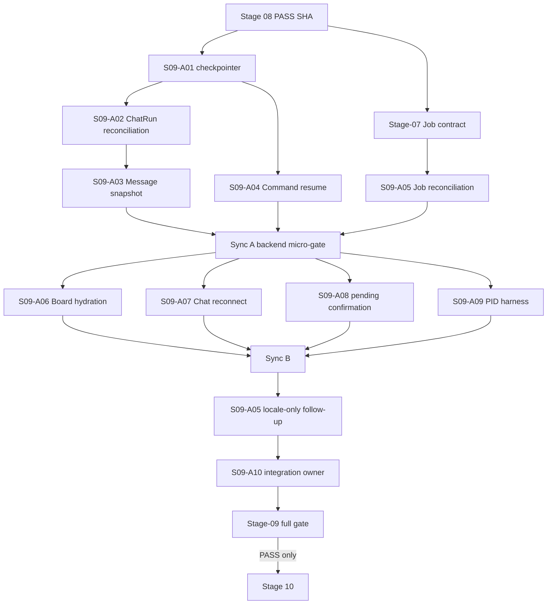

# Этап 09. Восстановление после реального restart, durable replay и idempotency

> **Для agentic workers:** REQUIRED SUB-SKILL: выполнить этап через `superpowers:subagent-driven-development` либо `superpowers:executing-plans`. Обязательны десять практических субагентов `S09-A01…S09-A10`, не более пяти и не менее трёх одновременно при наличии трёх независимых задач. Каждый substage завершается собственным кодовым/тестовым deliverable, focused-проверкой и commit SHA; один лишь review не засчитывается.

## 1. Название и номер этапа

**Номер:** `09`.

**Название:** «Восстановление после реального restart, durable replay и idempotency».

**Положение в мастер-плане:** этап начинается только от exact SHA, на котором Этап 08 имеет документированный `Status: PASS`, и заканчивается передачей Этапу 10 immutable tested `S09_CODE_SHA`, того же набора persistent IDs, физического пути основной SQLite DB, физического пути checkpoint SQLite file и внешнего evidence bundle, ключованного `S09_CODE_SHA`. Evidence не коммитится в tested tree.

**Короткий результат:** после завершения PID backend-процесса и запуска нового PID на тех же файлах пользователь открывает тот же Project/Board и получает server-authoritative viewport, placements, Note, Chat transcript, Automation, terminal Job result и pending Command confirmation. Повторы ChatRun, Board Job и Command resolution не создают второй message, второй Job или второй Flow mutation.

**Жёсткая граница:** это bounded single-process MVP recovery. Этап не вводит event sourcing, `ChatRunEvent`, full replay log, leases, fencing, leader election, distributed ownership, multiworker failover, HA/DR, RPO/RTO или восстановление каждого token delta.

## 2. Контекст

К началу Этапа 09 предыдущие этапы уже создали durable доменные records: `Folder`/Project, `Board`, `Placement`, `BoardNote`, `ChatThread`, `ChatRun`, расширенный `MessageTable`, `Flow`/`FlowVersion`, `Job` и `CommandProposal`. Их наличие само по себе не доказывает restart recovery: процесс может держать LangGraph checkpoint, open interrupt, React cache или текущий execution task только в памяти.

Нормативный transport/runtime contract уже принят ранее:

- stock CopilotKit Chat использует standard AG-UI events;
- Ketos/FastAPI остаётся единственным business backend;
- KFX `AgentComponent` с внутренним LangGraph остаётся единственным agent runtime;
- LangGraph получает stable `thread_id=str(chat_id)`;
- Stage-01 saver dependency и ее lock уже pinned, поэтому Stage 09 не меняет package manifests и lock files;
- `InMemorySaver` и `:memory:` не являются доказательством восстановления;
- `LANGGRAPH_STRICT_MSGPACK=true` сохраняется для production и тестового harness;
- committed `MessageTable` rows, а не token deltas, являются durable transcript truth;
- Command apply уже защищён DB-CAS, proposal hash, base Flow revision/hash и one-use resolution;
- Board Job уже имеет deterministic identity, atomic claim и immutable/idempotent terminal finalize.

Текущие source anchors, с которыми обязан сверяться исполнитель:

- `src/backend/base/ketos/main.py` — FastAPI lifespan и единственная точка app-lifetime wiring;
- `src/backend/base/ketos/agentic/api/router.py` — agentic registrar, который меняет только A10;
- `src/backend/base/ketos/services/database/models/message/model.py` — `MessageTable` и его existing semantics;
- `src/backend/base/ketos/services/database/models/jobs/model.py` — `Job.status`, `created_timestamp`, `finished_timestamp`, `job_metadata`;
- `src/backend/base/ketos/services/commands/service.py` — единственный Stage-08 public Command facade;
- `src/backend/base/ketos/services/commands/apply_service.py` — Stage-08 internal atomic apply/CAS implementation;
- `src/backend/base/ketos/services/jobs/board_contracts.py` и `board_claim.py` — Stage-07 versioned `job_metadata.mvp` и atomic Board Job claim;
- `src/backend/base/ketos/services/jobs/board_results.py` — Stage-07 bounded server→UI Job DTO mapper;
- `src/kfx/src/kfx/services/settings/groups/paths.py` — durable `settings.data_dir`;
- `src/kfx/src/kfx/services/settings/groups/database.py` — main DB settings;
- `src/frontend/src/controllers/API/api.tsx` — канонический authenticated frontend API seam;
- `src/frontend/playwright.mvp.config.ts` — three-process browser configuration, созданная предыдущими этапами;
- `14_KETOS_FINAL_MASTER_IMPLEMENTATION_PLAN.md` — нормативный scope и stage gate.

Документационный contract перед реализацией сверяется с:

- `https://docs.langchain.com/oss/python/langgraph/persistence`;
- `https://docs.langchain.com/oss/python/langgraph/interrupts`;
- `https://docs.ag-ui.com/concepts/events`;
- `https://docs.ag-ui.com/concepts/interrupts`;
- security advisory `https://github.com/langchain-ai/langgraph/security/advisories/GHSA-g48c-2wqr-h844` для strict msgpack;
- security advisory `https://github.com/langchain-ai/langgraph/security/advisories/GHSA-9rwj-6rc7-p77c` для pinned `langgraph-checkpoint-sqlite` floor.

Source и executable behavior остаются authoritative: документация не заменяет focused test, а Graphify/RaytSystem не заменяют чтение затронутых файлов.

## 3. Цель

### Пользовательская цель

Доказать один реальный сценарий:

1. на PID-1 пользователь создаёт/открывает Project и Board, сохраняет viewport и placements, ведёт Chat, получает terminal Job result и оставляет одну AI Flow proposal в `awaiting_confirmation`;
2. backend PID-1 штатно или принудительно завершается после того, как DB/checkpoint writes подтверждены;
3. backend запускается как новый subprocess PID-2 на тех же explicit DB и checkpoint files;
4. direct Board URL загружает server state, игнорируя повреждённый local cache;
5. Chat получает `MESSAGES_SNAPSHOT` из committed `MessageTable` rows и не создаёт новый thread;
6. completed Job/result остаётся terminal и неизменным;
7. active Board Job, потерявший свой single-process worker, получает честный recoverable failure reason и никогда не превращается в ложный success или вечный running;
8. pending CommandProposal и standard open interrupt снова доступны, а первый approve/reject даёт один outcome, повтор — zero effect;
9. все persistent IDs до и после restart совпадают.

### Инженерная цель

Создать минимальную recovery seam поверх уже существующих records:

- один app-lifetime file-backed `AsyncSqliteSaver`;
- один deterministic stable thread ID contract;
- bounded `ChatRun`, `CommandProposal` и Board `Job` reconciliation;
- server-wins frontend hydration/reconnect;
- executable PID-changing subprocess harness;
- committed code/runbook/evidence schemas, затем frozen `S09_CODE_SHA` и внешний immutable evidence bundle, достаточный для строгого `PASS/BLOCKED/FAIL` решения без post-test repo mutation.

### Не-цели

- новая Workspace table или restore API;
- новый message/event store;
- копирование message body в `ChatRun`;
- durable storage token deltas или склейка partial output;
- автоматический replay произвольной mutating LangGraph node на startup;
- generic command bus/outbox/compensation engine;
- изменение KFX component class names, graph IDs или extension manifests;
- package upgrade или lockfile rewrite;
- PostgreSQL saver, cross-node checkpoints, multiworker recovery или HA;
- production census/backfill, load/soak/chaos, retention или checkpoint pruning program.

## 4. Подробное техническое задание

### 4.1 Persistent saver и stable identity

1. Создать `src/backend/base/ketos/agentic/persistence/checkpointer.py` и `src/backend/base/ketos/agentic/persistence/__init__.py`.
2. Production checkpoint file имеет один canonical location: `Path(settings.data_dir) / "mvp" / "langgraph-checkpoints.sqlite3"`.
3. Путь вычисляется server-side, нормализуется через `resolve()`, обязан оставаться внутри `settings.data_dir`; browser/AG-UI body/header не может передать URI или filename.
4. `:memory:`, `file::memory:`, temp directory и process-local fixture запрещены production factory.
5. Saver создаётся и закрывается ровно один раз в `src/backend/base/ketos/main.py` lifespan через async context; import-time singleton запрещён.
6. Graph compile/agent assembly получает saver через app dependency, а не создаёт собственный saver на каждый request.
7. `thread_id` вычисляется только как `str(chat_id)` после server-side owner check. Client-supplied `thread_id`, `actor_id`, `project_id` или model override игнорируются/отклоняются.
8. Новый AG-UI `runId` допустим для reconnect/resume transport, но `ChatRun.id`, `ChatThread.id`, `thread_id` и idempotency tuple остаются прежними.
9. `LANGGRAPH_STRICT_MSGPACK=true` обязателен до создания serializer/checkpointer; executable probe обязан загрузить ранее записанный checkpoint новым app object.
10. Installed Stage-01 pins обязаны одновременно удовлетворять security floors `langgraph >= 1.0.10` и `langgraph-checkpoint-sqlite >= 3.0.1`; ожидаемый master-plan saver pin `3.1.0` floor проходит. Версии ниже floor не принимаются даже при зелёном happy-path test.
11. Новый dependency не добавляется. Если Stage-01 pinned saver не даёт этот contract или lock ниже security floor, A01 возвращает `BLOCKED` и не подменяет его custom persistence и не редактирует locks в Stage 09.

### 4.2 `ChatRun` reconciliation

Reconciliation реализуется в новом `src/backend/base/ketos/services/chat_threads/recovery.py` и вызывается в двух местах: bounded startup scan и owner-authenticated request/reconnect path.

Нормативное поведение:

| Состояние до restart | Доказательство после restart | Решение |
| --- | --- | --- |
| terminal ChatRun | terminal row + committed messages | Ничего не исполнять; вернуть тот же run и snapshot. |
| `awaiting_confirmation`/open interrupt | `CommandProposal.awaiting_confirmation` + checkpoint с тем же `thread_id` и open interrupt | Оставить тот же logical ChatRun; на reconnect вернуть standard interrupt/snapshots. |
| nonterminal ChatRun | documented resumable checkpoint, fingerprint и ownership совпадают | Разрешить demand-driven resume того же logical ChatRun; не auto-run на startup. |
| nonterminal ChatRun | checkpoint отсутствует/повреждён/не поддерживает resume | Атомарно перевести в `failed_recoverable` с bounded reason `backend_restarted`; новый assistant message не писать. |
| повтор same key + same fingerprint | существующая unique tuple | Вернуть существующий ChatRun; row count не меняется. |
| повтор same key + different fingerprint | существующая key с другим fingerprint | `409`; checkpoint, messages и command state не менять. |

Startup scan ограничен nonterminal `ChatRun` records MVP-chat domain. Он не читает все сообщения и не исполняет graph. Request reconciliation повторяет owner join `ChatRun → ChatThread → Folder` до checkpoint access.

### 4.3 `MessageTable` snapshot

`src/backend/base/ketos/services/chat_threads/messages.py` остаётся единственным adapter для Chat transcript.

- Snapshot включает только committed rows, где `chat_id` и `chat_run_id` валидны для owned ChatThread.
- Порядок — строго `chat_sequence ASC`; одинаковый sequence предотвращается существующим unique constraint.
- Cursor — последний committed positive `chat_sequence`, а не token offset и не in-memory event number.
- Cursor из request bounded integer; значение выше server max возвращает актуальный snapshot/empty delta по proven AG-UI contract, но не создаёт message.
- Partial token text после killed process не дописывается и не склеивается.
- На reconnect standard `MESSAGES_SNAPSHOT` предшествует продолжению run/interrupt surface.
- Удаление localStorage/browser cache не меняет transcript.

### 4.4 `CommandProposal` resume и one-effect outcome

Создать `src/backend/base/ketos/services/commands/recovery.py`; использовать frozen Stage-08 public facade `src/backend/base/ketos/services/commands/service.py`, который делегирует атомарное применение внутреннему `src/backend/base/ketos/services/commands/apply_service.py`. Вторая Command implementation/transaction boundary не создаётся.

- Reconnect ищет только owned proposal, связанный с текущим ChatRun/thread и имеющий `status=awaiting_confirmation`.
- `recover_pending_command(...)` получает typed `AsyncSqliteSaver` и typed `CommandCheckpointInspector`; inspector читает checkpoint только через переданный saver и подтверждает полный набор open interrupts для stable `thread_id`.
- DB proposal и LangGraph checkpoint должны согласоваться по proposal ID/hash, interrupt ID, stable thread ID и interrupt metadata discriminator; отсутствие или неоднозначность open interrupt fail closed.
- Resume использует standard `RunAgentInput.resume[]`, тот же `threadId` и новый transport `runId`; deprecated forwarded command и custom event запрещены.
- До apply/reject повторно проверяются owner, proposal status, current Flow revision/hash и open interrupt ID.
- После checkpoint proof recovery layer вызывает только public `CommandService` из `service.py`; facade делегирует существующей atomic transaction в `apply_service.py`: claim proposal → pinned pre-AI FlowVersion → conditional Flow CAS → resolve outcome.
- Reject даёт durable `rejected` и zero Flow write; `cancel()` остаётся abandonment и не становится business rejection.
- Concurrent/double approve после restart: один winner меняет Flow один раз; loser возвращает already-resolved/stale outcome и zero effect.
- Если checkpoint не подтверждает open interrupt, proposal не применяется: он получает честный recoverable/stale outcome по Stage-08 contract, а browser не синтезирует confirmation сам.

### 4.5 `Job`/result reconciliation

Создать `src/backend/base/ketos/services/jobs/recovery.py`; узко расширить Stage-07 seams `src/backend/base/ketos/services/jobs/board_contracts.py`, `board_claim.py` и `board_results.py` без миграции. A05 также является единственным Stage-09 владельцем затронутых `src/frontend/src/locales/{en.json,ru.json}` keys.

- Domain admission опирается на Stage-07 versioned `job_metadata.mvp`: для новых/current rows обязательны `kind == "board_automation_run"`, `origin_pid`, process-random `worker_instance_id`, request fingerprint, Flow hash и bounded reason enum с `backend_restarted`. Knowledge-base, evaluation, foreign/ambiguous и unknown-version jobs не трогаются.
- Stage 09 вводит metadata schema v2 только в Board helpers: новые claims из `board_claim.py` пишут `schema_version=2` с теми же bounded/redacted Stage-07 полями и обязательной worker identity. DB schema/Alembic/backfill нет.
- Terminal v1 (`COMPLETED`, `FAILED`, `TIMED_OUT`, `CANCELLED`) immutable: startup и reader возвращают прежний result/status без rewrite в v2, без добавления PID/worker/reason и без изменения bytes.
- Active v1 с полной Stage-07 Board shape и prior `worker_instance_id` классифицируется как orphaned prior-process work; active v1 без worker identity допускается только по строгой legacy shape (`schema_version`, Board/Flow IDs, fingerprint, policy/audit). Однозначный legacy active row один раз получает honest backend `FAILED` + UI recoverable presentation, `finished_timestamp` и `reason=backend_restarted`; ambiguous row остаётся untouched.
- Единственный разрешённый v1→v2 write — этот atomic active recovery: bounded metadata copy получает `schema_version=2`, exact Board discriminator/known fields и recovery audit outcome, но не fabricated result. Terminal v1 не обновляется.
- Active v2 prior-worker row обрабатывается тем же способом; current-worker active v2 и все terminal v2 rows не меняются.
- Reconciliation использует conditional update по Job ID + `status IN (QUEUED, IN_PROGRESS)` + observed `schema_version` + observed/absent worker identity. Первый winner пишет terminal recovery; повторный startup/reconnect получает rowcount `0`, перечитывает authoritative terminal row и не меняет metadata/result второй раз.
- `board_results.py` отображает `backend_restarted` как bounded failed/recoverable DTO, не как success и не как raw exception; RU/EN locale keys принадлежат A05 и проходят parity check.
- UI может кратко показать `unknown`, пока authoritative read не завершён, но не показывает `succeeded` без `COMPLETED` и bounded result.
- Тот же idempotency key повторно возвращает тот же Job ID; changed fingerprint даёт `409` и zero enqueue.
- Никакого lease timeout, fencing token, heartbeat, redis election или task adoption не добавляется.

### 4.6 Server-wins Board hydration

Создать `src/frontend/src/pages/BoardPage/hooks/use-board-restore.ts`.

- Direct URL использует route `projectId`/`boardId`, вызывает существующие authenticated Board/Placement/Note/Chat/Flow/Job APIs и не создаёт Workspace restore endpoint.
- На смене Board transient `boardStore` очищается до hydration.
- Любой persisted/stale local cache может использоваться только как non-authoritative loading hint; IDs, geometry, viewport и revision берутся только из server response.
- Hydration order: Board auth/read → viewport → placements → entity projections; canvas interactions включаются после authoritative Board/viewport.
- Server revision/geometry всегда побеждают corrupted local values; конфликт `409` вызывает refetch, а не merge local geometry.
- `Flow.data` не получает Board geometry, а close Placement не удаляет entity.
- Frontend использует stage-local restore state machine `hydrating → restored`, `reconnecting → restored`, либо terminal presentation `failed_recoverable | unknown`; эти UI labels не создают новых storage enums.
- Focus до reconnect запоминается по stable Board/Placement/Chat target. После restore он возвращается на тот же доступный control; если target исчез/недоступен, deterministic fallback — Board heading, затем canvas entry control. Focus не уходит в `body` и не прыгает в composer самопроизвольно.
- Единственный polite live region объявляет переход состояния один раз. Replayed transcript messages не переобъявляются как новые и не запускают duplicate toast/live announcements.

### 4.7 Chat reconnect и pending confirmation UI

- `src/frontend/src/controllers/API/queries/chat-threads/use-chat-reconnect.ts` загружает persisted ChatThread/ChatRun metadata через существующий `api` + `UseRequestProcessor` seam.
- `src/frontend/src/components/core/board/placements/ChatPlacement.tsx` передаёт stock CopilotKit стабильный `threadId` из server ChatThread и не создаёт thread при reconnect.
- Frozen Stage-08 `src/frontend/src/components/core/chats/FlowCommandConfirmation.tsx` остаётся узким domain renderer, а `src/frontend/src/components/core/chats/use-flow-command-interrupt.tsx` — единственным confirmation/interrupt hook. Stage 09 не создаёт второй pending-command query/hook.
- На reconnect Stage-08 hook/renderer получают только server-returned standard open interrupt/proposal после DB + checkpoint proof; browser не применяет patch и не объявляет interrupt открытым самостоятельно.
- Network reconnect, page reload и backend restart дают один thread, exact transcript и one-use confirmation.
- Unsent composer draft — отдельный non-authoritative user input, не server transcript. A07 сначала подтверждает официальный controlled-draft/restore surface pinned CopilotKit через Context7; draft scoped by `chatId` допускается в `sessionStorage`, никогда не превращается в committed message без Send и очищается только после подтверждённого submit. Hydration/reconnect не вызывает composer reset. Если stock CopilotKit не предоставляет безопасный supported seam, A07 получает `BLOCKED`; собственный composer запрещён.
- При same-page backend restart текущий draft остаётся видимым. При full page reload supported draft restore показывает явный RU/EN маркер «Черновик не отправлен»/`Draft not sent`; silent loss или автоматическая отправка запрещены.
- `reconnecting`, `restored`, `failed_recoverable` и `unknown` имеют RU/EN strings и один accessible announcement на фактический state transition; snapshot replay не дублирует announcements или side effects.

### 4.8 Реальный PID-changing harness

Создать `scripts/mvp/restart_harness.py` и `scripts/mvp/restart_restore_smoke.sh`.

Harness обязан:

1. создать private temporary run root через `mktemp -d`/`tempfile.TemporaryDirectory`;
2. задать explicit `KETOS_DATA_DIR`, `KETOS_CONFIG_DIR`, `KETOS_TEMP_DIR`, absolute `KETOS_DATABASE_URL="sqlite:///$stage09_run_dir/ketos.db"`, checkpoint path через canonical data-dir derivation, `LANGGRAPH_STRICT_MSGPACK=true`, `KETOS_AUTO_LOGIN=true`, `KETOS_MVP_WORKSPACE=true`, `KETOS_MVP_CHAT=true` и один backend worker;
3. запустить реальный `uv run uvicorn --factory ketos.main:create_app --host 127.0.0.1 --port "$stage09_backend_port" --loop asyncio --workers 1` subprocess на OS-assigned свободном loopback port;
4. дождаться `/health_check`, записать PID-1 и seed IDs через real authenticated APIs;
5. зафиксировать completed transcript/result и pending proposal/open interrupt;
6. завершить именно backend PID-1, дождаться process exit и подтвердить отсутствие listener;
7. запустить новый backend subprocess на тех же DB/data/config directories, получить PID-2 и доказать `PID-1 != PID-2`;
8. продолжить те же IDs через real HTTP/AG-UI path;
9. записать redacted JSON evidence с `S09_CODE_SHA`, PIDs, file basenames, entity IDs, before/after hashes, row counts и outcomes только в staging directory под approved `S09_EVIDENCE_ROOT`, затем атомарно финализировать immutable bundle;
10. гарантированно завершить только созданные harness-процессы; mock restart, новый app object в том же PID и `LifespanManager` без subprocess не принимаются как final proof.

### 4.9 Обязательный Tool Routing и использование инструментов

Перед задачами coordinator фиксирует доступность и реально использует все релевантные доступные инструменты:

1. `raytsystem doctor/status/graph status/lint --root /Volumes/Projects/ketos_canvas_mod_main --json` — read-only workspace health; stale RaytSystem graph не является source authority и не обновляется.
2. Existing `graphify-out/graph.json` + `graphify query`/`path`/`explain` — только read-only narrowing; rebuild/update запрещены как side effect.
3. `rg`/`rg --files` и точечное чтение source — authoritative path/symbol verification.
4. Context7 отдельным resolve/query для `/langchain-ai/langgraph`, pinned LangGraph и `langgraph-checkpoint-sqlite`; implementation handoff содержит library ID, exact installed versions и подтверждённые saver/interrupt signatures. Если Context7 недоступен, A01 получает `BLOCKED`, API по памяти не меняется.
5. Official LangGraph/AG-UI docs и upstream security advisories — второй источник после Context7.
6. Subagents — repository-only analysis/implementation/tests в назначенных writable paths; MCP, browser, secrets, external actions и shared registrars остаются у main coordinator.
   Обязательное правило: **субагенты используют все доступные релевантные инструменты** в пределах назначенного repository-only scope и фиксируют применённые инструменты в handoff; наличие инструмента не разрешает external action или выход за owned paths.
7. Playwright — real API/browser restart story; trace/video/screenshot сохраняются только во внешний staging evidence directory, никогда в repo working tree.
8. Chrome/in-app Browser/Computer Use, если доступны, — ручная проверка direct URL, corrupted local cache, transcript и pending confirmation после PID change. Они не заменяют Playwright/DB assertions.
9. Shell/process tools — PID/listener/health evidence и focused commands; Python всегда запускается через `uv run`.

Наличие инструмента не расширяет scope. External network/actions, RaytSystem promotion и Graphify rebuild не выполняются без отдельного разрешения.

### 4.10 Frozen module interfaces

До Wave A coordinator сверяет эти planned interfaces со Stage-08 handoff и после path freeze не меняет имена/signatures между lanes:

| Module | Frozen callable | Input/output contract |
| --- | --- | --- |
| `agentic/persistence/checkpointer.py` | `checkpoint_path(data_dir: str | Path) -> Path` | Возвращает canonical `<data_dir>/mvp/langgraph-checkpoints.sqlite3` после containment validation. |
| `agentic/persistence/checkpointer.py` | `chat_thread_id(chat_id: UUID) -> str` | Возвращает каноническую UUID string без prefix/salt/client override. |
| `agentic/persistence/checkpointer.py` | `open_mvp_checkpointer(data_dir: str | Path) -> AsyncIterator[AsyncSqliteSaver]` | Async context manager открывает/закрывает один `langgraph.checkpoint.sqlite.aio.AsyncSqliteSaver`. |
| `services/chat_threads/recovery.py` | `reconcile_nonterminal_chat_runs(*, session: AsyncSession, checkpointer: AsyncSqliteSaver, owner_id: UUID | None) -> ChatRecoverySummary` | Классифицирует/resume-enables bounded MVP rows; summary содержит IDs/counts/reasons. |
| `services/chat_threads/messages.py` | `build_messages_snapshot(*, session: AsyncSession, owner_id: UUID, chat_id: UUID, after_sequence: int = 0) -> MessagesSnapshot` | Возвращает owned committed rows в `chat_sequence ASC` и server cursor. |
| `services/commands/recovery.py` | `recover_pending_command(*, session: AsyncSession, checkpointer: AsyncSqliteSaver, checkpoint_inspector: CommandCheckpointInspector, command_service: CommandService, actor_id: UUID, chat_run_id: UUID, proposal_id: UUID) -> PendingCommandRecovery` | Inspector через typed saver сверяет exact open interrupt/proposal/hash/thread; затем recovery вызывает injected public `CommandService`, а тот делегирует existing atomic `apply_service.py`. |
| `services/jobs/recovery.py` | `reconcile_board_jobs_after_restart(*, session: AsyncSession, current_worker_instance_id: UUID, current_pid: int) -> JobRecoverySummary` | Conditional one-time v1/v2 terminalization только proven prior-worker/strict-legacy active Board Jobs; terminal v1/v2, current-worker и unrelated rows immutable. |

`owner_id=None` допустим только для bounded startup classification: функция не возвращает message/proposal payload и не resume-ит graph. Любой request payload требует concrete authenticated owner ID. Summary types содержат только counts, IDs, reason codes и conflicts; они не являются event log.

`CommandCheckpointInspector` — typed protocol/adapter в `commands/recovery.py`, а не новое storage abstraction: его единственная read-only операция получает переданный `AsyncSqliteSaver` + stable thread ID и возвращает bounded descriptors всех open interrupts. Он не mutates checkpoint, proposal или Flow и не обходит `CommandService`.

Frozen frontend interfaces:

```typescript
export type BoardRestorePhase =
  | "hydrating"
  | "reconnecting"
  | "restored"
  | "failed_recoverable"
  | "unknown";

export function useBoardRestore(input: {
  projectId: string;
  boardId: string;
}): BoardRestoreResult;

export function useChatReconnect(input: {
  chatId: string;
}): ChatReconnectResult;
```

Pending confirmation не получает нового frontend API: A08 сохраняет Stage-08 contract `FlowCommandConfirmation.tsx` + `use-flow-command-interrupt.tsx` и добавляет только reconnect behavior/tests поверх него.

Harness CLI contract:

```bash
test -n "$S09_EVIDENCE_ROOT"
test "$(git rev-parse HEAD)" = "$S09_CODE_SHA"
test -n "$S09_RUN_ID"
stage09_run_dir="$(uv run python scripts/mvp/finalize_stage09_evidence.py create-staging \
  --evidence-root "$S09_EVIDENCE_ROOT" --code-sha "$S09_CODE_SHA" --run-id "$S09_RUN_ID")"
uv run python scripts/mvp/restart_harness.py \
  --code-sha "$S09_CODE_SHA" \
  --run-root "$stage09_run_dir" \
  --json-out "$stage09_run_dir/process/recovery.json"
S09_RUN_DIR="$stage09_run_dir" bash scripts/mvp/restart_restore_smoke.sh
```

Script валидирует private run root как descendant approved external evidence root, но не создаёт/не меняет repo files и не принимает DB/checkpoint/browser target из untrusted HTTP input. Финальный bundle создаётся только через §12.9 после всех gates.

### 4.11 Closure identity и external evidence policy

До final run coordinator обязан получить и записать в Stage-08→09 handoff approved absolute `S09_EVIDENCE_ROOT`. Политика пути нормативна:

- root находится на persistent writable storage, принадлежит пользователю/CI principal, имеет private permissions и переживает cleanup test process;
- `realpath "$S09_EVIDENCE_ROOT"` не равен repo root, не является его descendant, не находится в `/tmp`, `/private/tmp`, project worktree, `.git`, generated store или RaytSystem/Graphify path;
- отсутствие заранее approved root — `BLOCKED`; coordinator не подменяет его ad-hoc repo directory или temporary folder;
- каждый final attempt пишет только в create-exclusive staging path `$S09_EVIDENCE_ROOT/.stage09-$S09_CODE_SHA-$S09_RUN_ID`; bundle finalizer проверяет schema/redaction/hashes и атомарно переносит его в `$S09_EVIDENCE_ROOT/stage-09/$S09_CODE_SHA/$S09_RUN_ID`;
- final path уже существует → overwrite запрещён; новый attempt получает новый `S09_RUN_ID`; после `manifest.json` + `manifest.sha256` bundle read-only/append-closed;
- bundle содержит actual PID-1/PID-2, tested SHA, command logs/results, process/listener proof, redacted ID/hash ledgers, Playwright trace и screenshots. Secrets/raw credentials отсутствуют.

Closure использует две разные identities:

1. `S09_CODE_SHA` — commit после merge всех code, tests, runbook, evidence schema и finalizer changes. До первого final gate coordinator проверяет clean worktree, фиксирует `S09_CODE_SHA=$(git rev-parse HEAD)` и больше не меняет repo.
2. `S09_EVIDENCE_SHA` — необязательный более поздний commit только с pointer/report на external bundle. Он не является tested SHA, не заменяет `S09_CODE_SHA`, не нужен для `PASS` и не является Stage-10 base.

Все final gates запускаются при `HEAD == S09_CODE_SHA`, clean index/worktree/untracked set и artifact/cache/temp paths, перенаправленных в external staging directory. `check_stage09_scope.py` создаёт pre-run repo filesystem manifest во staging и post-run сравнение; любое repo file creation/modification, включая ignored artifact/cache, даёт `FAIL`. Любая code/test/runbook/schema/doc correction после freeze создаёт новый `S09_CODE_SHA`, новый staging attempt и полный rerun §12.2–§12.8. Исправлять или дописывать repo report после green gate и продолжать называть старый SHA tested запрещено.

## 5. Перечень задач

### 5.1 Матрица десяти практических субагентов

| ID / роль | Owned paths | Практический output | Focused verification | Downstream consumer |
| --- | --- | --- | --- | --- |
| `S09-A01` — production checkpointer owner | Create `src/backend/base/ketos/agentic/persistence/{__init__.py,checkpointer.py}`; create `src/backend/tests/unit/agentic/persistence/test_checkpointer.py` | App-lifetime file-backed saver factory, stable `thread_id` helper, strict/path guards | `uv run pytest src/backend/tests/unit/agentic/persistence/test_checkpointer.py -q` | A02, A04, A10 |
| `S09-A02` — ChatRun recovery owner | Create `src/backend/base/ketos/services/chat_threads/recovery.py`; modify `src/backend/base/ketos/services/chat_threads/repository.py`; create `src/backend/tests/unit/services/chat_threads/test_recovery.py` | Bounded startup/request reconciliation, same logical run, `failed_recoverable` fallback | `uv run pytest src/backend/tests/unit/services/chat_threads/test_recovery.py -q` | A03, A07, A09, A10 |
| `S09-A03` — snapshot owner | Modify `src/backend/base/ketos/services/chat_threads/messages.py`; create `src/backend/tests/unit/services/chat_threads/test_messages_snapshot.py` | Ordered committed `MESSAGES_SNAPSHOT`, bounded sequence cursor, no partial-text merge | `uv run pytest src/backend/tests/unit/services/chat_threads/test_messages_snapshot.py -q` | A07, A09, A10 |
| `S09-A04` — Command recovery owner | Create `src/backend/base/ketos/services/commands/recovery.py`; narrow modify `src/backend/base/ketos/services/commands/service.py`; use unchanged internal `src/backend/base/ketos/services/commands/apply_service.py`; create `src/backend/tests/unit/services/commands/test_recovery.py` | Typed saver/inspector proof of exact open interrupt, then delegation through Stage-08 public facade to one-effect apply/reject | `uv run pytest src/backend/tests/unit/services/commands/test_recovery.py src/backend/tests/unit/services/commands/test_apply_service.py -q` | A08, A09, A10 |
| `S09-A05` — Job recovery owner | Create `src/backend/base/ketos/services/jobs/recovery.py`; narrow modify `src/backend/base/ketos/services/jobs/{board_claim.py,board_contracts.py,board_results.py}`, `src/frontend/src/locales/{en.json,ru.json}`; create `src/backend/tests/unit/services/jobs/test_restart_recovery.py`; modify focused Stage-07 tests | Versioned v1→v2 claim/recovery contract, immutable terminal v1, one-time legacy/prior-worker finalization, bounded failed/recoverable DTO/locales | `uv run pytest src/backend/tests/unit/services/jobs/test_restart_recovery.py src/backend/tests/unit/services/jobs/test_board_claim.py src/backend/tests/unit/services/jobs/test_board_results.py -q` | A09, A10 |
| `S09-A06` — Board hydration owner | Create `src/frontend/src/pages/BoardPage/hooks/use-board-restore.ts`; create `src/frontend/src/pages/BoardPage/hooks/__tests__/use-board-restore.test.tsx` | Server-wins direct-URL hydration, restore-state/focus fallback и corrupted-cache rejection | `cd src/frontend && npm test -- --runInBand src/pages/BoardPage/hooks/__tests__/use-board-restore.test.tsx` | A10 |
| `S09-A07` — Chat reconnect owner | Create `src/frontend/src/controllers/API/queries/chat-threads/use-chat-reconnect.ts`; modify `src/frontend/src/components/core/board/placements/ChatPlacement.tsx`; create `src/frontend/src/components/core/board/placements/ChatPlacement.reconnect.test.tsx` | Persisted thread bootstrap, exact transcript reconnect, supported unsent-draft preservation и no duplicate announcements | `cd src/frontend && npm test -- --runInBand src/components/core/board/placements/ChatPlacement.reconnect.test.tsx` | A10 |
| `S09-A08` — pending confirmation owner | Modify frozen Stage-08 `src/frontend/src/components/core/chats/{FlowCommandConfirmation.tsx,use-flow-command-interrupt.tsx}`; create `src/frontend/src/components/core/chats/__tests__/{FlowCommandConfirmation.reconnect.test.tsx,use-flow-command-interrupt.reconnect.test.tsx}` | Stock CopilotKit pending interrupt restore through existing hook/renderer, one-use resolve и focus/live-region stability | `cd src/frontend && npm test -- --runInBand src/components/core/chats/__tests__/FlowCommandConfirmation.test.tsx src/components/core/chats/__tests__/FlowCommandConfirmation.reconnect.test.tsx src/components/core/chats/__tests__/use-flow-command-interrupt.reconnect.test.tsx` | A10 |
| `S09-A09` — subprocess recovery owner | Create `scripts/mvp/restart_harness.py`; create `src/backend/tests/integration/test_mvp_restart_recovery.py` | Real PID-1→PID-2 fixture, same DB/checkpoint files and persistent-ID ledger | `uv run pytest src/backend/tests/integration/test_mvp_restart_recovery.py -q` | A10 |
| `S09-A10` — integration/registrar owner | Modify `src/backend/base/ketos/main.py`, `src/backend/base/ketos/agentic/api/router.py`, `src/frontend/src/pages/BoardPage/index.tsx`; create `scripts/mvp/{restart_restore_smoke.sh,check_stage09_scope.py,finalize_stage09_evidence.py}`, `src/frontend/tests/core/features/mvp-restart-restore.spec.ts`, `docs/dev/handoff/stage-09-restart-recovery-runbook.md`, `docs/dev/handoff/schemas/stage-09-evidence.schema.json` | Lifespan/router/UI wiring, committed runbook/schema/finalizer, scope guard и orchestration; actual evidence/report остаётся external | Full Stage-09 gate из §12 | Этап 10 |

### 5.2 Ownership и forbidden paths

- До dispatch coordinator выполняет pre-Wave-A path freeze и записывает его в execution matrix. Planned-new canonical targets Stage 09: `src/backend/base/ketos/agentic/persistence/checkpointer.py`, `src/backend/base/ketos/services/chat_threads/recovery.py`, `src/backend/base/ketos/services/chat_threads/messages.py` как snapshot adapter seam, `src/backend/base/ketos/services/commands/recovery.py`, `src/backend/base/ketos/services/jobs/recovery.py`, `scripts/mvp/restart_harness.py` и `scripts/mvp/restart_restore_smoke.sh`. Frozen modified seams: Command `service.py` with unchanged internal `apply_service.py`; Job `board_contracts.py`/`board_claim.py`/`board_results.py`; confirmation `FlowCommandConfirmation.tsx`/`use-flow-command-interrupt.tsx`.
- Exact target можно однократно изменить только **до начала Wave A**, только coordinator и только если Stage-08 PASS handoff указывает уже существующий канонический модуль с той же ответственностью. Amendment обязан назвать old path, canonical replacement, source evidence и обновить все assignments/tests/commands одновременно. После первого implementation dispatch paths immutable до Sync B; agent не выбирает альтернативный filename самостоятельно.
- Только A05 меняет Stage-09 recovery/reason keys в `src/frontend/src/locales/{en.json,ru.json}` и принимает от A06/A07/A08 frozen locale-key manifest до своей финальной locale commit; остальные lanes locale files не редактируют. Только A10 меняет `src/backend/base/ketos/main.py`, `src/backend/base/ketos/agentic/api/router.py`, `src/frontend/src/pages/BoardPage/index.tsx`, Playwright spec, committed runbook/schema/finalizer; A10 запускает locale parity gate, но не правит locales. Actual report/evidence в repo не создаётся до freeze или во время gate.
- A01 не меняет package manifests/locks: `pyproject.toml`, `uv.lock`, `src/frontend/package.json`, `src/frontend/package-lock.json`, `src/copilot-runtime/package.json` и его lock остаются неизменными.
- Никто не создаёт Alembic revision: Stage 09 не schema-stage.
- `src/kfx/**`, `src/compat/lfx/**`, deployment config, `LICENSE`, `NOTICE`, generated artifacts, `graphify-out/**`, `.raytsystem/**` и `_raw/**` запрещены для записи.
- Один lane не редактирует owned path другого lane. Shared conflict разрешает coordinator после handoff, а не agents напрямую.
- Каждый agent handoff содержит base SHA, branch, commit SHA, changed paths, exact command, exit code, test count и известный residual risk.

## 6. Подэтапы, шаги и Wave/Sync DAG

### 6.1 `S09-A01` — production checkpointer

**Owner:** backend runtime/persistence agent; единственный владелец `agentic/persistence/**` в Wave A.

**Prerequisite:** Stage-08 PASS SHA, Stage-01 dependency decision/evidence и фактически установленная pinned saver version.

**Parallel:** стартует в Wave A вместе с read-only characterization lanes A02/A04/A05; только A01 пишет persistence module.

**Шаги:**

1. Context7 resolve/query + official docs/advisories; записать exact package versions через `uv run python -c "from importlib.metadata import version; print(version('langgraph')); print(version('langgraph-checkpoint-sqlite'))"` и проверить floors `langgraph >= 1.0.10`, `langgraph-checkpoint-sqlite >= 3.0.1` без изменения lock files.
2. Сначала написать failing tests для file path, path containment, `:memory:` reject, stable UUID thread ID, strict msgpack и new app-object load.
3. Реализовать async context-managed factory и `chat_thread_id(chat_id: UUID) -> str`.
4. Проверить, что два последовательно созданных saver/app objects читают один checkpoint file; первый context закрыт до второго.
5. Передать A10 exact lifespan enter/exit interface без самостоятельного registrar edit.

**Output:** commit `codex/mvp-s09-a01-checkpointer` с factory и focused proof.

**Verification:** focused command из §5.1 даёт `PASS`; checkpoint file находится под test `data_dir`, PID/process-local memory не используется.

**Downstream:** A02 и A04 получают frozen saver/thread interface; A10 получает lifespan wiring contract.

### 6.2 `S09-A02` — ChatRun reconciliation

**Owner:** backend Chat domain recovery agent; владеет только `services/chat_threads/recovery.py`, согласованной правкой repository и своим focused test.

**Prerequisite:** frozen ChatRun statuses/idempotency DTO Stage 05 и A01 interface; до Sync A lane может писать только characterization tests/decision table.

**Parallel:** после A01 micro-sync работает параллельно с A03/A04/A05.

**Шаги:**

1. Зафиксировать terminal/nonterminal status set и owner join существующими model/repository types.
2. Написать tests: resumable checkpoint, missing checkpoint, same/different fingerprint, repeated reconciliation, no second terminal message.
3. Реализовать bounded query только по MVP ChatRun nonterminal rows.
4. Разделить startup classification и request-owned resume; startup не запускает graph.
5. Для unsupported/missing checkpoint выполнить conditional status update в `failed_recoverable` с bounded restart reason.

**Output:** commit `codex/mvp-s09-a02-chatrun-recovery`.

**Verification:** один logical ChatRun row; assistant commits `<=1`; changed fingerprint `409`; foreign actor не получает checkpoint state.

**Downstream:** A03 получает committed-run/cursor contract; A07 получает bootstrap status; A09 получает crash fixtures.

### 6.3 `S09-A03` — `MESSAGES_SNAPSHOT`

**Owner:** backend MessageTable/snapshot agent; единственный владелец Chat snapshot adapter и его sequence/cursor test.

**Prerequisite:** A02 Sync-A ChatRun semantics и Stage-05 MessageTable FK/sequence constraints.

**Parallel:** параллелен A04/A05 после A02 interface freeze.

**Шаги:**

1. Написать tests для ordered committed rows, cursor bounds, duplicate sequence rejection, local cache irrelevance и foreign Chat deny.
2. Реализовать owner-scoped snapshot query и AG-UI adapter mapping.
3. Исключить uncommitted/partial deltas и ConversationBuffer как truth.
4. Проверить exact payload до и после нового repository/service object.

**Output:** commit `codex/mvp-s09-a03-message-snapshot`.

**Verification:** before/after snapshot JSON эквивалентен, IDs/sequence совпадают, row count не меняется.

**Downstream:** A07 использует frozen snapshot contract; A09/A10 включают его в real restart proof.

### 6.4 `S09-A04` — pending Command resume

**Owner:** backend Command/HITL recovery agent; не владеет shared agentic router или frontend interrupt surface.

**Prerequisite:** A01 saver, Stage-08 `commands/service.py` facade + internal `apply_service.py` CAS PASS и frozen standard interrupt fixture.

**Parallel:** параллелен A03/A05 после A01 micro-sync; shared router не редактирует.

**Шаги:**

1. Написать tests restart between preview and approve, reject, double approve, stale Flow hash, missing/ambiguous checkpoint, foreign actor и mismatched interrupt/thread ID.
2. Реализовать typed `CommandCheckpointInspector` поверх переданного `AsyncSqliteSaver` и reconciliation proposal↔checkpoint по proposal ID/hash/exact open interrupt/stable thread ID.
3. После proof передать resolve только в public `CommandService` (`service.py`); facade вызывает существующую atomic implementation `apply_service.py`. Не создавать второй apply service и не дублировать transaction/CAS.
4. Доказать one winner under concurrent approve и zero write для reject/replay/stale/missing-open-interrupt; повторно запустить Stage-08 `test_apply_service.py`.

**Output:** commit `codex/mvp-s09-a04-command-recovery`.

**Verification:** focused `test_recovery.py + test_apply_service.py` зелёный; Flow revision/hash меняются ровно один раз; pinned FlowVersion и proposal outcome согласованы; second resolve zero effect; recovery imports facade, а не internal transaction напрямую.

**Downstream:** A08 получает pending proposal DTO; A09 получает pending interrupt fixture; A10 wires router.

### 6.5 `S09-A05` — Job/result reconciliation

**Owner:** backend Job recovery agent; владеет `recovery.py`, узкими изменениями `board_contracts.py`, `board_claim.py`, `board_results.py`, их focused tests и Stage-09 locale keys; не затрагивает другие Job domains или migrations.

**Prerequisite:** Stage-07 deterministic Job identity/finalize contract, versioned `job_metadata.mvp` v1 с `kind`/`origin_pid`/`worker_instance_id`, strict legacy-active fixture и reserved `backend_restarted`; migration не требуется.

**Parallel:** параллелен A03/A04 после Job metadata key freeze.

**Шаги:**

1. Написать tests для terminal v1 byte/DTO immutability, v1 prior worker, strict legacy active v1 без worker, ambiguous legacy v1, active/terminal v2, current worker, repeated startup, unrelated/unknown-version Job и same/different fingerprint replay.
2. Зафиксировать v2 в `board_contracts.py`; обновить `board_claim.py`, чтобы каждый новый Board claim писал `schema_version=2`, exact `kind`, positive `origin_pid` и process-random `worker_instance_id`. Raw keys/payloads и metadata >32 KiB запрещены.
3. Реализовать в `recovery.py` conditional active→`FAILED` transition по exact observed version/status/worker fields с `reason=backend_restarted`, `finished_timestamp` и bounded recovery audit. При strict legacy v1 без worker допускается один atomic v1→v2 terminal write; ambiguous legacy row untouched.
4. В `board_results.py` сохранить terminal v1 read compatibility и mapped failed/recoverable presentation; проверить/добавить RU/EN reason/restore keys в locale files как единственный Stage-09 locale owner.
5. Доказать rowcount `1` у winner, `0` у repeated reconciliation, terminal v1/v2 immutability, current-worker preservation и no false success/fabricated result.

**Output:** commit `codex/mvp-s09-a05-job-recovery`.

**Verification:** `test_restart_recovery.py + test_board_claim.py + test_board_results.py` зелёные; terminal v1 result/metadata before/after равны; strict legacy/prior-worker active Job terminalizes ровно один раз; v2 new claim fields exact; current-worker, unrelated и ambiguous rows untouched; DTO/locales честно показывают failed/recoverable `backend_restarted`.

**Downstream:** A09/A10 получают Job fixture и UI reason mapping.

После Sync B тот же A05 получает frozen locale-key manifests A06/A07/A08 и делает один locale-only follow-up commit в своих owned `en.json`/`ru.json` до старта A10. Это не новый subagent/task и не разрешает A05 менять frontend components; coordinator повторяет `npm run i18n:check` после merge.

### 6.6 Sync A

Coordinator объединяет строго:

```text
A01 checkpointer
  → A02 ChatRun recovery
    → A03 Message snapshot
A01 checkpointer
  → A04 Command recovery
Stage-07 Job contract
  → A05 Job recovery
```

После каждого merge coordinator запускает соответствующий focused command. Затем на одном Sync-A SHA запускается backend micro-gate:

```bash
uv run pytest \
  src/backend/tests/unit/agentic/persistence/test_checkpointer.py \
  src/backend/tests/unit/services/chat_threads/test_recovery.py \
  src/backend/tests/unit/services/chat_threads/test_messages_snapshot.py \
  src/backend/tests/unit/services/commands/test_recovery.py \
  src/backend/tests/unit/services/commands/test_apply_service.py \
  src/backend/tests/unit/services/jobs/test_restart_recovery.py \
  src/backend/tests/unit/services/jobs/test_board_claim.py \
  src/backend/tests/unit/services/jobs/test_board_results.py -q
```

Sync-A output: frozen saver factory, stable thread ID, snapshot DTO, typed Command checkpoint-inspector/facade delegation, reconciliation reason codes, exact Job v1→v2 matrix, metadata keys, DB/checkpoint paths и fixture ID schema. Только после micro-gate `PASS` открывается Wave B.

### 6.7 `S09-A06` — Board hydration

**Owner:** frontend Board hydration agent; shared `BoardPage/index.tsx` оставляет A10.

**Prerequisite:** Sync-A SHA и Stage-03/04 Board/Placement query contracts.

**Parallel:** Wave B; параллелен A07/A08/A09, не редактирует `BoardPage/index.tsx`.

**Шаги:** failing hook tests → reset transient state → server fetch order → stage-local state transitions → corrupted local cache fixture → focus preservation/fallback → one live announcement → 409 refetch → focused rerun.

**Output:** commit `codex/mvp-s09-a06-board-restore`.

**Verification:** server IDs/revision/viewport/geometry побеждают local values; direct URL не создаёт сущности; focus и announcement contract детерминированы.

**Downstream:** A10 wires hook и browser scenario.

### 6.8 `S09-A07` — Chat reconnect

**Owner:** frontend Chat bootstrap/reconnect agent; владеет reconnect hook и ChatPlacement-only change.

**Prerequisite:** Sync-A ChatRun/snapshot DTO и Stage-05 stock CopilotKit boundary.

**Parallel:** Wave B; не редактирует A08 renderer или A10 registrars.

**Шаги:** Context7 check официального stock-draft seam → failing reconnect/draft/announcement tests → server ChatThread bootstrap → stable thread ID → snapshot hydration → preserve unsent draft without commit → network reconnect → page reload supported draft restore → source guard против legacy Assistant imports.

**Output:** commit `codex/mvp-s09-a07-chat-reconnect`.

**Verification:** thread ID и transcript IDs/sequence неизменны; row count не растёт без Send; unsent draft не теряется/не отправляется; replayed messages не переобъявляются.

**Downstream:** A10 integrates Board Chat story.

### 6.9 `S09-A08` — pending confirmation UI

**Owner:** frontend Command interrupt agent; владеет только frozen Stage-08 `FlowCommandConfirmation.tsx`, `use-flow-command-interrupt.tsx` и их consistently named reconnect tests, не stock Chat body и не новым pending-query abstraction.

**Prerequisite:** Sync-A Command DTO/checkpoint discriminator и Stage-08 `useInterrupt` contract.

**Parallel:** Wave B; параллелен A06/A07/A09.

**Шаги:** failing `FlowCommandConfirmation.reconnect.test.tsx` и `use-flow-command-interrupt.reconnect.test.tsx` → server-proven standard interrupt remount through existing hook → approve/reject payload check → double resolve guard → focus return/fallback → browser-no-apply/source guard. Новый pending-command query и второй renderer запрещены.

**Output:** commit `codex/mvp-s09-a08-confirmation-reconnect`.

**Verification:** pending preview survives remount/restart, first resolution works, second gives zero effect; focus preserved/fallback deterministic; announcement emitted once; custom events отсутствуют.

**Downstream:** A10 uses it in Playwright scenario.

### 6.10 `S09-A09` — subprocess harness

**Owner:** backend integration/process-harness agent; не меняет production registrars или frontend paths.

**Prerequisite:** Sync-A backend contracts; может писать harness skeleton раньше, но final assertions стартуют только от Sync-A SHA.

**Parallel:** Wave B, независимо от frontend lanes до browser handoff.

**Шаги:** create real process fixture → health wait → seed real records → kill PID-1 → verify listener closed → start PID-2 same files → API/AG-UI resume → compare ID/hash/row ledger → cleanup only owned PIDs.

**Output:** commit `codex/mvp-s09-a09-pid-restart-harness`.

**Verification:** integration test печатает два разных positive PIDs, identical DB/checkpoint canonical paths и exact before/after entity ledger.

**Downstream:** A10 orchestration и Playwright используют тот же harness interface.

### 6.11 `S09-A10` — integration owner

**Owner:** coordinator-designated integration/registrar agent; единственный владелец lifespan/router/BoardPage wiring, orchestration, Playwright spec, committed evidence runbook/schema/finalizer. Он не коммитит actual gate evidence.

**Prerequisite:** A06/A07/A08/A09 merged after Sync A, затем принят A05 locale-only follow-up и зелёный i18n gate; A10 стартует последним.

**Parallel:** не параллелится с frontend build или Playwright; единолично владеет shared wiring.

**Шаги:**

1. Подключить saver и three reconcilers в `main.py` lifespan с deterministic order: DB services ready → saver open → Chat/Command/Job classification → serve requests; shutdown closes request work before saver.
2. Зарегистрировать dependency injection в `agentic/api/router.py`, не добавляя второй route tree.
3. Подключить Board restore hook в `BoardPage/index.tsx`.
4. Создать orchestration script, no-repo-write scope guard, Playwright spec, committed runbook, JSON schema и external-bundle finalizer.
5. Объединить все code/docs/schema changes, получить clean candidate, зафиксировать `S09_CODE_SHA`; после freeze любые gates пишут artifacts только в external staging directory.
6. Запустить focused frontend tests последовательно, затем backend integration, затем единственный Playwright run при `HEAD == S09_CODE_SHA`; pre/post repo manifests обязаны совпасть.
7. Исправлять только recovery/hydration/reconnect compatibility; любое исправление создаёт новый `S09_CODE_SHA` и требует полного rerun, новый feature scope отклоняется.

**Output:** commit `codex/mvp-s09-a10-restart-integration`, merged clean `S09_CODE_SHA`, committed runbook/schema/finalizer и внешний staging bundle, готовый к immutable finalization.

**Verification:** full gate §12 при неизменном `HEAD == S09_CODE_SHA`, zero repo writes по pre/post manifests, clean index/worktree/untracked set и schema-valid immutable external evidence bundle.

**Downstream:** только `PASS` передаёт Stage 10 exact `S09_CODE_SHA` как base и external bundle path/hash; optional `S09_EVIDENCE_SHA` передаётся отдельно как non-tested pointer.

### 6.12 Sync B

Coordinator последовательно объединяет A06 → A07 → A08 → A09 на Sync-A base, разрешая shared-type conflicts без передачи registrars lane-agents. Затем выполняет:

```bash
cd src/frontend
npm test -- --runInBand \
  src/pages/BoardPage/hooks/__tests__/use-board-restore.test.tsx \
  src/components/core/board/placements/ChatPlacement.reconnect.test.tsx \
  src/components/core/chats/__tests__/FlowCommandConfirmation.test.tsx \
  src/components/core/chats/__tests__/FlowCommandConfirmation.reconnect.test.tsx \
  src/components/core/chats/__tests__/use-flow-command-interrupt.reconnect.test.tsx
npm run type-check:production

cd ../..
uv run pytest src/backend/tests/integration/test_mvp_restart_recovery.py -q
```

После этого Sync-B output freeze включает restore state machine, focus fallback, live-region semantics, supported draft seam, locale-key manifest, thread/snapshot/proposal DTO, harness CLI/JSON schema и exact A10 wiring patches. Тот же A05 применяет manifest одним locale-only follow-up commit; coordinator запускает `npm run i18n:check` и только после `PASS` закрывает Sync B. Playwright запускает A10 после единоличной правки registrars, но locale files остаются owned A05 paths. Только закрытый Sync-B `PASS` разрешает A10 менять shared registrars/lifespan/BoardPage и собирать integration candidate.

### 6.13 Wave/Sync DAG



### 6.14 Concurrency schedule

- Wave A1: A01 + A02-characterization + A04-characterization + A05-characterization, четыре active lanes.
- Micro-sync A01.
- Wave A2: A02 + A03 + A04 + A05, четыре active lanes.
- Sync A: coordinator serial merge/gates; agents idle или исправляют только свои findings.
- Wave B: A06 + A07 + A08 + A09, четыре active lanes; они передают locale-key manifest без правки locale files.
- Sync B: serial merge; затем тот же A05 делает locale-only follow-up по frozen manifests; heavy commands не параллелятся.
- Integration: только A10; затем independent coordinator verification.

## 7. Зависимости

### Обязательные входы

- exact Stage-08 `PASS` SHA и report/evidence;
- Stage-01 dependency decision с pinned `langgraph`, `langgraph-checkpoint-sqlite`, AG-UI adapter versions и executable interrupt probe;
- installed pins не ниже `langgraph 1.0.10` и `langgraph-checkpoint-sqlite 3.0.1`; Stage 09 проверяет это, но не меняет dependencies/locks;
- Stage-05 ChatThread/ChatRun/MessageTable IDs, statuses, sequence constraints и snapshot fixture;
- Stage-07 deterministic Job claim/finalize contract, versioned `job_metadata.mvp` v1, exact `kind`/`origin_pid`/`worker_instance_id`, strict legacy-active fixture, reserved `backend_restarted` и bounded result DTO;
- Stage-08 CommandProposal ID/hash, Flow revision/hash, pinned FlowVersion, open interrupt metadata, public `commands/service.py` facade и one-use internal `commands/apply_service.py`;
- physical primary DB file и checkpoint file paths, доступные на read/write одному local backend process;
- existing `src/frontend/playwright.mvp.config.ts` и working three-process stack from Stage 01/05;
- available Chromium binary for final browser gate.

### Environment contract

- `KETOS_DATA_DIR`, `KETOS_CONFIG_DIR`, `KETOS_TEMP_DIR` указывают на explicit harness-owned directories;
- `KETOS_DATABASE_URL` указывает на persistent SQLite file внутри harness run root;
- saver path выводится из `KETOS_DATA_DIR`, а не принимается из browser;
- `LANGGRAPH_STRICT_MSGPACK=true`;
- backend запускается с одним worker;
- deterministic fake provider/executor fixture используется для gate; live model provider не требуется в Stage 09;
- `MVP_POSTGRES_URI` не требуется: Stage 09 не содержит schema/migration changes.

### Dependency admission

Новая dependency не ожидается. Если pinned Stage-01 dependency отсутствует, lock расходится, security floor (`langgraph 1.0.10`, `langgraph-checkpoint-sqlite 3.0.1`) не выполнен или Context7/official/executable contract не подтверждается, status — `BLOCKED`; A01 не обновляет package/locks и не создаёт custom saver/protocol.

## 8. Ожидаемые результаты

После успешного этапа существуют и доказаны:

1. file-backed `AsyncSqliteSaver` под durable Ketos data directory;
2. стабильное отображение `ChatThread.id → LangGraph thread_id`;
3. restart-safe ChatRun classification и `failed_recoverable` fallback;
4. exact ordered `MESSAGES_SNAPSHOT` из committed MessageTable rows;
5. reconnect-safe pending proposal/open interrupt и one-use resolution;
6. immutable terminal v1/v2 Job result, v2 Board claims и honest one-time strict-legacy/prior-worker active Job terminalization;
7. server-wins Board hydration с игнорированием corrupted local cache;
8. persisted ChatThread bootstrap без duplicate thread;
9. real PID-changing backend harness на одних DB/checkpoint files;
10. entity ledger с неизменными Project/Board/Note/Placement/Chat/Flow/Job/Command IDs;
11. committed `docs/dev/handoff/stage-09-restart-recovery-runbook.md` + `docs/dev/handoff/schemas/stage-09-evidence.schema.json`, frozen `S09_CODE_SHA` и schema-valid immutable external bundle `$S09_EVIDENCE_ROOT/stage-09/$S09_CODE_SHA/$S09_RUN_ID` с commands, PIDs, row counts, hashes и status;
12. Stage-10 handoff с exact `S09_CODE_SHA`, bundle path/hash и optional distinct `S09_EVIDENCE_SHA`, который не требует заново исследовать recovery architecture.
13. RU/EN parity для `hydrating`, `reconnecting`, `restored`, `failed_recoverable`, `unknown` и unsent-draft marker; keyboard focus и live-region behavior доказаны.

Не появляется ни одной новой table/migration/dependency, event protocol или HA subsystem.

## 9. Критерии выполнения каждой задачи

| ID | Условие `PASS` задачи | Условие возврата на исправление |
| --- | --- | --- |
| A01 | New app object читает file checkpoint; same Chat UUID даёт same thread ID; strict/path guards зелёные | saver in-memory/per-request, client path/thread override, dependency drift |
| A02 | Один logical ChatRun; resumable demand path или atomic `failed_recoverable`; no second assistant commit | startup auto-runs graph, duplicate row/message, foreign access |
| A03 | Snapshot exact, committed, ordered by `chat_sequence`, bounded cursor | token/local cache truth, partial merge, unstable order |
| A04 | Typed saver/inspector proves exact open interrupt; recovery delegates via `service.py` to existing `apply_service.py`; approve winner one effect; replay/reject/stale zero effect | second apply/transaction implementation, direct internal apply import, browser apply, custom event, missing checkpoint/CAS/current-hash check |
| A05 | Terminal v1 unchanged; new claims v2 with exact discriminator/PID/worker; strict legacy/prior-worker active Board Job conditionally terminalizes once with honest failed/recoverable `backend_restarted` DTO | terminal v1 rewrite/backfill, ambiguous/unrelated jobs touched, repeated mutation, false success, permanent running, lease/fencing added |
| A06 | Direct URL restores server viewport/placements/IDs despite corrupted cache; focus preserved/falls back; one state announcement | localStorage wins/merges, focus lost to body, duplicate live announcement, new restore API/entity, Flow.data geometry |
| A07 | Reconnect keeps ChatThread/thread ID/transcript and supported unsent draft without duplicate row/announcement | silent draft loss/auto-send, new thread on reload, replay announcements, legacy Assistant path, raw fetch outside transport |
| A08 | Stock CopilotKit receives standard pending interrupt; one-use resolve; focus/live region stable | custom chat body/protocol/generic renderer, synthetic client interrupt, duplicate effect/announcement |
| A09 | Two real subprocess PIDs differ; same canonical files/IDs; owned cleanup | same PID/app-factory-only test, fresh DB on PID-2, mock transport only |
| A10 | Full gate passes при frozen `S09_CODE_SHA`; registrar/lifespan order correct; pre/post repo manifests equal; external bundle schema/hash complete | mixed SHAs, post-freeze repo write, evidence stored in repo, missing/overwritten bundle, unrelated dirty/generated changes |

Agent task не получает `PASS` только за написанный code: focused command должен быть реально выполнен после исправлений, а commit должен быть применим к текущему Sync SHA.

## 10. Общие критерии завершения этапа

- `S09-A01…S09-A10` имеют практический deliverable и focused `PASS`.
- Full Stage-09 gate прошёл при frozen exact `S09_CODE_SHA`; HEAD/index/worktree/untracked set и repo filesystem manifest не изменились от preflight до finalization.
- Immutable external evidence bundle ключован `S09_CODE_SHA` и содержит `PID-1 != PID-2`, process start/exit proof, один persistent DB/checkpoint path pair, actual results/screenshots и manifest hashes.
- Server-wins restore доказан с преднамеренно corrupted local cache.
- Server-wins restore не стирает и не auto-sends unsent stock-composer input; draft остаётся явно non-authoritative.
- Project, Board, viewport, placements, Note, Chat, Automation, completed Job result и pending Command восстановлены.
- До/после IDs идентичны; Message/Job/Flow-effect counts не увеличились от одного replay/reconnect.
- Chat transcript пришёл из `MessageTable` standard snapshot, не из localStorage/token buffer.
- Pending confirmation использует standard AG-UI/LangGraph interrupt/resume.
- Terminal v1/v2 Job/result не мутировал; new Board claim имеет exact v2 worker marker; killed strict-legacy/prior-worker active Board Job условно завершён один раз и не стал success.
- Все reachable recovery reads/resumes повторяют owner authorization.
- `hydrating/reconnecting/restored/failed_recoverable/unknown` имеют RU/EN parity, один live announcement и deterministic focus return/fallback.
- `InMemorySaver`, `:memory:` и per-request saver отсутствуют в production path.
- Не добавлены migration/table/dependency/lock changes.
- Не добавлены event store, outbox, lease, fencing, leader election, multiworker/HA/DR code.
- Existing Flow IDs, KFX class names/manifests и legacy routes не изменены.
- `git diff --check` зелёный; final integration worktree clean; unrelated dirty state сохранён вне isolated worktree и не вошёл в stage commits.
- Report status — строго один из `PASS`, `FAIL`, `BLOCKED`; четвёртого статуса нет.

## 11. Риски, блокеры и способы устранения

| Риск/симптом | Классификация | Безопасное устранение в scope | Когда это `BLOCKED` |
| --- | --- | --- | --- |
| Pinned saver не поддерживает async file restore/new app object либо ниже security floors | Dependency admission | повторить Context7/official/advisory/probe; проверить Stage-01 install/lock и floors `langgraph >=1.0.10`, `checkpoint-sqlite >=3.0.1`; не писать custom saver | compatible secure pinned artifact фактически недоступен и требует внешнего решения/изменения Stage 01 |
| Strict msgpack не может десериализовать state schema | Security/compatibility | сузить state к documented safe schemas/allowlist через proven API; добавить fixture | proven pinned API не предоставляет безопасного пути без dependency decision |
| Checkpoint file path указывает в temp или вне data dir | Durability/security | canonical server-derived path + containment test | filesystem не даёт durable writable data directory после локальных попыток |
| ChatRun checkpoint потерян | Expected recovery branch | atomic `failed_recoverable`, no partial merge/message, retry same logical idempotency | не blocker; failing test до исправления — `FAIL` |
| Proposal есть, open checkpoint отсутствует | Integrity mismatch | refuse apply; mark recoverable/stale by existing contract; retain audit | не blocker; нельзя синтезировать client interrupt |
| Active Job относится не Board MVP domain либо metadata version/legacy shape ambiguous | Scope collision | admit exact v2 discriminator либо strict Stage-07 legacy-v1 shape; оставить ambiguous/unrelated row untouched | не blocker |
| Terminal v1 был backfill/rewrite при startup | Compatibility defect | вернуть immutable reader behavior; recovery WHERE ограничить active statuses; сравнить metadata hash before/after | test failure — `FAIL`, не `BLOCKED` |
| PID reused или metadata ambiguous | Evidence/recovery | использовать process-random `worker_instance_id` вместе с PID | не blocker, пока conditional metadata contract реализуем |
| SQLite lock при DB+checkpoint startup | Local runtime | separate files, orderly close PID-1, health/listener wait, SQLite busy timeout from existing config | persistent lock cannot be cleared without destructive/user-authority action after safe retries |
| Browser reconnect создаёт новый thread | Frontend identity defect | server ChatThread bootstrap, stable threadId, reset transient only | test failure — `FAIL`, не `BLOCKED` |
| Hydration стирает unsent composer input | Product/data-loss defect | proven stock controlled-draft seam, chat-scoped `sessionStorage`, clear only after confirmed Send; never merge with transcript | stock CopilotKit не предоставляет supported draft seam и custom composer был бы единственной альтернативой |
| Snapshot/focus создаёт повторные announcements или теряет focus | Accessibility/product defect | one restore state region, suppress replay-as-new, stable target restore и Board heading/canvas fallback | не blocker; до исправления `FAIL` |
| Playwright/browser binary отсутствует | Tooling | проверить existing install/cache, запустить repo-supported install without lock edits if authorized | executable browser externally unavailable after safe local alternatives |
| Approved persistent `S09_EVIDENCE_ROOT` отсутствует/находится внутри repo или temp | Closure storage | запросить handoff-approved external persistent root; проверить realpath/private permissions/retention | без approved root final run не начинается: `BLOCKED` |
| Gate создал cache/artifact/report в repo | Evidence integrity | удалить только owned generated artifact до freeze, исправить redirects/scope guard, создать новый `S09_CODE_SHA` и повторить full run | не blocker; post-freeze write делает attempt `FAIL` |
| Optional pointer commit ошибочно объявлен tested SHA | Provenance defect | сохранить `S09_CODE_SHA` как единственный tested/base SHA, `S09_EVIDENCE_SHA` пометить non-tested; при substantive doc fix создать новый code SHA и rerun | не blocker; до исправления `FAIL` |
| Root checkout dirty | Coordination | использовать clean integration/lane worktrees; не stash/modify unrelated user files | clean isolated worktree невозможно создать без затрагивания user data |
| Agent предлагает new event table/lease/HA | Scope violation | отклонить change, удалить из stage branch, вернуть bounded reconciliation | не blocker; это `FAIL` до удаления |
| Test flaky из-за ports/process cleanup | Harness | OS-assigned ports, readiness polling, owned PID/process-group cleanup, bounded timeout | не blocker; flaky green не принимается |

Test failure, code defect или merge conflict сами по себе не являются `BLOCKED`: coordinator возвращает задачу владельцу, исправляет и повторяет verification.

## 12. Тестирование, проверка и документация

### 12.1 Freeze preflight, approved root и read-only routing

До этой точки committed code, tests, runbook, evidence JSON schema и finalizer уже объединены. Final commands выполняются в одном shell из clean isolated worktree:

```bash
export S09_BASE_SHA="<exact Stage-08 PASS SHA>"
export S09_EVIDENCE_ROOT="<approved external persistent absolute path from handoff>"

test -z "$(git status --porcelain=v1 --untracked-files=all)"
export S09_CODE_SHA="$(git rev-parse HEAD)"
export S09_RUN_ID="$(date -u +%Y%m%dT%H%M%SZ)-$$"

uv run python scripts/mvp/finalize_stage09_evidence.py validate-root \
  --repo-root "$(git rev-parse --show-toplevel)" \
  --evidence-root "$S09_EVIDENCE_ROOT"
export S09_RUN_DIR="$(uv run python scripts/mvp/finalize_stage09_evidence.py create-staging \
  --evidence-root "$S09_EVIDENCE_ROOT" --code-sha "$S09_CODE_SHA" --run-id "$S09_RUN_ID")"

export TMPDIR="$S09_RUN_DIR/tmp"
export XDG_CACHE_HOME="$S09_RUN_DIR/cache/xdg"
export PYTHONPYCACHEPREFIX="$S09_RUN_DIR/cache/python"
export PYTHONDONTWRITEBYTECODE=1
export PLAYWRIGHT_HTML_OUTPUT_DIR="$S09_RUN_DIR/playwright/html"

uv run python scripts/mvp/check_stage09_scope.py assert-frozen --code-sha "$S09_CODE_SHA"
uv run python scripts/mvp/check_stage09_scope.py snapshot \
  --code-sha "$S09_CODE_SHA" --json-out "$S09_RUN_DIR/repo-before.json"

raytsystem doctor --root /Volumes/Projects/ketos_canvas_mod_main --json >"$S09_RUN_DIR/logs/raytsystem-doctor.json"
raytsystem status --root /Volumes/Projects/ketos_canvas_mod_main --json >"$S09_RUN_DIR/logs/raytsystem-status.json"
raytsystem graph status --root /Volumes/Projects/ketos_canvas_mod_main --json >"$S09_RUN_DIR/logs/raytsystem-graph-status.json"
raytsystem lint --root /Volumes/Projects/ketos_canvas_mod_main --json >"$S09_RUN_DIR/logs/raytsystem-lint.json"
graphify query "Stage 09 restart recovery ChatRun MessageTable CommandProposal Job checkpointer" --budget 1800 >"$S09_RUN_DIR/logs/graphify-query.txt"
uv run python -c "from importlib.metadata import version; print(version('langgraph')); print(version('langgraph-checkpoint-sqlite'))" >"$S09_RUN_DIR/logs/dependency-versions.txt"

uv run python scripts/mvp/check_stage09_scope.py assert-frozen --code-sha "$S09_CODE_SHA"
```

`assert-frozen` проверяет `HEAD == S09_CODE_SHA`, clean index/worktree и отсутствие untracked files. `snapshot/compare` дополнительно покрывает ignored files, поэтому repo-local cache тоже считается mutation. Все команды §12 используют external env выше; ни один log, screenshot, trace, temp DB, checkpoint, cache или report не пишется в repo.

### 12.2 Focused backend gate

```bash
uv run python scripts/mvp/check_stage09_scope.py assert-frozen --code-sha "$S09_CODE_SHA"
uv run pytest -p no:cacheprovider --basetemp="$S09_RUN_DIR/tmp/pytest-focused" \
  src/backend/tests/unit/agentic/persistence/test_checkpointer.py \
  src/backend/tests/unit/services/chat_threads/test_recovery.py \
  src/backend/tests/unit/services/chat_threads/test_messages_snapshot.py \
  src/backend/tests/unit/services/commands/test_recovery.py \
  src/backend/tests/unit/services/commands/test_apply_service.py \
  src/backend/tests/unit/services/jobs/test_restart_recovery.py \
  src/backend/tests/unit/services/jobs/test_board_claim.py \
  src/backend/tests/unit/services/jobs/test_board_results.py -q \
  >"$S09_RUN_DIR/logs/focused-backend.txt" 2>&1
uv run python scripts/mvp/check_stage09_scope.py assert-frozen --code-sha "$S09_CODE_SHA"
```

### 12.3 Real restart integration gate

```bash
uv run python scripts/mvp/check_stage09_scope.py assert-frozen --code-sha "$S09_CODE_SHA"
uv run pytest -p no:cacheprovider --basetemp="$S09_RUN_DIR/tmp/pytest-restart" \
  src/backend/tests/integration/test_mvp_restart_recovery.py -q \
  >"$S09_RUN_DIR/logs/restart-integration.txt" 2>&1
S09_RUN_DIR="$S09_RUN_DIR" S09_CODE_SHA="$S09_CODE_SHA" \
  bash scripts/mvp/restart_restore_smoke.sh \
  >"$S09_RUN_DIR/logs/restart-smoke.txt" 2>&1
uv run python scripts/mvp/check_stage09_scope.py assert-frozen --code-sha "$S09_CODE_SHA"
```

`restart_restore_smoke.sh` обязан завершаться non-zero, если PID не изменился, listener PID-1 не умер, пути файлов различаются, ID ledger расходится, row/effect count увеличился, pending confirmation не разрешается ровно один раз либо recorded code SHA не равен `S09_CODE_SHA`.

### 12.4 Focused frontend gate

```bash
uv run python scripts/mvp/check_stage09_scope.py assert-frozen --code-sha "$S09_CODE_SHA"
cd src/frontend
npm test -- --runInBand --no-cache \
  src/pages/BoardPage/hooks/__tests__/use-board-restore.test.tsx \
  src/components/core/board/placements/ChatPlacement.reconnect.test.tsx \
  src/components/core/chats/__tests__/FlowCommandConfirmation.test.tsx \
  src/components/core/chats/__tests__/FlowCommandConfirmation.reconnect.test.tsx \
  src/components/core/chats/__tests__/use-flow-command-interrupt.reconnect.test.tsx \
  src/components/core/board >"$S09_RUN_DIR/logs/focused-frontend.txt" 2>&1
npm run i18n:check >"$S09_RUN_DIR/logs/i18n-check.txt" 2>&1
npm run type-check:production >"$S09_RUN_DIR/logs/typecheck-production.txt" 2>&1
cd ../..
uv run python scripts/mvp/check_stage09_scope.py assert-frozen --code-sha "$S09_CODE_SHA"
```

Frontend tests/build не запускаются параллельно с Playwright. Если existing script не может перенаправить cache/temp output наружу, final run получает `FAIL`; repo-local artifact не принимается с последующим игнорированием.

### 12.5 Relevant package gates после focused checks

Только после зелёных §12.2–12.4, последовательно и не параллельно:

```bash
uv run python scripts/mvp/check_stage09_scope.py assert-frozen --code-sha "$S09_CODE_SHA"
make unit_tests args="-q -p no:cacheprovider --basetemp=$S09_RUN_DIR/tmp/pytest-package" \
  >"$S09_RUN_DIR/logs/backend-package.txt" 2>&1
CI=true make test_frontend >"$S09_RUN_DIR/logs/frontend-package.txt" 2>&1
uv run python scripts/mvp/check_stage09_scope.py assert-frozen --code-sha "$S09_CODE_SHA"
```

`make unit_tests` — backend package unit gate из repo Makefile; `make test_frontend` — package-wide Jest gate. Full repository Playwright corpus не запускается. Если package gate красный, исправление выполняется только после прекращения attempt; затем создаётся новый `S09_CODE_SHA` и весь §12 начинается заново.

### 12.6 Browser gate

```bash
uv run python scripts/mvp/check_stage09_scope.py assert-frozen --code-sha "$S09_CODE_SHA"
cd src/frontend
S09_RUN_DIR="$S09_RUN_DIR" S09_CODE_SHA="$S09_CODE_SHA" \
  npx playwright test -c playwright.mvp.config.ts \
  tests/core/features/mvp-restart-restore.spec.ts --project=chromium \
  --output="$S09_RUN_DIR/playwright/results" \
  >"$S09_RUN_DIR/logs/playwright.txt" 2>&1
cd ../..
uv run python scripts/mvp/check_stage09_scope.py assert-frozen --code-sha "$S09_CODE_SHA"
```

Browser spec обязан открыть direct Board URL; corrupt local cache; доказать server IDs/geometry/transcript; сохранить unsent draft; проверить restore states/focus/live region; пережить PID change; один раз resolve standard interrupt; проверить Job reason и before/after ledger. Trace и actual screenshots пишутся под `$S09_RUN_DIR/playwright/**`. Screenshots supplemental; authoritative proof — PID/process/listener/health, network/DOM/focus assertions и DB/checkpoint/ID ledger.

### 12.7 Scope, compatibility и no-write gate

```bash
uv run python scripts/mvp/check_stage09_scope.py assert-frozen --code-sha "$S09_CODE_SHA"
uv run python scripts/mvp/check_stage09_scope.py --base "$S09_BASE_SHA" --code-sha "$S09_CODE_SHA"
uv run pytest -p no:cacheprovider --basetemp="$S09_RUN_DIR/tmp/pytest-compat" \
  src/backend/tests/unit/api/v2/test_workflow.py -q \
  >"$S09_RUN_DIR/logs/workflow-compat.txt" 2>&1
git diff --check "$S09_BASE_SHA"..."$S09_CODE_SHA"
uv run python scripts/mvp/check_stage09_scope.py compare \
  --before "$S09_RUN_DIR/repo-before.json" \
  --code-sha "$S09_CODE_SHA" \
  --json-out "$S09_RUN_DIR/repo-after-focused.json"
uv run python scripts/mvp/check_stage09_scope.py assert-frozen --code-sha "$S09_CODE_SHA"
```

Scope checker fail-closed при новых Alembic files, package/lock changes, forbidden paths/HA subsystems или любом filesystem delta после freeze. `S09_BASE_SHA` используется только для allowed-scope diff; состояние final worktree всегда сравнивается с `S09_CODE_SHA`.

### 12.8 Full Stage-09 gate на frozen code SHA

Coordinator повторяет §12.2–§12.7 как один serialized orchestration command из committed runbook, с новым external basetemp внутри того же attempt. Перед каждым command и после него runner вызывает `assert-frozen`; все command records включают `S09_CODE_SHA`, argv, UTC start/end, exit code и counts. После последней проверки:

```bash
test "$(git rev-parse HEAD)" = "$S09_CODE_SHA"
git diff --quiet "$S09_CODE_SHA" --
git diff --cached --quiet "$S09_CODE_SHA" --
test -z "$(git ls-files --others --exclude-standard)"
git diff --check "$S09_BASE_SHA"..."$S09_CODE_SHA"

uv run python scripts/mvp/check_stage09_scope.py compare \
  --before "$S09_RUN_DIR/repo-before.json" \
  --code-sha "$S09_CODE_SHA" \
  --json-out "$S09_RUN_DIR/repo-after-full.json"
uv run python scripts/mvp/check_stage09_scope.py assert-frozen --code-sha "$S09_CODE_SHA"
```

Любой red command, post-freeze repo delta или mismatch SHA инвалидирует attempt. Частичный rerun одного command не восстанавливает `PASS`: после исправления — новый `S09_CODE_SHA` и полный fresh bundle/run.

### 12.9 External immutable evidence bundle

Actual report создаётся во staging как `$S09_RUN_DIR/report.md`, валидируется committed JSON schema и финализируется без repo writes:

```bash
export S09_BUNDLE_DIR="$S09_EVIDENCE_ROOT/stage-09/$S09_CODE_SHA/$S09_RUN_ID"
uv run python scripts/mvp/check_stage09_scope.py assert-frozen --code-sha "$S09_CODE_SHA"
uv run python scripts/mvp/finalize_stage09_evidence.py finalize \
  --repo-root "$(git rev-parse --show-toplevel)" \
  --evidence-root "$S09_EVIDENCE_ROOT" \
  --staging "$S09_RUN_DIR" \
  --code-sha "$S09_CODE_SHA" \
  --run-id "$S09_RUN_ID" \
  --schema docs/dev/handoff/schemas/stage-09-evidence.schema.json

test "$(git rev-parse HEAD)" = "$S09_CODE_SHA"
git diff --quiet "$S09_CODE_SHA" --
git diff --cached --quiet "$S09_CODE_SHA" --
test -z "$(git ls-files --others --exclude-standard)"
UV_NO_CACHE=1 PYTHONDONTWRITEBYTECODE=1 \
  uv run python scripts/mvp/finalize_stage09_evidence.py verify --bundle "$S09_BUNDLE_DIR"
```

Bundle содержит Stage-08 base SHA и exact `S09_CODE_SHA`; A01…A10 commits; dependency contracts; command records; DB/checkpoint hashes; actual PID/listener timestamps; persistent IDs; Message/ChatRun/Job/Command/Flow counts; Job v1→v2 ledger; corrupted-cache/server-wins result; draft/focus/live-region evidence; Playwright trace/screenshots; pre/post repo manifests; `manifest.json`, `manifest.sha256`; final status/transition. `manifest.json` хеширует все payload files, включая `report.md`, но не включает себя и `manifest.sha256`; `manifest.sha256` содержит digest только finalized `manifest.json`. `report.md` называет bundle ID и relative manifest path, но не встраивает этот digest, поэтому self-reference отсутствует. Finalizer refuses mixed SHAs, missing files, secrets, schema errors, overwrite и repo-contained destination.

### 12.10 Optional pointer/report commit

После immutable bundle verification coordinator **может**, но не обязан, создать отдельный repo pointer/report commit. Его identity записывается только как `S09_EVIDENCE_SHA`; pointer содержит `S09_CODE_SHA`, external bundle path, manifest hash и status, но не копирует mutable evidence. Он никогда не называется tested SHA и не становится Stage-10 base. Любое изменение code/tests/runbook/schema либо substantive doc correction вместо механического pointer означает новый `S09_CODE_SHA` и полный rerun; нельзя расширить старый green bundle новым repo commit.

## 13. Условия невыполнения этапа

Этап считается невыполненным и получает `FAIL`, если хотя бы одно из условий истинно:

- PID-1 и PID-2 не являются разными реальными backend subprocess;
- PID-2 использует новую DB или новый checkpoint file;
- final proof ограничен новым app object/LifespanManager в том же PID;
- production saver остаётся in-memory/per-request/temp;
- stable `thread_id=str(chat_id)` нарушен или принимается из client input;
- transcript зависит от localStorage/token buffer либо содержит duplicated/merged partial assistant text;
- reconnect создаёт новый ChatThread/ChatRun/Job при same idempotency fingerprint;
- double Command resolve меняет Flow больше одного раза;
- pending Command применяется без checkpoint/current Flow hash/owner check;
- terminal Job/result меняется, active killed Job остаётся running или отображается success;
- terminal v1 Job metadata переписана/backfilled, новый Board claim не v2/без exact worker marker либо повторная reconciliation повторно меняет recovered row;
- local cache побеждает server Board/Placement state;
- unsent composer draft теряется/отправляется молча, replay повторно объявляет messages либо focus теряется без Board/canvas fallback;
- новые recovery states не имеют RU/EN parity;
- добавлена migration/table/dependency/lock change;
- добавлен event store, outbox, lease/fencing, leader election, multiworker/HA/DR scope;
- один из focused/full gates фактически не запускался или красный;
- gate запускался при `HEAD != S09_CODE_SHA`, dirty index/worktree/untracked set либо pre/post repo filesystem manifests различаются;
- actual evidence/report/cache/trace/screenshot записан в repo или temporary storage вместо approved external persistent root;
- evidence собран с разных SHAs, bundle не immutable/schema-valid или manifest hash не проверен;
- optional `S09_EVIDENCE_SHA` выдан за tested SHA/Stage-10 base либо repo был исправлен после green run без нового `S09_CODE_SHA` и полного rerun;
- unresolved Critical нарушает canonical MVP restart scenario;
- unrelated user dirty state попал в commits.

`BLOCKED` допустим только при конкретном внешнем или локально неустранимом prerequisite после документированного исчерпания безопасных alternatives: недоступен proven pinned saver artifact/Context7 contract, отсутствует durable writable filesystem или executable browser/runtime не может быть получен без нового разрешения. Обычная test failure, дефект кода, merge conflict, timeout harness или отсутствующий implementation не являются blocker.

Внутренний gate допускает только `PASS`, `FAIL`, `BLOCKED`. Пользовательская строка `этап выполнен частично` разрешена только как отчётное отображение внутреннего `FAIL`; она всегда означает `NO-GO`, не является четвёртым gate-статусом и не разрешает переход.

## 14. Условия перехода к следующему этапу

### 14.1 Обязательные control fields

Перед решением о переходе coordinator заполняет все поля ниже. Поле не пропускается: при отсутствии элементов записывается `нет` и указывается проверка, подтвердившая отсутствие.

| Контрольное поле | Обязательное содержание | Evidence / owner / verdict | Правило влияния на переход |
| --- | --- | --- | --- |
| Выполненные задачи | Полный список `S09-A01…A10`, которые входят в frozen `S09_CODE_SHA`, имеют practical output и focused command с exit code `0` именно на нём | Evidence: commit, changed paths и external command log с `S09_CODE_SHA`; owner: назначенный A01…A10; verdict: `PASS`/`FAIL`/`BLOCKED` по каждой задаче | Само по себе не разрешает переход; для `GO` выполнены все A01…A10 |
| Невыполненные задачи | Каждый ID без принятого output/verification, отсутствующий deliverable, причина и следующий конкретный шаг | Evidence: missing/red artifact или command; owner: конкретный task owner; verdict: `FAIL` либо доказанный `BLOCKED` | Любая запись означает internal `FAIL` и `NO-GO`, если причина не является доказанным blocker |
| Частично выполненные задачи | Каждый ID, отдельно завершённая часть, отдельно отсутствующая acceptance-часть и последний command/result | Evidence: принятые и отсутствующие outputs; owner: конкретный task owner; verdict: всегда `FAIL` | Любая запись означает user status `этап выполнен частично`, internal `FAIL`, `NO-GO` |
| Обнаруженные дефекты | Defect ID, severity, симптом, затронутый критерий §9/§10, воспроизводящая команда и состояние исправления | Evidence: reproduction/fix/retest logs; owner: назначенный defect owner; verdict: `PASS` только после закрытия, иначе `FAIL`/`BLOCKED` | Любой unresolved blocking/Critical defect означает `FAIL` и `NO-GO` |
| Активные блокеры | Exact внешний/локально неустранимый prerequisite, выполненные safe alternatives, minimal unblock и требуемая authority | Evidence: outputs всех attempted alternatives; owner: ответственный за unblock; verdict: `BLOCKED` либо `PASS` после снятия | Хотя бы один валидный active blocker означает `BLOCKED` и `NO-GO`; обычный test failure сюда не попадает |
| Результаты тестирования | Для каждого focused, integration, package и Playwright command: exact argv, `S09_CODE_SHA`, exit code, passed/failed/skipped counts, duration и external bundle artifact path | Evidence: immutable external command record; owner: agent, запустивший command, и coordinator rerun owner; verdict: `PASS`/`FAIL`/`BLOCKED` | Для `PASS` все обязательные команды выполнены при `HEAD == S09_CODE_SHA`, зелёные и не создали repo delta; пропуск/red/mismatch означает `FAIL` |
| Результаты проверки субагентами | Для A01…A10 и independent reviewer: agent/роль, scope, commit/SHA, findings и подтверждение их закрытия | Evidence: subagent handoff/review report; owner: указанный subagent и coordinator closure owner; verdict: `PASS`/`FAIL`/`BLOCKED` | Agent claims не заменяют coordinator rerun; unresolved finding означает `FAIL`/`BLOCKED` по причине |
| Соответствие критериям завершения | Отдельная строка для каждого task-критерия §9 и общего критерия §10 | Evidence: path/command/assertion; owner: критерий-владелец; verdict: `PASS`, `FAIL` или `BLOCKED` по каждому критерию | `GO` возможен только если каждый критерий имеет `PASS` |
| Вывод о возможности перехода к следующему этапу | User status, internal gate, `GO`/`NO-GO`, exact tested `S09_CODE_SHA`, external bundle ID/path и relative `manifest.sha256`, следующий этап и основание | Evidence: сводка всех восьми предыдущих control fields; owner: coordinator; verdict: единственный final `PASS`/`FAIL`/`BLOCKED` | Только `этап выполнен` + полный `PASS` на `S09_CODE_SHA` и последующая successful manifest verification дают `GO`; actual digest и optional later `S09_EVIDENCE_SHA` добавляются post-finalize handoff, не внутрь report |

### 14.2 Контроль перехода

Coordinator принимает решение только после independent full rerun при frozen `HEAD == S09_CODE_SHA`, clean worktree и равных pre/post filesystem manifests, не полагаясь на agent handoff claims. Actual report читается из verified external bundle, а не из post-test repo commit.

| Пользовательский статус | Внутренний gate | Переход | Обязательное состояние и управляющее действие |
| --- | --- | --- | --- |
| `этап выполнен` | `PASS` | `GO` | A01…A10 green на frozen `S09_CODE_SHA`; full gate green; zero repo writes; PID changed; IDs/effects consistent; immutable external report/bundle complete; no Critical/scope violation. Stage 10 разрешён только от `S09_CODE_SHA`. |
| `этап выполнен частично` | `FAIL` | `NO-GO` | Acceptance не достигнут, есть невыполненная/частичная задача, red/missing gate либо unresolved defect. Stage 10 не начинать; вернуть работу owner и повторить implement → verify → fix → reverify. |
| `этап заблокирован` | `BLOCKED` | `NO-GO` | После safe alternatives отсутствует конкретный внешний/неустранимый prerequisite. Stage 10 не начинать; записать blocker, evidence, minimal unblock и authority; custom fallback/HA expansion запрещены. |

Любая другая комбинация пользовательского статуса, internal gate и перехода является ошибкой отчёта. В частности, `этап выполнен частично` никогда не сочетается с `PASS` или `GO`.

**Этап 10 запрещено начинать без полного PASS Этапа 09.** Локальные task PASS, частичная готовность, зелёные отдельные тесты, optional `S09_EVIDENCE_SHA` или отсутствие active blocker не заменяют полный Stage-09 gate на frozen `S09_CODE_SHA` и verified external bundle.

### 14.3 Final transition checklist

- До и после каждого final command `git rev-parse HEAD == S09_CODE_SHA`; index/worktree/untracked set clean, pre/post repo filesystem manifests равны.
- Все десять commits объединены в DAG order.
- Full gate §12.8 завершён на `S09_CODE_SHA`, а любой code/doc fix после него отсутствует; иначе зафиксирован новый SHA и выполнен полный rerun.
- External `$S09_EVIDENCE_ROOT/stage-09/$S09_CODE_SHA/$S09_RUN_ID/report.md` начинается строками `Статус этапа: этап выполнен` и `Внутренний gate: PASS`; bundle schema/manifest verification зелёный.
- Handoff содержит `S09_CODE_SHA`, external bundle path/hash, stable Chat thread ID, DB/checkpoint paths, actual PID evidence и persistent ID ledger.
- Если существует optional pointer commit, `S09_EVIDENCE_SHA` записан отдельно, отличается от `S09_CODE_SHA`, явно помечен non-tested и не является Stage-10 base.
- Stage-10 coordinator подтверждает чтение handoff; повторная архитектурная разведка saver/reconciliation не требуется.
- Этап 10 не стартует автоматически при `FAIL`/`BLOCKED`.

## 15. Итоговый формат отчёта

Финальный отчёт хранится вне repo по exact policy path `$S09_EVIDENCE_ROOT/stage-09/$S09_CODE_SHA/$S09_RUN_ID/report.md`. Сразу после Markdown-заголовка обязательны первые две строки в этом порядке:

```text
Статус этапа: этап выполнен | этап выполнен частично | этап заблокирован
Внутренний gate: PASS | FAIL | BLOCKED
```

В фактическом отчёте справа от двоеточия выбирается ровно одно значение, а символ `|` не сохраняется. Обязательное отображение:

| Статус этапа | Внутренний gate | Переход |
| --- | --- | --- |
| `этап выполнен` | `PASS` | `GO` к Stage 10 при выполнении всех control fields §14 |
| `этап выполнен частично` | `FAIL` | `NO-GO`; продолжить Stage 09 и закрыть невыполненные/частичные задачи и дефекты |
| `этап заблокирован` | `BLOCKED` | `NO-GO`; выполнить documented minimal unblock без custom fallback |

Это пользовательское представление не ослабляет strict gate: `PASS` возможен только при полном acceptance, а любой partial result остаётся `FAIL`. Далее отчёт использует следующий порядок полей. Каждое значение берётся из указанного executable source, а не заполняется оценочно.

| Раздел отчёта | Обязательное содержание | Источник значения |
| --- | --- | --- |
| Статус этапа | Ровно одно значение: `этап выполнен`, `этап выполнен частично` или `этап заблокирован` | Mapping §14.2 и coordinator decision |
| Внутренний gate | Ровно одно значение: `PASS`, `FAIL` или `BLOCKED`, согласованное с предыдущей строкой | Strict gate §14.2 |
| Baseline | Stage-08 base SHA, branch, tested `S09_CODE_SHA`, `S09_RUN_ID`, UTC timestamp | Freeze preflight record from external bundle |
| Evidence identity | External bundle ID/absolute path и relative `manifest.sha256`; actual digest и optional later `S09_EVIDENCE_SHA` намеренно не встраиваются в хешируемый report | Freeze record; digest/pointer identity передаются только post-finalize handoff |
| Выполненные задачи | Принятые A01…A10 с commits, outputs, focused evidence, owner и verdict | Control field §14.1 |
| Невыполненные задачи | ID, owner, отсутствующий deliverable, причина, следующий шаг, evidence и verdict либо `нет` с evidence | Control field §14.1 |
| Частично выполненные задачи | ID, выполненная и отсутствующая части, owner, последний result, evidence и verdict `FAIL` либо `нет` с evidence | Control field §14.1 |
| Обнаруженные дефекты | ID/severity/reproduction/criterion/owner/state/evidence/verdict либо `нет` с evidence | Control field §14.1 |
| Активные блокеры | Prerequisite/alternatives/minimal unblock/authority/owner/evidence/verdict либо `нет` с evidence | Control field §14.1 |
| Результаты тестирования | Exact commands, `S09_CODE_SHA`, exit codes, counts, durations, external artifacts, owner и verdict | Control field §14.1 |
| Результаты проверки субагентами | A01…A10 и independent review results/findings/closure с evidence, owner и verdict | Control field §14.1 |
| Соответствие критериям завершения | Каждая строка §9/§10 с `PASS`/`FAIL`/`BLOCKED`, evidence и owner | Control field §14.1 |
| Scope | Короткие goal/non-goals, в том числе no event store/HA | Этот stage file и scope checker |
| Tool routing | Фактически использованные RaytSystem/Graphify/Context7/source/browser/process tools и их результаты | Preflight logs/handoffs |
| Dependency contract | Installed LangGraph/saver versions, Context7 library ID, official docs/advisory checks | Version command + Context7 record |
| Subagent ledger | Для A01…A10: role, branch, commit, paths, focused command, exit code, tests | Agent handoffs + git log |
| Process evidence | PID-1/PID-2, start/exit/health/listener timestamps, proof PIDs differ | Harness JSON/log |
| Storage evidence | Canonical primary DB/checkpoint paths, pre/post file identity/hash/size | Harness JSON + filesystem hash |
| Entity ledger | Project, Board, Placement, Note, ChatThread, ChatRun, Flow, Job, CommandProposal IDs before/after | Real API responses + DB assertions |
| Replay ledger | Message rows/sequences, ChatRun rows/status, Job rows/status/result, Flow revision/hash, proposal outcome/effect counts | Integration assertions |
| Server-wins evidence | Corrupted local cache input и authoritative Board/viewport/geometry output | Jest/Playwright trace |
| Verification | Каждая command line, exit code, test count, duration; failing attempts и final rerun | Captured command logs |
| Visual/browser evidence | Playwright trace, PID/process/network/DOM/focus/live-region assertions и доступные before/after screenshots; screenshots отмечены как supplemental, секретов нет | Test artifacts + harness JSON |
| Dirty/scope evidence | `HEAD == S09_CODE_SHA`, clean index/worktree/untracked checks, `git diff --check`, equal pre/post repo filesystem manifests | External final command records |
| Risks | Остаточные Post-MVP риски: multiworker/HA, retention, load/chaos; они не заявляются реализованными | §11 и master plan |
| Вывод о возможности перехода к следующему этапу | User status + internal gate + `GO`/`NO-GO` + exact `S09_CODE_SHA` + bundle ID/path + relative manifest path + owner/verdict/основание; Stage 10 base только `S09_CODE_SHA` | §14 control mapping; digest и optional non-tested `S09_EVIDENCE_SHA` присоединяются после finalization вне report |

Краткий chat handoff после immutable finalization сообщает по-русски: итоговый status, exact tested `S09_CODE_SHA`, optional distinct `S09_EVIDENCE_SHA`, `PID-1 != PID-2`, число проверок, external bundle path + manifest hash, сохранность persistent IDs и разрешён ли переход к Этапу 10. Он не заменяет external report, не скрывает failed attempts и никогда не называет pointer commit tested SHA.
