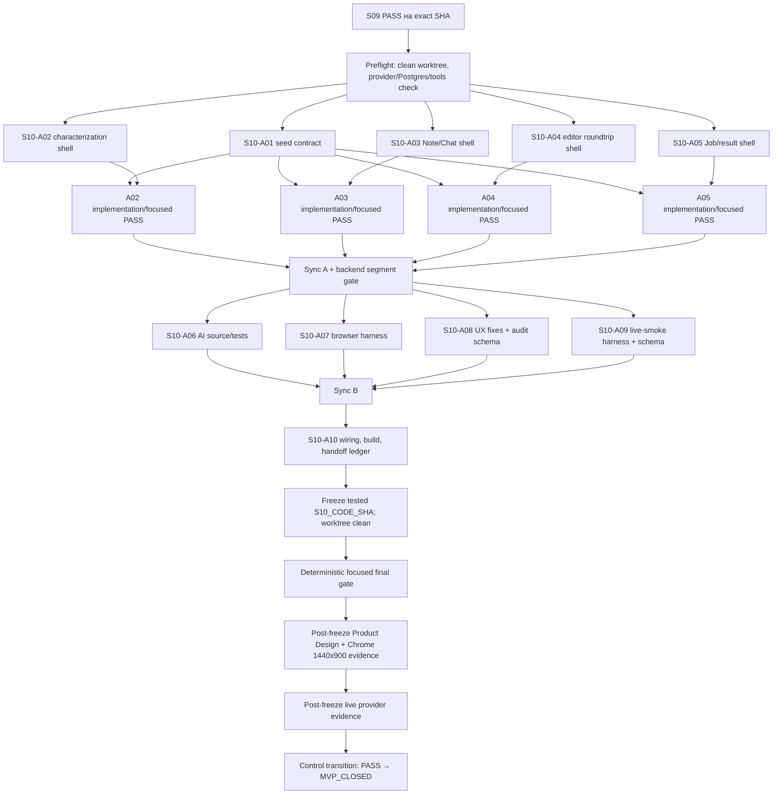
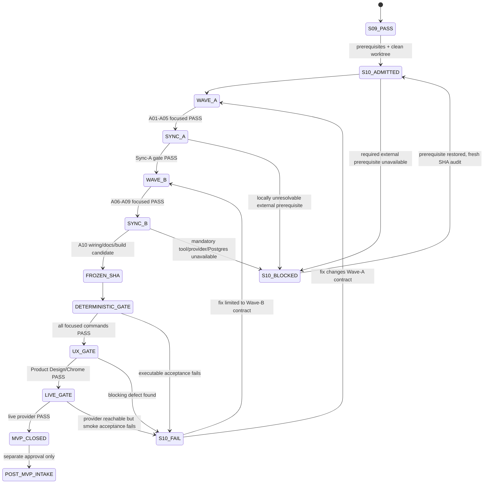

# Этап 10. Единый vertical slice, минимальная стабилизация и MVP handoff

> **Management transition record — 2026-07-25.** The user explicitly accepted
> every stage preceding
> `docs/superpowers/plans/2026-07-25-unified-board-workspace-version-convergence.md`
> for transition at repository SHA
> `4c98c0beffac69e1864b1e2651df55b1ee1319a3`. Status:
> `ACCEPTED FOR TRANSITION`. The technical status and raw evidence described in
> this handoff remain historical and unchanged; the decision does not assert a
> Stage 10 PASS. The NO-GO rules below are retained as historical acceptance
> policy but no longer block admission to the unified Board plan.

> **Для agentic workers:** этот этап обязательно выполнять через `superpowers:subagent-driven-development` или `superpowers:executing-plans`. Требуются все десять практических субагентов `S10-A01…S10-A10`; одновременно работают 3–5 независимых lanes. До начала реализации перечитать `/Volumes/Projects/ketos_canvas_mod_main/AGENTS.md` и `/Volumes/Projects/ketos_canvas_mod_main/14_KETOS_FINAL_MASTER_IMPLEMENTATION_PLAN.md` целиком. Каждый шаг отмечается checkbox-состоянием в рабочем ledger. Следующего продуктового этапа после Stage 10 нет: успешный результат закрывает MVP и допускает только отдельную Post-MVP-программу.

**Goal:** на одной чистой SQLite DB и одном неизменяемом exact SHA доказать весь Ketos MVP-путь, выполнить focused compatibility/UX/live-provider gates и передать воспроизводимый handoff без добавления новых продуктовых возможностей.

**Architecture:** Stage 10 не создаёт новую архитектуру. Он связывает уже завершённые Project=`Folder`, Board, Placement, BoardNote, ChatThread/ChatRun/MessageTable, Automation=`Flow`, Execution=`Job`, CommandProposal, CopilotKit/AG-UI и KFX/LangGraph contracts в один server-authoritative вертикальный сценарий. Допустимы только тестовые harness/seed/evidence, handoff-документация и минимальные исправления Critical или blocking дефектов в уже затронутых MVP seams.

**Tech stack:** Python/FastAPI/SQLModel/Alembic через `uv run`, SQLite, disposable PostgreSQL migration gate, React/TypeScript, Jest, Playwright Chromium, Vite production build, CopilotKit React, AG-UI, KFX/LangGraph, Product Design audit, Chrome 1440×900 и Computer Use для релевантной desktop/focus проверки.

---

## 1. Название и номер этапа

**Номер:** `S10`.

**Название:** «Единый vertical slice, минимальная стабилизация и MVP handoff».

**Тип этапа:** финальная MVP-интеграция и доказательство; это не feature stage, не release rollout и не production-hardening.

**Входное контрольное состояние:** `S09=PASS` на полном 40-символьном commit SHA, с сохранёнными DB/canonical-saver contracts и доказанным actual process restart.

**Выходное контрольное состояние:** русскоязычный отчёт использует ровно одну из трёх формулировок с однозначным внутренним gate: `этап выполнен` = `PASS`; `этап выполнен частично` = `FAIL`; `этап заблокирован` = `BLOCKED`. Формулировка `этап выполнен частично` всегда означает `FAIL` и `NO-GO`, а не промежуточный успешный статус. Только `этап выполнен` / `PASS` переводит управление в `MVP_CLOSED`; переход к Stage 11 или к неописанному continuation-stage запрещён.

**Обязательные deliverables:**

- `scripts/mvp/seed_vertical_slice.py`;
- `src/backend/tests/integration/test_mvp_vertical_slice.py`;
- `src/frontend/tests/core/features/ketos-mvp-vertical-slice.spec.ts`;
- `scripts/mvp/run_live_ai_smoke.py`;
- `scripts/mvp/validate_evidence_bundle.py`;
- `scripts/mvp/seal_evidence_bundle.py`;
- `docs/dev/handoff/KETOS_MVP.md`;
- committed schemas `docs/dev/handoff/evidence/stage-10/{evidence-manifest,entity-ledger,gate-results,live-ai-smoke,product-design-screenshot-manifest,final-journal}.schema.json`;
- immutable external run bundle `$KETOS_MVP_EVIDENCE_ROOT/stage-10/$S10_CODE_SHA/` в explicit persistent approved storage вне repo и вне ephemeral dev/acceptance roots, с фактическими `manifest.json`, `manifest.sha256`, `entity-ledger.json`, `gate-results.json`, `live-ai-smoke.json`, `final-journal.json`, `final-report.md` и одним bounded screenshot set `product-design/1440x900/`, созданным только A08; post-seal storage receipt хранится отдельным sibling `$KETOS_MVP_EVIDENCE_ROOT/stage-10/$S10_CODE_SHA.seal-receipt.json`;
- русскоязычный финальный отчёт по шаблону §15.

Все перечисленные новые пути являются явно owned Stage-10 evidence/harness paths. Не принадлежащие этапу generated artifacts, lock-файлы, deployment config, `LICENSE`, `NOTICE`, `_raw/`, `.raytsystem/`, ledger generations и generated knowledge не меняются.

## 2. Контекст

Stage 01–09 по отдельности доказывают transport, Project shell, Board persistence, Placement/Note, durable Chat, existing Flow Editor roundtrip, Job/result, AI preview/confirmation и restart recovery. Их локальные `PASS` не доказывают, что один пользователь может пройти все contracts подряд на одной DB и одном кодовом состоянии.

Stage 10 закрывает именно этот разрыв:

- backend integration test доказывает server-side identity, ownership, CAS, idempotency и restore;
- один real-API/real-DB Chromium story доказывает непрерывный пользовательский путь;
- один live-provider smoke отделяет deterministic fake-executor proof от фактического model-provider proof;
- Product Design + Chrome проверяют desktop happy path в одном размере `1440×900`;
- external handoff ledger связывает tested `S10_CODE_SHA`, DB/canonical saver paths, entity IDs, revisions/hashes, команды, exit codes и redacted outcomes;
- feature flag проверяется в состояниях off и on без удаления или пересоздания данных;
- Settings проверяется через единственный account entrypoint с корректным возвратом.

### Нормативный baseline

- Исходный baseline master-плана: `main@5fe1cb74fe8b2db8b48f66859cfbf72e56cf3782`, Alembic head `9a6e34f1c2d8`.
- Stage 10 не стартует от этого исторического SHA напрямую: он стартует только от exact `S09_PASS_SHA`, являющегося потомком baseline и содержащего объединённые Stage 01–09 deliverables.
- `MVP_BASE_SHA` — full SHA непосредственно перед Stage-10 branches.
- `S10_CODE_SHA` — full SHA после Sync B и всех source/test/committed schema/manifest/runbook changes. На нём выполняются все acceptance gates; после freeze до их завершения запрещены code/doc edits, merge и rebase.
- Фактические gate results, live-AI evidence и screenshots не коммитятся в tested tree и не остаются в ephemeral run directory: они записываются в persistent approved bundle `$KETOS_MVP_EVIDENCE_ROOT/stage-10/$S10_CODE_SHA/`.
- Если после gate требуется отдельный evidence/pointer commit, его SHA называется только `S10_EVIDENCE_SHA`; он никогда не подменяет и не объявляется tested `S10_CODE_SHA`.
- Любая исправленная ошибка создаёт новый `S10_CODE_SHA` и обнуляет предыдущую итоговую приёмку: полный Stage-10 final gate выполняется заново, в новом external bundle keyed by new SHA.

### Неподлежащие пересмотру контракты

- Project хранится только в `Folder`; новая Project table запрещена.
- Board geometry/viewport не записываются в `Flow.data`.
- Placement lifecycle не удаляет Note, Chat, Flow или Job entity.
- Новый Chat path использует stock CopilotKit UI и standard AG-UI; custom chat body/protocol/runtime запрещён.
- KFX/LangGraph остаётся единственным agent runtime.
- Automation открывает существующий fullscreen `src/frontend/src/pages/FlowPage/index.tsx`; embedded editable editor не создаётся.
- Browser не получает `x-api-key` и не применяет AI Flow patch.
- AI mutation требует durable proposal, preview и одноразовое confirmation; reject/stale/replay дают zero effect.
- Actor/owner выводится сервером; browser/LLM fields не являются auth source.
- Workspace остаётся UI shell; новая Workspace DB entity запрещена.

## 3. Цель

### Функциональная цель

Один authenticated owner на чистой SQLite DB должен последовательно:

1. создать Project и Board;
2. создать, отредактировать и переместить Note; сохранить bold/list/link и после reload увидеть sanitized rendering;
3. создать два независимых Chat и получить независимые replies с разными stable thread IDs;
4. разместить существующий Flow как Automation, открыть existing Flow Editor, вручную сохранить изменение и вернуться к тому же Board/Placement;
5. запустить Flow и увидеть `queued → running → succeeded` с bounded result; отдельная deterministic fixture доказывает `failed` и `unknown` без ложного success;
6. попросить AI изменить Flow, просмотреть preview, один раз отклонить, сформировать повторное предложение и один раз подтвердить;
7. перезапустить backend и frontend на той же DB и `KETOS_DATA_DIR`; отдельно зафиксировать `backend_pid_1`, `backend_pid_2`, `frontend_pid_1`, `frontend_pid_2`, доказать смерть старых listeners и readiness новых;
8. открыть прежний Board и сверить Project/Board/Placement/Note/Chat/Flow/Job/Command IDs, viewport, transcript, Flow revision/hash, result и restore status;
9. открыть `/settings` через единственный account entrypoint и вернуться на Board без появления второго Settings menu;
10. переключить `mvp_workspace`/`mvp_chat` off→on: UI и routes скрываются/возвращаются, server data и все IDs сохраняются.

### Доказательная цель

Итоговая приёмка должна связывать один tested `S10_CODE_SHA`, один clean SQLite file, canonical saver `$KETOS_DATA_DIR/mvp/langgraph-checkpoints.sqlite3`, один immutable external evidence bundle keyed by `S10_CODE_SHA`, полный focused gate, один desktop screenshot set и один live provider run. Исторические screenshots, локальные PASS отдельных lanes, app-factory restart, evidence commit SHA вместо code SHA и тесты на иной SHA доказательством Stage-10 `PASS` не являются.

### Ограничение по объёму

Этап исправляет только дефект, если он:

- блокирует один из десяти шагов канонического сценария;
- создаёт reachable Critical vulnerability в MVP route;
- нарушает exact identity, ownership, durable restore, confirmation, failure truth, feature-flag preservation, Settings entrypoint или existing Flow/KFX/LFX compatibility.

Все остальные улучшения заносятся в Post-MVP ledger с конкретным `PM-01…PM-10`; они не реализуются в Stage 10.

## 4. Подробное техническое задание

### 4.1 Clean integration worktree и exact-SHA discipline

Coordinator выполняет Stage 10 не в dirty root checkout, а в clean integration worktree и не более чем в пяти переиспользуемых lane worktrees. Рекомендуемый путь integration worktree: `/Volumes/Projects/.worktrees/ketos-mvp-stage10`; ветка: `codex/mvp-s10-integration`. Каждая lane branch имеет имя `codex/mvp-s10-aYY-*` и создаётся от текущего sync SHA.

Preflight-команды:

```bash
cd /Volumes/Projects/ketos_canvas_mod_main
git status --short
git rev-parse --verify HEAD
git merge-base --is-ancestor 5fe1cb74fe8b2db8b48f66859cfbf72e56cf3782 HEAD

raytsystem doctor --root /Volumes/Projects/ketos_canvas_mod_main --json
raytsystem status --root /Volumes/Projects/ketos_canvas_mod_main --json
raytsystem graph status --root /Volumes/Projects/ketos_canvas_mod_main --json
raytsystem lint --root /Volumes/Projects/ketos_canvas_mod_main --json
```

RaytSystem здесь используется только read-only. Graphify также используется только для навигации по уже существующему snapshot; rebuild Graphify как side effect запрещён. Source и runtime остаются authoritative.

Перед созданием worktree coordinator записывает:

```bash
export KETOS_STAGE10_ROOT=/Volumes/Projects/.worktrees/ketos-mvp-stage10
export S09_PASS_SHA="$(git rev-parse HEAD)"
export MVP_BASE_SHA="$S09_PASS_SHA"
test "$(printf '%s' "$S09_PASS_SHA" | wc -c | tr -d ' ')" -eq 40
git worktree add -b codex/mvp-s10-integration "$KETOS_STAGE10_ROOT" "$S09_PASS_SHA"
git -C "$KETOS_STAGE10_ROOT" status --porcelain=v1
```

Ожидание: последний command печатает пустую строку. Если путь уже занят, coordinator сначала выполняет read-only `git worktree list --porcelain` и выбирает новый явный путь; существующий чужой worktree не удаляется.

### 4.2 Раздельные development/focused и post-freeze acceptance roots

A01 создаёт только development/focused root через `mktemp` и печатает resolved absolute paths. Он используется при Wave A/B development и локальных focused cycles, но никогда не является финальным acceptance root.

```bash
export KETOS_STAGE10_DEV_RUN_DIR="$(mktemp -d /tmp/ketos-stage10-dev.XXXXXX)"
export KETOS_DATA_DIR="$KETOS_STAGE10_DEV_RUN_DIR/data"
export KETOS_DATABASE_URL="sqlite:///$KETOS_STAGE10_DEV_RUN_DIR/ketos-mvp.sqlite"
mkdir -p "$KETOS_DATA_DIR" "$KETOS_STAGE10_DEV_RUN_DIR/working"
test ! -e "$KETOS_STAGE10_DEV_RUN_DIR/ketos-mvp.sqlite"
test ! -e "$KETOS_DATA_DIR/mvp/langgraph-checkpoints.sqlite3"
```

После freeze `S10_CODE_SHA` §12.1 создаёт новый `KETOS_STAGE10_ACCEPTANCE_RUN_DIR` с новой DB и новым `KETOS_DATA_DIR`. Весь §12 выполняется один раз только на этом post-freeze root. Ни DB, ни entities, ни Chat/Job/Command state, ни provider run, ни PID evidence из development A07/A09 cycles не разрешено переносить или повторно использовать в acceptance.

`KETOS_DATA_DIR` — единственная production authority для saver location. Stage-09 canonical helper обязан самостоятельно разрешить exact path `$KETOS_DATA_DIR/mvp/langgraph-checkpoints.sqlite3`; произвольная checkpoint env variable или CLI option, конфигурирующая saver path, запрещена. До запуска приложения CLI может assert только deterministic derivation exact path; после запуска runtime harness дополнительно обязан assert существование saver именно по этому canonical path.

`scripts/mvp/seed_vertical_slice.py` принимает explicit DB URL/run ID, не читает production defaults, не создаёт duplicate logical seed и не записывает secrets. Он читает `KETOS_DATA_DIR`, может выполнить `--assert-canonical-saver-path`, но не принимает path value и не конфигурирует saver. Seed создаёт только минимальные deterministic identities/fixtures, нужные test harness; пользовательские create actions в browser story остаются реальными API mutations, а не подложенными localStorage records.

### 4.3 Persistent approved evidence root, sealing и identity ledger

Committed repo хранит только schemas/manifests/runbook. Фактический bundle создаётся после source freeze в заранее одобренном persistent root, заданном обязательной переменной `KETOS_MVP_EVIDENCE_ROOT`. Root обязан существовать, быть writable для coordinator и находиться вне repo, `$KETOS_STAGE10_DEV_RUN_DIR` и `$KETOS_STAGE10_ACCEPTANCE_RUN_DIR`. Missing/unwritable/ephemeral/in-repo root даёт `BLOCKED`; harness не создаёт и не выбирает его автоматически.

Canonical bundle path: `$KETOS_MVP_EVIDENCE_ROOT/stage-10/$S10_CODE_SHA`. Повторный acceptance не перезаписывает существующий keyed bundle: code change получает новый `S10_CODE_SHA`; повтор без code change требует отдельного одобренного immutable attempt namespace в manifest, а основной verdict остаётся однозначным.

Фактический `$KETOS_STAGE10_EVIDENCE_BUNDLE/entity-ledger.json` содержит:

- `s10_code_sha`, optional distinct `s10_evidence_sha`, `base_sha`, `alembic_head`, DB basename, `ketos_data_dir`, exact canonical saver path и redacted absolute run directory;
- owner user ID;
- Project/Folder ID;
- Board ID, revision и viewport x/y/zoom;
- Note entity ID, Note revision, Placement ID и geometry;
- оба ChatThread IDs, ChatRun IDs, LangGraph thread IDs, last committed `chat_sequence`;
- Flow ID, Flow revision/hash до manual edit, после manual edit, после reject, после approve и после restore-check;
- Automation Placement ID;
- Job ID, idempotency key hash, terminal status, result hash и Result Placement ID;
- rejected/stale/applied CommandProposal IDs, proposal hashes, base revisions, outcomes и audit record IDs;
- `backend_pid_1`, `backend_pid_2`, `frontend_pid_1`, `frontend_pid_2`, `backend_listener_1_dead`, `frontend_listener_1_dead`, `backend_readiness_2`, `frontend_readiness_2`;
- `source_worktree_clean_before_freeze`, `source_worktree_clean_after_gates` и подтверждение, что HEAD в обоих случаях равен `S10_CODE_SHA`;
- flag-off/flag-on readback IDs;
- timestamps/durations и redacted request IDs.

`manifest.json` связывает каждый artifact с relative path, SHA-256, byte size, `S10_CODE_SHA`, evidence owner, producing command, start/end, verdict и schema version. Manifest также фиксирует `retention_owner`, approved `retention_policy`, retention deadline/class, persistent root identity, `no_secret_qa` command/result и выбранный storage immutability control. Detached `manifest.sha256` хеширует сам manifest.

После schema/hash/no-secret QA bundle seal создаётся storage-level control approved для evidence root: например, APFS `uchg` с проверкой flags и failed mutation probe либо WORM/object-lock/read-only snapshot с provider receipt. `chmod -R a-w` допустим только как дополнительное hardening и сам по себе не является доказательством неизменяемости. Storage-issued receipt создаётся только после bundle seal и failed-mutation verification как external sibling `$KETOS_MVP_EVIDENCE_ROOT/stage-10/$S10_CODE_SHA.seal-receipt.json`; он содержит manifest SHA-256, owner, retention, applied control, verification command/result и timestamp и сам получает отдельный approved storage protection/receipt. Запись post-seal receipt внутрь уже sealed bundle запрещена. Ledger не содержит provider credentials, cookies, Authorization headers, API keys, raw prompts с секретами, raw result payload сверх bounded test value или filesystem content вне acceptance/evidence scope.

### 4.4 Feature flag and Settings contract

- `mvp_workspace=false` и `mvp_chat=false`: Project/Board workspace routes и new Chat surface недоступны, но owner APIs/data не удалены.
- После `true`: тот же direct Board URL снова открывается, IDs/revisions/hashes совпадают с ledger.
- Проверяется `src/frontend/src/stores/utilityStore.ts`, route guard в `src/frontend/src/routes.tsx`, Board/Project route classification и server config seam, созданные предыдущими этапами.
- Settings открывается только через `src/frontend/src/components/core/appHeaderComponent/components/AccountMenu/index.tsx` (`data-testid="menu_settings_button"`) и canonical `/settings` route.
- Проверяются `src/frontend/src/components/core/appHeaderComponent/__tests__/header-visibility.test.ts`, `src/frontend/src/components/core/appHeaderComponent/__tests__/app-header-visibility-contract.test.ts` и `src/frontend/src/pages/SettingsPage/__tests__/SettingsPage.test.tsx`.
- Flow Settings внутри `FlowMenu` не считается account Settings и не должен создавать второй global entrypoint.

### 4.5 Live provider condition

`scripts/mvp/run_live_ai_smoke.py` использует только уже configured provider/model через существующий Ketos server-side settings/provider seam. Скрипт:

1. проверяет provider availability без печати секрета;
2. использует созданные A01/A07 Project/Board/Chat/Flow IDs;
3. получает один реальный model reply;
4. создаёт безопасное typed Flow proposal;
5. выполняет reject и доказывает unchanged Flow hash;
6. создаёт новое proposal и выполняет approve;
7. доказывает один CAS effect и один durable audit outcome;
8. пишет redacted `$KETOS_STAGE10_EVIDENCE_BUNDLE/live-ai-smoke.json` и не меняет repo tree.

Отсутствие configured credentials/provider после проверки существующих Ketos settings и безопасных локальных alternatives означает `BLOCKED`, даже если deterministic gates зелёные. Новый model router, временный API key в коде, browser-side key или mock под видом live proof запрещены.

### 4.6 Обязательное использование инструментов

Исполнитель обязан использовать все доступные релевантные инструменты, а не заменять их пересказом:

- repository source: `rg`, targeted source slices, existing Graphify queries read-only;
- реализация и проверка: clean worktrees, `uv run`, Jest, Playwright, Vite build, migration tests, KFX/LFX gates;
- dependency-sensitive вопрос: Context7 resolve/query + official primary docs; если pinned API уже доказан и не меняется, повторная dependency mutation не нужна;
- UX: Product Design skill для focused audit и фиксации blocking findings;
- реальный browser: Chrome tool для happy path на viewport `1440×900`, network/console/DOM/focus проверки и screenshots;
- desktop interaction: Computer Use только для релевантных OS-level действий — размер/позиция окна, app switching, keyboard focus/Escape и restart observation; он не заменяет Playwright assertions или Chrome inspection;
- agent execution: десять практических субагентов, coordinator и независимая coordinator verification; reviewer-only agent не засчитывается в A01–A10.

Если обязательный Product Design/Chrome capability недоступен, A08 не получает `PASS`. Если Computer Use не нужен для конкретной проверки, ledger фиксирует `not_applicable` с конкретной причиной; если OS-level focus/window/restart action входит в фактический путь, отсутствие инструмента означает `BLOCKED`.

## 5. Перечень задач

### 5.1 Матрица субагентов и ownership

| ID | Роль | Практический deliverable | Единолично owned paths | Волна |
| --- | --- | --- | --- | --- |
| `S10-A01` | deterministic seed/fixture owner | идемпотентный clean-DB seed и stable fixture contract | `scripts/mvp/seed_vertical_slice.py`, seed-focused tests/fixtures внутри `src/backend/tests/integration/` | A |
| `S10-A02` | Project/Board closure owner | backend vertical segment ownership/viewport/direct identity | Project/Board segment в `src/backend/tests/integration/test_mvp_vertical_slice.py`; minimal fixes только в existing Project/Board services/routes | A |
| `S10-A03` | Note/Chat closure owner | Note formatting/placement + two durable CopilotKit chats/reload | Note/Chat segment теста; focused tests under `src/frontend/src/components/core/board/` and existing Chat paths | A |
| `S10-A04` | Automation/editor closure owner | Placement→existing Flow Editor→manual save→same Board roundtrip | Automation/editor segment; existing `src/frontend/src/pages/FlowPage/index.tsx` seam при blocking fix | A |
| `S10-A05` | Run/result closure owner | Job lifecycle/result/failure-truth deterministic segment | Run/result segment; existing Job/Board execution and ResultPlacement seams при blocking fix | A |
| `S10-A06` | AI confirmation closure owner | reject/stale/approve/restore exact-effect segment | AI segment in backend integration test и focused confirmation tests | B |
| `S10-A07` | full browser story owner | один real-API/DB Chromium story steps 1–10 | `src/frontend/tests/core/features/ketos-mvp-vertical-slice.spec.ts` | B |
| `S10-A08` | Product Design/i18n/desktop owner | blocking UX fixes, RU/EN, Settings/flag/focus proof, one screenshot set | locale files только при required correction; named header/Settings tests; committed screenshot manifest schema; runtime `$KETOS_STAGE10_EVIDENCE_BUNDLE/product-design/1440x900/` | B |
| `S10-A09` | live AI smoke owner | real configured provider proposal/reject/approve proof | `scripts/mvp/run_live_ai_smoke.py`, committed live-smoke schema; runtime `$KETOS_STAGE10_EVIDENCE_BUNDLE/live-ai-smoke.json` | B |
| `S10-A10` | integration/handoff owner | final wiring, production build compatibility, handoff runbook/schemas, bundle validator/sealer and external assembly | `docs/dev/handoff/KETOS_MVP.md`, committed schemas in `docs/dev/handoff/evidence/stage-10/`, `scripts/mvp/{validate_evidence_bundle,seal_evidence_bundle}.py`; shared registrars only after Sync B inputs; runtime bundle remains outside repo | B / final |

### 5.2 Общие assignment-поля для каждого субагента

Coordinator передаёт каждому A01–A10:

- full base SHA текущей Sync-точки;
- конкретную branch/worktree;
- writable paths и forbidden paths;
- входной interface contract;
- expected production/test/docs deliverable;
- один focused command и ожидаемый результат;
- downstream consumers;
- требование вернуть commit SHA, `git diff --stat`, changed paths, command, exit code и redacted evidence.

Практический результат обязателен. Аналитическая записка без committed test/harness/wiring/fix/evidence не засчитывает субагента.

### 5.3 Параллельность

- Одновременно активны максимум 5, минимум 3 субагента, пока есть три независимых готовых задачи.
- Heavy frontend build и Playwright не запускаются параллельно.
- A01 сначала фиксирует seed interface; A02–A05 могут параллельно писать non-conflicting segments/characterization tests по frozen contract.
- A10 не редактирует shared integration paths до получения всех входов A06–A09.
- `src/backend/tests/integration/test_mvp_vertical_slice.py` физически объединяет coordinator; lanes передают disjoint patches/commits, а не параллельно редактируют один worktree-файл.
- Locale registrars, shared routes, Playwright config, handoff docs и evidence index имеют одного владельца.

## 6. Подэтапы и шаги выполнения

### 6.1 Wave/Sync DAG



### 6.2 `S10-A01` — deterministic seed

**Parallel:** стартует первым; параллельно A02–A05 разрешены только characterization/test shells, не зависящие от фактически созданных IDs.

**Prerequisites:** `S09=PASS`; clean integration SHA; explicit empty `KETOS_DATABASE_URL`; Stage-09 canonical-saver/restart contract; applied migrations.

**Owner:** seed/fixture engineer; единственный владелец `scripts/mvp/seed_vertical_slice.py`.

**Steps:**

- [ ] Написать failing focused test: два вызова seed с одним `--seed-key stage10` создают один logical fixture set.
- [ ] Реализовать CLI с обязательными `--database-url`, `--seed-key`, `--output-seed-manifest` и boolean `--assert-canonical-saver-path`; произвольный saver path CLI/env не принимать.
- [ ] Использовать existing services/owner guards; direct SQL разрешён только для test-only cleanup/assertion, не для обхода business invariants.
- [ ] Сгенерировать deterministic UUIDv5 или существующий idempotency seam; не импортировать production data.
- [ ] Записать только stable seed identifiers и hashes; секреты и credentials не сериализовать.
- [ ] Выполнить seed дважды и сравнить row counts/IDs.

**Output:** seed script, focused test, frozen JSON schema для ledger, commit SHA.

**Verification:**

```bash
cd "$KETOS_STAGE10_ROOT"
uv run pytest src/backend/tests/integration/test_mvp_vertical_slice.py -k seed_idempotency -q
uv run python scripts/mvp/seed_vertical_slice.py \
  --database-url "$KETOS_DATABASE_URL" \
  --seed-key stage10 \
  --output-seed-manifest "$KETOS_STAGE10_DEV_RUN_DIR/working/seed-manifest.json" \
  --assert-canonical-saver-path
uv run python scripts/mvp/seed_vertical_slice.py \
  --database-url "$KETOS_DATABASE_URL" \
  --seed-key stage10 \
  --output-seed-manifest "$KETOS_STAGE10_DEV_RUN_DIR/working/seed-manifest.json" \
  --assert-canonical-saver-path
```

Expected: оба запуска exit `0`; второй запуск возвращает те же IDs, не добавляет rows и помечает logical seed как reused.

**Downstream:** A02–A07 и A09 получают frozen seed/ledger interface; A10 использует output при handoff.

### 6.3 `S10-A02` — Project/Board closure

**Parallel:** после seed interface freeze параллелен A03–A05.

**Prerequisites:** A01 contract; Stage-02/03 owner-only Project/Board APIs; clean DB.

**Owner:** backend Project/Board integration engineer.

**Steps:**

- [ ] Добавить failing segment `project_board`: create Folder-backed Project, create Board, update viewport через correct revision.
- [ ] Проверить owner success, foreign owner deny, NULL owner deny и stale revision `409`/zero write.
- [ ] Проверить direct read after session restart и exact Project/Board IDs.
- [ ] Исправить только blocking defect в existing Project/Board service/API seam; duplicate CRUD/cache запрещён.
- [ ] Записать Board revision и viewport в ledger fixture.

**Output:** `project_board` segment в `src/backend/tests/integration/test_mvp_vertical_slice.py`, minimal fix при необходимости, commit SHA.

**Verification:**

```bash
cd "$KETOS_STAGE10_ROOT"
uv run pytest src/backend/tests/integration/test_mvp_vertical_slice.py -k project_board -q
```

Expected: owner path PASS; foreign/NULL/stale cases deny без изменения persisted state.

**Downstream:** A07 browser story использует real APIs; A10 записывает Project/Board IDs/revision/viewport.

### 6.4 `S10-A03` — Note/Chat closure

**Parallel:** после seed interface freeze параллелен A02/A04/A05.

**Prerequisites:** A01; Stage-04 Placement/BoardNote; Stage-05 stock CopilotKit/AG-UI durable Chat; server-authoritative MessageTable snapshot.

**Owner:** Note/Chat integration engineer.

**Steps:**

- [ ] Добавить Note create/edit/move/reload assertions: bold/list/link persisted; raw HTML/unsafe URL не исполняются.
- [ ] Доказать entity/Placement separation: close Placement сохраняет Note и ChatThread; re-place возвращает те же entity IDs.
- [ ] Создать два ChatThread и два ChatRun с разными stable thread IDs; отправить distinct messages и доказать отсутствие transcript leakage.
- [ ] Reload/reconnect получает ordered `MESSAGES_SNAPSHOT` из MessageTable, а не localStorage.
- [ ] Проверить collapsed/offscreen Chat не держит активный stream.
- [ ] Исправить только blocking defects в existing Note/Chat seams; собственные composer/message-list/protocol запрещены.

**Output:** Note/Chat integration segment, focused frontend assertions, commit SHA.

**Verification:**

```bash
cd "$KETOS_STAGE10_ROOT"
uv run pytest src/backend/tests/integration/test_mvp_vertical_slice.py -k note_chat -q
cd src/frontend
npm test -- --runInBand src/components/core/board src/components/core/chats src/components/core/board/placements/ChatPlacement.test.tsx
```

Expected: distinct Note/Placement and Chat/Placement IDs, distinct threads/transcripts, sanitized Note, durable reload.

**Downstream:** A07 consumes UI/data contract; A08 audits visual/keyboard states; A10 records IDs/sequences.

### 6.5 `S10-A04` — Automation/editor closure

**Parallel:** после seed interface freeze параллелен A02/A03/A05.

**Prerequisites:** A01; Stage-06 Automation Placement; existing canonical Flow Editor and URL-backed return context.

**Owner:** Flow Editor roundtrip engineer.

**Steps:**

- [ ] Place existing owner Flow on same Project Board; reject wrong-project/foreign Flow.
- [ ] Record Flow ID/revision/hash before edit.
- [ ] Open canonical `/flow/:id` with validated `boardId`/`placementId` return context.
- [ ] Выполнить minimal manual edit через existing editor/save seam; reload editor and record changed revision/hash with same Flow ID.
- [ ] Return to exact Board/Placement; direct legacy `/flow/:id` behaviour remains unchanged.
- [ ] Исправить только roundtrip blocker; embedded editor, duplicate Flow store и Flow copy запрещены.

**Output:** Automation/editor segment and focused route/FlowPage fix if required, commit SHA.

**Verification:**

```bash
cd "$KETOS_STAGE10_ROOT/src/frontend"
npm test -- --runInBand \
  src/components/core/board/placements/AutomationPlacement.test.tsx \
  src/pages/FlowPage/__tests__/FlowPage-board-return.test.tsx
```

Expected: before/after hash differs, Flow ID unchanged, return opens same Placement, legacy route green.

**Downstream:** A05 runs the manually saved Flow; A06 builds proposal from current revision/hash; A07 executes browser roundtrip.

### 6.6 `S10-A05` — Run/result closure

**Parallel:** после seed interface freeze параллелен A02–A04; требует A04 frozen Flow identity before final assertions.

**Prerequisites:** A01; Stage-07 v1 Board session-auth adapter, existing Job/KFX executor, Result Placement, deterministic fake executor fixture.

**Owner:** Job/result integration engineer.

**Steps:**

- [ ] Запустить owned Flow with explicit idempotency key через v1 Board adapter.
- [ ] Доказать `queued → running → succeeded` и bounded result; один Job, один enqueue, один Result Placement.
- [ ] Повтор same key/fingerprint возвращает тот же Job; changed fingerprint даёт `409` и zero enqueue.
- [ ] Отдельно доказать `failed(reason)` и disconnect/no authoritative state→`unknown`; UI не показывает false success.
- [ ] Reload и restart-read возвращают terminal Job/result; result content безопасен.
- [ ] Исправить только blocking defect в existing Job/execution/result seam; новая ExecutionResult table или browser API key запрещены.

**Output:** Run/result segment, deterministic executor fixture, focused correction if required, commit SHA.

**Verification:**

```bash
cd "$KETOS_STAGE10_ROOT"
uv run pytest src/backend/tests/integration/test_mvp_vertical_slice.py -k run_result -q
cd src/frontend
npm test -- --runInBand \
  src/controllers/API/queries/executions \
  src/components/core/board/placements/ResultPlacement.test.tsx
```

Expected: one Job/result, honest status mapping, durable reload, no duplicate execution.

**Downstream:** Sync A; A07 browser story; A10 ledger Job/result fields.

### 6.7 Sync A

Coordinator merge order: `A01 → A02 → A03 → A04 → A05`. После каждого merge выполняется relevant focused command; после всех merges:

```bash
cd "$KETOS_STAGE10_ROOT"
uv run pytest src/backend/tests/integration/test_mvp_vertical_slice.py \
  -k 'seed_idempotency or project_board or note_chat or run_result' -q
cd src/frontend
npm test -- --runInBand \
  src/components/core/board \
  src/components/core/chats \
  src/pages/FlowPage/__tests__/FlowPage-board-return.test.tsx
```

Если Sync-A command красный, Wave B не стартует. Test failure = `FAIL`, не `BLOCKED`; coordinator исправляет defect, создаёт новый Sync-A SHA и повторяет gate.

### 6.8 `S10-A06` — AI confirmation closure

**Parallel:** после Sync A параллелен A07–A09.

**Prerequisites:** Sync-A SHA; current Flow revision/hash from A04; Stage-08 Command Kernel/standard AG-UI interrupt; Stage-09 durable resume.

**Owner:** Command/AI integration engineer.

**Steps:**

- [ ] Создать typed edit proposal с bounded preview и base revision/hash.
- [ ] Reject one proposal; доказать unchanged Flow hash/revision и durable rejected audit.
- [ ] Создать stale proposal, изменить base Flow и доказать stale/zero effect.
- [ ] Создать новое proposal и approve один раз; two concurrent approvals дают one CAS effect, второй zero effect/stale.
- [ ] Restart between preview and resolution; resume uses same thread/new run and resolves all open interrupts корректно.
- [ ] Проверить Restore last pre-AI snapshot: one CAS effect/audit, stale/replay zero effect.
- [ ] Проверить browser никогда не применяет patch; direct mutating/auto-apply path отсутствует в новом AG-UI flow.

**Output:** AI integration segment/focused tests, minimal Command/AG-UI fix if required, commit SHA.

**Verification:**

```bash
cd "$KETOS_STAGE10_ROOT"
uv run pytest \
  src/backend/tests/integration/test_mvp_vertical_slice.py \
  src/backend/tests/integration/test_ai_flow_preview_confirm.py \
  -k 'ai or proposal or reject or stale or approve or restore' -q
```

Expected: reject/stale/replay zero effect; approve/restore exactly one CAS effect and durable audit.

**Downstream:** A07 invokes the same production UI contract; A09 validates real-provider path; A10 records proposal ledger.

### 6.9 `S10-A07` — full browser story

**Parallel:** после Sync A параллелен A06/A08/A09; heavy Playwright запускается отдельно от build и других Playwright jobs.

**Prerequisites:** Sync-A SHA; A01 run directory/ledger contract; all real APIs and three-process orchestration; no localStorage fixture.

**Owner:** end-to-end Chromium engineer; единственный владелец `src/frontend/tests/core/features/ketos-mvp-vertical-slice.spec.ts`.

**Steps:**

- [ ] Создать one serial Chromium test с steps 1–10 из §3.
- [ ] Поднять backend, frontend и Copilot runtime с explicit `KETOS_DATABASE_URL` и `KETOS_DATA_DIR`; assert canonical saver `$KETOS_DATA_DIR/mvp/langgraph-checkpoints.sqlite3`, затем дождаться health/readiness.
- [ ] Использовать UI/API-created records; localStorage может быть очищен для server-wins proof, но не использован как fixture source.
- [ ] Зафиксировать IDs/hashes/revisions из API responses и UI-visible state в ledger attachment.
- [ ] Записать `backend_pid_1` и `frontend_pid_1`; остановить оба процесса, доказать `kill -0` failure и отсутствие listeners на их портах; запустить новые процессы как `backend_pid_2` и `frontend_pid_2`, доказать отличающиеся PID и readiness обоих новых listeners до restore assertions.
- [ ] Открыть Settings через `menu_settings_button`, вернуться на exact Board URL.
- [ ] Toggle flags off→on через supported config/test harness seam; verify route/data preservation.
- [ ] Снять trace/video только при failure; PASS-evidence screenshots оставляет A08, чтобы ownership не конфликтовал.

**Output:** `src/frontend/tests/core/features/ketos-mvp-vertical-slice.spec.ts`, orchestration adjustment only if blocking, commit SHA.

Любой A07 run до `S10_CODE_SHA` freeze является только development/focused proof на `$KETOS_STAGE10_DEV_RUN_DIR`. Его DB, entities, transcripts, process IDs и screenshots не входят в final acceptance. Итоговый A07 verdict возникает только при однократном §12.6 run на новом `$KETOS_STAGE10_ACCEPTANCE_RUN_DIR`.

**Verification:**

```bash
cd "$KETOS_STAGE10_ROOT/src/frontend"
npx playwright test -c playwright.mvp.config.ts \
  tests/core/features/ketos-mvp-vertical-slice.spec.ts \
  --project=chromium --workers=1
```

Expected: один story проходит все десять steps на clean DB, без mocks/localStorage data injection; ledger содержит четыре PID, old listeners dead и new backend/frontend readiness proof.

**Downstream:** A08 повторяет UX subset в Chrome; A10 включает exit code и entity ledger в handoff.

### 6.10 `S10-A08` — focused Product Design/i18n/desktop audit

**Parallel:** после Sync A параллелен A06/A07/A09; Chrome interactive audit стартует после A07 functional smoke, чтобы не диагностировать уже известный backend blocker как design defect.

**Prerequisites:** functional browser candidate; Product Design skill; Chrome; viewport exactly `1440×900`; Computer Use для OS-level window/focus/restart действий, если они входят в проверку.

**Owner:** Product Design/i18n/desktop engineer; единственный владелец screenshot set и locale corrections.

**Steps:**

- [ ] Через Product Design audit проверить только happy path и blocking loading/error/empty/reconnect states; полный design audit не выполнять.
- [ ] Через Chrome выставить viewport `1440×900`, проверить console/network errors, clipping/overlap, focus order, keyboard activation, Escape restore/focus return.
- [ ] Через Computer Use проверить реальное desktop окно, app switching и focus возврат там, где DOM assertions недостаточны.
- [ ] Проверить semantic tokens/components/ui; raw colors запрещены, кроме persisted Note color preview.
- [ ] Проверить RU и EN на одном пути: ключи, plural/interpolation parity, отсутствие нового hardcoded system English.
- [ ] Проверить один account Settings entrypoint, отсутствие duplicate global menu и return to Board.
- [ ] Проверить flag off/on visually и preservation IDs через API ledger.
- [ ] До Sync B committed output ограничить UX fixes/tests и screenshot-manifest schema; фактический screenshot capture не выполнять до freeze.
- [ ] После freeze `S10_CODE_SHA` создать один screenshot set во внешнем `$KETOS_STAGE10_EVIDENCE_BUNDLE/product-design/1440x900/`: `01-board-note-chat.png`, `02-automation-result.png`, `03-ai-preview-confirmation.png`, `04-settings-entry.png`, `05-restored-board.png`; manifest связывает каждый файл с `S10_CODE_SHA` и SHA-256.
- [ ] Исправить только blocking UX defect; non-blocking findings классифицировать в `PM-08`.

**Output:** bounded UX fixes, locale fixes и committed screenshot-manifest schema до source freeze; после freeze — five-file screenshot set во внешнем bundle и audit record без repo mutation.

**Verification:**

```bash
cd "$KETOS_STAGE10_ROOT/src/frontend"
npm run i18n:check
npm test -- --runInBand \
  src/components/core/appHeaderComponent/__tests__/header-visibility.test.ts \
  src/components/core/appHeaderComponent/__tests__/app-header-visibility-contract.test.ts \
  src/pages/SettingsPage/__tests__/SettingsPage.test.tsx \
  src/pages/BoardPage \
  src/components/core/board
```

Expected: locale parity, focus/Escape return, one Settings entry, no blocking visual defect at `1440×900`, exact screenshot filenames present.

**Downstream:** A10 includes audit outcome/screenshots; unresolved blocking defect prevents Sync B.

### 6.11 `S10-A09` — live AI smoke

**Parallel:** после Sync A параллелен A06–A08; может подготовить harness заранее, но live run выполняется на Sync-B/A10 candidate with configured provider.

**Prerequisites:** existing server-side provider configured; A06 proposal contract; A01/A07 entity IDs; network access only to configured provider endpoint.

**Owner:** live provider integration engineer; единственный владелец committed `scripts/mvp/run_live_ai_smoke.py`/schema и runtime `$KETOS_STAGE10_EVIDENCE_BUNDLE/live-ai-smoke.json`.

**Steps:**

- [ ] Провести provider preflight без раскрытия credentials; записать provider identifier/version, но не key.
- [ ] Получить real model reply через production Chat/AG-UI path.
- [ ] Выполнить safe proposal→reject and proposal→approve sequence.
- [ ] Проверить unchanged hash after reject и exactly one changed hash/revision after approve.
- [ ] Проверить one durable Command audit и one assistant transcript commit per logical run.
- [ ] Redact prompt/result fields и сохранить IDs/durations/outcomes/verified SHA.
- [ ] При provider absence проверить existing Ketos configuration и documented safe local provider; не создавать router или временную интеграцию.

**Output:** live smoke script/schema и commit SHA до freeze; redacted runtime evidence JSON в external bundle на frozen `S10_CODE_SHA` без source edit.

Provider state и entity IDs от A09 development/focused runs не переиспользуются. Final live run выполняется один раз в §12.8 на entities, созданных текущей post-freeze acceptance sequence, и пишет только в persistent `$KETOS_STAGE10_EVIDENCE_BUNDLE`.

**Verification:**

```bash
cd "$KETOS_STAGE10_ROOT"
uv run python scripts/mvp/run_live_ai_smoke.py \
  --database-url "$KETOS_DATABASE_URL" \
  --assert-canonical-saver-path \
  --entity-ledger "$KETOS_STAGE10_EVIDENCE_BUNDLE/entity-ledger.json" \
  --evidence "$KETOS_STAGE10_EVIDENCE_BUNDLE/live-ai-smoke.json"
```

Expected: exit `0`, real model reply, reject zero effect, approve one effect, no secret in stdout/stderr/evidence.

**Downstream:** A10 and final status. Missing provider/credentials after safe checks yields Stage-10 `BLOCKED`.

### 6.12 `S10-A10` — integration owner and MVP handoff

**Parallel:** начинает review/schema preparation во время Wave B, но shared wiring/docs merge только после A06–A09 committed outputs.

**Prerequisites:** A06–A09 focused PASS or explicit blocker evidence; Sync-B merge candidate.

**Owner:** integration/handoff engineer; shared registrar and handoff documentation owner.

**Steps:**

- [ ] Merge A06→A07→A08→A09 in DAG order; resolve only Stage-10 scope conflicts.
- [ ] Run focused integration commands after each merge; build only after all frontend inputs.
- [ ] Create committed `docs/dev/handoff/KETOS_MVP.md` plus evidence/ledger/live/screenshot JSON schemas and manifest schema with prerequisites, exact commands, known non-blocking Post-MVP gaps, clean-DB reproduction, canonical saver assertion, restart, Settings/flag and live-provider procedures.
- [ ] До source freeze commit schemas/runbook и `scripts/mvp/{validate_evidence_bundle,seal_evidence_bundle}.py`; после freeze проверить explicit persistent `KETOS_MVP_EVIDENCE_ROOT`, новый acceptance root и создать/finalize external `entity-ledger.json`, `gate-results.json`, `live-ai-smoke.json`, screenshot set, `final-journal.json`, `final-report.md` и `manifest.json`. Каждый record включает command, cwd, start/end, exit code, `S10_CODE_SHA`, owner, verdict и redacted artifact path.
- [ ] Создать SHA-256 каждого artifact и detached `manifest.sha256`; записать evidence ownership/retention и выполнить no-secret validator до seal.
- [ ] Применить approved storage-level immutability control и после failed-mutation probe сохранить external sibling `$S10_CODE_SHA.seal-receipt.json`, отдельно защищённый evidence store; `chmod` без verified storage control не закрывает gate.
- [ ] Run source guards: no custom Board chat/protocol/runtime, no new Workspace/Project/Automation/ExecutionResult tables, no KFX class rename, no browser API key, no `Flow.data` Board geometry.
- [ ] Run production build and full focused corpus from §12.
- [ ] Fix only touched MVP compatibility blockers; any fix produces a new commit and forces re-run of affected focused gate plus full final gate.
- [ ] Доказать clean worktree, freeze tested `S10_CODE_SHA` и предотвратить repo mutation during acceptance; optional later evidence/pointer commit получает отдельный `S10_EVIDENCE_SHA`.

**Output:** final wiring, committed runbook/schemas, external immutable evidence bundle, green build/focused gates и exact tested `S10_CODE_SHA`; optional `S10_EVIDENCE_SHA` маркируется отдельно.

**Verification:** полный §12, `git diff --check "$MVP_BASE_SHA"...HEAD`, prohibited-path audit и clean status.

**Downstream:** control transition only to `MVP_CLOSED` or an explicit Post-MVP intake after final Stage-10 status.

## 7. Зависимости

### 7.1 Жёсткие prerequisites

| Dependency | Required evidence | Missing/failed outcome |
| --- | --- | --- |
| Stage 09 | `PASS`, full SHA, canonical helper deriving `$KETOS_DATA_DIR/mvp/langgraph-checkpoints.sqlite3`, persistent DB/saver and actual restart proof | `BLOCKED`; Stage 10 не стартует |
| Stage 01 transport | pinned CopilotKit/AG-UI adapter contract, standard interrupt/resume | `FAIL` if regression on available artifact; `BLOCKED` if pinned immutable artifact unavailable externally |
| Stage 02–08 | merged deliverables and focused evidence on ancestor SHAs | `FAIL`; вернуть defect владельцу seam, не обходить |
| Clean SQLite | new absent DB path and applied migrations | `FAIL` if harness creates dirty/reused state; rerun from new explicit run dir |
| Disposable PostgreSQL | non-empty `MVP_POSTGRES_URI`, reachable dialect target | `BLOCKED` if unavailable; skip не считается PASS |
| Configured live provider | server-side provider/model usable without key exposure | `BLOCKED` if absent after safe alternatives |
| Product Design + Chrome | available audit/browser capability and 1440×900 viewport | A08 cannot PASS; unavailable mandatory capability is `BLOCKED` |
| Persistent approved evidence root | existing writable `KETOS_MVP_EVIDENCE_ROOT` outside repo and `/tmp`, owner/retention/seal-control metadata | `BLOCKED`; ephemeral/in-repo/unwritable root или отсутствие retention/immutability control не принимаются |
| KFX/LFX focused suites | isolated/frozen KFX install and LFX compatibility path | `FAIL` on regression |
| Clean worktrees | no unrelated dirty state in integration/lane roots | `BLOCKED` if safe isolation cannot be created; root dirtiness не перезаписывается |

### 7.2 Dependency-sensitive documentation

Stage 10 не меняет dependency versions по умолчанию. Если blocking fix требует внешнего SDK/API change, агент до изменения выполняет Context7 resolve/query и сверяет official primary docs. Handoff записывает library ID, exact version/commit/hash, checked contract и source URL. При недоступном Context7 изменение SDK не начинается и задача получает `BLOCKED`; model memory не является substitute.

### 7.3 Запрещённые зависимости

- новый model router/MCP orchestrator/agent runtime;
- new Workspace/Project/Automation/ExecutionResult domain;
- custom AG-UI/SSE/WebSocket protocol;
- browser API key;
- production data import;
- new lockfile/dependency change без отдельного dependency registrar и доказанной необходимости;
- Electron/OpenSwarm backend, arbitrary web cards, scheduler, embedded editor, collaboration, load/soak infrastructure.

## 8. Ожидаемые результаты

### 8.1 Продуктовый результат

- Один пользователь проходит steps 1–10 без ручного DB вмешательства.
- Все persisted IDs переживают reload, flag off/on и actual process restart.
- Note content/geometry, Chat thread/transcript, Flow/Placement, Job/result и Command audit сохраняют separation.
- Failure/unknown никогда не отображаются как success.
- AI reject/stale/replay безопасны; approve/restore выполняются ровно один раз.
- Settings доступен через один global account entrypoint.
- Existing Flow Editor/API/KFX/LFX сохраняют compatibility.

### 8.2 Инженерный результат

- Clean DB seed воспроизводим и идемпотентен.
- Один backend integration file покрывает вертикальные segments.
- Один browser story доказывает реальный пользовательский путь.
- Final focused gate выполнен на одном tested `S10_CODE_SHA`.
- Один live-provider evidence отделён от deterministic tests.
- Handoff позволяет новому инженеру воспроизвести путь на чистой DB без скрытого знания.

### 8.3 Документальный результат

Committed `docs/dev/handoff/KETOS_MVP.md` содержит runbook и schemas ожидаемых полей, но не фактические mutable gate outputs:

- описание mapping статуса и обязательного поля tested `S10_CODE_SHA`;
- prerequisites and environment names;
- clean DB/`KETOS_DATA_DIR` creation и assertion canonical saver path;
- seed/run/restart/flag/Settings/live commands;
- command/exit-code table schema;
- external entity ledger/bundle contract and redaction rules;
- external evidence bundle manifest and screenshot-set path keyed by `S10_CODE_SHA`;
- known non-blocking gaps mapped to `PM-01…PM-10`;
- rollback/recovery notes limited to MVP;
- explicit statement: MVP usable for practical product validation, not production-ready/commercial release.

Фактические статус, `S10_CODE_SHA`, commands, exit codes, entity ledger, live run, screenshots и final journal находятся только в immutable external bundle `$KETOS_STAGE10_EVIDENCE_BUNDLE`; optional `S10_EVIDENCE_SHA` может ссылаться на bundle, но не заменяет tested SHA.

## 9. Критерии приёмки каждой задачи

| Task | Required PASS evidence | Task FAIL | Task BLOCKED |
| --- | --- | --- | --- |
| A01 | two seed runs, same IDs/counts, clean DB, no secrets | duplicate rows, production import, implicit DB | migrations/runtime unavailable outside task control |
| A02 | owner Project/Board/viewport PASS; foreign/NULL/stale deny | lost update, metadata leak, wrong identity | missing S03 contract despite verified prior-stage artifact |
| A03 | sanitized Note; two independent durable chats; reload | transcript leakage, custom UI/protocol, data loss | pinned transport artifact unavailable externally |
| A04 | same Flow ID, changed manual-save hash, same Board return | embedded/copy editor, lost return, legacy route regression | existing editor cannot start due external prerequisite after safe checks |
| A05 | one Job/enqueue/result; failed/unknown truth; reload | duplicate execution, false success, unsafe render | required executor service unavailable externally |
| A06 | reject/stale/replay zero effect; approve/restore one CAS/audit | bypass, duplicate apply, inconsistent audit | durable transaction seam absent and cannot be safely provided within scope |
| A07 | one Chromium story steps 1–10, real API/DB, four PID fields, old listeners dead, new backend/frontend readiness | mock/localStorage proof, missing step, stale listener, flaky unresolved story | required browser/process capability unavailable after alternatives |
| A08 | Product Design+Chrome 1440×900, RU/EN, focus, Settings, screenshot set | blocking visual/focus/i18n issue remains | mandatory capability unavailable |
| A09 | real reply, reject zero, approve one, redacted evidence | mock called live, leaked secret, duplicate change | configured provider/credentials unavailable |
| A10 | build + all final gates + tested `S10_CODE_SHA`, immutable external bundle and complete handoff | missing command/evidence, compatibility regression, dirty scope or evidence/code SHA conflation | Postgres/live/mandatory external capability unavailable |

Task-level `PASS` не является Stage-level `PASS`; coordinator обязан независимо повторить final gate после объединения.

## 10. Общие критерии завершения этапа

### 10.1 Обязательный acceptance checklist

- [ ] `S10-A01…S10-A10` имеют practical commits/deliverables и focused PASS.
- [ ] Все изменения объединены в clean integration worktree.
- [ ] `S10_CODE_SHA` — один полный 40-символьный tested code SHA; gate не смешивает результаты иных SHA, а optional `S10_EVIDENCE_SHA` явно отделён.
- [ ] После freeze создан новый `KETOS_STAGE10_ACCEPTANCE_RUN_DIR`; его DB и canonical saver отсутствовали до §12, а dev A07/A09 state не использован.
- [ ] SQLite DB создана с нуля; production data отсутствуют.
- [ ] PostgreSQL migration checks реально выполнены; отсутствие URI не было превращено в skip/PASS.
- [ ] Browser story прошёл steps 1–10 на real API/DB.
- [ ] Actual backend/frontend restart использовал те же DB и `KETOS_DATA_DIR`; ledger содержит `backend_pid_1/2`, `frontend_pid_1/2`, old-listener-dead и new-readiness proof.
- [ ] CopilotKit/AG-UI — единственный новый Chat path; custom body/protocol/runtime не добавлен.
- [ ] KFX/LangGraph — единственный agent runtime.
- [ ] Existing Flow Editor/API/KFX/LFX identifiers/ABI не сломаны.
- [ ] Entity/Placement lifecycle separation сохранён.
- [ ] AI confirmation/replay/stale/reject contracts доказаны.
- [ ] Settings имеет один account entrypoint.
- [ ] Flag off/on скрывает/возвращает UI/routes без потери server data.
- [ ] Product Design + Chrome `1440×900` audit и bounded screenshot set завершены во внешнем immutable bundle keyed by `S10_CODE_SHA`.
- [ ] Live provider smoke завершён без нового router и без secret leakage.
- [ ] Нет unresolved Critical в reachable canonical path.
- [ ] Unrelated dirty state и forbidden paths не изменены.
- [ ] Source worktree clean непосредственно до freeze и после всех gates; runtime evidence не записывалось в repo.
- [ ] Persistent bundle находится в approved `$KETOS_MVP_EVIDENCE_ROOT/stage-10/$S10_CODE_SHA` и содержит hashes/owner/retention/no-secret; защищённый внешний sibling seal receipt существует отдельно, связывает manifest SHA с storage-level seal и никогда не записывается внутрь уже sealed bundle; permission-only hardening не выдано за immutability.
- [ ] Handoff runbook/schemas и external ledgers имеют exact commands, exit codes, IDs/hashes, `S10_CODE_SHA` и redacted evidence.

### 10.2 Контроль перехода



### 10.3 Строгая карта статусов

| Отчётная формулировка | Внутренний gate | Meaning | Control transition |
| --- | --- | --- | --- |
| `этап выполнен` | `PASS` | A01–A10, deterministic, UX и live gates зелёные на tested `S10_CODE_SHA`; no Critical; external handoff complete | `MVP_CLOSED`; разрешён только отдельно согласованный Post-MVP intake/closure |
| `этап выполнен частично` | `FAIL` | Проверка была запущена на доступных prerequisites, но acceptance не достигнут или blocking defect остаётся | всегда `NO-GO`: исправить минимально, получить новый SHA, повторить required focused + full final gate |
| `этап заблокирован` | `BLOCKED` | Внешний/локально неустранимый prerequisite отсутствует после безопасных alternatives: provider, Postgres, immutable dependency/tool capability, safe worktree | `NO-GO`: не продолжать и не заявлять MVP complete; записать exact blocker и minimal unblock |

Других внутренних gate-статусов нет. Фраза `этап выполнен частично` является только обязательным русскоязычным отображением `FAIL`; она не разрешает переход и не вводит дополнительное внутреннее состояние. Формулировки с предупреждением, условным успехом или пропуском проверки не разрешены.

## 11. Риски, блокеры и способы устранения

| Risk/blocker | Detection | Allowed mitigation | Forbidden response |
| --- | --- | --- | --- |
| Dirty root/overlapping user changes | `git status --short`, `git worktree list` | clean integration/lane worktrees from exact S09 SHA | overwrite/stash/delete unrelated user state |
| Seed accidentally uses production DB | explicit absent DB test, resolved URL log | new `mktemp` directory and mandatory CLI URL | implicit default/import/copy production DB |
| Shared test file merge conflicts | lane ownership + disjoint patches | coordinator sequential merge A01→A05 | concurrent edits in same worktree |
| False end-to-end via mocks/localStorage | network/API trace, DB ledger | real three-process stack and server IDs | localStorage fixture as truth |
| Flaky browser timing | deterministic readiness/state assertions | event/API-based waits, one worker | arbitrary long sleeps, retry until green without cause |
| Provider unavailable | server-side settings preflight | existing configured local/remote provider only | add router, expose key, label mock as live |
| Postgres URI absent | explicit `test -n "$MVP_POSTGRES_URI"` before pytest | provision approved disposable DB | allow pytest skip and call it PASS |
| Secret leakage | scan stdout/evidence/logs | redact allowlisted fields, hash identifiers where required | commit cookies/keys/raw headers |
| AI double apply | concurrent approve + CAS/audit assertions | fix Command transaction/idempotency seam | client-side guard as sole protection |
| Wrong Flow/Board identity after editor | ledger IDs and return URL | fix existing URL validation/cache seam | clone Flow or create embedded editor |
| Restart only app-factory или stale listener | four-PID ledger, `kill -0`, port-listener checks and readiness probes | actual backend/frontend stop, old-listener-dead proof, new start/readiness on same DB/`KETOS_DATA_DIR` | in-process object recreation or PID inequality alone as proof |
| Blocking UX at 1440×900 | Product Design/Chrome audit | minimal touched-path fix | expand into full responsive redesign |
| New feature temptation | diff review against §3 scope | map non-blocking work to PM ledger | implement scheduler/search/RBAC/load tooling |
| Compatibility regression | KFX/LFX/Flow focused gates | minimal fix in touched MVP seam | rename persisted component/class/manifest |
| Self-referential SHA/evidence cycle | compare repo HEAD/clean state and external manifest `s10_code_sha` | commit runbook/schemas first, freeze `S10_CODE_SHA`, write runtime artifacts only to external bundle; optional later pointer commit=`S10_EVIDENCE_SHA` | commit actual results/screenshots and claim resulting SHA was tested code |
| Acceptance contamination from dev run | absent DB/saver checks, acceptance root path and ledger provenance | allocate a new post-freeze `mktemp` root and run all §12 gates once | reuse A07/A09 DB, IDs, provider result, PID or screenshots |
| Ephemeral/unsealed evidence | persistent-root preflight, manifest hashes, owner/retention, no-secret report and seal receipt | use approved external storage control with verified failed-mutation probe | store final bundle under repo or `/tmp`; treat `chmod` alone as immutable proof |

Critical/security defect reachable in canonical MVP path cannot be moved to Post-MVP. Non-blocking findings must include exact reproduction, impacted path and one `PM-xx` owner in handoff.

## 12. Тестирование, проверка и документация

Порядок обязателен: development/focused cycles завершаются до этого раздела. После Sync B/A10 commits §12.1 фиксирует `S10_CODE_SHA`, создаёт новый пустой acceptance root и новый persistent keyed evidence bundle; затем вся последовательность §12.2–§12.8 выполняется ровно один раз на этом acceptance root. §12.9 проверяет неизменность source, hashes/no-secret/seal external bundle; §12.10 завершает QA. Любой code fix аннулирует весь acceptance run: старый root/bundle не переиспользуются, новый SHA проходит §12 с начала.

### 12.1 Post-freeze acceptance isolation и persistent evidence admission

```bash
cd "$KETOS_STAGE10_ROOT"
if [ -n "$(git status --porcelain=v1)" ]; then
  echo "FAIL: source worktree must be clean before S10_CODE_SHA freeze" >&2
  exit 1
fi
export S10_CODE_SHA="$(git rev-parse HEAD)"
test "$(printf '%s' "$S10_CODE_SHA" | wc -c | tr -d ' ')" -eq 40
git diff --check "$MVP_BASE_SHA"..."$S10_CODE_SHA"
git diff --name-only "$MVP_BASE_SHA"..."$S10_CODE_SHA"

export KETOS_STAGE10_ACCEPTANCE_RUN_DIR="$(mktemp -d /tmp/ketos-stage10-acceptance.XXXXXX)"
export KETOS_DATA_DIR="$KETOS_STAGE10_ACCEPTANCE_RUN_DIR/data"
export KETOS_DATABASE_URL="sqlite:///$KETOS_STAGE10_ACCEPTANCE_RUN_DIR/ketos-mvp.sqlite"
mkdir -p "$KETOS_DATA_DIR"
test ! -e "$KETOS_STAGE10_ACCEPTANCE_RUN_DIR/ketos-mvp.sqlite"
test ! -e "$KETOS_DATA_DIR/mvp/langgraph-checkpoints.sqlite3"

if [ -z "${MVP_POSTGRES_URI:-}" ]; then
  echo "BLOCKED: MVP_POSTGRES_URI is required for Stage-10 acceptance" >&2
  exit 2
fi
if [ -z "${KETOS_MVP_EVIDENCE_ROOT:-}" ] || [ ! -d "$KETOS_MVP_EVIDENCE_ROOT" ] || [ ! -w "$KETOS_MVP_EVIDENCE_ROOT" ]; then
  echo "BLOCKED: KETOS_MVP_EVIDENCE_ROOT must name an existing writable approved persistent root" >&2
  exit 2
fi
if [ -z "${KETOS_MVP_EVIDENCE_OWNER:-}" ] || [ -z "${KETOS_MVP_EVIDENCE_RETENTION_POLICY:-}" ] || [ -z "${KETOS_MVP_EVIDENCE_SEAL_CONTROL:-}" ]; then
  echo "BLOCKED: evidence owner, retention policy, and seal control are required" >&2
  exit 2
fi

export KETOS_MVP_EVIDENCE_ROOT="$(cd "$KETOS_MVP_EVIDENCE_ROOT" && pwd -P)"
export KETOS_STAGE10_ROOT_REAL="$(cd "$KETOS_STAGE10_ROOT" && pwd -P)"
export KETOS_STAGE10_ACCEPTANCE_RUN_DIR_REAL="$(cd "$KETOS_STAGE10_ACCEPTANCE_RUN_DIR" && pwd -P)"
case "$KETOS_MVP_EVIDENCE_ROOT/" in
  "$KETOS_STAGE10_ROOT_REAL/"*|"$KETOS_STAGE10_ACCEPTANCE_RUN_DIR_REAL/"*|/tmp/*|/private/tmp/*)
    echo "BLOCKED: evidence root must be outside repo and ephemeral run directories" >&2
    exit 2
    ;;
esac

export KETOS_STAGE10_EVIDENCE_BUNDLE="$KETOS_MVP_EVIDENCE_ROOT/stage-10/$S10_CODE_SHA"
export KETOS_STAGE10_SEAL_RECEIPT="$KETOS_MVP_EVIDENCE_ROOT/stage-10/$S10_CODE_SHA.seal-receipt.json"
if [ -e "$KETOS_STAGE10_EVIDENCE_BUNDLE" ] || [ -e "$KETOS_STAGE10_SEAL_RECEIPT" ]; then
  echo "BLOCKED: immutable evidence bundle or seal receipt for S10_CODE_SHA already exists; overwrite is forbidden" >&2
  exit 2
fi
mkdir -p "$KETOS_STAGE10_EVIDENCE_BUNDLE/product-design/1440x900"

uv run python -c 'import sys; print(sys.version)'
node --version
npm --version
```

§12.1 фиксирует acceptance identity. `$KETOS_STAGE10_DEV_RUN_DIR`, dev DB, earlier A07/A09 entities/provider state/PIDs и любые pre-freeze evidence не копируются в новый root или bundle. Missing/unwritable/unapproved persistent evidence root классифицируется как `BLOCKED`; никакая часть §12.2–§12.10 не запускается на неоднозначном baseline.

### 12.2 Focused deterministic backend and restart gate

```bash
cd "$KETOS_STAGE10_ROOT"
uv run pytest \
  src/backend/tests/integration/test_mvp_vertical_slice.py \
  src/backend/tests/integration/test_mvp_restart_recovery.py -q
```

Expected: selected backend persistence/recovery contracts PASS on the fresh acceptance root. Four-PID backend/frontend listener and readiness acceptance не приписывается pytest; она принадлежит только Playwright orchestration §12.6.

### 12.3 SQLite/PostgreSQL migration dialect gate

```bash
cd "$KETOS_STAGE10_ROOT"
MIGRATION_VALIDATION_CI=1 uv run pytest \
  'src/backend/tests/unit/alembic/test_migration_execution.py::test_no_phantom_migrations[sqlite]' \
  'src/backend/tests/unit/alembic/test_migration_execution.py::test_upgrade_from_main_branch[sqlite]' -q

if [ -z "${MVP_POSTGRES_URI:-}" ]; then
  echo "BLOCKED: MVP_POSTGRES_URI is required for the PostgreSQL migration gate" >&2
  exit 2
fi
MIGRATION_VALIDATION_CI=1 KETOS_TEST_DATABASE_URI="$MVP_POSTGRES_URI" uv run pytest \
  'src/backend/tests/unit/alembic/test_migration_execution.py::test_no_phantom_migrations[postgres]' \
  'src/backend/tests/unit/alembic/test_migration_execution.py::test_upgrade_from_main_branch[postgres]' -q
```

Postgres tests, возвращающие skip, не закрывают gate; external `$KETOS_STAGE10_EVIDENCE_BUNDLE/gate-results.json` обязан показать executed test node IDs and exit `0`.

### 12.4 KFX/LFX compatibility gate

```bash
cd "$KETOS_STAGE10_ROOT/src/kfx"
uv run --isolated --frozen --package kfx pytest \
  tests/unit/test_flow_builder_tools.py \
  tests/unit/test_flow_builder.py -q

cd "$KETOS_STAGE10_ROOT"
uv run pytest src/compat/lfx/tests/test_lfx_compatibility.py -q
```

Expected: persisted class names, schemas, tool contracts and LFX compatibility unchanged.

### 12.5 Frontend focused unit/i18n/type/build gate

```bash
cd "$KETOS_STAGE10_ROOT/src/frontend"
npm test -- --runInBand \
  src/pages/BoardPage \
  src/components/core/board \
  src/components/core/assistantPanel \
  src/components/core/appHeaderComponent/__tests__/header-visibility.test.ts \
  src/components/core/appHeaderComponent/__tests__/app-header-visibility-contract.test.ts \
  src/pages/SettingsPage/__tests__/SettingsPage.test.tsx
npm run i18n:check
npm run type-check:production
npm run build
```

Heavy `npm run build` выполняется отдельно, когда Playwright и другие heavy commands не запущены.

### 12.6 One Chromium vertical story

```bash
cd "$KETOS_STAGE10_ROOT/src/frontend"
npx playwright test -c playwright.mvp.config.ts \
  tests/core/features/ketos-mvp-vertical-slice.spec.ts \
  --project=chromium --workers=1
```

Playwright orchestration является единственным владельцем финального four-PID proof и обязана внутри этого fresh acceptance run:

1. после initial backend/frontend readiness записать `backend_pid_1` и `frontend_pid_1`;
2. остановить оба процесса, дождаться exit, доказать `kill -0` failure для обоих старых PID и отсутствие listener на backend/frontend ports;
3. запустить backend/frontend с теми же acceptance `KETOS_DATABASE_URL` и `KETOS_DATA_DIR`, записать отличающиеся `backend_pid_2` и `frontend_pid_2`;
4. доказать new backend health/readiness и frontend served-app readiness до UI restore assertions;
5. записать четыре PID, `backend_listener_1_dead`, `frontend_listener_1_dead`, `backend_readiness_2`, `frontend_readiness_2`, commands/timestamps/verdict в external entity/gate ledgers.

Expected: one story, steps 1–10, fresh acceptance DB, real APIs, four-PID restart proof, Settings, flags, no localStorage fixture. PID inequality без old-listener-dead и new-readiness evidence не закрывает gate. Ни один earlier A07 process/entity state не разрешено использовать.

### 12.7 Product Design + Chrome + Computer Use gate

1. Product Design skill выполняет focused critique happy path and blocking states.
2. Chrome открывает running candidate на `1440×900`; проверяются console/network, DOM semantics, focus, Escape, Settings and flag states.
3. Computer Use выполняет OS-level viewport/window/focus/app-switch/restart observation, если это требуется фактическим desktop path.
4. A08 сохраняет ровно пять named screenshots из §6.10 во внешнем `$KETOS_STAGE10_EVIDENCE_BUNDLE/product-design/1440x900/`.
5. Аудит возвращает `PASS` только при отсутствии blocking visual/focus/i18n defect.

Automation or browser screenshot alone не заменяет этот interactive gate.

### 12.8 Live AI gate

```bash
cd "$KETOS_STAGE10_ROOT"
uv run python scripts/mvp/run_live_ai_smoke.py \
  --database-url "$KETOS_DATABASE_URL" \
  --assert-canonical-saver-path \
  --entity-ledger "$KETOS_STAGE10_EVIDENCE_BUNDLE/entity-ledger.json" \
  --evidence "$KETOS_STAGE10_EVIDENCE_BUNDLE/live-ai-smoke.json"
```

Expected: real model reply, reject zero effect, approve one CAS effect, no secret leakage.

### 12.9 Post-gate source identity, manifest hashes, no-secret QA и immutable seal

После однократного выполнения §12.2–§12.8 на acceptance root source обязан остаться на frozen SHA, а persistent bundle проходит schema/hash/secret/seal validation:

```bash
cd "$KETOS_STAGE10_ROOT"
test "$(git rev-parse HEAD)" = "$S10_CODE_SHA"
if [ -n "$(git status --porcelain=v1)" ]; then
  echo "FAIL: source worktree changed after S10_CODE_SHA freeze" >&2
  exit 1
fi

uv run python scripts/mvp/validate_evidence_bundle.py \
  --bundle "$KETOS_STAGE10_EVIDENCE_BUNDLE" \
  --schema-dir docs/dev/handoff/evidence/stage-10 \
  --s10-code-sha "$S10_CODE_SHA" \
  --owner "$KETOS_MVP_EVIDENCE_OWNER" \
  --retention-policy "$KETOS_MVP_EVIDENCE_RETENTION_POLICY" \
  --deny-secrets \
  --write-no-secret-report "$KETOS_STAGE10_EVIDENCE_BUNDLE/no-secret-qa.json" \
  --write-manifest "$KETOS_STAGE10_EVIDENCE_BUNDLE/manifest.json"

(
  cd "$KETOS_STAGE10_EVIDENCE_BUNDLE"
  shasum -a 256 manifest.json > manifest.sha256
)

uv run python scripts/mvp/seal_evidence_bundle.py \
  --bundle "$KETOS_STAGE10_EVIDENCE_BUNDLE" \
  --control "$KETOS_MVP_EVIDENCE_SEAL_CONTROL" \
  --manifest-sha-file "$KETOS_STAGE10_EVIDENCE_BUNDLE/manifest.sha256" \
  --owner "$KETOS_MVP_EVIDENCE_OWNER" \
  --retention-policy "$KETOS_MVP_EVIDENCE_RETENTION_POLICY" \
  --verify-final-no-secrets \
  --external-receipt "$KETOS_STAGE10_SEAL_RECEIPT"

test -f "$KETOS_STAGE10_EVIDENCE_BUNDLE/manifest.json"
test -f "$KETOS_STAGE10_EVIDENCE_BUNDLE/manifest.sha256"
test -f "$KETOS_STAGE10_EVIDENCE_BUNDLE/no-secret-qa.json"
test -f "$KETOS_STAGE10_SEAL_RECEIPT"
test -f "$KETOS_STAGE10_EVIDENCE_BUNDLE/entity-ledger.json"
test -f "$KETOS_STAGE10_EVIDENCE_BUNDLE/gate-results.json"
test -f "$KETOS_STAGE10_EVIDENCE_BUNDLE/live-ai-smoke.json"
test -f "$KETOS_STAGE10_EVIDENCE_BUNDLE/final-journal.json"
test -f "$KETOS_STAGE10_EVIDENCE_BUNDLE/final-report.md"
```

`validate_evidence_bundle.py` хеширует каждый evidence artifact до manifest creation, проверяет schemas, owner/retention fields и запрещённые secret-bearing fields/patterns. Detached checksum создаётся изнутри bundle и не раскрывает absolute storage path. `seal_evidence_bundle.py` повторно сканирует final bundle bytes, применяет storage-level control, выполняет failed-mutation probe и только после этого получает/создаёт external storage receipt, связанный с `manifest.sha256` и final no-secret verdict. Receipt хранится sibling к sealed bundle и сам получает отдельную store protection; двухфазная операция не пишет внутрь bundle после seal. Изменение permission bits без verified external receipt не даёт `PASS`. Worktree clean proof фиксируется до freeze в §12.1 и после gates здесь. Если нужен последующий evidence/pointer commit, coordinator сначала сохраняет sealed persistent bundle, затем создаёт отдельный `S10_EVIDENCE_SHA`; этот commit не изменяет значение `S10_CODE_SHA` и не объявляется SHA, на котором выполнялись gates.

### 12.10 Документация и evidence QA

Проверить:

- committed `docs/dev/handoff/KETOS_MVP.md` читается как standalone runbook, а committed JSON schemas/manifests валидируют external artifacts;
- все команды имеют cwd, env prerequisites и expected result;
- external `entity-ledger.json`, `gate-results.json`, `live-ai-smoke.json`, `final-journal.json` и `manifest.json` валидны по committed schemas;
- `s10_code_sha` одинаков во всех runtime evidence records; optional `s10_evidence_sha` хранится в отдельном поле и не используется как tested code SHA;
- `manifest.json` содержит SHA-256/size/owner/command/verdict для всех artifacts, retention owner/policy/deadline/class и persistent root identity; detached `manifest.sha256` совпадает;
- `no-secret-qa.json` имеет `PASS`; нет provider credentials, cookies, Authorization/API keys, raw secret prompts или absolute private config paths;
- external sibling `$KETOS_STAGE10_SEAL_RECEIPT` доказывает approved storage control, manifest hash, retention/ownership, failed-mutation verification и собственную store protection; один `chmod` не принимается;
- external screenshots соответствуют one set/one viewport и `S10_CODE_SHA`;
- Post-MVP findings не маскируют canonical Critical.

## 13. Условия невыполнения

### 13.1 `этап выполнен частично` — внутренний gate `FAIL`

Stage 10 получает отчётный статус `этап выполнен частично` и внутренний gate `FAIL`, если prerequisite доступен и проверка запущена, но наблюдается хотя бы одно. Этот результат всегда является `NO-GO`:

- любой A01–A10 focused acceptance не достигнут;
- browser story не проходит один из steps 1–10;
- данные/IDs теряются после reload/restart/flag toggle;
- два Chat смешивают thread/transcript;
- Placement close удаляет entity;
- Flow ID меняется при manual roundtrip;
- Job duplicate/false success/unsafe result;
- AI reject/stale/replay меняет Flow или approve даёт больше одного effect;
- Settings имеет duplicate global entrypoint;
- KFX/LFX/Flow compatibility gate красный;
- i18n/type/build/focused test красный;
- Product Design/Chrome находит unresolved blocking defect;
- live provider reachable, но smoke не достигает real reply/one confirmed change;
- evidence объединяет разные SHA, содержит secret или не воспроизводится;
- scope содержит новую feature или forbidden path change.

Действие: зафиксировать failing command/output, назначить owner, исправить минимально, получить новый SHA и повторить task focused gate плюс весь final gate.

### 13.2 `этап заблокирован` — внутренний gate `BLOCKED`

Stage 10 получает отчётный статус `этап заблокирован` и внутренний gate `BLOCKED`, если после документированных безопасных alternatives отсутствует обязательный prerequisite:

- exact Stage-09 PASS SHA/evidence;
- безопасный clean worktree;
- disposable PostgreSQL URI;
- pinned immutable transport/runtime artifact;
- configured live provider/credentials;
- mandatory Product Design/Chrome capability;
- required OS-level Computer Use capability, когда без неё нельзя проверить фактический focus/restart path;
- доступ к required DB или canonical saver `$KETOS_DATA_DIR/mvp/langgraph-checkpoints.sqlite3` due external environment restriction;
- existing writable approved persistent `KETOS_MVP_EVIDENCE_ROOT`, evidence owner/retention policy или verified seal control.

Запись blocker обязана содержать: exact missing prerequisite, команды проверки, последний error, что уже попробовано, почему local workaround нарушил бы архитектуру, minimal unblock and re-entry point.

Особое правило: deterministic functional gates PASS + live provider unavailable = `этап заблокирован`; внутренний gate: `BLOCKED — deterministic functional gates PASS, external live-AI dependency unavailable`. Это не `этап выполнен` / `PASS` и не четвёртый статус.

### 13.3 Недопустимая псевдоприёмка

Нельзя завершать Stage 10, если:

- часть тестов не запускалась и названа исторически зелёной;
- PostgreSQL case был skipped;
- live path заменён mock;
- Chrome audit заменён только Playwright screenshot;
- restart заменён app-factory recreation;
- clean DB заменена копией локальной user DB;
- handoff содержит незаполненные поля, приблизительные paths/commands или неизвестный SHA;
- Critical дефект отнесён к Post-MVP.

## 14. Условия перехода и финальной приёмки

### 14.1 Единственный успешный переход

Переход разрешён только если:

```text
S09=PASS
AND A01…A10=PASS
AND Sync-A=PASS
AND Sync-B=PASS
AND deterministic final gate=PASS
AND Product Design/Chrome gate=PASS
AND live-provider gate=PASS
AND exact-SHA/scope/handoff audit=PASS
→ отчёт: этап выполнен
→ internal S10=PASS
→ MVP_CLOSED
```

После `MVP_CLOSED` coordinator:

1. публикует русскоязычный итоговый отчёт §15;
2. передаёт tested `S10_CODE_SHA`, optional distinct `S10_EVIDENCE_SHA` и external handoff paths;
3. не начинает Stage 11;
4. закрывает активную MVP implementation sequence;
5. переносит только non-blocking findings в отдельный Post-MVP backlog;
6. начинает любую `PM-01…PM-10` работу только после отдельного scoped approval.

### 14.2 Post-MVP/closure only

Допустимые следующие направления строго отделены:

- `PM-01` comprehensive suites/coverage;
- `PM-02` long telemetry;
- `PM-03` full security route audit;
- `PM-04` production data rollout/migrations;
- `PM-05` load/soak/chaos;
- `PM-06` embedded editor;
- `PM-07` product expansion;
- `PM-08` full accessibility/design matrix;
- `PM-09` commercial hardening;
- `PM-10` release/canary/rollout.

Post-MVP item возвращается в Stage-10 gate только если новая evidence показывает, что defect уже нарушает canonical MVP path или является reachable Critical vulnerability. В этом случае `MVP_CLOSED` снимается, Stage 10 получает новый failing SHA audit и выполняет fix→reverify loop.

### 14.3 Re-entry после `этап выполнен частично` / `FAIL` или `этап заблокирован` / `BLOCKED`

- После `этап выполнен частично` / `FAIL`: coordinator стартует от последнего integration SHA, исправляет owned defect, получает новый SHA и повторяет full final acceptance. Переход запрещён до нового `этап выполнен` / `PASS`.
- После `этап заблокирован` / `BLOCKED`: сначала восстанавливается prerequisite; затем заново проверяются current HEAD, dirtiness, ancestry, dependency/provider state. Старые PASS outputs не переносятся автоматически на новый run; переход также запрещён.
- При любом repo mutation после frozen `S10_CODE_SHA`: прежняя Stage-10 приёмка аннулируется; новый run использует новый SHA и новый keyed bundle.

### 14.4 Финальный журнал Stage 10

Committed `docs/dev/handoff/KETOS_MVP.md` и `docs/dev/handoff/evidence/stage-10/final-journal.schema.json` определяют формат журнала до source freeze. После freeze A10 и coordinator совместно заполняют фактический `$KETOS_STAGE10_EVIDENCE_BUNDLE/final-journal.json` в persistent approved root и связывают каждую строку с одним tested `S10_CODE_SHA` и одним fresh `$KETOS_STAGE10_ACCEPTANCE_RUN_DIR`. Для каждой строки обязательны отдельные `evidence`, `owner` и `verdict`; пустое поле, dev/pre-freeze state, ссылка только на исторический PASS или `S10_EVIDENCE_SHA` вместо tested code SHA делает финальную приёмку недействительной.

| Поле финального журнала | Обязательное содержание | Evidence | Owner | Verdict |
| --- | --- | --- | --- | --- |
| **Выполненные задачи** | Только A01–A10 задачи, полностью достигшие своего task-level acceptance; указать ID, commit SHA, changed paths и focused command. | Строки A01–A10 в `$KETOS_STAGE10_EVIDENCE_BUNDLE/gate-results.json`, соответствующие commits и command exit codes. | Владелец конкретной A01–A10 задачи; агрегирует `S10-A10`, независимо подтверждает coordinator. | `PASS` для каждой перечисленной задачи; иначе задача переносится в одну из следующих двух строк. |
| **Невыполненные задачи** | Задачи, для которых реализация или обязательная проверка не завершена; указать точную недостающую acceptance condition и причину. | Failing/missing command, stderr/trace path, `S10_CODE_SHA` и blocker/defect record в external `gate-results.json`. | Владелец задачи и coordinator. | Непустая строка означает Stage-10 `NO-GO`: internal `FAIL` или `BLOCKED` по причине. |
| **Частично выполненные задачи** | Задачи с практическим deliverable, но без полного task-level acceptance; указать достигнутую и недостигнутую части. Это отчётная категория работ, а не дополнительный внутренний gate. | Commit/diff, passed focused subset, failing acceptance command и exact remaining condition. | Владелец задачи и `S10-A10`. | Непустая строка всегда означает internal `FAIL`, отчётный статус `этап выполнен частично` и `NO-GO`. |
| **Обнаруженные дефекты** | Все найденные defects с severity, canonical-path impact, reproduction, affected paths и решением: исправлен либо вынесен в конкретный `PM-xx`. Reachable Critical нельзя выносить. | Test/browser trace, Chrome console/network evidence, Product Design finding, commit исправления или Post-MVP ledger link. | Обнаруживший субагент; triage — coordinator; UX findings — `S10-A08`. | Unresolved blocking/Critical = `FAIL`; только исправленные или доказанно non-blocking PM defects совместимы с `PASS`. |
| **Активные блокеры** | Отсутствующие внешние/локально неустранимые prerequisites, выполненные safe alternatives, exact error и minimal unblock, включая persistent evidence root/owner/retention/seal control. | Provider/Postgres/tool/worktree/dependency/evidence-root preflight output и redacted error record. | Агент, обнаруживший blocker; подтверждает coordinator. | Любой активный обязательный blocker = internal `BLOCKED`, отчётный статус `этап заблокирован`, `NO-GO`. |
| **Результаты тестирования** | Все commands §12 с cwd, start/end, `S10_CODE_SHA`, fresh acceptance root identity, exit code, executed test IDs, skip count и artifact paths; явно подтвердить один последовательный run без dev-state reuse. | External `$KETOS_STAGE10_EVIDENCE_BUNDLE/gate-results.json`, absent-before DB/saver proof, Playwright four-PID report, migration output, KFX/LFX output, build output и live smoke evidence. | Команду выполняет назначенный task owner; итоговую последовательную перепроверку выполняет coordinator. | Вся §12 sequence один раз на fresh root и все required gates зелёные = candidate `PASS`; reuse/любой доступный, но красный gate = `FAIL`; missing external prerequisite = `BLOCKED`. |
| **Результаты проверки субагентами** | Для каждого `S10-A01…S10-A10`: base SHA, branch/worktree, practical deliverable, commit, changed paths, focused command, exit code, review finding и downstream acceptance. | Матрица субагентов в external `final-journal.json`, commit objects, diffs, focused logs и coordinator merge/reverification log в keyed bundle. | Каждый субагент отвечает за свою строку; `S10-A10` агрегирует; coordinator выносит независимый verdict. | Все десять practical rows и coordinator recheck зелёные = candidate `PASS`; review-only или missing row = `FAIL`. |
| **Соответствие критериям завершения** | Поэлементная трассировка checklist §10.1 и control gates §10.2 к текущему evidence; каждая acceptance condition имеет yes/no и ссылку. | External final journal, entity ledger, screenshots, `S10_CODE_SHA`/scope audit, fresh-root proof, manifest hashes, no-secret QA, owner/retention и seal receipt. | `S10-A10` заполняет; coordinator проверяет source/runtime truth. | Все критерии `yes` = candidate `PASS`; хотя бы один `no` = `FAIL` или `BLOCKED`, без условного успеха. |
| **Вывод о возможности перехода к следующему этапу** | Для S10 это вывод не о Stage 11, а о завершении MVP и допуске воспроизводимого handoff: `MVP_CLOSED` либо запрет closure/handoff как завершённого результата. | Совокупный final gate, live-provider evidence, Product Design/Chrome audit, tested `S10_CODE_SHA`, fresh acceptance proof, sealed persistent bundle manifest/receipt и заполненные восемь строк выше. | Только coordinator после A10 handoff assembly. | `этап выполнен` / `PASS` → MVP завершён и handoff допущен; `этап выполнен частично` / `FAIL` или `этап заблокирован` / `BLOCKED` → `NO-GO`, Stage 11 не существует и переход запрещён. |

Единый mapping финального журнала и отчёта: `PASS` = `этап выполнен`; `FAIL` = `этап выполнен частично`; `BLOCKED` = `этап заблокирован`. Внутренний статус `PARTIAL` запрещён: категория **Частично выполненные задачи** и формулировка `этап выполнен частично` всегда отображаются во внутренний `FAIL` и никогда не разрешают переход.

Обязательное использование субагентов и всех доступных релевантных инструментов, включая Chrome/Computer Use/Product Design в пределах релевантности. Эта обязанность должна быть явно подтверждена в строке **Результаты проверки субагентами**: отсутствующий обязательный практический субагент или неиспользованный доступный релевантный инструмент не может получить `PASS` без конкретного доказательства неприменимости.

## 15. Итоговый формат отчёта

Статус этапа: этап выполнен | этап выполнен частично | этап заблокирован
Внутренний gate: PASS | FAIL | BLOCKED

Это обязательные первая и вторая строки финального отчёта. Далее отчёт пишется по-русски, самодостаточно, без маркетингового преувеличения и продолжает следующий обязательный формат:

```markdown
Tested code SHA (S10_CODE_SHA): <полный фактический 40-символьный SHA, на котором выполнены gates>
Evidence commit SHA (S10_EVIDENCE_SHA): none | <отдельный SHA, не claimed tested code SHA>
Base SHA: <полный фактический S09 PASS SHA>
Branch/worktree: <фактические значения>
Source clean before freeze: <evidence/verdict>
Source clean after gates: <evidence/verdict; HEAD still S10_CODE_SHA>
Development/focused run root: <redacted KETOS_STAGE10_DEV_RUN_DIR; not reused>
Acceptance run root: <redacted fresh KETOS_STAGE10_ACCEPTANCE_RUN_DIR>
Acceptance sequence run count: 1
Earlier A07/A09 state reused: no
Clean DB: <redacted acceptance DB path и absent-before proof>
KETOS_DATA_DIR: <redacted $KETOS_STAGE10_ACCEPTANCE_RUN_DIR/data>
Canonical saver: <$KETOS_DATA_DIR/mvp/langgraph-checkpoints.sqlite3 и assertion через Stage09 helper>
Canonical saver absent before acceptance: <evidence/verdict>
Persistent approved evidence root: <$KETOS_MVP_EVIDENCE_ROOT; outside repo and ephemeral roots>
External immutable evidence bundle: <$KETOS_MVP_EVIDENCE_ROOT/stage-10/$S10_CODE_SHA>
Evidence owner: <KETOS_MVP_EVIDENCE_OWNER>
Evidence retention: <policy/class/deadline>
Manifest SHA-256: <value and verification verdict>
No-secret QA: <report path and PASS verdict>
Seal control: <approved storage-level control>
Seal receipt: <$KETOS_MVP_EVIDENCE_ROOT/stage-10/$S10_CODE_SHA.seal-receipt.json; manifest hash, failed-mutation verdict and receipt protection>

## Выполненный canonical path
1. Project/Board: <IDs и результат>
2. Note: <entity/placement/revision/sanitization>
3. Two Chats: <thread/run IDs и isolation>
4. Automation/editor: <Flow ID и before/after hashes>
5. Job/result: <Job ID/status/result hash>
6. AI confirmation: <reject/stale/approve/restore outcomes>
7. Restart backend_pid_1: <PID и initial readiness>
   Restart backend_pid_2: <новый PID и new readiness>
   Restart frontend_pid_1: <PID и initial readiness>
   Restart frontend_pid_2: <новый PID и new readiness>
   Backend old listener dead: <kill and backend port evidence>
   Frontend old listener dead: <kill and frontend port evidence>
   Backend new readiness: <health/readiness endpoint evidence>
   Frontend new readiness: <served application readiness evidence>
   Persisted runtime identity: <same DB, KETOS_DATA_DIR, canonical saver и entity IDs>
8. Restore: <viewport/transcript/Flow/Job/Command>
9. Settings: <single entrypoint и return>
10. Flag off/on: <route state и preserved IDs>

## Субагенты S10-A01…A10
| Agent | Commit | Changed paths | Focused command | Exit | Result |

## Final gates
| Gate | Command/cwd | Exit | Evidence | Result |

## Product Design / Chrome / Computer Use
- Viewport: 1440×900
- Blocking findings: none | <exact blocker>
- Keyboard/focus/Escape: <result>
- RU/EN: <result>
- Settings/flag: <result>
- Screenshot set: <$KETOS_STAGE10_EVIDENCE_BUNDLE/product-design/1440x900/>
- Screenshot manifest SHA binding: <S10_CODE_SHA и file SHA-256 verdict>

## Live provider
- Existing provider identifier: <redacted identifier>
- Real reply: <result>
- Reject effect count: 0
- Approve effect count: 1
- Evidence: <$KETOS_STAGE10_EVIDENCE_BUNDLE/live-ai-smoke.json>

## Handoff
- Runbook: docs/dev/handoff/KETOS_MVP.md
- Committed schemas: docs/dev/handoff/evidence/stage-10/*.schema.json
- External manifest: <$KETOS_STAGE10_EVIDENCE_BUNDLE/manifest.json>
- Detached manifest hash: <$KETOS_STAGE10_EVIDENCE_BUNDLE/manifest.sha256>
- No-secret QA: <$KETOS_STAGE10_EVIDENCE_BUNDLE/no-secret-qa.json>
- External seal receipt: <$KETOS_STAGE10_SEAL_RECEIPT>
- Entity ledger: <$KETOS_STAGE10_EVIDENCE_BUNDLE/entity-ledger.json>
- Gate ledger: <$KETOS_STAGE10_EVIDENCE_BUNDLE/gate-results.json>
- Final journal: <$KETOS_STAGE10_EVIDENCE_BUNDLE/final-journal.json>
- Final report: <$KETOS_STAGE10_EVIDENCE_BUNDLE/final-report.md>

## Unrelated state and scope
- Root dirty state preserved: <evidence>
- Forbidden paths changed: none | <exact violation>
- New product features: none

## Remaining work
- Non-blocking Post-MVP items: <PM IDs with exact findings>

## Control transition
- этап выполнен / PASS: MVP_CLOSED; only Post-MVP/closure with separate approval.
- этап выполнен частично / FAIL: NO-GO; <owner, failing gate, next fix/reverify point>.
- этап заблокирован / BLOCKED: NO-GO; <missing prerequisite, attempted alternatives, minimal unblock>.
```

Для `этап выполнен` / `PASS` отчёт обязан явно сказать: «MVP воспроизводим и пригоден для практической проверки продукта; production-ready/commercial release не заявляется». Для `этап выполнен частично` / `FAIL` или `этап заблокирован` / `BLOCKED` отчёт не использует формулировки о завершённом MVP и явно фиксирует `NO-GO`.

Обязательное заключительное правило для следующего исполнителя дублируется дословно по смыслу: Stage 10 выполняется десятью практическими субагентами с bounded concurrency, с использованием всех доступных релевантных инструментов — repository navigation, Context7/official docs при dependency-sensitive change, Playwright, Product Design, Chrome `1440×900`, Computer Use для релевантной desktop-проверки — и завершается только одной из пар `этап выполнен` / `PASS`, `этап выполнен частично` / `FAIL`, `этап заблокирован` / `BLOCKED` на одном tested `S10_CODE_SHA`. Любой результат, кроме `этап выполнен` / `PASS`, запрещает переход; optional `S10_EVIDENCE_SHA` не подменяет tested code SHA.
