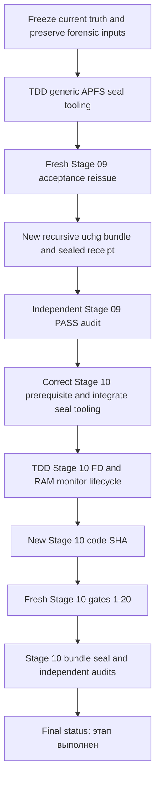

# Ketos Stage 09/10 All Blockers Closure Implementation Plan

> **Transition supersession — 2026-07-25.** At repository SHA
> `4c98c0beffac69e1864b1e2651df55b1ee1319a3`, the user explicitly accepted all
> stages preceding
> `docs/superpowers/plans/2026-07-25-unified-board-workspace-version-convergence.md`
> for transition. Status: `ACCEPTED FOR TRANSITION`. This plan remains an
> immutable historical description of unfinished technical verification; its
> Stage 09/10 STOP conditions no longer gate admission to the unified Board
> plan. Raw evidence, raw failures, missing tails, and missing receipts are not
> rewritten and are not technical PASS.

> **For agentic workers:** REQUIRED SUB-SKILL: use
> `superpowers:executing-plans`, `superpowers:test-driven-development`,
> `superpowers:systematic-debugging`, `superpowers:verification-before-completion`,
> `superpowers:requesting-code-review`, `graphify`,
> `docker-external-storage-only`, `product-design:audit`,
> `chrome:control-chrome` and `computer-use:computer-use`.
> `AGENTS.md` has priority over every skill: only the main agent may call tools,
> inspect or edit the workspace, run commands/tests, browse, control applications
> or apply patches. Subagents are tool-free and receive complete source slices,
> logs and contracts; they return analysis, code or unified diffs only.

## Goal

Закрыть все обнаруженные prerequisite, evidence, orchestration, RAM, UI и
live-provider блокеры; заново выпустить доказуемо sealed Stage 09 PASS; затем
довести уже реализованный Stage 10 до честного статуса `этап выполнен` одним
новым acceptance-run на новом frozen SHA.

Stage 11 не начинать. Существующие evidence bundles и unrelated dirty state не
изменять.

## Architecture

Работа разделена на два независимых trust domain:

1. **Stage 09 evidence closure.** Product source остаётся на точном tested SHA
   `18a2a2a9518d23c589c6700c322ad5844adce932`. Исправления sealer/controller
   создаются в отдельном tooling worktree и имеют отдельный
   `closure_tooling_sha`. Старый mutable bundle сохраняется как forensic input,
   но не считается достаточным prerequisite. По умолчанию выполняется новый
   Stage 09 acceptance-run и выпускается новый sibling bundle, sealed
   рекурсивным APFS `uchg` и отдельным sealed receipt.
2. **Stage 10 completion.** После нового Stage 09 PASS исправляется общий
   subprocess/RAM-monitor lifecycle, создаётся новый Stage 10 commit и новый
   `S10_CODE_SHA`, затем все 20 acceptance gates выполняются с чистого состояния
   ровно один раз. Финальный Stage 10 bundle использует тот же проверенный seal
   protocol.

Старый Stage 09 bundle не переписывается, не переименовывается, не
`chflags`-ится и не объявляется исторически immutable задним числом. Старые
Stage 10 diagnostic roots не продолжаются и не входят в итоговую приёмку.

## Tech stack and normative sources

- Python/FastAPI, `uv`, pytest, Alembic.
- React/TypeScript, Jest, Playwright Chromium.
- OpenAI-compatible adapter с CometAPI upstream.
- Docker Official Image `postgres:16`, SCRAM, external APFS bind mount.
- APFS modes, owner, flags, atomic rename and negative mutation probes.
- JSON Schema draft 2020-12.
- Официальные источники вместо Context7:
  - [Apple File System details and immutable flags](https://developer.apple.com/library/archive/documentation/FileManagement/Conceptual/FileSystemProgrammingGuide/FileSystemDetails/FileSystemDetails.html);
  - [Python `os.chflags` and `stat.UF_IMMUTABLE`](https://docs.python.org/3/library/os.html);
  - [JSON Schema draft 2020-12](https://json-schema.org/draft/2020-12/json-schema-core);
  - [Git worktree](https://git-scm.com/docs/git-worktree.html);
  - [CometAPI Chat Completions](https://apidoc.cometapi.com/api/text/chat);
  - [CometAPI DeepSeek V4 Flash](https://www.cometapi.com/models/deepseek/deepseek-v4-flash/);
  - [OpenAI Python SDK](https://github.com/openai/openai-python);
  - [Docker Official Postgres image](https://hub.docker.com/_/postgres);
  - [PostgreSQL 16 password authentication](https://www.postgresql.org/docs/16/auth-password.html);
  - [LangGraph interrupts](https://docs.langchain.com/oss/python/langgraph/interrupts);
  - [LangGraph persistence](https://docs.langchain.com/oss/python/langgraph/persistence);
  - [Node.js `--preserve-symlinks-main`](https://nodejs.org/api/cli.html#--preserve-symlinks-main).

## Global constraints

- Перед любым действием читать текущий `AGENTS.md` и
  `.agents/skills/main-agent-tool-orchestration/SKILL.md`.
- Только главный агент использует инструменты. Субагенты tool-free.
- Все Python-команды выполняются через `uv run`.
- Graphify используется только read-only; граф не перестраивается как побочный
  эффект.
- RaytSystem используется только как read-only diagnostic; stale graph не
  обновляется и не является acceptance gate этого плана.
- Root dirty state сохраняется без stash, удаления или перезаписи.
- Нельзя менять исходный Stage 09 bundle.
- Нельзя переносить PASS из старых diagnostic Stage 10 roots.
- Нельзя дописывать отсутствующий RAM result после завершившегося gate.
- Нельзя применять broad `kill`, `pkill`, Docker prune или удалять неизвестные
  процессы/тома.
- Нельзя помещать CometAPI credential в repo, evidence, command arguments,
  stdout, browser storage, Docker, database dump или report.
- Нельзя добавлять CometAPI-specific product provider/router, fallback model,
  Ollama или mock под видом live proof.
- Любое измерение памяти `>=16_000_000_000` bytes аннулирует acceptance-run.
- Любой tracked fix после source freeze аннулирует acceptance-run.
- Любая неожиданно успешная negative mutation probe аннулирует bundle.
- Stage 11 запрещён.

## Current truth snapshot

Снимок подтверждён 2026-07-24.

| Объект | Текущая истина |
| --- | --- |
| Root repo | `/Volumes/Projects/ketos_canvas_mod_main` |
| Root HEAD | `c6c96276ccbbda22b18741a8f36a6f355d0382da` |
| Root branch | `main` |
| Root unrelated dirty | `KETOS_STAGE_09_BLOCKER_CLOSURE_PLAN.md`, `KETOS_STAGE_10_FULL_COMPLETION_PLAN.md`, `outputs/` |
| Stage 09 tested SHA | `18a2a2a9518d23c589c6700c322ad5844adce932` |
| Stage 09 worktree | `/Volumes/Projects/ketos-mvp-stage09-integration`, clean |
| Stage 09 original bundle | `/Volumes/Projects/.ketos-stage09-evidence/stage-09/18a2a2a9518d23c589c6700c322ad5844adce932/20260722T191808Z-55170` |
| Original manifest SHA-256 | `14e8dbed2ae3c0a7f0cc06f42e4a4d4ebdd36e5e969f23e43f7843890b65c160` |
| Original manifest payload | 80 files |
| Original filesystem inventory | 93 objects including directories and service artifacts |
| Original modes | files `0400`, directories `0500` |
| Original immutable flags | `0/93`; all objects lack `uchg` |
| APFS volume UUID | `8B3B8A79-88A2-4676-8ED0-4C49EB697CDF` |
| Stage 10 worktree | `/Volumes/Projects/.worktrees/ketos-mvp-stage10`, clean |
| Stage 10 branch | `codex/mvp-s10-integration` |
| Current Stage 10 SHA | `06d817178a8b1cb8bff273c8c753e86c0cad142b` |
| A01–A10 | Implemented and committed |
| Failed Stage 10 root | `/Volumes/Projects/.ketos-stage10-acceptance.OUtk2G5M` |
| Failed Stage 10 bundle | `/Volumes/Projects/.ketos-stage10-evidence/stage-10/06d817178a8b1cb8bff273c8c753e86c0cad142b-20260724T055041Z` |
| Gates 1–10 | Diagnostic PASS only; not reusable |
| Gate 11 | target 072 failed with `OSError: [Errno 9] Bad file descriptor`; terminal `ram-result.json` and complete post-tail are absent |
| Current honest status | `этап заблокирован` |

## Corrections to the previous blocker report

### C01 — `changed_paths` is not missing evidence

The frozen Stage 09 schema at the tested SHA:

```text
/Volumes/Projects/ketos-mvp-stage09-integration/docs/dev/handoff/schemas/stage-09-evidence.schema.json
```

uses `additionalProperties: false` and does **not** define a top-level
`changed_paths` field. Adding that field to `evidence.json` would make the
document invalid.

Structured zero-write proof already exists in manifest-covered
`repo-after-full.json`:

```json
{
  "code_sha": "18a2a2a9518d23c589c6700c322ad5844adce932",
  "changed_paths": [],
  "matches_before": true
}
```

It is reinforced by these schema-valid `evidence.json` fields:

```text
scope.pre_post_equal=true
scope.worktree_clean=true
scope.head_frozen=true
```

Therefore:

- [ ] remove “top-level `evidence.json.changed_paths` required” from every
  Stage 10 preflight;
- [ ] never rewrite the frozen `evidence.json`;
- [ ] require `repo-after-full.json.changed_paths=[]`,
  `matches_before=true`, matching `code_sha`, manifest coverage and the three
  `scope` booleans above.

### C02 — use only the frozen schema

The root `main` schema is older and can falsely reject the Stage 09 document
because it lacks the frozen schema’s `resource` contract.

- [ ] validate with the schema from exact SHA `18a2...` only;
- [ ] record schema file SHA-256 in the new receipt;
- [ ] reject any verifier that silently falls back to root `main`.

### C03 — `uchg` can provide future immutability, not retroactive history

Modes and checksums do not prove that the original bundle was never changed
before discovery. Applying `uchg` now cannot repair that historical gap.

The fail-closed default in this plan is therefore a **fresh Stage 09 acceptance
reissue** on the same product SHA. A metadata-only copy/reseal fast path is
allowed only if an independent reviewer accepts a pre-discovery trusted
manifest anchor. The local Codex session record
`019f8cec-bf77-7082-940c-43ef5622fbfe` is candidate corroboration, but because
it is a local mutable file it is not sufficient by default.

## Blocker registry

| ID | Blocker | Closure proof |
| --- | --- | --- |
| B01 | Stage 09 bundle has no recursive `uchg` | New bundle and receipt: every object sealed, all negative probes denied |
| B02 | No accepted pre-discovery immutable anchor | Default fresh Stage 09 acceptance reissue; optional fast path only after explicit independent trust decision |
| B03 | False requirement for `evidence.json.changed_paths` | Frozen-schema validation plus cross-file zero-write proof |
| B04 | Stage 09 finalizer can claim PASS without seal | TDD seal library and future-finalizer integration |
| B05 | Stage 10 gate 11 bad file descriptor | Reproducible red test, generic subprocess fix, full 188/188 diagnostic PASS |
| B06 | RAM monitor can exit without terminal result/tail | Atomic terminal result on every path, heartbeat/loss tests, fault injection |
| B07 | Old Stage 10 roots/pointers may be mistaken for final | Mark `INVALID_DIAGNOSTIC`; new unique root and no artifact reuse |
| B08 | Manual UI tools previously locked/timed out | Preflight tools, bounded per-tool evidence protocol and immediate root invalidation on loss |
| B09 | Peak RAM and stale processes can invalidate runs | Allowlist, PID identity ledger, serialized gates, thresholds and 30-second tail |
| B10 | Final Stage 10 bundle needs the same strong seal | Reuse tested generic sealer, external sealed receipt and negative probes |

## Dependency graph



No node may start before all incoming nodes are PASS.

---

## Task 0: Freeze forensic state and execution ownership

**Read-only inputs:**

- `/Volumes/Projects/ketos_canvas_mod_main/AGENTS.md`
- `/Volumes/Projects/ketos-mvp-stage09-integration`
- `/Volumes/Projects/.worktrees/ketos-mvp-stage10`
- both existing evidence roots listed above.

- [ ] Record root, Stage 09 and Stage 10 `HEAD`, branch, porcelain status and
  worktree list.
- [ ] Record owner, device, APFS UUID, modes, ACLs, xattrs, symlinks, flags,
  file types, inode IDs, mtimes and full byte hashes of the original Stage 09
  bundle.
- [ ] Verify original `manifest.json`, `manifest.sha256`, frozen JSON Schema and
  secret scan without changing atime/mtime where the platform permits.
- [ ] Explain `80 manifest files` versus `93 filesystem objects` in the
  inventory. Every extra object must be a named directory or service artifact;
  unexplained objects fail the gate.
- [ ] Record current failed Stage 10 gate 11 logs, final RAM sample, missing
  `ram-result.json`, child identity and invalid root/bundle pointers.
- [ ] Write only to a new private diagnostic directory under
  `/Volumes/Projects/.ketos-blocker-closure-diagnostics/`.
- [ ] Mark prior Stage 10 attempts:

```text
classification=INVALID_DIAGNOSTIC
final_eligible=false
reuse_allowed=false
```

- [ ] Preserve all original files. Do not chmod, chflags, touch, rename or
  delete them.

**PASS:** complete read-only inventory exists; all pre-existing worktrees and
bundles have identical before/after metadata and hashes.

**STOP:** any original Stage 09 hash/schema mismatch, symlink, special file,
unexplained object or Stage 09 source drift changes the status to
`этап заблокирован` until a full source-level investigation resolves it.

---

## Task 1: Create isolated Stage 09 closure-tooling worktree

**Create:**

- branch: `codex/stage09-evidence-closure`;
- worktree:
  `/Volumes/Projects/.worktrees/ketos-stage09-evidence-closure`;
- base: exact product SHA
  `18a2a2a9518d23c589c6700c322ad5844adce932`.

- [ ] Confirm the destination does not already contain an unrelated worktree.
- [ ] Create the branch/worktree from the exact Stage 09 SHA:

```bash
git -C /Volumes/Projects/ketos_canvas_mod_main worktree add \
  -b codex/stage09-evidence-closure \
  /Volumes/Projects/.worktrees/ketos-stage09-evidence-closure \
  18a2a2a9518d23c589c6700c322ad5844adce932
```

- [ ] Confirm clean status and exact merge base.
- [ ] Use existing Graphify read-only:

```bash
cd /Volumes/Projects/ketos_canvas_mod_main
graphify query \
  "Stage 09 evidence finalizer manifest schema repo-after-full immutable seal receipt Stage 10 acceptance RAM guard" \
  --budget 2200
```

- [ ] Main agent prepares complete tool-free packets for:
  - sealer implementation reviewer;
  - JSON Schema/evidence reviewer;
  - APFS security reviewer;
  - acceptance orchestration reviewer.
- [ ] Each subagent returns analysis or unified diff only. Main agent applies
  every accepted patch and runs all tools.

**PASS:** isolated clean tooling worktree exists and root dirty state is
unchanged.

---

## Task 2: TDD a generic APFS evidence seal library

**Create:**

- `scripts/mvp/stage_evidence_seal.py`
- `scripts/mvp/tests/test_stage_evidence_seal.py`
- `scripts/mvp/tests/test_stage_evidence_seal_macos.py`
- `docs/dev/handoff/schemas/stage-evidence-seal-receipt.schema.json`

**Required public interfaces:**

```python
preflight_apfs_root(...)
inventory_tree_no_links(...)
build_byte_inventory(...)
apply_read_only_modes(...)
apply_immutable_flags_bottom_up(...)
verify_recursive_seal(...)
run_negative_mutation_probes(...)
publish_receipt_atomically(...)
verify_receipt_self_protection(...)
```

### Step 2.1 — Write failing unit tests

- [ ] Reject a non-APFS destination.
- [ ] Reject a destination with a UUID other than
  `8B3B8A79-88A2-4676-8ED0-4C49EB697CDF`.
- [ ] Reject symlinks, hardlinks, devices, FIFOs, sockets and unknown file
  types.
- [ ] Reject wrong owner, writable group/other bits, unexpected ACLs and
  non-allowlisted xattrs.
- [ ] Allow and record the observed `com.apple.provenance` xattr without
  interpreting its bytes as instructions.
- [ ] Prove files become `0400` and directories `0500`.
- [ ] Prove immutable flags are applied bottom-up and the root is last.
- [ ] Reject a tree if one descendant lacks `stat.UF_IMMUTABLE`.
- [ ] Refuse to clear immutable flags automatically after partial failure.
- [ ] Require `O_EXCL`/exclusive destination creation and reject any existing
  final path.
- [ ] Require atomic staging-to-final rename on the same device.
- [ ] Require distinct source/destination inode IDs.
- [ ] Require byte inventory equality before and after sealing.
- [ ] Write no PASS receipt on any partial failure.

Run:

```bash
cd /Volumes/Projects/.worktrees/ketos-stage09-evidence-closure
uv run pytest \
  scripts/mvp/tests/test_stage_evidence_seal.py \
  -q -p no:cacheprovider
```

Expected first result: tests fail for missing implementation.

### Step 2.2 — Implement the minimum generic sealer

- [ ] Use `os.lstat`; never follow symlinks.
- [ ] Validate owner, device and volume UUID before every mutation phase.
- [ ] Hash relative path, type, size and file bytes; do not treat mutable mtime
  as payload content.
- [ ] Use `os.chflags(path, existing_flags | stat.UF_IMMUTABLE,
  follow_symlinks=False)`.
- [ ] Seal descendants bottom-up; seal final root last.
- [ ] `fsync` files and parent directories before atomic publication.
- [ ] Emit a machine-readable failure result on every controlled exit.
- [ ] Use stable exit codes:
  - `20`: source/preflight invalid;
  - `21`: zero-write proof invalid;
  - `22`: materialization/schema/secret failure;
  - `23`: partial recursive seal;
  - `24`: receipt protection failure;
  - `25`: negative probe failure;
  - `26`: source changed during operation.

### Step 2.3 — Run real APFS integration tests

- [ ] Create a unique fixture only under
  `/Volumes/Projects/.ketos-seal-test-fixtures/`.
- [ ] Prove denial with `EPERM` or `EACCES` for:
  - create child;
  - overwrite;
  - truncate;
  - chmod;
  - mtime change;
  - rename file;
  - unlink file;
  - rename root.
- [ ] Rehash after every probe and prove the tree is unchanged.
- [ ] Exercise fault injection after sealing one child and before sealing root;
  result must be non-PASS and must name every sealed/unsealed object.
- [ ] Clean only the exact owned fixture after verifying path, inode and run ID.
  Clearing fixture flags is allowed only for this disposable test fixture, not
  for evidence.

Run:

```bash
cd /Volumes/Projects/.worktrees/ketos-stage09-evidence-closure
uv run pytest \
  scripts/mvp/tests/test_stage_evidence_seal.py \
  scripts/mvp/tests/test_stage_evidence_seal_macos.py \
  -q -p no:cacheprovider
```

**PASS:** all unit and real-APFS tests pass, including fault injection and
negative probes.

---

## Task 3: TDD the Stage 09 reissue/finalization protocol

**Create:**

- `scripts/mvp/reseal_stage09_evidence.py`
- `scripts/mvp/tests/test_reseal_stage09_evidence.py`
- `docs/dev/handoff/schemas/stage-09-seal-receipt.schema.json`

**Modify after focused tests pass:**

- `scripts/mvp/finalize_stage09_evidence.py`
- `docs/dev/handoff/stage-09-restart-recovery-runbook.md`

### Step 3.1 — Encode the evidence contract

The validator must require:

- exact `tested_code_sha=18a2...`;
- separately recorded `closure_tooling_sha`;
- exact frozen schema hash and schema validation;
- `manifest.sha256` and every manifest entry valid;
- `repo-after-full.json.code_sha=18a2...`;
- `repo-after-full.json.changed_paths=[]`;
- `repo-after-full.json.matches_before=true`;
- `evidence.json.scope.pre_post_equal=true`;
- `evidence.json.scope.worktree_clean=true`;
- `evidence.json.scope.head_frozen=true`;
- `repo-after-full.json` covered by the manifest;
- secret scan with no secret value written to output;
- owner/current user, modes, file types, ACL/xattr policy and APFS UUID.

It must explicitly reject:

- report-text-only `changed_paths=[]`;
- adding a new top-level field to frozen `evidence.json`;
- schema loaded from root `main`;
- non-empty path diff;
- mismatched product/tooling SHA;
- a source or destination that changes during validation.

### Step 3.2 — Write failing tests

- [ ] Valid frozen schema and cross-file zero-write proof pass.
- [ ] Root-main schema fallback fails.
- [ ] Report-text-only proof fails.
- [ ] Non-empty `changed_paths` fails.
- [ ] `matches_before=false` fails.
- [ ] Manifest omission of `repo-after-full.json` fails.
- [ ] Existing destination fails.
- [ ] Same inode/hardlink materialization fails.
- [ ] Source byte, mode, flag and mtime changes fail.
- [ ] Receipt cannot be emitted before all bundle probes pass.
- [ ] Receipt includes:
  - `tested_code_sha`;
  - `closure_tooling_sha`;
  - source bundle canonical path;
  - source manifest SHA-256;
  - frozen schema SHA-256;
  - final bundle canonical path;
  - APFS UUID;
  - total object count;
  - manifest payload count;
  - per-type inventory counts;
  - byte inventory root hash;
  - flag/mode verification counts;
  - each negative probe result;
  - creation monotonic and wall-clock timestamps;
  - final status.
- [ ] Receipt sidecar checksum, mode `0400`, `uchg` and its own negative probes
  are mandatory.

### Step 3.3 — Integrate with future finalization

- [ ] `finalize_stage09_evidence.py` may not emit final PASS unless the generic
  seal protocol and receipt protection have passed.
- [ ] Existing payload schema stays frozen.
- [ ] Sealing data is kept in the external sibling receipt, not injected into
  frozen `evidence.json`.
- [ ] The runbook documents irreversible partial-seal handling:
  quarantine path, failure receipt, no auto-unseal, no reuse.

Run:

```bash
cd /Volumes/Projects/.worktrees/ketos-stage09-evidence-closure
uv run pytest \
  scripts/mvp/tests/test_stage_evidence_seal.py \
  scripts/mvp/tests/test_stage_evidence_seal_macos.py \
  scripts/mvp/tests/test_reseal_stage09_evidence.py \
  -q -p no:cacheprovider
```

**PASS:** dedicated tests pass and a future Stage 09 finalizer cannot claim PASS
without recursive flags, negative probes and a sealed receipt.

Commit the tooling as one scoped commit and record:

```text
tested_code_sha=18a2a2a9518d23c589c6700c322ad5844adce932
```

`closure_tooling_sha` is the exact 40-hex output of
`git rev-parse HEAD` after that scoped commit. The two SHA values must never be
conflated.

---

## Task 4: Resolve historical trust and select the Stage 09 closure route

### Default route — fresh Stage 09 acceptance reissue

This is the required route unless the optional fast path below independently
passes.

- [ ] Create a new clean detached product worktree at exact SHA `18a2...`.
- [ ] Create a new unique Stage 09 acceptance root, database, data directory,
  PID ledger and RAM monitor log outside the repo.
- [ ] Run the complete frozen Stage 09 acceptance sequence from target 1; do
  not combine partial counts from old runs.
- [ ] Use the tooling worktree only as controller/sealer. Product commands run
  against the exact product worktree.
- [ ] Require the already established Stage 09 results:
  - Stage 08 replay `130/130`, discrepancy `0`;
  - backend package `188/188` targets PASS;
  - full frontend `515 suites / 5,799 tests` PASS;
  - Chromium recovery `1/1` PASS;
  - all 14 sequential gates PASS;
  - zero monitor losses and guard trips;
  - structured zero-write compare PASS;
  - six independent tool-free audits PASS;
  - no open P0/P1/P2.
- [ ] If current test inventory legitimately differs, stop and explain the
  exact repository-derived count change; never silently preserve stale counts.

### Optional fast path — byte-identical sibling reseal

This path is an optimization, not the default.

- [ ] An independent reviewer must accept a trusted record created before
  blocker discovery and containing the exact manifest digest
  `14e8dbed2ae3c0a7f0cc06f42e4a4d4ebdd36e5e969f23e43f7843890b65c160`.
- [ ] The reviewer must document why the record is outside the mutability domain
  of the evidence owner.
- [ ] The local Codex session record is only corroborating evidence unless its
  integrity is anchored independently.
- [ ] If trust is not established, execute the default full reissue. There is
  no third route and no waiver.

**PASS:** one route is explicitly selected with evidence. Silence or ambiguity
selects the default full reissue.

---

## Task 5: Publish and seal a new Stage 09 sibling bundle

**Destination parent:**

```text
/Volumes/Projects/.ketos-stage09-evidence/stage-09/18a2a2a9518d23c589c6700c322ad5844adce932/
```

The final run directory must be new and unique. Never reuse
`20260722T191808Z-55170`.

### Step 5.1 — Storage and secret preflight

- [ ] Set process `umask 077`.
- [ ] Verify canonical path, current owner, no symlink, APFS UUID, writable
  parent and same-device atomic rename.
- [ ] Verify the CometAPI secret location if it is needed for a live Stage 09
  gate, but never print its value.
- [ ] Verify actual secret value is absent from source, staging, logs and
  receipts using a non-printing matcher.
- [ ] Create a unique hidden staging directory with exclusive semantics.

### Step 5.2 — Build candidate

- [ ] Materialize only regular files and directories.
- [ ] Do not use hardlinks or reflink assumptions; verify all destination
  inodes differ from source inodes.
- [ ] Preserve payload bytes exactly.
- [ ] Generate the new manifest/evidence only from the fresh reissue root. On
  the optional fast path, do not rewrite any payload byte.
- [ ] Validate schema, hashes, zero-write proof, secret scan, owner, modes,
  ACL/xattr policy and complete inventory.
- [ ] `fsync` payload and staging parent.
- [ ] Apply files `0400` and directories `0500`.
- [ ] Apply `UF_IMMUTABLE` to every descendant bottom-up while leaving only
  the staging root mutable.
- [ ] Revalidate bytes, inventory, modes and descendant flags.
- [ ] Atomically rename staging to the unique final sibling.
- [ ] Apply `UF_IMMUTABLE` to the final root last.

### Step 5.3 — Verify sealed candidate

- [ ] Verify `sealed_objects == total_objects`; expected historical inventory is
  93 but the fresh bundle’s own complete inventory is normative.
- [ ] Run create/write/truncate/chmod/mtime/rename/unlink/root-rename probes.
  Each must fail with `EPERM` or `EACCES`.
- [ ] Rehash after probes and require byte equality.

### Step 5.4 — Publish sibling receipt

- [ ] Create the receipt outside the sealed bundle with exclusive atomic
  publication.
- [ ] Validate it against
  `docs/dev/handoff/schemas/stage-09-seal-receipt.schema.json`.
- [ ] Write a receipt SHA-256 sidecar.
- [ ] Set both files `0400`, `fsync`, apply `uchg`.
- [ ] Run write/rename/unlink/mtime probes against receipt and checksum.
- [ ] Revalidate the original bundle against Task 0 inventory; it must remain
  byte- and metadata-identical.

**PASS:** new Stage 09 bundle and receipt are recursively immutable,
schema/hash/secret/zero-write valid, and the original bundle is unchanged.

**FAIL-CLOSED:** if one mutation probe succeeds or one object remains unsealed,
the candidate is permanently `INVALID_PARTIAL_SEAL`; preserve it for diagnosis
and create a completely new candidate after fixing tooling.

---

## Task 6: Independent Stage 09 closure audit

The main agent supplies full source, receipts, inventories and command output to
at least four separate tool-free reviewers:

1. schema/zero-write reviewer;
2. APFS seal/security reviewer;
3. acceptance-count reviewer;
4. provenance/status reviewer.

- [ ] No reviewer receives another reviewer’s conclusion before submitting its
  own.
- [ ] Every reviewer returns `PASS`, `FAIL` or `BLOCKED` with exact evidence.
- [ ] Resolve every P0/P1/P2 finding and rerun the affected gate.
- [ ] Any payload/code fix requires a new acceptance root and new bundle.
- [ ] Re-run main-agent verification after reviews:
  - exact product SHA;
  - frozen schema;
  - manifest and receipt checksum;
  - structured zero-write proof;
  - recursive flags;
  - negative probes;
  - secret scan;
  - worktree cleanliness.

**PASS:** all four reviewers PASS, no open P0/P1/P2, and the main-agent fresh
verification independently agrees.

Only now may Stage 10 prerequisite status change from `BLOCKED` to `PASS`.

---

## Task 7: Correct Stage 10 prerequisite and evidence protocol

**Modify in:**

```text
/Volumes/Projects/.worktrees/ketos-mvp-stage10
```

**Primary files:**

- `KETOS_STAGE_10_FULL_COMPLETION_PLAN.md` if copied into this worktree;
- Stage 10 acceptance controller/preflight files found by Graphify;
- Stage 10 evidence/schema tests;
- generic seal tooling integrated from the reviewed Stage 09 closure commit.

- [ ] Point Stage 10 to the new canonical Stage 09 bundle and sibling receipt.
- [ ] Remove the false top-level `evidence.json.changed_paths` requirement.
- [ ] Implement exact cross-file validation from C01/C02.
- [ ] Require all Stage 09 seal receipt fields and live negative probes.
- [ ] Reject the original unsealed bundle even though its payload validates.
- [ ] Reject any Stage 09 bundle without a separately verified receipt.
- [ ] Reuse generic seal code; do not fork a Stage10-only implementation.
- [ ] Add regression tests for:
  - valid new Stage 09 bundle;
  - old unsealed bundle;
  - missing receipt;
  - receipt hash mismatch;
  - one unsealed descendant;
  - root-main schema fallback;
  - non-empty structured diff.

Run focused tests first, then the complete acceptance tooling test package.

**PASS:** Stage 10 opens only for the new sealed Stage 09 evidence and no
longer asks for a schema-invalid field.

---

## Task 8: TDD-fix Stage 10 gate 11 FD and RAM-monitor lifecycle

**Likely files after Graphify/source inspection:**

- `scripts/mvp/stage10_ram_guard.py`
- `scripts/mvp/run_stage09_backend_package.sh`
- `scripts/mvp/stage10_acceptance_controller.py`
- `scripts/mvp/tests/test_stage10_evidence.py`
- `scripts/mvp/tests/test_stage09_gate_controller.py`
- new focused subprocess/monitor lifecycle tests if required.

### Step 8.1 — Reproduce before editing

- [ ] Run `test_mcp_projects.py` directly under a bounded diagnostic root.
- [ ] Run it through the current controller with the same descriptors as gate
  11.
- [ ] Run a minimal child that reads/writes stdin/stdout/stderr.
- [ ] Capture descriptor numbers, open/closed state, PID/PPID/PGID, start time,
  owner and command fingerprint without capturing secrets.
- [ ] Confirm whether FD closure is in pytest, shell wrapper, monitor or
  controller.

The red regression must reproduce:

```text
OSError: [Errno 9] Bad file descriptor
```

or deterministically prove the same invalid descriptor ownership.

### Step 8.2 — Implement the generic fix

- [ ] Give child processes explicit `stdin=subprocess.DEVNULL`.
- [ ] Use separate owned descriptors for test output, monitor output and
  terminal result.
- [ ] Close only descriptors owned by the current controller.
- [ ] Never share a context-managed log handle with a still-running child.
- [ ] Use process groups only for Stage 10-owned children.
- [ ] Re-check PID, start time, owner and command fingerprint immediately
  before TERM/KILL.
- [ ] Persist controller state in the tracked implementation and external run
  root, not `/private/tmp` scripts.
- [ ] Write terminal `ram-result.json` atomically for PASS, FAIL, TIMEOUT,
  SIGNAL and MONITOR_LOSS.
- [ ] A terminal result must include last sample sequence, heartbeat age,
  thresholds, peak, pageout/swapout delta, child outcomes and completed
  30-second tail status.
- [ ] Missing two samples or heartbeat is fail-closed and blocks new gates.
- [ ] A failed test still receives a complete monitor tail and terminal result.

### Step 8.3 — Fault-injection tests

- [ ] child closes stdout unexpectedly;
- [ ] child closes stderr unexpectedly;
- [ ] pytest returns nonzero;
- [ ] monitor exits first;
- [ ] controller exits first;
- [ ] result rename fails;
- [ ] child ignores TERM;
- [ ] PID is reused between lookup and signal;
- [ ] two heartbeat samples are missed;
- [ ] absolute RAM ceiling is reached;
- [ ] 30-second post-tail is interrupted.

Every test must prove:

- no unrelated process receives a signal;
- no PASS is emitted without complete monitor evidence;
- a terminal failure record is still atomic and machine-readable.

### Step 8.4 — Diagnostic package verification

- [ ] Run the focused regression.
- [ ] Run the complete Stage 10 tooling tests.
- [ ] Run backend target 072 alone under the repaired monitor.
- [ ] Run the complete backend package from target 1 through target 188 under
  the repaired monitor.
- [ ] Do not count prior gates.

**PASS:** `188/188` targets pass in one diagnostic run, terminal RAM result and
30-second tail exist, monitor losses are zero and the old FD failure is covered
by a regression test.

---

## Task 9: RAM baseline, controlled cleanup and process ownership

### Protected allowlist

Never stop:

- Hiddify and every `HiddifyPacketTunnel` PID family;
- ChatGPT/Codex and active tool-free subagents;
- system/root processes, WindowServer and launchd;
- Docker/PostgreSQL during their owned gates;
- active backend/frontend/test/browser children of the current run.

### Controlled cleanup

- [ ] Through Computer Use inspect Claude/Claude Code for unsaved work. Quit
  normally only if no unsaved state exists.
- [ ] For old Playwright, Chromium, MCP, Node or test workers require all:
  matching owner, PID, PPID, start time, command fingerprint and absence of a
  live run ID.
- [ ] Unknown or other-task processes remain untouched.
- [ ] For owned Stage 10 children: TERM, wait up to 15 seconds, re-check identity,
  then KILL only if still the same process.
- [ ] Record every TERM/KILL outcome in the PID ledger.

### RAM monitor contract

- [ ] Baseline:
  - `memory_pressure`;
  - `vm_stat`;
  - system-used memory;
  - aggregate RSS attribution;
  - swap/pageout counters;
  - PID ledger.
- [ ] Sample every second during a gate and every five seconds between gates.
- [ ] Continue for 30 seconds after each gate.
- [ ] Warning: `13_500_000_000` bytes in three consecutive one-second samples;
  launch no new gate and reduce concurrency to one.
- [ ] Stop: `14_750_000_000` bytes in two samples; TERM current owned children.
- [ ] Emergency: `15_250_000_000` bytes once or critical pressure; immediately
  stop only attributed Stage 10 children.
- [ ] Absolute: `>=16_000_000_000` bytes invalidates the run.
- [ ] Resume only after 30 seconds below `13_000_000_000` bytes with no
  swapout/pageout growth.
- [ ] Two missed samples or heartbeat loss blocks new gates.
- [ ] Aggregate RSS is labelled as attribution, not exact physical usage.

**PASS:** stable baseline, protected processes intact, no unidentified process
was terminated, monitor heartbeat is healthy.

---

## Task 10: Commit, review and freeze the new Stage 10 code

- [ ] Request separate tool-free reviews for:
  - backend/subprocess correctness;
  - RAM/process safety;
  - schema/evidence/seal security;
  - Stage 09 prerequisite correctness;
  - provider/live path;
  - UI acceptance protocol.
- [ ] Resolve every P0/P1/P2.
- [ ] Run formatting, focused tests and relevant package gates.
- [ ] Verify no generated artifact, lock file, deployment config, `LICENSE` or
  `NOTICE` changed outside explicit ownership.
- [ ] Commit all scoped Stage 10 fixes.
- [ ] Record new `S10_CODE_SHA`.
- [ ] Confirm clean worktree.
- [ ] After this point, any code change requires a new commit, new SHA and an
  entirely new acceptance root.

**PASS:** clean reviewed Stage 10 source is frozen on a new SHA descended from
`06d817...`.

---

## Task 11: Fresh Stage 10 preflight

- [ ] Create a new unique acceptance root under `/Volumes/Projects`.
- [ ] Create a new SQLite acceptance DB and `KETOS_DATA_DIR`; do not copy
  development state.
- [ ] Create a new PID ledger, memory log and audit identifiers.
- [ ] Verify the new sealed Stage 09 prerequisite and receipt.
- [ ] Verify evidence root:
  - canonical external APFS path;
  - owner `kirillustuzanin`;
  - directory mode `0700`;
  - no ACL/symlink;
  - APFS UUID match;
  - atomic write/rename support.
- [ ] Verify secret file without printing it:
  `/Volumes/Projects/.ketos-stage10-secrets/cometapi.env`;
  parent `0700`, file `0600`, current owner, no ACL/symlink, exactly one
  `COMETAPI_KEY=` entry.
- [ ] Load the value without `source` or `eval`; expose it only as
  `OPENAI_API_KEY` to the owned child. Set
  `OPENAI_BASE_URL=https://api.cometapi.com/v1`.
- [ ] Run non-secret scan of repo, acceptance root and intended evidence root.
- [ ] Run direct CometAPI preflight:
  - authenticated `/v1/models`;
  - exact `deepseek-v4-flash`;
  - bounded non-streaming completion with thinking enabled and high reasoning;
  - real typed tool call;
  - valid tool arguments;
  - successful follow-up with `tool_call_id`.
- [ ] Persist only request ID, status, latency and token usage.
- [ ] Verify Chrome, Computer Use and Product Design capabilities before the
  first acceptance gate. A unavailable required capability is `BLOCKED`, not
  deferred.

### Docker external-storage guard

Before **every** Docker command:

```bash
/Users/kirillustuzanin/.codex/skills/docker-external-storage-only/scripts/verify_external_docker_storage.sh \
  --running
```

Expected: Docker data root and all relevant storage are on the approved
external APFS volume. No internal fallback.

- [ ] Resolve `postgres:16` to a RepoDigest.
- [ ] Create unique PGDATA and password file only under
  `/Volumes/Projects/.ketos-disposable-postgres/`.
- [ ] Bind only `/var/lib/postgresql/data`.
- [ ] Use loopback-only random port and SCRAM.
- [ ] Verify mounts, no Docker volumes, `pg_isready`, authenticated `SELECT 1`
  and empty user schema.

**PASS:** all prerequisite services, tools, storage, secret and RAM checks pass
before acceptance starts.

---

## Task 12: Execute the Stage 10 acceptance gates exactly once

Run strictly in this order with one heavy gate at a time:

| Gate | Name | Required proof |
| ---: | --- | --- |
| 1 | seed-idempotency | deterministic seed and repeat no-op |
| 2 | focused-backend | all Stage 10 focused backend tests |
| 3 | sqlite-migrations | fresh SQLite upgrade/downgrade contract |
| 4 | postgres-migrations | both required PostgreSQL migration tests, no skip |
| 5 | kfx | KFX package gate |
| 6 | lfx | LFX/package compatibility gate |
| 7 | frontend-focused | Stage 10 focused frontend suites |
| 8 | frontend-i18n | localization integrity |
| 9 | frontend-type | production TypeScript |
| 10 | frontend-build | production build |
| 11 | backend-package | all 188 targets in one run |
| 12 | frontend-full | all current full suites/tests |
| 13 | chromium-story | story steps 1–10, restart/listener/PID proof |
| 14 | product-design | workflow/visual/interaction audit |
| 15 | chrome | `1440x900`, DOM, accessibility, network, keyboard focus |
| 16 | computer-use | visible layout and focus confirmation |
| 17 | live-ai | direct CometAPI plus real Ketos live path |
| 18 | security | auth, secret, injection and boundary audit |
| 19 | secret | actual-value scan without printing value |
| 20 | ram | complete monitor aggregation and ceiling proof |

For every gate:

- [ ] Verify worktree SHA and cleanliness immediately before start.
- [ ] Register owned PID/PPID/PGID/start time/command fingerprint/run ID.
- [ ] Verify monitor heartbeat before start.
- [ ] Start no gate while warning/stop/recovery conditions prohibit it.
- [ ] Persist start/end timestamps, command descriptor, exit code and bounded
  logs.
- [ ] Require terminal `ram-result.json` and complete 30-second tail.
- [ ] Stop only registered owned children after the gate.
- [ ] Verify worktree SHA/cleanliness again.
- [ ] Any failure invalidates the run; do not continue to collect a cosmetic
  partial PASS.

### Required Stage 10 live story

- [ ] Through Variables API create `OPENAI_BASE_URL` as `Generic`.
- [ ] Then create `OPENAI_API_KEY` as `Credential`.
- [ ] `/check-config` returns:

```text
provider_adapter=OpenAI
provider_upstream=CometAPI
model=deepseek-v4-flash
base_url=https://api.cometapi.com/v1
```

- [ ] Get a real upstream response.
- [ ] Create a typed Flow proposal.
- [ ] Reject one proposal and prove zero Flow effect.
- [ ] Create a new proposal and approve it.
- [ ] Prove exactly one CAS/audit effect.
- [ ] Do not claim that Ketos passed `thinking` parameters unless the real Ketos
  path proves it. Direct SDK preflight and Ketos adapter proof remain separate.

### Required browser/runtime story

- [ ] Complete Chromium steps 1–10.
- [ ] Capture four required PIDs and prove old listeners are dead.
- [ ] Before gate 14 verify the Mac is unlocked, the audit stack is responsive,
  the current `acceptance_run_id` is present and the current screenshot
  directory contains no files from prior runs.
- [ ] Create current-run Product Design report and screenshot-manifest drafts;
  do not create a PASS sentinel yet.
- [ ] At viewport exactly `1440x900`, capture the connected journey:
  - `01-board-note-chat`;
  - `02-automation-result`;
  - `03-ai-preview-confirmation`;
  - `04-settings-entry`;
  - `05-restored-board`.
- [ ] For every screenshot record `acceptance_run_id`, UTC timestamp, step
  name, `1440x900`, file SHA-256 and current-run provenance.
- [ ] Product Design audits the connected journey for hierarchy, readability,
  action placement, reject reversibility, approve clarity and state restoration;
  open P0/P1/P2 must all be zero.
- [ ] Validate the complete report and screenshot manifest first, then create
  the gate-14 sentinel atomically within the bounded 900-second window. A
  sentinel created before complete evidence is invalid.
- [ ] Chrome gate 15 separately verifies DOM/accessibility, unnamed focusable
  controls, keyboard-only navigation, visible focus ring, `Escape`,
  Settings/General, Back, console and network at `1440x900`.
- [ ] Redact headers/tokens from network evidence and prove the credential is
  absent from URL, DOM, browser storage and recorded payloads.
- [ ] Computer Use gate 16 separately verifies the visible Chrome window,
  layout, clipping/overlap, readable states and keyboard focus ring on the
  unlocked Mac.
- [ ] Rehash the five screenshots after gates 15–16; any changed/replaced file
  invalidates the UX evidence.
- [ ] Browser restart leaves no duplicated mutation.
- [ ] A timeout, locked Mac, incomplete screenshot set, unnamed control,
  console/network error or missing focus proof invalidates the entire current
  acceptance root.

**PASS:** all 20 gates pass in this single root on the frozen SHA, no monitor
loss, no secret leak and peak below the absolute ceiling.

---

## Task 13: PostgreSQL cleanup

- [ ] On full PASS, re-run the external-storage guard before Docker commands.
- [ ] Stop and remove only the exact Stage 10 PostgreSQL container identified
  by container ID and run label.
- [ ] Verify no Docker volume was created.
- [ ] Delete only the exact disposable PGDATA directory after canonical path,
  owner, run ID and container-detachment checks.
- [ ] On FAIL/BLOCKED, stop the container but preserve PGDATA for diagnosis.
- [ ] Never prune unrelated Docker data.

**PASS:** no owned running PostgreSQL remains after PASS; no unrelated
container/data was changed.

---

## Task 14: Build and seal Stage 10 evidence

- [ ] Reconfirm `S10_CODE_SHA`, clean worktree and zero-write comparison.
- [ ] Aggregate all 20 gates without editing their source results.
- [ ] Include:
  - commands/results;
  - product/provider/model separation;
  - PostgreSQL RepoDigest and mount proof;
  - browser/UI evidence;
  - PID/listener ledger;
  - memory monitor JSONL;
  - per-gate and overall peaks;
  - warning/stop/emergency/loss counts;
  - TERM/KILL outcomes;
  - security and non-printing secret scan;
  - independent reviews.
- [ ] Validate evidence JSON Schema and every manifest hash.
- [ ] Use the generic seal library from Tasks 2–3.
- [ ] Publish a unique bundle under
  `/Volumes/Projects/.ketos-stage10-evidence/stage-10/`.
- [ ] Apply files `0400`, directories `0500`, recursive `uchg` bottom-up and
  root last.
- [ ] Require all negative bundle probes.
- [ ] Create, checksum, seal and negatively probe the sibling receipt.
- [ ] Scan bundle and receipt for the actual CometAPI secret without printing
  it.

**PASS:** bundle and receipt are schema-valid, hash-valid, secret-free,
recursively immutable and resistant to every required mutation probe.

---

## Task 15: Final independent audits and status

Run at least six independent tool-free audits with complete packets:

1. Stage 09 prerequisite/provenance;
2. backend and CAS/audit behavior;
3. frontend/browser/accessibility;
4. CometAPI/live provider;
5. RAM/process ownership;
6. evidence/schema/seal/security.

- [ ] Auditors do not use tools and do not receive hidden conclusions.
- [ ] Main agent independently reruns final read-only checks after audit.
- [ ] No open P0/P1/P2.
- [ ] Verify original Stage 09 bundle and all unrelated dirty paths remain
  unchanged.
- [ ] Verify no Stage 11 branch, worktree, code or evidence exists.
- [ ] Produce a Russian evidence report with exact paths, SHAs, counts, peak
  RAM, monitor losses, bundle/receipt hashes and remaining limitations.

## Status rules

Use exactly one:

- **`этап выполнен`** — new sealed Stage 09 prerequisite PASS; Stage 10 A01–A10
  and all gates 1–20 PASS on one frozen SHA; live/provider/UI/RAM/security/seal
  PASS; no open P0/P1/P2.
- **`этап выполнен частично`** — implementation exists, but any Stage 10
  live-path, CAS/audit, secrecy, test, UX, evidence or absolute-RAM requirement
  is not PASS.
- **`этап заблокирован`** — Stage 09 reissue/seal cannot pass, credential or
  CometAPI/PostgreSQL/evidence/tool capability is unavailable, or RAM monitor
  integrity is lost.

Never report `этап выполнен` from focused tests, old diagnostic results,
partially sealed evidence or an acceptance root continued after failure.

## Definition of done

- [ ] Original Stage 09 bundle unchanged.
- [ ] New Stage 09 acceptance reissue PASS on exact product SHA `18a2...`.
- [ ] New Stage 09 bundle and receipt recursively sealed and negatively probed.
- [ ] False `evidence.json.changed_paths` blocker permanently removed.
- [ ] Future Stage 09 finalizer cannot PASS without strong seal.
- [ ] Stage 10 FD regression fixed by a red-green test.
- [ ] Stage 10 monitor always emits atomic terminal evidence and full tail.
- [ ] Backend diagnostic package passes `188/188` before freeze.
- [ ] New Stage 10 SHA frozen and worktree clean.
- [ ] All 20 Stage 10 gates PASS exactly once in a new root.
- [ ] Peak memory remains below `16_000_000_000` bytes.
- [ ] CometAPI credential never appears in repo/evidence/log/report/browser/DB.
- [ ] PostgreSQL uses digest-pinned image and external-only disposable storage.
- [ ] Product Design, Chrome and Computer Use gates PASS.
- [ ] Stage 10 bundle and receipt recursively sealed and negatively probed.
- [ ] All independent audits PASS with no open P0/P1/P2.
- [ ] Unrelated dirty state unchanged.
- [ ] Stage 11 not started.

## Execution handoff

Start with Task 0. Complete tasks strictly in dependency order. For each code
change use:

```text
failing test -> minimum implementation -> focused gate -> package gate
-> independent tool-free audit -> fix -> repeat verification
```

If a STOP condition fires, preserve diagnostics, state the exact blocker and
the smallest safe recovery action. Do not weaken the acceptance contract and do
not proceed to a downstream task.
