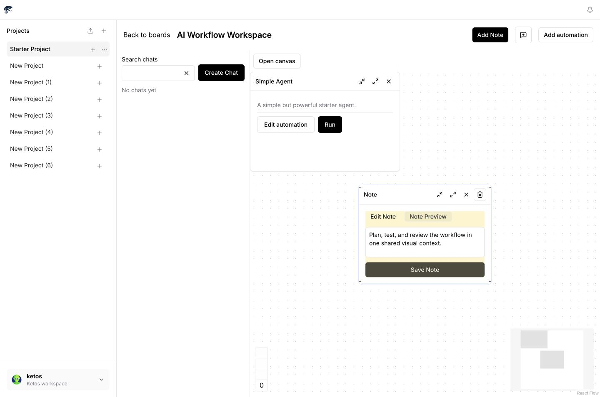

# Ketos

[](./LICENSE)


**A local-first visual builder and runtime for extensible AI workflows.**

Ketos brings workflow design, AI conversations, working notes, automations, and
execution results into one persistent spatial workspace. The project is
available as an active open-source alpha for local evaluation and contribution;
it is not offered as a hosted production service.

[Quick start](#quick-start) · [Development status](#development-status) ·
[Documentation](#documentation) · [Contributing](./CONTRIBUTING.md) ·
[Security](./SECURITY.md)



_A current local build of the Ketos Board workspace. The Canvas keeps an
automation and its supporting note in one visual context._

## What Ketos is

Ketos is an environment for developers, automation builders, and technical
teams who want to prototype, organize, run, and inspect AI workflows locally.
It combines:

- a project-based visual workspace;
- a graph editor and workflow runtime;
- AI chat and automation surfaces;
- the KFX component and execution SDK;
- a versioned extension-bundle contract;
- English and Russian interface catalogs.

The repository contains the application, its backend and frontend, KFX, and
official extension distributions. Workflows can use local components or call
configured external model and data services.

## Why it exists

Building an AI automation often means moving among a chat tool, a diagram, an
editor, a run console, and separate notes. That fragmentation makes it harder
to understand why a workflow exists, how it is configured, and what happened
when it ran.

Ketos makes the Board the primary working context. A Board can hold the
conversation, automation, notes, and run output together while the underlying
workflow remains editable and executable through regular developer interfaces.
The goal is not to hide the runtime: visual authoring, APIs, CLI tools, and
extension code remain part of the same project.

## The infinite Canvas

The Ketos Canvas is a pannable and zoomable spatial workspace inside a
project-scoped Board. Its viewport and item layout are stored by the backend,
so the working context can be restored after navigation or restart.

Current Board placements include:

| Placement | Purpose |
| --- | --- |
| Note | Keep working context, decisions, and instructions beside a workflow. |
| Chat | Place an AI conversation directly on the Board. |
| Automation | Open, run, collapse, maximize, resize, or reposition a workflow. |
| Job result | Inspect output produced by an automation run. |

Board items can be moved, resized, collapsed, maximized, or closed. Chat and
automation creation use idempotency protection, while revision checks prevent a
stale Board update from silently overwriting a newer server version.

“Infinite Canvas” describes the spatial interaction model. It is not a claim of
unlimited scale, offline-only operation, or real-time multiplayer editing.

## Core capabilities

- **Board-first workflow organization.** Create a clean Board or start with a
  Simple Agent, Vector Store RAG, or another gallery template.
- **Visual workflow authoring.** Build and edit component graphs in the React
  and TypeScript frontend.
- **Local workflow execution.** Run automations and inspect their results from
  the Board or through the runtime interfaces.
- **Backend-persisted Board state.** Store Board identity, viewport, placements,
  notes, chats, and automation references on the server.
- **Extensible components.** Author components with `kfx.custom.Component` and
  declarations from `kfx.io`.
- **Extension bundles.** Validate and load separately packaged integrations
  through the versioned Bundle API.
- **Developer interfaces.** Use the FastAPI application, CLI commands, KFX
  executor, and MCP-related tooling included in the repository.
- **Bilingual interface.** Use the currently shipped English or Russian
  interface catalog.

## Example workflows

### Start with a simple agent

Create a Board from the **Simple Agent** starter, open the automation graph,
configure the model component required by the workflow, and run it from the
Board. The resulting automation remains connected to its visual placement.

### Assemble a retrieval workflow

Use the **Vector Store RAG** starter as a starting graph for retrieval-augmented
generation. Credentials, embeddings, storage, and model configuration depend on
the components selected for the workflow.

### Keep the work around a run

Place a note, a chat, and an automation on the same Board. Use the note for
decisions or instructions, discuss the workflow in the chat, run the
automation, and keep its result in the same spatial context.

### Build a reusable component

Create a KFX component or extension bundle, validate its manifest, and make the
component available to the workflow palette without coupling its implementation
to the main application package.

## Quick start

### Requirements

- Python 3.10 through 3.14
- `uv` 0.4 or newer
- Node.js 20.19 or newer (Node.js 22.12 LTS recommended)
- npm 10.9 or newer
- GNU Make

### Run from source

```bash
git clone https://github.com/factor241/Ketos.git
cd Ketos
make init
make run_cli
```

Open [http://127.0.0.1:3000](http://127.0.0.1:3000). The current development
profile runs the frontend on port 3000 and the backend API on port 7860.

For hot reload, testing, and component-development commands, see
[DEVELOPMENT.md](./DEVELOPMENT.md). Model- or integration-specific workflows
may require additional credentials and dependencies.

## How Ketos fits together

| Area | Location | Responsibility |
| --- | --- | --- |
| Frontend | `src/frontend` | React and TypeScript interface, React Flow Canvas, localization, server-state cache, and transient UI state. |
| Backend | `src/backend/base/ketos` | FastAPI routes, authentication boundaries, persistence, workflow services, Board revisions, and runtime orchestration. |
| KFX | `src/kfx` | Component SDK, lightweight executor, CLI, extension loading, and MCP entry point. |
| Official bundles | `src/bundles` | Separately packaged extension distributions maintained with the repository. |

The backend is authoritative for Board data. The frontend uses TanStack Query
for server state and Zustand for transient interface state. React Flow renders
the Canvas. Revision-aware writes return a conflict response when the server
has a newer Board version.

KFX is the component and execution boundary. Components inherit from
`kfx.custom.Component`, while extension manifests and the Bundle API define how
separate distributions enter the runtime. A component class name is a persisted
identifier and must remain stable after it is used in a saved workflow.

The application exposes versioned `/api/v1` and `/api/v2` routes. Detailed API
and extension contracts belong in the linked reference documentation rather
than this overview.

## Development status

Ketos is under active development. The unified Board workspace is implemented
on the current public `main` branch. Repository verification covers backend and
frontend suites, database migrations, and Chromium Board workflows for the
current development baseline. That local test evidence does not represent a
hosted production rollout, and no independent security audit is claimed.

| Area | Status | Current scope |
| --- | --- | --- |
| Project Boards and persisted Canvas | **Implemented** | Project-scoped Boards, saved viewport, and saved placements. |
| Notes, chats, automations, and job results | **Implemented** | Current Board placement kinds and card interactions. |
| Workflow editor and local runtime | **Implemented** | Available in the current alpha; APIs and user experience are actively evolving. |
| Board starters | **Implemented** | Clean Board, Simple Agent, Vector Store RAG, and gallery selection. |
| KFX SDK and Bundle API | **Implemented** | Component authoring, lightweight execution, and extension contracts are available. |
| English and Russian interface | **Implemented** | Both interface catalogs ship in the frontend. |
| Multi-client PostgreSQL hardening | **In development** | Additional live-concurrency validation and hardening remain. |
| Browser and deployment validation | **In development** | The current baseline is tested locally; broader environments remain to be validated. |
| Additional regional languages | **Planned** | Kazakh, Kyrgyz, Tajik, Uzbek, and other regional catalogs are not yet shipped. |
| Hosted production service | **Not provided** | The repository documents source-based local operation. |

## Known limitations

- Ketos is an alpha. Interfaces, workflows, and user experience may change
  before a stable release.
- No hosted production service, uptime commitment, or production deployment
  guarantee is provided.
- Production-grade real-time multi-user collaboration is not currently claimed.
- PostgreSQL-backed multi-client behavior needs further live hardening even
  though the current implementation includes database-focused verification.
- English and Russian are the only shipped user-interface languages.
- Local-first does not mean that every workflow is offline: configured model,
  data, storage, or tool components may send data to external services.
- Large-Board performance, broader browser coverage, deployment operations, and
  environment-specific security remain areas for further validation.

Confirmed defects and feature proposals should be tracked in
[GitHub Issues](https://github.com/factor241/Ketos/issues) rather than duplicated
as a static list in this file.

## Roadmap

Near-term development is organized around outcomes rather than promised dates:

- harden runtime recovery and multi-client persistence behavior;
- refine Canvas composition, navigation, accessibility, and workflow feedback;
- improve KFX extension authoring, validation, examples, and documentation;
- broaden browser, database, and deployment validation;
- make the repository easier for outside contributors to navigate;
- add Kazakh, Kyrgyz, Tajik, Uzbek, and other regional interface catalogs as
  maintainable translations become available.

Roadmap items describe direction, not a release commitment.

## Regional and language focus

Ketos is being developed with an initial product and community focus that
includes Kazakhstan, Russia, and other CIS countries. A locally runnable,
extensible workflow environment can be useful for teams that want direct
control over development setup, integrations, and source code.

The interface currently ships in **English and Russian**. Planned regional
languages are listed in the roadmap and must not be treated as available until
their catalogs and maintenance processes are part of a release.

This regional focus does not imply local hosting, data-residency guarantees,
regulatory compliance, established market presence, or commercial availability
in every country.

## Documentation

- [Development guide](./DEVELOPMENT.md)
- [Design contract](./DESIGN.md)
- [Bundle API v1](./BUNDLE_API.md)
- [KFX executor and CLI](./src/kfx/README.md)
- [Board workspace contract](./docs/docs/development/board-workspace.md)
- [Documentation source](./docs/README.md)

## Contributing and security

Contributions are welcome. Start with [CONTRIBUTING.md](./CONTRIBUTING.md) and
use [GitHub Issues](https://github.com/factor241/Ketos/issues) for reproducible
bugs, feature proposals, and scoped contributor discussions.

Do not disclose suspected vulnerabilities, credentials, personal data, or
exploit details in public issues. Follow [SECURITY.md](./SECURITY.md) and use
GitHub private vulnerability reporting for confidential security reports.

Community participation is governed by the
[Code of Conduct](./CODE_OF_CONDUCT.md).

## License and attribution

Ketos is distributed under the [MIT License](./LICENSE). It is an independent,
unofficial derivative of [Langflow](https://github.com/langflow-ai/langflow)
and is not affiliated with or endorsed by the Langflow project. See
[NOTICE](./NOTICE) for the authoritative attribution and scope of
Ketos-specific modifications.
