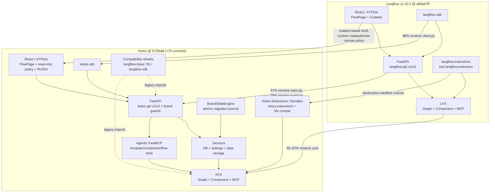

# Семантическая карта Ketos ↔ Langflow v1.10.2

## Статус и область действия

Этот документ сопоставляет **текущий зафиксированный код Ketos** с официальным
Langflow `v1.10.2`. Карта описывает архитектурную lineage, сохранённые
контракты, намеренные разрывы и новые слои Ketos. Она не является утверждением
о полной бинарной или поведенческой совместимости.

Сравнение привязано к следующим неизменяемым точкам:

| Сторона | Ревизия | Подтверждение |
| --- | --- | --- |
| Langflow upstream | tag `v1.10.2`, commit `a69a47ff1b5c99ce9c50edc4df45de4397151f17` | [pinned manifest](../../references/langflow-upstream.lock.json#L2-L4) |
| Ketos fork | `572fad8ea2223e342508ecf095133091c7714e1b` | [pinned manifest](../../references/langflow-upstream.lock.json#L5-L8) |
| Lineage | merge-base равен upstream SHA; Ketos на **70 commits** впереди | [проверка истории](../../ops/subagent-reports/06-langflow-reference.md#L42-L62) |

Число `+70` относится только к committed history. Существующее несвязанное
dirty-состояние рабочего дерева в сравнение не включалось.

## Метод и границы доказательств

Иерархия доказательств:

1. точный tag/SHA и `git merge-base`;
2. текущие исходники Ketos и pinned checkout
   `references/langflow-upstream`;
3. rename-aware diff между `v1.10.2` и Ketos `HEAD`;
4. оба Graphify-графа только как навигационный индекс.

Ketos-граф привязан к текущему `HEAD`; его независимая проверка дала 100%
нормализованного покрытия текущих code signatures, при этом сохранились 17
видимых self-loop warnings
([проверка Ketos-графа](../../ops/subagent-reports/07-graphify-ketos.md#L105-L167)).
Upstream-граф привязан к точному SHA, но имеет 16 986 dangling edges,
same-endpoint collapse и 262 не представленных JSON-файла
([ограничения upstream-графа](../../ops/subagent-reports/08-graphify-langflow.md#L95-L121)).
Поэтому ни один вывод ниже не основан только на Graphify edge.

## Легенда категорий

| Категория | Значение |
| --- | --- |
| **переименовано** | Путь, пакет, символ или product identity изменены, а основная роль сохранена. |
| **удалено** | Upstream-поверхность больше не является canonical Ketos-поверхностью либо явно отвергается. Совместимость может существовать отдельно через shim. |
| **совместимо** | Существенный контракт сохранён: route shape, flow schema, component identity, вызов или импорт через поддерживаемый adapter. |
| **глубоко переработано** | Сохранён общий архитектурный предок, но изменены ownership, safety policy, persistence, lifecycle или публичный контракт. |

Категории не взаимоисключающие. Например, SDK одновременно переименован,
сохраняет REST shape и получил отдельный compatibility distribution.

## Lineage и текущая архитектурная форма

## Crosswalk архитектурных областей

| Область | Langflow v1.10.2 | Ketos | Категория | Совместимость и смысл изменения |
| --- | --- | --- | --- | --- |
| Backend application | `create_app()` создаёт FastAPI `title="Langflow"` и подключает общий router: [upstream `main.py`](../../references/langflow-upstream/src/backend/base/langflow/main.py#L642-L657), [router mount](../../references/langflow-upstream/src/backend/base/langflow/main.py#L805-L815) | `create_app()` создаёт `title="Ketos"`, регистрирует typed API errors, отклоняет legacy headers и возвращает `Content-Language`: [Ketos `main.py`](../../src/backend/base/ketos/main.py#L657-L673), [middleware](../../src/backend/base/ketos/main.py#L717-L726), [locale response](../../src/backend/base/ketos/main.py#L795-L809) | **переименовано**, **глубоко переработано** | Lifespan/FastAPI skeleton сохранён, но product boundary стал fail-closed и RU/EN-aware. |
| API v1/v2 composition | `/api` → `/v1` и `/v2`; основной набор flows, files, projects, MCP, workflow: [upstream router](../../references/langflow-upstream/src/backend/base/langflow/api/router.py#L44-L132) | Та же prefix topology и практически тот же route set: [Ketos router](../../src/backend/base/ketos/api/router.py#L44-L132) | **переименовано**, **совместимо** | Клиенты, завязанные на `/api/v1/*` и `/api/v2/*`, имеют сохранённую структурную точку входа. Совместимость конкретного payload нужно проверять endpoint-by-endpoint. |
| Frontend route shell | Flows/components/MCP/settings/flow routes; settings расширяются `CustomRoutesStore()`: [upstream routes](../../references/langflow-upstream/src/frontend/src/routes.tsx#L114-L176), [flow route](../../references/langflow-upstream/src/frontend/src/routes.tsx#L189-L195) | Базовые routes сохранены, добавлен явный `settings/language`, а динамические `CustomRoutesStore*` вызовы отсутствуют: [Ketos routes](../../src/frontend/src/routes.tsx#L113-L174), [flow route](../../src/frontend/src/routes.tsx#L187-L193) | **совместимо**, **удалено**, **глубоко переработано** | Основная навигация совместима. Upstream frontend route injection не является текущим Ketos-контрактом; Language стал системным route. |
| Canvas / XYFlow | `FlowPage` использует тот же shell, Zustand и `<ReactFlow>`; блокировка редактирования распределена по отдельным props: [upstream FlowPage](../../references/langflow-upstream/src/frontend/src/pages/FlowPage/index.tsx#L39-L92), [upstream canvas](../../references/langflow-upstream/src/frontend/src/pages/FlowPage/components/PageComponent/index.tsx#L885-L972) | Core nodes/edges/store сохранены, но введены единый `isCanvasReadOnly`, `CanvasReadOnlyProvider`, read-only-aware handlers и локализованные agent events: [Ketos canvas state](../../src/frontend/src/pages/FlowPage/components/PageComponent/index.tsx#L148-L184), [Ketos ReactFlow policy](../../src/frontend/src/pages/FlowPage/components/PageComponent/index.tsx#L935-L1022) | **совместимо**, **глубоко переработано** | Flow JSON и XYFlow model остаются узнаваемыми; mutation policy canvas централизован и строже upstream. |
| Canvas state | `useFlowStore` хранит nodes, edges, build state и ReactFlow instance: [upstream store](../../references/langflow-upstream/src/frontend/src/stores/flowStore.ts#L114-L190) | Те же базовые поля и actions: [Ketos store](../../src/frontend/src/stores/flowStore.ts#L115-L190); добавлен расширенный translation sync: [Ketos translation sync](../../src/frontend/src/stores/flowStore.ts#L1635-L1669) | **совместимо**, **глубоко переработано** | Store shape не заменён новым canvas engine; он расширен политиками локализации и текущей Ketos UI-семантикой. |
| Component SDK | Canonical base — `lfx.custom.Component`; instance ID включает Python class name: [upstream Component](../../references/langflow-upstream/src/lfx/src/lfx/custom/custom_component/component.py#L150-L204) | Canonical base — `kfx.custom.Component`; тот же class-name-derived ID contract: [Ketos Component](../../src/kfx/src/kfx/custom/custom_component/component.py#L150-L204) | **переименовано**, **совместимо** | Класс компонента остаётся persisted identifier. Переименование component classes ломает сохранённые flow IDs/types даже при наличии package shims. |
| Flow graph/executor | `lfx.graph.Graph`, `async_start()` и `arun()` исполняют vertex/edge graph: [upstream Graph](../../references/langflow-upstream/src/lfx/src/lfx/graph/graph/base.py#L65-L110), [execution](../../references/langflow-upstream/src/lfx/src/lfx/graph/graph/base.py#L370-L405), [arun](../../references/langflow-upstream/src/lfx/src/lfx/graph/graph/base.py#L869-L905) | Эквивалентные entry points находятся в KFX: [Ketos Graph](../../src/kfx/src/kfx/graph/graph/base.py#L65-L110), [execution](../../src/kfx/src/kfx/graph/graph/base.py#L370-L405), [arun](../../src/kfx/src/kfx/graph/graph/base.py#L869-L905) | **переименовано**, **совместимо** | Core executor перенесён с высокой similarity; это сильнейшая зона structural compatibility. |
| Spec-to-flow builder | Текстовый spec валидируется по registry и превращается в flow dict: [upstream builder](../../references/langflow-upstream/src/lfx/src/lfx/graph/flow_builder/builder.py#L64-L110) | Тот же contract находится в KFX: [Ketos builder](../../src/kfx/src/kfx/graph/flow_builder/builder.py#L64-L110) | **переименовано**, **совместимо** | MCP/agent tooling может продолжать строить тот же тип flow dict, если component type names сохранены. |
| Python SDK | Distribution `langflow-sdk`; `LangflowClient` использует `/api/v1/flows/` и `/api/v1/run/{id}`: [upstream package](../../references/langflow-upstream/src/sdk/pyproject.toml#L1-L32), [upstream client](../../references/langflow-upstream/src/sdk/src/langflow_sdk/client.py#L58-L68), [REST calls](../../references/langflow-upstream/src/sdk/src/langflow_sdk/client.py#L130-L198) | Canonical distribution `ketos-sdk`; `KetosClient` сохраняет те же REST paths: [Ketos package](../../src/sdk/pyproject.toml#L1-L37), [Ketos client](../../src/sdk/src/ketos_sdk/client.py#L55-L65), [REST calls](../../src/sdk/src/ketos_sdk/client.py#L131-L199) | **переименовано**, **совместимо**, **глубоко переработано** | Transport/API shape в этой части сохранён. Canonical import и pytest plugin name изменены; legacy SDK вынесен в отдельный wheel. |
| Extensions manifest | Manifest описывает Langflow Extension, `[tool.langflow.extension]`, `lfx.compat`, schema `schemas.langflow.org`: [upstream manifest](../../references/langflow-upstream/src/lfx/src/lfx/extension/manifest.py#L1-L30), [schema constants](../../references/langflow-upstream/src/lfx/src/lfx/extension/manifest.py#L60-L78) | Manifest описывает Ketos Extension, `[tool.ketos.extension]`, `kfx.compat`, единственный schema `schemas.ketos.test`: [Ketos manifest](../../src/kfx/src/kfx/extension/manifest.py#L1-L30), [schema constants](../../src/kfx/src/kfx/extension/manifest.py#L60-L81) | **переименовано**, **удалено**, **глубоко переработано** | Старые manifest keys/URL не являются допустимым canonical contract. Это намеренный destructive cutover, а не прозрачный alias. |
| Extension discovery | Editable/install discovery использует group `langflow.extensions`: [upstream discovery](../../references/langflow-upstream/src/lfx/src/lfx/extension/discovery.py#L209-L219), [entry-point selection](../../references/langflow-upstream/src/lfx/src/lfx/extension/discovery.py#L260-L292) | Discovery использует только `ketos.extensions`: [Ketos discovery](../../src/kfx/src/kfx/extension/discovery.py#L210-L220), [entry-point selection](../../src/kfx/src/kfx/extension/discovery.py#L261-L293) | **переименовано**, **удалено** | Установка старого extension wheel без repackaging не гарантирует discovery. |
| Official bundles | `lfx-duckduckgo` зависит от `lfx`, публикует `langflow.extensions`, manifest содержит `lfx.compat`: [upstream bundle](../../references/langflow-upstream/src/bundles/duckduckgo/pyproject.toml#L1-L49), [upstream extension.json](../../references/langflow-upstream/src/bundles/duckduckgo/src/lfx_duckduckgo/extension.json#L1-L16) | `kfx-duckduckgo` зависит от KFX, публикует `ketos.extensions`, manifest содержит `kfx.compat`: [Ketos bundle](../../src/bundles/duckduckgo/pyproject.toml#L1-L50), [Ketos extension.json](../../src/bundles/duckduckgo/src/kfx_duckduckgo/extension.json#L1-L16) | **переименовано**, **глубоко переработано** | Component implementation может быть почти тем же, но distribution identity и install/discovery contract несовместимы без портирования. |
| Settings | `lfx.services.settings.SettingsService` владеет Settings/AuthSettings: [upstream service](../../references/langflow-upstream/src/lfx/src/lfx/services/settings/service.py#L1-L35); locale выбирается request-only из полного набора locale files: [upstream middleware](../../references/langflow-upstream/src/backend/base/langflow/main.py#L768-L792) | KFX service shape сохранён: [Ketos service](../../src/kfx/src/kfx/services/settings/service.py#L1-L35); Ketos фиксирует `SUPPORTED_LOCALES=("en","ru")`, default `ru`, persisted `preferred_locale` и `Content-Language`: [locale contract](../../src/backend/base/ketos/utils/i18n.py#L62-L70), [user model](../../src/backend/base/ketos/services/database/models/user/model.py#L29-L39), [validation](../../src/backend/base/ketos/services/database/models/user/model.py#L82-L121) | **переименовано**, **совместимо**, **глубоко переработано** | Core settings service совместим, но product locale policy и persistence являются Ketos-owned contract. |
| Storage | Backend StorageService использует `settings.config_dir` как data root: [upstream storage](../../references/langflow-upstream/src/backend/base/langflow/services/storage/service.py#L19-L28); local storage применяет traversal guard: [upstream local storage](../../references/langflow-upstream/src/backend/base/langflow/services/storage/local.py#L90-L101) | Ketos сохраняет abstract storage API и guard, но использует отдельный `settings.data_dir`: [Ketos storage](../../src/backend/base/ketos/services/storage/service.py#L19-L28), [Ketos local storage](../../src/backend/base/ketos/services/storage/local.py#L90-L101) | **совместимо**, **глубоко переработано** | Логический API сохранён; физическое ownership данных отделено от config root. Миграция путей требует brand-state процесса, а не простого rename env var. |
| Agentic MCP server | FastMCP `langflow-agentic` экспортирует template/component/flow tools: [upstream server](../../references/langflow-upstream/src/backend/base/langflow/agentic/mcp/server.py#L1-L75) | Тот же tool surface под FastMCP `ketos-agentic`: [Ketos server](../../src/backend/base/ketos/agentic/mcp/server.py#L1-L75) | **переименовано**, **совместимо** | Tool semantics и decorators сохранены с высокой similarity; server identity и import namespace изменены. |
| MCP component | `MCPToolsComponent` живёт в LFX и является flow component: [upstream component](../../references/langflow-upstream/src/lfx/src/lfx/components/models_and_agents/mcp_component.py#L56-L81) | Класс сохранён в KFX и остаётся `MCPToolsComponent`: [Ketos component](../../src/kfx/src/kfx/components/models_and_agents/mcp_component.py#L56-L85) | **переименовано**, **совместимо** | Сохранение class name поддерживает persisted flow identity; implementation содержит Ketos-specific cache/safety пояснения. |
| Compatibility layer | Upstream backend уже имел динамический bridge `langflow.components.* → lfx.components.*` для сохранённых flows: [upstream bridge](../../references/langflow-upstream/src/backend/base/langflow/__init__.py#L20-L43), [identity-preserving loader](../../references/langflow-upstream/src/backend/base/langflow/__init__.py#L46-L74) | Ketos делает canonical namespaces `ketos`/`kfx`, а legacy imports выносит в versioned wheels: [lfx root shim](../../src/compat/lfx/src/lfx/__init__.py#L1-L11), [frozen module map](../../src/compat/lfx/src/lfx_compat/aliases.py#L18-L62), [backend shim](../../src/compat/langflow-base/src/langflow/__init__.py#L1-L11), [renamed exports](../../src/compat/langflow-base/src/langflow_compat/aliases.py#L17-L49) | **совместимо**, **глубоко переработано** | Совместимость стала явным, версионированным distribution boundary. Неизвестные или blocked legacy modules должны падать диагностируемо, а не незаметно импортироваться. |
| Legacy HTTP product headers | `X-LANGFLOW-GLOBAL-VAR-*` извлекаются как runtime variables: [upstream headers](../../references/langflow-upstream/src/backend/base/langflow/api/utils/core.py#L403-L450) | Ketos принимает `X-KETOS-GLOBAL-VAR-*` и fail-closed отклоняет `x-langflow-*`: [Ketos header guard](../../src/backend/base/ketos/api/utils/core.py#L405-L415), [Ketos extraction](../../src/backend/base/ketos/api/utils/core.py#L417-L459) | **удалено**, **глубоко переработано** | Старый wire-level product header contract намеренно не совместим. |
| Brand-state migration | Upstream не содержит отдельного transactional brand migration engine; config/data paths принадлежат Langflow settings/storage. | Ketos обнаруживает legacy и canonical roots и мигрирует их через atomic/resumable phases: [legacy/canonical discovery](../../src/backend/base/ketos/brand_state/discovery.py#L102-L140), [BrandStateEngine](../../src/backend/base/ketos/brand_state/engine.py#L353-L396), [journal writes](../../src/backend/base/ketos/brand_state/engine.py#L398-L440) | **глубоко переработано** | Это новая Ketos-owned подсистема. У неё нет прямого upstream behavioral equivalent; корректность миграции нельзя вывести из similarity соседних сервисов. |

## Сохранённые архитектурные инварианты

### 1. Flow остаётся единым объектом между UI, API и executor

Frontend по-прежнему редактирует `nodes`/`edges` в Zustand и передаёт flow
через `/api/v1/flows/*`. Backend по-прежнему материализует тот же graph-shaped
объект в `Graph`/`Vertex` execution. Это означает, что Ketos является deep fork
Langflow, а не отдельным canvas, подключённым к Langflow только через внешний
adapter.

### 2. Component class name остаётся частью persisted identity

И upstream, и Ketos формируют component instance ID из
`self.__class__.__name__`. Поэтому namespace cutover `lfx → kfx` допустим при
сохранении имён классов, но переименование конкретного component class требует
отдельной migration strategy. Compatibility wheel не может восстановить
потерянный persisted type автоматически.

### 3. REST route topology существенно стабильнее package topology

Python imports и distribution names изменены радикально, тогда как ключевые
REST paths SDK (`/api/v1/flows/`, `/api/v1/run/{id}`) сохранены. Внешняя
HTTP-интеграция имеет более сильную вероятность совместимости, чем прямой
импорт внутренних `langflow.*`/`lfx.*` модулей.

### 4. MCP — часть обоих уровней

MCP присутствует:

- на backend/agentic уровне как FastMCP server с tools для templates,
  components и flows;
- на component/executor уровне как `MCPToolsComponent`;
- в API router как v1/v2 MCP routes.

Ketos не добавляет MCP «снаружи» Langflow; он наследует upstream MCP topology и
переносит ownership в `ketos`/`kfx`.

## Намеренные разрывы совместимости

1. **Canonical imports:** `ketos.*` и `kfx.*` — единственные текущие
   implementation namespaces. `langflow.*` и `lfx.*` доступны только в
   пределах явно поставленных compatibility distributions.
2. **Extension contract:** только `ketos.extensions`,
   `[tool.ketos.extension]`, `kfx.compat` и
   `https://schemas.ketos.test/extension/v1.json` являются canonical.
3. **Product headers:** `x-langflow-*` отклоняются до auth/lookup/execution.
4. **Data ownership:** runtime data root отделён от config root.
5. **Frontend plugin routes:** upstream `CustomRoutesStore()` и
   `CustomRoutesStorePages()` не входят в текущую Ketos route composition.
6. **Product locale policy:** Ketos ограничивает system-owned locale contract
   значениями `ru` и `en`, хранит preference у пользователя и выставляет
   `Content-Language`.

## Compatibility matrix для миграции

| Артефакт потребителя | Ожидаемый статус | Условие |
| --- | --- | --- |
| Сохранённый flow JSON с неизменёнными component class names | Высокая structural compatibility | Все component types присутствуют в KFX registry; extension bundles портированы. |
| HTTP client, использующий `/api/v1/flows` и `/api/v1/run` | Вероятно совместим | Payload/auth/header semantics проверены отдельно; `x-langflow-*` не используется. |
| Python-код на `langflow_sdk` | Совместим через shim | Установлен `langflow-sdk` compatibility wheel; используемый symbol входит в alias surface. |
| Python-код на внутренних `langflow.*`/`lfx.*` модулях | Ограниченно совместим | Модуль присутствует в frozen map и не отмечен blocked; renamed exports покрыты. |
| Langflow extension wheel | Несовместим без портирования | Manifest, distribution/package name и entry-point переписаны на Ketos/KFX. |
| Canvas plugin, полагающийся на `CustomRoutesStore*` | Несовместим | Нужен новый явный route integration contract; текущего аналога в Ketos routes нет. |
| Storage deployment, где data лежат в `LANGFLOW_CONFIG_DIR` | Требует миграции | Пути должны пройти brand-state discovery/migration в canonical Ketos roots. |

## Явные пробелы и неопределённости

1. **Это source map, не runtime certification.** В рамках этой работы не
   запускались backend/frontend/E2E suites и не воспроизводилась database
   migration.
2. **Payload compatibility не доказана полностью.** Сохранение route paths не
   гарантирует идентичность каждого request/response model, error code или
   auth rule.
3. **Compatibility maps не перечислены построчно.** Наличие versioned module
   maps доказано, но каждый legacy import не исполнялся.
4. **Extension ecosystem требует repackaging.** Высокая similarity Python-кода
   bundle не компенсирует несовместимые manifest/entry-point/distribution
   identities.
5. **Upstream Graphify имеет structural gaps.** JSON fixtures/settings/starter
   flows не покрыты полностью, а часть edges схлопнута. Все критические выводы
   поэтому проверены по исходникам.
6. **Текущий Ketos Graphify — навигационный снимок.** Он подтверждает code
   coverage и source locations, но self-loops не позволяют называть граф
   идеальным.
7. **BrandStateEngine — current-only subsystem.** Для него невозможно дать
   симметричный upstream source anchor; ближайший upstream boundary —
   settings/storage без transactional brand journal.

## Итог

Ketos — прямой deep fork Langflow `v1.10.2`, а не независимая реализация:
FastAPI topology, FlowPage/Zustand/XYFlow, `Graph`, `Component`, SDK REST paths,
Agentic MCP и component MCP имеют явную source lineage. При этом Ketos
перенёс canonical ownership в `ketos`/`kfx`, ввёл fail-closed brand boundary,
RU/EN product locale, единый canvas read-only policy, отдельный data root,
versioned compatibility wheels и transactional brand-state migration.

Практическое правило миграции:

- **flows/components/API** сначала считать совместимыми по структуре и
  подтверждать тестом;
- **imports/extensions/headers/storage paths** сначала считать разрывом
  контракта и разрешать только через явный Ketos adapter или migration.
