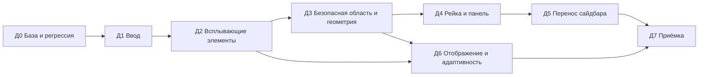

# Аудит доски Кетос и план исправлений

> Источник: запрос пользователя от 2026-09-25 (масштабирование, окна, анимации, подписи кнопок, рейка чатов, перенос функционала сайдбара) и аудит, проведённый в тот же день. База аудита: `main` @ `6c342d33` («keep the board composer chips on one line…»), репозиторий `/Volumes/Projects/Ketos bot`, запущенный стенд `http://127.0.0.1:3080`, Chromium встроенного браузера, окно 1440×900 и 1100×700. Документ самостоятельный: он не меняет мастер-план ревизии 18 и может быть оформлен как этап 23 цепочки (решение о номере — за пользователем).

## Содержание

1. [Как пользоваться документом](#1-как-пользоваться-документом)
2. [Сводка аудита](#2-сводка-аудита)
3. [Корневые причины](#3-корневые-причины)
4. [Каталог проблем](#4-каталог-проблем)
5. [Решения, которые нужно принять до начала работ](#5-решения-которые-нужно-принять-до-начала-работ)
6. [Порядок этапов и зависимости](#6-порядок-этапов-и-зависимости)
7. [Этапы и подэтапы](#7-этапы-и-подэтапы)
8. [Команды проверки](#8-команды-проверки)
9. [Риски](#9-риски)
10. [Сводный чек-лист](#10-сводный-чек-лист)

---

## 1. Как пользоваться документом

- **Проблема** имеет идентификатор `П-NN` и карточку в разделе 4: статус проверки, симптом, воспроизведение, доказательство, причина со ссылкой на код, связи и ожидаемое поведение.
- **Этап** `Д<N>` — законченный по смыслу блок работ; **подэтап** `Д<N>.<M>` состоит из четырёх частей: **Цель**, **Контекст**, **Задачи**, **Критерии верификации**. Каждая задача ссылается на проблемы, которые закрывает.
- **Статус проверки проблемы:**
  - `браузер` — воспроизведено на запущенном стенде, есть измерение;
  - `код` — следует из чтения кода, на стенде не воспроизводилось;
  - `гипотеза` — вероятная проблема, которую подэтап обязан сначала подтвердить или снять.
- **Серьёзность:** `S1` — ломает основной сценарий или делает интерфейс непригодным; `S2` — заметный дефект с обходным путём; `S3` — косметика или долг.
- Учёт работы — в Beads (`bd`): эпик «Аудит доски», по задаче на подэтап, дочерние задачи на проблемы `П-NN`; зависимости повторяют раздел 6. Процедура — `docs/ketos/beads.md`.
- Работа идёт в отдельном worktree (решение 47), например `/Volumes/Projects/Ketos bot.worktrees/stage-23` на ветке `stage-23-board-audit` от `main`.
- Definition of Done подэтапа: все задачи выполнены; каждый критерий подтверждён командой или наблюдаемым поведением; тесты `ui-board` зелёные; для изменённых примитивов — тесты `ui-primitives`; видимые изменения проверены в браузере.

---

## 2. Сводка аудита

Найдено **35 проблем**. Они сводятся к **пяти корневым причинам** (раздел 3), поэтому исправлять их нужно по причинам, а не по симптомам: иначе исправление одного элемента ломает соседний.

| Группа | Проблемы | S1 | S2 | S3 | Этап |
|---|---|---|---|---|---|
| A. Ввод: тачпад, колесо, клавиши | П-01 … П-08 | 4 | 3 | 1 | Д1 |
| B. Всплывающие элементы окон (подписи, меню) | П-09 … П-15 | 3 | 4 | 0 | Д2 |
| C. Рейка и панель чатов окна | П-16 … П-23 | 2 | 5 | 1 | Д4 |
| D. Функционал панели (перенос сайдбара) | П-24 … П-25 | 1 | 1 | 0 | Д5 |
| E. Геометрия и растягивание окон, безопасная область | П-26 … П-31 | 1 | 5 | 0 | Д3 |
| F. Отображение, анимации, адаптивность | П-32 … П-35 | 0 | 2 | 2 | Д6 |

Сводка по пунктам запроса пользователя:

| Пункт запроса | Проблемы | Этапы |
|---|---|---|
| 1. Масштабирование доски, тачпад, «масштабируется весь интерфейс» | П-01 … П-08, П-18, П-28, П-32 | Д1, Д3, Д6 |
| 2. Масштаб окон и зависимость содержимого от окна | П-10, П-11, П-13 … П-15, П-20, П-27 | Д2, Д3, Д4 |
| 3. Отображение, анимации, растягивание, позиционирование | П-26 … П-35, П-21, П-22 | Д3, Д4, Д6 |
| 4. Подписи кнопок не у кнопки | П-09 | Д2 |
| 5. Рейка плавающих чатов: закрепить слева, убрать «Новый чат» | П-16 … П-19, П-23 | Д4 |
| 6. Перенос функционала сайдбара в панель окна | П-24, П-25 | Д5 |
| 7. Полный аудит и последовательный план | весь документ | Д0 … Д7 |

---

## 3. Корневые причины

### R1. Подписи с `position: fixed` внутри трансформированного холста

Подпись к кнопке (`Tooltip` из `@deepseek-ai/dsh-client-ui-primitives`) рисуется элементом с `position: fixed` без портала (`packages/client/ui-primitives/src/Tooltip.module.css:2`). Координаты берутся из `getBoundingClientRect()` кнопки, то есть в пикселях экрана. Но все окна доски лежат внутри слоя холста с `transform: translate3d(…) scale(…)` и `will-change: transform` (`packages/client/ui-board/src/client/canvas/DashboardCanvas.module.css:33-34`). По спецификации CSS такой предок становится содержащим блоком для `fixed`-потомков: координаты подписи отсчитываются от левого верхнего угла холста, а затем ещё умножаются на масштаб и сдвигаются на панорамирование. Подпись улетает тем дальше, чем дальше холст от нуля и чем больше масштаб.

**Порождает:** П-09.

### R2. Меню открываются в портале страницы в масштабе 1 и позиционируются один раз

`Menu` в режиме `portal` переносит список в `document.body` и ставит его `position: fixed` по прямоугольнику кнопки (`packages/client/ui-primitives/src/Menu.tsx:118-164`):

- масштаб списка всегда 1, а кнопка в окне — в масштабе доски;
- позиция пересчитывается только на `scroll` и `resize` окна браузера (`Menu.tsx:158-159`), а панорамирование и зум доски этих событий не порождают;
- ограничителем служит всё окно браузера (`MARGIN = 12`, `window.innerWidth/innerHeight`, `Menu.tsx:129-150`), а не область доски;
- подменю позиционируется чистым CSS «вправо и вверх» без переворота (`Menu.module.css:232-239`), а высоту не ограничивает, если в меню есть подменю (`Menu.tsx:223`).

Решение «порталы сохраняют размеры приложения» записано в комментарии `packages/client/ui-board/src/client/BoardViews.module.css:22-23` и противоречит требованию пользователя: интерфейс окна должен масштабироваться вместе с окном.

**Порождает:** П-10 … П-15.

### R3. Одно событие колеса — один шаг зума ±10%, и перехват только над пустым холстом

Обработчик колеса на корне доски (`packages/client/ui-board/src/client/BoardViews.tsx:79-90`):

- всегда зумит (нет панорамирования двумя пальцами);
- передаёт в стор только знак `deltaY`: `factor = delta < 0 ? 1.1 : 0.9` (`packages/client/ui-board/src/client/store.ts:338-345`), поэтому величина жеста не важна, а `deltaY = 0` (горизонтальный свайп) — это уменьшение;
- пропускает события над окнами и панелью (`packages/client/ui-board/src/client/wheel-zoom.ts:14-18`), так что пинч (в Chromium это `wheel` с `ctrlKey`) над окном уходит браузеру и масштабирует всю страницу;
- не знает о жестах Safari (`gesturestart/gesturechange`) — во всём клиенте нет ни одного такого обработчика.

Клавиатурный сброс `Cmd/Ctrl+0` при этом перехвачен глобально, без проверки, что курсор над доской (`BoardViews.tsx:95-100`), а `Cmd/Ctrl +/−` не перехвачены вовсе.

**Порождает:** П-01 … П-08.

### R4. Рейка и панель чатов вычисляют сторону и размер из внешних условий

Рейка и панель окна — отдельный слой в координатах холста (`packages/client/ui-board/src/client/window/panel-geometry.ts`, `WindowChatsPanel.tsx:176-191`):

- сторона (слева/справа) выбирается по свободному месту для *раскрытой* панели в видимой части доски — и эта же сторона используется для *свёрнутой* рейки;
- вертикальная позиция рейки центрируется по высоте окна;
- ширина панели ограничена 45% ширины окна (`panel-geometry.ts:55`);
- в режиме наложения панель получает `zIndex: 1000` (`WindowChatsPanel.tsx:490`) — выше полосы окон 10–99;
- при открытой панели корень доски скрывает док, омнибар и мини-карту (`BoardViews.tsx:153-155`).

**Порождает:** П-16 … П-23.

### R5. У доски нет понятия «безопасная область»

Плавающие панели доски (док слева, омнибар снизу по центру, мини-карта снизу справа) — абсолютные элементы с жёсткими размерами. Размещение нового окна (`store.ts:230-235`), центрирование на окне (`store.ts:407-423`) и сброс вида (`dock/SessionRail.tsx:293-294`, `BoardViews.tsx:95-100`) считают видимой всю область доски и не учитывают эти панели, рейку и панель слева от окна. Панели не знают друг о друге: на узкой доске они перекрываются. Ограничения размеров окна (`MIN_WINDOW_SIZE = 552×648`, `store.ts:152`) и правило угловой ручки (`resize.ts:82`) не согласованы с исправлением однострочного композера (`6c342d33`).

**Порождает:** П-26 … П-31.

---

## 4. Каталог проблем

### A. Ввод: тачпад, колесо, клавиши

#### П-01. Пинч над окном или панелью чатов масштабирует всю страницу

- **Статус:** браузер. **Серьёзность:** S1. **Этап:** Д1.1.
- **Симптом:** пользователь сводит или разводит два пальца на тачпаде над окном чата — масштабируется весь интерфейс (сайдбар приложения, шрифты, док), а не доска. После нескольких жестов сайдбар становится крошечным, настройки «плывут», элементы конфликтуют. Это основной симптом пункта 1 запроса.
- **Как воспроизвести:** открыть доску → навести курсор на ленту окна → пинч двумя пальцами.
- **Доказательство:** синтетический `WheelEvent{ctrlKey: true}` над лентой окна, над открытой панелью чатов и над сайдбаром приложения вернул `defaultPrevented = false`; над пустым холстом — `true`.
- **Причина:** `wheelZoomsBoard` отдаёт событие окну, если цель внутри `[data-board-window]` или `[data-board-panel]` (`wheel-zoom.ts:17`), и обработчик выходит без `preventDefault` (`BoardViews.tsx:80`). Пинч в Chromium — это `wheel` с `ctrlKey`, и без `preventDefault` он становится зумом страницы.
- **Связи:** усиливается П-05 (стандартный `Cmd+0` не возвращает масштаб страницы). От настоящего масштаба страницы зависят все измерения геометрии, поэтому до исправления П-01 любые визуальные проверки ненадёжны.
- **Ожидаемое поведение:** пинч в любой точке доски, включая окна, их панели, рейки и плавающие панели доски, масштабирует только доску вокруг курсора. Прокрутка без модификатора над лентой окна по-прежнему прокручивает ленту.

#### П-02. Свайп двумя пальцами зумит доску, а горизонтальный свайп её уменьшает

- **Статус:** браузер. **Серьёзность:** S1. **Этап:** Д1.1.
- **Симптом:** привычное на тачпаде перемещение двумя пальцами не двигает доску, а меняет масштаб. Свайп влево или вправо уменьшает масштаб при любом направлении.
- **Доказательство:** `WheelEvent{deltaX: 40, deltaY: 0}` над холстом: масштаб 0.521 → 0.469; `WheelEvent{deltaY: 2}`: 0.469 → 0.422.
- **Причина:** обработчик всегда вызывает `zoomTowardPointer(event.deltaY, …)` (`BoardViews.tsx:84`); в сторе `factor = delta < 0 ? 1.1 : 0.9` (`store.ts:339`), поэтому `deltaY = 0` означает «уменьшить». `deltaX` игнорируется.
- **Ожидаемое поведение:** свайп двумя пальцами (обычное колесо без модификатора) над холстом перемещает доску по обеим осям; зум — только пинчем или колесом с `Ctrl/Cmd`. Поведение колеса мыши — решение Р-4.

#### П-03. Шаг зума не зависит от величины жеста

- **Статус:** браузер. **Серьёзность:** S1. **Этап:** Д1.2.
- **Симптом:** зум дёргается и мгновенно улетает к пределу 0.2 или 2. Тачпад присылает десятки мелких событий в секунду (и инерционный хвост), и каждое даёт полные 10%.
- **Доказательство:** `deltaY = 2` дал такой же шаг (×0.9), как и `deltaY = 40`.
- **Причина:** в стор передаётся только знак (`store.ts:339`); `deltaMode` (строки или страницы у некоторых мышей) не учитывается.
- **Ожидаемое поведение:** коэффициент пропорционален величине жеста: `factor = exp(−Δ·k)`, где Δ приведена к пикселям (`deltaMode`: 0 — пиксели, 1 — строки × 16, 2 — страницы × высота доски), с ограничением одного события. Чувствительность `k` — поле `Config`.

#### П-04. Жесты Safari не обрабатываются

- **Статус:** код (в Safari не проверялось). **Серьёзность:** S2. **Этап:** Д1.3.
- **Симптом (ожидаемый):** в Safari на macOS пинч порождает `gesturestart/gesturechange/gestureend`; без `preventDefault` он масштабирует страницу даже над пустым холстом.
- **Причина:** поиск по `packages/client` не находит обработчиков `gesture*`.
- **Ожидаемое поведение:** над доской жесты Safari масштабируют доску через тот же контроллер, что и `ctrl+wheel`: отношение `event.scale / предыдущий scale`, центр — точка жеста.

#### П-05. `Cmd/Ctrl+0` перехвачен глобально, пока доска смонтирована

- **Статус:** код. **Серьёзность:** S1. **Этап:** Д1.4.
- **Симптом:** стандартное сочетание «вернуть масштаб страницы 100%» не работает нигде в приложении, пока доска смонтирована: оно сбрасывает вид доски. В сочетании с П-01 пользователь не может вернуть случайно изменённый масштаб страницы стандартным способом.
- **Причина:** слушатель `keydown` на `globalThis` проверяет только `metaKey || ctrlKey` и `key === '0'`, без условия «курсор или фокус на доске», и вызывает `preventDefault` (`BoardViews.tsx:95-100`).
- **Ожидаемое поведение:** над доской (курсор внутри корня доски или фокус внутри неё) сочетание управляет видом доски; вне доски — поведение браузера.

#### П-06. `Cmd/Ctrl +/−` масштабируют страницу, а не доску

- **Статус:** код. **Серьёзность:** S2. **Этап:** Д1.4.
- **Симптом:** асимметрия: `Cmd+0` относится к доске, а `Cmd+=`/`Cmd+−` — к странице.
- **Ожидаемое поведение:** над доской `Cmd+=`/`Cmd+−` меняют масштаб доски шагом, центр — середина видимой безопасной области; вне доски — браузер.

#### П-07. Пинч над сайдбаром приложения масштабирует страницу

- **Статус:** браузер. **Серьёзность:** S2. **Этап:** Д1.5 (по решению Р-2).
- **Симптом:** пинч над сайдбаром «Рабочие папки» (вне доски) масштабирует страницу, и после этого доска и сайдбар визуально ломаются.
- **Доказательство:** `WheelEvent{ctrlKey: true}` над сайдбаром — `defaultPrevented = false`.
- **Ожидаемое поведение:** зависит от Р-2. Рекомендация — блокировать пинч-зум страницы во всём приложении (как в нативных приложениях), а `Cmd +/−/0` вне доски оставить браузеру для доступности.

#### П-08. Нет режима для мыши и нет единого места решения «что делает колесо»

- **Статус:** код. **Серьёзность:** S3. **Этап:** Д1.1.
- **Симптом:** решение «зум или прокрутка» размазано: `wheelZoomsBoard`, условие `fullscreen` в `BoardViews`, прокрутка ленты и панели — в разных местах. Колесо мыши над холстом всегда зумит; перемещать доску мышью можно только перетаскиванием фона, пробелом или средней кнопкой.
- **Ожидаемое поведение:** одна чистая функция классификации события колеса (`zoom` / `pan` / `native`) с тестами на каждую пару «цель × модификатор × режим»; режим колеса мыши — поле `Config` (Р-4).

### B. Всплывающие элементы окон

#### П-09. Подписи кнопок в окнах появляются вдали от кнопки или за экраном

- **Статус:** браузер. **Серьёзность:** S1. **Этап:** Д2.1, Д2.2.
- **Симптом:** при наведении на кнопку окна (закрыть, переименовать, во весь экран, кнопки композера, рейки, панели чатов) подпись появляется в другом месте — например, в углу — или не видна вовсе. Это пункт 4 запроса.
- **Как воспроизвести:** навести курсор на крестик «Закрыть» в шапке окна.
- **Доказательство:** центр кнопки x≈1039, y≈88; подпись «Закрыть» отрисована в x=1609, y=120 при ширине окна браузера 1440 — за правым краем. Во inline-стилях подписи экранные координаты (`left: 509px; top: 105px`), которые браузер интерпретировал в системе координат холста.
- **Причина:** R1. Кроме того, «вписывание в экран» внутри `Tooltip` (`Tooltip.tsx:67-90`) сравнивает прямоугольник подписи с `window.innerWidth` — тоже в неверной системе координат.
- **Затронуто:** `WindowFrame.tsx` (3 подписи), `ComposerBar.tsx` (~15), `WindowChatsPanel.tsx` (рейка, сворачивание, копирование пути, открыть папку, артефакты). Подписи дока и омнибара (`dock/SessionRail.tsx`, `omnibox/DashboardToolbar.tsx`) лежат вне холста и работают правильно — это контрольная группа для тестов.
- **Ожидаемое поведение:** подпись всегда рядом с кнопкой, с указанной стороны и с отступом, при любом зуме и панорамировании; при нехватке места переворачивается на противоположную сторону. Масштаб подписи — как у окна (Р-1).

#### П-10. Меню окна не масштабируются вместе с окном

- **Статус:** браузер. **Серьёзность:** S1. **Этап:** Д2.1, Д2.2.
- **Симптом:** при уменьшенной доске меню выбора модели, уровня рассуждений, разрешений, пресетов и действий открываются в размере приложения — в 2–3 раза крупнее окна, из которого вызваны (скриншоты пользователя 1 и 2). Это пункт 2 запроса.
- **Доказательство:** при зуме 0.42 кнопка модели имеет высоту 11px, а меню — шрифт 14px и размер 218×88 CSS-пикселей.
- **Причина:** R2 — портал в `document.body`, масштаб 1. Сознательное решение в `BoardViews.module.css:22-23` нужно отменить.
- **Ожидаемое поведение:** меню, вызванное из окна, рисуется в масштабе окна (`scale = zoom`) и привязано к кнопке. Ниже порога упрощённого вида (П-32) меню из окна не открываются.

#### П-11. Открытое меню не следует за кнопкой при перемещении и зуме доски

- **Статус:** браузер. **Серьёзность:** S2. **Этап:** Д2.2, Д2.3.
- **Симптом:** меню остаётся на месте, а окно с кнопкой уезжает — меню «отрывается» от окна (скриншот пользователя 1: меню висит отдельно от маленького окна).
- **Доказательство:** меню разрешений стояло в [12, 755], кнопка переместилась из [−124, 887] в [−226, 936] после одного шага колеса.
- **Причина:** `place()` вызывается только на `scroll`/`resize` (`Menu.tsx:158-159`).
- **Ожидаемое поведение:** меню пересчитывает позицию и масштаб на каждое изменение панорамирования, зума, положения или размера окна (подписка на стор доски) и закрывается, если кнопка ушла за пределы доски.

#### П-12. Меню не реагирует на жесты холста

- **Статус:** браузер. **Серьёзность:** S2. **Этап:** Д2.3.
- **Симптом:** при открытом меню доска продолжает зумиться колесом; меню остаётся открытым и неверно позиционированным. Правило «Escape закрывает меню первым» соблюдается (`WindowFrame.tsx:233-245`), но жесты холста о меню не знают.
- **Доказательство:** после `wheel` над холстом открытое меню осталось (`[role=menu]`: 1).
- **Ожидаемое поведение:** определённое правило. Рекомендация: меню следует за кнопкой во время панорамирования и зума (П-11) и закрывается при начале перетаскивания или растягивания окна, при переходе окна в полный экран или из него, при закрытии окна и при уходе кнопки за край доски.

#### П-13. Меню ограничено краями окна браузера, а не доски

- **Статус:** браузер. **Серьёзность:** S2. **Этап:** Д2.1, Д2.2.
- **Симптом:** меню окна может лечь поверх сайдбара приложения и открыться у кнопки, которая сама уже скрыта за краем доски.
- **Доказательство:** кнопка в x=−124 (за левым краем доски, начинающейся с x=280), меню — в x=12 поверх сайдбара.
- **Причина:** ограничение по `window.innerWidth/innerHeight` (`Menu.tsx:129-150`); выбор стороны `menuPlacement` тоже считает от окна браузера (`packages/client/ui-board/src/client/menu-placement.ts:19-25`).
- **Ожидаемое поведение:** ограничивающий прямоугольник меню окна — область доски (за вычетом отступа), выбор стороны и выравнивания — по ней же.

#### П-14. Подменю не переворачивается и уходит за край экрана

- **Статус:** браузер. **Серьёзность:** S1. **Этап:** Д2.1.
- **Симптом:** подменю «Уровень рассуждений» открылось с верхней границей y=−108: пункты Minimal, Low, Medium недоступны. У правого края подменю так же уйдёт за экран.
- **Причина:** `.submenu { bottom: -4px; left: calc(100% + 10px) }` (`Menu.module.css:232-239`) — фиксированное направление без измерения.
- **Ожидаемое поведение:** подменю измеряется и открывается туда, где помещается: вправо или влево от родителя, вниз или вверх от строки, со сдвигом внутрь ограничивающего прямоугольника.

#### П-15. У меню с подменю нет ограничения высоты

- **Статус:** код и скриншот пользователя 2 (список из ~15 моделей растянулся на всю высоту экрана). **Серьёзность:** S2. **Этап:** Д2.1.
- **Причина:** `scrollable` включается только для меню без подменю (`Menu.tsx:221-223`), потому что прокручиваемый контейнер обрезал бы абсолютно позиционированное подменю. Само подменю тоже без `max-height`.
- **Ожидаемое поведение:** и список, и подменю ограничены по высоте ограничивающим прямоугольником и прокручиваются. Подменю для этого выносится из прокручиваемого контейнера (позиционируется относительно слоя всплывающих элементов, а не родительской строки).

### C. Рейка и панель чатов окна

#### П-16. Рейка перескакивает с левого края окна на правый

- **Статус:** код. **Серьёзность:** S1. **Этап:** Д4.1.
- **Симптом:** свёрнутая рейка (пять круглых кнопок у края окна, скриншот пользователя 4) оказывается то слева, то справа от окна — в зависимости от того, где окно стоит на экране и какой масштаб. Это пункт 5 запроса: «не должна динамически изменять положение».
- **Как воспроизвести:** подвинуть окно к левому краю видимой доски так, чтобы слева осталось меньше 300px (ширина панели) → рейка переходит на правый край.
- **Причина:** `side` вычисляется из `panelPresentation` по ширине *раскрытой* панели и видимой области (`WindowChatsPanel.tsx:176-181`, `panel-geometry.ts:68-79`), и этот же `side` передаётся в `railRect` (`WindowChatsPanel.tsx:189-191`).
- **Ожидаемое поведение:** рейка всегда у левого края окна, независимо от положения окна, масштаба и свободного места.

#### П-17. Рейка центрирована по высоте окна

- **Статус:** код. **Серьёзность:** S2. **Этап:** Д4.1.
- **Симптом:** при растягивании окна по вертикали рейка едет вверх и вниз.
- **Причина:** `top: window.y + (window.height − PANEL_RAIL_HEIGHT) / 2` (`panel-geometry.ts:100-107`).
- **Ожидаемое поведение:** рейка прижата к верху окна (с тем же отступом, что и шапка) и не зависит от высоты окна.

#### П-18. Рейка масштабируется с доской и при малом масштабе почти невидима

- **Статус:** браузер. **Серьёзность:** S1. **Этап:** Д4.1, Д6.1.
- **Симптом:** при зуме 0.58 рейка шириной 26 экранных пикселей, при 0.2 будет около 9px — «боковая панель становится практически невидимой» (пункт 1 запроса). Масштаб страницы после П-01 делает её ещё меньше.
- **Доказательство:** рейка 44 мировые единицы → 26px на экране при зуме 0.585.
- **Ожидаемое поведение:** решение Р-3. Рекомендация: рейка — часть окна и масштабируется вместе с ним (как шапка и композер), а нечитаемо малые размеры закрываются упрощённым видом при малом масштабе (П-32).

#### П-19. В рейке дублируется кнопка «Новый чат»

- **Статус:** код. **Серьёзность:** S2. **Этап:** Д4.1.
- **Симптом:** кнопка «Новый чат» в рейке (`WindowChatsPanel.tsx:457-461`, действие `panel-rail-new-chat`) дублирует создание чата в шапке уровня чатов панели, «+» дока и «Новую сессию» сайдбара приложения. Пункт 5 запроса — убрать.
- **Ожидаемое поведение:** в рейке четыре кнопки: раскрыть панель, добавить папку, артефакты, поиск. Высота рейки и константа `PANEL_RAIL_HEIGHT` пересчитаны.

#### П-20. Ширина панели зависит от ширины окна

- **Статус:** код. **Серьёзность:** S2. **Этап:** Д4.2.
- **Симптом:** при растягивании окна меняется ширина раскрытой панели, хотя пользователь задал её ручкой.
- **Причина:** `panelWidthFor(cardWindow.width, requestedWidth)` ограничивает ширину 45% ширины окна (`WindowChatsPanel.tsx:177`, `panel-geometry.ts:54-57`).
- **Ожидаемое поведение:** ширина панели — значение пользователя в диапазоне `PANEL_MIN_WIDTH…PANEL_MAX_WIDTH` (260–420); доля окна ограничивает её только в режиме наложения, где панель лежит внутри рамки.

#### П-21. Раскрытая панель перекрывает соседние окна, а в режиме наложения — все окна доски

- **Статус:** код. **Серьёзность:** S2. **Этап:** Д4.2.
- **Симптом:** панель «рядом» лежит вне рамки окна и может закрыть соседнее окно. В режиме наложения у неё `zIndex: 1000` (`WindowChatsPanel.tsx:490`) — выше всей полосы окон 10–99, поэтому она перекрывает и окна, поднятые позже.
- **Ожидаемое поведение:** панель и рейка принадлежат стековому уровню своего окна: поднятое окно всегда выше чужой панели.

#### П-22. Раскрытие панели скрывает док, омнибар и мини-карту

- **Статус:** браузер. **Серьёзность:** S2. **Этап:** Д4.3.
- **Симптом:** при открытии панели чатов плавающие панели доски исчезают, при закрытии появляются; интерфейс «прыгает».
- **Причина:** `!panelOpen && renderSlot('board.dock' | 'board.omnibar' | 'board.minimap')` (`BoardViews.tsx:153-155`). Исходная мотивация — плавающие панели закрывали край панели и её ручку.
- **Ожидаемое поведение:** плавающие панели доски остаются на месте; при открытии панели доска плавно смещается так, чтобы окно с панелью попали в безопасную область (Д3.1).

#### П-23. Устаревшие комментарии и константы рейки

- **Статус:** код. **Серьёзность:** S3. **Этап:** Д4.1.
- **Симптом:** `WindowChatsPanel.module.css:99` — «four controls … 178px», а в коде пять кнопок и `PANEL_RAIL_HEIGHT = 212` с комментарием «five 36px controls»; шапка модуля описывает рейку как «hugging the frame's left edge», хотя она переключается на правый край.
- **Ожидаемое поведение:** комментарии описывают поведение после Д4.1; высота рейки выводится из числа кнопок в одном месте.

### D. Функционал панели чатов (перенос сайдбара)

#### П-24. Панель окна — отдельная реализация, расходящаяся с сайдбаром приложения

- **Статус:** браузер и код. **Серьёзность:** S1 (явное требование пункта 6). **Этап:** Д5.
- **Симптом:** в сайдбаре приложения (скриншот пользователя 5) — дерево «Рабочие папки»: заголовок, поиск, параметры вида, добавление папки, раскрываемые группы (`deepseek-harness`, «Без группы»), сессии с возрастом («привет · 7 ч»), «Новая сессия». Панель окна показывает другое: заголовок «Проекты», двухуровневую навигацию «проекты → чаты» со счётчиками, другие размеры и отступы, поиск только по проектам.
- **Причина:** `WindowChatsPanel.tsx` (1056 строк), `WindowChatsPanel.module.css` (538) и `chat-list-model.ts` (223) повторяют функционал `WorkspaceBrowser` из `packages/client/ui-workspace` (`rows/WorkspaceBrowser.tsx`, 1422 строки; `tree.ts`; `rows/Rows.tsx`) собственным кодом.
- **Ожидаемое поведение:** панель окна показывает тот же `WorkspaceBrowser` (заголовок, поиск, параметры вида, добавление папки, дерево групп и сессий, «Новая сессия»), но действия направлены в это окно: выбор сессии открывает её в окне, «Новая сессия» создаёт сессию в окне. Вкладка «Артефакты» остаётся отдельным разделом панели.

#### П-25. Нет шва для встраивания `WorkspaceBrowser` в окно

- **Статус:** код. **Серьёзность:** S2. **Этап:** Д5.1.
- **Контекст:** `WorkspaceBrowser` зарегистрирован только в слот `sidebar.workspaces` (владелец — `ui-sidebar`) и получает внедрённые действия `open(sessionId)` и `startSession(workspaceId?)`, которые ведут в главную панель (`ui-workspace/src/client/contract/slots.ts:86-140`). Компоненты пакетов наружу не экспортируются (export discipline `/client`), поэтому импортировать компонент в `ui-board` нельзя. `ui-board` уже зависит от `ui-workspace` (type-only импорт в `session-bridge.ts:34`).
- **Ожидаемое поведение:** «дыра» (слот) в панели окна, объявленная доской, с долей владельца `{ windowId, activeSessionId, openInWindow, startInWindow }`; `WorkspaceBrowser` регистрирует в неё второй вход. Направление зависимостей и объявление типов слота — задача Д5.1.

### E. Геометрия и растягивание окон, безопасная область

#### П-26. Угловая ручка не уменьшает окно и всегда сохраняет пропорции

- **Статус:** код. **Серьёзность:** S2. **Этап:** Д3.3.
- **Симптом:** тянешь угол внутрь — ничего не происходит; тянешь по диагонали — окно растёт строго пропорционально, свободно изменить ширину и высоту одним движением нельзя.
- **Причина:** `factor = Math.max(1, factorX, factorY)` и одинаковый множитель для обеих осей (`packages/client/ui-board/src/client/resize.ts:73-89`).
- **Ожидаемое поведение:** угол меняет обе оси независимо, в обе стороны; пропорционально — с `Shift` (сейчас `Shift` отключает привязку к сетке, поэтому модификаторы нужно развести: пропорции — `Shift`, без привязки — `Alt`, либо решение пользователя).

#### П-27. Минимальный размер окна равен размеру по умолчанию

- **Статус:** код. **Серьёзность:** S2. **Этап:** Д3.3.
- **Симптом:** окно нельзя сделать меньше 552×648; вместе с П-26 окно фактически может только расти. На узкой доске окно по умолчанию занимает почти всю высоту.
- **Причина:** `MIN_WINDOW_SIZE = BOARD_WINDOW_TEMPLATES.agent` (`store.ts:146-155`) с обоснованием «строки композера не укладываются меньше». После `6c342d33` строка инструментов композера не переносится и умеет сжиматься до иконок.
- **Ожидаемое поведение:** минимальный размер определяется минимальной работоспособной раскладкой окна (Р-5, ориентир 408×480 мировых единиц) и проверяется браузерным сценарием.

#### П-28. Сброс вида ставит (0, 0) при масштабе 1, а не показывает окна

- **Статус:** браузер. **Серьёзность:** S2. **Этап:** Д3.2.
- **Симптом:** кнопка дока «Сбросить вид» и `Cmd+0` переводят доску в начало координат. Окна могут оказаться за краем доски или под доком.
- **Доказательство:** после `Cmd+0` окно получило x=−248 при левом крае доски x=280, левая часть окна — под доком.
- **Причина:** `actions.setPan(0, 0); actions.setZoom(1)` (`dock/SessionRail.tsx:293-294`, `BoardViews.tsx:96-99`).
- **Ожидаемое поведение:** «Показать все окна» вписывает рамку всех окон (с рейками и раскрытой панелью) в безопасную область с масштабом не больше 1; при отсутствии окон — (0, 0) и 1. Отдельное действие «100%» сохраняет центр экрана.

#### П-29. Размещение и центрирование окна игнорируют плавающие панели доски и рейку

- **Статус:** код и браузер. **Серьёзность:** S2. **Этап:** Д3.1, Д3.2.
- **Симптом:** новое окно ставится по центру всей доски; окно, к которому возвращается пользователь (`centerOnWindow`), центрируется так же. Рейка и раскрытая панель слева от окна, док (слева, 20px + 54px), омнибар и мини-карта (снизу) при этом не учитываются: окно или его панель оказываются под плавающими панелями доски.
- **Причина:** `placeWindow` (`store.ts:230-235`) и `centerOnWindow` (`store.ts:407-423`) считают по `viewportWidth/viewportHeight`.
- **Ожидаемое поведение:** в сторе есть безопасная область (прямоугольник доски за вычетом измеренных плавающих панелей и отступа); размещение, центрирование и вписывание считаются от неё и учитывают рейку и панель окна.

#### П-30. Омнибар и мини-карта перекрываются на узкой доске

- **Статус:** браузер. **Серьёзность:** S2. **Этап:** Д3.4.
- **Доказательство:** при окне браузера 1100×700 и развёрнутом сайдбаре доска 820px: омнибар x 460–920, мини-карта x 876–1076 в одной нижней полосе — мини-карта закрывает кнопку отправки омнибара.
- **Причина:** омнибар по центру шириной 440px (`omnibox/DashboardToolbar.module.css:5-37`), мини-карта 200×140 в правом нижнем углу (`canvas/Minimap.module.css:6-8`); правил взаимного размещения нет.
- **Ожидаемое поведение:** на ширине доски меньше порога омнибар сужается до свободного места между доком и мини-картой, а ниже второго порога мини-карта сворачивается в кнопку. Пороги — контейнерные запросы корня доски.

#### П-31. Показ окна не вписывает окно выше видимой области

- **Статус:** браузер. **Серьёзность:** S1. **Этап:** Д3.2.
- **Симптом:** окно высотой 936 при доске 900 и зуме 1: при центрировании шапка или композер оказываются за краем; «вернуться к окну» не уменьшает масштаб.
- **Ожидаемое поведение:** `centerOnWindow` при необходимости уменьшает масштаб так, чтобы окно с рейкой целиком поместилось в безопасную область.

### F. Отображение, анимации, адаптивность

#### П-32. Нет упрощённого вида окон при малом масштабе

- **Статус:** код. **Серьёзность:** S2. **Этап:** Д6.1.
- **Симптом:** минимальный зум 0.2 (`board-settings.ts:55`); текст окна 17px × 0.2 = 3.4px. Окна при этом полностью отрисованы и интерактивны: кнопки, меню и подписи на таком масштабе бессмысленны. Цена — производительность при 20 окнах и тот же визуальный хаос, на который жалуется пользователь.
- **Ожидаемое поведение:** ниже порога (поле `Config`, ориентир 0.4) окно показывает упрощённую карточку (название, статус сессии, индикатор работы), без интерактивных элементов; клик или двойной клик приближает к окну. Меню и подписи окна ниже порога не открываются.

#### П-33. Возможная нечёткость текста после зума из-за `will-change: transform`

- **Статус:** гипотеза. **Серьёзность:** S2. **Этап:** Д6.2.
- **Контекст:** слой холста постоянно имеет `will-change: transform` (`DashboardCanvas.module.css:34`). В Chromium такой слой может растеризоваться в исходном масштабе и после зума выглядеть размытым.
- **Что сделать:** сравнить снимки текста окна при зуме 1 → 2 и 2 → 1 с постоянным `will-change` и с `will-change`, включаемым только на время жеста; принять вариант без размытия и без просадки FPS (бюджет ≥ 55 FPS при 20 окнах).

#### П-34. Сетка точек при малом масштабе

- **Статус:** код. **Серьёзность:** S3. **Этап:** Д6.3.
- **Симптом:** шаг сетки `24 × zoom` при 0.2 даёт 4.8px с точкой радиусом не меньше 1px — плотная рябь (муар) на всей доске.
- **Ожидаемое поведение:** ниже порога шаг сетки удваивается (48, 96 мировых единиц), точки плавно гаснут.

#### П-35. Анимации не проверены системно

- **Статус:** гипотеза. **Серьёзность:** S3. **Этап:** Д6.3.
- **Что известно по коду:** выезд панели — `transform` со стороны рамки (`WindowChatsPanel.module.css:20-47`); при смене стороны (П-16) панель выезжает с противоположной стороны. Подписи — `opacity` 150ms. Меню не анимируются, но «прыгают» при повторном позиционировании. `prefers-reduced-motion` учтён для панели и подписей, для меню и масштаба — нет.
- **Ожидаемое поведение:** каталог анимаций доски (что, длительность, кривая, reduced motion) и проверка каждой в браузере после Д2–Д4.

---

## 5. Решения, которые нужно принять до начала работ

Для каждого решения указан рекомендуемый вариант; план написан под него. Отказ от рекомендации меняет перечисленные подэтапы.

| # | Вопрос | Рекомендация | Альтернатива | Влияет на |
|---|---|---|---|---|
| **Р-1** | Что значит «интерфейс растёт вместе с окном» (пункт 2)? | При **зуме** доски всё содержимое окна, включая меню и подписи, масштабируется вместе с ним. При **растягивании** окна ручками размер текста не меняется, раскладка перестраивается (как строка композера) | Растягивание окна тоже масштабирует шрифт (контейнерные единицы `cqw` в пределах) | Д2, Д3.3 |
| **Р-2** | Пинч вне доски (над сайдбаром приложения) | Блокировать пинч-зум страницы во всём приложении; `Cmd +/−/0` вне доски оставить браузеру | Оставить браузеру | Д1.5 |
| **Р-3** | Размер рейки | Рейка — часть окна и масштабируется вместе с ним; малые масштабы закрывает упрощённый вид (П-32) | Постоянный экранный размер рейки независимо от зума | Д4.1, Д6.1 |
| **Р-4** | Колесо мыши над холстом | Как в Figma/Miro: колесо и свайп перемещают, `Ctrl/Cmd` + колесо и пинч зумят; переключатель режима в `Config` | Колесо мыши зумит (как сейчас), свайп тачпада перемещает — эвристика «мышь или тачпад» ненадёжна | Д1.1 |
| **Р-5** | Минимальный размер окна | Минимальная работоспособная раскладка, ориентир 408×480, подтверждается сценарием | Оставить 552×648 | Д3.3 |
| **Р-6** | Порог упрощённого вида | 0.4, поле `Config` | Без упрощённого вида; тогда меню при малом зуме нужно ограничивать минимальным масштабом | Д2.2, Д6.1 |
| **Р-7** | Панель при нехватке места слева | Наложение поверх окна внутри его рамки; окно не двигается | Сдвигать доску, чтобы освободить место слева | Д4.2 |
| **Р-8** | Модификаторы угловой ручки | `Shift` — пропорционально, `Alt` — без привязки к сетке | `Shift` — без привязки (как сейчас), пропорции — отдельной ручкой | Д3.3 |

---

## 6. Порядок этапов и зависимости

Почему именно так:

1. **Д0 первым:** без измеряющих сценариев каждое следующее исправление может молча сломать предыдущее; все проблемы со статусом «браузер» должны сначала воспроизводиться автоматически.
2. **Д1 до Д2:** пока пинч масштабирует страницу (П-01), экранные координаты всех проверок недостоверны. Кроме того, слой всплывающих элементов Д2 подписывается на изменения зума и панорамирования, семантику которых меняет Д1.
3. **Д2 до Д3 и Д4:** рейка, панель и плавающие панели доски содержат подписи и меню; их положение проверяется только после исправления R1/R2.
4. **Д3 до Д4:** автосмещение доски при открытии панели (П-22) и размещение панели «слева или поверх» (П-21) опираются на безопасную область из Д3.1.
5. **Д4 до Д5:** `WorkspaceBrowser` встраивается в уже стабильную геометрию панели; иначе новый компонент придётся подгонять дважды.
6. **Д6 параллельно Д4/Д5:** упрощённый вид и визуальный проход зависят только от Д2 (меню и подписи ниже порога) и Д3 (безопасная область).

---

## 7. Этапы и подэтапы

### Этап Д0. Подготовка и регрессионная база

**Результат этапа:** рабочее окружение готово, базовая линия гейтов записана, проблемы со статусом «браузер» воспроизводятся автоматическим сценарием, ручной протокол для настоящего тачпада и Safari составлен.

#### Д0.1. Окружение, учёт и базовая линия

**Цель.** Работа начинается с проверенного состояния `main`, и все проблемы этого документа заведены в Beads.

**Контекст.** `main` @ `6c342d33` содержит этапы 1–22 и исправление строки композера. Beads — единая БД из основного репозитория (память `ketos-worktrees`). Coverage-прогон на Node 26 падает по upstream-причине (`ketos-pux`), поэтому `test:coverage` — на Node 24.

**Задачи.**
1. Принять решения Р-1 … Р-8 (раздел 5) и записать их в описание эпика.
2. Создать worktree `stage-23-board-audit` от `main`; `pnpm install`, `pnpm run build`.
3. Завести в Beads эпик «Аудит доски», задачи подэтапов Д0.1 … Д7.3 с зависимостями раздела 6 и дочерние задачи `П-01 … П-35` у подэтапов, которые их закрывают.
4. Прогнать базовые гейты и записать результат: `pnpm exec vitest run packages/client/ui-board/tests packages/client/ui-primitives/tests packages/client/ui-workspace/tests`, `pnpm run test:gui`, `pnpm run typecheck && pnpm run lint`.

**Критерии верификации.** Worktree стоит на `6c342d33`; `bd show <эпик>` показывает все подэтапы и 35 проблем с зависимостями; базовая линия гейтов записана дословно (зелёные или с перечнем исходных падений).

#### Д0.2. Браузерный сценарий геометрии доски

**Цель.** Каждая проблема со статусом «браузер» воспроизводится автоматически, а после исправления сценарий фиксирует правильное поведение.

**Контекст.** В `apps/web/tests` есть Playwright-сценарии с эталонами геометрии (образец — `composer-tab-geometry.e2e.ts`: `launchWebScaffold`, `seedSession`, `compareOrRefreshGolden`, режимы `DSH_SNAPSHOT=replay|refresh`). Сценариев доски там нет. Синтетические события колеса в Chromium достаточны для классификации ввода (`defaultPrevented`, трансформация холста); настоящий тачпад и Safari проверяются вручную (Д0.3).

**Задачи.**
1. Создать `apps/web/tests/board-geometry.e2e.ts`: открыть доску с двумя окнами (засеянные сессии), окно браузера 1440×900.
2. Измерения ввода (П-01 … П-03, П-07): `defaultPrevented` и масштаб после `wheel` с `ctrlKey` над лентой окна, панелью, рейкой, доком, сайдбаром; после `wheel{deltaX: 40, deltaY: 0}` и `wheel{deltaY: 2}` над холстом.
3. Измерения подписей (П-09): для каждой кнопки окна с подписью при зуме 0.5 / 1 / 2 — расстояние от края кнопки до подписи с заданной стороны и попадание подписи в область доски; док и омнибар — контрольная группа.
4. Измерения меню (П-10, П-11, П-13 … П-15): отношение масштаба меню к масштабу окна; смещение меню относительно кнопки после панорамирования и зума; попадание меню и подменю в область доски; высота списка моделей.
5. Измерения рейки (П-16 … П-18): сторона и верхний край рейки относительно окна при окне у левого края доски, при зуме 0.5 / 1 / 2 и при изменении высоты окна.
6. Измерения безопасной области (П-28 … П-31): пересечение окна с доком после «Сбросить вид»; пересечение омнибара и мини-карты при 1100×700.
7. Утверждения, которые сейчас ложны, оформить как ожидаемо падающие (`it.fails`) со ссылкой на `П-NN`; подэтап, закрывающий проблему, снимает пометку.

**Критерии верификации.** `pnpm run build && pnpm exec vitest run --config vitest.web.config.ts apps/web/tests/board-geometry.e2e.ts` проходит; каждая проблема «браузер» представлена минимум одним ожидаемо падающим утверждением; при сломанном тесте (например, без `ctrlKey`) утверждение П-01 падает по-настоящему.

#### Д0.3. Ручной протокол: тачпад, мышь, Safari

**Цель.** Поведение, которое нельзя достоверно синтезировать, проверяется одинаково на каждом этапе.

**Контекст.** Инерционный хвост тачпада, жесты Safari и реальные `deltaMode` мышей не воспроизводятся синтетическими событиями.

**Задачи.**
1. Составить таблицу протокола: строки — сценарии (пинч над холстом, окном, панелью, рейкой, доком, сайдбаром; свайп в 4 стороны; инерция; колесо мыши; `Ctrl` + колесо; `Cmd+0/+/−` над доской и вне её; пробел + перетаскивание; средняя кнопка); столбцы — Chrome, Safari, Firefox (при наличии).
2. Заполнить протокол для текущего состояния (подтверждает П-04 и П-06).

**Критерии верификации.** Протокол лежит в отчёте этапа (`docs/ketos/reports/`), заполнен для исходного состояния; П-04 получает статус «браузер» или снимается с обоснованием.

---

### Этап Д1. Ввод: жесты, зум, клавиши

**Результат этапа:** в любой точке доски пинч масштабирует только доску; свайп перемещает; зум плавный и пропорциональный; клавиши работают только над доской; страница больше не масштабируется случайно.

#### Д1.1. Единый классификатор колеса и обработчик на корне доски

**Цель.** Решение «зум / перемещение / прокрутка содержимого» принимается в одном месте и покрыто тестами.

**Контекст.** Сейчас логика размазана между `wheel-zoom.ts`, `BoardViews.tsx:79-90` и нативной прокруткой лент. Корень доски уже вешает непассивный слушатель `wheel`. Режим полного экрана отключает зум доски, и это нужно сохранить: полноэкранное окно не зависит от холста.

**Задачи.**
1. (П-08) Заменить `wheelZoomsBoard` чистой функцией `classifyBoardWheel(event, target, mode)` → `'zoom' | 'pan' | 'native'`:
   - `ctrlKey || metaKey` в любой точке доски → `zoom` (П-01);
   - без модификатора над лентой окна, панелью чатов или прокручиваемым меню → `native`;
   - без модификатора над холстом или плавающими панелями доски → `pan` в режиме `pan` (Р-4) или `zoom` в режиме `zoom`.
2. (П-02) Для `pan` двигать доску на `(−deltaX, −deltaY)` в экранных пикселях; `Shift` + вертикальное колесо — горизонтальное перемещение.
3. Режим полного экрана: `zoom` запрещён, но `preventDefault` для `ctrl+wheel` сохраняется — страница не масштабируется и в полном экране.
4. Добавить `Config` клиентской части `ui-board` (сейчас у неё нет полей `Config`) с полем `wheelMode: 'pan' | 'zoom'` (по умолчанию из Р-4), проверкой схемы и документацией в README.
5. Тесты `tests/wheel-zoom.client.spec.ts` переписать на таблицу «цель × модификатор × режим × полный экран».

**Критерии верификации.** Юнит-таблица зелёная; в Д0.2 утверждения П-01 (над окном, панелью, рейкой, доком) и П-02 перестали падать; ручной протокол: свайп двумя пальцами перемещает доску в Chrome.

#### Д1.2. Плавный пропорциональный зум

**Цель.** Масштаб меняется пропорционально жесту, без скачков и мгновенного улёта к пределам.

**Контекст.** `zoomTowardPointer(delta, x, y)` в `store.ts:338-345` — единственная точка изменения масштаба вокруг курсора; её используют колесо и (после Д1.3) жесты Safari. Политика тестов MVP требует тестов именно для математики зума.

**Задачи.**
1. (П-03) Изменить действие стора на `zoomBy(factor, x, y)`; колесо вычисляет `factor = exp(−Δ·k)`, где `Δ` нормализована по `deltaMode` (0 → ×1, 1 → ×16, 2 → ×высота доски) и ограничена одним событием (например, ±50px).
2. Поле `Config` `zoomSensitivity` (`k`), значение по умолчанию подобрать по ручному протоколу так, чтобы пинч «от кончиков до ладони» менял масштаб примерно вдвое.
3. Пределы `BOARD_ZOOM_MIN/MAX` сохранить (они часть схемы сохранённой раскладки).
4. Юнит-тесты: неподвижность точки под курсором; монотонность; симметрия `zoomBy(f)` и `zoomBy(1/f)`; ограничение пределами; нормализация `deltaMode`.

**Критерии верификации.** Юнит-тесты зелёные; утверждение П-03 в Д0.2 проходит (`deltaY = 2` меняет масштаб меньше чем на 1%); ручной протокол: инерция тачпада не доводит масштаб до предела одним жестом.

#### Д1.3. Жесты Safari

**Цель.** В Safari пинч над доской масштабирует доску, а не страницу.

**Контекст.** Safari на macOS сообщает о пинче через `GestureEvent` (`gesturestart/gesturechange/gestureend`, поле `scale`).

**Задачи.**
1. (П-04) На корне доски — непассивные слушатели `gesture*` с `preventDefault`; `gesturechange` вызывает `zoomBy(scale / prevScale, clientX, clientY)`.
2. Гарантировать, что в браузере, где пинч приходит и жестом, и `ctrl+wheel`, масштаб не применяется дважды.
3. Юнит-тест обработчика на синтетических событиях с полем `scale`.

**Критерии верификации.** Юнит-тест зелёный; ручной протокол в Safari: пинч над холстом и над окном масштабирует только доску.

#### Д1.4. Клавиатура: `Cmd/Ctrl + 0 / = / −` только над доской

**Цель.** Клавиатурный зум относится к доске, когда пользователь работает с доской, и к странице — во всех остальных случаях.

**Контекст.** `BoardViews.tsx:92-120` уже отслеживает `pointerInsideRef` для пробела; тот же признак подходит для зума. Фокус в редакторе окна не должен отменять зум доски по `Cmd+0` (это не текстовая команда).

**Задачи.**
1. (П-05) Перехватывать `Cmd/Ctrl+0` только при курсоре над доской или фокусе внутри корня доски; действие — «Показать все окна» (Д3.2).
2. (П-06) Добавить `Cmd/Ctrl+=` и `Cmd/Ctrl+−`: шаг масштаба ×1.25 вокруг центра безопасной области.
3. Вне доски — никаких `preventDefault`.
4. Тесты на обе ветки условий.

**Критерии верификации.** Тесты зелёные; ручной протокол: над сайдбаром приложения `Cmd+0` возвращает масштаб страницы 100%, над доской — показывает все окна.

#### Д1.5. Защита страницы от пинч-зума вне доски

**Цель.** Случайный пинч не масштабирует всё приложение (решение Р-2).

**Контекст.** Это поведение уровня приложения, а не доски. Кандидат-владелец — оболочка `ui-layout` (`AppFrame`) с полем `Config`, чтобы решение можно было отключить из `cordis.yml`.

**Задачи.**
1. (П-07) Непассивные слушатели `wheel` (только с `ctrlKey`) и `gesture*` на корне приложения с `preventDefault`, кроме областей, которые обрабатывают пинч сами (доска).
2. Поле `Config` `blockPagePinchZoom` (по умолчанию из Р-2); README пакета-владельца.
3. Тест на уровне пакета-владельца.

**Критерии верификации.** Утверждение П-07 в Д0.2 проходит; ручной протокол: пинч над сайдбаром не меняет масштаб страницы; `Cmd +/−` вне доски по-прежнему работают.

---

### Этап Д2. Всплывающие элементы окон: подписи и меню

**Результат этапа:** подписи и меню, вызванные из окна, всегда рядом со своей кнопкой, в масштабе окна, внутри области доски, следуют за окном и закрываются по понятным правилам; остальное приложение не изменилось.

#### Д2.1. Примитивы: хост всплывающих элементов в `ui-primitives`

**Цель.** `Tooltip` и `Menu` умеют рисоваться в заданном контейнере, в заданном масштабе и внутри заданного ограничивающего прямоугольника, а без настройки ведут себя как сейчас.

**Контекст.** `ui-primitives` — общий пакет всего клиента: изменения должны быть обратно совместимыми. `Tooltip` сейчас без портала (R1), `Menu` — с порталом в `document.body` (R2). В пакете уже есть `useAnchoredPosition` (позиционирование от якоря с ограничением) — кандидат на общую основу.

**Задачи.**
1. Ввести контекст `PopoverHost` с полями: `container` (элемент для портала), `scale` (число), `boundary()` (прямоугольник в экранных пикселях) и `subscribe(listener)` (сигнал «геометрия изменилась»). Без провайдера: `document.body`, 1, окно браузера, события `scroll`/`resize` — текущее поведение.
2. (П-09) `Tooltip`: всегда портал в `container`; позиция из прямоугольника якоря в экранных пикселях; `transform: scale(scale)` с `transform-origin` на стороне якоря; вписывание и переворот — по `boundary()`.
3. (П-10, П-13) `Menu` в режиме `portal`: `container`, `scale`, ограничение по `boundary()`; пересчёт по `subscribe`.
4. (П-14) Подменю: вынести из списка в собственный портальный узел того же контейнера; измерять и открывать вправо или влево, вниз или вверх, со сдвигом внутрь `boundary()`.
5. (П-15) Ограничение высоты и прокрутка для списка и подменю по `boundary()`; убрать запрет `scrollable` для меню с подменю.
6. Тесты `ui-primitives`: поведение без провайдера не изменилось (все существующие тесты зелёные без правок ожиданий); с провайдером — контейнер, масштаб, переворот подменю, ограничение высоты. README и JSDoc пакета.

**Критерии верификации.** `pnpm exec vitest run packages/client/ui-primitives/tests` зелёный; существующие ожидания не менялись; новые тесты падают при отключённом провайдере (проверка отрицательного случая).

#### Д2.2. Слой всплывающих элементов доски

**Цель.** Всё, что открывается из окна, рисуется в слое доски в масштабе доски и внутри области доски.

**Контекст.** Корень доски (`BoardViews.tsx`) — единый контекст наложения (`isolation: isolate`) с лестницей слоёв: окна 10–99, плавающие панели 100, выбор элемента 500, полный экран 1000. Слой всплывающих элементов должен быть над окнами и плавающими панелями, но под наложением выбора элемента.

**Задачи.**
1. Добавить в корень доски элемент-слой всплывающих элементов (экранные координаты, вне трансформации холста) на уровне выше плавающих панелей и ниже наложения выбора элемента; обновить лестницу в JSDoc `BoardViews.tsx` и `store.ts`.
2. Провайдер `PopoverHost` в `WindowFrame`: `container` — слой доски; `scale` — зум (1 в полном экране); `boundary` — прямоугольник доски с отступом; `subscribe` — стор доски (pan, zoom, прямоугольник окна).
3. (П-13) `menu-placement.ts`: выбирать сторону и выравнивание по `boundary`, а не по окну браузера.
4. Тот же провайдер — для рейки и панели чатов (они в `board.window.panel`, вне `WindowFrame`).
5. Обновить комментарий `BoardViews.module.css:20-23` (порталы доски больше не «сохраняют размеры приложения»).
6. Ниже порога упрощённого вида (Р-6) подписи окна отключены, меню не открываются (связь с Д6.1).

**Критерии верификации.** В Д0.2 утверждения П-09, П-10, П-13 перестали падать при зуме 0.5 / 1 / 2 и в полном экране; подписи дока и омнибара не изменились (контрольная группа).

#### Д2.3. Жизненный цикл меню при жестах доски

**Цель.** Открытое меню ведёт себя предсказуемо при любых действиях с доской и окном.

**Контекст.** Правило Escape («меню → редактор → выбор элемента → панель → полный экран», `WindowFrame.tsx:233-245`) остаётся. Закрытие меню хранится в состоянии владельца меню (`ComposerBar`, `WindowChatsPanel`, `CloneBody`).

**Задачи.**
1. (П-11) Меню следуют за кнопкой при панорамировании и зуме (через `subscribe`).
2. (П-12) Закрывать меню окна при начале перетаскивания или растягивания окна, при входе и выходе из полного экрана, при закрытии и скрытии окна (culling), при уходе кнопки за `boundary`. Сигнал — событие стора доски, а не DOM-событие.
3. Тесты компонентов: меню закрывается в каждом из перечисленных случаев и остаётся открытым при панорамировании.

**Критерии верификации.** Утверждения П-11 и П-12 в Д0.2 проходят; компонентные тесты зелёные.

#### Д2.4. Перевод всех потребителей и проверка

**Цель.** Ни одной подписи или меню окна не осталось на старом пути.

**Контекст.** Подписи и меню внутри окон: `window/WindowFrame.tsx`, `window/ComposerBar.tsx`, `window/WindowChatsPanel.tsx`, `window/CloneBody.tsx`; вне холста (не трогать, контрольная группа): `dock/SessionRail.tsx`, `omnibox/DashboardToolbar.tsx`.

**Задачи.**
1. Пройти `grep -n "Tooltip\|<Menu" packages/client/ui-board/src/client/window` и убедиться, что каждый элемент окна находится под провайдером.
2. Проверить в браузере: все чипы композера, меню строки панели, меню вида панели, меню навыков и модели клона — при зуме 0.5 / 1 / 2, у всех четырёх краёв доски.

**Критерии верификации.** Обход в браузере без отклонений (результат — таблица в отчёте); тесты `ui-board` зелёные.

---

### Этап Д3. Безопасная область доски и геометрия окон

**Результат этапа:** доска знает, какая часть видимой области свободна от её плавающих панелей; размещение, центрирование и «показать все окна» считаются от неё; плавающие панели не перекрываются; окна растягиваются в обе стороны.

#### Д3.1. Безопасная область

**Цель.** В сторе доски есть прямоугольник, свободный от плавающих панелей доски, и он актуален при любых изменениях раскладки.

**Контекст.** Док (слева по центру), омнибар (снизу по центру), мини-карта (снизу справа) — абсолютные элементы корня доски; `DashboardCanvas` уже публикует размер доски через `ResizeObserver` (`setViewport`).

**Задачи.**
1. Измерять док, омнибар и мини-карту через `ResizeObserver` и публиковать отступы `chromeInsets {left, bottom, right}` в стор.
2. Функция `safeArea(state)` → прямоугольник доски за вычетом отступов и поля (в экранных пикселях) и её проекция в мировые координаты.
3. Юнит-тесты функции.

**Критерии верификации.** Юнит-тесты зелёные; при сворачивании сайдбара приложения и изменении окна браузера отступы обновляются (компонентный тест с заглушкой `ResizeObserver`).

#### Д3.2. Размещение, центрирование и «показать все окна»

**Цель.** Окна появляются и показываются целиком в безопасной области.

**Контекст.** `placeWindow` (`store.ts:230-235`), `centerOnWindow` (`store.ts:407-423`), сброс вида (`dock/SessionRail.tsx:293-294`, `BoardViews.tsx:96-99`). Рейка и панель окна лежат слева от рамки и тоже должны быть видны.

**Задачи.**
1. (П-29) Новое окно — по центру безопасной области с учётом рейки слева; если места нет — со смещением от последнего окна, но в пределах безопасной области.
2. (П-31) `centerOnWindow` вписывает окно с рейкой (и раскрытой панелью) в безопасную область, уменьшая масштаб при необходимости и не увеличивая его выше текущего.
3. (П-28) Действие «Показать все окна» (кнопка дока и `Cmd+0` над доской): вписать рамку всех окон, масштаб не больше 1; без окон — (0, 0) и 1. Переименовать подпись кнопки дока в локалях (ru, en, zh).
4. Юнит-тесты математики.

**Критерии верификации.** Утверждения П-28, П-29, П-31 в Д0.2 проходят; юнит-тесты зелёные.

#### Д3.3. Растягивание окон

**Цель.** Окно можно уменьшить и увеличить с любой ручки; минимальный размер соответствует реальной минимальной раскладке.

**Контекст.** `resizeStep` (`resize.ts:50-90`), `clampWindowSize` и `MIN_WINDOW_SIZE` (`store.ts:146-200`); `Shift` сейчас отключает привязку к сетке. Минимальный размер — часть проверки восстановления раскладки (`board-layout.ts:63-64`).

**Задачи.**
1. (П-26) Угол меняет обе оси независимо и в обе стороны; пропорционально — с модификатором по Р-8; привязка к сетке — по Р-8.
2. (П-27) Задать минимальный размер по Р-5; проверить сценарием, что при минимальном размере строка композера, шапка и лента окна не ломаются (все кнопки видимы, нет горизонтальной прокрутки).
3. Восстановление раскладки: старые сохранённые размеры больше нового минимума остаются как были; тест восстановления.
4. Юнит-тесты `resizeStep` на все восемь направлений в обе стороны.

**Критерии верификации.** Юнит-тесты зелёные; сценарий минимального окна в Д0.2 проходит; ручная проверка всех ручек.

#### Д3.4. Плавающие панели доски на узкой доске

**Цель.** Док, омнибар и мини-карта не перекрывают друг друга ни на какой ширине доски.

**Контекст.** Омнибар 440px по центру, мини-карта 200×140 справа; при 1100×700 они перекрываются (П-30).

**Задачи.**
1. (П-30) Контейнерные запросы на корне доски: омнибар занимает свободное место между доком и мини-картой; ниже второго порога мини-карта сворачивается в кнопку, раскрывающуюся по клику.
2. Проверить ширину доски 600 / 820 / 1160 / 1640.

**Критерии верификации.** Утверждение П-30 в Д0.2 проходит на всех перечисленных ширинах.

---

### Этап Д4. Рейка и панель чатов окна

**Результат этапа:** рейка всегда у левого верхнего края окна и не меняет положения и размера из-за внешних условий; в ней нет «Нового чата»; панель открывается слева, держит заданную ширину, не перекрывает чужие окна; плавающие панели доски при этом не исчезают.

#### Д4.1. Рейка: закрепление слева и удаление «Нового чата»

**Цель.** Выполнить пункт 5 запроса.

**Контекст.** Рейка рисуется в `WindowChatsPanel.tsx:449-475` по `railRect(window, side)`; сторона берётся из раскрытой панели (П-16), высота центрируется (П-17). По Р-3 рейка масштабируется вместе с окном.

**Задачи.**
1. (П-16) `railRect(window)` без параметра стороны: `left = window.x − RAIL_WIDTH − зазор`; убрать зависимость рейки от `panelPresentation`.
2. (П-17) `top = window.y + отступ шапки`.
3. (П-19) Удалить кнопку `panel-rail-new-chat` и её обработчик; ключи локалей удалить, если они больше нигде не используются (`panel.newChat` используется в шапке уровня чатов — проверить после Д5).
4. (П-23) `PANEL_RAIL_HEIGHT` вычислять из числа кнопок; исправить комментарии модуля и CSS.
5. (П-18) Проверить рейку при зуме 0.4 (порог Р-6) — размер кнопок достаточен для попадания курсором (≥ 16 экранных пикселей).
6. Полноэкранный режим: рейка у левого края доски на прежней высоте (без изменений поведения).
7. Обновить `tests/window-chats-panel.client.spec.tsx` и `tests/panel-geometry.client.spec.ts`.

**Критерии верификации.** Утверждения П-16 и П-17 в Д0.2 проходят (рейка слева и на одной высоте при любом положении, масштабе и высоте окна); в рейке четыре кнопки; тесты зелёные.

#### Д4.2. Панель: сторона, ширина и стековый уровень

**Цель.** Раскрытая панель ведёт себя одинаково и не мешает другим окнам.

**Контекст.** `panelPresentation` и `windowedPanelRect` (`panel-geometry.ts:68-95`), `panelWidthFor` (`panel-geometry.ts:54-57`), `zIndex: 1000` в наложении (`WindowChatsPanel.tsx:490`); панель и рамка рендерятся соседними слотами (`BoardWindowLayer.tsx:44-50`).

**Задачи.**
1. Панель всегда слева от окна; при нехватке видимого места — наложение внутри рамки (Р-7); правая сторона удаляется.
2. (П-20) Ширина — пользовательская, в диапазоне 260–420; в наложении — не больше доли окна.
3. (П-21) Рейка и панель получают `zIndex` своего окна (а рамка — выше своей панели внутри окна), наложение — без `zIndex: 1000`.
4. Анимация выезда — всегда из-под левого края рамки (связь с П-35).
5. Обновить тесты геометрии панели.

**Критерии верификации.** Юнит-тесты геометрии зелёные; в браузере поднятое окно перекрывает чужую раскрытую панель; ширина панели не меняется при растягивании окна.

#### Д4.3. Плавающие панели доски при открытой панели

**Цель.** Открытие панели не прячет док, омнибар и мини-карту и не оставляет панель под ними.

**Контекст.** Скрытие плавающих панелей (`BoardViews.tsx:153-155`) было обходным решением: они закрывали край панели и ручку изменения ширины. После Д3.1 доска знает безопасную область.

**Задачи.**
1. (П-22) Убрать условие `!panelOpen` для дока, омнибара и мини-карты.
2. При открытии панели, если окно с панелью не помещаются в безопасную область, плавно сместить доску (без изменения масштаба), чтобы поместились.
3. Проверить ручку ширины панели у левого края доски рядом с доком.

**Критерии верификации.** В браузере плавающие панели видимы при открытой панели; панель и её ручка доступны; утверждение Д0.2 «панель внутри безопасной области после открытия» проходит.

---

### Этап Д5. Перенос функционала сайдбара в панель окна

**Результат этапа:** панель окна — это `WorkspaceBrowser` сайдбара приложения (скриншот пользователя 5), работающий в контексте окна; собственная реализация проектов и чатов удалена.

#### Д5.1. Шов: слот панели окна для `WorkspaceBrowser`

**Цель.** `WorkspaceBrowser` можно отрисовать в окне доски через слоты, не нарушая правил экспорта и зависимостей.

**Контекст.** `WorkspaceBrowser` регистрируется в `sidebar.workspaces` (`ui-workspace/src/client/index.ts`) и получает внедрённую долю `WorkspaceBrowserInjected` (`open`, `startSession`, поиск, переименование, удаление, ветвление) и долю владельца `sidebar.workspaces` (`wide`, `expandSidebar`). Композиция — только через слоты (правило 2.3 мастер-плана); `ui-board` уже type-only зависит от `ui-workspace`. Мост сессий доски (`session-bridge.ts`) умеет привязать сессию к окну и сообщить, что сессия уже занята другим окном.

**Задачи.**
1. Спроектировать слот `board.window.panel.workspaces` (`kind: 'single'`), объявленный доской, с долей владельца: `windowId`, `activeSessionId`, `openInWindow(sessionId)`, `startInWindow(workspaceId?)`, `wide: true`.
2. Решить направление типовой зависимости (доска объявляет `SlotMap`, `ui-workspace` импортирует его type-only — как с `ui-sidebar`), проверить отсутствие цикла `hygiene`.
3. `ui-workspace` регистрирует второй вход `WorkspaceBrowser` в этот слот (`ctx.slots.inject`); внедрённые `open/startSession` для этого входа берутся из доли владельца.
4. Записать решение в Agent Note (новый шов между пакетами).

**Критерии верификации.** `pnpm run build && pnpm run hygiene` зелёные; `verify-client-catalog` обновлён; тест регистрации и удаления входа (HMR) зелёный.

#### Д5.2. Панель окна на `WorkspaceBrowser`

**Цель.** Панель окна функционально и визуально совпадает с сайдбаром приложения.

**Контекст.** Требуемые элементы (пункт 6 запроса, скриншот 5): заголовок «Рабочие папки», поиск, параметры вида, добавление папки, группы (`deepseek-harness`, «Без группы»), «Новая сессия», сессии («привет · 7 ч»).

**Задачи.**
1. Панель окна рендерит слот из Д5.1 вместо уровней «проекты / чаты / выбор папки».
2. Выбор сессии: `openInWindow` привязывает её к окну; если сессия открыта в другом окне — это окно поднимается и подсвечивается (существующее поведение моста).
3. «Новая сессия» и «+» у группы: `startInWindow(workspaceId)`.
4. Добавление папки: слот `directoryFlow` панели окна заполняется тем же выбором папки, что и в сайдбаре (или `FolderBrowser` доски переносится в этот слот — решить по результату Д5.1).
5. Активная сессия окна подсвечена в дереве.
6. Кнопки рейки (добавить папку, поиск) открывают панель в соответствующем состоянии браузера.

**Критерии верификации.** Сравнение в браузере с сайдбаром: одинаковые заголовок, кнопки, группы, строки, возраст; сценарии «открыть сессию в окне», «новая сессия в папке», «добавить папку», «поиск» работают из панели окна и не меняют главную панель приложения.

#### Д5.3. Артефакты

**Цель.** Вкладка артефактов окна сохраняется после переноса.

**Контекст.** Артефакты — функционал окна (`window/artifacts-model.ts`), которого нет в сайдбаре; кнопка рейки `panel-rail-artifacts` открывает панель на артефактах.

**Задачи.**
1. Панель получает два раздела: «Рабочие папки» (`WorkspaceBrowser`) и «Артефакты» текущей сессии окна; переключатель — в шапке панели.
2. Кнопка рейки открывает раздел артефактов.

**Критерии верификации.** Артефакты текущей сессии видны, копируются и открываются в папке, как до переноса.

#### Д5.4. Удаление старой реализации

**Цель.** В коде нет второй реализации списка проектов и чатов.

**Контекст.** Удаляемое: уровни `projects/chats/browse` в `WindowChatsPanel.tsx`, `chat-list-model.ts`, соответствующие стили, ключи `panel.*` в `locale.ts` и `packages/ketos/client-locale-ru/src/locales/board-ru.ts`, тесты `window-chats-panel.client.spec.tsx` в части уровней. Поля раскладки `panelGroupBy/panelOrderBy` входят в схему настроек версии 1 (`board-settings.ts:161-162`).

**Задачи.**
1. Удалить мёртвый код и ключи локалей; `verify-client-ui-i18n` и сверка переводов зелёные.
2. Поля `panelGroupBy/panelOrderBy`: либо перенести их смысл в настройки вида `WorkspaceBrowser`, либо оставить в схеме как игнорируемые без повышения версии — решение записать в Agent Note (правило «никогда не удалять сохранённые поколения без миграции»).
3. Обновить README `ui-board` (Summary, Known Limitations) и `ui-workspace` (новый вход).

**Критерии верификации.** `pnpm run lint` не находит неиспользуемых экспортов; `pnpm run doc-sync` зелёный; восстановление сохранённой раскладки с этими полями проходит (тест `board-persistence`).

---

### Этап Д6. Отображение, анимации, адаптивность

**Результат этапа:** доска читаема и аккуратна на любом масштабе и ширине; анимации согласованы; все элементы доски пройдены визуальным обходом.

#### Д6.1. Упрощённый вид при малом масштабе

**Цель.** Ниже порога окна показываются компактной карточкой без мелких нечитаемых элементов.

**Контекст.** Порог — Р-6 (0.4). Скрытые окна уже остаются смонтированными (culling через класс), так что упрощённый вид — это смена класса и содержимого поверх, без размонтирования ленты.

**Задачи.**
1. (П-32) Поле `Config` `detailZoomThreshold`; ниже него рамка показывает название, статус сессии и индикатор работы крупным шрифтом (размер в мировых единицах так, чтобы на пороге было ≥ 12 экранных пикселей); лента и композер скрыты `visibility`, не размонтированы.
2. Клик по упрощённой карточке — `centerOnWindow` с масштабом не ниже порога.
3. Меню и подписи окна ниже порога отключены (связь с Д2.2); рейка и ручки растягивания скрыты.
4. Бюджет: ≥ 55 FPS при панорамировании 20 окон на масштабе 0.3 (протокол из бюджета MVP).

**Критерии верификации.** Компонентный тест переключения; ручной замер FPS записан в отчёт.

#### Д6.2. Чёткость текста при зуме

**Цель.** Подтвердить или снять П-33 и устранить размытие, если оно есть.

**Задачи.**
1. Снимки текста окна при зуме 1 → 2 и 2 → 1 (Chrome, Retina) с текущим `will-change: transform`.
2. Если размытие подтверждено — включать `will-change` только на время жеста (панорамирование, зум) и снимать после 150ms покоя; повторить снимки и замер FPS.

**Критерии верификации.** Снимки «до/после» в отчёте; FPS в бюджете.

#### Д6.3. Анимации и сетка

**Цель.** Все анимации доски согласованы, уважают `prefers-reduced-motion` и не конфликтуют с геометрией.

**Задачи.**
1. (П-35) Каталог анимаций: выезд панели, появление рейки, подписи, меню, подсветка возвращённого окна (`RETURN_HIGHLIGHT_MS`), плавное смещение доски (Д4.3), центрирование (Д3.2); для каждой — длительность, кривая (токены `--ds-transition-*`, `--ds-ease-*`), поведение при reduced motion.
2. Никаких `transition` на `left/top/width/height` окон во время перетаскивания и растягивания.
3. (П-34) Сетка: при `24·zoom < 8px` шаг удваивается; точки плавно гаснут у нижнего порога.

**Критерии верификации.** Каталог в отчёте; ручная проверка каждой анимации в обычном режиме и с reduced motion (DevTools → Rendering).

#### Д6.4. Адаптивность и полный визуальный обход

**Цель.** Найти и закрыть визуальные дефекты, не перечисленные в этом документе (пункт 3 запроса: «не ограничиваться перечисленными примерами»).

**Контекст.** Элементы доски: док, омнибар, мини-карта, ручки растягивания (`HandleRing`), наложение выбора элемента, окна всех видов (`agent`, `clone`, `tasks`, `settings`, `connectors`, `dashboard`), карточки инструментов, баннер подтверждения, полноэкранный режим, рейка и панель.

**Задачи.**
1. Матрица обхода: ширина доски 600 / 820 / 1160 / 1640 × масштаб 0.4 / 1 / 2 × светлая и тёмная тема × сайдбар приложения развёрнут и свёрнут × масштаб страницы 90% / 100% / 125%.
2. Для каждой ячейки проверить: обрезание и переполнение текста, наложения, выход за края, прыжки при наведении, фокус с клавиатуры, контраст.
3. Каждый найденный дефект — задача в Beads с идентификатором `П-36+`, снимком и причиной; исправить в этом подэтапе или отложить с обоснованием.

**Критерии верификации.** Матрица заполнена в отчёте; все найденные дефекты либо закрыты, либо отложены отдельными задачами с обоснованием.

---

### Этап Д7. Приёмка

**Результат этапа:** все проблемы закрыты или осознанно отложены, гейты зелёные, изменения задокументированы и продемонстрированы.

#### Д7.1. Регрессия и гейты

**Цель.** Подтвердить, что исправления не сломали соседние поверхности.

**Задачи.**
1. В `board-geometry.e2e.ts` не осталось пометок `it.fails`; эталоны обновлены (`DSH_SNAPSHOT=refresh`) и просмотрены.
2. Прогнать гейты раздела 8; ручной протокол Д0.3 заполнен для итогового состояния.

**Критерии верификации.** Все команды раздела 8 зелёные; протокол без отклонений.

#### Д7.2. Документация, Agent Note, демонстрация

**Цель.** Изменения задокументированы по правилам репозитория.

**Задачи.**
1. Agent Note: модель ввода доски, слой всплывающих элементов, безопасная область, шов `WorkspaceBrowser` в окне, судьба полей `panelGroupBy/panelOrderBy`.
2. README `ui-board`, `ui-primitives`, `ui-workspace` (и `ui-layout`, если Д1.5 там) — Summary, Model Experience, Known Limitations; JSDoc изменённых экспортов.
3. GIF по навыку `record-browser-gif`: пинч над окном, свайп, подпись у кнопки, меню модели на зуме 0.5, рейка при перемещении окна, панель с «Рабочими папками».
4. Отчёт `docs/ketos/reports/stage-23-board-audit.md` по шаблону `docs/ketos/stage-report-template.md`.

**Критерии верификации.** `pnpm run doc-sync` зелёный; GIF приложен; отчёт содержит статус каждой `П-NN`.

#### Д7.3. Закрытие

**Цель.** Учёт закрыт, пользователь принял результат.

**Задачи.**
1. `bd close` дочерних задач `П-NN` и задач подэтапов с причинами.
2. Коммит в ветке этапа; вопрос пользователю «Принимаете ли вы этап?»; после приёмки — закрыть эпик.

**Критерии верификации.** `bd show <эпик>` без открытых дочерних задач (кроме осознанно отложенных); `git status` чист.

---

## 8. Команды проверки

| Изменение | Команда |
|---|---|
| Код доски | `pnpm exec vitest run packages/client/ui-board/tests` |
| Примитивы | `pnpm exec vitest run packages/client/ui-primitives/tests` |
| Сайдбар / `WorkspaceBrowser` | `pnpm exec vitest run packages/client/ui-workspace/tests` |
| Весь GUI-слой | `pnpm run test:gui` |
| Геометрия доски в браузере | `pnpm run build && pnpm exec vitest run --config vitest.web.config.ts apps/web/tests/board-geometry.e2e.ts` |
| Эталоны видимого вывода | `DSH_SNAPSHOT=replay pnpm run test:web` |
| Типы и линт | `pnpm run typecheck && pnpm run lint` |
| Регистрации, экспорты, зависимости | `pnpm run build && pnpm run hygiene` |
| Документация, каталоги, локали | `pnpm run doc-sync` |
| Покрытие (Node 24) | `pnpm run test:coverage` |

---

## 9. Риски

| Риск | Последствие | Мера |
|---|---|---|
| Изменение `Tooltip`/`Menu` в `ui-primitives` затрагивает всё приложение | Регрессии вне доски | Поведение без провайдера не меняется; существующие тесты примитивов не правятся; обход сайдбара и главной панели в Д2.4 |
| Классификация «мышь или тачпад» ненадёжна | Непредсказуемое колесо мыши | Не угадывать устройство: режим колеса — явное поле `Config` (Р-4) |
| Шов `WorkspaceBrowser` создаёт цикл зависимостей пакетов | Падение `hygiene`, сложная сборка | Только type-only импорт `SlotMap`, решение в Д5.1 до переноса |
| Удаление полей раскладки ломает сохранённые настройки | Потеря раскладки у пользователя | Поля остаются в схеме версии 1 или мигрируются явно (Д5.4) |
| Упрощённый вид скрывает стриминг и подтверждения | Пользователь пропускает запрос подтверждения | Индикатор работы и значок ожидающего подтверждения в карточке (Д6.1) |
| Автосмещение доски при открытии панели раздражает | Потеря ориентации | Только если панель не помещается; плавно; без изменения масштаба (Д4.3) |
| Синтетические события не повторяют реальный тачпад | Ложная уверенность | Ручной протокол Д0.3 на каждом этапе ввода |

---

## 10. Сводный чек-лист

### Д0. Подготовка и регрессионная база
- [ ] Д0.1 Решения Р-1 … Р-8 приняты; worktree, эпик и задачи в Beads; базовая линия гейтов записана.
- [ ] Д0.2 `board-geometry.e2e.ts` воспроизводит все проблемы «браузер» ожидаемо падающими утверждениями.
- [ ] Д0.3 Ручной протокол (Chrome, Safari, мышь, тачпад) заполнен для исходного состояния.

### Д1. Ввод
- [ ] Д1.1 Классификатор колеса; пинч в любой точке доски зумит доску; свайп перемещает (П-01, П-02, П-08).
- [ ] Д1.2 Пропорциональный плавный зум, `Config` чувствительности (П-03).
- [ ] Д1.3 Жесты Safari (П-04).
- [ ] Д1.4 `Cmd/Ctrl + 0 / = / −` только над доской (П-05, П-06).
- [ ] Д1.5 Защита страницы от пинч-зума вне доски (П-07).

### Д2. Всплывающие элементы
- [ ] Д2.1 Хост всплывающих элементов в `ui-primitives`; подменю переворачивается; высота ограничена (П-09, П-10, П-13 … П-15).
- [ ] Д2.2 Слой всплывающих элементов доски; масштаб = зум; граница = доска (П-09, П-10, П-13).
- [ ] Д2.3 Меню следуют за кнопкой и закрываются по правилам (П-11, П-12).
- [ ] Д2.4 Все подписи и меню окон переведены; обход в браузере.

### Д3. Безопасная область и геометрия
- [ ] Д3.1 Безопасная область в сторе.
- [ ] Д3.2 Размещение, центрирование, «Показать все окна» (П-28, П-29, П-31).
- [ ] Д3.3 Угол уменьшает и увеличивает; новый минимальный размер (П-26, П-27).
- [ ] Д3.4 Плавающие панели не перекрываются (П-30).

### Д4. Рейка и панель
- [ ] Д4.1 Рейка слева и сверху, без «Нового чата», комментарии актуальны (П-16 … П-19, П-23).
- [ ] Д4.2 Панель слева, пользовательская ширина, стековый уровень окна (П-20, П-21).
- [ ] Д4.3 Плавающие панели не скрываются; автосмещение (П-22).

### Д5. Перенос сайдбара
- [ ] Д5.1 Слот `board.window.panel.workspaces` и второй вход `WorkspaceBrowser` (П-25).
- [ ] Д5.2 Панель окна на `WorkspaceBrowser`, действия направлены в окно (П-24).
- [ ] Д5.3 Раздел «Артефакты» сохранён.
- [ ] Д5.4 Старая реализация удалена; поля раскладки обработаны.

### Д6. Отображение и адаптивность
- [ ] Д6.1 Упрощённый вид ниже порога (П-32).
- [ ] Д6.2 Чёткость текста при зуме подтверждена или исправлена (П-33).
- [ ] Д6.3 Каталог анимаций; сетка при малом масштабе (П-34, П-35).
- [ ] Д6.4 Матрица визуального обхода; новые дефекты `П-36+` заведены и закрыты или отложены.

### Д7. Приёмка
- [ ] Д7.1 Без `it.fails`; все гейты зелёные; протокол без отклонений.
- [ ] Д7.2 Agent Note, README, JSDoc, GIF, отчёт этапа.
- [ ] Д7.3 Beads закрыт; коммит; приёмка пользователем.
