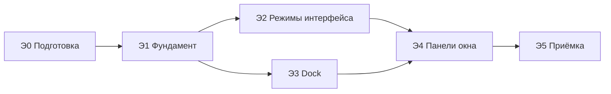

# Доска Кетос: Dock, режимы интерфейса и панели окна — план

> Источник: три задачи, согласованные с пользователем 2026-09-29 (Dock; полноэкранный режим и переключатель интерфейсов; левая и правая панели окна).
>
> База: ветка `stage-23-board-audit` @ `ac5d6c79` (выполнены Д0–Д2 плана `board-audit-plan.md`), worktree `/Volumes/Projects/Ketos bot.worktrees/stage-23`.
>
> Предлагаемое оформление: этап 24 цепочки, worktree `/Volumes/Projects/Ketos bot.worktrees/stage-24`, ветка `stage-24-board-redesign` от принятой `stage-23-board-audit`. Номер — решение пользователя.

## Содержание

1. [Как пользоваться документом](#1-как-пользоваться-документом)
2. [Требования](#2-требования)
3. [Факты из кода, на которые опирается план](#3-факты-из-кода-на-которые-опирается-план)
4. [Архитектурные решения](#4-архитектурные-решения)
5. [Судьба открытых задач этапа 23](#5-судьба-открытых-задач-этапа-23)
6. [Порядок этапов и зависимости](#6-порядок-этапов-и-зависимости)
7. [Этапы и подэтапы](#7-этапы-и-подэтапы)
8. [Команды проверки](#8-команды-проверки)
9. [Риски](#9-риски)
10. [Сводный чек-лист](#10-сводный-чек-лист)

---

## 1. Как пользоваться документом

- **Требование** имеет идентификатор `Т<задача>.<номер>` (раздел 2) и сформулировано так, как его согласовал пользователь. Каждая задача плана ссылается на требования, которые выполняет.
- **Этап** `Э<N>` — законченный блок работ; **подэтап** `Э<N>.<M>` состоит из четырёх частей: **Цель**, **Контекст**, **Задачи**, **Критерии верификации**.
- Пути даны от корня репозитория; `ui-board` означает `packages/client/ui-board`, аналогично для остальных клиентских пакетов.
- Учёт — в Beads: эпик этапа, по задаче на подэтап, дочерние задачи на требования `Т…`; зависимости повторяют раздел 6.
- Definition of Done подэтапа: задачи выполнены; каждый критерий подтверждён командой или наблюдаемым поведением; тесты затронутых пакетов зелёные; видимые изменения проверены в браузере на стенде из worktree этапа.
- **Стандартный интерфейс временный.** Целевое состояние — только доска. В стандартный интерфейс не добавляется ничего сверх того, что требуют Т2.* (переключатель, «Вернуть в окно», перенос черновика).

---

## 2. Требования

### Задача 1. Dock внизу доски

| # | Требование |
|---|---|
| Т1.1 | Левая плавающая панель доски (док) переносится вниз по центру доски и выглядит и работает как Dock macOS. |
| Т1.2 | Dock экранного размера: не масштабируется вместе с доской. |
| Т1.3 | Состав и порядок слева направо: значки открытых окон · разделитель · «+» · «Выбрать элемент» · «Сбросить вид» · разделитель · значки клонов. Всё, что есть в доке сейчас, сохраняется. |
| Т1.4 | Над значком при наведении — подпись, только название. |
| Т1.5 | Значки окон и значки клонов перетаскиваются для смены порядка внутри своей группы; порядок сохраняется в раскладке доски после перезагрузки. |
| Т1.6 | Dock растёт по ширине до предела (ширина доски минус 24px отступа с каждой стороны), дальше прокручивается по горизонтали. |
| Т1.7 | Значки: окно чата — 1–2 буквы названия в кружке, цвет по рабочей папке; служебные окна («Настройки», «Коннекторы», «Дашборд», «Задачи») — значок типа окна; клон — инициалы (аватар, когда появится). |
| Т1.8 | Зелёная точка статуса на значке остаётся; активное окно подсвечено фоном значка. |
| Т1.9 | Меню «+»: агент (пресеты — подменю), коннекторы, настройки, клон, дашборд, задачи, недавние чаты. Группу «Клоны» из старого меню не переносим. |
| Т1.10 | «Выбрать элемент» — отдельная кнопка Dock. |
| Т1.11 | Прикрепить файл, диктовка, веб-поиск из меню омнибара удаляются (они есть в композере окна). |
| Т1.12 | Омнибар «Спросите что угодно…» удаляется целиком, без замены. |
| Т1.13 | Мини-карта переносится в правый верхний угол доски. |
| Т1.14 | Dock виден всегда, в том числе при открытых панелях окна. |
| Т1.15 | Dock входит в безопасную область доски: новые окна и «Показать все окна» под него не заезжают. |

### Задача 2. Полноэкранный режим → стандартный интерфейс; переключатель интерфейсов

| # | Требование |
|---|---|
| Т2.1 | «Во весь экран» в окне чата открывает сессию окна в стандартном интерфейсе Кетос (главная панель, сайдбар «Рабочие папки», вкладки «Диалог / История выполнения»). |
| Т2.2 | Собственный полноэкранный режим доски (рамка поверх доски, рейка, колонка панели) удаляется целиком. |
| Т2.3 | Кнопка «Во весь экран» есть только у окон чата (не у клонов, задач, дашборда, настроек, коннекторов). |
| Т2.4 | Неотправленный черновик и вложения окна переносятся в композер стандартного интерфейса и обратно при возврате. |
| Т2.5 | Переключатель интерфейсов в стандартном режиме — в шапке сайдбара рядом с логотипом «Кетос». |
| Т2.6 | В режиме доски — плашка в левом верхнем углу доски (логотип + переключатель) на том же месте экрана; экранного размера; входит в безопасную область. |
| Т2.7 | Режим доски — доска на весь экран приложения; сайдбара «Рабочие папки» нет; его функции — в левой панели окна (Т3.*). |
| Т2.8 | Пункт «Доска» из сайдбара удаляется. |
| Т2.9 | При запуске приложения всегда стандартный режим. |
| Т2.10 | Переключатель ведёт на доску в том виде, в каком её оставили, без центрирования. |
| Т2.11 | «Вернуть в окно» — в шапке сессии справа рядом с «⋯»; видна, только если открытая сессия привязана к окну доски; ведёт на доску, центрирует это окно и коротко подсвечивает его. |
| Т2.12 | Escape на доску не возвращает — только кнопки. |
| Т2.13 | После разворачивания окна A: выбрана существующая сессия, не открытая в другом окне → окно A переключается на неё. |
| Т2.14 | Выбрана сессия, открытая в окне B → A остаётся со своей сессией; «Вернуть в окно» ведёт в B. |
| Т2.15 | «Новая сессия» окно A не трогает; «Вернуть в окно» пропадает, пока новая сессия не привязана к окну. |
| Т2.16 | Стандартный режим включён переключателем (а не разворачиванием окна) → клики по сессиям окна доски не трогают. |

### Задача 3. Левая и правая панели окна

| # | Требование |
|---|---|
| Т3.1 | Рейка из 5 значков у окна удаляется целиком (вместе с «Новым чатом» и «Артефактами»). |
| Т3.2 | Шапка окна чата: `[×] [◧ левая панель] название … [◨ правая панель] [⤢ во весь экран]`; иконки — как в стандартном интерфейсе. |
| Т3.3 | Левая панель — компактная копия блока «Рабочие папки»: заголовок, поиск, параметры вида, добавить папку, дерево групп и сессий с возрастом, «Новая сессия» внутри группы. |
| Т3.4 | Левая панель: ширина 260 по умолчанию, тянется до 360; строки плотнее, чем в сайдбаре; высота окна; масштабируется вместе с окном. |
| Т3.5 | Панели выезжают из-под своего края окна наружу; если места нет, доска плавно сдвигается; поверх окна не открываются. |
| Т3.6 | Клик по сессии в левой панели открывает её в этом окне; если она открыта в другом окне — то окно поднимается и подсвечивается; панель остаётся открытой. |
| Т3.7 | Правая панель — функции правой панели стандартного интерфейса: вкладки и «+»; новая вкладка → «Начало» → «Файлы рабочей области»; «Файлы» — дерево рабочей папки сессии, путь, «Перезагрузить»; изображения, PDF и документы открываются во вкладках. |
| Т3.8 | Из служебных кнопок правой панели — только «Свернуть» («Разделить» и «На весь экран» не переносятся). |
| Т3.9 | Правая панель: ширина 360 по умолчанию, тянется от 280 до 600. |
| Т3.10 | Ссылки на файлы в ленте окна открываются вкладкой в правой панели этого окна. |
| Т3.11 | Вкладки правой панели принадлежат сессии и меняются вместе с сессией окна. |
| Т3.12 | Обе панели можно открыть одновременно; открыта ли каждая и её ширина сохраняются для каждого окна. |
| Т3.13 | Анимация выезда одинаковая у обеих панелей; при `prefers-reduced-motion` — без анимации. |

---

## 3. Факты из кода, на которые опирается план

**Док и омнибар (`ui-board`)**
- Док — `src/client/dock/SessionRail.tsx`, слот `board.dock` (`src/client/index.ts:638, 737-742`); CSS `.rail`: `left:20px; top:50%; transform:translateY(-50%)`, вертикальный flex, `overflow-y:auto`.
- Строки дока идут в порядке `windowOrder` — это **порядок отрисовки окон**; `raiseWindow` (`store.ts:298-311`) переносит окно в конец, поэтому порядок в доке меняется при каждом фокусе. Отдельного порядка дока или клонов нет.
- Перетаскивания в доке нет; единственный образец перестановки указателем — `startRowDrag` в `window/WindowChatsPanel.tsx:284-316` (порог 5px, `elementFromPoint(...).closest('[data-row-key]')`, `dragClickGuard`), `moveAnchor` в `chat-list-model.ts:212-224`, жест — `pointer-gesture.ts`.
- Колесо над доком не прокручивает его: `NATIVE_WHEEL_TARGETS` в `wheel-zoom.ts:33` не содержит дока.
- `windowGlyph` (`SessionRail.tsx:75-79`) даёт две иконки на все виды окон; у `CloneDto` (`packages/ketos/clone-core/src/types.ts:70-83`) нет аватара и цвета; рабочая папка сессии находится через `useWorkspaceList` (как в `WindowChatsPanel.tsx:150-173`).
- Омнибар — `omnibox/DashboardToolbar.tsx`, слот `board.omnibar`; обработчики меню — `handleMenuSelect` (98-156); «Выбрать элемент» — `setSelectingElement(true)`; «Дашборд» сейчас показывает уведомление «недоступно».
- Мини-карта — `canvas/Minimap.tsx`, CSS `bottom:24px; right:24px`.

**Сохранение раскладки**
- Схема — `src/board-settings.ts` (`BOARD_SETTINGS_VERSION = 1`, все поля с `.default`); захват и восстановление — `board-layout.ts` (`captureBoardLayout`, `sanitizeBoardLayout`); запись — `board-persistence.ts`. Добавочное поле с умолчанием работает в версии 1; повышение версии сбрасывает все сохранённые раскладки.
- Новое сохраняемое поле затрагивает: тип `BoardLayout`, `BoardSettingsSchema`, `captureBoardLayout`, `sanitizeBoardLayout`, `BoardState` + `hydrate`, тесты `board-settings`, `board-layout`, `board-persistence`.

**Полноэкранный режим доски**
- Только окна `agent` и `clone` (`window/AgentCard.tsx:11-14`, `AGENT_FEATURES`). От `fullscreenWindowId` зависят: `BoardViews.tsx` (скрытие плавающих панелей, колесо, жесты), `DashboardCanvas.tsx`, `culling.ts:41`, `board-popover.tsx`, `HandleRing.tsx`, `ConversationBody.tsx` (класс `.centered`), `WindowChatsPanel.tsx` (`dockedPanelRect`), `wheel-zoom.ts`, `WindowFrame.tsx` (ветка стилей, Escape).

**Переход в стандартный интерфейс и возврат (уже есть для подтверждений)**
- `openInMainPanel` (`ui-board/src/client/index.ts:345-353`): `bridge.sessionFor(windowId)` → `ctx.uiWorkspace.openSession(sessionId)` (= `sessions.open` + `layout.selectPanel(null)`, `ui-workspace/src/client/navigation.ts:134-137`) → `expectReturnWindow(windowId)`.
- Возврат: эффект в `BoardViews.tsx:102-115` при `activePanelId === BOARD_PANEL_ID` и `returnWindowId` → `centerOnWindow` + подсветка `RETURN_HIGHLIGHT_MS`.
- `bridge.windowFor(sessionId)` (`session-bridge.ts:820-825`) находит окно сессии.
- **Побочный эффект:** `BoardSessionBridge.attach` вызывает `ctx.sessions.open(sessionId)` (`session-bridge.ts:998-999`) для каждого окна, в том числе при восстановлении раскладки на старте. Текущая сессия стандартного интерфейса «следует» за последним окном доски.

**Оболочка приложения (`ui-layout`, `ui-sidebar`, `ui-conversation`)**
- Колонки `AppFrame.tsx:225-226`: `${sidebar}px minmax(0,1fr) ${rightbar}px`; минимальное состояние сайдбара — рейка 56px (`columns.ts`); **полностью скрытого сайдбара нет**.
- Главная панель — keyed-слот `main`: одновременно смонтирована одна запись. **Доска размонтируется при каждом показе стандартного чата** — черновик окна (React-состояние `ComposerBar.tsx:241-243`) сейчас теряется.
- `activePanelId` не сохраняется (`ui-layout/src/client/stores.ts:78-92`) — после перезагрузки всегда стандартный интерфейс.
- Шапка сайдбара — `.logoRow` в `ui-sidebar/src/client/SidebarRoot.tsx:180-227` (слоты `sidebar.brand.mark`, `sidebar.brand.name`, кнопка сворачивания); строки панелей — слот `sidebar.panellist`; доска регистрирует пункт «Доска» в `ui-board/src/client/index.ts:758-763`.
- Шапка сессии — `ui-conversation/src/client/skeleton/ConversationSession.tsx:59-160`; слоты `conversation.session.header.actions` / `.utilities` (list) / `.corner` (single, занят кнопкой правой панели). **Шапка скрыта у пустой сессии** (`hideChrome`, 69-76).
- Черновик стандартного композера: публичный `ctx.conversation.input.for(ctx.sessions.scope(id)).setDraft(...)` (`ui-conversation/src/client/contract/input.ts:198-224`); вложения — через `ConversationController.createDrafts(sessionId, File[])` (`service.ts:308-325`); образец переноса черновика между сессиями — `selectWorkspace` (`apply.ts:259-279`). `ui-board` сейчас не инжектирует `conversation`.

**«Рабочие папки» и правая панель стандартного интерфейса**
- `WorkspaceBrowser` (`ui-workspace/src/client/rows/WorkspaceBrowser.tsx`) нельзя встроить в окно без переделки: его доля владельца — `sidebar.workspaces {wide, expandSidebar}`; дыра `sidebar.workspaces.directoryFlow` зашита; «текущая сессия» — глобальная и подавляется при активной панели доски; действия уходят в глобальную навигацию (`selectPanel(null)` покидает доску); хранилище вида одно на приложение (`dsh.workspace.view.v5`); тип слота, объявленного доской, создал бы цикл ссылок проектов TypeScript.
- Правая панель (`ui-sidebar-right`) — единственный экземпляр: одна привязка контроллера, одна колонка кадра, слоты вкладок объявляются один раз; рендерится только для текущей сессии и скрыта, пока активна доска. Сессионная область слотов всегда равна текущей сессии приложения.
- Переиспользуемое: сервис `ctx.documentPreviews` (`ui-sidebar-documentpreview/src/client/index.ts:87`, рендереры текста, markdown, html, кода, изображений, PDF); `remote.workspaceFiles.list/read` (сессия передаётся явно); адреса `dsh-resource://file/**` с идентификатором сессии; мост доски уже имеет привязанные к окну действия: `bindSession`, `startChat`, `createChat`, `renameChat`, `forkChat`, `archiveChat`, `reorderChat`, `create/rename/delete/reorderWorkspace`, `listDirectory`, `createDirectory`, `pickDirectory` (`ui-board/src/client/index.ts:309-368`).

---

## 4. Архитектурные решения

| # | Решение | Почему | Отклонённая альтернатива |
|---|---|---|---|
| А1 | **Левая панель окна строится в `ui-board`**: `WindowChatsPanel` переделывается из двухуровневой навигации «проекты → чаты» в дерево по образцу `WorkspaceBrowser` (визуальное совпадение по размерам, порядку элементов и поведению), на существующих действиях моста доски, привязанных к окну. | Все действия уже привязаны к окну; нет цикла зависимостей, нет глобальной навигации, нет общего хранилища вида с сайдбаром. Когда стандартный интерфейс уйдёт, панель окна станет единственным браузером рабочих папок. | Второй вход `WorkspaceBrowser` в слот доски: семь блокеров (раздел 3), цикл ссылок проектов, изменение апстрим-пакетов `ui-workspace`, `ui-sidebar`, двух пакетов выбора папки. |
| А2 | **Правая панель окна строится в `ui-board`**: своя полоса вкладок, вкладка «Файлы» на `remote.workspaceFiles`, вкладки просмотра на сервисе `ctx.documentPreviews`, вкладка «Начало» со списком типов вкладок; состояние вкладок — по сессии. | Переиспользуются просмотрщики и API файлов; не нужна переделка рендерера слотов (сессионная область для произвольной сессии) и одиночной правой панели. | Экземпляр `ui-sidebar-right` на каждое окно: требует новой возможности рендерера (явная сессионная область), снятия ограничения «одно объявление слота вкладок», многопривязочного контроллера — это отдельный архитектурный проект (см. А7). |
| А3 | **Режим интерфейса = активная панель.** Режим доски — это `activePanelId === 'board'`; `ui-layout` получает признак «панель без сайдбара», который доска выставляет при регистрации своей панели `main`; для такой панели колонка сайдбара имеет ширину 0 и не рендерится. | Не вводит второе состояние, которое может разойтись с активной панелью; стандартный режим на старте уже обеспечен (`activePanelId` не сохраняется). | Отдельный флаг режима в `ui-layout`: два источника правды. |
| А4 | **Черновик окна живёт в сторе доски** (по окну, в памяти), а не в React-состоянии `ComposerBar`. | Доска размонтируется при переходе в стандартный интерфейс; без этого перенос черновика туда и обратно (Т2.4) невозможен, а сейчас черновик теряется при любом переключении панели. | Сохранять черновик в localStorage: `File` не сериализуется. |
| А5 | **Мост доски не меняет текущую сессию приложения.** `attach` окна перестаёт вызывать `ctx.sessions.open`; текущую сессию меняют только явные переходы (разворачивание окна, «Вернуть в окно»). | Иначе Т2.9 («всегда стандартный режим» с последней сессией пользователя) и Т2.13–Т2.16 (правила привязки) не выполнимы: восстановление раскладки подменяет текущую сессию. | — |
| А6 | **Порядок дока отделён от порядка отрисовки.** Новые сохраняемые поля `dockOrder` (окна) и `cloneOrder` (клоны), добавочные с умолчанием, версия схемы остаётся 1. | Иначе значки прыгают при каждом фокусе окна, а перестановка Т1.5 бессмысленна. | Повышение версии схемы: сбросит сохранённые раскладки всех пользователей. |
| А7 | **Долг на будущее (не в этом плане):** сессионная область слотов для произвольной сессии в `ui-renderer` + многоэкземплярная правая панель. Заводится задачей в Beads как предпосылка перехода «только доска». | Позволит заменить собственные панели доски (А1, А2) общими компонентами. | — |

---

## 5. Судьба открытых задач этапа 23

| Задача этапа 23 | Решение |
|---|---|
| Д3.1 Безопасная область | **Входит в этот план** (Э1.4) с новыми отступами: Dock снизу, плашка режима слева сверху, мини-карта справа сверху. |
| Д3.2 Размещение, центрирование, «Показать все окна» | Остаётся в этапе 23; выполняется после Э1.4 (опирается на безопасную область). |
| Д3.3 Растягивание окон | Остаётся в этапе 23 без изменений. |
| Д3.4 Омнибар и мини-карта на узкой доске (П-30) | **Заменена** Э3 (омнибара нет, мини-карта наверху). Закрыть как superseded. |
| Д4.1 Рейка слева, без «Нового чата» | **Заменена** Э4.1 (рейка удаляется). Закрыть как superseded. |
| Д4.2 Сторона, ширина и стековый уровень панели | **Заменена** Э4.2–Э4.4. Закрыть как superseded. |
| Д4.3 Плавающие панели при открытой панели | **Заменена** Т1.14 и Э4.2 (автосдвиг доски). Закрыть как superseded. |
| Д5.1–Д5.4 Перенос `WorkspaceBrowser` | **Заменены** Э4.3 (решение А1). Закрыть как superseded. |
| Д6.1–Д6.4 Отображение и адаптивность | Остаются в этапе 23; порог упрощённого вида Д6.1 скрывает и панели окна. |
| Д7 Приёмка этапа 23 | По решению пользователя: либо принять этап 23 в объёме Д0–Д2 + Д3.2/Д3.3/Д6, либо перенести их в этап 24 после Э5. |
| П-37 Защита от пинча вне корня | Остаётся в этапе 23 (Д6.4). |
| e2e `board-geometry.e2e.ts`: П-16/17/18 (рейка), П-30 (омнибар) | Утверждения удаляются вместе с рейкой и омнибаром; вместо них — утверждения Э3.6 и Э4.6. |

---

## 6. Порядок этапов и зависимости

1. **Э1 первым:** стор черновиков (А4), мост без смены текущей сессии (А5), раздельный порядок (А6) и безопасная область нужны и режимам, и Dock, и панелям.
2. **Э2 и Э3 независимы** после Э1 и могут идти параллельно.
3. **Э4 после Э2 и Э3:** удаление полноэкранного режима доски (Э2.3) убирает «пристыкованную» панель, а автосдвиг панелей использует безопасную область с новыми отступами Dock и плашки (Э3).

---

## 7. Этапы и подэтапы

### Этап Э0. Подготовка

#### Э0.1. Окружение, учёт, базовая линия

**Цель.** Работа начинается с принятого состояния этапа 23 и учтена в Beads.

**Контекст.** В этапе 23 закоммичены Д0–Д2; открыты Д3–Д7. Этот план заменяет часть из них (раздел 5).

**Задачи.**
1. Получить у пользователя решение по приёмке этапа 23 и по разделу 5 (строка Д7).
2. Создать worktree этапа от принятой ветки; `pnpm install`, `pnpm run build`.
3. В Beads: эпик этапа, задачи подэтапов Э0.1 … Э5.3 с зависимостями раздела 6, дочерние задачи на требования Т1.*, Т2.*, Т3.*; задачи этапа 23 из раздела 5 закрыть как superseded со ссылкой на заменяющий подэтап; завести задачу А7 (долг).
4. Базовая линия: `pnpm exec vitest run packages/client/ui-board/tests packages/client/ui-layout/tests packages/client/ui-sidebar/tests packages/client/ui-conversation/tests`, `pnpm run typecheck && pnpm run lint`.

**Критерии верификации.** `bd show <эпик>` показывает все подэтапы и требования; superseded-задачи этапа 23 закрыты со ссылкой; базовая линия записана дословно.

#### Э0.2. Браузерные сценарии под новые требования

**Цель.** Каждое проверяемое автоматически требование сначала «краснеет» в сценарии.

**Контекст.** `apps/web/tests/board-geometry.e2e.ts` уже измеряет доску (хелперы `measureWindowParts`, `measureSafeArea`, `clickResetView`); П-16/17/18 и П-30 привязаны к рейке и омнибару, которые удаляются.

**Задачи.**
1. Удалить утверждения П-16, П-17, П-18, П-30 и хелперы, завязанные на рейку и омнибар.
2. Добавить ожидаемо падающие (`it.fails`) утверждения: Dock снизу по центру, горизонтальный, экранного размера при зуме 0.5/1/2 (Т1.1, Т1.2); порядок групп (Т1.3); мини-карта справа сверху (Т1.13); омнибара нет (Т1.12); Dock виден при открытой панели окна (Т1.14); у окна чата нет рейки, в шапке две кнопки панелей (Т3.1, Т3.2); панели выезжают снаружи окна слева и справа (Т3.5); «Во весь экран» уводит на стандартный интерфейс с той же сессией (Т2.1); на старте активен стандартный интерфейс с последней сессией пользователя, а не сессией окна доски (Т2.9, А5).

**Критерии верификации.** Сценарий проходит с ожидаемыми падениями; каждое утверждение ссылается на `Т…`.

---

### Этап Э1. Фундамент

#### Э1.1. Черновик окна в сторе доски (А4)

**Цель.** Черновик окна (текст, изображения, файлы) переживает размонтирование доски.

**Контекст.** `ComposerBar.tsx:241-243` держит `draft`, `images`, `files` в `useState`; `fileSources` (ref) хранит исходные `File`. Модели: `BoardDraftImage` (base64 + preview), `BoardDraftFile` (`status`, `receiptId`, `file`), `ComposerIntent` в `store.ts:29-38`.

**Задачи.**
1. Перенести черновик в стор доски: `drafts: Record<WindowId, BoardWindowDraft>` (в памяти, не сохраняется в раскладку), с действиями `setDraftText`, `addDraftImages`, `addDraftFiles`, `updateDraftFile`, `removeDraftItem`, `clearDraft`; `File` хранить в сторе вместе с записью файла (сейчас в `fileSources`).
2. `ComposerBar` читает и пишет черновик через стор; отправка и отмена очищают черновик как сейчас.
3. `closeWindow` удаляет черновик окна; смена сессии окна черновик сохраняет (как сейчас).
4. Тесты: черновик переживает размонтирование и повторный монтаж `BoardRoot`; удаляется при закрытии окна.

**Критерии верификации.** Тесты `ui-board` зелёные; в браузере: набрать текст в окне → пункт «Доска»/переключатель на стандартный и обратно → текст на месте.

#### Э1.2. Мост доски не меняет текущую сессию приложения (А5)

**Цель.** Текущая сессия стандартного интерфейса меняется только явными переходами пользователя.

**Контекст.** `BoardSessionBridge.attach` вызывает `ctx.sessions.open(sessionId)` (`session-bridge.ts:998-999`) для каждого окна, в том числе при `restore` → `reconcile` на старте.

**Задачи.**
1. Выяснить, что именно даёт окну вызов `sessions.open` (подписка на сессию, загрузка ленты, привязка `uiConversation.binding(id).target('chat')`), и заменить его вызовом, который не выбирает сессию текущей (`sessions.binding(id)` / `sessions.scope(id)`).
2. Проверить, что лента, стриминг, подтверждения, очередь, смена модели и пресета в окне работают без выбора сессии текущей (существующие тесты моста + ручная проверка двух окон с разными сессиями).
3. Тест: восстановление раскладки с двумя окнами не меняет `sessions.list.current`.

**Критерии верификации.** Тесты моста зелёные; утверждение Э0.2 «на старте последняя сессия пользователя» перестаёт падать.

#### Э1.3. Раздельный порядок дока и клонов (А6)

**Цель.** Порядок значков Dock стабилен и управляется только пользователем.

**Контекст.** Порядок строк дока сейчас = `windowOrder` (порядок отрисовки). Порядок сохраняемых полей — раздел 3.

**Задачи.**
1. Поля `dockOrder: WindowId[]` и `cloneOrder: CloneId[]` в `BoardState`, `BoardLayout`, `BoardSettingsSchema` (умолчание `[]`), `captureBoardLayout`, `sanitizeBoardLayout` (неизвестные идентификаторы отбрасываются, недостающие окна дописываются в конец по `ordinal`).
2. Действия `reorderDock(id, before)` и `reorderClones(id, before)`; `addWindow`/`closeWindow` поддерживают `dockOrder`.
3. Тесты: фокус окна не меняет `dockOrder`; перестановка сохраняется и восстанавливается; старая раскладка без полей восстанавливается с порядком по `ordinal`.

**Критерии верификации.** Тесты `board-settings`, `board-layout`, `board-persistence`, `store` зелёные.

#### Э1.4. Безопасная область (Д3.1 этапа 23 с новыми отступами)

**Цель.** Доска знает прямоугольник, свободный от Dock, плашки режима и мини-карты.

**Контекст.** Док, плашка и мини-карта — абсолютные элементы корня доски; `DashboardCanvas` публикует размер доски через `setViewport`.

**Задачи.**
1. Измерять Dock (низ), плашку режима (левый верх), мини-карту (правый верх) через `ResizeObserver` и публиковать отступы `chromeInsets {top, bottom, left, right}` в стор.
2. `safeArea(state)` в экранных и мировых координатах; юнит-тесты.
3. `placeWindow` и `centerOnWindow` считают от безопасной области (Т1.15); полная доработка «Показать все окна» — в Д3.2 этапа 23.

**Критерии верификации.** Юнит-тесты зелёные; новое окно не открывается под Dock.

---

### Этап Э2. Режимы интерфейса

#### Э2.1. Панель без сайдбара в `ui-layout` (А3)

**Цель.** При активной панели доски колонка сайдбара отсутствует (Т2.7).

**Контекст.** `AppFrame.tsx:225-252` всегда рендерит `.sidebarCol`; минимум — рейка 56px (`columns.ts`). Регистрация панели доски — `{ name:'main', key:'board' }` (`ui-board/src/client/index.ts:626-642`). `ui-layout` — апстрим-пакет.

**Задачи.**
1. Признак регистрации `main`-панели «без сайдбара» (например, в свойствах ключа слота `main`) и его чтение в `AppFrame`: для такой активной панели дорожка сайдбара 0px, слот `sidebar` и ручка ширины не рендерятся, граница `.sidebarCol` убрана.
2. Доска помечает свою панель этим признаком.
3. Перегенерировать каталоги (`pnpm run gen-cordis-inspect-catalog`) при изменении `SlotMap`/`ILayout`.
4. Тесты `ui-layout/tests/app-frame.client.spec.tsx`: панель без сайдбара и обычная панель; запись в `docs/ketos/upstream-sync.md`.

**Критерии верификации.** Тесты `ui-layout` зелёные; `verify-cordis-inspect-catalog` зелёный; в браузере доска занимает всю ширину окна приложения.

#### Э2.2. Переключатель интерфейсов и удаление пункта «Доска»

**Цель.** Одна кнопка переключает стандартный интерфейс и доску в одном и том же месте экрана (Т2.5, Т2.6, Т2.8, Т2.9, Т2.10).

**Контекст.** Шапка сайдбара — `.logoRow` (`ui-sidebar/src/client/SidebarRoot.tsx:180-227`), слоты `sidebar.brand.mark` и `sidebar.brand.name`; отдельного слота для действий рядом с логотипом нет. Пункт «Доска» — регистрация в `sidebar.panellist` (`ui-board/src/client/index.ts:758-763`).

**Задачи.**
1. `ui-sidebar`: объявить list-слот `sidebar.brand.actions` в `.logoRow` (между названием и кнопкой сворачивания); запись в `upstream-sync.md`.
2. `ui-board`: регистрирует в него кнопку «Доска» (иконка `BoardIcon`, подпись «Перейти на доску») → `ctx.layout.selectPanel(BOARD_PANEL_ID)` без центрирования.
3. `ui-board`: плашка в левом верхнем углу доски — логотип (`FishLogo` из `ui-primitives` или слот бренда) и кнопка «Стандартный интерфейс» → `ctx.layout.selectPanel(null)`; координаты плашки совпадают с положением логотипа в шапке сайдбара; экранного размера; её размер публикуется в `chromeInsets` (Э1.4).
4. Удалить регистрацию доски в `sidebar.panellist` и её ключи локали.
5. Проверить, что старт всегда в стандартном интерфейсе (уже так: `activePanelId` не сохраняется) — зафиксировать тестом.
6. Локали ru/en/zh для новых подписей.

**Критерии верификации.** Тесты `ui-sidebar`, `ui-board` зелёные; в браузере переключение туда и обратно без смещения кнопки; пункта «Доска» нет; после перезагрузки — стандартный интерфейс.

#### Э2.3. «Во весь экран» → стандартный интерфейс; удаление полноэкранного режима доски

**Цель.** Выполнить Т2.1–Т2.4.

**Контекст.** Образец — `openInMainPanel` (`ui-board/src/client/index.ts:345-353`). Полный список кода полноэкранного режима — раздел 3. Черновик стандартного композера — `ctx.conversation.input.for(...).setDraft`, вложения — `ConversationController.createDrafts`; образец переноса — `selectWorkspace` в `ui-conversation/src/client/apply.ts:259-279`.

**Задачи.**
1. Действие доски `expandToStandard(windowId)`: взять сессию окна; перенести черновик из стора доски (Э1.1) в стандартный композер сессии (текст — `setDraft`; изображения — `File` из base64; файлы — сохранённые `File`) через `createDrafts`; очистить черновик окна; `ctx.uiWorkspace.openSession(sessionId)`; запомнить `expandedWindowId`.
2. Кнопка «Во весь экран» в шапке окна вызывает это действие; `WindowFrameFeatures.fullscreen` оставить только окнам `agent` (у клонов убрать) (Т2.3).
3. Удалить `fullscreenWindowId`, `setWindowFullscreen`, `exitFullscreen` и все ветки, перечисленные в разделе 3 (`BoardViews`, `DashboardCanvas`, `culling`, `board-popover`, `HandleRing`, `ConversationBody .centered`, `WindowChatsPanel dockedPanelRect`, `wheel-zoom`, `WindowFrame`), неиспользуемые `dockedPanelRect`, `FULLSCREEN_CHAT_MAX_WIDTH`, ключи локали; обновить тесты, где проверялся полноэкранный режим.
4. `ui-board` добавляет `conversation` в `inject`; доступ к `createDrafts` — через публичный фасад (если его нет — добавить метод «добавить вложения из файлов» в `SessionInput` и записать в `upstream-sync.md`).

**Критерии верификации.** Утверждение Т2.1 в Э0.2 проходит; тест переноса черновика (текст + изображение + файл); `grep fullscreenWindowId` пуст; тесты `ui-board`, `ui-conversation` зелёные.

#### Э2.4. «Вернуть в окно» и правила привязки

**Цель.** Выполнить Т2.11–Т2.16.

**Контекст.** Слот `conversation.session.header.utilities` (list, session) — рядом с «⋯»; шапка скрыта у пустой сессии (`ConversationSession.tsx:69-76`). Возврат с подсветкой — `returnWindowId` + эффект `BoardViews.tsx:102-115`. `bridge.windowFor(sessionId)`, `bridge.bind`. Черновик читается из `SessionInput` (проверить наличие чтения; при отсутствии — добавить).

**Задачи.**
1. `ui-board` регистрирует в `…header.utilities` кнопку «Вернуть в окно»; видна, только если `bridge.windowFor(sessionId)` возвращает окно (Т2.11).
2. Нажатие: перенести черновик стандартного композера обратно в черновик окна; `expectReturnWindow(windowId)`; `ctx.layout.selectPanel(BOARD_PANEL_ID)`; `expandedWindowId = null`.
3. Кнопка видна и у пустой сессии: `ui-conversation` показывает шапку, если непустой хотя бы один из слотов `…utilities` (или отдельное правило для этого слота); запись в `upstream-sync.md`.
4. Правила привязки — подписка на `sessions.list.current`, активна только при `expandedWindowId !== null` (Т2.16):
   - новая текущая сессия открыта в окне B → окно A не меняется, кнопка ведёт в B (Т2.14);
   - сессия пустая (только что созданная «Новая сессия») → окно A не меняется, кнопка скрыта (Т2.15);
   - иначе → `bridge.bind(A, sessionId)` (Т2.13).
5. Escape ничего не возвращает (Т2.12).
6. Тесты на каждое правило.

**Критерии верификации.** Тесты правил зелёные; ручная проверка всех четырёх сценариев; подсветка окна после возврата.

---

### Этап Э3. Dock

#### Э3.1. Нижний горизонтальный Dock

**Цель.** Выполнить Т1.1–Т1.4, Т1.6, Т1.14.

**Контекст.** `SessionRail.tsx` + `.module.css`; все подсказки `side="right"`; обёртка `BoardPopoverProvider` без `windowId` (экранный масштаб 1) уже есть.

**Задачи.**
1. Раскладка: `bottom: 16px; left: 50%; transform: translateX(-50%)`, горизонтальный flex, группы «окна | + · Выбрать элемент · Сбросить вид | клоны» с разделителями.
2. Ширина до `100% − 48px`, дальше `overflow-x: auto`; колесо над Dock прокручивает его (добавить `[data-board-layer="dock"]` в `NATIVE_WHEEL_TARGETS`; вертикальная прокрутка колесом → горизонтальная).
3. Подсказки `side="top"`, только название (Т1.4); меню строки (переименовать, закрыть) и двойной клик сохраняются, поле переименования — над значком.
4. Убрать скрытие Dock при открытой панели окна (Т1.14).
5. Обновить `tests/dock.client.spec.tsx`, `tests/wheel-zoom.client.spec.ts` (Dock теперь прокручивается).

**Критерии верификации.** Утверждения Т1.1, Т1.2, Т1.14 в Э0.2 проходят; тесты зелёные.

#### Э3.2. Значки окон и клонов

**Цель.** Значки различимы (Т1.7, Т1.8).

**Контекст.** `windowGlyph`, `windowTitle`, `useWorkspaceList`, `CloneDto` без аватара.

**Задачи.**
1. Компонент значка: чат — 1–2 буквы `windowTitle` в кружке, цвет — детерминированно из `workspaceId` сессии по палитре токенов темы (без литеральных цветов), для сессии без папки — нейтральный; служебные окна — отдельная иконка на вид окна (настройки, коннекторы, дашборд, задачи); клон — инициалы `name`.
2. Точка статуса как сейчас; активное окно — фон значка.
3. Тесты: буквы, цвет одинаков для окон одной папки, иконки видов.

**Критерии верификации.** Тесты зелёные; визуальная проверка в светлой и тёмной теме.

#### Э3.3. Перетаскивание значков

**Цель.** Выполнить Т1.5.

**Контекст.** Образец жеста — `startRowDrag` (`WindowChatsPanel.tsx:284-316`), `useBoardPointerGesture`, `moveAnchor`; порядок — `dockOrder`/`cloneOrder` (Э1.3).

**Задачи.**
1. Горизонтальная перестановка указателем внутри группы (окна отдельно, клоны отдельно); порог 5px; индикатор места вставки; клик после перетаскивания подавляется.
2. Прокрутка Dock у краёв во время перетаскивания, если он прокручивается.
3. Тесты: перестановка внутри группы, запрет перехода между группами, сохранение порядка.

**Критерии верификации.** Тесты зелёные; ручная проверка перетаскивания и перезагрузки.

#### Э3.4. Меню «+» и кнопка «Выбрать элемент»

**Цель.** Выполнить Т1.9, Т1.10, Т1.11.

**Контекст.** Меню омнибара — `DashboardToolbar.tsx:98-201`; меню «+» дока — `ADD_MENU_KINDS` (правый клик).

**Задачи.**
1. Клик по «+» открывает меню: агент (подменю пресетов — `setDefaultPreset` + открытие окна), коннекторы, настройки, клон (`createClone`), дашборд (уведомление, как сейчас), задачи, разделитель, недавние чаты (`recentChats(..., 6)` → `openChat`).
2. Кнопка «Выбрать элемент» → `setSelectingElement(true)`; адресат — активное окно чата (`resolveChatWindow`).
3. Перенести тесты меню из `tests/omnibox.client.spec.tsx` в тесты Dock (открытие каждого вида окна, пресет, недавние чаты, выбор элемента); добавить недостающие тесты `open:agent`, `open:settings`, `open:dashboard`.

**Критерии верификации.** Тесты зелёные; все пункты меню работают в браузере.

#### Э3.5. Удаление омнибара, мини-карта наверх

**Цель.** Выполнить Т1.12, Т1.13.

**Задачи.**
1. Удалить `omnibox/DashboardToolbar.tsx`, его CSS, слот `board.omnibar` (объявление и регистрацию), неиспользуемые ключи `menu.*`/`toolbar.*` (zh, en, ru), `tests/omnibox.client.spec.tsx`; перегенерировать каталог слотов.
2. Мини-карта: `top: 16px; right: 16px`; её размер — в `chromeInsets`.

**Критерии верификации.** `verify-client-ui-i18n`, сверка переводов и каталог слотов зелёные; утверждения Т1.12, Т1.13 в Э0.2 проходят.

#### Э3.6. Проверка Dock

**Цель.** Dock проверен целиком.

**Задачи.**
1. Снять `it.fails` с утверждений Dock в Э0.2; добавить утверждения: Dock и мини-карта не пересекаются на ширине доски 600/820/1160/1640; прокрутка при 20 окнах.
2. Ручная проверка подсказок, перетаскивания, меню, прокрутки.

**Критерии верификации.** Сценарий зелёный по Т1.*.

---

### Этап Э4. Панели окна

#### Э4.1. Удаление рейки и новые кнопки шапки

**Цель.** Выполнить Т3.1, Т3.2.

**Контекст.** Рейка — `WindowChatsPanel.tsx:454-481`; `railRect`, `PANEL_RAIL_*` в `panel-geometry.ts`; входы в панель из ленты: `ConversationBody.tsx:435` (`lane-choose-chat`) и `:552` (полоса артефактов).

**Задачи.**
1. Удалить рейку, `railRect`, `PANEL_RAIL_WIDTH/HEIGHT`, ключи локали кнопок рейки.
2. Шапка окна чата: `[×] [◧] название … [◨] [⤢]`; иконки `IconPanelLeftOutline16` и правой панели стандартного интерфейса; подсказки; `data-board-action` `window-left-panel`/`window-right-panel`.
3. `lane-choose-chat` открывает левую панель; полоса артефактов открывает файл вкладкой в правой панели (Э4.4).

**Критерии верификации.** Утверждения Т3.1, Т3.2 в Э0.2 проходят; тесты `ui-board` зелёные.

#### Э4.2. Состояние и геометрия двух панелей

**Цель.** У каждого окна две независимые панели, выезжающие наружу (Т3.5, Т3.12, Т3.13).

**Контекст.** Сейчас одна панель на доску: `panelWindowId`, `panelCollapsed`, `panelWidth` (глобально); анимация — `transform: translateX(...)` + `visibility`, `--ds-transition-duration-slow` (`WindowChatsPanel.module.css:19-56`).

**Задачи.**
1. Поля окна в раскладке (добавочные, с умолчанием): `leftPanelOpen`, `leftPanelWidth` (260, 260–360), `rightPanelOpen`, `rightPanelWidth` (360, 280–600); старые глобальные поля остаются в схеме версии 1 как игнорируемые (решение записать в Agent Note).
2. Геометрия: левая — `x − width`, правая — `x + window.width`, высота окна, мировые координаты; панели в стековом уровне своего окна; ручки ширины на внешних краях.
3. Открытие панели, не помещающейся в безопасной области, плавно сдвигает доску без изменения масштаба (Т3.5).
4. Анимация: выезд из-под своего края окна, та же длительность и кривая для обеих; `prefers-reduced-motion` — без анимации.
5. Culling учитывает ширину открытых панелей.
6. Подсказки и меню панелей — под `BoardPopoverProvider` окна (масштаб = зум).

**Критерии верификации.** Юнит-тесты геометрии; утверждение Т3.5 в Э0.2 проходит; состояние панелей сохраняется после перезагрузки.

#### Э4.3. Левая панель — «Рабочие папки» (А1)

**Цель.** Выполнить Т3.3, Т3.4, Т3.6.

**Контекст.** Эталон вида — `ui-workspace/src/client/rows/WorkspaceBrowser.tsx`, `Rows.module.css` (строка сессии 32px, строка папки 34px, заголовок 36px, кнопки 28px, шрифты 14/12px). Данные и действия — `useWorkspaceList`, `useSessionList`, `chatGroups`/`filterGroups`/`moveAnchor` (`chat-list-model.ts`), действия моста (раздел 3), `FolderBrowser` и `pickDirectory` для добавления папки.

**Задачи.**
1. Переписать панель в дерево: заголовок «Рабочие папки» + поиск + параметры вида (группировка по папкам / плоский список; порядок вручную / по обновлению) + добавить папку; группы раскрываются; сессии с относительным возрастом; «Новая сессия» внутри группы (`startChat(windowId, workspaceId)`).
2. Меню строк и перестановка — как сейчас (переименовать, ветвить, архивировать, удалить папку; перетаскивание).
3. Компактная плотность: строки и отступы меньше сайдбара (ориентир: сессия 28px, папка 30px, заголовок 32px, шрифт 13px), значения — CSS-переменные панели.
4. Клик по сессии: `bindSession(windowId, id)`; если сессия в другом окне — поднять и подсветить его (существующее поведение моста); текущая сессия окна подсвечена; панель не закрывается.
5. Удалить уровни `projects/chats/browse`, вкладки «Чаты/Артефакты» и их ключи локали; `FolderBrowser` остаётся как экран выбора папки внутри панели.
6. Сравнение с сайдбаром в браузере: одинаковые элементы, порядок, поведение.

**Критерии верификации.** Тесты `window-chats-panel` переписаны и зелёные; сравнение с сайдбаром без расхождений в составе; клик открывает сессию в окне, а не в главной панели.

#### Э4.4. Правая панель — файлы и просмотр (А2)

**Цель.** Выполнить Т3.7–Т3.11.

**Контекст.** `ctx.documentPreviews` (рендереры текста, markdown, html, кода, изображений, PDF); `remote.workspaceFiles.list/read(sessionId, …)`; корень — `cwd` сессии; адреса `dsh-resource://file/**` (`fileAddressFor`); тексты стандартной панели — пространства `sidebarRight`, `sidebarFiles` (для доски нужны свои ключи).

**Задачи.**
1. Полоса вкладок с «+» и «Свернуть» (без «Разделить» и «На весь экран»); состояние вкладок в сторе доски по `sessionId` (в памяти) — вкладки следуют за сессией окна (Т3.11).
2. «+» открывает вкладку «Начало» с пунктом «Файлы рабочей области».
3. Вкладка «Файлы»: путь от корня, «Перезагрузить», дерево через `remote.workspaceFiles.list`; ошибки и пустые состояния — как в стандартной панели.
4. Открытие файла — вкладка просмотра: рендерер из `ctx.documentPreviews` по адресу, чтение через `remote.workspaceFiles.read`; вкладка с тем же адресом не дублируется, а активируется.
5. Ссылки на файлы в ленте окна (`ToolCard`, полоса артефактов, ссылки в тексте сообщений) открывают вкладку в правой панели этого окна и раскрывают панель (Т3.10).
6. `ui-board` добавляет в `inject` `documentPreviews` и `remote.workspaceFiles`; локали ru/en/zh.
7. Тесты: вкладки по сессии, дедупликация вкладок, открытие по ссылке из ленты, рендерер по типу файла.

**Критерии верификации.** Тесты зелёные; в браузере: список файлов, открытие изображения, PDF и markdown; две окна с разными сессиями показывают разные вкладки.

#### Э4.5. Удаление мёртвого кода панели

**Цель.** В `ui-board` нет кода старой панели.

**Задачи.**
1. Удалить `panelPresentation`, `windowedPanelRect`, `panelWidthFor` (если не используются), `panelWindowId` и связанные действия, `setPanelTab`, вкладку артефактов панели (модель `artifacts-model.ts` остаётся для полосы артефактов ленты и `loadTaskArtifacts`).
2. `pnpm run lint` без неиспользуемых экспортов; обновить README `ui-board`.

**Критерии верификации.** `lint`, `typecheck`, `doc-sync` зелёные.

#### Э4.6. Проверка панелей

**Задачи.**
1. Снять `it.fails` с утверждений Т3.* в Э0.2; добавить: обе панели открыты одновременно; поднятое окно перекрывает чужую панель; при зуме 0.5/1/2 панели масштабируются вместе с окном.
2. Ручная проверка анимации и reduced motion.

**Критерии верификации.** Сценарий зелёный по Т3.*.

---

### Этап Э5. Приёмка

#### Э5.1. Регрессия и гейты

**Задачи.** Все утверждения Э0.2 без `it.fails`; гейты раздела 8; ручной обход: переключатель ↔ доска, разворачивание окна с черновиком и возврат, правила Т2.13–Т2.16, Dock (меню, перетаскивание, прокрутка), обе панели.

**Критерии верификации.** Все команды раздела 8 зелёные; обход без отклонений записан в отчёт.

#### Э5.2. Документация и демонстрация

**Задачи.** Agent Note (А1–А7, поля раскладки, игнорируемые старые поля, изменения апстрим-пакетов); записи `docs/ketos/upstream-sync.md` (`ui-layout`, `ui-sidebar`, `ui-conversation`); README `ui-board`, `ui-layout`, `ui-sidebar`; GIF (`record-browser-gif`): Dock, переключатель, разворачивание и возврат, обе панели; отчёт этапа в `docs/ketos/reports/`.

**Критерии верификации.** `pnpm run doc-sync` зелёный; GIF и отчёт на месте.

#### Э5.3. Закрытие

**Задачи.** `bd close` задач требований и подэтапов с причинами; коммиты в ветке этапа; вопрос пользователю «Принимаете ли вы этап?»; после приёмки — закрыть эпик.

**Критерии верификации.** В эпике нет открытых задач (кроме А7 и осознанно отложенных); `git status` чист.

---

## 8. Команды проверки

| Изменение | Команда |
|---|---|
| Доска | `pnpm exec vitest run packages/client/ui-board/tests` |
| Оболочка и сайдбар | `pnpm exec vitest run packages/client/ui-layout/tests packages/client/ui-sidebar/tests` |
| Шапка сессии и черновик | `pnpm exec vitest run packages/client/ui-conversation/tests` |
| Локаль ru | `pnpm exec vitest run packages/ketos/client-locale-ru/tests` |
| Весь GUI-слой | `pnpm run test:gui` |
| Браузерный сценарий | `pnpm run build && pnpm exec vitest run --config vitest.web.config.ts apps/web/tests/board-geometry.e2e.ts` |
| Каталоги слотов и API | `pnpm run gen-cordis-inspect-catalog` + `pnpm run doc-sync` |
| Типы и линт | `pnpm run typecheck && pnpm run lint` |
| Сборка и зависимости | `pnpm run build && pnpm run hygiene` |

---

## 9. Риски

| Риск | Последствие | Мера |
|---|---|---|
| Замена `sessions.open` в `attach` (Э1.2) ломает ленту или стриминг окна | Окна не показывают сессии | Сначала выяснить, что даёт `open`; двухоконная ручная проверка; тесты моста |
| Перенос черновика с вложениями между композерами | Потеря вложений или двойная загрузка | Переносить только готовые `File`; тест на текст + изображение + файл; при неудаче — оставить черновик в окне и показать ошибку |
| Изменения апстрим-пакетов `ui-layout`, `ui-sidebar`, `ui-conversation` | Расхождение с апстримом | Минимальные точки расширения (признак панели, слот действий бренда, правило показа шапки); записи в `upstream-sync.md` |
| Собственные панели доски (А1, А2) расходятся со стандартными | Разный вид и поведение | Эталонное сравнение в Э4.3 и Э4.4; задача А7 на объединение |
| 20 окон × две панели | Производительность | Панели монтируются только открытыми; culling учитывает панели; замер FPS по бюджету MVP |
| Порядок значков при восстановлении старой раскладки | Скачок порядка | Добавочные поля с умолчанием; дополнение по `ordinal`; тест восстановления старого документа |

---

## 10. Сводный чек-лист

### Э0. Подготовка
- [ ] Э0.1 Решение по этапу 23; worktree; эпик и задачи; superseded-задачи закрыты; базовая линия.
- [ ] Э0.2 Сценарии рейки и омнибара удалены; новые утверждения Т1/Т2/Т3 падают ожидаемо.

### Э1. Фундамент
- [ ] Э1.1 Черновик окна в сторе доски.
- [ ] Э1.2 Мост не меняет текущую сессию приложения.
- [ ] Э1.3 `dockOrder` и `cloneOrder`.
- [ ] Э1.4 Безопасная область с отступами Dock, плашки и мини-карты.

### Э2. Режимы интерфейса
- [ ] Э2.1 Панель без сайдбара в `ui-layout`.
- [ ] Э2.2 Переключатель в шапке сайдбара и плашка на доске; пункта «Доска» нет.
- [ ] Э2.3 «Во весь экран» → стандартный интерфейс с черновиком; полноэкранный режим доски удалён.
- [ ] Э2.4 «Вернуть в окно» и правила Т2.13–Т2.16.

### Э3. Dock
- [ ] Э3.1 Нижний горизонтальный Dock, прокрутка, подсказки сверху.
- [ ] Э3.2 Значки окон и клонов.
- [ ] Э3.3 Перетаскивание внутри групп.
- [ ] Э3.4 Меню «+» и кнопка «Выбрать элемент».
- [ ] Э3.5 Омнибар удалён; мини-карта справа сверху.
- [ ] Э3.6 Проверка Dock.

### Э4. Панели окна
- [ ] Э4.1 Рейка удалена; кнопки панелей в шапке.
- [ ] Э4.2 Две независимые панели; геометрия; анимация; сохранение.
- [ ] Э4.3 Левая панель «Рабочие папки».
- [ ] Э4.4 Правая панель: файлы и просмотр; ссылки из ленты.
- [ ] Э4.5 Мёртвый код старой панели удалён.
- [ ] Э4.6 Проверка панелей.

### Э5. Приёмка
- [ ] Э5.1 Регрессия и гейты.
- [ ] Э5.2 Agent Note, upstream-sync, README, GIF, отчёт.
- [ ] Э5.3 Закрытие и приёмка.
