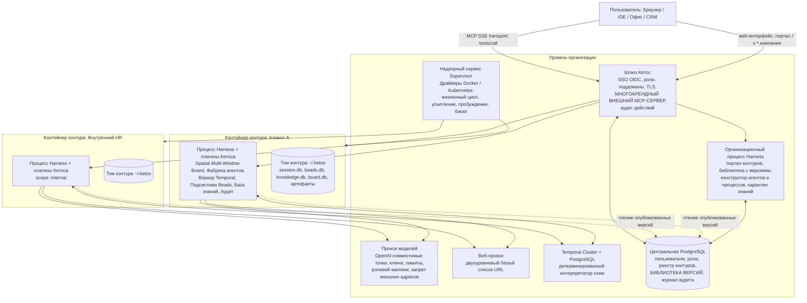
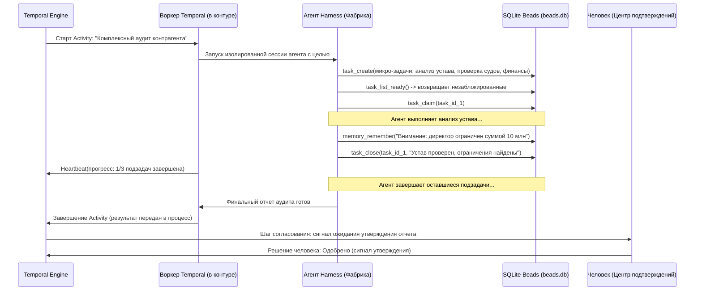

# Мастер-инструкция: создание новой версии платформы Кетос (v7)

**Статус:** единая утверждённая инструкция к исполнению. Заменяет и полностью поглощает `ketos_architectural_specification_v6.md` и `implementation_plan.md`.
**Дата:** 2026-09-12.
**Производственная база:** soft-fork DeepSeek Harness; проверенный коммит `d5675c2` (HEAD на 2026-09-12; доска добавлена коммитом `fe89719`, релизная линия `c291e79` — 0.1.5-rc.2, MIT).
**Метод верификации (ревизии 2–3, 2026-09-12; полный журнал — Приложение C).** Граф `graphify-out/graph.json` построен на коммите `c291e79` (64 916 узлов, 130 993 ребра, 4692 сообщества) и **не содержит узлов `ui-board`** — факты о `ui-board` (коммит `fe89719`) проверены прямым чтением исходников. Ревизия 2 провела повторный критический аудит всего документа 6 субагентами (локаль/токены, RPC/settings/SQLite, tools/primitives/ChatSnapshot, goal/автономность, сессии/слоты, сквозная сверка Части I и Части II) с точечными запросами `/graphify query` и сверкой по `@context7`; исправленные места помечены в тексте как «ревизия 2». Все расхождения исходного плана с реальным кодом сведены в §2.2.

---

## 0. Как исполнять этот документ

1. Порядок чтения и работы: §2 (проверить стартовое состояние) → §3 (архитектура) → §4 (спецификация доски) → §5 (фазы Ф0–Ф6) → §6 (приёмка).
2. Работа идёт по фазам. Фаза не считается начатой, пока предыдущая не дала зелёные критерии приёмки §6.2. Исключение: Ф0 выполняется всегда первой.
3. Метки достоверности в тексте:
   - ✅ — подтверждено кодом базы (субагенты/`graphify`); можно ссылаться на путь.
   - ⚠️ — исходное утверждение v6/плана было неточным; здесь приведена исправленная версия.
   - ❗ — риск или спайк; требуется решение до соответствующей фазы.
4. Любое изменение кода следует правилам репозитория из §2.3; каждая фаза завершается прогоном проверок §6.
5. Документ самодостаточен: исходные v6-спецификация и implementation_plan больше не нужны (реестр решений сохранён в Приложении A).
6. **Часть II** (в конце документа) — детальный план разработки MVP: подготовительный **этап 0** (ребрендинг DeepSeek Harness в Кетос) и 20 последовательных этапов с подэтапами, контекстами, задачами и критериями верификации. Именно она является рабочим документом при реализации; при расхождении формулировок Часть II уточняет Часть I, не отменяя её архитектурных решений.

---

## 1. Продукт: что создаётся

**Кетос** — корпоративная серверная платформа автономных ИИ-экспертов и оркестрации бизнес-процессов. Она создаёт цифровых двойников сотрудников, которые самостоятельно декомпозируют цели, ведут аналитику и доводят сложные цепочки действий до результата, а человек сохраняет контроль на стратегических вехах и финальном утверждении критических решений.

**Ключевой принцип:** «Рутину — автономным ИИ-экспертам, стратегию — человеку».

Пять несущих подсистем:

1. **Конструктор и фабрика агентов** — на визуальной доске проектируются автономные агенты (пресеты Harness) и сквозные процессы из шагов.
2. **Контур (периметр) как единица изоляции** — один процесс Harness в одном контейнере со своим файловым томом `~/.ketos` на каждого клиента/проект; этическая стена проходит по границе процесса, файловой системы и сети.
3. **Двухуровневая оркестрация** — макро-уровень Temporal (недели/месяцы, таймеры, развилки) и микро-уровень Beads (граф задач внутри агентной фазы: атомарный claim, auto-ready планирование, память, трехуровневая компакция).
4. **Пространственная мультиоконная доска** — визуальная среда управления контуром по эталону OpenSwarm: бесконечный GPU-холст с точечной сеткой 24px, 8-точечный оконный менеджер, SVG-миникарта, плавающий док сессий, Omnibox и пространственный инспектор.
5. **Централизованная библиотека организации** — версионируемый каталог агентов, процессов и очищенных знаний в PostgreSQL; в контуры доставляются зафиксированные копии.

Целевая среда: серверное enterprise-решение (Docker/Kubernetes); локальный однопользовательский режим — для dev/demo.

---

## 2. Стартовое состояние базы (проверено 2026-09-12)

### 2.1 Что уже реализовано

Коммит `fe89719` («feat(client): implement clean-slate spatial multi-window board OpenSwarm-style», родитель `c291e79`) уже добавил в базу клиентский пакет `packages/client/ui-board` (`@deepseek-ai/dsh-client-ui-board`). ✅ Это готовая на ~80% клиентская половина доски:

| Файл | Что делает | Состояние |
|---|---|---|
| `src/client/store.ts` | Стор на `@deepseek-ai/dsh-client-store` (Zustand 4.4.7 + Immer): pan/zoom 0.2–2.0, `zoomTowardPointer`, окна, z-order, snap 24px | работает |
| `src/client/canvas/DashboardCanvas.tsx` | Бесконечный холст: `translate3d + scale`, точечная сетка `radial-gradient` 24px, pan, wheel-zoom к курсору, слои окон и оверлеев | работает |
| `src/client/canvas/Minimap.tsx` | SVG 200×140, окна + фрустум камеры, drag-to-pan | работает |
| `src/client/window/AgentCard.tsx` | Тёмная карточка агента, 8-точечный ресайз, `setPointerCapture` | работает |
| `src/client/window/ToolWindow.tsx` | Светлое окно инструментов/настроек | работает |
| `src/client/dock/SessionRail.tsx` | Левый плавающий док сессий | работает |
| `src/client/omnibox/DashboardToolbar.tsx` | Нижний Omnibox | работает (но `onSendMessage` — заглушка `alert`) |
| `src/client/inspector/ElementSelectionContext.tsx` | Режим `Select an element` | заготовка |
| `src/client/contract/slots.ts` | Объявлены `board.canvas/dock/windows/window/minimap/omnibar` | объявлены, но никем не «владеются» |
| `tests/canvas.client.spec.tsx`, `tests/store.client.spec.ts` | 9 тестов холста, миникарты и математики зума | проходят |

**Чего не хватает** (полный перечень — в Ф1):

- пакет **не подключён ни к одному профилю**: нет трёх обязательных регистрационных поверхностей (агрегат `tsconfig.client.json`, строка в `packages/bundle/web-app/cordis.patch.yml`, зависимость в `packages/bundle/web-app/package.json`);
- нет `README.md` (гейты `verify-package-readme-*` упадут) и нет причины об отсутствии `./invariant`;
- хост-половина `src/index.ts` пуста — раскладка не сохраняется; персистентность в MVP делается settings-неймспейсом `ui-board` (Часть II, этап 8), отдельная `board.db` отложена;
- объявленные слоты `board.*` не объявлены в `children` ни одного регистрирующего вызова и не рендерятся через `renderSlot` — нарушение правила «children = declaration + authorization» (мёртвые объявления);
- `tokens.css` — глобальный лист с литеральными hex-цветами и русскими комментариями, что противоречит `docs/web-styling.md`; продуктовые строки в `src` (`'Board'`, `'Agent #'`, `'Ask me anything...'`, а также плейсхолдеры `Temporal Orchestration` и `External MCP: Twitter/X` в `ToolWindow`) нарушают правило locale: `verify-client-ui-i18n` сканирует `src`, а не `tests/`; литеральные hex-цвета в тестах — отдельное нарушение стилевого правила;
- нет теста регистрации пакета в слоты и real-composition теста, требуемых для product-visible плагинов;
- экспорт `createBoardStore` из `/client` допустим как фабрика стора (потребляется по типу), но остальные runtime-экспорты подлежат ревизии по правилу export discipline (§2.3).

### 2.2 Сверка исходного плана с кодовой базой

| # | Утверждение v6 / implementation_plan | Факт в коде | Как исполнять |
|---|---|---|---|
| 1 | Запуск: `pnpm dsh --profile web --agent-preset cordis` | Флага `--agent-preset` не существует (0 совпадений по репозиторию); пресет выбирается на сессию (UI-пикер, настройки, поле `agentPreset` в `SessionCreateRequest`); дефолт web-профиля — `standard` | ⚠️ Запускать `pnpm dsh web` (алиас `--profile web`); пресет `cordis` («创造模式» / Creator Mode) выбирать в UI новой сессии |
| 2 | Веб-интерфейс: `http://localhost:5173` | Неверно. `dsh web` слушает **3080** (конфиг `port: !!js ctx.webStartup.port ?? 3080`); голый Vite на 5173 отклоняется кодом и даёт белый экран (`docs/postmortem/0003`) | ⚠️ Dev-цикл: `pnpm run dev:web` (watch-сборка клиента) в одном терминале + `pnpm dsh web` в другом; адрес `http://127.0.0.1:3080` |
| 3 | Хранилище доски: `better-sqlite3` / локальный SQLite | В репозитории **только `node:sqlite`** (`DatabaseSync`); `better-sqlite3` отсутствует в исходниках и lockfile; есть готовый образец дисциплины — `packages/storage/storage-sqlite` | ⚠️ Использовать `node:sqlite`; копировать дисциплину открытия: каталог `0700`, файл `0600`, `PRAGMA user_version`, отказ при чужой версии |
| 4 | База знаний: SQLite-vec + FTS5 | FTS5 есть и в проде (`session-query-sqlite`); **`sqlite-vec`/`vec0` отсутствуют** полностью | ❗ Ф2: спайк загрузки расширения в `node:sqlite` (`enableLoadExtension`) либо замена на cosine-поиск по таблице эмбеддингов; решить до начала Ф2 |
| 5 | Temporal (сервер и SDK, MIT) | Ни `temporal`, ни SDK нигде нет; есть только паттерны долгоживущих воркеров (`workflow-worker-thread`, inspector bridge) | ❗ Ф3: добавить Temporal как внешний сервис; воркер — Cordis-плагин по образцам владения |
| 6 | Отказ от `@xyflow/react` | `xyflow`/`reactflow` нигде не используются | ✅ Ничего делать не нужно |
| 7 | Graceful shutdown через `ctx.on('dispose')` | Публичного события `'dispose'` нет; есть `ctx.effect(fn, label)` → disposer и `fiber.dispose()` | ⚠️ Владение ресурсами — только через `ctx.effect`; async-disposer доводить до квиесценции (`kill → await done`) |
| 8 | Пакеты `packages/board/board-core`, `@deepseek-ai/dsh-board-core` | Не существуют; хост-половина `ui-board` пуста | ⚠️ Отдельный board-хост в MVP не нужен: раскладка хранится в settings-неймспейсе `ui-board` (Часть II, этап 8). Пакет `@ketos/board` с `board.db` — опция после MVP, если раскладка перерастёт settings-документ |
| 9 | Виды слотов: `single/list/keyed` | Их четыре: `single \| list \| keyed \| chain` | ⚠️ Учитывать `chain`; для доски достаточно `single`/`keyed` |
| 10 | Тесты: `tests/store.spec.ts` | Конвенция: `tests/**/*.spec.{ts,tsx}`; клиентские — `*.client.spec.ts(x)`; прагма `// @vitest-environment jsdom` ставится per-file только DOM-спекам (большинство клиентских спек — node-env data-layer, прагмы не имеют); per-package vitest-конфигов нет | ⚠️ Именовать `*.client.spec.ts(x)`, запускать из корня; jsdom-прагму добавлять только компонентным/DOM-спекам |
| 11 | Проверка: `pnpm --filter @…/dsh-client-ui-board run test` | Скрипта `test` в пакетах нет (только `bundle`/`watch`) | ⚠️ Из корня, с явными файлами: `pnpm exec vitest run packages/client/ui-board/tests/store.client.spec.ts packages/client/ui-board/tests/canvas.client.spec.tsx` |
| 12 | `sidebar.panellist` и `ctx.layout.selectPanel('board')` | Подтверждено: `sidebar.panellist` — list-слот в `ui-sidebar`; `ILayout.selectPanel(MainPanelId \| null)` в `ui-layout`; `main` — keyed-слот | ✅ Использовать как есть |
| 13 | Стор на `@deepseek-ai/dsh-client-store` = Zustand + Immer | Подтверждено: zustand ~4.4.7, immer ^10.1.1; фабрика — `defineStore({ init, actions, persist? })` | ✅ |
| 14 | React 18, Vite 6 | React 18.3.1; Vite 6 — только сборка статики `apps/web`; клиентские пакеты собирает tsdown/rolldown (`packages/client/tsdown.client.ts`) | ⚠️ Vite — не dev-сервер доски |
| 15 | «Хостить воркер Temporal на `ctx.on('dispose')`» | См. #7 | ⚠️ `ctx.effect` |

### 2.3 Обязательные правила базы (соблюдать в каждой фазе)

- **Три регистрационные поверхности** для клиентского пакета: агрегат `tsconfig.client.json`; строка `dsh.client` в `packages/bundle/web-app/cordis.patch.yml`; зависимость в `packages/bundle/web-app/package.json`. Пропуск любой падает на своём, более позднем гейте. ✅
- **Композиция только через слоты**: `ctx.slots.register({ name, children?, store?, inject?, locale? }, Component)`; `children` — одновременно объявление и разрешение на рендер; чужие слоты — через `ctx.slots.inject(name, () => register(...))`. ✅
- **Export discipline `/client`**: наружу — только `apply`/`inject`/`Config`, фабрики сторов (для type-only вывода) и общие типы; компоненты и хелперы — внутренние. ✅
- **Стили**: семантические токены `--dsw-*` (`--dsw-alias-*`, `--dsw-specific-*`, `--dsw-elevation-*`) + CSS Modules + `clsx`; глобальные листы и токены — в `ui-theme/src/styles/`; литеральные цвета и сторонние UI-библиотеки запрещены (`docs/web-styling.md`, `ui-theme/README.md`). ✅
- **Локализация**: все продуктовые строки — в типизированных словарях; гейт `verify-client-ui-i18n`. ✅
- **Тесты**: `tests/` на уровне пакета; per-file 100% покрытие `src` (`pnpm run test:coverage`); для product-visible плагинов — real-composition тест через Loader; GUI-снимки и обязательный GIF для PR с видимым GUI. ✅
- **Пакеты**: `@deepseek-ai/dsh-*` (новое Кетос-специфичное — `@ketos/*`); `@deepseek-ai/cordis` — peer + dev; README с Summary/Model Experience/Known Limitations; JSDoc на все экспорты; тесты только в `tests/`. ✅
- **Жизненный цикл**: всё, что владеет ресурсом, живёт в `ctx.effect`; disposer асинхронный и идемпотентный; никакого «dispose-события». ✅
- **Non-trivial change — Agent Note** в том же PR; модель-видимые изменения — новый snapshot. ✅

---

## 3. Целевая архитектура v7

### 3.1 Уровень организации

| Компонент | Ответственность |
|---|---|
| **Шлюз Кетос** | SSO OIDC, роли, поддомены `c-<id>.ketos.company`, TLS, многоарендный внешний MCP-сервер, подпись личности (JWT/Ed25519), аудит действий |
| **Портал организации** (процесс Harness) | Каталог контуров, библиотека версий, конструктор агентов и процессов, карантин знаний |
| **Надзорный сервис (Supervisor)** | Жизненный цикл контуров: драйверы Docker API / Kubernetes; старт, усыпление, пробуждение, бэкап |
| **Прокси моделей** | OpenAI-совместимые точки (vLLM, Ollama, облака), ключи провайдеров, лимиты, ролевой маппинг (`reasoning`, `fast`, `embedding`), блокировка прямых адресов |
| **Веб-прокси** | Двухуровневый белый список URL (база ИБ + проектные домены куратора контура) |
| **Temporal Cluster + PostgreSQL** | Персистентный журнал сквозных процессов; универсальный детерминированный интерпретатор схем |
| **Центральная PostgreSQL** | Пользователи, роли, реестр контуров, библиотека версий, append-only журнал аудита |

### 3.2 Контуры



Примечание к тому: в текущем Harness домашняя папка задаётся `$DSH_HOME` (по умолчанию `~/.dsh`); Кетос фиксирует `~/.ketos` через `DSH_HOME`/brand-конфиг (§5, Ф0). Имя `session.db` из v6 условно: сессии в базе — JSONL (`~/.ketos/sessions/`), а SQLite-файлами остаются `board.db`, `beads.db`, `knowledge.db`. ⚠️

### 3.3 Двухуровневая оркестрация: Temporal + Beads

| Характеристика | Макро: Temporal | Микро: Beads |
|---|---|---|
| Область | Сквозной бизнес-процесс компании | Автономная декомпозиция этапа ИИ-экспертом |
| Масштаб времени | Часы, дни, недели, месяцы | Минуты, часы |
| Единицы | Этапы, ветвления, таймеры, контрольные точки | Подзадачи, блокеры, зависимости, инсайты |
| Устойчивость | Журнал событий Temporal в PostgreSQL | Транзакционный `beads.db` (node:sqlite) |
| Координация | Очередь контура `perimeter-<id>-tasks` | Атомарный `task_claim` между субагентами |



### 3.4 Подсистема Beads (`~/.ketos/beads.db`)

**Схема:**

- `tasks`: `id` (хэш), `title`, `description`, `status` (`open | in_progress | closed`), `priority`, `assignee`, `result_summary`, `compacted`.
- `dependencies`: `task_id`, `depends_on_task_id`, `type` (`blocks | parent_child | relates_to`).
- `memories`: `id`, `content`, `tags`, `source_task_id`, `author_agent`, `status` (`active | archived | candidate_for_library`).

**Инструменты агента:** `task_create(...)`, `task_list_ready()`, `task_claim(id)` (атомарная смена статуса в транзакции `BEGIN IMMEDIATE`), `task_close(id, summary)`, `memory_remember(content, tags?, methodology_candidate?)`, `memory_show_graph(root_id?, depth?)`. В системный промпт на каждом ходе инъектируется оперативная сводка (текущая задача, `ready`-задачи, свежие инсайты).

**Трехуровневая компакция:**

1. Оперативная инъекция сводки в промпт.
2. Семантическая компакция при закрытии эпика: фоновый вызов `fast_model` через прокси моделей; детальные шаги помечаются `compacted: true` и исключаются из промпта.
3. Инсайты `methodology_candidate` уходят в пайплайн очистки библиотеки (§3.6).

### 3.5 База знаний контура

- **Файл:** `~/.ketos/knowledge.db`, движок `node:sqlite`.
- **Поиск:** FTS5 (BM25) — ✅ доступен и проверен в базе; семантический поиск — ❗ зависит от спайка `sqlite-vec` (§2.2 #4). Fallback: таблица эмбеддингов + cosine в процессе на v1.
- **Федерация:** инструмент `knowledge_search` опрашивает локальный `scope: perimeter` и read-only кэш нормативных документов организации `scope: organization`, не смешивая контексты.

### 3.6 Безопасность и карантин знаний

Четырёхуровневая эшелонированная защита:

1. **Физическая изоляция:** отдельный процесс, контейнер, том и сеть на контур.
2. **Сетевой карантин:** запрет прямого egress; только прокси моделей, Temporal и веб-прокси по белым спискам.
3. **Изоляция сессий шлюзом:** cookie Harness принадлежит шлюзу; пользователи приходят через OIDC; шлюз подписывает личность JWT/Ed25519.
4. **Append-only аудит:** `UPDATE`/`DELETE` запрещены грантами СУБД.

Пайплайн возврата знаний: фиксация инсайта → локальный NER/PII-маскинг → карантинная очередь портала → утверждение офицером комплаенса → центральная библиотека PostgreSQL.

### 3.7 Пространственная доска

Доска — клиентский UI-плагин `@deepseek-ai/dsh-client-ui-board`; раскладка в MVP персистится через settings-неймспейс `ui-board` (хост-половина того же пакета). Полная спецификация, проверенные API и обязательные исправления — §4.

---

## 4. Пространственная мультиоконная доска: спецификация

### 4.1 Пакеты и именование

**Решение (рекомендованное):**

- Клиентская половина остаётся `@deepseek-ai/dsh-client-ui-board` в `packages/client/ui-board` — она уже реализована и следует upstream-имени; это минимизирует конфликты при синхронизации soft-fork (решения 5, 6, 30). Переименование в `@ketos/client-ui-board` — опциональная косметика Ф0, требует правки трёх регистрационных поверхностей.
- **Персистентность раскладки в MVP — settings-неймспейс `ui-board`** (см. §4.9): хост-половина `ui-board` регистрирует схему через `ctx.inject(['settings'], ...)`, клиент пишет через `ctx.remote.settings.mutate/update` с revision-CAS. Новый пакет и Typert-кодоген не нужны.
- Новые Кетос-специфичные пакеты — `@ketos/*` **в группе `packages/ketos/`** (единое соглашение для всего форка; группа создаётся с README). Первый такой пакет — `@ketos/clone-core` (Часть II, этап 15).
- Отдельный хост-пакет `@ketos/board` с `board.db` — **post-MVP** запасной вариант, если объём раскладки перерастёт settings-документ; в MVP он не создаётся.

### 4.2 Интеграция в слоты (исправленная версия)

Канонический набор слотов v7 (существующие `board.*` плюс `board.window.body`; `board.token-pill` зарезервирован до v7.1):

| Слот | Kind | Scope | Владелец и смысл |
|---|---|---|---|
| `board.canvas` | single | root | Поверхность холста; рендерит `BoardRoot` через `renderSlot` |
| `board.windows` | single | root | Слой окон; occupant рендерит окна по `windowOrder` |
| `board.dock` | single | root | Левый док сессий |
| `board.omnibar` | single | root | Нижний Omnibox |
| `board.minimap` | single | root | SVG-миникарта |
| `board.window` | keyed | root | Карточка окна; ключ — тип окна (`WindowKind`), экземпляр — в owner props `BoardWindowOwnerProps` |
| `board.window.body` | keyed | root | Тело окна; ключ — `bodyKind` (`conversation \| connectors \| settings \| dashboard \| clone \| clone-memory \| tasks`) |
| `board.token-pill` | single | root | (v7.1, опционально) `ContextRing`; `owner: { sessionId, windowId }` |

**Правило:** каждое объявление в `SlotMap` обязано иметь `renderSlot`-место; объявленный и не рендерящийся слот — мёртвое объявление, подлежащее удалению. Текущие `board.*` из `fe89719` этому не удовлетворяют — Ф1 приводит их в порядок.

Скелет регистрации (исправляет текущий `src/client/index.ts`):

```ts
// packages/client/ui-board/src/client/index.ts
import type { Context as ClientContext } from '@deepseek-ai/cordis'
import type {} from '@deepseek-ai/dsh-client-ui-renderer/client' // ctx.slots
import type {} from '@deepseek-ai/dsh-client-ui-layout/client'   // main
import type {} from '@deepseek-ai/dsh-client-ui-sidebar/client'  // sidebar.panellist
import { createBoardStore } from './store.ts'
import { BoardRoot, BoardIcon } from './BoardViews.tsx'

const NS = 'ui-board'

// inject растёт по мере подключения ядра (этапы 8–11):
// этап 2: slots/layout/locale; этап 8: + 'remote', 'remote.settings';
// этап 9: + 'sessions'; этап 10: + 'uiConversation';
// этап 11: + 'remote.agentPresets', 'remote.session'.
export const inject = ['slots', 'layout', 'locale']

export function apply(ctx: ClientContext): void {
  const store = createBoardStore({ persist: 'ketos.board.v1' })
  // Базовые локали Harness — zh/en; ru добавляется через ctx.locale.addLanguage,
  // точная форма словарей зависит от расширения LOCALE_IDS в форке (Часть II, этапы 1.3 и 4.3).
  ctx.effect(() => ctx.locale.register(NS, 'en', en), 'ui-board: dictionaries(en)')
  ctx.effect(() => ctx.locale.register(NS, 'ru', ru), 'ui-board: dictionaries(ru)')
  const t = ctx.locale.bind(NS) // читает активную локаль при каждом вызове

  ctx.slots.inject('main', () => ctx.slots.register({
    name: 'main',
    key: 'board',
    store,
    locale: NS, // включает синтезированный seat `t` у BoardRoot
    children: {
      'board.canvas': { kind: 'single', scope: 'root' },
      'board.windows': { kind: 'single', scope: 'root' },
      'board.dock': { kind: 'single', scope: 'root' },
      'board.omnibar': { kind: 'single', scope: 'root' },
      'board.minimap': { kind: 'single', scope: 'root' },
    },
  }, BoardRoot))

  ctx.slots.inject('sidebar.panellist', () => ctx.slots.register({
    name: 'sidebar.panellist',
    id: 'board',
    order: 15,
    label: () => t('panel.board'), // thunk: resolveSlotLabel + ctx.locale.subscribe обновят подпись
  }, BoardIcon))
}
```

`BoardRoot` получает `renderSlot` и рендерит дочерние слои; occupant'ы собственных слотов регистрируются тем же плагином через `ctx.slots.inject('board.windows', ...)` (инъекция дожидается фактического объявления, порядок не важен).

### 4.3 Слой данных

- Стор — `defineStore` из `@deepseek-ai/dsh-client-store`; `persist` (localStorage) — только кэш первого кадра; серверная персистентность раскладки — settings-неймспейс `ui-board` с revision-CAS (§4.9).
- Состояние окна (`BoardWindowState`): `id: Branded<'BoardWindowId'>`, `kind`, `title`, `x/y/width/height`, `zIndex`, `sessionId?`, `status?`, `statusText?`, `contextUsed?`.
- Действия: `setPan`, `setZoom`, `zoomTowardPointer`, `addWindow`, `moveWindow(id, x, y, snap)`, `resizeWindow(id, w, h, snap)`, `focusWindow`, `closeWindow`, `setSelectingElement`.
- Бизнес-данные (сессии, frames, соединения) живут в object-layer (`session-controller`/`connection`), а не в сторе доски.

### 4.4 Координатный движок

- Сетка: без DOM. Оператора `%` в CSS `calc()` не существует (допустимы только `+ - * /`), поэтому фаза сетки вычисляется в JS и передаётся в стиль — как в текущей реализации `DashboardCanvas.tsx:151-154`:

  ```ts
  backgroundImage: `radial-gradient(circle, <grid-dot-token> ${Math.max(1, 1.5 * zoom)}px, transparent ${Math.max(1, 1.5 * zoom)}px)`,
  backgroundSize: `${24 * zoom}px ${24 * zoom}px`,
  backgroundPosition: `${panX % (24 * zoom)}px ${panY % (24 * zoom)}px`,
  ```

  (Кастомные `--board-*` из старого `tokens.css` замещаются на семантические токены темы на этапе 4 Части II.)

- Поверхность: `transform: translate3d(panX, panY, 0) scale(zoom)` + `will-change: transform`, `transform-origin: 0 0`.
- Зум к курсору: `T_new = P_s − (P_s − T_old) · (S_new / S_old)` — реализовано в `zoomTowardPointer`.
- Диапазон зума: 0.2–2.0. Snap: `Math.round(v / 24) * 24`; `Shift` отключает привязку.

### 4.5 Оконный менеджер

- 8-направленный ресайз: невидимые зоны ~6px по граням, ~14px по углам, `setPointerCapture` (защита от срыва при быстрых движениях).
- Тёмная карточка агента: хедер (`•••`, статус-капсула, бейджи памяти), тело диалога (Markdown), нижний инпут (`#201F24` → семантический токен), спиннер, кнопка Action Menu `+`; `ContextRing` под карточкой в мировых координатах.
- Светлые окна: в текущем коде — `Connectors` (Core Tools, Web Search, Browser Inspector, Temporal Orchestration, External MCP: Twitter/X — плейсхолдеры, подлежащие удалению в MVP) и `Settings` (System Prompt, Model Selection); рабочая директория, глубина рассуждений и лимит шагов — целевые поля Части II (этапы 11, 13).

### 4.6 Миникарта

SVG 200×140 в правом нижнем углу: `<rect>` окон. В текущем коде ровно две заливки — агент терракота `#B8532F`, всё остальное синий `#3266AD`; типа `workflow` в `WindowKind` нет. Фрустум камеры — акцентным цветом. Клик центрирует холст, драг рамки панорамирует. В MVP цвета переводятся на семантические токены (этап 4); расширенная семантика (пайплайны, задачи) добавляется только вместе с такими типами окон.

### 4.7 Omnibox и пространственный инспектор

- Omnibox: инпут «Ask me anything…» и кнопка отправки; целевые быстрые действия (новый агент, процесс, заметка) и диктовка — Часть II, этап 7.
- Action Menu `+` в текущем коде: Attach file, Dictate, Web search, Select an element, Tools & Connectors (пункта Skills нет).
- Инспектор: текущая реализация — оверлей подсветки с включением и отменой (`Escape`); захват `outerHTML`/семантики/скриншота в чип — цель Части II, этап 7, а не текущее состояние.

### 4.8 Стили и локализация (обязательное исправление текущего пакета)

- Убрать глобальный `tokens.css`; бренд-палитра Кетос объявляется один раз как бренд-слой в `ui-theme/src/styles/` (семантические алиасы поверх реальных токенов: `--dsw-alias-bg-base`, `--dsw-alias-bg-layer-1/2`, `--dsw-specific-input-major`, `--dsw-alias-brand-primary`, `--dsw-alias-state-success-primary`, `--dsw-elevation-panel`); отдельный пакет `@ketos/brand` — опция после MVP.
- Все продуктовые строки (`'Board'`, `'Agent #'`, `'Ask me anything...'`, статусы) — в типизированные словари `ru`/`en`; `verify-client-ui-i18n` должен проходить.
- Тесты не должны проверять литеральные hex-значения — проверяется поведение (наличие окон/фрустума/слоёв), а цвета живут в токенах.
- Комментарии — английские.

### 4.9 Персистентность раскладки: settings-неймспейс `ui-board`

**Выбор MVP.** Раскладка доски (окна, геометрия, pan/zoom, активное окно) хранится в settings-неймспейсе `ui-board` — без нового wire-домена и Typert-кодогена. Хост-половина `ui-board` регистрирует схему в `apply` (образец — `ui-theme/src/index.ts:36-39`):

```ts
ctx.inject(['settings'], (settingsCtx) => {
  settingsCtx.settings.register('ui-board', BoardSettingsSchema)
})
```

Схема — `@deepseek-ai/schemastery` (`z.object`); поля: `version`, `panX`, `panY`, `zoom`, `windows[]`, `windowOrder`, `activeWindowId`. Для клиентского пакета `@deepseek-ai/dsh-settings` — type-only в `devDependencies`, а `@deepseek-ai/schemastery` — в `dependencies` (правило `verify-package-dependencies`).

**Клиентская запись с CAS.** `ctx.remote.settings.describe() → RemoteResult<SettingsDescribeValue>` (неймспейс-вью с `revision`); запись — `ctx.remote.settings.update('ui-board', patch, revision)` или `mutate(ns, ops, revision)`; `expectedRevision` — обязательный позиционный аргумент `number | undefined`. Конфликт возвращается как `RemoteResult` с `code: 'settings/conflict'` и `{ ns, expected, actual }`; прочие отказы — `settings/rejected`. Запись выполняется по завершении жеста с debounce ≥ 500 мс, не на каждый кадр движения.

**Ограничения и эскалация.** Settings — пользовательский документ `settings.yaml` с блокировкой и атомарной заменой; это нормально для сотен окон, но не для тысяч записей в секунду. Если объём или частота раскладки перерастут документ, запасной вариант (post-MVP): пакет `@ketos/board` с `board.db` на `node:sqlite` (`PRAGMA user_version = 1`, каталог `0700`, файл `0600`, WAL, CAS `UPDATE ... WHERE revision = ?` → 0 строк = конфликт) и точный Fetch-маршрут, как в Части II. В MVP этот пакет не создаётся.

**Владение.** Регистрация неймспейса и подписки — внутри `ctx.inject`/`ctx.effect`; ресурсы освобождаются диспозером фибера.

### 4.10 Обязательные тесты доски

- Юниты: математика `zoomTowardPointer`, snap, z-order; для settings-раскладки — CAS-конфликт (ревизия) и валидация схемы (битый документ не роняет доску); дисциплина `user_version`/CAS SQLite — только если появится post-MVP `board.db`.
- Компонентные (`*.client.spec.tsx`, jsdom): холст, миникарта, окна, инспектор.
- Регистрация: `apply` ставит occupant'ы в `main`/`sidebar.panellist` и в собственные `board.*`; после dispose fiber — снимает.
- Real-composition: boot test-only `cordis.yml` через Loader (требование product-visible плагинов).
- GUI-снимок при видимом изменении: `DSH_SNAPSHOT=replay pnpm run test:web`; для PR с видимым GUI — GIF по skill `record-browser-gif`.

---

## 5. Фазы реализации

### Ф0. Bootstrap и брендинг (Спайк 1)

Детальный план — Часть II, этап 0.

1. Создать репозиторий Кетос как soft-fork `deepseek-harness`; `origin` — Кетос, `upstream` — DeepSeek Harness; зафиксировать базу `fe89719`; ребрендинг вести отдельной серией коммитов.
2. `pnpm install`; убедиться, что базовые `pnpm run test:gui` и `pnpm run typecheck` зелёные до изменений.
3. Брендинг пользовательских поверхностей: CLI `ketos` алиасом к тому же entrypoint (bin `dsh` сохраняется), вывод `ketos web:`; `DSH_HOME` по умолчанию `~/.ketos`; `ru` — первый пакет `@ketos/*` (addLanguage + словари + дефолт при отсутствии выбора пользователя); веб-бренд (заголовок `DSH_CLIENT_TITLE='Ketos'`, манифест PWA, wordmark в `ui-brand-official`, бут-страница); scope `@ketos/*` и группа `packages/ketos/`. Внутренние идентификаторы (`@deepseek-ai/*`, `DSH_*`, имена профилей, `dsh.*`-поля, формат сессий) не трогать (решение 6).
4. Зафиксировать политику синхронизации с upstream (решение 30): приёмка по тегам раз в спринт, еженедельный CI-мониторинг.

**Приёмка:** `ketos` запускает web-профиль и печатает `ketos web:`; данные в `~/.ketos`; ru по умолчанию; заголовок/манифест/сайдбар показывают Кетос; базовые гейты зелёные; запретный список не нарушен.

### Ф1. Доска v1 (Спайк 8)

1. **Подключить пакет** — три регистрационных поверхности (§2.3); README (Summary, Model Experience, Known Limitations, причина отсутствия invariant).
2. **Слоты**: перевести `board.*` на `children` + `renderSlot` (§4.2); убрать мёртвые объявления; добавить `board.window.body`; дефолтные occupant'ы окон.
3. **Стили/локаль**: §4.8.
4. **Живые окна**: `SessionRail` и Omnibox работают с реальными сессиями Harness (без `alert`-заглушек); тело окна `conversation` — через переиспользование клиентского стека сессии (см. риск §7.3).
5. **Персистентность**: settings-неймспейс `ui-board` с revision-CAS и debounce-записью (§4.9); хост-половина `ui-board` регистрирует схему.
6. **Тесты** §4.10; прогон проверок §6.

**Приёмка:** в web-профиле появляется иконка доски; холст/зум/перетаскивание/ресайз/миникарта/инспектор работают; окна переживают перезагрузку; все гейты зелёные; записан GIF.

### Ф2. Beads и база знаний (Спайк 6)

1. `@ketos/beads` (host): `beads.db`, атомарный claim, инструменты `task_*`/`memory_*`, инъекция сводки в промпт, компакция `fast_model`.
2. `@ketos/knowledge` (host): `knowledge.db`; FTS5 сразу; семантический поиск — по результату спайка `sqlite-vec` (иначе cosine-fallback); федеративный `knowledge_search`.
3. Тесты конкурентного claim, перезапуска, компакции.

**Приёмка:** агент декомпозирует задачу в Beads, переживает рестарт, закрывает эпик с компакцией; поиск отвечает по локальным и общим знаниям.

### Ф3. Воркер Temporal (Спайк 2)

1. `@ketos/temporal-worker` (host): подключение к Temporal, регистрация workflow/activity, детерминированный интерпретатор JSON-схемы (без динамической компиляции JS).
2. Владение воркером — `ctx.effect`, graceful shutdown с квиесценцией (§2.2 #7, образцы `workflow-worker-thread`, `subprocess-local`).
3. Изолированная сессия Harness на каждый шаг процесса; передача артефактов через том; heartbeats прогресса.

**Приёмка:** тестовый процесс с ручным сигналом подтверждения проходит end-to-end; убийство процесса контура не теряет состояние workflow.

### Ф4. Шлюз, SSO, MCP, прокси (Спайки 4, 5, 7)

1. Шлюз: поддомены, OIDC, подпись личности, скрытие внутренней cookie.
2. Прокси моделей: OpenAI-совместимые точки, ролевой маппинг, лимиты; сетевой карантин контуров.
3. Веб-прокси: двухуровневый белый список.
4. Внешний MCP-сервер на шлюзе: SSE/Streamable, префиксы контуров, валидация API-токенов.
5. Аудит: append-only журнал PostgreSQL с запретом UPDATE/DELETE.

**Приёмка:** внешний MCP-клиент (Cursor/Claude Desktop) вызывает инструмент контура; вход по OIDC; контур не имеет прямого egress.

### Ф5. Контуры и надзор (Спайк 3)

1. `@ketos/supervisor`: абстракция драйверов Docker API и Kubernetes; жизненный цикл, усыпление/пробуждение, бэкап томов.
2. Dockerfile контура; замеры RAM/диска/времени холодного старта.
3. Флаг `scope: internal` и общекомпанейские контуры.

**Приёмка:** контур поднимается «с нуля» за целевое время, усыпляется и будится без потери состояния.

### Ф6. Библиотека, портал, бэкапы, синхронизация

1. Центральная PostgreSQL: реестр версий агентов/процессов/знаний; выдача зафиксированных копий в контуры.
2. Карантин знаний: NER/PII-маскинг → очередь → утверждение офицером комплаенса.
3. Бэкап: WAL/снапшоты PostgreSQL + архивы томов контуров.
4. Процесс синхронизации с upstream по расписанию.

### 5.8 Матрица спайков v6 → фазы

| Спайк v6 | Фаза |
|---|---|
| 1. Ребрендинг и профиль сборки | Ф0 |
| 2. Воркер Temporal в Cordis | Ф3 |
| 3. Контейнер контура и холодный старт | Ф5 |
| 4. Шлюз и поддомены | Ф4 |
| 5. Прокси моделей | Ф4 |
| 6. Beads и Knowledge на SQLite | Ф2 |
| 7. Внешний MCP-сервер | Ф4 |
| 8. Пространственный холст и доска | Ф1 |

---

## 6. Верификация

### 6.1 Команды по типу изменения

| Изменение | Команда |
|---|---|
| Код доски (юниты/компоненты) | `pnpm exec vitest run packages/client/ui-board/tests` |
| Покрытие новых исходников | `pnpm exec vitest run <спеки> --coverage --coverage.include='packages/client/ui-board/src/**/*.{ts,tsx}'` |
| Весь GUI-слой | `pnpm run test:gui` |
| Собранный UI / видимый вывод | `pnpm run dev:web` (watch) + `DSH_SNAPSHOT=replay pnpm run test:web` |
| Манифесты/экспорты/регистрация | `pnpm run build && pnpm run hygiene` |
| Генераторы, README, каталоги, JSDoc | `pnpm run doc-sync` |
| Типы и линт | `pnpm run typecheck && pnpm run lint` |

### 6.2 Критерии приёмки фазы (общий чек-лист)

- [ ] Новые исходники покрыты per-file 100% (`test:coverage`); для MVP-пакетов действует политика исключений Части II (§II.4).
- [ ] Три регистрационные поверхности заполнены; `verify-cordis-config` зелёный.
- [ ] `verify-client-packages`, `verify-client-ui-i18n` зелёные.
- [ ] README/JSDoc соответствуют гейтам (`doc-sync`).
- [ ] Нет литеральных цветов и продуктовых строк в коде.
- [ ] Все ресурсы — в `ctx.effect`; dispose доводит до квиесценции; HMR-тест удаления регистраций зелёный.
- [ ] Agent Note написан (non-trivial change); snapshot/GIF — по правилам.

### 6.3 Ручная проверка доски (скорректировано, §2.2 #1–2)

```sh
# терминал 1 — watch-сборка клиентских бандлов (нужен один build до этого: pnpm run build)
pnpm run dev:web

# терминал 2 — сервер (откроет браузер; адрес http://127.0.0.1:3080)
pnpm dsh web
```

1. В новой сессии выбрать пресет **cordis** (Creator Mode) — выбор на сессию, не флагом CLI.
2. В левом сайдбаре (`sidebar.panellist`) нажать иконку доски.
3. Проверить: кремовый холст с сеткой 24px; зум колесом к курсору (20–200%); перетаскивание карточки со snap 24px (Shift отключает); 8-точечный ресайз; миникарта (рамка, клик-центрирование, драг); Action Menu `+`; инспектор `Select an element`; персистентность после перезагрузки.

---

## 7. Риски и открытые вопросы

1. **`sqlite-vec` в `node:sqlite`** ❗ — расширение отсутствует в базе; нужно проверить `enableLoadExtension` в целевой версии Node 22.19/24. Fallback: cosine по эмбеддингам в процессе (медленнее, но без нативной зависимости). Решение до Ф2.
2. **Temporal** ❗ — новая внешняя зависимость и сервис; нужно решить модель развёртывания (общий кластер vs per-perimeter), лицензионную совместимость и сетевую политику.
3. **Переиспользование Conversation в окнах доски** ❗ — текущая реализация доски не подключает реальные сессии; клиентский стек `session-controller`/`ui-conversation` создан для полноэкранной панели. Решить: occupant `board.window.body` → key `conversation` поверх тех же client-API; проверить отсутствие конфликтов на несколько сессий одновременно.
4. **Синхронизация soft-fork** — правки upstream-пакета (`tokens.css`, слоты) конфликтуют при merge; минимизировать diff, вести Agent Notes.
5. **Долгий холодный старт контура** — целевые бюджеты RAM/диска/времени задать в Ф5 до замеров.
6. **Аудит и секреты** — ключи провайдеров только в прокси моделей; env-скраб `DSH_*`/credential-паттернов соблюдать (образец `subprocess-local`).
7. **Параллельные окна и производительность** — 100+ окон на холсте: GPU-трансформации уже есть, синтетический бенчмарк добавить в Ф1 (см. skill `dsh-speed-up-perf`).

---

## Приложение A. Реестр архитектурных решений (46, консолидировано)

### Фундамент
1. **Суть продукта:** платформа автономных ИИ-экспертов, цифровых двойников и оркестрации процессов.
2. **Отказ от Langflow:** полностью исключён (движок, компоненты, старый канвас).
3. **Репозиторий:** разработка в новом чистом репозитории Кетос.
4. **Основа ядра:** DeepSeek Harness — фундамент рантайма.
5. **Модель форка:** soft-fork; код Кетоса — отдельными пакетами (`@ketos/*`), upstream подтягивается.
6. **Ребрендинг:** пользовательские поверхности под брендом Кетос; внутренние `@deepseek-ai/*` без переименований.
7. **Канвас:** с нуля на фронтенд-стеке Harness (React 18, слоты, `ctx.layout`). ✅ уже реализовано в `ui-board`.
8. **Иерархия конструктора:** сначала агенты (пресеты Harness), затем процессы из шагов.

### Оркестрация
9. **Движок длинных процессов:** Temporal (MIT), сервер в инфраструктуре. ❗ спайк Ф3.
10. **Воркер Temporal:** внутрипроцессный Cordis-плагин в процессе Harness каждого контура.
11. **Целевая среда:** enterprise-сервер; локальный режим — dev/demo.
12. **Граница изоляции:** один процесс + один контейнер на контур; простой усыпляется.
13. **Библиотека vs контуры:** версионируемая библиотека организации + локальные копии.
14. **База знаний контура:** локальная встраиваемая БД в томе; библиотека — read-only.
15. **Доступ к моделям:** централизованный прокси; физические ключи только в нём.
16. **Сетевая изоляция контура:** только прокси моделей, веб-прокси, Temporal, надзор.
17. **Маршрутизация:** поддомен на контур + общий портал; cookie держит шлюз.
18. **Хранилище библиотеки:** центральная PostgreSQL — источник истины версий.
19. **Исполнение схем:** универсальный детерминированный интерпретатор JSON-графа в Temporal, без динамической компиляции JS.
20. **Версии и обновления:** запущенные процессы дорабатывают на зафиксированной версии; новые запуски берут канал `stable` (с пином).

### Интеграция и безопасность
21. **SSO:** OIDC + локальные dev-учётки; SAML/LDAP — через Keycloak/IdP.
22. **Аудит:** подпись шлюзом (JWT/Ed25519), append-only журнал PostgreSQL, сессионный лог Harness.
23. **MCP-сервер:** полноценный многоарендный сервер на шлюзе (SSE/Streamable) с динамическим каталогом инструментов.
24. **Инфраструктура:** Supervisor с драйверами Docker API (пилоты) и Kubernetes (enterprise).
25. **Модели:** любые OpenAI-совместимые точки с ролевым маппингом и политиками контуров.
26. **Жизненный цикл двойников:** полуавтоматический бутстрап (интервью + эталонные кейсы); служебное произведение; методология остаётся компании.
27. **Общекомпанейские контуры:** флаг `scope: internal`; портал остаётся чистым.
28. **Бэкап:** PostgreSQL (WAL/снапшоты) + архивы томов контуров (снимки в покое + защищённый zip).
29. **Белый список веб-прокси:** глобальная база (ИБ) + проектные домены куратора.
30. **Синхронизация с upstream:** релизы/теги + еженедельный CI-мониторинг; приёмка раз в спринт/месяц.
31. **Брендинг:** Ketos; CLI `ketos`; данные `~/.ketos`; новые пакеты `@ketos/*`.

### Подсистемы
32. **Жизненный цикл воркера:** Cordis-плагин, `ctx.effect`, graceful shutdown с квиесценцией. ⚠️ без `ctx.on('dispose')`.
33. **Сессии в процессах Temporal:** изолированная сессия Harness на шаг; артефакты через том.
34. **MCP-шлюз:** префиксы контуров (`c1_legal_review`), валидация токенов, маршрутизация вызовов.
35. **Beads:** встраиваемый SQLite `~/.ketos/beads.db`; транзакционный claim. ⚠️ драйвер `node:sqlite`.
36. **Интеграция Beads с агентом:** автоинъекция сводки в промпт + инструменты `task_*`/`memory_*`.
37. **Мост Temporal↔Beads:** heartbeats макро-прогресса; продолжение с незавершённых подзадач после рестарта.
38. **Семантическая компакция:** окно задач + фоновая компакция эпиков через `fast_model` + инсайты-кандидаты.
39. **База знаний:** SQLite `knowledge.db` (FTS5 + семантика, RRF) и федеративный поиск. ❗ `sqlite-vec` отсутствует — решить в Ф2.
40. **Возврат знаний:** 4 этапа карантина (кандидат → деидентификация → очередь → утверждение комплаенсом).
41. **Модель угроз:** физическая изоляция + сетевой карантин + изоляция сессий + append-only аудит.

### Доска
42. **Чистая разработка:** отказ от легаси `ketos_canvas_mod_main`; клиентский плагин в слотах Harness. ⚠️ уже реализован как `@deepseek-ai/dsh-client-ui-board`; отдельный хост-пакет `@ketos/board` с `board.db` — post-MVP, в MVP персистентность раскладки — settings-неймспейс `ui-board`.
43. **Собственный движок:** GPU-трансформации, процедурная сетка, 8-точечный менеджер, `setPointerCapture`. ✅ реализовано.
44. **Миникарта:** SVG 200×140 с фрустумом и двусторонней интерактивностью.
45. **Action Menu и инспектор:** `+`-меню и `Select an element` с захватом DOM/скриншота.
46. **Creator Mode:** разработка внутри Harness с пресетом `cordis`. ⚠️ пресет выбирается на сессию, не CLI-флагом.

---

## Приложение B. Индекс команд и путей

| Что | Где/как |
|---|---|
| Клиентская доска | `packages/client/ui-board/` |
| Стор | `packages/client/ui-board/src/client/store.ts` |
| Слоты | `packages/client/ui-board/src/client/contract/slots.ts` |
| Регистрация | `packages/client/ui-board/src/client/index.ts` |
| Тесты | `packages/client/ui-board/tests/*.client.spec.ts(x)` |
| Паттерн сторов | `packages/client/ui-workspace/src/client/stores.ts`, `ui-layout/src/client/stores.ts` |
| Слоты: ядро | `packages/client/ui-slots/src/index.ts` |
| Слоты: сервис | `packages/client/ui-renderer/src/client/registry.ts` |
| Layout/панели | `packages/client/ui-layout/src/client/service.ts`, `AppFrame.tsx` |
| Сайдбар-панели | `packages/client/ui-sidebar/src/client/contract/slots.ts`, `index.ts` |
| Веб-профиль | `packages/bundle/web-app/cordis.patch.yml` |
| Профили/шаблоны | `packages/boot/app-boot/src/profile.ts` |
| Пресеты | `packages/preset/agent-presets/presets/{standard,cordis,...}` |
| SQLite-образец | `packages/storage/storage-sqlite/src/` |
| FTS5-образец | `packages/session-query/session-query-sqlite/src/` |
| CAS-образцы | `packages/settings/settings/src/index.ts`, `packages/experimental/agent-team/src/task-board.ts` |
| Владение ресурсами | `packages/subprocess/subprocess-local/src/index.ts`, `packages/workflow/workflow-worker-thread/src/host.ts` |
| Стили | `docs/web-styling.md`, `packages/client/ui-theme/src/styles/` |
| Правила клиента | `packages/client/AGENTS.md` |
| Тесты и гейты | `docs/testing.md`, `packages/AGENTS.md`, `.agents/skills/dsh-pre-push-checks/SKILL.md` |
| Персистентность раскладки | `packages/client/ui-theme/src/index.ts` (образец settings-регистрации), `packages/api/settings-controller/src/index.ts` (remote) |

---

## Приложение C. Журнал верификации

- **Ревизия 1 (2026-09-12).** Граф `graphify-out/graph.json` построен на коммите `c291e79` и **не содержит узлов `ui-board`**; запросы по слотам, воркфлоу-воркерам и SQLite FTS5/вектору подтвердили: `ui-slots` — ядро слотов; `workflow-worker-thread` — Worker-per-run; FTS5 доступен в `session-query-sqlite` (но в web-профиле поиск выключен: `:memory:`, `openAt: never`); Temporal и `sqlite-vec` отсутствуют. Факты о `ui-board` (коммит `fe89719`) проверены прямым чтением исходников. Субагенты: клиентский UI; профили/веб; персистентность/жизненный цикл; чек-лист пакета и гейты.
- **Ревизия 2 (2026-09-12).** Повторный критический аудит всего документа шестью субагентами: (1) локаль/токены/примитивы, (2) RPC/settings/SQLite, (3) tools/ChatSnapshot, (4) goal/автономность, (5) сессии/слоты/каналы данных, (6) сквозная сверка Части I и Части II с кодом. Исправлено: архитектурное противоречие `board.db` ↔ settings; `ctx.locale.t` → `ctx.locale.bind`; форма регистрации локалей (`zh`/`en` базовые, `ru` — `addLanguage`); невалидный CSS-модуло; выдуманные токены `--dsw-alias-*`; неточности о `ToolWindow`/миникарте/Action Menu; API Fetch-маршрутов (`GET/HEAD/POST`, `buffered|streaming`, `Promise<Response>`, async disposer); секции зависимостей settings/schemastery; паттерн FTS5 (standalone, без external content и триггеров); `ChatSnapshot` (`nodes.get`, `| undefined`, импорт из `/client`, ключевые хуки только в собственном inject); ключи `board.window.body`; факты goal (`phase`, `round-limit`, синхронное создание агента); метрика утечек; кросс-ссылки. Документация библиотек сверена через `/context7` (Zustand 4, Immer, React 18).
- **Ревизия 3 (2026-09-12).** Ответ на внешний аудит `ketos_v7_issues_report.md` (лежит рядом с исходным репозиторием): **подтверждено и исправлено** — keyed-ключ `board.window` (ключ = тип окна, экземпляр в owner props; ключевание по UUID рендерило бы пустые окна), обязательный `source: 'runtime'` в рантайм-регистрации навыков, завершение цели в `clone_task_report` (иначе драйвер идёт до `round-limit`), рост `inject` при подключении сервисов (`remote.settings`, `sessions`, `uiConversation`, `remote.agentPresets`, `remote.session`), forward-only миграции `clones.db` (v1→v2→v3 вместо жёсткого равенства версии), per-agent регистрация клонских инструментов (вместо глобального каталога), серверная валидация cwd для клонских сессий, исключение `packages/ketos/` из `standardReleaseMemberDirectory`, база обновлена до `d5675c2`. **Опровергнуто как ошибочное:** «утечка контекста» `connection.fetch.register` (Cordis traceable-прокси привязывает `service.ctx` к контексту вызывающего — `vendor/cordis/src/utils.ts`, `createTraceable`/`createShadow`; маршрут снимается фибером плагина), «better-sqlite3» (в плане `node:sqlite`), «неограниченная память в промпте» (топ-N + бюджет были указаны), «невозможность per-agent инструментов» (закрыто через `agent.ctx`), а также мета-обвинения о выдуманных пакетах `packages/ketos/db` и `tools-registry` — их в плане нет. Дополнительно (по итогам декомпозиции) вычищены остаточные внутренние несогласованности: FPS-формулировки этапа 5 приведены к бюджету §II.4 (≥ 55 FPS, цель 60), cwd-риск этапа 15 согласован с серверной валидацией этапа 13, FTS-формулировка этапа 17 согласована со standalone-паттерном 17.1, в маршрут задач этапа 19.1 добавлен `start`, метрики этапа 20.2 атрибутированы §II.4 и этапу 14.
- **Ревизия 4 (2026-09-12; критический перепрогон после декомпозиции).** Четыре субагента-скептика проверили ~80 утверждений по коду (клиентский UI/слоты, брендинг, сессии/ChatSnapshot/goal/skills/fetch, SQLite/пакеты), плюс `/graphify query` и `/context7` (Node `node:sqlite`: `DatabaseSync` даёт только `exec`/`prepare`, метода `pragma()` нет — подтверждено). Все технические утверждения подтверждены; исправлено три неточности и один пробел: (а) jsdom-прагма — per-file и только для DOM-спек (не для всех клиентских); (б) пример команды тестов — без плейсхолдера `...`; (в) список пинящих бренд-спеков дополнен `scripts/dev-web.spec.ts`; (г) зафиксирован известный базовый разрыв: `verify-client-catalog` красный, в `slot-catalog.ts` нет `board.*` (коммит ui-board не перегенерировал каталог; подтверждено живым прогоном `gen-client-catalog --check` — сообщение `gen-client-catalog: stale`), и добавлена обязательная регенерация `pnpm run gen-client-catalog` на этапах 2–3.

---
---

# Часть II. План разработки MVP Кетос: подготовительный этап 0 и 20 последовательных этапов

> Эта часть раскрывает §5 Части I до уровня подэтапов. Порядок строго фиксирован: **этап 0 — ребрендинг DeepSeek Harness в Кетос** (подготовительный), затем визуальная оболочка (этапы 1–7), затем соединение интерфейса с ядром Harness (этапы 8–14), затем клоны сотрудников (этапы 15–20). Каждый этап состоит из взаимосвязанных подэтапов; каждый подэтап содержит цель, контекст, задачи и критерии верификации. Никаких пропусков и «сделаем потом» внутри этапа: переход к следующему этапу возможен только после полного выполнения критериев верификации текущего.

## II.0. Принципы MVP

1. **Один стек, один язык.** Весь продукт — TypeScript: React 18 в браузере, Node.js + Cordis на хосте, `node:sqlite` как единственная БД, YAML-настройки штатного settings-домена. Запрещены вторые языки, вторые рантаймы и «зоопарк» фреймворков: никаких Python, Go, Rust, Angular, Vue, Svelte, собственных HTTP-фреймворков. Temporal, PostgreSQL, Docker/Kubernetes, SQLite-vec и внешний MCP-шлюз в MVP **не входят**; существующие плейсхолдеры этих подсистем в текущем коде доски (`Temporal Orchestration`, `External MCP: Twitter/X`) удаляются на этапе 4, новые заглушки не добавляются.
2. **Простейшее работающее решение.** Каждая задача решается минимальным кодом, который проходит критерии верификации. Запрещены абстракции «на будущее», слои ради слоёв, универсальные фабрики и конфигурируемость без текущего потребителя. Если штатный шов Harness уже решает задачу — используем его, а не пишем своё (слоты, remote-сервисы, settings, tools, system-prompt, goal, skills).
3. **Производительность с первого дня.** Холст работает на GPU-трансформациях и не создаёт DOM для сетки; перетаскивание не пишет на диск; запись раскладки — debounce ≥ 500 мс после окончания жеста; в браузере нет подписок в компонентах (только каналы данных Harness: owner props, store, inject hooks); на хосте нет синхронных операций в горячем пути, SQLite — WAL, индексы по ключам выборки.
4. **Переиспользование ядра.** Доска — клиентский плагин слотов; чат — минимальный рендер поверх `ctx.uiConversation.binding(id).target('chat')` и `SessionFace.prompt/cancel`; персистентность раскладки — settings-домен; клоны и память — один хост-пакет с `node:sqlite`; автономность — штатный стек `goal` + `goal-round-driver`; промпт и инструменты — штатные `ctx.systemPrompt.section` и `ctx.tools.register`.
5. **Верификация — часть этапа.** Тесты пишутся только на поведение: математика зума/снапа, CAS/версии, парсинг, границы API, регистрация/диспоуз. Не тестируются: вёрстка сверх smoke-теста, цвета, FPS в CI, сценарии «на всякий случай». MVP-политика покрытия: пакеты Кетоса исключаются из per-file-100%-гейта точечными записями в `vitest.config.ts` форка; исходные пакеты upstream сохраняют свой гейт.
6. **Единая последовательность.** Этап 0 — ребрендинг DeepSeek Harness в Кетос (решения 5, 6, 30, 31). Этапы 1–7 дают визуальную оболочку без ядра (доска + плавающие окна чата). Этапы 8–14 соединяют оболочку с ядром: сессии, стриминг, пресеты, модели, инструменты, рабочая директория, мультиоконность. Этапы 15–20 строят клонов сотрудников: модель данных, интервью-бутстрап, память, методология, автономные задачи, приёмка.

## II.1. Границы MVP

| В MVP | Отложено (зафиксировать в Known Limitations) |
|---|---|
| Локальный однопользовательский режим, профиль `web`, том `~/.ketos` | Контуры-контейнеры, Supervisor, Docker/K8s |
| Доска: холст, окна, ресайз, миникарта, док, Omnibox, инспектор | Совместная работа, мультиарендность, поддомены |
| Плавающие окна чата с реальными сессиями Harness | Полный Conversation-стек внутри окна доски (шапка/табы/очередь) |
| Выбор пресета и модели на окно | Прямая фиксация модели в пресете (не поддерживается ядром) |
| Рабочая директория и артефакты агента | Полноценный файловый менеджер доски |
| Клоны: запись, интервью, память (SQLite), методология, навыки | Библиотека организации, карантин знаний, PII-маскинг |
| Автономные задачи клона (goal + round driver) | Temporal-процессы, Beads-граф, расписания, кросс-процессные очереди |
| Персистентность: settings YAML + `clones.db` + JSONL-сессии | PostgreSQL-библиотека, централизованный аудит, SSO/OIDC, MCP-шлюз |
| Один прокси-независимый маршрут модели (штатный `agent-default-model`) | Прокси моделей с ролями, лимиты, ключи |

## II.2. Архитектура MVP

```mermaid
flowchart TB
    subgraph BROWSER[Браузер: оболочка Кетос]
        BOARD[ui-board: холст, окна, док, миникарта, Omnibox]
        CHAT[Мини-чат окна: ChatSnapshot → ui-primitives]
        CLONEUI[Окна клонов: редактор, память, задачи]
        CFG[Раскладка: settings-remote + debounce]
    end

    subgraph HOST[Хост процесса Harness: профиль web]
        CORE[Ядро Harness: agent-loop, session-controller, llm, tools, system-prompt, goal, skills, agent-presets]
        CC["@ketos/clone-core: node:sqlite clones.db, tools, prompt, /api/ketos.*"]
    end

    BOARD -->|slots.register/inject| CORE
    CHAT -->|ctx.sessions.create/open/prompt/cancel| CORE
    CHAT -->|ctx.uiConversation.binding(id).target('chat')| CORE
    CLONEUI -->|fetch /api/ketos.clones, /api/ketos.tasks, /api/ketos.memory| CC
    CFG -->|ctx.remote.settings.describe/mutate| CORE
    CC -->|ctx.tools.register, ctx.systemPrompt.section, ctx.goals.create| CORE
    CORE -->|сессии: JSONL ~/.ketos/sessions| DISK[(~/.ketos)]
    CC -->|clones.db WAL| DISK
```

Ключевые решения MVP и их обоснование (все проверены по коду базы в Части I):

- **Раскладка доски** хранится в settings-неймспейсе `ui-board` (хост-половина `ui-board` регистрирует схему; клиент пишет через `ctx.remote.settings.mutate` с `revision`-CAS). Это ноль нового wire-кода и ноль кодогенерации; запись — только по завершении жеста, чтобы не дёргать YAML.
- **Клоны, задачи, память** хранятся в `~/.ketos/clones.db` (файл `0600`, каталог `0700`, WAL, `PRAGMA user_version`) внутри хост-пакета `@ketos/clone-core`. Связь с браузером — точные Fetch-маршруты `ctx.connection.fetch.register({ path: '/api/ketos.*' })` и обычный `fetch` (проверенный шаблон `ui-deliverables`). Никакого Typert-кодогена до стабилизации API.
- **Чат окна** — минимальный собственный рендер: `ctx.uiConversation.binding(sessionId).target('chat')` даёт `ObservableSnapshot<ChatSnapshot | undefined>` (пользователь/ассистент/инструменты; при `undefined` — пустая лента), а `SessionFace.prompt/cancel` отправляет и отменяет. Полный `ChatView` переиспользовать нельзя: слоты сессии и стандартные хуки привязаны к текущей сессии (`adapter.current` = `sessions.list.current`), схемы подмены scope у слотов нет.
- **Автономность** — штатный `ctx.goals.create(agent, { objective, maxGoalRounds })` плюс смонтированный в base `goal-round-driver`, который сам добавляет следующий ход, пока агент простаивает. Свой драйвер не пишем.

## II.3. Карта этапов

```mermaid
flowchart LR
    subgraph SHELL[Подготовка и оболочка: этапы 0-7]
        S0[0 Ребрендинг Кетос] --> S1[1 Стенд разработки] --> S2[2 Доска в профиле] --> S3[3 Слоты и окна] --> S4[4 Токены и локали] --> S5[5 Движок холста] --> S6[6 Окно чата] --> S7[7 Навигация]
    end
    subgraph CORE[Ядро: этапы 8-14]
        S8[8 Раскладка] --> S9[9 Сессии] --> S10[10 Диалог] --> S11[11 Пресеты и модели] --> S12[12 Инструменты] --> S13[13 Рабочая директория] --> S14[14 Мультиоконность]
    end
    subgraph CLONES[Клоны: этапы 15-20]
        S15[15 Модель клона] --> S16[16 Интервью] --> S17[17 Память] --> S18[18 Методология] --> S19[19 Автономные задачи] --> S20[20 Приёмка]
    end
    S7 --> S8
    S14 --> S15
```



| № | Этап | Результат |
|---|---|---|
| 0 | Ребрендинг DSH → Кетос | CLI `ketos`, дом `~/.ketos`, ru по умолчанию, веб-бренд Кетос, запретный список соблюдён |
| 1 | Стенд разработки | Чистая база; dev-цикл `dev:web` + `ketos web`; политики покрытия и процесса |
| 2 | Доска в веб-профиле | Иконка и панель доски в браузере |
| 3 | Слоты и оконный каркас | Окна управляются через `board.window`/`board.window.body` |
| 4 | Визуальный язык и локали | Токены темы, CSS Modules, ru/en, зелёные гейты |
| 5 | Движок холста и оконный менеджер | ≥ 55 FPS (цель 60) при 20 окнах, snap, ресайз, z-order |
| 6 | Окно чата (каркас) | Окно показывает ленту и инпут без ядра |
| 7 | Навигация оболочки | Док, Omnibox, миникарта, инспектор |
| 8 | Персистентность раскладки | Перезапуск сохраняет окна и вьюпорт |
| 9 | Сессии Harness в окнах | Каждое окно привязано к реальной сессии |
| 10 | Стриминг диалога | Отправка, ответ, отмена, tool-события |
| 11 | Пресеты и модели | Выбор пресета/модели на окно |
| 12 | Инструменты и разрешения | Tool-карточки и подтверждения в окне |
| 13 | Рабочая директория и артефакты | Агент читает/пишет файлы выбранной папки |
| 14 | Мультиоконность | 10+ живых сессий, статусы, ContextRing |
| 15 | Модель клона и редактор | Клон создаётся, редактируется, хранится |
| 16 | Интервью-бутстрап | Интервью порождает черновик клона |
| 17 | Память клона | `remember`/`search`, инъекция в промпт, окно памяти |
| 18 | Методология и навыки | Персональные промпт-секции и рантайм-скиллы клона |
| 19 | Автономные задачи | Задача исполняется без участия человека, с отчётом |
| 20 | Приёмка MVP | E2E-сценарий, производительность, Known Limitations |

## II.4. Единые правила выполнения

**Definition of Done этапа:** все подэтапы выполнены; каждый критерий верификации подтверждён командой или наблюдаемым поведением; `pnpm run test:gui` зелёный; для видимых изменений — `DSH_SNAPSHOT=replay pnpm run test:web`; при добавлении пакетов — `pnpm run doc-sync && pnpm run build && pnpm run hygiene`; PR/коммит этапа содержит Agent Note (кроме чисто механических правок).

**Бюджеты производительности MVP:**

| Метрика | Бюджет | Как проверяем |
|---|---|---|
| FPS холста при 20 окнах | ≥ 55 FPS при панорамировании/зуме | ручной замер + `performance.now()` в dev-консоли |
| Открытие нового окна | ≤ 100 мс до первого кадра | ручной замер |
| Запись раскладки | ≤ 1 запись/с; только после жеста | лог в settings-store |
| Стриминг текста | первый токен ≤ 400 мс после `prompt` (при локальной модели) | ручная проверка |
| Поиск по памяти (10 000 записей) | ≤ 20 мс | микро-бенчмарк в тесте памяти |
| Реакция статуса задачи после `turn/end` | ≤ 1 с | ручная проверка в панели задач |
| Память процесса при 20 сессиях | нет роста подписок/кэшей после циклов открытия-закрытия окон; число агентов равно числу живых сессий списка (закрытие окна сессию не удаляет) | `ctx.agents.list().length` и размеры Map в apply-обёртках |

**Политика тестов MVP:** обязательные тесты — только для (а) чистой математики (`zoomTowardPointer`, snap, проекция миникарты), (б) персистентности (CAS settings, `user_version`, CRUD `clones.db`), (в) регистрации/диспоуза слотов и инструментов, (г) границ Fetch-маршрутов (коды ошибок, валидация), (д) поведения памяти (remember → search → инъекция). Не пишем: тесты на каждый CSS-класс, скриншоты всех состояний, стресс-тесты ресайза. В форке «Кетос» это оформляется исключениями покрытия в `vitest.config.ts` и фиксируется в Agent Note MVP.

**Соглашения MVP:** новые пакеты Кетоса — `@ketos/<name>` в группе `packages/ketos/`; UI-окна клонов живут в существующем `ui-board` (новые `WindowKind`), чтобы не плодить регистрационные поверхности; клиентские данные — только JSON-совместимые; идентификаторы — branded-типы; все продуктовые строки — ru/en словари; комментарии — английские.

---

## Этап 0. Ребрендинг DeepSeek Harness → Кетос (подготовительный)

**Цель этапа.** Превратить soft-fork DeepSeek Harness в продукт «Кетос» на всех пользовательских и интерфейсных поверхностях — CLI, домашний каталог, веб-интерфейс — не переименовывая внутренние идентификаторы, и зафиксировать правила, по которым бренд живёт во всех последующих этапах.

**Контекст этапа.** Этап целиком опирается на принятые решения Части I: 5 (soft-fork, upstream-код сохраняется и синхронизируется), 6 (под брендом Кетос только пользовательские и интерфейсные поверхности; внутренние имена `@deepseek-ai/*` не меняются), 30 (приёмка релизов upstream), 31 (имя продукта Ketos, CLI `ketos`, данные `~/.ketos`, новые пакеты `@ketos/*`). Инвентаризация базы (ревизия 2 аудита) показывает реальное устройство брендинга: у Node-стороны нет ни бренд-пакета, ни общего constant'а — все пользовательские строки CLI являются литералами (`apps/cli/src/args.ts`, `packages/bundle/web-app/src/index.ts` и `startup.ts`, `packages/bundle/sdk-app/src/index.ts`); у веб-клиента есть штатный шов — сборка с `DSH_CLIENT_BUILD_PROFILE === 'official'` включает `ui-brand-official`, который занимает слоты `sidebar.brand.mark`/`sidebar.brand.name`, а заголовок задаётся `DSH_CLIENT_TITLE` (официальный дефолт — `'DeepSeek Harness'` в `scripts/client-build-environment.ts:20-23`); логотип и wordmark — SVG-графика в `ui-primitives` (`FishLogo`, `BrandWordmark`), а не локализованный текст; статическая оболочка — `apps/web/index.html:8`, `apps/web/public/manifest.webmanifest:3-4`, `favicon.svg`; бут-страница до загрузки плагинов печатает `'HARNESS'` (`packages/client/web/src/boot-page.ts:37`). Локаль `ru` в базе отсутствует полностью: базовые языки — `zh`/`en`, дефолт — браузерный/английский, поэтому русская локаль — это код (языковой пакет `addLanguage` + явный дефолт), а не патч профиля. Границы ребрендинга жёсткие: **не меняются** `@deepseek-ai/*` и `@deepseek-ai/dsh`, bin `dsh`, `DSH_*`-переменные, `~/.dsh` как внутренний дефолт (Кетос переопределяет значение через `DSH_HOME`, а не имя переменной), имена профилей и бандлов, `dsh.*`-поля манифестов, `__DSH_BOOT__`/`__DSH_TRANSPORT__`, wire-идентификаторы, формат сессий и `SCHEMA_VERSION`, имена файлов `cordis.yml`/`*.cordis.yml`/`*.cordis.patch.yml`. Model-visible промпты по умолчанию не трогаются (решение 6 говорит о пользовательских поверхностях) — безопасный маршрут вынесен в опциональный подэтап 0.7. После этапа продукт на всех пользовательских поверхностях называется Кетос, а ядро остаётся merge-совместимым с upstream.

**Подэтапы.** 0.1 Форк-репозиторий и фиксация базы. 0.2 Карта брендинга и запретный список. 0.3 CLI и лаунчер: `ketos`. 0.4 Пакеты `@ketos/*`, группа и констрейнты. 0.5 Дом `~/.ketos` и локаль ru. 0.6 Веб-бренд Кетос. 0.7 Модель-видимая идентичность (опционально).

### 0.1. Форк-репозиторий и фиксация базы

**Цель.** Создать репозиторий Кетос как soft-fork базы с двумя удалёнными репозиториями и зафиксированной точкой синхронизации; весь ребрендинг идёт отдельной серией коммитов до фичей.

**Контекст.** Решения 3/5/30 Части I: разработка в новом репозитории, но код ядра остаётся upstream-совместимым; синхронизация идёт по релизам DeepSeek Harness. Практически: `origin` — репозиторий Кетос, `upstream` — `deepseek-harness`, ветка ведёт от `d5675c2` (HEAD; поверх релизной линии `c291e79` 0.1.5-rc.2 и коммита доски `fe89719`). Ребрендинг — первая серия коммитов форка (этапы 0.1–0.6), отделённая от функциональных этапов 1–20: так конфликты при merge upstream локализуются в известном наборе файлов, а не размазываются по истории фич.

**Задачи.**
1. Создать удалённый репозиторий Кетос и клонировать в него текущее дерево; настроить `origin`/`upstream`.
2. Зафиксировать базовый тег `ketos-base-d5675c2` и ветку `main` от `d5675c2`.
3. Записать процедуру синхронизации (fetch upstream, merge по тегам, приёмка) в `docs/ketos/upstream-sync.md` — файл Кетоса вне upstream-дерева документации.
4. Проверить, что `pnpm install && pnpm run build:native-system` проходит на чистом клоне.

**Критерии верификации.** `git remote -v` содержит `origin` (Кетос) и `upstream` (deepseek-harness); `git rev-parse HEAD` равен базовому коммиту, `git merge-base --is-ancestor c291e79 HEAD` и `--is-ancestor fe89719 HEAD` истинны; `pnpm install` завершается без ошибок; документ синхронизации описывает команды дословно; серия ребрендинга выделена в отдельные коммиты.

### 0.2. Карта брендинга и запретный список

**Цель.** Письменно закрепить каждую поверхность, где бренд виден пользователю, и каждую поверхность, которая остаётся внутренней.

**Контекст.** Без инвентаризации ребрендинг расползается: одно и то же имя встречается в CLI-подсказках, HTML-заголовке, манифесте PWA, SVG-артефактах, локалях, бут-странице, 101 описании `package.json`, README и JSDoc. Аудит ревизии 2 дал полную классификацию: пользовательские поверхности (CLI: `args.ts:132-134`, `HELP_EXAMPLES`, `web-app/src/index.ts:271-277`, `startup.ts:48-60`, `sdk-app/src/index.ts:40-41`, headless-ошибки; веб: `index.html`, `manifest.webmanifest`, `favicon.svg`, `ui-brand-official/Brand.tsx`, `boot-page.ts:37`, ключи `brand.localBuild` и `welcomeBody`); model-visible тексты (`system-prompt:423`, `web-app:139,246`, `app-boot:860`, persona пресета `cordis:22`, `skill-badge` — выключен); строго внутренние (`@deepseek-ai/*`, `DSH_*`, `~/.dsh`, профили, `dsh.*`-поля, wire-идентификаторы, формат сессий, `dsh-session:`-схема, ACP/Codex client names). Отдельно фиксируется ограничение `BRAND_GUIDELINES.md`: форк, выходящий под другим именем, не должен использовать «DeepSeek Harness» как название проекта; «DSH» остаётся допустимым внутренним сокращением.

**Задачи.**
1. Создать `docs/ketos/brand-inventory.md` с тремя таблицами: «перебрендить сейчас» (пользовательские поверхности), «оставить внутренним» (запретный список), «model-visible — опционально (этап 0.7)».
2. Для каждой пользовательской поверхности записать точный путь, строку и целевую замену (`Ketos`, `ketos`, `KETOS`).
3. Зафиксировать правила написания: продукт — «Кетос» в русских текстах и `Ketos` в коде/латинице; CLI — `ketos`; пакеты — `@ketos/*`; данные — `~/.ketos`.
4. Записать в документ проверочные `grep`-команды для поиска остаточных упоминаний и запретный список как явный чек-лист ревью.

**Критерии верификации.** Документ существует; ни одна найденная поверхность не осталась неклассифицированной; запретный список дословно совпадает с решением 6 и §2.3 Части I; grep-команды воспроизводимы.

### 0.3. CLI и лаунчер: `ketos`

**Цель.** Команда `ketos` запускает платформу и печатает брендированные строки; `dsh` остаётся рабочим внутренним алиасом.

**Контекст.** Launcher — скрипт корневого `package.json` (`"dsh": "node --import tsx/esm apps/cli/src/bin.ts"`); `apps/cli/src/args.ts` печатает `Usage: dsh [options] [command]` (`.name('dsh')`, L132), описание `dsh: boot a DeepSeek Harness profile…` (L134) и примеры `HELP_EXAMPLES` (L75-85); web-приложение печатает строку запуска `dsh web: <url>` (`packages/bundle/web-app/src/index.ts:271`, открытие браузера — L274, ошибка — L277) и имеет собственный `--help` (`startup.ts:48-60`, `Serve the DeepSeek Harness browser UI.`); SDK-профиль — `Serve DeepSeek Harness SDK clients over stdio JSON-RPC.` (`packages/bundle/sdk-app/src/index.ts:41`); диагностические префиксы — константы `NAME = 'dsh'` (`apps/cli/src/profile-boot.ts:41`, `plugin.ts:28`, `dump-config.ts:19`) и жёстко вписанные `dsh:`-подсказки в `packages/boot/app-boot/src/profile.ts`. Критично: строка `dsh web:` — это machine-read протокол готовности: её парсят `apps/cli/tests/*`, `apps/web/tests/*`, `packages/bundle/web-app/tests/web-app.spec.ts` и `scripts/publish-npm-baseline.ts:67`, поэтому её переименование — изменение контракта, а не косметика. Команду `dsh` нельзя удалять: её резолвит SDK (`packages/sdk/client/src/launch.ts:61-64`), её bin-карту пинит `scripts/verify-application-entrypoints.ts:26-30`, и её же устанавливает Python-runtime.

**Задачи.**
1. Добавить в корневой `package.json` скрипт `"ketos": "node --import tsx/esm apps/cli/src/bin.ts"`.
2. Добавить `ketos` алиасом в bin-карту `apps/cli/package.json` (`dsh` остаётся); обновить allowlist `scripts/verify-application-entrypoints.ts` и его спек.
3. Заменить пользовательские строки на `ketos`: `.name`/`.description` и `HELP_EXAMPLES` в `args.ts`; prefix строки `web-app/src/index.ts:271,274,277` → `ketos web:`; `startup.ts` name/description/examples; `sdk-app` name/description; headless-подсказки (`bundle/headless/src/startup.ts:53`, `src/index.ts:128,160,210`).
4. Обновить константы диагностических префиксов (`profile-boot.ts`, `plugin.ts`, `dump-config.ts`) и `dsh:`-подсказки в `app-boot/src/profile.ts` на `ketos`.
5. Обновить потребителей readiness-строки: тесты CLI/web/web-app и `scripts/publish-npm-baseline.ts:67`; синхронизировать фикстуру `apps/cli/tests/fixtures/web-browser-open/register.mjs`.
6. Не трогать: `dsh`-скрипт, `@deepseek-ai/dsh`, `DSH_*`, имена профилей/бандлов, `dsh.*`-поля манифестов, `__DSH_BOOT__`.

**Критерии верификации.** `pnpm ketos web` печатает `ketos web: http://…` и открывает 3080; `pnpm dsh web` продолжает работать; `pnpm run verify-application-entrypoints` зелёный; SDK-резолюция к `dsh` не сломана (спеки `packages/sdk/client`); readiness-тесты обновлены и зелёные; diff ограничен перечисленными файлами.

### 0.4. Пакеты `@ketos/*`, группа и констрейнты

**Цель.** Легализовать в форке собственный scope Кетоса и группу пакетов до создания первого из них.

**Контекст.** `scripts/check-workspace-constraints.ts` решает судьбу пакета по **директории**, а не по имени: `standardReleaseMemberDirectory` (строка 59, `/^(?:packages\/(?!experimental\/)[^/]+\/[^/]+|…)$/`) покрывает любой `packages/*/*`, кроме `experimental/`, и для release-member требует «не `private` + `publishConfig.access: public` + `repository`». Поэтому одного разрешения имени `@ketos/*` недостаточно: каталог `packages/ketos/<pkg>` попадёт в release-member и упадёт на `private: true`. Исправление — исключить `packages/ketos/` из regex; тогда сработает финальная ветка «не experimental и не release member → обязателен `private: true`». Отдельно: `checkDshFamilyVersion` применяет проверку версии только к именам `@deepseek-ai/dsh*`, поэтому версия `@ketos/*` гейтом не принуждается — равенство корневой версии остаётся нашим соглашением. `scripts/verify-subsystem-pages.ts` требует для группы README и либо страницу подсистемы, либо запись в `GROUPS_WITHOUT_SUBSYSTEM_PAGE`. Первый `@ketos/*`-пакет появляется в 0.5 (языковой пакет ru), поэтому политика принимается до него; пакеты Кетоса не публикуются: `private: true`, README группы; прочие гейты (client-packages, cordis-config, i18n) остаются включёнными.

**Задачи.**
1. В `scripts/check-workspace-constraints.ts` изменить `standardReleaseMemberDirectory` (строка 59): исключить `packages/ketos/` из release-member-ветки (негативный lookahead рядом с `experimental/`), чтобы для пакетов группы действовала ветка «обязателен `private: true`»; добавить регрессионный тест на приватный `packages/ketos/<pkg>`.
2. Создать `packages/ketos/README.md` и добавить группу в `GROUPS_WITHOUT_SUBSYSTEM_PAGE` с обоснованием «MVP-группа форка».
3. Зафиксировать в README группы соглашения: имя `@ketos/<name>`, тесты в `tests/`, README-секции, запрет публикации.
4. Прогнать `pnpm run constraints` на пустой группе и доказать, что правило принимает будущий пакет (тестовый манифест, затем удалить).

**Критерии верификации.** `pnpm run constraints` зелёный на пустой группе; regex-исключение `packages/ketos/` видно в скрипте и покрыто тестом; приватный тестовый манифест проходит, публичный (без `private`) — падает; README группы существует.

### 0.5. Дом `~/.ketos` и локаль ru

**Цель.** Все данные Кетоса живут в `~/.ketos`, интерфейс по умолчанию русский, при этом явный выбор пользователя (en) не перетирается.

**Контекст.** `resolveDshHome` (`packages/util/home-paths/src/index.ts:87-111`) уже поддерживает `$DSH_HOME`; профили, сессии, настройки и сторы получают пути через `dshHomePath(...)`. Самый чистый способ — задать `DSH_HOME` по умолчанию в `apps/cli/src/bin.ts` до инициализации app-boot; имя переменной и внутренний дефолт `~/.dsh` не меняются (решение 6). С локалью сложнее: базовые языки — `zh`/`en` (`LOCALE_IDS`), дефолт — браузерный/английский, языка `ru` в базе нет; `addLanguage` существует, но ничего не регистрирует. Значит, нужен первый пакет Кетоса — клиентский языковой пакет: `ctx.locale.addLanguage({ id: 'ru', label: 'Русский', fallback: 'en' })` + регистрация ru-словарей; дефолт ставится только когда пользовательской настройки ещё нет (проверка `user`-секции неймспейса `locale` через `ctx.remote.settings.describe()`), чтобы не перетирать явный en. Патч-слой профиля дефолт задать не может — это код. Как и любой клиентский плагин, пакет требует трёх регистрационных поверхностей.

**Задачи.**
1. В `apps/cli/src/bin.ts` (или launcher-скрипте) установить `process.env.DSH_HOME ??= join(homedir(), '.ketos')`.
2. Создать `packages/ketos/client-locale-ru` (`@ketos/client-locale-ru`): `addLanguage('ru')`, ru-словари для common-неймспейса (включая строку фолбэк-заголовка) и продуктовых строк доски; дефолт `setLocale('ru')` только при отсутствии пользовательской настройки `locale`.
3. Подключить пакет по трём поверхностям (агрегат `tsconfig.client.json`, строка в `packages/bundle/web-app/cordis.patch.yml`, зависимость в `packages/bundle/web-app/package.json`).
4. Проверить: сессии — в `~/.ketos/sessions`, настройки — в `~/.ketos/settings.yaml`; `~/.dsh` не создаётся; при чистом доме интерфейс на русском; явное переключение на en сохраняется после перезагрузки.

**Критерии верификации.** `pnpm ketos web` на чистом доме показывает ru; `settings.yaml` содержит `locale: { preference: ru }` только как результат работы пакета; `~/.dsh` не создан; явный en не перетирается; `verify-client-packages` и `verify-cordis-config` зелёные.

### 0.6. Веб-бренд Кетос

**Цель.** Вкладка, PWA-манифест, бут-страница, сайдбар и стартовые тексты показывают Кетос.

**Контекст.** Трубопровод заголовка: `DSH_CLIENT_TITLE` (официальный дефолт в `scripts/client-build-environment.ts:20-23`) вшивается в HTML (`apps/web/index.html:8` + якорь `vite.config.ts:25`) и в динамические бандлы (`tsdown.client.ts:476-481`), а рантайм `AppFrame.tsx:192` использует `process.env.DSH_CLIENT_TITLE ?? t('brand.localBuild')`. Сайдбар: `ui-brand-official` активен ровно при `DSH_CLIENT_BUILD_PROFILE === 'official'` и рисует `FishLogo` + `BrandWordmark` (SVG-леттеринг, не текст); поддерживаемых профилей только `official` (`scripts/client-build-environment.ts:205`), поэтому новый профиль не вводим. Манифест PWA — `manifest.webmanifest:3-4` (`DeepSeek Harness`/`DSH`), фавикон — `favicon.svg` (тёмная схема; её проверяет `pwa-manifest.e2e.ts:29-35`). Бут-страница до плагинов печатает `'HARNESS'` (`packages/client/web/src/boot-page.ts:37`). Видимые тексты: `brand.localBuild` (`locale/src/locales/en.ts:33`, `zh.ts:31`) и `welcomeBody` (`ui-settings-models/src/client/locales.ts:96,203` + зеркало `apps/web/tests/scaffold.ts:107` и ожидание `apps/web/tests/expected/onboarding-deepseek-config/welcome.expected.md`). Снапшот-последствия: замена wordmark/заголовка не задевает committed ARIA-голдены, но требуют правок конкретные спеки (`built-boot.expected.e2e.ts:64-77`, `pwa-manifest.e2e.ts`, `ui-brand-official/tests/browser-plugin.client.spec.tsx:81-90`, `client-build-environment.client.spec.ts`, `release/families.spec.ts`); смена hero-копий (`Into the Unknown`) потребовала бы `DSH_SNAPSHOT=refresh`, поэтому hero не трогаем. Смена дефолта `DSH_CLIENT_TITLE` меняет официальную release-верификацию (`scripts/release/families.ts:332-335` сверяется с `OFFICIAL_CLIENT_BUILD_ENVIRONMENT`) — меняем их вместе.

**Задачи.**
1. Заголовок: `DSH_CLIENT_TITLE: 'Ketos'` в `OFFICIAL_CLIENT_BUILD_ENVIRONMENT`; локальный дефолт `apps/web/vite.config.ts:12` → `'Ketos Local Build'`; `index.html:8` синхронизировать с якорем `vite.config.ts:25`.
2. Манифест: `name: "Ketos"`, `short_name: "KETOS"`; фавикон заменить на знак Кетос, сохранив SVG + тёмную схему.
3. Артворк: заменить `FishLogo`/`BrandWordmark` в `ui-brand-official/src/client/Brand.tsx` на компоненты Кетос (локальные SVG в этом пакете); экспорты `ui-primitives` (`FishLogo`, hero-рыба) в MVP не менять — зафиксировать как Known Limitation.
4. Бут-страница: `'HARNESS'` → `'KETOS'` + обновить `boot-page.client.spec.ts:17`.
5. Видимые тексты: `brand.localBuild` → `Ketos`/`Ketos Local Build`; `welcomeBody` — заменить упоминания продукта на Кетос, синхронизировать зеркало `scaffold.ts:107` и `welcome.expected.md`; при материальном изменении копии — поднять `WELCOME_NOTICE_VERSION` (`onboarding-copy.ts:7-11`).
6. Обновить пинящие спеки и пересобрать: `pnpm run build` (литералы вшиваются в `lib/client.js`). Пинящие спеки: `apps/web/tests/built-boot.expected.e2e.ts` (viewBox и текст фолбэка), `apps/web/tests/pwa-manifest.e2e.ts` (name/short_name/favicon), `packages/client/ui-brand-official/tests/browser-plugin.client.spec.tsx` (viewBox), `packages/client/web/tests/boot-page.client.spec.ts` (`HARNESS`), `scripts/client-build-environment.client.spec.ts` и `scripts/dev-web.spec.ts` (литерал `DeepSeek Harness` в ожиданиях), `scripts/release/families.spec.ts` (title mismatch).
7. Не трогать: hero-копии, locale ids, слоты, `@deepseek-ai/*`, `__DSH_BOOT__`, model-visible промпты.

**Критерии верификации.** Заголовок вкладки, манифест, бут-страница и сайдбар (official-сборка) показывают Кетос; `DSH_SNAPSHOT=replay pnpm run test:web` зелёный после правок ожиданий; release-верификация официального окружения согласована; изменения ограничены перечнем 0.2.

### 0.7. Модель-видимая идентичность (опционально)

**Цель.** Дать Кетосу не представляться модели как DeepSeek Harness — без правки ядра и без массовой перезаписи снапшотов.

**Контекст.** Model-visible вхождения продукта: идентичность `You are an AI agent powered by DeepSeek Harness.` (`packages/core/system-prompt/src/index.ts:423`, гейт `includeHarnessIdentity`), web-surface промпт и описание `DSH_WEB_URL` (`packages/bundle/web-app/src/index.ts:139,246`), source-checkout секция (`packages/boot/app-boot/src/index.ts:860`), persona пресета `cordis` (`presets/cordis/agent.cordis.yml:22`). Решение 6 брендирует пользовательские поверхности, поэтому MVP-дефолт — **не трогать** эти строки и не нести 36 обновлений `system-prompt.expected.md` + спеки. Безопасный маршрут для тех, кому нужно: пользовательский patch-слой профиля (`$DSH_HOME/cordis.patch.yml` или `--patch`), заменяющий конфиг строки `system-prompt`: `includeHarnessIdentity: false` + кето-`personaPrefix` (патч заменяет конфиг целиком — остальные ключи перечисляются заново). Это не меняет shipped-композиции и снапшоты. Альтернатива «полный бренд в shipped-композиции» (правка identity-строки и патчей бандлов) требует перезаписи 36 prompt-сайдкаров, обновления 16 спек и веб-ожиданий — только отдельной брендинг-итерацией после MVP.

**Задачи.**
1. Зафиксировать в `docs/ketos/brand-inventory.md` раздел «model-visible» со списком вхождений и стоимостью обеих опций.
2. Записать пример пользовательского patch-слоя с `includeHarnessIdentity: false` и Ketos-`personaPrefix` в `docs/ketos/` и проверить его применение на локальном профиле.
3. Проверить, что отправка запроса с патчем не ломает сборку промпта (сравнить system-prompt до/после в dev-сессии) и что снапшоты при этом не меняются.
4. Принять решение по умолчанию: MVP — identity остаётся upstream-строкой (Known Limitation), полный бренд — отдельная итерация.

**Критерии верификации.** Раздел «model-visible» заполнен; пример патча применяется и не ломает сборку; `pnpm run test:snapshot` не требует изменений; решение зафиксировано письменно.

**Критерии верификации этапа 0.** `pnpm ketos web` работает и печатает `ketos web:`; данные в `~/.ketos`; ru по умолчанию и en по выбору; заголовок/манифест/сайдбар/бут-страница показывают Кетос; `pnpm run constraints`, `verify-application-entrypoints`, `verify-client-packages` зелёные; upstream-diff ограничен перечнем 0.2; запретный список не нарушен (grep-проверка); Agent Note по ребрендингу создан.

**Риски этапа 0.** Правки upstream-файлов конфликтуют при merge (митигация: карта 0.2 и отдельная серия коммитов, минимум файлов); переименование readiness-строки ломает парсеры (митигация: обновить всех потребителей из 0.3 и прогнать e2e); locale-плагин перетирает явный выбор языка (митигация: дефолт только при отсутствии `user`-секции); смена `DSH_CLIENT_TITLE` расходится с release-верификацией (митигация: менять `OFFICIAL_CLIENT_BUILD_ENVIRONMENT` и `families.ts` вместе).

---

## Этап 1. Стенд разработки и базовая среда

**Цель этапа.** Получить воспроизводимый стенд разработки Кетоса: проверенную чистую базу, работающий dev-цикл «правка → браузер» и зафиксированные инженерные политики MVP (покрытие, Agent Note, приёмка).

**Контекст этапа.** Этап 0 дал бренд и запуск; теперь фиксируется среда, в которой будут идти этапы 2–20. База — soft-fork `d5675c2`: сборка идёт через `scripts/build.ts` (host tsc + tsdown, client tsc + tsdown, web Vite), клиентские литералы (`DSH_CLIENT_*`) вшиваются в бандлы на этапе сборки, поэтому «просто перезапустить» недостаточно — нужен watch-цикл. Штатный цикл разработки веб-клиента: `pnpm run build` один раз, затем `pnpm run dev:web` (`scripts/dev-web.ts --poll`: `tsc -b tsconfig.client.json` + `tsdown` + `vite build --watch`) и `pnpm dsh web`/`pnpm ketos web` в другом терминале; HMR-приёмник в webserver работает всегда; голый Vite на 5173 запрещён и задокументирован как белый экран (`docs/postmortem/0003`). Базовые гейты upstream: `test:gui`, `typecheck`, `constraints`, `build` + `hygiene`, `doc-sync`; per-file 100% покрытие на `packages/*/*/src` — гейт CI, от которого MVP-пакеты Кетоса осознанно исключаются точечными записями, а upstream-пакеты свой гейт сохраняют. После этапа любой участник может поднять стенд по документу и получить тот же результат.

**Подэтапы.** 1.1 Чистая база и воспроизводимость. 1.2 Дев-цикл и диагностика. 1.3 Политика покрытия и процесс изменений.

### 1.1. Чистая база и воспроизводимость

**Цель.** Доказать, что база после ребрендинга собирается и проходит базовые гейты, и записать известные отклонения.

**Контекст.** Проверка воспроизводимости ловит ошибки ребрендинга (например, забытый потребитель readiness-строки или рассинхронизированный title-якорь) до начала фич. Точка входа — `pnpm install` + `pnpm run build`; затем базовые гейты `pnpm run test:gui`, `pnpm run typecheck`, `pnpm run constraints`. Всё, что уже сломано в базе (а не нами), фиксируется в `docs/ketos/baseline-issues.md`, чтобы не чинить это в этапах 2–20 и не путать с регрессиями; всё, что сломано ребрендингом, чинится здесь же.

**Задачи.**
1. Прогнать полный цикл на чистом клоне: `pnpm install && pnpm run build`.
2. Прогнать `pnpm run test:gui`, `pnpm run typecheck`, `pnpm run constraints`; зафиксировать результат.
3. Разделить падения на «база upstream» и «регрессия ребрендинга»; вторые исправить, первые — записать в `docs/ketos/baseline-issues.md` со ссылками на падающие спеки. Известный базовый разрыв уже на старте: коммит ui-board не перегенерировал клиентский каталог слотов — `pnpm run verify-client-catalog` красный (в `packages/extensions/cordis-client-runner/src/client/slot-catalog.ts` нет ни одного `board.*`); закрывается регенерацией на этапе 2 и окончательно на этапе 3 после правок `SlotMap`.
4. Проверить, что `pnpm ketos web` работает на чистом `~/.ketos` (смоук этапа 0) и что `~/.dsh` не создаётся.

**Критерии верификации.** `pnpm run build` зелёный; `test:gui`/`typecheck`/`constraints` зелёные или падения дословно задокументированы как базовые; список baseline-issues не пуст только из-за известных upstream-проблем; смоук `ketos web` проходит.

### 1.2. Дев-цикл и диагностика

**Цель.** Наладить цикл «правишь код → видишь в браузере» и письменную диагностику загрузки клиентских плагинов.

**Контекст.** `pnpm run dev:web` (`scripts/dev-web.ts --poll`) следит за `tsc -b tsconfig.client.json`, `tsdown` и `vite build --watch`; хост раздаёт собранный `lib/client.js` из Loader-записей; HMR-приёмник в webserver активен всегда. `dev:web` требует одного предварительного `pnpm run build`; адрес — 3080 (порт задаётся `port: !!js ctx.webStartup.port ?? 3080`). Клиентские бандлы содержат вшитые build-литералы (`DSH_CLIENT_*`), поэтому изменение env требует пересборки, а не только reload. Диагностика загрузки: плагин появляется в браузере только если сходятся три поверхности (агрегат TypeScript, строка ростера, зависимость бандла) и собран `lib/client.js`; при отсутствии эффекта проверяются именно эти четыре точки.

**Задачи.**
1. Запустить `pnpm run build` один раз, затем `pnpm run dev:web` и `pnpm ketos web` в двух терминалах.
2. Внести тестовое изменение в стиль компонента доски (до этапа 4 это может быть `tokens.css`) и убедиться, что оно видно после reload без ручной пересборки.
3. Записать в `docs/ketos/dev-loop.md` точную последовательность команд, порт 3080, требования к предварительному build и запрет на голый Vite (postmortem 0003).
4. Записать диагностический чек «плагин не виден»: три поверхности → `dsh.client` в манифесте → наличие `lib/client.js` → ошибки в консоли/логах.

**Критерии верификации.** Изменение стиля видно без ручной пересборки; документ дев-цикла создан; диагностический чек проверен на намеренно сломанном ростере (временно) и возвращён; повторный запуск стенда «с нуля» по документу приводит к рабочему интерфейсу.

### 1.3. Политика покрытия и процесс изменений

**Цель.** Зафиксировать MVP-политику тестов и порядок оформления изменений, чтобы этапы 2–20 не спорили об этом заново.

**Контекст.** Upstream требует per-file 100% покрытие `packages/*/*/src` (`vitest.config.ts`, `test:coverage`) и Agent Note на каждое нетривиальное изменение (`.agents/notes/README.md`). Для MVP-скорости покрытие экспериментальной части ослабляется: пакеты Кетоса и «сырые» GUI-файлы доски исключаются точечными записями с комментарием `/* MVP-fork coverage policy */`, а поведенческие тесты остаются обязательными по §II.4 (математика, CAS/версии, парсеры, границы API, регистрация/диспоуз). Agent Notes сохраняются — это дешёвая память проекта; Definition of Done каждого этапа фиксируется в §II.4.

**Задачи.**
1. В `vitest.config.ts` добавить `packages/ketos/*/src/**` и (при необходимости) `packages/client/ui-board/src/**` в исключения покрытия с комментарием политики.
2. Прогнать `pnpm run test:coverage` и убедиться, что upstream-пакеты сохранили 100%, а исключения не задели чужие файлы.
3. Создать Agent Note MVP-ревизии: отклонения от гейтов (scope `@ketos/*`, coverage-исключения, MVP-политика тестов) с причинами и последствиями.
4. Зафиксировать в `docs/ketos/` шаблон отчёта этапа: выполненные подэтапы, подтверждённые критерии, отклонения, следующий шаг.

**Критерии верификации.** `test:coverage` зелёный; исключения видны и точечны; Agent Note создан; шаблон отчёта существует и использован для этапов 0–1.

**Критерии верификации этапа 1.** Стенд поднимается по документу; dev-цикл работает; базовые гейты зелёные или baseline-issues задокументированы; политика покрытия и процесс зафиксированы; Agent Note MVP создан.

**Риски этапа 1.** Скрытые зависимости от `~/.dsh` в тестах и профилях (митигация: поиск `dshHomePath` и запуск с чистым `$DSH_HOME`); dev-цикл рассинхронизируется из-за вшитых build-литералов (митигация: документированный полный `pnpm run build` перед сменой env); слишком широкие coverage-исключения (митигация: только `packages/ketos/*` и явный список файлов доски, проверка diff).

---

## Этап 2. Подключение доски к веб-профилю

**Цель этапа.** Пакет `@deepseek-ai/dsh-client-ui-board` появляется в браузере: иконка в левом сайдбаре и панель доски, загружаемая штатным механизмом клиентских модулей.

**Контекст этапа.** Сейчас `ui-board` — остров: в коммите `fe89719` он не зарегистрирован ни в `tsconfig.client.json`, ни в `packages/bundle/web-app/cordis.patch.yml`, ни в зависимостях `packages/bundle/web-app/package.json` (проверено субагентами, Часть I §2.1). Загрузка клиентских плагинов устроена так: хост-половина `packages/client/modules/src/index.ts` сканирует живые Loader-записи с полем `dsh.client`, читает собранный `lib/client.js` каждого пакета, собирает `window.__DSH_BOOT__` и раздаёт `/plugins/<id>/client.js`; браузер исполняет фабрики через `window.__ModuleLoader__.load`. Значит, чтобы увидеть доску, нужны ровно три регистрационные поверхности плюс собранный бандл. Никаких новых механизмов не вводится: это ровно тот же путь, которым подключается любой upstream-плагин, например `ui-workspace`. Дополнительно пакет обязан пройти `verify-client-packages` (манифест `dsh.client`, отсутствие лишних external) и иметь README, иначе упадут README-гейты `doc-sync`. Итог этапа — доска видна сбоку и открывается как центральная панель, но пока без изменений внутренностей.

**Подэтапы.** 2.1 Три регистрационные поверхности. 2.2 Обязательная обвязка пакета. 2.3 Первый рендер.

### 2.1. Три регистрационные поверхности

**Цель.** Подключить `ui-board` к агрегату TypeScript, к ростeру web-профиля и к манифесту бандла.

**Контекст.** Правило `packages/client/AGENTS.md` «New plugin package checklist» требует ровно трёх поверхностей; каждая пропущенная падает на своём, более позднем гейте: отсутствие в `tsconfig.client.json` ломает типы и сборку, отсутствие строки в `cordis.patch.yml` — не даёт плагину загрузиться, отсутствие зависимости в `packages/bundle/web-app/package.json` — валит `verify-cordis-config` (`bundlePluginDependencyErrors`). Точные строки-образцы: `ui-workspace` в `tsconfig.client.json` (агрегат), строка `- id: ui-workspace / name: '@deepseek-ai/dsh-client-ui-workspace'` в `packages/bundle/web-app/cordis.patch.yml`, и зависимость `"@deepseek-ai/dsh-client-ui-workspace": "workspace:^"` в манифесте бандла.

**Задачи.**
1. В `tsconfig.client.json` добавить `{ "path": "./packages/client/ui-board" }` в правильную секцию.
2. В `packages/bundle/web-app/cordis.patch.yml` добавить запись `- id: ui-board` c `name: '@deepseek-ai/dsh-client-ui-board'` (порядок — рядом с другими UI-плагинами).
3. В `packages/bundle/web-app/package.json` добавить зависимость `"@deepseek-ai/dsh-client-ui-board": "workspace:^"`.
4. Собрать бандл пакета: `pnpm --filter @deepseek-ai/dsh-client-ui-board bundle`.
5. Прогнать `pnpm run gen-client-catalog` и убедиться, что `pnpm run verify-client-catalog` зелёный: сканер каталога читает `packages/*/*/src/**` независимо от регистрации, поэтому объявленные `board.*` уже должны попасть в каталог (сейчас он отстаёт — см. этап 1.1).

**Критерии верификации.** `pnpm run verify-cordis-config` зелёный; `pnpm run build:lib:client` собирает `packages/client/ui-board/lib/client.js`; `pnpm run verify-client-packages` не жалуется на режим пакета; в `cordis.patch.yml` строка резолвится из манифеста бандла; `pnpm run verify-client-catalog` зелёный после регенерации.

### 2.2. Обязательная обвязка пакета

**Цель.** Привести манифест и документацию пакета к требованиям гейтов, не меняя поведения.

**Контекст.** `doc-sync` проверяет README каждого пакета: обязательны `## Summary` (≤100 слов), секция Model Experience (для чисто браузерного UI-пакета допускается санкционированная формулировка «None, as …» через allowlist-скрипт), `## Known Limitations and Deferred Work` (минимум один пункт либо allowlist), а также фразу-причину об отсутствии `./invariant`, если инвариант не публикуется. `verify-client-ui-i18n` требует, чтобы все продуктовые строки жили в словарях, — но это предмет этапа 4; на этапе 2 достаточно не добавлять новых строк. `verify-export-jsdoc` требует JSDoc на экспорты `/client`; сейчас из пакета экспортируются `apply`, `inject`, `createBoardStore` и типы — все с описаниями, но контракт `apply` надо привести к канонической форме.

**Задачи.**
1. Создать `packages/client/ui-board/README.md`: Summary, Model Experience (санкционированная строка для браузерного UI), Known Limitations (минимум 3 пункта: незавершённый чат, отсутствие персистентности, MVP-политика тестов), фраза об отсутствии invariant.
2. Дописать JSDoc к `apply`/`inject` и публичным типам `/client`; убрать из публичного экспорта лишние runtime-значения (оставить `apply`, `inject`, `createBoardStore` — фабрику стора, потребляемую по типу).
3. Проверить `files`/`exports`/`types` манифеста против `expectedDshPackageFiles`.
4. Прогнать `pnpm run doc-sync` (или точечные verify-* по README/JSDoc) и устранить замечания.

**Критерии верификации.** `pnpm run doc-sync` зелёный в части README/export-jsdoc; README пакета содержит все обязательные секции; `pnpm run build && pnpm run hygiene` без ошибок манифеста.

### 2.3. Первый рендер

**Цель.** Убедиться, что панель доски и иконка появляются в живом интерфейсе и открываются по клику.

**Контекст.** Регистрация уже реализована в `src/client/index.ts:22-39`: `ctx.slots.inject('main', ...)` с ключом `board` и `ctx.slots.inject('sidebar.panellist', ...)` с `id: 'board'`. Штатный `ui-sidebar` рендерит иконки списка и по клику вызывает `ctx.layout.selectPanel(id)`; `AppFrame` (`ui-layout/src/client/AppFrame.tsx:39-43`) рендерит keyed-слот `main` по выбранному ключу. Значит, после сборки бандла должно работать без единой новой строки кода — это и есть проверка корректности регистрационных поверхностей. Отдельно проверяем, что `label: 'Board'` отображается (временно; локализация — этап 4) и что SVG-иконка рендерится в байтовом размере 18/16.

**Задачи.**
1. Запустить `pnpm ketos web` с собранным бандлом и открыть интерфейс.
2. Проверить иконку доски в левом сайдбаре и открытие панели по клику.
3. Проверить, что холст занимает область `main` целиком и не ломает вёрстку остальных панелей.
4. Зафиксировать smoke-тест `tests/apply.client.spec.tsx`, который монтирует плагин в тестовый слот-рантайм и проверяет наличие двух регистраций (main + panellist).

**Критерии верификации.** Иконка видна; клик открывает холст; переключение на conversation и обратно не ломает доску; smoke-тест зелёный; в консоли нет ошибок загрузки `/plugins/ui-board/client.js`.

**Критерии верификации этапа 2.** Иконка и панель доски видны в web-профиле; `verify-cordis-config`, `verify-client-packages`, README/JSDoc-гейты зелёные; smoke-тест регистрации зелёный; загрузка доски через дев-цикл этапа 1 подтверждена.

**Риски этапа 2.** Забытая одна из трёх поверхностей даёт неочевидный сбой на позднем гейте (митигация: чек `verify-cordis-config` сразу); пакет тянет лишний external (митигация: `verify-client-packages`).

---

## Этап 3. Слоты и оконный каркас

**Цель этапа.** Превратить доску из монолитного компонента в слотовую композицию: `board.*`-слоты получают владельцев и рендерятся через `renderSlot`, окна становятся полноценными keyed-элементами с телом `board.window.body`.

**Контекст этапа.** В коммите `fe89719` объявлены шесть слотов (`board.canvas`, `board.dock`, `board.windows`, `board.window`, `board.minimap`, `board.omnibar`), но ни один не объявлен в `children` и не рендерится: `DashboardCanvas` жёстко создаёт `AgentCard`/`ToolWindow` прямо в JSX (`canvas/DashboardCanvas.tsx:169-202`). Правило Harness «children = declaration + authorization» (`packages/client/AGENTS.md`, правило 2) говорит: слот, который компонент рендерит, должен быть объявлен в его регистрационном вызове; слот, который никто не рендерит, — мёртвое объявление. Более того, регистрация в чужой слот делается только через `ctx.slots.inject(name, () => ctx.slots.register(...))`, а `register` в необъявленный слот бросает исключение. Цель — получить расширяемую оконную систему: доска сама регистрирует слои (`board.canvas`, `board.windows`, `board.dock`, `board.omnibar`, `board.minimap`), а окна рендерятся через keyed-слот `board.window`, где **ключ — статический тип окна** (`kind`), а конкретный экземпляр передаётся owner-пропом `BoardWindowOwnerProps`; тело окна различается ключом `bodyKind` слота `board.window.body` (`conversation`, `connectors`, `settings`, `dashboard`, `clone`, `clone-memory`, `tasks`). Это позволит на этапах 6–19 добавлять типы окон без правки холста.

**Подэтапы.** 3.1 Владение слотами и `renderSlot`. 3.2 Keyed-окна и `board.window.body`. 3.3 Регистрация слоёв и окон из `apply`. 3.4 Тесты регистрации и диспоуза.

### 3.1. Владение слотами и `renderSlot`

**Цель.** Каждый слот доски рендерится из одного места, и каждое объявление имеет владельца.

**Контекст.** `BoardRoot` регистрируется в ключ `board` слота `main`; именно этот регистрационный вызов может объявить `children` (как `ConversationPanel` объявляет `main.conversation`). После объявления `BoardRoot` получает проп `renderSlot`, которым рендерит дочерние слои. Так как все слои доски root-scope (`scope: 'root'`), дополнительные параметры не требуются. Лишние объявления (если слой не имеет render-места) удаляются — это прямое требование правила «Require a current owner and need».

**Задачи.**
1. В регистрации `main`/`board` объявить `children`: `board.canvas`, `board.windows`, `board.dock`, `board.omnibar`, `board.minimap`.
2. Переписать `BoardRoot` так, чтобы он рендерил `renderSlot('board.canvas', {})` и остальные слои; `DashboardCanvas` получает `renderSlot` и рисует слои через слоты вместо прямых импортов окон.
3. После рефакторинга 3.2 убедиться, что в `SlotMap` не осталось объявлений без render-места; лишние удалить.
4. Зарегистрировать дефолтные occupant'ы слоёв (canvas-слой, dock-слой, omnibar-слой, minimap-слой) из того же `apply` через `ctx.slots.inject`.

**Критерии верификации.** `pnpm run test:gui` зелёный; в браузере доска выглядит как раньше; ни одного объявленного, но не рендерящегося слота (`grep` по `SlotMap` и `renderSlot`); `ctx.slots.entriesOfSlot('board.canvas')` в консоли содержит ровно одну запись.

### 3.2. Keyed-окна и `board.window.body`

**Цель.** Каждое окно — keyed-регистрация `board.window`; содержимое тела окна — отдельный keyed-слой `board.window.body`.

**Контекст.** `board.window` объявлен как `{ kind: 'keyed'; scope: 'root'; keyProps: { [key: string]: BoardWindowOwnerProps } }` (`contract/slots.ts:43`), owner-проп несёт `window: BoardWindowState`. Keyed-слот сопоставляет `entryKey` со **статическим** `options.key` регистрации; динамический UUID экземпляра потребовал бы отдельного runtime-регистра на каждое окно (лишняя жизнь регистраций и порядок диспоуза). Поэтому ключ окна — тип: `renderSlot('board.window', { window }, { entryKey: window.kind })`, и один зарегистрированный компонент на тип обслуживает все окна этого типа; экземпляр приходит через owner props. `WindowKind` расширяется до `'agent' | 'connectors' | 'settings' | 'dashboard' | 'clone' | 'tasks'`. Тело окна — новая keyed-запись `board.window.body` с ключом `bodyKind: 'conversation' | 'connectors' | 'settings' | 'clone' | 'clone-memory' | 'tasks'`; окно-оболочка (`AgentCard`/`ToolWindow`) рендерит `renderSlot('board.window.body', { window }, { entryKey: window.bodyKind })`. Экземплярные данные (сессия, chat) остаются в owner props и keyedHooks по `window.id`, поэтому статический ключ не мешает мультиоконности.

**Задачи.**
1. Добавить в `contract/slots.ts` слот `board.window.body` (keyed, root, `keyProps` с owner-пропом тела окна).
2. Расширить `WindowKind` (`clone`, `tasks`) и добавить `BoardWindowState.bodyKind`; обновить создателей окон (`handleAddAgent`/`handleAddTools` в `DashboardCanvas`).
3. Переписать `DashboardCanvas` на рендер окон через `board.window` с `entryKey: window.kind`; `renderSlot` передаётся вниз.
4. Зарегистрировать дефолтные тела: `conversation` (заготовка этапа 6), `connectors`, `settings` (переиспользовать `ToolWindow`).
5. После правок `SlotMap` прогнать `pnpm run gen-client-catalog`; `pnpm run verify-client-catalog` (гейт doc-sync) зелёный.

**Критерии верификации.** Окна добавляются/закрываются через слоты; `entryKey` = `window.kind`, а props несут нужный экземпляр (два окна одного типа рендерятся одним occupant'ом с разными props); переключение `bodyKind` меняет содержимое; число регистраций `board.window` равно числу типов окон, а не числу окон; `verify-client-catalog` зелёный после регенерации каталога.

### 3.3. Регистрация слоёв и окон из `apply`

**Цель.** Вся слотовая композиция доски собирается в одном `apply`, без модульных побочек.

**Контекст.** Правило Harness: регистрации — это эффекты; `ctx.slots.inject` дожидается фактического объявления и снимает вклад при его разрушении; при нескольких вкладах, которые должны устанавливаться и откатываться атомарно, `inject` возвращает генератор. В `apply` уже создан общий store `createBoardStore()`; теперь он же передаётся во все регистрации оконных тел, чтобы окна читали общее состояние через `PropsStore` (регистрация `store`-опции даёт окну `useStore`/`actions`).

**Задачи.**
1. Собрать в `apply` карту регистраций: слои → occupant-компоненты, тела окон → компоненты; каждую регистрацию обернуть в `ctx.slots.inject`.
2. Передать `store: boardStore` в регистрации слоёв (коллективный доступ к `windows`, `windowOrder`).
3. Убедиться, что повторный `apply` (HMR) не создаёт дубликатов и корректно удаляет старые записи.
4. Убрать из компонентов всё, что похоже на подписки или прямые сервисные вызовы (ctx в компоненты не попадает).

**Критерии верификации.** `pnpm run test:gui` зелёный; HMR-сценарий (правка компонента) не оставляет дубликатов в слотах; после `fiber.dispose()` записи доски исчезают.

### 3.4. Тесты регистрации и диспоуза

**Цель.** Зафиксировать контракт слотов тестами, которые поймают регрессии при последующих этапах.

**Контекст.** В базе есть `@deepseek-ai/dsh-client-test-runtime` с `SlotTestRuntime`, `TestRoot`, `createSlotRenderer` — он предназначен ровно для таких проверок; смоук `apply` для `ui-sidebar` (`tests/apply.client.spec.tsx`) — рабочий пример. Тест монтирует плагин, проверяет наличие записей в `main` и `sidebar.panellist`, затем диспоузит и убеждается в очистке.

**Задачи.**
1. Написать `tests/slots.client.spec.tsx`: монтаж `apply` в тестовый рантайм, проверка записей всех объявленных слотов.
2. Проверка рендера: `renderSlot('board.window', { window }, { entryKey: 'agent' })` даёт карточку агента; `renderSlot('board.window.body', ..., { entryKey: 'settings' })` даёт `ToolWindow`.
3. Проверка диспоуза: после разрушения фибера `entriesOfSlot('board.window')` пуст.
4. Убедиться, что тест не зависит от jsdom-деталей раскладки (только семантика).

**Критерии верификации.** Тесты зелёные; намеренная поломка `children` (временное удаление ключа) валит тест — проверить вручную и вернуть.

**Критерии верификации этапа 3.** Все слоты доски имеют владельца и render-место; окна — keyed-регистрации; `pnpm run test:gui` зелёный; HMR и dispose не оставляют следов.

**Риски этапа 3.** Непонимание `children`-правила приводит к «теневой» регистрации и падению на загрузке (митигация: `ctx.slots.inject` со всех сторон и тест 3.4); keyed-контракт требует статического ключа на регистрацию — ключ окна = тип (`kind`), экземпляр живёт в owner props/keyedHooks; ключевание по `window.id` было бы ошибкой (динамическому UUID не соответствует ни одна регистрация, окна рендерились бы пустыми).

---

## Этап 4. Визуальный язык Кетос: токены, CSS Modules, локали

**Цель этапа.** Привести оформление доски к правилам Harness: единственный источник бренд-палитры — токены темы; компоненты используют только семантические алиасы и CSS Modules; все продуктовые строки живут в ru/en словарях.

**Контекст этапа.** Сейчас `ui-board` противоречит стилевым правилам базы в трёх местах: глобальный `src/client/tokens.css` с литеральными hex-цветами и русскими комментариями (46 строк), инлайн-цвета в `DashboardCanvas`/`BoardViews` (`#F5F5F0`, `#B8532F`), и строки прямо в коде (`label: 'Board'`, `'Ask me anything...'`, `'Agent #'`). Авторитетный документ — `docs/web-styling.md`: глобальные листы и `--dsw-*` токены живут в `ui-theme/src/styles/`; фича-компоненты используют семантические алиасы `--dsw-alias-*` и CSS Modules + `clsx`; литеральные цвета и сторонние UI-библиотеки запрещены. Локализация — правило `packages/client/AGENTS.md` «Styling and localization»: словари регистрируются через `ctx.locale.register(NS, '<locale>', dict)` (базовые локали — zh/en; ru добавляется через `ctx.locale.addLanguage`), строки доходят до компонентов через seat `t` или уже локализованный проп; гейт `verify-client-ui-i18n` проверяет владение строками. Задача этапа — не менять поведение доски, а заменить носители визуального языка: палитра Кетос (кремовый холст, графит карточек, терракота) становится темой Кетос, стили — модульными, строки — словарными.

**Подэтапы.** 4.1 Токены бренда Кетос. 4.2 Перевод компонентов на CSS Modules. 4.3 Локализация ru/en. 4.4 Гейты и визуальная приёмка.

### 4.1. Токены бренда Кетос

**Цель.** Палитра доски объявлена один раз как тема и доступна компонентам через семантические алиасы.

**Контекст.** `ui-theme` владеет глобальными листами и токенами `--dsw-*` (`packages/client/ui-theme/src/styles/`: `base.css`, `design-platform.css` и др.), а настройки темы регистрируются хост-половиной (`packages/client/ui-theme/src/index.ts`, пример настройки — `theme-settings.ts`). Самый чистый путь для форка: добавить бренд-слой Кетос в `ui-theme` (новый `src/styles/ketos-brand.css` + переопределения семантических токенов), чтобы любой пакет Кетоса использовал единые переменные. Как вариант допустимо вынести слой в будущий `@ketos/brand`, но для MVP правка `ui-theme` минимальна и не создаёт нового пакета. Палитра Кетос маппится на **существующие** семантические токены (имена проверены по `design-platform.css`): холст `#F5F5F0` → `--dsw-alias-bg-base`; карточки и поднятые поверхности `#2B2A30`/`#28262C`/`#222126` → `--dsw-alias-bg-layer-1/2/3` + `--dsw-elevation-panel`; инпут `#201F24` → `--dsw-specific-input-major`; акцент `#B8532F` → `--dsw-alias-brand-primary`; статус done `#265B19` на `#E9F1DC` → `--dsw-alias-state-success-primary`/`-secondary`; границы `#E8E6E1` → `--dsw-alias-border-l1/l2`; точка сетки `rgba(0,0,0,0.08)` — бренд-специфичная переменная доски, единственное исключение, живущее в CSS-модуле холста. Два обязательных сопутствующих исправления: глобальный `tokens.css` удаляется, хардкод-строки-плейсхолдеры (`Temporal Orchestration`, `External MCP: Twitter/X`) удаляются из `ToolWindow`.

**Задачи.**
1. Добавить бренд-слой `ketos-brand.css` в `ui-theme/src/styles/` (в существующий порядок слоёв) и переопределить в нём семантические токены под палитру Кетос — без переписывания upstream-значений.
2. Заменить в компонентах доски `var(--board-*)` из `tokens.css` на реальные токены (`--dsw-alias-bg-base`, `--dsw-alias-bg-layer-*`, `--dsw-specific-input-major`, `--dsw-alias-brand-primary`, `--dsw-alias-state-success-primary`, `--dsw-alias-border-l1/l2`); удалить `tokens.css` и русские комментарии.
3. Удалить плейсхолдеры `Temporal Orchestration`, `External MCP: Twitter/X` и аналогичные нереализованные пункты из `ToolWindow`; не заменять их новыми заглушками.
4. Проверить контрастность текста на тёмных карточках и светлых окнах (ручная проверка по чек-листу WCAG-подобного контраста).

**Критерии верификации.** `grep` по `ui-board` не находит hex-цветов; холст/карточки/док визуально соответствуют референсу; переключение светлой/тёмной темы Harness не ломает доску (доска остаётся в своей палитре Кетос, т. к. её алиасы переопределены бренд-слоем).

### 4.2. Перевод компонентов на CSS Modules

**Цель.** Каждый компонент доски владеет своим модульным стилем, глобальных листов в пакете нет.

**Контекст.** Правило: «component styles live beside the component as CSS Modules» (`docs/web-styling.md:11`); пример — `SidebarRoot.module.css` и `css-modules.d.ts`. Компоненты доски сейчас используют инлайн-стили объектов React (позиции окон — законно, это данные; цвета и оформление — незаконно). Разделение: геометрия (x/y/width/height/transform) остаётся инлайн-значениями из состояния; оформление (фон, рамки, тени, скругления, шрифтовые стили) уходит в CSS Modules. Право на инлайн сохраняется только для компонентно-локальных custom properties (например, `--window-x`), если это упрощает вычисление.

**Задачи.**
1. Создать `AgentCard.module.css`, `ToolWindow.module.css`, `SessionRail.module.css`, `DashboardToolbar.module.css`, `Minimap.module.css`, `ElementSelectionContext.module.css`, `DashboardCanvas.module.css`; перенести оформление из инлайн-стилей.
2. Подключить `clsx` там, где есть условные классы (фокус окна, активная вкладка, статус).
3. Оставить инлайн только геометрию и вычисляемые CSS-переменные; задокументировать это правило комментарием в `DashboardCanvas`.
4. Добавить `src/css-modules.d.ts` (в пакете уже есть) и убедиться, что типы модулей работают при сборке.

**Критерии верификации.** `pnpm --filter @deepseek-ai/dsh-client-ui-board bundle` собирает CSS; в браузере вид не изменился; ни один компонент не задаёт оформление через `style={{ background/color/border/shadow }}`; `pnpm run test:gui` зелёный.

### 4.3. Локализация ru/en

**Цель.** Ни одной продуктовой строки в коде: всё в словарях, ru — дефолт, en — второй язык.

**Контекст.** `ctx.locale.register(NS, '<locale>', dict)` регистрирует словари (плюс `ctx.locale.addLanguage` для ru); строки попадают в компоненты через seat `t` либо через локализованные пропсы; `verify-client-ui-i18n` сканирует `packages/client/*/src/**` и требует, чтобы продуктовые строки находились только в `locale.ts`/`locales.ts`/`/locales/`. Для `ui-board` это касается: label панели (`label: 'Board'` заменяется на функцию/thunk из словаря — `resolveSlotLabel` уже поддерживает thunk, а `ui-sidebar` переподписывается на `ctx.locale.subscribe`, так что смена языка обновит подпись), заголовков окон, текстов статусов, placeholder Omnibox, подписей Action Menu, инспектора, тултипов док-рейла. Строки не-MVP-функций (голосовой ввод и т. п.) заменяются на локализованные заглушки, чтобы не тащить фичи.

**Задачи.**
1. Создать `src/client/locales.ts` (или `locales/ru.ts`, `locales/en.ts`) с полным набором ключей; зарегистрировать словари в `apply`: `ctx.locale.register(NS, 'ru', ru)` и `ctx.locale.register(NS, 'en', en)` (для ru предварительно `ctx.locale.addLanguage`), затем `const t = ctx.locale.bind(NS)` — как в §4.2.
2. Заменить `label: 'Board'` на `label: () => t('panel.board')`; в компонентах использовать seat `t` (регистрация с `locale: NS`) либо локализованные пропсы — для `ToolWindow`, `AgentCard`, `SessionRail`, `DashboardToolbar`, `Minimap`, `ElementSelectionContext`.
3. Добавить `inject = ['slots', 'layout', 'locale']` в манифест плагина (если ещё нет) и прокинуть `t`-подобный seat/локализованные пропсы в компоненты.
4. Прогнать `pnpm run verify-client-ui-i18n` и устранить все замечания (включая строки в тестовых ожиданиях — тесты должны проверять локализованный текст через словарь).

**Критерии верификации.** `pnpm run verify-client-ui-i18n` зелёный; переключение ru/en меняет подписи панели, окон и кнопок; в `src` нет строк-литералов, кроме кодовых токенов и `data-*`.

### 4.4. Гейты и визуальная приёмка

**Цель.** Закрепить визуальный язык проверками и зафиксировать эталон внешнего вида.

**Контекст.** Для продукт-видимых изменений GUI требуется GUI-снимок (`DSH_SNAPSHOT=replay pnpm run test:web`) и, в upstream-процессе, GIF для PR. Для MVP достаточно: точечный smoke-тест рендера + ручная визуальная приёмка по чек-листу + запись GIF для истории. Тесты не должны проверять конкретные hex-цвета (это хрупко) — только семантику: наличие слоёв, классов-модификаторов, локализованного текста.

**Задачи.**
1. Обновить `tests/canvas.client.spec.tsx`, убрав проверки литеральных цветов (`#B8532F`, `#3266AD`) и добавив проверку наличия semantic-классов/данных.
2. Прогнать `pnpm run test:gui` и `DSH_SNAPSHOT=replay pnpm run test:web`.
3. Провести ручную визуальную приёмку: холст, сетка, карточка агента, светлое окно, док, миникарта, Omnibox — сверить с референсом OpenSwarm (скриншот в `docs/ketos/reference/`).
4. Записать GIF демонстрации доски (skill `record-browser-gif`) и приложить к коммиту/PR.

**Критерии верификации.** Тесты без литеральных цветов зелёные; snapshot replay без расхождений; чек-лист визуальной приёмки заполнен; GIF существует.

**Критерии верификации этапа 4.** Ноль литеральных цветов и продуктовых строк в `ui-board`; стили — CSS Modules на семантических токенах; `verify-client-ui-i18n`, `test:gui`, snapshot replay зелёные; ru/en переключаются.

**Риски этапа 4.** Переопределение темы может задеть чужие компоненты (митигация: бренд-слой добавляет новые алиасы, не меняя существующие имена); locale thunk подписи панели может не обновиться без подписки (митигация: проверить через `ctx.locale.subscribe`, как в `ui-sidebar`).

---

## Этап 5. Движок холста и оконный менеджер v1

**Цель этапа.** Довести холст и оконный менеджер до заявленных бюджетов: плавный зум к курсору, панорамирование, snap 24px, 8-точечный ресайз, z-order, фокус/закрытие — при 60 FPS (порог приёмки — ≥ 55 FPS из §II.4) и без лишних ре-рендеров.

**Контекст этапа.** Координатная математика уже реализована: `zoomTowardPointer` (`store.ts:38-45`) считает `T_new = P_s − (P_s − T_old) · (S_new/S_old)`, `moveWindow`/`resizeWindow` квантуют шагом 24px, `focusWindow` поддерживает порядок z-index. Холст рисует сетку `radial-gradient` и трансформирует поверхность `translate3d(...) scale(...)` (`DashboardCanvas.tsx:147-167`). Слабые места MVP: (а) `handlePointerMove` в панорамировании подписывается на `window` и вызывает `actions.setPan` на каждое движение — при 60 Гц это ок; (б) `AgentCard`/`ToolWindow` выполняют ресайз — нужно проверить, что `setPointerCapture` используется и что состояние обновляется батчем; (в) z-index считается в сторе, но `activeWindowId` может рассинхронизироваться; (г) при большом количестве окон все они рендерятся — для MVP достаточно лёгкого culling по видимой области. Задача — не переписывать движок, а закрыть эти точки и зафиксировать метрики.

**Подэтапы.** 5.1 Математика вьюпорта и жесты. 5.2 Snap и ресайз. 5.3 Z-order, фокус, закрытие. 5.4 Производительность и culling.

### 5.1. Математика вьюпорта и жесты

**Цель.** Панорамирование, зум к курсору и сброс вьюпорта работают предсказуемо при любом порядке жестов.

**Контекст.** `zoomTowardPointer(delta, pointerX, pointerY)` принимает `delta` колеса и координаты курсора в системе контейнера; множитель 1.1/0.9 на шаг. Важно нормировать `deltaY` (тачпады/мыши дают разные значения) и ограничить частоту вызовов одним изменением стора на событие. Панорамирование реализовано через `setPointerCapture` на контейнере + оконные слушатели; при уходе указателя за пределы окна capture сохраняет поток событий, а на `pointerup` слушатели снимаются. Сброс (`handleResetView`) ставит pan в 0 и zoom в 1.

**Задачи.**
1. Нормировать wheel: `const dir = Math.sign(e.deltaY)`, шаг зума фиксированный (например, ×1.1/÷1.1), отключить дефолтный скролл через `preventDefault` (в React 18 wheel — passive; проверить, что `preventDefault` не ругается, иначе навесить нативный non-passive слушатель).
2. Проверить, что панорамирование использует `setPointerCapture`/`releasePointerCapture` и снимает слушатели на `pointercancel`.
3. Добавить клавиатурные жесты: `Space + drag` или средняя кнопка — панорамирование; `Ctrl/Cmd + 0` — сброс.
4. Написать юнит-тесты математики: зум-к-курсору сохраняет мировую точку под курсором (инвариант `world = (screen − pan)/zoom`), границы 0.2–2.0, snap.

**Критерии верификации.** Тесты математики зелёные; при зуме точка под курсором не «уезжает» (ручная проверка); панорамирование не оставляет висящих слушателей (`pointercancel` не ломает жест).

### 5.2. Snap и ресайз

**Цель.** Перемещение и ресайз окон точны, минимальные размеры соблюдены, Shift отключает привязку.

**Контекст.** Стор уже реализует `moveWindow(id, x, y, snap)` и `resizeWindow(id, w, h, snap)` с минимумами 320×200 и квантованием 24px. Компоненты окон должны вызывать эти действия, передавая `snap = !shiftKey`. Ресайз — 8 невидимых зон: грани 6px, углы 14px (Части I, §4.5); реализация в `AgentCard`/`ToolWindow` требует проверки: используются ли все 8 направлений, удерживается ли capture, нет ли дрожания из-за пересчёта от исходного размера.

**Задачи.**
1. Проверить и при необходимости дописать 8 зон ресайза с `data-direction` и обработчиком, использующим `setPointerCapture`.
2. Хранить при старте жеста исходные `x/y/width/height` и указатель; в `pointermove` считать дельту и передавать в стор (без чтения стора на каждом кадре).
3. Для ресайза с запада/севера корректно смещать `x`/`y` вместе с размером (иначе окно «уезжает»).
4. Тесты: snap квантует к 24; минимумы держатся; Shift отключает snap.

**Критерии верификации.** Все 8 направлений работают; окно не прыгает при ресайзе за левый/верхний край; Shift отключает привязку; тесты зелёные.

### 5.3. Z-order, фокус, закрытие

**Цель.** Порядок окон, фокус и закрытие консистентны; активное окно всегда сверху.

**Контекст.** `focusWindow` перемещает id в конец `windowOrder` и пересчитывает `zIndex = 10 + idx`; `closeWindow` удаляет окно и выбирает активным последнее из оставшихся. Потенциальные проблемы: клик по телу окна должен фокусировать; закрытие активного окна не должно оставлять «мёртвый» фокус; клик по пустому холсту снимает фокус (сбрасывает `activeWindowId` в null) — или оставляет как есть по UX-решению. Для MVP: фокус по `pointerdown` на окне, `Escape` — закрыть активное (с подтверждением не нужно), клик по холсту — снять фокус.

**Задачи.**
1. Добавить `onPointerDown` на оболочку окна, зовущий `actions.focusWindow(id)`.
2. Реализовать `Escape` (закрыть активное окно) и `Delete`/кнопку закрытия.
3. Закрытие окна не должно оставлять открытых сессий: на этапе 5 сессий ещё нет — просто удаляем состояние; позднее (этап 9) добавляем правило «сессия остаётся, окно закрывается».
4. Тесты стора: фокус не меняет геометрию; закрытие активного выбирает верхнее из оставшихся; zIndex уникален.

**Критерии верификации.** Активное окно всегда сверху; Escape закрывает активное; тесты зелёные; после закрытия всех окон состояние стора пустое.

### 5.4. Производительность и culling

**Цель.** 20 окон двигаются плавно; лишние ре-рендеры устранены.

**Контекст.** Все окна подписаны на общий стор через `props.useStore(selector)`; при движении одного окна обновляется весь `windows`-объект, и все окна могут ре-рендериться. Простейшая оптимизация MVP: каждый оконный компонент подписывается на своё окно селектором (`useStore(s => s.windows[id])`), а список окон (`windowOrder`) — отдельной селекторной подпиской. Culling: слой `board.windows` фильтрует окна по пересечению с видимой областью с запасом (например, 2 экрана); это убирает из DOM далёкие окна. Никакой виртуализации и сторонних библиотек.

**Задачи.**
1. Перевести оконные компоненты на селекторные подписки по `id` (минимизировать перерисовки).
2. Добавить в `DashboardCanvas` вычисление видимого прямоугольника и фильтр окон с запасом; окна за пределами — не рендерятся (состояние сохраняется).
3. Проверить DevTools Performance: 20 окон, панорамирование 5 секунд — нет длинных задач > 50 мс.
4. Замерить и записать метрики в `docs/ketos/perf-baseline.md`: FPS, время кадра, число ре-рендеров (React DevTools Profiler).

**Критерии верификации.** ≥ 55 FPS при 20 окнах; метрики записаны; при зуме/панорамировании нет перерисовки всех окон (профайлер показывает только затронутые).

**Критерии верификации этапа 5.** Математика покрыта тестами; 8-точечный ресайз и snap работают; z-order/фокус/закрытие консистентны; 20 окон — ≥ 55 FPS (цель 60) и без лишних ре-рендеров; baseline производительности записан.

**Риски этапа 5.** Passive wheel-слушатели React 18 мешают `preventDefault` (митигация: нативный слушатель с `{ passive: false }`); culling может «терять» окно при быстром панорамировании (митигация: запас 2 экрана и сохранение состояния вне DOM).

---

## Этап 6. Плавающее окно чата: каркас без ядра

**Цель этапа.** Окно агента получает анатомию чата: хедер со статусом, тело-ленту, нижний инпут, счётчик контекста; поведение пока локальное (без Harness-сессий).

**Контекст этапа.** `AgentCard` уже рисует хедер-«светофор», статус-капсулу, инпут и регион тела (`window/AgentCard.tsx`), но инпут не имеет обработчика, а `onSendMessage` в `DashboardCanvas` — заглушка `alert`. Этап 6 разделяет компонент на независимые части: `WindowChrome` (хедер/ручка ресайза/кнопки), `ChatLane` (лента сообщений), `ChatComposer` (инпут), `ContextRing` (индикатор). Данные на этом этапе — локальная модель `ChatMessage` в сторе окна (тип `conversation`), которая позже будет заменена реальным `ChatSnapshot` (этап 10) без смены компонентов. Зачем так: компоненты ленты и инпута не должны зависеть от источника данных, тогда подключение ядра не потребует переписывания UI. Локальная модель минимальна: `{ id, role: 'user' | 'assistant', text, state }`, добавляется действием `appendLocalMessage`.

**Подэтапы.** 6.1 Анатомия окна и хром. 6.2 Локальная лента. 6.3 Инпут и отправка (локально). 6.4 ContextRing-заготовка.

### 6.1. Анатомия окна и хром

**Цель.** Оболочка окна разложена на переиспользуемые части; тело окна подключается через `board.window.body`.

**Контекст.** `AgentCard` уже принимает `cardWindow`, `zoom`, `isActive` и колбэки фокуса/движения/ресайза/закрытия; после этапа 3 тело рендерится слотом. Хром окна должен быть одинаковым у всех типов окон: масштабировать хром при `zoom < 1` не нужно (он часть мирового слоя и масштабируется трансформом, как у OpenSwarm), но кнопки должны иметь увеличенные хит-зоны при малом зуме. Светофор `•••` — декоративный элемент референса, но функционально дублирует меню: делаем его настоящим меню (закрыть, свернуть в док, дублировать окно).

**Задачи.**
1. Выделить `WindowChrome` с пропсами `{ title, status, isActive, onMenu, onClose }`; использовать в `AgentCard` и `ToolWindow`.
2. Реализовать меню `•••` (закрыть, свернуть, фокус); закрытие — через действие стора.
3. Статус-капсула: состояния `idle | running | done | error` — источник данных пока локальный; текст из словаря.
4. Обновить тесты окна на новую разметку.

**Критерии верификации.** Оба типа окон используют общий хром; меню открывается и закрывает окно; статус отображается; тесты зелёные.

### 6.2. Локальная лента

**Цель.** Лента умеет показывать сообщения и корректно скроллится, не мешая зум/панорамированию холста.

**Контекст.** Лента — вертикальный скролл-контейнер внутри окна; события указателя над лентой не должны запускать панорамирование холста (проверить `e.target.dataset.surface` фильтр в `handlePointerDown`). Сообщения рендерятся через `MarkdownText` из `ui-primitives` для текста ассистента и простой текстовый блок для пользователя. Стабильное поведение: авто-скролл к низу при добавлении, отключение авто-скролла при ручной прокрутке вверх (порог 24px), кнопка «вниз».

**Задачи.**
1. Компонент `ChatLane` с пропсом `messages` и рендером `MarkdownText` (assistant) / plain (user).
2. Авто-скролл с отключением при ручном скролле; кнопка возврата вниз при смещении.
3. Изоляция указателя: скролл и выделение текста в ленте не двигают холст.
4. Тест-рендер: два сообщения отображаются, markdown-блок рендерится, авто-скролл не падает.

**Критерии верификации.** Лента прокручивается и не двигает холст; markdown рендерится; тест зелёный.

### 6.3. Инпут и отправка (локально)

**Цель.** Инпут принимает текст, Enter отправляет, Shift+Enter — новая строка; сообщение попадает в локальную ленту.

**Контекст.** Для MVP используем простой `textarea` с автовысотой (не Lexical): это минимум кода и полный контроль. Инпут живёт в тёмном контейнере на семантическом токене инпут-поверхности (`--dsw-specific-input-major`), кнопка отправки — акцентная терракота (`--dsw-alias-brand-primary`). Отправка вызывает `actions.appendLocalMessage(...)` и очищает поле. Кнопка вызова Action Menu `+` пока открывает заглушку меню (фичи — этап 7). Во время «running» (локально эмулируется задержкой) кнопка превращается в «стоп».

**Задачи.**
1. Компонент `ChatComposer` c `textarea`, Enter/Shift+Enter, кнопкой отправки/стопа.
2. Автовысота до 6 строк; placeholder из словаря.
3. Действие `appendLocalMessage` в сторе окна (или общий чат-стор на окно).
4. Тест: Enter добавляет сообщение и очищает поле; Shift+Enter не отправляет.

**Критерии верификации.** Отправка работает; тест зелёный; поле не съедает фокус окна и не двигает холст.

### 6.4. ContextRing-заготовка

**Цель.** Под карточкой отображается виджет расхода контекста; данные пока фиктивные.

**Контекст.** По референсу `ContextRing` — бейдж `16.4% · 32.9K / 200.0K context used`, прикреплённый под нижней гранью карточки в мировых координатах. На этом этапе виджет рисует переданные числа (из локального состояния), на этапе 10 получит реальные токены из сессии, а на этапе 14 — значения из projection/каталога модели. Компонент должен быть отделён от окна: он рендерится слоем окон под карточкой и не участвует в скролле.

**Задачи.**
1. Компонент `ContextRing` с пропсами `{ used, max }`; кольцо через SVG/canvas (простейший SVG stroke-dasharray).
2. Размещение под карточкой в мировых координатах (смещение по высоте окна).
3. Локальные числа из стора; клик по кольцу — заглушка popover.
4. Тест рендера: процент считается верно, при переполнении — состояние warning.

**Критерии верификации.** Кольцо отображается под окном, не перекрывает инпут; проценты корректны; тест зелёный.

**Критерии верификации этапа 6.** Окно-чат с хедером, лентой, инпутом и ContextRing; всё локально, без Harness-сессий; тесты зелёные; визуально соответствует референсу.

**Риски этапа 6.** Соблазн сразу подключить Lexical/`InputBar` (митигация: MVP — textarea; полный composer несовместим с несколькими окнами текущей сессии); локальная модель сообщений может «протечь» в ядро (митигация: изоляция в сторе окна до этапа 10).

---

## Этап 7. Навигационная оболочка: док, Omnibox, миникарта, инспектор

**Цель этапа.** Замкнуть оболочку: док сессий управляет окнами и центрированием, Omnibox создаёт окна, миникарта даёт навигацию, инспектор умеет захватывать элемент холста.

**Контекст этапа.** Все четыре элемента уже имеют заготовки: `SessionRail` (список активных окон, центрирование через `handleSelectWindow`), `DashboardToolbar` (инпут и кнопки), `Minimap` (SVG с фрустумом и обработчиками), `ElementSelectionContext` (оверлей выбора). Их нужно довести до согласованного поведения и связать через стор. Док — не список сессий Harness (это этап 9), а список окон: имя, тип, статус; клик центрирует; повторный клик — фокус; закрытие в доке закрывает окно. Omnibox создаёт окна разных типов (agent, connectors, settings; clone/tasks — этапы 15–19) и отправляет текст в активное окно (на этом этапе — в локальную ленту). Миникарта должна вычислять габариты всех окон и масштабировать их в 200×140; драг фрустума двигает pan; клик центрирует на точке. Инспектор: включение из Action Menu, подсветка элементов под курсором, клик — формирование чипа `{ tag, id, title, rect }` и вставка чипа в инпут (локально).

**Подэтапы.** 7.1 Док окон. 7.2 Omnibox и Action Menu. 7.3 Миникарта. 7.4 Инспектор элемента.

### 7.1. Док окон

**Цель.** Док отражает все окна и управляет навигацией, не создавая собственного источника истины.

**Контекст.** Источник — `windows`, `windowOrder`, `activeWindowId` в сторе доски; док лишь проецирует их. Имена окон берутся из `title`; статусы — из `status`; тип — `bodyKind`. Выносные плашки названий при hover — часть референса; в MVP это CSS-тултип (не `HoverCard` из `ui-primitives`, чтобы не тащить лишнее; допустимо и `HoverCard`, если проще). Кнопка «+» в доке создаёт окно агента (как в референсе).

**Задачи.**
1. Переписать `SessionRail` на селекторную подписку по окнам; группировка не нужна — порядок совпадает с `windowOrder`.
2. Клик: `focusWindow` + центрирование (использовать расчёт из `handleSelectWindow`); закрытие — контекстное меню или средний клик.
3. Hover-плашка с полным названием и типом.
4. Тест: при 3 окнах док показывает 3 кнопки; клик вызывает центрирование.

**Критерии верификации.** Док синхронен стору; центрирование работает при любом зуме; тест зелёный.

### 7.2. Omnibox и Action Menu

**Цель.** Нижний Omnibox создаёт окна и (временно) отправляет текст; Action Menu `+` вызывает набор действий.

**Контекст.** `DashboardToolbar` уже содержит инпут и кнопки. MVP-поведение: Enter отправляет текст в активное окно (локально), кнопки «+» открывают меню: `Attach file` (заглушка с локализованным сообщением «доступно после подключения ядра»), `Dictate` (заглушка), `Web search` (заглушка), `Select an element` (включает инспектор), `Skills`/`Tools & connectors` (открывают окно `connectors`). Меню — простой popover на CSS; без сторонних библиотек. После этапа 10 заглушки заменяются реальными действиями, поэтому обработчики оформляются как таблица `action → callback` в одном месте.

**Задачи.**
1. Реализовать таблицу действий Action Menu с локализованными подписями; `Select an element` включает режим инспектора.
2. Enter в Omnibox: если активно окно-чат — отправить туда; иначе создать окно агента и отправить туда.
3. Кнопки быстрого создания: агент, коннекторы, настройки.
4. Тест: Enter создаёт/отправляет; клик по `Select an element` ставит `isSelectingElement`.

**Критерии верификации.** Omnibox создаёт окна и отправляет текст; меню доступно с клавиатуры; тесты зелёные.

### 7.3. Миникарта

**Цель.** Двусторонняя миникарта: показывает все окна и фрустум, позволяет панорамировать и центрироваться.

**Контекст.** `Minimap.tsx` уже рисует `<rect>` окон и фрустум, принимает `state`, `viewportWidth/Height`, `onPanChange`, `onFocusWindow`. Нужно довести: (а) вычисление bounds всех окон с запасом 10%; (б) масштаб `scale = min(W/boundsW, H/boundsH)`; (в) фрустум как `(screen − pan)/zoom` прямоугольник; (г) драг фрустума мышью (pointer capture) и клик по окну в миникарте — центрирование; (д) цвета по типу окна из семантических токенов (агент — акцент, инструменты — info, задачи — warning).

**Задачи.**
1. Вынести математику проекции в чистые функции (`worldToMini`, `miniToWorld`, `viewportRectWorld`) и покрыть тестами.
2. Реализовать драг фрустума и клик-центрирование; клик по прямоугольнику окна — фокус.
3. Цвета — из токенов через `fill: var(--dsw-alias-*)`.
4. Тесты: rect-числа при фиксированных окнах; клик по мини-окну выбирает правильное окно.

**Критерии верификации.** Фрустум соответствует видимой области при любом зуме/пане; драг и клик работают; тесты зелёные.

### 7.4. Инспектор элемента

**Цель.** Режим `Select an element` подсвечивает элементы холста и захватывает их в чип инпута.

**Контекст.** `ElementSelectionOverlay` уже принимает `active`/`onCancel`. Реализация MVP: при активном режиме на контейнер навешивается `pointermove` (без capture), по `elementFromPoint`/`closest('[data-board-entity]')` находится сущность (окно, кнопка, карточка); рамка подсветки позиционируется в экранных координатах; клик формирует чип `{ id, kind, title, rect }`, кладёт его в состояние стора (`selectedEntity`) и выключает режим. Композитор показывает чип рядом с полем (до этапа 10 — локально). Важно не перехватывать обычные клики: режим включается только явно.

**Задачи.**
1. Проставить `data-board-entity` и `data-entity-id` на окна и ключевые виджеты.
2. Реализовать overlay: подсветка + захват + чип; `Escape` отменяет режим.
3. Показать чип в `ChatComposer` (с возможностью удалить).
4. Тест: включение режима, захват синтетического элемента, чип появляется; `Escape` выключает.

**Критерии верификации.** Инспектор захватывает окно и кнопку; чип отображается; обычные жесты не ломаются; тест зелёный.

**Критерии верификации этапа 7.** Док/Omnibox/миникарта/инспектор работают по единому стору; тесты математики и взаимодействий зелёные; ручная проверка сценария «создать 3 окна → навигировать доком → центрироваться миникартой → захватить элемент» пройдена.

**Риски этапа 7.** Дублирование состояния навигации в компонентах (митигация: единственный стор доски); перехват указателя инспектором (митигация: режим только по явному включению и `Escape`).

---

## Этап 8. Персистентность раскладки доски

**Цель этапа.** Раскладка (окна, их геометрия, pan/zoom, активное окно) переживает перезагрузку страницы и перезапуск процесса, используя штатный settings-домен и debounce вместо новой инфраструктуры.

**Контекст этапа.** Раскладка — это пользовательское состояние небольшого объёма, идеально ложащееся в settings-неймспейс: settings-домен уже даёт схему, валидацию, ревизию и CAS, а клиентский remote `ctx.remote.settings.describe/mutate` доступен любому клиентскому плагину без кодогенерации (проверенный маршрут (а) исследования, Часть I §4.9; шаблон хост-регистрации — `ui-theme`, клиентского CAS-писателя — `ui-permission-presets`). Хранения `persist`-опции `defineStore` (localStorage) недостаточно: она не переживает смену браузера/машины и невидима серверным проверкам, поэтому она остаётся как кэш первого кадра, а источник истины — settings. Ключевое ограничение: settings-file — это YAML-документ с блокировкой и атомарной заменой; частая запись недопустима, поэтому записываем только дискретные изменения (окончание перетаскивания/ресайза, смена pan/zoom с паузой, создание/закрытие окна) с debounce и ревизионным CAS. Никакого нового remote-метода и никакого Typert-кодогена на этом этапе — это осознанный выбор MVP.

**Подэтапы.** 8.1 Схема раскладки и хост-регистрация. 8.2 Чтение и гидратация при старте. 8.3 Debounce-запись с CAS. 8.4 Восстановление окон и версия схемы.

### 8.1. Схема раскладки и хост-регистрация

**Цель.** Неймспейс `ui-board` зарегистрирован в settings с типизированной схемой.

**Контекст.** Хост-половина `ui-board` (`src/index.ts`) сейчас пуста (`apply(): void {}`). По образцу `ui-theme` она должна примонтироваться к `ctx.settings` и зарегистрировать неймспейс. Схема минимальна: `version`, `panX`, `panY`, `zoom`, массив окон `{ id, kind (bodyKind), title, x, y, width, height, zIndex, sessionId? }`, `activeWindowId`, `windowOrder`. Валидация — Schemastery/zod-подобная, как в остальных доменах. Неймспейс именуется `ui-board` (соответствует `^[a-z][a-z0-9-]*$`).

**Задачи.**
1. Реализовать `src/board-settings.ts` с константой неймспейса и схемой раскладки.
2. В `src/index.ts` добавить `ctx.inject(['settings'], s => s.settings.register(BOARD_SETTINGS_NAMESPACE, BoardSettingsSchema))` (паттерн `ui-theme`).
3. Обновить DI и манифест: в `export const inject` добавить `'remote'`, `'remote.settings'` (иначе `ctx.remote.settings` — `undefined` и клиент падает на первом обращении); типовой импорт `@deepseek-ai/dsh-api-remotes/client` — в `devDependencies`; `@deepseek-ai/dsh-settings` — type-only в `devDependencies` (runtime-импорт для пакета из `packages/client/` отвергается `verify-package-dependencies`), `@deepseek-ai/schemastery` — в `dependencies`; информационный `dsh.client.inject` в манифесте тоже пополнить.
4. Тест схемы: валидный документ проходит, битый — отвергается.

**Критерии верификации.** `settings.describe()` в клиенте содержит неймспейс `ui-board`; `pnpm run verify-package-dependencies` зелёный; тест схемы зелёный.

### 8.2. Чтение и гидратация при старте

**Цель.** При открытии доски состояние восстанавливается из settings до первого meaningful-кадра.

**Контекст.** Клиентский `apply` не может блокировать рендер до ответа сети; правильный порядок: (1) стора инициализируется значениями из localStorage (`persist`), чтобы кадр был мгновенным; (2) `describe()` читает серверный документ и, если он есть и ревизия новее, заменяет состояние стора; (3) если серверного документа нет, текущее (пустое или local) состояние становится первым. Это исключает мигание и не требует Suspense.

**Задачи.**
1. Добавить в `apply` чтение `ctx.remote.settings.describe()` (после проверки `gateway/invocation-unavailable`, как в `ui-agent-preset`).
2. Найти в ответе неймспейс `ui-board`, провалидировать через схему, вызвать действие стора `hydrate(layout)`.
3. Сохранить полученную `revision` в модульной переменной/сторе доски (не в React-состоянии) для последующего CAS.
4. Тест: describe с документом гидратирует стор; пустой ответ оставляет локальное состояние.

**Критерии верификации.** Перезагрузка страницы восстанавливает окна и вьюпорт; нет визуального мигания пустой доски; тест зелёный.

### 8.3. Debounce-запись с CAS

**Цель.** Изменения раскладки записываются редко, без гонок и без перезаписи чужих правок.

**Контекст.** Settings-запись принимает `expectedRevision`; при расхождении приходит `settings/conflict`. MVP-политика: писатель один (эта вкладка), поэтому конфликт — это либо вторая вкладка, либо ручная правка YAML; при конфликте повторяем чтение и применяем наш документ поверх (last-writer-wins осознанно, но с перечитыванием ревизии). Debounce реализуется без сторонних библиотек: `setTimeout` на 500–800 мс, сбрасываемый любым изменением раскладки; запись — `update(ns, patch, revision)` (patch целиком, документ мал) или `mutate` с точечными операциями. Важно: pan/zoom во время инерционного жеста не должны каждый кадр планировать запись — планировщик живёт в apply, а store-события подписываются через `props`/сервисный слой, не в компонентах.

**Задачи.**
1. Реализовать сервис `BoardPersistence` в `apply`: подписка на store (через его API), debounce 600 мс, сериализация документа, вызов `ctx.remote.settings.update('ui-board', doc, revision)` (сигнатура remote: третий позиционный аргумент `expectedRevision: number | undefined`).
2. Обновлять локальную ревизию из ответа `SettingsNamespaceView`; при `settings/conflict` — перечитать describe и повторить один раз.
3. Разделить частые (pan/zoom) и редкие (окна) изменения: частые пишутся одним «итоговым» снимком после паузы, редкие — сразу с debounce.
4. Тесты: два изменения за 100 мс дают одну запись; конфликт вызывает перечитывание; ошибка сети не ломает UI.

**Критерии верификации.** Лог записей ≤ 1/с; при перетаскивании окна запись происходит после отпускания; конфликт обрабатывается; тесты зелёные.

### 8.4. Восстановление окон и версия схемы

**Цель.** Восстановленные окна корректно оживают: z-order, активное окно, границы, а неизвестные типы окон не ломают доску.

**Контекст.** Документ содержит только сериализуемые поля; при восстановлении окна без сессии (до этапа 9) рисуется заглушка тела; после этапа 9 окно пытается перепривязаться к сессии. Версия схемы нужна с первого дня: `version: 1`; при незнакомой версии документ игнорируется с предупреждением (не падаем), при старой — фиксируем правило MVP «без миграций, начинаем с чистого листа» и логируем. Идентификаторы окон — стабильные (branded `BoardWindowId`), не индексы.

**Задачи.**
1. Реализовать `sanitize(layout)`: отбросить окна неизвестного `bodyKind`, починить отрицательные размеры, привести z-order.
2. Ограничить восстановление: максимум 50 окон, координаты в разумных пределах (±100 000), zoom в [0.2, 2.0].
3. Написать тест на битый документ: неизвестная версия, окно без id, дубли id — состояние не падает.
4. Задокументировать политику версий в README пакета (Known Limitations).

**Критерии верификации.** Битый документ не роняет доску; восстановление 20 окон корректно; тесты зелёные.

**Критерии верификации этапа 8.** Раскладка сохраняется и восстанавливается; запись ≤ 1/с; CAS-конфликт обработан; битый документ безопасен; тесты зелёные; `verify-package-dependencies` зелёный.

**Риски этапа 8.** Settings YAML предназначен для конфигурации, не для высокочастотного состояния (митигация: debounce и только дискретные изменения; при росте объёма — заранее известный переезд в `clones.db`-подобный SQLite, но не в MVP); несколько вкладок перетирают раскладку (митигация: CAS + перечитывание; зафиксировать в Known Limitations).

---

## Этап 9. Сессии Harness в окнах

**Цель этапа.** Каждое окно агента привязано к реальной сессии Harness: сессия создаётся, открывается (follow), переживает перезагрузку, удаляется вместе с окном по явному решению пользователя.

**Контекст этапа.** Клиентский API сессий — `ctx.sessions` (`ISessions`): `create({ workspaceId?, cwd?, sessionId? })`, `open(id)`, `binding(id)` (`{ sessionId, session, eventSource, ctx }`), `list` — снапшот-стор `SessionListState`; `SessionFace` даёт `prompt/cancel/rename/loadOlder`. Критично для мультиоконности: живой поток событий существует только у сессии, которая была «открыта» как текущая (`followCurrent` открывает окно событий для `list.current`); после открытия follow-поток продолжает жить независимо от смены выбора. Отсюда MVP-приём: при создании/первом показе окна вызываем `ctx.sessions.open(sessionId)` — это делает сессию текущей и открывает её поток; далее окно может стримить, пока не будет удалено/вычищено. Клиентский `create` **не принимает** `agentPreset` (это поле есть только в host wire-запросе); пресет выбирается на пустой сессии через `remote.agentPresets.select` (этап 11). Ещё одно следствие: обязательная сессия должна иметь `cwd`/`workspaceId` — на этапе 13 появится выбор папки, а пока используем рабочий каталог по умолчанию (штатный `defaultCwd`).

**Подэтапы.** 9.1 Создание сессии из окна. 9.2 Привязка окно↔сессия и восстановление. 9.3 Список сессий и открытие существующей. 9.4 Жизненный цикл и ошибки.

### 9.1. Создание сессии из окна

**Цель.** Кнопка «новый агент» создаёт сессию и открывает её для окна.

**Контекст.** Поток: `const sessionId = await ctx.sessions.create({ cwd })` (гарантия — на resolve `binding(sessionId)` уже доступен), затем `ctx.sessions.open(sessionId)` (сессия становится текущей и открывается окно событий), затем `binding(sessionId)!` кладётся в карту окна. Окно до этого показывает индикатор «создаётся». Ошибки транспорта возвращаются как `RemoteResult`/исключения — обрабатываем и показываем локализованный статус в окне.

**Задачи.**
1. В `apply` добавить закрытие над `ctx.sessions.create`/`open`/`binding`, передаваемое окнам через inject face (колбэки, не сервисы).
2. Окно `AgentCard` получает действие `startSession()`; при клике создаёт сессию и переводит `status` в `running`, затем `idle`.
3. Хранить карту `windowId → sessionId` в модульном `Map` apply-замыкания и в сторе окна (`window.sessionId`).
4. Добавить `'sessions'` в `export const inject` и типовой devDependency `@deepseek-ai/dsh-api-session-controller` (иначе `ctx.sessions` не резолвится).
5. Тест: колбэк создаёт сессию, вызывает `open`, кладёт binding; ошибка переводит статус в `error`.

**Критерии верификации.** Новое окно показывает реальную сессию (в списке сессий появляется запись); повторный клик не создаёт дубль; тест зелёный.

### 9.2. Привязка окно↔сессия и восстановление

**Цель.** После перезагрузки окна находят свои сессии и снова стримят.

**Контекст.** При старте доска гидратирует окна с `sessionId`; для каждого окна нужно проверить, что сессия существует в списке (`ctx.sessions.list.getSnapshot().byId[sessionId]`), и вызвать `open(sessionId)`. Если сессии нет (удалена/чужой дом), окно переходит в состояние «сессия недоступна» с кнопкой «создать новую». Важно: `open()` переключает текущую сессию; при восстановлении нескольких окон открываем их последовательно — после первого открытия остальные остаются живыми (follow-поток не закрывается при смене текущей), поэтому достаточно вызвать `open` для каждого окна один раз при восстановлении. Это ключевое допущение MVP, которое нужно проверить наблюдаемо (список сессий, вкладки) и зафиксировать в Known Limitations.

**Задачи.**
1. Реализовать `restoreWindows()`: для каждого окна с `sessionId` — проверить наличие в `ctx.sessions.list` (`byId`), вызвать `open(id)` (это запись в выборку; поток открывает stage-follower), положить binding в карту; состояние потока читается как `openState: 'cold' | 'loading' | 'open' | 'error'`.
2. Окна без сессии (или с пропавшей) показывают статус «нет сессии» и кнопку создания.
3. Тест: два окна с сессиями восстанавливаются; вызов `open` происходит для обеих; пропавшая сессия даёт корректный статус.
4. Ручная проверка: после перезагрузки оба окна живы и не мешают друг другу.

**Критерии верификации.** Восстановленные окна получают binding; недоступная сессия не роняет доску; наблюдаемо подтверждено, что два ранее открытых окна стримят одновременно (этап 10).

### 9.3. Список сессий и открытие существующей

**Цель.** Пользователь может открыть в новом окне уже существующую сессию Harness.

**Контекст.** `ctx.sessions.list` — ObservableSnapshot `{ ids, byId, current, ... }`, где `byId` содержит `SessionSummary` с `cwd`, `running`, `completed`, `projectionValues` (включая `agentPreset`). Простейший UI MVP: в доке кнопка «+» открывает мини-список последних сессий (10 штук) с заголовком и временем; выбор создаёт окно с существующим `sessionId`. Список уже доступен через стандартный хук `useSessions` (root-provided `ui-session`), поэтому можно либо использовать его в компоненте слоя доски, либо читать снапшот в apply. Чтобы не тянуть scope-хуки (они следят за `current`), MVP-предпочтение — прямой доступ к `ctx.sessions.list` через `keyedHooks`-подобный источник в inject face доски.

**Задачи.**
1. Добавить в док/Omnibox список последних сессий (id, title, cwd, running).
2. Выбор сессии: создать окно, положить `sessionId`, вызвать `open`.
3. Не дублировать окна: если сессия уже открыта в окне — фокусировать существующее.
4. Тест: из списка открывается окно с нужным `sessionId`; повторный выбор фокусирует.

**Критерии верификации.** Существующие сессии открываются в окнах; дубликатов нет; тест зелёный.

### 9.4. Жизненный цикл и ошибки

**Цель.** Удаление/сбой сессии не оставляют «мёртвых» окон и не ломают стор.

**Контекст.** `SessionManager` получает `api-session/removed` и вычищает снапшоты; `uiConversation.binding(id)` для неизвестной сессии бросает. Доска должна подписаться на изменения `ctx.sessions.list` и при исчезновении сессии перевести окно в статус «удалена», не удаляя окно автоматически (пользователь решает). Также важно закрыть сессию при закрытии окна? Нет: закрытие окна — только UI; сессия остаётся в списке (право пользователя вернуться). Закрытие сессии — отдельное действие из меню окна (`session.cancel` при running, затем удаление через штатный API/команду, если он есть; иначе — пометка и Known Limitation).

**Задачи.**
1. Подписка apply на `ctx.sessions.list` (или `manager`-снапшот) → согласование окон: `missing` при удалении, `running` при старте хода.
2. Окно: статус и действие «пересоздать сессию».
3. При закрытии окна — отписаться от источников, снять binding из карты; сессия не удаляется.
4. Тест: удаление сессии из списка переводит окно в `error`-статус, доска не падает.

**Критерии верификации.** Удаление сессии наблюдаемо и безопасно; закрытие окна не удаляет сессию; тесты зелёные.

**Критерии верификации этапа 9.** Окна создают и открывают реальные сессии; восстановление работает; список сессий открывается в окне; жизненный цикл безопасен; тесты зелёные.

**Риски этапа 9.** Ограничение «только открытые сессии стримят» (митигация: открывать каждое окно при создании/восстановлении; зафиксировать лимит и Known Limitation); `open()` меняет текущую сессию приложения (митигация: доска — основная панель, влияние на остальной UI минимально; проверить наблюдаемо).

---

## Этап 10. Диалог: отправка, стриминг и отмена

**Цель этапа.** Окно показывает реальный ответ модели: отправка пользовательского текста, стриминг ассистента, tool-события, отмена, ошибки.

**Контекст этапа.** Отправка — `binding.session.prompt(content, 'queue')`, где `content` — массив частей (`{ type: 'text', text }`); для оптимистичного эха используется `beginSubmission` + `prompt(..., requestId)`. Источник данных для рендера: `ctx.uiConversation.binding(sessionId).target('chat')` — собранный `ChatSnapshot` (order/nodes), который ui-chat уже собирает для каждой сессии; для MVP это даёт готовые узлы пользователь/ассистент/инструмент без реализации стримингового фолдинга. Fallback/страховка: сырой `binding.eventSource` (`SessionEventWindow`), если target недоступен (например, ui-chat не смонтирован). Ассистентские дельты приходят транзиентными записями `assistant/live-chunk`; `ChatSnapshot` уже учитывает их. Отмена — `session.cancel()`. Рендер: `MarkdownText` для ассистента (с `streaming`), простой текст для пользователя, `JsonBlock` для tool-вызовов (MVP), ошибки — `DisclosureRow`/`Pill`. Важно: компоненты не подписываются сами (правило каналов данных); источник отдаётся через inject face, привязанный к `windowId`.

**Подэтапы.** 10.1 Отправка prompt. 10.2 Подключение ChatSnapshot. 10.3 Стриминг, статусы, отмена. 10.4 Tool-события и ошибки.

### 10.1. Отправка prompt

**Цель.** Текст из инпута окна уходит в сессию и появляется в ленте.

**Контекст.** Инпут этапа 6 локальный; теперь `send(text)` в inject face делает `binding.session.prompt([{ type: 'text', text }], 'queue')` и не оптимистичит (MVP: дождёмся события `user/message` из потока — проще и без эхо-логики). Пока `running`, кнопка — «стоп» (`session.cancel()`). Разрешение ошибок: `RemoteResult` с `code` (например, `session/agent-busy`) → статус-сообщение в ленте.

**Задачи.**
1. Заменить локальное `appendLocalMessage` на `send(text)` в inject face окна.
2. Обработать `RemoteResult` и ошибки сети; показать локализованную ошибку в ленте.
3. Кнопка стоп вызывает `cancel()`.
4. Тест: `send` вызывает prompt с правильными аргументами; ошибка отображается.

**Критерии верификации.** Текст доходит до сессии (видно в Conversation-панели и в ответе); ошибки видимы; тест зелёный.

### 10.2. Подключение ChatSnapshot

**Цель.** Лента окна рендерит собранный транскрипт сессии.

**Контекст.** `UiConversation.binding(sessionId)` — сервис ui-conversation; `bound.target('chat')` возвращает `ObservableSnapshot<ChatSnapshot | undefined>`; `ChatSnapshot` содержит `order`, `nodes` и вспомогательные карты (`snapshot.ts`). Источники кэшируются в apply-замыкании по `sessionId` (WeakMap/Map), как это делает ui-chat; компонент получает хук через `keyedHooks`-компартмент inject (`useChat(windowId, selector)`). Важно: `uiConversation.binding` может бросить для неизвестной сессии — оборачиваем и отдаём `undefined`, компонент рисует пустую ленту.

**Задачи.**
1. В `apply` получить `ctx.uiConversation` (inject `'uiConversation'`) и построить кэш `chatSource(sessionId) = ctx.uiConversation.binding(sessionId).target('chat')`; тип — `ObservableSnapshot<ChatSnapshot | undefined>`; `binding` для неизвестной сессии бросает — оборачивать и отдавать `undefined`; добавить `'uiConversation'` в `export const inject` и типовые devDependencies (`dsh-client-ui-conversation`, `dsh-client-ui-chat`).
2. Источник отдавать через `keyedHooks` **собственного inject регистрации окна** (в children-спеке `inject` keyedHooks не биндится, а ключевой источник может вернуть `undefined` для ключа); компонент `ChatLane` получает `useChat(windowId, s => s)` и рендерит `order` + `nodes.get(key)` (это store, не массив).
3. Для неизвестных типов узлов — fallback `JsonBlock`; для пользователя/ассистента — текстовые рендеры.
4. Тест компонента: фиктивный `ChatSnapshot` рендерит 2 узла; неизвестный узел не падает; `undefined`-снапшот даёт пустую ленту.

**Критерии верификации.** Лента показывает реальные сообщения; неизвестные узлы не роняют окно; тест зелёный.

### 10.3. Стриминг, статусы, отмена

**Цель.** Текст печатается по мере генерации; статусы окна отражают реальное состояние; отмена мгновенна.

**Контекст.** Стриминг уже свёрнут в `ChatSnapshot` (`assistant/live-chunk` → транзиентные узлы); задача — правильно ререндерить. Частота публикаций: notifier использует микротаски, а ui-conversation добавляет тройной rAF-coalescing; нам достаточно селекторной подписки на `order`/последний узел, чтобы не перерисовывать все окна. Статус окна: `running` из `SessionSnapshot.running` (через `binding.session` — `ObservableSnapshot<SessionSnapshot>`) или из `ChatSnapshot`; MVP — из `SessionSnapshot`. Отмена: `cancel()` и статус «остановлено».

**Задачи.**
1. Подписка окна на `SessionSnapshot.running` через keyed-хук; статус-капсула окна берёт реальное состояние.
2. `MarkdownText` c `streaming` для активного ассистентского узла.
3. Тест: при `running: true` капсула показывает «выполняется», после — «готово»/«ошибка».
4. Ручная проверка частоты кадров при длинном стриминге (профилировщик).

**Критерии верификации.** Стриминг виден посимвольно/поблочно; статусы верны; отмена работает; нет длинных задач > 50 мс.

### 10.4. Tool-события и ошибки

**Цель.** Вызовы инструментов отображаются в ленте; ошибки модели/инструментов видимы и не теряются.

**Контекст.** `ChatSnapshot` уже содержит узлы tool-call/tool-result (ui-chat сворачивает `tool/call`/`tool/result`); MVP-рендер: `JsonBlock` с именем и аргументами, результат — сворачиваемый `DisclosureRow`. Ошибки хода (`turn-error`, `model-retry`) — узлы с `Pill`/текстом. Полноценные карточки `TerminalBlock`/`ReadBlock`/`DiffBlock` (этап 12) — после того, как базовый рендер стабилен; здесь важно, чтобы ни один тип узла не терялся.

**Задачи.**
1. Рендер tool-узлов: имя, аргументы, результат, статус; для длинных результатов — обрезка и раскрытие.
2. Рендер ошибок: локализованный текст + деталь.
3. Тест: tool-узел рендерит имя/статус; ошибочный узел отображается.
4. Ручная проверка на реальном простом инструменте (например, `read`).

**Критерии верификации.** Tool-события видны и корректны; ошибки не проглатываются; тесты зелёные.

**Критерии верификации этапа 10.** Полный цикл «отправил → увидел ответ → отменил» работает в окне доски; tool-события отображаются; два открытых окна стримят одновременно; тесты зелёные.

**Риски этапа 10.** `target('chat')` может быть недоступен, если ui-chat не смонтирован в профиле (митигация: fallback на `eventSource` — минимальный рендер сырых событий); высокая частота дельт может перегружать DOM (митигация: coalescing уже в ядре + селекторные подписки + `MarkdownText` streaming).

---

## Этап 11. Пресеты и модели в окне

**Цель этапа.** Пользователь выбирает для окна пресет агента (standard/cordis/…) и модель; выбор отображается в окне и влияет на поведение.

**Контекст этапа.** Клиентские remote: `ctx.remote.agentPresets.list()` (ростер с `id/name/description/broken/isDefault`), `ctx.remote.agentPresets.select(sessionId, presetId)` — только для пустой сессии (пока не было хода), `ctx.remote.session.modelCatalog()` (`{ default, routableProviders, groups, failures }`) и `ctx.remote.session.selectModel({ sessionId, provider, model, reasoningEffort? })`; активная модель читается из проекции `modelSelection` сессии (`lastUsed`/`next`). Важное ограничение ядра: пресет **не может** фиксировать модель (маршрут модели — host-plane `agent-default-model`), поэтому модель выбирается отдельным вызовом на сессию; в клонах (этап 15) это значит, что «предпочитаемая модель клона» применяется при создании сессии явным `selectModel`. UI: в хедере окна — компактный селектор (поповер) пресета и модели; изменения применяются к сессии окна. Для пустой сессии пресет можно сменить; для сессии с историей — только показать текущий (сервер откажет `agent-preset/conflict`/`locked`) и предложить создать новую сессию.

**Подэтапы.** 11.1 Выбор пресета для нового окна. 11.2 Каталог моделей и выбор. 11.3 UI селекторов в хедере. 11.4 Статус и сохранение выбора.

### 11.1. Выбор пресета для нового окна

**Цель.** Новое окно создаётся с выбранным пресетом; смена пресета возможна до первого сообщения.

**Контекст.** Клиентский `create` не принимает `agentPreset`, поэтому MVP-поток: создать сессию → проверить, что она пуста (`SessionSnapshot.blank`/`turnBoundary`) → `remote.agentPresets.select(sessionId, presetId)`. UI: в момент создания окна показываем быстрый выбор пресета (последний использованный как дефолт, храним в board settings), после выбора создаём сессию и применяем пресет. `broken`-пресеты в селекторе скрываем (как `presetOptions()` в `ui-agent-preset`).

**Задачи.**
1. Хранить «пресет по умолчанию для новых окон доски» в неймспейсе `ui-board` (поле `defaultPreset`).
2. Создание окна: сначала селект пресета, затем `create` + `select` (порядок «create → select» обязателен, т. к. `select` работает по sessionId).
3. Обработать отказ (`agent-preset/locked` и т. п.) и пересоздать сессию.
4. Добавить `'remote.agentPresets'`, `'remote.session'` в `export const inject` (это child-сервисы namespace'ов remote) и типовые devDependencies `@deepseek-ai/dsh-api-remotes`.
5. Тест: create+select вызываются в правильном порядке; broken не показывается.

**Критерии верификации.** Новое окно отвечает в стиле выбранного пресета; `projectionValues.agentPreset` сессии совпадает с выбранным; тест зелёный.

### 11.2. Каталог моделей и выбор

**Цель.** В окне можно сменить модель; текущая модель отображается корректно.

**Контекст.** `remote.session.modelCatalog()` возвращает группы провайдеров и дефолт; `remote.session.selectModel` пишет `model/selection` в сессию; проекция `modelSelection` отдаёт `{ lastUsed, next }`. Модель MVP выбирается на сессию; для клона это поле хранится в записи клона и применяется после создания сессии.

**Задачи.**
1. Загрузить каталог при первом открытии селектора (кэш на уровне доски, обновление по `connection/reset`).
2. Селектор: провайдер → модель (две колонки или вложенное меню), с текущей моделью и reasoning-effort, если он есть.
3. Применить: `selectModel({ sessionId, provider, model, reasoningEffort? })`, затем показать подтверждение; при ошибке — вернуть прежнее значение.
4. Тест: выбор вызывает selectModel с точной парой; ошибка не меняет отображаемую модель.

**Критерии верификации.** Модель меняется и это видно в проекции/ответах; ошибки обрабатываются; тест зелёный.

### 11.3. UI селекторов в хедере

**Цель.** Компактные селекторы пресета и модели, не ломающие геометрию окна при малом зуме.

**Контекст.** В хедере окна есть место под капсулу статуса; селекторы — две маленькие кнопки с поповерами. Поповер реализуется локально (абсолютное позиционирование + закрытие по outside pointer), допустимо использовать `Menu`/`HoverCard` из `ui-primitives` — они уже решают это и не тянут внешние библиотеки. При зуме < 0.5 подписи скрываются, остаются иконки; при наведении — tooltip.

**Задачи.**
1. Добавить в `WindowChrome` слот под селекторы (child-регистрация от окна агента).
2. Реализовать поповеры на `Menu` из `ui-primitives` c локализованными подписями.
3. Адаптация под zoom: скрытие подписей, tooltip.
4. Тест: клик открывает меню с моделями; выбор закрывает меню и вызывает callback.

**Критерии верификации.** Селекторы работают; при малом зуме окно не разъезжается; тест зелёный.

### 11.4. Статус и сохранение выбора

**Цель.** Выбор пресета/модели не теряется и отображается в доке/статусе.

**Контекст.** Выбор пресета для новых окон — в board settings (`defaultPreset`); модель — свойство сессии (сохраняется в её проекции/логе), поэтому «сохранение» не требуется. Статус-капсула может показывать `preset · model` при наведении. Для клонов (этап 15) предпочитаемая модель хранится в `clones.db` и применяется при создании сессии клона.

**Задачи.**
1. Отображать `preset · model` в tooltip статус-капсулы; обновлять по проекции.
2. Записать `defaultPreset` в settings и восстанавливать при создании окна.
3. Тест: tooltip собирает строку из проекций; `defaultPreset` переживает перезагрузку.

**Критерии верификации.** Статус отражает реальные пресет/модель; дефолт сохраняется; тесты зелёные.

**Критерии верификации этапа 11.** Пресет и модель выбираются в окне; поведение агента меняется; статус правдив; тесты зелёные; ограничение «пресет не фиксирует модель» задокументировано.

**Риски этапа 11.** `selectModel` для сессии с историей может конфликтовать с дефолтом (митигация: применять до первого хода, позже — только показывать); каталог моделей зависит от провайдера (митигация: ошибки каталога не блокируют окно).

---

## Этап 12. Инструменты и разрешения в ленте

**Цель этапа.** Вызовы инструментов отображаются человеко-читаемо (терминал, чтение файла, diff, поиск, веб), а запросы подтверждения не теряются и доступны пользователю в один клик.

**Контекст этапа.** `ChatSnapshot` уже содержит tool-узлы, собранные ui-chat из `tool/call`/`tool/result`; на этапе 10 мы рендерили их `JsonBlock`-фолбэком. Теперь узлы маппятся на готовые презентационные блоки `ui-primitives`: `TerminalBlock` (bash), `ReadBlock` (read), `DiffBlock` (edit/write), `SearchBlock` (grep/glob), `WebBlock` (web), с `JsonBlock` как фолбэком. Эти блоки требуют локализованных `labels` — берём из словаря доски. Разрешения устроены в ядре так: `ApprovalService` (`packages/interaction/user-approval`) при политике `ask` публикует запрос, а UI подтверждения (`ui-approval`) — это takeover композера **текущей** сессии в основной панели; для окна доски, которое может быть не текущим, мы не переписываем approval-UI (это дорого и хрупко), а используем честный MVP-путь: определяем pending interaction по хуку `sessionPendingInteraction` (root-provided `ui-session`) и показываем в окне баннер «Требуется подтверждение» с кнопкой «Открыть в основной панели», которая делает `ctx.sessions.open(sessionId)` и `ctx.layout.selectPanel(null)`. Это минимально, корректно и не дублирует approval-логику; собственный approval-UI в окне доски — заведомая post-MVP задача.

**Подэтапы.** 12.1 Презентационные карточки tool-узлов. 12.2 Обнаружение и обработка подтверждений. 12.3 Состав инструментов окна. 12.4 Ошибки, длительные вызовы, отмена.

### 12.1. Презентационные карточки tool-узлов

**Цель.** Каждый известный инструмент рендерится своим блоком; неизвестный — безопасным JSON.

**Контекст.** `ui-primitives` экспортирует `TerminalBlock`, `ReadBlock`, `DiffBlock`, `SearchBlock`, `WebBlock`, `JsonBlock` — все принимают локализованные `labels` и данные результата. Маппинг строится по имени инструмента и/или типу результата; правила: `bash` → `TerminalBlock`, `read` → `ReadBlock`, `write`/`edit` → `DiffBlock`, `grep`/`glob`/`search` → `SearchBlock`, `web_search`/`web_fetch` → `WebBlock`, всё прочее → `JsonBlock`. Рендер не должен падать на неполных данных (например, ещё идущий вызов без результата) — показываем «выполняется» в карточке.

**Задачи.**
1. Реализовать `ToolNodeView` с таблицей маппинга (`bash` → `TerminalBlock`, `read` → `ReadBlock`, `write`/`edit` → `DiffBlock`, `grep`/`glob` → `SearchBlock`, `web_search`/`web_fetch` → `WebBlock`, остальные → `JsonBlock`) и ленивым раскрытием длинных результатов.
2. Идущий вызов — это `RunningToolCall` (поля статуса нет; признак — `isRunningTool`, аргументы `argsRaw`); завершённый — `ToolResultNode` (`kind: 'tool-result'`, `isError`, `error { name, code }`); учитывать `call: null`, когда `tool/call` выпал из загруженного окна.
3. Локализовать все подписи блоков (заголовки, «строк», «байт», «diff», копирование/раскрытие).
4. Тест: по одному узлу каждого типа рендерится правильный блок; неизвестный узел → `JsonBlock` (`label`/`payload`/`truncatedLabel`, без пропа `labels`).

**Критерии верификации.** Bash-вызов выглядит как терминал, read — как чтение файла, edit — как diff; тесты зелёные; ни один тип узла не роняет окно.

### 12.2. Обнаружение и обработка подтверждений

**Цель.** Если сессии окна требуется подтверждение, пользователь видит это и может перейти к диалогу подтверждения.

**Контекст.** `ui-session` публикует root-хук `sessionPendingInteraction` по сессиям (`UiSession.registerPendingInteraction`, `service.pendingInteractions`). Approval-диалог живёт в основной панели (композер текущей сессии), поэтому корректный MVP-путь — навигационный: баннер в окне + кнопка «Открыть в основной панели». Действия: `ctx.sessions.open(sessionId)` (сделать сессию текущей), затем `ctx.layout.selectPanel(null)` (показать Conversation-панель; `selectPanel` принимает `null` как «показать разговор»). После решения пользователь возвращается на доску через иконку панели. Политика approval остаётся штатной (настройки/permission presets) и не меняется доской.

**Задачи.**
1. Отдать pending-флаг окна: использовать root-provided источник `sessionPendingInteraction` (`SessionPendingInteractionSnapshot = ReadonlyMap<SessionId, SessionPendingInteraction>`; компонентный стандартный хук — `useSessionPendingInteraction`) через inject-компартмент; в компоненте — только чтение.
2. Баннер «Требуется подтверждение» с кнопкой «Открыть в основной панели» (локализовано).
3. Действие: `open(sessionId)` + `selectPanel(null)`, затем подсветка вернувшегося окна.
4. Тест: флаг pending показывает баннер; клик вызывает оба навигационных вызова.

**Критерии верификации.** Подтверждение невозможно «потерять»: оно всегда либо отображено баннером, либо решено в основной панели; тест зелёный; Known Limitation описывает отсутствие встроенного approval-UI в окне.

### 12.3. Состав инструментов окна

**Цель.** В окне доступны нужные MVP-инструменты: чтение, запись, поиск, shell, без лишней экзотики.

**Контекст.** Веб-патч **выключает** host-строки `tool-fs`, `tool-fs-search`, `tool-bash`, `tool-web`; их монтируют пресеты (`standard` включает эти строки в композицию агента). Поэтому окно доски видит инструменты ровно тогда, когда сессия идёт под пресетом с этими строками — проверяем на `standard`. Задача этапа — не менять глобальный набор, а убедиться, что: (а) базовые инструменты реально вызываются из окна доски (те же сессии, что и в основной панели); (б) инструменты, требующие UI-композера (`ask_user_question` и т. п.), в MVP-сценарии либо не используются, либо обрабатываются баннером из 12.2; (в) `tool-cordis` не обязателен для доски (Creator Mode используется только для разработки самой доски). Никаких собственных инструментов на этом этапе не добавляем.

**Задачи.**
1. Прогнать реальный сценарий в окне: «прочитай файл X», «найди строку Y», «создай файл Z» — по одному инструменту.
2. Убедиться, что вызовы видны в ленте и в основной Conversation-панели одинаково.
3. Зафиксировать в документации этапа список MVP-инструментов.
4. Тест-smoke: в сессии доступен хотя бы инструмент `read` (проверка через ответ модели/список схем регистрации).

**Критерии верификации.** Read/grep/write/bash выполняются из окна доски; результаты корректны; список MVP-инструментов записан.

### 12.4. Ошибки, длительные вызовы, отмена

**Цель.** Ошибки инструментов и долгие вызовы не подвешивают окно; пользователь может отменить ход.

**Контекст.** Ошибки инструментов приходят как `tool/result` с ошибкой или как `turn-error`; длительные вызовы видны по форме узла (`RunningToolCall` против `ToolResultNode`; гварды `isRunningTool`/`isSettledTool`). Отмена хода — `session.cancel()` (кнопка «стоп» уже есть). Дополнительно полезно показывать тайминги вызова (из данных узла, если есть) и не давать ленте «прыгать» при завершении длинного вызова.

**Задачи.**
1. Отображение ошибок инструмента в карточке (локализованный текст + деталь).
2. Статус «выполняется N с» для долгих вызовов; без автоскролла, если пользователь выше.
3. Проверка: отмена хода корректно завершает и отмечает узлы «остановлено».
4. Тест: ошибочный tool-узел рендерит ошибку; отмена меняет статус.

**Критерии верификации.** Ошибки видимы; отмена работает во время длинного вызова; окно остаётся отзывчивым.

**Критерии верификации этапа 12.** Пять типов карточек рендерятся; pending approval всегда доступен через баннер-навигацию; базовые инструменты работают из окна; ошибки и отмены корректны; тесты зелёные.

**Риски этапа 12.** Расхождение формы данных tool-результата с ожиданиями блоков (митигация: фолбэк `JsonBlock` и защитные проверки); approval-сценарий с баннером не идеален UX (осознанный компромисс MVP, зафиксировать).

---

## Этап 13. Рабочая директория и артефакты агента

**Цель этапа.** Каждое окно имеет рабочую директорию; агент работает в ней; созданные файлы отображаются в окне как артефакты.

**Контекст этапа.** Сессия создаётся с `cwd` либо `workspaceId`; `SessionCreateRequest` хоста принимает оба (но не одновременно), а клиентский `create` передаёт `cwd`/`workspaceId`. Штатный `workspace`-домен (`packages/workspace/workspace`) хранит рабочие пространства, а `ui-workspace`/`ui-directory-picker-native` умеют выбирать папку, но их UI привязан к основной панели. Для MVP доски достаточно: (а) поле пути в окне с проверкой существования (server-side проверка косвенно — первым tool-вызовом или созданием сессии), (б) список последних использованных путей (из `ctx.sessions.list.byId[*].cwd`), (в) сохранение выбора в настройках окна. Артефакты: MVP не вводит файловый менеджер; список созданных/изменённых файлов собирается из tool-результатов `write`/`edit` текущей сессии (парсинг узлов `ChatSnapshot`), плюс кнопка «скопировать путь». Отдельная забота — изоляция: домашний каталог Кетоса (`~/.ketos`) не должен становиться рабочей директорией по умолчанию, а выбор корня файловой системы в MVP не блокируется политикой, но предупреждается баннером.

**Подэтапы.** 13.1 Выбор и валидация рабочей директории. 13.2 Отображение и смена директории. 13.3 Список артефактов. 13.4 Изоляция данных Кетоса и предупреждения.

### 13.1. Выбор и валидация рабочей директории

**Цель.** Пользователь задаёт папку до создания сессии; некорректный путь не создаёт сессию.

**Контекст.** Создание сессии с `cwd` — единственный правильный путь (workspaceId добавляет сложность и UI основной панели). Авторитет валидации — хост: браузер не знает ни `$DSH_HOME`, ни реальную файловую структуру, поэтому клиентские проверки — **предупреждение UX**, не защита. Для сессий клона clone-core валидирует `cwd` на сервере (знает `dshHomePath()` и может отвергнуть путь внутри тома Кетоса); для произвольных сессий доски upstream `session.create` такого хука не даёт — там работает предупреждение, а полноценная fs-политика остаётся post-MVP. Список последних путей берётся из `SessionSummary.cwd` (дедупликация, топ-5).

**Задачи.**
1. Форма выбора: текстовое поле + «последние папки» + подсказка формата; клиентская проверка — только warning (абсолютность, литеральный `~/.ketos`, широкие корни).
2. Серверная проверка в clone-core для сессий клона (отказ при пути внутри тома Кетоса) и предупреждение для `/`, `$HOME`, системных каталогов.
3. Передавать `cwd` в `ctx.sessions.create`; сохранять в окне и в board settings (`lastCwd`).
4. Тест: невалидный путь не создаёт сессию; валидный — создаёт с нужным cwd.

**Критерии верификации.** Сессия создаётся в выбранной папке (видно по `cwd` в списке); для клонских сессий путь внутри тома Кетоса отклоняется сервером; для произвольных показывается предупреждение; тест зелёный.

### 13.2. Отображение и смена директории

**Цель.** Рабочая папка окна видна в хедере; для сессии без истории её можно сменить, для сессии с историей — создать новую.

**Контекст.** `cwd` сессии фиксируется при создании; смена на живой сессии ядром не поддерживается (метаданные сессии неизменны). MVP-правило: в селекторе директории показываем текущую; если история пуста (`blank`), предлагаем «пересоздать сессию в новой папке» (удалить старую пустую сессию, создать новую); если история есть — только «создать новое окно в этой папке». Это честное поведение без выдумывания несуществующих API.

**Задачи.**
1. Показать `cwd` в tooltip хедера и в настройках окна.
2. Действие «пересоздать в другой папке» для пустой сессии.
3. Действие «новое окно в этой папке» для непустой.
4. Тест: action-логика выбирает правильную ветку по `blank`.

**Критерии верификации.** Директория видна; смена работает по правилам; тест зелёный.

### 13.3. Список артефактов

**Цель.** В окне видно, какие файлы создал или изменил агент в рамках сессии.

**Контекст.** Самый простой источник — tool-узлы `write`/`edit` в `ChatSnapshot`: каждый содержит путь и (для edit) diff. Собираем из узлов уникальные пути, показываем в поповере «Артефакты» с кнопкой копирования пути. Никакого чтения диска и файлового API на этом этапе — только данные ленты. Если инструмент-схема назовёт путь иначе, карточка не попадёт в список — это допустимо для MVP и фиксируется тестом на известные схемы.

**Задачи.**
1. Селектор артефактов из ChatSnapshot: пройти tool-узлы, собрать `{ path, kind: 'created'|'modified' }`.
2. UI: поповер в хедере с количеством; копирование пути по клику; локализованные подписи.
3. Пустое состояние — «пока нет артефактов».
4. Тест: фиктивный snapshot с write/edit даёт два артефакта; повторный путь не дублируется.

**Критерии верификации.** Артефакты соответствуют реальным файлам; тест зелёный.

### 13.4. Изоляция данных Кетоса и предупреждения

**Цель.** Данные платформы не попадают в рабочую папку агента, и пользователь предупреждён об опасных путях.

**Контекст.** Дом Кетоса — `~/.ketos` (сессии, настройки, позже `clones.db`). Агент с инструментами FS потенциально может туда писать, если пользователь укажет такой путь. MVP-меры: серверная проверка в clone-core (для сессий клона) на вложенность в том Кетоса (`dshHomePath`), клиентский warning для `$HOME` и `/`; защита произвольных сессий доски ограничена предупреждением — Known Limitation. Полноценная fs-политика — post-MVP.

**Задачи.**
1. Реализовать серверную `assertSafeCwd(path, dshHomePath())` в clone-core (клонские сессии; отказ типизированной ошибкой) и клиентскую `warnUnsafeCwd(path)` для остальных.
2. Баннер-предупреждение для широких путей с подтверждением.
3. Тест: для клонской сессии путь внутри тома Кетоса отклоняется; `$HOME`/`/` дают предупреждение; нормальный путь проходит.

**Критерии верификации.** Клонская сессия не может получить cwd внутри тома Кетоса; предупреждения показываются; ограничение для произвольных сессий зафиксировано в Known Limitations; тесты зелёные.

**Критерии верификации этапа 13.** cwd выбирается и виден; артефакты отображаются; опасные пути блокируются/предупреждаются; тесты зелёные.

**Риски этапа 13.** Парсинг путей из tool-узлов хрупок (митигация: поддержка известных схем + Known Limitation); у upstream `session.create` нет хука валидации cwd для произвольных сессий (митигация: серверная проверка в clone-core для клонов + клиентский warning; Known Limitation для остального).

---

## Этап 14. Мультиоконность, статусы и производительность

**Цель этапа.** Доска уверенно держит 10+ живых сессий: корректные статусы, реальный расход контекста, отсутствие утечек и деградации производительности.

**Контекст этапа.** Все части уже есть: сессии, стриминг, статусы. Задача — довести до стресс-режима и подключить реальные метрики. Расход контекста: проекция `contextPressure` (`SessionProjectionMap`: `tokenUsage`, `contextPressure`, `contextBreakdown`, пакет `@deepseek-ai/dsh-token-meter`) даёт `{ projectedTokens | pressureTokens, contextWindow }`; occupancy считается как `min(100, round(used / window * 100))` (та же формула, что в `context-occupancy.ts` ui-conversation). Заголовки: `SessionSummary.title` появляется после авто-титрования (`session-title-llm`), `session.rename` доступен на face. Утечки: закрытие окна не должно удалять сессию, но должно снимать подписки/источники; число агентов (`ctx.agents.list().length`) и подписчиков должно возвращаться к ожидаемому после закрытия всех окон. Производительность: culling этапа 5 + селекторные подписки + отсутствие подписок в компонентах.

**Подэтапы.** 14.1 Стресс 10 сессий. 14.2 Реальный ContextRing. 14.3 Заголовки и док. 14.4 Ресурсы и утечки.

### 14.1. Стресс 10 сессий

**Цель.** 10 окон одновременно стримят и не мешают друг другу.

**Контекст.** Ограничение follow-потока: живые сессии — те, что были открыты (`open`). Сценарий MVP: открыть 10 окон (каждое вызвало `open` при создании), запустить по короткому запросу в 5 из них, проверить, что все пять получают ответ. Проверить FPS холста при этом, время отклика UI, отсутствие ошибок в консоли.

**Задачи.**
1. Ручной/автоматизированный сценарий: 10 сессий (можно с локальной/дешёвой моделью), 5 параллельных коротких запросов.
2. Замер: FPS при панорамировании, время открытия нового окна, задержка ввода.
3. Проверка отсутствия ошибок в консоли и в логах хоста.
4. Записать результаты в `docs/ketos/perf-baseline.md` (раздел «10 сессий»).

**Критерии верификации.** Все пять запросов получают ответ; FPS ≥ 55; нет ошибок; метрики записаны.

### 14.2. Реальный ContextRing

**Цель.** Под карточкой — настоящий расход контекста выбранной модели.

**Контекст.** Проекция `contextPressure` обновляется независимо от стрима; подписка — через `session.projections.faceOf('contextPressure')` (ObservableSnapshot). `used = projectedTokens ?? pressureTokens`, `window = contextWindow`; формула совпадает с `ui-conversation/src/client/context-occupancy.ts` (`min(100, round(used / window * 100))`). До первого запроса occupancy пуст — кольцо показывает «—». Обновление — селекторной подпиской в inject-источнике, компонент получает готовые числа. Это заменяет фиктивные данные этапа 6 без смены компонента.

**Задачи.**
1. Получить источник `contextPressure` для сессии окна и прокинуть в `ContextRing`.
2. Формула occupancy + отображение `% · used/window` (сокращённые единицы K/M).
3. Состояния: пусто, норм, warning (> 80%), critical (> 95%).
4. Тест: фиктивная проекция даёт правильные проценты; пустая — «—».

**Критерии верификации.** Кольцо показывает реальные токены (сверить с ContextMeter основной панели); состояния корректны; тест зелёный.

### 14.3. Заголовки и док

**Цель.** Окна и док показывают осмысленные заголовки; их можно переименовать.

**Контекст.** `SessionSummary.title` — автозаголовок; `session.rename(title)` пишет `session/title` и обновляет список. MVP: заголовок окна = title сессии (если есть), иначе «Новый агент»; переименование — двойной клик по заголовку или меню. Док показывает статус (running/done/error) и тип (`bodyKind`).

**Задачи.**
1. Отображать title в хедере и доке; fallback-локализованные имена.
2. Rename: инлайн-редактирование/промпт, вызов `session.rename`, обработка ошибок.
3. Группировка/сортировка в доке не требуется (порядок — `windowOrder`).
4. Тест: rename обновляет заголовок окна; пустой title даёт fallback.

**Критерии верификации.** Заголовки соответствуют сессиям; rename работает; тест зелёный.

### 14.4. Ресурсы и утечки

**Цель.** Долгая работа с доской не накапливает подписки, источники и память.

**Контекст.** Риски: кэш `chatSource`/`session binding` по закрытым окнам; подписки store при каждом `apply`/HMR; рост `Map` окон; незакрытые таймеры debounce. Правило: закрытие окна удаляет окно из стора, но сессия и её follow-поток живут; источники в кэше должны сохраняться, пока сессия есть в списке, и вычищаться при её удалении (подписка на `sessions.list`). Проверка: открыть/закрыть 30 окон, вернуться к базовому числу подписок; `ctx.agents.list().length` соответствует открытым сессиям.

**Задачи.**
1. Ревизия владения в apply: каждая Map/подписка/таймер имеет явный disposer в `ctx.effect`.
2. Вычистка кэшей при `removed` сессии.
3. Тест-утечка: 30 циклов create/close окон **разных типов**; проверить размеры Map, подписки, регистрации слотов и отсутствие таймеров (ручной + при желании heap-снимок).
4. Документировать лимит MVP: одновременно «живых» (open) сессий рекомендуется ≤ 20.

**Критерии верификации.** Нет роста подписок/Map после циклов; Known Limitation с лимитом записан; тест зелёный.

**Критерии верификации этапа 14.** 10 сессий живут одновременно; ContextRing реален; заголовки корректны; утечек нет; метрики записаны; тесты зелёные.

**Риски этапа 14.** Смена текущей сессии при большом числе открытий может влиять на остальной UI (митигация: доска — основной экран; проверить и задокументировать); деградация FPS при стриме в нескольких окнах (митигация: culling, селекторы, coalescing ядра).

---

## Этап 15. Клон сотрудника: модель данных и редактор

**Цель этапа.** Появляется первый хост-пакет Кетоса `@ketos/clone-core`: клон — это запись с ролью, персонажем, методологией, предпочтительной моделью и привязками сессий; пользователь создаёт и редактирует клонов в окне доски.

**Контекст этапа.** До этого этапа доска работала с «безымянными» сессиями. Клон — это сущность продукта: цифровой двойник сотрудника, который позже получит память (этап 17), методологию и навыки (этап 18) и автономные задачи (этап 19). MVP-хранилище — `node:sqlite` в `~/.ketos/clones.db`: один файл, WAL, `PRAGMA user_version`, каталог `0700`/файл `0600` (дисциплина `storage-sqlite`). Транспорт в браузер — точные Fetch-маршруты `/api/ketos.*` через `ctx.connection.fetch.register` (проверенный шаблон `ui-deliverables`: точные маршруты матчатся раньше Typert-шлюза, типы связываются общей константой/схемой в пакете). Никакого нового remote-домена и кодогена: API клонов ещё будет меняться, а fetch-маршрут стоит один вечер. Пакет живёт в новой группе `packages/ketos/` со своим README (создана на этапе 0.4); монтируется host-строкой в `packages/bundle/web-app/cordis.patch.yml` с зависимостью в манифесте бандла.

**Подэтапы.** 15.1 Пакет `@ketos/clone-core` и монтирование. 15.2 Схема `clones.db`. 15.3 Fetch-API клонов. 15.4 Окно-редактор и список клонов.

### 15.1. Пакет `@ketos/clone-core` и монтирование

**Цель.** Пакет собирается, монтируется в web-профиль и открывает свою БД.

**Контекст.** Структура пакета повторяет минимальный host-пакет (`packages/todo/tool-todo` и `packages/session-query/session-query-sqlite`): `package.json` (`@ketos/clone-core`, `private: true`, `type: module`, `main: lib/index.js`; `@deepseek-ai/cordis` — peer+dev, `@deepseek-ai/schemastery` — `dependencies`), `tsconfig.json` (extends `tsconfig.base.json`, references на `vendor/cordis`, `storage-*` не нужен — своя `node:sqlite`), `src/index.ts` (плагин с `name`/`inject`/`Config`/`apply`; `inject` включает `connection`), `src/db.ts`, `src/routes.ts`, `tests/`. Монтирование: строка `- id: ketos-clone-core / name: '@ketos/clone-core'` в web-app patch и зависимость в `packages/bundle/web-app/package.json`; запись в `tsconfig.host.json` (агрегат host-пакета). Конфиг: `{ path: string }` обязателен, дефолт в `apply` не подставляется — путь приходит из профиля как `!!js dshHomePath('clones.db')` (образец — `session-persistence-jsonl` в base patch).

**Задачи.**
1. Создать пакет по скелету; зарегистрировать в `tsconfig.host.json`, web-app patch и манифесте бандла.
2. Реализовать `openDatabase(path)` по образцу `storage-sqlite`/`session-query-sqlite`: mkdir 0700, open wx 0600, WAL, `user_version`.
3. В `apply`: открыть БД, `ctx.effect(() => () => db.close())`, зарегистрировать маршруты.
4. Прописать конфиг в base/web patch: `path: !!js dshHomePath('clones.db')` (даёт `~/.ketos/clones.db`; родительский каталог создаётся перед открытием); проверить `verify-cordis-config`.
5. Тест: плагин открывается в тестовом ctx, файл создаётся с правами 0600, повторное открытие идемпотентно.

**Критерии верификации.** `pnpm run build` и `hygiene` зелёные; в `~/.ketos` появляется `clones.db`; `verify-cordis-config` зелёный; тест открытия зелёный.

### 15.2. Схема `clones.db`

**Цель.** Таблицы клонов и привязок сессий созданы с версией и индексами.

**Контекст.** Минимальная схема MVP:
`clones(id TEXT PRIMARY KEY, name TEXT NOT NULL, role TEXT NOT NULL, description TEXT NOT NULL DEFAULT '', persona TEXT NOT NULL DEFAULT '', methodology TEXT NOT NULL DEFAULT '', preferred_model TEXT, skills_json TEXT NOT NULL DEFAULT '[]', status TEXT NOT NULL DEFAULT 'draft', revision INTEGER NOT NULL DEFAULT 1, created_at TEXT NOT NULL, updated_at TEXT NOT NULL)`;
`clone_sessions(session_id TEXT PRIMARY KEY, clone_id TEXT NOT NULL, role TEXT NOT NULL DEFAULT 'main', created_at TEXT NOT NULL)` c индексом по `clone_id`;
`clone_tasks` и `memories` добавляются шагами v2/v3 на этапах 17/19. С первого дня работает **forward-only runner**: `CURRENT_SCHEMA_VERSION = 1` на этом этапе; `migrate(db)` применяет шаги `v1..CURRENT` по порядку одним проходом (`for (v = user_version; v < CURRENT; v++) steps[v](db)`), отвергает только `user_version > CURRENT` и чужой `application_id`; откатов нет, данные не удаляются. Все чтения/записи — подготовленные выражения; время — ISO UTC.

**Задачи.**
1. Реализовать `migrate(db)` как runner (список шагов, версия в `user_version`, отказ только при `user_version > CURRENT` и чужом `application_id`) и шаг v1 (`CREATE TABLE` + индексы).
2. Типы `CloneRecord`, `CloneSessionBinding` (branded id для клона: `Branded<'CloneId'>`).
3. Репозиторий: `listClones()`, `getClone(id)`, `createClone(input)`, `updateClone(id, patch, expectedRevision)`, `deleteClone(id)`; CAS по `revision` (обновление только при совпадении — паттерн `settings`/`agent-team`).
4. Тесты репозитория: CRUD, ревизия, конкурентное обновление даёт конфликт.

**Критерии верификации.** CRUD работает; CAS отклоняет устаревшую запись; `user_version > CURRENT` и чужой `application_id` отвергаются; тест «v1 → v2 → v3 без потери данных» проходит после этапов 17/19; тесты зелёные.

### 15.3. Fetch-API клонов

**Цель.** Браузер получает типизированный доступ к клонам без кодогенерации.

**Контекст.** Формат маршрутов: `ctx.connection.fetch.register({ path: '/api/ketos.clones', methods: ['GET', 'POST'], requestBody: 'buffered', fetch: handler })`. Точные контракты (проверено по `packages/client/connection/src/rpc.ts`): `methods` — только `GET | HEAD | POST`; `requestBody` — только `buffered | streaming`; `fetch` возвращает `Promise<Response>`; `register` возвращает асинхронный disposer и сам оборачивает маршрут в `ctx.effect` **вызывающего** фибера (Cordis traceable-прокси: при доступе `ctx.connection` свойство `service.ctx` указывает на контекст вызывающего — `vendor/cordis/src/utils.ts`, `createTraceable`/`createShadow`; внешний `ctx.effect` не нужен и создал бы дублирующее владение); дубликат пути бросает; путь обязан быть ниже `/api`. Точные маршруты матчатся раньше Typert-интерцептора (`rpc-host.ts`), а `ui-deliverables` — production-прецедент. MVP-контракт: `GET /api/ketos.clones` → список; `POST` с телом `{ op: 'create' | 'update' | 'delete', ... }`; коды ошибок: `ketos/clone-not-found`, `ketos/clone-conflict`, `ketos/invalid` (на проводе — HTTP-коды + JSON). Валидация тела — вручную (небольшая схема), потому что wire-boundary требует проверки. Общий тип `CloneDto` живёт в `src/types.ts` и импортируется клиентским кодом по типу.

**Задачи.**
1. Реализовать handler с ветками `list/get/create/update/delete`: `(request: Request) => Promise<Response>` (например, `Response.json(...)`), ошибки — HTTP-код + JSON `{ ok: false, error }`.
2. Валидация: длина имени, допустимые поля, revision number при update/delete.
3. Тесты маршрута: успешные операции и каждая ошибка (404/409/400).
4. Проверка прав/trust не нужна сверх штатной (маршрут под `/api` уже защищён trust fence).

**Критерии верификации.** CRUD клонов работает из браузера; ошибки корректны; тесты зелёные.

### 15.4. Окно-редактор и список клонов

**Цель.** Пользователь создаёт клона в окне доски и видит список клонов.

**Контекст.** Добавляется `bodyKind: 'clone'`. Форма: имя, роль, краткое описание, персонаж (textarea), методология (textarea), предпочитаемая модель (селектор из каталога этапа 11), статус. Сохранение — через fetch; ошибка ревизии показывает баннер «изменено в другом месте». Список клонов — элемент Omnibox/Action Menu («Новый клон», «Открыть клона»): открывает новое окно или существующее. Клон — не сессия: окно клона — редактор карточки; кнопка «Запустить сессию клона» появится на этапе 16 (интервью) и 19 (задачи), а на этом этапе достаточно «Создать сессию клона» с выбранным пресетом/моделью и привязкой `clone_sessions`.

**Задачи.**
1. Экран редактора в окне `clone`: форма, валидация, сохранение/удаление, индикатор ревизии.
2. Действие «Создать сессию клона»: `ctx.sessions.create({ cwd })`, привязка `session_id → clone_id` через fetch, применение preferred-модели через `remote.session.selectModel`, выбор пресета по умолчанию.
3. Список клонов: пункты Omnibox и мини-панель в доке; открытие окна клона.
4. Тесты: форма сохраняет и перечитывает клона; сессия привязывается к клону.

**Критерии верификации.** Клон создаётся, редактируется, переживает перезапуск; сессия клона привязывается; тесты зелёные.

**Критерии верификации этапа 15.** `@ketos/clone-core` смонтирован; CRUD клонов работает через fetch; окно-редактор существует; сессии привязываются к клонам; тесты зелёные; `hygiene`/`verify-cordis-config` зелёные.

**Риски этапа 15.** Fetch-маршруты не имеют типовой генерации (митигация: общий `types.ts` и тесты контракта); cwd-валидация клонских сессий — серверная (этап 13), ограничение предупреждением касается только произвольных сессий; рост схемы (митигация: forward-only runner с шагами v2/v3 на этапах 17/19).

---

## Этап 16. Бутстрап-интервью клона

**Цель этапа.** Клон создаётся полуавтоматически: агент-интервьюер проводит структурированное интервью с пользователем и заполняет черновик карточки клона (персонаж, методология, предпочтения), который пользователь затем проверяет и сохраняет.

**Контекст этапа.** Это первый по-настоящему продуктовый сценарий Кетоса: «интервью + эталонные кейсы сотрудника» (решение 26 Части I). Реализация опирается на уже имеющиеся швы: сессия клона уже создаётся и привязывается (этап 15); инструменты и промпт-секции регистрируются **per-agent** в `agent.ctx` для сессий, привязанных к клонам, а не в глобальном реестре: `agent.ctx.inject(['tools','systemPrompt'], scope => { scope.tools.register(defineTool(...)); scope.systemPrompt.section(...) })` (образец — `context/file-reference-local`). Агент ведёт диалог вопросами, а в финале вызывает инструмент, который сохраняет черновик в `clones.db` и переводит клона в статус `ready`. Никакого парсинга JSON из свободного текста: структурированный результат приходит через аргументы инструмента — это надёжно и не требует собственного парсера. Пользователь видит черновик в окне клона, правит и сохраняет; ревизия защищает от затирания.

**Подэтапы.** 16.1 Шаблон интервью и режим клона. 16.2 Инструмент сохранения черновика. 16.3 Проведение интервью и прогресс. 16.4 Ревью, правка и завершение.

### 16.1. Шаблон интервью и режим клона

**Цель.** Интервью-сессия получает четкую инструкцию и знает, что должна заполнить.

**Контекст.** Статусы клона: `draft` (создан вручную) → `interviewing` (идёт интервью) → `ready` (профиль подтверждён). Режим интервью — это свойство привязки/статуса, а не отдельный пресет: clone-core при создании агента видит по `clone_sessions`, что сессия принадлежит клону, и добавляет секцию `clone:interview` с инструкцией (задавать по одному вопросу, покрыть: роль и зоны ответственности, ключевые регламенты, источники данных, стиль коммуникации, критерии качества, эталонные кейсы, чего делать нельзя). Если статус `ready` — секция не добавляется (обычная рабочая сессия). Стабильность промпт-префикса важна для KV-кэша: секция клона — стабильный текст, динамика (статус, память) идёт через `systemPrompt.context` или инструменты.

**Задачи.**
1. Реализовать в clone-core определение режима по `clone_sessions` + `clones.status`.
2. Добавить секцию `clone:interview` (порядок — как у persona/prefix; текст — в терминах продукта, без UI-лексики).
3. Регистрировать секцию только для интервью-сессий (режим проверяется на `agent/created`; при смене статуса на `ready` — секция снимается пересозданием фибера/диспоузом).
4. Тест: секция появляется для `interviewing`, отсутствует для `ready`.

**Критерии верификации.** Интервью-сессия задаёт по одному вопросу и следует чек-листу тем; тест зелёный; промпт-секция стабильна (не меняется между ходами).

### 16.2. Инструмент сохранения черновика

**Цель.** Агент финализирует интервью вызовом инструмента, который сохраняет структурированный профиль.

**Контекст.** `defineTool` из `@deepseek-ai/dsh-tools` требует `name`, `description`, `parameters`, `output.schema`, `output.render` и `execute`. Инструмент `clone_draft_save` принимает `{ persona, methodology, role, description, skills: string[] }` (поля обязательные по смыслу; `skills` — массив коротких имён), проверяет, что вызов идёт из сессии клона (`exec.agent` → привязка), и обновляет запись клона (CAS по ревизии), переводя статус в `ready`. В `render` возвращает короткое подтверждение. Если сессия не привязана к клону — инструмент возвращает ошибку (fail closed). Регистрация — **per-agent**: при привязке сессии и на `agent/created` clone-core выполняет `agent.ctx.inject(['tools'], scope => scope.tools.register(...))`; инструмент виден только этому агенту, снимается его фибером и не засоряет глобальный каталог обычных сессий.

**Задачи.**
1. Зарегистрировать `clone_draft_save` per-agent (в `agent.ctx`) с полной схемой и презентацией вызова (`presentCall`: заголовок «Сохранить профиль клона»); регистрация идемпотентна и повторяется при `agent/created`, если привязка уже есть в БД.
2. Обработчик: найти clone по sessionId; при отсутствии — ошибка `ketos/not-a-clone-session`; при успехе — update + `revision++` + статус `ready`.
3. Тесты инструмента: успешное сохранение, вызов без привязки, конфликт ревизии.
4. Убедиться, что результат вызова виден в ленте (карточка инструмента, этап 12).

**Критерии верификации.** Вызов инструмента сохраняет данные клона; ошибки корректны; тесты зелёные.

### 16.3. Проведение интервью и прогресс

**Цель.** Пользователь понимает, где он в интервью и что осталось; сессия не «зависает».

**Контекст.** Прогресс MVP-уровня: clone-core публикует в UI число покрытых тем (по факту вызовов/сообщений сложно судить; проще — чек-лист тем в состоянии записи `interview_progress_json`, который обновляет сам агент через небольшой инструмент `clone_interview_note(topic)` или включить темы в `clone_draft_save`). Самое простое и честное: не выдумывать прогресс, а показывать статус `interviewing` и подсказку «Ответьте на вопросы; в конце агент сохранит профиль». Дополнительно окно клона показывает количество обменов (из `ChatSnapshot`). Этого достаточно для MVP.

**Задачи.**
1. Баннер/индикатор «Интервью» в окне клона с краткой инструкцией.
2. По завершении (`ready`) — уведомление и переход к форме ревью.
3. Проверить сценарий: 8–12 вопросов, финальный вызов инструмента; отсутствие «зацикливания», если пользователь просит завершить (инструкция секции допускает завершение по просьбе).
4. Тест: статус меняется на `ready` после инструмента, UI-индикатор реагирует.

**Критерии верификации.** Интервью проходится за конечное число ходов; прогресс виден; сценарий воспроизводим.

### 16.4. Ревью, правка и завершение

**Цель.** Пользователь видит черновик в форме, правит и подтверждает профиль.

**Контекст.** После `clone_draft_save` окно клона автоматически подтягивает новую ревизию (fetch list/get) и показывает форму с заполненными полями. Пользователь правит и сохраняет — это обычный `updateClone` с CAS. Процесс завершён, когда статус `ready` и поля непустые. Кнопка «Перезапустить интервью» создаёт новую интервью-сессию (статус снова `interviewing`), не удаляя старые данные (они перезапишутся только при новом сохранении).

**Задачи.**
1. Автообновление формы после появления новой ревизии (подписка на fetch/поллинг при активной интервью-сессии).
2. Отметка «изменено агентом» на полях черновика; полная перезапись только по подтверждению пользователя.
3. Перезапуск интервью.
4. Тест: после `clone_draft_save` форма получает данные; правка пользователя не затирается агентом.

**Критерии верификации.** Ревью работает; данные согласованы; тесты зелёные.

**Критерии верификации этапа 16.** Интервью проходит end-to-end; черновик сохраняется инструментом; пользователь подтверждает профиль; статусы корректны; тесты зелёные.

**Риски этапа 16.** Гонка привязки и регистрации: если сессия привязывается после первого запроса, инструменты появятся только со следующего хода (митигация: интервью стартует после bind; при восстановлении инструменты регистрируются по БД на `agent/created`); качество интервью зависит от модели (митигация: чёткий чек-лист в секции и примеры эталонных кейсов).

---

## Этап 17. Память клона

**Цель этапа.** У клона появляется долговременная память: факты и инсайты сохраняются инструментами, ищутся по ключевым словам, инъектируются в промпт и редактируются пользователем.

**Контекст этапа.** Штатной памяти у Harness нет (есть только поиск по сессиям и MCP-мосты — Часть I, §3.5); создаём минимальную на `node:sqlite` в том же `clones.db`, с FTS5 — той же технологией, что уже используется в `session-query-sqlite` (`CREATE VIRTUAL TABLE ... USING fts5(...)`). Схема: `memories(id TEXT PRIMARY KEY, clone_id TEXT NOT NULL, content TEXT NOT NULL, tags TEXT NOT NULL DEFAULT '[]', source_session_id TEXT, status TEXT NOT NULL DEFAULT 'active', created_at TEXT NOT NULL, updated_at TEXT NOT NULL)` + виртуальная таблица `memories_fts` (standalone; синхронизация — в методах репозитория, без триггеров); индекс `memories(clone_id, status)`. Инструменты `clone_memory_remember`/`clone_memory_search` регистрируются в clone-core по образцу `tool-todo`/`tool-session-query`; область действия — сессия клона (проверка привязки в `execute`). Инъекция в промпт: персональная секция клона (`clone:profile`) с персонажем и методологией — стабильный текст; динамическая память — через `systemPrompt.context` (durable memory snapshot) и инструмент поиска. Это сохраняет KV-кэш стабильным: стабильный префикс не переписывается при каждой новой записи памяти.

**Подэтапы.** 17.1 Таблица памяти и FTS5. 17.2 Инструменты remember/search. 17.3 Инъекция профиля и памяти в промпт. 17.4 Окно памяти.

### 17.1. Таблица памяти и FTS5

**Цель.** Память хранится, индексируется и переживает перезапуск.

**Контекст.** FTS5 доступен в `node:sqlite` (подтверждено `session-query-sqlite`; в web-профиле session-search выключен, но движок доступен). Повторяем проверенный в базе паттерн — **самостоятельная FTS5-таблица без external content и триггеров**: `CREATE VIRTUAL TABLE memories_fts USING fts5(content, tags, clone_id UNINDEXED, tokenize='unicode61')`. Синхронизация — в методах репозитория (в одной транзакции: `DELETE` старой строки FTS по rowid + `INSERT` новой), поиск — `... JOIN memories m ON m.rowid = memories_fts.rowid WHERE memories_fts MATCH ? AND m.clone_id = ? ORDER BY rank LIMIT ?`. Причины: repo-паттерн, отсутствие trigger-логики и меньше точек отказа. Учесть экспериментальный статус `node:sqlite`: динамический импорт (как в `session-query-sqlite`) либо подавление `ExperimentalWarning` в тестах (compat-тест web-профиля проверяет отсутствие предупреждения). Запись — подготовленные выражения; время — ISO UTC.

**Задачи.**
1. Добавить шаг v2 в runner миграций: таблица `memories`, FTS5-таблица `memories_fts`, индексы; синхронизацию FTS выполнять в репозитории (без триггеров).
2. Репозиторий: `remember(cloneId, content, tags, sourceSessionId)`, `search(cloneId, query, limit)`, `listMemories(cloneId, status)`, `updateMemory(id, patch)`, `deleteMemory(id)`.
3. Тесты: запись/поиск (включая русскую морфологию/регистр), обновление и удаление синхронизируют FTS, поиск ограничен клоном.
4. Микро-бенчмарк: 10 000 записей, поиск ≤ 20 мс.

**Критерии верификации.** Поиск работает и укладывается в бюджет; тесты зелёные; чужие клоны не видят память друг друга.

### 17.2. Инструменты remember/search

**Цель.** Агент сам сохраняет и находит знания.

**Контекст.** `clone_memory_remember(content, tags?, methodology_candidate?)` — сохраняет факт; `methodology_candidate: true` помечает запись `status='candidate'` (задел под карантин, но в MVP просто статус). `clone_memory_search(query, limit?)` — возвращает компактный список с id и текстом. Оба используют `exec.agent.id` → привязка → cloneId; без привязки — ошибка. Регистрируются тем же per-agent механизмом, что 16.2, поэтому не видны обычным сессиям. Вызовы логируются как обычные tool-события (модель-видимое = логируемое), что важно для воспроизводимости.

**Задачи.**
1. Зарегистрировать оба инструмента с полными схемами, локализованной презентацией и `isConcurrencySafe`.
2. Обработчики с проверкой привязки и лимитами (content ≤ 4000 символов, search limit ≤ 20).
3. Тесты: remember создаёт запись; search находит; сессия без клона получает ошибку.
4. Проверка, что результаты рендерятся карточкой (JSON/текст) в ленте.

**Критерии верификации.** Агент сохраняет и находит память в реальном сценарии; тесты зелёные.

### 17.3. Инъекция профиля и памяти в промпт

**Цель.** Клон «помнит, кто он», а актуальная память попадает в контекст без раздувания постоянного префикса.

**Контекст.** При `agent/created` clone-core находит клона по сессии и в `agent.ctx` регистрирует:
(а) `systemPrompt.section({ name: 'clone:profile', order: PROFILE_ORDER, text })` — персонаж, роль, методология (стабильный текст);
(б) `systemPrompt.context({ name: 'clone:memory', order: MEMORY_ORDER, text })` — динамический снимок: последние N (например, 10) активных записей памяти + подсказка использовать `clone_memory_search`. Контекст материализуется как durable user-сообщение (как runtime context), поэтому не ломает стабильный системный префикс; при обновлении памяти можно пересобрать контекст на следующем ходе (перерегистрация или провайдер-функция, читающая БД).
Важно: секция не должна содержать секретов и PII сверх того, что пользователь сам внёс; все тексты — из записи клона.

**Задачи.**
1. Реализовать per-agent инъекцию с корректным порядком секций (`getSectionOrder` или собственные константы порядка).
2. `systemPrompt.context` с функцией-провайдером, читающей топ-N памяти на момент сборки (N ≤ 10 и суммарный бюджет ≤ ~2000 токенов; излишек обрезается, глубокая выборка — через `clone_memory_search`).
3. Обработать отсутствие клона (сессия не клона) — ничего не инъектировать.
4. Тест: промпт-сборка содержит профиль и память; после добавления памяти следующий ход видит обновление.

**Критерии верификации.** Клон использует сохранённые знания в новой сессии; KV-префикс не переписывается при изменении памяти; тест зелёный.

### 17.4. Окно памяти

**Цель.** Пользователь видит, редактирует и удаляет память клона.

**Контекст.** Новый `bodyKind: 'clone-memory'` (или вкладка в окне клона). Список: статус, текст, теги, источник (сессия), дата; поиск по FTS; редактирование текста/тегов; удаление; фильтр `active/candidate/archived`. Данные — через fetch `/api/ketos.memory` (операции `list/search/update/delete`). Изменения пользователя имеют приоритет; агент видит их на следующем ходе.

**Задачи.**
1. Реализовать маршрут `/api/ketos.memory` и клиентский вызов.
2. UI: список с поиском, редактирование, удаление, статусы; локализация.
3. Связь с окном клона: кнопка «Память» открывает окно с фильтром по клону.
4. Тесты: поиск возвращает запись; правка сохраняется; удаление исчезает из списка и из промпта на следующем ходе.

**Критерии верификации.** Пользователь управляет памятью; изменения отражаются в поведении клона; тесты зелёные.

**Критерии верификации этапа 17.** Память сохраняется/ищется/редактируется; инъекция работает; FTS-бюджет соблюдён; тесты зелёные.

**Риски этапа 17.** Рассинхронизация FTS при ручных правках (митигация: синхронизация в одной транзакции и тесты FTS); «memory candidate» без карантина (осознанно: статус; карантин — post-MVP); объём памяти в контексте (митигация: топ-N + поиск по требованию).

---

## Этап 18. Методология и навыки клона

**Цель этапа.** Клон следует своей методологии и умеет применять персональные навыки; пользователь управляет и тем, и другим из окна клона.

**Контекст этапа.** Поле `methodology` уже есть в записи (этап 15) и инъектируется в промпт (этап 17.3), но этого мало: методология должна быть структурирована (шаги/правила/чек-листы), а навыки — подключаемыми единицами, которые агент вызывает по требованию. Штатный механизм навыков — `ctx.skills` (Service Definition) + `tool-skill` (модельный инструмент) + каталожная инъекция; навыки регистрируются в scope: `ctx.skills.register({ name, description, content, invocation })` в `agent.ctx` попадают в слой этого агента и видны `tool-skill`, который ищет по `scope: exec.agent`. Следовательно, per-clone навыки можно зарегистрировать рантаймом при создании агента клона — без файлов, без `customSkillDirs` и без генерации пресетов. Формат навыка MVP: запись в `skills_json` клона `{ name, description, instructions }`; при `agent/created` clone-core регистрирует их в `agent.ctx` через `ctx.skills.register(...)`; модель видит каталог и вызывает навык через `tool-skill`. Это на порядок проще генерации пресетов и полностью укладывается в швы ядра.

**Подэтапы.** 18.1 Структурированная методология. 18.2 Управление навыками в записи клона. 18.3 Рантайм-регистрация навыков per-agent. 18.4 Проверка влияния на поведение и версии.

### 18.1. Структурированная методология

**Цель.** Методология — не абзац, а разделы: принципы, шаги, чек-лист качества, запреты.

**Контекст.** MVP-структура: `methodology` хранится как markdown-текст с фиксированными заголовками (`## Принципы`, `## Порядок работы`, `## Критерии качества`, `## Чего не делать`), которые интервью (16) заполняет и пользователь правит. Секция `clone:profile` инъектирует методологию как есть; при этом стабильность текста сохраняется. Валидация мягкая: отсутствие раздела — предупреждение в UI, не ошибка.

**Задачи.**
1. Определить канонический шаблон методологии (константа + документация).
2. Обновить интервью-секцию, чтобы агент заполнял разделы; обновить форму ревью (подсветка пустых разделов).
3. Тест: шаблон парсится; пустые разделы дают предупреждения.

**Критерии верификации.** Методология структурирована у новых клонов; UI показывает пробелы; тест зелёный.

### 18.2. Управление навыками в записи клона

**Цель.** Пользователь добавляет/удаляет/редактирует навыки клона.

**Контекст.** `skills_json` — массив `{ name, description, instructions }`; имя — kebab-case (как требует `SkillRegistry`, `^[a-z0-9]+(?:-[a-z0-9]+)*$`), описание и инструкции — текст. UI: секция «Навыки» в редакторе клона: список, добавление (пустой навык), редактирование в модалке, удаление; валидация имени (уникальность в клоне, формат). Интервью может предложить навыки на основе ответов (`clone_draft_save.skills`).

**Задачи.**
1. UI-секция навыков с CRUD и валидацией.
2. Обновить `clone_draft_save`, чтобы принимал навыки и не терял уже существующие (merge по имени).
3. Тест: добавление/удаление навыка сохраняется; дубликат имени отклоняется.

**Критерии верификации.** Навыки управляются пользователем; тест зелёный.

### 18.3. Рантайм-регистрация навыков per-agent

**Цель.** Навыки клона доступны модели в его сессиях.

**Контекст.** При `agent/created` clone-core по привязке находит клона и выполняет в `agent.ctx`:
```ts
const fiber = agent.ctx.inject(['skills'], scope => {
  for (const s of clone.skills) {
    scope.skills.register({ name: s.name, description: s.description, content: s.instructions, source: 'runtime' })
  }
})
```
Поле `source: 'runtime'` обязательно: `SkillRegistration` типизирован через `SkillSummary`, где `source` — required (рантайм-валидатор проверяет только name/description, но typecheck без `source` падает). Регистрации снимаются при диспоузе/пересоздании агента. `tool-skill` при `agent/pre-step` публикует каталог доступных навыков и умеет загрузить содержимое по имени; значит, модель увидит навыки клона в `available_skills`. Проверить, что `tool-skill` действительно смонтирован в веб-профиле для сессий (в base host-строки отключены, но пресет `standard` содержит `skill-filesystem` + `tool-skill`; при необходимости включить эти строки в композицию, что уже сделано пресетом по умолчанию). Для сессий без клона ничего не регистрируем.

**Задачи.**
1. Реализовать регистрацию навыков в `agent/created`/`agent/disposed`.
2. Проверить реальный сценарий: клон с навыком «проверка контрагента» применяет его по просьбе (модель вызывает `skill`).
3. Тест: после `agent/created` каталог навыков содержит навыки клона; после dispose — пуст.
4. Обновление навыков на лету: изменение записи не меняет уже созданного агента (пересоздание сессии — применяет новые); задокументировать.

**Критерии верификации.** Навыки видны модели и применяются; тест зелёный; ограничение «навыки применяются с новой сессии» зафиксировано.

### 18.4. Проверка влияния и версионирование

**Цель.** Изменения профиля/методологии/навыков отслеживаются, старые сессии не ломаются.

**Контекст.** Каждое сохранение клона увеличивает `revision`; сессии не привязаны к ревизии в MVP (используют актуальную). Это осознанное упрощение: перезапуск сессии подхватит новую версию, уже идущая — продолжит со старой секцией. Для проверки влияния достаточно ручного сценария: до/после изменения методологии задать один и тот же вопрос и сравнить ответы.

**Задачи.**
1. Показать `revision` и `updated_at` в редакторе.
2. Ручной сценарий «до/после» с записью в документацию.
3. Тест: сохранение увеличивает ревизию; сессия видит новую версию после пересоздания.
4. Занести в Known Limitations отсутствие версионирования сессий по ревизии клона.

**Критерии верификации.** Ревизии растут и видны; сценарий влияния подтверждён; ограничение записано.

**Критерии верификации этапа 18.** Методология структурирована и инъектируется; навыки управляются и доступны модели; изменения отслеживаются; тесты зелёные.

**Риски этапа 18.** `tool-skill` может быть неактивен в конкретной композиции сессии (митигация: проверка каталога в тесте 18.3 и явная строка в пресете); большой объём навыков раздувает промпт (митигация: описания короткие, контент загружается инструментом по требованию).

---

## Этап 19. Автономные задачи клона

**Цель этапа.** Клон выполняет задачу автономно: получает цель, сам ведёт серию ходов, доводит до результата, а пользователь видит статус и отчёт.

**Контекст этапа.** В ядре нет «раннера автономности», зато есть штатный стек `goal` + `goal-round-driver`: `ctx.goals.create(agent, { objective, maxGoalRounds })` создаёт долговечную цель, а драйвер на каждый переход агента в `idle` добавляет следующий ход, пока цель активна и не достигнут лимит раундов (`maxGoalRounds`, дефолт 256; мы ставим 10–20 из конфига). Это ровно та механика, которая нужна MVP: сессия клона уже живёт как обычный агент, `ctx.agents.get(sessionId)` даёт `Agent`, а `ctx.goals.get(agent)` — состояние цели. Остаётся управление задачами: таблица `clone_tasks`, запуск (создание сессии/цели), мониторинг (`agent/status` + `session/event` `turn/end` + чтение цели), отчёт (последнее assistant-сообщение и/или `result_summary`, который агент заполняет инструментом `clone_task_report`). Никакого своего цикла ходов не пишем — только реакция на события ядра. Закрытие вкладки браузера не останавливает задачу: раунды идут в процессе хоста; при остановке процесса незавершённые задачи помечаются `failed` (см. риски этапа), автоматическое продолжение после рестарта — post-MVP.

**Подэтапы.** 19.1 Таблица задач и API. 19.2 Запуск автономной задачи. 19.3 Мониторинг и завершение. 19.4 Панель задач и отчёт.

### 19.1. Таблица задач и API

**Цель.** Задачи хранятся, связываются с клоном и сессией, имеют статусы.

**Контекст.** Шаг миграции v3 (`CURRENT_SCHEMA_VERSION = 3`): `clone_tasks(id TEXT PRIMARY KEY, clone_id TEXT NOT NULL, session_id TEXT, objective TEXT NOT NULL, status TEXT NOT NULL DEFAULT 'pending', result_summary TEXT, max_rounds INTEGER NOT NULL, created_at TEXT NOT NULL, updated_at TEXT NOT NULL)`; статусы `pending → running → done | failed | cancelled`. Fetch-маршрут `/api/ketos.tasks`: `list(by clone)`, `create`, `start`, `cancel`, `get`. Валидация: objective непустой, max_rounds 1–50 (из конфига clone-core `defaultMaxRounds`, дефолт 10).

**Задачи.**
1. Шаг v3 в runner миграций и репозиторий задач (CRUD + статусные переходы с проверкой).
2. Маршрут `/api/ketos.tasks` с операциями и ошибками (`ketos/task-not-found`, `ketos/invalid-state`).
3. Тесты: переходы статусов; нельзя запустить задачу у клона без профиля (`ready`).
4. Конфиг clone-core: `defaultMaxRounds` (валидируемое поле, не константа в коде).

**Критерии верификации.** Задачи CRUD-ятся; статусы консистентны; тесты зелёные.

### 19.2. Запуск автономной задачи

**Цель.** Задача стартует: создаётся сессия клона, цель, и агент начинает работу без участия пользователя.

**Контекст.** Поток запуска (на стороне хоста, чтобы не зависеть от открытого окна): клиент вызывает `POST /api/ketos.tasks { op: 'start', cloneId, objective }`. MVP-простота: клиент создаёт сессию (`ctx.sessions.create`) и сразу вызывает start с её id. `session.create` на хосте **синхронно** доводит агента до публикации (`ensureSession` → `agents.create` → `agent/created` внутри `publish`), поэтому к моменту вызова start агент уже жив и `ctx.agents.get(sessionId)` возвращает `Agent` — ждать `agent/created` не нужно. clone-core привязывает сессию к клону, ставит `task.status = running` и вызывает `ctx.goals.create(agent, { objective, maxGoalRounds })`; драйвер цели сам добавит первый ход. Если агент всё же не найден — понятная ошибка `ketos/agent-not-live` без молчаливого ожидания.

**Задачи.**
1. Реализовать `start`: привязка, `goals.create`, статус `running`, запись `session_id`.
2. Инструкция задачи + инструмент: клон получает цель через prompt цели; `clone_task_report(summary)` (per-agent регистрация) сохраняет отчёт, обновляет задачу и **завершает цель** — `ctx.goals.complete(agent, { id, revision })` по ref из `ctx.goals.get(agent)`; без `complete` драйвер продолжит раунды до `round-limit`.
3. Обработка ошибок: агент не найден, цель не создана, квота раундов.
4. Тест: start создаёт цель и переводит статус; повторный start той же задачи отклоняется.

**Критерии верификации.** Задача стартует и агент делает минимум один ход автоматически; тесты зелёные.

### 19.3. Мониторинг и завершение

**Цель.** Статус задачи правдив; завершение (успех/провал/лимит) фиксируется с отчётом.

**Контекст.** clone-core подписывается на `goal/changed` (host-side agent-scoped событие; в браузер форвардится только `goal/activation-changed`) и `session/event` (`turn/end`), читает `ctx.goals.get(agent)` — `GoalView` с полем `phase: 'active' | 'paused' | 'blocked' | 'complete'` и process-local `activation: 'armed' | 'disarmed'`; `get` возвращает `undefined`, если цели нет. Алгоритм MVP: на каждый `turn/end` — обновить `updated_at`; `phase === 'complete'` → `done` (summary из `clone_task_report` или последнего assistant-текста); `phase === 'blocked'` → `failed` с `blockedReason` (при исчерпании `maxGoalRounds` драйвер сам ставит `code: 'round-limit'`). Отсутствие `complete` означало бы продолжение до `round-limit` — поэтому завершение цели обязательно в инструменте отчёта. `block` и `disarm` — host-only методы `GoalService`, доступные clone-core. При закрытии или удалении сессии задача переходит в `failed`/`cancelled`.

**Задачи.**
1. Реализовать подписки и обработчики статусов; идемпотентность (не переписывать финальный статус).
2. `clone_task_report` сохраняет summary, помечает наличие отчёта и вызывает `ctx.goals.complete(agent, ref)`; обработчик `goal/changed` с `phase === 'complete'` фиксирует `done` (идемпотентно).
3. Cancel: `ctx.goals.disarm(agent)` + `session.cancel()` + статус `cancelled` (метод `clear` не нужен — он оставляет tombstone в логе).
4. Тесты: complete → done с summary; blocked → failed; cancel → cancelled.

**Критерии верификации.** Все терминальные состояния достигаются и корректны; тесты зелёные.

### 19.4. Панель задач и отчёт

**Цель.** Пользователь запускает задачи и читает отчёты из окна доски.

**Контекст.** Новый `bodyKind: 'tasks'`: список задач (все/по клону), статус, прогресс-подсказка (число ходов из событий), кнопки start/cancel, кнопка «Открыть сессию» (создаёт/фокусирует окно с session_id). Карточка задачи раскрывает отчёт (markdown) и артефакты (из tool-узлов сессии, как в 13.3). Обновление — поллинг списка задач раз в 2 с, пока открыта панель и есть активные задачи (никаких websocket-подписок в MVP). Кнопка «Автопилот» на карточке клона: создать задачу из поля «Цель».

**Задачи.**
1. Окно задач с CRUD/start/cancel и открытием сессии.
2. Отчёт: markdown-рендер + ссылка на артефакты.
3. Поллинг с остановкой при отсутствии активных задач; локализация.
4. Тесты: start из панели создаёт задачу; статус обновляется; отчёт отображается.

**Критерии верификации.** Задача запускается из панели и доходит до отчёта; сессия открывается; тесты зелёные.

**Критерии верификации этапа 19.** Автономная задача выполняется без участия человека; статусы и отчёт корректны; отмена работает; тесты зелёные.

**Риски этапа 19.** `goal-round-driver` не смонтирован в web-профиле (митигация: проверка при старте и понятная ошибка; base-патч монтирует goal-стек); бюджет раундов может быть исчерпан на сложной задаче (митигация: конфиг `defaultMaxRounds` и отчёт о лимите); «зависшая» задача при падении хоста (митигация: при старте clone-core согласует статусы: незавершённые задачи переводятся в `failed` с пометкой «процесс перезапущен»).

---

## Этап 20. Приёмка MVP, производительность и фиксация границ

**Цель этапа.** Подтвердить end-to-end ценность MVP, зафиксировать производительность, документацию и границы отложенной работы; подготовить основу для пост-MVP фаз Части I.

**Контекст этапа.** К этому моменту собраны все части: доска, чат, клоны, память, методология, автономные задачи. Приёмка MVP — это не «ещё одна фича», а формализованная проверка сценария продукта и честная фиксация того, что осталось за бортом (Temporal, контуры, библиотека, карантин, MCP, SSO). Именно здесь формируются Known Limitations и мост к Ф2–Ф6 Части I. Никакого нового функционала на этом этапе не добавляется: только исправления, метрики и документация.

**Подэтапы.** 20.1 E2E-сценарий MVP. 20.2 Производительность и стабильность. 20.3 Документация и known limitations. 20.4 Финальный чек-лист и демонстрация.

### 20.1. E2E-сценарий MVP

**Цель.** Один непрерывный сценарий доказывает ценность: клон создаётся, обучается, помнит и работает автономно.

**Контекст.** Сценарий (записывается в `docs/ketos/mvp-e2e.md` с пошаговыми действиями и ожидаемым результатом):
1. Создать клона «Юрист-аналитик» в окне доски.
2. Пройти интервью (8–12 ходов), сохранить профиль.
3. Открыть окно памяти, проверить/добавить запись.
4. Запустить автономную задачу: «Проанализируй файл договора в папке проекта и составь список рисков» (в тестовой папке заранее лежит файл).
5. Дождаться статуса `done`, прочитать отчёт и артефакты.
6. Задать уточняющий вопрос в новой сессии клона и убедиться, что память/методология влияют на ответ.
7. Перезагрузить страницу и процесс — окна, клон, память и задачи восстановлены.

**Задачи.**
1. Подготовить тестовую рабочую папку и файл-пример в репозитории примеров Кетоса.
2. Прогнать сценарий минимум дважды (чистый дом и дом после перезапуска).
3. Записать результаты, скриншоты и GIF.
4. Устранить найденные блокеры (только исправления, без нового скоупа).

**Критерии верификации.** Сценарий проходит целиком без ручных обходов; GIF и отчёт о прогоне приложены;Known Limitations обновлены по фактам.

### 20.2. Производительность и стабильность

**Цель.** Числа из §II.4 и целевые показатели этапа 14 (10 живых сессий, 30 циклов открытия/закрытия) подтверждены на реальном сценарии.

**Контекст.** Проверяются: FPS 20 окон (порог ≥ 55 из §II.4); 10 живых сессий; запись раскладки ≤ 1/с; поиск памяти ≤ 20 мс; реакция статуса задачи ≤ 1 с; отсутствие утечек после 30 циклов открытия/закрытия окон; размер `clones.db` при 1000 записях памяти (ожидание — единицы МБ). Все замеры — на машине разработки, заносятся в `docs/ketos/perf-baseline.md` с методом измерения.

**Задачи.**
1. Прогнать чек-лист метрик и зафиксировать таблицу факт/бюджет/метод.
2. Проверить поведение при 100 окнах в раскладке (culling) и 50 записях памяти.
3. Проверить отсутствие ошибок в консоли браузера и логах хоста на всём сценарии.
4. Отдельно проверить graceful shutdown: `Ctrl+C` процесса не оставляет блокировок `clones.db` (WAL checkpoint/закрытие).

**Критерии верификации.** Все бюджеты соблюдены или явно задокументированы отклонения с причиной; ошибок нет; shutdown чистый.

### 20.3. Документация и known limitations

**Цель.** Продукт понятен следующему разработчику и честен о границах.

**Контекст.** Документы Кетоса: `docs/ketos/dev-loop.md` (этап 2), `docs/ketos/perf-baseline.md`, `docs/ketos/mvp-e2e.md`, `docs/ketos/mvp-known-limitations.md` (свод: лимит open-сессий, отсутствие approval-UI в окне, fetch-API без кодогена, отсутствие версионирования сессий по ревизии клона, статус `candidate` без карантина, отсутствие embedding-поиска, отсутствие Temporal/контуров/библиотеки, **фоновые задачи живут в процессе хоста** — остановка процесса переводит незавершённые задачи в `failed`, автопродолжение после рестарта post-MVP, **model-visible бренд остаётся upstream-строкой** (опция 0.7), защита cwd произвольных сессий ограничена предупреждением). README затронутых пакетов (`ui-board`, `clone-core`) обновляются: Summary/Model Experience (инструменты памяти — model-visible) / Known Limitations. Agent Notes: по одной на не-тривиальные этапы (те, что ещё не написаны), плюс итоговая заметка MVP с перечнем отклонений от upstream-гейтов (coverage-исключения, scope `@ketos/*`).

**Задачи.**
1. Свести и отредактировать все документы; проверить ссылки.
2. Обновить README пакетов и групповой README `packages/ketos`.
3. Написать итоговый Agent Note MVP (объём/риски/отклонения) и заметки по этапам, где их не было.
4. Прогнать `pnpm run doc-sync` (или `test:docs`) и `pnpm run build && pnpm run hygiene`.

**Критерии верификации.** Документы полны и связаны; doc-гейты зелёные; Known Limitations прочитаны и подтверждены на приёмке.

### 20.4. Финальный чек-лист и демонстрация

**Цель.** Зафиксировать готовность MVP и передать эстафету пост-MVP фазам.

**Контекст.** Финальный чек-лист собирает критерии всех этапов 0–20 в один список с отметками; демонстрация — GIF/видео по сценарию 20.1. В конце — мост к Части I: что именно из Ф2–Ф6 запускается следующим (рекомендация: Ф3 Temporal-воркер для долгих процессов, Ф2 Beads/knowledge — только после стабилизации памяти MVP; библиотека/карантин — после появления мультиконтурности).

**Задачи.**
1. Собрать сводный чек-лист (таблица «этап → критерий → статус») и провести его прогон.
2. Записать демонстрационный GIF полного сценария.
3. Провести ревью кода/документации (skill `dsh-code-review`), устранить замечания.
4. Зафиксировать коммит/тег `ketos-mvp` и план следующего этапа (Ф3 Части I).

**Критерии верификации.** Сводный чек-лист полностью зелёный; GIF демонстрирует сценарий; ревью пройдено; тег `ketos-mvp` создан; решение о следующей фазе зафиксировано письменно.

**Критерии верификации этапа 20.** E2E-сценарий воспроизводим; бюджеты соблюдены; документация полна; known limitations честны; чек-лист этапов 0–20 зелёный; тег MVP создан.

**Риски этапа 20.** Желание «допилить» до совершенства расширяет границы (митигация: правило «только исправления»); обнаружение архитектурных тупиков на приёмке (митигация: зафиксировать как post-MVP и не переписывать MVP).

---

## Сводный чек-лист готовности MVP

| № | Этап | Ключевой критерий готовности |
|---|---|---|
| 0 | Ребрендинг | `pnpm ketos web` печатает `ketos web:`; дом `~/.ketos`; ru по умолчанию; веб-бренд Кетос |
| 1 | Стенд разработки | Чистая база; dev-цикл `dev:web` + `ketos web`; политики покрытия и процесса |
| 2 | Доска в профиле | Иконка и панель доски в браузере; три поверхности подключения |
| 3 | Слоты и окна | Все `board.*` имеют владельца; окна — keyed-регистрации; dispose чист |
| 4 | Визуальный язык | Нет литеральных цветов/строк; i18n и стилевые гейты зелёные |
| 5 | Движок холста | ≥ 55 FPS (цель 60) при 20 окнах; snap/ресайз/z-order проверены тестами |
| 6 | Окно чата | Хедер, лента, инпут, ContextRing; локальный режим без ядра |
| 7 | Навигация | Док, Omnibox, миникарта, инспектор работают в едином сторе |
| 8 | Раскладка | Перезапуск восстанавливает окна и вьюпорт; запись ≤ 1/с; CAS |
| 9 | Сессии | Окно = реальная сессия; восстановление и жизненный цикл |
| 10 | Диалог | Отправка, стриминг, tool-события, отмена; два окна одновременно |
| 11 | Пресеты и модели | Выбор пресета/модели на окно; статус правдив |
| 12 | Инструменты | Карточки пяти типов; approval-навигация; ошибки и отмена |
| 13 | Рабочая директория | cwd выбирается и виден; артефакты; защита `~/.ketos` |
| 14 | Мультиоконность | 10 сессий; реальный ContextRing; нет утечек |
| 15 | Клон-модель | `@ketos/clone-core`; CRUD клонов; окно-редактор; привязки |
| 16 | Интервью | Интервью → черновик инструментом → ревью → `ready` |
| 17 | Память | remember/search/FTS5/инъекция/окно памяти; бюджет поиска |
| 18 | Методология и навыки | Структурированная методология; рантайм-навыки клона |
| 19 | Автономные задачи | Задача → цель → автономные ходы → отчёт; отмена |
| 20 | Приёмка | E2E-сценарий; метрики; документация; тег `ketos-mvp` |

**Правило перехода.** Этап N+1 не начинается, пока таблица выше не содержит зелёный статус для этапа N (проверка действует начиная с этапа 0). Исключение — явно записанное решение зафиксировать незакрытый критерий как Known Limitation с обоснованием (например, полноценный approval-UI в окне доски сознательно отложен). Такие решения фиксируются в итоговом Agent Note MVP с указанием причины и последствий.

**Мост к пост-MVP.** После тега `ketos-mvp` следующие шаги берутся из Части I §5: (1) Ф3 — Temporal-воркер и долгие процессы (замена «goal-задач» на макро-оркестрацию); (2) Ф2 — Beads и `knowledge.db`, только если памяти MVP окажется мало; (3) Ф4 — шлюз/SSO/MCP при выходе на несколько команд; (4) Ф5–Ф6 — контуры, библиотека, карантин при выходе на несколько клиентов. Ни один из этих шагов не должен требовать переписывания доски и модели клона MVP — именно это и есть критерий правильности границ.
