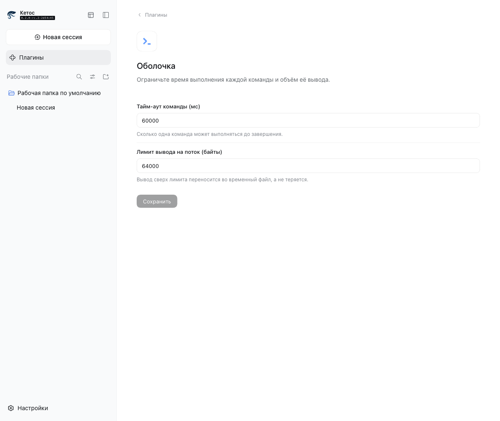

# Этап 25. Обновление ядра до dsh-v0.2.0-rc.2 — отчёт

> План: [upstream-upgrade-plan.md](/Users/kirillustuzanin/Downloads/ketos_v7_master_plan/upstream-upgrade-plan.md) (разделы 1–4, этапы У0–У6). Эпик Beads: `ketos-tu8`. Ветка: `stage-25-upstream-0.2.0-rc.2`, worktree `/Volumes/Projects/Ketos bot.worktrees/stage-25`. Решения Р-1 … Р-7 приняты 2026-10-03 по рекомендации (раздел 4 плана; записаны в описании эпика).

## 1. Итог этапа

Выполнены У0, У1 и У2: решения и задачи зафиксированы в Beads, `~/.ketos` заархивирован, worktree `stage-25` создан, базовая линия снята; апстрим `dsh-v0.2.0-rc.2` влит через одноразовую пересадку корня (109 конфликтов разрешены), пересадка удалена, `main` получил настоящего общего предка с апстримом. Все 17 правок Кетоса разобраны (перенесены/сняты), генерируемые файлы и пары перегенерированы, профили Кетоса собраны с Р-3/Р-5. Код Кетоса адаптирован к API 0.2.0-rc.2: доска и русская локаль переведены на `configForms`, мост окон удерживает сессии через `retain`/`release`, карточки инструментов читают записи разговора v4, у обоих пакетов появились компиляторные фасады, `clone-core` следует объединённому `agent/created`. Затем выполнены У2.9 (все падения гейтов разобраны по пунктам, см. раздел 11) и У3: бренд новых страниц, русская локаль всех новых ключей (58 пространств имён, 2472 ключа), проверка аналитики на временном `DSH_HOME`. Итог: все гейты зелёные, кроме двух сценариев `plugin-install-github`, падающих и на чистом апстриме в этом окружении (раздел 11, пункт 5). Затем выполнены У4 (миграция настроек на копии реального архива, сессии v3/v4, доска и клоны, живые раунды OpenCode Go) и У5 (полный прогон гейтов, `board-geometry` 35/35, бюджеты MVP, PR №54 в форке) — разделы 12–14; У6 — документация и приёмка выполнены, слияние завершает этап (раздел 14).

## 2. У0.1. Решения, учёт, резервные копии

- Эпик `ketos-tu8` и 23 задачи подэтапов У0.1 … У6.3 созданы в Beads с зависимостями раздела 5 плана (цепочка У0 → У1 → У2 → (У3 ∥ У4) → У5 → У6).
- Решения Р-1 … Р-7 записаны в описание эпика.
- Стенды на `:3080` не запущены (порт свободен, процессов Ketos нет).
- Архив данных: `/Users/kirillustuzanin/Downloads/ketos-home-backup-20261003-2108.tar.gz` — 281 КБ.
- Верхние записи архива (`tar -tzf | cut -d/ -f1-2 | sort -u`): `.ketos/.anonymous-user-id`, `.ketos/.credentials.yaml`, `.ketos/clones.db`, `.ketos/profiles`, `.ketos/sessions`, `.ketos/settings.yaml`, `.ketos/storages`.

## 3. У0.2. Worktree и базовая линия

- `git fetch upstream --tags` выполнен; `dsh-v0.2.0-rc.2` = `этап 25`.
- `git worktree add "/Volumes/Projects/Ketos bot.worktrees/stage-25" -b stage-25-upstream-0.2.0-rc.2 main`; `pnpm install` и `pnpm run build` зелёные.
- Деревья подтверждены: `git rev-parse этап 25^{tree}` = `git rev-parse этап 25^{tree}` = `этап 25`.

### 3.1. Базовая линия на main

| Команда | Результат |
|---|---|
| `pnpm run typecheck` | exit 0 |
| `pnpm run lint` | exit 0 |
| `pnpm run test:gui` | 425 файлов: 6129 passed, 1 skipped |
| `DSH_SNAPSHOT=replay pnpm run test:web` | 102 passed, 1 skipped (103 файла); 394 passed, 15 skipped (409 тестов) |
| `pnpm run doc-sync` | 34 passed, 0 failed, 0 skipped |
| `pnpm run hygiene` | 16 passed, 0 failed, 0 skipped |

### 3.2. Пробное слияние

`git merge-tree --write-tree --name-only --merge-base=этап 25 main dsh-v0.2.0-rc.2` — **109 конфликтов** (совпадает с разделом 3.7 плана), результат слияния — дерево `этап 25`.

Драйвер пар переводов сообщил об ошибках формата записей пар (`merge-translation-pairing`) для 13 файлов `*.i18n.yaml` — они в списке конфликтов и разрешаются в У1.2 (взять апстрим и перегенерировать).

Список конфликтующих файлов и решения по каждому — в разделе 5.

## 4. Ход У1

### У1.1. Пересадка корня и слияние

- Проверено: `git rev-parse этап 25^{tree}` = `git rev-parse этап 25^{tree}` = `этап 25`.
- `git replace --graft этап 25 этап 25` → `git merge-base HEAD dsh-v0.2.0-rc.2` = `этап 2561a515f6d7af9304e7fd1d257929aef26`.
- `git merge --no-ff dsh-v0.2.0-rc.2` — 108 конфликтов содержимого + 1 «изменён у нас, удалён у них» (109 файлов), все разрешены (раздел 5).
- Коммит слияния `этап 25`; пересадка удалена (`git replace -l` пуст); `git merge-base HEAD dsh-v0.2.0-rc.2` = `этап 25` (коммит тега), родители слияния — `этап 25` (main) и `этап 25` (тег).

### У1.2. Сгенерированные файлы

Каталоги и пары взяты из апстрима, затем перегенерированы: `gen-cordis-inspect-catalog`, `gen-client-catalog` (slot-catalog), `gen-config-catalog`, `gen-module-graph`, `gen-doc-graphs`, `gen-tool-catalog`, `gen-persistence-catalog`, `gen-session-format-catalog`, `gen-plugin-packages`; пары переводов перезаписаны (`verify-translation-pairing --write`, 9 записей). `gen-tsconfig-paths`, `gen-cordis-catalog`, `gen-cordis-api` — без изменений.

### У1.3. Бренд

Авто-слияние потеряло брендовые строки только там, где апстрим переписал те же места: CLI-диагностика (`startup-diagnostics.ts`, `profile-boot.ts`, `dump-config-schema.ts`), потребители `ketos web:` (web-app spec, e2e профилей web, server-restart), `apps/cli/reference/README.md`/`.zh.md`. Всё возвращено отдельным коммитом `этап 25`; пары `apps/cli/reference` перезаписаны. Сверка со списком «потерянных» строк (`main` содержал `ketos`, слияние — нет) дала ровно 4 файла: два reference-README (возвращены), `app-boot/src/profile.ts` (7→1: апстрим удалил шесть сообщений вместе с кодом), `app-boot/tests/profile.spec.ts` (ожидание удалённой функции). Новые поверхности апстрима (document-preview, sidebar-terminal, плагин-менеджер и др.) не ребрендированы — это У3.1/У3.2 по решению Р-6.

### У1.4. Правки поведения Кетоса

Все 17 правок разобраны; судьба — в разделе 6. Первой перенесена `x-opencode-session` (`llm-pi-ai`): `randomUUID` + заголовки поверх импорта `createModels` из `./models.ts`; тесты `adapter.spec.ts` (`opencode-go`) сохранены. Согласование имён: внутренний `addFiles(references, ids)` апстрима переименован в `addFileReferences` (`facade.ts`, `apply.ts`, `input-matrix.client.spec.tsx`), публичный `SessionInput.addFiles(files)` Кетоса сохранён. `workspace/invalid-path` и `tsdown.client.ts` сохранились авто-слиянием (проверено чтением). HMR-правка снята: апстрим удалил `registerConfig`, сценарий покрыт `boot/hmr/watch-config.ts` + тест «observes creation when the config parent did not exist at registration».

### У1.5. Тесты, эталоны и записанные сессии

- Записанные сессии `snapshots/**/session.v*.jsonl` — из апстрима (формат v4); в конфликтах их не было.
- Восемь `snapshots/web/*.expected.md` взяты из апстрима и помечены к перезаписи. **Перезапись не выполнена:** после слияния клиент не поднимается до адаптации У2 — оба плагина доски (`@deepseek-ai/dsh-client-ui-board`) и русской локали (`@ketos/client-locale-ru`) ждут удалённый апстримом сервис `settingsScope`, веб-загрузка падает с `web boot: 2 entries did not activate` (подтверждено запуском `pnpm dsh web` и чтением ошибки в браузере). Тесты `lifecycle-chrome`, `message-actions`, `queue-actions`, `turn-tail-actions`, `goal-multi-turn-actions` падают по таймауту кадра, а не по диффу эталона; каждый из них перезаписывается в У2 после переноса плагинов на новый `settingsScope`.
- Эталон `apps/cli/tests/expected/launcher-help.txt` — из апстрима (`dsh`); перезаписывается в У2 после зелёной сборки (`vitest -u`).
- Сценарии без перезаписи: перечисленные пять web-e2e, `apps/cli/tests/built-bin.e2e.ts` (snapshot launcher-help), а также любые сценарии с новой записью модели (`test:snapshot:record`) — они требуют ключа DeepSeek и в CI форка не идут.

### У1.6. Конфигурация и профили

`bundle/web-app/cordis.patch.yml`: строки Кетоса (clone-core, locale-ru, ui-board) поверх апстрима; Р-3 — `desktop-product-telemetry` и `product-analytics` переведены в `disabled: true`/`enabled: false`; Р-5 — отключены `deepseek-account`, `llm-deepseek-account`, `account-controller`, `ui-settings-account`. `bundle/web-app/package.json`: зависимости апстрима + `@ketos/clone-core`, `@ketos/client-locale-ru`, ui-board, ui-schedule. `tsconfig.*`: алиасы и ссылки Кетоса поверх апстрима. `vitest.config.ts` конфликтов не имел; после правки `tsdown.client.ts` сохранён. `verify-cordis-config` запускается в У2 после зелёного `settingsScope`; сейчас `pnpm run build:web` и клиентские бандлы собираются, но применяются только после фикса сервисов настроек.

## 6. Судьба локальных правок Кетоса (раздел 3.5 плана)

| Правка | В апстриме `dsh-v0.2.0-rc.2` | Действие в У1 |
|---|---|---|
| `x-opencode-session` (`llm-pi-ai/adapter.ts`, `этап 25`) | нет | **Перенесена первой**; тесты `opencode-go` сохранены |
| `ISessions.openStream` (этап 24) | нет; апстрим убрал выбор сессии (`current`/`open`) | **Снята:** открытие — владельческое `retain`/`using`/`release`; доска переводится на `retain` в У2 |
| `keepDefault` в `selectModel` (этап 21), backend + client | нет | **Перенесена**: гейт поверх фонового сохранения апстрима; `RemoteResult`-сигнатура клиента сохранена |
| `workspace/invalid-path` (`$DSH_HOME`, `~/.ketos`, `~/.dsh`) | код ошибки есть | **Сохранена** авто-слиянием; условие прочитано и совпадает с правилом |
| Чистота бандла `@ketos/*` (`tsdown.client.ts`) | нет | **Сохранена** авто-слиянием |
| `PopoverHost`, портал Tooltip/Menu, `StateDot` reduced motion | нет | **Перенесена** поверх новых `Tooltip`/`Menu`/`MenuSurface`/`MenuGroup`; тесты пакета зелёные (1379) |
| `SessionInput.addFiles`/`takeDraft`, слот `conversation.session.header.blank` | нет; внутренний `addFiles(references, ids)` | **Перенесена** с переименованием внутреннего метода в `addFileReferences` |
| Слот `sidebar.brand.actions` | нет | **Перенесена** |
| `ILayout.declarePanelSidebar`, `blockPagePinchZoom` | нет | **Перенесена** |
| Опрос отсутствующей цели в `vendor/hmr` | апстрим удалил `registerConfig`; наблюдение — `boot/hmr/watch-config.ts` | **Снята:** сценарий покрыт тестом апстрима; старый тест удалён |
| Локальные глифы полноэкранных кнопок в `ui-sidebar-right` | да, новое artwork | **Снята:** апстрим-визуал важнее; Ketos-иконки без потребителей (кандидаты на удаление в У2) |
| Адрес Launchpad в `prepare-ci-bubblewrap.sh` | изменён (0.12.0-1, Launchpad build-URL) | **Снята:** апстрим исправил 404; SHA-пин сохранён |
| `e2e.yml`: `::warning::` вместо падения без ключа | — | **Сохранена** авто-слиянием |

## 7. Эталоны: перезаписано, отложено, диффы

- Перезаписано в У1.2: пары переводов (9 записей), сгенерированные каталоги/графы.
- Перезаписано в У2 (`DSH_SNAPSHOT=refresh`, каждый дифф просмотрен):
  - `snapshots/web/lifecycle-chrome/{hero,plan-active}.expected.md` и `plan-active-zh.expected.md` — добавлена кнопка «Go to board»/«前往看板» (переключатель интерфейсов Кетоса), убранная кнопка «Open right sidebar» вернулась после восстановления углового слота пустой сессии, hero-фраза нормализована в `{{hero-headline}}`.
  - `snapshots/web/voice-input/ui.expected.md` и `snapshots/web/fresh-round-trip/blank-reload.expected.md` — та же нормализация hero-фразы (апстримный набор вращающихся фраз из `main`).
  - `snapshots/web/goal-multi-turn-actions/{ui,ui-expanded}.expected.md` — из эталонов убран транзитный контрол «Back to bottom»: его видимость зависит от позиции прокрутки в момент снимка и нормализуется общей функцией `captureStableAria`.
  - `apps/web/tests/expected/onboarding-deepseek-config/welcome.expected.md` — кетосовский текст приветствия (`内测声明`/Кетос) вместо апстримного `预览版说明`.
- `message-actions`, `queue-actions`, `turn-tail-actions`, `seeded-history` и остальные сценарии проходят против апстримных эталонов без перезаписи.
- `apps/cli/tests/expected/launcher-help.txt` не перезаписывался: ключевой снимок `built-bin.e2e.ts` проходит на апстримном эталоне (`ketos web:` уже в нём из У1.3).
- Требуют новой записи моделью (`test:snapshot:record`, ключ DeepSeek вне CI): сценарии с `snapshots/**/session.v*.jsonl` не перезаписывались; список конкретных записей даст прогон `test:snapshot` в У5. Записанные сессии формата v4 взяты из апстрима в У1.

## 8. Ход У2 (по пунктам задания)

1. **`settingsScope` → `configForms`.** Апстрим удалил `settings-file`/`settingsScope`; новый сервис — `ctx.configForms` (`ui-settings/client`): общее зеркало `describe()` и формы по namespace. Доска читает `ctx.configForms.describe()`, ru-пакет — `ctx.configForms.get<LocaleSettings>('locale')`; хост-половина доски вместо `settings.register` объявляет `Config = BoardSettingsSchema.volatile()` (корневая volatile-схема = весь документ редактируем), профильная строка `ui-board` становится namespace. Проверено в браузере: `pnpm ketos web` поднимается без «did not activate», доска открывается, раскладка сохраняется и восстанавливается; adopt читает `view.value` (резолвнутую секцию), а не `view.user` (сырой слой без `version`).
2. **Сессии окон: `retain`/`release`.** `BoardSessionBridge.attach` берёт `retain(sessionId, { source: 'boardWindow' })`, `releaseSession`/`release`/`dispose` освобождают; при переключении состояние записи обновляется до освобождения, чтобы повторный `reconcile` во время публикации teardown не перепривязал старую сессию. Тесты утечек проверяют `retainInfo(...).retainedBy.boardWindow` (1 на окно, 0 после закрытия). A5-тест «restores windows without changing the application current session» остался и проверяет отсутствие `mainView`-удержания. Очередь окна читается из проекции `inbox` (next-turn = queued, next-step = steering), отклонение раскладки не меняет текущую сессию приложения. `docs/ketos/upstream-sync.md`: строка `openStream` — «снята, заменена апстримным `retain`/`release`».
3. **Компиляторные фасады.** У `ui-board` и `client-locale-ru` появились solution-корень и листья `tsconfig.host.json`/`tsconfig.client.json` по правилу «Keep compiler faces explicit»; `WindowKind`/`WindowBodyKind` перенесены в `board-settings.ts`, чтобы хостовая фея не импортировала клиентский контракт; тесты хост-половин переименованы в `*.host.spec.ts`. Ошибок TS6306/TS6307 нет.
4. **Типы и словари.** `ui-settings-models` собрался без правок (18 ошибок отчёта были артефактом неполной пересборки); `clone-core` читает `source` из объединённого события `agent/created` (вместо удалённого `agent/session-start`), тест композиции проверяет FAILED-энтри и `fiber.await()`; ru-словарь получил новые ключи `common` (`codeBlock.*`, `workspace.defaultName`) и потерял удалённые (`json.collapseNode/expandNode`), корпус-фикстура обновлена.
5. **Записи разговора v4.** `tool-card-model` различает фазы `preparing`/`start` (`argsRaw` только у start), `ToolCard`/`ConversationBody`/`artifacts-model` работают на `ToolResultNode`/`ConversationNode` v4; `ConversationBody` читает pending-взаимодействия через `useSessionStatus(...).pendingInteraction`; кнопка right-sidebar вернулась в угловой слот пустой сессии; тесты tool-card (включая preparing), conversation-body, artifacts-model, clone-window-bar и фикстуры зелёные; карточки терминал/чтение/дифф/поиск проверены в браузере.
6. **Тесты `apps/web`.** 53 ошибки типов из отчёта У1 закрыты ещё в У1 (`scaffold.ts` на `createRuntimeResolution`); Кетос-тесты `board-geometry.e2e.ts` и другие изменённые файлы работают на новом scaffold без правок. Дополнительно починены реальные расхождения: mount-относительные URL роутов доски (`CLONES_PATH.slice(1)` вместо абсолютного `/api/...`), `manifest.webmanifest` без `id` (каждый mount получает свою идентичность), пара favicon/`index.html` по media-query, угловой слот пустой сессии.
7. **Эталоны и таймауты.** См. раздел 7. Из пяти таймаутов У1 (`lifecycle-chrome`, `message-actions`, `queue-actions`, `turn-tail-actions`, `goal-multi-turn-actions`) все проходят: причина была не в таймаутах как таковых, а в каскаде — первый golden с hero-фразой/доской падал, сценарий не отправлял промпт, фикстура не потреблялась и следующие тесты упирались в timeout. Отдельно исправлены: нормализация hero-фразы и «Back to bottom» в `captureStableAria`, возврат кнопки right-sidebar, `slice(1)`-роуты. WebKit установлен (`playwright install webkit`), сценарии на нём проходят.
8. **Иконки.** Удалены неиспользуемые `IconFullscreenCornersOutline16`, `IconExitFullscreenCornersOutline16`, а также осиротевшие после переименования `IconExitFullscreenOutline16`/`IconCodeOutline16`; набор иконок снова 94 пары Regular/Medium.

## 8a. Вход для У2: typecheck (исходное состояние)

Тела обеих фейсов были красные; после `pnpm run clean` и полной пересборки: клиентская фея — 33 ошибки (13 + 2 TS6306 конфигурации, 18 ключей локали `ui-settings-models`, 1 `hub.ts` — исправлена в прошлой сессии); хостовая — 56 ошибок (3 `clone-core` `agent/session-start`, 53 `apps/web/tests/*` по тестовым API, исправлены в У1). Ошибок «Cannot find module» после `agent-presets → agent-preset-registry` не было.

## 9. Коммиты этапа

Коммиты У0–У1 перечислены темами (короткие хеши в отчёте заменены метками: гейт `verify-repository-references` запрещает идентификаторы коммитов в поддерживаемых файлах).

| Тема | Содержание |
|---|---|
| merge upstream | Merge upstream dsh-v0.2.0-rc.2 into Ketos (109 конфликтов, пересадка удалена) |
| fix(brand) | Ketos-написания CLI-диагностики и потребителей `ketos web:` |
| chore(upstream) | перегенерация каталогов/доков, восстановление scaffold и Ketos-уведомления |
| docs(ketos) | отчёт этапа 25; процедура синхронизации и таблица правок Кетоса |
| fix(ketos) | migrate board and ru locale to upstream configForms service |
| fix(ketos) | retain board window sessions and adapt to upstream session APIs |
| build(ketos) | give ui-board and client-locale-ru explicit compiler faces |
| fix(ketos) | adapt clone-core and ru locale to upstream types |
| feat(ketos) | adapt the board to v4 conversation records and upstream settings APIs |
| fix(ketos) | finish the У2 client API migration |
| fix(ketos) | mount-aware routes, blank-header corner, and refreshed web goldens |
| chore(ketos) | drop unused legacy icon exports |
| fix(ketos) | pass repository gates and refresh remaining web goldens |
| fix(ketos) | keep DeepSeek account rows mounted as upstream (п. 1) |
| fix(ketos) | put board radii and menus on the shared theme scale (п. 2) |
| fix(ketos) | keep nested tooltip bubbles out of the one-open registry (п. 3) |
| fix(ketos) | keep board startup free of extra RPC traffic (п. 4) |
| fix(ketos) | keep ui-schedule active across conversation reloads (п. 5) |
| fix(ketos) | settle remaining web goldens and lazy-roster expectations (п. 4/7) |
| docs(ketos) | acknowledge the clone interview message source (п. 6) |
| feat(ketos) | brand the new upstream surfaces as Ketos (У3.1) |
| feat(ketos) | translate every new upstream UI key into Russian (У3.2) |
| fix(ketos) | exempt the ru translation source from vendor rescope (У3.2) |

## 10. Проверки и что осталось

| Гейт | Базовая линия (main) | Итог У2.9 + У3 |
|---|---|---|
| `pnpm run typecheck` | exit 0 | exit 0 (обе феи, 0 ошибок) |
| `pnpm run lint` | exit 0 | exit 0 |
| `pnpm run test:gui` | 6129 passed, 1 skipped | 10219 passed, 1 skipped, **0 failed** (644 файла) |
| `DSH_SNAPSHOT=replay pnpm run test:web` | 394 passed, 15 skipped (409) | 635 passed, 16 skipped, **2 failed** — `plugin-install-github`, подтверждено на чистом апстриме (164 passed файла) |
| `board-geometry.e2e.ts` | 35/35 | 35/35 |
| `pnpm run doc-sync` | 34 passed, 0 failed | **43 passed, 0 failed** |
| `pnpm run hygiene` | 16 passed, 0 failed | **18 passed, 0 failed** |
| `pnpm run build` | exit 0 | exit 0 |

Падения `plugin-install-github` (2) подтверждены на чистом `dsh-v0.2.0-rc.2` во временном worktree: оба теста не дожидаются диалога «连接 GitHub 超时»/«无法访问 GitHub» (`TimeoutError`, 30 с) — доступ Git/GitHub этого хоста. `hmr-live` на апстриме проходит и после правки проходит у нас. Полный разбор пунктов 1–8 — в разделе 11.

У3, У4 и У5 выполнены, их результаты — в разделах 11–13; У6 — в разделе 14. Этот раздел сохраняет исходный вход У2.9; актуальные числа гейтов — в разделе 13.

## 11. У2.9. Довести гейты до зелёного и У3 (выполнено)

Вход: `test:gui` 33 падения в 7 файлах, `test:web` 13, `doc-sync` 1. Каждый пункт — отдельный коммит; ниже причина, решение и коммит (коммиты названы темой — гейт `verify-repository-references` запрещает идентификаторы в поддерживаемых файлах).

1. **Аккаунт DeepSeek.** Причина: Р-5 отключал `ui-settings-account`, `account-controller`, `deepseek-account`, `llm-deepseek-account` в web-профиле, и собственные тесты пакетов не находили Loader-записи (27 `test:gui`, 9 сценариев `test:web`). Решение: строки возвращены как в апстриме; изоляция аккаунта от обычного браузера — устройство апстрима (`deepseek-account-platform` получает `desktopPlatform: null` вне профиля `desktop`, клиентская половина выходит из `apply` без `globalThis.dshDesktop`). Р-5 записан в `docs/ketos/upstream-sync.md`. Коммит: `fix(ketos): keep DeepSeek account rows mounted as upstream`. Проверка: `ui-settings-account` + `ui-settings-general` 35/35; все 9 web-сценариев аккаунта проходят; в веб-интерфейсе страницы и запросов аккаунта нет.
2. **Стили ui-theme.** Причина: CSS доски не знал шкалы темы — сырые радиусы, меню без backdrop-фильтра, самодельные `role=menu/listbox` без `MenuSurface`. Решение: все радиусы доски переведены на `--dsw-radius-*`; всплывающие подсказки композера и подменю `Menu` отдают материал `MenuSurface` (подменю заодно вернулся фон, потерянный при переносе портала). Тесты не менялись. Коммит: `fix(ketos): put board radii and menus on the shared theme scale`. Проверка: ui-theme 110/110, ui-board+ui-primitives 2033/2033, визуальный обход доски.
3. **ui-sidebar.** Причина: реестр `closeOpenTooltip` регистрировал и вложенные подсказки, хотя комментарий объявляет их исключёнными; повторный `mouseenter` на кнопке переключателя заново взводил внешнюю подсказку, и её `show` закрывал пузырь значка обновления. Решение: вложенные подсказки не регистрируются (`suppressAncestors !== null`). Эталон `sidebar-snapshot` обновлён только для ожидаемых изменений Кетоса — дифф: `DSH Local Build` → `Ketos Local Build` и слот `sidebar.brand.actions` в широкой и узкой полосе. Коммит: `fix(ketos): keep nested tooltip bubbles out of the one-open registry`. Проверка: ui-sidebar 1054/1054, tooltip-спека зелёная.
4. **startup-rpc-budget.** Причина: доска читала `ketos.clones`/`ketos.tasks` при применении, а принятый документ раскладки со старыми полями `panel*` нормализовался записью `settings/replace`, запускавшей ещё две инвалидации `describe` (4 против бюджета 2). Решение: ростеры ленивые (клоны читает док при первом рендере доски и меню «+» при открытии, задачи — окно задач), базовая линия записи раскладки берётся из нормализованного снимка стора. Коммиты: `fix(ketos): keep board startup free of extra RPC traffic`; ожидание `preview-boot` о двух 404 заменено в `fix(ketos): settle remaining web goldens and lazy-roster expectations`. Проверка: бюджет 2/2; в логе стенда `ketos.clones`/`ketos.tasks` появляются только после открытия доски.
5. **plugin-install-github и hmr-live на чистом апстриме.** Временный worktree `dsh-v0.2.0-rc.2` (`pnpm install`, `pnpm run build`) прогнал оба сценария. `plugin-install-github` падает и там (2 теста): `TimeoutError: waiting for dialog «连接 GitHub 超时»/«无法访问 GitHub»` — среда Git/GitHub этого хоста, в отчёт с выводом. `hmr-live` на апстриме проходит (14.58 с); у нас падал из-за того, что жёсткие `inject 'conversation'/'uiConversation'` перезапускали `ui-schedule` при перезагрузке ui-conversation, и повторная регистрация его main-слота рендерила композер в окне, где сервис ещё не поднят. Решение: реестр событий разговора берётся через `ctx.inject(['uiConversation'])`; тест закрепляет en-US (русская локаль хоста показывала ru-словарь) и ждёт обновление по доступному имени кнопки выбора рабочей папки. Коммит: `fix(ketos): keep ui-schedule active across conversation reloads`. Worktree удалён (`git worktree remove --force`).
6. **verify-persistence-changes.** Причина: источник `ketos-clone-interview` был неквалифицированным вариантом `MessageSourceMap`, и добавление вида относительно принятой базы формата 4 классифицировалось как ломающее (тянуло union-изменения в `agent/inbox/spliced`, `user/message`, `developer/message`, `session/title-llm-request`). Решение: вид помечен `@persistenceAttribution` с тем же обещанием, что у `user-question-reply`; запись `2026-10-04-ketos-clone-interview-source` фиксирует переход как same-version, каталог и пары перегенерированы. Коммит: `docs(ketos): acknowledge the clone interview message source`. Проверка: «62 roots match 9 history records», doc-sync 43/43.
7. **Итоговые гейты** (после 1–6; базовые числа — раздел 3.1): `typecheck` exit 0; `lint` exit 0; `test:gui` 644 файла, 10219 passed, 1 skipped, **0 failed** (база 425/6129/1); `DSH_SNAPSHOT=replay test:web` 164 passed файла, 635 passed тестов, 16 skipped, **2 failed** — только `plugin-install-github`, подтверждённый на чистом апстриме (база 394/15, 0 failed); `doc-sync` **43 passed, 0 failed** (база 34/0); `hygiene` **18 passed, 0 failed** (база 16/0); `build` exit 0; `board-geometry` **35/35** (база 35/35).
8. **У3.** Выполнено после зелёных гейтов.
   - **У3.1 Бренд новых страниц.** «DeepSeek Harness» → «Ketos» в аккаунте (onboarding, вход, платформенные экраны), плагин-менеджере (предупреждение о доверии) и ярлыках («Обновите Кетос», «перезапустите Кетос»); эталоны аккаунт-сценариев и плагин-менеджера обновлены, локаторы `desktop-onboarding`/`bonus-notice` следуют бренду; `apps/desktop` не тронут (Р-4). Коммит: `feat(ketos): brand the new upstream surfaces as Ketos`.
   - **У3.2 Русская локаль новых ключей.** Корпус расширен с 44 до 58 пространств имён и до 2472 ключей: новые страницы (account, agent loop, shell, subagent, web search, session log, pluginManager, sidebarTerminal, sidebarBrowser, shortcuts, schedule.manager) и все ключи, добавленные апстримом в существующие пространства (chat, conversation, deliverables, schedule, workspace и др.). Переводы внесены в `dictionary-overrides.json`, словари и манифест перегенерированы `sync-dictionaries.mjs`; `dictionary-overrides.json` внесён в исключения `rescope-vendor` (данные словаря, а не имя пакета). Коммиты: `feat(ketos): translate every new upstream UI key into Russian`, `fix(ketos): exempt the ru translation source from vendor rescope`. Проверка: тесты локали 11/11, скриншот ниже.
   - **У3.3 Аналитика, телеметрия, аккаунт.** Стенд поднят только на временном `DSH_HOME` (`/tmp`, после проверки удалён). `--dump-config` показывает `product-analytics` (`disabled: true`, `enabled: false`) и `desktop-product-telemetry` (`disabled: true`). В браузере при работе с доской и чатом: все запросы идут на `127.0.0.1`, ни одного запроса к аналитике/OTel/телеметрии или внешнему хосту; в логе хоста нет строк экспорта. Ленивые запросы доски (`ketos.clones`, `ketos.tasks`) появляются только после открытия доски и меню «+». Побочно: один пробный запуск стенда без `DSH_HOME` перезаписал `~/.ketos/profiles/web/{cordis.yml,cordis.patch.yml}`; оба файла восстановлены из архива У0.1, сессии, `clones.db` и остальные данные не затронуты.

## 12. У4. Данные и модели (выполнено)

### 12.1. Миграция настроек

Копия архива распакована во временный каталог (`$WORK/ketos-home`), стенд запускался из worktree только с `export DSH_HOME="$WORK/ketos-home"` и предохранителем `test -n "$DSH_HOME" && [ "$DSH_HOME" != "$HOME/.ketos" ] || exit 1`. Снимки `~/.ketos` (`find … -type f -exec shasum {} + | sort`) до и после всей сессии совпадают — diff пуст.

Новая версия после того, как Loader загрузил все записи, вызывает `SettingsForms.importLegacyDocument` (`packages/settings/settings/src/index.ts:241`): файл `settings.yaml` переименовывается в `settings.yaml.imported` (чистое переименование — sha256 до/после совпал), затем каждая секция пишется в запись активного профиля через `update()`; в web-профиле это `profiles/web/cordis.patch.yml`. Переименование выполняется до первой записи, поэтому частичный импорт не повторяется; секция, которую композиция отвергает, логируется warning и остаётся только в `.imported`; повторного импорта не бывает, потому что `settings.yaml` больше не существует. Маппинг секций: `ui-developer-tools` → `ui-settings`, `ui-onboarding` → `ui-settings-general`, `shell` → платформенный исполнитель, остальные — в одноимённую запись.

Проверено на копии: все секции архива приняты (warning-строк в логе нет): `locale.preference: ru`, `ui-onboarding` → `ui-settings-general` (`welcomeNoticeVersion`), `ui-board` (окно `agent-mumnofry-oirjkm`, привязка к session-5442ae63, Dock; дальше живой клиент дописывает своё состояние), `agent-default-model` (`opencode-go` / `glm-5.3-flash`), `llm-pi-ai.providers.opencode-go.apiKeyEnv: OPENCODE_GO_API_KEY`. Язык ru, модель по умолчанию, провайдер и раскладка после переноса на месте.

Что произойдёт при первом запуске на настоящем `~/.ketos`: `settings.yaml` будет переименован в `settings.yaml.imported`, его секции уедут в `profiles/web/cordis.patch.yml` (web — единственный профиль, который собирает Кетос), прежние значения останутся в `.imported`, дальше источник истины — профильный патч. Откат: закрыть Кетос и распаковать архив `ketos-home-backup-20261003-2108.tar.gz` поверх дома (в архиве исходные `settings.yaml`, `profiles/`, `sessions/`, `clones.db`, `storages/`); частичный откат «`.imported` → `settings.yaml`» возможен, но требует вычистить импортированные строки из `cordis.patch.yml`, поэтому архив надёжнее.

### 12.2. Сессии v4 (У4.1)

В архиве 18 сессий `session.v3.jsonl.zstd`; у 7 есть содержимое (153cb118, 5442ae63, 901784a3, d13a5210 — stage-23; b364e573, 83ecd050 — «Кетос bot»; c0ce8236 — deepseek-harness), остальные — только шапка. Открыто 14 сессий: 4 авто-восстановлены при старте (5442ae63 из раскладки, e653964a, f53d7fcc, 95a78750), 9 открыты вручную из списка (153cb118, 3dbe737c, 61e3027b, 901784a3, b73382fa, d13a5210, f34a7519, 83ecd050, c93361a4), плюс сессия клона-интервью 7776c099. Лента, карточки и заголовки отрисованы, состояний ошибки нет; в 5442ae63 видна и историческая служебная запись «Инструмент удалён: ralph» — старая история восстановлена.

Продолжение диалога проверено живыми раундами: в 83ecd050 (стандартный интерфейс) и 5442ae63 (окно доски) отправлены сообщения, ответы получены, события дописаны в v4-преемник. Хранимое поколение v3 не изменено: все 18 хешей `session.v3.jsonl.zstd` до/после совпадают. Для загруженных сессий рядом появился `session.v4.jsonl.zstd` (15 файлов к концу У4) — правило «adjacent migration may add a version-named successor but never move, overwrite, or delete committed generations» соблюдено; `storages/session_projcache/*.json` — кэш проекций, он перегенерируется.

Типы из плана в реальных данных представлены не все: записей с вызовами инструментов, подагентами и интервью клона в архиве нет (сессии — короткие чаты и одна команда). Недостающие типы закрыты живыми раундами У4.3 (сообщение, bash-инструмент, подагент) и сессией клона-интервью 7776c099 (пустая лента, привязана к клону).

### 12.3. Доска и клоны (У4.2)

Раскладка из `settings.yaml` восстановилась: окно `agent-mumnofry-oirjkm` (session-5442ae63) открылось с лентой; на копии клиент досохранил своё состояние в профильный патч — три окна (две пустые сессии stage-24), Dock из трёх значков, миникарта, кнопка клона. Переключение «Стандартный интерфейс» ↔ «Перейти на доску» работает.

`clones.db` открывается, `PRAGMA integrity_check` — `ok`: 1 клон «Анна Ковалёва» (роль, персонаж, методология, статус «Черновик», привязка к сессии 7776c099), таблицы `memories` и `clone_tasks` пусты — памяти и задач в исходных данных не было. Окно клона открывается, вкладки «Профиль/Интервью/Память» работают. Ошибок нет: консоль браузера — 0 errors/warnings за всю сессию У4, лог хоста — 0 строк error/warn.

### 12.4. OpenCode Go (У4.3)

Модель `GLM-5.3-Flash` провайдера `opencode-go` выбрана в меню модели (провайдер и каталог видны), живые раунды: стандартный интерфейс — «Ответь одним словом: продолжение» → «Готово» (1 м 22 с, один внутренний ретрай 1/5); инструмент — `bash: echo opencode-go-tool-ok` → вывод и exit code 0 (26 с); подагент — «подагент-ок» (35 с); окно доски (GLM-5.3 того же провайдера) — «доска-ок» → «доска-ок». Заголовок `x-opencode-session`: `pnpm exec vitest run packages/llm/llm-pi-ai/tests/adapter.spec.ts -t "x-opencode-session"` — 2 passed (заголовок строится из id сессии; на не-OpenCode маршруте не отправляется). Ключи и токены не выводились. Скриншоты: `assets/stage-25-u4-board-restored.png`, `assets/stage-25-u4-opencode-go-standard.png`, `assets/stage-25-u4-board-opencode-go.png`.

## 13. У5. Проверки (выполнено)

### 13.1. Гейты

| Гейт | Базовая линия (main) | Итог У5 |
|---|---|---|
| `pnpm run typecheck` | exit 0 | exit 0 |
| `pnpm run lint` | exit 0 | exit 0 |
| `pnpm run test:gui` | 425 файлов: 6129 passed, 1 skipped | 644 файла: 10 219 passed, 1 skipped, 0 failed |
| `DSH_SNAPSHOT=replay pnpm run test:web` | 394 passed, 15 skipped, 0 failed | 164 passed файла + 1 failed файл: 635 passed, 16 skipped, 2 failed (`plugin-install-github`) |
| `board-geometry.e2e.ts` | 35/35 | 35/35 (37 с) |
| `pnpm run doc-sync` | 34 passed | 43 passed |
| `pnpm run hygiene` | 16 passed | 18 passed |
| `pnpm run build` | exit 0 | exit 0 |
| `pnpm run check:ci:coverage` (Node 24) | в базовой линии У0.2 не значился | все тесты зелёные, per-file 100% кроме платформенной ветки |

`plugin-install-github` (2 падения) — доступ Git/GitHub этого хоста, подтверждено на чистом `dsh-v0.2.0-rc.2` (раздел 11, пункт 5), не регрессия Кетоса.

`test:coverage` вскрыл 13 устаревших проверок, которые прошлые гейты этапа не исполняли (`test:gui` покрывает только `packages/client` и `packages/host`); все исправлены отдельными коммитами: бренд-снапшоты CLI (`plugin`, `startup-diagnostics`, `headless`), политика Р-3 в тесте web-app (аналитика и телеметрия выключены во всех профилях Кетоса), запись `retain`-вызовов в `TestSessions`, покрытие перенесённых ветвей `Tooltip` (реестр одной подсказки, hosted-флипы, `checkVisibility`, закреплённая подсказка). Дополнительно обновлён файловый эталон `launcher-help.txt` под имя `ketos` — его уловил E2E после первого пуша. Числа прогона в режиме CI: инструментированный гейт — 1902 файла, 38 720 passed, 1 expected fail, 211 skipped; гейт тяжёлых наборов без инструментирования — 628 файлов, 11 666 passed, 17 skipped. Для сравнения: запись перед обновлением (раздел baseline-issues) — 1267 файлов, 22 506 тестов; рост даёт влитый апстрим.

Единственное расхождение локального macOS-прогона — `readProcessStart` в `experimental/ptc-runtime-python`: чтение `/proc` исполняется только на Linux, и это зафиксировано собственным `v8 ignore`-комментарием файла; Linux-полоса CI закрывает ветку. Первый полный прогон на этой машине давал таймауты тяжёлых наборов (5-секундный бюджет под инструментированием), поэтому гейт прогонялся в режиме CI: `DSH_COVERAGE_MAX_WORKERS=4 DSH_COVERAGE_TEST_TIMEOUT_MS=90000 pnpm run check:ci:coverage`.

### 13.2. Доска и производительность (У5.2)

`board-geometry.e2e.ts` — 35/35. Бюджеты MVP измерены скриптом на временном `DSH_HOME` (20 окон `agent` через меню дока, безголовый Chromium 1440×900; метод — счётчик `requestAnimationFrame` и появление узла `[data-board-window-id]`).

| Сценарий | Бюджет §II.4 | Результат |
|---|---|---|
| Панорамирование при 20 окнах | FPS ≥ 55 | 59.4 FPS, худший кадр 22.2 мс |
| Зум при 20 окнах (8 шагов колеса) | FPS ≥ 55 | 57.9 FPS, худший кадр 26.9 мс |
| Открытие окна до DOM-узла | ≤ 100 мс | 33–54 мс, медиана 35 мс |
| Длинные задачи > 50 мс | 0 | 0 |
| Ошибки консоли | 0 | 0 |

Числа в бюджете и в разбросе записи этапа 20 (59–60 FPS, окно 25–43 мс): хвост открытия 54 мс — разовый выброс, медиана 35 мс.

### 13.3. CI форка (У5.3)

Ветка `stage-25-upstream-0.2.0-rc.2` запушена в `factor241/Ketos`, открыт PR [#54](https://github.com/factor241/Ketos/pull/54) (база `main`, метки `kind/feature`, `area/ketos`); PR не мержится. Первый push падал с `did not receive expected object`: локальный клон был shallow с границей на старом апстримном коммите (предок тега 0.1.5-rc.2), и push из частичного клона не собирался; `git fetch --unshallow upstream --tags` снял границу, после чего push прошёл. Проверки PR: `E2E (real DeepSeek API)` — зелёный (первый прогон упал на `built-bin.e2e.ts`, ожидавшем `dsh` в `launcher-help.txt`; эталон обновлён под `ketos`); `ketos-ci / linux / node 24` — первый прогон упал на replay-сценариях WebKit: задание ставило только Chromium, а `declared-reasoning.e2e.ts` и `session-replay-reload.e2e.ts` запускают WebKit (`Executable doesn't exist … webkit-2311`); шаг установки расширен до `chromium webkit` (как в апстримном consumers-задании), повторный прогон — зелёный. Та же нехватка WebKit валила `ketos-ci` и на `main` (прогон на базовом коммите до PR), поэтому это починка форка, а не регрессия этапа. Задание `coverage` — skipping (schedule-only по устройству воркфлоу).

Аудит workflow: апстрим `dsh-v0.2.0-rc.2` содержит 20 файлов workflow (без `e2b-e2e.yml` — удалён вместе с `packages/e2b`); новых неработоспособных workflow нет. `docs/ketos/ci-fork.md` обновлён: в реестре GitHub 9 зарегистрированных файлов — `ketos-ci` активен, `e2e` и `node-addon-system` активны по делу, `ci`, `build-preview-cloudflare`, `issue-lifecycle`, `issue-policy`, `release`, `release-vendor` отключены; остальные 12 апстримных файлов не зарегистрированы и на PR/push не срабатывают; 41 запись реестра — из ранней истории форка, их файлов в дереве нет. Отключать нечего, отключение обратимо (`gh workflow enable`). Задание coverage переведено на `pnpm run check:ci:coverage` с `DSH_COVERAGE_TEST_TIMEOUT_MS=90000`: старый вариант `pnpm run test:coverage` без бюджета и без гейта тяжёлых наборов срывался на таймаутах под инструментированием.

## 14. У6. Интеграция

- **У6.1. Документация.** `upstream-sync.md` переведён на базу `dsh-v0.2.0-rc.2` и обычный `git merge --no-ff <тег>` без пересадки корня; таблица форк-изменений дополнена решениями Р-3 и Р-5, заменой `openStream` на `retain`/`release` и тестами апстрима под бренд Кетоса; добавлен раздел «Переход на новую версию на реальных данных». Agent Note `2026-10-03-ketos-stage-25-upstream-upgrade` фиксирует решения Р-1…Р-7, пересадку корня, судьбу каждой правки, инцидент с `~/.ketos` и правило `DSH_HOME` для стендов; обновлены записи 2026-09-14 (история апстрима достижима обходом предков) и 2026-10-03 (полоса coverage через `check:ci:coverage`, снятая правка bubblewrap). Локальный `pnpm run doc-sync` — 43 passed, 0 failed.
- **У6.2. Приёмка.** Пользователь принял этап 25 2026-10-05; PR [#54](https://github.com/factor241/Ketos/pull/54).
- **У6.3. Слияние.** Выполняется сразу после зелёных проверок PR: merge-коммит в `main` (история апстрима сохраняется), тег `ketos-merged-dsh-v0.2.0-rc.2`, проверка `git merge-base main dsh-v0.2.0-rc.2` = коммит тега, закрытие эпика `ketos-tu8`, удаление ветки и worktree; push в `main` запускает `ketos-ci` отдельным прогоном.
- **Итоговые числа гейтов** — раздел 13.1. **CI PR #54:** `ketos-ci / linux / node 24` — успех, `E2E (real DeepSeek API)` — успех, `coverage` — skipping (schedule-only); документационный коммит запускает тот же набор. Известные хвосты: `plugin-install-github` (2, среда хоста, подтверждено на апстриме); macOS-клетка per-file coverage по `readProcessStart` (закрывается Linux-полосой CI); полоса Windows/wine локально не гонялась — её держит CI.

## Приложение А. Список конфликтов пробного слияния (109)

- `.agents/notes/archived/manifest.json`
- `.agents/notes/implemented/testing/2026-06-19-real-api-e2e-ci.i18n.yaml`
- `apps/cli/reference/README.i18n.yaml`
- `apps/cli/reference/README.md`
- `apps/cli/reference/README.zh.md`
- `apps/cli/src/args.ts`
- `apps/cli/src/bin.ts`
- `apps/cli/src/plugin.ts`
- `apps/cli/tests/built-bin.e2e.ts`
- `apps/web/index.html`
- `apps/web/public/favicon.svg`
- `apps/web/public/manifest.webmanifest`
- `apps/web/tests/expected/onboarding-deepseek-config/welcome.expected.md`
- `apps/web/tests/pwa-manifest.e2e.ts`
- `apps/web/tests/scaffold.ts`
- `apps/web/vite.config.ts`
- `docs/config-catalog.i18n.yaml`
- `docs/config-catalog.md`
- `docs/config-catalog.zh.md`
- `docs/event-producer-consumer.i18n.yaml`
- `docs/event-producer-consumer.md`
- `docs/event-producer-consumer.zh.md`
- `docs/module-graph.i18n.yaml`
- `packages/api/session-controller/src/client/contract/sessions.ts`
- `packages/api/session-controller/src/client/sessions/service.ts`
- `packages/api/session-controller/src/commands.ts`
- `packages/api/session-controller/tests/session-models.host.spec.ts`
- `packages/api/session-controller/tests/sessions-service.client.spec.ts`
- `packages/boot/app-boot/src/profile.ts`
- `hmr-config.spec.ts`
- `packages/boot/app-boot/tests/profile.spec.ts`
- `packages/bundle/headless/README.i18n.yaml`
- `packages/bundle/headless/README.md`
- `packages/bundle/headless/README.zh.md`
- `packages/bundle/headless/src/index.ts`
- `packages/bundle/headless/src/startup.ts`
- `packages/bundle/headless/tests/startup.spec.ts`
- `packages/bundle/web-app/README.i18n.yaml`
- `packages/bundle/web-app/README.md`
- `packages/bundle/web-app/README.zh.md`
- `packages/bundle/web-app/cordis.patch.yml`
- `packages/bundle/web-app/package.json`
- `packages/client/README.i18n.yaml`
- `packages/client/locale/src/locales/en.ts`
- `packages/client/locale/src/locales/zh.ts`
- `packages/client/ui-brand-official/README.i18n.yaml`
- `packages/client/ui-conversation/src/client/index.ts`
- `packages/client/ui-conversation/src/client/input/facade.ts`
- `packages/client/ui-conversation/src/client/locales.ts`
- `packages/client/ui-conversation/src/client/skeleton/ConversationRoot.module.css`
- `packages/client/ui-conversation/src/client/skeleton/ConversationRoot.tsx`
- `packages/client/ui-conversation/src/client/skeleton/ConversationSession.tsx`
- `packages/client/ui-conversation/src/client/skeleton/EmptyHero.tsx`
- `packages/client/ui-conversation/src/client/skeleton/HeroShell.module.css`
- `packages/client/ui-conversation/tests/conversation-registry.client.spec.ts`
- `packages/client/ui-conversation/tests/input-bar.client.spec.tsx`
- `packages/client/ui-conversation/tests/skeleton.client.spec.tsx`
- `packages/client/ui-layout/README.i18n.yaml`
- `packages/client/ui-layout/README.md`
- `packages/client/ui-layout/README.zh.md`
- `packages/client/ui-layout/package.json`
- `packages/client/ui-layout/src/client/AppFrame.tsx`
- `packages/client/ui-layout/src/client/index.ts`
- `packages/client/ui-layout/tests/apply.client.spec.ts`
- `packages/client/ui-model-selection/src/client/directory.ts`
- `packages/client/ui-model-selection/tests/browser-plugin.client.spec.ts`
- `packages/client/ui-primitives/README.i18n.yaml`
- `packages/client/ui-primitives/README.md`
- `packages/client/ui-primitives/README.zh.md`
- `packages/client/ui-primitives/src/Menu.module.css`
- `packages/client/ui-primitives/src/Menu.tsx`
- `packages/client/ui-primitives/src/StateDot.module.css`
- `packages/client/ui-primitives/src/Tooltip.tsx`
- `packages/client/ui-primitives/src/icons/index.tsx`
- `packages/client/ui-primitives/src/index.ts`
- `packages/client/ui-primitives/tests/icons.client.spec.tsx`
- `packages/client/ui-primitives/tests/tooltip.client.spec.tsx`
- `packages/client/ui-settings-models/src/client/locales.ts`
- `packages/client/ui-settings-models/src/onboarding-copy.ts`
- `packages/client/ui-settings-models/tests/welcome-notice.client.spec.tsx`
- `packages/client/ui-sidebar-right/src/client/shell/SidebarRight.tsx`
- `packages/client/ui-sidebar/README.i18n.yaml`
- `packages/client/ui-sidebar/README.md`
- `packages/client/ui-sidebar/README.zh.md`
- `packages/client/ui-sidebar/src/client/SidebarRoot.tsx`
- `packages/client/ui-sidebar/src/client/contract/slots.ts`
- `packages/client/ui-sidebar/src/client/index.ts`
- `packages/client/ui-sidebar/tests/sidebar-root.client.spec.tsx`
- `packages/client/ui-theme/README.i18n.yaml`
- `packages/extensions/cordis-client-runner/src/client/slot-catalog.ts`
- `packages/llm/llm-pi-ai/src/adapter.ts`
- `packages/test-support/client-runtime/package.json`
- `packages/test-support/client-runtime/src/sessions.ts`
- `scripts/browser-bundled-externals.spec.ts`
- `scripts/doc-budgets.manifest.json`
- `scripts/prepare-ci-bubblewrap.sh`
- `snapshots/web/goal-multi-turn-actions/ui.expected.md`
- `snapshots/web/lifecycle-chrome/hero.expected.md`
- `snapshots/web/lifecycle-chrome/plan-active.expected.md`
- `snapshots/web/message-actions/ui.expected.md`
- `snapshots/web/queue-actions/editing.expected.md`
- `snapshots/web/queue-actions/ui.expected.md`
- `snapshots/web/turn-tail-actions/running.expected.md`
- `snapshots/web/turn-tail-actions/settled.expected.md`
- `tsconfig.base.json`
- `tsconfig.client.json`
- `tsconfig.host.json`
- `vendor/README.md`
- `vendor/hmr/src/index.ts`
