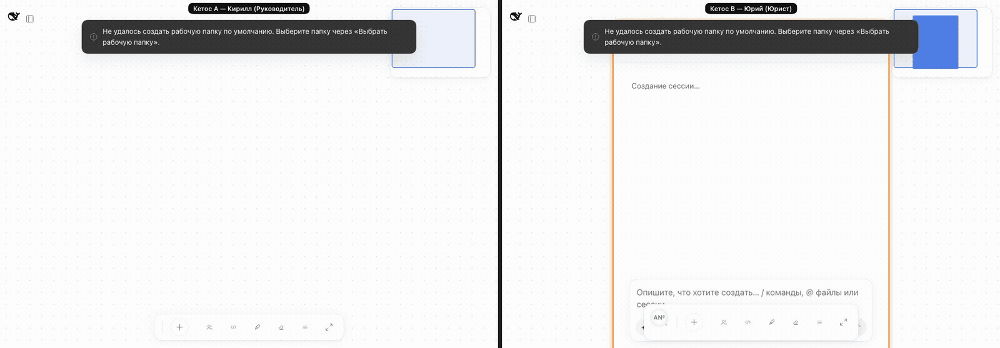

# Этап 35. Общая папка через Syncthing

## 1. Итог этапа

Подготовка worktree (`pnpm install`, `pnpm run build`, `typecheck`, тесты `ui-board` — 1067, ссылка `.env` на файл с ключом модели в основной папке и копия `docker/stand/.env` из worktree этапа 34) сделана предыдущей сессией после приёмки этапа 34; эта сессия начала с `bd prime`. Этап выполнен в worktree `stage-35`, ветка `stage-35-syncthing-folder` от принятой `stage-34-foreign-chat-card`; вся работа лежит в рабочем дереве ветки без коммита, коммит делается после ответа «да». Кетосы стенда сами связывают свои Syncthing через канал iroh и частный ретранслятор и делят папку `/workspace/shared`: файл агента A сам появляется во вкладке «Файлы» на B, состояние папки видно в «Участниках», сердечный ритм канала замечает обрыв за секунды (§2, §3), образ стенда собирается и под `linux/amd64`. Этапу 36 переданы артефакты для шага «файл агента A у B» на двух компьютерах (Mac A и Windows 11 B) — архив `ketos-stand-amd64.tar.gz` и шаги README стенда «Windows 11»; на Windows эти шаги не выполнялись, их проверка — подэтап 36.1.

## 2. Подэтапы

| Подэтап | Задача Beads | Статус | Подтверждение |
|---|---|---|---|
| 35.1 Раздельные рабочие папки | `ketos-qzb.10.1` | выполнен | тома `ketos-a-workspace` и `ketos-b-workspace` в базовом `docker/stand/compose.yaml`, оверлей `relay-only.compose.yaml` без переопределения тома; `ensure-stignore.mjs` из `docker-entrypoint.sh` создаёт `/workspace/shared/.stignore` (`.DS_Store`, `*.tmp`, `~*`) до старта Syncthing; на стенде `.stignore` у обоих, файл A не появился у B за 45,1 с до связывания (§3.3.1) |
| 35.2 Клиент REST Syncthing и `Config.syncthing` | `ketos-qzb.10.2` | выполнен | `syncthing-config.ts` (`apiKeyEnv` с ролью `credential-ref`, `relayAddress` без токена, границы, отказ загрузки при неверных значениях), `syncthing-client.ts` (ключ читается на каждый запрос, тайм-аут `requestTimeoutMs`, проверка JSON-ответов, `SyncthingError` без ключа и токена), проверка настроек без записи; нет ключа — функция выключена одной строкой `syncthing.disabled`, канал и доска работают; `syncthing-client.spec.ts`, `syncthing-config.spec.ts`, `composition.spec.ts`; покрытие `peer` 100% (§5) |
| 35.3 Связывание через канал iroh | `ketos-qzb.10.3` | выполнен | `syncthing-link.ts` (рамка `syncthing.device`, устройство `ketos:<peerId>` с адресом частного ретранслятора, папка с объединением устройств в одной очереди, замена устройства при смене ID, удаление при забывании), `syncthing-device-id.ts` (канонический вид, `luhn32` по описанию формата, нулевые биты дополнения); на стенде устройства и папка связаны за 0,8 с после подключения, соединение `relay-server`/`relay-client`, файл агента A у B через 2,3 с (§3.3.2) |
| 35.4 Живая вкладка «Файлы» | `ketos-qzb.10.4` | выполнен | член контракта `BoardWindowInjected.watchWorkspaceDirectory`, `directory-watch.ts` поверх `remote.workspaceFiles.changes`, одно наблюдение на раскрытый уровень, кадр изменения перечитывает только свой уровень; `right-panel-files.client.spec.tsx`, `directory-watch.client.spec.ts`; на стенде файл из A во вкладке B через 2,5 / 2,5 / 2,6 с без нажатия «Перезагрузить» (§3.3.3) |
| 35.5 Устойчивость и состояние общей папки | `ketos-qzb.10.5` | выполнен | `syncthing-state.ts` (пять состояний; `synced` — только при живом канале к собеседнику и подтверждении его стороны через `/rest/db/completion`), поле `sharedFolder` в `GET /api/ketos.peer.state`, строка «Общая папка» в «Участниках»; `dc restart ketos-b` — оба `online` за 3,6–5,6 с; смена ID устройства B — у A одно устройство с новым ID, `synced` за 7,9–9,6 с (§3.3.4) |
| 35.6 Сердечный ритм канала | `ketos-qzb.8.17` | выполнен | протокол 3 (ALPN `ketos/peer/3`), рамки `peer.ping`/`peer.pong` с телом ровно `{}`, закрытие по тишине с причиной `heartbeat-timeout` (код 6), `Config.heartbeatIntervalMs` 3000 и `heartbeatTimeoutMs` 9000 с проверкой «тайм-аут не меньше двух интервалов»; на стенде в итоговой серии (10 обрывов по 20–120 с) «Нет связи» на A через 8,2–10,0 с, оба `online` через 7,3–17,3 с после возврата сети; за 10 минут работы 0 строк `peer.heartbeat-timeout` (§3.3.5) |
| 35.7 Образ для второго компьютера | `ketos-qzb.10.7` | выполнен | `ketos-stand:amd64` из итогового дерева (сборка под эмуляцией 764 с), проверки образа, пара A `arm64` + B `amd64` (подключение 1,0 с, доска в обе стороны без потерь, файлы в обе стороны 2,6 с), архив `~/ketos-stand-amd64.tar.gz` 635 732 853 байта, раздел README стенда «Windows 11 (computer B)» (§3.3.6) |
| 35.8 Тексты, проверки и приёмка | `ketos-qzb.10.6` | выполнен (кроме приёмки) | ключи `peer.folder`, `peer.folder.synced`, `.syncing`, `.waiting`, `.error`, `.unavailable`, `right.watchFailed`, `right.watchFailedFolder` в zh, en и ru; README `peer`, стенда и `ui-board`; Agent Note `2026-10-09-ketos-syncthing-over-iroh` и дополнение заметки канала `2026-10-06-ketos-peer-channel`; гейты §5; независимое ревью §4.5; GIF и этот отчёт |

## 3. Критерии приёмки этапа

Все живые замеры выполнены на одной машине: два контейнера стенда на раздельных сетях (оверлей `relay-only.compose.yaml`, единственный путь между Кетосами — ретранслятор iroh для канала и частный ретранслятор Syncthing для файлов), часы общие. Прогон на двух настоящих компьютерах — этап 36 (`ketos-qzb.8.15`). Числа пары A `arm64` + B `amd64` справочные: B работал под эмуляцией `amd64` на Mac. Итоговые значения — серия W10 на образах из итогового дерева; более ранние серии приведены как история там, где они объясняют решение (§3.3).

- [x] **Раздельные рабочие папки на любой топологии стенда** — `docker compose -f docker/stand/compose.yaml -f docker/stand/relay-only.compose.yaml config --format json` и тот же вызов без оверлея: A → `ketos-a-workspace:/workspace`, B → `ketos-b-workspace:/workspace` в обоих выводах; `.stignore` у обоих после старта; файл, созданный в A до связывания, не появился у B за 45,1 с (§3.3.1); тесты `ensure-stignore.test.mjs`, `docker-entrypoint.test.mjs`.
- [x] **Кетосы сами связывают Syncthing через канал iroh и частный ретранслятор** — после `GET /api/ketos.peer.invite` на A и `POST /api/ketos.peer.connect` на B у обоих появляются устройство `ketos:<peerId>` с `myID` собеседника и папка `ketos-shared` (`sendreceive`, 2 устройства): 0,8 с после запроса подключения в W3L, 2,1 с в W5; в W10 `synced` через 7,4 с от запуска `connect.sh`, файл A → B 2,8 с; ручных действий в GUI Syncthing нет (§3.3.2); тесты `syncthing-link.spec.ts`, `syncthing-pair.spec.ts`.
- [x] **Публичные узлы не используются** — `/rest/system/connections`: A → B `relay-server`, B → A `relay-client`; у устройства собеседника ровно один адрес `relay://` с тем же хостом, портом и `id`, что у частного ретранслятора, без `token=` и без `dynamic` (сравнение внутри контейнеров); `/rest/config/options`: `globalAnnounceEnabled=false`, `localAnnounceEnabled=false`, `natEnabled=false`, `relaysEnabled=true`, адреса прослушивания — частный ретранслятор и один `tcp:`, без `default` (§3.3.2).
- [x] **Файл агента A у B во вкладке «Файлы» ≤ 30 с без ручного обновления** — итог W10 (запись GIF): агент A по запросу «Создай файл /workspace/shared/договор.md с одной строкой текста. Используй инструмент записи файла, без командной строки.» записал файл через 4,8 с, строка `договор.md` появилась во вкладке «Файлы» B (папка `shared` раскрыта) через 7,2 с после запроса, без нажатия «Перезагрузить»; история W3L: файл агента у B через 2,3 с после появления на A, SHA-256 совпали; строки файлов, записанных в A, — во вкладке B через 2,5 / 2,5 / 2,6 с, сторож в странице не зафиксировал ни одного нажатия «Перезагрузить» или «Обновить» (§3.3.2, §3.3.3, §3.3.8).
- [x] **Связка переживает перезапуск и смену ID устройства** — `dc restart ketos-b` без нового кода: оба `online` за 4,6 / 5,6 / 5,2 / 3,6 / 4,6 с (W3L / W5 / W6 / W9 / W10), файл A → B 2,6–3,7 с; удаление тома Syncthing B (`docker volume rm ketos-stand_ketos-b-syncthing`; дом и рабочая папка B сохранены, сужение формулировки плана — §4.1) и новый подъём: у A ровно одно устройство `ketos:<B>` с новым ID (строка `syncthing.device-replaced … 1 previous device removed`), в папке 2 устройства, `synced` через 7,9–9,6 с, файл 2,5–4,0 с, файлов конфликтов 0; забывание B на A убирает устройство B из папки и конфигурации через 0,3 с, новое приглашение связывает снова (§3.3.4).
- [x] **Состояние папки в «Участниках»** — строка «Общая папка — Синхронизирована» (`data-board-shared-folder=synced`) в поповерах A и B; при обрыве строка на A переходит в «Ожидает собеседника» в тот же опрос, что и «Нет связи» (§3.3.4, §3.3.5); тесты `participants-popover`, `peer-poll`, `peer-api`, `store-elements` (клиент) и `syncthing-state.spec.ts` (все пять состояний).
- [x] **«Нет связи» ≤ 12 с после обрыва, восстановление ≤ 30 с от возврата сети** — итоговая серия W10, 10 обрывов: «Нет связи» на доске A через 8,2–10,0 с (API `lost` 7,2–9,0 с); оба `online` после восьми обрывов по 20 с — минимум 7,7, медиана 12,1, максимум 15,3 с, после 65,5 с — 7,3 с, после 120,6 с — 17,3 с, ни одного превышения 30 с (§3.3.5); история: до сердечного ритма «Нет связи» через 33,8 с; в 20 обрывах серий W5, W6 и W9 (с парой `arm64` + `amd64`) «Нет связи» на A через 7,4–10,2 с (там, где мерилось), оба `online` через 4,8–28,7 с, кроме одного обрыва W9 (44,1 с), после которого на стенде задан `connectTimeoutMs: 5000` (§4.1; остаточный риск — §4.2).
- [x] **Нет ложных срабатываний** (критерий 35.6) — 10 минут обычной работы дважды (W5, W6): 900 из 900 изменений доски дошли, 9 из 9 файлов, 123 из 123 опросов `online`, `dc logs --since 11m ketos-a ketos-b | grep -c peer.heartbeat-timeout` = 0 (§3.3.5).
- [x] **Образ `amd64` из той же сборки работает вместе с `arm64`** — итоговые образы: B `x86_64`/`x64` на `amd64`-образе той же сборки, оба `online` 1,0 с, `synced` 7,7 с, по 20 изменений доски каждого вида в обе стороны без потерь (медианы 149–169 мс), файлы в обе стороны 2,6 с с равными SHA-256; на сборках C2 и C3 то же: `uname -m` `x86_64` у B, оба `online` 0,9 с, `synced` 7,7 и 7,1 с, 20 изменений доски в каждую сторону без потерь, файлы в обе стороны 2,5–2,7 с (§3.3.6).
- [x] **Покрытие `peer` 100%** — 24 файла, 442 теста; 1921/1921 statements, 947/947 branches, 402/402 functions, 1627/1627 lines (§5).
- [x] **Гейты зелёные** — §5; `pnpm run duplication` красный, как на базе: 5 старых клонов, новых нет (`ketos-7bs`).
- [x] **GIF, Agent Note и отчёт** — GIF `docs/ketos/reports/assets/stage-35-syncthing-folder.gif` (§3.3.8); Agent Note `.agents/notes/implemented/architecture/2026-10-09-ketos-syncthing-over-iroh.md` (+ `.zh.md`, `.i18n.yaml`); заметка `2026-10-06-ketos-peer-channel` дополнена сердечным ритмом, протоколом 3 и пределами стенда; этот отчёт.
- [ ] **Эпик закрыт после «да»** — `bd close ketos-qzb.10` после ответа (§6).

### 3.1 Приёмка этапа

| Пункт «Приёмки этапа» | Где подтверждён | Итог |
|---|---|---|
| Раздельные папки | критерий 1, §3.3.1 | выполнен |
| Автоматическое связывание Syncthing через iroh и частный ретранслятор | критерии 2–3, §3.3.2 | выполнен |
| Файл A у B ≤ 30 с во вкладке «Файлы» | критерий 4, §3.3.3, §3.3.8 | выполнен: файл агента во вкладке B через 7,2 с после запроса (W10, GIF); файлы A — через 2,5–2,6 с после записи (W3L) |
| Восстановление после перезапуска и смены ID | критерий 5, §3.3.4 | выполнен |
| Состояние в «Участниках» | критерий 6, §3.3.4 | выполнен |
| «Нет связи» ≤ 12 с | критерий 7, §3.3.5 | выполнен: 8,2–10,0 с |
| Образ `amd64` | критерий 9, §3.3.6 | выполнен |
| Гейты зелёные | §5 | выполнен (дублирование — база) |
| GIF и отчёт | §3.3.8, этот файл | выполнен |

### 3.2 Бюджеты линии

| Метрика | Бюджет | Как мерили | Итог (W10) | Ранее |
|---|---|---|---|---|
| Подключение по коду приглашения | ≤ 5 с до двух участников у обоих | `connect.sh` (приглашение на A, подключение на B), опрос `/api/ketos.peer.state` обеих сторон каждые 0,25 с от запроса подключения | 0,7 / 1,0 / 1,0 с (три подключения) | 0,5 с (W3L), 1,2 с (W5), 0,8 с (W6), 0,7 с (W9); пара `arm64` + `amd64` 0,9 с (W6, W9) |
| Восстановление после перезапуска контейнера | ≤ 30 с без нового кода | `dc restart ketos-b`, опрос обеих сторон каждые 0,5 с | 4,6 с (`synced` 4,6 с, файл 2,6 с) | 4,6 / 5,6 / 5,2 / 3,6 с |
| Файл в общей папке → виден у другого Кетоса | ≤ 30 с | `docker exec … test -f` каждые 0,5 с; строка во вкладке «Файлы» B | строка во вкладке B через 7,2 с после запроса агенту A (файл на A — через 4,8 с); файлы A → B вне обрывов 2,6–4,1 с | файл агента 2,3 с; строка во вкладке 2,5–2,6 с; файл раз в минуту 10 минут подряд — 9 из 9 за 2,5–3,2 с (W5, W6) |
| «Нет связи» после `docker network disconnect` B | ≤ 12 с (35.6) | доска A каждые 0,2 с с открытым поповером, API A каждые 0,2 с, B через `docker exec … curl` | 8,2–10,0 с (API `lost` 7,2–9,0 с), 10 обрывов | 7,5–10,2 с (W5, 7 обрывов), 8,0–8,6 с (W6, 5), 7,4–8,8 с (W9, 4 с замером); до сердечного ритма 33,8 с |
| Оба `online` после `docker network connect` | ≤ 30 с (35.6) | то же | 8 обрывов по 20 с: 7,7 / 12,1 / 15,3 с (минимум / медиана / максимум); 65,5 с — 7,3 с; 120,6 с — 17,3 с; превышений нет | §3.3.5 |
| Изменение доски A → видно на B | медиана ≤ 1 с, максимум ≤ 2 с | `docker/stand/tools/sync-latency.mjs receive` на B и `send` на A, 300 раундов за 10 минут | пара `arm64` + `amd64`, 20 раундов в каждую сторону, справочно: медианы 149–169 мс, максимум 445 мс, 0 потерь; код канала (`service.ts`, `link.ts`, `frame.ts`) после W6 не менялся | W5: медианы 131 / 131 / 140 мс, максимумы 569 / 402 / 313 мс; W6: 131 / 130 / 142 мс, 373 / 396 / 574 мс (создание / правка / удаление), 0 потерь из 900 |

FPS холста, запись раскладки и видимость операции элемента в другой вкладке того же Кетоса (≤ 1 с) этап не затрагивал и не мерил; подготовка стенда показа с нуля на двух компьютерах — замер этапа 36.

### 3.3 Живые проверки

Все команды выполнялись из корня репозитория; `dc` — `docker compose -f docker/stand/compose.yaml -f docker/stand/relay-only.compose.yaml`, `up` всегда с `--no-build`; пара `arm64` + `amd64` добавляла оверлей `.playwright-mcp/stage35/amd64-b.override.yaml` (`ketos-b` на образе `ketos-stand:amd64`, `platform: linux/amd64`). Имена участников — «Кирилл (Руководитель)» на A и «Юрий (Юрист)» на B. `~/.ketos` не затрагивался (тома стенда Docker). Ключ модели `OPENCODE_GO_API_KEY` и ключ Syncthing `STGUIAPIKEY` проверялись только на наличие (`test -n`); REST Syncthing вызывался внутри контейнеров через `docker exec`, ключ и токен ретранслятора нигде не выводились. Сценарии — Playwright (headless Chromium, `locale: 'ru-RU'`); скрипты, журналы и снимки лежат в игнорируемой папке `.playwright-mcp/stage35/` (`reset.sh`, `connect.sh`, `state.sh`, `tool.mjs`, `check1.mjs`–`check8.mjs`, `w5-*.mjs`, `w6-*.mjs`, `leakscan.mjs`, `logs/`, `shots/`). Рядом с каждым замером в журналах записана нагрузка `uptime`: параллельно шли сборки образов и гейты (одноминутная нагрузка до 22,2 на 10 ядрах в W5).

| Серия | Образы | Что проверено |
|---|---|---|
| W3L | `arm64` из дерева первой волны, до исправлений ревью `peer` и до сердечного ритма | 35.1, 35.3, 35.4, 35.5; обрыв без сердечного ритма (база) |
| W5 | `arm64` сборки C1: сердечный ритм, на стенде `reconnectMaxMs: 10000` | 35.6 (7 обрывов, 10 минут работы), перепроверка 35.3 и 35.5, секреты |
| W6 | `arm64` и `amd64` сборки C2: исправления ревью, «пинок» Syncthing при каждом переподключении канала, `reconnectMaxMs: 5000` | проверки образов, пара `arm64` + `amd64`, перепроверка 35.3–35.5, 5 обрывов, 10 минут работы, забывание, GIF, архив; найдена регрессия «пинка» |
| W9 | сборки C3: «пинок» только после потери канала ≥ 90 с, `relayReconnectIntervalM=1`, снятие паузы с устройства | регрессия, 6 обрывов по 20 с и обрыв 120 с, 35.3 и 35.5, пара, секреты, GIF, архив; один 20-секундный обрыв восстановился за 44,1 с |
| W10 | итоговые F: C3 плюс `connectTimeoutMs: 5000` в строке `ketos-peer` стенда | проверки образов, 8 обрывов по 20 с, 65,5 с и 120,6 с, подключение и перезапуск, пара `arm64` + `amd64`, секреты, GIF, архив; все пункты пройдены |

#### 3.3.1 Раздельные папки (35.1, W3L)

| Проверка | Команда | Результат |
|---|---|---|
| Тома | `dc config --format json` и `docker compose -f docker/stand/compose.yaml config --format json` (фильтр: тома, сети, порты сервисов) | A → `ketos-a-home`, `ketos-a-syncthing`, `ketos-a-workspace:/workspace`, сеть `net-a`; B → `ketos-b-*`, `ketos-b-workspace:/workspace`, сеть `net-b`; без оверлея — те же тома, сеть `default` |
| `.stignore` | `docker exec ketos-stand-ketos-{a,b}-1 cat /workspace/shared/.stignore` | у обоих `.DS_Store`, `*.tmp`, `~*` с завершающим переводом строки; в журнале контейнера `ensure-stignore: created /workspace/shared/.stignore` |
| До связывания | `docker exec ketos-stand-ketos-a-1 sh -c 'echo x > /workspace/shared/before-link.txt'`, опрос B каждые 0,5 с | у B файла нет через 45,1 с; папки `ketos-shared` нет ни у кого, в конфигурации каждого Syncthing только своё устройство |

#### 3.3.2 Связывание и файл агента (35.3)

| Проверка | Команда | Результат |
|---|---|---|
| Связывание (W3L) | `check2.mjs`: приглашение на A, подключение на B, опрос обеих сторон | оба `online` 0,5 с; устройства и папка у обоих 0,8 с; `relay-server`/`relay-client` 1,6 с; `before-link.txt` у B 4,4 с |
| Связывание (W5, W6, W9) | `w5-link.mjs`, `w6-link.mjs` | W5: `online` 1,2 с, устройства и папка 2,1 с, `relay-*` 4,2 с, `synced` 6,1 с, файл 3,0 с; W6 и W9 (от запуска `connect.sh`, запрос уходит через 1,6–2,8 с): устройства и папка 3,2–4,4 с, `relay-*` 4,1–5,1 с, `synced` 7,1–7,8 с, файл 2,7–4,0 с |
| Связывание (W10) | `reset.sh`, `w6-link.mjs`; ещё два подключения по новому коду (пара `arm64` + `amd64`, пара записи GIF) | оба `online` 0,7 с после запроса, `synced` 7,4 с от запуска `connect.sh`, файл 2,8 с; два других подключения — 1,0 и 1,0 с |
| Адреса и опции | `w6-relaycheck.mjs`: адреса сравниваются внутри контейнера с `KETOS_SYNCTHING_RELAY` | у устройства собеседника один адрес `relay:` с хостом, портом и `id` частного ретранслятора, `hasToken=false`, не `dynamic`; адреса прослушивания — частный ретранслятор и `tcp:`, без `default` и публичного пула; `globalAnnounceEnabled=false`, `localAnnounceEnabled=false`, `natEnabled=false`, `relaysEnabled=true`, `urAccepted=-1`, `crashReportingEnabled=false`, `autoUpgradeIntervalH=0`, `reconnectionIntervalS=10`, `relayReconnectIntervalM=1` (W9) |
| Файл агента A (W3L) | `check3.mjs`: окно агента на A, запрос «Создай файл /workspace/shared/договор.md с одной строкой текста»; опрос `docker exec … test -f` каждые 0,5 с | файл на A через 6,4 с после запроса, на B ещё через 2,3 с (бюджет 30 с); `sha256sum` A и B совпали; у B в `/rest/events` `ItemFinished` `договор.md` с `error=null`, в журнале Syncthing B `Synced file (… договор.md …)` и `Established secure connection (… relay-client …)` |

#### 3.3.3 Живая вкладка «Файлы» (35.4, W3L)

`check4.mjs 3`: на B окно агента без запроса, правая панель → «+» → «Файлы рабочей области», папка `shared` раскрыта; сторож в фазе захвата записал бы любое нажатие «Перезагрузить» или «Обновить» — нажатий 0, подпись «Не удалось следить за папкой» не появлялась.

| Событие | На диске B | Строка во вкладке B |
|---|---|---|
| A создаёт `из-A-1.txt` | 2,4 с | 2,5 с |
| A создаёт `из-A-2.txt` | 2,4 с | 2,5 с |
| A создаёт `из-A-3.txt` | 2,6 с | 2,6 с |
| B создаёт `на-B-1.txt` | 0,0 с | первый опрос |

#### 3.3.4 Состояние папки, перезапуск, смена ID, забывание (35.5)

| Проверка | Команда | Результат |
|---|---|---|
| «Участники» (W3L) | `check5.mjs`: поповер «Участники» на A и B | «Кирилл (Руководитель) — На связи», строка «Общая папка — Синхронизирована» (`data-board-shared-folder=synced`) у обоих; API `sharedFolder: synced` |
| Перезапуск B | `dc restart ketos-b` (возврат команды 0,8–1,6 с), опрос обеих сторон | оба `online`: 4,6 с (W3L), 5,6 с (W5), 5,2 с (W6), 3,6 с (W9), 4,6 с (W10); `synced` 4,6 / 5,6 / 5,2 / 4,7 / 4,6 с; файл A → B после перезапуска 2,6 / 2,8 / 3,7 / 2,6 / 2,6 с; нового кода не требовалось |
| Смена ID устройства B | `dc stop ketos-b`, `dc rm -f ketos-b`, `docker volume rm ketos-stand_ketos-b-syncthing`, `dc up -d --no-build ketos-b` (том дома и рабочая папка B сохранены) | новый `myID` ≠ старого; у A ровно одно устройство `ketos:<B>` с новым ID, старого нет (`syncthing.device-replaced … 1 previous device removed`, затем `syncthing.linked`); в папке A 2 устройства; `synced` 8,1 / 7,9 / 9,6 / 9,1 с (W3L / W5 / W6 / W9); файл A → B 3,1 / 4,0 / 2,5 / 2,5 с; файлов конфликтов у B 0 |
| Забывание (W6) | `docker network disconnect` B (забывание отказывает при живом канале), `POST /api/ketos.peer.forget {"peerId":"<B>"}` на A, затем новое приглашение | `{"ok":true}`; через 0,3 с у A в конфигурации Syncthing только своё устройство и папка без B (`peer.forgotten`, `syncthing.unlinked … 1 device removed`); 30 с после возврата сети повторные наборы B отклоняются; новое приглашение: `online` 0,8 с, `synced` 4,4 с, файл 2,6 с |
| Тихая потеря канала до правила о канале (W3L) | `offline-folder.mjs 360` | «Общая папка» оставалась «Синхронизирована» 47 с рядом с «Нет связи»: Syncthing A пометил B отключённым только через 78,1 с после обрыва → решение: `synced` требует живого канала (§4.1) |

#### 3.3.5 Обрыв и восстановление канала (35.6)

Метод: обрыв `docker network disconnect ketos-stand_net-b ketos-stand-ketos-b-1`, момент 0 — перед командой; доска A опрашивается каждые 0,2 с с открытым поповером «Участники» (текст «Нет связи» и атрибут строки «Общая папка»), API A — каждые 0,2 с, B — через `docker exec ketos-stand-ketos-b-1 curl …`; короткий обрыв возвращается через 2 с после того, как потерю увидели A, доска A и B; возврат — `docker network connect …`, сразу после него на A создаётся файл; между прогонами не меньше 20 с непрерывного `online`; строки `peer.heartbeat-timeout` считаются в `dc logs --since <начало прогона>`.

Итоговая серия W10 (образы F):

| Прогон | Длина обрыва | «Нет связи» на доске A / API `lost` | Оба `online` после возврата | Неудачные наборы B: во время обрыва / после возврата (попыток) | «Пинок» Syncthing (A / B) | Файл A → B | `synced` у обоих |
|---|---|---|---|---|---|---|---|
| 1 | 20,5 с | 10,0 / 9,0 с | 7,7 с | 1 / 1 (2) | 0 / 0 | 2,6 с | 7,7 с |
| 2 | 20,7 с | 8,5 / 7,5 с | 13,9 с | 2 / 1 (2) | 0 / 0 | 2,6 с | 13,9 с |
| 3 | 20,7 с | 8,4 / 8,4 с | 9,7 с | 1 / 1 (2) | 0 / 0 | 2,6 с | 9,7 с |
| 4 | 20,5 с | 8,6 / 8,2 с | 8,0 с | 1 / 1 (2) | 0 / 0 | 2,6 с | 8,0 с |
| 5 | 20,5 с | 8,4 / 8,2 с | 15,3 с | 1 / 2 (3) | 0 / 0 | 2,6 с | 15,3 с |
| 6 | 20,5 с | 8,2 / 7,4 с | 14,7 с | 2 / 1 (2) | 0 / 0 | 2,6 с | 14,7 с |
| 7 | 20,3 с | 8,4 / 8,0 с | 15,1 с | 1 / 2 (3) | 0 / 0 | 2,6 с | 15,1 с |
| 8 | 20,5 с | 8,4 / 8,2 с | 10,3 с | 1 / 1 (2) | 0 / 0 | 2,6 с | 10,3 с |
| 9 | 65,5 с | 8,4 / 7,6 с | 7,3 с | 6 / 1 (2) | 0 / 0 (потеря < 90 с) | 8,0 с | 8,4 с |
| 10 | 120,6 с | 8,2 / 7,2 с | 17,3 с | 12 / 2 (3) | **1 / 1** | 20,6 с | 22,5 с |

Команды: `reset.sh`; `W6_TAG=w10-link node w6-link.mjs`; `W6_TAG=w10-series node w6-offline.mjs 20 20 20 20 20 20 20 20 65 120`; разбор журналов хоста `node w10-analyze.mjs logs/w10-series.stdout`. Первые три обрыва — в пределах 2,8 минуты после связывания, как в случае 44,1 с серии W9; нагрузка после возврата сети 1,98–3,77. Итог: «Нет связи» на доске A 8,2–10,0 с, API `lost` 7,2–9,0 с; оба `online` после восьми коротких обрывов — минимум 7,7, медиана 12,1, максимум 15,3 с, по всем 10 прогонам — 7,3 / 12,1 / 17,3 с, превышений 30 с нет. С `connectTimeoutMs: 5000` неудачный набор сдаётся через 5 с, и B набирает примерно раз в 10 с (12 неудачных наборов за обрыв 120,6 с); после возврата сети понадобилось не больше 3 попыток. «Пинков» 0 после коротких обрывов и обрыва 65,5 с (потеря канала ≈ 65 с меньше `kickAfterLostMs`), по одному на сторону после обрыва 120,6 с (потеря ≈ 130 с); `syncthing.device-resumed` — 0 раз. В коротких обрывах соединение Syncthing выжило, и каждый файл пришёл за 2,6 с, раньше канала; после 65,5 с Syncthing набрал собеседника сам (повтор через ретранслятор раз в минуту). Каждая сторона записала ровно одну строку `peer.heartbeat-timeout` на обрыв.

История:

| Серия | Обрывы | «Нет связи» на доске A | API `lost` | Оба `online`: короткие | Оба `online`: длинные | Файл A → B после возврата |
|---|---|---|---|---|---|---|
| W3L (без сердечного ритма) | 1 | 33,8 с | 33,8 с | 16,8 с | — | — (`sharedFolder` всё время `synced`) |
| W5 (C1, пауза до 10 с) | 4 по 10,6–12,6 с, 65,3 с, 65,6 с, 120,4 с | 7,5–10,2 с | 6,7–9,4 с | 8,6 / 7,0 / 5,4 / 6,4 с | 27,2 / 24,4 / 28,7 с | короткие 2,5–2,9 с; 65 с — 3,4 и 2,5 с; **120 с — 94,2 с** (`synced` 93,7 с) |
| W6 (C2, «пинок» при каждом переподключении) | 3 по 10,4–11,2 с, 65,3 с, 120,6 с | 8,0–8,6 с | 7,2–8,2 с | 5,2 / 4,8 / 4,8 с | 19,2 / 25,6 с | 2,6 / 2,5 / **350,6** с (регрессия «пинка»); 65 с — 23,7 с; 120 с — 29,0 с (`synced` 30,4 с) |
| W6, пара `arm64` + `amd64` | 1 по 20,3 с | 9,6 с | 8,8 с | 11,7 с | — | 7,4 с (`synced` 15,7 с) |
| W9 (C3, «пинок» после ≥ 90 с) | 6 по 20,3–20,7 с, 120,6 с | 7,4 / 8,7 / 8,8 с (первые три), 7,4 с (120 с) | 7,0 / 8,1 / 8,6 с, 7,0 с | 13,3 / 18,1 / **44,1** / 6,5 / 14,9 / 8,3 с | 16,1 с | короткие 2,2–2,5 с (соединение Syncthing пережило обрыв, «пинков» 0); 120 с — 9,8 с (`synced` ≈ 18,7 с, по одному «пинку» на сторону) |

В сериях W5 и W6 и в обрыве 120 с серии W9 сторона A показывала `sharedFolder: waiting` в тот же опрос, что и `lost`; во всех обрывах в журнале каждой стороны была ровно одна строка `peer.heartbeat-timeout`. Причины выбросов и решения по ним:

- Длинные обрывы W5: первый набор после возврата сети ждал свой тайм-аут 10 с и только следующий удавался — запас до 30 с был 1,3–5,6 с → пауза стенда снижена до 5 с.
- Обрыв 120 с в W5: ретранслятор Syncthing закрыл сессии, а Syncthing B 65 с держал мёртвое соединение как живое, «Общая папка» B показывала «Синхронизирована», файл пришёл через 94,2 с → «пинок» Syncthing (пауза и возобновление устройства) после переподключения канала.
- W6: «пинок» при каждом переподключении расходует ограниченные немедленные повторные наборы Syncthing (не больше 3 на устройство за 2 минуты, затем 5 минут ожидания; повторный набор через ретранслятор — раз в `relayReconnectIntervalM`, по умолчанию 10 минут); после двух переподключений за 2 минуты файлы стояли 211–350 с, на свежем стенде воспроизведено → «пинок» только после потери канала ≥ `syncthing.kickAfterLostMs` (90 с) и `relayReconnectIntervalM=1`; в W9 регрессии нет: 0 «пинков» после 20-секундных обрывов, устройство не на паузе, файлы через 2,2–2,5 с.
- W9, третий 20-секундный обрыв: три набора B после возврата сети (1,0, 14,3 и 28,8 с) ждали каждый свои 10 с, четвёртый соединился за 0,5 с; по журналу наборов похоже, что соединение B с ретранслятором iroh возвращалось поздно (гипотеза, причина не доказана, код канала не менялся) → на стенде `connectTimeoutMs: 5000`, остаточный риск — §4.2; файлы при этом не пострадали (Syncthing передавал их за 2,5 с).

Десять минут обычной работы (`w5-noise.mjs`, `w6-noise.mjs`): `sync-latency.mjs receive --base http://127.0.0.1:3081 --count 300 --timeout 700000` на B и через 1,5 с `send --base http://127.0.0.1:3080 --count 300 --interval 2000` на A, файл на A раз в минуту, состояние обеих сторон раз в 5 с.

| Серия | Окно | Создание / правка / удаление: медиана, максимум | Файлы | Опросы `online` | `peer.heartbeat-timeout` |
|---|---|---|---|---|---|
| W5 | 627,9 с, нагрузка до 22,2 | 131 / 131 / 140 мс; 569 / 402 / 313 мс; 300/300 каждого вида | 9 из 9, 2,5–3,2 с | 123 из 123 | 0 |
| W6 | 625,7 с | 131 / 130 / 142 мс; 373 / 396 / 574 мс; 300/300 | 9 из 9, 2,5–3,2 с | 123 из 123 | 0 |

В W9 и W10 окно не повторялось: код сердечного ритма после W5 и W6 не менялся.

#### 3.3.6 Образ `amd64` и пара `arm64` + `amd64` (35.7)

Проверки образа: `docker run --rm --platform 
 --entrypoint sh <образ> -c "$(cat .playwright-mcp/stage35/w6/image-check.sh)"`.

| Проверка | `ketos-stand:local` | `ketos-stand:amd64` |
|---|---|---|
| ID образа (итоговые, сборка из F) | `sha256:1f4728f178a3…` | `sha256:d9eb9c329466…` |
| Создан / архитектура / размер | 2026-10-10T04:41:54Z / `arm64` / 631 450 599 Б | 2026-10-10T04:54:51Z / `amd64` / 638 758 706 Б |
| `uname -m`, `process.arch` | `aarch64`, `arm64` | `x86_64`, `x64` |
| `.env` | `/app/docker/stand/.env` и `/app/.env` нет; `find /app -name .env -o -name '*.env' \| grep -v example` — 0 строк | то же |
| `syncthing --version` / `bd version` | v2.1.5 `linux-arm64` / 1.3.1 | v2.1.5 `linux-amd64` / 1.3.1 |
| Импорт `@number0/iroh`, загруженная привязка | `@number0/iroh-linux-arm64-gnu` | `@number0/iroh-linux-x64-gnu` |
| `stand.patch.yml` в образе | строка 63 `connectTimeoutMs: 5000`, строка 65 `reconnectMaxMs: 5000` | то же |
| Скрипты стенда в образе | `ensure-stignore.mjs`, `run-with-redacted-log.sh`, `stand.patch.yml`, `syncthing-bootstrap.mjs` (с `relayReconnectIntervalM` 1) совпадают с `docker/stand/*` по SHA-256 | то же |

На сборках C2 и C3 те же проверки прошли: архитектура `arm64` / `amd64`, `uname -m` `aarch64` / `x86_64`, размер 627–631 / 634–638 МБ, `/app/.env` и `/app/docker/stand/.env` нет, `find /app -name .env -o -name '*.env' | grep -v example` — 0 строк, `syncthing --version` v2.1.5 (`linux-arm64` / `linux-amd64`), `bd version` 1.3.1, импорт `@number0/iroh` загружает `iroh-linux-arm64-gnu` / `iroh-linux-x64-gnu`, четыре скрипта стенда в образе совпадают с рабочим деревом по SHA-256. Первый запуск контейнера `amd64` под эмуляцией — 22 с, `arm64` — меньше 6 с.

Пара A `arm64` + B `amd64`:

| Проверка | W6 (C2) | W9 (C3) | W10 (F) |
|---|---|---|---|
| Архитектуры | A `aarch64`/`arm64`, B `x86_64`/`x64` | то же | то же, итоговые образы |
| Подключение по коду | оба `online` 0,9 с | 0,9 с | 1,0 с |
| Связывание Syncthing | устройства и папка 3,2 с, `relay-*` 4,1 с, `synced` 7,7 с от запуска `connect.sh` | 3,7 / 4,4 / 7,1 с | `relay-*` 4,4 / 5,1 с, `synced` 7,7 с; файл A → B 4,1 с |
| Доска A → B, 20 раундов (медиана / максимум) | создание 149 / 218 мс, правка 144 / 277 мс, удаление 162 / 290 мс; 0 потерь | 146 / 242, 146 / 229, 164 / 345 мс; 0 потерь | 153 / 445, 156 / 224, 166 / 240 мс; 0 потерь |
| Доска B → A, 20 раундов | 164 / 264, 135 / 374, 164 / 387 мс; 0 потерь | 131 / 465, 129 / 162, 190 / 219 мс; 0 потерь | 149 / 210, 151 / 232, 169 / 273 мс; 0 потерь |
| Файлы | A → B 2,7 с, B → A 2,6 с, SHA-256 равны | 2,5 / 2,7 с | 2,6 / 2,6 с, SHA-256 равны |
| Обрыв B 20,3 с | `lost` 8,8 с, «Нет связи» 9,6 с, `online` 11,7 с | — | — (обрывы мерились на паре `arm64`) |

Архив: `docker save ketos-stand:amd64 | gzip > ~/ketos-stand-amd64.tar.gz` (вне репозитория; `*.tar.gz` исключён `Dockerfile.dockerignore` и корневым `.gitignore`) из итогового образа (W10): 635 732 853 байта, SHA-256 `97cf0b3bffeb37c82b4acde10e2482051f108805c182a260bb6f90235c0c0a77`, `gzip -t` — OK, `docker save` 10,0 с; внутри OCI-раскладка: `manifest.json` с `RepoTags ["ketos-stand:amd64"]` и 15 слоями, дайджест `index.json` равен ID итогового образа `amd64`. Слои образа уже сжаты, поэтому gzip почти не уменьшает размер.

#### 3.3.7 Секреты

| Проверка | Команда | Результат |
|---|---|---|
| Журнал Syncthing в файле | `grep -c 'token='` и `grep -c 'token=REDACTED'` по `/data/syncthing/syncthing.log` в каждом контейнере (`check8.mjs`, `w5-secrets.mjs`, `w6-secrets.mjs`) | W3L (образ до обёртки): по одной строке `Relay listener starting (id=relay://…)` с токеном в журнале каждой стороны → решение об обёртке `run-with-redacted-log.sh` (§4.1); после неё разность 0 у обеих сторон во всех сериях W5, W6, W9 и W10 (в W10 — A 1/1/0, B 1/1/0 после серии обрывов и на итоговом стенде); после 7-часового обрыва интернета в W6 — 2215 и 2206 строк `token=`, все `REDACTED`; значений `token=`, кроме `REDACTED`, 0 |
| Значения секретов в журналах Syncthing | сравнение внутри контейнера с собственным токеном ретранслятора и ключом GUI | 0 / 0 |
| Журналы хоста | `dc logs ketos-a ketos-b \| grep -c 'token='` | 2 — обе строки `ketos web: …/?token=` (веб-токен входа, исключён решением §4.1; в W10 после перезапуска B — 3, ещё одна такая строка); строк с токеном ретранслятора 0 |
| Значения секретов в журналах хоста | сравнение внутри A: токен ретранслятора, `KETOS_SYNCTHING_RELAY`, ключ Syncthing, ключ модели, `KETOS_RELAY_URLS` | 0 каждого |
| Файлы прогона | `node .playwright-mcp/stage35/leakscan.mjs`: все текстовые файлы `.playwright-mcp/stage35/` и отчёты серий, 8 видов секретов | 0 совпадений (32, 55, 108, 136 и 161 файл в W3L, W5, W6, W9 и W10) |
| Образы | `test ! -e /app/docker/stand/.env`, `test ! -e /app/.env`, поиск `*.env` кроме примеров | `.env` нет в обоих образах (§3.3.6) |
| GIF | просмотр раскодированных кадров | токена, адресов с токеном, хоста ретранслятора и IP в кадрах нет — видео содержит только страницу, без строки адреса браузера |

#### 3.3.8 GIF

Слева доска A, справа доска B (оба `arm64`, раздельные сети, только ретранслятор), скорость 1×: B открывает окно агента со вкладкой «Файлы» и раскрытой папкой `shared` и показывает «Участники» с «Общая папка — Синхронизирована»; A по запросу в чате создаёт `/workspace/shared/договор.md`; строка `договор.md` появляется во вкладке B сама; в конце «Участники» B снова показывают «Синхронизирована». В первые ≈ 3 с на обеих досках виден известный тост «Не удалось создать рабочую папку по умолчанию…», а доска A показывает окно агента B как чужую карточку (этап 34).

Итоговая запись W10 (свежий стенд, оба контейнера на итоговом образе `arm64`): 4 559 193 байта, 1600×558, 33,6 с (30,6 с исходника при 1× и 3 с удержания последнего кадра), 10 кадров/с, 336 кадров, 128 цветов. Запрос A: «Создай файл /workspace/shared/договор.md с одной строкой текста. Используй инструмент записи файла, без командной строки.»; файл на диске A через 4,8 с, строка `договор.md` во вкладке «Файлы» B через 7,2 с после запроса; около 20,8 с GIF во вкладке B на ≈ 0,2 с видна временная строка `.syncthing.договор.md.tmp` (§4.2). Раскодированные кадры GIF и лист кадров чата A проверены: ошибок, текста песочницы и вызова `bash` в чате A нет (листинг, запись файла и чтение для проверки), токенов, адресов с токеном, хоста ретранслятора и IP в кадрах нет. Записи серий W6 и W9 заменены этой; в записи W9 в чате A была видна ошибка попытки `bash`, поэтому запрос итоговой записи просит инструмент записи файла. Запись: Playwright Video двух контекстов 1000×700 из одного прогона на чистом стенде, склейка `w6-compose.mjs` (ffmpeg `hstack` с выравниванием по времени создания страниц), `encode_gif.py` навыка `record-browser-gif` с `--start 3.4 --end 34.0 --final-hold 3 --fps 10 --max-width 1600 --colors 128 --max-bytes 10485760` без `--speed`; подписи «Кетос A — Кирилл (Руководитель)» и «Кетос B — Юрий (Юрист)» добавлены в страницу скриптом записи. Реальный сервер из дерева этапа и реальный запрос к модели; дерево не закоммичено, поэтому запись показывает принятый этап 34 плюс незакоммиченные изменения.

## 4. Отклонения

### 4.1 Решения, принятые за пользователя

Каждое решение записано в журнале контроллера; в скобках — цена, если решение неверно.

Процесс:

- Ничего не коммитится до «да»; ревьюеры получали снимки рабочего дерева (временный индекс и `write-tree`), а не коммиты (цены нет: снимки не попадают в историю ветки).
- Контроллер заранее добавил тип `SharedFolderState` и необязательное поле `sharedFolder` в `packages/ketos/peer/src/types.ts`, чтобы волны хоста и клиента работали от одного типа (одно переименование).
- Задачи Beads захватывались и закрывались строго по цепочке, а реализация шла параллельными волнами в непересекающихся папках (отметки времени задач отстают от работы).
- `stand.patch.yml` принадлежал волне стенда, ключи — из плана (одна правка YAML).
- Строки участников в `docker/stand/.env` выставил контроллер: A «Кирилл (Руководитель)», добавлен `KETOS_B_PARTICIPANT_NAME="Юрий (Юрист)"`; секретные значения не читались и не менялись (цены нет).
- Мелкие замечания перепроверки N1 (фиксированный текст строки `syncthing.disabled` без текста ошибки читателя ключа) и N2 (документация правила повтора по коду), а также формулировка рамки 7 в `docs/subsystems/ketos-peer.md` переданы волне сердечного ритма, владевшей тем же пакетом (цены нет).
- Правки только документации после сборки образов C3 допускались без пересборки; итоговые образы всё равно собраны из итогового дерева F (README внутри образа мог бы отставать — пользователю не виден).
- Руководство по обновлению для протокола канала 2 → 3 не писалось: канал Кетоса не выходил в релиз (для этапов 32–34 руководств тоже нет), несовместимость записана в README `peer` (одно руководство позже, если релиз с версией 2 всё же появится).

Syncthing и состояние папки:

- Ответ 403 или 500 на `ping` даёт состояние `error`: неверный ключ показывается как «Ошибка синхронизации», а не «Syncthing недоступен» (одна правка сопоставления).
- Расхождение настроек Syncthing с bootstrap (в том числе `default` или `dynamic+` среди адресов прослушивания) даёт `error`, связывание продолжается: устройства собеседника всё равно набираются только через частный ретранслятор (цены нет).
- Незаданный `KETOS_SYNCTHING_RELAY` роняет загрузку плагина как неверное значение раздела (решение 4; bootstrap стенда отказывается так же) (на стенде цены нет).
- Проверки между полями `Config.syncthing` — только для связей, которые действительно ограничивают (опросы не перекрываются, пауза повтора начинается после завершения попытки), остальное обосновано в отчёте исполнителя (пропущенная проверка).
- `synced` требует, чтобы канал Кетоса к собеседнику был `online`, иначе `waiting` — по наблюдению W3L (§3.3.4) («Ожидает собеседника», когда упал только канал iroh, а Syncthing ещё передаёт файлы).
- То же правило распространено на `syncing`: без живого канала к собеседнику папка показывает `waiting`, `unavailable` и `error` важнее (цены нет).
- `synced` требует подтверждения удалённой стороны: `/rest/db/completion` с `remoteState: valid` и нулевой суммой `needItems + needDeletes`; процент завершения не проверяется, потому что не используется (один дополнительный запрос REST на опрос раз в 2 с).
- Кратковременная ложная «Синхронизирована» сразу после первого связывания, до обмена индексами (≈ 2 с в W3L), отложена и записана в Known Limitations README `peer` (двухсекундная неверная подпись только при первом связывании).
- Забывание участника удаляет его устройство `ketos:<peerId>` из папки и конфигурации Syncthing (новое приглашение связывает заново само).
- Критерий 35.5 «`dc down -v` и новый подъём B (новый ID устройства)» проверен удалением только тома Syncthing B (`dc stop ketos-b`, `dc rm -f ketos-b`, `docker volume rm ketos-stand_ketos-b-syncthing`; дом и рабочая папка B сохранены), как в задаче 35.3.4 («у него стёрт том Syncthing»): `dc down -v` удаляет тома обоих компьютеров, а B, потерявший и том дома, возвращается с новой личностью канала — это новый собеседник, которому нужно новое приглашение (цены нет: полный сброс — другой сценарий, его поведение записано в §4.2).
- «Пинок» Syncthing (`POST /rest/system/pause?device=` и `resume`) после переподключения канала к уже связанному собеседнику: сначала при каждом переподключении (W5, обрыв 120 с), затем, после регрессии W6, только после потери канала не меньше `syncthing.kickAfterLostMs` (по умолчанию 90 000 мс, 10 000–600 000): соединения Syncthing переживали обрывы 20–65 с и умирали после ≈ 120 с (обрыв 65–90 с, убивший сессию ретранслятора, ждёт, пока Syncthing сам заметит мёртвое соединение и наберёт заново).
- Bootstrap закрепляет `relayReconnectIntervalM = 1` (у Syncthing по умолчанию 10 минут) как страховку после исчерпания немедленных повторных наборов (попытка набора раз в минуту на каждое несвязанное устройство).
- Каждый проход связывания возобновляет устройство `ketos:<peer>`, оставшееся на паузе после прерванного «пинка», в том числе после перезапуска Кетоса (устройство, поставленное на паузу вручную в GUI, тоже возобновится; остановить синхронизацию — забыть участника; записано в README).

Канал и восстановление:

- Признак жизни канала — каждое завершённое чтение (заголовок рамки или кусок тела до 16 КиБ), а не только целая рамка: большое обновление доски по медленному ретранслятору не рвёт связь (цены нет; нижняя граница ≈ 14,6 кбит/с записана в README).
- `peer.ping` уходит каждые `heartbeatIntervalMs` независимо от трафика, на каждый отвечает `peer.pong`, поэтому обнаружение каждой стороны зависит только от её настроек (≈ 28 байт за 3 с на связь).
- Предел паузы повторного набора в строке `ketos-peer` стенда: сначала `reconnectMaxMs: 10000` (с умолчаниями худший случай 27–33 с), после W5 — `5000` (набор каждые ≤ 5 с во время обрыва); значения пакета по умолчанию не менялись.
- Тайм-аут набора в строке стенда `connectTimeoutMs: 5000` (в пакете 10 000) после восстановления за 44,1 с в W9. Рабочая гипотеза по журналу наборов: соединение B с ретранслятором iroh возвращалось поздно, и каждый набор, начатый до этого, ждал весь тайм-аут; причина не доказана, код канала не менялся. Измеренные наборы занимают 0,5–1 с; в итоговой серии W10 восстановление 7,3–17,3 с, 0 из 10 обрывов дольше 30 с, не больше 3 попыток (законный набор дольше 5 с повторяется; если причина в другом или соединение с ретранслятором вернётся позже ≈ 25 с после сети, восстановление снова может превысить 30 с — §4.2).

Стенд и секреты:

- Bootstrap закрепляет `reconnectionIntervalS = 10`; по умолчанию в Syncthing 2.1.5 это 20 с, а не 60, как предполагалось (больше попыток набора — пренебрежимо для двух устройств).
- Entrypoint запускает Syncthing через `run-with-redacted-log.sh`: `token=` в выводе заменяется на `token=REDACTED` до записи в `/data/syncthing/syncthing.log`; GUI по-прежнему отдаёт токен (§4.2) (если читатель `sed` остановится, Syncthing завершится при следующей записи в журнал и контейнер придётся перезапустить).
- В проверке секретов из счёта `token=` в `dc logs` исключены собственные строки стенда `ketos web: …/?token=` — это веб-токен входа, который стенд печатает намеренно, а не токен ретранслятора (цены нет: токен ретранслятора в журналах хоста считается отдельно, его 0).

Клиент:

- Свёрнутая правая панель останавливает свои наблюдения за папками (сверх плана), чтобы скрытая панель не держала наблюдатели на хосте (цены нет: при разворачивании уровни перечитываются).

### 4.2 Известные ограничения

- **GUI Syncthing без пароля, токен ретранслятора виден в GUI** — во встроенном журнале `/rest/system/log`, в адресах прослушивания `/rest/config/options` и в `/data/syncthing/config.xml`; порты GUI опубликованы только на `127.0.0.1` (8384 у A, 8385 у B). Закрывается после показа (решение 2026-10-09 п. 5), задача `ketos-8kl`. Там же после показа: вход на VPS по ключу, закрытие iroh-relay, не-root образ (`ketos-qzb.8.16`).
- **После длинных обрывов передача файлов Syncthing может возобновиться позже канала.** Обрыв 120 с: в W5 (без «пинка») канал `online` через 28,7 с, файл через 94,2 с; в W6 — 25,6 с и 29,0 с; в W9 соединение Syncthing вернулось само через 6 с (`relayReconnectIntervalM=1`), файл пришёл через 9,8 с, раньше канала (16,1 с); в итоговой серии W10 — канал 17,3 с, файл 20,6 с, `synced` 22,5 с (по одному «пинку» на сторону). Обрыв 65,3 с в W6: канал 19,2 с, файл 23,7 с; обрыв 65,5 с в W10: канал 7,3 с, файл 8,0 с (Syncthing набрал собеседника сам). Обрыв между ≈ 65 с и `kickAfterLostMs`, убивший сессию ретранслятора, ждёт, пока Syncthing сам заметит мёртвое соединение (пинг не чаще раза в 90 с, закрытие после 300 с тишины, проверка раз в 150 с), и только потом набирает заново не реже раза в минуту; живьём этот случай не мерился.
- **Ранняя «Синхронизирована»**: до прихода индекса собеседника сторона, которой нечего отправлять, может на мгновение показать `synced`, хотя у собеседника есть ещё не объявленные файлы (README `peer`).
- **Протокол 3 несовместим со сборками этапов 33 и 34** (версия 2) и 32 (версия 1): у каждой версии свой ALPN, отката нет, оба компьютера обновляются вместе.
- **Восстановление канала после обрыва может превысить 30 с, если соединение B с ретранслятором iroh возвращается поздно**: в W9 один из шести 20-секундных обрывов восстановился за 44,1 с (три набора B по 10 с впустую); причина не доказана; на стенде задан `connectTimeoutMs: 5000`, и в W10 ни один из 10 обрывов не восстанавливался дольше 30 с (максимум 17,3 с); замер на двух компьютерах — этап 36 (`ketos-qzb.8.15`).
- **Полный сброс Кетоса — новый собеседник**: Кетос, вернувшийся с новой личностью после удаления всех своих томов, подключается только по новому приглашению; устройство его прежней личности остаётся в общей папке, пока прежнего собеседника не забудут (README `peer`); автоматического теста и живой проверки этого сценария нет.
- **Ручное связывание оставляет строку «Ожидает собеседника»**: при аварийном связывании в веб-интерфейсе (README стенда «Manual Syncthing linking») файлы синхронизируются, но строка «Общая папка» учитывает только устройства `ketos:<peer id>` и сигналом не служит.
- **Во вкладке «Файлы» видны служебные файлы Syncthing**: `.stfolder`, `.stignore` и меньше секунды временный `.syncthing.<имя>.tmp` при приёме файла (виден в итоговом GIF).
- **Строка «Общая папка» хранит последнее состояние, пока браузер не достаёт до своего хоста** (README `ui-board`): на стенде одной машины во время `docker network disconnect` поповер B может показывать устаревшую «Синхронизирована»; живое состояние видно на A.
- **Одна общая папка**; идентификатор устройства известного собеседника применяется как прислан — доверие каналу до показа.
- **Агенту в контейнере стенда недоступен bash** (нет бэкенда песочницы): файлы он пишет инструментами записи; в GIF W9 в чате A была видна ошибка попытки bash, поэтому запрос итоговой записи просит инструмент записи файла (`ketos-4zw`).
- **Том рабочей папки удаляется только вместе с томом Syncthing того же компьютера**: иначе у папки нет маркера `.stfolder` и Syncthing держит её в ошибке; порядок записан в README стенда.
- **Шум в журнале хоста после долгих обрывов**: всплески строк `handshake from … failed: … dial timed out` и `authentication failed` (449 строк за секунду после 7-часового обрыва в W6) — безвредно.
- **«Пинок» после длинного обрыва может заменить соединение Syncthing, которое уже восстановилось само** (≈ 2 с «Ожидает собеседника», W9), и может потеряться, если замена связи придёт в течение ≈ 1 с после переподключения — тогда восстановление идёт средствами Syncthing; `ketos-lxb` (пункты 9 и 10).

### 4.3 Отложено в задачи Beads

| Задача | Приоритет | Содержание |
|---|---|---|
| `ketos-8kl` | P2 | пароль GUI Syncthing и токен ретранслятора в GUI — после показа |
| `ketos-j93` | P3 | вкладка «Файлы» не восстанавливается после перезагрузки страницы (живая проверка) |
| `ketos-e5m` | P3 | новое окно агента открывается точно поверх существующего (живая проверка) |
| `ketos-hrh` | P3 | путь корня во вкладке «Файлы» с `direction: rtl` показывает `workspace/` вместо `/workspace` (было до этапа) |
| `ketos-7ub` | P3 | тест наблюдения папки поверх настоящего `RemoteStream` с переподключением (ревью клиента, M4: нужна devDependency `@deepseek-ai/dsh-api-gateway`) |
| `ketos-4zw` | P3 | агенту стенда недоступен bash |
| `ketos-lxb` | P3 | десять мелких остатков ревью: флаг «пинка» в отменённой попытке и потеря назначенного «пинка», лишний `resume` для устаревших записей паузы, `overwriteRemoteDeviceNamesOnConnect` в проверке настроек, копия `!!js` загрузчика в `stand-patch.test.mjs`, нетипизированный двойник `$stream`, близкая копия `createWatch` из `ui-sidebar-files`, открытие FIFO без тайм-аута и `token=` с учётом регистра в `run-with-redacted-log.sh`, трудная фраза о `waiting` в README `peer`, «пинок» поверх уже восстановленного соединения |

### 4.4 Базовые проблемы и процесс

- `pnpm run duplication` красный, как на базе: 5 старых клонов (`WindowFrame.tsx`, `tool-card-labels.ts` ×2, `board-todo/wire.ts`, `pack-ru.ts`), ни один не касается файлов этапа (`ketos-7bs`).
- Известные флаки — `packages/lsp/lsp-stdio/tests/typescript-server.e2e.ts` (пробел в имени папки), `settings-chrome.e2e.ts` и «doubles the pause…» в `peer/tests/service.spec.ts` (`ketos-bp9`) — в итоговых прогонах гейтов не проявились, повторных запусков не было.
- **Перезагрузка машины** вечером 2026-10-09 стёрла временную папку сессии в `/tmp`: пропали ранние поручения, отчёты и ревью первой волны. Журнал контроллера восстановлен в 23:45 (+07) по снимкам в git; рабочее дерево сохранилось, прерванный (до того — паузой пользователя) раунд исправлений `peer` сверен со снимком первой поставки и продолжен заново. На продукт не повлияло.
- **Обрыв интернета хоста** с 2026-10-09 20:01 до 2026-10-10 03:10 UTC прервал серию W6 между проверкой секретов и GIF; после возврата связи Syncthing подключился к ретранслятору в 03:10:47, канал стал `online` в 03:10:55, папка `synced` в 03:11:01, журналы Syncthing остались полностью отредактированы.
- Старый общий том `ketos-stand_ketos-stand-workspace` удалён `down -v` из worktree этапа 34 до первого запуска; контекст сборки образов выгружался вне репозитория.
- `@ketos/peer` получил внутренние зависимости `@deepseek-ai/dsh-credentials` и `@deepseek-ai/dsh-launch-environment` (чтение ключа как в `llm-pi-ai`); `verify-third-party-notices` актуален. Новое событие `ketos-peer/forgotten` добавило строку в `LINK_MAP` `scripts/gen-cordis-catalog.ts` и сгенерированный `packages/extensions/tool-cordis/src/api-catalog.ts`; `docs/event-producer-consumer.md` и `.zh.md` перегенерированы `pnpm run gen-doc-graphs`.
- Снапшот записанной сессии не нужен: в запросы модели ничего нового не попадает; `verify-persistence-changes` — форматы сессий не менялись.
- **Переход в Beads**: 35.1–35.7 закрыты; прямо перед вопросом «Принимаете ли вы этап?» контроллер закрывает 35.8 (`ketos-qzb.10.6`), проверяет, что `bd list --status=in_progress` пуст, и выполняет `bd backup sync`; эпик `ketos-qzb.10` закрывается после ответа «да» (§6).

### 4.5 Независимое ревью

Ревью выполняли субагенты по областям плана на снимке после сердечного ритма (C1); выводы исполнителей им не передавались. Подтверждённые дефекты кода исправлены тестом-сначала (тест падал до исправления); I-2 стенда — пересборкой образов, M1 канала — живыми замерами, замечания к документации — правкой текста (с тестами `readme.test.mjs`, где README стенда их имеет); исправления проверены перепроверкой (все пункты ADDRESSED, новых Critical и Important нет). Кроме того, каждая волна исполнителей проходила проверку соответствия плану и качества: у первой поставки `peer` найдены приведения `as unknown` и чтение ключа не по образцу `llm-pi-ai` — исправлено в раунде 1; у сердечного ритма и стенда — мелкие замечания в раундах полировки.

| Область | Вердикт | Исправлено | Отложено |
|---|---|---|---|
| Syncthing и связывание | Ready, 7 Minor | M1 неканонические ID с битами дополнения (тест на все 15 написаний каждого настоящего ID); M2 забытый участник продолжал синхронизацию — событие `ketos-peer/forgotten` и удаление устройства; M3 `synced` по одной стороне — `/rest/db/completion`; M4 публичный `provideSharedFolder` заменён закрытым читателем; M5 JSDoc `SharedFolderState`; M6 и M7 — README стенда (ручное связывание, тома вместе) с тестами `readme.test.mjs` | — |
| Канал и сердечный ритм | Ready, 3 Minor | M1 восстановление после длинного обрыва не мерилось — добавлены обрывы 65 и 120 с, по результатам пауза и тайм-аут набора стенда 5 с; M2 набор, завершившийся после тайм-аута, теперь закрывается сразу (тест); M3 спецификация ping/pong на реальных таймерах получила большие интервалы | — |
| Клиент: «Файлы» и «Участники» | Ready with fixes, 4 Minor | M1 ru-подпись с глаголом кнопки «Перезагрузить»; M2 подпись переносится, называет папку, `title` равен подписи (`right.watchFailedFolder`); M3 неудачное фоновое перечитывание сохраняет строки и показывает подпись | M4 → `ketos-7ub` |
| Стенд и образ `amd64` | Ready with fixes, 2 Important, 5 Minor | I-1 архив в корне репозитория попадал в контекст сборки — архив в `~`, `*.tar.gz` в `Dockerfile.dockerignore` и `.gitignore` (тесты); I-2 образы старше дерева — пересобраны (C1, C2, C3, F); M-1 README: `lost` за 9–12 с вместо 30 с простоя QUIC; M-2 сборка другой архитектуры под своим тегом; M-3 пустой ключ модели в `.env.example` перекрывал корневой `.env`; M-4 рецепт ключа в PowerShell, фраза о портах, копия `.env.example` на B; M-5 тест порядка вызова `.stignore` в entrypoint (с мутацией) | — |
| Отчёт | Ready with fixes: Critical нет, 2 Important, 5 Minor, 4 мелких; 35 групп чисел сверены с источниками, секретов, хэшей коммитов и id деревьев нет | I-1 эта строка; I-2 причина случая 44,1 с записана как гипотеза, остаточный риск — в §4.2; M-1 сужение проверки смены ID и полный сброс Кетоса (§4.1, §4.2); M-2 шаги «Windows 11» на Windows не выполнялись (§1, §6); M-3 §1 сокращён до шаблона; M-4 порядок перехода в Beads (§4.4); M-5 итоговое время файла во вкладке (§3.1); N-1–N-4 формулировки §4.5, §3.2, §3.3.8 | — |

Регрессия «пинка», найденная живой серией W6, исправлена в отдельном раунде тестом-сначала: 11 тестов падали до исправления (после потери 95 с и ровно 90 000 мс — пауза и возобновление; после 30, 20, 65 с, 89 999 мс и замены связи — ни одного запроса), 4 — до снятия паузы при каждом проходе; перепроверка — все пункты ADDRESSED, два мелких замечания документации исправлены, мелкое замечание поведения (потеря назначенного «пинка») и наблюдение серии W9 («пинок» поверх уже восстановленного соединения Syncthing) отложены в `ketos-lxb`.

## 5. Проверки

Гейты на итоговом коде (после последней правки TypeScript); после них менялись только `docker/stand/stand.patch.yml`, тесты и README стенда и заметка канала, для них — отдельные строки.

| Команда | Результат |
|---|---|
| `pnpm run typecheck` | зелёный (exit 0) |
| `pnpm run lint` | зелёный (exit 0, oxlint без замечаний) |
| `pnpm run test:gui` | зелёный; 677 файлов, 10666 passed, 1 skipped |
| `pnpm exec vitest run packages/ketos/peer --coverage --coverage.include='packages/ketos/peer/src/**/*.ts'` | 24 файла, 442 теста; 100% (1921/1921 statements, 947/947 branches, 402/402 functions, 1627/1627 lines), каждый файл 100%; спецификации iroh прошли без выхода из песочницы |
| `git diff --stat` по `packages/ketos/board-doc`, `packages/ketos/board-todo` | пусто: пакеты не менялись, покрытие не требуется |
| `pnpm exec vitest run packages/client/ui-board/tests` | 77 файлов, 1092 теста (последняя правка `ui-board` — волна исправлений клиента; набор входит в `test:gui`) |
| `pnpm run verify-client-ui-i18n` | 1048 исходных файлов клиента на locale-owned текстах |
| `pnpm exec vitest run packages/ketos/client-locale-ru --coverage --coverage.include='packages/ketos/client-locale-ru/src/**/*.ts'` | 2 файла, 12 тестов; 100% (43/43, 18/18, 9/9, 38/38) |
| `pnpm run verify-client-domain-graph` | чисто; 82 известных исключения апстрима, в `ui-board` нет |
| `pnpm run verify-no-unknown-casts` | новых приведений нет, 1530 старых |
| `node --test docker/stand/tools/*.test.mjs` | 86 тестов, 86 pass (после последней правки стенда; на итоговом коде гейтов — 84/84) |
| `pnpm run duplication` | 5 клонов базы, новых нет (`ketos-7bs`) |
| `pnpm run build`, `pnpm run hygiene`, `pnpm run verify-cordis-config`, `pnpm run verify-third-party-notices`, `pnpm run verify-config-catalog` | зелёные; `hygiene` 19/19, 213 конфигов, `THIRD_PARTY_NOTICES.md` актуален, каталог Config (3 артефакта, с `syncthing.kickAfterLostMs`) актуален |
| `DSH_SNAPSHOT=replay pnpm run test:web` | зелёный; 167 файлов passed, 1 skipped; 649 тестов passed, 16 skipped (1209 с со сборкой, параллельно со сборкой образов и живым стендом) |
| `pnpm --silent run verify-persistence-changes --json` | `ok: true`, `changes: []` — форматы сессий не менялись |
| `pnpm run gen-client-catalog` | выполнен на итоговом коде; `slot-catalog.ts` не изменился (SHA-256 до и после равны) |
| `pnpm run doc-sync` | 43/43 на итоговом коде (на первом прогоне падал `doc graphs` из-за устаревшего `docs/event-producer-consumer*.md` — исправлено `pnpm run gen-doc-graphs`); 43/43 после последней правки стенда; 43/43 на итоговом состоянии вместе с этим отчётом |
| `pnpm run test:docs` | 21 passed, 0 failed (вместе с этим отчётом) |
| Сборка образов из итогового дерева | `ketos-stand:local` (`arm64`) 654 с, `ketos-stand:amd64` (эмуляция) 764 с, под нагрузкой гейтов и прогонов; ранее: пробная `amd64` на коде этапа 34 — 1250 с, первая `arm64` этапа — 405 с; C1 865 / 892 с, C2 817 / 963 с, C3 748 / 861 с (`arm64` / `amd64`) |
| Образы на секреты | итоговые образы: `/app/docker/stand/.env` и `/app/.env` нет, других `*.env`, кроме примеров, нет; то же на C2 и C3 (§3.3.6); журналы Syncthing на итоговом стенде отредактированы, токена ретранслятора и значений секретов в журналах хоста 0, `leakscan` 0 (§3.3.7) |
| `bd show ketos-qzb.10`, `bd list --status=in_progress` | на момент записи отчёта 35.1–35.7 закрыты, в работе только `ketos-qzb.10.6` (35.8); переход в Beads — §4.4 |

## 6. Следующий шаг

Этап 36 «Приёмка показа» (`ketos-qzb.11`) стартует от принятой ветки `stage-35-syncthing-folder`. Предпосылки для компьютера B (Windows 11, Intel, Docker Desktop на WSL2) — по разделу README стенда «Windows 11 (computer B)»: `%UserProfile%\.wslconfig` с памятью не меньше 8 ГиБ; перенести `~/ketos-stand-amd64.tar.gz` в `%UserProfile%` и сверить размер и SHA-256 с §3.3.6; `docker load -i $HOME\ketos-stand-amd64.tar.gz` и `docker tag ketos-stand:amd64 ketos-stand:local`; на B нужны только `docker/stand/compose.yaml`, `docker/stand/.env` и `docker/stand/.env.example`; `.env` в UTF-8 без BOM с LF, имя `KETOS_PARTICIPANT_NAME="Юрий (Юрист)"` в кавычках, `STGUIAPIKEY` — `[guid]::NewGuid().ToString('N')`, ключ модели раскомментирован; `docker compose -f docker/stand/compose.yaml up -d --no-build ketos-b`, адрес с токеном — `Select-String "ketos web:"`. Оба компьютера работают на одной сборке (протокол 3): A — `ketos-stand:local` из того же дерева, B — архив; оверлей `relay-only.compose.yaml` — только для одной машины. Замеры бюджетов на двух компьютерах — `ketos-qzb.8.15`. Шаги README «Windows 11» на Windows не выполнялись (их проверка — подэтап 36.1): архив проверен только на Mac (`gzip -t`, `manifest.json` и `index.json`), а раскладку B из двух файлов (`compose.yaml` и `.env`) ревьюер стенда отрисовал командой `docker compose -f docker/stand/compose.yaml config ketos-b` на Mac.

Открытые вопросы к пользователю: сеть площадки показа (если TCP-порт частного ретранслятора Syncthing закрыт, нужен другой порт на VPS — решение этапа 36); безопасность VPS и GUI после показа (`ketos-8kl`, `ketos-qzb.8.16`); нужен ли агенту стенда bash (`ketos-4zw`).

После ответа «да» агент коммитит в ветку `stage-35-syncthing-folder` (без пуша), закрывает эпик `ketos-qzb.10` (`bd close ketos-qzb.10 --reason "Принят"`) и выполняет `bd backup sync`, создаёт worktree `/Volumes/Projects/Ketos bot.worktrees/stage-36` с веткой `stage-36-demo-acceptance` от принятой ветки, ставит в нём ссылку `.env` на файл основной папки и копирует `docker/stand/.env` из worktree этапа 35 (`cp -p`), затем готовит его (`pnpm install`, `pnpm run build`, `pnpm run typecheck`, тесты `ui-board`).
