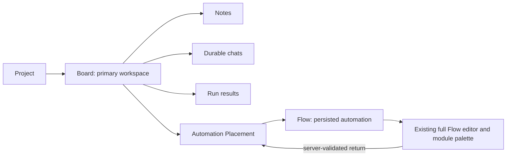

# Unified Board Workspace and Version Convergence Implementation Plan

> **For agentic workers:** REQUIRED SUB-SKILL: Use superpowers:subagent-driven-development (recommended) or superpowers:executing-plans to implement this plan task-by-task. Steps use checkbox (`- [ ]`) syntax for tracking.

**Goal:** Make Board the single project workspace for boards, automations, notes, chats, and execution; expose the full existing Flow editor from Board without creating a second automation engine; make Board/chat features visible in the supported default launch; and replace the current version/startup ambiguity with executable contracts.

**Architecture:** Keep `Flow` as the persisted automation graph and `Placement(target_kind="automation", target_id=flow.id)` as its Board binding. Board becomes the product-level composition surface and the only primary project navigation entry; the existing `/flow/:id` page remains the full module editor and returns to its originating Board/Placement through the already implemented, server-validated return contract. New Board, automation, and Board-chat compound commands are transactional and idempotent. Version consistency is defined as a version-family relation rather than literal equality, and one canonical launch profile proves the effective runtime version, flags, migrations, and three local services.

**Tech Stack:** Python 3.10+, FastAPI, SQLModel/SQLAlchemy, Alembic, Pydantic, React 19, TypeScript, TanStack Query v5, React Router, Radix UI, `@xyflow/react`, Lucide/`ForwardedIconComponent`, Jest/Testing Library, Playwright, Biome, `uv`, Make, Graphify, Chrome, Computer Use.

## Global Constraints

- Execute in `/Volumes/Projects/ketos_canvas_mod_main`; the planning baseline is branch `main`, SHA `4c98c0beffac69e1864b1e2651df55b1ee1319a3`.
- Transition admission is governed by the explicit user management decision,
  reaffirmed on `2026-07-26` with repository HEAD
  `0437da66c6934297ccf464337d2a86921d398c6f` observed before this
  documentation update. All stages preceding this plan are closed for
  transition purposes with status `ACCEPTED FOR TRANSITION`. The original
  planning baseline remains
  `4c98c0beffac69e1864b1e2651df55b1ee1319a3`. No Stage 09/10 exact-SHA PASS,
  seal, receipt, or rerun is a prerequisite for this plan.
- The accepted transition does not rewrite historical evidence or convert an
  incomplete predecessor check into technical PASS. The retained debt includes
  the unsealed Stage 10 candidate at
  `3fe64f4e873fec191602a07e7ab594a5abb8afda`, raw `backend-package` and
  `frontend-full` failures, incomplete monitor tails, and the absent final
  receipt for that candidate.
- Preserve the user-owned untracked `outputs/` directory and all unrelated dirty state.
- Only the main agent may inspect, edit, run tools, run tests, or use browsers. Subagents receive self-contained packets and return text or diffs only.
- Use `uv run` for every Python command.
- Do not rename persisted component class names, Flow node identifiers, `Flow` database tables, existing Flow IDs, or KFX extension identifiers.
- Do not create an `Automation` database entity or a second graph editor/runtime. In this codebase, a persisted automation remains a `Flow`.
- Do not duplicate the Flow palette or Flow store inside Board cards. Feature parity is provided by a Board-context transition into the existing `FlowPage`.
- Keep `/flow/:id` as the canonical editor route. Preserve existing Flow APIs and legacy deep links for at least one compatibility release.
- Keep the existing `POST /api/v1/projects/{project_id}/boards` contract working; the new wizard uses an additive compound endpoint.
- New authorization failures must preserve the repository’s non-enumerating behavior: an inaccessible project, Board, Flow, chat, or template is reported as not found.
- Do not modify lock files, generated artifacts, deployment configuration, `LICENSE`, or `NOTICE` except during a separately authorized release/version-bump operation.
- Use the current icon system. No handwritten SVG, emoji, CSS art, or placeholder icon is permitted.
- Every implementation task follows RED → GREEN → focused verification → package gate.
- A gate is `PASS` only on the exact candidate SHA with exit code `0`. A reproducible product defect is `FAIL`. A missing external prerequisite is `BLOCKED` with the exact blocker and minimal unblock.

---

## Transition decision

| Field | Value |
| --- | --- |
| Effective decision date | `2026-07-26` |
| Original planning SHA | `4c98c0beffac69e1864b1e2651df55b1ee1319a3` |
| Repository HEAD observed before this update | `0437da66c6934297ccf464337d2a86921d398c6f` |
| Authority | Explicit user management decision |
| Status | `ACCEPTED FOR TRANSITION` |
| Scope | Every stage preceding this plan |
| Technical evidence effect | None; raw evidence and prior verdicts remain unchanged |
| Historical debt | Stage 10 full backend/frontend gates and final immutable seal/receipt remain incomplete |

This decision removes the predecessor admission stop-gate only. Exact-SHA
PASS remains mandatory for Block A and every later gate created by this plan.

---

## Baseline and confirmed problem statement (pre-Block-A)

### Repository/runtime truth at planning admission

- Product, KFX, and frontend are `1.10.2`.
- `ketos-base` is `0.10.2` by intentional `X.Y.Z → 0.Y.Z` policy in `Makefile:558-627`.
- `src/copilot-runtime/package.json` is intentionally private at `0.0.0-private`.
- Alembic has one head: `s08c0mmand01`.
- The current code launches successfully with backend `7860`, frontend `3000`, and copilot runtime `8788`.
- `/api/v1/version` reports Ketos `1.10.2`.
- The backend refuses to start when `LANGGRAPH_STRICT_MSGPACK=true` is absent in the verified local profile.

### Confirmed feature-visibility gap at admission (closed by A2)

- Before Block A,
  `src/kfx/src/kfx/services/settings/feature_flags.py` defaulted
  `mvp_workspace` and `mvp_chat` to `False`.
- Before Block A,
  `src/backend/base/ketos/api/v1/schemas/__init__.py` exposed the same false
  browser defaults.
- `ProjectPage`, `CollectionPage`, and `BoardPage` continue to hide or redirect
  Board/chat UI when the retained kill switches are explicitly false.
- A launch with `KETOS_FEATURE_MVP_WORKSPACE=true` and `KETOS_FEATURE_MVP_CHAT=true` exposes the already present Board/chat code.
- `agentic_experience` remains a separate gate for Board automation execution.

### Confirmed UI gap from current-run Chrome inspection

- `/flows` still presents “Сценарии” and “Новый сценарий”.
- `/project/:projectId/boards` still presents parallel “Доски / Сценарии” navigation.
- Board creation is a plain title field; submit is disabled when empty and enabled after a non-empty title.
- “Базы знаний” and “Мои файлы” remain separate sidebar footer buttons.
- The account menu currently contains Settings, Theme, Documentation, version, and Logout, but not Knowledge Bases/My Files.
- `CanvasControls` currently contains Ketos Assistant, zoom controls, Add note, Help, and inspection; the annotated chat-create button is absent.
- No Board creation was submitted during planning, so the exact production mutation failure is not claimed as reproduced. The implementation begins by converting that unknown into an executable API/UI reproduction before changing behavior.

### Target relationship



### Product terminology

- Primary user terms: **Project**, **Board / Доска**, **Automation / Автоматизация**, **Chat / Чат**.
- The primary UI must not use “Scenario / Сценарий” for creation, navigation, or Board content.
- Internal code may retain `Flow`, existing Flow routes, database names, type names, and compatibility translation keys.

---

# Block A — Versioning and predictable current-feature launch

## Goal

Define an executable version-family contract and make the supported default development launch start the current Board/chat/automation experience without requiring undocumented environment variables.

## Files and modules

**Create**

- `config/current-experience.toml`
- `scripts/ci/version_contract.py`
- `scripts/ci/current_experience.py`
- `scripts/ci/test_version_contract.py`
- `scripts/ci/test_current_experience.py`

**Modify**

- `pyproject.toml`
- `Makefile`
- `src/kfx/src/kfx/services/settings/feature_flags.py`
- `src/kfx/tests/unit/services/settings/test_feature_flags_brand_env.py`
- `src/backend/base/ketos/api/v1/schemas/__init__.py`
- `src/backend/tests/unit/api/v1/test_endpoints.py`

**Read/verify without changing**

- `src/kfx/pyproject.toml`
- `src/backend/base/pyproject.toml`
- `src/frontend/package.json`
- `src/copilot-runtime/package.json`
- `src/bundles/*/pyproject.toml`
- `uv.lock`
- `src/frontend/package-lock.json`

## Task A1 — Encode the version-family relation

**Contract**

- `pyproject.toml` is the canonical product version `X.Y.Z`.
- `src/kfx/pyproject.toml` and `src/frontend/package.json` equal `X.Y.Z`.
- `src/backend/base/pyproject.toml` equals `0.Y.Z`.
- `src/copilot-runtime/package.json` is an explicitly excluded private member and remains `0.0.0-private`.
- Existing KFX pins in official bundles remain governed by the current release scripts.

- [x] Add `[tool.ketos.version-family]` to `pyproject.toml` with exact member paths, mapping kind, and explicit private exclusions.
- [x] Write RED tests in `scripts/ci/test_version_contract.py` for:
  - current `1.10.2 / 0.10.2` family;
  - one product-member drift;
  - one backend mapping drift;
  - malformed semver;
  - a missing member;
  - a private member accidentally changed from `0.0.0-private`.
- [x] Implement `uv run python scripts/ci/version_contract.py check`.
- [x] Require diagnostics to print the file, actual version, expected version, and violated relation.
- [x] Add a fixture-only `bump` test proving `1.10.2 → 1.10.3` maps backend `0.10.2 → 0.10.3` and changes only declared version-owned files.
- [x] Replace raw `python -c` mutation inside `make patch` with `uv run python scripts/ci/version_contract.py bump --version "$(v)"`.
- [x] Preserve existing bundle-pin and lock regeneration only inside the explicit `make patch` workflow.
- [x] Remove the current “at least six changed files” heuristic and verify exact expected paths instead.

**Focused verification**

```bash
uv run pytest scripts/ci/test_version_contract.py -q
uv run python scripts/ci/version_contract.py check
```

Expected: all tests pass; current output identifies product/KFX/frontend `1.10.2`, backend `0.10.2`, and copilot runtime as an accepted private exclusion.

## Task A2 — Promote workspace/chat to the current product default

The end state must not require hidden opt-in flags to see recently implemented Board/chat features. The flags remain kill switches: explicit environment values of `false` still disable them.

- [x] Change the RED expectation in `src/kfx/tests/unit/services/settings/test_feature_flags_brand_env.py` from “default off” to “current defaults on”.
- [x] Set `mvp_workspace=True` and `mvp_chat=True` in `src/kfx/src/kfx/services/settings/feature_flags.py`.
- [x] Set the matching `FrontendFeatureFlags` defaults to `True` in `src/backend/base/ketos/api/v1/schemas/__init__.py`.
- [x] Update `src/backend/tests/unit/api/v1/test_endpoints.py` to prove the public config defaults and explicit `KETOS_FEATURE_MVP_WORKSPACE=false` / `KETOS_FEATURE_MVP_CHAT=false` overrides.
- [x] Keep `agentic_experience` independently configurable; the canonical current profile enables it, while a deployment can explicitly disable it.

**Focused verification**

```bash
uv run pytest \
  src/kfx/tests/unit/services/settings/test_feature_flags_brand_env.py \
  src/backend/tests/unit/api/v1/test_endpoints.py \
  -q
```

Expected: default browser config has workspace/chat `true`; explicit false overrides remain `false`.

## Task A3 — Add one canonical current-experience profile

`config/current-experience.toml` records:

- `KFX_DEV=1`;
- `KETOS_FEATURE_MVP_WORKSPACE=true`;
- `KETOS_FEATURE_MVP_CHAT=true`;
- `KETOS_AGENTIC_EXPERIENCE=true`;
- `LANGGRAPH_STRICT_MSGPACK=true`;
- backend `7860`, frontend `3000`, copilot runtime `8788`;
- expected product version relation;
- expected `/api/v1/config` flags and `/api/v1/version`;
- repository-relative Alembic working directory `src/backend/base/ketos`.

- [x] Write RED tests in `scripts/ci/test_current_experience.py` for:
  - occupied port;
  - zero or multiple Alembic heads;
  - database current revision behind the sole head;
  - missing strict-msgpack value;
  - runtime version mismatch;
  - workspace/chat/agentic config mismatch;
  - unavailable backend/frontend/copilot service.
- [x] Implement `current_experience.py preflight` as a read-only check of the version family, sole Alembic head/current revision, required environment, and ports.
- [x] Resolve Alembic `current` against the same database URL and environment file that the backend process will use; a check against an unrelated default SQLite file is invalid.
- [x] Implement `current_experience.py run` as the owner of one backend/frontend/copilot process group, with readiness waits, signal forwarding, and bounded child cleanup on Ctrl+C.
- [x] Implement `current_experience.py proof` to check `/health_check`, `/api/v1/version`, `/api/v1/config`, frontend HTTP readiness, and copilot runtime readiness.
- [x] Add Make targets:
  - `version-check`;
  - `current-preflight`;
  - `run-current`;
  - `current-proof`;
  - `run-legacy` for the explicitly disabled compatibility profile.
- [x] Make `run_cli` delegate to `run-current` so the documented/default command starts the latest experience.
- [x] Keep `backend` as a low-level service target, but print the exact canonical target when it detects missing current-profile values.
- [x] Ensure `run-current` never rewrites `.env`, lock files, generated files, the database revision, or `outputs/`.

**Focused verification**

```bash
uv run pytest scripts/ci/test_current_experience.py -q
make version-check
make current-preflight
make run-current
```

From a second terminal:

```bash
make current-proof
```

Expected: one exact PASS report with SHA, product version, version-family members, Alembic head/current, three runtime ports, and effective workspace/chat/agentic/strict-msgpack values.

## Block A readiness criteria

- `make run_cli` and `make run-current` expose Board/chat features without undocumented manual exports.
- Explicit false environment overrides still provide an emergency kill switch.
- Current-profile startup fails before serving traffic when version relation, migrations, strict msgpack, or ports are invalid.
- `/api/v1/version` and `/api/v1/config` are checked after startup rather than inferred from files.
- Product/KFX/frontend/backend/private-runtime versions are evaluated by relation, not forced to one literal number.
- `make patch` changes only version-owned files and ends by running `version-check`.
- A normal launch leaves Git status unchanged except for pre-existing user-owned paths.

## Block A execution record — 2026-07-25

- Implementation status: `EXACT-SHA PASS`.
- Candidate SHA: `ef9bfaf9254d8f19b16336efcdef9e67d7ab720a`.
- `33 passed` for the version-contract and current-experience suites.
- After audit fixes, the combined version/current-experience/bundle-sync suite
  passed `54` tests.
- `37 passed` for the full backend config endpoint file plus the MCP logging
  regression.
- `15 passed` for the isolated KFX feature-flag suite.
- `make version-check`, `make current-preflight`, live `make run-current`, and
  second-terminal `make current-proof` all returned their expected PASS
  evidence.
- Ctrl+C performed bounded shutdown and released ports `7860`, `3000`, and
  `8788`.
- Independent A1 audit found and closed two release-gate gaps: bundle changes
  are now planned read-only and constrained by a static allowlist, while the
  complete untracked path set must remain unchanged.
- Chrome confirmed the default Boards route and Board empty state without
  console errors; it did not create or mutate product data.
- The first committed candidate exposed a cold-start timeout and failed closed.
  After a RED regression and a 180-second backend startup budget, candidate
  `ef9bfaf9254d8f19b16336efcdef9e67d7ab720a` repeated all Block A gates,
  live proof, and cleanup successfully. Block B is admitted from this SHA.

---

# Block B — Board and automation unification

## Goal

Make Board the single project workspace while retaining Flow as the canonical automation data model, editor, module palette, and runtime.

## Files and modules

**Create**

- `src/backend/base/ketos/api/v1/schemas/board_commands.py`
- `src/backend/base/ketos/services/board/automation_starter_service.py`
- `src/backend/base/ketos/services/board/command_service.py`
- `src/backend/base/ketos/services/database/models/board_command_receipt/__init__.py`
- `src/backend/base/ketos/services/database/models/board_command_receipt/model.py`
- `src/backend/base/ketos/alembic/versions/ubw01cmdrec_add_board_command_receipt.py`
- `src/backend/tests/unit/api/v1/test_board_commands.py`
- `src/backend/tests/unit/services/board/test_board_creation_transaction.py`
- `src/backend/tests/unit/services/board/test_automation_starter_service.py`
- `src/frontend/src/types/board-command/index.ts`
- `src/frontend/src/controllers/API/queries/boards/use-bootstrap-board.ts`
- `src/frontend/src/controllers/API/queries/boards/use-create-board-automation.ts`
- `src/frontend/src/components/core/boards/AutomationInventoryPanel.tsx`
- `src/frontend/src/components/core/boards/LegacyFlowsRedirect.tsx`

**Modify**

- `src/backend/base/ketos/api/v1/boards.py`
- `src/backend/base/ketos/api/router.py`
- `src/backend/base/ketos/api/v1/flows_helpers.py`
- `src/backend/base/ketos/services/board/service.py`
- `src/backend/base/ketos/services/board/placement_service.py`
- `src/backend/base/ketos/services/database/models/__init__.py`
- `src/backend/base/ketos/alembic/env.py`
- `src/backend/tests/unit/api/v1/test_boards.py`
- `src/backend/tests/unit/api/v1/test_placements.py`
- `src/backend/tests/unit/services/board/test_service.py`
- `src/backend/tests/unit/services/board/test_automation_placement.py`
- `src/frontend/src/controllers/API/queries/boards/index.ts`
- `src/frontend/src/pages/BoardsPage/index.tsx`
- `src/frontend/src/pages/BoardPage/index.tsx`
- `src/frontend/src/pages/BoardPage/hooks/use-automation-placement-actions.ts`
- `src/frontend/src/components/core/automations/AutomationSelector.tsx`
- `src/frontend/src/routes.tsx`
- `src/frontend/src/pages/ProjectPage/index.tsx`
- `src/frontend/src/pages/MainPage/pages/main-page.tsx`

## Task B1 — Freeze the domain and route contracts

- [x] Add unit assertions that persisted automations remain `Flow` records and Board bindings remain automation Placements.
- [x] Keep `buildAutomationEditorUrl(flowId, { boardId, placementId })` as the only frontend editor URL builder.
- [x] Preserve the server-validated editor context:

```text
/flow/{flowId}?returnBoardId={boardId}&returnPlacementId={placementId}
→ GET /api/v1/boards/{boardId}/placements/{placementId}/automation-editor-context?flow_id={flowId}
→ /project/{projectId}/board/{boardId}?focusPlacementId={placementId}
```

- [x] Add a route contract test proving a Flow editor reload still recovers the return URL from server data, not transient navigation state.
- [x] Prohibit direct Board imports of FlowPage, `flowStore`, or a second ReactFlow graph state.

**Focused verification**

```bash
cd src/frontend
npx jest \
  src/pages/BoardPage/hooks/__tests__/use-open-automation-editor.test.tsx \
  src/pages/FlowPage/hooks/__tests__/use-board-return-context.test.tsx \
  src/pages/FlowPage/__tests__/FlowPage-board-return.test.tsx \
  --runInBand
```

Expected: exact editor and return URLs pass for valid context; mismatched Board/Placement/Flow context fails closed.

## Task B2 — Add atomic, idempotent Board bootstrap

Keep the old simple endpoint. Add:

```http
POST /api/v1/projects/{project_id}/boards/bootstrap
Idempotency-Key: <UUID>
```

Request:

```json
{
  "title": "Research Board",
  "starter": {
    "kind": "clean"
  }
}
```

Discriminated starter kinds:

- `{"kind":"clean"}` — Board only, no Flow, chat, note, or Placement.
- `{"kind":"blank_automation","name":"New automation"}` — Board + empty Flow + Placement.
- `{"kind":"simple_agent","name":"Simple Agent"}` — Board + cloned canonical starter Flow + Placement.
- `{"kind":"vector_store_rag","name":"Vector Store RAG"}` — Board + cloned canonical starter Flow + Placement.
- `{"kind":"template","template_id":"<UUID>","name":"..."}` — Board + authorized template clone + Placement.

Response:

```json
{
  "board": {},
  "automation": null,
  "placement": null,
  "idempotency_replayed": false
}
```

For non-clean starters, `automation` and `placement` are populated.

- [x] Write RED schema/API tests for all starter variants, extra fields, empty names, invalid template IDs, inaccessible projects/templates, and stable error codes.
- [x] Add `BoardCommandReceipt` with unique `(principal_id, operation, idempotency_key)` and canonical request hash.
- [x] Add the exact additive Alembic revision `ubw01cmdrec` down-revisioned from `s08c0mmand01`.
- [x] Write RED fault-injection tests for failures after Board flush, Flow flush, starter clone, Placement creation, and receipt update.
- [x] Reuse the flush-only `_new_flow` behavior from `flows_helpers.py`; separate or compensate filesystem persistence so a database rollback cannot leave an externally persisted orphan.
- [x] Refactor `create_board` into a flush-only primitive plus the existing commit-owning wrapper, preserving the legacy endpoint.
- [x] Implement one `AsyncSession.begin()` command:
  1. validate actor/project/template before the first write;
  2. reserve receipt;
  3. create Board;
  4. optionally create/clone Flow in the same project;
  5. optionally create Placement;
  6. store result IDs in receipt;
  7. commit once.
- [x] Return the same IDs for same-key/same-payload replay.
- [x] Return `409` for same-key/different-payload replay.
- [x] Resolve concurrent same-key requests through the unique constraint and receipt reread, never through check-then-insert.
- [x] Return not found for missing or inaccessible resources; never reveal cross-project ownership.

**Focused verification**

```bash
uv run pytest \
  src/backend/tests/unit/api/v1/test_board_commands.py \
  src/backend/tests/unit/api/v1/test_boards.py \
  src/backend/tests/unit/services/board/test_board_creation_transaction.py \
  src/backend/tests/unit/services/board/test_automation_starter_service.py \
  -q
```

Expected: every injected failure leaves zero new Board/Flow/Placement/receipt rows; replay returns the original IDs; concurrent submit creates one compound result.

## Task B3 — Add atomic automation creation inside an existing Board

Add:

```http
POST /api/v1/boards/{board_id}/automations
Idempotency-Key: <UUID>
```

Request reuses the non-clean starter union. Response contains `automation`, `placement`, and `idempotency_replayed`.

- [x] Write RED tests for blank, Simple Agent, RAG, arbitrary authorized template, project mismatch, duplicate Placement, replay, and concurrency.
- [x] Validate Board ownership first and derive project ID from the Board on the server; do not trust a client project ID.
- [x] Clone starter data; never mutate the shared starter Flow.
- [x] Replace the frontend `useAddFlow` + `usePostPlacement` chain in `use-automation-placement-actions.ts` with one `useCreateBoardAutomation` mutation.
- [x] Invalidate project automation summaries and Board scene queries after success.
- [x] Focus the returned Placement.
- [x] Offer “Create” and “Create and edit”; the latter must use `buildAutomationEditorUrl` with the returned Flow/Placement IDs.

**Focused verification**

```bash
uv run pytest \
  src/backend/tests/unit/api/v1/test_board_commands.py \
  src/backend/tests/unit/services/board/test_automation_starter_service.py \
  src/backend/tests/unit/services/board/test_automation_placement.py \
  -q

cd src/frontend
npx jest \
  src/pages/BoardPage/hooks/__tests__/use-automation-placement-actions.test.tsx \
  src/pages/BoardPage/__tests__/index.test.tsx \
  --runInBand
```

Expected: one Flow and one Placement per command; no client-side partial sequence remains.

## Task B4 — Make Board the primary project surface without losing existing Flows

- [x] Remove the primary “Сценарии” tab from `ProjectPage`; keep Boards as the only project tab.
- [x] Change project selection in `CollectionPage` to the Board route without relying on a disabled-by-default flag.
- [x] Add an automation inventory panel to the Boards route and Board editor:
  - search current project Flows;
  - show placed/unplaced state;
  - add an existing Flow to a selected/current Board;
  - open the same Flow in the existing full editor;
  - never copy a Flow merely to place it.
- [x] Preserve existing unplaced Flows in the inventory. Do not perform a bulk Placement backfill.
- [x] Convert `/flows` and `/all/folder/:folderId` to compatibility bridges:
  - known project → `/project/{projectId}/boards?panel=automations`;
  - no resolved project → project chooser, then Boards with the continuation;
  - no redirect loop;
  - no 404 for existing bookmarks.
- [x] Keep `/flow/:id` unchanged as the canonical editor route.
- [x] Keep legacy Flow APIs and folder metadata.
- [x] Remove “Новый сценарий” from primary CTAs. “Новая доска” opens Board creation; “Новая автоматизация” always requires a Board.

**Focused verification**

```bash
cd src/frontend
npx jest \
  src/__tests__/board-automation-routes.test.tsx \
  src/pages/ProjectPage \
  src/pages/BoardsPage \
  src/components/core/automations/__tests__/AutomationSelector.test.tsx \
  --runInBand
```

Expected: Boards are the primary project route; existing Flows remain discoverable/editable; legacy URLs resolve exactly once.

## Block B readiness criteria

- A clean Board, blank automation Board, Simple Agent Board, RAG Board, and selected-template Board are all creatable.
- Board/Flow/Placement compound creation is atomic, authorized, idempotent, and concurrency-safe.
- The old simple Board POST still works.
- Existing Flow rows, IDs, data JSON, editor URLs, and placements remain valid.
- Every existing project Flow is discoverable in Board automation inventory.
- Any automation can be opened from Board in the complete existing editor and returned to its originating Placement.
- Board automation execution uses the existing `/boards/{board_id}/automations/{flow_id}/runs` contract.
- No second automation model, graph store, editor, or runtime exists.
- Primary navigation and create actions no longer present “Scenarios”.

## Block B execution record — 2026-07-25

- Status: `EXACT-SHA PASS — BLOCK C ADMITTED`.
- Exact product SHA:
  `69e92b8f03b6601e03270622f5c762d1d2f91956`.
- Commits:
  - `99abe550f06c78a38daed40927ac7d52288a7efe` — Board-primary
    automation workspace and atomic command implementation;
  - `69e92b8f03b6601e03270622f5c762d1d2f91956` — isolated
    command-owned API transaction scope.
- Backend Block B matrix: `60 passed`, exit `0`.
- Expanded frontend matrix: `24` suites and `132` tests passed, exit `0`.
- Production TypeScript, changed-Python Ruff, and whole-frontend Biome passed;
  Biome reported only `38` pre-existing warnings outside this block.
- Alembic reported the sole head `ubw01cmdrec`.
- Independent backend and frontend audits found no residual P0/P1/P2.
- A separate independent acceptance audit returned `B PASS — admit C`.
- Live browser, Playwright, accessibility, and legacy migration compatibility
  remain mandatory Block D evidence; this record is not a final PASS for the
  whole plan.
- Dirty state at admission contains only transition/status documentation and
  the preserved user-owned untracked `outputs/`; product source matches the
  exact SHA above.

---

# Block C — UI changes and chat creation

## Goal

Implement the annotated creation controls and onboarding flow using existing design-system components, real icons, deterministic state transitions, and accessible keyboard behavior.

## Files and modules

**Create**

- `src/frontend/src/components/core/boardCreationWizard/board-creation-types.ts`
- `src/frontend/src/components/core/boardCreationWizard/BoardCreationDialog.tsx`
- `src/frontend/src/components/core/boardCreationWizard/BoardTemplatePicker.tsx`
- `src/frontend/src/components/core/boardCreationWizard/BoardTemplateGallery.tsx`
- `src/frontend/src/components/core/boardCreationWizard/__tests__/BoardCreationDialog.test.tsx`
- `src/frontend/src/components/core/boardCreationWizard/__tests__/BoardTemplatePicker.test.tsx`
- `src/frontend/src/components/core/folderSidebarComponent/components/sideBarFolderButtons/components/project-create-menu.tsx`
- `src/frontend/src/components/core/folderSidebarComponent/components/sideBarFolderButtons/components/board-picker-dialog.tsx`
- `src/frontend/src/components/core/folderSidebarComponent/components/sideBarFolderButtons/components/__tests__/project-create-menu.test.tsx`
- `src/frontend/src/components/core/folderSidebarComponent/components/sideBarFolderButtons/components/__tests__/board-picker-dialog.test.tsx`
- `src/frontend/src/components/core/canvasControlsComponent/CanvasCreateChatButton.tsx`
- `src/frontend/src/components/core/canvasControlsComponent/hooks/use-canvas-create-chat.ts`
- `src/frontend/src/components/core/canvasControlsComponent/__tests__/ForwardedIconComponent.icon-contract.test.tsx`
- `src/frontend/src/components/core/canvasControlsComponent/__tests__/CanvasCreateChatButton.test.tsx`
- `src/frontend/src/pages/BoardPage/hooks/use-create-board-chat.ts`
- `src/frontend/src/pages/BoardPage/hooks/__tests__/use-create-board-chat.test.tsx`
- `src/backend/base/ketos/services/board/chat_command_service.py`
- `src/backend/tests/unit/services/board/test_chat_command_service.py`

**Modify**

- `src/frontend/src/pages/BoardsPage/index.tsx`
- `src/frontend/src/pages/BoardsPage/__tests__/index.test.tsx`
- `src/frontend/src/pages/BoardPage/index.tsx`
- `src/frontend/src/pages/BoardPage/__tests__/index.test.tsx`
- `src/frontend/src/components/core/flowBuilderWelcome/flow-builder-welcome.tsx`
- `src/frontend/src/components/core/flowBuilderWelcome/helpers/find-starter-template.ts`
- `src/frontend/src/components/core/canvasControlsComponent/CanvasControls.tsx`
- `src/frontend/src/components/core/canvasControlsComponent/__tests__/CanvasControls.test.tsx`
- `src/frontend/src/pages/FlowPage/hooks/use-board-return-context.ts`
- `src/frontend/src/pages/FlowPage/hooks/__tests__/use-board-return-context.test.tsx`
- `src/frontend/src/components/core/chats/ChatList.tsx`
- `src/frontend/src/pages/BoardPage/hooks/use-chat-placement-actions.ts`
- `src/frontend/src/components/core/folderSidebarComponent/components/sideBarFolderButtons/index.tsx`
- `src/frontend/src/components/core/sidebarAccountComponent/index.tsx`
- `src/frontend/src/components/core/sidebarAccountComponent/__tests__/sidebar-account.test.tsx`
- `src/frontend/src/locales/en.json`
- `src/frontend/src/locales/ru.json`
- `src/frontend/src/__tests__/locale-contract.test.ts`
- `src/backend/base/ketos/api/v1/chat_threads.py`
- `src/backend/tests/unit/api/v1/test_chat_threads.py`

## Task C1 — Replace the plain Board form with one reusable creation wizard

The wizard is opened from the Boards page CTA, Boards empty state, and per-project plus menu.

First view:

1. Board name.
2. **Clean Board** — selected by default.
3. **Simple Agent**.
4. **Vector Store RAG**.
5. **Browse more**.

`Browse more` is navigation into a gallery, not a template ID. Selecting a template returns to the form with the chosen ID.

- [x] Extract a shared visual starter-tile primitive from `flowBuilderWelcome`; do not rename the Flow welcome overlay into a Board component.
- [x] Write RED tests for required trimmed name, default clean selection, four visible options, gallery loading/error/retry, selected template, double submit, retry, cancel, and success.
- [x] Implement `BoardCreationDialog` with a radio group for starter selection and a distinct Browse-more button.
- [x] Generate one `crypto.randomUUID()` idempotency key per explicit submit attempt; a transport retry of that attempt reuses the same key.
- [x] Keep form data and selected starter after a recoverable error.
- [x] On success, navigate to `/project/{projectId}/board/{boardId}` and append `focusPlacementId` only when the response includes a Placement.
- [x] If the wizard is continuing “create automation”, open the new Board’s automation picker after navigation.
- [x] Remove the plain title/create form after all wizard entry points use the compound endpoint.

**State machine**

```text
closed → editing → validating → creating → success
                  ↘ invalid
creating → error → retry
editing → gallery-loading → gallery-ready → template-selected
                         ↘ gallery-error → retry
```

**Required test IDs**

- `board-create-dialog`
- `board-name-input`
- `board-template-clean`
- `board-template-simple-agent`
- `board-template-vector-store-rag`
- `board-template-browse-more`
- `board-create-submit`

**Accessibility**

- Dialog focus trap; initial focus on Board name.
- Escape closes only when no mutation is in flight.
- Starter choices use a radio group.
- Errors use `role="alert"`; mutation progress uses `aria-live="polite"`.
- At 320px the cards are one column; at 768px and above they may use two columns.

**Focused verification**

```bash
cd src/frontend
npx jest \
  src/components/core/boardCreationWizard \
  src/pages/BoardsPage/__tests__/index.test.tsx \
  --runInBand
```

Expected: clean, Simple Agent, RAG, and Browse-more template payloads exactly match the backend discriminated union.

## Task C2 — Add the per-project plus menu

- [x] Add a real `Plus` icon trigger to every project row, immediately before the existing `...` options.
- [x] Use the existing Radix dropdown/menu primitives.
- [x] Prevent trigger clicks, Enter, and Space from selecting or navigating the project row.
- [x] Menu items:
  - “Создать новую доску” → open Board wizard with that exact project ID;
  - “Создать новую автоматизацию” → open Board picker for that project.
- [x] Board picker states:
  - loading skeleton;
  - error + Retry;
  - existing Boards;
  - no Boards + “Создать доску” continuation.
- [x] After choosing a Board, navigate with a one-shot `open-add-automation` intent; Board consumes it, opens the existing automation selector, then removes the intent with `replace`.
- [x] Do not retain stale selected project ID when a second project menu opens.
- [x] Hide create actions when the current capability contract denies creation.

**Required labels/test IDs**

- `aria-label="Create in {projectName}"`
- `project-create-menu-trigger-{projectId}`
- `project-create-board-item-{projectId}`
- `project-create-automation-item-{projectId}`
- `board-picker-dialog`

**Responsive**

- Project name has `min-width: 0` and ellipsis.
- Plus and `...` never shrink.
- Mobile hit area is at least 40×40px.
- Collapsed sidebar exposes actions only after the drawer/sidebar is opened.

**Focused verification**

```bash
cd src/frontend
npx jest \
  src/components/core/folderSidebarComponent/components/sideBarFolderButtons/components/__tests__/project-create-menu.test.tsx \
  src/components/core/folderSidebarComponent/components/sideBarFolderButtons/components/__tests__/board-picker-dialog.test.tsx \
  src/components/core/folderSidebarComponent/components/sideBarFolderButtons/components/__tests__/project-shell-navigation.test.tsx \
  --runInBand
```

Expected: each action is scoped to the triggering project and keyboard focus returns to that project’s plus trigger.

## Task C3 — Move Knowledge Bases and My Files into the account menu

- [x] Add Knowledge Bases and My Files immediately after Settings in `sidebarAccountComponent/index.tsx`.
- [x] Preserve existing routes and conditions:
  - Knowledge Bases only when `ENABLE_FILE_MANAGEMENT && ENABLE_KNOWLEDGE_BASES`;
  - My Files only when `ENABLE_FILE_MANAGEMENT`.
- [x] Reuse real `Library` and `File` icons.
- [x] Remove the duplicate footer buttons from `sideBarFolderButtons/index.tsx`.
- [x] Add menu max-height, viewport-bounded scrolling, and the existing focus-return behavior.
- [x] Prove each resource action exists exactly once in the sidebar DOM.

**Required test IDs**

- `account-menu-knowledge-bases`
- `account-menu-my-files`

**Focused verification**

```bash
cd src/frontend
npx jest \
  src/components/core/sidebarAccountComponent/__tests__/sidebar-account.test.tsx \
  src/components/core/folderSidebarComponent \
  --runInBand
```

Expected: feature flags control menu-item presence; the old footer copies are absent.

## Task C4 — Add atomic Board chat creation and a Board header button

Add:

```http
POST /api/v1/boards/{board_id}/chats
Idempotency-Key: <UUID>
```

The server derives project/actor from Board, creates `ChatThread + Placement` in one transaction, and returns both.

- [x] Write RED service/API tests for provider/model payload validation, authorization, placement geometry, same-key replay, different-payload conflict, and rollback after chat or Placement failure.
- [x] Reuse `BoardCommandReceipt` with operation `create_board_chat`.
- [x] Implement `use-create-board-chat.ts` as the only Board chat-create mutation.
- [x] Refactor `ChatList` so its Create action and the new Board header icon call the same hook.
- [x] Add a `MessageSquarePlus` icon-only Board header button next to Add note/Add automation.
- [x] Use the existing non-colliding placement algorithm and focus the returned Placement.
- [x] If no enabled model provider exists, open the existing provider-configuration path and send no create request.
- [x] Block repeat clicks while pending; preserve a safe retry.

**Focused verification**

```bash
uv run pytest \
  src/backend/tests/unit/api/v1/test_chat_threads.py \
  src/backend/tests/unit/services/board/test_chat_command_service.py \
  -q

cd src/frontend
npx jest \
  src/components/core/chats/__tests__/ChatList.test.tsx \
  src/pages/BoardPage/hooks/__tests__/use-create-board-chat.test.tsx \
  src/pages/BoardPage/__tests__/index.test.tsx \
  --runInBand
```

Expected: a failed Placement leaves no chat; both Board entry points create/focus one durable chat Placement.

## Task C5 — Add the annotated Flow-canvas chat button

Place the button in `CanvasControls` immediately after Ketos Assistant and before the zoom dropdown.

- [x] Write a RED icon contract proving `ForwardedIconComponent name="MessageSquarePlus"` resolves to the existing icon library without fallback or console error.
- [x] Add `CanvasCreateChatButton` with:
  - `data-testid="canvas-create-chat-button"`;
  - accessible label “Create chat”;
  - Board-context label “Create chat in Board”;
  - `aria-busy` while creating;
  - tooltip as supplemental text only.
- [x] Standalone Flow behavior: open/create the existing Playground session scoped to the current Flow; do not call Board chat APIs.
- [x] Board-context behavior:
  1. extend `use-board-return-context.ts` to expose the validated `project_id`, `board_id`, `placement_id`, and `flow_id` alongside `returnUrl`;
  2. require that complete server-validated Board return context;
  3. call the atomic Board chat command for that Board;
  4. navigate to the canonical Board return URL with the returned chat Placement focused.
- [x] Never downgrade an invalid/expired Board context into standalone behavior. Show a bounded “Reopen this automation from its Board” error.
- [x] With workspace/chat disabled, keep the button discoverable but disabled with `aria-describedby`.
- [x] With no enabled model provider, open provider configuration without issuing a create request.
- [x] Prevent duplicate requests and reuse the same idempotency key for Retry.

**Focused verification**

```bash
cd src/frontend
npx jest \
  src/components/core/canvasControlsComponent/__tests__/CanvasCreateChatButton.test.tsx \
  src/components/core/canvasControlsComponent/__tests__/CanvasControls.test.tsx \
  src/pages/FlowPage/hooks/__tests__/use-board-return-context.test.tsx \
  --runInBand
```

Expected: standalone and Board-context branches call different, correct chat paths; invalid Board context fails closed.

## Task C6 — Complete terminology and localization

- [x] Add en/ru keys for:
  - Board wizard titles, choices, validation, loading, retry, and failure;
  - per-project create menu and Board picker;
  - Board/Flow chat creation, provider-required, disabled, invalid-context, loading, and retry;
  - account Knowledge Bases/My Files;
  - automation inventory, placed/unplaced status, create, place, edit, and return.
- [x] Reuse existing `boards.*`, `board.*`, `chat.*`, and `account.*` namespaces where a semantic key already exists.
- [x] Remove “Сценарии / Scenario(s)” from primary navigation and create actions.
- [x] Retain legacy translation keys required by compatibility routes; do not delete them merely to satisfy a string scan.
- [x] Add locale contract assertions for all new visible keys and hardcoded-string protection.

**Focused verification**

```bash
cd src/frontend
npm run test:i18n
```

Expected: en/ru catalogs are complete; new UI has no untranslated or hardcoded visible strings.

## Block C readiness criteria

- The annotated Flow control bar has a real, functional `MessageSquarePlus` chat button.
- Board has an equivalent direct create-chat action.
- Standalone Flow chat and Board durable chat have explicit, non-overlapping semantics.
- Board chat creation is atomic with Placement creation and leaves no orphan.
- Each project row has a plus menu with the two requested actions.
- Creating an automation from the project sidebar always selects or creates a Board.
- Knowledge Bases and My Files appear only in the account dropdown and respect existing flags.
- The Board wizard supports Clean Board, Simple Agent, Vector Store RAG, and Browse more.
- All new controls are keyboard-operable, labelled, focus-safe, and usable at 320px, 768px, 1440px, 200% zoom.
- Primary en/ru UI no longer calls automations “Scenarios”.

## Block C execution record — 2026-07-25

- Status: `EXACT-SHA PASS — BLOCK D ADMITTED`.
- Exact product SHA:
  `cc685550f00ec6dbeb258da0a43864993182e677`.
- Backend starter/chat/API repeat: `31 passed`, exit `0`.
- Frontend exact-SHA repeat: `13` suites and `93` tests passed; the expanded
  pre-seal matrix on identical product content passed `14` suites and `100`
  tests.
- i18n passed `44` Node tests and `72` Jest tests.
- Production TypeScript, changed-file Biome, Ruff, and Ruff format checks
  passed.
- Three independent repeat audits covering C1–C3, canvas/frontend chat, and
  backend chat commands found no P0/P1/P2.
- Graphify read-only traversal confirmed the retained
  Board/Placement/Flow/editor-return graph boundary. Generated Graphify
  artifacts were not rebuilt.
- Browser/Playwright layout and focus, legacy migration compatibility, full
  package gates, live launch proof, and rollout/rollback remain explicitly
  owned by Block D.

---

# Block D — Testing, migration, browser acceptance, and rollout

## Goal

Prove the new workspace end to end on one exact SHA, retain legacy data/routes, and provide a reversible rollout without treating the current planning smoke as implementation evidence.

## Files and modules

**Create**

- `src/frontend/tests/core/features/board-creation-wizard.spec.ts`
- `src/frontend/tests/core/features/board-project-navigation.spec.ts`
- `src/frontend/tests/core/features/board-accessibility.spec.ts`
- `src/frontend/tests/core/features/board-automation-workspace.spec.ts`

**Modify**

- `src/backend/tests/unit/alembic/test_mvp_board_migration.py`
- `src/backend/tests/unit/alembic/test_mvp_chat_migration.py`
- `src/backend/tests/unit/alembic/test_mvp_placement_board_note_migration.py`
- `src/frontend/tests/core/features/board-automation-editor.spec.ts`
- `src/frontend/tests/core/features/board-automation-run.spec.ts`
- `src/frontend/tests/core/features/board-note-placement.spec.ts`
- `src/frontend/tests/core/features/board-viewport.spec.ts`
- `src/frontend/tests/core/integrations/board-copilot-chat.spec.ts`

## Task D1 — Backend/API/service matrix

- [x] Use fixed UUIDs and isolated projects/users for owner, editor, and non-member cases.
- [x] Test clean Board, all starter kinds, arbitrary template, existing Flow placement, and chat creation.
- [x] Test cross-project and cross-user denial before any write.
- [x] Inject failures at each compound-write stage and assert zero orphan rows.
- [x] Test same-key replay, same-key/different-payload conflict, and concurrent requests.
- [x] Test Board run authorization and idempotency through the existing execution endpoint.
- [x] Test kill-switch-off behavior: new entry points hide/fail closed while existing Board/Flow data remains readable.

**Focused backend gate**

```bash
uv run pytest \
  src/backend/tests/unit/api/v1/test_boards.py \
  src/backend/tests/unit/api/v1/test_board_commands.py \
  src/backend/tests/unit/api/v1/test_placements.py \
  src/backend/tests/unit/api/v1/test_chat_threads.py \
  src/backend/tests/unit/api/v1/test_board_automation_runs.py \
  src/backend/tests/unit/services/board/test_service.py \
  src/backend/tests/unit/services/board/test_board_creation_transaction.py \
  src/backend/tests/unit/services/board/test_automation_starter_service.py \
  src/backend/tests/unit/services/board/test_automation_placement.py \
  src/backend/tests/unit/services/board/test_chat_command_service.py \
  -q
```

Expected: exit `0`, no unexpected skips/xfails, and every negative case asserts database state after failure.

## Task D2 — Additive migration and compatibility proof

The only new schema is `BoardCommandReceipt`; Board, Placement, Flow, chat, note, and run tables are not renamed or destructively rewritten.

- [x] Test a fresh database upgrade to the new sole head.
- [x] Test an upgrade from `s08c0mmand01` with:
  - existing Flows and no Boards;
  - existing Boards and automation Placements;
  - existing durable chats and results;
  - mixed projects/users.
- [x] Prove the receipt unique constraint and indexes.
- [x] Prove legacy Flow/Board/chat/run/note records remain readable after upgrade.
- [x] Prove existing automation Placements still validate.
- [x] Prove migration downgrade only on a database with no post-upgrade receipt writes.
- [x] Define operational rollback as an application/flag rollback; do not destructively downgrade a database that contains new writes.

**Migration gate**

```bash
uv run pytest \
  src/backend/tests/unit/alembic/test_mvp_board_migration.py \
  src/backend/tests/unit/alembic/test_mvp_chat_migration.py \
  src/backend/tests/unit/alembic/test_mvp_placement_board_note_migration.py \
  -q

cd src/backend/base/ketos
uv run alembic heads
```

Expected: exit `0`; exactly one new head is printed; fresh and legacy data paths pass.

## Task D3 — Frontend component and route matrix

- [x] Test Board default launch with workspace/chat on.
- [x] Test explicit kill-switch false behavior without blank screens or redirect loops.
- [x] Test wizard validation, every starter payload, idempotent retry, and retained form state.
- [x] Test project plus scoping, Board picker, and continuation.
- [x] Test account resource menu visibility and removal of footer duplicates.
- [x] Test Board/Flow chat scope, provider-required path, invalid Board context, and duplicate click.
- [x] Test editor return after normal navigation, direct reload, browser Back, and explicit return.
- [x] Test legacy `/flows` and `/all/folder/:folderId` bridges.
- [x] Test automation inventory for placed and unplaced existing Flows.
- [x] Test locale parity and accessible names/focus restoration.

**Focused frontend gate**

```bash
make test_frontend_file src/pages/BoardsPage/__tests__/index.test.tsx
make test_frontend_file src/pages/BoardPage/__tests__/index.test.tsx
make test_frontend_file src/components/core/canvasControlsComponent/__tests__/CanvasCreateChatButton.test.tsx
make test_frontend_file src/components/core/sidebarAccountComponent/__tests__/sidebar-account.test.tsx
```

Expected: each command exits `0` before the full frontend gate is attempted.

## Task D4 — Playwright acceptance

Use disposable test projects only. Each test owns and cleans only its own data. Do not use fixed sleeps; wait on UI/API state.

`board-creation-wizard.spec.ts`:

- clean Board;
- Simple Agent Board;
- RAG Board;
- selected gallery template;
- double submit → one compound result;
- injected Placement failure → no Board/Flow orphan and safe retry.

`board-project-navigation.spec.ts`:

- per-project plus menu;
- Board as primary workspace;
- automation inventory and add existing;
- full editor round-trip;
- account Knowledge Bases/My Files;
- legacy URL bridge without loop.

`board-accessibility.spec.ts`:

- keyboard-only wizard/menu/Board picker;
- logical tab order and focus return;
- dialog focus trap and Escape;
- accessible names for icon-only controls;
- error/live-region announcements;
- 320px, 768px, 1440px, and 200% zoom layouts.

`board-automation-workspace.spec.ts`:

- create automation from Board;
- assert representative full palette categories in the existing Flow editor;
- save;
- return to focused Placement;
- run through the existing Board execution endpoint;
- create chat from Board and from the Flow canvas;
- prove Board and standalone Flow chat paths do not cross.

**E2E gate**

```bash
cd src/frontend
npx playwright test \
  tests/core/features/board-creation-wizard.spec.ts \
  tests/core/features/board-project-navigation.spec.ts \
  tests/core/features/board-accessibility.spec.ts \
  tests/core/features/board-automation-workspace.spec.ts \
  tests/core/features/board-automation-editor.spec.ts \
  tests/core/features/board-automation-run.spec.ts \
  tests/core/integrations/board-copilot-chat.spec.ts \
  --project=chromium
```

Expected: exit `0`; no unexpected browser console error, page error, or unhandled `4xx/5xx`.

## Task D5 — Package gates and fresh browser evidence

- [ ] Record candidate SHA and clean scoped diff before heavy gates.
- [ ] Run backend unit tests.
- [ ] Run all frontend Jest tests.
- [ ] Run frontend type check and Biome checks.
- [ ] Run Playwright Chromium.
- [ ] Run repository lint.
- [ ] Start through `make run-current`.
- [ ] Run `make current-proof`.
- [ ] Repeat the annotated user path in Chrome on the candidate SHA:
  1. select a project;
  2. create a clean Board;
  3. create and edit an automation;
  4. verify representative palette categories;
  5. return to the focused Board Placement;
  6. create a Board chat;
  7. create/open chat from the Flow control bar;
  8. use the per-project plus;
  9. open Knowledge Bases/My Files from account.
- [ ] Capture screenshots at 1440×900 and 1024×768 and compare against the supplied annotations.
- [ ] Use Computer Use only as a read-only corroboration of the final visible Chrome state.

**Package gates**

```bash
make unit_tests
make test_frontend
cd src/frontend && npm run type-check:full
cd src/frontend && npx @biomejs/biome check
make tests_frontend
make lint
```

Expected: every command exits `0`; no unrelated file is formatted or modified.

## Task D6 — Rollout and rollback gates

- [ ] Deploy the additive receipt migration before enabling new compound commands.
- [ ] Expose backend compound endpoints before switching primary frontend navigation.
- [ ] Use the existing workspace/chat flags as explicit kill switches, with current defaults on.
- [ ] Instrument only metadata/error codes, never Board/chat contents:
  - compound command started/completed/failed;
  - idempotency replay/conflict;
  - transaction rollback;
  - editor return success/failure;
  - legacy route bridge success/failure;
  - authorization denial.
- [ ] Do not expand rollout while any authorization leak, orphan, migration failure, legacy-read failure, or redirect loop exists.
- [ ] Roll back by disabling new frontend entry points and compound-command creation while preserving read access, existing `/flow/:id`, legacy routes, and all created data.
- [ ] Leave the additive receipt table in place during operational rollback.
- [ ] If starter cloning is the only failing area, temporarily allow only Clean Board and blank automation while retaining atomic/idempotent infrastructure.

## Block D execution record — 2026-07-26

Blocks A, B, and C are technically complete at
`ef9bfaf9254d8f19b16336efcdef9e67d7ab720a`,
`69e92b8f03b6601e03270622f5c762d1d2f91956`, and
`cc685550f00ec6dbeb258da0a43864993182e677`. This technical record is
separate from the management-only `ACCEPTED FOR TRANSITION` status of stages
that preceded this plan; their raw historical debt remains retained and is
not retroactively presented as PASS.

Current local evidence:

- D1 focused backend matrix: `102 passed`, no skips/xfails.
- D2 PostgreSQL 16 migration matrix: `29 passed`, no skips; sole Alembic head
  `ubw01cmdrec`.
- D3 focused frontend matrix: `67 passed`; latest completed full Jest baseline
  is `531` suites / `5853` tests.
- D4 prior focused Chromium matrix: `15 passed` and exactly `2` intentional
  controlled flag-off skips. A fresh candidate rerun remains mandatory.
- Chrome and Computer Use evidence exists at `1440×900` and `1024×768`.
- The authoritative full backend gate completed with `11045 passed`,
  `464 skipped`, `11 xfailed`, exit `0`; legacy E2E completed with
  `14 passed`; focused D4 and the post-Radix file-upload matrix are green.
- Full Playwright and the final exact-SHA/current-proof seal remain in
  progress and are not yet claimed as final PASS.
- D6 is locally rollout-ready through
  `docs/dev/handoff/UNIFIED_BOARD_ROLLOUT_ROLLBACK.md`, but no production
  deployment was executed. Its literal deployment checkboxes remain
  unchecked.

Overall plan status: `PARTIAL`. The next stage has not started.

### Block D continuation — 2026-07-27

- The 2026-07-26 full backend single-worker attempt reached approximately
  `81%`, but the Codex session restarted before a terminal pytest result
  existed. Its temporary log/process state was lost. It is recorded only as an
  interrupted attempt and is not PASS evidence.
- Local Redis was restarted and a fresh authoritative full backend invocation
  began with
  `env -u LANGGRAPH_STRICT_MSGPACK make unit_tests async=false ff=true`.
- The fresh backend package gate completed with `11045 passed`, `464 skipped`,
  `11 xfailed`, and exit `0`.
- The user explicitly authorized a separate coordinated Radix version-bump
  operation and the resulting `src/frontend/package-lock.json` update on
  2026-07-27. This was required by the reproduced upstream React 19
  Presence/composed-ref defect. Focused unit tests, full Jest (`531` suites /
  `5853` tests), full TypeScript, full Biome, and file-upload Playwright
  (`4 passed`) are green after the bump. These results do not substitute for
  the canonical full Playwright gate or the exact-SHA seal.
- No D6 production action or next-stage work was started during the
  continuation.

## Block D readiness criteria / Definition of Done

- All focused backend, frontend, migration, and E2E tests pass on one exact SHA.
- `make unit_tests`, `make test_frontend`, `make tests_frontend`, type-check, Biome, and `make lint` pass.
- `make current-proof` proves version, migrations, ports, strict msgpack, and current feature flags.
- No Board, Flow, Placement, chat, or receipt orphan is observed under fault injection or duplicate submit.
- Cross-project/cross-user access fails before writes and does not disclose resource existence.
- Existing Flow deep links, Flow data, Board data, chats, runs, notes, and Placements remain readable.
- Full module parity is demonstrated through the existing editor, not a duplicated Board editor.
- Chrome confirms every annotated action and responsive viewport on the candidate SHA.
- `outputs/`, unrelated dirty files, generated artifacts, locks, deployment config, `LICENSE`, and `NOTICE` are untouched.

---

## Recommended implementation order

1. Block A, Tasks A1–A3: make the version and launch baseline deterministic.
2. Block B, Tasks B1–B3: freeze Flow/Board contracts, then add atomic compound commands.
3. Block C, Task C1: build the Board wizard on the new endpoint.
4. Block B, Task B4 and Block C, Tasks C2–C3: switch navigation and sidebar information architecture.
5. Block C, Tasks C4–C5: add atomic chat creation and both chat buttons.
6. Block C, Task C6: close terminology and localization.
7. Block D: migration, full test matrix, fresh Chrome acceptance, and controlled rollout.

Do not switch the primary navigation before the compound APIs, legacy route bridges, automation inventory, and clean rollback path are green.
