# Stage 05 CopilotKit Thread Isolation Recovery Design

**Status:** design direction approved on 2026-07-20; written spec awaiting
user review

**Stage:** Ketos Stage 05 only; Stage 06 remains forbidden until the complete
Stage-05 gate is `PASS` on one exact SHA.

**Recovery base:** `d6d97b9101d46aa9aaf06992f8e52793fabc0bac`

**Tested blocked candidate:** `9ce671d064016148e739287630710002e55c95be`

## 1. Goal

Remove the confirmed cross-thread state leak between simultaneously mounted
stock CopilotKit chats, complete the downstream browser evidence, and close
Stage 05 without introducing a second provider, custom chat body, custom AG-UI
protocol, alternate runtime, or mutable client authority.

The approved design keeps `ketos-chat` as the only runtime agent identity and
uses CopilotKit's official `registerProxiedAgent` API to give every durable
Chat thread a separate local frontend agent instance.

## 2. Confirmed problem

The pinned `@copilotkit/react-core@1.63.1-ketos.1` resolves `useAgent` through
`copilotkit.getAgent(agentId)`. Two `CopilotChat` instances with
`agentId="ketos-chat"` therefore receive the same mutable agent object. Each
chat then writes its own `threadId` to that shared object. Mount/effect order
determines which durable Chat receives the next run.

Current browser evidence shows a message submitted inside the
`Release evidence` card leaving with the `Operations notes` thread ID. This is
the same failure described by CopilotKit issue #2957.

An earlier upstream solution cloned the registry agent per thread. CopilotKit
later reverted that design because runtime/provider churn could replace clones,
clear messages/state during tool calls, and cause reconnect regressions. This
recovery must not restore that implicit-cloning implementation.

CopilotKit's supported replacement is `registerProxiedAgent`: multiple stable
local agents may target one runtime agent while retaining independent messages,
state, subscriptions, running state, and thread IDs.

## 3. Decision

For durable Chat ID `{chatId}`:

| Identity | Value | Authority | Visible outside browser registry |
| --- | --- | --- | --- |
| Durable Chat / AG-UI thread | `{chatId}` | Ketos API and database | yes, as `threadId` |
| Local frontend agent | `ketos-chat--{chatId}` | deterministic Ketos UI binding | no |
| Runtime agent | `ketos-chat` | fixed Stage-01/Stage-05 runtime registration | yes, as runtime route/agent identity |
| AG-UI run | standard `runId` | CopilotKit/AG-UI request lifecycle | yes |

The local ID is a registry key, not a second logical agent. The registered
proxy is created with:

```ts
{
  agentId: `ketos-chat--${chatId}`,
  runtimeAgentId: "ketos-chat",
}
```

The fixed-agent requirement is therefore defined at the transport/runtime
boundary. Network requests must still target
`/api/copilotkit/agent/ketos-chat/{connect,run,stop}`, and the FastAPI AG-UI
endpoint must still receive the owned Chat ID as `threadId`.

This is a factual correction to the earlier assumption that the browser-local
registry key and remote runtime identity had to be the same string. It does not
change the product goal, agent runtime, transport, or authorization model.

After written-spec approval, this document supersedes only the Stage-05 §4.6
literal requirement that the browser-local `CopilotChat.agentId` itself equal
`ketos-chat`, plus the matching A07 evidence wording. All other Stage-05 scope,
forbidden-fallback, C01–C17, and transition requirements remain controlling.

## 4. Invariants

1. One `CopilotKitProvider` remains mounted at the Board boundary.
2. Every visible chat body remains stock `CopilotChat` from
   `@copilotkit/react-core/v2`.
3. `runtimeAgentId` is a module constant equal to `ketos-chat`; it is never
   taken from URL state, API data, user input, forwarded props, or placement
   metadata.
4. `threadId` is the server-owned durable `ChatThread.id` already returned by
   the owner-scoped API.
5. The local registry ID is derived only from the validated durable Chat UUID.
6. Separate Chat IDs produce separate agent objects, messages, state,
   subscriptions, run state, and thread IDs.
7. Remounting the same Chat may create a fresh local proxy, but the standard
   connect/snapshot path must restore its durable transcript from Ketos.
8. Collapse and offscreen unmount do not delete the Chat or its messages.
9. Close deletes only the Placement; re-place uses the same Chat ID.
10. No package manifest, package lock, vendored tarball, deployment file,
    generated artifact, `LICENSE`, or `NOTICE` changes are needed for the
    preferred solution.
11. `MessageTable` remains the only durable message-body truth.
12. KFX/LangGraph remains the only agent runtime.
13. Only standard AG-UI events and request fields cross the transport boundary.

## 5. Component design

### 5.1 Thread-scoped agent binding

Create a focused hook at:

`src/frontend/src/components/core/chats/use-thread-scoped-copilot-agent.ts`

It owns only browser-local registration lifecycle. Its public contract is:

```ts
type ThreadScopedAgentBinding = {
  localAgentId: string;
  retry: () => void;
} & (
  | { status: "registering"; error: null }
  | { status: "ready"; error: null }
  | { status: "error"; error: Error }
);

function useThreadScopedCopilotAgent(
  chatId: string,
): ThreadScopedAgentBinding;
```

The hook obtains the existing core instance from `useCopilotKit()`, builds the
deterministic local ID, registers an official proxy in a React effect, and
retains the returned `unregister` handle. Cleanup calls only that handle.

Registration is never performed during render. Until the effect succeeds, the
stock body is not mounted. A registration error fails closed into an existing
Ketos-owned shell error/retry state outside the chat body.

React StrictMode effect replay must produce this sequence without collision or
leak:

```text
register A -> unregister A -> register B -> active B -> unregister B
```

The Board domain already permits at most one Placement for a target on one
Board. A duplicate concurrent registration for the same local ID is treated as
a blocking UI error rather than silently sharing an agent. The existing
Placement constraint remains the first defense; the hook is the fail-closed
second defense.

### 5.2 Chat placement integration

`ChatPlacement.tsx` calls the hook with `props.chat.id`.

- `registering`: show the existing semantic shell loading state;
- `error`: show the existing shell error and retry affordance;
- `ready`: render stock `CopilotChat` with the returned local ID and
  `threadId={props.chat.id}`.

No CopilotChat slots, custom message renderer, composer, tool renderer, loading
bubble, event parser, or transport wrapper are added.

`CopilotChat` configuration descendants see the local ID and consequently bind
to the correct proxy. `ProxiedCopilotRuntimeAgent.runtimeAgentId` keeps all
outbound traffic routed to `ketos-chat`.

### 5.3 Provider boundary

`CopilotKitBoardProvider.tsx` remains one provider per enabled Board. It does
not register a proxy itself because the provider does not own durable Chat IDs
or Placement mount lifetimes.

The feature flag still controls only frontend visibility. The owner-scoped Chat
API remains readable when the provider and placements are absent.

## 6. Data and control flow

```mermaid
flowchart LR
    API["Ketos Chat API: owned chat UUID"] --> PL["ChatPlacement"]
    PL --> HOOK["thread-scoped proxy hook"]
    HOOK -->|"local agentId: ketos-chat--UUID"| CORE["CopilotKit local registry"]
    CORE -->|"runtimeAgentId: ketos-chat"| RT["CopilotKit Runtime"]
    RT -->|"fixed ketos-chat route"| AGUI["FastAPI AG-UI endpoint"]
    AGUI -->|"threadId must equal owned Chat UUID"| KFX["KFX / LangGraph"]
    KFX --> DB["ChatRun + MessageTable"]
    DB -->|"standard MESSAGES_SNAPSHOT"| AGUI
    AGUI --> CORE
    CORE --> PL
```



There is no new durable store or protocol boundary. Local proxy state is a
rendering/subscription cache; reload and remount recover from the Ketos-owned
snapshot.

## 7. Failure handling

### Registration failure

The stock body remains unmounted. The shell exposes a localized retry action.
Retry creates a new effect generation and must not reuse an unregister handle
from a failed or older generation.

### Runtime connection failure

CopilotKit's standard connection lifecycle remains authoritative inside the
stock surface. Ketos may show the already-designed external reconnect status,
but must not synthesize messages or custom events.

### Stale binding state

`registerProxiedAgent` is synchronous in the pinned CopilotKit core. The hook
still keys its binding state by local ID and retry generation so a render after
`chatId`, provider instance, or retry generation changes cannot expose the
previous ready binding before the replacement effect has registered.

### Duplicate local ID

Fail closed and record the collision. Do not reuse an unknown existing agent,
change `runtimeAgentId`, append randomness, or create a second provider.

### Unauthorized or malformed Chat ID

The hook is not an authorization boundary. Backend owner/project validation
remains mandatory. A malformed ID reaching this layer is rejected before
registration and rendered as a shell error; it is never placed into a runtime
route.

## 8. Security properties

- The remote agent ID is a source constant and cannot be forged by client
  payloads.
- The local ID never grants backend authority and is never accepted as a Chat
  ID.
- FastAPI continues to require `threadId == str(owned_chat.id)` on every normal
  run, replay, and resume.
- Provider/model/context remain server-owned ChatThread fields.
- Existing replay fingerprint, idempotency, owner join, actor swap, and
  client-override tests remain mandatory.
- Proxy cleanup prevents inactive Placement surfaces from retaining live
  subscriptions indefinitely.
- No new tool, MCP, target URL, model router, raw fetch, or browser-authoritative
  mutation path is introduced.

## 9. Test design

### 9.1 Red dependency-contract proof

Before application implementation, add an executable test proving the current
bad composition:

- two stock chats with the same registry agent and different thread IDs share
  the agent object or overwrite its thread ID;
- two official registered proxies targeting `ketos-chat` are distinct;
- their outbound runtime identity remains `ketos-chat`.

This converts dependency admission from documentation into an executable
contract against the pinned artifact.

### 9.2 Hook unit tests

Cover:

1. deterministic local ID;
2. exact `runtimeAgentId="ketos-chat"` registration;
3. different Chat IDs produce different local IDs and registrations;
4. same Chat ID remains stable across ordinary rerenders;
5. StrictMode cleanup and remount leave exactly one active registration;
6. unmount calls the matching unregister once;
7. changed Chat ID unregisters the old proxy before activating the new one;
8. registration collision fails closed;
9. stale generation cannot become ready;
10. retry creates a clean registration generation.

### 9.3 ChatPlacement tests

Prove registering, ready, and error states; stock `CopilotChat` receives the
local agent ID plus the durable Chat ID; CardFrame lifecycle and focus
callbacks remain unchanged; no custom renderer props are supplied.

### 9.4 Boundary/source guards

Extend the existing Stage-05 guard to require:

- one Board provider;
- official `registerProxiedAgent` use;
- fixed `runtimeAgentId` constant;
- no dynamic runtime agent source;
- no second provider, dev agent, custom body, raw fetch, custom protocol, or
  forbidden renderer slot;
- no package/lock/vendor changes in the Stage-05 recovery range.

### 9.5 Real browser and database story

The Playwright story must send a distinct prompt through each simultaneously
visible chat and assert:

1. both request URLs contain `/agent/ketos-chat/run`;
2. each request body contains its own durable `threadId`;
3. each answer appears only in the originating accessible region;
4. each Chat has its own ChatRun and ordered MessageTable rows;
5. rapid duplicate submit creates one run/assistant commit;
6. replay performs zero additional provider invocations;
7. collapse/remount restores the correct transcript;
8. move/resize/maximize/restore affect Placement only;
9. API error and offline reconnect state recover;
10. close removes only Placement, returns focus, and re-place restores the same
    Chat ID/transcript;
11. screenshots `04-error-reconnect.png` and
    `05-close-replace-focus.png` are captured after assertions pass.

### 9.6 Controlled feature-flag launches

Run the same persisted environment in three serial launches:

1. `mvp_chat=true`: create and persist the proof data;
2. `mvp_chat=false`: UI/provider/placements are hidden while owner API returns
   the same Chat IDs;
3. `mvp_chat=true` restore-only: the same cards, IDs, transcript, model, and
   context return.

This closes C15 without adding a dynamic flag service.

## 10. Recovery execution boundaries

The recovery is split into independently reviewable changes:

1. dependency-contract regression tests;
2. thread-scoped registration hook and unit tests;
3. ChatPlacement integration and source guards;
4. two-chat real-browser proof plus C09 evidence;
5. flag off/on proof plus C15 evidence;
6. exact-SHA full gate and handoff closure.

Backend persistence, migrations, Chat API, AG-UI binder, KFX assembly, runtime
registration, and existing Stage-05 frontend CRUD are changed only if a fresh
failing test proves a regression in those already-green areas.

The invalid Vitest invocation in the original Stage-05 command ledger is
corrected to the package's supported syntax without `--runInBand`. The
equivalent test already passed; this is a plan-command repair, not a product
behavior change.

The five inherited test-only TypeScript errors reproduced on the Stage-04 base
are recorded but are not promoted into Stage-05 scope because the required
production typecheck is green. If repository policy later makes the full test
typecheck a transition gate, that baseline repair requires a separately owned
task before the Stage-05 final gate.

## 11. Acceptance mapping

| Stage criterion | Recovery proof |
| --- | --- |
| C01 | A07 and A10 move from partial/non-PASS to completed/PASS |
| C02 | all recovery commits and evidence are ancestors of one tested closure SHA |
| C03 | stock `CopilotChat`; no replacement slots or custom body |
| C04 | unchanged standard AG-UI stream and tool lifecycle |
| C05 | unchanged KFX/LangGraph runtime |
| C06 | unchanged MessageTable durable truth |
| C07 | two proxy objects, two thread IDs, two network/DB ledgers, zero leakage |
| C08 | existing auth/idempotency/reload suite plus browser replay |
| C09 | full shell/focus/reconnect browser story and screenshots 04–05 |
| C10 | existing semantic tokens/components and UI-only flag |
| C11 | complete CardFrame lifecycle with Placement-only geometry |
| C12 | unchanged owner/project target validation |
| C13 | named legacy suites remain green |
| C14 | official proxy API only; no custom stack |
| C15 | controlled on/off/on launches retain server IDs and transcript |
| C16 | SQLite and PostgreSQL parity rerun on final SHA |
| C17 | clean bounded diff with no forbidden files |

Stage 05 is `PASS` only when every C01–C17 row is `PASS`; any remaining `FAIL`
or `BLOCKED` keeps Stage 06 at `NO-GO`.

## 12. Rollback

The runtime rollback is the existing `mvp_chat=false` launch. It hides the new
frontend surface without deleting ChatThread, ChatRun, MessageTable, or
Placement data.

The code rollback removes the thread-scoped binding integration and restores
the prior blocked UI behavior; it does not require database downgrade. A
rollback may never claim Stage-05 PASS because simultaneous chats would again
share state.

No deployment, schema, package, or vendored-artifact rollback is required for
the approved solution.

## 13. Evidence and closure

The final handoff must record:

- recovery base, dependency-contract commit, product candidate, and closure
  SHAs;
- exact changed paths and absence of forbidden path classes;
- focused red/green test ledger;
- backend, both database dialects, adapter, runtime, frontend, i18n,
  production typecheck, build, boundary, security, and Playwright results;
- two-chat request/DB identity ledger with redacted payloads;
- screenshots 01–05 from the final candidate;
- C01–C17 verdicts;
- `Transition S05 -> S06: GO` only after the exact-SHA rerun is completely
  green.

## 14. Official sources

- [CopilotChat v2 reference](https://docs.copilotkit.ai/reference/v2/components/CopilotChat)
- [CopilotKit issue #2957: same agentId and different threadIds share state](https://github.com/CopilotKit/CopilotKit/issues/2957)
- [CopilotKit PR #3525: the superseded implicit-cloning implementation](https://github.com/CopilotKit/CopilotKit/pull/3525)
- [CopilotKit revert commit 762370a](https://github.com/CopilotKit/CopilotKit/commit/762370a4e50d74e5275e867d19803468ae1dd7af)
- [CopilotKit PR #4629: official registerProxiedAgent replacement](https://github.com/CopilotKit/CopilotKit/pull/4629)
- [AG-UI events](https://docs.ag-ui.com/concepts/events)
- [AG-UI messages](https://docs.ag-ui.com/concepts/messages)
